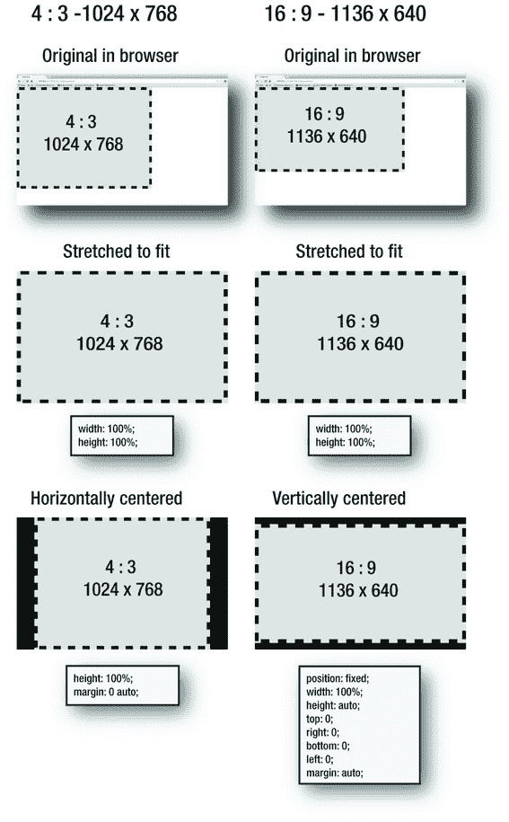

第一章


向上爬！

《使用 HTML5 和 JavaScript 的高级游戏设计》的第一章是一个快节奏、拥挤不堪、令人眼花缭乱的自助餐，包含了酷、有趣、新颖、实用、有时令人愉快的令人难以置信的技术，你可以马上开始在你的游戏项目中使用这些技术。要想让你的开发技能更上一层楼，你需要知道的一切都在本章中:

*   全新的 JavaScript 技巧，包括用 ES6 制作游戏所需的一切
*   使用配置对象
*   JavaScript 的 getters 和 setters
*   承诺
*   使用类和组合从旧对象创建新对象
*   用模块组织您的项目
*   用 XHR 读写 JSON 文件
*   显示全屏游戏
*   分发带有 iFrames 和精简源代码的游戏

你可以把这一章看作是现代游戏开发者的训练营，里面有你开始用 HTML5 和 JavaScript 制作游戏所需要知道的所有基本技能。

您将能够立即将所有这些技术应用到您的游戏项目中，它们是本书其余章节所基于的核心技能。如果你读过 HTML5 和 JavaScript 的*基础游戏设计，这有点像那本书的“秘密最后一章”。但是如果你没有读过那本书，并且你喜欢通过例子快速学习，这一章是对 JavaScript 和 HTML5 的闪电战式介绍，从头开始。*

这一章与本书中的其他章节非常不同，因为它是一种快速入门参考指南。你需要读多少就读多少，顺序不限，然后只要你觉得准备好了就直接跳到第二章。

一些新的 JavaScript 技巧

这本书是使用最新版本的 JavaScript 编写的，称为 ES6 (ECMAScript 6)。如果您是 JavaScript 新手，您会发现这种语言很容易学习，因为它遵循大多数现代编程语言的范例。如果你已经知道 JavaScript，但你是在 2015 年之前学的，那么你会大吃一惊。ES6 几乎就像一种全新的语言。但好消息是，它是比你所知道的版本更好、更简单、更友好的 JavaScript 版本。最重要的是，它很容易学，所以当你读完这一章时，你就能流利地使用它了。

在这一章的第一部分，我将介绍你应该知道的关于语言如何工作的所有重要概念。您将了解 ES6 最重要的新特性，以及以前版本的 JavaScript ES5 的一些有用特性，这些您可能还没有意识到。

 **注意**如果你想在 ES6 中编写代码，但仍能在旧平台上运行，你可以使用像 Babel 或 Traceur 这样的 **transpiler** ，它会在编译时进行转换，在这种情况下是从 ES6 到 ES5。我建议你这样做。使用 ES6 节省的精神开销远远弥补了传输代码所需要的额外工作。

变量:`let`、`const`和`var`T3

使用关键字`let`创建一个变量:

```js
let anyValue = 4;
```

`let`关键字赋予变量**块范围** 。这意味着变量在定义它的花括号之外是看不见的。这里有一个例子:

```js
let say = "hello";
let outer = "An outer variable";

if (say === "hello") {
  let say = "goodbye";

  console.log(say);
  //Displays: "goodbye"

  console.log(outer);
  //Displays: "An outer variable"

  let inner = "An inner variable";
  console.log(inner);
  //Displays: "An inner variable"
}

console.log(say);
//Displays: "hello"

console.log(inner);
//Displays: ReferenceError: inner is not defined
```

在`if`语句外定义的变量可以在`if`语句内看到。但是在`if`语句中定义的任何变量在它之外是看不到的。这就是块作用域。`if`语句的花括号定义了变量可见的块。

在这个例子中，你可以看到有两个变量叫做`say`。因为它们是在不同的块中定义的，所以它们是不同的变量。改变`if`语句内的代码不会改变`if`语句外的代码。

您也可以使用`var`和`const`创建变量:

*   `var`:这给出了变量**的作用范围**T3。这意味着变量在函数内部的任何地方都是可见的，甚至是在创建它的块之外。
*   `const`:这创建了一个不能改变其值的变量。如果你试图改变它的值，你会得到一个错误。如果您的代码依赖于一个不会被意外更改的值，这将很有帮助。`const`变量也有块作用域。

然而，几乎在所有情况下，你都应该使用`let`。它防止你在代码中犯各种各样的小错误，这些小错误有时会导致紧张的调试会话。

变量是您最重要的 JavaScript 构建块，您使用它们和函数来构建程序。

功能

使用函数来运行和定义代码块、执行计算以及返回值。JavaScript 有两类函数:**函数声明** 和**函数表达式** 。

在 JavaScript 中，您可以这样定义一个函数声明:

```js
function saySomething(value) {
  console.log(value);
}
```

函数声明在**编译时** 加载。这意味着你的程序在其他代码运行之前就知道它们了。即使你在程序的末尾定义了一个函数，在程序开始运行之前，函数声明也会被预先加载。这使您可以在定义函数之前调用它，如下例所示:

```js
saySomething("Hello from a function statement");

//Displays: "Hello from a function statement"

function saySomething(value) {
  console.log(value);
}
```

JavaScript 还有**函数表达式**。你用一个**粗箭头**创建它们，就像这样:

```js
let saySomething = (value) => {
  console.log(value)
};
```

`=>`符号代表指向右边的箭头，像这样:。它形象地表示“使用括号中的值在我指向的下一个代码块中做一些工作。”

使用`let`(或`var`)定义函数表达式的方式与定义变量的方式相同。每一个在它的右括号后面还需要一个分号。与函数声明不同，函数表达式必须在使用前定义，如下所示:

```js
let saySomething = (value) => {
  console.log(value)
};

saySomething("Hello from a function statement");
```

这是因为函数表达式是在**运行时**读取的。代码从上到下读取它们的顺序与读取其余代码的顺序相同。如果你试图在定义函数表达式之前调用它，你会得到一个错误。

如果你想写一个返回值的函数，使用一个`return`语句，如下所示:

```js
let square = (x) => {
  return x * x;
};

console.log(square(4));

//Displays: 16
```

为了方便起见，如果您的函数只是一行带有一个参数的代码，您可以省去花括号、参数括号和关键字`return`:

```js
let square = x => x * x;

console.log(square(4));

//Displays: 16
```

这是一种简洁、紧凑、易读的函数编写方式。

 **注意**箭头函数的一个很好的特性是，它们使函数内部的作用域与函数外部的作用域相同。这解决了困扰早期版本 JavaScript 的一个叫做**绑定** 的大问题。简而言之，你不得不解决的一整类怪癖不再是问题。(比如你不再需要用老`var self = this;`的招数了。)在一些极端的情况下，绑定仍然是一个问题，但是当我们遇到这些问题时，我会完整地解释这些问题。

您可以不使用粗箭头来编写函数表达式，如下所示:

```js
let saySomething = function(value) {
  console.log(value)
};
```

这与前面的例子工作方式相同，但有一个重要的区别:函数的作用域是该函数的局部，而不是周围的代码。这意味着“this”的值将是`undefined`。这里有一个例子可以说明这种差异:

```js
let globalScope = () => console.log(this);

globalScope();

//Displays: Window...

let localScope = function(){
  console.log(this);
};

localScope();

//Displays: undefined
```

这种差异很微妙，但很重要。在大多数情况下，我建议您使用粗箭头来创建函数表达式，因为函数内部的代码与函数外部的代码共享相同的范围通常会更方便。但是在一些罕见的情况下，将函数的作用域与周围的作用域隔离开来是很重要的，当我们遇到这些情况时，我会介绍这些情况。

 **注意**如果你正在使用 ES5，你需要通过添加“`use strict`”作为函数的第一行来强制函数表达式使用局部范围。

`var localScope = function(){`
`"use strict";`
`console.log(this);`
`};`

`use strict`语句告诉 JavaScript 编译器使用 ES5 的严格模式，除了其他特性之外，它还将函数锁定在局部范围内。

现在你已经掌握了变量和函数的窍门，让我们看看如何使用数组来存储和操作它们。

对数组越来越着迷

作为游戏设计者，你最常做的事情之一就是循环遍历数组。下面的代码看起来熟悉吗？

```js
let planets = ["jupiter", "venus", "saturn", "mars"];
for (let i = 0; i < planets.length; i++) {
  planet = planets[i];
  console.log(planet);
}
```

它在控制台中显示每个星球的名称:

```js
jupiter
venus
saturn
mars
```

这是一段经典的代码，在 ES6 中得到了很好的更新。因为`i`循环索引计数器是使用`let`定义的，所以它对于`for`循环是局部的。这意味着您可以在任意多的其他循环中重用变量名`i`，并且它们的值不会冲突。

我们亲爱的老循环在 JavaScript 中仍然有它的位置，通常它仍然是这项工作的最佳工具。但是在 ES6(和 ES5)中，你有了一些方便的新方法来循环数组，这有助于使你的代码可读性更好。

 **注意** `for`循环往往会被像 V8 和 SpiderMonkey 这样的 JavaScript 引擎高度优化，因此对于每帧可能循环数千个对象的游戏来说，它们仍然是最安全的选择。在这本书里，我将强调什么时候使用一个新的循环方法是安全的，什么时候你应该用一个`for`循环来保证安全。如果你对你正在使用的平台上不同循环方法之间的相对性能差异感兴趣，请访问`jsperf.com`并运行一些测试用例。

使用`forEach`

ES5 引入了一个名为`forEach`的数组函数，专门用于遍历数组。它使得循环索引计数器的使用成为可选的。它还调用一个**回调函数** 来完成它的工作。(您将在前面看到回调函数是如何工作的。)这意味着如果需要，您可以重用相同的代码来转换其他数组。下面介绍如何使用`forEach`显示四颗行星的名称:

```js
let planets = ["jupiter", "venus", "saturn", "mars"];

planets.forEach(displayElements);

function displayElements(element) {
  console.log(element);
}
```

这样做的结果与我们的第一个例子完全相同:控制台按顺序显示每个行星的名称。

你可以看到`forEach`的参数是名为`displayElements`的函数:

```js
planets.forEach(displayElements);
```

这意味着数组应该将它的四个元素发送给`displayElements`函数，一次一个。`displayElements`是所谓的**回调函数**。这是一个被另一个函数“回调”去做额外工作的函数。就好像`forEach`在说，“嘿！`displayElements`，快来帮我显示这些星球名称！”

`displayElements`函数有一个参数，代表它正在处理的当前元素:

```js
function displayElements(element) {
  console.log(element);
}
```

循环第一次运行时，`element`的值将是`jupiter`。第二次，将是`venus`，以此类推。

数组中有多少元素，循环就运行多少次。你不需要像`i`这样的循环计数器变量来跟踪它。

另一个优点是，如果您愿意，可以在另一个数组中重用`displayElements`函数。下面是如何使用它来显示第二个数组`mountains`的内容:

```js
let planets = ["jupiter", "venus", "saturn", "mars"];
let mountains = ["everest", "k2", "kanchanjunga", "lhotse"];

planets.forEach(displayElements);
mountains.forEach(displayElements);

function displayElements(element) {
  console.log(element);
}
```

这将显示所有的行星和山脉。我们只需要编写一次`displayElements`函数，它可以完美地用于两个数组。

索引计数器变量呢，我们亲爱的老朋友，`i`？我们可以通过在回调函数中使用第二个可选参数来访问它。以下是如何:

```js
let planets = ["jupiter", "venus", "saturn", "mars"];

planets.forEach(displayElements);

function displayElements(element, i) {
  console.log(i + ": " + element);
}
```

结果如下:

```js
0: jupiter
1: venus
2: saturn
3: mars
```

另外，我们将在前面看到的其他数组方法也允许您在回调函数中使用第三个可选参数。它是对数组本身的引用。这里有一个例子:

```js
function displayElements (element, i, array) {
  console.log(array.toString());
}
```

这将显示调用数组，在本例中为:

```js
jupiter, venus, saturn, mars
```

在大多数情况下，您可能只需要使用一次循环，而不需要将`forEach`方法与回调函数分开。在这种情况下，您可以将`forEach`与**匿名回调函数**一起使用，就像这样:

```js
let planets = ["jupiter", "venus", "saturn", "mars"];

planets.forEach((planet) => {
  console.log(planet);
});
```

之所以称之为**匿名**是因为完成这项工作的箭头函数没有名字。应用您刚刚学到的关于格式化 ES6 函数的知识，您可以非常简洁易读地编写整个内容，如下所示:

```js
planets.forEach(planet => console.log(planet));
```

当你使用数组时，这个简单的格式将取代大多数的`for`循环。

使用`for of`循环

作为`forEach`的替代，你可以使用一个`for of`循环。它让您可以轻松地遍历数组的值，就像这样:

```js
for (let planet of planets) {
  console.log(planet);
}

//Displays: "jupiter", "venus", "saturn", "mars"
```

一个`for of`循环可以用来创建一个**数组理解**。这个特性允许您通过动态处理另一个数组来创建一个数组。以下是如何将一系列数字处理成另一个存储这些数字的平方的数组的示例:

```js
let numbers = [1, 2, 3, 4, 5];
let squared = [for (x of numbers) x * x];

console.log(squared);

//Displays: [1, 4, 9, 16, 25]
```

请注意，您不需要使用循环的花括号。数组理解提供了一种方便简洁的语法来编写数学表达式。

遍历对象

JavaScript 有许多方法，使得遍历对象就像遍历数组一样简单。如果你想找到一个对象的所有属性，你可以使用一个叫做`Object.keys()`的方法。它以字符串形式返回所有对象属性的数组。(对象的“键”是它的属性名。)下面是使用方法:

```js
Object.keys(anyObject);
```

这段代码表示一个包含所有`anyObject`的属性名的字符串数组。

 **注意** `Object.keys`将只返回一个对象的**可枚举属性**。可枚举属性就是你可以在对象中看到的任何普通属性。而这些通常是你唯一关心的。但是一个对象也可以有隐藏的属性，这叫做**不可数**。`Object.keys`不会显示它们，如果你需要知道如何使一个属性不可数，你将在本章的后面学习。如果您需要查看无法计数的属性，请使用`Object.getOwnPropertyNames`而不是`Object.keys`

这里有一个如何使用对象键的实际例子。想象你正在制作一个冒险游戏，使用房间里的物品。您的房间对象保持游戏中房间的状态，以及房间包含的内容:

```js
let room = {
  door: "open",
  light: "on",
  contents: ["carpet", "mouse", "katana"]
};
```

您可以看到`room`有三个属性。您可以使用以下语法，以字符串数组的形式查看这些属性:

```js
console.log(Object.keys(room));
```

这显示了以下内容:

```js
["door", "light", "contents"]
```

这很有趣，但还没用。`Object.keys`与`forEach`结合使用时变得非常有用:

```js
Object.keys(room).forEach(key => {
  let value = room[key];
  console.log("key: " + key + ", value: " + value);
});
```

该代码将显示以下内容:

```js
key: door, value: open
key: light, value: on
key: contents, value: carpet,mouse,katana
```

您可以通过`key`访问属性名，通过`value`访问属性值。现在，将你需要的任何游戏逻辑应用到房间、它的状态或它的内容将变得非常容易。

 **注意**记住，如果你需要检查一个对象是否包含一个属性，使用`hasOwnProperty()`，就像这样:

`if(room.hasOwnProperty("light")) { ... }`

如果您愿意，您可以使用一个`for of`循环来做同样的事情:

```js
let roomProperties = Object.keys(room);
for (let key of roomProperties) {
  let value = room[key];
  console.log("key: " + key + ", value: " + value);
}
```

输出与第一个示例完全相同。

但是有另一种方法可以做到这一点！我们可以使用一个很好的老式`for in`循环，它从版本 1 开始就是 JavaScript 的一部分。下面是如何使用它来生成与前面的示例相同的输出:

```js
for(let key in room) {
  let value = room[key];
  console.log("key: " + key + ", value: " + value);
}
```

如果使用`for in`循环，有两件重要的事情需要注意。首先，它不会以任何特定的顺序遍历对象的键。所以如果订单对你很重要，要意识到你不能依赖它。第二，它将遍历同时属于对象和它的**原型**的关键点(参见本章后面的“制作对象”了解更多关于对象原型的信息)。)如果你需要保证只有对象自己的属性被访问，你必须在一个额外的`if`语句中用对象的`hasOwnProperty`方法来测试。

```js
for(let key in room) {
  if (room.hasOwnProperty(key) {
    let value = room[key];
    console.log("key: " + key + ", value: " + value);
  }
}
```

这两个特性都不是问题，这取决于你要遍历的对象和你想要实现的目标。但如果你想稳妥一点的话，`Object.keys`和`forEach`的组合稍微靠谱一点。

仅循环一些数组元素

你可能只想循环遍历一个数组，直到找到你要找的一个元素。当你找到它时，循环应该停止进一步检查。你可以用一个叫做`some`的方法来做这件事。`some`方法将检查数组中的所有元素，直到回调函数返回`true`。`true`一回，就退出。

这里有一个数组列出了五种乐器。

```js
let instruments = ["guitar", "piano", "tabla", "ocarina", "tabla"];
```

你看到`tabla`被列了两次吗？这将有助于说明`some`方法是如何工作的。现在让我们用这个方法来看看它是否能在这个数组中找到`tabla`:

```js
instruments.some(find);

function find(instrument) {
  if (instrument === "tabla") {
    console.log("Tabla found!");
    return true;
  } else {
    console.log("No tabla found...");
    return false;
  }
}
```

运行时，`some`循环遍历数组，当找到第一个 tabla 时退出。它退出是因为函数返回了`true`。下面是这段代码将在控制台中显示的内容:

```js
No tabla found...
No tabla found...
Tabla found!
```

它一得到第一个`true`值就停止，不再继续检查。它找到第一个 tabla 元素，但在找到第二个元素之前退出。这与使用带有`break`语句的`for`循环达到了相同的效果。

您可以将`some`用于匿名回调，就像您可以使用`forEach`一样。另外，`false`条件是可选的。这意味着您可以通过以下方式使所有代码更加简洁:

```js
let instruments = ["guitar", "piano", "tabla", "ocarina", "tabla"];

let found = instruments.some(instrument => {
  if (instrument === "tabla") {
    return true;
  }
});

if (found) {
  console.log("tabla found!");
}
```

或者，你可以写得更简洁:

```js
let found = instruments.some(instrument => instrument === "tabla");
if (found) console.log("tabla found!");
```

如果您想知道数组中的任何元素是否通过了某个测试，那么`some`方法会非常有用。例如，您可以使用它来检查数组中的值是否大于 100:

```js
let numbers = [11, 43, 9, 112, 64, 15];

let tooBig = numbers.some((number) => {
  //Return true if a number is greater than 100
  return number > 100;
});

console.log(tooBig);
```

该代码将在控制台中显示`true`。这是一个更紧凑的版本，可以做同样的事情:

```js
let tooBig = numbers.some(number => number > 100);
```

因为循环只包含一个参数和一个语句，所以可以省去括号和花括号。另外，`return`是隐含的，所以你也可以省略它。

还有一个数组方法，叫做`every`，那是`some`的正逆；当函数返回`false`时，它退出循环。如果你认为放弃一个`false`值更符合你正在测试的逻辑，那么使用`every`而不是`some`。

 **注意**记住，如果你曾经只需要检查一个数组是否包含一个元素，使用`indexOf`，这样:

`if (instruments.indexOf("tabla") !== -1) {//Tabla found!}`

或者你可以使用`findIndex`，这你将在下一节中了解。

查找数组元素

数组的`some`方法实际上是 ES5 的一个特性，所以它成为 JavaScript 的一部分已经有一段时间了。ES6 有一个叫做`find`的新数组方法，它只查找数组中的特定元素。它使用与`some`相同的语法，但是它返回元素的完整值，而不仅仅是`true`或`false`。下面是如何使用`find`:

```js
let instruments = ["guitar", "piano", "tabla", "ocarina", "tabla"];

let found = instruments.find(x => x === "tabla");

console.log(found);

//Displays: tabla
```

就像`some`，`find`方法退出并在第一个匹配条件的元素上返回`true`。如果条件不能满足，`find`返回`undefined`。

如果你需要知道一个元素的数组索引号，使用`findIndex`:

```js
let index = instruments.findIndex(x => x === "tabla");

console.log(index);

//Displays: 2
```

这是两个有用的新方法，可以让使用数组变得更加有趣。但是还有很多！

将旧数组映射到新数组

有时，根据另一个数组中的元素创建一个新数组是很有用的。JavaScript 让你用一个叫做`map`的方法来做到这一点。下面的例子展示了如何使用`map`来创建一个新的、基于现有数组的改进的单词数组。

```js
let words = ["fun", "boring", "exciting"];

let betterWords = words.map(improveGrammar);

function improveGrammar(word) {
  return word + "ish";
}

console.log(betterWords);
```

这将显示以下内容:

```js
funish, boringish, excitingish
```

`map`方法使用`words`数组创建一个名为`betterWords`的新数组，如下所示:

```js
["funish", "boringish", "excitingish"]
```

大幅度提高，我相信你可以看到！`map`方法使用与`some`方法相同的语法，因此您可以使用在上一节中看到的任何语法排列。这里有一个使用`map`的超紧凑方法，可以达到与前面代码相同的效果:

```js
let betterWords = words.map(x => x + "ish");
```

平稳！

使用`map`方法并不是获得这个结果的唯一方法。您可以在数组理解中使用`for of`循环做同样的事情:

```js
let betterWords = [for (word of words) word + "ish"];
```

结果完全一样。区别纯粹是风格上的，所以使用你喜欢的风格。

从数组中过滤元素

如果你想删除数组中的某些元素，使用`filter`方法。例如，您可能有一个数字列表，并希望将所有大于 100 的数字复制到一个新数组中。您可以使用`filter`方法来实现，如下所示:

```js
let numbers = [11, 43, 9, 112, 64, 312, 92];

let bigNumbers = numbers.filter(findBigNumbers);

function findBigNumbers (number) {
  return number > 100;
}

console.log(bigNumbers);
```

现在您将拥有一个名为`bigNumbers`的新数组，如下所示:

```js
[112, 312]
```

下面是做同样事情的 array comprehension 版本:

```js
bigNumbers = [for (number of numbers) if (number > 100) number];
```

`filter`方法还有另一个非常有用的用途——它可以很容易地从数组中删除元素。这类似于使用 array `splice`方法，但是它会产生更简单的代码。

这样做的技巧是将新的过滤后的数组*赋回原始数组*。下一个例子将使这一点更加清楚。以下是如何从数组中删除所有大于 100 的数字:

```js
let numbers = [11, 43, 9, 112, 64, 312, 92];

numbers = numbers.filter(x => x < 100);

console.log(numbers);
```

下面是生成的`numbers`数组。所有大于 100 的数字都已删除:

```js
11,43,9,64,92
```

您是否注意到过滤后的`numbers`数组是如何被复制回自身的？

```js
numbers = numbers.filter(x => x < 100);
```

鬼鬼祟祟！

这是数组理解版本:

```js
numbers = [for (number of numbers) if (number < 100) number];
```

与使用`for`循环和`splice`从数组中删除元素相比，使用这些技术有什么优势？您不必向后循环或手动将循环计数器变量减 1 来补偿删除的元素。但是不用担心；用老式的`for`循环和`splice`从数组中移除元素的技术仍然有它的位置，当你在[第 7 章](07.html)中学习碰撞检测时你会看到。

将数组元素缩减为单个值

`reduce`方法允许您获取数组中的所有元素，并将它们转换成一个值。例如，您可能在一个数组中有一些数字，并想知道它们的总数是多少。您可以这样做:

```js
let numbers = [73, 19, 2, 144, 43, 7];

let total = numbers.reduce(addNumbersTogether);

function addNumbersTogether(a, b) {
  return a + b;
}

console.log(total);
```

这个显示器

```js
288
```

以下是精简版:

```js
total = numbers.reduce((a, b) => a + b);
```

`reduce`方法的工作原理是遍历每个元素，并将其添加到右边的相邻元素中。在这个例子中，`a`是第一个元素，`b`是下一个元素。它对数组中的所有元素继续这样做，直到将所有元素都简化为一个值。

`reduce`有第二个可选参数:开始的初始值。在我们刚刚看到的例子中，如何从初始值 100 开始:

```js
total = numbers.reduce((a, b) => a + b, 100);
```

`total`现在将是 388。

`reduce`有一些令人惊讶的用途。你有没有过这样的 2D 阵列，你希望你能把它展平成 1D 阵列？这很容易用`reduce`来完成。以下是如何:

```js
let numbers2D = [[73, 19],[2, 144],[43, 7]];

let numbers1D = numbers2D.reduce(flattenArray);

function flattenArray(a, b) {
  return a.concat(b);
}

console.log(numbers1D);
```

最终得到的`numbers1D`数组如下所示:

```js
[73, 19, 2, 144, 43, 7]
```

`reduce`从右到左循环遍历数组。如果你需要从末尾开始遍历数组，使用`reduce`的姊妹方法`reduceRight`。

现在你已经有了很多使用数组元素的新方法。但是如果你在一个数组中有一些值，你想快速地分配给变量，该怎么办呢？

用析构函数从数组中生成变量

假设你有三个变量，想给它们初值。下面是简单的方法:

```js
let age = 16,
    height = 170,
    grade = 10;
```

一个叫做**析构**的特性让你以不同的方式来做这件事。析构将数组的值解包，并自动将其复制到变量中。以下是如何:

```js
let statistics = [16, 170, 10];
let [age, height, grade] = statistics;
```

现在有三个新变量:`age`的值是 16，`height`的值是 170，`grade`的值是 10。您可以使用**模板字符串**来显示这些，如下所示:

```js
console.log(`Age: ${age} Height: ${height} Grade: ${grade}`);
```

这个显示器

```js
Age: 16 Height: 170 Grade: 10
```

模板字符串是将文本和变量结合起来的一种方式。它取代了使用加号字符连接字符串的旧 JavaScript 方式。要创建一个模板字符串，用**反勾字符** 将字符串括起来，并在花括号中插入一个变量，变量前面有一个美元符号。下面是要使用的格式:

```js
`This is a template string that displays a ${variableName}`
```

 **注意**小心；反勾号字符不是单引号！您可能会发现它在键盘上与波浪号字符共享同一个键:~

模板字符串可以跨越多行，如果你愿意，也可以用表达式代替变量。

析构也可以用来非常有效地交换两个变量的值。以下是如何:

```js
let x = 120,
    y = 12;

//Swap the values:

[x, y] = [y, x];

console.log(`x: ${x} y: ${y}`);

//Displays: x: 12 y: 120
```

在以前版本的 JavaScript 中，如果没有第三个临时变量，你就无法做到这一点。

析构也适用于对象。下面是如何将对象的属性值捕获为单个变量。

```js
let position = {x: 120, y: 12};
let {x, y} = position;
```

您现在有两个新变量，称为`x`和`y`。`x`的值是 120，`y`的值是 12。你可以用`console.log`来测试这个:

```js
console.log(`X: ${x}`);
console.log(`Y: ${y}`);
```

这个显示器

```js
X: 120
Y: 12
```

您可以看到，析构是从数组和对象中提取值的一种便捷方式。ES6 也有一些使用函数的便利特性。

函数参数

ES6 为您提供了三种新的灵活的函数参数赋值方式。您可以在参数中给函数**默认的**值，如下所示:

```js
function display(name = "rose", color = "red") {
  console.log(`Name: ${name}, Color: ${color}`);
}

display();
//Displays: Name: rose, Color: red

display("balloon");
//Displays: Name: balloon, Color: red

display("computer", "beige");
//Displays: Name: computer, Color: beige
```

或者，您可以向函数发送任意数量的参数，然后告诉函数将这些参数作为数组读取。只需在函数的一个参数前添加三个点`...`(称为**扩展运算符**)。该参数将包含数组形式的参数。用一个工作示例来理解这一点是最容易的:

```js
function displayColors(...colorArray) {
  for (let color of colorArray) console.log(`Color: ${color}`);
}

displayColors("red", "green", "blue")
```

这个显示器

```js
Color: red
Color: green
Color: blue
```

你也可以颠倒这个过程。您可以使用数组作为参数，并告诉函数将数组值转换为单独的参数:

```js
function displayNumbers(x, y, z) {
  console.log(`X: ${x}, Y: ${y} Z: ${z}`);
}

displayNumbers(...[12, 30, 10]);

//Displays: X: 12, Y: 30 Z: 10
```

这三种将信息放入函数的方法给了你很大的灵活性，你可以用几十种不同的方法将它们结合起来，以摆脱一些棘手的问题。但是让我们来看看另一种更低技术含量的初始化函数的方法，这可能是你更喜欢的。

用配置对象初始化功能

在 JavaScript 中，可以用任何值初始化函数:数字、字符串、其他函数或对象文字。如果用单个对象文字初始化函数，可以使用对象的属性值来配置函数。这被称为**配置对象**，尽管它不是 JavaScript 的新特性，但它是一种广泛使用的初始化函数的方式，了解它很有用。

让我们暂时回到基本问题上来。下面是一个简单函数的例子，它显示三个参数:精灵的名称、它的 *x* 位置和它的 *y* 位置。

```js
display("spaceship", 312, 112);

function display(name, x, y) {
  console.log(`name: ${name}, x: ${x}, y: ${y}`);
}
```

下面是它显示的内容:

```js
name: spaceship, x: 312, y: 112
```

没什么特别的！您可能已经编写了数百个这样函数。它工作得很好，但是有一个小问题。不是技术问题，是人为问题:**可读性**。当你在一个大项目中工作时，可能有几十个类似的函数，你可能会完全忘记这个函数应该做什么。

```js
display("spaceship", 312, 112);
```

啊？什么是“宇宙飞船”，那两个数字指的是什么？光看函数调用是没办法分辨的。你必须找到函数定义来提醒自己那些参数指的是什么，以及你必须包含它们的顺序。

您可以使用一种非常有用的技术来解决这两个问题，这种技术叫做函数**配置对象**。*没有向一个函数发送多个参数，而是只发送一个对象*。这个对象可以包含初始化函数所需的任意多的属性。让我们用一个配置对象重写前面的代码，这样您就可以看到它是如何工作的。

在函数的参数中，提供一个对象:

```js
displayClearly({name: "spaceship", x: 312, y: 112});
```

你看到物体周围的花括号了吗？对象有三个属性:`name`、`x`和`y`。这些属性的值是您希望发送给函数定义以完成其工作的值。这使得代码突然变得更加易读，因为这些值指的是什么很清楚。

然后，您需要创建一个接受单个对象作为参数的函数。本例中的参数名称是`config`，但是您可以给它取任何您喜欢的名称:

```js
function displayClearly(config) {
  console.log(`name: ${config.name}, x: ${config.x}, y: ${config.y}`);
}
```

现在，函数不再使用参数值，而是使用`config`对象的属性。结果与前面的例子完全相同，但是代码可读性更好。此外，您不再局限于以任何严格的顺序向函数提供三个参数。您可以使用任意多或任意少的属性。如果您遗漏了任何它可能依赖的值，您也可以设置该函数来分配默认值。

您将在本书中看到许多如何使用配置对象的例子。到目前为止，本章我们已经介绍了变量、数组和函数，所以现在让我们仔细看看 JavaScript 的对象文字。

Getters 和 setter

JavaScript 对象文字具有称为**getter**和**setter**的特性，当对象的属性值改变时，这些特性可以让您很好地控制会发生什么。一个简单的例子将告诉你它们是如何工作的。

假设您有一个 JavaScript cookie jar。你希望能够从罐子里取出饼干，并在罐子空了的时候把它装满。为此，您可以创建一个简单的 cookie jar 对象文字:

```js
let jar = {
  cookies: 10
};
```

现在，您可以使用以下代码来更改 jar 中 cookies 的数量:

```js
jar.cookies = 8;
jar.cookies = 2;
```

但是有一个小问题。罐子不应该能够容纳超过十个或少于零个的饼干。在我们当前的模型中，没有什么可以阻止您用 100 个 cookie 填充它，或者分配一个负数的 cookie:

```js
jar.cookies = 100;
jar.cookies = -50;
```

我们需要能够将 cookies 的范围保持在 0 到 10 之间。我们将分两步解决这个问题。

第一步是使用*中介方法*、**调用**和**设置**来改变 cookies 的数量。它们是这样工作的:

```js
let jar = {
  numberOfCookies: 10,
  get cookies() {
    return this.numberOfCookies;
  },
  set cookies(value) {
    this.numberOfCookies = value;
  }
};
```

 **注意**注意，与普通的对象属性不同，对象方法不使用冒号(:)来赋值。

我们现在有了一个名为`cookies`的`get`方法和一个名为`cookies`的`set`方法。如果你想知道罐子里有多少饼干，使用`get`方法，就像这样:

```js
jar.cookies;
```

这将给出`numberOfCookies`的值，即 10。

看起来您正在读取`jar`对象上一个名为`cookies`的属性，但是您没有。你实际上是在调用名为`cookies`的`get`方法。这是一个外观和行为都像属性的方法。

你可以像这样改变罐子里饼干的数量:

```js
jar.cookies = 7;
```

同样，看起来你在改变一个属性值，但是，同样，你没有。你调用的`set`方法叫做`cookies` 。

到目前为止，这很有趣，但是这个例子似乎没什么用。该技术变得有用的地方在于，我们现在有了一种方便的方法来拦截读取或更改属性值的请求。这意味着我们可以在返回或更改值之前检查请求是否有效。

下一个例子将阐明这一点。请记住，我们的罐子容纳不下 10 块以上的饼干。我们也不应该被允许分配负数量的 cookies。现在我们已经设置了`get`和`set`方法，这些约束很容易实现。这里突出显示了新代码:

```js
let jar = {
  numberOfCookies: 10,
  get cookies() {
    return this.numberOfCookies;
  },
  set cookies(value) {
    if (value >= 0 && value <= 10) {
      this.numberOfCookies = value;
    } else {
      throw new Error("Please use a number between 0 and 10");
    }
  }
};
```

现在，如果您将`cookies`设置为 0 到 10 之间的任何数字，它都会正常工作:

```js
jar.cookies = 3;
```

但是，如果您指定一个小于零或大于 10 的数字，就像这两个语句中的任何一个一样:

```js
jar.cookies = 11;
jar.cookies = -2;
```

您将在控制台中看到以下错误:

```js
Please use a number between 0 and 10
```

正如您在前面的代码中看到的，在将值分配给`numberOfCookies`之前，`set`方法会验证该值。

Getters 和 setters 是使用方法的一种非常方便的方式，这些方法的外观和行为就像普通属性一样。它们可以给你的代码带来强大的表现力。但是，请谨慎使用它们！在这个例子中，它们有一个集中的、有限的用途:它们只以一种可预测的方式影响一个属性`numberOfCookies`。但是没有什么可以阻止您创建一个 getter 或 setter，以奇特的方式同时改变一个对象的多个属性。如果`jar.cookies`不只是换了`numberOfCookies`，还更新了一个分数，换了一些雪碧颜色，还在网上给你订了披萨，会怎么样？如果您不小心使用 getters 和 setters，它们会产生复杂的效果，波及到您的代码，并导致不可预测的、可能很难跟踪的错误。

使用`Object.defineProperty`和防止改变属性

您可能已经注意到上一个例子中的一个小问题。我们可以通过使用 getter 和 setter 来限制 jar 中 cookies 的数量，但是如何阻止我们像这样简单地直接更改`numberOfCookies`?

```js
jar.numberOfCookies = 100;
```

绝对没有！如果你正在编写一个复杂的游戏，在这个游戏中，给一个像这样的属性分配一个无效的数字可能会导致你的游戏冻结或崩溃，你可能需要确保这种情况不会发生。ES5 有一个叫做`Object.defineProperty`的方法，它防止属性值像这样被直接改变。

使用`Object.defineProperty`可以创建两种属性。第一个称为**数据描述符**。这只是一个普通的属性，你可以把它设置成可写或不可写。下面是如何使用它在我们的`jar`对象中创建一个名为`cookies`的不可写属性:

```js
//1\. Create a jar object
let jar = {};

//2\. Use Object.defineProperty to create a property called
//cookies in the jar object. Set its value and other properties
//that determine how it can be viewed or changed

Object.defineProperty(jar, "cookies", {
  value: 10,
  writeable: false,
  enumerable: true,
  configurable: true
});
```

这将在`jar`对象中创建一个`cookies`属性。(您看到它是如何使用配置对象做到这一点的吗？)您可以这样访问它:

```js
jar.cookies
```

它的`value`是 10。但是，因为它的`writeable`属性被设置为`false`，所以您不能更改它。如果您尝试更改它，您会得到一条错误消息:

```js
jar.cookies = 120;
Uncaught TypeError: Cannot assign to read only property 'cookies' of #<Object>
```

`jar.cookies`还有另外两个属性:`enumerable`和`configurable`。如果`enumerable`是`true`，这意味着如果您使用`Object.keys`来获取 jar 属性的数组，那么`cookies`属性将会出现。如果`configurable`是`true`，说明你以后可以更改所有这些属性；他们不会被永久封锁。将`configurable`设置为`true`还可以让你从对象中删除属性，如果你认为有必要的话。`writeable`、`enumerable`和`configurable`属性都默认为`false`，除非您明确将其设置为`true`。

这个能力真的很强大。如果你的游戏依赖于一个不应该被改变、删除甚至访问的常量值，你现在有办法确保这一点。

`Object.defineProperty`允许您创建另一种属性，称为**访问器描述符** 。这是一个使用 getter 和 setter 来更改其值的属性。下面是如何在`jar`对象中创建一个`cookies`属性，其值可以更改:

```js
//1\. Create a jar object
let jar = {};

//2\. Use Object.defineProperty to create a property called
//cookies in the jar object. Create a getter and setter so
//that its value can be changed

Object.defineProperty(jar, "cookies", {
  get() {
    return this.value;
  },
  set(newValue) {
    this.value = newValue;
  },
  enumerable: true,
  configurable: true
});

//3\. Give the new property an initial value
jar.cookies = 10;
```

现在,`jar`有了一个我们可以更改的`cookies`属性。这是一个简单的 getter 和 setter，可以读取和写入你给它的任何值。为了使它更有用，让我们将您可以赋予它的值限制在 0 到 10 之间。以下是如何:

```js
Object.defineProperty(jar, "cookies", {
  get() {
    return this.value;
  },
  set(newValue) {
    if (newValue >= 0 && newValue <= 10) {
      this.value = newValue;
    } else {
      throw new Error("Please use a number between 0 and 10");
    }
  },
  enumerable: true,
  configurable: true
});
```

您现在不能分配小于 0 或大于 10 的数字。如果您尝试以下方法:

```js
jar.cookies = 25;
```

您将收到以下错误消息:

```js
Please use a number between 0 and 10
```

使用`Object.defineProperty`创建这样的 getter 和 setter 的好处在于，我们只有一个属性可以访问和更改:`jar.cookies`。试图改变`jar.numberOfCookies`是不可能绕过限制的——那个属性不存在。

您可以使用一个叫做`Object.defineProperties`的相关方法在一个对象上同时定义许多属性。这里有一个具有两个属性的`jar`对象:`cookies`和`lid`:

```js
var jar = {};
Object.defineProperties(jar, {
  "cookies": {
    value: 10,
    writable: true,
    enumerable: true,
    configurable: true
  },
  "lid": {
    value: "closed",
    writable: false,
    enumerable: true,
    configurable: true
  }
});
```

只需根据您的需要对多个属性采用这种格式。

关于`Object.defineProperty`，还有两件事你应该知道:

*   您不能将数据描述符样式(第一个示例)与访问器描述符样式(第二个示例)混合使用。用`Object.defineProperty`创建的属性必须是其中之一。
*   您可以随时使用`Object.defineProperty`重新定义现有对象的属性。`Object.defineProperty`是 JavaScript 的一个相当高级的特性，您可能很少在日常游戏开发中使用。然而，如果你正在构建一个 JavaScript 框架或工具集，比如游戏引擎，它是必不可少的，你会在本书的许多例子中看到它的使用。

对象文字是 JavaScript 程序中最重要的构件之一。但是在我们继续深入之前，让我们后退一步，更深入地了解一下对象文字是如何工作的。

创建对象

尽管看起来很简单，JavaScript 对象隐藏着一些令人惊讶的复杂性。在这一部分，你将会学到一些新的有趣的东西，这些东西将会帮助你在游戏中更好地使用它们。我们将进行一次从对象到函数闭包的大旅行，并以对类的介绍结束。

但首先，让我们回到基础。关于物体，我们已经知道了什么？

在 JavaScript 中，你可以像下面这样创建一个对象:

```js
let bird = {
  legs: 2,
  eyes: 2,
  speak() {
    console.log("Chirp!");
  }
};
```

 **注意**如果您使用过以前版本的 JavaScript，请注意 ES6 为您提供了一种简化的方式来编写对象方法。您不再需要冒号和`function`关键字。

然后使用点符号来访问对象的属性和方法，如下所示:

```js
bird.eyes
```

这等于 2。

下面是让小鸟说话的方法:

```js
bird.speak();
```

这将显示

```js
Chirp!
```

如果您决定向 bird 添加一个新属性，您可以在任何时候使用以下语法来完成此操作:

```js
bird.canFly = true;
```

这只鸟现在有了一个新的`canFly`属性，它被动态地添加到这个属性中。

您还可以使用数组文字符号来访问或更改对象的属性，如下所示:

```js
bird["eyes"]
```

这个符号和使用`bird.eyes`是一样的，它给你相同的值:2。数组文字符号强调了这样一个事实，即对象实际上只是使用字符串而不是索引号来访问元素的数组。(这种类型的数组被称为**关联**。)可以存储在数组中的任何信息，也可以存储在对象中，方便的是可以用名称访问每一位信息。

如果您想通过使用函数或内部循环在对象上创建属性，请使用数组文字表示法。例如，这里有一个函数可以让您在名为`wings`的`bird`对象上添加一个新属性:

```js
makeNewProperty(bird, "wings", 2);

function makeNewProperty(object, propertyName, value) {
  object[propertyName] = value;
}
```

`bird`现在有一个值为 2 的`wings`属性，您可以像这样访问或更改它:

```js
bird.wings
```

您将很快看到我们将如何使用这个特性作为构建复杂对象的基础。

如果您已经创建了一个喜欢的对象，您可以使用它来制作相似的相关对象。让我们看看下一步该怎么做。

从其他对象制作对象

创建一个通用对象作为模板，然后基于该模板创建更多相关对象，这通常非常有用。这使您可以将默认属性分配给模板，并且从该模板创建的所有对象都可以使用这些属性。在 JavaScript 中，有两种重要的方法可以将对象创建为模板:

*   **组合:**您可以通过组合其他对象的属性来创建新对象。
*   **类:**这些是返回新的定制对象的函数。

 **注意**你也可以使用**纯原型继承**和`Object.create`创建新对象。我建议你不要使用这个功能，除非你真的很小心你在做什么。问题是，通常很难知道哪些属性属于对象，哪些属性属于其原型。关于使用`Object.create` 制作对象的详细工作示例和一些需要小心的陷阱，请参见本章的源文件。

先说作文吧！

构图

那么构图是如何工作的呢？只需将一个对象包装在函数中，并让函数返回该对象。放轻松！

这里有一个简单的例子。假设你想创造不同的动物，比如猫、鸟和老鼠。这些动物都有相似的特性:腿、眼睛和发声能力。所以从一个一般的动物对象作为模板开始，然后使用该模板作为基础来创建特定的动物是有意义的。

这里告诉你如何用构图来做到这一点。创建一个名为`animal`的函数。`animal`函数返回一个对象，该对象包含许多不同种类的动物可以使用的属性。

```js
function animal() {
  return {
    legs: 4,
    eyes: 2,
    say: "Huh?",
    speak () {
      console.log(this.say);
    }
  };
}
```

你现在可以调用`animal`来制作特定的动物。下面是如何用它来做一只猫:

```js
var cat = animal();
```

`cat`对象现在拥有了`animal`返回的对象的所有属性和方法。你可以让猫说话来测试这一点:

```js
cat.speak();
```

这个显示器

```js
Huh?
```

没错，但是猫一般不会这么说。让我们自定义`cat`的`say`属性，然后再次调用`speak`方法:

```js
cat.say = "Meow!";
cat.speak();
```

以下是您将在控制台中看到的内容:

```js
Meow!
```

有效！我们定制了`say`属性，但是我们使用了原始对象现有的`speak`方法:

```js
speak() {
  console.log(this.say);
}
```

如果你正在制作许多具有相似特征的物体，比如动物，这真的很有用。这意味着您不必为您创建的每个新对象一遍又一遍地创建相同的属性。您只需要创建一个模板对象，并使用其内置的默认属性。

例如，下面是制作一只鸟并定制它是多么容易。

```js
let bird = animal();
bird.say = "Chirp!";
bird.speak();
```

这个显示器

```js
Chirp!
```

`bird`拥有与原始模板对象相同的`speak`方法，所以它可以使用那个`speak`方法，而不必从头开始创建自己的方法。然而，这只鸟自己的`say`属性已经被定制。

通过使用一个函数返回一个对象，无论何时调用这个函数，我们都在创建一个全新的对象。我们还利用了一个强大的 JavaScript 特性，叫做**函数闭包**，它有各种各样有用的和意想不到的好处。在下一节中，您将确切地了解什么是闭包，以及它为什么有用。

理解关闭

让我们来看一个稍微复杂一点的例子，在这个例子中，我们将使用一系列随机单词让动物说话。这将展示如何在创建每个新对象之前运行一些初始化任务，并帮助您理解什么是函数闭包。

在下一个例子中，我们将让我们的动物对象说出一个随机的单词。选择随机数在游戏中是如此常见的任务，以至于使用一个助手函数来完成它非常方便。这里有一个名为`random`的有用函数，它将返回最小和最大范围内的随机整数:

```js
function random(min, max) {
  return Math.floor(Math.random() * (max - min + 1)) + min;
}
```

要使用它，只需用您希望它从中选择的最小和最大随机值来调用函数。下面是如何创建一个介于 1 和 10 之间的随机数:

```js
random(1, 10)
```

现在让我们使用这个函数创建一个动物，当它的`speak`方法被调用时，它会随机说出一个单词:

```js
function animal() {

  //Declare the variables we'll use in this function
  let newObject, words;

  //A helper function to return a random integer within a minimum and maximum range
  function random(min, max) {
    return Math.floor(Math.random() * (max - min + 1)) + min;
  }

  //The animal's vocabulary
  words = ["Food!", "Sleep!", "Video games!"];

  //A `speak` function that chooses random words
  function speak() {
    let say = words[random(0, 2)];
    console.log(say);
  }

  //Create a `newObject` and add the `speak` function to it
  newObject= {};
  newObject.speak = speak;

  //Return the `newObject`
  return newObject;
}
```

现在让我们用这段代码创建一个动物并让它说话:

```js
let cat = animal();
cat.speak();
```

这随机显示“食物！”，“睡吧！”或者“电子游戏！”完美的人生！

这里有一些真正有趣的事情正在发生。`cat`对象只有一个属性:`speak`。这是因为当`newObject`对象被创建时，唯一附加到它的属性是`speak`函数:

```js
newObject = {};
newObject.speak = speak;
return newObject;
```

但是每次调用`speak`方法时，它都会在`animal`函数中悄悄地使用另外两个东西:

```js
words
random
```

`cat`对象不能访问`words`数组或`random`函数，也不能改变它们。它只知道自己的`speak`方法。speak 方法是 **public** ，其他所有隐藏变量和函数都是 **private** 。

代码以这种方式工作是因为 JavaScript 函数的特性叫做**闭包**。这意味着您可以使用函数来创建复杂的对象，并有选择地决定哪些功能应该是可公开访问的。

这种编写 JavaScript 代码的一般风格有时被称为**模块模式** 。你现在开始理解作文了吗？

配置对象

在创建对象时，您可能希望用自定义属性或值来初始化对象。可以通过用配置对象初始化`animal`函数来实现。然后，在返回新对象之前，将配置对象中的所有属性复制到新对象中。返回的对象将包含模板的所有默认属性，以及您在配置对象中设置的任何属性或值。

这就是我们的想法，但是用一个工作示例来理解就容易多了。假设我们想要制作一只猫，并将其`say`属性设置为“喵！”我们还想给它一个名为`fur`的新自定义属性。当您调用`animal`时，添加这些属性作为配置对象:

```js
let cat = animal({
  say: "Meow",
  fur: "black"
});
```

然后，`animal`函数将`config`对象作为参数。它创建了`newObject`模板，然后将`config`对象的属性复制到其上:

```js
function animal(config) {

    //Create the `newObject` template
    var newObject = {
      legs: 4,
      eyes: 2,
      say: "Huh?",
      speak() {
        console.log(this.say);
      }
    };

    //Copy the config object's properties onto the `newObject`.
    //They will override the default properties
    Object.assign(newObject, config);

    //Return the `newObject`
    return newObject;
  }
```

`config`对象包含我们希望新对象拥有的所有属性名和值。创建了`newObject`之后，代码使用`Object.assign`将`config`对象的所有属性复制到`newObject`中:

```js
  Object.assign(newObject, config);
```

记住`cat`的`config`对象包含两个属性:`fur`和`say. fur`作为新属性添加到`newObject`中，`say`替换`newObject`自身的`say`属性。

如果我们让猫说话，现在会发生什么？

```js
cat.speak();
```

控制台显示:

```js
Meow!
```

“喵！”是我们在`config`对象中提供的自定义`say`属性。我们可以在`Object.keys()`的帮助下确认猫的所有属性，就像这样:

```js
console.log(Object.keys(cat))
```

这个显示器

```js
["legs", "eyes", "say", "speak", "fur"]
```

您可以看到它包括所有默认属性、定制的`say`属性和猫的唯一`fur`属性。

我们实际上所做的是将两个对象`config`和`newObject`组合成一个新的对象:`cat`。我们可以把这个想法更进一步。

混合和匹配对象

当你开始掌握像这样组成对象的窍门时，你很快就会意识到你可以通过组合其他对象的属性来创建新的对象。在下一个例子中，让我们使用`Object.assign`通过结合机器人和人类来创造一个电子人。你不是一直想这么做吗？

首先，让我们创建两个返回机器人和人类对象的函数:

```js
function robot() {
  return {
    skill: "vaporizing death ray"
  };
}

function human() {
  return {
    hobby: "bake cookies"
  };
}
```

接下来，我们将创建一个`cyborg`函数，将这两个对象合并成一个新对象:

```js
function cyborg() {

  //Make a `newObject` and add the robot's and human's properties to it
  let newObject = {};
  Object.assign(newObject, robot());
  Object.assign(newObject, human());

  //Create a `speak` function
  //`this` will refer to whatever object this function is attached to
  function speak() {
    console.log("I like to " + this.hobby + " using a " + this.skill);
  }

  //Attach the `speak` function to the `newObject`
  //(Adding the function like this ensures that `this` points to `newObject`)
  newObject.speak = speak;

  //Return the `newObject`
  return newObject;
}
```

现在让我们创造一个机器人，让它说话:

```js
let zxlorb = cyborg();
zxlorb.speak();
```

它是这样说的:

```js
I like to bake cookies using a vaporizing death ray
```

迷人！记得邀请我参加聚会。

你可以看到`newObject`包含了机器人的`skill`和人类的`hobby`。当它说话时，它同时使用这两个词:

```js
function speak() {
  console.log("I like to " + this.hobby + " using a " + this.skill);
}
```

标识符`this`将引用该函数所附加的任何对象。下一行将其连接到`newObject`:

```js
newObject.speak = speak;
```

这意味着函数中的`this.hobby`和`this.skill`将被解释为`newObject.hobby`和`newObject.skill`。

这种从其他对象合成新对象的通用技术有时被称为**混合模式**。它有许多变种。

现在你已经知道使用一个函数来创建和返回一个对象，让我们来看一个最常见和最有用的方法。

类别

JavaScript 的一个特点是函数也是对象。为了清楚地理解这是如何工作的以及它为什么重要，让我们从一个返回对象的简单函数开始:

```js
function animal() {
  let newObject = {};
  newObject.eyes = 2;
  newObject.feet = 4;
  return newObject;
}

let cat = animal();

console.log(cat.eyes);
//Displays: 2
```

这应该看起来很熟悉，因为它与我们在过去几页中用来创建对象的模式完全相同。

现在让我们改变这一点，使函数作为一个对象返回自己。为此，删除`newObject`，去掉`return`语句，并将对象属性附加到`this`:

```js
function Animal() {
  this.eyes = 2;
  this.feet = 4;
}
```

`this`指“本功能对象”还要注意`Animal`中的 A 是大写的。这是一个命名约定，它告诉您函数将自身作为一个对象返回。

您现在可以使用`new`关键字来创建以`Animal`为原型的新对象。以下是如何:

```js
let bird = new Animal();

console.log(bird.eyes);
//Displays: 2

bird.legs = 2;

console.log(bird.legs);
//Displays: 2
```

关键字`new`触发函数将自身作为对象返回。

如果您想给`Animal`一个方法，将该方法附加到一个名为`prototype`的特殊属性，如下所示:

```js
Animal.prototype.speak = () => {
  console.log("Huh?");
};
```

任何由`Animal`生成的对象现在都可以使用`speak`方法，语法如下:

```js
bird.speak();
//Displays: "Huh?"
```

创建这样的对象非常有用，但也有点笨拙。为了使整个过程更加简化，您可以使用 JavaScript ES6 **类**。类只是一个将自身作为对象返回的函数，但是包含了一大堆额外的便利。理解一个类如何工作的最好方法是看它是如何工作的。这里有一个名为`Animal`的类，它只是做你认为它应该做的事情:

```js
class Animal {
  constructor() {
    this.legs = 4;
    this.eyes = 2;
    this.say = "Huh?"
  }
  speak() {
    console.log(this.say);
  }
}
```

创建一个`Animal`类的新实例，如下所示:

```js
let cat = new Animal();
```

你现在有了一个新的`cat`对象，它的工作方式就像本章前面所有的猫一样。您可以像处理任何其他对象一样使用、更改或添加方法和属性。

你可以看到`Animal`类有一个特殊的方法叫做`constructor`。每当你从类中创建新对象时，你放在`constructor`方法中的任何代码都会自动运行。您可以向它传递您的新对象初始化自己可能需要的任何自定义参数。下面是一个简化的`Animal`类，它允许您在创建新对象时自定义`legs`属性:

```js
class Animal {
  constructor(legs) {
    this.legs = legs;
  }
}

let bird = new Animal(2);

console.log(bird.legs);
//Displays: 2
```

`T`他`bird`将`2`作为该类的参数传递，该值由该类的`constructor`方法复制到`legs`属性中。

还可以用配置对象初始化类。这非常方便，因为您可以一次设置许多自定义属性。下面是如何使用配置对象来创建鼠标。首先，设置`Animal`类接受一个名为`config`的对象作为构造函数的参数:

```js
class Animal {
  constructor(config) {

    //Set the default properties
    this.legs = 4;
    this.eyes = 2;
    this.say = "Huh?"

    //Use the `config` object's properties
    Object.assign(this, config);
  }
  speak() {
    console.log(this.say);
  }
}
```

当构造函数运行时，它首先设置类的默认属性，然后使用`Object.assign`添加`config`对象的属性。如果`config`对象的属性与类的属性相同，那么将使用`config`属性值。如果`config`对象包含新的属性，它们将被添加到该类返回的对象中。

接下来，使用`Animal`类创建一个新对象，如下所示:

```js
let mouse = new Animal({
  say: "Squeak!",
  tail: "curly"
});
```

请注意，该参数是一个具有两个属性的对象:`say`和`tail`。`mouse`对象正在定制`say`属性并添加一个名为`tail`的新属性。它不会改变`eyes`或`legs`，所以它们保持与`Animal`类中的默认属性相同。

为了确认这是您所期望的工作方式，让鼠标说点什么并显示它的属性:

```js
mouse.speak();
//Displays: Squeak!

console.log(Object.keys(mouse));
//Displays: ["legs", "eyes", "say", "tail"]
```

多亏了类，你现在有了一个强大、简单、灵活的方法来创建新的对象。

 **注意**记住，只要把一个类想象成一个返回对象的特殊函数。这意味着您还可以使用 mixin 模式使用一个类来组合对象，并使用闭包来隐藏您不希望程序的其他部分访问的内部变量。

遗产

类的一个方便的特性是它们使得建立一个**继承**模式变得容易。继承是一种建立具有一般属性的父类，然后使用该父类创建实现更多特定功能的子类的方法。如果您明智地使用继承，您可以用最少的代码获得复杂的结果。

要建立一个基本的继承链，首先创建一个通用类，它的属性和方法可以应用于许多不同类型的同类对象。这里有一个通用的`Monster`类，它有一些通用的类似怪物的属性:

```js
class Monster {
  constructor(hitPoints, scariness) {
    this.name = "Monster";
    this.hitPoints = hitPoints;
    this.scariness = scariness;
  }
  speak() {
    console.log(
      `I'm a ${this.scariness}
       scary ${this.name}
       with ${this.hitPoints} hit points`
    );
  }
  attack(skill) {
    console.log(`The ${this.name} attacks with ${skill}!`);
  }
}
```

这个类被称为**父**或**超级**类。你现在可以基于这个类通过**扩展**制造一个特定的怪物。这里有一个`Dragon`类，即`extends`中的`Monster`类:

```js
class Dragon extends Monster {
  constructor(hitPoints, scariness, weapon) {

    //call the parent class's constructor with `super`
    super(hitPoints, scariness);
    this.name = "Dragon";
    this.weapon = weapon;
  }
  breatheFire () {
    //Call the parent class's `attack` method
    super.attack(`flaming ${this.weapon}`);
  }
}
```

这个`Dragon`类是`Monster`类的**子**。`Dragon`继承了`Monster`的所有属性，但也包括自己定制的属性。它可以用关键字`super`调用`Monster`类上的方法。现在让我们创建一个新的`Dragon`对象，并让它说话:

```js
let fluffy = new Dragon(10, "somewhat", "furballs");
fluffy.speak();
```

这个显示器

```js
I'm a somewhat scary Dragon with 10 hit points
```

你可以看到`speak`方法在`Monster`类中，但是它使用了`Dragon`类的属性。当我们让毛毛喷火时会发生什么？

```js
fluffy.breatheFire();
```

这将显示:

```js
The Dragon attacks with flaming furballs!
```

它使用`fluffy`的定制`furball`武器，以及`Dragon`的`name`和`breathFire`方法，然后将所有这些发送给`Monster`的`attack`方法。我故意把它弄得有点过于复杂，以帮助你了解所有这些零碎的东西是如何相互作用的。再次检查代码，看看你是否能弄清楚它们是如何组合在一起的！

继承模式有点像我们在讨论合成时看到的 mixin 模式的“邪恶孪生姐妹”。在继承和混合之间，你有一套很好的工具来从其他对象的碎片中创建各种对象。

 **注**为什么遗传是邪恶的双胞胎？因为强大的力量伴随着巨大的危险。她会诱使你建立脆弱的依赖链，其中一个类从一个类继承，一个类继承，一个类继承，一个类继承...你明白了！不要这样做！这是一个仙女戒指，100 年后你会从里面出来，头发都没了。如果你有一个超过两层的继承链，后退一步，问问你自己，你是否有可能使用组合来达到你所需要的。路威龙向你展示了创造完全不必要的复杂性是多么的简单和有趣。使用组合构建对象通常会导致更稳定的系统。这是因为它鼓励你构建一个所有组件同时可见的系统。遗产就像一座纸牌搭建的房子，而作曲就像你卧室的地板:你所有的玩具都躺在那里。但是如果你能小心而熟练地使用继承，并且你理解可能的风险，那就去做吧。继承让你用很少的代码完成很多事情。

有了类，我们现在已经涵盖了编写 JavaScript 程序的所有最重要的组成部分。但是如何将小代码组织成大的应用程序呢？

模块

JavaScript 让你使用**模块**从不同部分构建复杂的游戏和应用。模块是自包含的代码，与全局范围和其他模块相隔离。如果您希望一个模块与另一个模块共享一个属性或方法，那么在您希望该模块共享的任何内容之前添加`export`关键字。其他模块可以`import`这些属性和方法，如果他们想使用它们的话。模块中未导出的任何内容都不能被任何其他模块看到或使用，这使得它实质上是该模块的私有内容。让我们看一些简单的例子来说明模块是如何工作的。

您需要知道的最重要的事情是，模块是任何带有`.js`扩展名的文件。没有比这更复杂的了。

 **注意**如果你使用过 JavaScript 的早期版本，这可能会让你感到惊讶。您不再需要将您的模块代码包装在一个立即函数中以将其与全局范围隔离，并且您不需要任何特殊的语法来将文件定义为一个模块。任何普通的 JS 文件都会自动成为一个模块。真的就这么简单！

然而，你也可以在一个 HTML 文件中定义一个带有`<script>`标签的模块，其中`type`被设置为`module`:

```js
<script type="module">
  //This is the module
</script>
```

如果您想给模块命名，可以添加一个`name`属性:

```js
<script type="module" name="nameOfTheModule">
```

如果需要，这允许您通过名称将模块导入到其他模块中。

要从 HTML 登录页面加载 JS 文件中的模块，请设置`<script>`标签的`src`属性，如下所示:

```js
 <script type="module" src="main.js">
```

 **注意** HTML5 还包括一个`<module>`标签来代替`<script>`标签。在发表时，`<module>`标签的规范还不是最终的，但是如果它对你可用，你应该使用它。

您还可以使用以下语法将代码块定义为 JS 文件中的模块:

```js
module "theModuleName" {
  //Write the module code here
}
```

只有当您希望在同一个文件中使用多个模块时，才需要这样做。然而，我建议你保持简单，每个文件只使用一个模块。

 **注意**你会在本章源文件的`modules`文件夹中找到前面所有代码的工作示例。用它作为沙箱来练习玩模块。

模块基础知识

这里有一个模块的简单例子，叫做`firstModule`。它只是一个名为`firstModule.js`的普通 JS 文件，只有一行代码:

```js
//firstModule.js
export let hello = "Hello from the firstModule!";
```

关键字`export`意味着`hello`变量可以被另一个模块使用。现在让我们在另一个叫做`main`的模块中使用这个`hello`变量。这个新模块是一个名为`main.js`的普通 JS 文件，和`firstModule`在同一个目录下。下面介绍如何将`hello`变量从`firstModule`转换成`main`。

```js
//main.js
import {hello} from "firstModule";
console.log(hello);
```

这个显示器

```js
Hello from the firstModule!
```

您可以看到,`import`关键字用于从另一个模块导入属性，使用以下语法:

```js
import {exportedProperty} from "moduleName"
```

模块名与 JavaScript 文件名相同，但是*没有* `.js` *扩展名*(这暗示它是一个 JavaScript 文件。)您可以通过在名称中包含模块的文件路径来从不同的目录加载模块，如下所示:

```js
import {exportedProperty} from "path/to/modules/moduleName"
```

JavaScript 的模块系统在导入和导出属性方面非常灵活，所以让我们来看看一些最有用的技术。

以不同的名称导入属性

如果您不喜欢从模块中导入的属性的名称，可以使用以下语法更改它:

```js
import {oldName as newName} from "moduleName";
```

这允许您为导入的属性指定任何您喜欢的或方便的名称。它还允许您解决可能导出同名属性的两个模块之间的冲突。

例如，假设您有两个模块，`firstModule`和`secondModule`。两个模块都导出了一个同名的属性:`hello`。

```js
//firstModule.js
export let hello = "Hello from the firstModule!";

//secondModule.js
export let hello = "Hello from the secondModule!";
```

当`main`模块导入这些时，它可以将`secondModule`的`hello`属性的名称改为`anotherHello`。

```js
//main.js
import {hello} from "firstModule";
import {hello as anotherHello} from "secondModule";

console.log(hello);
console.log(anotherHello);
```

这个显示器

```js
Hello from the firstModule!
Hello from the secondModule!
```

这些导入的属性是**可变的**，这意味着它们可以被改变(变异)。因此，您可以在导入后更改`anotherHello`的值，如下所示:

```js
helloTwo = "Huh?"
```

模块导出和导入选项

如果您不想在每个要导出的属性前添加`export`，您可以批量导出您的所有属性，如下所示:

```js
//thirdModule.js
export {color, shape};

let color = "red",
    shape = "circle";
```

这很方便，因为它整理了您的代码，让您可以在一个地方保存所有的导出决策。把`export`语句放在哪里并不重要，所以我建议你把它放在模块的最前面，以便容易找到。(`export`语句在*编译时*被读取，就像`function`声明一样，所以它们将在模块中的其余代码运行之前被读取。)

 **注意**您也可以更改导出的名称:

`export {color as hue, shape as form};`

以下是如何从一个模块导入多个属性:

```js
//main.js
import {color, shape} from "thirdModule";
```

您也可以将整个模块作为对象导入。以下模块存储 *x* 、 *y* 和 *z* 位置值。它输出 *x* 和 *y* ，但不输出 *z* :

```js
//fourthModule.js
export {x, y};

let x = 10,
    y = 20,
    z = 30;
```

然后，您可以通过将它定义为一个对象名为`position`的`module`来导入整个内容:

```js
//main.js
module position from "fourthModule";
console.log(`x: ${position.x}, y: ${position.y}, z: ${position.z}`);
```

这个显示器

```js
x: 10, y: 20, z: undefined
```

只有显式导出的属性才是可见的，这就是为什么 *z* 是“未定义的”这是有选择地将模块属性设置为 public 或 private 的好方法。

这个新的`position`对象是只读的(**不可变的**，所以你不能直接改变它的 *x* 和 *y* 属性。如果您想要更改它们，请将它们复制到当前模块本地的新变量中。

模块默认导出

如果您有一个只导出一个属性的模块，您可以将该属性作为`default`导出。如果您有一个大的类要用作模块，这种技术特别有用。这里有一个名为`Animal.js`的文件，它有一个创建动物的类:

```js
//Animal.js
export default class {
  constructor() {
    this.legs = 4;
    this.eyes = 2;
    this.say = "Huh?";
  }
  speak() {
    console.log(this.say);
  }
}
```

请注意，您不必给`default class`起名字。下面是如何将其导入到`main`模块中:

```js
//main.js
import Animal from "Animal";

var cat = new Animal();
cat.say = "Meow!";
cat.speak();
```

导入该类时，您可以给它起任何您喜欢的名称；类名不必与模块的文件名匹配。

重新导出模块

您是否将属性导入到一个模块中，并希望将其重新导出到另一个模块中？您可以使用以下语法重新导出模块的所有属性:

```js
//main.js
export * from "fourthModule";
```

或者有选择地导出属性，如下所示:

```js
export {x, y} from "fourthModule";
```

模块和代码架构

如您所见，您有多种方式来加载和使用模块。JavaScript 的模块系统没有规定使用它们的固定方法或最佳实践方式。它被设计得易于使用和思考。只要根据你个人的编码风格，想出你自己的使用模块的创造性系统就行了。在这本书里，你会看到很多可以用来组织游戏代码的策略的例子。

JavaScript 的模块系统也有一个 Loader API，它让您可以很好地控制模块应该如何加载。它允许您有条件地加载模块，预编译可能用 CoffeeScript 或 TypeScript 等其他语言编写的模块，并导入用 Browserify、RequireJS 或 AMD 等其他模块系统构建的代码。这已经超出了本书的范围，所以要了解更多细节，请访问`wiki.ecmascript.org`的模块加载器 API 规范。

然而，Loader API 的一个您希望经常使用的特性是`System.baseURL`属性。它设置了用于导入模块的目录，如下所示:

```js
System.baseURL = "path/to/modules/";
```

`baseURL`可以是本地计算机系统上的任何地方，也可以是互联网上的 HTTP 地址。

如果您有一个只运行一次以执行某种初始化任务的模块，并且您不需要通过名称引用，您可以使用以下语法导入并运行它:

```js
import "initializer";
```

确保该脚本在一个即时函数中，以便它一加载就自动运行，如下所示:

```js
//initializer.js
(() => {
  //This code will run as soon as the module loads
})();
```

 **注意**如果需要将 AMD 模块、CommonJS 模块或者全局脚本加载到项目中，可以使用名为 SystemJS ( `github.com/systemjs/systemjs`)的通用模块加载器。)它会判断出您试图加载哪种类型的模块，并自动修复任何全局名称空间冲突。

使用外部数据

在下一节中，我们将学习加载和保存游戏数据的基础知识。这是一个可能变得非常复杂的领域，事实上，它本身就可以写满一整本书。在这里，我将向您展示快速入门所需的最重要的基本技巧，然后向您介绍一些令人兴奋的资源，您可以使用这些资源来进一步提高这些技巧。

用 JSON 和 XHR 加载数据

JSON (Java Script Object Notation)是一种跨平台、独立于语言的通用数据结构化格式。这是计算机系统之间交换数据最广泛使用的现代格式。它易于阅读，易于书写，而且，您很快就会看到，您已经知道如何使用它了。XHR (XMLHttpRequest)是一种用于将数据读入程序和从程序中读取数据，以及在服务器和客户端计算机之间发送数据的技术。在第一个例子中，您将学习如何使用 JSON 和 XHR 将数据文件读入游戏。

想象你正在创建一个文本冒险游戏。冒险游戏使用大量数据，因此您决定将所有数据保存在一个单独的文件中是有意义的，该文件将在主程序启动时加载到主程序中。这样你就可以通过改变易读的数据文件来轻松地更新你的游戏，而且你也不用去碰那些乱七八糟的源代码。你的冒险游戏有很多房间，都有自己的属性。每个房间都有一个 ID 号，一个描述，一个物品清单，一个出口清单，还有一个可以开或关的灯。让我们创建一个数据文件来描述这些房间。

首先，创建一个名为`rooms.json`的新文本文件。然后开始添加 JSON 格式的房间。这是你游戏的前两个房间:

```js
{
  "closet": {
    "id": 0,
    "description": "A dark coat closet.",
    "light": {
      "on": false
    },
    "contents": [],
    "exits": ["east"]
  },
  "livingRoom": {
    "id": 1,
    "description": "A living room in an old, rambling house.",
    "light": {
      "on": true
    },
    "contents": ["fireplace", "sofa", "dagger"],
    "exits": ["west", "north", "south"]
  }
}
```

这是您的 JSON 数据文件。眼熟吗？确实如此！它本质上只是一个 JavaScript 对象文字。唯一的区别是属性名用引号括起来。值可以是字符串、数字、数组、布尔值(真/假)、嵌套对象或`null`。JSON 对象不能包含任何 JavaScript 逻辑；他们只能存储数据。这就是它的全部内容。如果你理解了 JavaScript 对象的基础，你就理解了 JSON。

 **注意**如果一个 JSON 属性没有值，就把它设置为`null`。

尽管它看起来像一个 JavaScript 对象，但它还不是 JavaScript 对象。下一步是用 XHR 把它加载到你的程序中，然后把它转换成你可以在游戏中使用的真正的 JavaScript 对象。下面是如何做到这一点:

```js
//Create an empty object to hold the JSON data
let rooms = {};

//Create a new xhr object
let xhr = new XMLHttpRequest();

//Use xhr to load the JSON file
xhr.open("GET", "rooms.json", true);

//Tell xhr that it's a text file
xhr.responseType = 'text';

//Create an `onload` callback function that
//will handle the file loading

xhr.onload = event => {

  //Check to make sure the file has loaded properly.
  //`200` means that the load was successful
  if (xhr.status === 200) {

    //Copy the JSON file into the `rooms` object
    rooms = JSON.parse(xhr.responseText);
    console.log("JSON data loaded");

    //Now you can use this data to view the library contents
    console.log(rooms.livingRoom.contents);

    //Check whether the closet's light is on
    if (rooms.closet.light.on === false) {
      console.log("The closet light is off");
    }
  }
};

//Send the request to load the file
xhr.send();
```

现在您已经有了一个名为`rooms`的 JavaScript 对象，它包含来自 JSON 文件的所有数据，其行为就像任何其他普通对象一样。例如，您可以用下面的代码找出`livingRoom`的内容:

```js
rooms.livingRoom.contents
```

结果是一个如下所示的数组:

```js
["fireplace", "sofa", "dagger"]
```

现在，您可以像使用任何其他数组一样使用或修改它。如果你想知道壁橱灯是否关了，你可以用这样的语句来检查:

```js
if (rooms.closet.light.on === false) {
  console.log("The closet light is off");
}
```

使用这样的 JSON 文件是初始化游戏并在游戏数据和逻辑之间建立清晰分离的好方法。(你会在第二章中了解到这样做有多重要。)现在让我们看看所有这些新代码是如何工作的。

XHR 如何加载 JSON 文件

虽然 XHR 可能是一项复杂的技术，但你主要是以有限的方式使用它来将文件读入你的游戏，就像我们在这里所做的那样。在这个例子中，我们正在加载一个 JSON 文件，它只是一个纯文本。您可以使用同样的常用程序将任何其他类型的纯文本文件加载到游戏中。

 **注意** XHR 也可以用来读写二进制文件。二进制文件被亲切地称为**blob**(二进制大对象)，是存储非文本数据的文件，比如图像和声音。

第一步是创建一个新的空 JavaScript 对象来存储传入的 JSON 文件，并创建一个新的 XHR 对象来帮助加载它:

```js
let rooms = {};
let xhr = new XMLHttpRequest();
```

然后，`xhr`对象用`open`方法初始化一个加载文件的请求:

```js
xhr.open("GET", "rooms.json", true);
```

`"GET"`是它将使用的 HTTP 传输系统，`"rooms.json"`是你想要加载的文件，`true`意味着我们想要使用一个回调函数来处理文件加载。使用回调处理程序很重要，因为这意味着我们的游戏可以在等待文件加载的同时继续执行其他任务。(这叫做**异步**文件加载，是 JavaScript 的武士超能力之一。)一旦文件被加载，回调处理程序就会运行，然后我们可以对该文件做一些有用的事情。

 **注意** JavaScript 异步加载文件**，这意味着它们在程序的其余部分继续运行的同时加载。如果你需要以特定的顺序加载文件，ES6 的两个特性可以帮助你: **promises** 和 **generators** 。在这一章的后面，你会学到承诺。(尽管在本书中没有用到它们，但您会在本章的源文件中找到一个如何使用生成器的示例。)**

 **`onload`是文件加载时调用的事件。当`status`为 200 时，你知道文件已经成功加载到程序中:

```js
xhr.onload = event => {
  if (xhr.status === 200) {
    rooms = JSON.parse(xhr.responseText);
  }
};
```

加载的 JSON 文本文件存储在`xhr`对象的`responseText`属性中。`JSON.parse`将 JSON 数据转换成名为`rooms`的普通 JavaScript 对象。

您需要的最后一点代码是实际启动加载文件过程的`send`请求:

```js
xhr.send();
```

这就是你开始在游戏中使用 JSON 或文本文件所需要知道的全部，但是在本书的其余部分，你将会看到更多关于如何使用 XHR 加载各种数据文件的例子。

 **注意**XML 呢？如果您知道什么是 XML，并且想知道为什么在本书中几乎没有提到它，那是因为它已经作为一种通用数据格式被 JSON 取代了。JSON 是一种更简单、更好的数据格式，它对人类来说和对计算机来说一样容易读写。如果您想知道 XMLHttpRequest 与 XML 有什么关系，它没有。这是一项成熟的技术，当时 XML 非常流行，尽管您肯定可以用它来加载 XML 文件，但这已经不是它的主要用途了。如果您确实需要在游戏中使用 XML 数据，可以像加载 JSON 文件一样加载 XML 文件，但是要用 responseXML 替换 responseText。这将允许您访问 XML 树状结构中的数据。

我们将在本书中大量使用 XHR 来加载各种数据到我们的游戏中。

用`localStorage` 保存游戏数据

现在我们已经加载了一些数据，我们如何保存它呢？在本节中，您将学习如何使用`localStorage`存储和检索数据。对于不需要超过 5 MB 存储数据的单人游戏来说，这是一项伟大的技术。不要被它表面上的简单所迷惑——它可能是你玩多种游戏所需要的，它对基于网络的游戏和移动应用程序一样有效。

以下是如何将一些数据保存到`localStorage`:

```js
let anyNumber = 34;
localStorage.setItem("data", anyNumber);
```

`setItem`在`localStorage`中保存一个名为`data`的属性，其值为`34`。这被称为**键/值对**，其存储方式如下:

```js
"data" : "34"
```

`setItem`将所有值转换为字符串。看到那个`"34"`了吗？以前是数字，现在是字符串。这很重要——后面会有更多内容！

这个键/值对现在永久保存在浏览器或 HTML5 应用程序中。如果用户退出应用程序或关闭浏览器，当他们再次访问时，这些数据仍然会在那里，只要他们通过第一次访问时的同一个域访问这些数据。这意味着你可以通过重新加载这些数据来恢复游戏。

 **注意**如果需要从本地存储中删除一些数据，使用`localStorage.removeItem("keyName")`。要一次性清除所有数据，使用`localStorage.clear()`。

既然它已经被保存了，下面是您检索它的方法:

```js
let loadedData = localStorage.getItem("data");
```

`loadedData`现在有了值`"34"`。对，还是一串！所以用`parseInt`把它转换回一个数字，像这样:

```js
loadedData = parseInt(loadedData);
```

`loadedData`现在又是一个正常数:`34`。

 **注意**这个将对象存储为数据的一般过程叫做**序列化** 。从数据中重构一个对象叫做**反序列化** 。

这是如何设置和获取`localStorage`中的一项数据。但是很可能在你的大多数游戏中，你会有相当多的变量需要同时存储。例如，您可能希望存储玩家的姓名、分数和当前级别。处理这种情况的最好方法是将所有要保存的数据组织到一个对象中。这里有一个例子。

```js
let gameData = {
  playerName: "Rex",
  levelCompleted: 5,
  score: 84,
  items: ["hat", "umbrella", "katana"]
};
```

您现在可以将整个`gameData`对象保存为一个值。

但是有一个条件！记住`localStorage`将所有值转换成字符串。因此，如果我们按原样存储这个对象，它会将所有的属性名称和值转换成一个大的数据字符串，这将使我们在重新加载它时很难使用它。幸运的是，我们可以通过将对象保存为 JSON 数据格式，然后在加载时将其转换回普通对象来解决这个问题。

要将一个对象转换成 JSON 格式，使用`JSON.stringify`:

```js
let gameDataJSON = JSON.stringify(gameData);
```

然后使用`localStorage`保存对象的新 JSON 版本:

```js
localStorage.setItem("gameData", gameDataJSON);
```

现在，当您检索这些数据时，使用`JSON.parse`将其转换回普通对象:

```js
loadedData = localStorage.getItem("gameData");
let data = JSON.parse(loadedData);
```

`loadedData`现在是一个包含您保存的所有值的对象。例如，如果您想访问玩家的物品数组，可以使用以下语法:

```js
data.items
```

这将为您提供以下数组:

```js
["hat", "umbrella", "katana"]
```

是一个普通的对象，充满了保存的数据，你可以在游戏中随意使用。

 **注意**为了简化这一点，可以考虑使用像 store.js 这样的包装器，它会为您处理所有这些细节。(`github.com/marcuswestin/store.js`)。为了获得更大的灵活性，可以看看 local feed . js 库。

加载和保存游戏数据的更多选项

如果你想共享游戏数据，在服务器上存储或处理它，让多个用户修改它，或者能够访问本地文件系统，你将需要使用一些其他技术。这里有一个选项的快速纲要，你应该逐渐开始探索。

*   HTML5 文件 API。允许您加载、编辑、创建和保存文件，包括图像。在这个 API 稳定下来之前，可以考虑使用开源的 FileSaver.js 库。
*   如果您正在寻找更复杂的方法来构造本地存储数据，那么看看 HTML5 文件系统 API(令人困惑的是，它与文件 API 完全不同。)它允许您在本地存储中模拟一个文件系统。IndexedDB API 是另一种选择；它让您像传统数据库一样构造、读取和写入数据。如果您需要一个可以与服务器同步的跨平台数据库，可以考虑优秀的开源 PouchDB。这些选项可能都更适合数据密集型应用，而不是游戏，但你应该知道它们就在那里。
*   您可以使用 XHR 向 NodeJS web 服务器发送数据。然后，服务器可以将该数据文件写入文件系统，或者以许多其他方式处理它。NodeJS 是一项基础技术，您会发现它很有趣，也很容易学习。可以用纯 JavaScript 编写服务器脚本，所以不需要学习 PHP、Perl、Ruby 或者其他传统的服务器端语言。
*   嘿，现在是 21 世纪了！如果你想做一个实时多人游戏，你不再需要配置你自己的网络服务器或者写一行后端代码。有许多云服务和应用程序创建工具可以帮你做到这一点。让他们去吧！每天都有新的如雨后春笋般出现，但是，在撰写本文时，这些都是一些最成熟的:Parse、Firebase、Backendless、Hoodie、Meteor、Deployd、Nodejitsu、Amazon S3 和 remoteStorage。其中最好的能让你在几分钟内增加多人游戏的功能。有些，像 Hoodie 和 Meteor，是免费和开源的，但其他的，像 Parse 和 Firebase，是闭源和商业化的。所以你需要决定商业服务的便利性是否值得被他们的技术所束缚。考虑到从头开始编写一个多人游戏服务器所需要的工作量和专业知识，这很有可能。

看好这个空间！数据存储和共享是一个快速变化和不稳定的领域，因此请密切关注新兴技术和当前技术的新发展。

使用承诺

**承诺**是 JavaScript ES6 的新特性。他们让你按顺序排列任务。承诺并不能直接应用到游戏中，但是它们是一个非常好的功能，你肯定会想用，并且可能会找到一些创造性的用途。

让我们看看如何使用它们每秒显示一次消息。首先，创建一个使用`setTimeout`来计算毫秒数的`wait`函数。当`setTimeout`完成计数时，`wait`函数将返回一个`Promise`对象:

```js
function wait(duration = 0) {
  return new Promise(resolve => setTimeout(resolve, duration));
}
```

`Promise`有一个参数，是一个带参数的函数，叫做`resolve`，它实际上是一个内置在`Promise`对象中的特殊函数。每当任务完成，呼叫`resolve`告诉`Promise`任务完成。在本例中，当`setTimeout`完成计数时，将调用`resolve`:

```js
setTimeout(resolve, duration);
```

您现在可以使用这个`wait`函数将一系列任务链接在一起。使用一个名为`then`的特殊函数将每个任务链接到下一个任务。以下是如何每秒显示一次新邮件:

```js
wait(1000)
  .then(() => console.log("One"))
  .then(() => wait(1000))
  .then(() => console.log("Two"))
  .then(() => wait(1000))
  .then(() => console.log("Three"));
```

等待 1000 毫秒后，代码依次显示“一”、“二”和“三”，其间有 1 秒钟的延迟。没有承诺，你需要建立一个复杂的`if`语句来达到同样的结果。你现在有了一个非常可读和合理的方法来排序一系列的任务。

为了帮助你更好地理解承诺是如何工作的，让我们从另一个角度来看它们。您可以像这样随意编写`wait`函数:

```js
function wait(duration = 0) {
  let timer = resolve => {
    setTimeout(resolve, duration);
  }
  let promise = new Promise(timer);
  return promise;
}
```

它做的事情和第一个版本一样，但是所有的组件都暴露得更清楚了。您可以看到，`promise`对象将`timer`函数设置为其参数:

```js
let promise = new Promise(timer);
```

`timer`函数需要一个名为`resolve`的参数来满足承诺:

```js
let timer = resolve => {//...
```

`setTimeout`然后在完成毫秒计数后调用`resolve`:

```js
setTimeout(resolve, duration);
```

这实现了承诺，所以`wait`函数可以返回它:

```js
return promise;
```

这是对 JavaScript 事件排序的一种稍微新的思考方式；但是，稍加练习，你会喜欢使用承诺。

 **注意**关于使用承诺构建游戏的深刻方法，请参见`http://greweb.me/2014/01/promisify-your-games/`的 gatan renaudau 的文章“承诺你的游戏”。

在本例中，`resolve`正由`setTimeout`作为回调运行。但是当游戏中发生重要的事情时，你可以给`resolve`打电话，就像这样:

```js
if (theAlienMothershipCrashed) {
  resolve();
}
```

你也可以给`resolve`一个论证:

```js
resolve("The task is finished");
```

现在，您可以在`then`函数中访问该参数的信息，语法如下:

```js
task().then(result => console.log(result));
```

这将在控制台中显示“任务已完成”。

 **注意**承诺还有第二个，可选参数叫做`reject`。其语法如下:

`return new Promise((resolve, reject) => {`
`if (taskFails) {`
**reject(新错误(“哦不，任务失败！”));**
`}`
`});`
如果想知道任务是否未能完成，使用`reject`。

现在，我们已经介绍了您需要了解的最基本的 JavaScript 特性，以便更好地利用这本书。但是在我们结束这一章之前，让我们来看看一些重要的技术，你可以用它们来包装和润色你完成的游戏。

全屏玩游戏

通过使用 HTML5 的全屏 API，你可以让基于浏览器的游戏充满整个屏幕。这是一种强大的效果，甚至可以让最简单的游戏感觉身临其境。你需要掌握一些小技巧，以确保你的全屏游戏在所有平台上看起来都一样，但是在下一节，我们将看看如何设置它，让你的游戏看起来更棒。

如果您设计的游戏的高度和宽度尺寸符合以下两种长宽比之一，您将获得最佳的全屏效果:

*   16:9.这是经典的宽屏比例，在各种移动设备、电视和电脑显示器上看起来都很棒。1136 × 640 和 2048 × 1152 之间的任何分辨率在现代硬件上都可以很好地工作。
*   4:3.这是经典的“旧电视”比率，它被许多设备广泛使用。现代硬件的分辨率范围在 1024 × 768 和 4096 × 3072 之间。

只有当用户点击游戏中的某个东西时，API 才会让你进入全屏模式，比如一个按钮或者一个 DOM 元素，比如画布。您可以通过在游戏中添加一个“播放”按钮来适应这种情况，该按钮既可以启动全屏模式，也可以开始游戏。你还应该确保你的游戏有一个按钮，让玩家退出全屏模式。在下面的例子中，我将向您展示如何让一个元素全屏显示，然后如何制作一个按钮，让您切换全屏模式。

 **注意**在撰写本文时，全屏 API 仍处于试验阶段，所以如果你在阅读本文时它仍然不稳定，可以考虑使用 screenfull.js 这样的包装器来消除所有的障碍(`github.com/sindresorhus/screenfull.js`)。

使用全屏 API

在源文件中你会发现一个叫做`fullScreen.html` 的程序。它加载了一个图像，你可以点击它来全屏显示。有两张图片可以用来测试这种效果。一个是 1136 × 640 (16:9)，另一个是 1024 × 768 (4:3)(你会在`images`文件夹中找到这些作为`ratio_16x9.png`和`ratio_4x3.png`)。[图 1-1](#Fig1) 显示了这些图像在被点击之前在浏览器中的样子，以及当它们进入全屏模式时在我的 16:10 笔记本电脑屏幕上的样子。它还展示了使用 CSS `:full-screen`伪选择器实现不同对齐所需的代码。



[图 1-1](#_Fig1) 。全屏显示元素

最可靠的跨平台对齐全屏元素的方法是将它包装在一个容器`<div>`中，就像这样:

```js
<div id="stage">
  
</div>
```

然后在父标签上使用`requestFullscreen`使浏览器在被点击时进入全屏模式:

```js
let stage = document.querySelector("#stage");

stage.addEventListener("mousedown", event => {
  stage.requestFullscreen();
}, false);
```

您将需要一些 CSS 来确保包含的图像正确对齐。首先，清除任何默认边距或填充:

```js
* {
  margin: 0;
  padding: 0;
}
```

然后给容器`<div>`一个高度、宽度和可选的背景颜色:

```js
#stage {
  width: 100%;
  height: 100%;
  background-color: black;
}
```

还要确保图像是一个块元素；否则它不会正确对齐:

```js
img {
  display: block;
}
```

现在，您可以使用`:fullscreen`伪选择器来定义图像进入全屏模式时的样子。因为全屏显示的实际上是包含的`stage`标签，所以在`stage`元素上使用`:fullscreen`,并将其包含的`img`标签作为目标，如下所示:

```js
#stage:fullscreen img {
  /* align the containing image tag here */
}
```

现在你需要决定如何对齐图像。下面是如何拉伸它的`height`和`width`来填充整个屏幕:

```js
#stage:fullscreen img {
  width: 100%;
  height: 100%;
}
```

如果图像的纵横比与屏幕不完全匹配，这将会扭曲图像。为了防止这种情况，您可以将图像扩展到其最大高度或宽度，然后将其垂直或水平居中。(回头参考[图 1-1](#Fig1) 查看 CSS 的这些后续位对全屏图像对齐的影响。)

4:3 游戏水平居中时看起来不错:

```js
#stage:fullscreen img {
  height: 100%;
  margin: 0 auto;
}
```

16:9 游戏垂直居中看起来不错。这段 CSS 创建了经典的*信箱*外观:

```js
#stage:fullscreen img {
  position: fixed;
  width: 100%;
  height: auto;
  top: 0;
  right: 0;
  bottom: 0;
  left: 0;
  margin: auto;
}
```

要退出 web a 浏览器的全屏模式，用户需要按 Esc 键。他们会知道或记得这样做吗？你永远不应该这样假设，所以在你的游戏中添加一个按钮，让用户退出全屏模式。接下来您将学习如何做这件事。

创建全屏切换按钮

您可以创建一个切换按钮，只要点按它，就会启动和关闭全屏模式。[图 1-2](#Fig2) 显示了一个具有两种状态的全屏按钮的例子，这两种状态根据当前屏幕模式自动改变。您可以在源文件中找到完整的工作示例。


[图 1-2](#_Fig2) 。全屏切换按钮的两种状态

这些状态将由两个图像表示:`makeBig.png`和`makeSmall.png`。

要制作一个按钮，在包含**阶段**的内部添加一个 ID 为**按钮**的`<div>`标签。

```js
<div id="stage">
  
  <div id="button"></div>
</div>
```

添加一些 CSS 来设置它的大小和位置，并给它一个暗示“单击启动全屏”的背景图像

```js
#button {
    position: absolute;
    right: 4%;
    top: 6%;
    width: 96px;
    height: 96px;
    background-image: url(images/makeBig.png);
    cursor: pointer;
  }
```

然后添加全屏状态的 CSS。如果需要，重新定位按钮，并将背景图像更改为其第二种状态:“单击退出全屏”:

```js
#stage:fullscreen #button{
    background-image: url(images/makeSmall.png);
    right: 4%;
    top: 10%;
  }
```

向按钮添加一个 **mousedown** 监听器。然后检查当前是否有任何元素全屏显示。如果没有，让`stage`全屏显示。如果全屏模式当前处于活动状态，请退出。

```js
let button = document.querySelector("#button");
button.addEventListener(
  "mousedown",
  event => {

    //Is there any element that's currently full screen?
    if (!document.fullscreenElement) {

      //If not, make the stage full screen
      stage.requestFullscreen();
    } else {

      //If there is, exit full screen mode
      document.exitFullscreen();
    }
  },
  false
);
```

这段代码通过检查`document.fullscreenElement`来工作。它可以保存全屏显示的一个元素的值。如果`fullscreenElement`是`null`，这意味着没有全屏显示，所以你可以继续启动它。但如果不是`null`，那么当前一定是在运行全屏模式。在这种情况下，使用`document.exitFullscreen()`退出模式。

 **注意**与其让你的游戏占据用户的整个屏幕，不如让游戏缩放到浏览器窗口的最大可用尺寸来减少干扰。你将在第 11 章中学习如何做这件事。

缩小你的 JS 源代码

你的大多数游戏可能最终需要大量的依赖 JavaScript 文件。在你部署你的游戏之前，你应该把所有这些文件合并成一个文件，然后**缩小**它。以下是如何:

1.  串联你的代码:将你所有的 JS 文件复制到一个包含你所有代码的巨大文件中。您应该按照`<script>`标签加载代码的顺序添加代码。
2.  缩小你的代码:当你缩小你的代码时，它会被压缩和优化。空白、换行符和注释被删除，变量和函数名被缩短。一些迷你程序甚至会重写你的代码来注入微小的优化。精简的代码并不意味着人类可读或可编辑，但它更易于计算机阅读。您可以将简化的代码想象成 JavaScript 二进制文件或 blob 文件。它不仅加载速度更快，而且运行速度也可能更快。

现在，你的游戏只需要一个`.min.js`文件，而不是用一打相关的`.js`文件来启动你的游戏。

有许多小程序可供选择，包括:谷歌的 Closure 编译器、UglifyJS 和 YUI 压缩器等等。你会发现许多在线工具可以帮助你使用它们，保存时缩小是代码编辑器中的一个常见功能，比如 Sublime Text、Brackets、Atom 和 Light Table。Grunt、Gulp 和 Yeoman 等服务也将为您完成这项工作，您可以设置文件监视器，当文件发生变化时，它将自动为您连接和压缩文件。

下面是使用丑陋的 JS 连接和缩小代码的“穴居人风格”Unix 命令行方式:

1.  从`github.com/mishoo/Uglify`下载并安装 UglifyJS。您可以使用 git 的`clone`命令或者使用 node 的 npm 包管理器安装它。
2.  导航到包含要缩小的 JavaScript 文件的目录。使用名为 cat 的内置 Unix 应用程序将所有独立的 JavaScript 文件合并成一个大文件(将它们连接起来)。然后使用 pipe 命令将连接的文件发送到要缩小的 UglifyJS:

    ```js
    cat file1.js file2.js file3.js file4.js | uglifyjs -o finishedFile.min.js
    ```

您现在有了一个名为`finishedFile.min.js`的新文件，它包含了其他三个文件中的所有代码，按照您列出的顺序排列。

工具为什么叫丑化？只要看一看它产生的精简代码就知道了！

使用 iFrames 在网上发布你的游戏

你可以使用一个 iFrame 在任何网页中无缝运行你的 HTML5 游戏。这是一个在网络上发布游戏的好方法，不需要用户访问或安装你的源代码。只需放一个 iFrame 就可以将你的游戏嵌入到任何现有的网页中。

下面是如何使用 iFrame:

1.  首先确保你的游戏与 HTML 页面的左上角对齐。它不应该有任何填充、空白或边框。
2.  在互联网的某个地方托管这个 HTML 页面。
3.  在你想玩游戏的任何其他网页中使用一个`<iframe>`标签。链接到你的游戏，给它和你原来的游戏完全一样的`width`和`height`。添加一个`seamless`属性，并将`allowfullscreen`设置为`"true"`。HTML 看起来像这样:

```js
<iframe
  src="sourcePage.html"
  seamless
  width="640"
  height="480"
  allowfullscreen="true"
></iframe>
```

属性从 iFrame 中移除边框和滚动条。将`allowfullscreen`设置为`"true"`意味着游戏的全屏模式仍然有效，即使它是通过 iFrame 运行的。这是相当惊人的，因为这意味着你可以在任何其他网站上分发和嵌入你的游戏，一旦玩家点击全屏按钮，他们就完全沉浸在你的游戏世界中。iFrames 是完全**沙箱化的**，这意味着你的 JS 脚本和 CSS 不会与运行在托管页面上的代码冲突，反之亦然。

这个 iFrame 现在已经成为你完成的游戏。一个标签，没有文件，没有依赖关系；它只是工作。通过电子邮件发送、分享、嵌入——大功告成！(你可以在本章源文件的 iFrame 文件夹中找到一个如何使用 iFrame 嵌入另一个页面的工作示例，包括使用全屏模式。)

将焦点设置到 iFrame

您在使用 iFrame 时可能会遇到的一个小问题是，在 iFrame 中的内容被点击之前，您的游戏可能没有**焦点**。焦点决定了浏览器窗口的哪一部分能够感知鼠标、触摸或键盘事件。这种行为是特定于浏览器的，但是为了安全起见，您应该假设您的 iFrame 游戏在用户点击或触摸它之前不会有焦点。处理这个问题的最好方法是要求用户用一个开始按钮来启动游戏，或者用一个全屏按钮来启动游戏。这迫使用户在游戏开始前点击或触摸内容，并且该动作将给予 iFrame 内容它所需要的焦点。

如果您想确保 iFrame 内容自动获得焦点，您可以使用一个小技巧。使用`setTimeout`在 300 毫秒的延迟后聚焦 iFrame 的`contentWindow`:

```js
setTimeout(setFocus, 300);

function setFocus() {
  let frame = document.querySelector("iframe");
  frame.contentWindow.focus();
}
```

`contentWindow`是 iFrame 上的窗口对象，调用`focus`方法将浏览器的焦点设置到该内容。300 毫秒的时间足够让 iFrame 的 JS 脚本加载，这确保了 iFrame 在调用`focus`之前被正确实例化。

摘要

这一章是现代游戏开发者的训练营，为你提供从头开始用 HTML5 和 JavaScript 构建游戏所需的所有基本技能。我们已经涵盖了一切，从新的 JavaScript ES6 玩具和有趣的编码技巧到 JSON、XHR 和部署策略，我们甚至对对象、类和原型有了一些灵魂出窍的体验。这些都是你在接下来的章节中开始构建游戏时需要知道的小东西。**