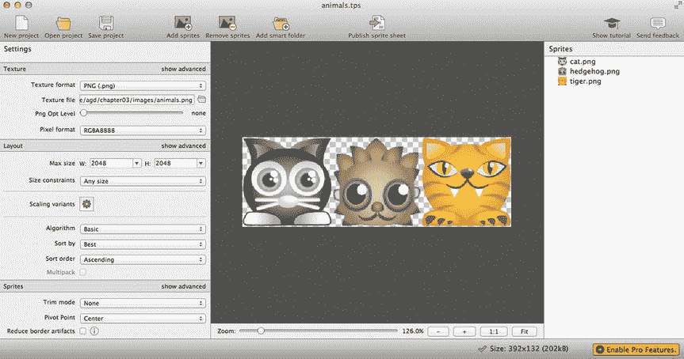

第三章


使用游戏资产

一款游戏的**资产**是它使用的所有字体、声音、数据和图像文件。在这一章中，你将学习如何实现一个清晰的加载和管理资产的策略，以便在你的游戏代码中容易使用它们。您将学习如何创建一个`assets`对象来存储对所有游戏资源的引用，以及如何创建一个预加载器来加载资源并在一切就绪时初始化您的游戏。

游戏通常会使用大量的图像，如果你不知道如何处理这些图像，那么管理这些图像通常会是一件非常令人头疼的事情。但是不要害怕！游戏设计师有一个处理图像的秘密武器:纹理图谱。在本章的后半部分，你将会学到什么是纹理贴图集，以及如何用它来帮助你以一种有趣而有效的方式管理游戏图像。

*资产*对象

在这一章中，我们将构建一个名为`assets`的实用程序对象，它将成为游戏所有资产的中央仓库:图像、声音、字体、普通的 JSON 数据和代表纹理贴图集的 JSON 数据。在探索`assets`对象如何工作之前，让我们看看如何在你完成的程序中使用它。

对象有一个接受一个参数的方法:文件名字符串数组。在数组中列出所有要加载的文件名及其完整路径。当所有的资产都被加载后,`load`方法返回一个`Promise`,所以当一切就绪后，你可以调用一个`setup`函数来初始化你的游戏。下面是如何使用`assets.load`方法加载图像、字体和 JSON 文件，然后运行`setup`函数:

```js
assets.load([
  "images/cat.png",
  "fonts/puzzler.otf",
  "json/data.json"
]).then(() => setup());

function setup() {
  //Initialize the game
}
```

只有在所有资产加载完毕后,`setup`功能才会运行。然后，您就可以在主游戏程序中的任何地方使用以下语法访问任何资源，如图像集:

```js
let anyImage = assets["images/cat.png"];
```

您只需要构建这个资产加载器一次，然后就可以在任何游戏项目中使用它。它还被设计成易于定制，这样你就可以用它来加载你的游戏可能需要的任何类型的文件。

 **注意**在本章中，你将学习如何配置资产加载器，以便它也可以加载声音文件。但是我们实际上不会编写加载声音的代码，直到第 9 章，在那里我们将在讨论 WebAudio API 时补充那些细节。

让我们来看看实现这一点的所有代码。

构建*资产*对象

起初，`assets`对象看起来很复杂，但是您很快就会看到，它只是遵循相同模式的单个组件的集合。这里是完整的代码清单，可以作为参考。现在不要担心去理解所有的事情；在前面的页面中，我将带您了解它是如何工作的，包括它如何解释 JSON 纹理图谱:

```js
export let assets = {

  //Properties to help track the assets being loaded
  toLoad: 0,
  loaded: 0,

  //File extensions for different types of assets
  imageExtensions: ["png", "jpg", "gif"],
  fontExtensions: ["ttf", "otf", "ttc", "woff"],
  jsonExtensions: ["json"],
  audioExtensions: ["mp3", "ogg", "wav", "webm"],

  //The `load` method creates and loads all the assets. Use it like this:
  //`assets.load(["images/anyImage.png", "fonts/anyFont.otf"]);`
  load(sources) {

    //The `load` method will return a Promise when everything has loaded
    return new Promise(resolve => {

      //The `loadHandler` counts the number of assets loaded, compares
      //it to the total number of assets that need to be loaded, and
      //resolves the Promise when everything has loaded
      let loadHandler = () => {
        this.loaded += 1;
        console.log(this.loaded);

        //Check whether everything has loaded
        if (this.toLoad === this.loaded) {

          //Reset `toLoad` and `loaded` to `0` so you can use them
          //to load more assets later if you need to
          this.toLoad = 0;
          this.loaded = 0;
          console.log("Assets finished loading");

          //Resolve the promise
          resolve();
        }
      };

      //Display a console message to confirm that the assets are
      //being loaded
      console.log("Loading assets...");

      //Find the number of files that need to be loaded
      this.toLoad = sources.length;

      //Loop through all the source filenames and find out how
      //they should be interpreted
      sources.forEach(source => {

        //Find the file extension of the asset
        let extension = source.split(".").pop();

        //Load images that have file extensions that match
        //the imageExtensions array
        if (this.imageExtensions.indexOf(extension) !== -1) {
          this.loadImage(source, loadHandler);
        }

        //Load fonts
        else if (this.fontExtensions.indexOf(extension) !== -1) {
          this.loadFont(source, loadHandler);
        }

        //Load JSON files
        else if (this.jsonExtensions.indexOf(extension) !== -1) {
          this.loadJson(source, loadHandler);
        }

        //Load audio files
        else if (this.audioExtensions.indexOf(extension) !== -1) {
          this.loadSound(source, loadHandler);

        //Display a message if a file type isn't recognized
        else {
          console.log("File type not recognized: " + source);
        }
      });
    });
  },

  loadImage(source, loadHandler) {

    //Create a new image and call the `loadHandler` when the image
    //file has loaded
    let image = new Image();
    image.addEventListener("load", loadHandler, false);

    //Assign the image as a property of the `assets` object so
    //you can access it like this: `assets["path/imageName.png"]`
    this[source] = image;

    //Set the image's `src` property to start loading the image
    image.src = source;
  },

  loadFont(source, loadHandler) {

    //Use the font's filename as the `fontFamily` name
    let fontFamily = source.split("/").pop().split(".")[0];

    //Append an `@afont-face` style rule to the head of the HTML document
    let newStyle = document.createElement("style");
    let fontFace
      = "@font-face {font-family: '" + fontFamily + "'; src: url('" + source + "');}";
    newStyle.appendChild(document.createTextNode(fontFace));
    document.head.appendChild(newStyle);

    //Tell the `loadHandler` we're loading a font
    loadHandler();
  },

  loadJson(source, loadHandler) {
    //Create a new `xhr` object and an object to store the file
    let xhr = new XMLHttpRequest();

    //Use xhr to load the JSON file
    xhr.open("GET", source, true);

    //Tell xhr that it's a text file
    xhr.responseType = "text";

    //Create an `onload` callback function that
    //will handle the file loading
    xhr.onload = event => {

      //Check to make sure the file has loaded properly
      if (xhr.status === 200) {

        //Convert the JSON data file into an ordinary object
        let file = JSON.parse(xhr.responseText);

        //Get the filename
        file.name = source;

        //Assign the file as a property of the assets object so
        //you can access it like this: `assets["file.json"]`
        this[file.name] = file;

        //Texture atlas support:
        //If the JSON file has a `frames` property then
        //it's in Texture Packer format
        if (file.frames) {

          //Create the tileset frames
          this.createTilesetFrames(file, source, loadHandler);
        } else {

          //Alert the load handler that the file has loaded
          loadHandler();
        }
      }
    };

    //Send the request to load the file
    xhr.send();
  },

  createTilesetFrames(file, source, loadHandler) {

    //Get the tileset image's file path
    let baseUrl = source.replace(/[^\/]*$/, "");

    //Use the `baseUrl` and `image` name property from the JSON
    //file's `meta` object to construct the full image source path
    let imageSource = baseUrl + file.meta.image;

    //The image's load handler
    let imageLoadHandler = () => {

      //Assign the image as a property of the `assets` object so
      //you can access it like this:
      //`assets["images/imageName.png"]`
      this[imageSource] = image;

      //Loop through all the frames
      Object.keys(file.frames).forEach(frame => {

        //The `frame` object contains all the size and position
        //data for each sub-image.
        //Add the frame data to the asset object so that you
        //can access it later like this: `assets["frameName.png"]`
        this[frame] = file.frames[frame];

        //Get a reference to the source so that it will be easy for
        //us to access it later
        this[frame].source = image;
      });

      //Alert the load handler that the file has loaded
      loadHandler();
    };

    //Load the tileset image
    let image = new Image();
    image.addEventListener("load", imageLoadHandler, false);
    image.src = imageSource;
  },

  loadSound(source, loadHandler) {
    console.log("loadSound called – see Chapter 10 for details");
  }
};
```

您可以在本书源文件的“资源库/实用工具”文件夹中找到此代码。你可以像这样在游戏代码中导入并使用它作为 ES6 模块:

```js
import {assets} from "../library/utilities";
```

现在让我们来看看这到底是如何工作的。

初始化加载过程

当你想加载一些文件到你的游戏中时，发送一个文件源路径数组到`assets`对象的`load`方法:

```js
assets.load(["images/tileset.png", "fonts/puzzler.otf"]);
```

`load`方法首先使用数组的`length`来计算应该加载多少资产，并将结果复制到`toLoad`属性中。

```js
load(sources) {
  //...
  this.toLoad = sources.length;
```

它现在知道您想要加载多少资产。

`assets.load`方法中的所有代码都包装在一个`Promise`中:

```js
load(sources) {
  return new Promise(resolve => {
    //... all of the load function's code is here...
  });
}
```

每次加载资产时，都会调用`loadHandler` 。它将`1`添加到`loaded`属性中。如果装入的资产数量与要装入的资产数量匹配，则承诺得到解决:

```js
let loadHandler = () => {
  this.loaded += 1;
  console.log(this.loaded);

  //Check whether everything has loaded
  if (this.toLoad === this.loaded) {

    //Reset `toLoad` and `loaded` to `0` so you can use them
    //to load more assets later if you need to
    this.toLoad = 0;
    this.loaded = 0;
    console.log("Assets finished loading");

    //Resolve the promise
    resolve();
  }
};
```

但是在调用`loadHandler`之前，代码需要弄清楚您想要加载什么类型的资产。它首先遍历来自`sources`数组的每个文件源路径:

```js
sources.forEach(source => {
  let extension = source.split(".").pop();
```

`forEach`方法遍历每个源文件，并找到它的文件扩展名。它是怎么做到的？

首先，`split`将源字符串转换成一个新的数组。它通过在每个点(.)性格。因此，字符串中由点描绘的每一部分都将被转换为数组元素，并复制到新数组中:

```js
source.split('.')
```

例如，假设我们的原始字符串如下所示:

```js
"images/tileset.png"
```

`split`方法扫描字符串中的点。它将点左边的所有内容复制到一个数组元素中，将右边的所有内容复制到另一个数组元素中。这意味着源字符串现在位于如下所示的数组中:

```js
["images/tileset", "png"]
```

我们已经成功了一半。我们只对文件扩展名`"png"`感兴趣。这是数组中的最后一个元素。我们怎样才能访问它？使用`pop`方法:

```js
source.split('.').pop()
```

这一行“弹出”数组中的最后一个元素，非常方便的是文件扩展名。

当所有这些都完成后，名为`extension`的变量现在有了值`"png"`。但是代码如何知道`png`是一个图像文件呢？

`assets`对象有四个数组，存储每种文件类型的所有文件扩展名:

```js
imageExtensions: ["png", "jpg", "gif"],
fontExtensions: ["ttf", "otf", "ttc", "woff"],
jsonExtensions: ["json"],
audioExtensions: ["mp3", "ogg", "wav", "webm"],
```

我们可以使用这些数组来计算出`"png"`是什么样的东西。使用数组的`indexOf`方法来帮助您做到这一点。

```js
if (this.imageExtensions.indexOf(extension) !== -1) {
  this.loadImage(source, loadHandler);
}
```

如果`indexOf`不能将`"png"`匹配到`imageExtensions`数组中的一个值，它将返回-1，表示“未找到”任何大于-1 的数字都意味着找到了匹配，因此`"png"`必须是一种图像类型。

 **注意**或者，您可以使用 JavaScript ES6 的`find`方法来帮助您完成这项工作。

加载图像

如果`extension`指的是一幅图像，则`loadImage`函数运行:

```js
loadImage(source, loadHandler) {

  //Create a new image and call the `loadHandler` when the image
  //file has loaded
  let image = new Image();
  image.addEventListener("load", loadHandler, false);

  //Assign the image as a property of this `assets` object
  this[source] = image;

  //Set the image's `src` property to start loading the image
  image.src = source;
},
```

`loadImage`做的第一件事是创建一个新的`Image`对象并设置图像的`loadHandler`:

```js
let image = new Image();
image.addEventListener("load", loadHandler, false);
```

当图像完成加载后，它将调用`assets`对象上的`loadHandler`。(记住，`loadHandler`每运行一次，它就给`loaded`的值加 1。当所有资产加载完毕后，`Promise`被解析，所有加载完成。)

下一步是将这个`Image`对象存储在`asset`对象本身中，并且能够通过它的文件名和路径名来引用它。我们如何做到这一点？

这里有一点编程巫术，你会觉得非常有趣。记住，如果我们想在我们的主程序中访问一个图像，我们应该能够编写一些类似这样的代码:

```js
assets["images/tileset.png"]
```

我们如何设置它？

在引用图像并与图像文件同名的`assets`对象上创建一个属性。以下是如何:

```js
this[source] = image;
```

现在，您可以使用以下语法访问您加载的任何图像:

```js
assets["images/rocket.png"]
assets["images/cat.png"]
assets["images/star.png"]
```

这种语法易于阅读和编写，它使我们不必为`assets`对象添加单独的搜索功能。

最后一步是通过设置图像的`src`属性开始加载图像:

```js
image.src = source;
```

我们现在完成了图像，但是其他文件类型呢？

加载字体

字体造成了一个特殊的问题，因为与图像不同，没有内置的 HTML5 API 来强制加载字体。在 CSS `@font-face`规则的帮助下，你能做的最好的事情就是链接到你想要使用的字体文件。下面是方法:

```js
@font-face {
  font-family: "fontFamilyName";
  src: url("fonts/fontFile.ttf");
}
```

但是这段代码实际上并没有加载字体；它只是告诉浏览器在哪里可以找到它。所有的浏览器只会在页面上使用字体时才下载，以前从来不会。这意味着任何玩你的游戏的人都可能会在字体加载前看到一个短暂的无样式文本闪烁。不幸的是，在撰写本文时，还没有新的 HTML5 规范来帮助解决这个问题。(但是如果你是在这本书出版后很久的某个快乐的未来时间读到这篇文章的，请仔细检查一下！HTML5 规范现在可能已经包含了这一点。)

如果你不认为这将是一个问题，那么不要担心预加载字体，只需使用`@font-face`。结案了。

但是如果你想要更多的控制，使用开源字体加载器。所有的预加载器都以同样的方式工作。他们创建一些不可见的 HTML 文本，对其进行样式化，并使用一些编程技巧来计算字体文件何时被加载。字体预加载器的一个好选择是开源项目 font.js ( `github.com/Pomax/Font.js`)。这是一个轻量级的、久经沙场的脚本，它允许您使用与加载图像相同的语法来加载字体。要使用 font.js，下载它并在游戏中加入一个`script`标签:

```js
<script src="Font.js"></script>
```

然后，您可以像这样加载字体:

```js
let anyFont = new Font();
anyFont.src = "fonts/fileName.ttf";
anyFont.onload = function () {
  console.log("font loaded");
}
```

语法就像加载图像一样。如果这对你有用，那就去做吧！但是本着这本书的 DIY 精神，我们不会走那条路。相反，我们将使用一个小技巧来满足游戏的大部分字体加载需求，而不需要第三方脚本。

如果`assets.load`方法检测到我们试图加载一个带有字体扩展名(`"ttf"`、`"otf"`、`"ttc"`或`"woff"`)的文件，它会调用`loadFont`方法，该方法只是将一个`@font-face`规则写入并附加到 HTML 文档中:

```js
loadFont(source, loadHandler) {

  //Use the font's filename as the `fontFamily` name. This code captures
  //the font file's name without the extension or file path
  let fontFamily = source.split("/").pop().split(".")[0];

  //Append an `@afont-face` style rule to the head of the HTML document
  let newStyle = document.createElement("style");
  let fontFace
    = "@font-face {font-family: '" + fontFamily + "'; src: url('" + source + "');}";
  newStyle.appendChild(document.createTextNode(fontFace));
  document.head.appendChild(newStyle);

  //Tell the loadHandler we're loading a font
  loadHandler();
},
```

`loadFont`做的第一件事是在完整的源路径中找到字体的名称:

```js
let fontFamily = source.split("/").pop().split(".")[0];
```

我知道，这些代码看起来像是精神病院墙上的涂鸦！但是，嘿，我们应该是成年人——我们可以接受的！它所做的只是提取最后一个斜杠(/)之后和最后一个点()之前的字母。)性格。例如，假设您的字体源路径如下所示:

```js
"fonts/puzzler.otf"
```

`fontFamily`现在有了这个值:

```js
"puzzler"
```

之前/之后的一切。不见了。

代码做的下一件事是将一个`@font-face`规则写入 HTML 页面的`<head>`部分:

```js
let newStyle = document.createElement("style");
let fontFace
  = "@font-face {font-family: '" + fontFamily + "'; src: url('" + source + "');}";
newStyle.appendChild(document.createTextNode(fontFace));
document.head.appendChild(newStyle);
```

如果您使用的是名为`puzzler.otf` 的字体，这些行将编写以下 HTML 和 CSS 代码:

```js
<style>
  @font-face {
    font-family: 'puzzler';
    src: url('fonts/puzzler.otf');
  }
</style>
```

正如我前面提到的，这段代码实际上不会加载字体文件；它只是告诉浏览器，当 HTML 元素或画布请求字体时，在哪里查找字体。但是正如你将在下一章看到的，这对于游戏来说很少是个问题。因为游戏是在一个连续的循环中渲染的，所以你使用的任何自定义字体通常会在每一帧中被连续请求。这意味着它们应该在其他资源加载时被加载和渲染，在大多数情况下，您可能看不到未样式化的文本。

 **注意**如果你不是在循环中请求自定义字体，字体文件几乎肯定不会加载。在这种情况下，请使用 font.js 或等效的字体预加载程序，让您的生活更轻松。

正如加载图像的代码一样，`loadFont`方法做的最后一件事是调用`loadHandler` :

```js
loadHandler();
```

这表明该字体已经被加载，如果它是最后一个加载的资产，则解析`load`方法的承诺。

现在您已经知道如何加载图像和字体，让我们来看看如何加载 JSON 数据文件。

加载 JSON 文件

在第 1 章中，你学习了如何使用 XHR 加载和解析 JSON 文件。如果`assets.load`方法检测到您正试图加载一个 JSON 文件，它将使用大部分相同的代码来加载该文件。

```js
loadJson(source, loadHandler) {

  //Create a new XHR object
  let xhr = new XMLHttpRequest();
  xhr.open("GET", source, true);
  xhr.responseType = "text";

  xhr.onload = event => {
    if (xhr.status === 200) {
      let file = JSON.parse(xhr.responseText);
      file.name = source;
      this[file.name] = file;

      //If the JSON file has a `frames` property then
      //it's in Texture Packer format
      if (file.frames) {
        this.createTilesetFrames(file, source, loadHandler);
      } else {
        loadHandler();
      }
    }
  };

  //Send the request to load the file
  xhr.send();
},
```

JSON 文件加载并解析成功后，代码在`assets`对象上添加对它的引用:

```js
file.name = source;
this[file.name] = file;
```

这意味着我们可以在稍后的应用程序代码中获得对 JSON 对象的引用，如下所示:

```js
assets["json/data.json"]
```

`loadJson`函数还做了一件额外的事情。它检查 JSON 文件是否有一个名为`frames`的属性。如果是，那么 JSON 文件一定是纹理图谱，函数调用`createTilesetFrames`方法:

```js
if (file.frames) {
  this.createTilesetFrames(file, source, loadHandler);
} else {
  loadHandler();
}
```

什么是纹理图谱，`createTilesetFrames`是做什么的？来看看吧！

使用纹理图谱

如果你正在开发一个大型复杂的游戏，你会想要一个快速有效的方法来处理图像。一个**纹理图谱**可以帮你做到这一点。纹理贴图集实际上由两个密切相关的独立文件组成:

*   一个 PNG tileset image 文件，包含所有你想在游戏中使用的图像
*   描述 tileset 中这些子图像的大小和位置的 JSON 文件

要使用纹理贴图集，通常需要将 JSON 文件加载到游戏中，并使用它包含的数据为它定义的每个子图像自动创建单独的对象。每个对象都包含子图像的 *x* 、 *y* 、宽度、高度和名称，您可以使用这些信息将图像从 tileset 传送到画布。

使用纹理地图可以节省大量时间。您可以按任何顺序排列 tileset 的子图像，JSON 文件将为您跟踪它们的大小和位置。这真的很方便，因为这意味着子图像的大小和位置不会硬编码到你的游戏程序中。如果您对 tileset 进行了更改，比如添加图像、调整图像大小或删除图像，只需重新发布 JSON 文件，您的游戏就会使用更新后的数据来正确显示图像。如果你要制作比一个非常小的游戏更大的东西，你肯定会想要使用纹理地图。

tileset JSON 数据事实上的标准是由一个流行的软件工具 Texture Packer 输出的格式。即使不使用 Texture Packer，Shoebox 之类的类似工具也输出相同格式的 JSON 文件。下面我们来了解一下如何用它制作一个带有纹理打包器的纹理图谱，以及如何加载到游戏程序中。

 **注意** Texture Packer 的“Essential”许可是免费的，可以在`www.codeandweb.com`下载。

创建纹理图谱

打开纹理打包器，选择{JS}配置选项。将你的游戏图片拖到它的工作区。您也可以将它指向包含您的图像的任何文件夹。纹理打包器会自动将这些图像排列成一个单独的 tileset 图像，并给它们起一个与原始图像名称相匹配的名称。默认情况下，它会给它们一个 2 像素的填充。[图 3-1](#Fig1) 显示了由三个图像组成的 tileset。



[图 3-1](#_Fig1) 。使用纹理打包器创建纹理图谱

完成后，确保数据格式设置为 JSON (Hash ),然后单击发布按钮。选择文件名和位置，并保存发布的文件。您将得到一个 PNG 文件和一个 JSON 文件。在这个例子中，我的文件名是`animals.json`和`animals.png`。为了让您的生活更轻松，只需将这两个文件都保存在项目的 images 文件夹中。(将 JSON 文件视为图像文件的额外元数据)。

JSON 文件描述了 tileset 中每个图像的名称、大小和位置。下面是描述 tileset 的完整 JSON 数据:

```js
{"frames": {

"cat.png":
{
  "frame": {"x":2,"y":2,"w":128,"h":128},
  "rotated": false,
  "trimmed": false,
  "spriteSourceSize": {"x":0,"y":0,"w":128,"h":128},
  "sourceSize": {"w":128,"h":128},
  "pivot": {"x":0.5,"y":0.5}
},
"hedgehog.png":
{
  "frame": {"x":132,"y":2,"w":128,"h":128},
  "rotated": false,
  "trimmed": false,
  "spriteSourceSize": {"x":0,"y":0,"w":128,"h":128},
  "sourceSize": {"w":128,"h":128},
  "pivot": {"x":0.5,"y":0.5}
},
"tiger.png":
{
  "frame": {"x":262,"y":2,"w":128,"h":128},
  "rotated": false,
  "trimmed": false,
  "spriteSourceSize": {"x":0,"y":0,"w":128,"h":128},
  "sourceSize": {"w":128,"h":128},
  "pivot": {"x":0.5,"y":0.5}
}},
"meta": {
  "app": "http://www.codeandweb.com/texturepacker",
  "version": "1.0",
  "image": "animals.png",
  "format": "RGBA8888",
  "size": {"w":392,"h":132},
  "scale": "1",
  "smartupdate": "$TexturePacker:SmartUpdate:
    a196e3e7dc7344bb1ddfbbb9ed914f90:
    06a75246a1a4b65f2beacae47a5e81d7:
    b00d48b51f56eb7c81e25100fcce2828$"
}
}
```

您可以看到该文件包含三个主要对象，名为`"cat.png"`、`"hedgehog.png"`和`"tiger.png"`。这些子图像中的每一个都被称为一个**帧**，它的第一组属性描述了子图像在 tileset 上的位置。还有一个名为`“meta”`的对象，它告诉您这些帧所属图像的名称和大小，以及其他一些信息。

 **注意**使用像 Texture Packer 这样的软件来构建纹理地图的许多优点之一是，默认情况下，它会在每张图像周围添加 2 个像素的填充。这对于防止**纹理出血**的可能性很重要，这是一种当 tileset 上相邻图像的边缘出现在 sprite 旁边时发生的效果。发生这种情况是因为系统的渲染器(GPU 或 CPU)决定如何舍入分数像素值。应该向上还是向下取整？对于每个渲染器，这种选择是不同的。在 tileset 上的图像周围添加 1 或 2 像素的填充可以使所有图像显示一致。

加载纹理贴图集

现在我们已经得到了这些信息，我们如何将它加载到我们的游戏代码中呢？您会注意到 JSON 文件中的第一个属性叫做`"frames"`:

```js
{"frames": {
```

当`assets.load`方法加载任何 JSON 文件时，它检查文件的第一个属性。如果恰好是`"frames"`，那么你知道你正在加载一个纹理打包格式的文件，你可以使用`createTilesetFrames`方法来解释它:

```js
if (file.frames) {
  this.createTilesetFrames(file, source, loadHandler);
} else {
  loadHandler();
}
```

`createTilesetFrames`是做什么的？它遍历 JSON 文件中的所有`frame`对象，并将它们添加到`assets`中，以便您可以稍后在代码中访问它们。它还加载 tileset 图像文件:

```js
createTilesetFrames(file, source, loadHandler) {

  //Get the tileset image's file path
  let baseUrl = source.replace(/[^\/]*$/, "");

  //Use the `baseUrl` and `image` name property from the JSON
  //file's `meta` object to construct the full image source path
  let imageSource = baseUrl + file.meta.image;

  //The image's load handler
  let imageLoadHandler = () => {

    //Assign the image as a property of the `assets` object so
    //you can access it like this:
    //`assets["images/imageName.png"]`
    this[imageSource] = image;

    //Loop through all the frames
    Object.keys(file.frames).forEach(frame => {

      //The `frame` object contains all the size and position
      //data for each subimage.
      //Add the frame data to the asset object so that you
      //can access it later like this: `assets["frameName.png"]`
      this[frame] = file.frames[frame];

      //Get a reference to the source so that it will be easy for
      //you to access it later
      this[frame].source = image;
    });

    //Alert the load handler that the file has loaded
    loadHandler();
  };

  //Load the tileset image
  let image = new Image();
  image.addEventListener("load", imageLoadHandler, false);
  image.src = imageSource;
}
```

代码首先指出 tileset 图像的文件路径是什么。因为 JSON 文件和 PNG 文件存储在同一个文件夹中，所以它们都有相同的路径名。这意味着您可以通过提取`source`字符串中除图像名称之外的所有内容来找到图像的基本文件路径。`createTilesetFrames`的第一部分使用正则表达式和`replace`方法来查找文件名并用空字符串替换它:

```js
let baseUrl = source.replace(/[^\/]*$/, "");
```

如果`source`字符串是`"images/animals.json"`，那么`baseUrl`现在将具有值`"images/"`。

 **注意**在`source`字符串语法中，`[^\/]`指任何不是斜杠的字符。跟在它后面的`*`匹配任意数量的字符，而`$`指的是字符串的结尾。这意味着正则表达式将匹配字符串末尾非斜杠的任何字符。要了解更多正则表达式，我最喜欢的资源是`http:qntm.org/files/re/re.html`的“55 分钟左右学会正则表达式”。

现在我们知道了 tileset 图像的文件路径，我们可以使用 JSON 文件中的`meta.image`属性来构建完整的图像源:

```js
let imageSource = baseUrl + file.meta.image;
```

现在我们有了对图像源的引用，我们可以像加载任何其他图像一样加载它，并在完成后调用`imageLoadHandler`:

```js
let image = new Image();
image.addEventListener("load", imageLoadHandler, false);
image.src = imageSource;
```

`imageLoadHandler`通过 JSON 文件中的每个帧对象循环,并将对它们的引用存储在`assets`对象中。：

```js
let imageLoadHandler = () => {
  this[imageSource] = image;
  Object.keys(file.frames).forEach(frame => {
    this[frame] = file.frames[frame];
    this[frame].source = image;
  });
  loadHandler();
};
```

每个`frame`对象还在一个名为`source`的属性中获得对其所属 tileset 的引用。这将使我们在游戏代码中更容易将框架与其 tileset 相关联。当所有这些都完成后，代码调用`assets.load`方法的`loadHandler`来通知资产对象 JSON 文件及其关联的 PNG 文件已经加载。

在你的游戏代码中加载和使用纹理贴图

那么，这一切最终给我们带来了什么？

这意味着你可以用下面的语法将纹理贴图加载到你的游戏代码中:

```js
assets.load([
  "images/animals.json"
]).then(() => setup());
```

然后，您可以像这样访问 JSON 对象和 PNG 图像文件:

```js
assets["images/animals.json"]
assets["images/animals.png"]
```

您可以像这样访问 JSON 文件中的每个单独的帧:

```js
assets["cat.png"]
assets["tiger.png"]
assets["hedgehog.png"]
```

这些是包含每个子图像的大小和位置信息的帧对象。现在，您可以使用该信息从 tileset 图像中提取子图像，并将它们复制到画布上。

我们如何做到这一点？这就是下一章要讲的！

摘要

现在，您已经掌握了在游戏中加载和管理图像、字体和纹理贴图集所需的所有技能。我们已经创建了一个有用的`assets`对象，它以一种易于使用的格式存储您所有的游戏资产。您还了解了如何构建一个相当复杂的微型应用程序，它使用承诺来通知您的程序何时工作完成。

这只是一个起点；你可以根据游戏的具体需求以任何方式定制`assets`对象。如果您需要加载其他类型的文件，比如视频，只需将文件扩展名添加到`extensions`数组中，并编写您自己的定制加载函数来管理加载。在第 9 章的[中，我们将再次访问`assets`对象，并学习如何定制它来加载与 WebAudio API 兼容的声音文件。](09.html)

在第 2 章中，你学习了如何在画布上绘制和显示游戏的基本图形，在这一章中，你学习了如何加载外部文件。在下一章中，你将学习如何将这两种技能结合起来，并使用它们来构建可重用的游戏组件，称为精灵。