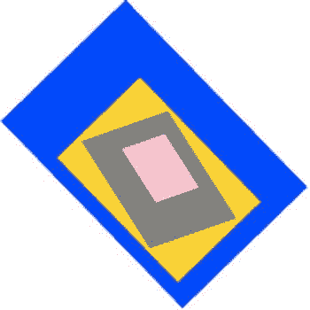

# 四、制作精灵和场景图

游戏设计师的基本构建模块是**精灵**。精灵是你在屏幕上移动、制作动画或与之互动的任何图像、形状或文本。在这一章中，你将学习如何从头开始制作精灵，然后，在接下来的章节中，你将学习如何移动他们，使他们互动，添加一些碰撞检测，并使用他们来构建一个游戏。

我们将要构建的精灵系统的一个重要特性是，你可以将精灵组合在一起，制作复合物体和游戏场景。每个精灵都有自己的局部坐标系，因此如果移动、缩放或旋转精灵，它包含的任何嵌套子精灵都将随之移动、缩放或旋转。这是一个叫做 **场景图**的特性:嵌套精灵的层次结构。正如你将看到的，这是一个很容易实现的特性，给你很大的灵活性来制作复杂的游戏显示系统。

到本章结束时，你将有一个简单而强大的方法来显示形状、图像、线条和文本，它们将成为制作游戏最重要的组成部分。

 **注意**在这一章中，我们将构建一个精灵显示系统，它严格模仿经典的 Flash API，但是有一些新的变化。Flash API 是大多数现代 2D 精灵渲染系统的基础，包括 Starling、Sparrow、CreateJS 和 Pixi，所以如果你想知道这些 API 是如何在幕后发挥其魔力的，本章将向你展示。

精灵是什么？

在第 2 章中，你学习了如何使用画布绘制 API 制作基本的形状和线条。这个 API 被描述为一个**低级** API 。这意味着您可以控制代码的非常小的细节，以您喜欢的任何方式将它定制到一个很好的程度。这很好，但缺点是创建非常简单的东西需要大量代码。例如，如果你想画一个矩形，旋转它，给它一点透明度，你必须写 13 行代码，像这样:

```js
ctx.strokeStyle = "black";
ctx.lineWidth = 3;
ctx.fillStyle = "rgba(128, 128, 128, 1)";
ctx.save();
ctx.globalAlpha = 0.5;
ctx.translate(128, 128);
ctx.rotate(0.5);
ctx.beginPath();
ctx.rect(-64, -64, 128, 128);
ctx.closePath();
ctx.stroke();
ctx.fill();
ctx.restore();
```

花了 13 行费力的代码，就为了做一个简单的矩形？更糟糕的是，你必须为每一个矩形重复这 13 行代码。忘记构建这样的游戏吧！

有更好的办法！你可以通过使用一种叫做**抽象**的重要编程技巧来解决这个问题。抽象是一种隐藏代码中所有混乱细节的策略，这样你就可以只处理大的、重要的想法。因此，你可能只需要编写两行**高级**代码，而不必编写 13 行冗长的低级代码。你可以这样把这 13 行抽象成两行:

```js
let box = rectangle();
render(canvas);
```

可读性更强，不是吗？你怎么能这样做？

 **注**低级代码和高级代码有什么区别？低级代码往往是告诉计算机如何做某事的一系列指令。高级代码往往是描述*做什么*的指令列表。写一个好的游戏程序是关于在低级和高级代码之间保持一个健康的平衡。您需要理解并访问底层代码，以便在出错时进行修复。但是你想用尽可能多的高层次代码来完成你的创造性工作，这样你就不会被混乱的低层次细节所拖累。找出完美的高层次/低层次的平衡需要实践，而且每个项目都不一样。

第一项任务是仔细查看底层代码，并尝试找出是否可以将其组织到不同的工作中。下面是我们的矩形代码正在做的两个主要工作:

1.  **描述矩形**:其高度、宽度、位置、旋转、透明度。
2.  **渲染矩形**:在画布上显示矩形。

在我们当前的 13 行代码中，这两项工作都混杂在一个大混乱中。这就是程序员所说的**意大利面代码**。我们需要解开所有的面条，这样我们就可以将它们分类成合理的和可重用的组件。在大多数游戏项目中，你会有三根意大利面条需要解开:游戏**信息**，游戏**逻辑**，游戏**渲染**系统。

游戏开发者有一个很好的方法来保持线程分离，那就是制作叫做**精灵**的组件。在接下来的几节中，你将学习如何制作一个游戏精灵，并且在这个过程中，学习如何解开任何种类的代码。

抽象将是我们本章剩余部分的指导原则，你将看到我们如何用它来解决一些复杂的问题，以便我们可以快速开始制作游戏。

制作矩形精灵

让我们从一个非常小而简单的例子开始，这样你就可以大致了解一个基本的 sprite 系统是如何工作的。我们将构建一个只显示一个矩形的极简主义精灵。您将能够定义矩形的形状、大小、颜色和位置，并根据您的喜好复制任意多的副本。

`children`阵列

首先，创建一个数组来保存所有要创建的精灵:

```js
let children = [];
```

每次你创建一个新的精灵，你会把它放入这个`children`数组。正如你将看到的，这将使你更容易有效地渲染精灵。

这个数组为什么叫`children`？把你的主游戏想象成一个大容器。每次你创建一个精灵，它都会存在于这个大容器中。容器是父容器，容器中的所有东西都是父容器的子容器。在后面的步骤中，你会看到我们将如何扩展这个概念，为我们所有的精灵建立一个方便的父子层次结构。

`rectangle`雪碧

下一个任务是编写一个函数，创建并返回一个抽象的矩形精灵。该函数应该接受所有你想在游戏代码中控制的精灵参数:大小、位置和颜色。您还应该能够设置它的 alpha、旋转、缩放和可见性。因为你可能想要移动矩形精灵，我们还将添加代表精灵速度的`vx`和`vy`属性。(你将在第 5 章中了解所有关于速度以及`vx`和`vy`如何工作的知识。)sprite 对象也应该有自己的内部`render`函数，描述画布绘制 API 应该如何绘制矩形。rectangle 函数要做的最后一件事是将 sprite 推入到`children`数组中，以便我们稍后可以访问它。下面是完成这一切的完整的`rectangle`函数:

```js
let rectangle = function(
  //Define the function's parameters with their default values
  width = 32,
  height = 32,
  fillStyle = "gray",
  strokeStyle = "none",
  lineWidth = 0,
  x = 0,
  y = 0
) {

  //Create an object called `o` (the lowercase letter "o")
  //that is going to be returned by this
  //function. Assign the function's arguments to it
  let o = {width, height, fillStyle, strokeStyle, lineWidth, x, y};

  //Add optional rotation, alpha, visible, and scale properties
  o.rotation = 0;
  o.alpha = 1;
  o.visible = true;
  o.scaleX = 1;
  o.scaleY = 1;

  //Add `vx` and `vy` (velocity) variables that will help us move the sprite
  o.vx = 0;
  o.vy = 0;

  //Add a `render` method that explains how to draw the sprite
  o.render = ctx => {
    ctx.strokeStyle = o.strokeStyle;
    ctx.lineWidth = o.lineWidth;
    ctx.fillStyle = o.fillStyle;
    ctx.beginPath();
    ctx.rect(-o.width / 2, -o.height / 2, o.width, o.height);
    if (o.strokeStyle !== "none") ctx.stroke();
    ctx.fill();
  };

  //Push the sprite object into the `children` array
  children.push(o);

  //Return the object
  return o;
};
```

大部分代码都是不言自明的，但是有一个新东西您可能以前没有见过。该函数使用 ES6 的 object 文字简写来方便地将函数参数分配给函数返回的对象:

```js
let o = {width, height, fillStyle, strokeStyle, lineWidth, x, y};
```

在 ES6 中，如果对象的属性名与其值相同，则不需要指定值。所以前面的语句相当于这样写:

```js
let o = {
  width: width,
  height: height,
  fillStyle: fillStyle,
  strokeStyle: strokeStyle,
  lineWidth: lineWidth,
  x: x,
  y: y
};
```

该代码只是创建一个对象，该对象的属性的名称与函数的参数值相同。

还有一种使用`Object.assign` 编写代码的替代方法，这在许多情况下可能更好:

```js
let o = {};
Object.assign(
  o,
  {width, height, fillStyle, strokeStyle, lineWidth, x, y}
);
```

使用`Object.assign`的优点是它在对象上创建了全新的属性和值，而不仅仅是指向现有对象的指针引用。

`render`功能

现在你有了一个创建精灵的函数，你需要一个全局`render`函数来显示它们。`render`函数的工作是遍历`children`数组中的所有对象，并使用每个精灵自己的内部`render`函数在画布上绘制形状。该函数仅在 sprite 可见的情况下绘制 sprite，并将画布的属性设置为与 sprite 的属性相匹配。代码如下:

```js
function render(canvas, ctx) {

  //Clear the canvas
  ctx.clearRect(0, 0, canvas.width, canvas.height);

  //Loop through each sprite object in the `children` array
  children.forEach(sprite => {
      displaySprite(sprite);
  });

  function displaySprite(sprite) {

    //Display a sprite if it's visible
    if (sprite.visible) {

      //Save the canvas's present state
      ctx.save();

      //Shift the canvas to the sprite's position
      ctx.translate(
        sprite.x + sprite.width / 2,
        sprite.y + sprite.height /2
      );

      //Set the sprite's `rotation`, `alpha` and `scale`
      ctx.rotate(sprite.rotation);
      ctx.globalAlpha = sprite.alpha;
      ctx.scale(sprite.scaleX, sprite.scaleY);

      //Use the sprite's own `render` method to draw the sprite
      sprite.render(ctx);

      //Restore the canvas to its previous state
      ctx.restore();
    }
  }
}
```

我们现在已经准备好制作精灵了。开始吧！

制造精灵

这里有一些代码使用我们新的`rectangle`和`render`函数来制作和显示三个矩形精灵，每个精灵都有不同的属性值。图 4-1 显示了这段代码产生的结果。`rectangle`构造函数参数代表宽度、高度、填充颜色、笔画(轮廓)颜色、轮廓宽度、 *x* 位置、 *y* 位置。您还可以设置精灵的`alpha`、`scaleX`、`scaleY`、旋转和`visible`属性。


[图 4-1](#_Fig1) 。三个矩形精灵

```js
let blueBox = rectangle(64, 64, "blue", "none", 0, 32, 32);
blueBox.rotation = 0.2;

let redBox = rectangle(64, 64, "red", "black", 4, 160, 100);
redBox.alpha = 0.5;
redBox.scaleY = 2;

let greenBox = rectangle(64, 64, "yellowGreen", "black", 2, 50, 150);
greenBox.scaleX = 0.5;
greenBox.rotation = 0.8;

//Render the sprites
render(canvas, ctx);
```

您可以使用相同的格式来制作任意数量的矩形，并按照您喜欢的方式自定义它们的大小、位置和颜色。你可能会惊讶地发现，我们刚刚打开了用 HTML5 和 JavaScript 制作游戏的最重要的大门。即使你没有比制作这些基本的矩形精灵更进一步，你也能够使用本书剩余部分的技术开始制作游戏。但是，我们可以做得更好！

构建场景图

下一步是创建一个系统，你可以将一个精灵嵌套在另一个精灵中。嵌套的 sprite 是其**父**容器 sprite 的**子**。每当父 sprite 改变其比例、位置、旋转或 alpha 透明度时，子 sprite 应该与该改变相匹配。子精灵在父精灵中也有自己的局部坐标系。这个系统叫做**场景图**，它是制作游戏场景和用不同组件创建复杂精灵的基础。[图 4-2](#Fig2) 展示了一个基本的父子精灵关系。


[图 4-2](#_Fig2) 。嵌套的父子精灵层次结构

创建场景图需要一点规划。首先，你的精灵需要这些新属性:

*   **children** :一个数组，存储对 sprite 包含的所有子 sprite 的引用。
*   **parent** :对这个 sprite 的父级的引用。
*   **gx** 和 **gx** :精灵的*全局 x* 和 *y* 坐标，相对于画布。
*   **x** 和 **y** :精灵的*局部*坐标，相对于它的父对象。
*   **层**:一个数字，表示精灵的深度层。您可以通过更改子画面的深度层，使子画面显示在其他子画面的上方或下方。

精灵还需要两种新方法来帮助你管理它们的父子关系:

*   **addChild** :让你添加一个精灵作为父精灵的子精灵。`addChild`只是将一个 sprite 推入父元素的`children`数组中。
*   **removeChild** :让你从父精灵中移除一个子精灵。

此外，您需要一个根容器对象，作为游戏中所有顶级精灵的父对象:

*   **stage**:`stage`是位置为 0，0 的对象，与画布的宽度和高度相同。它有一个包含游戏中所有顶级精灵的`children`数组。当你渲染你的精灵时，你可以通过循环舞台的`children`数组来实现。

最后，您需要一个新的`render`函数，它遍历 stage 对象中的所有子精灵，然后递归遍历这些子精灵的所有子精灵。让我们来看看实现所有这些所需的新代码。

创建可嵌套的矩形精灵

有了所有这些新特性，我们的矩形精灵的代码如下所示。

```js
let rectangle = function(
  width = 32, height = 32,
  fillStyle = "gray", strokeStyle = "none", lineWidth = 0,
  x = 0, y = 0
) {

  //Create an object called `o` that is going to be returned by this
  //function. Assign the function's arguments to it
  let o = {width, height, fillStyle, strokeStyle, lineWidth, x, y};

  //Create a "private" `_layer` property. (Private properties are prefixed
  //by an underscore character.)
  o._layer = 0;

  //The sprite's width and height
  o.width = width;
  o.height = height

  //Add optional rotation, alpha, visible and scale properties
  o.rotation = 0;
  o.alpha = 1;
  o.visible = true;
  o.scaleX = 1;
  o.scaleY = 1;

  //Add `vx` and `vy` (velocity) variables that will help us move
  //the sprite in later chapters
  o.vx = 0;
  o.vy = 0;

  //Create a `children` array on the sprite that will contain all the
  //child sprites
  o.children = [];

  //The sprite's `parent` property
  o.parent = undefined;

  //The `addChild` method lets you add sprites to this container
  o.addChild = sprite => {

    //Remove the sprite from its current parent, if it has one and
    //the parent isn't already this object
    if (sprite.parent) {
      sprite.parent.removeChild(sprite);
    }

    //Make this object the sprite's parent and
    //add it to this object's `children` array
    sprite.parent = o;
    o.children.push(sprite);
  };

  //The `removeChild` method lets you remove a sprite from its
  //parent container
  o.removeChild = sprite => {
    if(sprite.parent === o) {
      o.children.splice(o.children.indexOf(sprite), 1);
    } else {
      throw new Error(sprite + "is not a child of " + o);
    }
  };

  //Add a `render` method that explains how to draw the sprite
  o.render = ctx => {
    ctx.strokeStyle = o.strokeStyle;
    ctx.lineWidth = o.lineWidth;
    ctx.fillStyle = o.fillStyle;
    ctx.beginPath();
    ctx.rect(-o.width / 2, -o.height / 2, o.width, o.height);
    if (o.strokeStyle !== "none") ctx.stroke();
    ctx.fill();
  };

  //Getters and setters for the sprite's internal properties
  Object.defineProperties(o, {

    //The sprite's global x and y position
    gx: {
      get() {
        if (o.parent) {

          //The sprite's global x position is a combination of
          //its local x value and its parent's global x value
          return o.x + o.parent.gx;
        } else {
          return o.x;
        }
      },
      enumerable: true, configurable: true
    },
    gy: {
      get() {
        if (o.parent) {
          return o.y + o.parent.gy;
        } else {
          return o.y;
        }
      },
      enumerable: true, configurable: true
    },

    //The sprite's depth layer. Every sprite and group has its depth layer
    //set to `0` (zero) when it's first created. If you want to force a
    //sprite to appear above another sprite, set its `layer` to a
    //higher number
    layer: {
      get() {
        return o._layer;
      },
      set(value) {
        o._layer = value;
        if (o.parent) {

          //Sort the sprite's parent's `children` array so that sprites with a
          //higher `layer` value are moved to the end of the array
          o.parent.children.sort((a, b) => a.layer - b.layer);
        }
      },
      enumerable: true, configurable: true
    }
  });

  //Add the object as a child of the stage
  if (stage) stage.addChild(o);

  //Return the object
  return o;
};
```

这段代码的一个新特性是它使用了一个名为`_layer`的私有属性:

```js
o._layer = 0;
```

按照惯例，私有属性总是以下划线字符为前缀。下划线表示您不应该直接在主游戏代码中更改该属性，而只能通过 getter/setter 来访问或更改它。这是因为对象在返回值之前可能需要验证一个值或进行一些计算。在我们的矩形精灵中，你可以看到`layer` getter/setter 作为私有`_layer`值的接口。(在前面几页中，你会了解到`_layer`是如何改变精灵的深度层的。)

矩形精灵还有一个 getter/setter，用于精灵的`gx`和`gy`属性。这些告诉你精灵的全局位置，相对于画布的左上角。精灵的全局位置就是它的局部位置加上它的父对象的全局位置。

舞台和画布

我们需要创建一个名为`stage` 的对象，作为所有精灵的根父对象。在这个例子中，`stage`只是一个简单的对象，它有一些重要的属性，我们需要显示它的子精灵。

```js
let stage = {
  x: 0,
  y: 0,
  gx: 0,
  gy: 0,
  alpha: 1,
  width: canvas.width,
  height: canvas.height,
  parent: undefined,

  //Give the stage `addChild` and `removeChild` methods
  children: [],

  addChild(sprite) {
    this.children.push(sprite);
    sprite.parent = this;
  },

  removeChild(sprite) {
    this.children.splice(this.children.indexOf(sprite), 1);
  }
};
```

创建 canvas 元素和绘制上下文是一项非常常见的任务，因此让一个可重用的函数来为您完成这项任务是很有价值的。下面是 `makeCanvas`函数，它创建 canvas 元素，将其添加到 HTML 文档中，并创建绘图上下文:

```js
function makeCanvas(
  width = 256, height = 256,
  border = "1px dashed black",
  backgroundColor = "white"
) {

  //Make the canvas element and add it to the DOM
  let canvas = document.createElement("canvas");
  canvas.width = width;
  canvas.height = height;
  canvas.style.border = border;
  canvas.style.backgroundColor = backgroundColor;
  document.body.appendChild(canvas);

  //Create the context as a property of the canvas
  canvas.ctx = canvas.getContext("2d");

  //Return the canvas
  return canvas;
}
```

下面是如何使用`makeCanvas`创建一个 512 × 512 像素的新画布元素:

```js
let canvas = makeCanvas(512, 512);
```

为了方便起见，`makeCanvas`创建绘图上下文作为`canvas`的属性，这样您就可以像这样访问它:

```js
canvas.ctx
```

现在让我们看看如何在画布上渲染精灵。

新的`render`功能

`render`函数首先遍历`stage`对象的`children`数组中的所有精灵。如果一个精灵的`visible`属性是`true`，这个函数使用我们在本章前面使用的相同代码显示这个精灵。sprite 显示后，代码检查 sprite 是否有自己的子级。如果是这样，代码会将绘制上下文重新定位到父 sprite 的左上角，并通过递归调用`displaySprite`函数来绘制子 sprite。

```js
function render(canvas) {

  //Get a reference to the drawing context
  let ctx = canvas.ctx;

  //Clear the canvas
  ctx.clearRect(0, 0, canvas.width, canvas.height);

  //Loop through each sprite object in the stage's `children` array
  stage.children.forEach(sprite => {
    displaySprite(sprite);
  });

  function displaySprite(sprite) {

    //Display a sprite if it's visible
    if (sprite.visible) {

      //Save the canvas's present state
      ctx.save();

      //Shift the canvas to the center of the sprite's position
      ctx.translate(
        sprite.x + (sprite.width / 2),
        sprite.y + (sprite.height / 2)
      );

      //Set the sprite's `rotation`, `alpha`, and `scale`
      ctx.rotate(sprite.rotation);
      ctx.globalAlpha = sprite.alpha * sprite.parent.alpha;
      ctx.scale(sprite.scaleX, sprite.scaleY);

      //Use the sprite's own `render` method to draw the sprite
      sprite.render(ctx);

      //If the sprite contains child sprites in its
      //`children` array, display them by recursively calling this very same
      //`displaySprite` function again
      if (sprite.children && sprite.children.length > 0) {

        //Reset the context back to the parent sprite's top-left corner
        ctx.translate(-sprite.width / 2, -sprite.height / 2);

        //Loop through the parent sprite's children
        sprite.children.forEach(child => {

          //display the child
          displaySprite(child);
        });
      }

      //Restore the canvas to its previous state
      ctx.restore();
    }
  }
}
```

这段代码的一个新特性是精灵的 alpha 透明度被设置为相对于其父级的 alpha:

```js
ctx.globalAlpha = sprite.alpha * sprite.parent.alpha;
```

因此，如果子对象的 alpha 为 0.5，而其父对象的 alpha 也为 0.5，则子对象的 alpha 将为 0.25。这种技术使嵌套对象的透明度以你认为它应该自然的方式表现:如果你改变父对象的透明度，子对象的透明度将按比例调整。

让整个场景图工作的关键是在`render`函数末尾的这个`if`语句:

```js
if (sprite.children && sprite.children.length > 0) {
  ctx.translate(-sprite.width / 2, -sprite.height / 2);
  sprite.children.forEach(child => {
    displaySprite(child);
  });
}
```

如果父级包含子级，则上下文将重新定位到父级的左上角。这让我们在 *x* 和 *y* 坐标绘制子精灵，这些坐标是父坐标空间的本地坐标。然后代码循环遍历每个子 sprite，并为每个子 sprite 调用`displaySprite`,运行完全相同的代码。如果这些子精灵中的任何一个有自己的孩子，那么`displaySprite`也会被调用。这个层次结构可以有你需要的深度，尽管精灵很少有嵌套子级超过三或四层的。

现在我们已经有了所有的新组件，让我们来看看如何使用它们。

筑巢精灵

图 [4-3](#Fig3) 展示了嵌套四层的四个矩形精灵。虚线显示了画布的顶部和左侧边界。


[图 4-3](#_Fig3) 。嵌套的父子精灵层次结构

以下代码显示了如何使用您刚刚学习的新函数创建和显示这些矩形:

```js
//Make the canvas
let canvas = makeCanvas(312, 312);

//Make the first parent sprite: the blueBox
let blueBox = rectangle(96, 96, "blue", "none", 0, 64, 54);

//Make the goldBox and add it as a child of the blueBox
let goldBox = rectangle(64, 64, "gold");
blueBox.addChild(goldBox);

//Assign the goldBox's local coordinates (relative to the blueBox)
goldBox.x = 24;
goldBox.y = 24;

//Add a grayBox to the goldBox
let grayBox = rectangle(48, 48, "gray");
goldBox.addChild(grayBox);
grayBox.x = 8;
grayBox.y = 8;

//Add a pinkBox to the grayBox
let pinkBox = rectangle(24, 24, "pink");
grayBox.addChild(pinkBox);
pinkBox.x = 8;
pinkBox.y = 8;

//Render the canvas
render(canvas);
```

局部和全局坐标

主父对象`blueBox`是`stage`对象的子对象。`stage`的大小和位置与画布相同，其 0，0 *x* / *y* 注册点位于左上角。这意味着当`blueBox`被创建时，它的 *x* 和 *y* 位置是指它离画布左上角的距离。其 *x* 位置为 64 °,其 *y* 位置为 54 °,此处突出显示:

```js
let blueBox = rectangle(96, 96, "blue", "none", 0, 64, 54);
```

64 和 54 是它的**局部坐标**，相对于它的母体`stage`。但是因为`blueBox`位于 sprite 层次的顶部，所以这些局部坐标也与其全局坐标相同。

如果你把一个精灵作为孩子添加到`blueBox`中会发生什么？子节点的 *x* 和 *y* 位置相对于其父节点是*。*

```js
let goldBox = rectangle(64, 64, "gold");
blueBox.addChild(goldBox);
goldBox.x = 24;
goldBox.y = 24;
```

`goldBox`从`blueBox`的左上角偏移 24 个像素；这些是它的本地坐标。你可以使用`goldBox`的`gx`和`gy`属性来找出它的全球坐标:

```js
goldBox.gx;
goldBox.gy;
```

在这个例子中`goldBox.gx`是 88，而`goldBox.gy`是 78。

在大多数游戏场景中，你只需要使用精灵的局部坐标，但是如果你需要全局坐标，你现在知道如何访问它们了。

旋转

如果旋转父精灵，所有子精灵都会随之旋转。

```js
blueBox.rotation = 0.8;
```

[图 4-4](#Fig4) 显示了这段代码的效果。子精灵的实际`rotation`值不会改变:它们的旋转值仍然为零。但是因为它们绑定到父对象的坐标系，所以它们保持与旋转轴对齐。


[图 4-4](#_Fig4) 。如果旋转父对象，其子对象将与其旋转轴相匹配

您可以通过旋转内部`grayBox`进行测试:

```js
grayBox.rotation = 0.3;
```

[图 4-5](#Fig5) 显示效果:除了`blueBox`的旋转之外，`grayBox`和其子`pinkBox`旋转了 0.3 弧度。


[图 4-5](#_Fig5) 。子对象的旋转值相对于父对象

就像你和我固定在地球的自转上，没有意识到它以大约 1600 千米/小时的速度旋转一样，孩子们也不会意识到他们父母的自转值。

标度

缩放也是如此。改变一个家长的尺度，所有的孩子都会匹配尺度效果。

```js
blueBox.scaleX = 1.5;
```

[图 4-6](#Fig6) 显示了这个代码对孩子的影响。它们都拉伸以匹配父对象。



[图 4-6](#_Fig6) 。如果缩放父对象，其子对象也会被缩放

阿尔法透明度

透明度以类似的方式工作。如果将父对象的 alpha 设置为 0.5，并将子对象的 alpha 设置为相同的值 0.5，会发生什么情况？

```js
blueBox.alpha = 0.5
grayBox.alpha = 0.5;
```

虽然在印刷品上很难看到，[图 4-7](#Fig7) 显示了这种效果是复合的。渲染时，`grayBox`和其子`pinkBox`的 alpha 值似乎为 0.25。这是一种自然的效果，也是你所期望的嵌套对象在现实世界中的透明表现。


[图 4-7](#_Fig7) 。子对象的 alpha 透明度与其父对象相关

深度分层

精灵从下到上相互堆叠，按照它们在父元素的`children`数组中出现的顺序排列。例如，如果您创建了三个重叠的矩形，最后创建的矩形将堆叠在前面创建的矩形之上。

```js
let redBox = rectangle(64, 64, "red", "black", 4, 220, 180);
let greenBox = rectangle(64, 64, "yellowGreen", "black", 4, 200, 200);
let violetBox = rectangle(64, 64, "violet", "black", 4, 180, 220);
```

图 4-8 显示了这段代码产生的结果。


[图 4-8](#_Fig8) 。精灵的深度堆叠顺序由渲染顺序决定

`render`方法按顺序遍历`children`数组，因此数组末尾的精灵是最后一个被渲染的。这意味着你可以通过改变精灵在它所属的`children`数组中的位置来改变它的深度层。

我们新的矩形精灵有一个`layer` setter 属性来做这件事。如果你改变了`layer`的值，代码会根据该值对精灵的父节点的`children`数组进行排序。具有较高层值的精灵被排序到子数组的末尾，因此它们将最后显示。

```js
layer: {
  get() {
    return o._layer;
  },
  set(value) {
    o._layer = value;
    if (o.parent) {
      o.parent.children.sort((a, b) => a.layer - b.layer);
    }
  },
  enumerable: true, configurable: true
}
```

数组的`sort`方法是如何工作的？它采用一个带有两个参数的自定义函数，`a`和`b`，其中`a`是正在排序的当前元素，`b`是它右边的邻居。`sort`方法遍历所有元素并比较它们的`layer`值。如果`a.layer`减去`b.layer`小于 0，那么`b`被排序到数组中更高的位置。如果结果大于零，则`a`被排序到更高的位置。如果结果正好是 0，那么任何一个元素的位置都不会改变。

所有矩形精灵的默认`layer`值都是 0。这意味着你可以给一个精灵一个大于 0 的数字，让它显示在另一个精灵的上面。在这个例子中，你可以将`redBox`的`layer`属性设置为 1，让它出现在其他精灵的上面。

```js
redBox.layer = 1;
```

[图 4-9](#Fig9) 显示效果。


[图 4-9](#_Fig9) 。改变精灵的深度层

现在，如果您想让`greenBox`出现在`redBox`的上方，您可以将`greenBox`的`layer`属性设置为 2。

 **注意**小心！对数组进行排序在计算上非常昂贵**。在游戏中，你应该避免这样做，除非绝对必要，并且永远不要在一个连续的循环中排序数组。**

 **这就是我们的场景图！这些都是你需要知道的为游戏制作嵌套精灵层次的基础。

游戏精灵

你现在知道了如何制作矩形，但是如果你想开始制作游戏，你还需要更多的精灵类型。以下是制作几乎任何种类的 2D 动作游戏所需的最重要的核心精灵类型:

*   圆
*   线条
*   文本
*   图像
*   群组(一种特殊的精灵，你会在本章后面学到，它只是用来将其他精灵组合在一起)
*   矩形

在本章的后半部分，我们将学习所有关于制作矩形精灵的概念，并用它们来创建新的精灵类型。我们将通过利用 ES6 的类继承系统的优势来做到这一点。

`DisplayObject`类

在前面的例子中，我们使用*功能组合*来创建矩形精灵。在这种技术中，sprite 是由一个函数创建的，该函数组成一个对象，然后将该对象返回给主程序。这是制作精灵或任何可重复使用的对象的一个非常好的方法。如果你喜欢这种风格的编码，继续做下去！

但是为了教你一些新东西，我将向你展示如何使用浅继承模式实现一个游戏精灵系统。这正是 ES6 的类系统所设计的那种编程任务。

首先，创建一个名为`DisplayObject`的基类，包含所有不同 sprite 类型共享的属性和方法。

```js
class DisplayObject {
  constructor(properties) {
    //Initialize the sprite
  }
  commonMethod() {
  }
}
```

接下来，创建一个特定的 sprite 类型，它扩展了`DisplayObject`并实现了自己独特的方法和属性:

```js
class SpriteType extends DisplayObject {
  constructor() {
    //Call DisplayObject's constructor to initialize
    //all the default properties
    super();
    //Initialize the sprite's specific properties
  }
  specificMethod() {
  }
}
```

我们将创建七个 sprite 类型，它们扩展了`DisplayObject` : `Circle`、`Rectangle`、`Line`、`Text`、`Sprite`(用于图像)、`Group`(将 sprite 分组在一起)，以及`Stage`(所有 sprite 的根父容器)。这种模式将使我们的代码保持紧凑，并给我们一个定义良好的结构。

如果`DisplayObject`将成为我们所有精灵的基类，它需要包含哪些属性和方法？至少，它需要有所有的属性和方法，我们给了最新版本的矩形精灵。这些包括像一个`children`数组、`layer`属性、`addChild` / `removeChild`方法等基本元素。但是因为我们将使用我们的精灵来制作各种各样的游戏，我们也将增加一些新的功能来帮助游戏开发过程尽可能的流畅和有趣。

首先让我们添加一些属性来帮助我们定位精灵并计算它们的大小:

*   `pivotX`、`pivotY`:定义精灵的轴点，精灵应该围绕这个轴点旋转。
*   `halfWidth`、`halfHeight`:返回一半宽度和高度值的属性。
*   `centerX`、`centerY`:定义精灵的中心位置。
*   `localBounds`、`globalBounds`:这些属性中的每一个都返回一个对象，告诉你 *x* 、 *y* ，精灵的宽度和高度(使用局部或全局坐标)。在边界检查计算中，您可以使用它们作为快捷方式来获得精灵的位置和大小。
*   `circular`:如果将`circular`属性设置为`true`，则在 sprite 上会创建`diameter`和`radius`属性。将其设置为`false`会删除`diameter`和`radius`属性。在接下来的章节中，你会看到这个特性是如何对碰撞检测有用的。

一些增强的视觉效果会很好:

*   `blendMode`:设置精灵的混合模式。
*   `shadow`、`shadowColor`、`shadowOffsetX`、`shadowOffsetY`、`shadowBlur`:让你给精灵添加阴影的属性。

我们还将实现一些方便的“奢侈”属性和方法。它们不是必不可少的，但拥有它们很好:

*   `position`:一个 getter，返回 sprite 的位置，作为一个具有 *x* 和 *y* 属性的对象。
*   `setPosition`。一个让你在一行代码中设置一个 sprite 的 *x* 和 *y* 值的方法，像这样:`sprite.setPosition(120, 45)`；
*   `empty`:如果精灵的`children`数组为空，则返回`false`的布尔属性。
*   `putCenter`、`putTop`、`putRight`、`putBottom`和`putLeft`:让你相对于这个精灵定位任何精灵的方法。
*   `swapChildren`:交换`children`数组中两个精灵位置的方法。使用它来交换两个子精灵的深度层。
*   `add`和`remove`:快捷方式`addChild`和`removeChild`，让你用一行代码添加或删除许多子精灵，比如:`sprite.remove(firstChild, secondChild, thirdChild)`。

我们还将增加一些高级功能。我们不会在本章中使用它们，但是您将了解它们是如何工作的，以及在接下来的章节中我们将如何使用它们:

*   `draggable`:定义是否可以用指针(鼠标或触摸)拖动 sprite。
*   `interactive`:让你使精灵互动，使它对指针事件变得敏感。
*   `frame, currentFrame, loop`和`playing`:属性我们需要改变一个精灵的图像状态或动画。

所有这些方法和属性将被所有 sprite 类型继承，包括根`stage`对象。

编码`DisplayObject`类

这是实现了所有这些特性的完整的`DisplayObject`类。(你会在本章的源文件中的`library/display`中找到工作代码。)

```js
class DisplayObject {
  constructor() {

    //The sprite's position and size
    this.x = 0;
    this.y = 0;
    this.width = 0;
    this.height = 0;

    //Rotation, alpha, visible, and scale properties
    this.rotation = 0;
    this.alpha = 1;
    this.visible = true;
    this.scaleX = 1;
    this.scaleY = 1;

    //`pivotX` and `pivotY` let you set the sprite's axis of rotation
    //(o.5 represents the sprite's center point)
    this.pivotX = 0.5;
    this.pivotY = 0.5;

    //Add `vx` and `vy` (velocity) variables that will help you move the sprite
    this.vx = 0;
    this.vy = 0;

    //A "private" `_layer` property
    this._layer = 0;

    //A `children` array on the sprite that will contain all the
    //child sprites in this container
    this.children = [];

    //The sprite's `parent` property
    this.parent = undefined;

    //The sprite's `children` array
    this.children = [];

    //Optional drop shadow properties.
    //Set `shadow` to `true` if you want the sprite to display a shadow
    this.shadow = false;
    this.shadowColor = "rgba(100, 100, 100, 0.5)";
    this.shadowOffsetX = 3;
    this.shadowOffsetY = 3;
    this.shadowBlur = 3;

    //Optional blend mode property
    this.blendMode = undefined;

    //Properties for advanced features:

    //Image states and animation
    this.frames = [];
    this.loop = true;
    this._currentFrame = 0;
    this.playing = false;

    //Can the sprite be dragged?
    this._draggable = undefined;

    //Is the sprite circular? If it is, it will be given a `radius`
    //and `diameter`
    this._circular = false;

    //Is the sprite `interactive`? If it is, it can become clickable
    //or touchable
    this._interactive = false;
  }

  /* Essentials */

  //Global position
  get gx() {
    if (this.parent) {

      //The sprite's global x position is a combination of
      //its local x value and its parent's global x value
      return this.x + this.parent.gx;
    } else {
      return this.x;
    }
  }
  get gy() {
    if (this.parent) {
      return this.y + this.parent.gy;
    } else {
      return this.y;
    }
  }

  //Depth layer
  get layer() {
    return this._layer;
  }
  set layer(value) {
    this._layer = value;
    if (this.parent) {
      this.parent.children.sort((a, b) => a.layer - b.layer);
    }
  }

  //The `addChild` method lets you add sprites to this container
  addChild(sprite) {
    if (sprite.parent) {
      sprite.parent.removeChild(sprite);
    }
    sprite.parent = this;
    this.children.push(sprite);
  }

  removeChild(sprite) {
    if(sprite.parent === this) {
      this.children.splice(this.children.indexOf(sprite), 1);
    } else {
      throw new Error(sprite + "is not a child of " + this);
    }
  }

  //Getters that return useful points on the sprite
  get halfWidth() {
    return this.width / 2;
  }
  get halfHeight() {
    return this.height / 2;
  }
  get centerX() {
    return this.x + this.halfWidth;
  }
  get centerY() {
    return this.y + this.halfHeight;
  }

  /* Conveniences */

  //A `position` getter. It returns an object with x and y properties
  get position() {
    return {x: this.x, y: this.y};
  }

  //A `setPosition` method to quickly set the sprite's x and y values
  setPosition(x, y) {
    this.x = x;
    this.y = y;
  }

  //The `localBounds` and `globalBounds` methods return an object
  //with `x`, `y`, `width`, and `height` properties that define
  //the dimensions and position of the sprite. This is a convenience
  //to help you set or test boundaries without having to know
  //these numbers or request them specifically in your code.
  get localBounds() {
    return {
      x: 0,
      y: 0,
      width: this.width,
      height: this.height
    };
  }
  get globalBounds() {
    return {
      x: this.gx,
      y: this.gy,
      width: this.gx + this.width,
      height: this.gy + this.height
    };
  }

  //`empty` is a convenience property that will return `true` or
  //`false` depending on whether this sprite's `children`
  //array is empty
  get empty() {
    if (this.children.length === 0) {
      return true;
    } else {
      return false;
    }
  }

  //The following "put" methods help you position
  //another sprite in and around this sprite. You can position
  //sprites relative to this sprite's center, top, right, bottom or
  //left sides. The `xOffset` and `yOffset`
  //arguments determine by how much the other sprite's position
  //should be offset from this position.
  //In all these methods, `b` is the second sprite that is being
  //positioned relative to the first sprite (this one), `a`

  //Center `b` inside `a`
  putCenter(b, xOffset = 0, yOffset = 0) {
    let a = this;
    b.x = (a.x + a.halfWidth - b.halfWidth) + xOffset;
    b.y = (a.y + a.halfHeight - b.halfHeight) + yOffset;
  }

  //Position `b` above `a`
  putTop(b, xOffset = 0, yOffset = 0) {
    let a = this;
    b.x = (a.x + a.halfWidth - b.halfWidth) + xOffset;
    b.y = (a.y - b.height) + yOffset;
  }

  //Position `b` to the right of `a`
  putRight(b, xOffset = 0, yOffset = 0) {
    let a = this;
    b.x = (a.x + a.width) + xOffset;
    b.y = (a.y + a.halfHeight - b.halfHeight) + yOffset;
  }

  //Position `b` below `a`
  putBottom(b, xOffset = 0, yOffset = 0) {
    let a = this;
    b.x = (a.x + a.halfWidth - b.halfWidth) + xOffset;
    b.y = (a.y + a.height) + yOffset;
  }

  //Position `b` to the left of `a`
  putLeft(b, xOffset = 0, yOffset = 0) {
    let a = this;
    b.x = (a.x - b.width) + xOffset;
    b.y = (a.y + a.halfHeight - b.halfHeight) + yOffset;
  }

  //Some extra conveniences for working with child sprites

  //Swap the depth layer positions of two child sprites
  swapChildren(child1, child2) {
    let index1 = this.children.indexOf(child1),
        index2 = this.children.indexOf(child2);
    if (index1 !== -1 && index2 !== -1) {

      //Swap the indexes
      child1.childIndex = index2;
      child2.childIndex = index1;

      //Swap the array positions
      this.children[index1] = child2;
      this.children[index2] = child1;
    } else {
      throw new Error(`Both objects must be a child of the caller ${this}`);
    }
  }

  //`add` and `remove` let you add and remove many sprites at the same time
  add(...spritesToAdd) {
    spritesToAdd.forEach(sprite => this.addChild(sprite));
  }
  remove(...spritesToRemove) {
    spritesToRemove.forEach(sprite => this.removeChild(sprite));
  }

  /* Advanced features */

  //If the sprite has more than one frame, return the
  //value of `_currentFrame`
  get currentFrame() {
    return this._currentFrame;
  }

  //The `circular` property lets you define whether a sprite
  //should be interpreted as a circular object. If you set
  //`circular` to `true`, the sprite is given `radius` and `diameter`
  //properties. If you set `circular` to `false`, the `radius`
  //and `diameter` properties are deleted from the sprite

  get circular() {
    return this._circular;
  }
  set circular (value) {

    //Give the sprite `diameter` and `radius` properties
    //if `circular` is `true`
    if (value === true && this._circular === false) {
      Object.defineProperties(this, {
        diameter: {
          get () {
            return this.width;
          },
          set (value) {
            this.width = value;
            this.height = value;
          },
          enumerable: true, configurable: true
        },
        radius: {
          get() {
            return this.halfWidth;
          },
          set(value) {
            this.width = value * 2;
            this.height = value * 2;
          },
          enumerable: true, configurable: true
        }
      });

      //Set this sprite's `_circular` property to `true`
      this._circular = true;
    }

    //Remove the sprite's `diameter` and `radius` properties
    //if `circular` is `false`
    if (value === false && this._circular === true) {
      delete this.diameter;
      delete this.radius;
      this._circular = false;
    }
  }

  //Is the sprite draggable by the pointer? If `draggable` is set
  //to `true`, the sprite is added to a `draggableSprites`
  //array. All the sprites in `draggableSprites` are updated each
  //frame to check whether they're being dragged.
  //(You’ll learn how to implement this in [Chapter 6](06.html).)
  get draggable() {
    return this._draggable;
  }
  set draggable(value) {
    if (value === true) {
      draggableSprites.push(this);
      this._draggable = true;
    }

    //If it's `false`, remove it from the `draggableSprites` array
    if (value === false) {
      draggableSprites.splice(draggableSprites.indexOf(this), 1);
    }
  }

  //Is the sprite interactive? If `interactive` is set to `true`,
  //the sprite is run through the `makeInteractive` function.
  //`makeInteractive` makes the sprite sensitive to pointer
  //actions. It also adds the sprite to the `buttons` array,
  //which is updated each frame.
  //(You’ll learn how to implement this in [Chapter 6](06.html).)
  get interactive() {
    return this._interactive;
  }
  set interactive(value) {
    if (value === true) {

      //Add interactive properties to the sprite
      //so that it can act like a button
      makeInteractive(this);

      //Add the sprite to the global `buttons` array so
      //it can be updated each frame
      buttons.push(this);

      //Set this sprite’s private `_interactive` property to `true`
      this._interactive = true;
    }
    if (value === false) {

      //Remove the sprite's reference from the
      //`buttons` array so that it's no longer affected
      //by mouse and touch interactivity
      buttons.splice(buttons.indexOf(this), 1);
      this._interactive = false;
    }
  }
}
```

作为奖励，让我们也创建一个通用的`remove`函数,它将从任何父对象中删除任何精灵或精灵列表:

```js
function remove(...spritesToRemove) {
  spritesToRemove.forEach(sprite => {
    sprite.parent.removeChild(sprite);
  });
}
```

如果你需要从游戏中移除一个精灵，并且不知道或者不关心它的父精灵是什么，使用这个通用的`remove`函数。

全功能渲染功能

我们给精灵添加了一些新的特性——阴影、混合模式和旋转轴心点。让我们更新我们的`render`函数，以允许我们使用所有这些特性。我们还将添加一个进一步的优化:精灵只有在画布的可视区域内才会被绘制在画布上。

```js
function render(canvas) {

  //Get a reference to the context
  let ctx = canvas.ctx;

  //Clear the canvas
  ctx.clearRect(0, 0, canvas.width, canvas.height);

  //Loop through each sprite object in the stage's `children` array
  stage.children.forEach(sprite => {

    //Display a sprite
    displaySprite(sprite);
  });

  function displaySprite(sprite) {

    //Only display the sprite if it's visible
    //and within the area of the canvas
    if (
      sprite.visible
      && sprite.gx < canvas.width + sprite.width
      && sprite.gx + sprite.width >= -sprite.width
      && sprite.gy < canvas.height + sprite.height
      && sprite.gy + sprite.height >= -sprite.height
    ) {

      //Save the canvas's present state
      ctx.save();

      //Shift the canvas to the center of the sprite's position
      ctx.translate(
        sprite.x + (sprite.width * sprite.pivotX),
        sprite.y + (sprite.height * sprite.pivotY)
      );

      //Set the sprite's `rotation`, `alpha` and `scale`
      ctx.rotate(sprite.rotation);
      ctx.globalAlpha = sprite.alpha * sprite.parent.alpha;
      ctx.scale(sprite.scaleX, sprite.scaleY);

      //Display the sprite's optional drop shadow
      if(sprite.shadow) {
        ctx.shadowColor = sprite.shadowColor;
        ctx.shadowOffsetX = sprite.shadowOffsetX;
        ctx.shadowOffsetY = sprite.shadowOffsetY;
        ctx.shadowBlur = sprite.shadowBlur;
      }

      //Display the optional blend mode
      if (sprite.blendMode) ctx.globalCompositeOperation = sprite.blendMode;

      //Use the sprite's own `render` method to draw the sprite
      if (sprite.render) sprite.render(ctx);

      if (sprite.children && sprite.children.length > 0) {

        //Reset the context back to the parent sprite's top-left corner,
        //relative to the pivot point
        ctx.translate(-sprite.width * sprite.pivotX , -sprite.height * sprite.pivotY);

        //Loop through the parent sprite's children
        sprite.children.forEach(child => {

          //display the child
          displaySprite(child);
        });
      }

      //Restore the canvas to its previous state
      ctx.restore();
    }
  }
}
```

现在我们有了一个基类和一个渲染器，让我们开始构建我们的游戏精灵。

舞台

`stage` 是所有精灵的根父容器，所以这是我们应该做的第一个新东西。`stage`只是一个不显示任何图形的精灵。这意味着您可以直接从`DisplayObject`创建`stage`，语法如下:

```js
let stage = new DisplayObject();
```

然后只需给它与画布匹配的`width`和`height`值，就万事俱备了:

```js
stage.width = canvas.width;
stage.height = canvas.height;
```

`Rectangle`类

`Rectangle` sprite 的代码将会非常熟悉，但是它实现了的一些巧妙的技巧，我将在代码清单之后解释。

```js
class Rectangle extends DisplayObject {
  constructor(
    width = 32,
    height = 32,
    fillStyle = "gray",
    strokeStyle = "none",
    lineWidth = 0,
    x = 0,
    y = 0
  ){

    //Call the DisplayObject's constructor
    super();

    //Assign the argument values to this sprite
    Object.assign(
      this, {width, height, fillStyle, strokeStyle, lineWidth, x, y}
    );

    //Add a `mask` property to enable optional masking
    this.mask = false;
  }

  //The `render` method explains how to draw the sprite
  render(ctx) {
    ctx.strokeStyle = this.strokeStyle;
    ctx.lineWidth = this.lineWidth;
    ctx.fillStyle = this.fillStyle;
    ctx.beginPath();
    ctx.rect(
      //Draw the sprite around its `pivotX` and `pivotY` point
      -this.width * this.pivotX,
      -this.height * this.pivotY,
      this.width,
      this.height
    );
    if (this.strokeStyle !== "none") ctx.stroke();
    if (this.fillStyle !== "none") ctx.fill();
    if (this.mask && this.mask === true) ctx.clip();
  }
}

//A higher-level wrapper for the rectangle sprite
function rectangle(width, height, fillStyle, strokeStyle, lineWidth, x, y) {

  //Create the sprite
  let sprite = new Rectangle(width, height, fillStyle, strokeStyle, lineWidth, x, y);

  //Add the sprite to the stage
  stage.addChild(sprite);

  //Return the sprite to the main program
  return sprite;
}
```

这是`Rectangle`类的代码；现在让我们看看它实现的三个新技巧:遮罩、API 保险和围绕 sprite 的枢轴点旋转。

屏蔽

你在[第二章](02.html)中学习了如何使用形状来遮盖画布区域。`Rectangle`类引入了一个有用的新`mask`属性，让你可以选择使用任何矩形精灵作为遮罩。

```js
this.mask = false;
```

它被初始化为`false`。如果您在游戏代码中的任何地方将`mask`属性设置为`true`,矩形将会屏蔽掉这个矩形精灵的所有子精灵。矩形的`render`函数中的这段代码是遮罩工作的基础:

```js
if (this.mask && this.mask === true) ctx.clip();
```

正如您将在前面看到的，圆形精灵也有这个`mask`属性。

API 保险

看看`Rectangle`类代码的最后一部分。你可以看到一个名为`rectangle`的函数被用来创建和返回一个使用`Rectangle`类制作的精灵。为什么我增加了一个额外的不必要的步骤？为什么不直接用`new Rectangle()`创建精灵，而不用用另一个函数包装它呢？

这就是我所说的 **API 保险**。它是这样工作的:`rectangle`函数是`Rectangle`类构造函数的高级包装器。这个额外的包装器意味着您可以使用一致的 API 来创建 sprite，即使在将来某个时候您的底层代码发生了根本的变化。例如，如果你突然决定使用一个完全不同的类来制作矩形，你可以用新的构造函数替换旧的`Rectangle`构造函数，就像这样:

```js
function rectangle(width, height, fillStyle, strokeStyle, lineWidth, x, y) {
  let sprite = new BetterRectangle(width, height, fillStyle, strokeStyle, lineWidth, x, y);
  stage.addChild(sprite);
  return sprite;
}
```

你在游戏中用来创建矩形精灵的代码不会改变；`rectangle`函数只是将参数重定向到不同的类构造函数。

使用包装函数也意味着在创建 sprite 时可以运行有用的辅助任务，比如将 sprite 添加到`stage`中。这很重要，也是你需要为你创建的每一个精灵做的事情。但是为了保持模块化，这个任务可能不应该放在主 sprite 类中。(API 保险是我自己编的一个术语——不要在任何计算机科学教科书上找！)

围绕旋转轴旋转

如果你想旋转你的精灵偏离中心，使用一个轴点。您可以将轴心点视为一个可以插入精灵的大头针。当您旋转精灵时，它会围绕该大头针旋转。`pivotX`和`pivotY`属性取 0.1 到 0.99 之间的值，代表精灵的宽度或高度的百分比。(像这样介于 0 和 1 之间的百分比值通常被称为**归一化**值。)`pivotX`和`pivotY`初始化为 0.5 的值，这意味着精灵会围绕其中心旋转。让我们通过使用新代码创建一个矩形，将其 pivot 值设置为 0.25，并旋转它来测试这一点。

```js
let box = rectangle(96, 96, "blue", "none", 0, 54, 64);
box.pivotX = 0.25;
box.pivotY = 0.25;
box.rotation = 0.8;
```

图 4-10 中的第三幅图像显示了结果。


[图 4-10](#_Fig10) 。设置轴点

枢轴点不会改变精灵的 *x* 和 *y* 位置；这些保持固定在精灵的未旋转的左上角。

`pivotX`和`pivotY`是如何产生这种效果的？矩形的`render`功能围绕枢轴点绘制形状*。*

```js
ctx.rect(
  -this.width * this.pivotX,
  -this.width * this.pivotY,
  this.width,
  this.height
);
```

你可以将`pivotX`和`pivotY`用于本章中所有新的精灵类型。

`Circle`类

`Circle`类遵循与`Rectangle`类相同的格式，但是它画了一个圆。像矩形一样，圆形也有一个`mask`属性，所以你可以使用它们来选择性地屏蔽任何其他精灵。

```js
class Circle extends DisplayObject {
  constructor(
    diameter = 32,
    fillStyle = "gray",
    strokeStyle = "none",
    lineWidth = 0,
    x = 0,
    y = 0
  ){

    //Call the DisplayObject's constructor
    super();

    //Enable `radius` and `diameter` properties
    this.circular = true;

    //Assign the argument values to this sprite
    Object.assign(
      this, {diameter, fillStyle, strokeStyle, lineWidth, x, y}
    );

    //Add a `mask` property to enable optional masking
    this.mask = false;

  }
  //The `render` method
  render(ctx) {
    ctx.strokeStyle = this.strokeStyle;
    ctx.lineWidth = this.lineWidth;
    ctx.fillStyle = this.fillStyle;
    ctx.beginPath();
    ctx.arc(
      this.radius + (-this.diameter * this.pivotX),
      this.radius + (-this.diameter * this.pivotY),
      this.radius,
      0, 2*Math.PI,
      false
    );
    if (this.strokeStyle !== "none") ctx.stroke();
    if (this.fillStyle !== "none") ctx.fill();
    if (this.mask && this.mask === true) ctx.clip();
  }
}

//A higher level wrapper for the circle sprite
export function circle(diameter, fillStyle, strokeStyle, lineWidth, x, y) {
  let sprite = new Circle(diameter, fillStyle, strokeStyle, lineWidth, x, y);
  stage.addChild(sprite);
  return sprite;
}
```

下面是如何使用这段代码画一个青色(浅蓝色)填充红色轮廓的圆，如图[图 4-11](#Fig11) 所示。

```js
let cyanCircle = circle(64, "cyan", "red", 4, 64, 280);
```


[图 4-11](#_Fig11) 。使用`Circle`类来画一个圆

圆的 *x* 和 *y* 值指的是限定圆的一个假想框的左上角。

圆圈有`diameter`和`radius`属性，这是由`Circle`类构造函数中的这行代码创建的:

```js
this.circular = true;
```

`DisplayObject`基类有一个名为`circular`的设置器，当它被设置为`true`时，它在任何 sprite 上创建`diameter`和`radius`属性。如果你有显示圆形图像的精灵，你可能会发现这个特性很有用，你想把它和圆形的碰撞检测功能一起使用，你会在第 7 章的[中了解到这一点。](07.html)

`Line`类

`Line`类创建一个帮助你画线的精灵:

```js
class Line extends DisplayObject {
  constructor(
    strokeStyle = "none",
    lineWidth = 0,
    ax = 0,
    ay = 0,
    bx = 32,
    by = 32
  ){

    //Call the DisplayObject's constructor
    super();

    //Assign the argument values to this sprite
    Object.assign(
      this, {strokeStyle, lineWidth, ax, ay, bx, by}
    );

    //The `lineJoin` style.
    //Options are "round", "mitre" and "bevel".
    this.lineJoin = "round";
  }

  //The `render` method
  render(ctx) {
    ctx.strokeStyle = this.strokeStyle;
    ctx.lineWidth = this.lineWidth;
    ctx.lineJoin = this.lineJoin;
    ctx.beginPath();
    ctx.moveTo(this.ax, this.ay);
    ctx.lineTo(this.bx, this.by);
    if (this.strokeStyle !== "none") ctx.stroke();
  }
}

//A higher-level wrapper for the line sprite
function line(strokeStyle, lineWidth, ax, ay, bx, by) {
  let sprite = new Line(strokeStyle, lineWidth, ax, ay, bx, by);
  stage.addChild(sprite);
  return sprite;
}
```

要创建线条精灵，请设置其颜色和宽度，然后定义其起点和终点。值`ax`和`ay`定义直线的起点，`bx`和`by`定义直线的终点:

```js
let blackLine = line(fillStyle, lineWidth, ax, ay, bx, by);
```

您可以随时改变`ax`、`ay`、`bx,`和`by`的值来改变线条的位置。

下面的代码产生了图 4-12 中的十字交叉线的图像。

```js
let blackLine = line("black", 4, 200, 64, 264, 128);
let redLine = line("red", 4, 200, 128, 264, 64);
let greenLine = line("green", 4, 264, 96, 200, 96);
let blueLine = line("blue", 4, 232, 128, 232, 64);
```


[图 4-12](#_Fig12) 。用`Line`类画一些线

`Text`类

`Text`类给你一个快速的方法给游戏添加一些动态文本:

```js
class Text extends DisplayObject {
  constructor(
    content = "Hello!",
    font = "12px sans-serif",
    fillStyle = "red",
    x = 0,
    y = 0
  ){
    //Call the DisplayObject's constructor
    super();

    //Assign the argument values to this sprite
    Object.assign(
      this, {content, font, fillStyle, x, y}
    );

    //Set the default text baseline to "top"
    this.textBaseline = "top";

    //Set `strokeText` to "none"
    this.strokeText = "none";
  }

  //The `render` method describes how to draw the sprite
  render(ctx) {
    ctx.font = this.font;
    ctx.strokeStyle = this.strokeStyle;
    ctx.lineWidth = this.lineWidth;
    ctx.fillStyle = this.fillStyle;

    //Measure the width and height of the text
    if (this.width === 0) this.width = ctx.measureText(this.content).width;
    if (this.height === 0) this.height = ctx.measureText("M").width;

    ctx.translate(
      -this.width * this.pivotX,
      -this.height * this.pivotY
    );
    ctx.textBaseline = this.textBaseline;
    ctx.fillText(
      this.content,
      0,
      0
    );
    if (this.strokeText !== "none") ctx.strokeText();
  }
}

//A higher level wrapper
function text(content, font, fillStyle, x, y) {
  let sprite = new Text(content, font, fillStyle, x, y);
  stage.addChild(sprite);
  return sprite;
}
```

下面是如何制作一个文本精灵来显示单词“Hello World！”：

```js
let message = text("Hello World!", "24px Futura", "black", 330, 230);
```

第二个参数定义了文本应该使用的字体。你可以使用浏览器内置的任何标准字体，或者任何加载了`@font-face` CSS 规则或者我们在[第 3 章](03.html)中内置的`assets`对象的字体文件。

文本精灵有一个名为`content`的属性，可以用来改变文本显示的单词:

```js
message.content = "Anything you like";
```

您可以在游戏过程中随时更改`content`，这对于更新动态文本非常有用，比如玩家的分数。

`Group`类

是一种特殊的精灵，它不显示自己的任何图形。相反，它用于将其他精灵分组在一起。你可以把它想象成一个小精灵的大容器。但是因为一个组和其他精灵有相同的属性，你可以用它作为复杂游戏角色、游戏场景或关卡的根父级。

组的高度和宽度是根据它包含的内容动态计算的。`Group`类实现了自定义的`addChild`和`removeChild`方法，每当一个精灵被添加到组中或者从组中移除时，这些方法都会重新计算组的大小。`Group`类的`calculateSize`方法循环遍历该组的每个子组，并将该组的`width`和`height`设置为其任何子组占据的最大宽度和高度。

```js
class Group extends DisplayObject {
  constructor(...spritesToGroup){

    //Call the DisplayObject's constructor
    super();

    //Group all the sprites listed in the constructor arguments
    spritesToGroup.forEach(sprite => this.addChild(sprite));
  }

  //Groups have custom `addChild` and `removeChild` methods that call
  //a `calculateSize` method when any sprites are added or removed
  //from the group

  addChild(sprite) {
    if (sprite.parent) {
      sprite.parent.removeChild(sprite);
    }
    sprite.parent = this;
    this.children.push(sprite);

    //Figure out the new size of the group
    this.calculateSize();
  }

  removeChild(sprite) {
    if(sprite.parent === this) {
      this.children.splice(this.children.indexOf(sprite), 1);

      //Figure out the new size of the group
      this.calculateSize();
    } else {
      throw new Error(`${sprite} is not a child of ${this}`);
    }
  }

  calculateSize() {

    //Calculate the width based on the size of the largest child
    //that this sprite contains
    if (this.children.length > 0) {

      //Some temporary private variables to help track the new
      //calculated width and height
      this._newWidth = 0;
      this._newHeight = 0;

      //Find the width and height of the child sprites furthest
      //from the top left corner of the group
      this.children.forEach(child => {

        //Find child sprites that combined x value and width
        //that's greater than the current value of `_newWidth`
        if (child.x + child.width > this._newWidth) {

          //The new width is a combination of the child's
          //x position and its width
          this._newWidth = child.x + child.width;
        }
        if (child.y + child.height > this._newHeight) {
          this._newHeight = child.y + child.height;
        }
      });

      //Apply the `_newWidth` and `_newHeight` to this sprite's width
      //and height
      this.width = this._newWidth;
      this.height = this._newHeight;
    }
  }
}

//A higher level wrapper for the group sprite
function group(...spritesToGroup) {
  let sprite = new Group(...spritesToGroup);
  stage.addChild(sprite);
  return sprite;
}
```

要创建组，请在组的构造函数中列出要分组的精灵:

```js
let squares = group(squareOne, squareTwo, squareThree);
```

或者，你可以创建一个空组，并用`addChild`或`add`将精灵分组在一起:

```js
let squares = group();
squares.addChild(squareOne);
squares.add(squareTwo, squareThree);
```

团队在游戏中有很多用途，你会在接下来的章节中看到。

`Sprite`类

是一个强大的显示图像的类。它允许您显示单个图像文件中的图像、纹理贴图集帧或 tileset 中的子图像。它还允许您存储多个图像状态，并用图像数组初始化 sprite。为了帮助显示不同的图像状态，`Sprite`类还实现了一个名为`gotoAndStop` 的新方法。`(`我们将使用这些特性作为基础，在第 7 章的[中制作交互按钮，并在第 8 章](07.html)的[中制作关键帧动画。)](08.html)

这对于一个 sprite 类型来说是很大的工作量，所以`Sprite`类相当大。但是这段代码的最大部分只是计算出提供给它的是哪种图像信息。让我们看一下`Sprite`类的完整代码清单，然后我将带您了解每个特性是如何工作的。

```js
class Sprite extends DisplayObject {
  constructor(
    source,
    x = 0,
    y = 0
  ){

    //Call the DisplayObject's constructor
    super();

    //Assign the argument values to this sprite
    Object.assign(this, {x, y});

    //We need to figure out what the source is, and then use
    //that source data to display the sprite image correctly

    //Is the source a JavaScript Image object?
    if(source instanceof Image) {
      this.createFromImage(source);
    }

    //Is the source a tileset from a texture atlas?
    //(It is if it has a `frame` property)
    else if (source.frame) {
      this.createFromAtlas(source);
    }

    //If the source contains an `image` subproperty, this must
    //be a `frame` object that's defining the rectangular area of an inner subimage.
    //Use that subimage to make the sprite. If it doesn't contain a
    //`data` property, then it must be a single frame
    else if (source.image && !source.data) {
      this.createFromTileset(source);
    }

    //If the source contains an `image` subproperty
    //and a `data` property, then it contains multiple frames
    else if (source.image && source.data) {
      this.createFromTilesetFrames(source);
    }

    //Is the source an array? If so, what kind of array?
    else if (source instanceof Array) {
      if (source[0] && source[0].source) {

        //The source is an array of frames on a texture atlas tileset
        this.createFromAtlasFrames(source);
      }

      //It must be an array of image objects
      else if (source[0] instanceof Image){
        this.createFromImages(source);
      }

      //throw an error if the sources in the array aren't recognized
      else {
        throw new Error(`The image sources in ${source} are not recognized`);
      }
    }
    //Throw an error if the source is something we can't interpret
    else {
      throw new Error(`The image source ${source} is not recognized`);
    }
  }

  createFromImage(source) {

    //Throw an error if the source is not an Image object
    if (!(source instanceof Image)) {
      throw new Error(`${source} is not an image object`);
    }

    //Otherwise, create the sprite using an Image
    else {
      this.source = source;
      this.sourceX =  0;
      this.sourceY =  0;
      this.width = source.width;
      this.height = source.height;
      this.sourceWidth = source.width;
      this.sourceHeight = source.height;
    }
  }

  createFromAtlas(source) {
    this.tilesetFrame = source;
    this.source = this.tilesetFrame.source;
    this.sourceX = this.tilesetFrame.frame.x;
    this.sourceY = this.tilesetFrame.frame.y;
    this.width = this.tilesetFrame.frame.w;
    this.height = this.tilesetFrame.frame.h;
    this.sourceWidth = this.tilesetFrame.frame.w;
    this.sourceHeight = this.tilesetFrame.frame.h;
  }

  createFromTileset(source) {
    if (!(source.image instanceof Image)) {
      throw new Error(`${source.image} is not an image object`);
    } else {
      this.source = source.image;
      this.sourceX = source.x;
      this.sourceY = source.y;
      this.width = source.width;
      this.height = source.height;
      this.sourceWidth = source.width;
      this.sourceHeight = source.height;
    }
  }

  createFromTilesetFrames(source) {
    if (!(source.image instanceof Image)) {
      throw new Error(`${source.image} is not an image object`);
    } else {
      this.source = source.image;
      this.frames = source.data;

      //Set the sprite to the first frame
      this.sourceX = this.frames[0][0];
      this.sourceY = this.frames[0][1];
      this.width = source.width;
      this.height = source.height;
      this.sourceWidth = source.width;
      this.sourceHeight = source.height;
    }
  }

  createFromAtlasFrames(source) {
    this.frames = source;
    this.source = source[0].source;
    this.sourceX = source[0].frame.x;
    this.sourceY = source[0].frame.y;
    this.width = source[0].frame.w;
    this.height = source[0].frame.h;
    this.sourceWidth = source[0].frame.w;
    this.sourceHeight = source[0].frame.h;
  }

  createFromImages(source) {
    this.frames = source;
    this.source = source[0];
    this.sourceX = 0;
    this.sourceY = 0;
    this.width = source[0].width;
    this.height = source[0].width;
    this.sourceWidth = source[0].width;
    this.sourceHeight = source[0].height;
  }

  //Add a `gotoAndStop` method to go to a specific frame
  gotoAndStop(frameNumber) {
    if (this.frames.length > 0 && frameNumber < this.frames.length) {

      //a. Frames made from tileset subimages.
      //If each frame is an array, then the frames were made from an
      //ordinary Image object using the `frames` method
      if (this.frames[0] instanceof Array) {
        this.sourceX = this.frames[frameNumber][0];
        this.sourceY = this.frames[frameNumber][1];
      }

      //b. Frames made from texture atlas frames.
      //If each frame isn't an array, and it has a subobject called `frame`,
      //then the frame must be a texture atlas ID name.
      //In that case, get the source position from the atlas's `frame` object
      else if (this.frames[frameNumber].frame) {
        this.sourceX = this.frames[frameNumber].frame.x;
        this.sourceY = this.frames[frameNumber].frame.y;
        this.sourceWidth = this.frames[frameNumber].frame.w;
        this.sourceHeight = this.frames[frameNumber].frame.h;
        this.width = this.frames[frameNumber].frame.w;
        this.height = this.frames[frameNumber].frame.h;
      }

      //c. Frames made from individual Image objects.
      //If neither of the above is true, then each frame must be
      //an individual Image object
      else {
        this.source = this.frames[frameNumber];
        this.sourceX = 0;
        this.sourceY = 0;
        this.width = this.source.width;
        this.height = this.source.height;
        this.sourceWidth = this.source.width;
        this.sourceHeight = this.source.height;
      }

      //Set the `_currentFrame` value to the chosen frame
      this._currentFrame = frameNumber;
    }

    //Throw an error if this sprite doesn't contain any frames
    else {
      throw new Error(`Frame number ${frameNumber} does not exist`);
    }
  }

  //The `render` method
  render(ctx) {
    ctx.drawImage(
      this.source,
      this.sourceX, this.sourceY,
      this.sourceWidth, this.sourceHeight,
      -this.width * this.pivotX,
      -this.height * this.pivotY,
      this.width, this.height
    );
  }
}

//A higher-level wrapper
function sprite(source, x, y) {
  let sprite = new Sprite(source, x, y);
  stage.addChild(sprite);
  return sprite;
}
```

`Sprite`类是为最大的灵活性而设计的，这样你就可以显示各种来源的图像。让我们来看看您可以使用哪些图像源以及如何使用。

从单一图像制作精灵

要使用单个图像文件制作精灵，首先使用`assets.load`加载图像，你在[第三章](03.html)中学会了如何使用。

```js
assets.load(["img/cat.png"]).then(() => setup());
```

然后提供对 image 对象的引用作为 sprite 函数的第一个参数。第二个和第三个参数是精灵的 *x* 和 *y* 位置:

```js
function setup() {
  let cat = sprite(assets["img/cat.png"], 64, 410);
}
```

这是从图像制作精灵的最基本的方法，但是你有更多的选择。

从纹理贴图帧制作精灵

使用纹理贴图帧就像使用单个图像文件一样简单。首先加载纹理图谱:

```js
assets.load(["img/animals.json"]).then(() => setup());
```

然后提供 atlas 帧作为精灵的源:

```js
let tiger = sprite(assets["tiger.png"], 192, 410);
```

(记住，`"tiger.png"`是纹理图集帧 ID，*不是图像文件*。)类`Sprite`知道这是一个纹理贴图集帧，因为当它检查`source`参数时，会发现一个名为`frame`的属性。那是纹理图谱的指纹。

这很方便，但是如果你想直接从一个单独的 tileset 图像中拼接一个子图像而不使用纹理贴图集呢？

从 Tileset 中创建子图像

假设您有一个单独的 tileset 图像，其中包含一个游戏角色的四个动画帧。[图 4-13](#Fig13) 显示了一个例子。


[图 4-13](#_Fig13) 。具有四个角色动画帧的 tileset

您没有附带的 JSON 文件来告诉您这些帧的位置或大小；你只是想直接从图像中 blit 其中一个子图像。你怎么能这么做？

我们将使用一个名为`frame`的新函数来帮助你捕捉单独的 tileset 帧。

```js
function frame(source, x, y, width, height) {
  var o = {};
  o.image = source;
  o.x = x;
  o.y = y;
  o.width = width;
  o.height = height;
  return o;
};
```

要使用它，请提供您想要 blit 的 tileset 图像的名称。然后提供您想要使用的子图像的 *x* 、 *y* 、宽度和高度。 `frame`函数返回一个对象，您将能够使用该对象使用子图像创建精灵。下面是如何使用这个新的`frame`函数 blit 来自示例童话人物 tileset 的第一帧(示例 tileset 中的每一帧是 48 像素宽和 32 像素高):

```js
let fairyFrame = frame(
  assets["img/fairy.png"],   //the tileset source image
  0, 0, 48, 32                  //The subimage's x, y, width and height
);
```

接下来，使用返回的`fairyFrame`对象初始化 sprite。

```js
let fairy = sprite(fairyFrame, 164, 326);
```

这将创建一个显示 tileset 第一帧的 sprite，如图 4-14 所示。


[图 4-14](#_Fig14) 。从切片集中复制子图像

`fairyFrame`是 sprite 的源参数。`Sprite`类检测到您正在对单个子图像进行块传输，因为源代码包含一个由`frame`函数创建的`image`属性。下面是来自`Sprite`类的代码片段，用于检查这一点:

```js
else if (source.image && !source.data) {

  //The source is a single subimage from a tileset
  this.createFromTileset(source);
}
```

(下一节你就知道`source.data`是什么了。)

`Sprite`类调用它的`createFromTileset`方法，使用你在[第二章](02.html)中学到的相同技术，将子图像 blit 到画布上。

块传输多个 Tileset 帧

`Sprite`类的一个重要特性是它可以加载一个包含多个图像的 sprite。然后你可以使用`sprite.gotoAndStop(frameNumber)`来改变精灵显示的图像。这个特性将构成关键帧动画和按钮交互性的基础，你将在后面的章节中了解到。

但是如何将多个图像加载到一个 sprite 中呢？有几种不同的方法，但是让我们先来看看如何使用 tileset 图像。我们将使用一个名为`frames`(带“s”)的新函数，它允许您为想要使用的子图像指定一个由 *x* 和 *y* 位置组成的数组。

```js
function frames(source, arrayOfPositions, width, height) {
  var o = {};
  o.image = source;
  o.data = arrayOfPositions;
  o.width = width;
  o.height = height;
  return o;
};
```

第二个参数让您提供 tileset 上子图像 *x* 和 *y* 位置的 2D 数组。该 2D 数组被复制到该函数返回的对象的一个名为`data`的属性中。下面是如何将它与我们的示例 tileset 一起使用，以指定您想要使用的前三个帧:

```js
let fairyFrames = frames(
  assets["img/fairy.png"],    //The tileset image
  [[0,0],[48,0],[96,0]],         //The 2D array of x/y frame positions
  48, 32                         //The width and height of each frame
);
```

现在通过提供`fairyFrames`作为源来创建 sprite:

```js
let fairy = sprite(fairyFrames, 224, 326);
```

仙女精灵现在有三个图像帧存储在一个名为`frames`的内部数组属性中。默认显示第一帧，但是你可以使用`gotoAndStop`让精灵显示另一帧。下面介绍如何让仙女显示第三帧，如图[图 4-15](#Fig15) 。

```js
fairy.gotoAndStop(2);
```


[图 4-15](#_Fig15) 。使用`gotoAndStop`改变精灵显示的帧

`gotoAndStop`方法通过将精灵的`sourceX`和`sourceY`值设置为由帧号指定的 *x* / *y* 位置 2D 数组来实现这一点。下面是来自`Sprite`类的代码:

```js
if (this.frames[0] instanceof Array) {
  this.sourceX = this.frames[frameNumber][0];
  this.sourceY = this.frames[frameNumber][1];
}
```

您也可以应用类似的技术来加载多个纹理贴图集帧，如下所示。

使用多个纹理贴图集帧

假设您想为一个游戏制作一个具有三种图像状态的可点击按钮:向上、向上和向下。你在一个图像编辑器中创建每个状态，并使用这些图像制作一个纹理贴图集，如图[图 4-16](#Fig16) 所示。按钮框 ID 名称为`up.png`、`over.png`和`down.png`。


[图 4-16](#_Fig16) 。使用纹理贴图集创建精灵图像状态

接下来，将纹理贴图集加载到游戏中:

```js
assets.load([
  "img/button.json"
]).then(() => setup());
```

您希望创建一个可以使用所有三种按钮图像状态的 sprite。首先，创建一个引用三个帧 ID 名称的数组:

```js
let buttonFrames = [
  assets["up.png"],
  assets["over.png"],
  assets["down.png"]
];
```

然后创建一个 sprite 并提供`buttonFrames`数组作为源:

```js
let button = sprite(buttonFrames, 300, 280);
```

`Sprite`类将这些加载到 sprite 的`frames`数组中，并设置 sprite 显示第一帧。你现在可以使用`gotoAndStop`来有选择地显示这些帧中的任何一个。下面是如何显示`"over.png"`帧(帧数组中的第二个元素):

```js
button.gotoAndStop(1);
```

`gotoAndStop`方法通过将精灵的`sourceX`和`sourceY`切换到纹理贴图集中正确的 *x* 和 *y* 帧值来实现这一点。下面是来自`gotoAndStop`方法的代码片段:

```js
else if (this.frames[frameNumber].frame) {
  this.sourceX = this.frames[frameNumber].frame.x;
  this.sourceY = this.frames[frameNumber].frame.y;
}
```

你可以加载任意多帧的精灵，你将在第 8 章中学习如何使用`gotoAndStop`作为构建关键帧动画播放器的基本构件。

使用多个图像文件

为了获得最大的灵活性，`Sprite`类还允许您将单个图像文件加载到精灵中。假设您想要制作一个包含三种动物图像的精灵，每种动物都是单独的帧。首先，将你的图像文件加载到`assets`对象中:

```js
assets.load([
  "img/cat.png",
  "img/tiger.png",
  "img/hedgehog.png"
]).then(() => setup());
```

接下来，创建一个引用这些图像文件的数组:

```js
let animalImages = [
  assets["img/hedgehog.png"],
  assets["img/tiger.png"],
  assets["img/cat.png"]
];
```

然后使用图像数组初始化 sprite:

```js
let animals = sprite(animalImages, 320, 410);
```

默认情况下，数组中的第一个图像刺猬将显示在 sprite 上。如果您希望 sprite 显示猫的图像，使用`gotoAndStop`显示第三个数组元素，如下所示:

```js
animals.gotoAndStop(2);
```

看一下源代码中的`gotoAndStop`方法，你会发现只要将精灵的源切换到正确的图像就可以了。

制作你自己的精灵

现在你已经有了一个灵活而有用的制作精灵的系统，在接下来的章节中你会看到所有这些新代码将如何帮助我们以一种有趣而高效的方式制作游戏。这些精灵类型是你制作几乎所有你能想到的 2D 动作游戏所需要的。你会在本章源文件的`library/display`文件夹中找到所有这些新代码。如果你想使用这些新的类和函数开始制作你自己的精灵，按如下方式导入它们:

```js
import {
  makeCanvas, rectangle, circle, sprite,
  line, group, text, stage, render, remove,
  frame, frames
} from "../library/display";
```

另外，如果您需要预加载任何图像、字体或 JSON 文件，不要忘记从`library/utilities`导入`assets`对象:

```js
import {assets} from "../library/utilities";
```

然后使用`assets.load` 加载您可能需要的任何文件，并调用`setup`函数:

```js
assets.load([
  "fonts/puzzler.otf",
  "img/cat.png",
  "img/animals.json",
  "img/fairy.png",
  "img/tiger.png",
  "img/hedgehog.png",
  "img/button.json"
]).then(() => setup());
```

接下来，使用`setup`函数创建画布，设置舞台，并创建你的精灵。调用`render`函数来显示它们。

```js
function setup() {

  //Create the canvas and stage
  let canvas = makeCanvas(512, 512);
  stage.width = canvas.width;
  stage.height = canvas.height;

  //..Use the code from this chapter to make sprites here...

  //Then render them on the canvas:
  render(canvas);
}
```

在本章的源文件中你会发现一个名为`allTheSprites.html`的文件，如图 4-17 中的[所示，它展示了本章中的新代码。仔细看看代码如何生成您在画布上看到的图像，并尝试进行自己的更改和添加。](#Fig17)


[图 4-17](#_Fig17) 。你在本章学到的所有新技术场景图

摘要

在这一章中，你已经了解了精灵对于在屏幕上快速显示图像是多么的有用。您已经使用父/子嵌套创建了分层场景图，创建了显示矩形、圆形、线条、文本和图像的精灵，甚至创建了具有多个帧的精灵。您还深入了解了如何渲染小精灵，如何使用纹理贴图集制作小精灵，以及如何使用 ES6 类来构建有用的类继承系统，并且学习了代码抽象的原则。

现在我们知道了如何创建精灵，我们如何让他们移动呢？在下一章中，你将会学到所有关于脚本动画的知识，这是每个游戏设计者需要知道的在屏幕上移动精灵的基本技术。**