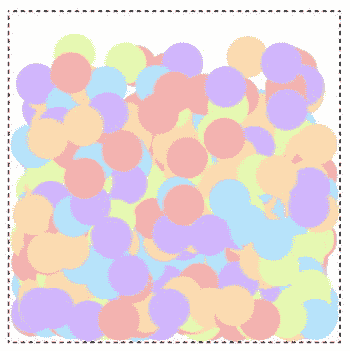

第五章


让东西动起来

快谢幕了！你的小精灵们都打扮好了，他们背好了台词，准时到达排练厅，耐心地站在舞台上等着你指挥他们。现在怎么办？你需要让它们生动起来！

游戏中有两种主要的精灵动画制作方式:

*   脚本动画:让精灵在屏幕上移动。
*   **关键帧动画**:改变精灵的外观。显示一系列略有不同的预渲染图像，就像绘制手绘卡通或动画书一样。

关键帧动画是关于动画精灵的外观，而脚本动画是关于动画其在屏幕上的 *x，y* 位置。在这一章中，你将学习如何使用脚本动画让精灵移动。在第八章中，你将学习如何制作关键帧动画来创造游戏角色行走的效果。

在这一章中，我们还将详细了解游戏循环:让精灵移动的循环功能。您将学习一些将游戏的更新逻辑与其渲染逻辑分离的策略，以实现尽可能平滑的精灵动画。

基本运动

要使用脚本动画制作精灵动画，你需要改变它在**游戏循环**中的 *x，y* 位置。游戏循环是一种每秒更新 60 次的功能，这样你就可以逐渐改变精灵的位置来创造运动的幻觉。所有的精灵动画和大部分游戏逻辑都发生在游戏循环中。用 JavaScript 和 HTML5 做游戏循环最好的方法就是用一个叫`window.requestAnimationFrame`的方法。这里有一些代码来说明如何使用这个方法让一个球从画布的边缘反弹出去。([图 5-1](#Fig1) 说明了这段代码的作用。)

```js
//Import code from the library
import {makeCanvas, circle, stage, render} from "../library/display";

//Create the canvas and stage
let canvas = makeCanvas(256, 256);
stage.width = canvas.width;
stage.height = canvas.height;

//Create a ball sprite
//`circle` arguments: diameter, fillStyle, strokeStyle, lineWidth, x, y
let ball = circle(32, "gray", "black", 2, 96, 128);

//Set the ball's velocity
ball.vx = 3;
ball.vy = 2;

//Start the game loop
gameLoop();

function gameLoop() {
  requestAnimationFrame(gameLoop);

  //Move the ball
  ball.x += ball.vx;
  ball.y += ball.vy;

  //Bounce the ball off the canvas edges.
  //Left and right
  if(ball.x < 0
  || ball.x + ball.diameter > canvas.width) {
    ball.vx = -ball.vx;
  }

  //Top and bottom
  if(ball.y < 0
  || ball.y + ball.diameter > canvas.height) {
    ball.vy = -ball.vy;
  }

  //Render the animation
  render(canvas);
}
```


[图 5-1](#_Fig1) 。以每秒 60 帧的速度在画布上拍球

 **注意**这段代码使用了从`library`文件夹中的`display`模块导入的方法和对象。第 4 章展示了如何导入和使用这些工具。你会在本章的源文件中找到`library`文件夹。

**速度**是球运行的速度和方向。它由两个 sprite 属性表示:`vx`和`vy` 。

```js
ball.vx = 3;
ball.vy = 2;
```

`vx`代表球的水平速度:向右或向左移动的速度。`vy`代表它的垂直速度:上下移动的速度有多快。

 **注**`vx`和`vy`这两个属性实际上代表一个矢量。请参阅附录，了解什么是矢量以及如何在游戏中利用矢量的力量。

球移动是因为它的速度被加到了它在`requestAnimationFrame`循环中的当前位置:

```js
gameLoop();

function gameLoop() {
  requestAnimationFrame(gameLoop);

  ball.x += ball.vx;
  ball.y += ball.vy;

  //...
}
```

对于每个新帧，球的 *x* 位置将改变 3 个像素，其 *y* 位置将改变 2 个像素。因为运动的变化很小，而且代码每秒钟更新 60 次，所以会产生运动的错觉。这是脚本动画的基础。

`requestAnimationFrame`方法是驱动连续循环代码的引擎。它的参数是应该在循环中调用的函数:

```js
requestAnimationFrame(functionToLoop);
```

告诉浏览器应该以 16 毫秒(每秒 60 次)的间隔调用循环函数。每个循环更新都被称为一个**动画帧**，因为该效果模拟了一个运行的视频或连续画面。(视频和电影由一系列静止图像组成，称为**帧**，它们按顺序播放以创造运动的错觉。)显示这些帧的实际速率与显示器的屏幕刷新率同步，通常为 60Hz(但不总是这样；在本章快结束时，你会学到一些应对这些差异的策略。这种同步使循环高度优化，因为浏览器只会在最合适的时候调用循环代码，而不会忙于执行其他任务。

 **注意**无论你是在循环函数的开头还是结尾调用`requestAnimationFrame`都没关系。那是因为`requestAnimationFrame`没有在代码中出现的地方调用循环函数；它只是允许浏览器随时调用循环函数。

`requestAnimationFrame`可以向循环函数传递一个可选的**时间戳**参数。时间戳告诉你自从`requestAnimationFrame`第一次开始循环以来已经过了多少毫秒。下面是访问时间戳的方法:

```js
function gameLoop(timestamp) {
  requestAnimationFrame(gameLoop);
  console.log(`elapsed time: ${timestamp}`);
}
```

在这一章的结尾，你会学到如何使用这个时间戳来微调游戏循环。

 **注意**你也可以用`Date.now()`来捕捉当前的 UTC 时间，单位是毫秒。UTC(协调世界时)，也称为 Unix 时间，是一种标准的时间度量单位，它告诉您自 1970 年 1 月 1 日以来已经过去了多少毫秒。您可以通过捕获当前的 UTC 时间，将其与更早或更晚的时间进行比较，并使用差值来计算运行时间，从而将它用作通用时间戳。为了获得更高的精度，使用`Performance.now()`，它会给你一个精确到千分之一毫秒的时间。

在第一个例子中，球从画布的边缘反弹回来。它是怎么做到的？两个`if`语句检查球的边缘是否碰到画布的边缘。如果这是真的，球的速度是相反的。

```js
//Left and right
if(ball.x < 0
|| ball.x + ball.diameter > canvas.width) {
  ball.vx = -ball.vx;
}

//Top and bottom
if(ball.y < 0
|| ball.y + ball.diameter > canvas.height) {
  ball.vy = -ball.vy;
}
```

在速度(`ball.vx`和`ball.vy`)前加一个负号会使球在碰到画布边缘时改变方向。

增加加速度和摩擦力

您可以通过添加物理属性，如加速度和摩擦力，使对象以更自然的方式移动。加速度使物体逐渐加速，摩擦力使其减速。[图 5-2](#Fig2) 显示了一个逐渐加速的球的例子。当它碰到画布的边缘时，会反弹回来并减速停止。


[图 5-2](#_Fig2) 。用加速度加速，用摩擦力减速

为了实现这一点，向 sprite 添加一些新的`acceleration`和`friction`属性，并将其速度初始化为零:

```js
let ball = circle(32, "gray", "black", 2, 64, 96);

//Set the ball's velocity to 0
ball.vx = 0;
ball.vy = 0;

//Acceleration and friction properties
ball.accelerationX = 0.2;
ball.accelerationY = -0.2;
ball.frictionX = 1;
ball.frictionY = 1;
```

加速度值 *x* 和 *y* 分别为 0.2 和–0.2，这是您希望球的速度在每一帧中增加的量。摩擦力 *x* 和 *y* 的值 1 是速度应该乘以的量，以使其减速。你不希望最初对球施加任何摩擦力，所以将值指定为 1 实质上意味着“没有摩擦力”(那是因为速度乘以 1 只是得到相同的速度值，没有任何变化。1 乘以 1 等于 1，对吗？)任何小于 1 的摩擦力值，比如 0.98，都会使物体逐渐减速。加速度和摩擦力可以不同地影响 *x* 和 *y* 轴，因此每个轴都有摩擦力和加速度属性。

下面是使用这些属性使球加速的游戏循环。球一碰到画布边缘，加速度就设置为零，摩擦力设置为 0.98，使球逐渐减速并停止。

```js
//Start the game loop
gameLoop();

function gameLoop() {
  requestAnimationFrame(gameLoop);

  //Apply acceleration to the velocity
  ball.vx += ball.accelerationX;
  ball.vy += ball.accelerationY;

  //Apply friction to the velocity
  ball.vx *= ball.frictionX;
  ball.vy *= ball.frictionY;

  //Move the ball by applying the new calculated velocity
  //to the ball's x and y position
  ball.x += ball.vx;
  ball.y += ball.vy;

  //Bounce the ball off the canvas edges and slow it to a stop

  //Left and right
  if(ball.x < 0
  || ball.x + ball.diameter > canvas.width) {

    //Turn on friction
    ball.frictionX = 0.98;
    ball.frictionY = 0.98;

    //Turn off acceleration
    ball.accelerationX = 0;
    ball.accelerationY = 0;

    //Bounce the ball on the x axis
    ball.vx = -ball.vx;
  }

  //Top and bottom
  if(ball.y < 0
  || ball.y + ball.diameter > canvas.height) {

    //Turn on friction
    ball.frictionX = 0.98;
    ball.frictionY = 0.98;

    //Turn off acceleration
    ball.accelerationX = 0;
    ball.accelerationY = 0;

    //Bounce the ball on the y axis
    ball.vy = -ball.vy;
  }

  //Render the animation
  render(canvas);
}
```

你可以在前面的代码中看到加速度是*加到球的速度*上的:

```js
ball.vx += ball.accelerationX;
ball.vy += ball.accelerationY;
```

摩擦力是*乘以*球的速度:

```js
ball.vx *= ball.frictionX;
ball.vy *= ball.frictionY;
```

要使球移动，将其新速度添加到当前位置:

```js
ball.x += ball.vx;
ball.y += ball.vy;
```

通过在游戏中的某个地方改变球的摩擦力和加速度值，例如当它撞到画布边缘时，该代码将正确地重新计算球的速度。在下一章，你将学习如何使用鼠标、键盘和触摸来改变精灵的加速度和摩擦力。

重力

重力是作用在物体上的持续向下的力。您可以通过将一个恒定的正值应用到精灵的垂直速度(`vy`)来将其添加到精灵，如下所示:

```js
ball.vy += 0.3;
```

 **注意**记住，画布的 *y* 位置随着你从画布的顶部移动到底部而增加。这意味着如果你想把一个物体拉下来，你必须给它的 *y* 位置加上一个值，而不是减去它。

如果你混合重力和弹跳效果，你可以创建一个非常真实的弹跳球模拟。从本章的源代码中运行`gravity.html`文件以获得一个工作示例。球以随机速度开始，在画布上反弹，并逐渐滚动到底部停止。[图 5-3](#Fig3) 说明了你将会看到的东西。


[图 5-3](#_Fig3) 。添加一些重力来制作一个真实的弹跳球

不仅仅是重力有助于创造这种效果。为了增加一点真实性，球也有质量和摩擦力。当球击中画布的一个边缘时，其质量从速度中扣除，以模拟表面吸收一些冲击力。当球在地面上时，一些摩擦力作用于其在 *x* 轴上的速度。两种力量都以一种非常现实的方式让球慢下来。没有它们，球将继续在画布上无休止地反弹，而不会失去任何动量。让我们看看完成所有这些的代码。

`ball` sprite 增加了四个新属性 : `gravity`、`mass`、`frictionX`和`frictionY`。它还被初始化为随机的`vx`和`vy`速度，这样每次程序运行时球以不同的力和方向值移动:

```js
let ball = circle(32, "gray", "black", 2, 96, 128);

//Random velocity
ball.vx = randomInt(5, 15);
ball.vy = randomInt(5, 15);

//Physics properties
ball.gravity = 0.3;
ball.frictionX = 1;
ball.frictionY = 0;
ball.mass = 1.3;
```

`mass`应该是大于 1 的任何数字。

可以看到 random `vx`和`vy`属性被初始化为 5 到 15 之间的随机数。我们的代码在你在[第一章](01.html)中学到的自定义`randomInt`函数的帮助下做到了这一点:

```js
function randomInt(min, max) {
  return Math.floor(Math.random() * (max - min + 1)) + min;
}
```

如果你在游戏中需要随机的浮点数，你可以使用相关的函数`randomFloat` :

```js
function randomFloat(min, max) {
   return min + Math.random() * (max - min);
}
```

下面是一个游戏循环，它使用这些属性使球下落并从画布边缘弹开:

```js
//Start the game loop
gameLoop();

function gameLoop() {
  requestAnimationFrame(gameLoop);

  //Apply gravity to the vertical velocity
  ball.vy += ball.gravity;

  //Apply friction. `ball.frictionX` will be 0.96 if the ball is
  //on the ground, and 1 if it's in the air
  ball.vx *= ball.frictionX;

  //Move the ball by applying the new calculated velocity
  //to the ball's x and y position
  ball.x += ball.vx;
  ball.y += ball.vy;

  //Bounce the ball off the canvas edges and slow it to a stop

  //Left
  if (ball.x < 0) {
    ball.x = 0;
    ball.vx = -ball.vx / ball.mass;
  }

  //Right
  if (ball.x + ball.diameter > canvas.width) {
    ball.x = canvas.width - ball.diameter;
    ball.vx = -ball.vx / ball.mass;
  }

  //Top
  if (ball.y < 0) {
    ball.y = 0;
    ball.vy = -ball.vy / ball.mass;
  }

  //Bottom
  if(ball.y + ball.diameter > canvas.height) {

    //Position the ball inside the canvas
    ball.y = canvas.height - ball.diameter;

    //Reverse its velocity to make it bounce, and dampen the effect with mass
    ball.vy = -ball.vy / ball.mass;

    //Add some friction if it's on the ground
    ball.frictionX = 0.96;
  } else {

    //Remove friction if it's not on the ground
    ball.frictionX = 1;
  }

  //Render the animation
  render(canvas);
}
```

你可以看到重力是*加到*球的`vy`属性上的:

```js
ball.vy += ball.gravity;
```

随着时间的推移，这逐渐将球拉向画布的底部。

 **注意**在这个例子中，重力是球的一个属性，但是在游戏中，你可能想把它创建为一个影响所有精灵的全局值。

四个`if`语句检查球和画布边缘之间的碰撞。如果球越过画布边界，它会被移回，这样它就刚好在边界内。例如，如果球穿过画布的右侧，其 *x* 位置被设置为等于画布的宽度减去球直径的一半。

```js
ball.x = canvas.width - ball.diameter;
```

这些检查确保球完全脱离画布边界，并且当它的速度改变时不会被它们粘住。

接下来，球的速度被逆转，使其反弹。该代码还将球的速度除以它的`mass` (1.3)，以便在撞击中损失一点力。当球击中画布的右侧时会发生这种情况:

```js
ball.vx = -ball.vx / ball.mass;
```

这将使球在每次撞击表面时逐渐减速。

检查球是否击中画布底部的`if`语句还做了一件事。它将球的摩擦力设置为 0.96，这样如果球在地面上，速度会更慢。

```js
if(ball.y + ball.diameter > canvas.height) {
  ball.y = canvas.height - ball.radius;
  ball.vy = -ball.vy / ball.mass;
  ball.frictionX = 0.96;
} else {
  ball.frictionX = 1;
}
```

如果球不在地面上，`else`块将球的摩擦力设置回 1，这样它就可以在空中自由移动。

从这些例子中你可以看到，只需要一些简单的物理属性和一点逻辑，就可以很容易地让精灵以复杂而有趣的方式运行。我希望这个物理学的快速介绍会启发你开始在你自己的游戏中使用它。真的没有比这更复杂的了。

在一个区域内包含精灵

在一个区域中包含一个精灵，比如画布的边缘，是一个非常常见的游戏设计需求。因此，让我们创建一个名为`contain`的函数，您可以在任何游戏项目中使用它，就像这样:

```js
let collision = contain(sprite, bounds, bounce, callbackFunction)
```

第一个参数是要包含的 sprite，第二个参数`bounds`是一个对象，它具有定义包含区域的 *x* 、 *y* 、width 和 height 属性。如果精灵从边界边缘反弹，将`bounce`(第三个参数)设置为`true`。您还可以提供一个可选的额外回调函数(第四个参数),如果 sprite 碰到任何边界边缘，该函数将运行。`contain`函数返回一个名为`collision` 的变量，它告诉你精灵是否碰到了边界的`"top"`、`"left"`、`"bottom"`或`"right"`边缘。下面是完整的`contain`功能:

```js
export function contain (sprite, bounds, bounce = false, extra = undefined){

  let x = bounds.x,
      y = bounds.y,
      width = bounds.width,
      height = bounds.height;

  //The `collision` object is used to store which
  //side of the containing rectangle the sprite hits
  let collision;

  //Left
  if (sprite.x < x) {

    //Bounce the sprite if `bounce` is true
    if (bounce) sprite.vx *= -1;

    //If the sprite has `mass`, let the mass
    //affect the sprite's velocity
    if(sprite.mass) sprite.vx /= sprite.mass;
    sprite.x = x;
    collision = "left";
  }

  //Top
  if (sprite.y < y) {
    if (bounce) sprite.vy *= -1;
    if(sprite.mass) sprite.vy /= sprite.mass;
    sprite.y = y;
    collision = "top";
  }

  //Right
  if (sprite.x + sprite.width > width) {
    if (bounce) sprite.vx *= -1;
    if(sprite.mass) sprite.vx /= sprite.mass;
    sprite.x = width - sprite.width;
    collision = "right";
  }

  //Bottom
  if (sprite.y + sprite.height > height) {
    if (bounce) sprite.vy *= -1;
    if(sprite.mass) sprite.vy /= sprite.mass;
    sprite.y = height - sprite.height;
    collision = "bottom";
  }

  //The `extra` function runs if there was a collision
  //and `extra` has been defined
  if (collision && extra) extra(collision);

  //Return the `collision` object
  return collision;
};
```

下面是如何使用这个`contain`函数来替换前一个例子中重力代码的原始版本中的四个`if`语句:

```js
let collision = contain(ball, stage.localBounds, true);
```

如果球击中了舞台的任何边界，`collision`变量将具有值`"top"`、`"right"`、`"bottom"`或`"left"`。第二个参数显示了如何使用 sprite 的`localBounds`属性，你在第 4 章的[中学到了这一点。`localBounds`是一个具有 *x* 、 *y* 、宽度和高度属性的对象，定义了一个矩形区域。您也可以通过提供一个自定义的`bounds`对象作为第二个参数来达到同样的效果，如下所示:](04.html)

```js
let collision = contain(
  ball,
  {x: 0, y: 0, width: canvas.width, height: canvas.height},
  true
);
```

使用 stage 的`localBounds`属性是一种方便的快捷方式。

如果球碰到了舞台的边界，`collision`变量会告诉你碰撞发生在舞台的哪一边。在这个重力的例子中，如果球碰到画布的底部，你想让球慢下来。这意味着你可以检查`collision`是否有`"bottom"`的值，如果有，给球施加一些摩擦力:

```js
if (collision === "bottom") {
  ball.frictionX = 0.96;
} else {
  ball.frictionX = 1;
}
```

`contain`函数的另一个特性是可以添加一个额外的可选回调函数作为第四个参数。以下是如何:

```js
let collision = contain(
  ball, stage.localBounds, true,
  () => {
    console.log("Hello from the extra function!");
  }
);
```

每当球碰到舞台边界时，额外回调函数中的代码就会运行。这是一种将一些定制代码注入到`contain`函数中的便捷方式，无需修改函数本身。`contain`函数检查这个额外回调的存在，并在返回`collision`值之前运行它。下面是来自`contain`函数的代码:

```js
if (collision && extra) extra(collision);
```

您可以看到，`extra`回调也可以访问`collision`值，所以如果需要的话，它可以使用这些信息。这是一个非常有用技巧，你会在本书中看到更多的例子。

仅供参考，这里是重力示例的整个`gameLoop`，其中四个`if`语句被`contain`函数替换为

```js
function gameLoop() {
  requestAnimationFrame(gameLoop);

  //Move the ball
  ball.vy += ball.gravity;
  ball.vx *= ball.frictionX;
  ball.x += ball.vx;
  ball.y += ball.vy;

  //Check for a collision between the ball and the stage boundaries
  let collision = contain(ball, stage.localBounds, true);
  if (collision === "bottom") {
    //Slow the ball down if it hits the bottom
    ball.frictionX = 0.96;
  } else {
    ball.frictionX = 1;
  }

  //Render the animation
  render(canvas);
}
```

这比原来的代码少得多，您可以在任何其他项目中重用`contain`函数。

微调游戏循环

现在你知道了用代码让精灵移动的所有基础知识。很简单，不是吗？但是你还需要知道一些关于游戏循环的东西，这样你才能最大限度地控制精灵在屏幕上的移动。在本章的后半部分，你将学习如何设置游戏的帧率，以及如何微调游戏循环以获得最平滑的精灵动画。

第一步，也是最重要的一步，是将游戏逻辑和渲染逻辑分离开来。你已经完成了一半:所有的精灵渲染都发生在你在前一章学过的`render`函数中。你需要做的唯一新的事情就是将游戏逻辑保持在自己的函数`update` 中。当游戏循环运行时，它将首先更新游戏逻辑，然后渲染精灵:

```js
gameLoop();

function gameLoop() {
  requestAnimationFrame(gameLoop);

  //update the game logic
  update();

  //Render the sprites
  render(canvas);
}

function update() {
  //All your game logic goes here
}

function render(canvas) {
  //The same rendering code from Chapter 4
}
```

在前面的例子中，您将会看到这个额外的模块化变得多么重要。

设置帧速率

显示一系列动画帧的速度被称为**帧率** ，以每秒帧数衡量，或 **fps** 。它是动画每秒钟更新或改变的次数。帧速率越高，动画越流畅，帧速率越低，动画越不流畅。任何动画的帧速率通常由一个名为`fps`的变量的值决定。如果你想让你的动画每秒播放 12 帧，你可以这样设置`fps`:

```js
fps = 12
```

Fps 对于我们人类来说是一个容易理解的度量，但是 JavaScript 是以毫秒为单位，而不是以帧为单位。因此，如果我们想要使用`fps`值以固定的间隔播放帧，我们需要使用基于毫秒的帧速率。将`fps`除以 1000，计算出每帧之间应该间隔多少毫秒，如下所示:

```js
frameRate = 1000 / fps
```

如果`fps`是 12，那么`frameRate`将是 83 毫秒。这是总的思路，但是怎么用它来控制我们游戏的帧率呢？

在大多数系统上，以 60Hz 的速度更新画布，这意味着你的游戏循环将以每秒 60 帧的速度运行。又快又流畅。`requestAnimationFrame`为您提供最流畅的动画，因为浏览器会在一次屏幕刷新中以固定的帧间隔绘制所有屏幕图形。它充分利用了宝贵的 CPU 时间。

每秒 60 帧的帧速率意味着你有大约 16 毫秒的空闲时间来运行你的游戏代码。实际上，两帧之间只有 13 毫秒，因为浏览器进程会到处消耗掉额外的几毫秒。为了安全起见，再多加几毫秒，假装你真的只有 10 毫秒。因此，这是 10 毫秒空闲 CPU 时间的预算，用于完成所有的游戏逻辑、物理、UI 处理和图形渲染。这并不多，这也是为什么游戏开发者倾向于痴迷于性能和优化。如果您在某处只能节省 1 毫秒的处理时间，那么这大约是您性能预算的 10%。如果你的游戏代码需要超过 10 毫秒来运行，帧速率将会下降，动画将会变成 **janky** 。我们都知道简洁性是什么:紧张、跳动和口吃的动画打破了游戏世界的沉浸感。

邱建缉捕队

简洁性经常是由 JavaScript 的**垃圾收集器**执行自动化内存管理任务造成的。不幸的是，您无法控制垃圾收集器何时运行，也无法控制它的工作效率。垃圾收集由 JavaScript 运行时环境(通常是 web 浏览器)管理，您只能希望它能很好地完成工作。

大多数 web 浏览器开发工具都有一个帧率图，告诉你游戏运行的速度。如果你在游戏运行的时候看图表，你可能会注意到一切看起来都很好，然后，不知从哪里，帧速率会有一个短暂的下降。这叫做**尖峰**，如图[图 5-4](#Fig4) 所示。尖刺是 jankiness 的常见原因。


[图 5-4](#_Fig4) 。游戏设计者的克星:帧速率峰值！

当游戏或浏览器的处理量突然增加时，就会出现峰值。您可以通过在开发人员工具中打开浏览器的帧时间线查看器并查看帧图形来查看其原因。帧图告诉你游戏中的每一帧花了多少毫秒来处理。它还显示了游戏中每段代码在每一帧中运行的确切时间。如果你注意到任何不寻常的峰值，检查一下是什么引起的。通常，最大的峰值是由浏览器自动垃圾收集引起的，如图 5-5 所示。


[图 5-5](#_Fig5) 。消耗 33 毫秒处理时间的垃圾收集事件

图 5-5 中的垃圾收集事件花费了 33 毫秒。因此，即使你的游戏以 60 帧/秒的速度流畅运行，垃圾收集事件也会使它突然下降到 20 帧/秒，导致短暂的抖动。那么，垃圾收集器实际上在做什么，用 33 毫秒来运行呢？

有时候很难说。但是最大的垃圾收集高峰通常是由浏览器清除图形渲染所需的临时数据引起的。最好的解决方案是尽可能使用 Canvas 或 WebGL 来渲染你的精灵，因为它们比 DOM 渲染更节省资源。如果你不认为你有一个渲染瓶颈，你有任何循环，递归函数，或排序算法可能会导致它吗？你正在使用一个进行大量密集计算的物理库吗？如果你已经做了你认为你能做的所有优化，而你的游戏仍然是 janky，考虑降低你游戏的帧速率。

 **注**现代垃圾收集器学习如何在游戏运行时管理游戏内存。因此，在最初的几秒钟内，您可能会看到许多内存峰值，然后随着游戏的继续运行，这些峰值会越来越少。

设置游戏的帧速率

如果你将游戏的帧速率设置在 30 到 50 fps 之间，你将赢得一点不错的开销，而你的游戏看起来仍然运行流畅。30 fps 是你应该考虑的最低速度。

以下是设置帧速率的方法:

1.  决定你的速率:12 fps，30 fps，40 fps，或者任何你想使用的速率。
2.  算出帧时长。每帧之间应该间隔多少毫秒？这将是 1000 毫秒除以帧速率。例如，如果您的帧速率为 30 fps，则每帧的持续时间应为 33 毫秒。
3.  仅当自上一帧以来经过的时间与帧持续时间匹配时，才更新该帧。
4.  将下一帧的更新时间设置为当前时间加上帧持续时间。

下面是一些代码的例子，这些代码可以让游戏以每秒 30 帧的速度运行:

```js
//Set the frame rate and find the frame duration in milliseconds
let fps = 30,
    start = 0,
    frameDuration = 1000 / fps;

//Start the game loop
gameLoop();

function gameLoop(timestamp) {
  requestAnimationFrame(gameLoop);
  if (timestamp >= start) {

    //update the game logic
    update();

    //Render the sprites
    render(canvas);

    //Reset the frame start time
    start = timestamp + frameDuration;
  }
}
```

这段代码并不能保证你的游戏运行速度不会低于 30fps，只是保证不会超过 30 fps。代码**将帧速率钳位在上限 30 fps。如果它运行得更慢，你可能在你的游戏代码中的某个地方有更大的问题，无论如何调整帧速率都不可能解决。这时就该深入代码，查找内存泄漏或进行一些真正激进的优化了。**

像这样固定帧速率还有另一个优势:它让你的游戏在所有设备上以一致的速度运行。`requestAnimationFrame`方法与显示器的刷新率同步，通常是 60Hz——但并不总是如此。许多较新的显示器和设备屏幕有 120Hz 的刷新率，这使得`requestAnimationFrame`以双倍的速度运行:每秒 120 帧。通过设置帧率，可以保证你的游戏在任何平台上运行都不会太快。

固定更新时间，可变渲染时间

还有一个更进一步的方法来优化游戏循环。不是以相同的帧速率运行`update`和`render`函数，而是以不同的速率运行它们。例如，您可以以固定的每秒 30 帧的速度运行`update`游戏逻辑，并让`render`功能以每个用户系统能够运行的最大速度运行——60 fps、120 fps 或更高。为此，你的精灵需要两个位置:一个由游戏逻辑设置，另一个由渲染器设置。但是您还想消除由系统处理开销引起的帧速率波动，这样动画就不会抖动。在一些简单数学的帮助下，你可以使渲染的精灵的位置与游戏逻辑保持紧密同步，即使它们在不同的时间被调用，即使在帧速率上可能有小的停顿。这是一种叫做**的技术，固定时间步长，可变渲染**。在一个完美的世界里，它会给你最大的游戏逻辑计算空间。而且只要你的游戏逻辑帧率小于你的渲染帧率，你的精灵动画看起来就会很流畅，没有 jank。

它是如何工作的？假设您决定以 15 fps 的速度更新游戏逻辑，以 60 fps 的速度更新渲染逻辑。你运行一个普通的`requestAnimationFrame`循环，它以大约 60 fps 的速度运行。每一帧都调用`render`函数，但是直到最后一帧等于 15 fps 时才更新游戏逻辑。理想情况下，您最终会得到对`update`和`render`的调用，如下所示:

```js
update
render
render
render
render
update
render
render
render
render
update
```

但是由于不可避免的现实世界的简洁性，一些渲染调用可能会间歇性地下降到 30 fps 或更低。这意味着对`update`和`render`的调用实际上可能是这样的:

```js
update
render
render
update
render
update
render
render
render
update
```

你可以看到`update`仍然以固定的速率被调用，但是`render`是波动的。如果您在两次更新调用之间遇到滞后的`render`调用，会发生什么？

```js
update
render
update
```

除非我们采用一种叫做**插值**的技术，它在两次更新调用之间平均出一个精灵的渲染位置，否则动画看起来仍然很滑稽。插值消除帧速率中的不一致，这样即使在低帧速率下你也可以有非常平滑的精灵动画。让我们来看看它是如何工作的。

编写代码

这是实现所有这些概念的新游戏循环。注意，代码调用了一个名为`renderWithInterpolation` 的新函数来呈现精灵。我将在前面解释这是如何工作的。

```js
let fps = 30,
    previous = 0,
    frameDuration = 1000 / fps,
    lag = 0;

function gameLoop(timestamp) {
  requestAnimationFrame(gameLoop);

  //Calculate the time that has elapsed since the last frame
  if (!timestamp) timestamp = 0;
  let elapsed = timestamp - previous;

  //Optionally correct any unexpected huge gaps in the elapsed time
  if (elapsed > 1000) elapsed = frameDuration;

  //Add the elapsed time to the lag counter
  lag += elapsed;

  //Update the frame if the lag counter is greater than or
  //equal to the frame duration
  while (lag >= frameDuration) {

    //Update the game logic
    update();

    //Reduce the lag counter by the frame duration
    lag -= frameDuration;
  }

  //Calculate the lag offset. This tells us how far
  //we are into the next frame
  let lagOffset = lag / frameDuration;

  //Render the sprites using the `lagOffset` to
  //interpolate the sprites' positions
  renderWithInterpolation(canvas, lagOffset);

  //Capture the current time to be used as the previous
  //time in the next frame
  previous = timestamp;
}
```

`gameLoop`首先计算出自前一帧以来已经过去了多长时间:

```js
let elapsed = timestamp - previous;
```

看一下`gameLoop`中的最后一行，您会看到`previous`是对`timestamp`T3 的当前值的引用:

```js
previous = timestamp;
```

因此，当下一帧摆动时，`previous`仍将包含旧值。这就是为什么我们可以在循环开始时使用它来帮助计算自上一帧以来经过的时间。

作为额外的预防措施，代码首先检查`elapsed`时间是否不大于某个非常大的值，比如 1 秒。如果是这种情况，游戏代码可能已经崩溃，或者用户可能已经切换了浏览器标签:

```js
if (elapsed > 1000) elapsed = frameDuration;
```

这只是将`elapsed`时间设置回合理时间的安全网。

名为`lag` 的变量用于计算帧之间经过的时间:

```js
lag += elapsed;
```

当`lag`累积的量大于或等于帧速率时，它复位并调用`update`函数:

```js
while (lag >= frameDuration) {
  update();
  lag -= frameDuration;
}
```

正是这个`while`循环充当了一种帧速率不一致的减震器。它会根据需要多次调用`update`函数，直到`lag`赶上当前的帧速率。

接下来，代码使用滞后量来计算更新帧速率和渲染帧速率之间的差异。该值保存在名为`lagOffset` 的变量中:

```js
let lagOffset = lag / frameDuration;
```

`lagOffset`值给出了更新帧速率和渲染帧速率之间的比例差。它将是一个介于 0 和 1 之间的正常数字。(这个值通常被称为时间增量，或 dt。)这是我们需要的值，使用新的`renderWithInterpolation`函数来帮助计算出小精灵应该被渲染的精确位置。

```js
renderWithInterpolation(canvas, lagOffset);
```

`renderWithInterpolation`如何在更新帧速率和渲染帧速率之间找到折衷的精灵位置？

插入文字

让我们想象游戏逻辑以每秒 15 帧的速度更新，精灵以每秒 60 帧的速度渲染。这意味着每个更新调用将有四个呈现调用。为了保持动画流畅，渲染器需要猜测在每次更新之间应该在哪些位置显示精灵，并在这些位置绘制精灵。这叫做插值。下面是计算它的基本公式:

```js
renderedPosition = (currentPosition - previousPosition) * lagOffset + previousPosition;
```

公式的关键部分是精灵的速度是通过从它在当前帧中的位置减去它在上一帧中的位置来动态计算的。怎么知道小精灵之前的位置是什么？在对精灵做任何改变之前，你的第一步就是在每一帧捕捉精灵的当前位置。然后，您可以使用该捕捉位置作为精灵在下一帧中的前一个位置。下面是如何实施这一策略:

```js
function update() {

  sprite.previousX = sprite.x;
  sprite.previousY = sprite.y;

  //Next, change the sprite’s velocity and position
  //as you normally would for the current frame
}
```

下面是如何在我们的弹跳球示例中实现这一点:

```js
function update() {

  //Capture the ball's previous positions
  ball.previousX = ball.x;
  ball.previousY = ball.y;

  //Move the ball and bounce it off the stage’s edges
  ball.vy += ball.gravity;
  ball.vx *= ball.frictionX;
  ball.x += ball.vx;
  ball.y += ball.vy;

  let collision = contain(ball, stage.localBounds, true);
  if (collision === "bottom") {
    ball.frictionX = 0.96;
  } else {
    ball.frictionX = 1;
  }
}
```

当前帧完成更新后，`ball.previousX`和`ball.previousY`仍将包含前一帧的精灵位置值。

现在你可以使用`renderWithInterpolation`函数获取所有这些新数据，并用它来插值精灵的位置。`renderWithInterpolation`函数与你在前一章中学习使用的旧的`render`函数相同，除了计算精灵渲染位置的新代码。

```js
function renderWithInterpolation(canvas, lagOffset) {

  //...

  //Interpolate the position
  if (sprite.previousX) {
    sprite.renderX = (sprite.x - sprite.previousX) * lagOffset + sprite.previousX;
  } else {
    sprite.renderX = sprite.x;
  }

  if (sprite.previousY) {
    sprite.renderY = (sprite.y - sprite.previousY) * lagOffset + sprite.previousY;
  } else {
    sprite.renderY = sprite.y;
  }

  //Draw the sprite at its interpolated position
  ctx.translate(
    sprite.renderX + (sprite.width * sprite.pivotX),
    sprite.renderY + (sprite.height * sprite.pivotY)
  );

  //...
}
```

(你会在本书源代码的`library/display`文件夹中找到完整的`renderWithInterpolation`函数。)

现在，如果你将游戏的 fps 设置为 15，精灵仍然会以 60 fps 渲染，给你平滑，无抖动的动画和最小的开销。

 **注意**你可以用同样的方法插入其他的精灵属性，比如旋转和阿尔法。

插值多个精灵

如果你的游戏中有很多精灵，你需要在改变他们的当前位置之前捕捉他们所有的先前位置。一个简单的方法是在游戏循环中调用`update`之前运行一个`capturePreviousPositions`函数，就像这样:

```js
  while (lag >= frameDuration) {
    capturePreviousPositions(stage);
    update();
    lag -= frameDuration;
  }
```

`capturePreviousPositions`函数循环遍历所有精灵及其子精灵，并将它们之前的位置值设置为当前位置。

```js
function capturePreviousPositions(stage) {

  //Loop through all the children of the stage
  stage.children.forEach(sprite => {
    setPreviousPosition(sprite);
  });

  function setPreviousPosition(sprite) {

    //Set the sprite’s `previousX` and `previousY`
    sprite.previousX = sprite.x;
    sprite.previousY = sprite.y;

    //Loop through all the sprite's children
    if (sprite.children && sprite.children.length > 0) {
      sprite.children.forEach(child => {

        //Recursively call `setPosition` on each sprite
        setPreviousPosition(child);
      });
    }
  }
}
```

代码的其余部分将是相同的。[图 5-6](#Fig6) 显示了一个 500 个球的例子，游戏逻辑以 15 fps 运行，渲染器以 60 fps 运行。你可以在本章的源文件中找到完整的源代码。



[图 5-6](#_Fig6) 。插值允许在低帧速率下平滑动画

你应该这样做吗？

插值的取舍是什么？有几个。

因为插值的位置是基于精灵之前的位置，所以游戏世界的渲染视图总是稍微落后于游戏逻辑。如果逻辑以 30 fps 的速度运行，而渲染器以 60 fps 的速度运行，则时间差大约为 33 毫秒。这并不重要——玩家永远不会注意到它——但你应该意识到它正在发生。

另一个代价是您的代码变得更加复杂。如果你有一个需要大量处理开销的物理密集型游戏，这可能是值得的。但大多数游戏的最大瓶颈通常是渲染，而不是游戏逻辑计算。

还有一个副作用需要注意。如果有一个异常大的系统峰值，并且更新游戏逻辑比渲染精灵需要更长的时间，你会在动画中看到一个跳跃。动画将会停止，过一会儿你会看到精灵出现在动画没有中断的位置。在我们之前看到的不太复杂的游戏循环中，一个大的峰值只会导致动画变慢。这些影响并不一定更好或更坏；你只需要决定你更喜欢哪个。

最后，我应该提供一个关于过早优化的一般警告。我们看到的第一个，也是最基本的游戏循环很简单。这是在同一个循环中以最大帧速率调用`update`和`render`函数的地方:

```js
gameLoop();
function gameLoop() {
  requestAnimationFrame(gameLoop);
  update();
  render(canvas);
}
```

这可能就是你所需要的。浏览器厂商在不断调整、改变、改进和试验他们如何渲染图形，有时是以不可思议的方式。您需要小心，不要意外地编写一些与浏览器自己的渲染引擎相冲突的代码，最终导致性能比开始时更差。微调游戏循环和精灵渲染是一门艺术，而不是科学，所以保持开放的心态，尝试一切，并记住这一点:如果你的游戏看起来不错，运行良好，那么它就是好的。

摘要

在前一章你学习了如何创建精灵，在这一章你学习了如何让他们移动。您学习了如何通过使用`requestAnimationFrame`修改游戏循环中精灵的速度来更新其位置。您看到了通过应用加速度、摩擦力和重力来给精灵添加物理属性是多么容易，也看到了如何从边界墙上反弹精灵。我们仔细研究了使用可重用的`contain`函数模块化您的代码，您了解了一些优化游戏逻辑和渲染性能的详细策略。

现在我们可以制作精灵并移动它们，我们如何与它们互动呢？HTML5 和 JavaScript 具有使用鼠标、键盘和触摸来控制游戏的内置功能，你将在下一章了解这些功能是如何工作的。