# 六、交互性

欢迎来到最重要的游戏代码倒计时，你需要知道这些代码来增加你的精灵的互动性。现在你知道了如何让精灵移动，你将学习如何让他们与他们生活的游戏世界互动。

您还将学习如何为游戏创建两个最有用的交互对象:可点击的按钮和可拖动的精灵。你需要知道的关于给你的游戏世界增加丰富交互性的一切都在这一章里。

键盘、鼠标和触摸

添加键盘、鼠标或触摸交互的第一步是设置一个**事件监听器**。事件监听器是内置在浏览器中的一段代码，它“监听”玩家是否按下了键盘上的按键、触摸了屏幕或者移动或点击了鼠标。如果监听器检测到一个事件，它会调用一个**事件处理程序**，这只是一个在你的游戏中执行某种重要动作的函数。事件处理程序可能会让玩家的角色移动，计算鼠标的速度，或者接受一些输入。事件监听器和处理程序就像是人类世界和游戏世界之间的桥梁。在本章的第一部分，你将学习如何为键盘、触摸和鼠标事件添加事件监听器和处理程序，以及如何使用它们在游戏世界中创造有趣的事情。先说键盘交互性。

 **注意**html 5 规范还包括一个游戏手柄 API，可以让你捕捉游戏控制器按钮的输入。查看`dvcs.w3.org`处的规格。它像键盘、鼠标和触摸事件一样易于使用。

捕捉键盘事件

如果您想知道玩家是否按下了键盘上的某个键，可以添加一个带有`keydown`事件的事件监听器。然后编写一个使用 ASCII 码`keyCode`的`keyDownHandler`来找出哪个键被按下了。以下是你如何发现一个玩家是否按下了空格键。(空格键的键码是 32，在网上快速搜索“ASCII 键码”会显示一个完整的列表。)

```js
window.addEventListener("keydown", keydownHandler, false)
function keydownHandler(event) {
  if(event.keyCode === 32) {
    console.log("Space key pressed");
  }
}
```

这段代码运行良好，但是对于大多数游戏来说，你还需要使用一个`keyup`事件来告诉你这个键是否已经被释放。检查这一点的一个好方法是创建一个属性为`isDown`和`isUp` 的`key`对象。根据按键的状态，将这些属性设置为`true`或`false`。这将允许您使用`if`语句检查击键，如下所示:

```js
if (space.isDown) {
  //do this!
}
if (space.isUp) {
  //do this!
}
```

这里是`space` 键对象，它将让您编写刚刚显示的`if`语句:

```js
let space = {
  code: 32,
  isDown: false,
  isUp: true,
  downHandler(event) {
    if(event.keyCode === this.code) {
      this.isDown = true;
      this.isUp = false;
    }
  },
  upHandler(event) {
    if(event.keyCode === this.code) {
      this.isUp = true;
      this.isDown = false;
    }
  }
};

//Add the event listeners and bind them to the space object
window.addEventListener(
  "keydown", space.downHandler.bind(space), false
);
window.addEventListener(
  "keyup", space.upHandler.bind(space), false
);
```

 **注意**注意如何使用`bind`方法将监听器连接到`space.downHandler`和`space.upHandler`方法。它确保在空间对象中引用“this”是指空间对象本身，而不是窗口对象。

这样做很好，但是如果我们还想为四个键盘箭头键(向上、向右、向下和向左)添加侦听器呢？我们不想把这 20 行重复的代码写五遍。我们可以做得更好！

让我们创建一个`keyboard`函数，该函数创建监听特定键盘事件的`key`对象。我们将能够像这样创建一个新的`key`对象:

```js
let keyObject = keyboard(asciiKeyCodeNumber);
```

然后，我们可以将`press`和`release`方法分配给关键对象，如下所示:

```js
keyObject.press = function() {
  //key object pressed
};
keyObject.release = function() {
  //key object released
};
```

我们的关键对象也将有`isDown`和`isUp`布尔属性，如果你需要的话可以检查它们。

下面是让我们实现的`keyboard`函数:

```js
export function keyboard(keyCode) {
  let key = {};
  key.code = keyCode;
  key.isDown = false;
  key.isUp = true;
  key.press = undefined;
  key.release = undefined;

  //The `downHandler`
  key.downHandler = function(event) {
    if (event.keyCode === key.code) {
      if (key.isUp && key.press) key.press();
      key.isDown = true;
      key.isUp = false;
    }

    //Prevent the event's default behavior
    //(such as browser window scrolling)
    event.preventDefault();
  };

  //The `upHandler`
  key.upHandler = function(event) {
    if (event.keyCode === key.code) {
      if (key.isDown && key.release) key.release();
      key.isDown = false;
      key.isUp = true;
    }
    event.preventDefault();
  };

  //Attach event listeners
  window.addEventListener(
    "keydown", key.downHandler.bind(key), false
  );
  window.addEventListener(
    "keyup", key.upHandler.bind(key), false
  );

  //Return the `key` object
  return key;
}
```

你会在本章源代码的`library/interactive.js`文件中找到这个完整的`keyboard`函数。

打开本章的源文件中的`keyObject.html`,查看这段代码的运行示例。按下并释放空格键，你会看到画布上显示“按下”和“释放”([图 6-1](#Fig1) )。

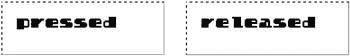

[图 6-1](#_Fig1) 。使用文本精灵告诉你一个键是被按下还是被释放

这是通过使用游戏循环来显示文本精灵的字符串内容来实现的。这个精灵的内容是由一个`space`键对象的`press`和`release`方法设置的。代码还使用`assets`对象加载自定义字体，并在准备就绪时调用`setup`函数。下面是完成这一切的完整代码:

```js
//Import code from the library
import {makeCanvas, text, stage, render} from "../library/display";
import {assets} from "../library/utilities";
import {keyboard} from "../library/interactive";

//Load a custom font
assets.load(["fonts/puzzler.otf"]).then(() => setup());

//Declare any variables shared between functions
let canvas;

function setup() {

  //Make the canvas and initialize the stage
  canvas = makeCanvas(256, 256);
  stage.width = canvas.width;
  stage.height = canvas.height;

  //Make a text sprite
  let message = text("Press space", "16px puzzler", "black", 16, 16);

  //Make a space key object
  let space = keyboard(32);

  //Assign `press` and `release` methods
  space.press = () => message.content = "pressed";
  space.release = () => message.content = "released";

  //Use a loop to display any changes to the text sprite's
  //`content` property
  gameLoop();
}

function gameLoop() {
  requestAnimationFrame(gameLoop);
  render(canvas);
}
```

现在，您已经有了一个通用系统，可以快速创建和监听键盘输入。在本章的后面，你会看到一个如何使用关键物体来控制一个互动游戏角色的例子。

捕获指针事件

既然你已经知道了如何增加键盘的交互性，让我们来看看如何创建交互式鼠标和触摸事件。鼠标和触摸的行为方式相似，所以把它们看作一个叫做“指针”的东西是很有用的在本节中，您将学习如何创建一个统一鼠标和触摸事件的通用`pointer`对象。然后你将学习如何使用新的`pointer`对象来增加游戏的交互性。

 **注**在撰写本文时，一个名为指针事件的 HTML5 规范正在开发中。如果当你读到这篇文章时，它已经被广泛实现了，这意味着你不再需要分叉你的代码来适应鼠标和触摸；指针事件对两者都适用。而且，非常方便的是，指针事件 API 几乎与鼠标事件 API 完全相同，所以没有什么新东西需要学习。只需在任何鼠标事件代码中将“鼠标”替换为“指针”,就可以了。然后将指针敏感元素的 CSS touch-action 属性设置为“none ”,以禁用浏览器的默认平移和缩放操作。关注这个规范，如果可以的话就使用它(`http://www.w3.org/TR/pointerevents/`)。

要创建鼠标或触摸事件，请将一个事件侦听器附加到要使其对指针敏感的 HTML 元素，如画布。然后让监听器在事件发生时调用事件处理程序:

```js
canvas.addEventListener("mousedown", downHandler, false);

function downHandler(event) {
  console.log("Pointer pressed down");
}
```

然而，对于我们游戏开发者来说，有一个小问题。如何检测玩家是否点击了什么东西？点击或点击只是指针非常快速的上下移动。任何超过 200 毫秒的时间都可以被定义为点击或点击。您可以通过比较 down 和 up 事件之间的时间来判断这是否已经发生。如果少于 200 毫秒，你可以假设玩家点击或点击了。下面是解决这个问题的一般方法。

首先，当指针向下时，用`Date.now()`捕捉当前时间:

```js
function downHandler(event) {
  downTime = Date.now();
}
```

`downTime`值现在包含了指针被按下的精确时间，以毫秒为单位。当指针上升时，捕捉新的时间，并计算从`downTime`开始已经过去了多长时间。如果少于 200 毫秒，那么你知道有一个点击或点击。

```js
function upHandler(event) {
  elapsedTime = Math.abs(downTime - Date.now());
  if (elapsedTime <= 200) {
    console.log("Tap or click!");
  }
}
```

为了帮助我们管理这一切，让我们创建一个`pointer`对象。除了点击或点击，指针还应该能够告诉我们它的 *x* 和 *y* 位置，以及它当前是向上还是向下。为了获得最大的灵活性，我们还将让用户定义可选的`press`、`tap`和`release`方法，这些方法可以在这些事件发生时运行一些自定义代码。此外，我们将赋予指针`centerX`、`centerY`和`position`属性，这样它的 API 就能很好地反映前一章中精灵的 API。正如你将在本书后面看到的，这是一种便利，它将使我们更容易使用带有碰撞检测功能的指针，你将在第 7 章中学习使用。

指针还会有一个前瞻性的属性叫做`scale` 。如果画布在浏览器窗口中被放大或缩小，属性`scale`将帮助我们调整指针的坐标。对于大多数游戏来说，默认比例值 1 就是你所需要的。但是如果你改变游戏的显示尺寸，你需要按比例修改指针的 *x* 和 *y* 坐标。(你会在第 11 章中看到这有多有用。)

这里有一个`makePointer`函数，它创建并返回一个`pointer`对象，为我们完成所有这些工作。它如何工作的本质细节在注释中，我将在代码清单之后向您展示如何使用它。

```js
export function makePointer(element, scale = 1) {

  let pointer = {
    element: element,
    scale: scale,

    //Private x and y properties
    _x: 0,
    _y: 0,

    //The public x and y properties are divided by the scale. If the
    //HTML element that the pointer is sensitive to (like the canvas)
    //is scaled up or down, you can change the `scale` value to
    //correct the pointer's position values
    get x() {
      return this._x / this.scale;
    },
    get y() {
      return this._y / this.scale;
    },

    //Add `centerX` and `centerY` getters so that we
    //can use the pointer's coordinates with easing
    //and collision functions
    get centerX() {
      return this.x;
    },
    get centerY() {
      return this.y;
    },

    //`position` returns an object with x and y properties that
    //contain the pointer's position
    get position() {
      return {x: this.x, y: this.y};
    },

    //Booleans to track the pointer state
    isDown: false,
    isUp: true,
    tapped: false,

    //Properties to help measure the time between up and down states
    downTime: 0,
    elapsedTime: 0,

    //Optional, user-definable `press`, `release`, and `tap` methods
    press: undefined,
    release: undefined,
    tap: undefined,

    //The pointer's mouse `moveHandler`
    moveHandler(event) {

      //Get the element that's firing the event
      let element = event.target;

      //Find the pointer’s x,y position (for mouse).
      //Subtract the element's top and left offset from the browser window
      this._x = (event.pageX - element.offsetLeft);
      this._y = (event.pageY - element.offsetTop);

      //Prevent the event's default behavior
      event.preventDefault();
    },

    //The pointer's `touchmoveHandler`
    touchmoveHandler(event) {
      let element = event.target;

      //Find the touch point's x,y position
      this._x = (event.targetTouches[0].pageX - element.offsetLeft);
      this._y = (event.targetTouches[0].pageY - element.offsetTop);
      event.preventDefault();
    },

    //The pointer's `downHandler`
    downHandler(event) {

      //Set the down states
      this.isDown = true;
      this.isUp = false;
      this.tapped = false;

      //Capture the current time
      this.downTime = Date.now();

      //Call the `press` method if it's been assigned by the user
      if (this.press) this.press();
      event.preventDefault();
    },

    //The pointer's `touchstartHandler`
    touchstartHandler(event) {
      let element = event.target;

      //Find the touch point's x,y position
      this._x = event.targetTouches[0].pageX - element.offsetLeft;
      this._y = event.targetTouches[0].pageY - element.offsetTop;

      //Set the down states
      this.isDown = true;
      this.isUp = false;
      this.tapped = false;

      //Capture the current time
      this.downTime = Date.now();

      //Call the `press` method if it's been assigned by the user
      if (this.press) this.press();
      event.preventDefault();
    },

    //The pointer's `upHandler`
    upHandler(event) {

      //Figure out how much time the pointer has been down
      this.elapsedTime = Math.abs(this.downTime - Date.now());

      //If it's less than 200 milliseconds, it must be a tap or click
      if (this.elapsedTime <= 200 && this.tapped === false) {
        this.tapped = true;

        //Call the `tap` method if it's been assigned
        if (this.tap) this.tap();
      }
      this.isUp = true;
      this.isDown = false;

      //Call the `release` method if it's been assigned by the user
      if (this.release) this.release();
      event.preventDefault();
    },

    //The pointer's `touchendHandler`
    touchendHandler(event) {

      //Figure out how much time the pointer has been down
      this.elapsedTime = Math.abs(this.downTime - Date.now());

      //If it's less than 200 milliseconds, it must be a tap or click
      if (this.elapsedTime <= 200 && this.tapped === false) {
        this.tapped = true;

        //Call the `tap` method if it's been assigned by the user
        if (this.tap) this.tap();
      }
      this.isUp = true;
      this.isDown = false;

      //Call the `release` method if it's been assigned by the user
      if (this.release) this.release();
      event.preventDefault();
    },

  //Bind the events to the handlers’
  //Mouse events
  element.addEventListener(
    "mousemove", pointer.moveHandler.bind(pointer), false
  );
  element.addEventListener(
    "mousedown", pointer.downHandler.bind(pointer), false
  );

  //Add the `mouseup` event to the `window` to
  //catch a mouse button release outside of the canvas area
  window.addEventListener(
    "mouseup", pointer.upHandler.bind(pointer), false
  );

  //Touch events

  element.addEventListener(
    "touchmove", pointer.touchmoveHandler.bind(pointer), false
  );
  element.addEventListener(
    "touchstart", pointer.touchstartHandler.bind(pointer), false
  );

  //Add the `touchend` event to the `window` object to
  //catch a mouse button release outside the canvas area
  window.addEventListener(
    "touchend", pointer.touchendHandler.bind(pointer), false
  );

  //Disable the default pan and zoom actions on the `canvas`
  element.style.touchAction = "none";

  //Return the pointer
  return pointer;
}
```

你会在源代码的`library/display`文件夹中找到完整的`makePointer`函数。下面是如何使用这个函数来创建和初始化一个`pointer`对象:

```js
pointer = makePointer(canvas);
```

打开并运行`pointer.html`程序，查看如何使用它的工作示例；样品运行如图 6-2 中的[所示。当您在画布上移动、点击、点按、按下或释放指针时，HTML 文本会显示指针的状态。这是完整的程序，包括 HTML 代码，这样你就可以看到所有的部分是如何组合在一起的。](#Fig2)

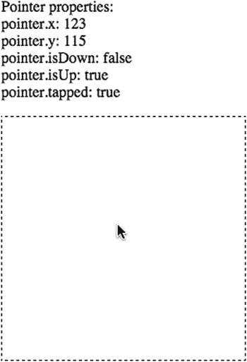

[图 6-2](#_Fig2) 。鼠标和触摸的通用指针对象

```js
<!doctype html>
<meta charset="utf-8">
<title>Pointer</title>
<p id="output"></p>
<script type="module">

//Import code from the library
import {makeCanvas, stage, render} from "../library/display";
import {assets} from "../library/utilities";
import {makePointer} from "../library/interactive";

//Make the canvas and initialize the stage
let canvas = makeCanvas(256, 256);
stage.width = canvas.width;
stage.height = canvas.height;

//Get a reference to the output <p> tag
let output = document.querySelector("p");

//Make the pointer
let pointer = makePointer(canvas);

//Add a custom `press` method
pointer.press = () => console.log("The pointer was pressed");

//Add a custom `release` method
pointer.release = () => console.log("The pointer was released");

//Add a custom `tap` method
pointer.tap = () => console.log("The pointer was tapped");

//Use a loop to display changes to the output text
gameLoop();

function gameLoop() {
  requestAnimationFrame(gameLoop);

  //Display the pointer properties in the
  //HTML <p> tag called `output`
  output.innerHTML
    = `Pointer properties: <br>
    pointer.x: ${pointer.x} <br>
    pointer.y: ${pointer.y} <br>
    pointer.isDown: ${pointer.isDown} <br>
    pointer.isUp: ${pointer.isUp} <br>
    pointer.tapped: ${pointer.tapped}`;

}
</script>
```

 **注意**这个例子也展示了你需要编写的最少的 HTML5 代码，并且仍然有一个有效的 HTML 文档。短小精悍！`<html>`和`<body>`标签是可选的。您可能仍然需要一个`<body>`标签作为添加和删除 HTML 元素的钩子，但是如果您忽略它，HTML5 规范会认为它是隐含的。

注意可选的`press`、`release`和`tap`功能是如何定义的:

```js
pointer.press = () => console.log("The pointer was pressed");
pointer.release = () => console.log("The pointer was released");
pointer.tap = () => console.log("The pointer was tapped");
```

这些都是方便的方法，允许您在发生任何这些操作时注入一些自定义代码。你将在前面的章节中看到如何使用它们。

我们现在有了键盘、鼠标和触摸交互功能——太酷了！现在我们知道如何与游戏世界互动，让我们开始做吧！

互动运动

让我们把你在前一章学到的关于如何移动精灵的知识和你在本章学到的关于交互性的知识结合起来。在下一节中，您将学习一些最有用的代码片段来让精灵移动。这些是视频游戏历史上的经典技术，你会发现它们在你的游戏中有无数的用途。您将在源代码的`library/utilities`文件夹中找到我们在本节中使用的所有自定义函数。

寻找精灵之间的距离

你的游戏经常需要计算精灵之间的像素数。这对于找出精灵是否碰撞，或者接近碰撞是有用的。如果你的精灵有`centerX`和`centerY`属性，你可以使用下面的函数计算出它们之间的距离(`s1`代表“精灵 1”，`s2`代表“精灵 2”):

```js
function distance(s1, s2) {
  let vx = s2.centerX - s1.centerX,
      vy = s2.centerY - s1.centerY;
  return Math.sqrt(vx * vx + vy * vy);
}
```

`vx`和`vy`值描述了从第一个子画面的中心到第二个子画面的中心的直线。(“v”代表“矢量”你可以把向量想象成任意两个 *x，y* 位置之间的一条线。关于矢量你需要知道的一切见附录)。`Math.sqrt`用于应用毕达哥拉斯定理，它告诉你这条线有多长，以像素为单位。

在本章的源文件中，你会发现一个名为`distance.html`的示例程序，它展示了这个函数的运行。有两个圆形精灵，用一条线将它们连接起来。当您移动指针时，一个文本精灵会告诉您两个圆圈之间的像素距离。图 6-3 说明了这一点。

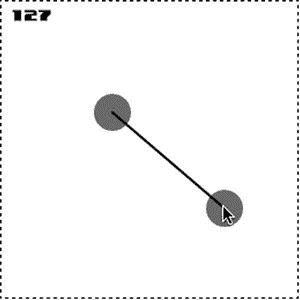

[图 6-3](#_Fig3) 。找出精灵之间的距离

让我们看看程序如何使用这个`distance`函数，并借此机会学习更多关于如何使用精灵的知识。下面是`distance.html`程序的完整 JavaScript 代码:

```js
import {makeCanvas, text, circle, line, stage, render} from "../library/display";
import {assets, distance} from "../library/utilities";
import {makePointer} from "../library/interactive";

//Load a custom font
assets.load(["fonts/puzzler.otf"]).then(() => setup());

//Declare any variables shared between functions
let canvas, c1, c2, message, connection, pointer;

function setup() {

  //Make the canvas and initialize the stage
  canvas = makeCanvas(256, 256);
  stage.width = canvas.width;
  stage.height = canvas.height;

  //Make a text sprite
  message = text("", "12px puzzler", "black", 8, 8);

  //Create a circle sprite offset by 32 pixels to the
  //left and top of the stage
  c1 = circle(32, "gray");
  stage.putCenter(c1, -32, -32);

  //Create a circle sprite offset by 32 pixels to the
  //right and bottom of the stage
  c2 = circle(32, "gray");
  stage.putCenter(c2, 32, 32);

  //Create a line between the centers of the circles
  connection = line(
    "black", 2, c1.centerX, c1.centerY, c2.centerX, c2.centerY
  );

  //Make the pointer
  pointer = makePointer(canvas);

  //Use a loop to update the sprites' positions
  gameLoop();
}

function gameLoop() {
  requestAnimationFrame(gameLoop);

  //Keep the center of c2 aligned with the
  //pointer's position
  c2.x = pointer.x - c2.halfWidth;
  c2.y = pointer.y - c2.halfHeight;

  //Draw the connecting line between the circles
  connection.ax = c1.centerX;
  connection.ay = c1.centerY;
  connection.bx = c2.centerX;
  connection.by = c2.centerY;

  //Use the imported `distance` function to figure
  //out the distance between the circles
  let distanceBetweenCircles = distance(c1, c2);

  //Use the message text sprite to display the distance.
  //Use `Math.floor` to truncate the decimal values
  message.content = Math.floor(distanceBetweenCircles);

  //Render the canvas
  render(canvas);
}
```

在这个程序中有相当多的显示元素在一起工作:圆形、线条和文本精灵，还有舞台。游戏循环也在动态计算圆圈之间的距离，并在每一帧中不断重画连接线。

用`put`方法定位精灵

这也是你第一次看到神秘的“put”sprite 方法之一的运行(我们在[第 4 章](04.html)中为 sprite 添加了“put”方法)。所有显示对象(精灵和舞台)都有称为`putCenter`、`putTop`、`putRight`、`putBottom`和`putLeft`的方法，您可以使用这些方法来方便地对齐和定位精灵。在这个示例程序中，`stage`对象使用`putCenter`来定位舞台内部的圆:

```js
c1 = circle(32, "gray");
stage.putCenter(c1, -32, -32);

c2 = circle(32, "gray");
stage.putCenter(c2, 32, 32);
```

第一个参数是应该居中的 sprite:`c1`或者`c2`。第二个和第三个参数定义了精灵应该在 *x* 和 *y* 轴上从中心偏移多少。这段代码将`c1`放在舞台的左上角，将`c2`放在右下角。你会发现你经常需要在游戏中做这种定位，而“put”方法让你不必编写大量繁琐的定位代码。

缓和

在前面的示例中，圆精确地跟随指针的位置。你可以使用一个叫做**放松**的标准公式，让圆圈移动得更优雅一点。“缓动”会使精灵在目标点上轻轻就位。这里有一个`followEase`函数，你可以用它让一个精灵跟随另一个精灵。

```js
function followEase(follower, leader, speed) {

  //Figure out the distance between the sprites
  let vx = leader.centerX - follower.centerX,
      vy = leader.centerY - follower.centerY,
      distance = Math.sqrt(vx * vx + vy * vy);

  //Move the follower if it's more than 1 pixel
  //away from the leader
  if (distance >= 1) {
    follower.x += vx * speed;
    follower.y += vy * speed;
  }
}
```

该函数计算精灵之间的距离。如果它们之间的距离超过 1 个像素，代码会以一定的速度移动跟随器，该速度会随着接近引导器而成比例降低。介于 0.1 和 0.3 之间的速度值是一个很好的起点(较高的数字使精灵移动得更快)。跟随者将逐渐减速，直到越过领头者的位置。打开本章源文件中的`easing.html`文件，看看如何使用这个函数让精灵轻松地跟随鼠标。[图 6-4](#Fig4) 展示了你将会看到的东西。

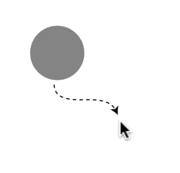

[图 6-4](#_Fig4) 。轻松移动精灵

程序代码与前面的例子非常相似。游戏循环中使用的`followEase`函数是这样的:

```js
function gameLoop() {
  requestAnimationFrame(gameLoop);
  followEase(c1, pointer, 0.1);
  render(canvas);
}
```

让一个精灵跟随另一个精灵是游戏的常见要求，所以让我们看看另一种方法。

匀速跟随

前几节中的缓动公式使精灵以可变速度移动，该速度与到其目的地的距离成比例。只要对公式稍加修改，你就可以使它以固定的恒定速度运动。这里有一个`follow`函数实现了这一点:

```js
function followConstant(follower, leader, speed) {

  //Figure out the distance between the sprites
  let vx = leader.centerX - follower.centerX,
      vy = leader.centerY - follower.centerY,
      distance = Math.sqrt(vx * vx + vy * vy);

  //Move the follower if it's more than 1 move
  //away from the leader
  if (distance >= speed) {
    follower.x += (vx / distance) * speed;
    follower.y += (vy / distance) * speed;
  }
}
```

`speed`值应该是您希望跟随器移动的每帧像素数；在下面的示例代码中，每帧 3 个像素:

```js
function gameLoop() {
  requestAnimationFrame(gameLoop);
  followConstant(c1, pointer, 3);
  render(canvas);
}
```

这对于创造一个追逐玩家的敌人 AI 精灵来说是一个非常有用的功能。

向某物旋转

您可以使用以下函数找到两个精灵之间的旋转角度:

```js
function angle(s1, s2) {
  return Math.atan2(
    s2.centerY - s1.centerY,
    s2.centerX - s1.centerX
  );
}
```

它返回以弧度为单位的旋转角度。您可以用下面的语句将它应用到 sprite 的`rotation`属性，使 sprite 向另一个 sprite 或指针旋转:

```js
box.rotation = angle(box, pointer);
```

你可以在本章的源文件中的`rotateTowards.html`文件中看到一个这样的例子；输出如图 6-5 中的[所示。框向指针旋转，一条 32 像素长的红线从框的中心向旋转方向延伸。](#Fig5)

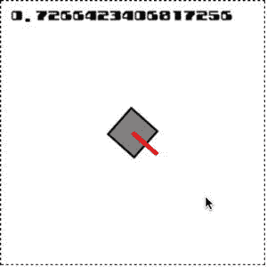

[图 6-5](#_Fig5) 。向指针旋转精灵

只要有点想象力，你可能会意识到红线框实际上是一个主要的视频游戏组件:一个旋转炮塔。是怎么做出来的？这是一个很好的例子，展示了如何使用父/子层次结构构建一个简单的复合 sprite。`turret`(红线)是`box`的子节点。代码如下:

```js
//Make a square and center it in the stage
box = rectangle(32, 32, "gray", "black", 2);
stage.putCenter(box);

//Make a turret by drawing a red, 4 pixel wide
//line that's 32 pixels long
turret = line("red", 4, 0, 0, 32, 0);

//Add the line as a child of the box and place its
//start point at the box's center
box.addChild(turret);
turret.x = 16;
turret.y = 16;
```

现在当游戏循环使用`angle`功能使`box`向`pointer`旋转时，`turret`会自动跟随`box`的旋转。

```js
function gameLoop() {
  requestAnimationFrame(gameLoop);
  box.rotation = angle(box, pointer);
  render(canvas);
}
```

这就是我们在第四章中所做的额外工作的回报。它让我们不必写一些复杂的数学来手动保持转台的旋转与盒子对齐。

围绕精灵旋转

使用下面的`rotateSprite`函数让一个精灵围绕另一个精灵旋转:

```js
function rotateSprite(rotatingSprite, centerSprite, distance, angle) {
  rotatingSprite.x
    = centerSprite.centerX - rotatingSprite.parent.x
    + (distance * Math.cos(angle))
    - rotatingSprite.halfWidth;

  rotatingSprite.y
    = centerSprite.centerY - rotatingSprite.parent.y
    + (distance * Math.sin(angle))
    - rotatingSprite.halfWidth;
}
```

下面介绍如何用它让一个球绕着一个盒子旋转，如图[图 6-6](#Fig6) 所示。

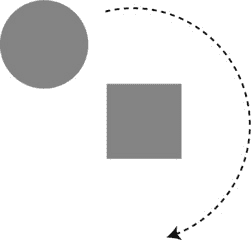

[图 6-6](#_Fig6) 。围绕另一个精灵旋转一个精灵

```js
//Create a box and position it
box = rectangle(32, 32, "gray");
stage.putCenter(box, 32, -48);

//Create a circle sprite offset by 32 pixels to the
//left of the box
ball = circle(32, "gray");
box.putLeft(ball, -32);

//Add an `angle` property to the ball that we'll use to
//help make the ball rotate around the box
ball.angle = 0;

//Start the game loop
gameLoop();

function gameLoop() {
  requestAnimationFrame(gameLoop);

  //Update the ball’s rotation angle
  ball.angle += 0.05;

  //Use the ball’s `angle` value to make it rotate around the
  //box at a distance of 48 pixels from the box’s center
  rotateSprite(ball, box, 48, ball.angle);
}
```

围绕一个点旋转

有时候，能够围绕另一个点旋转空间中的一个点是很有用的。例如，你可以通过让一条线的两端围绕空间中不可见的点旋转来创造一种“摇摆线”的效果，如图 6-7 所示。像这样把不稳定的线条连接在一起，你可以创造出不稳定的形状。

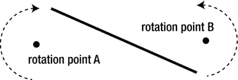

[图 6-7](#_Fig7) 。使点围绕其他点旋转。您可以使用一个名为`rotatePoint`的函数来帮助创建这种效果

```js
export function rotatePoint(pointX, pointY, distanceX, distanceY angle) {
  let point = {};
  point.x = pointX + Math.cos(angle) * distanceX;
  point.y = pointY + Math.sin(angle) * distanceY;
  return point;
}
```

`rotatePoint`函数返回一个带有代表旋转轴的 *x* 和 *y* 值的`point`对象。`distanceX`和`distanceY`参数定义了从旋转中心到在空间中被描绘的假想圆的边缘的半径。如果`distanceX`和`distanceY`具有相同的值，该功能将描绘一个圆。如果给它们不同的值，该函数将跟踪一个椭圆。您可以使用`rotatePoint`返回的`point`对象使任何其他 *x/y* 点围绕该轴旋转。这里有一些代码使用`rotatePoint`来创建如图[图 6-7](#Fig7) 所示的摇摆线条效果。

```js
movingLine = line("black", 4, 64, 160, 192, 208);

//We're going to make the line's start and end points
//rotate in space. The line will need two new angle properties
//to help us do this. Both are initialized to 0
movingLine.angleA = 0;
movingLine.angleB = 0;

//Start the game loop
gameLoop();

function gameLoop() {
  requestAnimationFrame(gameLoop);

  //Make the line's `ax` and `ay` points rotate clockwise around
  //point 64, 160\. `rotatePoint` returns an
  //object with `x` and `y` properties
  //containing the point's new rotated position
  movingLine.angleA += 0.02;
  let rotatingA = rotatePoint(64, 160, 20, 20, movingLine.angleA);
  movingLine.ax = rotatingA.x;
  movingLine.ay = rotatingA.y;

  //Make the line's `bx` and `by` point rotate counter-
  //clockwise around point 192, 208
  movingLine.angleB -= 0.03;
  let rotatingB = rotatePoint(192, 208, 20, 20, movingLine.angleB);
  movingLine.bx = rotatingB.x;
  movingLine.by = rotatingB.y;

  //Render the canvas
  render(canvas);
}
```

效果就像曲轴转动一个看不见的轮子。看起来很有趣，甚至有点吓人，所以请确保查看本章源代码中的`rotateAround.html`文件中的这个代码的工作示例。

向旋转方向移动

如果你知道精灵的角度，你可以让它朝它所指的方向移动。运行`moveTowards.html`文件，你会发现一个可以使用箭头键移动的精灵的例子。向左和向右旋转精灵，向上使它向它所指的方向移动。释放向上箭头键，它会慢慢停下来。[图 6-8](#Fig8) 显示了您将看到的内容。

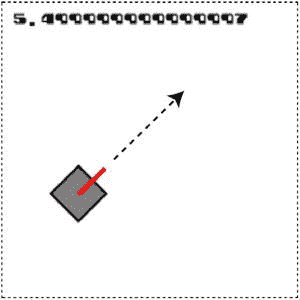

[图 6-8](#_Fig8) 。使用箭头键旋转一个精灵，并向它所指的方向移动它

让我们再次发挥我们的想象力，把标有红线的移动箱想象成一辆“坦克”现在让我们重新思考一下我们在前面的例子中构建这个对象的方式。把盒子和炮塔放在一个叫做`tank` 的小组里可能是有意义的。我们可以使用我们在第四章的[中创建的`group`函数来完成这项工作；方法如下:](04.html)

```js
//Make the box and turret
let box = rectangle(32, 32, "gray");
let turret = line("red", 4, 0, 0, 32, 0);
turret.x = 16;
turret.y = 16;

//Group them together as a compound sprite called `tank`
tank = group(box, turret);
stage.putCenter(tank);
```

`tank`组现在是`box`和`turret`精灵的父容器。这只是你可以用来制作复合精灵的另一种方法。`tank`组现在是你控制的主要精灵。给它添加一些属性来帮助它移动:

```js
//Add some physics properties
tank.vx = 0;
tank.vy = 0;
tank.accelerationX = 0.2;
tank.accelerationY = 0.2;
tank.frictionX = 0.96;
tank.frictionY = 0.96;

//The speed at which the tank should rotate,
//initialized to 0
tank.rotationSpeed = 0;

//Whether or not the tank should move forward
tank.moveForward = false;
```

`rotationSpeed`决定坦克向左或向右旋转的速度，而`moveForward`只是一个布尔值，告诉我们游戏循环中的代码是否应该让坦克移动。这两个属性都由箭头键设置:右键和左键使坦克旋转，向上键使它向前移动。下面是使用我们在本章前面编写的`keyboard`函数对箭头键进行编程的代码:

```js
//Make key objects
let leftArrow = keyboard(37),
    rightArrow = keyboard(39),
    upArrow = keyboard(38);

//Set the tank's `rotationSpeed` to -0.1 (to rotate left) if the
//left arrow key is being pressed
leftArrow.press = () => tank.rotationSpeed = -0.1;

//If the left arrow key is released and the right arrow
//key isn't being pressed down, set the `rotationSpeed` to 0
leftArrow.release = () => {
  if (!rightArrow.isDown) tank.rotationSpeed = 0;
}

//Do the same for the right arrow key, but set
//the `rotationSpeed` to 0.1 (to rotate right)
rightArrow.press = () => tank.rotationSpeed = 0.1;
rightArrow.release = () => {
  if (!leftArrow.isDown) tank.rotationSpeed = 0;
}

//Set `tank.moveForward` to `true` if the up arrow key is
//pressed, and set it to `false` if it's released
upArrow.press = () => tank.moveForward = true;
upArrow.release = () => tank.moveForward = false;
```

我们现在可以利用这些特性，以及我们在前一章中学到的关于加速度和摩擦力的知识，使坦克沿着它旋转的方向运动。下面是游戏循环中的代码:

```js
function gameLoop() {
  requestAnimationFrame(gameLoop);

  //Use the `rotationSpeed` to set the tank's rotation
  tank.rotation += tank.rotationSpeed;

  //If `tank.moveForward` is `true`, use acceleration with a
  //bit of basic trigonometry to make the tank move in the
  //direction of its rotation
  if (tank.moveForward) {
    tank.vx += tank.accelerationX * Math.cos(tank.rotation);
    tank.vy += tank.accelerationY * Math.sin(tank.rotation);
  }

  //If `tank.moveForward` is `false`, use
  //friction to slow the tank down
  else {
    tank.vx *= tank.frictionX;
    tank.vy *= tank.frictionY;
  }

  //Apply the tank's velocity to its position to make the tank move
  tank.x += tank.vx;
  tank.y += tank.vy;

  //Display the tank's angle of rotation
  message.content = tank.rotation;

  //Render the canvas
  render(canvas);
}
```

让坦克沿其旋转方向移动的秘密是这两行代码:

```js
tank.vx += tank.accelerationX * Math.cos(tank.rotation);
tank.vy += tank.accelerationY * Math.sin(tank.rotation);
```

这只是一点基本的三角学，把坦克的加速度和它的旋转结合起来。当应用到坦克的 *x，y* 位置时，产生的`vx`和`vy`值将使坦克向正确的方向移动。

```js
tank.x += tank.vx;
tank.y += tank.vy;
```

你可以使用这个基本系统作为许多种旋转视频游戏对象的起点，如宇宙飞船或汽车。在这个例子中，我们的坦克实际上更像一艘宇宙飞船，而不是一辆真正的坦克。这是因为当它向左或向右旋转时，它会继续向前漂移，而不是像有轮子的车辆那样随着旋转改变方向。我们将很快解决这个问题。首先，让我们赋予坦克发射子弹的能力。

发射子弹

只需多一点代码，你就可以让你的精灵发射子弹。运行`bullets.html`按空格键向坦克指向的方向发射子弹，如图[图 6-9](#Fig9) 所示。

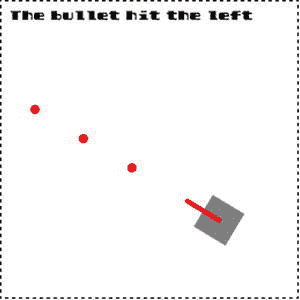

[图 6-9](#_Fig9) 。向四面八方发射子弹

这段代码的一个特性是当子弹击中画布边缘时会被移除，一个文本精灵会告诉你子弹击中了哪个边缘。

制作子弹的第一步是创建一个数组来存储你将要制作的新子弹精灵:

```js
let bullets = [];
```

接下来，您需要一个`shoot`函数，它允许您使用一些参数创建项目符号:

```js
shoot(
  tank,           //The shooter
  tank.rotation,  //The angle at which to shoot
  32,             //The bullet's offset from the center
  7,              //The bullet's speed (pixels per frame)
  bullets,        //The array used to store the bullets

  //A function that returns the sprite that should
  //be used to make each bullet
  () => circle(8, "red")
);
```

`shoot`功能分配发射子弹所需的所有参数。最重要的是最后一条:

```js
() => circle(8, "red")
```

这是一个函数，它创建并返回你想用作项目符号的精灵类型。在这种情况下，它是一个直径为 8 个像素的红色圆圈。你可以使用到目前为止在本书中学到的任何精灵创建函数，或者创建你自己的自定义函数。

下面是使用这些参数创建一个新的`bullet`精灵并将其添加到`bullets`数组的`shoot`函数定义。

```js
function shoot(
  shooter, angle, offsetFromCenter,
  bulletSpeed, bulletArray, bulletSprite
) {

  //Make a new sprite using the user-supplied `bulletSprite` function
  let bullet = bulletSprite();

  //Set the bullet's start point
  bullet.x
    = shooter.centerX - bullet.halfWidth
    + (offsetFromCenter * Math.cos(angle));
  bullet.y
    = shooter.centerY - bullet.halfHeight
    + (offsetFromCenter * Math.sin(angle));

  //Set the bullet's velocity
  bullet.vx = Math.cos(angle) * bulletSpeed;
  bullet.vy = Math.sin(angle) * bulletSpeed;

  //Push the bullet into the `bulletArray`
  bulletArray.push(bullet);
}
```

你可以看到`shoot`函数正在使用射手精灵的旋转角度来计算子弹的起点和速度。`shoot`函数被设计成灵活和通用的，所以你可以在各种不同的游戏项目中使用它。

你的游戏如何让玩家发射子弹？在这个例子中，每按一次空格键，子弹就发射一次，而且只有一次。释放空格键重置子弹发射机制，以便您可以在下一次按下它时再次发射。这是一个使用我们在本章前面创建的`keyboard`函数来设置的简单机制。首先，创建一个`space`关键对象:

```js
let space = keyboard(32);
```

然后给`space`键的`press`方法赋值，让它调用`shoot`函数发射子弹:

```js
space.press = () => {
  shoot(
    tank, tank.rotation, 32, 7, bullets,
    () => circle(8, "red")
  );
};
```

既然我们能够发射子弹，我们需要在画布上移动它们。我们还需要检查它们的屏幕边界，这样如果它们碰到画布的边缘，我们就可以移除它们(实际上是根父对象`stage`)。这必须发生在游戏循环中:

```js
function gameLoop() {
  requestAnimationFrame(gameLoop);
  //Move the bullets here...
}
```

移动项目符号并检查与`stage`边界冲突的代码也发生在循环内部。我们将使用一个`filter`循环，这样如果一颗子弹击中舞台的边缘，它将从`bullets`数组中移除。我们还将使用一个名为`outsideBounds` 的自定义函数，它将告诉我们子弹是否穿过了舞台的边界，以及子弹击中了边界的哪一侧。下面是完成这一切的`filter`循环:

```js
bullets = bullets.filter(bullet => {

  //Move the bullet
  bullet.x += bullet.vx;
  bullet.y += bullet.vy;

  //Check for a collision with the stage boundary
  let collision = outsideBounds(bullet, stage.localBounds);

  //If there's a collision, display the side that the collision
  //happened on, remove the bullet sprite, and filter it out of
  //the `bullets` array
  if(collision) {

    //Display the boundary side that the bullet crossed
    message.content = "The bullet hit the " + collision;

    //The `remove` function will remove a sprite from its parent
    //to make it disappear
    remove(bullet);

    //Remove the bullet from the `bullets` array
    return false;
  }

  //If the bullet hasn't hit the edge of the stage,
  //keep it in the `bullets` array
  return true;
});
```

`outsideBounds`函数返回一个`collision`变量，其值为`"top"`、`"right"`、`"bottom"`或`"left"`，这取决于子弹穿过边界的哪一侧。如果没有碰撞，它将返回`undefined`。`outsideBounds`与你在前一章学到的`contain`函数非常相似——只是简单得多。它检查 sprite 的整个形状是否已经越过了包含边界，并由您来决定如何处理这些信息。

```js
function outsideBounds(sprite, bounds, extra = undefined){

  let x = bounds.x,
      y = bounds.y,
      width = bounds.width,
      height = bounds.height;

  //The `collision` object is used to store which
  //side of the containing rectangle the sprite hits
  let collision;

  //Left
  if (sprite.x < x - sprite.width) {
    collision = "left";
  }
  //Top
  if (sprite.y < y - sprite.height) {
    collision = "top";
  }
  //Right
  if (sprite.x > width) {
    collision = "right";
  }
  //Bottom
  if (sprite.y > height) {
    collision = "bottom";
  }

  //The `extra` function runs if there was a collision
  //and `extra` has been defined
  if (collision && extra) extra(collision);

  //Return the `collision` object
  return collision;
};
```

你会在本书源文件的`library/display`文件夹中找到`shoot`和`outsideBounds`函数。

移动水箱

在这个新的例子中，坦克的行为就像一个真正的轮式车辆。改变其旋转也会改变其向前运动的方向，如图[图 6-10](#Fig10) 所示。这不是一个很难达到的效果；我们只需要稍微重新思考如何计算和应用坦克的物理属性。

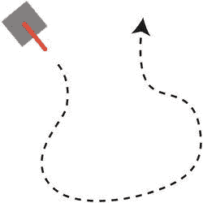

[图 6-10](#_Fig10) 。储罐沿其旋转方向移动

首先，给坦克新的`speed`和`friction`值。我们将使用`speed`来帮助决定坦克应该跑多快，使用`friction`来帮助我们减速。(这个新的`friction`值取代了前一个例子中的`frictionX`和`frictionY`。)

```js
tank.friction = 0.96;
tank.speed = 0;
```

以下是坦克新物理属性的所有初始值:

```js
tank.vx = 0;
tank.vy = 0;
tank.accelerationX = 0.1;
tank.accelerationY = 0.1;
tank.rotationSpeed = 0;
tank.moveForward = false;
tank.friction = 0.96;
tank.speed = 0;
```

游戏循环使用`speed`和`friction`来计算坦克应该跑多快，让坦克移动。坦克的加速度是通过将其速度应用于其旋转来计算的:

```js
//Use the `rotationSpeed` to set the tank's rotation
tank.rotation += tank.rotationSpeed;

//If `tank.moveForward` is `true`, increase the speed
if (tank.moveForward) {
  tank.speed += 0.1;
}

//If `tank.moveForward` is `false`, use
//friction to slow the tank down
else {
  tank.speed *= tank.friction;
}

//Use the `speed` value to figure out the acceleration in the
//direction of the tank’s rotation
tank.accelerationX = tank.speed * Math.cos(tank.rotation);
tank.accelerationY = tank.speed * Math.sin(tank.rotation);

//Apply the acceleration to the tank's velocity
tank.vx = tank.accelerationX;
tank.vy = tank.accelerationY;

//Apply the tank's velocity to its position to make the tank move
tank.x += tank.vx;
tank.y += tank.vy;
```

对代码的这一调整消除了第一个例子中飞船风格的漂移效应。你可以用它作为移动任何轮式车辆的基础。

交互式鼠标和触摸事件

到目前为止，在这一章中，你已经学会了如何通过给键盘键分配`press`和`release`方法来让精灵移动，以及如何让精灵跟随指针的位置。但是如果你想以一种更复杂的方式和精灵互动呢？你的游戏精灵可能需要对点击、触摸或拖动做出反应，你可能想要制作按钮来为你的游戏构建 UI。

在本章的后半部分，你将学习如何做到这一点。我们将建立一个通用的框架来制作各种各样的交互式精灵，然后定制它来制作按钮和拖放精灵。让我们来看看是如何做到的！

找出指针是否接触到一个精灵

最重要的第一步是我们需要某种方法来判断指针是否接触到了一个精灵。我们可以通过向名为`hitTestSprite` 的`pointer`对象添加一个方法来做到这一点。它的工作是检查指针的 *x/y* 位置是否在精灵的区域内。我们将把`hitTestSprite`添加到我们在本章开始时使用`makePointer`函数创建的同一个`pointer`对象中:

```js
function makePointer(element, scale = 1) {
  let pointer = {

    //... the pointer's previous properties and methods...

    hitTestSprite(sprite) {
      //The new code goes here
    }
  };

  //... the rest of the makePointer function...

  return pointer;
}
```

`hitTestSprite`是做什么的？它将指针的位置与 sprite 定义的区域进行比较。如果指针在该区域内，该方法返回`true`；如果不是，它返回`false`。作为一个额外的特性，`hitTestSprite`对圆形精灵和矩形精灵都有效。(你会记得在第四章中我们所有的精灵都有一个叫做`circular`的布尔属性，你可以用它来找到精灵的大致形状。)

```js
hitTestSprite(sprite) {

  //The `hit` variable will become `true` if the pointer is
  //touching the sprite and remain `false` if it isn't
  let hit = false;

  //Is the sprite rectangular?
  if (!sprite.circular) {

    //Yes, it is.
    //Get the position of the sprite's edges using global
    //coordinates
    let left = sprite.gx,
        right = sprite.gx + sprite.width,
        top = sprite.gy,
        bottom = sprite.gy + sprite.height;

    //Find out if the pointer is intersecting the rectangle.
    //`hit` will become `true` if the pointer is inside the
    //sprite's area
    hit
      = this.x > left && this.x < right
      && this.y > top && this.y < bottom;
  }

  //Is the sprite circular?
  else {

    //Yes, it is.
    //Find the distance between the pointer and the
    //center of the circle
    let vx = this.x - (sprite.gx + sprite.radius),
        vy = this.y - (sprite.gy + sprite.radius),
        distance = Math.sqrt(vx * vx + vy * vy);

    //The pointer is intersecting the circle if the
    //distance is less than the circle's radius
    hit = distance < sprite.radius;
  }

  return hit;
}
```

在矩形精灵的情况下，代码检查指针的 *x，y* 位置是否在精灵的区域内。在圆形精灵的情况下，它检查指针中心和精灵中心之间的距离是否小于圆的半径。在这两种情况下，如果指针接触到子画面，代码将设置`hit`为真。指针的 *x，y* 坐标总是相对于画布的，这就是为什么代码使用精灵的全局`gx`和`gy`坐标。

在游戏代码中使用`hitTestSprite`,如下所示:

```js
pointer.hitTestSprite(anySprite);
```

运行`pointerCollision.html`文件，交互演示`hitTestSprite`如何工作，如图[图 6-11](#Fig11) 所示。一个文本精灵会告诉你指针是否接触到了盒子或球精灵。

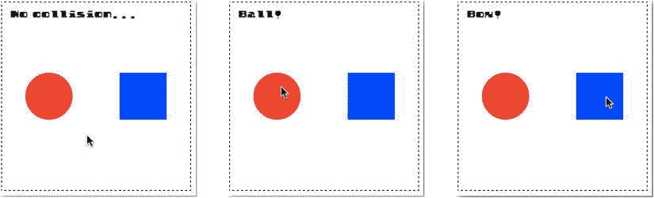

[图 6-11](#_Fig11) 。找出指针是否接触到一个精灵

下面是来自游戏循环的代码,它使这个工作:

```js
if(pointer.hitTestSprite(ball)) {
  message.content = "Ball!"
} else if(pointer.hitTestSprite(box)) {
  message.content = "Box!"
} else {
  message.content = "No collision..."
}
```

这个例子实际上是对一个叫做**碰撞检测**的游戏设计主题的一个偷偷摸摸的介绍，你将在下一章了解到。但是，现在，我们如何使用`hitTestPoint`来制作交互式精灵呢？让我们通过学习如何制作最有用的交互精灵来找出答案:按钮。

小跟班

按钮是一个重要的用户界面组件，你肯定想在你的游戏中使用。你可以使用 HTML 和 CSS 很容易地创建它们，但是为基于画布的精灵渲染系统创建你自己的定制按钮，比如我们在本书中开发的那个，还有很多要说的。您将能够将按钮集成到您现有的场景图形和渲染器中，像操作任何其他游戏精灵一样操作它们，并保持您的代码库统一在 JavaScript 中，而不必跳过 HTML 和 CSS。使用我们在上一节中学到的指针交互性，并通过对 sprite 系统做一些小的添加，我们可以创建一个多功能的新按钮 sprite 对象。你可以把我们要做的按钮想象成“可点击/可触摸的精灵”,你可以在各种各样的游戏中使用它们。

关于按钮，你需要知道的最重要的事情是它们有**状态**和**动作**。状态定义按钮的外观，动作定义按钮的功能。

大多数按钮有三种状态:

*   **向上**:当指针没有碰到按钮时
*   **在**上:当指针在按钮上时
*   **按下**:当指针按下按钮时

[图 6-12](#Fig12) 显示了这三种按钮状态的例子。

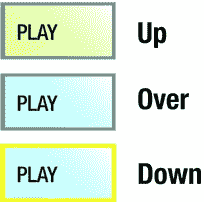

[图 6-12](#_Fig12) 。向上、向上和向下按钮状态

基于触摸的游戏只需要两种状态:向上和向下。

使用我们将要创建的按钮精灵，您将能够以字符串属性的形式访问这些状态，如下所示:

```js
playButton.state
```

`state`属性可以有值`"up"`、`"over"`或`"down"`，你可以在你的游戏逻辑中使用它们。

按钮也有**动作**:

*   按下:当指针按下按钮时
*   释放:当指针从按钮上释放时
*   结束:当指针移动到按钮区域时
*   Out:当指针移出按钮区域时
*   点击:点击(或点击)按钮时

您可以将这些操作定义为用户可定义的方法，如下所示:

```js
playButton.press = () => console.log("pressed");
playButton.release = () => console.log("released");
playButton.over = () => console.log("over");
playButton.out = () => console.log("out");
playButton.tap = () => console.log("tapped");
```

您还应该能够在一个字符串属性中访问按钮的“按下”和“释放”动作，如下所示:

```js
playButton.action
```

明白了吗？很好！那么我们实际上是怎么做纽扣的呢？

创建按钮

首先，从定义三种按钮状态的三幅图像开始。你可以称他们为`"up.png"`、`"over.png"`和`"down.png"`。然后将这三幅图像添加到 tileset 中，或者作为纹理贴图集中的帧。[图 6-13](#Fig13) 显示了包含这三种状态的简单纹理图谱。

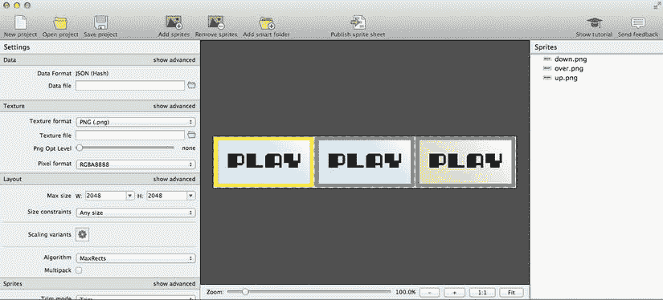

[图 6-13](#_Fig13) 。将按钮图像状态添加到纹理贴图集

 **注意**虽然有三种图像状态是标准的，但有时候按钮只有两种图像状态。这对于只有触摸的按钮来说尤其如此，因为它们没有“结束”状态。我们将在前面创建的按钮 sprite 将使用三个图像(如果它们可用的话),但是如果它只有两个图像，代码将假定它们指的是“向上”和“向下”状态。

接下来，将纹理地图加载到游戏程序中:

```js
assets.load(["img/button.json"]).then(() => setup());
```

同样通过使用三个帧作为按钮的源参数来初始化一个新的`button` sprite:

```js
let buttonFrames = [
  assets["up.png"],
  assets["over.png"],
  assets["down.png"]
];

playButton = button(buttonFrames, 32, 96);
```

要查看这个按钮的运行，运行`button.html`文件，其输出显示在[图 6-14](#Fig14) 中。当您将指针移到按钮上时，光标会变成手形图标。游戏循环更新了一些显示按钮状态和动作的文本。

```js
stateMessage.content = `State: ${playButton.state}`;
actionMessage.content = `Action: ${playButton.action}`;
```

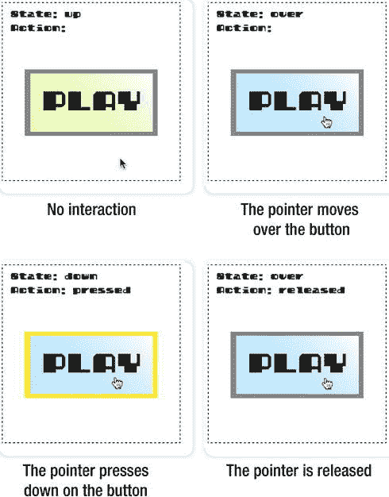

[图 6-14](#_Fig14) 。交互式按钮精灵

这是我们最终想要实现的，但是我们需要多写一点代码来使所有这些细节工作。让我们来看看我们到底需要做些什么来创建这些完全交互的按钮。

新的`Button`类

您可能在一个游戏中有许多按钮，并且，正如您将很快看到的，您需要在每一帧中更新它们。所以你首先需要一个`buttons`数组来存储游戏中的所有按钮:

```js
export let buttons = [];
```

将这个`buttons`数组与`stage`对象和 sprite 类一起保存在你的`display`模块中。确保导出它，因为您需要将它导入到任何需要按钮的游戏的应用程序代码中。

接下来，做一个`Button`类。它所做的就是扩展`Sprite`类并将 sprite 的`interactive`属性设置为`true`。为按钮创建一个全新的类并不重要，但是您很快就会看到，这样做将帮助我们基于指针交互性自动显示图像状态。

```js
class Button extends Sprite {
  constructor(source, x = 0, y = 0) {
    super(source, x, y);
    this.interactive = true;
  }
}

export function button(source, x, y) {
  let sprite = new Button(source, x, y);
  stage.addChild(sprite);
  return sprite;
}
```

将`interactive`设置为`true`实际上是做什么的？

```js
this.interactive = true;
```

你会记得，当我们在第四章的[中制作精灵系统时，我们给了所有的精灵一个名为`interactive`的属性，你可以将它设置为`true`。下面是从`DisplayObject`类](04.html)中摘录的代码(如果你需要的话，可以查看第 4 章中的代码)。

```js
get interactive() {
  return this._interactive;
}

set interactive(value) {

  if (value === true) {

    //Add interactive properties to the sprite
    //so that it can act like a button
    makeInteractive(this);

    //Add the sprite to the global `buttons` array so
    //it can be updated each frame
    buttons.push(this);

    this._interactive = true;
  }

  if (value === false) {

    //Remove the sprite's reference from the
    //`buttons` array so that it's no longer affected
    //by mouse and touch interactivity
    buttons.splice(buttons.indexOf(this), 1);
    this._interactive = false;
  }
}
```

将`interactive`设置为`true`会将精灵发送给一个名为`makeInteractive`的函数，并将其添加到`buttons`数组中。将其设置为`false`会将其从`buttons`数组中拼接出来。让我们看看这个`makeInteractive`函数是做什么的，以及它如何将任何精灵转换成一个可点击、可触摸的按钮。你会记得我在第四章告诉过你，“现在不要担心这些东西——我以后会解释的！”好吧，现在是时候了！

添加交互性

`makeInteractive`函数为 sprite 分配了一些新方法:`press`、`release`、`over`、`tap`和`out`。它还向 sprite 添加了一些属性，以便我们可以监视它的交互状态。这些方法将使*任何*精灵的行为像一个按钮。但是如果 sprite 实际上是`Button`类的一个实例，`makeInteractive`增加了一个额外的特性:它根据指针所做的事情将 sprite 的图像状态设置为`"up"`、`"over"`或`"down"`。

即使对我来说，这也是一段相当复杂的代码。这是因为它必须根据按钮的前一状态和指针正在做的事情来计算出按钮的当前状态。这碰巧是一项不可避免的微妙事业——有点像耍弄匕首。注释解释了它是如何工作的，但是真正理解其微妙之处的最好方法是阅读代码，同时观察`button.html`示例文件中的效果。编写这段代码只是一个渐进的试错过程，以及许许多多的测试。而我直到做完才完全明白我要解决的问题。这种探索和发现是编程如此有趣的原因之一！下面是来自`library/display`文件的完整的`makeInteractive`函数。

```js
function makeInteractive(o) {

  //The `press`, `release`, `over`, `out`, and `tap` methods. They're `undefined`
  //for now, but they can be defined in the game program
  o.press = o.press || undefined;
  o.release = o.release || undefined;
  o.over = o.over || undefined;
  o.out = o.out || undefined;
  o.tap = o.tap || undefined;

  //The `state` property tells you the button's
  //current state. Set its initial state to "up"
  o.state = "up";

  //The `action` property tells you whether it’s being pressed or
  //released
  o.action = "";

  //The `pressed` and `hoverOver` Booleans are mainly for internal
  //use in this code to help figure out the correct state.
  //`pressed` is a Boolean that helps track whether
  //the sprite has been pressed down
  o.pressed = false;

  //`hoverOver` is a Boolean that checks whether the pointer
  //has hovered over the sprite
  o.hoverOver = false;

  //The `update` method will be called each frame
  //inside the game loop
  o.update = (pointer, canvas) => {

    //Figure out if the pointer is touching the sprite
    let hit = pointer.hitTestSprite(o);

    //1\. Figure out the current state
    if (pointer.isUp) {

      //Up state
      o.state = "up";

      //Show the first image state frame, if this is a `Button` sprite
      if (o instanceof Button) o.gotoAndStop(0);
    }

    //If the pointer is touching the sprite, figure out
    //if the over or down state should be displayed
    if (hit) {

      //Over state
      o.state = "over";

      //Show the second image state frame if this sprite has
      //3 frames and it's a `Button` sprite
      if (o.frames && o.frames.length === 3 && o instanceof Button) {
        o.gotoAndStop(1);
      }

      //Down state
      if (pointer.isDown) {
        o.state = "down";

        //Show the third frame if this sprite is a `Button` sprite and it
        //has only three frames, or show the second frame if it
        //has only two frames
        if(o instanceof Button) {
          if (o.frames.length === 3) {
            o.gotoAndStop(2);
          } else {
            o.gotoAndStop(1);
          }
        }
      }
    }

    //Perform the correct interactive action

    //a. Run the `press` method if the sprite state is "down" and
    //the sprite hasn't already been pressed
    if (o.state === "down") {
      if (!o.pressed) {
        if (o.press) o.press();
        o.pressed = true;
        o.action = "pressed";
      }
    }

    //b. Run the `release` method if the sprite state is "over" and
    //the sprite has been pressed
    if (o.state === "over") {
      if (o.pressed) {
        if (o.release) o.release();
        o.pressed = false;
        o.action = "released";

        //If the pointer was tapped and the user assigned a `tap`
        //method, call the `tap` method
        if (pointer.tapped && o.tap) o.tap();
      }

      //Run the `over` method if it has been assigned
      if (!o.hoverOver) {
        if (o.over) o.over();
        o.hoverOver = true;
      }
    }

    //c. Check whether the pointer has been released outside
    //the sprite's area. If the button state is "up" and it has
    //already been pressed, then run the `release` method
    if (o.state === "up") {
      if (o.pressed) {
        if (o.release) o.release();
        o.pressed = false;
        o.action = "released";
      }

      //Run the `out` method if it has been assigned
      if (o.hoverOver) {
        if (o.out) o.out();
        o.hoverOver = false;
      }
    }
  };
}
```

前面代码中的一个重要特性是`makeInteractive`向 sprite 添加了一个名为`update`的方法:

```js
o.update = (pointer, canvas) => { /*...*/ }
```

这个`update`方法实际上计算出了按钮的状态。唯一可行的方法是在每个动画帧的*上调用它。这意味着游戏中的每个按钮都需要在游戏循环中调用它的`update`方法。幸运的是，每一个将`interactive`设置为`true`的精灵都会被推入`buttons`数组。这意味着你可以用这样的功能更新游戏中的所有按钮:*

```js
function gameLoop() {
  requestAnimationFrame(gameLoop);

  //Only run the code if there are buttons in the array
  if (buttons.length > 0) {

    //Set the mouse pointer to the default arrow icon
    canvas.style.cursor = "auto";

    //Loop through all the buttons
    buttons.forEach(button => {

      //Update the buttons
      button.update(pointer, canvas);

      //Figure out if the mouse arrow should be a hand icon
      if (button.state === "over" || button.state === "down") {

        //If the button (or interactive sprite) isn't the
        //stage, change the cursor to a pointer.
        //(This works because the `stage` object has a
        //`parent` value of `undefined`)
        if(button.parent !== undefined) {

          //Display the mouse arrow as a hand
          canvas.style.cursor = "pointer";
        }
      }
    });
  }

  //Render the canvas
  render(canvas);
}
```

代码在所有按钮中循环，并对所有按钮调用`update`方法。另外，这段代码还能判断出鼠标箭头是否应该显示一个手形图标。如果按钮状态是`"over"`或`"down"`，并且交互子画面不是`stage`对象，则显示手图标。

把这一切放在一起

既然您已经知道了所有这些组件是如何工作的，那么让我们来看看`button.html`文件的完整 JavaScript 代码。您可以将此作为在自己的项目中使用按钮的起点。

```js
//Import code from the library
import {
  makeCanvas, button, buttons, frames,
  text, stage, render
} from "../library/display";
import {assets} from "../library/utilities";
import {makePointer} from "../library/interactive";

//Load the button’s texture atlas and the custom font
assets.load([
  "fonts/puzzler.otf",
  "img/button.json"
]).then(() => setup());

//Declare any variables shared between functions
let canvas, playButton, stateMessage, actionMessage, pointer;

function setup() {

  //Make the canvas and initialize the stage
  canvas = makeCanvas(256, 256);
  stage.width = canvas.width;
  stage.height = canvas.height;

  //Define the button's frames
  let buttonFrames = [
    assets["up.png"],
    assets["over.png"],
    assets["down.png"]
  ];

  //Make the button sprite
  playButton = button(buttonFrames, 32, 96);

  //Define the button's actions
  playButton.over = () => console.log("over");
  playButton.out = () => console.log("out");
  playButton.press = () => console.log("pressed");
  playButton.release = () => console.log("released");
  playButton.tap = () => console.log("tapped");

  //Add some message text
  stateMessage = text("State:", "12px puzzler", "black", 12, 12);
  actionMessage = text("Action:", "12px puzzler", "black", 12, 32);

  //Make the pointer
  pointer = makePointer(canvas);

  //Start the game loop
  gameLoop();
}

function gameLoop() {
  requestAnimationFrame(gameLoop);

  //Update the buttons
  if (buttons.length > 0) {
    canvas.style.cursor = "auto";
    buttons.forEach(button => {
      button.update(pointer, canvas);
      if (button.state === "over" || button.state === "down") {
        if(button.parent !== undefined) {
          canvas.style.cursor = "pointer";
        }
      }
    });
  }

  //Display the button's state and action
  stateMessage.content = `State: ${playButton.state}`;
  actionMessage.content = `Action: ${playButton.action}`;

  //Render the canvas
  render(canvas);
}
```

我前面提到过，按钮只是一种交互式精灵，碰巧有三种定义的图像状态。这意味着你可以给任何 sprite 添加类似按钮的交互性。让我们找出方法。

制作互动精灵

您可以通过将任何 sprite 的`interactive`属性设置为`true`来使其行为像一个按钮:

```js
anySprite.interactive = true;
```

这会将 sprite 添加到`buttons`数组中，并赋予它与任何其他按钮相同的方法属性。这意味着你可以分配`press`或`release`方法给精灵，并访问它的状态和动作属性。

 **注意**你也可以让`stage`对象交互。如果您想知道玩家是否点击或按下了画布，这将非常有用。

运行`interacteractiveSprites.html`演示该功能，如图[图 6-15](#Fig15) 所示。如果你点击这个圆，它的填充和描边颜色会随机改变。

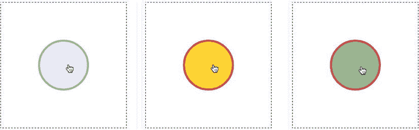

[图 6-15](#_Fig15) 。点按以使圆显示随机颜色

下面是实现这种效果的代码:

```js
//Make the pointer
pointer = makePointer(canvas);

//Create the sprite and put it in the center of the stage
ball = circle(96, "red", "blue", 8);
stage.putCenter(ball);

//Make the ball interactive
ball.interactive = true;

//Assign the ball's `press` method
ball.press = () => {

  //An array of color names
  var colors = ["Gold", "Lavender", "Crimson", "DarkSeaGreen"];

  //Set the ball's `fillStyle` and `strokeStyle` to a random color
  ball.fillStyle = colors[randomInt(0, 3)];
  ball.strokeStyle = colors[randomInt(0, 3)];
};
```

如果你想制作一个可点击/点击的精灵来与指针交互，你现在有一个方法可以做到。

 **注意**记住如果你设置一个 sprite 的交互属性为`true`，你还需要导入`buttons`数组，更新游戏循环中的所有按钮。

拖放

我们需要让我们的精灵完全交互的最后一件事是给他们拖放功能。在第四章的[中，我们给精灵添加了一个`draggable`属性，你可以设置为`true`或者`false`:](04.html)

```js
anySprite.draggable = true;
```

这是我的另一个“以后我会告诉你的！”时刻。设置`draggable`到`true`的作用是让你用指针在画布上拖动精灵。[图 6-16](#Fig16) 显示了让你这样做的`draggableSprites.html`示例文件的输出。您可以在画布上拖动精灵，并将它们堆叠在一起。选定的精灵显示在堆栈的顶部，当鼠标箭头光标在可拖动的精灵上时会变成一个手形。

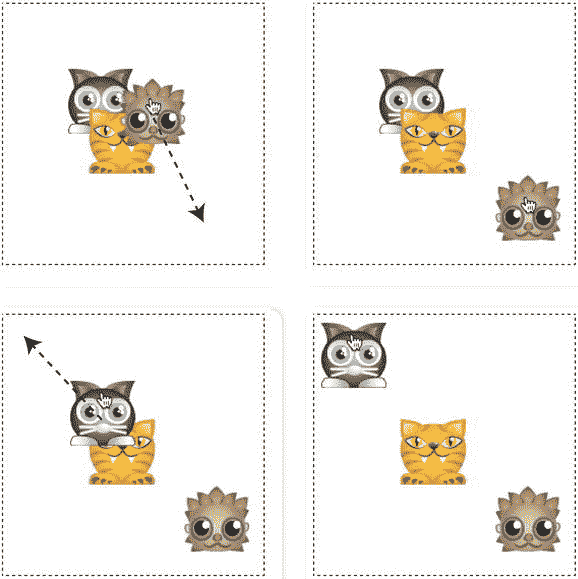

[图 6-16](#_Fig16) 。拖拽小精灵

当你设置`draggable`为`true`时，实际上会发生什么，这是如何工作的？

首先，你需要一个名为`draggableSprites`的数组。您可以在`library/display`模块中找到它。

```js
export let draggableSprites = [];
```

当设置为`true`时，`DisplayObject`类上的`draggable`属性将 sprite 推入`draggableSprites`，如果设置为`false`则将其拼接出来。下面是来自`DisplayObject`类的代码:

```js
get draggable() {
  return this._draggable;
}

set draggable(value) {

  if (value === true) {

    //Push the sprite into the `draggableSprites` array
    draggableSprites.push(this);
    this._draggable = true;
  }

  if (value === false) {

    //Splice the sprite from the `draggableSprites` array
    draggableSprites.splice(draggableSprites.indexOf(this), 1);
  }
}
```

接下来，您需要一些新的属性和一个关于`pointer`对象的新方法来帮助您控制拖放行为。它们被添加到我们在本章前面创建的`makePointer`函数的`pointer`中:

```js
function makePointer(element, scale = 1) {

  let pointer = {

    //... the pointer's existing properties and methods...

    //New drag and drop properties:

    dragSprite: null,
    dragOffsetX: 0,
    dragOffsetY: 0,

    //New `updateDragAndDrop` method:

    updateDragAndDrop(sprite) {
      //The new code goes here
    }

  };

  //... the rest of the `makePointer` function...

  return pointer;
}
```

`dragSprite`对象是指针当前拖动的 sprite，`dragOffsetX`和`dragOffsetY`用于帮助移动`dragSprite`。`updateDragAndDrop`方法负责选择可拖动的精灵，在画布上拖动它们，并使选中的精灵堆叠在未选中的精灵之上。

```js
updateDragAndDrop(draggableSprites) {

  //Check whether the pointer is pressed down
  if (this.isDown) {

    //You need to capture the coordinates at which the pointer was
    //pressed down and find out if it's touching a sprite

    //Only run this code if the pointer isn't already dragging a sprite
    if (this.dragSprite === null) {

      //Loop through the `draggableSprites` in reverse so that
      //you start searching at the top of the stack.
      //This means the last array element
      //will be the first one checked.
      //(Sprites at the end of the array are displayed
      //above sprites at the beginning of the array)
      for (let i = draggableSprites.length - 1; i > -1; i--) {
        let sprite = draggableSprites[i];

       //Check for a collision with the pointer using `hitTestSprite`
        if (this.hitTestSprite(sprite) && sprite.draggable) {

         //Calculate the difference between the pointer's
         //position and the sprite's position
          this.dragOffsetX = this.x - sprite.gx;
          this.dragOffsetY = this.y - sprite.gy;

         //Set the sprite as the pointer's `dragSprite` property
          this.dragSprite = sprite;

         //The next two lines reorder the `sprites` array so that the
         //selected sprite is displayed above all the others.
         //First, splice the sprite out of its current position in
         //its parent's `children` array
          let children = sprite.parent.children;
          children.splice(children.indexOf(sprite), 1);

          //Next, push the `dragSprite` to the end
          //of its `children` array so that it's
          //displayed last, above all the other sprites
          children.push(sprite);

          //Reorganize the `draggableSprites` array in the same way
          draggableSprites.splice(draggableSprites.indexOf(sprite), 1);
          draggableSprites.push(sprite);

          //Break the loop, because we only need to drag the topmost sprite
          break;
        }
      }
    }

    //If the pointer is down and it has a `dragSprite`, make the
    //sprite follow the pointer's position, with the calculated offset
    else {
      this.dragSprite.x = this.x - this.dragOffsetX;
      this.dragSprite.y = this.y - this.dragOffsetY;
    }
  }

  //If the pointer is up, drop the `dragSprite` by setting it to `null`
  if (this.isUp) {
    this.dragSprite = null;
  }

  //Change the mouse arrow pointer to a hand if it's over a
  //draggable sprite
  draggableSprites.some(sprite => {
    if (this.hitTestSprite(sprite) && sprite.draggable) {
      this.element.style.cursor = "pointer";
      return true;
    } else {
      this.element.style.cursor = "auto";
      return false;
    }
  });
}
```

要实现这一点，您需要在游戏循环内部调用指针的`updateDragAndDrop`方法。这使子画面和指针位置与帧速率保持同步。

```js
function gameLoop() {
  requestAnimationFrame(gameLoop);
  pointer.updateDragAndDrop(draggableSprites);
  render(canvas);
}
```

为了让你明白这一切是如何在适当的环境下工作的，这里是来自`draggableSprites.html`文件的所有 JavaScript 代码，它创建了三个可拖动的动物精灵，如图[图 6-16](#Fig16) 所示。

```js
//Import code from the library, including the `draggableSprites` array
import {makeCanvas, stage, draggableSprites, sprite, render} from "../library/display";
import {assets} from "../library/utilities";
import {makePointer} from "../library/interactive";

//Load the texture atlas containing the animal sprite images
assets.load(["img/animals.json"]).then(() => setup());

//Declare any variables shared between functions
let canvas, cat, tiger, hedgehog, pointer;

function setup() {

  //Make the canvas and initialize the stage
  canvas = makeCanvas(256, 256);
  stage.width = canvas.width;
  stage.height = canvas.height;

  //Make three sprites and set their `draggable` properties to `true`
  cat = sprite(assets["cat.png"]);
  stage.putCenter(cat, -32, -32);
  cat.draggable = true;

  tiger = sprite(assets["tiger.png"]);
  stage.putCenter(tiger);
  tiger.draggable = true;

  hedgehog = sprite(assets["hedgehog.png"]);
  stage.putCenter(hedgehog, 32, 32);
  hedgehog.draggable = true;

  //Make the pointer
  pointer = makePointer(canvas);

  //Start the game loop
  gameLoop();
}

function gameLoop() {
  requestAnimationFrame(gameLoop);

  //Update the pointer's drag and drop system
  pointer.updateDragAndDrop(draggableSprites);

  //Render the canvas
  render(canvas);
}
```

您可以将此代码用作向任何 sprite 添加拖放功能的基本模型。

摘要

游戏都是关于交互性的，在这一章中，你已经学习了为任何游戏增加交互性所需要知道的最重要的技术。您已经学习了计算距离的经典函数，使小精灵向其他小精灵旋转，使小精灵跟随其他小精灵或指针，并使小精灵沿其旋转方向移动。您还了解了如何编写和实现一个有用的`keyboard`函数来快速为游戏添加键盘交互性，以及如何创建一个通用的`pointer`对象，它既适用于鼠标，也适用于触摸。如果这还不够，您还发现了如何制作可点击和可触摸的按钮，以及如何在画布上拖放精灵。

但是在我们真正开始制作游戏之前，我们还需要完成一个重要的拼图。我们必须学会当精灵们撞到一起时该怎么做。这就是下一章要讲的:碰撞。