# 七、碰撞检测

两个精灵碰撞会发生什么？这就是本章的全部内容:**碰撞检测**。你将学习如何判断两个精灵是否在触碰，并让他们在触碰时做出有趣的反应。对于 2D 游戏，有四种基本的碰撞检测技术你需要知道，我们将在本章中一一介绍:

*   **点与形状**:当一个点与一个形状相交时
*   **圆对圆**:两个圆相交时
*   **矩形 vs 矩形** :两个矩形相交时
*   **圆形对矩形**:矩形和圆形相交时

有了这四种技术，整个游戏设计的可能性就展现在你面前了。您将学习一些有用的、可重用的函数，这些函数将帮助您使用我们在本书中开发的 sprite 系统进行碰撞检测，以及如何将这些函数应用于各种实际的游戏原型。

你会在本章源文件的`library/collision.js`文件中找到我们将在本章中用到的所有碰撞函数。我们将在本章中使用以下碰撞函数:

```js
hitTestPoint
hitTestCircle
hitTestRectangle
rectangleCollision
circleCollision
movingCircleCollision
hitTestCirclePoint
circlePointCollsion
hitTestCircleRectangle
circleRectangleCollision
hit
```

在使用这些函数之前，请确保将其导入到您的应用程序代码中。他们将与任何具有以下属性的精灵一起工作:

```js
x, y, centerX, centerY, vx, vy, width, height,
halfWidth, halfHeight, radius, diameter
```

只要你的精灵拥有这些属性，碰撞功能就会起作用——即使你使用的是其他显示系统或游戏引擎，而不是我们在本书中构建的。让我们来看看如何使用这些碰撞功能来开始制作一些引人注目的游戏。

 **注意**在这一章中，我不打算深究本章中碰撞函数如何工作的所有杂乱的细节。它们被设计成你可以将它们放入任何游戏项目中——让它们发挥它们的魔力并享受它。你是游戏设计师，不是数学家，所以放轻松！这一章是关于如何以有趣的方式使用这些碰撞函数。你会发现所有的碰撞函数都在源代码中做了细致的注释，所以如果你真的很好奇，可以看看。如果你想深入了解这些碰撞函数背后的数学原理，当我们在附录中检查向量时，你会学到你需要知道的一切。

点与形状

最基本的碰撞测试是检查一个点是否与一个形状相交。您可以使用一个名为`hitTestPoint`的函数来解决这个问题。`hitTestPoint`接受两个参数:一个具有 *x* 和 *y* 属性的点对象，以及一个 sprite。

```js
hitTestPoint(
  {x: 128, y: 128}, //An object with `x` and `y` properties
  sprite            //A sprite
)
```

如果点与精灵相交，`hitTestPoint`将返回`true`，如果不相交，`false`将返回。下面是如何使用它来检查指针和一个名为`box`的矩形精灵之间的冲突:

```js
if (hitTestPoint(pointer.position, box) {
  //The point is touching the box
}
```

(你会记得上一章中指针的`position`属性是一个包含一个 *x，y* 值的对象。)

`hitTestPoint`函数同样适用于矩形和圆形精灵。如果精灵有一个`radius`属性，`hitTestPoint`假设精灵是圆形的，并对圆形应用点碰撞检测算法。如果 sprite 没有一个`radius`属性，那么这个函数假设它是一个正方形。你会在`pointVsShape.html`文件中找到一个`hitTestPoint`的工作示例，如图图 7-1 所示。

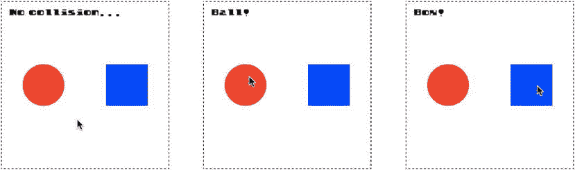

图 7-1 。检查是否有一个点，比如指针，接触到了一个精灵

惊喜！`hitTestPoint`和你上一章学的指针的`hitTestSprite`方法几乎一模一样。唯一的区别是你可以对你定义的任何点使用`hitTestPoint`，而不仅仅是指针。下面是示例`pointVsShape.html`文件中游戏循环的代码，实现了图 7-1 : 所示的效果

```js
if(hitTestPoint(pointer.position, ball)) {
  message.content = "Ball!"
} else if(hitTestPoint(pointer.position, box)) {
  message.content = "Box!"
} else {
  message.content = "No collision..."
}
```

圆形 vs 圆形

如果你想检查两个圆形精灵之间的碰撞，使用`hitTestCircle`函数 :

```js
hitTestCircle(sprite1, sprite2)
```

将它与任何具有`radius`属性的 sprite 一起使用。如果圆接触，它返回`true`，所以你可以用一个`if`语句来检查碰撞，语法如下:

```js
if (hitTestCircle(sprite1, sprite2)) {
  //The circles are touching
}
```

 **注意**章节中所有的碰撞函数默认使用精灵的本地坐标。如果要强制函数使用全局坐标，将最后一个可选参数`global`设置为`true`。以下是如何:

```js

hitTestCircle(sprite1, sprite2, true)

```

本章中的所有碰撞函数都有这个可选的最终`global`参数。

运行`circleCollision.html`文件，看看如何使用这个函数和我们在上一章创建的拖放指针系统，如图 7-2 所示。

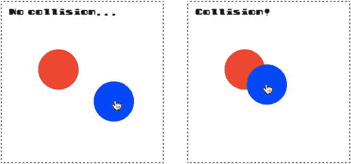

图 7-2 。检查两个圆是否接触

下面是游戏循环中使用`hitTestCircle`来实现这种效果的代码。红圈称为`c1`(代表“圈 1”)，蓝圈称为`c2`(代表“圈 2”)。

```js
if(hitTestCircle(c1, c2)) {
  message.content = "Collision!"
} else {
  message.content = "No collision..."
}
```

这是创建一个拼图或拖放形状匹配游戏所需的基本系统。

反应循环碰撞

在上一个示例中，您可以检测到发生了碰撞，但是圆没有以任何方式对碰撞做出反应。在大多数动作游戏中，你会希望你的精灵阻止其他精灵的移动，或者在它们碰撞时相互弹开。有两个函数可以用来制作具有这种真实碰撞反应的精灵:`circleCollision`和`movingCircleCollision`。为什么有两个？因为运动的圆根据撞上的是静止的圆还是另一个运动的圆反应略有不同。在接下来的两个部分中，你将学习如何在一些非常实用的游戏原型中使用这两个函数。

运动圆和静止圆之间的碰撞

如果一个运动的圆碰到一个不运动的圆，你可以使用`circleCollision`功能创建一个碰撞反应:

```js
circleCollision(circle1, circle2, true);
```

第一个参数是运动的球，第二个参数是不运动的球。第三个参数是一个可选的布尔值，它决定第一个圆是否应该从第二个圆弹回。(如果你忽略它，布尔值将默认为`false`，所以如果你想让圆圈反弹，将其设置为`true`。)

 **注意**将可选的第四个参数设置为`true`使得函数使用精灵的全局坐标。如果您想要检查具有不同父容器的精灵之间的碰撞，这是很重要的。您将在前面的示例中看到这是如何有帮助的。

任何带有`radius`属性的 sprite 都可以用在这个函数中。如果精灵也有一个`mass`属性，`circleCollision`函数将使用它的值按比例减弱反弹效果。

运行`pegs.html`来看看你如何使用这个函数来制作一个球，让它在一个圆形的格子中弹跳。球从每个木栓上弹开，停在画布的底部。网格中每个木栓的大小和颜色是随机的，球的大小、质量和起始速度也是随机的，因此每次运行的效果都是不同的。图 7-3 显示了您将看到的内容。

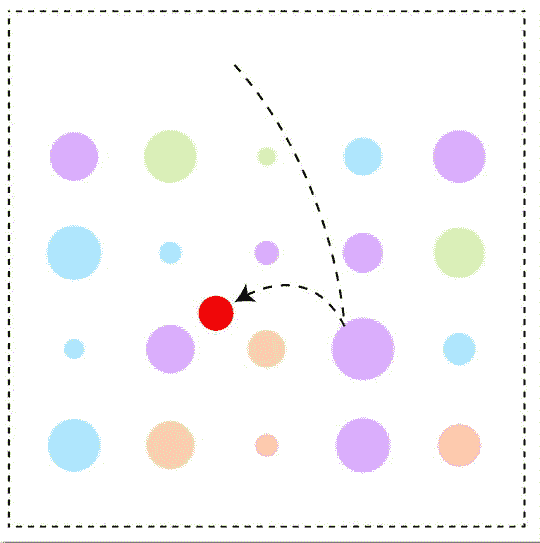

图 7-3 。一个球落下来，穿过一排排钉子

钉子在名为`pegs`的数组中，球的碰撞反应在游戏循环中使用这段代码创建:

```js
pegs.children.forEach(peg => {
  circleCollision(ball, peg, true, true);
});
```

这就是创建反弹效果所需的全部内容。但是在这个程序中还有一些更有趣的东西，你可能会在你自己的游戏中发现它们的用处。让我们来看看钉子网格是如何制作的。

绘制网格

仔细观察，你会注意到每一个木桩都被布置在一个 5 列 5 行的隐形网格中，如图 7-4 所示。

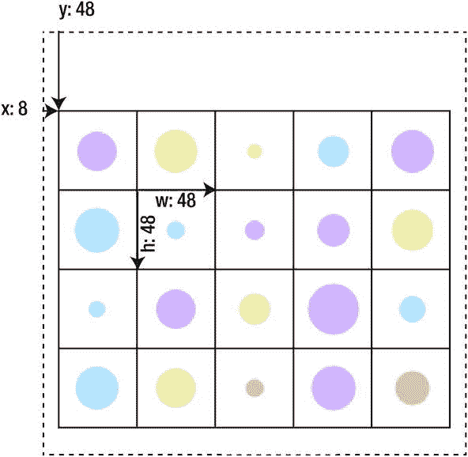

图 7-4 。每个 peg 在一个不可见的网格中居中

您可以看到，每个 peg 都在一个宽度和高度为 48 像素的网格单元内居中。每个木栓都有一个介于 8 和 32 像素之间的随机直径，以及一个从颜色值数组中选择的随机颜色。网格从画布左侧偏移 8 像素，从顶部偏移 48 像素。网格是父组容器，每个圆形 peg 是该组的子组。这个网格是怎么做出来的？

在这样的网格形状中绘制精灵是一项非常常见的视频游戏设计任务——事实上，如此常见，以至于将这项工作分配给一个可重复使用的功能会有所帮助，它会自动为您完成这项工作。在`library/display`文件夹中，你会找到一个名为`grid`的函数来完成这个任务。下面是如何在示例文件中使用`grid`函数来制作`pegs`网格:

```js
pegs = grid(
  5,          //The number of columns
  4,          //The number of rows
  48,         //The width of each cell
  48,         //The height of each cell
  true,       //Should the sprite be centered in the cell?
  0,          //The sprite's xOffset from the left of the cell
  0,          //The sprite's yOffset from the top of the cell

  //A function that describes how to make each peg in the grid.
  //A random diameter and color are selected for each one
  () => {
    let peg = circle(randomInt(8, 32));
    let colors = [
      "#FFABAB", "#FFDAAB", "#DDFFAB", "#ABE4FF", "#D9ABFF"
    ];
    peg.fillStyle = colors[randomInt(0, 4)];
    return peg;
  },

  //Run any optional extra code after each
  //peg is made
  () => console.log("extra!")
);
```

该函数返回一个名为`pegs`的`group`。网格中每个单元格内的所有精灵都是那个`pegs`组的孩子。因为它是一个组，所以你可以像操纵任何其他精灵一样操纵整个网格。这意味着你可以使用我们在第四章中创建的`setPosition`方法在画布中定位组，就像这样:

```js
pegs.setPosition(8, 48);
```

测试球和钉子之间的碰撞只是循环通过`pegs.children`并为每个调用`circleCollision`函数。因为精灵在组内的位置是相对于组的本地坐标的，你需要将`circleCollision`的`global`标志设置为`true`。

```js
pegs.children.forEach(peg => {
  circleCollision(ball, peg, true, true);
});
```

如果你不使用全局坐标，所有的碰撞看起来都会偏离画布的左边和上边的网格的偏移量(8 个像素在 *x* 轴上，48 个像素在 *y* 轴上)。

下面是完整的`grid`函数，它创建所有的标桩，在网格上绘制它们，并将它们添加到组中:

```js
export function grid(
    columns = 0, rows = 0, cellWidth = 32, cellHeight = 32,
    centerCell = false, xOffset = 0, yOffset = 0,
    makeSprite = undefined,
    extra = undefined
  ){

  //Create an empty group called `container`. This `container`
  //group is what the function returns to the main program.
  //All the sprites in the grid cells will be added
  //as children to this container
  let container = group();

  //The `create` method plots the grid
   let createGrid = () => {
     //Figure out the number of cells in the grid
    let length = columns * rows;

    //Create a sprite for each cell
    for(let i = 0; i < length; i++) {

      //Figure out the sprite's x/y placement in the grid
      let x = (i % columns) * cellWidth,
          y = Math.floor(i / columns) * cellHeight;

      //Use the `makeSprite` function supplied in the constructor
      //to make a sprite for the grid cell
      let sprite = makeSprite();

      //Add the sprite to the `container`
      container.addChild(sprite);

      //Should the sprite be centered in the cell?

      //No, it shouldn't be centered
      if (!centerCell) {
        sprite.x = x + xOffset;
        sprite.y = y + yOffset;
      }

      //Yes, it should be centered
      else {
        sprite.x
          = x + (cellWidth / 2)
          - sprite.halfWidth + xOffset;
        sprite.y
          = y + (cellHeight / 2)
          - sprite.halfHeight + yOffset;
      }

      //Run any optional extra code. This calls the
      //`extra` function supplied by the constructor
      if (extra) extra(sprite);
    }
  };

  //Run the `createGrid` method
  createGrid();

  //Return the `container` group back to the main program
  return container;
}
```

这段代码有点神奇。该计算为网格中的每个单元格找到正确的 *x，y* 位置:

```js
let x = (i % columns) * cellWidth,
    y = Math.floor(i / columns) * cellHeight;
```

这让您可以使用一个`for`循环来绘制网格，而不必使用两个嵌套循环。这是一条便捷的捷径。(如果你想知道这到底是为什么，在本章后面的平台游戏例子中会有详细的解释。)

 **提示**这个例子有一个有趣的扩展。如果你需要让一个球看起来在滚动，你可以用球的`vx`除以它的`radius`，然后把结果加到它的`rotation`，如下所示:`ball.rotation += ball.vx / ball.radius;`

在这个例子中，你看到了如何让一个移动的球与静止的球互动，但是如果所有的球都在移动，就像在台球或弹珠游戏中一样，那该怎么办呢？

运动圆之间的碰撞

您可以使用`movingCircleCollision`功能创建两个移动圆之间的碰撞反应。提供两个圆形精灵作为参数:

```js
movingCircleCollision(circle1, circle2)
```

如果圆圈有一个`mass`属性，它将用于帮助计算出圆圈相互弹开的力。默认情况下，`movingCircleCollision`使精灵弹开。

这个函数的一个重要特征是，当两个运动的圆碰撞时，它们以一种使它们非常真实地弹开的方式将它们的速度传递给彼此。这开启了一个全新的游戏世界。你现在已经非常接近能够玩台球或弹珠游戏了。运行`marbles.html`得到这样一个游戏的工作原型，如图图 7-5 所示。在任何弹球上按住指针，拉动并释放指针，弹开弹球。开始拖移时，弹球和指针之间会出现一条黄线。这条线代表了一种弹力带或弹弓，它将弹球拉向你拉动的相反方向。线的长度决定了弹球移动的力。当你松开弹弓时，弹球会从画布的边缘和所有其他弹球上弹开，导致它们互相反弹。

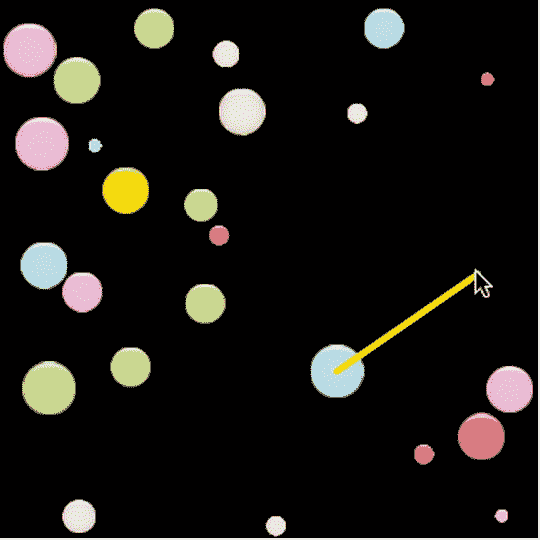

图 7-5 。拉动并释放以使多个圆圈 在画布周围相互弹开

这里有一些非常有趣的东西，将你目前为止在书中学到的许多技术结合在一起。让我们一步一步来看看这个游戏原型是如何制作的。

制作弹珠

每个大理石是如何制作的？弹珠实际上是来自一个名为`marbles.png`的单幅拼贴图像的图像，如图 7-6 中的所示。每个单幅图块为 32 x 32 像素。

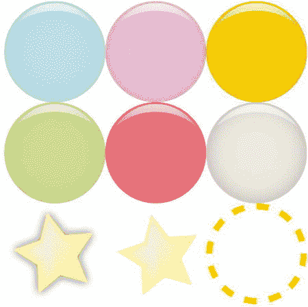

图 7-6 。大理石瓷砖

这个游戏只使用了前两行图像:六个彩色圆圈。在第四章的中，你学习了如何使用`frames`函数在 tileset 上捕捉多个图像。以下是如何使用它来捕捉对所有六个彩色圆圈的引用:

```js
let marbleFrames = frames(
  assets["img/marbles.png"],  //The tileset image
  [
    [0,0],[32,0],[64,0],         //A 2D array that defines the
    [0,32],[32,32],[64,32]       //x and y image positions
  ],
  32, 32                         //The width and height of each image
);
```

现在可以使用这些帧初始化精灵:

```js
let marble = sprite(marbleFrames);
```

大理石精灵现在引用了所有六个图像帧，您可以使用`gotoAndStop`来显示其中的任何一个。下面是如何使用`randomInt`让大理石显示一个随机帧:

```js
marble.gotoAndStop(randomInt(0, 5));
```

将弹球的`circular`属性 设置为`true`，使其具有碰撞功能所需的`diameter`和`radius`属性:

```js
marble.circular = true;
```

如果你想给弹球一个随机的直径呢？创建一个大小数组，并随机分配一个给弹球的`diameter`属性 :

```js
let sizes = [8, 12, 16, 20, 24, 28, 32];
marble.diameter = sizes[randomInt(0, 6)];
```

当然，你不只是制造一个弹珠——游戏原型有 25 个弹珠。所以在网格中初始化它们是有意义的。以下是游戏中的`setup`函数的所有代码，该函数使用`grid`函数创建所有 25 个大理石精灵。

```js
marbles = grid(

  //Set the grid's properties
  5, 5, 64, 64,
  true, 0, 0,

  //A function that describes how to make each marble
  () => {
    let marbleFrames = frames(
      assets["img/marbles.png"],
      [
        [0,0],[32,0],[64,0],
        [0,32],[32,32],[64,32]
      ],
      32, 32
    );

    //Initialize a marble with the frames
    let marble = sprite(marbleFrames);

    //Set the marble to a random frame
    marble.gotoAndStop(randomInt(0, 5));

    //Give it circular properties (`diameter` and `radius`)
    marble.circular = true

    //Give the marble a random diameter
    let sizes = [8, 12, 16, 20, 24, 28, 32];
    marble.diameter = sizes[randomInt(0, 6)];

    //Give it a random initial velocity
    marble.vx = randomInt(-10, 10);
    marble.vy = randomInt(-10, 10);

    //Assign the rest of the marble's physics properties
    marble.frictionX = 0.99;
    marble.frictionY = 0.99;
    marble.mass = 0.75 + (marble.diameter / 32);

    //Return the marble sprite so that it can
    //be added to the grid cell
    return marble;
  }
);
```

您可以在这段代码中看到，弹珠也被赋予了随机的初始速度，从–10 到 10:

```js
marble.vx = randomInt(-10, 10);
marble.vy = randomInt(-10, 10);
```

这意味着一旦他们的位置在游戏循环中更新，他们就会朝不同的方向飞走。代码还计算出每个弹球的`mass` :

```js
marble.mass = 0.75 + (marble.diameter / 32);
```

质量较小的较轻弹珠会比质量较大的较重弹珠以更快的速度弹开。

制作弹弓

这个例子的一个关键特征是弹弓效应,当你把指针放在一个弹球上，拖动，然后放开它，你就会得到弹弓效应。弹球逆着你拉动的方向弹开，并反弹到它碰到的任何其他弹球上，产生一个复杂的碰撞链，如图图 7-7 所示。

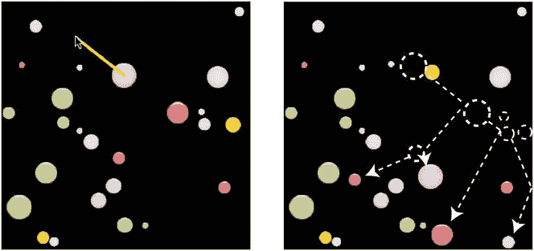

图 7-7 。在弹球上按下、拖动并释放指针，产生弹弓效果

这个弹弓装置是很多游戏的重要功能，比如愤怒的小鸟，所以让我们快速看看它是怎么做的。

当你按下并拖动一个弹球时，你看到的被称为**吊带** 的黑线就是一个`line`精灵。它的`visible`属性在游戏刚开始的时候被设置为`setup`函数中的`false`，这样你就看不到它了:

```js
sling = line("Yellow", 4);
sling.visible = false;
```

该游戏使用一个名为`capturedMarble` 的变量来跟踪指针选择了哪个弹球。游戏第一次开始时，它被初始化为`null`:

```js
capturedMarble = null;
```

在每一帧中，游戏循环遍历所有的弹珠，并检查与`pointer`的碰撞。如果`pointer`是关闭的，并且一个弹球还没有被捕获，代码使用`hitTestPoint`来发现在`pointer`下面是否有一个弹球。如果有，代码会将弹球设置为`capturedMarble`，并将弹球的速度设置为零以阻止其移动:

```js
marbles.children.forEach(marble => {

  //Check for a collision with the pointer and marble
  if (pointer.isDown && capturedMarble === null) {
    if (hitTestPoint(pointer, marble)) {

      //If there's a collision, capture the marble
      capturedMarble = marble;
      capturedMarble.vx = 0;
      capturedMarble.vy = 0;
    }
  }
  //... make the marbles move and set screen boundaries...
});
```

如果一个弹球被捕获，吊索变得可见，并从`pointer` 被拉到弹球的中心:

```js
if (capturedMarble !== null) {
  sling.visible = true;
  sling.ax = capturedMarble.centerX;
  sling.ay = capturedMarble.centerY;
  sling.bx = pointer.x;
  sling.by = pointer.y;
}
```

当`pointer`被释放时，吊索的长度被转换成速度，使弹球以成比例的速度向相反的方向射出。你拖得越远，弹球的速度就越快。就像橡皮筋一样。这实际上只是我们在前一章中用来发射子弹的代码的一个微小变化。

```js
if (pointer.isUp) {

  //Make the sling invisible when it is released
  sling.visible = false;

  if (capturedMarble !== null) {

    //Find out how long the sling is
    sling.length = distance(capturedMarble, pointer);

    //Get the angle between the center of the marble and the pointer
    sling.angle = angle(pointer, capturedMarble);

    //Shoot the marble away from the pointer with a velocity
    //proportional to the sling's length
    let speed = 5;
    capturedMarble.vx = Math.cos(sling.angle) * sling.length / speed;
    capturedMarble.vy = Math.sin(sling.angle) * sling.length / speed;

    //Release the captured marble
    capturedMarble = null;
  }
}
```

检查多重碰撞

在每一帧上，你需要检查每个弹球和其他弹球之间的碰撞。你需要确保没有一对弹珠会被检查一次以上的碰撞。实现这一点的关键是使用一个嵌套的 for 循环的**，并使内部循环的计数器比外部循环大 1。下面是嵌套的`for`循环，它使用`movingCircleCollision`函数让弹珠相互弹开:**

```js
for (let i = 0; i < marbles.children.length; i++) {

  //The first marble to use in the collision check
  var c1 = marbles.children[i];

  for (let j = i + 1; j < marbles.children.length; j++) {

    //The second marble to use in the collision check
    let c2 = marbles.children[j];

    //Check for a collision and bounce the marbles apart if they collide
    movingCircleCollision(c1, c2);
  }
}
```

您可以看到内部循环的起始数字比外部循环大一:

```js
let j = i + 1
```

这可以防止任何一对对象被多次检查碰撞。

 **注意**`library/collision`文件包含一个名为`multipleCircleCollision`的便利方法，可以自动完成整个嵌套的`for`循环。您可以在游戏循环中使用它来检查一个数组中的所有精灵和同一数组中的所有其他精灵，而不会重复。像这样使用它:

```js
multipleCircleCollision(marbles.children)
```

它会自动调用每一对精灵的`movingCircleCollision`来让它们互相弹开。

你现在知道了使用圆形精灵制作各种游戏所需的大部分重要技术。接下来，我们将看看如何处理矩形精灵之间的碰撞。

 **注意**需要做圆和单点的碰撞检查吗？就把一个点想象成一个直径为 1 个像素，半径为 0.5 个像素的非常小的圆。然后使用那个非常小的圆和任何能和普通圆一起工作的碰撞函数。为了方便起见，`library/collision`模块包含了两个“圆对点”函数:`hitTestCirclePoint`测试碰撞，`circlePointCollision`将圆从点上弹开。第一个参数应该是 circle sprite，第二个参数应该是具有 x 和 y 属性的 point 对象。

矩形与矩形

要找出两个矩形精灵是否重叠，使用一个名为`hitTestRectangle` 的函数:

```js
hitTestRectangle(rectangle1, rectangle2)
```

运行文件`rectangleCollision.html`获得一个简单的例子。用指针拖动方块，观察输出文本显示“Hit！”当它们碰撞时，如图图 7-8 所示。

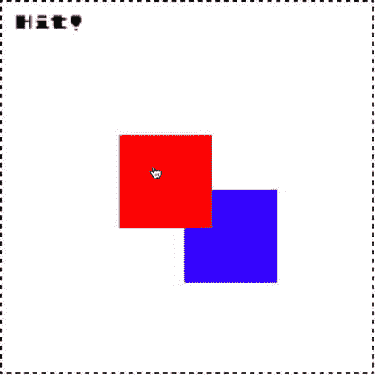

图 7-8 。检查矩形之间的冲突

在简单的`if`语句中使用`hitTestRectangle`会改变输出文本:

```js
if (hitTestRectangle(rectangle1, rectangle2)) {
  output.text = "Hit!";
} else {
  output.text = "No collision...";
}
```

像这样检查矩形之间的碰撞是目前为止游戏中最常见的碰撞检测。事实上，你可以用比`hitTestRectangle`更复杂的东西制作无数游戏。让我们来仔细看看如何使用它来制作一个简单的对象收集和敌人回避游戏，名为寻宝者 。

寻宝者

寻宝者(图 7-9 )是一个很好的例子，展示了一个最简单的完整游戏，你可以使用我们在本书中已经建立的工具来制作。(通过章节源文件中的`treasureHunter.html`来感受一下。)使用箭头键帮助探险家找到宝藏，并把它带到出口。六个斑点怪物在地牢墙壁之间上下移动，如果它们击中探险家，他就会变成半透明，右上角的生命值会缩小。如果所有生命值用完，画布上显示“你输了”；如果玩家角色带着宝藏到达出口，“你赢了！”已显示。虽然这是一个基本的原型，寻宝者包含了你在更大的游戏中会发现的大部分元素:纹理贴图、交互性、碰撞和多个游戏场景。让我们快速地看一下它是如何被组合在一起的，这样你就可以用它作为你自己的一个游戏的起点。

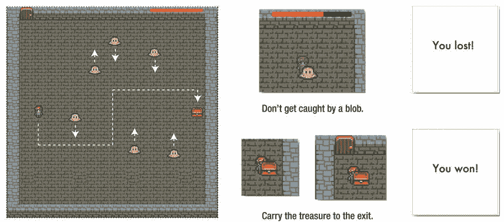

图 7-9 。找到宝藏，避开敌人，到达出口

制作游戏精灵

每个精灵最初都是一个单独的图像文件。我用纹理打包器把它们变成了纹理图谱(如图图 7-10 ，用`assets.load`导入纹理图谱。

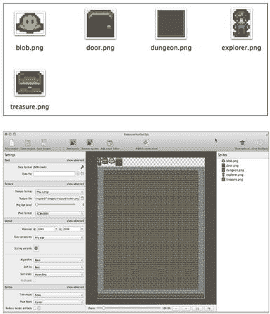

图 7-10 。用单独的图像文件制作纹理贴图集

```js
assets.load(["img/treasureHunter.json"]).then(() => setup());
```

玩家角色、出口门、宝箱和地下城背景图像都是来自纹理贴图帧 的精灵。

```js
//The dungeon background image
dungeon = sprite(assets["dungeon.png"]);

//The exit door
exit = sprite(assets["door.png"]);
exit.x = 32;

//The player character sprite
player = sprite(assets["explorer.png"]);
stage.putCenter(player, -128);

//Create the treasure
treasure = sprite(assets["treasure.png"]);

//Position the treasure next to the right edge of the canvas
stage.putRight(treasure, -64);
```

所有精灵被组合在一个`gameScene` : 中

```js
gameScene = group(dungeon, exit, player, treasure);
```

将它们放在一个组中会让我们很容易隐藏`gameScene`并在游戏结束时显示`gameOverScene`。

六个斑点怪物在一个循环中被创建。每个斑点被赋予一个随机的初始位置和速度。对于每个斑点，垂直速度交替乘以 1 或–1，这就是导致每个斑点向与其相邻斑点相反的方向移动的原因:

```js
let numberOfEnemies = 6,
    spacing = 48,
    xOffset = 150,
    speed = 2,
    direction = 1;

//An array to store all the enemies
enemies = [];

//Make as many enemies as there are `numberOfEnemies`
for (let i = 0; i < numberOfEnemies; i++) {

  //Each enemy is made from a blob texture atlas frame
  let enemy = sprite(assets["blob.png"]);

  //Space each enemy horizontally according to the `spacing` value.
  //`xOffset` determines the point from the left of the screen
  //at which the first enemy should be added
  let x = spacing * i + xOffset;

  //Give the enemy a random y position
  let y = randomInt(0, canvas.height - enemy.height);

  //Set the enemy's direction
  enemy.x = x;
  enemy.y = y;

  //Set the enemy's vertical velocity. `direction` will be either `1` or
  //`-1`. `1` means the enemy will move down and `-1` means the enemy will
  //move up. Multiplying `direction` by `speed` determines the enemy's
  //vertical direction
  enemy.vy = speed * direction;

  //Reverse the direction for the next enemy
  direction *= -1;

  //Push the enemy into the `enemies` array
  enemies.push(enemy);

  //Add the enemy to the `gameScene`
  gameScene.addChild(enemy);
}
```

你会注意到，当玩家触摸其中一个敌人时，屏幕右上角的生命值条的宽度会减小。这款保健棒是怎么做出来的？它只是两个相同位置的矩形精灵:一个黑色矩形在后面，一个红色矩形在前面。它们被组合在一起，形成一个名为`healthBar` 的复合精灵。然后将`healthBar` 添加到`gameScene`??。

```js
//Make the inner and outer bars
let outerBar = rectangle(128, 8, "black"),
    innerBar = rectangle(128, 8, "red");

//Group the inner and outer bars
healthBar = group(outerBar, innerBar);

//Set the `innerBar` as a property of the `healthBar`
healthBar.inner = innerBar;

//Position the health bar
healthBar.x = canvas.width - 164;
healthBar.y = 4;

//Add the health bar to the `gameScene`
gameScene.addChild(healthBar);
```

您可以看到一个名为`inner`的属性被添加到了`healthBar`中。它只是引用了`innerBar`(红色矩形)，以便以后方便访问:

```js
healthBar.inner = innerBar;
```

你不必包括这个属性；但是为什么不呢！这意味着如果你想控制`innerBar`的宽度，你可以写一些类似这样的流畅代码:

```js
healthBar.inner.width = 30;
```

这是非常整洁和可读的，所以我们将保持它！

当游戏结束时，一些文字显示“你赢了！”或者“你输了！”，视结果而定。我们通过使用一个文本精灵来创建这个文本，并将其添加到一个名为`gameOverScene`的组中。游戏开始时，`gameOverScene`的`visible`属性被设置为`false`，这样你就看不到这段文字了。下面是来自`setup`函数的代码，它创建了`gameOverScene`和`message`文本:

```js
//Add some text for the game over message
message = text("Game Over!", "64px Futura", "black", 20, 20);
message.x = 120;
message.y = canvas.height / 2 - 64;

//Create a `gameOverScene` group and add the message sprite to it
gameOverScene = group(message);

//Make the `gameOverScene` invisible for now
gameOverScene.visible = false;
```

当游戏结束后，`gameOverScene.visible`将被设置为`true`以揭示结果。

移动和包含精灵

使用键盘控制播放器，这样做的代码与您在上一章中学习的键盘控制代码非常相似。键盘对象修改玩家的速度，并且该速度被添加到玩家在游戏循环中的位置。《寻宝者》的一个重要细节是，所有玩家和敌人的精灵都被包含在地下城的墙壁里，以一种与艺术品的 2.5D 视角相匹配的方式。该区域略小于整个画布区域，在图 7-11 中用绿色矩形表示。

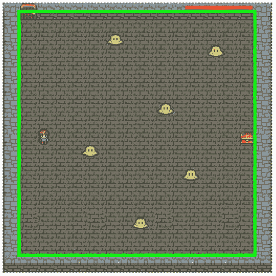

图 7-11 。精灵被藏在地牢的墙壁里

借助我们在前一章中编写的自定义函数`contain`??，这很容易做到。`contain`函数的第二个参数是一个对象，它定义了应该包含精灵的矩形区域。在《寻宝者》中，这是一个从画布区域偏移并略小于画布区域的区域。

```js
contain(
  player,
  {
    x: 32, y: 16,
    width: canvas.width - 32,
    height: canvas.height - 32
  }
);
```

游戏循环还会移动敌人，将他们控制在地下城内，并检查每个敌人是否与玩家发生冲突。如果一个敌人撞上了地牢的顶壁或底壁，它的方向就会反转。一个`forEach`循环在每一帧完成所有这些工作:

```js
//Loop through all the enemies
enemies.forEach(enemy => {

  //Move the enemy
  enemy.x += enemy.vx;
  enemy.y += enemy.vy;

  //Check the enemy's screen boundaries
  let enemyHitsEdges = contain(
    enemy,
    {
      x: 32, y: 16,
      width: canvas.width - 32,
      height: canvas.height - 32
    }
  );

  //If the enemy hits the top or bottom of the stage, it reverses
  //its direction
  if (enemyHitsEdges === "top" || enemyHitsEdges === "bottom") {
    enemy.vy *= -1;
  }

  //Test for a collision. If any of the enemies are touching
  //the player, set `playerHit` to `true`
  if(hitTestRectangle(player, enemy)) {
    playerHit = true;
  }
});
```

最后一个`if`语句检查敌人和玩家之间的冲突——让我们仔细看看它是如何工作的。

检查碰撞

用于判断是否有敌人接触过玩家。如果`hitTestRectangle` 返回`true`，则表示发生了碰撞。然后，代码将名为`playerHit`的变量设置为`true`。

```js
if(hitTestRectangle(player, enemy)) {
  playerHit = true;
}
```

如果`playerHit`为`true`，游戏循环使玩家半透明，生命值条宽度减少 1 个像素:

```js
if(playerHit) {

  //Make the player semitransparent
  player.alpha = 0.5;

  //Reduce the width of the health bar's inner rectangle by 1 pixel
  healthBar.inner.width -= 1;
} else {

  //Make the player fully opaque (nontransparent) if it hasn't been hit
  player.alpha = 1;
}
```

游戏循环还检查宝箱和玩家之间的碰撞。如果有击中，宝藏被设置到玩家的位置，稍微偏移，使它看起来像是玩家带着它(图 7-12 )。

```js
if (hitTestRectangle(player, treasure)) {
  treasure.x = player.x + 8;
  treasure.y = player.y + 8;
}
```

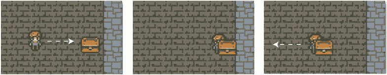

图 7-12 。玩家角色可以拿起并携带宝箱

到达出口并结束游戏

游戏有两种结束方式:如果你把宝藏带到出口你就能赢，如果你耗尽了生命值你就输了。要赢得游戏，宝箱只需要触摸出口门。如果发生这种情况，包含所有精灵的`gameScene`将不可见，而显示消息文本的`gameOverScene` 会显示出来。下面是游戏循环中的`if`语句:

```js
if (hitTestRectangle(treasure, exit)) {
  gameScene.visible = false;
  gameOverScene.visible = true;
  message.content = "You won!";
}
```

要输掉游戏，生命值栏的宽度必须小于 0。如果是，那么`gameOverScene`以同样的方式显示。游戏循环使用这个`if`语句来检查:

```js
if (healthBar.inner.width < 0) {
  gameScene.visible = false;
  gameOverScene.visible = true;
  message.content = "You lost!";
}
```

这真的就是全部了！再做一点工作，你就可以把这个简单的原型变成一个完整的游戏——试试吧！

反应矩形碰撞

在前面的例子中，你可以检查两个矩形是否冲突，但是没有什么可以阻止它们重叠。有了一个叫做`rectangleCollision` 的新函数，我们可以更进一步，让矩形看起来像有实体一样；`rectangleCollision`将防止其前两个参数中的任何矩形子画面重叠:

```js
rectangleCollision(rectangle1, rectangle2)
```

`rectangleCollision`也返回一个字符串，它的值可能是`"left"`、`"right"`、`"top"`或`"bottom"`，告诉你第一个矩形的哪一侧接触了第二个矩形。您可以将返回值赋给一个变量，并在游戏中使用该信息。以下是如何:

```js
let collision = rectangleCollision(rectangle1, rectangle2);

//On which side of the red square is the collision occurring?
switch (collision) {
  case "left":
    message.content = "Collision on left";
    break;
  case "right":
    message.content = "Collision on right";
    break;
  case "top":
    message.content = "Collision on top";
    break;
  case "bottom":
    message.content = "Collision on bottom";
    break;
  default:
    message.content = "No collision...";
}
```

`collision`的默认值为`undefined`。

这段代码防止矩形重叠，并在`message`文本精灵中显示碰撞边。运行`reactiveRectangles.html`作为工作示例，如图图 7-13 所示。使用指针将红色方块拖到蓝色方块中。无论你如何努力，方块将保持清晰的分离，永远不会重叠。输出文本显示碰撞发生在红色方块的哪一侧。

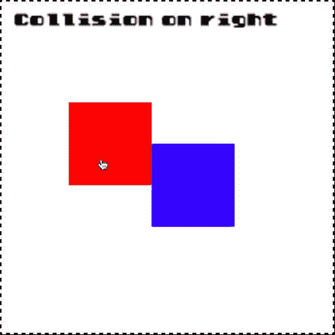

图 7-13 。方块不会重叠，输出文本会告诉您碰撞的一面

`rectangleCollision`函数有一个非常有用的副作用。参数中的第二个精灵有能力推开第一个精灵。你可以在例子中看到这种效果，用蓝色方块推动画布周围的红色方块，如图 7-14 所示。

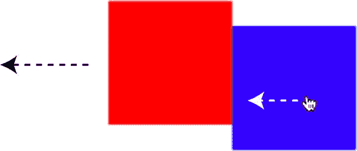

图 7-14 。参数中的第二个精灵可以推动第一个精灵

如果你需要在游戏中加入推方块或滑动方块的功能，你可以这样做。

`rectangleCollision`函数有第三个可选的布尔参数`bounce`:

```js
rectangleCollision(rectangle1, rectangle2, true)
```

如果`bounce`是`true`，当第一个精灵和第二个精灵碰撞时，它会使第一个精灵从第二个精灵身上弹开。其默认值为`false`。(与本章中所有其他碰撞函数一样，如果你想使用精灵的全局坐标，你应该将最后一个可选参数`global`设置为`true`。)

像这样精确的矩形碰撞反应是你武器库中最有用的游戏设计工具之一。为了向您展示它有多有用，我们将详细介绍一个实际的例子，它将为您提供许多灵感，让您可以立即着手大量的游戏项目。

制作平台游戏

平台游戏对于游戏设计者来说是一个伟大的技术和创意基准，因为它们给你一个机会来使用你的玩具盒中所有的游戏设计玩具。如果你能解决制作平台游戏需要克服的所有挑战，你会发现缩小规模并使用相同的技术制作许多其他类型的 2D 动作游戏很容易。

让我们利用本书中迄今为止已经创建的所有工具来构建一个极简平台游戏原型。运行`platforms.html`文件，如图 7-15 中的所示，尝试工作示例。用方向键左右移动红色方块，用空格键跳跃。你可以在岩石平台(黑色方块)或草地平台(绿色方块)上跳跃。草地平台总是在岩石平台之上。收集宝藏(黄色方块)以增加您的分数。游戏关卡地图是程序化生成的，所以每次玩都不一样。

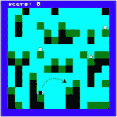

图 7-15 。围绕一个程序化生成的平台游戏跑跳

这个游戏程序有两个主要部分。第一个控制平台跳跃的机制和碰撞检测的使用方式。第二部分是使用一些简单的规则随机创建游戏关卡的方式。我们先来看看游戏机制，然后看看关卡是如何创建的。在本节的最后，你将学习如何将这些简单的形状精灵替换为图像精灵，这样你就可以轻松地定制游戏的外观。

平台碰撞

游戏使用`rectangleCollision`功能来防止玩家角色(红色方块)从平台(黑色和绿色方块)上掉落。当玩家降落在一个平台上时，代码需要通过将玩家的速度设置为零来停止玩家。游戏还需要知道玩家何时站在“地上”这个游戏中的“地面”是任何平台的顶面。当玩家站在一个平台的顶部时，我们需要将一个名为`isOnGround`的变量设置为`false`，并通过从玩家的速度中减去重力来抵消重力的影响。

下面是游戏循环中完成这一切的代码。它遍历所有的平台，并使用`rectangleCollision`函数来找出玩家是否接触了任何平台。如果是，代码会防止玩家掉下去。代码还使用`rectangleCollision'`的返回值`("left"`、`"right"`、`"top"`或`"bottom"`来找出玩家触摸平台的哪一侧。

```js
world.platforms.forEach(platform => {

  //Use `rectangleCollision` to prevent the player and platforms
  //from overlapping
  let collision = rectangleCollision(player, platform);

  //Use the `collision` variable to figure out what side of the player
  //is hitting the platform
  if (collision) {
    if(collision === "bottom" && player.vy >= 0) {

      //Tell the game that the player is on the ground if
      //it's standing on top of a platform
      player.isOnGround = true;

      //Neutralize gravity by applying its
      //exact opposite force to the character's vy
      player.vy = -player.gravity;
    }
    else if(collision === "top" && player.vy <= 0) {
      player.vy = 0;
    }
    else if(collision === "right" && player.vx >= 0) {
      player.vx = 0;
    }
    else if(collision === "left" && player.vx <= 0) {
      player.vx = 0;
    }

    //Set `isOnGround` to `false` if the bottom of the player
    //isn't touching the platform
    if(collision !== "bottom" && player.vy > 0) {
      player.isOnGround = false;
    }
  }
});
```

玩家每捡起一个宝藏(黄色方块)，宝藏就会从游戏中消失，分数增加一，如图图 7-16 所示。代码通过遍历每个平台精灵并使用`hitTestRectangle` 来检查碰撞来实现这一点。

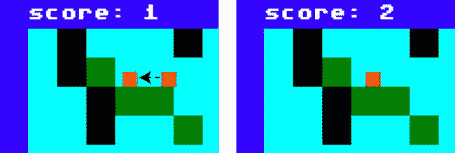

图 7-16 。收集宝藏以增加分数

```js
world.treasure = world.treasure.filter(box => {

  //Check for a collision between the player and the treasure
  if (hitTestRectangle(player, box)){

    //Increase the score by 1
    score += 1;

    //Remove the treasure sprite
    remove(box);

    //Remove the treasure from the array
    return false;
  } else {

    //Keep the treasure in the array
    return true;
  }
});

//Display the score
message.content = `score: ${score}`;
```

现在你知道了游戏中的碰撞检测是如何工作的，那么玩家是如何移动的呢？

让玩家移动和跳跃

这个平台游戏原型使用了你在前面章节中学到的所有物理力。它还增加了一个新功能:当你按下空格键时应用的`jumpForce`。`jumpForce` 是`player`精灵的属性:

```js
player.jumpForce = -6.8;
```

它被设置为一个负数，让玩家向画布的顶部跳去。(记住，负 *y* 力使事情向上发展。)当玩家按下空格键，这个`jumpForce`就加到玩家的垂直速度上(`vy`)。找到使玩家的跳跃看起来自然的正确数字真的只是一个试错的问题。

只有当玩家站在平台上时，才允许他跳跃。幸运的是，我们为平台碰撞设置的`isOnGround`变量可以告诉我们这一点。此外，如果按下左右箭头键，玩家的移动应该不会受到摩擦的影响，这样它就可以在平台表面上平稳地移动。但是如果玩家在空中移动呢？一些风阻应该会使它慢一点，这样跳跃就更容易控制。这些都是微妙的细节，但最终的代码并不复杂。下面是来自`setup`函数的代码，它创建了玩家的键盘控件 。

```js
leftArrow = keyboard(37);
rightArrow = keyboard(39);
space = keyboard(32);

//Left arrow key
leftArrow.press = () => {
  if(rightArrow.isUp) {
    player.accelerationX = -0.2;
  }
};
leftArrow.release = () => {
  if(rightArrow.isUp) {
    player.accelerationX = 0;
  }
};

//Right arrow key
rightArrow.press = () => {
  if(leftArrow.isUp) {
    player.accelerationX = 0.2;
  }
};
rightArrow.release = () => {
  if(leftArrow.isUp) {
    player.accelerationX = 0;
  }
};

//Space key (jump)
space.press = () => {
  if(player.isOnGround) {
    player.vy += player.jumpForce;
    player.isOnGround = false;
    player.frictionX = 1;
  }
};
```

然后，游戏循环通过更新这些物理属性并将其应用于玩家的位置来使玩家移动:

```js
//Regulate the amount of friction acting on the player
if (player.isOnGround) {

  //Add some friction if the player is on the ground
  player.frictionX = 0.92;
} else {

  //Add less friction if it's in the air
  player.frictionX = 0.97;
}

//Apply the acceleration
player.vx += player.accelerationX;
player.vy += player.accelerationY;

//Apply friction
player.vx *= player.frictionX;

//Apply gravity
player.vy += player.gravity;

//Move the player
player.x += player.vx;
player.y += player.vy;
```

这些都是创建大多数平台游戏需要知道的基本机制。但是实际的游戏世界是怎么创造出来的呢？

创造游戏世界

程序的`setup`功能创造了游戏世界。所有的关卡数据都存储在一个名为`level`的对象中，这个对象描述了游戏世界有多大。这个世界是由一个由**瓷砖**组成的网格构成的:16 块横向瓷砖和 16 块纵向瓷砖。每个拼贴宽 32 像素，高 32 像素，这意味着世界的像素大小为 512 乘 512。每块瓷砖的尺寸与我们用来创造世界的精灵的最大尺寸相匹配。

```js
level = {

  //The height and width of the level, in tiles
  widthInTiles: 16,
  heightInTiles: 16,

  //The width and height of each tile, in pixels
  tilewidth: 32,
  tileheight: 32
};
```

在一个更复杂的游戏中，你可以在`level`对象中添加特定于游戏级别的其他类型的数据。这些属性可以存储特定项目的位置、使级别更容易或更难的值，或者应该创建的级别的大小和类型。如果你正在创建一个多级游戏，你可以在游戏中的每个级别使用不同的级别对象。然后你可以在一大堆游戏关卡中存储和访问它们，你可以随着游戏的进展动态地加载和创建它们。

这个等级数据然后被用来制作游戏世界:

```js
world = makeWorld(level);
```

什么是`world`，`makeWorld`是如何工作的？`world`是一个由`makeWorld`返回的群组，包含游戏中所有的精灵。`makeWorld`功能基本上只是创建一个组，给它添加游戏精灵，然后把这个组返回给游戏程序。所有这些都发生在游戏循环开始运行之前的`setup`函数中。

`makeWorld`函数有很多工作要做，所以在我们看细节之前，让我们先来鸟瞰一下它做了什么。

```js
function makeWorld(level) {

  //create the `world` object
  let world = group();

  //Add some arrays to the world that will store the objects that we're
  //going to create
  world.map = [];
  world.itemLocations = [];
  world.platforms = [];
  world.treasure = [];

  //Initialize a reference to the player sprite
  world.player = null;

  //1\. Make the map
  makeMap();

  //2\. Terraform the map
  terraformMap();

  //3\. Add the items
  addItems();

  //4\. Make the sprites
  makeSprites();

  //The four functions that do all the work:

  function makeMap() {/* Make the map */}
  function terraformMap() {/* Add grass, rock, sky and clouds */}
  function addItems() {/* Add the player and treasure to the map */}
  function makeSprites() {/* Use the map data to make the actual game sprites */}

  //Return the `world` group back to the main program
  return world;
}
```

可以看到`makeWorld`有条不紊地依次调用了四个函数:`makeMap`、`terraformMap`、`addItems`、`makeSprites`。就像一条小流水线。这些函数中的每一个都做一点工作，然后将工作交给下一个函数继续。当最后一个`makeSprites`完成时，所有的精灵都被制作完成，并且`world`组返回到主游戏程序。这些都是按顺序发生的，所以让我们来看看每个函数是如何工作的。

制作地图

第一个函数`makeMap` ，用随机单元格填充地图数组。这些单元格只是人们熟悉的普通 JavaScript 对象:

```js
cell = {};
```

每个单元格都有 *x* 和 *y* 属性，根据级别的宽度和高度表示它在网格上的位置。在这个例子中，它们代表 16×16 的单元网格。单元格有一个`terrain`属性，可以是`"rock"`或`"sky"`。每个细胞有 25%的几率是石头，75%的几率是天空，这是由一个叫做`cellIsAlive`的辅助函数决定的。这些单元格还有一个名为`item`的属性，我们将在后面的步骤中使用它来放置游戏物品:玩家和宝箱。

```js
function makeMap() {

  //The `cellIsAlive` helper function.
  //Give each cell a 1 in 4 chance to live. If it's "alive", it will
  //be rock, if it's "dead" it will be sky.
  //`cellIsAlive` will be `undefined` unless the random number is 0
  let cellIsAlive = () => randomInt(0, 3) === 0;

  //First, figure out the number of cells in the grid
  let numberOfCells = level.heightInTiles * level.widthInTiles;

  //Next, create the cells in a loop
  for (let i = 0; i < numberOfCells; i++) {

    //Figure out the x and y position
    let x = i % level.widthInTiles,
        y = Math.floor(i / level.widthInTiles);

    //Create the `cell` object
    let cell = {
      x: x,
      y: y,
      item: ""
    };

    //Decide whether the cell should be "rock" or "sky"
    if (cellIsAlive()) {
      cell.terrain = "rock";
    } else {
      cell.terrain = "sky";
    }

    //Push the cell into the world's `map` array
    world.map.push(cell);
  }
}
```

该函数运行后，`map`数组将包含 256 个`cell`对象，其中 25%的对象将随机将其地形设置为`"rock"`，其余的设置为`"sky"`。它们的`x`和`y`属性也会告诉你它们在 16 乘 16 的网格上的位置。图 7-17 显示了一个随机地图的例子。(我们还没有为这些单元格创建精灵，所以图 7-17 只是展示了我们创建的数组数据。)

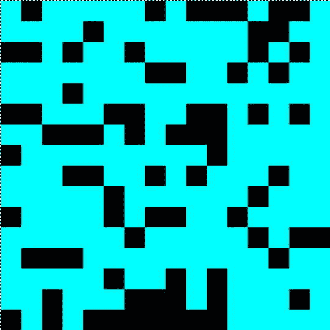

图 7-17 。创建岩石(黑色方块)和天空(蓝色方块)的随机贴图

这是一个好的开始，但是你会看到我们如何在接下来的步骤中改进这张地图。

将 1D 阵列用于 2D 地图

你会注意到，虽然我们正在创建一个 2D 网格单元，我们只使用一个平面，1D 阵列。这与我们在本章开始时编写的`grid`函数中使用的技术相同，所以让我们仔细看看它是如何工作的。

您可以通过将网格的宽度(16)乘以高度(16)来计算出 1D 数组应该有多长:

```js
let numberOfCells = this.height * this.width;
```

这将得到 256 个数组元素:16 行和 16 列。

我们不需要使用 2D 数组的原因是每个单元格对象都有存储其在网格上的位置的`x`和`y`属性，但是我们不需要可以从 2D 数组中获得的行和列信息。相反，代码使用这个公式将数组的索引计数器`i`转换为`x`(列)和`y`(行)坐标:

```js
x = i % this.width;
y = Math.floor(i / this.width);
```

`x`位置总是索引计数器除以网格宽度的余数:`i % this.width`。`y`位置总是索引计数器的值除以网格的宽度，余数被截断:`Math.floor(i / this.width)`。这是一个方便的神奇公式，放在你的后口袋里！

为什么不用 2D 阵？主要是风格问题。通过使用 1D 数组，我们可以消除内部嵌套的`for`循环。因为每个数组元素都包含一个对象，所以我们可以将网格位置直接存储在该对象上，而不必使用循环索引计数器来计算它。此外，我们可以用描述地图单元格所需的额外属性来包装`cell`对象。这使它成为地图信息的有效存储容器。当我们继续建造游戏关卡时，你将会看到这将会如何有帮助。

地形图

现在我们已经有了一个随机方格的网格，我们可以改进它，使它更适合平台游戏环境。To **terraform** 的意思是修改现有的环境——这就是我们接下来要做的。我决定做四件事来改进这张地图:

*   我想在游戏区域周围添加一个边框。
*   我想找到每一块上面有天空细胞的石头。这些岩石应该变成`"grass"`细胞。(你可以在完成的原型中看到这些绿色的方块。)草细胞是玩家将能够在上面跳跃的所有平台。
*   我已经决定在每个草细胞上至少要有两个天空细胞。这将使游戏角色很容易自由跳跃，而不会撞到它的头。
*   原来，正上方的格子*是放置玩家和宝箱的理想位置。我想把这些单元格都找出来，推到一个名为`itemLocations`的数组里，在游戏刚开始的时候用它们来随机定位玩家和宝箱。*

(你可以在图 7-18 中看到所有这些改进，以及查找这些单元格的代码。)

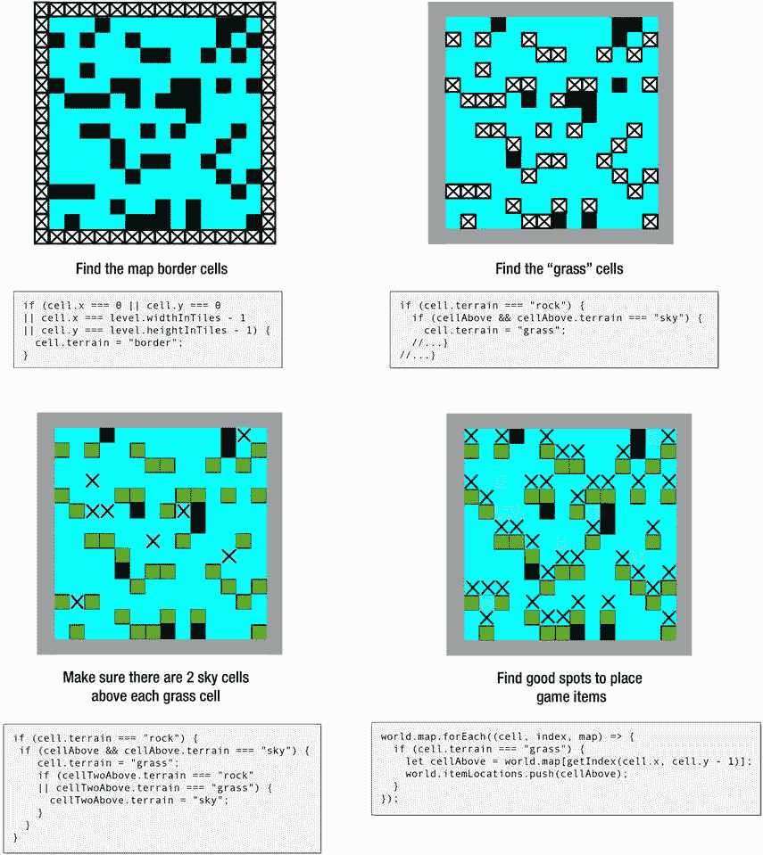

图 7-18 。添加要素以改善地图

为此，我们需要遍历`map`数组并分析每个单元格。我们需要知道它是什么类型的细胞(“岩石”或“草地”)，它在网格上的 x/y 位置，以及它周围是什么类型的细胞。`map`是一个 1D 阵列，但是单元格代表一个 2D 网格。我们如何将单元格的`x`和`y`位置转换成正确的数组索引号？我们可以使用这个简单的助手函数，叫做`getIndex`:

```js
let getIndex = (x, y) => x + (y * level.widthInTiles);
```

要使用它，在地图数组的方括号内调用`getIndex`。使用当前单元格的`x`和`y`值来定位要查找的单元格。下面是如何使用它来查找直接位于当前单元格左侧的单元格的数组索引:

```js
cellTotheLeft = map[getIndex(cell.x - 1, cell.y)]
```

下面是如何找到当前单元格上方两个网格单元格的索引号:

```js
cellTwoAbove = map[getIndex(cell.x, cell.y - 2)]
```

我们现在有一个简单的方法来导航 1D 阵列内的 2D 网格。

 **注意**如果`getIndex`试图引用数组中小于 0 或大于数组长度的元素，它将返回`undefined`。如果您的代码有可能产生未定义的值，比如引用了地图边界之外的单元格，请确保为此添加额外的条件检查。

有了这个技巧，我们可以遍历地图数组中的所有单元，分析它们和它们的相邻单元，并使用这些信息来改进地图。下面是完成这一切的`terraformMap`函数。阅读注释以了解代码如何工作，并将代码与图 7-18 进行比较以了解它如何改变地图。

```js
function terraformMap() {

  //A `getIndex` helper function to convert the cell x and y position to an
  //array index number
  let getIndex = (x, y) => x + (y * level.widthInTiles);

  world.map.forEach((cell, index, map) => {

    //Some variables to help find the cells to the left, right, below
    //and above the current cell
    let cellToTheLeft = world.map[getIndex(cell.x - 1, cell.y)],
        cellToTheRight = world.map[getIndex(cell.x + 1, cell.y)],
        cellBelow = world.map[getIndex(cell.x, cell.y + 1)],
        cellAbove = world.map[getIndex(cell.x, cell.y - 1)],
        cellTwoAbove = world.map[getIndex(cell.x, cell.y - 2)];

    //If the cell is on the border of the map, change its terrain to "border"
    if (cell.x === 0 || cell.y === 0
    || cell.x === level.widthInTiles - 1
    || cell.y === level.heightInTiles - 1) {
      cell.terrain = "border";
    }

    //If the cell isn't on the border, find out if we can
    //grow some grass on it. Any rock with a sky cell above
    //it should be made into grass. Here's how to figure this out:
    else {

      //1\. Is the cell a rock?
      if (cell.terrain === "rock") {

        //2\. Is there sky directly above it?
        if (cellAbove && cellAbove.terrain === "sky") {

          //3\. Yes there is, so change its name to "grass"
          cell.terrain = "grass";

          //4\. Make sure there are 2 sky cells above grass cells
          //so that it's easy to jump to higher platforms
          //without bumping your head. Change any rock cells that are
          //2 above the current grass cell to "sky"
          if (cellTwoAbove) {
            if (cellTwoAbove.terrain === "rock"
            || cellTwoAbove.terrain === "grass") {
              cellTwoAbove.terrain = "sky";
            }
          }
        }
      }
    }
  });

  //We now have the finished map.
  //Next, we're going to loop through the map one more time
  //to find all the item location cells and push them into the
  //`itemLocations` array. `itemLocations` is a list of cells that
  //we'll use later to place the player and treasure on the map

  world.map.forEach((cell, index, map) => {
    //Is the cell a grass cell?
    if (cell.terrain === "grass") {

      //Yes, so find the cell directly above it and push it
      //into the `itemLocations` array
      let cellAbove = world.map[getIndex(cell.x, cell.y - 1)];
      world.itemLocations.push(cellAbove);
    }
  });
}
```

我们的平台游戏环境现在已经完成，我们有一个名为`itemLocations`的数组，可以用来放置玩家和宝藏。

 **注意**显然你可以对这张地图做更多的微调，比如确保没有封闭的空间，确保所有的平台都可以到达，找到陷阱和敌人的好地方。继续应用这些相同的原则来为你自己的游戏定制地图。这就像你认为的那样简单。要了解更多关于程序生成的游戏地图，使用**细胞自动机**对游戏关卡设计做一些研究。

添加游戏物品

将玩家和宝箱添加到游戏中只是从我们在上一步中填充的`itemLocations`数组中随机选择单元格。然后单元格的`item`属性被设置为我们希望它包含的任何项目。`level`对象的`addItems`方法为我们做到了这一点。

```js
function addItems() {

  //The `findStartLocation` helper function returns a random cell
  let findStartLocation = () => {

    //Randomly choose a start location from the `itemLocations` array
    let randomIndex = randomInt(0, world.itemLocations.length - 1);
    let location = world.itemLocations[randomIndex];

    //Splice the cell from the array so we don't choose the
    //same cell for another item
    world.itemLocations.splice(randomIndex, 1);
    return location;
  };

  //1\. Add the player
  //Find a random cell from the `itemLocations` array
  let cell = findStartLocation();
  cell.item = "player";

  //2\. Add 3 treasure boxes
  for (let i = 0; i < 3; i++) {
    cell = findStartLocation();
    cell.item = "treasure";
  }
}
```

地图现在完成了。最后一步是使用单元格信息来创建我们可以在画布上显示的精灵。

制造精灵

一个名为`makeSprites` 的函数使用地图数据来创建你在画布上看到的实际精灵。`makeSprites`函数首先遍历`map`数组，并使用单元格的属性创建边界、岩石、天空和草地单元格。单元格的 *x* 和 *y* 属性只需乘以关卡的`cellWidth`和`cellHeight`就可以在画布上的正确位置绘制精灵。边界、岩石和草地单元也被推入到`platforms`数组中，这样它们就可以用在我们前面看到的平台碰撞代码中。

在这些地形单元制作完成后，代码第二次循环通过`map`数组来添加玩家和宝藏物品。游戏道具精灵是以地形精灵的一半大小创建的，并位于它们的正上方。

项目精灵将被添加到`sprites`数组的末尾，这意味着当`render`函数显示它们时，它们将是最后渲染的精灵。这将使它们在地形精灵的前面重叠。

下面是完成这一切的完整的`makeSprites`函数:

```js
function makeSprites() {

  //Make the terrain
  world.map.forEach(cell => {
    let mapSprite = rectangle();
    mapSprite.x = cell.x * level.tilewidth;
    mapSprite.y = cell.y * level.tileheight;
    mapSprite.width = level.tilewidth;
    mapSprite.height = level.tileheight;

    switch (cell.terrain) {
      case "rock":
        mapSprite.fillStyle = "black";
        world.platforms.push(mapSprite);
        break;

      case "grass":
        mapSprite.fillStyle = "green";
        world.platforms.push(mapSprite);
        break;

      case "sky":
        mapSprite.fillStyle = "cyan";
        break;

      case "border":
        mapSprite.fillStyle = "blue";
        world.platforms.push(mapSprite);
        break;
    }
  });

  //Make the game items. (Do this after the terrain so
  //that the item sprites display above the terrain sprites)
  world.map.forEach(cell => {

    //Each game object will be half the size of the cell.
    //They should be centered and positioned so that they align
    //with the bottom of the cell
    if(cell.item !== "") {
      let mapSprite = rectangle();
      mapSprite.x = cell.x * level.tilewidth + level.tilewidth / 4;
      mapSprite.y = cell.y * level.tileheight + level.tilewidth / 2;
      mapSprite.width = level.tilewidth / 2;
      mapSprite.height = level.tileheight / 2;

      switch (cell.item) {
        case "player":
          mapSprite.fillStyle = "red";
          mapSprite.accelerationX = 0;
          mapSprite.accelerationY = 0;
          mapSprite.frictionX = 1;
          mapSprite.frictionY = 1;
          mapSprite.gravity = 0.3;
          mapSprite.jumpForce = -6.8;
          mapSprite.vx = 0;
          mapSprite.vy = 0;
          mapSprite.isOnGround = true;
          world.player = mapSprite;
          break;

        case "treasure":
          mapSprite.fillStyle = "gold";

          //Push the treasure into the treasures array
          world.treasure.push(mapSprite);
          break;
      }
    }
  });
}
```

这个方法运行后，`world`对象返回到主程序，游戏开始。

使用图像精灵

我们的平台游戏无非就是大量的数据。代码完全不知道精灵实际上是什么样子。这意味着您可以使用来自`map`数组的完全相同的数据，而不是制作简单的形状，从 tileset 创建图像精灵。您可以通过启用`platforms.html`示例文件中的`makeImageSprites`方法来查看这个例子。游戏以完全相同的方式运行和玩，但是精灵现在是真实的插图，而不是彩色的方块，如图图 7-19 所示。

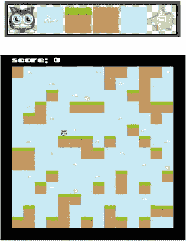

图 7-19 。使用 tileset 完全自定义游戏的外观

根本不需要改变底层代码，只需使用不同的 tileset 就可以完全改变游戏的外观。看一下下面的`makeImageSprites`函数的细节，你会发现它是基于我们用纹理贴图集创建图像精灵的所有相同技术，你在这一章已经看过很多例子了。

```js
function makeImageSprites() {

  //Make the terrain

  world.map.forEach((cell, index, map) => {
    let mapSprite,
        x = cell.x * level.tilewidth,
        y = cell.y * level.tileheight;

    switch (cell.terrain) {
      case "rock":
        mapSprite = sprite(assets["rock.png"]);
        mapSprite.setPosition(x, y);
        world.platforms.push(mapSprite);
        break;

      case "grass":
        mapSprite = sprite(assets["grass.png"]);
        mapSprite.setPosition(x, y);
        world.platforms.push(mapSprite);
        break;

      case "sky":

        //Add clouds every 6 cells and only on the top
        //80% of the level
        let sourceY = 0;
        if (index % 6 === 0 && index < map.length * 0.8) {
          mapSprite = sprite(assets["cloud.png"]);
        } else {
          mapSprite = sprite(assets["sky.png"]);
        }
        mapSprite.setPosition(x, y);
        break;

      case "border":
        mapSprite = rectangle(level.tilewidth, level.tileheight, "black");
        mapSprite.setPosition(x, y);
        world.platforms.push(mapSprite);
        break;
    }
  });

  //Make the game items

  world.map.forEach(cell => {
    if (cell.item !== "") {
      let mapSprite,
          x = cell.x * level.tilewidth + level.tilewidth / 4,
          y = cell.y * level.tileheight + level.tilewidth / 2,
          width = level.tilewidth / 2,
          height = level.tileheight / 2;

      switch (cell.item) {
        case "player":
          mapSprite = sprite(assets["cat.png"]);
          mapSprite.width = width;
          mapSprite.height = height;
          mapSprite.setPosition(x, y);
          mapSprite.accelerationX = 0;
          mapSprite.accelerationY = 0;
          mapSprite.frictionX = 1;
          mapSprite.frictionY = 1;
          mapSprite.gravity = 0.3;
          mapSprite.jumpForce = -6.8;
          mapSprite.vx = 0;
          mapSprite.vy = 0;
          mapSprite.isOnGround = true;
          world.player = mapSprite;
          break;

        case "treasure":
          mapSprite = sprite(assets["star.png"]);
          mapSprite.width = width;
          mapSprite.height = height;
          mapSprite.setPosition(x, y);

          //Push the treasure into the `treasures` array
          world.treasure.push(mapSprite);
          break;
      }
    }
  });
}
```

请注意这段代码是如何为每六个天空图块放置一张云的图像的，以及它是如何限制将云放置在地图的顶部 80%的:

```js
if (index % 6 === 0 && index < map.length * 0.8) { //...
```

使用这种技术作为起点，给你自己的游戏环境增加一些变化。

 **提示**你的游戏好玩吗？确定无疑的方法是使用简单的基本形状和颜色来构建你的游戏原型。事实上，在这个平台游戏示例中，我使用了与 1982 年的 Commodore 64 相同的字体和调色板，这是我学习制作游戏的第一台计算机之一。如果你的游戏用一堆方块和圆圈玩起来不好玩，那么世界上最好的图形也救不了它。

圆形与矩形

你在游戏中需要的最后一个重要的碰撞检查是找出一个圆形是否撞上了一个矩形。你可以使用一个名为`hitTestCircleRectangle` 的函数来帮你做到这一点。第一个参数是圆形 sprite，第二个参数是矩形 sprite:

```js
  let collision = hitTestCircleRectangle(ball, box);
```

如果它们在接触，返回值(`collision`)会告诉你圆碰到矩形的位置。它可以有值`"topLeft"`、`"topMiddle"`、`"topRight"`、`"leftMiddle"`、`"rightMiddle"`、`"bottomLeft"`、`"bottomMiddle"`或`"bottomRight"`。如果没有碰撞，它将是`undefined`。运行`circleVsRectangle.html`文件以获得一个交互式示例。拖动图形使它们接触，文本会告诉你碰撞发生在哪里。图 7-20 显示了您将看到的内容。

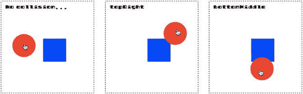

图 7-20 。检查圆和矩形之间的碰撞

下面是来自示例文件的游戏循环的代码，它检查冲突并显示结果:

```js
let collision = hitTestCircleRectangle(ball, box);
if (collision) {
  message.content = collision;
} else {
  message.content = "No collision..."
}
```

您可以使用一个名为`circleRectangleCollision` 的配套功能让一个圆从一个正方形的边或角上反弹回来:

```js
circleRectangleCollision(ball, box, true);
```

(将可选的第三个参数设置为`true`会使精灵弹开，将第四个参数设置为`true`会告诉函数使用精灵的全局坐标。)

运行本章源代码中的`bricks.html`文件，查看一个工作示例。这和本章前面的“钉子”例子是一样的，除了圆形的钉子被换成了长方形的砖块。(图 7-21 )。球从画布顶部落下，在落在地面上之前在砖块网格周围反弹。

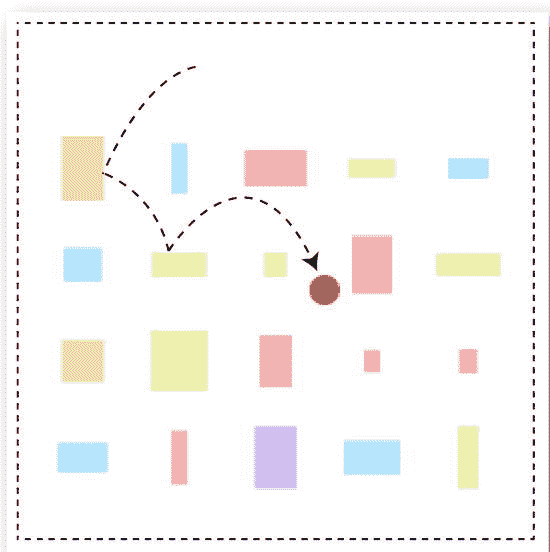

图 7-21 。一个球在砖块网格中弹跳

下面是游戏循环中实现这一点的代码:

```js
bricks.children.forEach(brick => {
  circleRectangleCollision(ball, brick, true, true);
});
```

这就是你开始制作一些真正迷人的游戏所需要知道的一切！

万能命中功能

为了让您的生活更加轻松，`library/collision`文件包含了一个名为`hit`的通用碰撞函数。它会自动检测碰撞中使用的精灵种类，并为您选择合适的碰撞功能。这意味着你不需要记住本章中的碰撞函数，你只需要记住一个:`hit`。

最简单的形式是，你可以像这样使用`hit`:

```js
hit(spriteOne, spriteTwo)
```

精灵可以是圆形或矩形。如果您希望它们对碰撞做出反应，以便它们不相交，请将第三个参数设置为`true`。如果想让它们分开，将第四个参数设置为`true`。将第五个参数设置为`true`会使函数使用精灵的全局坐标。

```js
hit(spriteOne, spriteTwo, react, bounce, global)
```

如果要检查点对象与精灵的碰撞，请使用点作为第一个参数，如下所示:

```js
hit({x: 145, y:65}, sprite)
```

`hit`函数还可以让你检查一个精灵和一个精灵数组之间的冲突。只需将数组作为第二个参数:

```js
hit(ball, bricks.children, true, true, true);
```

你会看到`hit`自动循环数组中的所有精灵，并根据第一个精灵检查它们。这意味着你不必编写自己的`for`或`forEach`循环。

`hit`函数还返回一个`collision`对象，其返回值与您正在检查的精灵类型相匹配。例如，如果两个精灵都是矩形，您可以找到发生碰撞的一边，如下所示:

```js
let collision = hit(rectangleOne, rectangleTwo, true);
message.text = `collision side: ${collision}`;
```

如果没有碰撞，`collision`将一直是`undefined`。

最后一个特性是，您可以使用可选的回调函数作为第五个参数。这允许您注入一些额外的代码，这些代码应该在冲突发生时运行。这对于检查单个精灵和精灵数组之间的冲突特别有用。如果有碰撞，回调将运行，您可以访问碰撞返回值和碰撞中涉及的 sprite。下面是我们在本章前面看到的平台游戏例子中如何使用这个特性，在玩家和平台之间进行碰撞检查:

```js
let playerVsPlatforms = hit(
  player, world.platforms, true, false, false,
  (collision, platform) => {
    //`collision` tells you the side on player that the collision occurred on.
    //`platform` is the sprite from the `world.platforms` array
    //that the player is colliding with
  }
);
```

这是一种进行复杂碰撞检查的简洁方法，它提供了大量的信息和底层控制，但使您不必手动遍历数组中的所有精灵。

如果你想知道`hit`函数是如何工作的，请翻到附录，那里有详细的解释。本质上，它只是分析参数中提供的精灵种类，并将它们发送到正确的碰撞函数。

摘要

恭喜你，你刚刚从碰撞检测训练营毕业！本章涵盖了 2D 动作游戏中你需要知道的所有最重要的碰撞功能:矩形碰撞、圆形碰撞和点碰撞。事实上，你现在已经掌握了使用 HTML5 和 JavaScript 来重现视频游戏历史上大多数经典游戏的所有技能，而且现在很少有 2D 游戏不是你力所能及的。使用本章中的工作原型作为你自己游戏的起点，再加上一点想象力，你会惊讶于你能做什么。

但是您的工具包中缺少一个重要的工具:关键帧动画。在下一章中，你将学习一些先进的动画技术来帮助你制作富有表现力的动画游戏角色和特效。但是在你翻开新的一页之前，为什么不用你在这一章中学到的所有新技能制作一个游戏呢？你做完后我会在第八章见你！