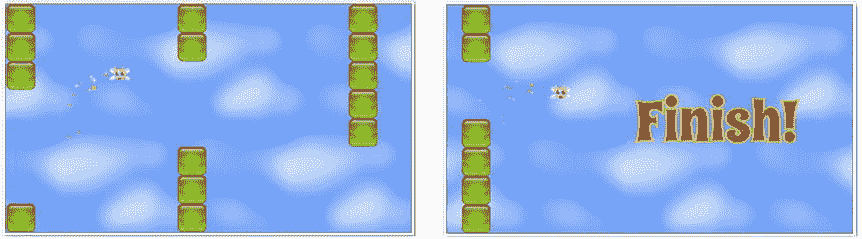

# 八、丰富多汁

有了目前为止我们在书中建立的所有工具，你实际上可以开始制作真正的游戏了。但是到目前为止缺少的是游戏开发者所说的**果汁**:让游戏世界感觉有活力的浮华效果和动画。这一章是关于给你的游戏增加活力的三种重要方法:

*   **关键帧动画**:让你的游戏角色播放一系列预先渲染的动画帧，就像电影胶片一样。
*   粒子效果:使用大量的微小粒子创造爆炸或水流效果。
*   平铺精灵:这是一种快速简单的方法来添加无限滚动背景，尤其是创建视差深度效果。

通过仔细使用这些效果，你甚至可以将一个非常简单的游戏变成一个引人入胜的虚拟世界，让你的玩家无法抗拒。

关键帧动画

在第二章中，你学会了如何通过交互改变小精灵的 *x* 和 *y* 位置来移动它们。这是一种叫做**脚本动画**的动画技术:使用数学公式让事物移动。在这一章你将学习另一种动画技术，叫做**关键帧动画** 。关键帧动画显示一系列预渲染图像，使精灵看起来像是在执行某个操作。这些可以是改变精灵外观的任何动作，比如改变它的颜色，把它打碎，或者移动它的脚让它行走。关键帧动画是关于当精灵的状态改变时改变它的样子。如果您将脚本动画(更改精灵的位置)与关键帧动画(更改精灵的外观)相结合，您可以开始开发丰富而复杂的精灵交互性。

在本章的第一部分，我们将详细了解如何在精灵上播放和控制一组动画序列。但在此之前，让我们先来看看这个过程的第一步:如何改变一个精灵的状态。

改变状态

图 8-1 显示了一个名为`states.png` 的 tileset。它包含一个 elf 字符，显示为四种状态:上、左、下和右。每个状态由一个图像帧表示。


图 8-1 。具有四种字符状态的 tileset

想象一下，你正在创建一个游戏，这个精灵角色应该根据你按下的箭头键改变它面对的方向。你怎么能这么做？

第一步是创建一个帧数组:图像中的四个帧各一个。你可以用你在《??》第四章中学到的`frames`方法来做这件事。

```js
let elfFrames = frames(
  assets["img/states.png"],          //The tileset image to use
  [[0,0], [0,64], [0,128], [0, 192]],   //Array of x/y positions of each frame
  64, 64                                //The width and height of each frame
);
```

`elfFrames`现在是一个数组，包含四个帧，匹配 elf 的每个图像状态。(你会在本书的源文件中的`library/display`中找到`frames`方法。)

现在使用`elfFrames`数组制作一个精灵:

```js
elf = sprite(elfFrames);
```

接下来，定义四个状态属性 : `up`、`left`、`down`和`right`。它们被包裹在一个叫做`states`的物体里。给每一个赋予一个与它在数组中的帧的索引号相对应的值。

```js
elf.states = {
  up: 0,
  left: 1,
  down: 2,
  right: 3
};
```

然后只需使用`gotoAndStop`来显示您想要显示的状态:

```js
elf.gotoAndStop(elf.states.right);
```

那太容易了吗？嘿，享受简单吧！

这些只是静态的图像状态，但是在大多数游戏中你会想要做一些比这更复杂的事情。用一系列动画序列加载精灵，然后根据精灵在游戏中的表现有选择地播放这些序列，这不是很好吗？如果精灵在行走，播放它的行走动画；如果它在跳跃，播放它的跳跃动画。这是你希望大多数游戏精灵都具备的一个基本特性。让我们构建自己的动画状态播放器来实现这一点。

创建状态播放器

我们将分两个阶段构建我们的状态播放器。在第一阶段，我们将只使用它来显示一个静态图像状态，就像我们在上一节中所做的那样。这只是给你一个它是如何工作的基本概念。在下一节中，我们将修改它，使我们的精灵可以播放连续的帧序列。

在我们创建状态播放器之前，让我们先来看看当我们完成后你将如何使用它。如果你想显示 elf 的`left`状态，你可以使用一种叫做`show`的新方法:

```js
elf.show(elf.states.left);
```

`show`方法只是根据我们在状态中定义的值调用 sprite 上的`gotoAndStop`。我们如何设置它？

我们将借助一个名为`addStatePlayer`的函数向 sprite 添加`show`方法。它的工作是创建`show`方法并将其添加到精灵中。它是这样做的:

```js
function addStatePlayer(sprite) {

  //The `show` function (to display static states)
  function show(frameNumber) {

    //Find the new state on the sprite
    sprite.gotoAndStop(frameNumber);
  }

  //Add the `show` method to the sprite
  sprite.show = show;
}
```

您可以看到该函数将 sprite 作为参数，创建了`show`方法，然后在最后一行中，将`show`方法添加到 sprite 中。

现在，您可以使用以下语句将状态播放器应用到 sprite:

```js
addStatePlayer(elf);
```

`elf`对象现在有了自己的新方法，名为`show`:

```js
elf.show(anyFrameNumber)
```

`show`方法只是`gotoAndStop`的包装器。这本身不是很有用，但是在本章的后面，我们将使用这个基本的`addStatePlayer`函数作为构建更复杂的东西的垫脚石。在此之前，让我们来看看如何在游戏中改变精灵的静态图像状态。

运行本章源文件中的`statePlayer.html`文件，获得一个工作示例。使用箭头键在画布上移动小精灵，如图 8-2 中的所示。


图 8-2 。使用箭头键使精灵移动和改变方向

下面是使这种状态改变策略起作用的代码:

```js
function setup() {

  //...Create the sprite...

  //Create the keyboard objects
  let leftArrow = keyboard(37),
      upArrow = keyboard(38),
      rightArrow = keyboard(39),
      downArrow = keyboard(40);

  //Assign key `press` methods
  leftArrow.press = () => {

    //Display the elf's new state and set its velocity
    elf.show(elf.states.left);
    elf.vx = -1;
    elf.vy = 0;
  };

  upArrow.press = () => {
    elf.show(elf.states.up);
    elf.vy = -1;
    elf.vx = 0;
  };

  rightArrow.press = () => {
    elf.show(elf.states.right);
    elf.vx = 1;
    elf.vy = 0;
  };

  downArrow.press = () => {
    elf.show(elf.states.down);
    elf.vy = 1;
    elf.vx = 0;
  };

  //Start the game loop
  gameLoop();
}

function gameLoop() {
  requestAnimationFrame(gameLoop);

  //Move the elf
  elf.x += elf.vx;
  elf.y += elf.vy;

  //Render the canvas
  render(canvas);
}
```

能够以这种方式设置精灵状态真的很容易做到，并且在游戏中有广泛的应用。对于许多不需要复杂动画的游戏，像这样的简单状态机可能就是你所需要的。只是`gotoAndStop`！

但是，如果你想通过移动精灵的胳膊和腿来让它看起来像是在走路，那该怎么办呢？

播放帧

您可以按顺序播放一系列图像帧来创建动画动作，而不是只显示给定状态的一个图像。图 8-3 显示了我们的 elf 角色行走的九帧序列。


图 8-3 。动画序列

拥有可以用来控制动画的名为`play`和`stop`的方法不是很好吗？我们来看看如何为游戏搭建这样一个角色动画播放器。

在第六章中，你学习了如何设置每秒帧数和计算帧速率，如下所示:

```js
fps = 12
frameRate = 1000 / this.fps
```

如果`fps`是 12，那么`frameRate`大约是 83 毫秒。

对于我们的角色动画播放器，我们将使用 JavaScript 的`setInterval` 定时器来控制连续帧显示的速度。使用`setInterval`的好处是让你使用一个独立于游戏帧速率的帧速率来制作角色动画。这也意味着你可以在同一个游戏中对不同种类的动画使用不同的帧率。您可以使用`setInterval`以设定的间隔推进动画帧。在这个例子中，我们将使用`setInterval`每 83 毫秒运行一次名为`advanceFrame` 的函数。以下是如何:

```js
let timerInterval = setInterval(advanceFrame, frameRate);
```

`advanceFrame`的作用是显示动画序列中的下一帧:

```js
function advanceFrame() {
  sprite.gotoAndStop(sprite.currentFrame + 1);
}
```

这将每隔 83 毫秒显示 sprite 的`frames`数组中的下一幅图像。这就是事情的全部。

这些是关键帧动画的绝对基础。但是在实践中，你需要添加更多的功能来为游戏制作一个完全健壮和灵活的系统。

添加功能

要构建功能全面的动画帧播放器，您需要解决以下问题:

*   如何让动画在到达最后一帧时停止？或者说，你怎么能让它循环回到起点？
*   如何播放和循环特定范围的帧？例如，如果您的角色的完整动画是 36 帧，但您只想在 10 帧和 17 帧之间循环，如何才能做到这一点？
*   如果你想停止和重新开始一个动画，你必须清除当前的时间间隔，并重新设置动画开始。怎么做？

你的精灵也需要属性来帮助你控制他们的动画。在第四章中，我们给每个精灵的父类添加了一些属性来帮助我们完成这些任务:

```js
this.frames = [];
this.loop = true;
this._currentFrame = 0;
get currentFrame() {
  return this._currentFrame;
}
```

当时我告诉你，“现在不要担心这些财产；你以后会发现如何使用它们。”你一直很有耐心的等待，但是“以后”变成了“现在”！因此，让我们找出如何使所有这些工作。

循环播放动画

要制作动画循环，首先需要知道它有多少帧，以及当前正在播放哪一帧。使用一些变量来帮助您跟踪这一点。这些新变量将帮助您开始:

```js
startFrame, endFrame, numberOfFrames, frameCounter
```

如果你要在一个帧范围内循环，你需要知道那些帧号是什么。例如，如果您想遍历 1 和 8 之间的所有帧，您可以使用这些`startFrame`和`endFrame`值:

```js
startFrame = 1;
endFrame = 8;
```

然后使用这些值计算总帧数:

```js
numberOfFrames = endFrame - startFrame;
```

`numberOfFrames`的值将是 7。因为我们从 0 开始编号帧，所以 7 号帧实际上将是序列中的第八帧。

图 8-4 显示了帧序列如何工作的例子。我们精灵动画的九帧从 0 到 8 编号。第一帧，0，只是显示了小精灵静止不动时的样子。第 1 帧到第 8 帧显示了小精灵行走时的样子。如果我们想让小精灵看起来像是在行走，我们必须排除第 0 帧，并且在连续的循环中只播放第 1 帧到第 8 帧。


图 8-4 。帧的子序列

很快您就会看到，我们将使用这些`startFrame`和`endFrame`值来播放这个循环的子帧序列。

我们还需要计算动画播放时已经过去的帧数；所以一个`frameCounter`变量可以帮助跟踪这个:

```js
frameCounter = 0;
```

我们是否希望动画循环播放？我们可以使用已经内置到 sprites 中的布尔属性`loop`来确定这一点(它的默认值是`true`)。

这是我们新的`advanceFrame`函数，它实现了循环特性。如果`loop`是`true`，将从`startFrame`重新开始动画。如果`loop`是`false`，它会停在最后一帧。

```js
function advanceFrame() {

  //Advance the frame if `frameCounter` is less than the total frames
  if (frameCounter < numberOfFrames) {

    //Advance the frame
    sprite.gotoAndStop(sprite.currentFrame + 1);

    //Update the frame counter
    frameCounter += 1;

  //If we've reached the last frame and `loop`
  //is `true`, then start from the first frame again
  } else {
    if (sprite.loop) {
      sprite.gotoAndStop(startFrame);
      frameCounter = 1;
    }
  }
}
```

现在我们有了一个简单的动画循环系统。

重置动画

在一个真正的游戏开发项目中，你不会只是运行一次动画，然后就忘记它；更有可能的是，您需要多次启动、停止和重启它。你可能还会有许多其他的动画可以同时播放。因此，能够跟踪动画当前是否正在播放是一个好主意，这样您就可以微调它的开始和停止条件。在的第四章中，我们在`DisplayObject`类中创建了一个名为`playing`的属性来帮助管理它。

```js
this.playing = false;
```

现在，在您开始一个新的动画之前，您可以检查这个变量以确保动画还没有开始播放。如果不是，启动它，然后将`playing`设置为`true`:

```js
if(!sprite.playing) {
  timerInterval = setInterval(advanceFrame, frameRate);
  sprite.playing = true;
}
```

如果您已经播放了一次动画，然后需要重新启动它，您必须将其重置回初始状态。您还需要清除`timerInterval`以便创建一个新的定时器。这里有一个`reset`函数完成所有这些事情。

```js
function reset() {
  if (timerInterval !== undefined && sprite.playing === true) {
    sprite.playing = false;
    frameCounter = 0;
    startFrame = 0;
    endFrame = 0;
    numberOfFrames = 0;
    clearInterval(timerInterval);
  }
}
```

现在，您可以从头开始播放动画了。

这些都是你需要知道的为游戏建立一个健壮的精灵动画的重要概念。但是我们怎样才能把这一切付诸实践呢？

改进`addStatePlayer`功能

在本章的前面，我们构建了一个有趣的小函数，叫做`addStatePlayer`，当我们按下箭头键时，它可以改变精灵的图像状态。我们将通过给它一些新方法来改进它。

如果你想播放精灵的帧数组中的所有帧，使用`play`方法。

```js
elf.play();
```

如果精灵的`loop`属性为`true`，这些帧将从头到尾播放并循环播放。如果你想让动画停止，使用`stop`方法:

```js
elf.stop();
```

如果您只想播放特定范围的帧，请使用名为`playSequence`的方法。例如，如果您想播放第 10 帧到第 17 帧之间的所有帧，可以使用以下语句:

```js
elf.playSequence([10, 17]);
```

如果 sprite 的`loop`属性为`true`，该序列将循环。

您可以通过以下方式设定动画的每秒帧数:

```js
elf.fps = 12;
```

这是一个完整的新的`addStatePlayer`函数，带有解释每个部分如何工作的注释。(你会在`library/display`文件夹中找到工作代码。)本质上，所有这些新代码都与我们刚刚看到的基本动画代码相同。

```js
function addStatePlayer(sprite) {
  let frameCounter = 0,
      numberOfFrames = 0,
      startFrame = 0,
      endFrame = 0,
      timerInterval = undefined;

  //The `show` function (to display static states)
  function show(frameNumber) {

    //Reset any possible previous animations
    reset();

    //Find the new state on the sprite
    sprite.gotoAndStop(frameNumber);
  }

  //The `play` function plays all the sprite's frames
  function play() {
    playSequence([0, sprite.frames.length - 1]);
  }

  //The `stop` function stops the animation at the current frame
  function stop() {
    reset();
    sprite.gotoAndStop(sprite.currentFrame);
  }

  //The `playSequence` function, to play a sequence of frames
  function playSequence(sequenceArray) {

    //Reset any possible previous animations
    reset();

    //Figure out how many frames there are in the range
    startFrame = sequenceArray[0];
    endFrame = sequenceArray[1];
    numberOfFrames = endFrame - startFrame;

    //Compensate for two edge cases:

    //1\. If the `startFrame` happens to be `0`
    if (startFrame === 0) {
      numberOfFrames += 1;
      frameCounter += 1;
    }

    //2\. If only a two-frame sequence was provided
    if(numberOfFrames === 1){
      numberOfFrames = 2;
      frameCounter += 1;
    };

    //Calculate the frame rate. Set the default fps to 12
    if (!sprite.fps) sprite.fps = 12;
    let frameRate = 1000 / sprite.fps;

    //Set the sprite to the starting frame
    sprite.gotoAndStop(startFrame);

    //If the state isn't already `playing`, start it
    if(!sprite.playing) {
      timerInterval = setInterval(advanceFrame.bind(this), frameRate);
      sprite.playing = true;
    }
  }

  //`advanceFrame` is called by `setInterval` to display the next frame
  //in the sequence based on the `frameRate`. When the frame sequence
  //reaches the end, it will either stop or loop
  function advanceFrame() {

    //Advance the frame if `frameCounter` is less than
    //the state's total frames
    if (frameCounter < numberOfFrames) {

      //Advance the frame
      sprite.gotoAndStop(sprite.currentFrame + 1);

      //Update the frame counter
      frameCounter += 1;

    //If we've reached the last frame and `loop`
    //is `true`, then start from the first frame again
    } else {
      if (sprite.loop) {
        sprite.gotoAndStop(startFrame);
        frameCounter = 1;
      }
    }
  }

  function reset() {

    //Reset `sprite.playing` to `false`, set the `frameCounter` to 0,
    //and clear the `timerInterval`
    if (timerInterval !== undefined && sprite.playing === true) {
      sprite.playing = false;
      frameCounter = 0;
      startFrame = 0;
      endFrame = 0;
      numberOfFrames = 0;
      clearInterval(timerInterval);
    }
  }

  //Add the `show`, `play`, `stop`, and `playSequence` methods to the sprite
  sprite.show = show;
  sprite.play = play;
  sprite.stop = stop;
  sprite.playSequence = playSequence;
}
```

我们还应该做一件事。这些动画方法非常有用，如果将它们自动添加到任何有多个图像帧的 sprite 中，会很有帮助。为此，我们需要修改库/显示模块中的**子画面**函数，该函数创建并返回每个子画面。让它为任何在其`frames`数组中有多个元素的 sprite 调用这个新的`addStatePlayer`函数:

```js
export function sprite(source, x, y) {
  let sprite = new Sprite(source, x, y);
  if (sprite.frames.length > 0) addStatePlayer(sprite);
  stage.addChild(sprite);
  return sprite;
}
```

太好了，我们都准备好了！我们如何在一个实际的游戏项目中使用我们刚刚探索的所有技术？

打造行走精灵

运行`animation.html`文件,获得一个使用这些新技术制作行走精灵的交互式示例。使用箭头键让小精灵在森林景观中漫步。四个不同的行走周期动画匹配小精灵可以行走的四个方向。当释放按键时，精灵停止并面向它移动的方向。图 8-5 说明了你将会看到的东西。


图 8-5 。动画行走精灵

捕捉帧

elf 的动画基于包含所有帧的单一 tileset 图像，如图 8-6 所示。


图 8-6 。tileset 图像包含所有动画帧

在动画精灵之前，您需要一个包含所有这些帧的数组作为单独的图像。您知道您可以使用`frames`函数将一组帧位置值转换成一组图像。但是这个 tileset 中有 36 帧，跨越四行，所以您肯定不想手工输入这些位置值。让我们使用一个名为`filmstrip` 的新自定义函数，它为我们计算出每一帧的 *x* / *y* 位置，并返回所有动画帧:

```js
export function filmstrip(image, frameWidth, frameHeight, spacing = 0){

  //An array to store the x and y positions of each frame
  let positions = [];

  //Find out how many columns and rows there are in the image
  let columns = image.width / frameWidth,
      rows = image.height / frameHeight;

  //Find the total number of frames
  let numberOfFrames = columns * rows;

  for(let i = 0; i < numberOfFrames; i++) {

    //Find the correct row and column for each frame
    //and figure out its x and y position
    let x = (i % columns) * frameWidth,
        y = Math.floor(i / columns) * frameHeight;

    //Compensate for any optional spacing (padding) around the frames if
    //there is any. This bit of code accumulates the spacing offsets from the
    //left side of the tileset and adds them to the current tile's position
    if (spacing && spacing > 0) {
      x += spacing + (spacing * i % columns);
      y += spacing + (spacing * Math.floor(i / columns));
    }

    //Add the x and y value of each frame to the `positions` array
    positions.push([x, y]);
  }

  //Create and return the animation frames using the `frames` method
  return frames(image, positions, frameWidth, frameHeight);
};
```

(您将在`library/display`文件中找到`filmstrip`函数。)

你现在可以使用这个`filmstrip`函数来创建一个精灵的`frames`数组。提供要使用的图像、每个框架的宽度和高度以及框架之间的任何可选间距作为参数:

```js
let elfFrames = filmstrip(assets["img/walkcycle.png"], 64, 64);
```

然后使用`elfFrames`初始化精灵:

```js
elf = sprite(elfFrames);
```

精灵现在已经加载了 36 帧，可以开始制作动画了。

定义 Elf 的状态

精灵总共有八种状态:四种站立状态和四种行走状态。图 8-7 显示了具有这八种状态的 tileset。插图中的黑线定义了各州的边界。


图 8-7 。tileset 包含 sprite 的八种状态

`up`、`left`、`down`和`right`状态是静态的，这意味着它们不包含任何动画帧。我们将使用`show`方法显示它们，就像我们在本章开始时所做的那样。`walkUp`、`walkLeft`、`walkDown`和`walkRight`状态是动画，我们将使用`playSequence`来显示它们。`walkLeft`和`walkRight`动画的第一帧也恰好是左右静态，这就是为什么在图 8-7 中有虚线将它们分开。

这里是精灵的状态，设置这一切:

```js
elf.states = {
  up: 0,
  left: 9,
  down: 18,
  right: 27,
  walkUp: [1, 8],
  walkLeft: [10, 17],
  walkDown: [19, 26],
  walkRight: [28, 35]
};
```

接下来，设置 elf 的帧速率:

```js
elf.fps = 12;
```

现在，您只需要根据哪些键是向上或向下的来判断要显示哪个状态。经过一点试验，您可能会得出类似如下的一些代码:

```js
leftArrow.press = function() {

  //Play the elf's `walkLeft` animation sequence
  elf.playSequence(elf.states.walkLeft);
  elf.vx = -1;
  elf.vy = 0;
};

leftArrow.release = function() {
  if (!rightArrow.isDown && elf.vy === 0) {

    //Show the elf's `left` state
    elf.show(elf.states.left);
    elf.vx = 0;
  }
};
```

其他三个键`rightArrow`、`upArrow`和`downArrow`都遵循相同的格式。

这就是关键帧动画的全部知识吗？差不多吧，是的！我们创建的状态播放器可以在各种不同的游戏中使用，您可以根据需要对其进行定制。将这些技术与你在第六章中学到的脚本动画结合起来，你将可以用无穷无尽的丰富而复杂的精灵来填充你的游戏。

 **提示**你怎么能设计出像我们行走的精灵这样复杂的角色动画呢？你显然需要一些艺术能力和图形设计技能，但是有很多工具可以帮助你。这里有一些你可以尝试的软件:ShoeBox、Spine、Spriter、DragonBones、Animo Sprites、Piskel 和 Flash Professional(如果你使用的是 Flash Professional，将动画导出为 sprite 工作表)。

接下来，让我们来看看如何给你的游戏增加一点魔力。

粒子效果

你如何创造像火、烟、魔法和爆炸这样的效果？你制造了许多小精灵；几十个，几百个或者几千个。然后对这些精灵应用一些物理或重力约束，这样它们的行为就像你试图模拟的元素一样。你还需要给他们一些规则，关于他们应该如何出现和消失，以及他们应该形成什么样的模式。这些小精灵被称为**粒子**。你可以用它们来制作各种游戏特效。

只需几十行代码，你就可以编写一个通用的粒子效果引擎，这是大多数 2D 动作游戏所需要的。要查看运行中的粒子引擎，运行`particleEffect.html` 文件，如图图 8-8 所示。点击指针，一个小的星星爆炸在画布上爆发，从指针的位置放射出来。恒星被引力拉下，每一颗都有不同的速度、旋转、褪色和缩放率。


图 8-8 。粒子效果

这是由名为`particleEffect`的自定义函数创建的，您可以在`library/display`文件夹中找到它。下面是它的使用方法，包括例子中用来产生爆炸的所有参数。

```js
particleEffect(
  pointer.x,                               //The particle's starting x position
  pointer.y,                               //The particle's starting y position
  () => sprite(assets["img/star.png"]), //Particle function
  20,                                      //Number of particles
  0.1,                                     //Gravity
  true,                                    //Random spacing
  0, 6.28,                                 //Min/max angle
  12, 24,                                  //Min/max size
  1, 2,                                    //Min/max speed
  0.005, 0.01,                             //Min/max scale speed
  0.005, 0.01,                             //Min/max alpha speed
  0.05, 0.1                                //Min/max rotation speed
);
```

您可以看到，大多数参数描述了用于更改精灵速度、旋转、缩放或 alpha 的最小值和最大值之间的范围。您还可以指定应该创建的粒子数量，并添加可选的重力。

通过自定义第三个参数，你可以使用任何精灵来制作粒子。只需提供一个函数，返回你想为每个粒子使用的精灵类型:

```js
() => sprite(assets["img/star.png"]),
```

如果你提供一个有多个帧的精灵，`particleEffect`函数会自动为每个粒子选择一个随机帧。

当粒子从原点向外辐射时，最小和最大角度值对于定义粒子的圆形扩散非常重要。对于完全圆形的爆炸效果，使用最小角度 0，最大角度 6.28。

```js
0, 6.28
```

(这些值是弧度；等效度数为 0 度和 360 度。)0 从 3 点钟位置开始，直接指向右边。3.14 是 9 点的位置，6.28 带你绕回 0 再一次。

如果要将粒子范围限制在一个较窄的角度，只需提供描述该范围的最小值和最大值。这里有一些值，你可以用它们来限制披萨饼的角度，使饼皮指向左边。

```js
2.4, 3.6
```

你可以像这样使用一个受约束的角度范围来创建一个粒子流，就像那些用来创建喷泉或火箭发动机火焰的粒子流。(在本章末尾的示例游戏中，您将会看到具体的操作方法。)随机间距值(第六个参数)决定了粒子在此范围内是应该均匀(`false`)还是随机(`true`)分布。

通过仔细选择粒子的精灵并微调每个参数，您可以使用这个通用的`particl` `eEffect`函数来模拟从液体到火焰的一切。让我们来看看`particleEffect`功能到底是如何工作的，以及如何在游戏中使用它。

构建`particleEffect`函数

游戏中的所有粒子都需要在每一帧更新它们的属性。在你开始制作粒子之前，你需要创建一个单独的`particles`数组来存储它们。

```js
export let particles = [];
```

正如你将看到的，我们将通过在每一帧上循环这个数组来更新所有的粒子，这与我们在第六章中更新按钮使用的策略相同。

`particleEffect`函数获取你指定的所有参数，并使用它们来创建每个粒子。它为每个粒子计算出一个唯一的角度，并使用该角度值来指定粒子的速度以及所有其他属性。如果您提供的 sprite 函数返回一个具有多个图像帧的 sprite，则会为每个粒子选择一个新的随机帧。每个粒子也是用一个`update`方法创建的，这个方法描述了粒子的属性应该如何改变。这个`update`方法必须由游戏循环在每个粒子上调用，以使粒子移动、渐变、旋转和缩放。当该函数创建完每个粒子后，它将该粒子推入到`particles`数组中。

```js
export function particleEffect(
  x = 0,
  y = 0,
  spriteFunction = () => circle(10, "red"),
  numberOfParticles = 10,
  gravity = 0,
  randomSpacing = true,
  minAngle = 0, maxAngle = 6.28,
  minSize = 4, maxSize = 16,
  minSpeed = 0.1, maxSpeed = 1,
  minScaleSpeed = 0.01, maxScaleSpeed = 0.05,
  minAlphaSpeed = 0.02, maxAlphaSpeed = 0.02,
  minRotationSpeed = 0.01, maxRotationSpeed = 0.03
) {

  //`randomFloat` and `randomInt` helper functions
  let randomFloat = (min, max) => min + Math.random() * (max - min),
      randomInt = (min, max) => Math.floor(Math.random() * (max - min + 1)) + min;

  //An array to store the angles
  let angles = [];

  //A variable to store the current particle's angle
  let angle;

  //Figure out by how many radians each particle should be separated
  let spacing = (maxAngle - minAngle) / (numberOfParticles - 1);

  //Create an angle value for each particle and push that
  //value into the `angles` array
  for(let i = 0; i < numberOfParticles; i++) {

    //If `randomSpacing` is `true`, give the particle any angle
    //value between `minAngle` and `maxAngle`
    if (randomSpacing) {
      angle = randomFloat(minAngle, maxAngle);
      angles.push(angle);
    }

    //If `randomSpacing` is `false`, space each particle evenly,
    //starting with the `minAngle` and ending with the `maxAngle`
    else {
      if (angle === undefined) angle = minAngle;
      angles.push(angle);
      angle += spacing;
    }
  }

 //Make a particle for each angle
  angles.forEach(angle => makeParticle(angle));

  //Make the particle
  function makeParticle(angle) {

    //Create the particle using the supplied sprite function
    let particle = spriteFunction();

    //Display a random frame if the particle has more than 1 frame
    if (particle.frames.length > 0) {
      particle.gotoAndStop(randomInt(0, particle.frames.length - 1));
    }

    //Set the x and y position
    particle.x = x - particle.halfWidth;
    particle.y = y - particle.halfHeight;

    //Set a random width and height
    let size = randomInt(minSize, maxSize);
    particle.width = size;
    particle.height = size;

    //Set a random speed to change the scale, alpha and rotation
    particle.scaleSpeed = randomFloat(minScaleSpeed, maxScaleSpeed);
    particle.alphaSpeed = randomFloat(minAlphaSpeed, maxAlphaSpeed);
    particle.rotationSpeed = randomFloat(minRotationSpeed, maxRotationSpeed);

    //Set a random velocity at which the particle should move
    let speed = randomFloat(minSpeed, maxSpeed);
    particle.vx = speed * Math.cos(angle);
    particle.vy = speed * Math.sin(angle);

    //The particle's `update` method is called on each frame of the
    //game loop
    particle.update = () => {

      //Add gravity
      particle.vy += gravity;

      //Move the particle
      particle.x += particle.vx;
      particle.y += particle.vy;

      //Change the particle's `scale`
      if (particle.scaleX - particle.scaleSpeed > 0) {
        particle.scaleX -= particle.scaleSpeed;
      }
      if (particle.scaleY - particle.scaleSpeed > 0) {
        particle.scaleY -= particle.scaleSpeed;
      }

      //Change the particle's rotation
      particle.rotation += particle.rotationSpeed;

      //Change the particle's `alpha`
      particle.alpha -= particle.alphaSpeed;

      //Remove the particle if its `alpha` reaches zero
      if (particle.alpha <= 0) {
        remove(particle);
        particles.splice(particles.indexOf(particle), 1);
      }
    };

    //Push the particle into the `particles` array.
    //The `particles` array needs to be updated by the game loop each frame
    particles.push(particle);
  }
}
```

在`particleEffect`中需要注意的一个重要细节是，如果粒子的`alpha`值达到零，`update`方法会将粒子拼接到`particles`数组之外。它使用以下代码来实现这一点:

```js
if (particle.alpha <= 0) {
  remove(particle);
  particles.splice(particles.indexOf(particle), 1);
}
```

(你在第四章的中学习了如何使用`remove`函数从父精灵中移除任何精灵。)任何时候你写这样的代码，其中一个对象负责自己的删除，你必须非常小心！这无疑是方便的，但总是要停下来问:是否有其他的依赖项需要被通知这个对象已经被移除了？如果有，而您忘记了它们，您可能正在为一些令人紧张的调试会议做准备。

如果物体在一个循环的上下文中把自己从一个数组中拼接出来，这是特别正确的，这就是我们的粒子将要做的。为了安全地做到这一点，在不将循环索引计数器减 1 的情况下，您需要反向循环数组**中的所有元素**。接下来您将学习如何做到这一点。

在游戏中使用`particleEffect`功能

要使用这个`particleEffect`函数，首先将它和`particles`数组导入到您的游戏程序中:

```js
import {particles, particleEffect} from "../library/display";
```

然后遍历每一帧上的所有粒子，并为每个粒子调用`update`方法。您需要反向循环遍历粒子(从数组中的最后一个元素开始)，这样，如果其中一个元素被拼接出来，就不会影响循环索引计数器。通过将计数器变量(`i`)初始化为数组的`length`，然后在每次迭代中递减它，可以使`for`循环反向运行。代码如下:

```js
function gameLoop() {
  requestAnimationFrame(gameLoop);

  if (particles.length > 0) {

    //Loop through the particles in reverse
    for(let i = particles.length - 1; i >= 0; i--) {
      let particle = particles[i];
      particle.update();
    }
  }
  render(canvas);
}
```

当粒子的`alpha`达到零时，粒子的`update`方法现在可以安全地移除粒子。

要启动`particleEffect`，只要您想让效果发生，就用任何自定义参数调用它。在本例中，这发生在调用指针的`press`方法时:

```js
pointer.press = () => {
  particleEffect(
    //Assign the particle’s arguments...
  );
};
```

当然，你可以在游戏中的任何时候调用`particleEffect`。在本章的最后你会看到更多的例子。

`particleEffect`功能对于创造单次粒子爆发非常有用。但是，如果你想在一个连续的流中产生粒子，就像你想模拟从水龙头流出的水滴或火箭发动机的火焰一样，那该怎么办呢？为此，你需要一个粒子发射器的帮助。

添加粒子发射器

粒子发射器只是一个简单的计时器，它以固定的时间间隔创建粒子。这意味着发射器不是只调用一次`particleEffect`函数，而是定期调用它。在下一节中，我们将构建一个`emitter`函数，你可以用它在任何你需要的时间间隔创建一个恒定的粒子流。以下是您可以使用它的方式:

```js
let particleStream = emitter(
  100,                                 //The interval
  () => particleEffect(                //The `particleEffect` function
    //Assign particle parameters...
  )
);
```

`emitter`函数只是包装了我们在上一节中创建的`particleEffect`函数。它的第一个参数是一个以毫秒为单位的数字，它决定了粒子创建的频率。第二个参数是`particleEffect`函数，您可以随意定制。

发射器函数返回一个带有`play`和`stop`方法的对象，您可以使用它们来控制粒子流。你可以像我们在本章开始时创建的`play`和`stop`方法一样使用它们来控制精灵的动画。

```js
particleStream.play();
particleStream.stop();
```

发射器对象还有一个`playing`属性，根据发射器的当前状态，该属性可以是`true`或`false`。下面是创建发射器对象并向其添加方法和属性的完整函数。(你会在`library/display`文件夹中找到这个工作代码。)

```js
export function emitter(interval, particleFunction) {
  let emitter = {},
      timerInterval = undefined;

  emitter.playing = false;

  function play() {
    if (!emitter.playing) {
      particleFunction();
      timerInterval = setInterval(emitParticle.bind(this), interval);
      emitter.playing = true;
    }
  }

  function stop() {
    if (emitter.playing) {
      clearInterval(timerInterval);
      emitter.playing = false;
    }
  }

  function emitParticle() {
    particleFunction();
  }

  emitter.play = play;
  emitter.stop = stop;
  return emitter;
}
```

运行`particleEmitter.html`文件来查看这段代码的运行情况，如图 8-9 中的所示。按住鼠标左键以产生连续的粒子流。当你松开按钮时，水流将停止。


图 8-9 。粒子发射器产生连续的粒子流

下面是来自`setup`函数的代码，它创建了指针和粒子发射器。当指针被按下时，发射器的`play`方法被调用，当指针被释放时，发射器的`stop`方法被调用。

```js
pointer = makePointer(canvas);

let particleStream = emitter(
  100,                                         //The timer interval
  () => particleEffect(                        //The function
    pointer.x, pointer.y,                      //x and y position
    () => sprite(assets["img/star.png"]),   //Particle sprite
    10,                                        //Number of particles
    0.1,                                       //Gravity
    false,                                     //Random spacing
    3.14, 6.28,                                //Min/max angle
    16, 32,                                    //Min/max size
    2, 5                                       //Min/max speed
  )
);

pointer.press = () => {
  particleStream.play();
};

pointer.release = () => {
  particleStream.stop();
};
```

通过以这种方式一起使用`particleEffect`和`emitter`函数，您将能够创建游戏所需的大部分粒子爆炸和流效果。

平铺精灵

你将在本章学习的最后一个特效实际上是一种新的精灵:一种**平铺精灵**。它是一种特殊的矩形，具有重复的平铺背景图像图案。平铺子画面有两个新属性，`tileX`和`tileY`，可以控制平铺背景的位置。平铺背景无缝包裹，这样如果你在游戏循环中改变`tileX`和`tileY`的值，你就可以创建一个无限滚动的背景效果。

运行`tilingSprite.html` 文件来查看一个平铺精灵的例子，如图 8-10 中的所示。这是一个简单的矩形，将一个`tile.png` 图像设置为其重复背景。背景图案从左上向右下连续滚动。


图 8-10 。平铺子画面具有由单个平铺构成的连续重复的背景图案

平铺精灵是用一个叫做`tilingSprite`的新函数制作的。你可以把它想象成一个矩形精灵，一个图像被指定为它的填充:

```js
box = tilingSprite(128, 128, assets["img/tile.png"]);
```

拼贴图像可以是图像文件或纹理贴图集帧。因为平铺精灵本质上只是一个普通的矩形精灵，所以你可以像在游戏中使用其他矩形精灵一样使用它。一个重要的区别是它有`tileX`和`tileY`属性，可以让你重新定位重复背景图案的原点。通过改变游戏循环中`tileX`和`tileY`的值，可以创造出无限的滚动效果:

```js
box.tileY += 1;
box.tileX += 1;
```

平铺精灵是一个很好的例子，展示了如何在玩具箱中使用许多不同的技巧来创建一个复杂的复合精灵。那么它是如何工作的呢？

构建平铺精灵

平铺子画面本质上是一个矩形，它遮盖了由平铺图像构成的子画面网格。网格比填充矩形所需的最大拼贴数量大一行一列。这意味着在矩形的可视区域之外总是有一行和一列。如果背景图案向上、向下、向左或向右移动，隐藏行或列中的子画面将移动到网格的另一侧进行补偿。这产生了无缝滚动模式的错觉。但你真正做的是移动内部瓷砖精灵。图 8-11 显示了隐藏的行和列是如何被屏蔽和重新定位以匹配移位的图形的。


图 8-11 。当图案移动时，来自额外隐藏的行和列的精灵被重新定位，以创建无缝、无限滚动背景的幻觉

关于平铺精灵，要认识到的最重要的事情是，它只是一个矩形，掩盖了子精灵的网格。你可能记得在《??》第四章中，矩形精灵有一个可选的`mask`属性，默认为`false`。如果您将`mask`设置为 true，则在矩形的`render`方法中启用以下代码行:

```js
if (this.mask && this.mask === true) ctx.clip();
```

这将导致任何矩形的子精灵被矩形掩盖。(您可以用同样的方式在圆形精灵中启用遮罩。)

在`library/display`文件夹中，你会发现`tilingSprite`函数，它设置所有这些并返回被屏蔽的网格。这其实并不复杂，但确实有很多工作要做。为了帮助理解它在做什么，您可以将其所有工作分解为以下几个主要步骤:

1.  确定所提供的图块图像是来自图像文件还是纹理贴图集帧，然后捕获图像的宽度和高度值。
2.  计算出有多少瓷砖可以放入矩形的尺寸中。
3.  制作一个比精灵尺寸大一行一列的`grid`对象。
4.  创建一个矩形精灵，并添加网格作为其子元素。
5.  将矩形的`mask`属性设置为`true`。
6.  给矩形添加`tileX`和`tileY`属性。这些属性的设置器根据提供的偏移值按比例移动网格块的位置。
7.  将矩形精灵返回到主程序。

下面是完成所有这些的`tilingSprite`函数。注释详细解释了每一位代码是如何工作的。

```js
export function tilingSprite(width, height, source, x = 0, y = 0) {

  //Figure out the tile's width and height
  let tileWidth, tileHeight;

  //If the source is a texture atlas frame, use its
  //`frame.w` and `frame.h` properties
  if(source.frame) {
    tileWidth = source.frame.w;
    tileHeight = source.frame.h;
  }

  //If it's an image, use the image's
  //`width` and `height` properties
  else {
    tileWidth = source.width;
    tileHeight = source.height;
  }

  //Figure out the rows and columns.
  //The number of rows and columns should always be
  //one greater than the total number of tiles
  //that can fit into the rectangle. This give us one
  //additional row and column that we can reposition
  //to create the infinite scroll effect

  let columns, rows;

  //1\. Columns
  //If the width of the rectangle is greater than the width of the tile,
  //calculate the number of tile columns
  if (width >= tileWidth) {
    columns = Math.round(width / tileWidth) + 1;
  }

  //If the rectangle's width is less than the width of the
  //tile, set the columns to 2, which is the minimum
  else {
    columns = 2;
  }

  //2\. Rows
  //Calculate the tile rows in the same way
  if (height >= tileHeight) {
    rows = Math.round(height / tileHeight) + 1;
  } else {
    rows = 2;
  }

  //Create a grid of sprites that's just one sprite larger
  //than the `totalWidth` and `totalHeight`
  let tileGrid = grid(
   columns, rows, tileWidth, tileHeight, false, 0, 0,
   () => {

     //Make a sprite from the supplied `source`
     let tile = sprite(source);
     return tile;
   }
  );

  //Declare the grid's private properties that we'll use to
  //help scroll the tiling background
  tileGrid._tileX = 0;
  tileGrid._tileY = 0;

  //Create an empty rectangle sprite without a fill or stroke color.
  //Set it to the supplied `width` and `height`
  let container = rectangle(width, height, "none", "none");
  container.x = x;
  container.y = y;

  //Set the rectangle's `mask` property to `true`. This switches on `ctx.clip()`
  //In the rectangle sprite's `render` method
  container.mask = true;

  //Add the tile grid to the rectangle container
  container.addChild(tileGrid);

  //Define the `tileX` and `tileY` properties on the parent container
  //so that you can scroll the tiling background
  Object.defineProperties(container, {
    tileX: {
      get() {
        return tileGrid._tileX;
      },

      set(value) {

        //Loop through all of the grid's child sprites
        tileGrid.children.forEach(child => {

          //Figure out the difference between the new position
          //and the previous position
          let difference = value - tileGrid._tileX;

          //Offset the child sprite by the difference
          child.x += difference;

          //If the x position of the sprite exceeds the total width
          //of the visible columns, reposition it to just in front of the
          //left edge of the container. This creates the wrapping
          //effect
          if (child.x > (columns - 1) * tileWidth) {
            child.x = 0 - tileWidth + difference;
          }

          //Use the same procedure to wrap sprites that
          //exceed the left boundary
          if (child.x < 0 - tileWidth - difference) {
            child.x = (columns - 1) * tileWidth;
          }
        });

        //Set the private `_tileX` property to the new value
        tileGrid._tileX = value;
      },
      enumerable: true, configurable: true
    },
    tileY: {
      get() {
        return tileGrid._tileY;
      },

      //Follow the same format to wrap sprites on the y axis
      set(value) {
        tileGrid.children.forEach(child => {
          let difference = value - tileGrid._tileY;
          child.y += difference;
          if (child.y > (rows - 1) * tileHeight) child.y = 0 - tileHeight + difference;
          if (child.y < 0 - tileHeight - difference) child.y = (rows - 1) * tileHeight;
        });
        tileGrid._tileY = value;
      },
      enumerable: true, configurable: true
    }
  });

  //Return the rectangle container
  return container;
}
```

最常见的视频游戏需求之一是无限滚动的背景，而平铺精灵的设计就是为了让您轻松实现这一点。接下来让我们来看看如何在一个游戏中使用它。

案例研究:Flappy 仙女

关键帧动画、粒子效果和平铺精灵有助于为游戏增添全新的趣味性和沉浸感。随着你的游戏设计技能和自信的增长，你可能会发现你制作的大多数游戏会用到至少一种或者所有这些效果。在本章的最后一节，我们将详细了解一款名为 Flappy Fairy 的游戏原型——向视频游戏史上最臭名昭著的游戏之一致敬。它使用了所有三种效果，并将为您将它们集成到您自己的游戏中提供一个良好的起点。

运行`flappyFairy.html` 文件玩游戏。点击屏幕让仙女飞起来，帮助她通过 15 根柱子的缝隙到达终点，如图图 8-12 所示。当她在迷宫中飞行时，一串五彩缤纷的仙尘跟随着她。如果她撞上其中一个绿色方块，她就会在一阵灰尘中爆炸。但是，如果她设法通过所有 15 根柱子之间越来越窄的缝隙，她会到达一个巨大的浮动“完成”标志。



图 8-12 。帮助 Flappy 仙女飞行通过迷宫的柱子到达终点

创建滚动背景

Flappy Fairy 是一款使用**视差**效果的侧滚游戏。视差是一种浅 3D 效果，通过使背景以比前景更慢的速度滚动来创造深度的幻觉。这使得背景看起来更远。

为了制作天空背景，我从一些云的无缝 512 × 512 图像开始。是游戏纹理图谱中的一帧，如图图 8-13 所示。


图 8-13 。纹理图谱中的天空帧图像

在`setup`函数中，我使用`“sky.png”`帧创建了一个名为`sky`的平铺精灵。

```js
sky = tilingSprite(canvas.width, canvas.height, assets["sky.png"]);
```

然后，游戏循环将`tileX`位置每帧向左移动一点。

```js
sky.tileX -= 1;
```

这就是它的全部——无限滚动！

创建支柱

游戏中有十五根柱子。每隔五根柱子，顶部和底部之间的间隙就变得更窄。前五根柱子的间距为四块，后五根柱子的间距为三块，最后五根柱子的间距为两块。随着 Flappy Fairy 飞得更远，这使得游戏越来越难。对于每个柱子来说，缺口的确切位置是随机的，每次玩游戏时都不一样。每个柱子的间距为 384 像素，但是图 8-14 显示了如果它们紧挨着的话会是什么样子。


图 8-14 。每根柱子顶部和底部之间的间隙逐渐变窄

你可以看到差距是如何从左边的四个空格逐渐缩小到右边的两个。

组成柱子的所有积木都在一个叫做`blocks`的`group`里。

```js
blocks = group();
```

嵌套的`for`循环创建每个块，并将其添加到`blocks`容器中。外环运行 15 次；一次创建一个支柱。内循环运行八次；柱中的每个块一次。只有当块没有占据为间隙随机选择的范围时，才添加块。外环每运行五次，间隙的大小就缩小一。

```js
//What should the initial size of the gap be between the pillars?
let gapSize = 4;

//How many pillars?
let numberOfPillars = 15;

for (let i = 0; i < numberOfPillars; i++) {

  //Randomly place the gap somewhere inside the pillar
  let startGapNumber = randomInt(0, 8 - gapSize);

  //Reduce the `gapSize` by one after every fifth pillar. This is
  //what makes gaps gradually become narrower
  if (i > 0 && i % 5 === 0) gapSize -= 1;

  //Create a block if it's not within the range of numbers
  //occupied by the gap
  for (let j = 0; j < 8; j++) {
    if (j < startGapNumber || j > startGapNumber + gapSize - 1) {
      let block = sprite(assets["greenBlock.png"]);
      blocks.addChild(block);

      //Space each pillar 384 pixels apart. The first pillar will be
      //placed at an x position of 512
      block.x = (i * 384) + 512;
      block.y = j * 64;
    }
  }

  //After the pillars have been created, add the finish image
  //right at the end
  if (i === numberOfPillars - 1) {
    finish = sprite(assets["finish.png"]);
    blocks.addChild(finish);
    finish.x = (i * 384) + 896;
    finish.y = 192;
  }
}
```

代码的最后一部分给这个世界添加了一个大精灵，Flappy Fairy 将会看到她是否能够坚持到最后。

游戏循环每帧将一组方块向右移动 2 个像素，但仅在`finish`精灵不在屏幕上时:

```js
if (finish.gx > 256) {
  blocks.x -= 2;
}
```

当`finish` sprite 滚动到画布的中心时，`blocks`容器将停止移动。注意，代码使用了`finish`精灵的全局 *x* 位置(`gx`)来测试它是否在画布的区域内。因为全局坐标是相对于画布的，而不是相对于父容器的，所以对于那些你想在画布上找到一个嵌套的精灵的位置的情况，它们真的很有用。

让 Flappy 仙女飞起来

仙女角色是一个使用三个纹理贴图帧制作的动画精灵。每一帧都是仙女振翅动画中的一个图像。(图 8-15 说明了这三个纹理图谱框架。)

```js
let fairyFrames = [
  assets["0.png"],
  assets["1.png"],
  assets["2.png"]
];
fairy = sprite(fairyFrames);
fairy.fps = 24;
fairy.setPosition(232, 32);
fairy.vy = 0;
fairy.oldVy = 0;
```

仙女精灵有一个新的属性叫做`oldVy`，正如你将在前面看到的，它将帮助我们计算仙女的垂直速度。

为了让仙女移动，游戏循环对每一帧的垂直速度应用-0.05 来产生重力。

```js
fairy.vy += -0.05;
fairy.y -= fairy.vy;
```

玩家可以通过点击或点击画布上的任何地方让她飞起来。每一次点击都会增加 Flappy 仙女的垂直速度 1.5，将她向上推。

```js
pointer = makePointer(canvas);
pointer.tap = () => {
  fairy.vy += 1.5;
};
```

散发仙尘

仙女拍动翅膀时会发出一股五彩缤纷的粒子流。粒子被限制在 2.4 到 3.6 弧度之间的角度，所以它们以一个锥形的楔形发射到仙女的左边，如图图 8-15 所示。粒子流随机发射粉色、黄色、绿色或紫色粒子，每个粒子都是纹理贴图集上的一个单独的帧。


图 8-15 。当仙女扇动翅膀时，会发射出一股五彩缤纷的粒子流

正如你在本章前面学到的，我们写的`particleEffect`函数将在一个精灵上随机显示一帧，如果这个精灵包含多个帧的话。为此，首先定义要使用的纹理贴图集帧的数组:

```js
dustFrames = [
  assets["pink.png"],
  assets["yellow.png"],
  assets["green.png"],
  assets["violet.png"]
];
```

接下来，使用这些帧初始化提供给发射器的 sprite 函数:

```js
dust = emitter(
  300,                                 //The interval
  () => particleEffect(                //The function
    fairy.x + 8,                       //x position
    fairy.y + fairy.halfHeight + 8,    //y position
    () => sprite(dustFrames),          //Particle sprite
    3,                                 //Number of particles
    0,                                 //Gravity
    true,                              //Random spacing
    2.4, 3.6,                          //Min/max angle
    12, 18,                            //Min/max size
    1, 2,                              //Min/max speed
    0.005, 0.01,                       //Min/max scale speed
    0.005, 0.01,                       //Min/max alpha speed
    0.05, 0.1                          //Min/max rotation speed
  )
);
```

你现在有了一个名为`dust`的粒子发射器。只需调用它的`play`函数，让它开始发射粒子:

```js
dust.play();
```

微调仙女的动画

Flappy 仙女在往上走的时候，扇动翅膀，散发出神奇的仙尘。当她坠落时，灰尘停止了，她也停止了拍动翅膀。但是我们怎么知道她是向上飞还是向下飞呢？

我们必须找出当前帧和前一帧之间的速度差。如果她现在的速度大于之前的速度，她就会上升。如果它更小，并且之前的速度大于零，她就向下。代码将当前帧中仙女的`vy`值存储在一个名为`oldVy`的属性中。当`oldVy`在**下一个**帧中被访问时，它会告诉你仙女之前的 vy 值是多少。

```js
//If she's going up, make her flap her wings and emit fairy dust
if (fairy.vy > fairy.oldVy) {
  if(!fairy.playing) {
    fairy.play();
    if (fairy.visible && !dust.playing) dust.play();
  }
}

//If she's going down, stop flapping her wings, show the first frame
//and stop the fairy dust
if (fairy.vy < 0 && fairy.oldVy > 0) {
  if (fairy.playing) fairy.stop();
  fairy.show(0);
  if (dust.playing) dust.stop();
}

//Store the fairy's current vy so we can use it
//to find out if the fairy has changed direction
//in the next frame. (You have to do this as the last step)
fairy.oldVy = fairy.vy;
```

当下一帧来回摆动时，`oldVy`属性将用于计算帧之间的速度差。这是一个非常常用的技巧，每当你想比较两帧之间的速度精灵的差异时，你可以使用它。

与积木的碰撞

当 Flappy Fairy 撞上一个方块时，她消失在一团灰尘中，如图图 8-16 所示。这种行为是如何运作的？


图 8-16 。噗！她不见了！

游戏循环是在`hitTestRectangle`函数的帮助下完成的，你在前一章已经学会了使用这个函数。代码在`blocks.children`数组中循环，并测试每个块和仙女之间的冲突。如果`hitTestRectangle`返回`true`，循环退出，一个名为`fairyVsBlock`的碰撞物体变成`true`。

```js
let fairyVsBlock = blocks.children.some(block => {
  return hitTestRectangle(fairy, block, true);
});
```

 **提示**你可以看到代码使用了`some`方法来遍历所有的块。使用`some`的好处是，一旦找到等于`true`的值，循环就会退出。

`hitTestRectangle`的第三个参数需要是`true`，以便使用精灵的全局坐标(`gx`和`gy`)来完成碰撞检测。那是因为`fairy`是舞台的孩子，但是每个积木都是`blocks`组的孩子。这意味着它们不共享同一个局部坐标空间。使用它们的全局坐标迫使`hitTestRectangle`使用精灵相对于画布的位置。

如果`fairyVsBlock`为`true`，且仙女当前可见，则运行碰撞代码。它让仙女隐形，制造粒子爆炸，延迟 3 秒后调用游戏的`reset`功能。

```js
if (fairyVsBlock && fairy.visible) {

  //Make the fairy invisible
  fairy.visible = false;

  //Create a fairy dust explosion
  particleEffect(
    fairy.centerX, fairy.centerY, //x and y position
    () => sprite(dustFrames),     //Particle sprite
    20,                           //Number of particles
    0,                            //Gravity
    false,                        //Random spacing
    0, 6.28,                      //Min/max angle
    16, 32,                       //Min/max size
    1, 3                          //Min/max speed
  );

  //Stop the dust emitter that's trailing the fairy
  dust.stop();

  //Wait 3 seconds and then reset the game
  wait(3000).then(() => reset());
}
```

`reset`功能只是将精灵和方块重新定位到它们的初始位置，并使精灵再次可见。

```js
function reset() {
  fairy.visible = true;
  fairy.y = 32;
  dust.play();
  blocks.x = 0;
}
```

作为用`some`遍历每个块并测试与`hitTestRectangle`冲突的替代方法，你可以使用通用的`hit`函数。正如你在前一章的结尾所了解到的，`hit`是一个更高级的“奢侈”功能，它会自动为你做很多工作。如果你提供一个精灵数组作为第二个参数，`hit`会自动循环遍历它们，并检查它们是否与第一个参数中的精灵有冲突。以下是如何使用`hit`在精灵和积木之间执行相同的碰撞测试:

```js
let fairyVsBlock = hit(
  fairy, blocks.children, false, false, true,
  () => {
    if (fairy.visible) {
        fairy.visible = false;
        particleEffect(/*...particle arguments...*/);
        dust.stop();
        wait(3000).then(() => reset());
    }
  }
);
```

使用您喜欢的碰撞检测功能。

Flappy 仙女:完整代码

Flappy Fairy 使用了到目前为止你在这本书中学到的所有技术，它包含了一个完整游戏需要的大部分元素。你如何从头开始编写这样的游戏？如何开始或构建一个完整的、全功能的游戏并不总是显而易见的，所以这里是完整的 JavaScript 代码，供您参考。使用它作为开始你自己的新游戏的模型。

```js
//Import code from the library
import {
  makeCanvas, sprite, group, particles, particleEffect,
  tilingSprite, emitter, stage, render
} from "../library/display";
import {assets, randomInt, contain, wait} from "../library/utilities";
import {makePointer} from "../library/interactive";
import {hit, hitTestRectangle} from "../library/collision";

//Load the assets
assets.load([
  "img/flappyFairy.json"
]).then(() => setup());

//Declare any variables shared between functions
let pointer, canvas, fairy, sky, blocks,
    finish, dust, dustFrames;

function setup() {

  //Make the canvas and initialize the stage
  canvas = makeCanvas(910, 512);
  canvas.style.backgroundColor = "black";
  stage.width = canvas.width;
  stage.height = canvas.height;

  //Make the sky background
  sky = tilingSprite(canvas.width, canvas.height, assets["sky.png"]);

  //Create a `group` for all the blocks
  blocks = group();

  //What should the initial size of the gap be between the pillars?
  let gapSize = 4;

  //How many pillars?
  let numberOfPillars = 15;

  //Loop 15 times to make 15 pillars
  for (let i = 0; i < numberOfPillars; i++) {

    //Randomly place the gap somewhere inside the pillar
    let startGapNumber = randomInt(0, 8 - gapSize);

    //Reduce the `gapSize` by one after every fifth pillar. This is
    //what makes gaps gradually become narrower
    if (i > 0 && i % 5 === 0) gapSize -= 1;

    //Create a block if it's not within the range of numbers
    //occupied by the gap
    for (let j = 0; j < 8; j++) {
      if (j < startGapNumber || j > startGapNumber + gapSize - 1) {
        let block = sprite(assets["greenBlock.png"]);
        blocks.addChild(block);

        //Space each pillar 384 pixels apart. The first pillar will be
        //placed at an x position of 512
        block.x = (i * 384) + 512;
        block.y = j * 64;
      }
    }

    //After the pillars have been created, add the finish image
    //right at the end
    if (i === numberOfPillars - 1) {
      finish = sprite(assets["finish.png"]);
      blocks.addChild(finish);
      finish.x = (i * 384) + 896;
      finish.y = 192;
    }
  }

  //Make the fairy
  let fairyFrames = [
    assets["0.png"],
    assets["1.png"],
    assets["2.png"]
  ];
  fairy = sprite(fairyFrames);
  fairy.fps = 24;
  fairy.setPosition(232, 32);
  fairy.vy = 0;
  fairy.oldVy = 0;

  //Create the frames array for the fairy dust images
  //that trail the fairy
  dustFrames = [
    assets["pink.png"],
    assets["yellow.png"],
    assets["green.png"],
    assets["violet.png"]
  ];

  //Create the particle emitter
  dust = emitter(
    300,                                 //The interval
    () => particleEffect(                //The function
      fairy.x + 8,                       //x position
      fairy.y + fairy.halfHeight + 8,    //y position
      () => sprite(dustFrames),          //Particle sprite
      3,                                 //Number of particles
      0,                                 //Gravity
      true,                              //Random spacing
      2.4, 3.6,                          //Min/max angle
      12, 18,                            //Min/max size
      1, 2,                              //Min/max speed
      0.005, 0.01,                       //Min/max scale speed
      0.005, 0.01,                       //Min/max alpha speed
      0.05, 0.1                          //Min/max rotation speed
    )
  );

  //Make the particle stream start playing when the game starts
  dust.play();

  //Make the pointer and increase the fairy's
  //vertical velocity when it's tapped
  pointer = makePointer(canvas);
  pointer.tap = () => {
    fairy.vy += 1.5;
  };

  //Start the game loop
  gameLoop();
}

function gameLoop() {
  requestAnimationFrame(gameLoop);

  //Update all the particles in the game
  if (particles.length > 0) {
    for(let i = particles.length - 1; i >= 0; i--) {
      let particle = particles[i];
      particle.update();
    }
  }

  //The `play` function contains all the game logic
  play();
}

function play() {

  //Make the sky background scroll by shifting the `tileX`
  //of the `sky` tiling sprite
  sky.tileX -= 1;

  //Move the blocks 2 pixels to the left each frame.
  //This will just happen while the finish image is off-screen.
  //As soon as the finish image scrolls into view, the blocks
  //container will stop moving
  if (finish.gx > 256) {
    blocks.x -= 2;
  }

  //Add gravity to the fairy
  fairy.vy += -0.05;
  fairy.y -= fairy.vy;

  //Decide whether the fairy should flap her wings
  //If she's going up, make her flap her wings and emit fairy dust
  if (fairy.vy > fairy.oldVy) {
    if(!fairy.playing) {
      fairy.play();
      if (fairy.visible && !dust.playing) dust.play();
    }
  }

  //If she's going down, stop flapping her wings, show the first frame
  //and stop the fairy dust
  if (fairy.vy < 0 && fairy.oldVy > 0) {
    if (fairy.playing) fairy.stop();
    fairy.show(0);
    if (dust.playing) dust.stop();
  }

  //Store the fairy's current vy so we can use it
  //to find out if the fairy has changed direction
  //in the next frame. (You have to do this as the last step)
  fairy.oldVy = fairy.vy;

  //Keep the fairy contained inside the stage and
  //neutralize her velocity if she hits the top or bottom boundary
  let fairyVsStage = contain(fairy, stage.localBounds);
  if (fairyVsStage === "bottom" || fairyVsStage === "top") {
    fairy.vy = 0;
  }

  //Loop through all the blocks and check for a collision between
  //each block and the fairy. (`some` will quit the loop as soon as
  //`hitTestRectangle` returns `true`.) Set `hitTestRectangle`s third argument
  //to `true` to use the sprites' global coordinates

  let fairyVsBlock = blocks.children.some(block => {
    return hitTestRectangle(fairy, block, true);
  });

  //If there's a collision and the fairy is currently visible,
  //create the explosion effect and reset the game after
  //a three second delay

  if (fairyVsBlock && fairy.visible) {

    //Make the fairy invisible
    fairy.visible = false;

    //Create a fairy dust explosion
    particleEffect(
      fairy.centerX, fairy.centerY, //x and y position
      () => sprite(dustFrames),     //Particle sprite
      20,                           //Number of particles
      0,                            //Gravity
      false,                        //Random spacing
      0, 6.28,                      //Min/max angle
      16, 32,                       //Min/max size
      1, 3                          //Min/max speed
    );

    //Stop the dust emitter that's trailing the fairy
    dust.stop();

    //Wait 3 seconds and then reset the game
    wait(3000).then(() => reset());
  }

  //Alternatively, you can achieve the same collision effect
  //using the higher-level universal `hit` function

  //Render the canvas
  render(canvas);
}

function reset() {

  //Reset the game if the fairy hits a block
  fairy.visible = true;
  fairy.y = 32;
  dust.play();
  blocks.x = 0;
}
```

如果您在构建自己的游戏时，对在哪里或如何应用某项技术感到困惑或不确定，请回头看看这段源代码，并将其用作框架和指南。

摘要

你现在已经掌握了开始制作一些相当复杂和引人入胜的游戏的所有技能。关键帧动画、粒子效果和视差滚动等技术远非无足轻重的附加功能，而是为您的游戏增添了全新的沉浸感。他们可以把一个仅仅是有趣的游戏变成一个活生生的、会呼吸的另一个世界。

您还了解了如何利用代码抽象的力量，用不到 200 行代码制作一个非常复杂的游戏原型。通过创建可重用的对象和函数，并将所有代码隐藏在代码库中，你最终的游戏代码是轻量级的和可读的。现在，你已经为制作各种各样的游戏打下了坚实的基础，你也有了一个易于理解的架构。

在你翻过这一页之前，我要你做最后一件事。再玩一次 Flappy Fairy，打开电脑音量。你听到了什么？没错:没事！我们将在下一章解决这个问题。