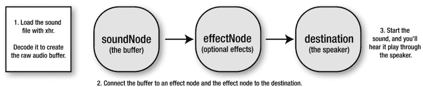
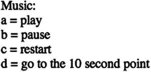
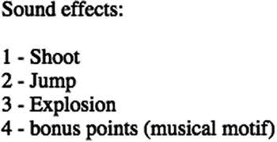

# 九、网络音频 API 的声音

HTML5 有两个不同的声音播放系统:旧的 HTML5 音频元素和新的 Web 音频 API。你应该用哪一个？对于游戏，使用非常强大的网络音频 API。它加载声音可靠，让您同时播放多种声音，并给你精确的播放控制。此外，它还允许您应用效果，创建自己的合成声音，以及指定不同种类的输入和输出源。一旦你克服了这个小小的学习曲线，你将能够使用 Web Audio API 快速创建任何你能想象的声音系统。

在这一章中，你将会学到所有你需要知道的关于网络音频 API 的知识，来使用和创建你的游戏需要的所有音乐和声音效果。您将学习如何加载声音文件，访问它们，控制它们如何播放，以及添加特殊效果，如回声和混响。您还将学习如何用纯代码从头开始生成声音，以及如何构建您自己的游戏音效定制库。

不过，在我们深入研究新的 Web 音频 API 之前，让我们先了解一下最初的 HTML 音频元素。

HTML 音频元素

HTML5 音频元素是专门为在网站上播放音频文件而设计的，通常过于局限，不能很好地用于游戏。用 HTML5 音频元素加载和播放声音的 JavaScript 格式与加载图像的格式相同。创建一个新的`Audio`对象，监听一个`canplaythrough`事件，然后在声音加载完成后调用一个事件处理程序。你可以用一个`play`方法开始声音，并设置其他属性，如`volume`和`loop`。这里有一个典型的例子:

```js
let sound = new Audio();
sound.addEventListener("canplaythrough", playSoundHandler, false);
sound.src = "sounds/music.wav";

function playSoundHandler(event) {
  sound.play();
  sound.volume = 0.5;
  sound.loop = true;
}
```

很懂事，很熟悉，可惜，很有限。回放控制不精确，同时重叠的声音要么不起作用，要么表现古怪。尽管在撰写本文时，HTML5 Audio element 规范已经稳定了很多年，但是没有一个浏览器供应商已经完全实现了它，或者看起来可能很快就会实现。所以如果你在浏览器中运行这个例子，首先希望`loop`属性能够工作。如果是这样，您可能会听到音乐循环重复，但您几乎肯定会在它重复之前听到几毫秒的间隙。HTML5 音频元素对于一个声音设计要求不高的游戏来说已经足够了，但是对于其他任何东西来说，你需要更多的控制。

进入，网络音频 API！

了解网络音频 API

无论你如何努力地浏览 Web Audio API 规范，你都不会找到任何一个叫做`play` 的方法，或者任何一个叫做`loop`或者`volume`的属性。你必须自己建立这些。Web Audio API 给你的是一个装满音频组件的大玩具盒，你可以用它来创建你可能需要的任何音频系统。你的工作是把那个盒子倒在你的厨房桌子上，然后花一个阳光明媚的下午把这些组件连接起来，组合成任何你觉得有用的东西。Web Audio API 最大的优点是它是完全模块化的，所以你可以用任何你喜欢的方式连接不同的组件。您可以构建自己的模拟风格合成器或采样器、3D 全息音乐播放器、乐谱解释器、程序音乐生成器或声音可视化器。或者，你可以做我们在本章将要做的事情:为游戏创建可重复使用的音效和音乐播放器和生成器。

 **注意**Web Audio API 足够复杂和深入，它本身就值得写一整本书。在这一章中，我不会触及 API 的每一个特性，只是那些你需要知道的来创建一个在游戏中使用声音的实用系统。您可以把这看作是对 Web Audio API 的广泛介绍，如果您想自己进一步探索它，这将为您打下坚实的基础。

以下是使用网络音频 API 加载和播放声音时需要遵循的基本步骤:

1.  用 XHR 加载声音文件并解码。你最终得到一个叫做**缓冲区**的原始音频文件。
2.  将缓冲器连接到音频效果**节点**。可以把每个节点想象成一个小小的音效盒，上面有可以调节的旋钮，也就是说，可以用代码设置参数和属性。你可能有一个控制音量的盒子，另一个控制左/右平移的盒子，还有一个控制混响的盒子。任何电吉他演奏者都可以把你的吉他想象成声音缓冲器，把节点想象成效果踏板。您可以按任意顺序将任意数量的节点连接在一起。
3.  要听到声音，将效果链中的最后一个节点连接到**目的地**。目标通常是系统上的默认播放设备；它可以是扬声器、耳机、7.1 环绕声或电视。然而，目标也可以是新的声音文件。
4.  开始播放声音。

图 9-1 显示了这个过程的样子。



图 9-1 。如何使用网络音频 API 播放声音

这在实际代码中更容易理解，所以接下来让我们看一个实际的例子。

加载和播放声音文件

让我们从最简单的例子开始。我们将加载一个声音文件，并通过按键盘上的数字 1 来播放它。评论一步一步地解释了这一切是如何运作的。

```js
//1\. Create an audio context
    let actx = new AudioContext();
```

```js
//2\. Declare a variable to hold the sound we're going to load
    let soundBuffer;
```

```js
//3\. Load the sound.
//a. Use an XMLHttpRequest object to load the sound
    let xhr = new XMLHttpRequest();
```

```js
//b. Set properties for the file we want to load.
//Use GET and set the path to the sound file.
//`true` means that the file will load asynchronously and will create
//an event when the file has finished loading
    xhr.open("GET", "sounds/test.wav", true);
```

```js
//c. Set the `responseType`, which is the file format we're expecting to
//load. Sound files should be loaded as binary files, so the `responseType`
//needs to be `arraybuffer`
    xhr.responseType = "arraybuffer";
```

```js
//d. Load the sound into the program
    xhr.send();
```

```js
//e. Create a `loadHandler` that runs when the sound has been loaded
    xhr.addEventListener("load", loadHandler, false);

    function loadHandler(event) {
```

```js
//f. Decode the audio file and store it in the `soundBuffer`
//variable. The `buffer` is the raw audio data
  actx.decodeAudioData(
    xhr.response,
    buffer => {

//g. Copy the audio file into the `soundBuffer` variable
soundBuffer = buffer;
},

//Optionally throw an error if the audio can't be decoded
error => {
  throw new Error("Audio could not be decoded: " + error);
  }
 );
}

//f. Play a sound when a key is pressed
window.addEventListener("keydown", keydownHandler, false);

function keydownHandler(event) {
  switch (event.keyCode) {
    case 49:
      if (soundBuffer) {

        //4\. Play the sound
        //a. Create a new `soundNode` and tell it to use the
        //sound that we loaded as its audio source
        let soundNode = actx.createBufferSource();
        soundNode.buffer = soundBuffer;

        //b. Connect the sound to the destination.
        //(There are no effects in this example.)
        soundNode.connect(actx.destination);

        //c. Finally, play the sound. Use the `start` method to
        //play the sound “right now”, which is the audio context’s `currentTime`
        soundNode.start(actx.currentTime);
      }
      break;
  }
}
```

第一步是创建一个`AudioContext` 。这是您将创建和控制声音的编程空间:

```js
var actx = new AudioContext();
```

这就像画布的背景，除了它是声音而不是图像。

接下来，创建一个名为`soundBuffer` 的变量，用于存储原始的二进制声音文件。

```js
let soundBuffer;
```

使用 XHR 加载声音。`responseType`是`arrayBuffer`，它只是告诉 XHR 你正在加载一个二进制文件，而不是一个文本文件。

```js
let xhr = new XMLHttpRequest();
xhr.open("GET", "sounds/test.wav", true);
xhr.responseType = "arraybuffer";
xhr.send();
xhr.addEventListener("load", loadHandler, false);
```

`loadHandler` 使用音频上下文的`decodeAudioData`方法将声音文件转换为原始音频数据。它将这些数据保存在`soundBuffer`中:

```js
function loadHandler(event) {
  actx.decodeAudioData(
    xhr.response,
    buffer => {
      soundBuffer = buffer;
    },
    error => {
      throw new Error("Audio could not be decoded: " + error);
    }
  );
}
```

`decodeAudioData`方法有一个可选的第三个参数，这是一个在解码音频出错时运行的函数。你应该总是加上这一点，因为如果音频由于某种原因没有正确解码，你肯定需要得到通知。如果您试图加载不兼容的音频格式，可能会出现解码错误。

最后一步是实际播放声音，在本例中是通过按键盘上的数字 1 来实现的。要播放声音，您至少需要运行以下四行代码:

```js
let soundNode = actx.createBufferSource();
soundNode.buffer = soundBuffer;
soundNode.connect(actx.destination);
soundNode.start(actx.currentTime);
```

下面是这四行的工作原理。首先创建一个用于播放声音的`soundNode` 。它保存了对我们加载的缓冲区(原始音频数据)的引用。然后`connect``soundNode`到音频上下文的`destination`，在这种情况下是你的计算机的扬声器。最后，用`start`的方法来播放声音。参数`actx.currentTime`表示“现在播放声音”

```js
soundNode.start(actx.currentTime);
```

`start`方法用于安排声音播放的时间，作为当前时间的偏移量。如果您向它提供音频上下文的`currentTime`值，这意味着“立即播放声音，没有任何延迟。”如果您希望声音开始前有 2 秒钟的延迟，可以使用以下语法:

```js
start(actx.currentTime + 2)
```

请注意，Web Audio API 使用的时间单位是秒，而不是毫秒。

 **提示**或者，也可以通过提供值为 0 的 **start** 方法，立即进行声音播放，这样: **start(0)** 。这是因为任何小于 **currentTime** 的值都会导致音频上下文立即播放声音。你可以使用你喜欢的任何一种风格。

这里有一件你需要知道的非常重要的事情:*每次你想播放声音*的时候都要运行这最后四行代码。对于一种声音来说，这似乎需要编写很多代码，但是我们很快就会解决这个问题。

您已经了解了如何加载和播放基本的声音，但是如果您想添加一些更高级的功能，该怎么办呢？

音量、声相和循环

要改变音量和平移，创建一个`volumeNode`和一个`panNode` 和一个:

```js
let volumeNode = actx.createGain();
let panNode = actx.createStereoPanner()
```

你可以把它们想象成两个音效盒，你可以把它们连接在声音和扬声器之间。下面是如何将这些节点`connect`到`soundNode`和`destination`:

```js
soundNode.connect(volumeNode);
volumneNode.connect(panNode);
panNode.connect(actx.destination);
```

你可以看到你正在创建一个连接链:`soundNode`  `volumeNode`  `panNode`  `destination`。最后一个效果节点，在这个例子中是`panNode`，应该总是连接到`destination`，这样你就可以听到声音。

 **注意**如果需要断开一个节点，使用`disconnect`方法。例如，您可以使用以下语法断开*平移节点*:

`panNode.disconnect()`

这将断开*平移节点*与其所连接的任何设备的连接，在本例中是*卷节点*。但请记住，如果你这样做，你已经打破了原始声音和目的之间的连接链。这意味着当你开始播放声音时，你将听不到任何声音，除非你将*音量节点*直接连接到目的节点或链中的另一个连接节点。

现在它们已经连接好了，调整这些新节点的设置以达到你想要的效果。以下是将音量设置为 50%的方法:

```js
volumeNode.gain.value = 0.5;
```

0 的`gain.value` 是没有声音，1 的值是全音量。(注意*增益*是音量的音频技术术语。更具体地说，它指的是音频信号被放大的程度。)

要设置左右扬声器平移，请将`panNode.pan.value`属性设置为–1 和 1 之间的一个数字。值为–1 会将声音导向左扬声器，值为 1 会将声音导向右扬声器。值为 0 会使两个扬声器的音量相等。例如，以下是如何将声相设定为在左扬声器中稍微突出一些:

```js
panNode.pan.value = -0.2;
```

 **注意**你也可以使用`createPanner`方法创建一个更高级的声相对象，它返回一个声相节点，让你使用 *x* 、 *y* 和 *z* 空间坐标在 3D 空间定位声音。它非常适合为 3D 游戏创建复杂的声音环境。有关更多信息，请参见位于`http://webaudio.github.io/web-audio-api/`的`createPanner`方法的网络音频规范。

您想在结束时重复播放声音吗？将`soundNode`的`loop`属性设置为`true`:

```js
soundNode.loop = true;
```

声音将会在结束时重复播放。

 **提示**在循环声音重复之前，你有没有听到短暂的延迟？如果是这样，请在任何音频编辑软件中打开您的声音文件。您可能会发现，在声音开始之前，该文件包含几毫秒的额外静默。这在 MP3 文件中很常见。还可以考虑删除 MP3 头或元数据，已知这会导致一些音频渲染引擎在重复声音之前打嗝一两毫秒。

现在让我们把所有这些新技术放在一起。如果你想播放一个通过音量和声相控制循环播放的声音，下面是你需要运行的完整代码:

```js
let soundNode = actx.createBufferSource();
soundNode.buffer = soundBuffer;

//Create volume and pan nodes
let volumeNode = actx.createGain();
let panNode = actx.createStereoPanner();

//Connect the sound source to the pan node, the pan node to
//volume node, and the volume node to the destination
soundNode.connect(panNode);
panNode.connect(volumeNode);
volumeNode.connect(actx.destination);

//Set the volume
volumeNode.gain.value = 0.5;

//Set the pan fully to the left
panNode.pan.value = -1;

//Optionally loop the sound
soundNode.loop = true;

//Finally, play the sound
soundNode.start(actx.currentTime);
```

而且，就像我们的第一个例子一样，每次想要播放声音时，您都需要运行所有这些代码。

仅仅演奏一种声音似乎就要做很多工作，不是吗？但这是有原因的:这是因为 Web Audio API 不希望您每次播放声音时都编写所有这些代码。相反，它希望为您提供强大而灵活的细粒度工具，以便您可以从头开始构建任何类型的声音系统。它不是指定一个你应该用来播放声音的 API，而是给了你制作你自己的 API 所需要的构件。

因此，这正是我们接下来要做的:构建一个易于使用和可重用的声音对象，以在游戏中播放音效和音乐。

WEB 音频 API 节点

到目前为止，我们在这些例子中只使用了四个节点:音频源节点(加载的声音文件)、增益节点(音量)、声相器节点和目的节点(扬声器)。)但是 Web Audio API 有丰富的不同节点集合供您使用:

*   `DelayNode` :创建回声、相位和镶边效果。
*   `ConvolverNode` :让你模拟一个声学环境，比如大教堂、音箱或者电话扬声器。
*   `AnalyserNode` :获取关于你声音的数据，帮助你制作类似音乐可视化器或图形均衡器的东西。
*   `ChannelSplitterNode`和`ChannelMergerNode`:让你捕捉左右立体声信号作为单声道输出，然后，如果你想，将它们重新混合成一个新的立体声信号。
*   `DynamicsCompressorNode` :将非常安静或非常嘈杂的声音正常化到中等音量水平。
*   帮助你建立低音、中音和高音均衡器。
*   `WaveShaperNode`:扭曲声音。
*   `OscillatorNode` :生成合成音。制作自己的 Moog 合成器！
*   `ScriptProcessorNode` :如果你需要你的声音做一些内置节点没有涵盖的事情，使用 JavaScript 创建你自己的自定义效果节点。

除了这些节点，Web Audio API 让你设置一个移动的`AudioListener` 。声音强度和方向将根据收听者在 3D 空间中的位置而变化。您还可以从麦克风或线路输入源采集声音，并将声音文件写入磁盘。有关详细信息，请在`http://webaudio.github.io/web-audio-api/`查看完整的、编写良好的、可读的网络音频 API 规范。

网络音频声音对象

你希望如何控制游戏中的声音？你应该能够加载声音并播放它们。如果你能暂停它们，重新启动它们，或者从一个特定的位置播放它们，那就太好了。你也应该能够控制音量和设置左，右扬声器平移。在一个完美的世界中，我们能够用简单的属性和方法来控制我们的声音，可能看起来像这样:

```js
sound.load();
sound.play();
sound.pause();
sound.restart();
sound.volume = 0.8;
sound.pan = -0.5;
sound.playFrom(15);
```

多亏了网络音频 API，这个完美的世界才得以存在。嗯，差不多了...还没有。我们必须先建造它！

我们如何构建这样一个声音对象？我们的 dream API 布局给了你一些线索。声音对象需要名为`load`、`play`、`pause`、`restart`和`playFrom`的方法。并且它需要名为`volume`和`pan`的属性。我们希望能够为游戏中的所有声音制作尽可能多的声音对象。这意味着我们可以把每种声音想象成一种音频精灵。但是音频精灵将播放声音，而不是显示图像。这意味着，我们可以使用我们用于视觉精灵的相同模型，并对其进行调整，使其适用于声音。

在下一节中，我们将创建一个完成所有这些工作的`Sound`类。正如您将看到的，它只是您已经知道的不同模式的组合。它融合了我们刚刚学到的关于 Web Audio API 的知识和我们所知道的如何使用类来创建对象的知识。唯一真正新的东西是它用来暂停、重启和播放声音的系统。但是我们将在后面详细讨论，以及如何实现这个类来发出新的声音。这里是完整的`Sound`类。仔细通读一遍，你看完了我在另一边等你！

```js
//Create the audio context
let actx = new AudioContext();

//The sound class
class Sound {
  constructor(source, loadHandler) {

    //Assign the `source` and `loadHandler` values to this object
    this.source = source;
    this.loadHandler = loadHandler;

    //Set the default properties
    this.actx = actx;
    this.volumeNode = this.actx.createGain();
    this.panNode = this.actx.createStereoPanner();
    this.soundNode = null;
    this.buffer = null;
    this.loop = false;
    this.playing = false;

    //Values for the pan and volume getters/setters
    this.panValue = 0;
    this.volumeValue = 1;

    //Values to help track and set the start and pause times
    this.startTime = 0;
    this.startOffset = 0;

    //Load the sound
    this.load();
  }

  //The sound object's methods

  load() {

    //Use xhr to load the sound file
    let xhr = new XMLHttpRequest();
    xhr.open("GET", this.source, true);
    xhr.responseType = "arraybuffer";
    xhr.addEventListener("load", () => {

      //Decode the sound and store a reference to the buffer
      this.actx.decodeAudioData(
        xhr.response,
        buffer => {
          this.buffer = buffer;
          this.hasLoaded = true;

          //This next bit is optional, but important.
          //If you have a load manager in your game, call it here so that
          //the sound is registered as having loaded.
          if (this.loadHandler) {
            this.loadHandler();
          }
        },

        //Throw an error if the sound can't be decoded
        error => {
          throw new Error("Audio could not be decoded: " + error);
        }
      );
    });

    //Send the request to load the file
    xhr.send();
  }

  play() {

    //Set the start time (it will be `0` when the first sound starts)
    this.startTime = this.actx.currentTime;

    //Create a sound node
    this.soundNode = this.actx.createBufferSource();

    //Set the sound node's buffer property to the loaded sound
    this.soundNode.buffer = this.buffer;

    //Connect the sound to the volume, connect the volume to the
    //pan, and connect the pan to the destination
    this.soundNode.connect(this.volumeNode);
    this.volumeNode.connect(this.panNode);
    this.panNode.connect(this.actx.destination);

    //Will the sound loop? This can be `true` or `false`
    this.soundNode.loop = this.loop;

    //Finally, use the `start` method to play the sound.
    //The start time will be either `0`,
    //or a later time if the sound was paused
    this.soundNode.start(
      this.startTime,
      this.startOffset % this.buffer.duration
    );

    //Set `playing` to `true` to help control the
    //`pause` and `restart` methods
    this.playing = true;
  }

  pause() {

    //Pause the sound if it's playing, and calculate the
    //`startOffset` to save the current position
    if (this.playing) {
      this.soundNode.stop(this.actx.currentTime);
      this.startOffset += this.actx.currentTime - this.startTime;
      this.playing = false;
    }
  }

  restart() {

    //Stop the sound if it's playing, reset the start and offset times,
    //then call the `play` method again
    if (this.playing) {
      this.soundNode.stop(this.actx.currentTime);
    }
    this.startOffset = 0,
    this.play();
  }

  playFrom(value) {
    if (this.playing) {
      this.soundNode.stop(this.actx.currentTime);
    }
    this.startOffset = value;
    this.play();
  }

  //Volume and pan getters/setters

  get volume() {
    return this.volumeValue;
  }
  set volume(value) {
    this.volumeNode.gain.value = value;
    this.volumeValue = value;
  }

  get pan() {
    return this.panNode.pan.value;
  }
  set pan(value) {
    this.panNode.pan.value = value;
  }
}

//Create a high-level wrapper to keep our general API style consistent and flexible
function makeSound(source, loadHandler) {
  return new Sound(source, loadHandler);
}
```

若要使用该类创建 sound 对象，请使用声音的源路径和一个可选的加载处理程序对其进行初始化，该处理程序应在声音完成加载后运行。以下是创建新音乐声音的方法:

`let music = makeSound("sounds/music.wav", setupMusic);`

声音加载后，`setup`功能将立即运行。使用它来设置声音的任何属性。然后决定你想如何控制声音。下面是一些使用`keyboard`函数来监听按键的代码。它可以让你按下“a”键播放声音，“b”键暂停声音，“c”键重启声音，“d”键从 10 秒开始播放。

```js
function setupMusic() {

  //Make the music loop
  music.loop = true;

  //Set the pan
  music.pan = -0.8;

  //Set the volume
  music.volume = 0.3;

  //Capture keyboard key events
  let a = keyboard(65),
      b = keyboard(66),
      c = keyboard(67),
      d = keyboard(68);

  //Use the key `press` methods to control the sound
  //Play the music with the `a` key
  a.press = () => {
    if (!music.playing) music.play();
    console.log("music playing");
  };

  //Pause the music with the `b` key
  b.press = () => {
    music.pause();
    console.log("music paused");
  };

  //Restart the music with the `c` key
  c.press = () => {
    music.restart();
    console.log("music restarted");
  };

  //Play the music from the 10 second mark
  //with the `d` key
  d.press = () => {
    music.playFrom(10);
    console.log("music start point changed");
  };
}
```

去看(和听！)这段代码在运行中，运行章节的源文件中的*soundObject.html*文件，如图图 9-2 所示。



图 9-2 。使用一个*声音*类来加载和控制音乐

从给定时间开始暂停、重启和播放

sound 对象的一个重要特性是声音可以暂停、重新开始和从任何位置播放。`AudioContext`有一个名为`currentTime` 的属性，它告诉您从上下文创建的那一刻起的时间，以秒为单位。它就像时钟的秒针，永远在前进。有悖常理的是，*它并没有告诉你声音播放的时间*。这意味着如果你在 10 秒标记处暂停声音，等待 5 秒，然后从 0 开始重新开始声音，`currentTime`将是 15。`currentTime`只是一直向前滴答，直到声音物体被摧毁。

是的，很奇怪。这与视频或音频中的时间码是完全不同的概念。例如，在任何音频应用程序(如 Logic、Audacity 或 Ableton Live)中，如果您停止声音，时间码也会停止。如果您倒转声音，时间码会向后移动以匹配您想要移动到的时间段；如果您前进声音，时间码也会前进到相同的位置。网络音频 API 中的时间则不是这样:它只是不停地向前移动，不能暂停、前进或倒退。但是不要为此担心:这只是网络音频 API 的底层特性，从长远来看，它给了你更多的灵活性。但这也意味着你必须在此基础上构建自己的系统，以便在正确的时间点启动和播放声音。

为了帮助计算时间开始和停止点，使用初始化为零的`startTime`和`startOffset`变量:

```js
this.startTime = 0;
this.startOffset = 0;
```

要暂停声音，首先使用`stop`方法停止声音。然后通过加上`currentTime`减去`startTime`来计算`startOffset`时间。

```js
pause() {
  if (this.playing) {
    this.soundNode.stop(this.actx.currentTime);
    this.startOffset += this.actx.currentTime - this.startTime;
    this.playing = false;
  }
},
```

再次播放声音时，捕捉新的`startTime`:

```js
play() {
  this.startTime = this.actx.currentTime;
  //...
```

通过将`start`方法的第一个参数设置为`currentTime`来播放声音。意思是“现在播放声音”

```js
  //...
  this.soundNode.start(
    this.startTime,                          //1: "play right now" `this.startOffset % this.buffer.duration`  **//2:** `"`**Play the correct section of the sound**`"`
  `);`
  `this.playing = true;`
`},`
```

 `第二个参数是要播放的声音文件部分。这是一个简单的计算，指定播放声音文件的哪一部分。该点是通过找到`startOffset`除以`buffer.duration`的余数来计算的。(`buffer.duration`是载入声音的时间，以秒为单位。)这将使声音从暂停的地方开始播放。

深呼吸！这可能是在 Web 音频 API 中处理时间最复杂的部分，但是我们现在已经克服了它。多亏了这个小小的计算，我们有办法在时间上来回移动音频，并从暂停的地方恢复声音。

 **注意**`start`方法还有第三个可选参数，即声音播放的持续时间，以秒为单位。例如，如果您有一个 10 秒长的声音，但您只想播放该声音的前 3 秒，则提供持续时间 3。如果你想让那部分声音循环，你必须将`sounceNode`的`loopStart`属性设置为 0(声音的开始)和`loopEnd`属性设置为 3(持续时间的结束时间)。)

`restart`方法以同样的方式工作。它将`startOffset`设置为`currentTime`，这将导致声音再次从头开始播放。

```js
restart() {
  if (this.playing) {
    this.soundNode.stop(this.actx.currentTime);
  }
  this.startOffset = 0,
  this.play();
},
```

第三个新特性是`playFrom`方法。这让您可以随时播放声音。以下是从 10 秒钟开始播放音乐的方法:

```js
music.playFrom(10);
```

它几乎与`restart`方法相同，但是允许您指定开始播放的时间，以秒为单位。

```js
playFrom(value) {
  if (this.playing) {
    this.soundNode.stop(this.actx.currentTime);
  }
  this.startOffset = value;
  this.play();
},
```

现在我们有了一个简洁的、可重复使用的声音对象，可以添加到任何游戏中。

 **注意**你会在`library/sound.js`文件中找到完整的`Sound`类和`makeSound`函数。

一个可靠的素材加载器

现在你知道了如何发出声音，你需要一些方法来有效地将声音文件加载到你的游戏程序中。幸运的是，我们已经在第三章中创建了一个通用素材加载器。只需做一些小的修改，我们就可以扩展它来帮助我们加载声音文件，就像它加载字体、图像和 JSON 数据文件一样容易。你会在`library/utilities.js`文件中找到`assets`对象——如果你需要快速回顾一下它是如何工作的，请翻回到第三章。

第一步是从`library/sound`模块导入`makeSound`方法。将这段代码添加到`utilities`模块的开头:

```js
import {makeSound} from "../library/sound";
```

现在找到`assets`对象并添加一个名为`audioExtensions` 的属性，这是一个数组，列出了您可能需要加载的各种音频文件的所有文件扩展名:

```js
audioExtensions: ["mp3", "ogg", "wav", "webm"],
```

然后，在加载每个源的循环中，检查是否有任何源具有这些音频文件扩展名之一。如果是，代码应该调用一个名为`loadSound` 的新方法:

```js
sources.forEach(source => {
  //...

  else if (this.audioExtensions.indexOf(extension) !== -1) {
    this.loadSound(source, loadHandler);
  }

  //...
});
```

`loadSound`方法使用`makeSound`创建声音对象并加载声音文件。然后，它将声音对象指定为`assets`对象的属性。它赋予声音对象一个与声音文件名称相匹配的名称。

```js
loadSound(source, loadHandler) {

  //Create a sound object and alert the `loadHandler`
  //when the sound file has loaded
  let sound = makeSound(source, loadHandler);

  //Get the sound file name
  sound.name = source;

  //Assign the sound as a property of the assets object so
  //we can access it this way: `assets["sounds/sound.mp3"]`
  this[sound.name] = sound;
}
```

这意味着在声音加载后，您可以使用以下语法访问游戏文件中的声音对象:

```js
assets["sounds/soundFileName.mp3"];
```

你如何在一个真实的游戏程序中使用它？首先，使用`assets.load`方法加载文件，完成后调用一个`setup`函数。以下是如何将两个声音文件加载到游戏中的方法:

```js
assets.load([
  "sounds/music.wav",
  "sounds/shoot.wav"
]).then(() => setup());
```

当然，您也可以列出游戏可能需要的任何其他资源，如图像或 JSON 文件，并同时加载它们。

接下来，在`setup`函数中，只需使用`assets`对象来获取您想要使用的已加载声音的引用。然后你可以像使用本章前面例子中的任何其他声音对象一样使用它们。

```js
function setup() {

  //Get references to the loaded sound objects
  let music = assets["sounds/music.wav"],
      shoot = assets["sounds/shoot.wav"];

  //Capture keyboard key events
  let a = keyboard(65),
      b = keyboard(66);

  //Play the music with the `a` key
  a.press = () => {
    if (!music.playing) music.play();
  };

  //Play the shoot sound with the `b` key
  b.press = () => {
    shoot.play();
  };
}
```

你现在已经有了一个统一一致的界面来加载和使用游戏中的所有资源。

添加效果

为游戏加载和播放声音文件固然很好，但这只是强大的网络音频 API 所能做到的一小部分。现在你已经知道了基础知识，让我们进一步探索，看看我们的好奇心能把我们带到哪里。也许对我们的声音做一些特殊的效果会很好？只需多做一点工作，我们就可以实现这三种效果:

*   播放速度:让声音以更快或更慢的速度播放。
*   回声:衰减的回声效果。
*   混响:模拟声学空间的声音，比如一个大房间或洞穴。

这些效果很容易在我们当前的系统上实现，并且会给你一个更高级的网络音频 API 特性的概述。(运行本章源代码中的*specialEffects.html*文件，查看该代码的运行示例。)

改变播放速率

让声音以更快或更慢的速度播放是一种有趣且快速的效果。声音缓冲源(我们前面例子中的`soundNode`对象)有一个名为`playbackRate`的属性，可以让你改变声音播放的快慢。其默认值为 1，即正常速度。您可以通过将`playbackRate`设置为 0.5 来使声音以一半的速度播放，或者通过将其设置为 2 来使声音以两倍的速度播放。改变`playbackRate`不会影响声音的音高(音高是声音的音符频率，即声音的高低)。下面是如何给`Sound`类添加回放速度特性，让你改变任何声音的速度。

首先，向`Sound`类的构造函数添加一个`playBackrate`属性:

```js
this.playbackRate = 1;
```

将其设置为 1 意味着默认回放速率将是正常速度。

接下来，在调用`start`方法之前，将下面一行代码添加到`Sound`类的`play`方法中。它将声音缓冲源的`playBackrate.value`设置为`Sound`类自己的`playBackrate`值。

```js
this.soundNode.playbackRate.value = this.playbackRate;
```

最后，在您的游戏程序代码中，使用`makeSound`方法设置您发出的任何声音的`playbackRate`属性。下面是如何让一个叫做`music`的声音以半速播放:

```js
music.playbackRate = 0.5;
```

如果你想让它播放快一倍，把它设置为 2。现在你有一个简单的方法来控制任何声音的播放速度！

回声

回声是一种你可能想在游戏声音中使用的效果。Web Audio API 没有内置的自动添加回声的方法，但是创建自己的回声系统非常容易。要让它工作，你需要使用一个**延迟节点** 。

```js
let delayNode = actx.createDelay();
```

延迟节点唯一做的事情是在播放声音之前延迟它。如果您想设置半秒钟的延迟，您可以如下操作:

```js
delayNode.delayTime.value = 0.5;
```

但是简单地将声音延迟半秒并不足以产生回声效果。声音需要延迟，然后重复，每次重复都变得更微弱。为了实现这一点，你需要另一个节点，称为**反馈** **，**，它将使声音随着每次重复逐渐变得安静。`feedbackNode`只是一个增益节点，和我们用来设置音量的节点是同一类型的。

```js
let feedbackNode = actx.createGain();
```

如果您希望每次重复时回声的音量降低大约 20 %,请将`feedbackNode`的值设置为 0.8。

```js
feedbackNode.gain.value = 0.8;
```

(值为 1 表示音量不会降低，声音会一直重复。将其设置为大于 1 将逐渐增加回声的音量。)

但是我们还没完呢！为了完成所有这些工作，你需要将这些节点连接在一起。首先，通过将延迟发送到反馈来创建一个闭环，然后返回到延迟中。连接路径如下所示:

```js
delay > feedback > delay
```

这个循环就是产生重复回声效果的原因。每次将延迟的声音发送到反馈时，其音量会降低 20%，因此声音会随着每次重复而逐渐消失。接下来，将延迟节点连接到您的主声音链。将其插入源节点和目标节点之间:

```js
source > delay > destination
```

结果是，延迟节点从源获得输入，将其发送到反馈回路，然后将产生的回声发送到目的地，以便您可以听到它。

这在实际代码中是什么样子的？让我们稍微简化一下，现在忽略体积和平移节点。下面是创建基本回声效果所需的所有代码。

```js
//Create the delay and feedback nodes
let delayNode = actx.createDelay(),
    feedbackNode = actx.createGain();

//Set their values
delayNode.delayTime.value = 0.2;
feedbackNode.gain.value = 0.8;

//Create the delay feedback loop
delayNode.connect(feedbackNode);
feedbackNode.connect(delayNode);

//Connect the source to the destination to play the first
//instance of the sound at full volume
source.connect(actx.destination);

//Capture the source and send it to the delay loop
//to create the echo effect. Then connect the delay to the
//destination so that you can hear the echo
source.connect(delayNode);
delayNode.connect(actx.destination);
```

Web Audio API 非常有效地管理声音对象，因此没有内存泄漏的危险。API 运行时(浏览器)将负责销毁不再听得见的声音。这意味着你不需要编写代码来检查和删除音量为零的声音。

这将让你有一个良好的基本回声，但我们还可以做得更多。

更加自然的回声效果

我们当前的回声重复每一个声音，作为原始声音的完美复制，每次重复音量都有所下降。通过稍微改变每个重复声音的音调，您可以赋予回声效果一种更加有机、梦幻的品质。一种简单的方法是在混音中添加一个双二阶滤波器。一个双二阶滤波器只是过滤掉任何高于某个阈值的频率。下面是如何创建一个双二阶滤波器节点，并设置其频率值。

```js
  let filterNode = actx.createBiquadFilter();
  filterNode.frequency.value = 1000;
```

给滤波器一个 1000 的频率值意味着它将剪切掉 1000 Hz 以上的任何频率。

 **注意**默认情况下，双二阶滤波器是一个低通滤波器，这意味着它允许低于给定阈值的所有频率通过。通过设置过滤器的`type`属性，您可以更改其过滤行为。`type`属性可以设置为以下任意字符串值:`"lowpass"`、`"highpass"`、`"bandpass"`、`"lowshelf"`、`"highshelf"`、`"peaking"`、`"notch"`和`"allpass"`。

将`filterNode`添加到延迟回路，在反馈和延迟连接之间，如下所示:

```js
delay > feedback > filter > delay
```

这是包含滤波器的新延迟环路代码:

```js
delayNode.connect(feedbackNode);
feedbackNode.connect(filterNode);
filterNode.connect(delayNode);
```

你可以通过改变`filterNode`的频率值来实现各种各样的酷科幻效果——它非常适合幻想或太空游戏。

 **提示**双二阶滤波器还有一个有趣的特性叫做`detune`，可以让你改变源声音的音高。将它设定为以音分(半音的百分比)为单位的值，以按该量更改音高。一个完整的八度音程(12 个半音)是 1200 美分。

向**声音**类添加回声功能

现在我们知道了如何创建回声效果，让我们更新我们的`Sound`类,这样我们就可以有选择地对任何声音应用回声。首先，在构造函数中创建我们需要的新节点:

```js
this.delayNode = this.actx.createDelay();
this.feedbackNode = this.actx.createGain();
this.filterNode = this.actx.createBiquadFilter();
```

然后创建一些属性，我们可以使用它们来定制声音对象的效果:

```js
this.echo = false;
this.delayValue = 0.3;
this.feedbackValue = 0.3;
this.filterValue = 0;
```

让我们也创建一个名为`setEcho` 的方法，它将让我们设置延迟时间、反馈时间和效果的可选过滤。

```js
setEcho(delayValue = 0.3, feedbackValue = 0.3, filterValue = 0) {
  this.delayValue = delayValue;
  this.feedbackValue = feedbackValue;
  this.filterValue = filterValue;
  this.echo = true;
}
```

我们可以使用`echo` ( `true`或`false`)的值来打开或关闭回声效果。为此，让我们将 echo 代码添加到`Sound`类的 play 方法中。所有新代码都突出显示。

```js
play() {
  this.startTime = this.actx.currentTime;
  this.soundNode = this.actx.createBufferSource();
  this.soundNode.buffer = this.buffer;

  //Create the main node chain
  this.soundNode.connect(this.volumeNode);
  this.volumeNode.connect(this.panNode);
  this.panNode.connect(this.actx.destination);

  //Add optional echo
  if (this.echo) {

    //Set the values
    this.feedbackNode.gain.value = this.feedbackValue;
    this.delayNode.delayTime.value = this.delayValue;
    this.filterNode.frequency.value = this.filterValue;

    //Create the delay loop, with optional filtering
    this.delayNode.connect(this.feedbackNode);
    if (this.filterValue > 0) {
      this.feedbackNode.connect(this.filterNode);
      this.filterNode.connect(this.delayNode);
    } else {
      this.feedbackNode.connect(this.delayNode);
    }

    //Capture the sound from the main node chain, send it to the
    //delay loop, and send the final echo effect to the `panNode`, which
    //will then route it to the destination
    this.volumeNode.connect(this.delayNode);
    this.delayNode.connect(this.panNode);
  }

  this.soundNode.loop = this.loop;
  this.soundNode.playbackRate.value = this.playbackRate;
  this.soundNode.start(
    this.startTime,
    this.startOffset % this.buffer.duration
  );
  this.playing = true;
}
```

现在要创建任何声音的回声效果，使用声音的`setEcho`方法。提供设置延迟时间、反馈时间所需的值，如果要使用双二阶滤波器，还可以选择提供要滤波的频率上限。

```js
let bounce = assets["sounds/bounce.mp3"];
bounce.setEcho(0.2, 0.5, 1000);
```

如果您需要在某个时候关闭回声效果，只需将声音的`echo`属性设置为`false`:

```js
bounce.echo = false;
```

通过改变这些值，你可以为你的游戏创造出各种各样的回声效果。

混响

混响是一种模拟声音空间的效果，如房间、大教堂或空间洞穴。这是我们将要创建的最复杂的效果，它将让你更深入地了解网络音频 API 的一些更高级的工作方式。在我们讨论具体细节之前，让我们暂时停止编码，尝试一些理论知识，这样你就可以为即将到来的事情做好充分的准备。

那么什么是缓冲呢？

在这一章中，我一直在反复使用“缓冲”这个词。我之前提到过它是“原始音频文件”，但它实际上不止于此。您可以将缓冲区视为存储二进制数据的数组。数据是代表声音的 1 和 0。每个声音片段被称为一个样本。萨姆样本相当于图像中的像素，所以我喜欢把样本想象成“音频像素”这意味着您可以将缓冲区视为一个数组，其中的每个元素代表组成每段声音的最小单元。

缓冲器还包含**通道**。您可以将每个通道视为一个单独的数组，包含自己的声音样本。如果您有一个带两个通道的缓冲器，第一个通道可能包含左扬声器的样本，第二个通道可能包含右扬声器的样本。您可以像这样想象缓冲区:

```js
buffer = [
  [l0, l1, l2], //channel one sample data for the left speaker
  [r0, r1, r2]  //channel two sample data for the right speaker
];
```

所以缓冲区有点像多维数组，每个通道代表一个子数组。数组中的每个索引位置称为一个**样本-** **帧** 。该示例缓冲器包含三个样本帧:`l0`和`r0`都在样本帧 0 上；`l2`和`r2`都在样品架 2 上。占据相同样本帧的样本将在相同的时间点播放。它们就像一条录音带上的独立音轨。单个缓冲区可以包含多达 32 个声道的音频数据。

 **注**单声道的声音，在两个扬声器中是一样的，只使用一个声道。杜比 5.1 环绕声使用 5 个声道。四声道音响使用 4。

您可以随时使用 Web Audio API 的`createBuffer` 方法创建一个空的声音缓冲区。它有三个参数:通道数、样本帧中缓冲区的长度和采样率。

```js
let emptyBuffer = actx.createBuffer(numberOfChannels, length, sampleRate);
```

通常你只需要两个声道，一个用于左扬声器，一个用于右扬声器。`length`定义了缓冲器有多少样本帧。`sampleRate` 是每秒播放的样本帧数。采样速率会影响声音的分辨率，采样速率越高，音频质量就越高。采样率以赫兹(Hz)为单位，必须在 22050 到 96000 的范围内。Web Audio API 的默认采样率通常是 44.1kHz，但这取决于运行代码的设备。如果像刚才看到的例子那样初始化一个空的缓冲区，通道数据将用零填充，表示静音。

 **提示**你可以通过将帧数除以采样率，以秒为单位计算出声音缓冲区有多长。

我把缓冲区作为一个“数组”来帮助你形象化它，但这并不是它的确切含义。是的，我又说谎了！它实际上是一种叫做`ArrayBuffer` 的“类数组”数据类型。一个`ArrayBuffer` 只是一个二进制数据的 JavaScript 存储容器。然而，在缓冲区的`getChannelData`方法的帮助下，您可以将一个`ArrayBuffer`转换成一个真实的、可用的数组。以下是如何使用它将左右扬声器通道数据转换为数组:

```js
let left = buffer.getChannelData(0),
    right = buffer.getChannelData(1);
```

`left`和`right`现在是用音频数据打包的普通数组。(0 代表左声道，1 代表右声道。)您可以像处理任何普通数组一样处理它们。它们实际上是一种特殊的高分辨率阵列，叫做`Float32Array` 。但是不要为此担心——只要把它们想象成普通的数组，它们对于存储和访问二进制数据特别有效。

 **注意** Float32 数组也用于 WebGL 图形渲染。

最棒的是，你可以通过改变数组中的通道数据来改变缓冲区的声音。这也意味着你可以从纯代码中程序化地创造声音。只需使用一种算法来产生您想要的声音数据，并将其推入通道数据数组。这就是我们接下来要做的。

模拟声音混响

现在让我们回到混响！创造可信混响的诀窍是将两种声音结合在一起。第一个声音是你的原声，没有混响。第二种是在您想要模拟的声学空间中的中性声音(白噪音)的特殊记录:例如，房间、洞穴或剧院。这些特殊的记录被称为**脉冲响应**记录。然后你用一种叫做**卷积器**的音频处理器将这两种声音混合在一起。卷积器获取您的原始声音，将其与脉冲响应录音进行比较，并将两种声音组合在一起。结果是逼真的混响，听起来像你试图模拟的空间。

但是你从哪里得到模拟混响的脉冲响应声音呢？有数千种专业录制的脉冲响应录音可供使用，这些录音模拟了从吉他放大器音箱到电话扬声器，再到历史悠久的大教堂的各种声音。你也可以创造你自己的:只需带一个录音机到一个废弃的发电厂、工厂或精神病院，用手枪在空中开几枪。最好在凌晨 3 点做这件事。你会得到一个很好的声学空间的录音，你可以用卷积器，并在这个过程中有很多乐趣。

或者，如果您对吸引警察的注意力有所顾虑，您可以通过几行代码生成可配置的脉冲响应。下面列出的`impulseResponse`函数就是这样做的。它创建一个有两个通道的空缓冲区，并用随机噪声填充每个通道。一个简单的公式就能让噪音呈指数衰减，就像声音从房间的墙壁反射回来时自然衰减一样。您可以设定混响时间和衰减量，以模拟各种空间。定义脉冲响应的是指数衰减(不是白噪声),因此也是你的声学空间的表观大小。短暂的衰减造成声音发生在小空间的错觉，较长的衰减模拟更大的空间。`impulseResponse`功能也有一个`reverse`参数，如果`true`出现，就会产生一种怪异的反混响效果。

```js
function impulseResponse(duration = 2, decay = 2, reverse = false) {

  //The length of the buffer
  //(The AudioContext's default sample rate is 44100)
  let length = actx.sampleRate * duration;

  //Create an audio buffer (an empty sound container) to store the reverb effect
  let impulse = actx.createBuffer(2, length, actx.sampleRate);

  //Use `getChannelData` to initialize empty arrays to store sound data for
  //the left and right channels
  let left = impulse.getChannelData(0),
      right = impulse.getChannelData(1);

  //Loop through each sample-frame and fill the channel
  //data with random noise
  for (let i = 0; i < length; i++){

    //Apply the reverse effect, if `reverse` is `true`
    let n;
    if (reverse) {
      n = length - i;
    } else {
      n = i;
    }

    //Fill the left and right channels with random white noise that
    //decays exponentially
    left[i] = (Math.random() * 2 - 1) * Math.pow(1 - n / length, decay);
    right[i] = (Math.random() * 2 - 1) * Math.pow(1 - n / length, decay);
  }

  //Return the `impulse`
  return impulse;
}
```

`impulseResponse`函数返回一个缓冲区，它是我们想要应用到声音中的混响效果的模型。但是我们实际上如何使用它呢？

首先，创建一个**卷积器节点**。这是专门的音频处理器，将普通声音与脉冲响应混合在一起，以创建最终的混响效果。

```js
let convolverNode = actx.createConvolver();
```

然后将脉冲响应设置为卷积器自己的`buffer`。

```js
convolverNode.buffer = impulseResponse(2, 2, false);
```

最后，将卷积器节点连接到您的声音链。

```js
soundNode.connect(convolverNode);
convolverNode.connect(destination);
```

当声音通过卷积器时，它会将脉冲响应混合到声音中，从而产生逼真的混响效果。

向**声音**类添加混响功能

现在让我们更新我们的`Sound`类来添加一个可重用的混响特性，我们可以在任何声音上启用它。首先，在构造函数中创建卷积器节点，以及一些帮助我们控制效果的属性。

```js
this.convolverNode = this.actx.createConvolver();
this.reverb = false;
this.reverbImpulse = null;
```

接下来，创建一个`setReverb`方法，让我们可以轻松地将混响应用到任何声音中。

```js
setReverb(duration = 2, decay = 2, reverse = false) {
  this.reverbImpulse = impulseResponse(duration, decay, reverse);
  this.reverb = true;
}
```

然后，在`play`方法中，在音量和声相节点之间连接卷积器，并将脉冲响应应用于卷积器的缓冲器。如果`reverb`设置为`false`，效果将被旁路。这里是`Sound`类的`play`方法的第一部分，突出显示了所有新代码。

```js
play() {
  this.startTime = this.actx.currentTime;
  this.soundNode = this.actx.createBufferSource();
  this.soundNode.buffer = this.buffer;

  //Connect all the nodes
  this.soundNode.connect(this.volumeNode);

  //If there's no reverb, bypass the convolverNode
  if (this.reverb === false) {
    this.volumeNode.connect(this.panNode);
  }

  //If there is reverb, connect the `convolverNode` and apply
  //the impulse response
  else {
    this.volumeNode.connect(this.convolverNode);
    this.convolverNode.connect(this.panNode);
    this.convolverNode.buffer = this.reverbImpulse;
  }

  this.panNode.connect(this.actx.destination);

  //... the rest of the `play` method is the same
}
```

现在，您可以使用`setReverb`方法将定制的混响应用到任何声音，语法如下:

```js
let music = assets["sounds/music.wav"];
music.setReverb(2, 5, false);
```

如果您稍后需要关闭混响，请将声音的`reverb`属性设置为`false`:

```js
music.reverb = false;
```

尝试不同的持续时间和延迟设置，你将能够产生各种各样的效果。如果是万圣节，就把`reverse`参数设为`true`！

 **提示**运行章节源文件中的`specialEffects.html`文件，体验所有这些新特性。请务必查看`library/Sound`模块中的完整的`Sound`类，以查看完整上下文中的所有代码。

合成声音

到目前为止，在这一章中，我们已经加载和控制的所有声音都是预先录制的音频文件。但是网络音频 API 也可以让你创造全新的声音，用一个多功能的**振荡器节点**。振荡器以你选择的任何音高产生音调。它也有一堆有用的属性，你可以设置来塑造这种基调。您可以将振荡器连接到 Web Audio API 的任何其他节点，如延迟节点或卷积器，为游戏创建几乎无限丰富的声音频谱。在本章的最后一节，我将首先向您介绍创建和使用振荡器的基础，然后我们将构建一个简单的`SoundEffect`类，您可以使用它作为构建各种不同游戏声音的基础。

用振荡器制作和播放声音非常容易。下面是你需要的最基本的代码:

```js
//Create the audio context
let actx = new AudioContext();

//Create a new oscillator
let oscillator = actx.createOscillator();

//Connect it to the destination
oscillator.connect(actx.destination);

//Make it play
oscillator.start(actx.currentTime);
```

(使用`stop`方法停止振荡器。)

如果您运行这段代码，它会产生一个默认为 200 Hz 的音调(这是一个稍高的 g 音)，您可以通过设置它的`frequency.value`属性来更改振荡器播放的音符。下面是如何让它播放中 A (440 Hz):

```js
oscillator.frequency.value = 440;
```

振荡器还有一个`detune`属性 ，它是一个以分为单位的值，用来抵消频率。

您可以通过设置其`type`属性来更改振荡器音调所基于的基本波形模式，该属性是一个可以设置为`"sine"`、`"triangle"`、`"square"`或`"sawtooth"`的字符串。

```js
oscillator.type = "sawtooth";
```

每种波形类型 都会产生越来越刺耳的音调。如果您想要一个真正平滑、类似钟声的音调，请使用`"sine"`。如果你仍然想要一个平滑的音调，但带有一点砂砾感，试试`"triangle"`。`"square"`开始发出有点刺耳的声音，其中`"sawtooth"`发出的声音最为刺耳。

 **注意**这四种基本的波形类型可能就是你为游戏生成大多数声音所需要的全部。但是您可以借助`createPeriodicWave`和`setPeriodicWave`方法创建自己的定制波形。你可以将它们与称为**傅立叶变换** 的特殊数据阵列一起使用，来模拟各种各样的音调，比如不同的乐器。有关更多详细信息，请参见 Web Audio API 规范。

为了向您展示使用振荡器制作真正有用的东西是多么的简单，让我们把您的电脑变成一件乐器。

制作音乐

我们将创建一个迷你应用程序，让您使用键盘的数字键弹奏五个音符。我们将从一个叫做`playNote` 的可重用函数开始，它可以让你弹奏任何音符值。它会创建并播放一个音符，听起来就像你在摆弄过的电子键盘上按下任何一个键时所期待的一样。您可以设置音符的值(以赫兹为单位的频率)、波形类型及其`decay`。`decay`值决定音符从最大音量渐隐到静音的时长。`playNote`函数基本上只是我们刚才看到的代码的可重用包装器:它创建振荡器和音量节点，将它们连接到目的地，并使用振荡器的值来播放声音。(这段代码中唯一的新东西是用于淡出音符的技术——但我将在后面解释它是如何工作的。)

```js
function playNote(frequency, decay = 1, type = "sine") {

  //Create an oscillator and a gain node, and connect them
  //together to the destination
  let oscillator = actx.createOscillator(),
      volume = actx.createGain();

  oscillator.connect(volume);
  volume.connect(actx.destination);

  //Set the oscillator's wave form pattern
  oscillator.type = type;

  //Set the note value
  oscillator.frequency.value = frequency;

  //Fade the sound out
  volume.gain.linearRampToValueAtTime(1, actx.currentTime);
  volume.gain.linearRampToValueAtTime(0, actx.currentTime + decay);

  //Make it play
  oscillator.start(actx.currentTime)
}
```

您可以使用`playNote`以任何频率弹奏音符，如下所示:

```js
playNote(440, 2, "square");
```

淡出效果

第二个参数`decay`决定音符淡出时可以听到多长时间。淡出效果 是使用这两行代码创建的:

```js
volume.gain.linearRampToValueAtTime(1, actx.currentTime);
volume.gain.linearRampToValueAtTime(0, actx.currentTime + decay);
```

`linearRampToValueAtTime`是一个非常有用的内置函数，允许您随时更改任何节点值。在本例中，它将音量的值从最大音量(1)更改为静音(0 ),时间从`currentTime`开始，到`decay`设置的值结束。你可以看到你需要使用`linearRampToValueAtTime`两次来创建完整的淡出效果。第一次使用设置开始音量和开始时间。第二个设置其结束音量和结束时间。Web Audio API 的引擎会自动为您插入所有中间值，并为您提供完全平滑的音量过渡。

以下是可用于随时更改任何节点值的基本格式:

```js
nodeProperty.linearRampToValueAtTime(startValue, startTime);
nodeProperty.linearRampToValueAtTime(endValue, endTime);
```

它适用于任何节点值，包括频率，因此您可以使用`linearRampToValueAtTime`为游戏创建各种不同的效果。

 **注** `linearRampToValueAtTime`线性改变一个值:以均匀、渐进的方式。如果您希望该值呈指数变化，请使用`exponentialRampToValueAtTime`。指数变化逐渐开始，然后迅速下降。自然界中的许多声音在数值上有指数变化。

播放音符

剩下唯一要做的事情就是将`playNote`函数与某种事件挂钩。下面是捕获 1 到 5 数字键的键盘事件的代码。然后，当按下:D 时，它会以正确的音符频率调用`playNote`函数，例如，G、A 或 c。(如果你很好奇，你只需要这五个音符来演奏一首古印度古典 raga，名为 *megh* ，意思是*云*。它们以任何组合放在一起听起来都不错。)

```js
//Capture keyboard events for the number keys 1 to 5
let one = keyboard(49),
    two = keyboard(50),
    three = keyboard(51),
    four = keyboard(52),
    five = keyboard(53);

//Define the note values
let D = 293.66,
    E = 329.63,
    G = 392.00,
    A = 440.00,
    C = 523.25;

//D
one.press = () => {
  playNote(D, 1);
};

//E
two.press = () => {
  playNote(E, 1);
}

//G
three.press = () => {
  playNote(G, 1);
}

//A
four.press = () => {
  playNote(A, 1)
}

//C
five.press = () => {
  playNote(C, 1);
}
```

 **提示**在网上快速搜索会出现许多图表，向你展示如何将赫兹频率值转换成真实的音符值。

几乎没有任何麻烦，你已经把你的电脑键盘变成了一种乐器！你可以轻松地在游戏中加入音乐效果。在一个平台游戏中，当一个角色跳到积木上时，制作积木或者一个简单的随机音乐生成器怎么样？玩家一边探索游戏世界一边作曲的游戏怎么样？你现在离进入一个全新的基于音乐的游戏只有几步之遥，所以去吧！

而这还差不多！振荡器真的没有什么复杂的——当你开始以富有想象力的方式将它们与我们在本章中使用的其他节点连接起来时，真正的乐趣就开始了。通过一点点的实验，你很快就会意识到你已经有了一个完整的音乐和音效合成器，它几乎有无限的潜力来创造你可能需要的任何游戏声音。

真的吗？是的，让我们来看看怎么做！

产生声音效果

想象一下:一个单一的、可重复使用的函数，在不到 150 行代码中，可以生成你可能需要的任何游戏音效或音符，而不必下载任何声音文件。多亏了 Web Audio API，这片乐土才成为可能，这也正是我们下一步要做的:一个通用的音效生成器，可以产生你在游戏中可能需要的几乎任何声音。

我们将要构建的音效函数被称为`soundEffect`。它有 13 个低级参数，你可以设置它们来创造大量有用的音调。在我们研究这个函数如何发挥其魔力的所有细节之前，让我们先来看看如何以一种实用的方式使用它。这里有一个使用它的模型，包括每个参数的功能描述。

```js
soundEffect(
  frequencyValue,  //The sound's frequency pitch in Hertz
  attack,          //The time, in seconds, to fade the sound in
  decay,           //The time, in seconds, to fade the sound out
  type,            //waveform type: "sine", "triangle", "square", or "sawtooth"
  volumeValue,     //The sound's maximum volume
  panValue,        //The speaker pan. left: -1, middle: 0, right: 1
  wait,            //The time, in seconds, to wait before playing the sound
  pitchBendAmount, //A frequency amount, in Hz, to bend the sound's pitch down
  reverse,         //If `reverse` is true the pitch will bend up
  randomValue,     //A range, in Hz., within which to randomize the pitch
  dissonance,      //A value in Hz. Creates 2 additional dissonant frequencies
  echo,            //An array: [delayTime, feedbackTime, filterValue]
  reverb           //An array: [duration, decayRate, reverse?]
);
```

使用这个`soundEffect`函数的策略是修改所有这些参数，并为游戏创建你自己的自定义音效库。你可以把它想象成一个巨大的共鸣板，上面有 13 个彩色闪烁的转盘，你可以尽情玩耍。想象你是一个疯狂的科学家，而 13 是你的幸运数字！

要了解如何设置这些参数来创建您想要的声音，让我们尝试使用`soundEffect`来产生四种多功能的游戏声音:激光射击声音、跳跃声音、爆炸声音和音乐主题。(运行本章源文件中的*soundEffects.html*文件，获得该代码的工作示例，如图图 9-3 所示。)



图 9-3 。从纯代码中生成自定义声音效果

射击声

以下是如何使用`soundEffect`功能创建典型激光拍摄声音的示例:

```js
function shootSound() {
  soundEffect(
    1046.5,           //frequency
    0,                //attack
    0.3,              //decay
    "sawtooth",       //waveform
    1,                //Volume
    -0.8,             //pan
    0,                //wait before playing
    1200,             //pitch bend amount
    false,            //reverse bend
    0,                //random frequency range
    25,               //dissonance
    [0.2, 0.2, 2000], //echo array: [delay, feedback, filter]
    undefined         //reverb array: [duration, decay, reverse?]
  );
}
```

*“锯齿”*波形设置赋予声音一种刺骨的刺耳感。`pitchBendAmount`是 1200，这意味着声音的频率从头到尾下降了 1200 Hz。这听起来就像你看过的所有科幻电影中的每一束激光。`dissonance`值为 25 意味着在主频上下 25 Hz 的声音中增加了两个额外的泛音。这些额外的泛音增加了音调的复杂性。

因为`soundEffect`函数被包装在一个自定义的`shootSound`函数中，所以您可以随时在您的应用程序代码中播放该效果，如下所示:

```js
shootSound();
```

它会立即播放。

跳跃的声音

让我们看另一个例子。这里有一个 *jumpSound* 函数产生一个典型的平台游戏——角色跳跃的声音。

```js
function jumpSound() {
  soundEffect(
    523.25,       //frequency
    0.05,         //attack
    0.2,          //decay
    "sine",       //waveform
    3,            //volume
    0.8,          //pan
    0,            //wait before playing
    600,          //pitch bend amount
    true,         //reverse
    100,          //random pitch range
    0,            //dissonance
    undefined,    //echo array: [delay, feedback, filter]
    undefined     //reverb array: [duration, decay, reverse?]
  );
}
```

`jumpSound`的`attack`值为 0.05，这意味着声音会快速淡入。它太快了，你真的听不到，但它巧妙地柔化了声音的开始。`reverse`值为`true`，表示音高向上弯曲而不是向下。(这是有道理的，因为跳字是向上跳的。)的`randomValue`是 100。这意味着音高将在目标频率周围 100 Hz 的范围内随机变化，因此声音的音高每次都会略有不同。这增加了声音的趣味性，让游戏世界充满活力。

爆炸的声音

只需调整相同的参数，您就可以创建完全不同的`explosionSound`效果:

```js
function explosionSound() {
  soundEffect(
    16,          //frequency
    0,           //attack
    1,           //decay
    "sawtooth",  //waveform
    1,           //volume
    0,           //pan
    0,           //wait before playing
    0,           //pitch bend amount
    false,       //reverse
    0,           //random pitch range
    50,          //dissonance
    undefined,   //echo array: [delay, feedback, filter]
    undefined    //reverb array: [duration, decay, reverse?]
  );
}
```

这会产生低频隆隆声。爆音的起点是将`frequency`值设置得极低:16 Hz。它还有一个粗糙的`"sawtooth"`波形。但是让它真正起作用的是 50 的`dissonance`值。这增加了两个泛音，高于和低于目标频率 50 Hz，它们相互干扰并干扰主声音。

音乐主题

但不仅仅是为了音效！您可以使用`soundEffect`功能创建音符，并以设定的间隔播放它们。这里有一个名为`bonusSound`的功能，它以升调顺序播放三个音符(D、A 和高音 D)。这是典型的音乐主题,当游戏角色获得一些奖励点数时，你可能会听到，比如捡星星或硬币。(听到这个声音，你可能会闪回 1985 年！)

```js
function bonusSound() {

  //D
  soundEffect(587.33, 0, 0.2, "square", 1, 0, 0);

  //A
  soundEffect(880, 0, 0.2, "square", 1, 0, 0.1);

  //High D
  soundEffect(1174.66, 0, 0.3, "square", 1, 0, 0.2);
}
```

让它工作的关键是最后一个参数:值`wait`(在刚刚显示的代码中突出显示)。第一个声音的`wait`值为 0，这意味着声音将立即播放。第二个声音的`wait`值是 0.1，这意味着它将在延迟 100 毫秒后播放。最后一个声音的`wait`值为 0.2，会让它在 200 毫秒内播放。这意味着所有三个音符按顺序播放，它们之间有 100 毫秒的间隔。

只需多做一点工作，您就可以使用`wait`参数来构建一个简单的音乐音序器，并构建您自己的音乐音效迷你库来演奏音符。

**完整的`soundEffect`功能**

这里是完整的`soundEffect`函数，带有解释其工作原理的注释。正如你将看到的，这是你在这一章中学到的所有技术的混合。(你会在`library/sound.js`文件中找到这个`soundEffect`函数。)

```js
function soundEffect(
  frequencyValue,
  attack = 0,
  decay = 1,
  type = "sine",
  volumeValue = 1,
  panValue = 0,
  wait = 0,
  pitchBendAmount = 0,
  reverse = false,
  randomValue = 0,
  dissonance = 0,
  echo = undefined,
  reverb = undefined
) {

  //Create oscillator, gain and pan nodes, and connect them
  //together to the destination
  let oscillator = actx.createOscillator(),
      volume = actx.createGain(),
      pan = actx.createStereoPanner();

  oscillator.connect(volume);
  volume.connect(pan);
  pan.connect(actx.destination);

  //Set the supplied values
  volume.gain.value = volumeValue;
  pan.pan.value = panValue;
  oscillator.type = type;

  //Optionally randomize the pitch. If the `randomValue` is greater
  //than zero, a random pitch is selected that's within the range
  //specified by `frequencyValue`. The random pitch will be either
  //above or below the target frequency.
  let frequency;
  let randomInt = (min, max) => {
   return Math.floor(Math.random() * (max - min+ 1)) + min;
  }
  if (randomValue > 0) {
    frequency = randomInt(
      frequencyValue - randomValue / 2,
      frequencyValue + randomValue / 2
    );
  } else {
    frequency = frequencyValue;
  }
  oscillator.frequency.value = frequency;

  //Apply effects
  if (attack > 0) fadeIn(volume);
  if (decay > 0) fadeOut(volume);
  if (pitchBendAmount > 0) pitchBend(oscillator);
  if (echo) addEcho(volume);
  if (reverb) addReverb(volume);
  if (dissonance > 0) addDissonance();

  //Play the sound
  play(oscillator);

  //The helper functions:

  //Reverb
  function addReverb(volumeNode) {
    let convolver = actx.createConvolver();
    convolver.buffer = impulseResponse(reverb[0], reverb[1], reverb[2]);
    volumeNode.connect(convolver);
    convolver.connect(pan);
  }

  //Echo
  function addEcho(volumeNode) {

    //Create the nodes
    let feedback = actx.createGain(),
        delay = actx.createDelay(),
        filter = actx.createBiquadFilter();

    //Set their values (delay time, feedback time, and filter frequency)
    delay.delayTime.value = echo[0];
    feedback.gain.value = echo[1];
    if (echo[2]) filter.frequency.value = echo[2];

    //Create the delay feedback loop, with
    //optional filtering
    delay.connect(feedback);
    if (echo[2]) {
      feedback.connect(filter);
      filter.connect(delay);
    } else {
      feedback.connect(delay);
    }

    //Connect the delay loop to the oscillator's volume
    //node, and then to the destination
    volumeNode.connect(delay);

    //Connect the delay loop to the main sound chain's
    //pan node, so that the echo effect is directed to
    //the correct speaker
    delay.connect(pan);
  }

  //Fade in (the sound's "attack")
  function fadeIn(volumeNode) {

    //Set the volume to 0 so that you can fade in from silence
    volumeNode.gain.value = 0;

    volumeNode.gain.linearRampToValueAtTime(
      0, actx.currentTime + wait
    );
    volumeNode.gain.linearRampToValueAtTime(
      volumeValue, actx.currentTime + wait + attack
    );
  }

  //Fade out (the sound’s "decay")
  function fadeOut(volumeNode) {
    volumeNode.gain.linearRampToValueAtTime(
      volumeValue, actx.currentTime + attack + wait
    );
    volumeNode.gain.linearRampToValueAtTime(
      0, actx.currentTime + wait + attack + decay
    );
  }

  //Pitch bend.
  //Uses `linearRampToValueAtTime` to bend the sound's frequency up or down
  function pitchBend(oscillatorNode) {

    //Get the frequency of the current oscillator
    let frequency = oscillatorNode.frequency.value;

    //If `reverse` is true, make the sound drop in pitch.
    //(Useful for shooting sounds)
    if (!reverse) {
      oscillatorNode.frequency.linearRampToValueAtTime(
        frequency,
        actx.currentTime + wait
      );
      oscillatorNode.frequency.linearRampToValueAtTime(
        frequency - pitchBendAmount,
        actx.currentTime + wait + attack + decay
      );
    }

    //If `reverse` is false, make the note rise in pitch.
    //(Useful for jumping sounds)
    else {
      oscillatorNode.frequency.linearRampToValueAtTime(
        frequency,
        actx.currentTime + wait
      );
      oscillatorNode.frequency.linearRampToValueAtTime(
        frequency + pitchBendAmount,
        actx.currentTime + wait + attack + decay
      );
    }
  }

  //Dissonance
  function addDissonance() {

    //Create two more oscillators and gain nodes
    let d1 = actx.createOscillator(),
        d2 = actx.createOscillator(),
        d1Volume = actx.createGain(),
        d2Volume = actx.createGain();

    //Set the volume to the `volumeValue`
    d1Volume.gain.value = volumeValue;
    d2Volume.gain.value = volumeValue;

    //Connect the oscillators to the gain and destination nodes
    d1.connect(d1Volume);
    d1Volume.connect(actx.destination);
    d2.connect(d2Volume);
    d2Volume.connect(actx.destination);

    //Set the waveform to "sawtooth" for a harsh effect
    d1.type = "sawtooth";
    d2.type = "sawtooth";

    //Make the two oscillators play at frequencies above and
    //below the main sound's frequency. Use whatever value was
    //supplied by the `dissonance` argument
    d1.frequency.value = frequency + dissonance;
    d2.frequency.value = frequency - dissonance;

    //Apply effects to the gain and oscillator
    //nodes to match the effects on the main sound
    if (attack > 0) {
      fadeIn(d1Volume);
      fadeIn(d2Volume);
    }
    if (decay > 0) {
      fadeOut(d1Volume);
      fadeOut(d2Volume);
    }
    if (pitchBendAmount > 0) {
      pitchBend(d1);
      pitchBend(d2);
    }
    if (echo) {
      addEcho(d1Volume);
      addEcho(d2Volume);
    }
    if (reverb) {
      addReverb(d1Volume);
      addReverb(d2Volume);
    }

    //Play the sounds
    play(d1);
    play(d2);
  }

  //The `play` function that starts the oscillators
  function play(oscillatorNode) {
    oscillatorNode.start(actx.currentTime + wait);
  }
}
```

**总结**

您现在有了一套强大的新工具来为游戏添加声音。您已经学习了使用 Web Audio API 加载和播放声音的所有基础知识，并且有了一个有用的`Sound`类，您可以将它用于游戏中的所有音乐和声音效果。您还学习了如何使用`assets`对象加载和管理声音，以及如何使用通用的`soundEffect`函数从头开始生成声音。

但是你如何在游戏中使用声音呢？你将在第十一章中学习如何做。但是在你这么做之前，让我们看看你需要知道的一个更重要的工具来完成你的游戏设计工具包:补间。`