第十章


（小鸟）鸣叫

**补间**是一种动画技术，你可以用它来让精灵以非常特殊的方式改变它的外观或位置。您可以使用补间使精灵沿着固定的路径或曲线移动，或者使精灵淡入、淡出、脉动或摆动。使用补间效果将会给你的游戏增加一个全新的互动维度和参与度，让它们以新的和令人兴奋的方式变得生动起来。

补间与你在本书中学习的其他移动精灵的方法有什么不同？在第五章中，你学习了如何使用速度和物理属性让精灵移动。这对于制作像弹跳球这样需要在每一帧对不断变化的游戏环境做出反应的东西来说是非常棒的。但有时你只是想告诉你的小精灵们“去那里，然后回来，永远重复这样的话。”补间就像给你的精灵一个可预测的、固定的、不变的运动脚本，它不受游戏物理特性的影响。就像一列在轨道上行驶的火车；它总是沿着相同的路线，在相同的时间停在每个车站。补间对于处理游戏动画中一些比较繁琐的方面特别有用，比如制作用户界面动画。它非常适合制作标题和按钮滑动或淡入淡出，也适合创建游戏场景之间的过渡。一般来说，当你想要实现一个快速运动特效的时候，你可以使用基于物理的运动来制作你的主精灵动画。

单词 **tween** 来自“在中间”动画师用这个词来描述动画对象在开始点和结束点之间的位置。如果您知道点 A 和点 B，并且您知道对象在这两点之间移动需要多长时间，您可以使用补间来计算所有这些中间点的位置。

 **提示**这听起来耳熟吗？是的，它是！在第五章中，你学习了插值的概念——补间和插值是一回事。当你和你的编程朋友聊天时使用“插值”,和你的动画师朋友聊天时使用“补间”。

在这一章中，你将深入了解如何从头开始实现游戏的补间技术，包括:

*   用于补间任何 sprite 属性(或任何其他值)的低级公式和过程。
*   **缓和**:随着时间的推移，逐渐使精灵加速或减速到特定的目的地。
*   **运动路径**:使精灵沿直线或曲线路径移动。

您还将学习如何构建一些有用的可重用组件，让您可以轻松地将缓动效果应用到游戏中的任何精灵。

缓动和插值

**缓动**是一种补间效果，可创建从一种状态或位置到另一种状态或位置的平滑过渡。假设您有一个精灵，您想在 60 帧(一秒钟)的时间内从画布的左侧到右侧制作动画。它应该慢慢开始，逐渐加速，然后减速到停止。[图 10-1](#Fig1) 说明了你想要达到的效果。

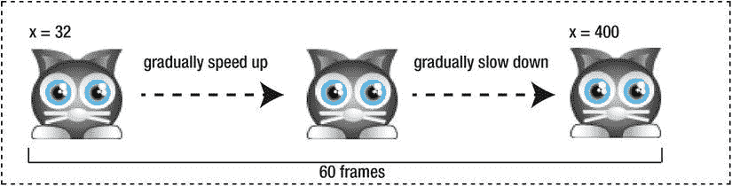

[图 10-1](#_Fig1) 。使用缓动来使精灵的位置变得平滑

如果你只知道精灵的`startValue` (32)，它的`endValue` (400)，和动画应该采取的`totalTime` (60 帧)，你怎么能算出中间的位置呢？

诀窍是将精灵移动所花费的时间转换成一个 0 到 1 之间的数字。这被称为**归一化时间**。你可以用这个简单的公式算出来:

```js
normalizedTime = currentTime / totalTime;
```

`normalizedTime`是一个神奇的数字。您可以使用它来创建一整套缓动功能，以产生各种不同的效果。你所需要做的就是获取`normalizedTime`值，将其放入一个专门的缓动函数中，并将结果应用回精灵的位置。在前面的页面中，您将了解到许多这样的缓解功能——但是让我们快速地用一个实际的例子来说明。

应用缓动功能

你需要知道的最有用的缓和函数叫做**平滑步骤**。如果你想让一个精灵以自然的方式加速和减速，`smoothstep`正在等待你的命令。就是这个:

```js
smoothstep = x => x * x * (3 - 2 * x);
```

不要让它吓到你！这只是一个普通的函数，它接受一个参数`x`，对其应用一些数学运算，然后返回结果。你将要学习的所有缓动函数都将遵循相同的格式。

`smoothstep`函数中的数学是做什么的？它只是描绘了一条曲线。图 10-2 显示了这条曲线的样子。

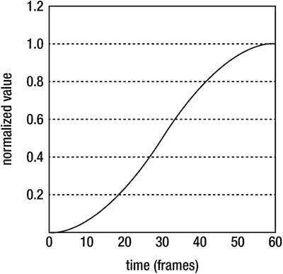

[图 10-2](#_Fig2) 。`smoothstep`功能描述了一条令人愉快的曲线

如果您将该曲线应用到`normalizedTime`，您可以控制时间的流动以匹配曲线的形状。下面是如何做到这一点:

```js
curvedTime = smoothstep(normalizedTime);
```

有了这个声明，时间将开始变慢，在中途加速，然后在接近结束时又变慢。就像水呈现出倒入其中的容器的形状一样，时间呈现出你使用的任何缓和函数的形状。

当你有了曲线时间值，你可以用它来插值精灵的 *x* 位置，计算如下:

```js
sprite.x = (endValue * curvedTime) + (startValue * (1 - curvedTime));
```

这个公式使用`curvedTime`来计算精灵在当前帧的位置。它将规范化(0 到 1)值扩展回 sprite 可以使用的实数。如果你不断循环更新`curvedTime`，精灵会加速和减速来匹配你应用的曲线。

 **提示**这个基本的技巧会让你插值任意两个值；不仅仅是针对精灵属性！

行动缓和

我给你们看的这些代码都发生在一个循环中。它可以是任何类型的循环(比如`for`循环)，但是因为我们正在制作游戏，所以我们将使用游戏循环。因此，让我们来看看你的代码需要什么样的从画布的左侧到右侧补间猫精灵，以产生如图 10-1 所示的效果。

首先，在游戏的`setup`函数中，创建你需要的变量:

```js
totalFrames = 60;
frameCounter = 0;
startValue = cat.x;
endValue = 400;
smoothstep = x => x * x * (3 - 2 * x);
```

`totalFrames`值是动画的整个持续时间。`frameCounter`将用于计算经过的帧数，这样当动画到达`totalFrames`时你可以停止动画。`startValue`和`endValue`定义了动画的起点和终点。

`gameLoop`计算帧数并运行我们在第一部分中看到的代码:

```js
function gameLoop() {
  requestAnimationFrame(gameLoop);

  //Run the animation while `frameCounter` is less than `totalFrames`
  if (frameCounter < totalFrames) {

    //Find the normalized time value
    let normalizedTime = frameCounter / totalFrames;

    //Apply the easing function
    let curvedTime = smoothstep(normalizedTime);

    //Interpolate the sprite's x position based on the curved time
    cat.x = (endValue * curvedTime) + (startValue * (1 - curvedTime));

    //Add 1 to the frame counter
    frameCounter += 1;
  }

  //Render the canvas
  render(canvas);
}
```

仅此而已！您可以使用相同的技术来补间任何 sprite 属性— `alpha`、`width`、`height`等等。如果你补间猫的`scaleX`和`scaleY`属性会发生什么？我们来看看。

首先，设置补间的开始和结束值。我们想让猫的体型从 1(正常大小)扩大到 2(两倍大小。)

```js
startValue = 1;
endValue = 2;
```

然后用这两行新代码替换插值代码:

```js
cat.scaleX = (endValue * curvedTime) + (startValue * (1 - curvedTime));
cat.scaleY = (endValue * curvedTime) + (startValue * (1 - curvedTime));
```

图 10-3 显示了发生的情况。这只猫在一秒钟内平稳地膨胀到两倍大。看起来像魔术，其实只是简单的数学！

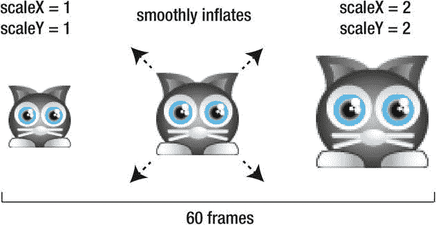

[图 10-3](#_Fig3) 。通过补间其比例来平滑地将精灵膨胀到两倍大小

经典缓动功能

您可以完全改变缓动效果的风格，只需添加不同的缓动功能。我们在第一个例子中使用了`smoothstep`，但是还有更多公式可供选择。让我们来做一个最棒的旅行，看看制作游戏最有用的一些放松功能。

线性的

巡演的第一站是最简单的公式:**线性缓和**。它所做的只是完全不变地返回`normalizedTime`。

```js
let linear = x => x;
```

它什么也不做！它只是返回你输入的相同的值，没有改变。就好像你根本没用缓动功能一样；结果只是一条直线([图 10-4](#Fig4) )。

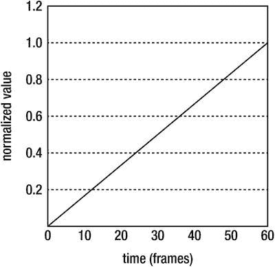

[图 10-4](#_Fig4) 。线性放松只是一条直线

如果您使用线性缓动来补间精灵的位置，精灵将开始全速移动，然后突然停止。雪碧没有逐渐加速或减速。如果这听起来并不有趣，那是因为它并不有趣！我在这里包括了线性缓动，因为这是学习理解这些函数如何工作的第一步，但是我的建议是不要在真实的游戏中使用它。没有什么比线性宽松更大声地呼喊“学生游戏”了！

但幸运的是，线性放松有一些更有趣的兄弟姐妹:**加速**和**减速**。

加速度

通过将`normalizedTime`值(`x`)乘以自身，您可以将枯燥的线性缓动变为激动人心的加速:

```js
let acceleration = x => x * x;
```

这是一个缓慢开始然后逐渐加速的缓和效果，如图[图 10-5](#Fig5) 中的图形所示。

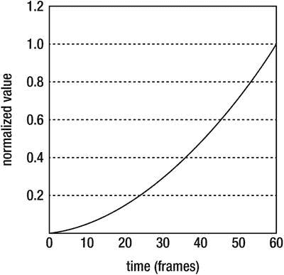

[图 10-5](#_Fig5) 。逐渐加速

当你把一个值乘以它自己，它被称为一个**平方**值。JavaScript 有一种方便的方法来帮助您使用`Math.pow`函数计算平方值(`pow`代表“的幂”)。`Math.pow`有两个参数:初始值，以及该值自身相乘的次数(指数)。

```js
Math.pow(initialValue, exponent);
```

这意味着你也可以这样写`acceleration`函数:

```js
let acceleration = x => Math.pow(x, 2);
```

如果你把相同的值再乘以一次，你会得到一个**的立方**值。下面是`accelerationCubed`函数:

```js
let accelerationCubed = x => Math.pow(x, 3);
```

效果类似普通加速，但更极端，如图[图 10-6](#Fig6) 。

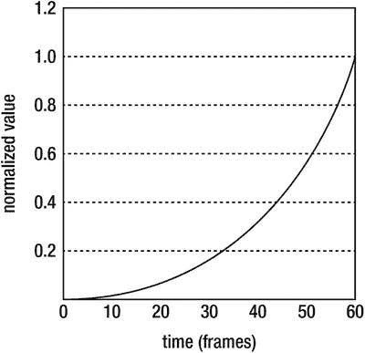

[图 10-6](#_Fig6) 。立方加速度是一个更夸张的效果

减速

减速与加速相反:开始很快，然后逐渐减速直至停止。该公式正好与加速度公式相反:

```js
let deceleration = x => 1 - Math.pow(1 - x, 2);
```

正如加速一样，减速也有一个立方版本，它夸大了效果:

```js
let decelerationCubed = x => 1 - Math.pow(1 - x, 3);
```

[图 10-7](#Fig7) 是普通减速和立方减速的对比图。

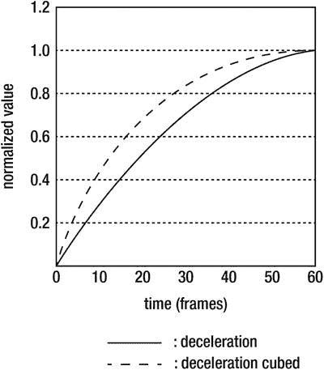

[图 10-7](#_Fig7) 。减速开始时很快，然后逐渐减速直至停止

平滑步骤

整场秀的明星是`smoothstep`公式。这是一个非常令人愉快、看起来自然的过渡，适用于任何类型的补间。除了你已经看到的标准公式，`smoothstep`也有平方和立方版本，它们将效果增强到额外的程度。这是所有三个`smoothstep`功能，你可以在[图 10-8](#Fig8) 中看到。

```js
let smoothstep = x => x * x * (3 - 2 * x);
let smoothstepSquared = x => Math.pow((x * x * (3 - 2 * x)), 2);
let smoothstepCubed = x => Math.pow((x * x * (3 - 2 * x)), 3);
```

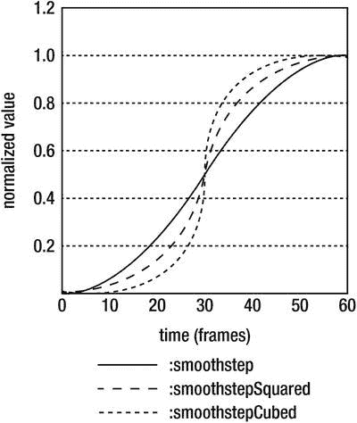

[图 10-8](#_Fig8) 。Smoothstep 可产生均衡且自然的效果

如有疑问，请使用 smoothstepping！它可以将任何游戏的外观从“学生”变成“专业”

正弦

正弦曲线给你一个稍微圆一点的减速效果。对于一个温和的加速度，使用反正弦。

```js
let sine = x => Math.sin(x * Math.PI / 2);
let inverseSine = x => 1 - Math.sin((1 - x) * Math.PI / 2);
```

图 10-9 显示了这些曲线的样子。

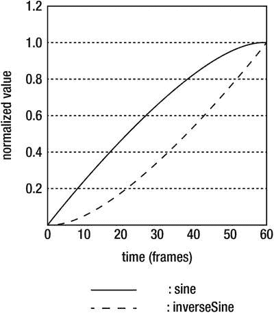

[图 10-9](#_Fig9) 。使用正弦曲线进行平缓的加速和减速

这两个公式还有平方和立方版本，每一个都成比例地放大了曲线:

```js
let sineSquared = x => Math.pow(Math.sin(x * Math.PI / 2), 2);
let sineCubed = x => Math.pow(Math.sin(x * Math.PI / 2), 2);
let inverseSineSquared = x => 1 - Math.pow(Math.sin((1 - x) * Math.PI / 2), 2);
let inverseSineCubed = x => 1 - Math.pow(Math.sin((1 - x) * Math.PI / 2), 3);
```

所有这些公式实际上只使用了正弦曲线的一半。如果你使用完整的曲线，你会得到一个和 smoothstep 几乎一样的形状。

```js
let sineComplete = x => 0.5 - Math.cos(-x * Math.PI) * 0.5;
```

然而，这种方法比 smoothstep 公式的计算量大得多，所以通常不需要使用它。

齿条

到目前为止，我们看到的所有公式都只是在两点之间的一个值:0 和 1。但是有时引入两个超出这个范围的点是有用的。这使您可以创建一个补间，在值稳定之前添加一点反弹或抖动。你可以借助一条叫做**样条**的数学曲线来做到这一点。您可以将样条视为一条沿您定义的点弯曲的线。

有许多公式可以用来生成样条曲线，但是对于游戏来说，一个特别有效的公式是 Catmull-Rom 样条曲线。公式如下:

```js
let spline = (t, a, b, c, d) => {
  return 0.5 * (
    (2 * b) +
    (-a + c) * t +
    (2 * a - 5 * b + 4 * c - d) * t * t +
    (-a + 3 * b - 3 * c + d) * t * t * t
  );
}
```

你和我都不需要知道为什么这个公式有效——我们只需要发一个大大的“谢谢！”敬 Catmull 和 Rom 为我们解决了这个问题。你真正需要知道的是，这个公式会产生四个你可以控制的点。自变量`t`是`normalizedTime`，`a`，`b`，`c`，`d`是样条的四个点。

下面是如何在我们当前的补间设置中使用样条线:

```js
let curvedTime = spline(normalizedTime, 10, 0, 1, -10);
```

最后四个参数代表样条的四个点。中间的两个 0 和 1 表示基本补间范围:

```js
10, 0, 1, -10
```

一般来说，不要将 0 和 1 更改为任何其他值，因为我们的补间系统使用的归一化时间值也在 0 和 1 之间。

您应该更改的数字是第一点和最后一点，即 10 和–10。

```js
10, 0, 1, -10
```

那些是**控制点**。它们决定补间偏离 0 到 1 范围的程度。第一个数字 10 是补间开始时的散度，最后一个数字–10 是结束时的散度。给它们更高的值会使效果更戏剧化，给它们更低的值会使效果不那么戏剧化。

图 10-10 显示了该样条曲线绘制后的样子。

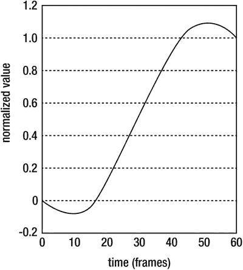

[图 10-10](#_Fig10) 。使用样条线在 0 到 1 范围之外补间精灵

你可以在这张图上看到，曲线从 0 开始，然后移动到几乎-0.1。然后它向上弯曲到大约 1.1，然后稳定在 1。

当您补间一个精灵时，这有什么影响？[图 10-11](#Fig11) 展示了当你使用样条曲线来补间猫的 *x* 位置时会发生什么。这是一种弹性反弹效应。精灵向左摆动，向右反弹，稍微超出终点，然后到达目的地。这只发生在 *x* 轴上，所以猫沿着直线来回移动。

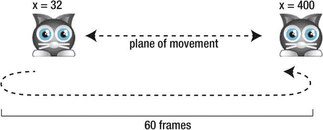

[图 10-11](#_Fig11) 。对精灵的位置应用样条线以获得弹性反弹效果

你可以通过改变样条控制点的值来创建一系列不同的效果:第一个点值和最后一个点值。例如，如果将第一个点更改为 0，并将最后一个点保持在–10，则弹性反弹只会在猫运动结束时发生。

```js
let curvedTime = spline(normalizedTime, 0, 0, 1, -10);
```

在你的日常游戏设计中，你很少需要在大多数补间中使用样条线。但对于某些特殊效果来说是必不可少的。在这一章的后面，你将学习如何使用样条线来产生戏剧性的果冻抖动效果。

加权平均值

如果你的目的值在每一帧不断变化，考虑使用`weightedAverage`功能。其效果与你在[第 6 章](06.html)中学到的缓解公式相同。

```js
let weightedAverage = (p, d, w) => ((p * (w - 1)) + d) / w;
```

参数`p`是精灵属性值，`d`是目标值，`w`是添加到效果中的**权重**的数量。权重决定了放松的快慢。权重值在 5 到 50 之间是一个很好的起点；然后你可以调整这个数字来微调放松的感觉。

与本章中的其他补间函数不同，`weightedAverage`不要求您计算归一化时间或对其应用任何曲线函数。把它放在你游戏循环的任何地方。

```js
function gameLoop() {
  requestAnimationFrame(gameLoop);
  cat.x = weightedAverage(cat.x, endValue, 30);
  render(canvas);
}
```

是的，这只是简单宽松的另一种计算方式。

沿曲线运动

到目前为止，我们看到的曲线都有助于修改精灵的属性如何随时间变化。但是你也可以使用曲线来修改精灵在空间中移动的方式。贝塞尔曲线非常适合这样做。这是经典的三次贝塞尔公式:

```js
function cubicBezier(t, a, b, c, d) {
    var t2 = t * t;
    var t3 = t2 * t;
    return a
      + (-a * 3 + t * (3 * a - a * t)) * t
      + (3 * b + t * (-6 * b + b * 3 * t)) * t
      + (c * 3 - c * 3 * t) * t2 + d * t3;
}
```

这只是一种你可以设置的有四个点的样条曲线。自变量`t`是`normalizedTime`，`a`，`b`，`c`，`d`是样条的四个点。

你可以把贝塞尔曲线想象成一条在起点和终点`a`和`d`之间延伸的直线。点`b`和`c`是决定线弯曲程度的控制点。你可以把 b 和 c 想象成强力磁铁，它们拉着线使之弯曲。贝塞尔曲线的形状取决于 b 点和 c 点的位置。[图 10-12](#Fig12) 显示了`b`和`c`控制点如何扭曲在`a`和`d`之间运行的直线。

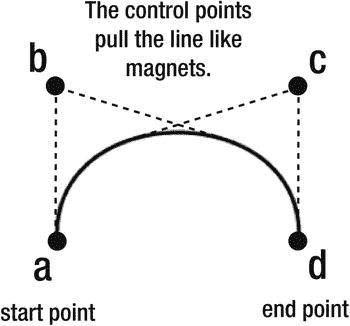

[图 10-12](#_Fig12) 。贝塞尔曲线

有了我们设置好的补间系统，你可以很容易地让精灵沿着这条曲线移动。只需将`cubicBezier`函数的返回值应用到精灵的 *x/y* 位置。另外，您还可以选择对其应用任何缓动功能。以下是如何:

```js
let curvedTime = smoothstep(normalizedTime);
cat.x = cubicBezier(curvedTime, startX, bX, cX, endX);
cat.y = cubicBezier(curvedTime, startY, bY, cY, endY);
```

如果您在我们在本章开始时编写的补间引擎中运行这段代码，猫将从起点到终点平滑地形成弧线。

这是达到这种效果的完整的`gameLoop`，图 10-13 说明了结果。

```js
function gameLoop() {
  requestAnimationFrame(gameLoop);

  //Run the animation while `frameCounter` is less than `totalFrames`
  if (frameCounter < totalFrames) {

    //Find the normalized time value
    let normalizedTime = frameCounter / totalFrames;

    //Optionally apply an easing formula
    let curvedTime = smoothstep(normalizedTime);

    //Make the sprite follow a Bezier curve
    cat.x = cubicBezier(curvedTime, 25, 100, 175, 225);
    cat.y = cubicBezier(curvedTime, 250, 50, 0, 250);

    //Add 1 to the frame counter
    frameCounter += 1;
  }

  //Render the canvas
  render(canvas);
}
```

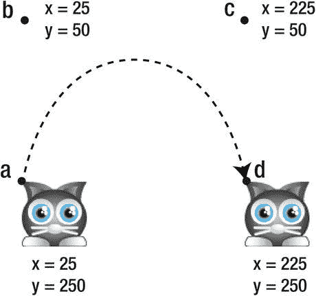

[图 10-13](#_Fig13) 。让精灵跟随曲线

如果您不想应用任何缓和，只需向`cubicBezier`函数提供原始的`normalizedTime`而不是`curvedTime`值作为第一个参数。

构建补间组件

你现在知道了补间技术是如何工作的，但是你如何在游戏中使用它呢？仅仅是在两点之间移动一个 sprite 就需要很多代码，如果您想要移动数百个 sprite 呢？您需要一个可重用的系统来创建和管理补间，所以这就是我们接下来要创建的。

您可以将补间视为介于粒子效果和关键帧动画之间的游戏组件。像粒子一样，它们需要被游戏循环更新，你可以在任何时候让几十个补间变得活跃或不活跃。像关键帧动画一样，补间动画也有持续时间，所以它们可以播放、暂停，也可能随时间反转或循环。在本节中，我们将构建一组用于构建补间的低级工具，以便您可以轻松地为游戏构建自己的自定义补间效果库。

 **注意**你会在本书源文件的`library/tween.js`文件中找到这一节的所有工作代码。

`tweens`阵列

就像粒子和交互按钮一样，你的游戏需要一个数组来存储所有活跃的补间动画。简单点说，就叫`tweens`。

```js
export let tweens = [];
```

然后，您的游戏循环将需要遍历数组中的补间，并对每个补间调用一个`update`方法:

```js
if (tweens.length > 0) {
  for(let i = tweens.length - 1; i >= 0; i--) {
    let tween = tweens[i];
    if (tween) tween.update();
  }
}
```

这是我们在第 8 章中用于粒子引擎的同一系统。而且，就像粒子一样，代码以相反的顺序循环补间，以便我们可以随时从数组中轻松地删除补间，而不会弄乱循环索引计数器。

您很快就会看到这些补间对象是什么，以及`update`方法是做什么的。

轻松图书馆

在本章的第一部分，我向你展示了如何使用 16 个缓动功能，比如`smoothstep`、`linear`和`spline`。为了使它们易于使用，我们将把它们添加为一个名为`ease`的对象的属性。这将允许我们使用类似这样的代码来访问这些函数:

```js
ease.smoothstep(normalizedTime);
```

或者，因为函数是`ease`对象的一个属性，我们可以选择通过它的字符串名调用函数:

```js
ease["smoothstep"](normalizedTime);
```

这是一个巧妙的技巧，正如您将看到的，这将使我们不必在以后编写大量重复的代码。

存储缓和函数的`ease`对象只是一个普通的旧对象文字，将函数作为属性。这里有一个`ease`对象的简化版本，展示了前两个函数是如何作为属性添加的。

```js
let ease = {
  linear(x) {return x;},
  smoothstep(x) {return x * x * (3 - 2 * x);},
  //... the rest of the easing functions follow the same pattern...
};
```

对于剩余的 14 个函数，`ease`对象中的其余代码遵循完全相同的模型。我们现在有了一个方便的易于应用的放松函数库。

创建补间对象

下一步是构建一个叫做`tweenProperty`的灵活的底层函数，我们可以用它来补间任何 sprite 的任何属性。我称之为“低级”,因为我们将使用它作为构建块来创建更易于使用的、专门的补间效果。

在我向您展示代码之前，先告诉您如何使用`tweenProperty`函数:

```js
tweenProperty(
  sprite,         //The sprite
  "x",            //The property you want to tween (a string)
  100,            //The start value
  200,            //the end value
  60,             //The tween duration, in frames
  ["smoothstep"], //An array that defines the easing type (a string)
  true,           //Yoyo? True or false
  1000            //The delay, in milliseconds, before the tween yoyos
);
```

请注意，缓动类型在数组中作为字符串列出:

```js
["smoothstep"]
```

除样条曲线外，所有缓动类型都将使用相同的格式。如果要使用样条曲线，请在数组中提供两个额外的值-起始幅值和结束幅值:

```js
["spline" -10, 10]
```

这两个数字指的是可用于修改弹性的样条线控制点。您将在前面的代码中看到它们是如何使用的。

`tweenProperty`函数中的第七个参数是一个名为`yoyo`的布尔值。如果`yoyo`是`true`，补间动画将连续循环反转其动画，就像溜溜球一样。最后一个参数是一个以毫秒为单位的数字，它决定了在溜溜球重复之前动画应该暂停多长时间。

`tweenProperty`函数返回一个`tween`对象。

```js
let tween = tweenProperty(/*...arguments...*/);
```

`tween`对象有`play`和`pause`方法，您可以使用它们来控制补间，还有一个名为`playing`的布尔属性，它告诉您补间当前是否正在播放:

```js
tween.play();
tween.pause();
tween.playing
```

您可以选择使用补间完成时应该运行的任何代码来定义`tween`对象的`onComplete`方法:

```js
tween.onComplete = () => {
  //This code will run when the tween finishes
};
```

(如果你的补间是溜溜球，在每个溜溜球片段的结尾都会调用`onComplete`。)

`tween`对象还有一个`update`函数，它包含了应该在游戏循环内部运行的代码。当`tweenProperty`函数创建补间时，它将补间对象推入全局`tweens`数组。在我们之前看过的代码中，通过循环遍历`tweens`数组并对每个补间调用`update`方法，使补间对象具有动画效果。

完整的`tweenProperty`功能

下面是创建和返回补间对象的完整的`tweenProperty`函数。你会看到大部分代码是我们用来控制精灵关键帧动画的`addStatePlayer`函数和我们用来制作粒子的`particleEffect`函数的混合体。注释解释了大部分细节，但是还有一些新特性，我将在代码清单之后更深入地解释。

```js
export function tweenProperty(
  sprite,                  //The sprite object
  property,                //The property to tween (a string)
  startValue,              //Tween start value
  endValue,                //Tween end value
  totalFrames,             //Duration in frames
  type = ["smoothstep"],   //The easing type
  yoyo = false,            //Yoyo?
  delayBeforeRepeat = 0    //Delay in milliseconds before repeating
) {

  //Create the tween object
  let o = {};

  //If the tween is a spline, set the
  //start and end magnitude values
  if(type[0] === "spline" ){
    o.startMagnitude = type[1];
    o.endMagnitude = type[2];
  }

  //Use `o.start` to make a new tween using the current
  //end point values
  o.start = (startValue, endValue) => {

    //Clone the start and end values so that any possible references to sprite
    //properties are converted to ordinary numbers
    o.startValue = JSON.parse(JSON.stringify(startValue));
    o.endValue = JSON.parse(JSON.stringify(endValue));
    o.playing = true;
    o.totalFrames = totalFrames;
    o.frameCounter = 0;

    //Add the tween to the global `tweens` array. The `tweens` array is
    //updated on each frame
    tweens.push(o);
  };

  //Call `o.start` to start the tween
  o.start(startValue, endValue);

  //The `update` method will be called on each frame by the game loop.
  //This is what makes the tween move
  o.update = () => {

    let time, curvedTime;

    if (o.playing) {

      //If the elapsed frames are less than the total frames,
      //use the tweening formulas to move the sprite
      if (o.frameCounter < o.totalFrames) {

        //Find the normalized value
        let normalizedTime = o.frameCounter / o.totalFrames;

        //Select the correct easing function from the
        //`ease` object’s library of easing functions

        //If it's not a spline, use one of the ordinary easing functions
        if (type[0] !== "spline") {
          curvedTime = ease[type](normalizedTime);
        }

        //If it's a spline, use the `spline` function and apply the
        //two additional `type` array values as the spline's start and
        //end points
        else {
          curvedTime = ease.spline(normalizedTime, o.startMagnitude, 0, 1, o.endMagnitude);
        }

        //Interpolate the sprite's property based on the curve
        sprite[property] = (o.endValue * curvedTime) + (o.startValue * (1 - curvedTime));

        o.frameCounter += 1;
      }

      //When the tween has finished playing, run the end tasks
      else {
       o.end();
      }
    }
  };

  //The `end` method will be called when the tween is finished
  o.end = () => {

    //Set `playing` to `false`
    o.playing = false;

    //Call the tween's `onComplete` method, if it's been assigned
    //by the user in the main program
    if (o.onComplete) o.onComplete();

    //Remove the tween from the `tweens` array
    tweens.splice(tweens.indexOf(o), 1);

    //If the tween's `yoyo` property is `true`, create a new tween
    //using the same values, but use the current tween's `startValue`
    //as the next tween's `endValue`
    if (yoyo) {
      wait(delayBeforeRepeat).then(() => {
        o.start(o.endValue, o.startValue);
      });
    }
  };

  //Play and pause methods
  o.play = () => o.playing = true;
  o.pause = () => o.playing = false;

  //Return the tween object
  return o;
}
```

`tweenProperty`做的一件重要的事情是将`startValue`和`endValue`转换成字符串，然后再转换回数字，然后将它们分配给补间对象:

```js
o.startValue = JSON.parse(JSON.stringify(startValue));
o.endValue = JSON.parse(JSON.stringify(endValue));
```

这确保了`startValue`和`endValue`是纯数字，而不是指向精灵属性的引用。在补间动画制作过程中，Sprite 属性值可能会发生变化，如果发生这种情况，可能会破坏补间动画。例如，假设您用`cat.x`初始化`tweenProperty`函数的初始值(第三个参数)，如下面的代码所示:

```js
let tween = tweenProperty(cat, "x", cat.x ... )
```

`cat.x`不是数字！只是一个指向猫身上`x`值的引用。如果在补间动画制作过程中`cat.x`发生变化(这是必然的)，补间对象将读取猫的当前 *x* 位置，而不是它的开始位置。为了使补间正常工作，*您只需要开始位置值*。

使用`JSON.parse`和`JSON.stringify`方法是帮助解决这个问题的常用方法。`JSON.stringify`将任何值转换成字符串(这个过程叫做**序列化**)。然后`JSON.parse`将其转换回数字(这个过程叫做**反序列化**)。这个转换过程会删除所有引用，所以你只剩下一个纯数字。这是防止您意外使用补间开始值和结束值的保险策略。

 **注意**制作一个不包含指向原始对象上的值的引用指针的对象的精确副本被称为**克隆**。当前版本的 JavaScript (ES6)没有克隆对象的专用功能，尽管将来的版本可能会有。

现在我们已经写了`tweenProperty`函数，我们如何使用它呢？这个函数的目的不是在你的游戏代码中直接使用它。相反，它是一个低级工具，你可以用它来为你的精灵构建更高级的、有用的补间函数。让我们看看下一步该怎么做。

阿尔法补间

现在我们有了一个在精灵上补间单个属性的便捷方法，有三个高级函数很容易让我们马上完成:`fadeIn`、`fadeOut`和`pulse`。

`fadeIn`

`fadeIn`函数允许你淡入一个 sprite，方法是将它的`alpha`属性补间为 1:

```js
export function fadeIn(sprite, frames = 60) {
  return tweenProperty(
    sprite, "alpha", sprite.alpha, 1, frames, ["sine"]
  );
}
```

在你的游戏代码中这样使用它:

```js
let fadeInTween = fadeIn(anySprite);
```

`fadeOut`

相反的效果，`fadeOut`，将精灵的 alpha 补间为 0:

```js
export function fadeOut(sprite, frames = 60) {
  return tweenProperty(
    sprite, "alpha", sprite.alpha, 0, frames, ["sine"]
  );
}
```

请这样使用:

```js
let fadeOutTween = fadeOut(anySprite);
```

这两种效果非常适合场景转换或使精灵出现或消失。

`pulse`

`pulse`功能使精灵在高低 alpha 值之间不断振荡。这是一个很好的效果，可以用来吸引人们对精灵的注意。

```js
export function pulse(sprite, frames = 60, minAlpha = 0) {
  return tweenProperty(
    sprite, "alpha", sprite.alpha, minAlpha, frames, ["smoothstep"], true
  );
}
```

第三个参数`minAlpha`是在补间回到原始值之前使用的最低 alpha 值。所以如果你只是想让精灵补间到 alpha 为 0.3，用下面的语句初始化`pulse`函数:

```js
let pulseTween = pulse(anySprite, 120, 0.3);
```

如果将`frames`参数设置为较低的值，可以创建闪烁效果。

所有这些效果都在一个属性之间，即精灵的`alpha`。但是如果您想要创建一个需要多个属性补间的更复杂的效果呢？

补间多个属性

我们需要再构建一个底层组件！我们将构建一个名为`makeTween`的新函数，它将允许您通过组合任意多的单属性补间来创建复杂的效果。以下是您可以使用它的方式:

```js
let complexTween = makeTween([
  [/* A property you want to tween */],
  [/* Another property you want to tween */],
  [/* Yet another property you want to tween */]
]);
```

`makeTween`接受单个参数，该参数是包含要补间的属性子数组的数组。您放在子数组中的信息与您需要提供给我们之前创建的`tweenProperty`函数的信息是相同的。

下面是如何使用`makeTween`创建一个复杂的高级函数`slide`，它将把一个精灵的 *x/y* 位置补间到画布上的任何其他 *x/y* 位置。

```js
export function slide(
  sprite,
  endX,
  endY,
  frames = 60,
  type = ["smoothstep"],
  yoyo = false,
  delayBeforeRepeat = 0
) {
  return makeTween([

    //The x axis tween
    [sprite, "x", sprite.x, endX, frames, type, yoyo, delayBeforeRepeat],

    //The y axis tween
    [sprite, "y", sprite.y, endY, frames, type, yoyo, delayBeforeRepeat]
  ]);
}
```

可以看到数组中的数据与初始化`tweenProperty`函数所需的参数完全相同。你可以这样在游戏代码中使用*滑动*功能:

```js
let catSlide = slide(cat, 400, 32, 60, ["smoothstep"], true, 0);
```

这将使`cat`精灵从其当前位置平滑地来回滑动到 400/30 的 *x/y* 位置，超过 60 帧。

所有补间都有一个用户可定义的`onComplete`方法，该方法将在补间完成时运行。下面是当补间完成时，如何使用`catSlide`补间上的`onComplete`向控制台写入消息:

```js
catSlide.onComplete = () => console.log("Cat slide finished!");
```

**制作补间**功能

`makeTween`函数将接受任意数量的补间数组作为参数，因此您可以使用它来构建一些真正复杂的效果。它本质上只是一个包装器，使用`tweenProperty`来创建每个补间，并将对每个补间对象的引用保存在它自己的内部数组中。它还为您提供了控制数组中所有补间动画的高级`play`和`pause`方法，并允许您分配一个`onComplete`方法，该方法将在数组中的所有补间动画完成后运行。

下面是完成所有这些的完整的`makeTween`函数。

```js
function makeTween(tweensToAdd) {

  //Create an object to manage the tweens
  let o = {};

  //Create an internal `tweens` array to store the new tweens
  o.tweens = [];

  //Make a new tween for each array
  tweensToAdd.forEach(tweenPropertyArguments => {

     //Use the tween property arguments to make a new tween
     let newTween = tweenProperty(...tweenPropertyArguments);

     //Push the new tween into this object's internal `tweens` array
     o.tweens.push(newTween);
  });

  //Add a counter to keep track of the
  //number of tweens that have completed their actions
  let completionCounter = 0;

  //`o.completed` will be called each time one of the tweens finishes
  o.completed = () => {

    //Add 1 to the `completionCounter`
    completionCounter += 1;

    //If all tweens have finished, call the user-defined `onComplete`
    //method, if it's been assigned. Reset the `completionCounter`
    if (completionCounter === o.tweens.length) {
      if (o.onComplete) o.onComplete();
      completionCounter = 0;
    }
  };

  //Add `onComplete` methods to all tweens
  o.tweens.forEach(tween => {
    tween.onComplete = () => o.completed();
  });

  //Add pause and play methods to control all the tweens
  o.pause = () => {
    o.tweens.forEach(tween => {
      tween.playing = false;
    });
  };
  o.play = () => {
    o.tweens.forEach(tween => {
      tween.playing = true;
    });
  };

  //Return the tween object
  return o;
}
```

因为`makeTween`管理多个补间动画，它需要知道所有补间动画何时完成任务。代码使用一个名为`completionCounter`的计数器变量来跟踪这一点，并将其初始化为 0:

```js
let completionCounter = 0;
```

创建补间动画后，`makeTween`循环遍历其数组中的所有补间动画，并向它们添加`onComplete`方法:

```js
o.tweens.forEach(tween => {
  tween.onComplete = () => o.completed();
});
```

当它们完成时，补间动画将调用一个名为`completed`的方法。`completed`方法给`completionCounter`加 1。如果`completionCounter`的值与内部`tweens`数组的长度相匹配，那么你就知道所有的补间都完成了。然后代码运行一个可选的、用户定义的`onComplete`方法，如果它存在的话。

```js
o.completed = () => {

  //Add 1 to the `completionCounter`
  completionCounter += 1;

  //If all tweens have finished, call the user-defined `onComplete`
  //method, if it's been assigned in the main program.
  //Then reset the `completionCounter`
  if (completionCounter === o.tweens.length) {
    if (o.onComplete) o.onComplete();
    completionCounter = 0;
  }
};
```

`removeTween`功能

既然我们有了制作多个补间动画的方法，我们还需要一个移除它们的方法。我们需要添加的最后一点是一个通用的`removeTween`函数:

```js
export function removeTween(tweenObject) {

  //Remove the tween if `tweenObject` doesn't have any nested
  //tween objects
  if(!tweenObject.tweens) {
    tweenObject.pause();
    tweens.splice(tweens.indexOf(tweenObject), 1);

  //Otherwise, remove the nested tween objects
  } else {
    tweenObject.pause();
    tweenObject.tweens.forEach(element => {
      tweens.splice(tweens.indexOf(element), 1);
    });
  }
}
```

使用`removeTween`从游戏中删除任何补间，语法如下:

```js
removeTween(tween);
```

最后，我们现在可以开始制作一些有趣的东西了！

轻松轻松！

我们现在已经有了创建一些简单易用的高级补间函数所需的所有工具，这些函数适用于任何精灵。下面是对各种游戏最有用的一些功能的快速总结。如果您需要更专业的东西，只需使用这些函数作为创建您自己的模型。

`slide`

如果你需要让精灵在任意两个 *x/y* 点之间移动，使用`slide`功能。

```js
let slideTween = slide(
  anySprite,              //The sprite
  400,                    //Destination x
  32,                     //Destination y
  60,                     //Duration in frames
  ["smoothstep"],         //Easing type
  true,                   //yoyo?
  0                       //Delay, in milliseconds, before repeating
);
```

你在前一节看到了`slide`函数的代码，而[图 10-14](#Fig14) 说明了它的功能。

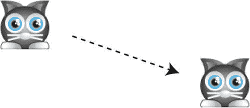

[图 10-14](#_Fig14) 。使用*滑块*让精灵平滑地移动到任何一点

`breathe`

通过在溜溜球循环中来回补间`scaleX`和`scaleY`属性，你可以让精灵看起来像在呼吸([图 10-15](#Fig15) )。

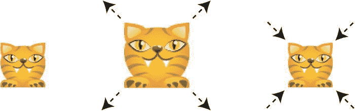

[图 10-15](#_Fig15) 。对 scaleX 和 scaleY 属性进行补间以制作一个呼吸精灵

下面是做这件事的`breathe`函数。

```js
export function breathe(
  sprite, endScaleX, endScaleY,
  frames, yoyo = true, delayBeforeRepeat = 0
) {
  return makeTween([

    //Create the scaleX tween
    [
      sprite, "scaleX", sprite.scaleX, endScaleX,
      frames, ["smoothstepSquared"], yoyo, delayBeforeRepeat
    ],

    //Create the scaleY tween
    [
      sprite, "scaleY", sprite.scaleY, endScaleY,
      frames, ["smoothstepSquared"], yoyo, delayBeforeRepeat
    ]
  ]);
}
```

请注意，`breathe`使用了`smoothstepSquared`函数来获得更明显的效果:

在游戏代码中使用它让精灵呼吸，如下例所示:

```js
let breathingTween = breathe(anySprite, 1.2, 1.2, 60);
```

`scale`

`breathe`功能在一个连续的溜溜球补间中放大和缩小精灵。但是如果您希望缩放效果只发生一次，请使用`scale`函数:

```js
export function scale(sprite, endScaleX, endScaleY, frames = 60) {
  return makeTween([

    //Create the scaleX tween
    [
      sprite, "scaleX", sprite.scaleX, endScaleX,
      frames, ["smoothstep"], false
    ],

    //Create the scaleY tween
    [
      sprite, "scaleY", sprite.scaleY, endScaleY,
      frames, ["smoothstep"], false
    ]
  ]);
}
```

它与`breathe`函数几乎完全相同，除了`yoyo`参数被设置为`false`。你可以使用`scale`平滑地放大或缩小精灵，方法如下:

```js
let scaleUpTween = scale(anySprite, 2, 2);
let scaleDownTween = scale(anySprite, 0.2, 0.2);
```

`strobe`

通过快速旋转标尺并使用样条线，您可以创建一个迷幻效果`strobe`。

```js
export function strobe(
  sprite, scaleFactor = 1.3, startMagnitude = 10, endMagnitude = 20,
  frames = 10, yoyo = true, delayBeforeRepeat = 0
) {
  return makeTween([

    //Create the scaleX tween
    [
      sprite, "scaleX", sprite.scaleX, scaleFactor, frames,
      ["spline", startMagnitude, endMagnitude],
      yoyo, delayBeforeRepeat
    ],

    //Create the scaleY tween
    [
      sprite, "scaleY", sprite.scaleY, scaleFactor, frames,
      ["spline", startMagnitude, endMagnitude],
      yoyo, delayBeforeRepeat
    ]
  ]);
}
```

您可以在这段代码中看到“样条线”缓动类型是如何设置的，以及它的起始和结束幅度值:

```js
["spline", startMagnitude, endMagnitude]
```

以下是制作精灵频闪灯的方法:

```js
let strobeTween = strobe(anySprite, 1.3, 10, 20, 10);
```

这是一种闪烁的缩放效果，如果你让它持续太久，可能会让你头疼。(你会在本章的源文件中找到一个`strobe`函数的工作示例，以及这些效果的其余部分。)

T2`wobble`

最后但同样重要的是:`wobble`函数。想象一大盘你一生中见过的最不稳定的果冻布丁。然后，用手指戳它。这就是`wobble`函数的作用。它的工作原理是借助一条样条线在 *x* 和 *y* 轴上反向缩放精灵。精灵开始时非常不稳定，然后随着每次重复逐渐变得不那么不稳定，直到它恢复正常。[图 10-16](#Fig16) 说明了这个效果。

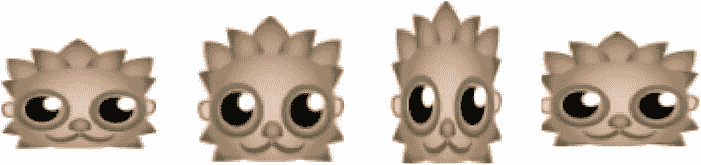

[图 10-16](#_Fig16) 。让雪碧像果冻一样晃动

是这些补间函数中最复杂的，因为它在幕后做了更多的工作。它为 *x* 和 *y* 缩放补间添加了一个`onComplete`方法，这样每次重复时都会有一点点`friction`添加到抖动中。这就是它逐渐慢下来的原因。摩擦值在 0.96(不太不稳定)和 0.99(更不稳定)之间是一个很好的尝试范围。当补间的结束值低于 1 时，效果结束，补间被移除。

```js
export function wobble(
  sprite,
  scaleFactorX = 1.2,
  scaleFactorY = 1.2,
  frames = 10,
  xStartMagnitude = 10,
  xEndMagnitude = 10,
  yStartMagnitude = -10,
  yEndMagnitude = -10,
  friction = 0.98,
  yoyo = true,
  delayBeforeRepeat = 0
) {

  let o = makeTween([

    //Create the scaleX tween
    [
      sprite, "scaleX", sprite.scaleX, scaleFactorX, frames,
      ["spline", xStartMagnitude, xEndMagnitude],
      yoyo, delayBeforeRepeat
    ],

    //Create the scaleY tween
    [
      sprite, "scaleY", sprite.scaleY, scaleFactorY, frames,
      ["spline", yStartMagnitude, yEndMagnitude],
      yoyo, delayBeforeRepeat
    ]
  ]);

  //Add some friction to the `endValue` at the end of each tween
  o.tweens.forEach(tween => {
    tween.onComplete = () => {

      //Add friction if the `endValue` is greater than 1
      if (tween.endValue > 1) {
        tween.endValue *= friction;

        //Set the `endValue` to 1 when the effect is finished and
        //remove the tween from the global `tweens` array
        if (tween.endValue <= 1) {
          tween.endValue = 1;
          removeTween(tween);
        }
      }
    };
  });

  return o;
}
```

以下是如何让精灵在游戏中摇摆的方法:

```js
let wobbleTween = wobble(anySprite, 1.2, 1.2);
```

更改 *x* 和 *y* 比例因子(第二个和第三个参数)以获得更生动的效果。

我是在玩不同的补间值时偶然发现频闪和抖动效果的。你也可以这样做！使用`makeTween`合成多个补间动画，以意想不到的方式改变不同的 sprite 属性——您可能会对自己的成果感到惊讶！

使用航路点跟随运动路径

在上一节中，你学习了如何使用`slide`函数使一个精灵平滑地在其位置之间移动。但是如果你想让一个精灵沿着一条连接路径的路线走呢？你可以将一系列的`slide`函数连接在一起，让一个精灵在画布上行走。

为了完成这项工作，你需要连接一个由 x/y 点组成的阵列；每个点被称为一个**航点**。每次精灵到达一个航路点时，调用`slide`函数并将精灵移动到下一个点。例如，假设你想让一个精灵沿着矩形路径前进，如图[图 10-17](#Fig17) 所示。

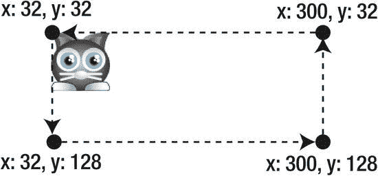

[图 10-17](#_Fig17) 。使用路径点使精灵跟随路径

您可以定义一组 2D 路点来描述路径，如下所示:

```js
 [
  [32, 32],     //First x/y point
  [32, 128],    //Next x/y point
  [300, 128],   //Next x/y point
  [300, 32],    //Next x/y point
  [32, 32]      //Last x/y point
],
```

因为这是一个封闭的路径，所以最后一个点与第一个点相同，但您也可以保持路径开放。

要做到这一点，您需要构建一个函数来读取这些路点，并使精灵在每个相邻点之间移动。当每个点之间的移动完成后，你需要让精灵在下两个点之间移动，直到它到达最后一个点。

`walkPath`

你可以使用一个名为`walkPath`的新函数来帮助你做到这一点。它的代码和我理论上描述的完全一样。在我们详细了解`walkPath`的工作原理之前，我们先来了解一下它的使用方法。下面是你需要用来让猫精灵沿着[图 10-17](#Fig17) 中的矩形路径前进的代码。

```js
let catPath = walkPath(
  cat,                   //The sprite

  //An array of x/y waypoints to connect in sequence
  [
    [32, 32],            //First x/y point
    [32, 128],           //Next x/y point
    [300, 128],          //Next x/y point
    [300, 32],           //Next x/y point
    [32, 32]             //Last x/y point
  ],

  300,                   //Total duration in frames
  ["smoothstep"],        //Easing type
  true,                  //Should the path loop?
  true,                  //Should the path yoyo?
  1000                   //Delay in milliseconds between segments
);
```

您可以看到第二个参数是一个 2D 数组，它列出了路径的路点。如果`loop`(第五个参数)是`true`，sprite 将在到达路径末尾时从路径的起点重新开始。如果`yoyo`(第六个参数)是`true`，精灵将在到达终点时逆向行走。(如果你设置`yoyo`为真，设置`loop`为`false`，精灵将从路径的起点到终点返回，不重复。)最后一个参数是 sprite 在路径的每一部分之间应该等待的延迟(以毫秒为单位)。

下面是完成这项工作的完整的`walkPath`函数。它使用`makeTween`在 2D 数组中的每个航路点之间创建一个补间。补间完成后，会在前一个数组的最后一个点和新数组的下一个点之间创建一个新的补间。当到达最后一个点时，路径可选地循环和溜溜球。

```js
export function walkPath(
  sprite,                   //The sprite
  originalPathArray,        //A 2D array of waypoints
  totalFrames = 300,        //The duration, in frames
  type = ["smoothstep"],    //The easing type
  loop = false,             //Should the animation loop?
  yoyo = false,             //Should the direction reverse?
  delayBetweenSections = 0  //Delay, in milliseconds, between sections
) {

  //Clone the path array so that any possible references to sprite
  //properties are converted into ordinary numbers
  let pathArray = JSON.parse(JSON.stringify(originalPathArray));

  //Figure out the duration, in frames, of each path section by
  //dividing the `totalFrames` by the length of the `pathArray`
  let frames = totalFrames / pathArray.length;

  //Set the current point to 0, which will be the first waypoint
  let currentPoint = 0;

  //Make the first path using the internal `makePath` function (below)
  let tween = makePath(currentPoint);

  //The `makePath` function creates a single tween between two points and
  //then schedules the next path to be made after it

  function makePath(currentPoint) {

    //Use the `makeTween` function to tween the sprite's x and y position
    let tween = makeTween([

      //Create the x axis tween between the first x value in the
      //current point and the x value in the following point
      [
        sprite,
        "x",
        pathArray[currentPoint][0],
        pathArray[currentPoint + 1][0],
        frames,
        type
      ],

      //Create the y axis tween in the same way
      [
        sprite,
        "y",
        pathArray[currentPoint][1],
        pathArray[currentPoint + 1][1],
        frames,
        type
      ]
    ]);

    //When the tween is complete, advance the `currentPoint` by 1.
    //Add an optional delay between path segments, and then make the
    //next connecting path
    tween.onComplete = () => {

      //Advance to the next point
      currentPoint += 1;

      //If the sprite hasn't reached the end of the
      //path, tween the sprite to the next point
      if (currentPoint < pathArray.length - 1) {
        wait(delayBetweenSections).then(() => {
          tween = makePath(currentPoint);
        });
      }

      //If we've reached the end of the path, optionally
      //loop and yoyo it
      else {

        //Reverse the path if `loop` is `true`
        if (loop) {

          //Reverse the array if `yoyo` is `true`. Use JavaScript’s built-in
          //array `reverse` method to do this
          if (yoyo) pathArray.reverse();

          //Optionally wait before restarting
          wait(delayBetweenSections).then(() => {

            //Reset the `currentPoint` to 0 so that we can
            //restart at the first point
            currentPoint = 0;

            //Set the sprite to the first point
            sprite.x = pathArray[0][0];
            sprite.y = pathArray[0][1];

            //Make the first new path
            tween = makePath(currentPoint);

            //... and so it continues!
          });
        }
      }
    };

    //Return the path tween to the main function
    return tween;
  }

  //Pass the tween back to the main program
  return tween;
}
```

通过调整`makePath`功能的参数，您可以实现多种多样的运动路径效果，这将使您很好地适应各种游戏。但是`makePath`只移动由直线段组成的路径。如果你想让一个精灵沿着一条弯曲的路径走呢？

`walkCurve`

你可以用一组贝塞尔曲线来描述一个精灵的路径，而不是用一组 x/y 的路点。[图 10-18](#Fig18) 显示了一个精灵沿着两条贝塞尔曲线组成的路径。第一条曲线使 sprite 向画布底部弯曲，第二条曲线使它向其起点弯曲。

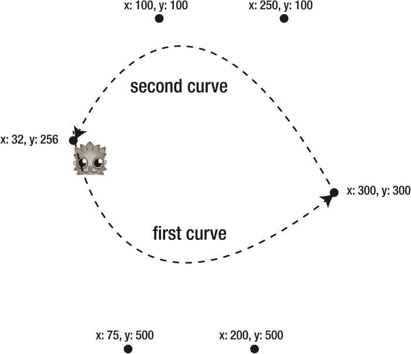

[图 10-18](#_Fig18) 。使用贝塞尔曲线使精灵遵循弯曲的运动路径

这是两条贝塞尔曲线的数组，描述了图 10-18 所示的运动路径:

```js
[
  //Curve 1
  [[hedgehog.x, hedgehog.y],[75, 500],[200, 500],[300, 300]],

  //Curve 2
  [[300, 300],[250, 100],[100, 100],[hedgehog.x, hedgehog.y]]
]
```

下一步是创建一个名为`walkCurve`的函数，让精灵沿着贝塞尔曲线描述的路径前进。`walkCurve`功能与`walkPath`功能非常相似——唯一真正的区别是航路点数据被曲线数据取代。下面是你如何使用`walkCurve`函数让一个精灵跟随[图 10-18](#Fig18) 中的路径:

```js
let hedgehogPath = walkCurve(
  hedgehog,              //The sprite

  //An array of Bezier curve points that
  //you want to connect in sequence
  [
    [[hedgehog.x, hedgehog.y],[75, 500],[200, 500],[300, 300]],
    [[300, 300],[250, 100],[100, 100],[hedgehog.x, hedgehog.y]]
  ],

  300,                   //Total duration, in frames
  ["smoothstep"],        //Easing type
  true,                  //Should the path loop?
  true,                  //Should the path yoyo?
  1000                   //Delay in milliseconds between segments
);
```

下面是完整的`walkCurve`函数，带有描述其工作原理的注释。

```js
export function walkCurve(
  sprite,                  //The sprite
  pathArray,               //2D array of Bezier curves
  totalFrames = 300,       //The duration, in frames
  type = ["smoothstep"],   //The easing type
  loop = false,            //Should the animation loop?
  yoyo = false,            //Should the direction reverse?
  delayBeforeContinue = 0  //Delay, in milliseconds, between sections
) {

  //Divide the `totalFrames` into sections for each part of the path
  let frames = totalFrames / pathArray.length;

  //Set the current curve to 0, which will be the first one
  let currentCurve = 0;

  //Make the first path
  let tween = makePath(currentCurve);

  function makePath(currentCurve) {

    //Use the custom `followCurve` function (described earlier
    //in the chapter) to make a sprite follow a curve
    let tween = followCurve(
      sprite,
      pathArray[currentCurve],
      frames,
      type
    );

    //When the tween is complete, advance the `currentCurve` by one.
    //Add an optional delay between path segments, and then create the
    //next path
    tween.onComplete = () => {
      currentCurve += 1;
      if (currentCurve < pathArray.length) {
        wait(delayBeforeContinue).then(() => {
          tween = makePath(currentCurve);
        });
      }

      //If we've reached the end of the path, optionally
      //loop and reverse it
      else {
        if (loop) {
          if (yoyo) {

            //Reverse the order of the curves in the `pathArray`
            pathArray.reverse();

            //Reverse the order of the points in each curve
            pathArray.forEach(curveArray => curveArray.reverse());
          }

          //After an optional delay, reset the sprite to the
          //beginning of the path and create the next new path
          wait(delayBeforeContinue).then(() => {
            currentCurve = 0;
            sprite.x = pathArray[0][0];
            sprite.y = pathArray[0][1];
            tween = makePath(currentCurve);
          });
        }
      }
    };

    //Return the path tween to the main function
    return tween;
  }

  //Pass the tween back to the main program
  return tween;
}
```

就这样，我们结束了！补间，解决了！

摘要

你现在有了一套有用的工具，可以为各种游戏制作各种动画补间效果。您已经学习了所有经典的缓动功能是如何工作的，以及如何使用它们来制作精灵动画。您还构建了一个通用且可定制的补间引擎，可以用于任何游戏项目。结合您在前面章节中学习的脚本运动和关键帧动画技术，您现在有一个令人眼花缭乱的运动效果调色板可供选择。

本章最重要的是你知道如何使用高级补间函数，如`fadeIn`、`fadeOut`、`pulse`、`slide`、`strobe`、`breathe`、`followCurve`、`walkPath`和`walkCurve`。不要让那些补间函数如何工作的技术细节困扰你。如果您想尝试制作自己的自定义补间动画，您可以在以后更仔细地研究它们。

但是如何在游戏中使用这些补间函数呢？在下一章你会发现。