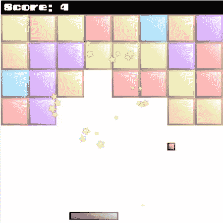
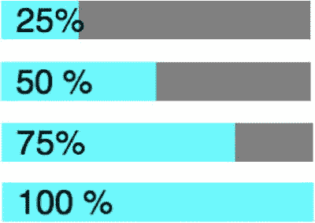

# 十一、制作你自己的游戏引擎

到目前为止，在这本书里，你已经学会了如何制作一系列灵活的低级工具，并使用它们来帮助构建游戏。但是在你用这些工具做了几个游戏之后，你会注意到一件事，那就是你最终会写很多重复的代码。这包括所有的代码来加载您的素材，导入模块，运行游戏循环，创建精灵，循环通过精灵来检查碰撞，移动精灵，以及无数其他不起眼，乏味，但必要的任务。所有这些都是**游戏引擎**的代码，它最终可能会占到你所编写的所有代码的一半。

游戏引擎代码与游戏逻辑代码无关。游戏逻辑是你为每个游戏编写的有趣的、富有想象力的代码。游戏引擎代码只是让游戏逻辑工作的重担。在你学习的过程中展示所有这些代码是很好的，因为理解游戏程序的所有部分是如何组合在一起的是很重要的。但是，如果你只是想清楚地实现你的想象，而不是那些杂乱的技术材料，你必须更进一步。这就是我们在本章要做的。我们将把游戏引擎代码从游戏逻辑代码中分离出来，这样你就可以自由地快速创建游戏，而不必趟过齐腰深的繁琐机制的泥淖。我们将关闭游戏引擎上的引擎盖，跳进一辆超级充电、制造游戏的跑车的驾驶座。

在这一章中，我将向你展示如何构建你自己的易于使用的游戏引擎，以及制作真正完美的游戏所需要知道的一些缺失的部分。您将学习如何:

*   创建和管理游戏状态。
*   自动缩放和居中游戏以填充浏览器窗口。
*   创建独立的游戏场景和关卡，并制作它们之间的动画过渡。
*   建立一个带有加载进度条的预加载屏幕。
*   创建一个有趣的新特效:屏幕抖动！

在本章的最后，你将学习如何运用所有这些新技能，并将它们与迄今为止你在书中学到的所有技术相结合，构建一个名为 Bloxyee 的突围式游戏(如图[图 11-1](#Fig1) 所示)。



[图 11-1](#_Fig1) 。你将在这一章构建的角色游戏

使用状态来构建游戏

在前面的章节中，你学习了如何创建和使用一套工具来帮助你制作游戏。但是如何组织代码来构建一个游戏呢？解决方案是使用**状态**。状态是一个函数，包含游戏中每个重要部分的代码。例如，在一个基本游戏中，你可能有这四种状态:

*   **加载**:游戏素材加载时做什么。
*   **setup** :素材加载后应该运行的代码。设置状态创建精灵并建立游戏关卡。
*   **玩**:你的主游戏逻辑。这是一个循环。
*   **end** :玩家结束游戏时应该运行的代码。

图 11-2 展示了这个基本模型。


[图 11-2](#_Fig2) 。四种基本游戏状态

这些状态中的每一个都只是一个普通的函数，包含普通的游戏代码:

```js
function load() {/*What to do while loading assets*/}
function setup() {/*Create the sprites and game level*/}
function play() {/*The game code*/}
function end() {/*Code to run when the game finishes*/}
```

*   这些函数应该包含您想要为该状态运行的所有代码。但是你需要某种方法在游戏中的任何时候在这些状态之间切换。这里有一个简单的方法:
*   创建一个名为`state:`的变量

```js
let state;
```

它的工作是保存对当前游戏状态函数的引用。比如，想象一下，当你的游戏开始时，你想运行的第一个函数是`load`函数。将`state`的值设置为`load`:

```js
let state = load;
```

现在`state`已经变成了`load`函数的中间指针。

然后你需要做的就是在游戏循环中调用`state`，就像这样:

```js
function gameLoop() {
  requestAnimationFrame(gameLoop);
  state();
}
```

因为`state`有值`load`，所以`load`函数将循环运行。

这个系统的美妙之处在于，你可以在你的代码中随时将`state`的值改为另一个函数，然后那个函数就会在游戏循环中运行。你根本不用修改游戏循环代码。例如，如果您的代码已经加载完素材，并且您希望主游戏开始运行，只需重新定义`state`的值，使其指向`play`函数:

```js
state = play;
```

现在，你在`play`函数中写的任何代码都将在`gameLoop`中运行。

循环将自动运行任何函数`state`所引用的内容。如果它引用了`load`函数，那么`load`函数中的所有代码都会运行；如果它引用了`play,`，那么`play`函数中的所有代码都会运行。把你的游戏状态函数(`load`、`setup`、`play`、`end`)想象成独立的模块，只要把它们分配给`state`变量，你就可以随时触发它们。

你可以根据需要在游戏中使用任意多个状态。如果您的状态包含大量代码，请将每个状态保存在单独的 JS 文件中。通过使用这种简单的技术，你可以创建非常大、非常复杂的游戏，但是因为你已经将游戏模块化为不同的状态，你的游戏代码总是很容易管理的。

游戏的模板

在我们进入下一步之前，让我们看看如何使用游戏状态来建立一个简单的模板来制作多种游戏。该模板从库中导入有用的代码，加载资源，并创建画布。它还设置和管理游戏状态，运行游戏循环，并呈现画布。

```js
//Import any useful code from the library
import {
  makeCanvas, sprite, group, particles, particleEffect,
  tilingSprite, emitter, stage, render
} from "../library/display";
import {assets, randomInt, contain, wait} from "../library/utilities";
import {makePointer} from "../library/interactive";
import {hit, hitTestRectangle} from "../library/collision";

//Load the assets
assets.load([
  "img/textureAtlas.json"
]).then(() => setup());

//Declare any variables shared between functions
let state, canvas;

function setup() {

  //Make the canvas and initialize the stage
  canvas = makeCanvas(512, 512);
  canvas.style.backgroundColor = "black";
  stage.width = canvas.width;
  stage.height = canvas.height;

  //...Create the game sprites and initialize variables...

  //Set the game state to the `play` function
  state = play;

  //Start the game loop
  gameLoop();
}

function gameLoop() {
  requestAnimationFrame(gameLoop);

  //Update all the particles in the game
  if (particles.length > 0) {
    for(let i = particles.length - 1; i >= 0; i--) {
      let particle = particles[i];
      particle.update();
    }
  }

  //Run the current game state
  state();
}

function play() {

  //...Add game logic...

  //Render the canvas
  render(canvas);
}
```

你现在可以开始向这个模板添加定制代码来构建各种游戏，比如我们在第七章开发的 Flappy Fairy 游戏。

但是等等——有更好的方法！你可以通过创建一个可重用的**游戏引擎**来使这一切变得更加容易。

启动你的引擎！

上一节的游戏模板大约有 50 行代码。这还不算太糟，但是你需要为你制作的每个游戏重写相同的代码。而且，如果你想制作一个使用补间、声音、拖放或其他特殊功能的游戏，你也必须把这些代码放到模板中。你必须记住要包含许多样板代码，然后对你制作的每个游戏进行测试、调整和微调。

为什么不直接写一遍所有的样板代码，把它隐藏在某种可重用的函数中，在需要的时候调用它呢？这正是我们下一步要做的:制造一个游戏引擎。

在我向您展示使游戏引擎工作的代码之前，让我们先了解一下您将如何使用它。游戏引擎只是一个名为`game`的普通函数，你可以在`library/engine.js`文件夹中找到它。所以当你想开始制作一个新游戏时，用这样的语句将其导入你的代码:

```js
import {game} from "../library/engine";
```

这是你需要导入的唯一的东西。稍后您将会看到，游戏引擎会在后台自动导入所有其他依赖项，因此您不必担心它们。

接下来，使用`game`函数创建一个名为`g`的新游戏对象:

```js
let g = game(512, 256, setup, ["img/textureAtlas.json"]);
```

前两个参数是舞台的宽度和高度:512 乘 256。第三个参数`setup`，是游戏开始时应该运行的第一个函数。最后一个参数是一个数组，它列出了您想要加载的所有素材。您可以根据需要列出任意多的素材；以下是如何加载纹理贴图集、图像、字体和声音:

```js
let g = game(512, 256, setup, [
  "img/textureAtlas.json",
  "img/cat.png",
  "fonts/puzzler.otf",
  "sounds/bounce.wav"
]);
```

一旦加载了这些素材，游戏引擎就会寻找并运行一个名为`setup` 的函数，这是第三个参数。(不必给那个函数起名叫“setup”；你可以叫它任何你喜欢的名字。)

您可以选择添加最后一个参数:加载素材时应该运行的函数的名称。例如，您可能有一个名为`load`的函数，它在加载素材时显示一个加载进度条。你可以告诉游戏引擎你想添加一个`load`函数，这样:

```js
let g = game(512, 256, setup, ["img/textureAtlas.json"], load);
```

游戏引擎将在加载资源时寻找并运行一个名为`load`的函数。在本章的后面你会看到一个如何使用这个加载状态来创建一个加载进度条的实际例子。

接下来，通过调用游戏引擎的`start`方法来启动游戏引擎:

```js
g.start();
```

这就像打开汽车的点火开关。`start`方法导致素材开始加载。

当素材已经加载时，引擎自动调用`setup`状态。`setup`函数只会运行一次，你可以用它来初始化你的游戏精灵。当你完成设置后，将游戏状态改为`play`。游戏引擎会自动循环运行`play`函数。

```js
function setup() {

  //The setup function runs only once
  //Create your sprites like this:
  let cat = g.sprite(g.assets["cat.png"]);

  //When you're finished setting up, change the
  //game state to `play`
  g.state = play;
}

function play() {
  //...the game logic, which runs in a loop...
}
```

如果需要随时暂停游戏循环，使用`g.pause()`方法。要恢复游戏循环，使用`g.resume()` 。

注意，你需要给所有游戏引擎代码加上前缀 *g* 。因此，要制作一个具有`sprite`功能的精灵，请使用`g.sprite`。要访问游戏素材，请使用`g.assets`。我们在本书中创建的所有函数、方法和实用程序都可以通过在它们的名称前加上前缀 *g* (它代表“游戏”，如果你还没有猜到的话！).

现在让我们来看看启动一个新游戏，加载一个纹理贴图集，创建一个画布，显示一个精灵，并使精灵移动所需编写的所有代码。

```js
import {game} from "../library/engine";

let g = game(512, 256, setup, ["img/animals.json"]);
g.start();

let cat;

function setup() {
  cat = g.sprite(g.assets["cat.png"]);
  g.state = play;
}

function play() {
  cat.x += 1;
}
```

很好很容易！这是你最基本的游戏引擎框架，你可以用它来制作任何种类的游戏。通过隐藏所有的技术细节，你已经整理好了你的代码，解放了你的思想去创造性地工作。

但是它是如何工作的呢？

制作游戏引擎

在上一节中，您已经了解到我们将要制作的游戏引擎将允许您通过调用`game`函数来创建一个新游戏；代码如下所示:

```js
let g = game(512, 256, setup, ["img/animals.json"]);
```

`game`函数创建并返回一个名为`Game`的类的实例，它做以下事情:

*   从其他模块导入所有对象和方法，并将它们添加为自己的属性。
*   创建画布，初始化舞台，并创建指针。
*   设定游戏的比例。
*   加载素材并管理游戏状态。
*   运行游戏循环并更新任何补间动画、按钮、粒子和拖放精灵。(它还会更新任何“晃动的精灵”——稍后您会了解到这一点。)
*   渲染画布。

简而言之，它完成了所有你必须手工编码的烦人的管理任务。

`Game`类中的代码对您来说都不陌生。它只是你需要用来设置和运行任何游戏的纯技术代码。在前面的章节中，所有这些代码都与你制作的每个游戏的特定代码混合在一起。现在这段代码已经完全抽象了。

这里是完整的`Game`类，带有解释每个部分如何工作的注释。

```js
//Import the modules
module utilities from "../library/utilities";
module display from "../library/display";
module collision from "../library/collision";
module interactive from "../library/interactive";
module sound from "../library/sound";
module tween from "../library/tween";

export class Game {
  constructor(width = 256, height = 256, setup, assetsToLoad, load) {

    //Copy all the imported library code into
    //properties on this class
    Object.assign(this, utilities);
    Object.assign(this, display);
    Object.assign(this, collision);
    Object.assign(this, interactive);
    Object.assign(this, sound);
    Object.assign(this, tween);

    //Make the canvas and initialize the stage
    this.canvas = this.makeCanvas(width, height, "none");
    this.canvas.style.backgroundColor = "white";
    this.stage.width = this.canvas.width;
    this.stage.height = this.canvas.height;

    //Make the pointer
    this.pointer = this.makePointer(this.canvas);

    //The game's scale
    this.scale = 1;

    //Set the game `state`
    this.state = undefined;

    //Set the user-defined `load` and `setup` states
    this.load = load;
    this.setup = setup;

    //Get a reference to the `assetsToLoad` array
    this.assetsToLoad = assetsToLoad;

    //A Boolean to let us pause the game
    this.paused = false;

    //The `setup` function is required, so throw an error if it's
    //missing
    if (!setup) {
      throw new Error(
        "Please supply the setup function in the constructor"
      );
    }
  }

  //The game loop
  gameLoop() {
    requestAnimationFrame(this.gameLoop.bind(this));

    //Update all the buttons
    if (this.buttons.length > 0) {
      this.canvas.style.cursor = "auto";
      this.buttons.forEach(button => {
        button.update(this.pointer, this.canvas);
        if (button.state === "over" || button.state === "down") {
          if(button.parent !== undefined) {
            this.canvas.style.cursor = "pointer";
          }
        }
      });
    }

    //Update all the particles
    if (this.particles.length > 0) {
      for(let i = this.particles.length - 1; i >= 0; i--) {
        let particle = this.particles[i];
        particle.update();
      }
    }

    //Update all the tweens
    if (this.tweens.length > 0) {
      for(let i = this.tweens.length - 1; i >= 0; i--) {
        let tween = this.tweens[i];
        if (tween) tween.update();
      }
    }

    //Update all the shaking sprites
    //(More about this later in the chapter!)
    if (this.shakingSprites.length > 0) {
      for(let i = this.shakingSprites.length - 1; i >= 0; i--) {
        let shakingSprite = this.shakingSprites[i];
           if (shakingSprite.updateShake) shakingSprite.updateShake();
      }
    }

    //Update the pointer for drag-and-drop
    if (this.draggableSprites.length > 0) {
      this.pointer.updateDragAndDrop(this.draggableSprites);
    }

    //Run the current game `state` function if it's been defined and
    //the game isn't `paused`
    if(this.state && !this.paused) {
      this.state();
    }

    //Render the canvas
    this.render(this.canvas);

  }

  //The `start` method that gets the whole engine going. This needs to
  //be called by the user from the game application code, right after
  //the engine is instantiated

  start() {
    if (this.assetsToLoad) {

      //Use the supplied file paths to load the assets, and then run
      //the user-defined `setup` function
      this.assets.load(this.assetsToLoad).then(() => {

        //Clear the game `state` function for now to stop the loop
        this.state = undefined;

        //Call the `setup` function that was supplied by the user in
        //the Game class’s constructor
        this.setup();
      });

      //While the assets are loading, set the user-defined `load`
      //function as the game state. That will make it run in a loop.
      //You can use the `load` state to create a loading progress bar
      if (this.load) {
        this.state = this.load;
      }
    }

    //If there aren't any assets to load,
    //just run the user-defined `setup` function
    else {
      this.setup();
    }

    //Start the game loop
    this.gameLoop();
  }

  //Pause and resume methods. These stop and start the
  //game engine's game loop
  pause() {
    this.paused = true;
  }
  resume() {
    this.paused = false;
  }
}
```

为了使我们的 API 与本书中的其他代码保持一致，我们创建`Game`实例的接口是通过一个名为`game`的高级包装函数实现的:

```js
export function game(
  width = 256, height = 256, setup, assetsToLoad, load
) {
  return new Game(width, height, setup, assetsToLoad, load);
}
```

现在，使用前面看到的代码创建一个新的游戏实例:

```js
let g = game(512, 256, setup, ["img/textureAtlas.json"]);

g.start();
```

看看刚刚显示的代码中的`Game`类的`start`方法，看看它是如何让一切运转起来的。`start`方法在提供的数组中加载素材，然后调用用户定义的`setup`函数。(在加载素材时，它将可选地调用用户定义的`load`函数——但前提是已经提供了`load`函数。)在`setup`函数运行后，`start`方法调用`gameLoop`。`gameLoop` 更新所有游戏对象的集合，比如补间动画和按钮，然后调用当前游戏状态。`Game`类的`pause`和`resume`方法可以让你在需要的时候开始和停止游戏循环。

你现在可以使用这个框架开始制作任何新游戏。让我们找出方法。

使用游戏引擎

让我们看一个实际的例子来帮助你开始:从一个纹理贴图集中加载三个图像，并使它们可以拖动和放下。图 11-3 显示了这个简单的例子在浏览器窗口中运行的样子。你可以点击每个精灵并拖动它。


[图 11-3](#_Fig3) 。使用游戏引擎制作简单的拖放精灵

下面是使用我们新的游戏引擎完成所有这些的代码。

```js
//Create the engine
import {game} from "../library/engine";
let g = game(512, 256, setup, ["img/animals.json"]);
g.start();

//Give the canvas a black background
g.canvas.style.backgroundColor = "black";

//Declare any variables that should be used across functions
let cat, tiger, hedgehog;

function setup() {

  //Make three sprites and set their `draggable`
  //properties to `true`
  cat = g.sprite(g.assets["cat.png"]);
  g.stage.putCenter(cat, -32, -32);
  cat.draggable = true;

  tiger = g.sprite(g.assets["tiger.png"]);
  g.stage.putCenter(tiger);
  tiger.draggable = true;

  hedgehog = g.sprite(g.assets["hedgehog.png"]);
  g.stage.putCenter(hedgehog, 32, 32);
  hedgehog.draggable = true;

  //Optionally set the game state to `play`
  g.state = play;
}

function play() {
  //You don't actually need a `play` state in this example,
  //but if you did, all this code would run in a loop
}
```

到目前为止，我们在这本书上的所有努力都开始有回报了！你可以看到我们的引擎在幕后做了大量繁琐的自动化工作，只用几行代码就给了我们一个可用的拖放界面。还记得我们在书的前面写的让拖放界面工作的代码吗？你再也不用看它或想它了！

 **提示**记住，如果你需要访问我们在前面章节中写的方法中的任何自定义对象，它们都在那里，随时可供你使用——只需给它们加上前缀 *g* 。

缩放游戏以填充任何窗口大小

让我们给我们的游戏引擎添加一个高级特性:将任何游戏缩放到浏览器窗口最大宽度或高度的能力。你可以在图 11-3 中看到，画布与浏览器窗口的左上角对齐。如果画布能够自动缩放并自动对齐以填充最大可用空间，就像图 11-4 中的[那样，那不是很好吗？](#Fig4)


[图 11-4](#_Fig4) 。缩放游戏以适合整个窗口

画布上的像素数量保持不变；它们只是根据需要填充的空间大小按比例拉伸或挤压。这是一个非常有用的功能，因为这意味着你可以设计一个单一的固定画布大小的游戏，然后根据你需要的屏幕大小来放大或缩小。像这样缩放画布通常比完全全屏运行游戏更可取，使用你在第一章中学到的全屏 API。这是因为你的游戏不会因为接管整个浏览器 UI 而有疏远玩家的风险，也不需要点击按钮来激活。它很自然地将任何浏览器窗口填充到最大尺寸。这并不难做到——让我们来看看怎么做吧！

 **提示**通常来说，将你的游戏设计成你认为可能需要的最小分辨率，然后放大到更大的尺寸是一个好主意。这是因为更少的像素意味着更好的性能。当你放大时，你失去的是图形的清晰度，但现代硬件处理得如此优雅，那些模糊的像素很少被注意到。玩家肯定会注意到一个古怪、紧张的游戏，而不是你的图形上的柔和边缘。

再看一下`Game`类，您会注意到它有一个名为`scale`的属性，在构造函数中被初始化为 1:

```js
this.scale = 1;
```

现在回想一下我们在[第 6 章](06.html)中写的`makePointer`函数。请记住，`pointer`有一个名为`scale`的属性，它可以在创建指针时初始化:

```js
export function makePointer(element, scale = 1) {

  let pointer = {
    element: element,
    scale: scale,
    _x: 0,
    _y: 0,
    get x() {
      return this._x / this.scale;
    },
    get y() {
      return this._y / this.scale;
    },
    //... the rest of the `makePointer` function...
```

`scale`值用于帮助将浏览器的鼠标或触摸 *x/y* 位置转换到画布上的等效位置。这很重要，因为如果画布被缩放到更大或更小的尺寸，浏览器的 *x/y* 鼠标位置值将会错位。这意味着你不能点击按钮或拖动精灵。浏览器会认为这些交互元素与实际位置不同。指针代码通过调整鼠标或触摸 *x/y* 坐标到正确的刻度来解决这个问题。您可以通过以下方式将指针设定为不同的刻度值:

```js
pointer.scale = anyScaleValue;
```

到目前为止，在本书中，我们还没有需要改变规模，但我们将在下一步这样做。

`scaleToWindow`功能

为了让画布自动缩放到最大窗口大小，我们将使用一个名为`scaleToWindow` 的新方法，这将是游戏对象的一个属性。所以在你创建并启动一个新的游戏引擎后就调用它，这样:

```js
g.scaleToWindow("white");
```

它的单个参数决定了画布在其中浮动的 HTML 主体的背景颜色。

或者，您可能还想让画布在每次浏览器窗口的大小改变时重新调整自己的大小。如果是这种情况，调用`window`事件监听器中的`scaleToWindow`:

```js
window.addEventListener("resize", event => {
  g.scaleToWindow("white");
});
```

`scaleToWindow`是直接在`Game`类上的方法:

```js
export class Game {
  //...
  scaleToWindow() {
    //... the method code...
  }
}
```

这很方便，因为这意味着代码可以直接访问画布和指针。下面是完整的`scaleToWindow`方法。(注意代码清单中的*这个*指的是`Game`类，该方法属于这个类。)

```js
scaleToWindow(backgroundColor = "#2C3539") {

  let scaleX, scaleY, scale, center;

  //1\. Scale the canvas to the correct size
  //Figure out the scale amount on each axis
  scaleX = window.innerWidth / this.canvas.width;
  scaleY = window.innerHeight / this.canvas.height;

  //Scale the canvas based on whichever value is less: `scaleX` or `scaleY`
  scale = Math.min(scaleX, scaleY);
  this.canvas.style.transformOrigin = "0 0";
  this.canvas.style.transform = "scale(" + scale + ")";

  //2\. Center the canvas.
  //Decide whether to center the canvas vertically or horizontally.
  //Wide canvases should be centered vertically, and
  //square or tall canvases should be centered horizontally

  if (this.canvas.width > this.canvas.height) {
    center = "vertically";
  } else {
    center = "horizontally";
  }

  //Center horizontally (for square or tall canvases)
  if (center === "horizontally") {
    let margin = (window.innerWidth - this.canvas.width * scaleY) / 2;
    this.canvas.style.marginLeft = margin + "px";
    this.canvas.style.marginRight = margin + "px";
  }

  //Center vertically (for wide canvases)
  if (center === "vertically") {
    let margin = (window.innerHeight - this.canvas.height * scaleX) / 2;
    this.canvas.style.marginTop = margin + "px";
    this.canvas.style.marginBottom = margin + "px";
  }

  //3\. Remove any padding from the canvas and set the canvas
  //display style to "block"
  this.canvas.style.paddingLeft = 0;
  this.canvas.style.paddingRight = 0;
  this.canvas.style.display = "block";

  //4\. Set the color of the HTML body background
  document.body.style.backgroundColor = backgroundColor;

  //5\. Set the game engine ("this") and the pointer to the correct scale.
  //This is important for correct hit testing between the pointer and sprites
  this.pointer.scale = scale;
  this.scale = scale;
}
```

这里有一些您以前没有见过的新东西，所以让我们来看一下这段代码是如何工作的。代码做的第一件事是计算出浏览器窗口比画布大多少倍:

```js
scaleX = window.innerWidth  / this.canvas.width;
scaleY = window.innerHeight / this.canvas.height;
```

然后，它使用这两个值中较小的一个来设置画布的比例:

```js
scale = Math.min(scaleX, scaleY);
```

产生的`scale`值与 CSS `transformOrigin`和`transform`方法一起使用，以该数量缩放画布。

```js
this.canvas.style.transformOrigin = "0 0";
this.canvas.style.transform = "scale(" + scale + ")";
```

(`transformOrigin` 方法将画布的 *x/y* 原点设置为其左上角:“0 0”)。)

如果画布的宽度大于高度，它应该垂直居中。如果画布的高度大于宽度，或者画布是方形的，它应该水平居中:

```js
if (this.canvas.width > this.canvas.height) {
  center = "vertically";
} else {
  center = "horizontally";
}
```

要使画布居中，请找出缩放后的画布大小与浏览器窗口大小之间的差异。然后使用该值的一半来设置左右画布边距(如果居中是垂直的)或上下画布边距(如果居中是水平的)。

```js
//Center horizontally (for square or tall canvases)
if (center === "horizontally") {
  let margin = (window.innerWidth - this.canvas.width * scaleY) / 2;
  this.canvas.style.marginLeft = margin + "px";
  this.canvas.style.marginRight = margin + "px";
}

//Center vertically (for wide canvases)
if (center === "vertically") {
  let margin = (window.innerHeight - this.canvas.height * scaleX) / 2;
  this.canvas.style.marginTop = margin + "px";
  this.canvas.style.marginBottom = margin + "px";
}
```

接下来，删除画布上任何可能的填充，将画布的显示样式设置为`block`，并将 HTML `body`元素的`backgroundColor`设置为函数参数中提供的任何颜色。

```js
this.canvas.style.paddingLeft = 0;
this.canvas.style.paddingRight = 0;
this.canvas.style.display = "block";
document.body.style.backgroundColor = backgroundColor;
```

最后，将指针和游戏引擎的`scale`属性设置为与计算的`scale`相同的值。

```js
this.pointer.scale = scale;
this.scale = scale;
```

这确保了浏览器的鼠标和触摸位置将正确地对应于缩放画布上的点。

您可能需要做的最后一件事就是从运行游戏的页面上的 HTML 元素中删除任何可能的默认填充。将这个 CSS 放到 HTML 文档中的`<title>`标签之后:

```js
<style> * {margin: 0; padding: 0;} </style>
```

星号是代表“一切”的 CSS 代码该语句将所有 HTML 元素的边距和填充设置为 0。

现在我们准备好出发了！我们有一个很棒的小游戏引擎，充满了铃声和哨声。但是怎么用它来做一个真正的游戏呢？

案例研究:Bloxyee

在本章的源文件中，你会发现一个名为 Bloxyee 的游戏原型，它是使用我们新的游戏引擎构建的。这是本书中最完整的游戏原型，包括许多你想在专业标准游戏中使用的功能:加载栏，动画场景过渡，补间和粒子效果，以及一个简单的用户界面。玩几次 Bloxyee 来感受一下。[图 11-5](#Fig5) 说明了游戏的主要特点和流程，基于老款雅达利游戏 Breakout。


[图 11-5](#_Fig5) 。Bloxyee:突破式游戏

当球碰到球拍时，球拍会像果冻一样晃动。当球击中其中一个方块时，方块消失在满天的星星中，玩家得一分。如果球碰到屏幕底部，屏幕就会晃动，玩家就会失去一分。只要按下播放按钮，音乐就开始播放，每当球碰到其中一个积木或球拍时，就会发出弹跳的声音。当所有的方块都被打破后，标题屏幕会滑回来，显示最终分数，并让您单击播放按钮重新播放。

从本书的其他例子来看，大多数游戏代码对你来说都很熟悉，但是有一些新的特性，比如屏幕抖动效果和加载进度条。让我们先来看看完整注释的代码清单，然后再仔细看看游戏的特殊功能细节。

 **注**游戏为什么叫 Bloxyee？因为这是一个关于积木的游戏。在进行了大约 50 次网络搜索和一些疯狂的拼写实验后，“Bloxyee”是我能找到的唯一一个与已经存在的积木游戏不匹配的名字。事实上，历史上似乎从来没有人把这七个字母按照这样的顺序放在一起。然而，好景不长——在我进行网络搜索后不久，“bloxyee.com”就被某人神秘地注册了(或者……*什么的*！).

完整的代码清单

下面是完整的 Bloxyee 代码清单:

```js
<!doctype html>
<meta charset="utf-8">
<title>Bloxyee</title>
<style> * {margin: 0; padding: 0;} </style>
<body>
<script type="module">

//Import the game engine
import {game} from "../../library/engine";

//Initialize the game engine and load all the assets
let g = game(
  512, 512, setup,
  [
    "img/bloxyee.json",
    "sounds/bounce.wav",
    "sounds/music.wav",
    "fonts/puzzler.otf"
  ],
  load
);

//Start the engine
g.start();

//Scale and center the game
g.scaleToWindow();

//Optionally rescale the canvas if the browser window is changed
window.addEventListener("resize", event => {
  g.scaleToWindow();
});

//Game variables
let paddle, ball, topBorder, blocks, blockFrames,
    music, bounceSound, message, titleMessage,

    //The size of the grid of blocks
    gridWidth = 8,
    gridHeight = 5,
    cellWidth = 64,
    cellHeight = 64,

    //title sprites
    title, playButton,

    //Groups
    titleScene, gameScene,

    //Score
    score = 0,

    //The paddle wobble tween
    paddleWobble;

function load() {

  //Display the loading progress bar while the game
  //assets load (you'll learn how asset loading works in later in this chapter)
  g.progressBar.create(g.canvas, g.assets);
  g.progressBar.update();
}

function setup() {

  //Remove the progress bar
  g.progressBar.remove();

  //Sound and music
  bounceSound = g.assets["sounds/bounce.wav"];
  music = g.assets["sounds/music.wav"];
  music.loop = true;

  //Create the sprites

  //1\. The `titleScene` sprites

  //The `title`
  title = g.sprite(g.assets["title.png"]);

  //The play button
  playButton = g.button([
    g.assets["up.png"],
    g.assets["over.png"],
    g.assets["down.png"]
  ]);

  //Set the `playButton's x property to 514 so that
  //it's offscreen when the sprite is created
  playButton.x = 514;
  playButton.y = 350;

  //Set the `titleMessage` x position to -200 so that it's offscreen
  titleMessage = g.text("start game", "20px puzzler", "white", -200, 300);

  //Make the `playButton` and `titleMessage` slide in from the
  //edges of the screen using the `slide` function
  g.slide(playButton, 250, 350, 30, ["decelerationCubed"]);
  g.slide(titleMessage, 250, 300, 30, ["decelerationCubed"]);

  //Create the `titleScene` group
  titleScene = g.group(title, playButton, titleMessage);

  //2\. The `gameScene` sprites

  //The paddle
  paddle = g.sprite(g.assets["paddle.png"]);
  g.stage.putBottom(paddle, 0, -24);

  //The ball
  ball = g.sprite(g.assets["ball.png"]);
  g.stage.putBottom(ball, 0, -128);

  //Set the ball's initial velocity
  ball.vx = 12;
  ball.vy = 8;

  //Add a black border along the top of the screen
  topBorder = g.rectangle(512, 32, "black");

  //Plot the blocks
  //First create an array that stores references to all the
  //block frames in the texture atlas
  blockFrames = [
    "blue.png",
    "green.png",
    "orange.png",
    "red.png",
    "violet.png"
  ];

  //Use the `grid` function to randomly plot the
  //blocks in a grid pattern
  blocks = g.grid(
    gridWidth, gridHeight, 64, 64,
    false, 0, 0,
    () => {
      //Choose a random block from the tileset for each grid cell
      let randomBlock = g.randomInt(0, 4);
      return g.sprite(g.assets[blockFrames[randomBlock]]);
    }
  );

  //Position the blocks 32 pixels below the top of the canvas
  blocks.y = 32;

  //A text sprite for the score
  message = g.text("test", "20px puzzler", "white");
  message.x = 8;
  message.y = 8;

  //Add the game sprites to the `gameScene` group
  gameScene = g.group(paddle, ball, topBorder, blocks, message);

  //Position the `gameScene` offscreen at -514 so that it's
  //not visible when the game starts
  gameScene.x = -514;

  //Program the play button's `press` function to start the game.
  //Start the music, set the `state` to `play`
  //make `titleScene` slide out to the right and
  // `gameScene` slide in from the left
  playButton.press = () => {
    if (!music.playing) music.play();
    g.state = play;
    g.slide(titleScene, 514, 0, 30, ["decelerationCubed"]);
    g.slide(gameScene, 0, 0, 30, ["decelerationCubed"]);
  };
}

//The `play` function contains all the game logic and runs in a loop

function play() {

  //Move the paddle to the mouse position
  paddle.x = g.pointer.x - paddle.halfWidth;

  //Keep the paddle within the screen boundaries
  g.contain(paddle, g.stage.localBounds);

  //Move the ball using the `move` convenience function
  g.move(ball);

  //Bounce the ball off the screen edges. Use the `contain` method
  //with a custom `bounds` object (the second argument) that defines
  //the area in which the ball should bounce around.
  //Play the `bounceSound` when the ball hits one of these edges,
  //and reduce the score by 1 if it hits the ground
  let ballHitsWall = g.contain(
    ball,
    {x: 0, y: 32, width: g.stage.width, height: g.stage.height},
    true,

    //what should happen when the ball hits the edges of the boundary?
    (collision) => {

      //Play the bounce sound
      bounceSound.play();

      //If the ball hits the bottom, perform these additional tasks:
      if (collision === "bottom") {

        //Subtract 1 from the score
        score -= 1;

        //Shake the screen (the `gameScene` sprite.)
        //(You'll learn how the `shake` method works later in this chapter)
        g.shake(gameScene, 0.05, true);
      }
    }
  );

  /*
  Check for a collision between the ball and the paddle, and
  bounce the ball off the paddle. Play the `bounceSound` when
  the collision occurs.
  You can use the universal `hit` collision function to do this.
  `hit` arguments:
  spriteA, spriteB, reactToCollision?, bounce?, useGlobalCoordinates?,
  actionWhenCollisionOccurs
  */

  let ballHitsPaddle = g.hit(
    ball, paddle, true, true, true,
    (collision) => {

      //1\. Play the bounce sound
      bounceSound.play();

      //2\. Make the paddle wobble when the ball hits it.
      //a. Remove any possible previous instances of the
      //`paddleWobble` tween, and reset the paddle's scale
      if (paddleWobble) {
        paddle.scaleX = 1;
        paddle.scaleY = 1;
        g.removeTween(paddleWobble);
      };

      //b. Create the wobble tween
      paddleWobble = g.wobble(
        paddle, 1.3, 1.2, 5, 10, 10, -10, -10, 0.96
      );
    }
  );

  /*
  Check for a collision between the ball and all
  the blocks in the grid.
  You can use the universal `hit` collision function to do this. If one
  of the first two arguments is an array, the `hit` function will loop
  through all the sprites in that array and check it for a collision
  with the other sprite.
  `hit` arguments:
  spriteA, spriteB, reactToCollision?, bounce?, useGlobalCoordinates?
  actionWhenCollisionOccurs
  */

  let ballHitsBlock = g.hit(
    ball, blocks.children, true, true, true,
    (collision, block) => {

      //Add 1 to the score, play the bounce sound
      //and remove the block that was hit
      score += 1;
      bounceSound.play();
      g.remove(block);

      //Create the particle effect
      //1\. Find the `globalCenterX` and `globalCenterY`
      //position for the block that was hit
      let globalCenterX = block.gx + block.halfWidth,
          globalCenterY = block.gy + block.halfHeight;

      //2\. Create the effect
      g.particleEffect(
        globalCenterX, globalCenterY,         //x and y position
        () => g.sprite(g.assets["star.png"]), //Particle function
        20,                                   //Number of particles
        0.3,                                  //Gravity
        true,                                 //Random spacing
        0, 6.28,                              //Min/max angle
        12, 24,                               //Min/max size
        5, 10,                                //Min/max speed
        0.005, 0.01,                          //Min/max scale speed
        0.005, 0.01,                          //Min/max alpha speed
        0.05, 0.1                             //Min/max rotation speed
      );
    }
  );

  //Display the current score
  message.content = `Score: ${score}`;

  //Check for the end of the game
  if (blocks.empty) {

    //Pause the game, wait for 1 second, and then
    //call the `end` function
    g.pause();
    g.wait(1000).then(() => end());
  }
}

function end() {

  //Display the `titleScene` and hide the `gameScene`
  g.slide(titleScene, 0, 0, 30, ["decelerationCubed"]);
  g.slide(gameScene, -514, 0, 30, ["decelerationCubed"]);

  //Display the final score
  titleMessage.content = `Score: ${score}`;

  //Lower the music volume
  music.volume = 0.3;

  //Assign a new button `press` action to
  //`restart` the game
  playButton.press = () => {
    restart();
  };
}

function restart() {

  //Remove any remaining blocks if there are any
  g.remove(blocks);

  //Plot a new grid of blocks
  blocks = g.grid(
    gridWidth, gridHeight, 64, 64,
    false, 0, 0,
    () => {
      //Choose a random block from the
      //`blockFrames` array for each grid cell
      let randomBlock = g.randomInt(0, 4);
      return g.sprite(g.assets[blockFrames[randomBlock]]);
    }
  );

  //Add the blocks to the `gameScene` and position it
  gameScene.addChild(blocks);
  blocks.y = 32;
  blocks.x = 0;

  //Reset the ball and paddle positions
  g.stage.putBottom(paddle, 0, -22);
  g.stage.putBottom(ball, 0, -128);

  //Reset the ball's velocity
  ball.vx = 12;
  ball.vy = 8;

  //Reset the score
  score = 0;

  //Set the music volume to full
  music.volume = 1;

  //Hide the titleScene and reveal the gameScene
  g.slide(titleScene, 514, 0, 30, ["decelerationCubed"]);
  g.slide(gameScene, 0, 0, 30, ["decelerationCubed"]);

  //Set the game state to `play` and `resume` the game
  g.state = play;
  g.resume();
}
</script>
</body>
```

现在让我们来看看这一切是如何工作的。

加载进度条

如果你的游戏中有很多声音或图像，加载它们可能需要几秒钟或更长时间，尤其是当你的游戏在网上运行时。为了让你的玩家知道，这样他们就不会认为他们的设备在这种情况下冻结了，显示某种“请等待加载”的信息是很重要的。显示一个加载栏是很常见的，它根据已经加载的游戏素材的百分比来缩放。当达到 100%时，游戏运行。

Bloxyee 在启动时显示的就是这样一个加载栏。在游戏加载的一两秒钟内，你会看到一个灰色背景上的蓝色条，随着游戏资源的加载，它的宽度会增加。它还显示已加载素材的百分比。当百分比达到 100%时，标题屏幕出现。图 11-6 显示了这个加载进度条的样子。



[图 11-6](#_Fig6) 。一个正在加载的进度条

你会在`library/display`文件夹中找到这个`progressBar` 对象。这是一个由三个精灵组成的复合对象:一个灰色矩形作为背景，一个蓝色矩形作为前景，一个文本精灵显示百分比。`progressBar`有一个参照点`canvas`，这样它就可以在垂直和水平方向对中。它还有一个对`assets`对象的引用，这样它就知道当前已经加载了多少素材。`progressBar`还需要一个`update`方法，该方法在每一帧上被调用，因此它可以根据当前加载的素材数量动态调整大小。

这是完整的`progressBar`对象。

```js
export let progressBar = {
  maxWidth: 0,
  height: 0,
  backgroundColor: "gray",
  foregroundColor: "cyan",
  backBar: null,
  frontBar: null,
  percentage: null,
  assets: null,
  initialized: false,

  //Use the `create` method to create the progress bar
  create(canvas, assets) {
    if (!this.initialized) {

      //Store a reference to the `assets` object
      this.assets = assets;

      //Set the maximum width to half the width of the canvas
      this.maxWidth = canvas.width / 2;

      //Build the progress bar using two rectangle sprites and
      //one text sprite:

      //1\. Create the background bar's gray background
      this.backBar = rectangle(this.maxWidth, 32, this.backgroundColor);
      this.backBar.x = (canvas.width / 2) - (this.maxWidth / 2);
      this.backBar.y = (canvas.height / 2) - 16;

      //2\. Create the blue foreground bar. This is the element of the
      //progress bar that will increase in width as assets load
      this.frontBar = rectangle(this.maxWidth, 32, this.foregroundColor);
      this.frontBar.x = (canvas.width / 2) - (this.maxWidth / 2);
      this.frontBar.y = (canvas.height / 2) - 16;

      //3\. A text sprite that will display the percentage
      //of assets that have loaded
      this.percentage = text("0%", "28px sans-serif", "black");
      this.percentage.x = (canvas.width / 2) - (this.maxWidth / 2) + 12;
      this.percentage.y = (canvas.height / 2) - 16;

      //Flag the `progressBar` as having been initialized
      this.initialized = true;
    }
  },

  //Use the `update` method to update the width of the bar and
  //percentage loaded each frame:

  update() {

    //Change the width of the blue `frontBar` to match the
    //ratio of assets that have loaded. Adding `+1` to
    //`assets.loaded` means that the loading bar will appear at 100%
    //when the last asset is being loaded, which is reassuring for the
    //player observing the load progress
    let ratio = (this.assets.loaded + 1) / this.assets.toLoad;
    this.frontBar.width = this.maxWidth * ratio;

    //Display the percentage
    this.percentage.content = `${Math.floor((ratio) * 100)} %`;
  },

  //Use the `remove` method to remove the progress bar when all the
  //game assets have finished loading
  remove() {

    //Remove the progress bar using the universal sprite `remove` function
    remove(this.frontBar);
    remove(this.backBar);
    remove(this.percentage);
  }
};
```

我们通过调用它的`create`方法来创建进度条。它需要访问`canvas`和`assets`对象，所以`create`应该只在这些对象存在于游戏中之后才被调用。`initialized`属性用于确保`create`方法中的代码不会运行多次。

```js
initialized: false,
create(canvas, assets) {
  if (!this.initialized) {
    //...
    this.initialized = true;
  }
}
```

一旦`create`方法中的代码完成运行，就将`initialized`设置为`true`。

您可以看到，`create`方法创建了矩形和文本精灵，并将它们放置在画布的中央。`update`方法用于改变蓝色`frontBar`和`percentage`的宽度。它通过计算当前加载的素材和素材总数之间的比率来实现这一点，然后使用该比率来缩放`frontBar`的宽度。

```js
update() {
  let ratio = (this.assets.loaded + 1) / this.assets.toLoad;
  this.frontBar.width = this.maxWidth * ratio;
  this.percentage.content = `${Math.floor((ratio) * 100)} %`;
},
```

如果这个`update`方法在一个游戏循环中被调用，这些精灵将显示当前每一帧载入的百分比:

```js
function gameLoop {
  progressBar.update();
}
```

你还需要一种方法在我们结束游戏后将`progressBar`的精灵从游戏中移除。精灵`remove`方法负责处理:

```js
remove() {
  remove(this.frontBar);
  remove(this.backBar);
  remove(this.percentage);
}
```

实现加载进度条

现在我们已经建立了`progressBar`，我们如何在像 Bloxyee 这样的游戏中使用它呢？

你会记得我们的游戏引擎的`game`函数有一个可选的最终参数，它决定了在加载资源时应该运行的函数。在 Bloxyee 中，这个函数被称为`load`，您可以在下面的代码中看到:

```js
let g = game(
  512, 512, setup,
  [
    "img/bloxyee.json",
    "sounds/bounce.wav",
    "sounds/music.wav",
    "fonts/puzzler.otf"
  ],
  load
);
g.start();
```

游戏引擎将在加载资源时循环调用`load`函数。下面是 Bloxyee 的`load`方法。你可以看到它首先创建了`progressBar`，然后更新它:

```js
function load() {
  g.progressBar.create(g.canvas, g.assets);
  g.progressBar.update();
}
```

尽管在一个循环中被调用，`create`方法将只运行一次，因为第一次调用后`progressBar.initialized`将成为`false`。每一帧都会连续调用`update`函数，这就是增加蓝色`frontBar`的宽度并更新百分比数字的原因。因为`progressBar`对象是由`library/display`模块导出的，`engine.js` 导入显示模块中的所有东西，`progressBar`现在是游戏对象的一个属性:`g`。这就是为什么我们可以用`g.progressBar`来访问它。

当素材完成加载时会发生什么？游戏引擎运行`setup`状态。它做的第一件事是移除`progressBar`。

```js
function setup() {
  g.progressBar.remove();
  //...create the game sprites...
```

然后像往常一样创建游戏精灵。

这个加载栏只是游戏加载时你可以向玩家展示的一种信息的一个例子。也许你想用一个纺车或者展示一些诗歌？我有意将这个例子模块化，以便您可以将任何类型的对象放入加载状态。只要按照同样的通用格式创建自己独特的加载对象，给我惊喜！您可能还想考虑将进度条的代码更深地集成到游戏引擎或素材加载器中，以进一步整理您的游戏代码。

游戏场景和过渡

这个游戏有两个场景:`titleScene`和`gameScene`。这些场景只是将相关的精灵聚集在一起的群组。

```js
titleScene = g.group(title, playButton, titleMessage);
gameScene = g.group(paddle, ball, topBorder, blocks, message);
```

图 11-7 显示了这些场景的样子。


[图 11-7](#_Fig7) 。布洛 xyee 的两个场景

当 Bloxyee 开始时，`titleScene`出现在画布上，但是`gameScene`被定位在屏幕外的左侧，在一个 *x* 的位置–514。

```js
gameScene.x = -514;
```

当玩家点击播放按钮时，`titleScene`向右滑动，`gameScene`滑到画布上，如图[图 11-8](#Fig8) 所示。


[图 11-8](#_Fig8) 。点击按钮从标题场景过渡到游戏场景 T4

这种效果是通过使用一个`slide`补间将场景移动到位来实现的。当按下`playButton`时发生。

```js
playButton.press = () => {
  if (!music.playing) music.play();
  g.state = play;
  g.slide(titleScene, 514, 0, 30, ["decelerationCubed"]);
  g.slide(gameScene, 0, 0, 30, ["decelerationCubed"]);
};
```

屏幕外的`titleScene`被补间到 514 的 *x* 位置，屏幕上的`gameScene`被补间到 0 的 *x* 位置。

没有比这更复杂的了。你可以使用这个基本系统在游戏中创建尽可能多的独立场景或关卡。

划水和阻挡碰撞

Bloxyee 的`play`函数循环运行，处理所有游戏逻辑并检查冲突。[第 7 章](07.html)中的通用`hit`功能用于检查球拍和球之间的碰撞。如果`hit`功能检测到碰撞，它将球弹开，播放`bounceSound`并使球拍摆动，如图 11-9 中的[所示。](#Fig9)

```js
let ballHitsPaddle = g.hit(
  ball, paddle, true, true, true,
  (collision) => {

    //1\. Play the bounce sound
    bounceSound.play();

    //2\. Make the paddle wobble

    //Remove any possible previous instances of the
    //`paddleWobble` tween, and reset the paddle's scale
    if (paddleWobble) {
      paddle.scaleX = 1;
      paddle.scaleY = 1;
      g.removeTween(paddleWobble);
    };

    //Create the wobble tween
    paddleWobble = g.wobble(
      paddle, 1.3, 1.2, 5, 10, 10, -10, -10, 0.96
    );
  }
);
```


[图 11-9](#_Fig9) 。当球击中球拍时，球拍会晃动

如果快速连续地多次按下挡板，碰撞代码可能会在第一个补间完成之前尝试创建一个新的`paddleWobble` 补间。如果是这样，桨的比例可能会变得扭曲，因为两个补间动画将同时作用于它。刚刚显示的代码通过在创建新的补间之前重置 paddle 的比例并移除任何当前的`paddleWobble`补间来防止这种情况发生。

如果球击中其中一个方块，该方块消失在星星的瀑布中，分数增加 1，播放弹跳声，球弹开，如图[图 11-10](#Fig10) 。下面是实现这一点的代码:


[图 11-10](#_Fig10) 。当一个物体被击中时，星形粒子向四面八方飞去

```js
let ballHitsBlock = g.hit(
  ball, blocks.children, true, true, true,
  (collision, block) => {

    //Add 1 to the score, play the bounce sound
    //and remove the block that was hit
    score += 1;
    bounceSound.play();
    g.remove(block);

    //Create the particle effect

    //1\. Find the globalCenterX and globalCenterY
    //position for the block that was hit
    let globalCenterX = block.gx + block.halfWidth,
        globalCenterY = block.gy + block.halfHeight;

    //2\. Create the effect
    g.particleEffect(
      globalCenterX, globalCenterY,         //x and y position
      () => g.sprite(g.assets["star.png"]), //Particle function
      20,                                   //Number of particles
      0.3,                                  //Gravity
      true,                                 //Random spacing
      0, 6.28,                              //Min/max angle
      12, 24,                               //Min/max size
      5, 10,                                //Min/max speed
      0.005, 0.01,                          //Min/max scale speed
      0.005, 0.01,                          //Min/max alpha speed
      0.05, 0.1                             //Min/max rotation speed
    );
  }
);
```

在放置粒子效果时，有一个重要的细节需要注意。恒星粒子爆炸从每个区块的中心 *x/y* 点开始。然而，所有的块都在一个名为`blocks`的组中。当*模块*组由`setup`功能创建时，其 *y* 位置被设置为 32:

```js
blocks.y = 32;
```

这将块网格放置在画布顶部下方 32 像素处，如图[图 11-11](#Fig11) 所示。


[图 11-11](#_Fig11) 。所有块都在一个组中，位于画布顶部下方 32 像素处

为什么这种定位很重要？记住，组有自己的局部坐标。因为`blocks`组从画布顶部偏移了 32 个像素，所以该组中每个 sprite 的本地 *y* 位置将比其 *y* 全局位置少 32 个像素。你知道你可以通过使用 sprite 的`gx`和`gy`属性来访问它的全局位置。然而，精灵没有任何内置属性给你它们的**全局中心**位置。如果你需要全球中心位置，你必须手动计算。下面是前面的代码是如何做到这一点的:

```js
let globalCenterX = block.gx + block.halfWidth,
    globalCenterY = block.gy + block.halfHeight;
```

现在，您可以使用`globalCenterX`和`globalCenterY`在块的中心设置粒子效果的起始点，代码如下:

```js
g.particleEffect(globalCenterX, globalCenterY, //...
```

当你开始制作像 Bloxyee 这样相对复杂的游戏时，关注这些小细节是很重要的。

 **注意**如果你发现自己制作的游戏经常需要你访问精灵的全局中心点，那就直接把全局中心属性添加到`DisplayObject`类中；你可以称他们为`gcx`和`gcy`。

晃动屏幕

Bloxyee 引入了一个新的特效:屏幕抖动。如果球拍未击中，球击中画布底部，屏幕会围绕其轴剧烈抖动，如图[图 11-12](#Fig12) 所示。


[图 11-12](#_Fig12) 。如果球碰到画布的底部，屏幕就会晃动

这是一个强大的，发自内心的效果，让玩家沉浸在游戏中。

 **小心**然而，屏幕抖动也是近年来电子游戏史上被过度使用的效果。请谨慎使用！

当然，并不是屏幕在晃动——只是`gameScene`组在围绕其中心点左右快速倾斜。这个效果是在一个名为`shake`的新功能的帮助下创建的:

```js
shake(gameScene, 0.05, true);
```

`shake`函数的第一个参数是 sprite，第二个参数是以弧度表示的抖动幅度。第三个参数是一个布尔值，当`true`表示晃动应该围绕精灵的中心点成角度。

也可以在 *x* / *y* 平面上上下晃动，如图[图 11-13](#Fig13) 所示。


[图 11-13](#_Fig13) 。让屏幕上下晃动

只需将第二个参数设置为一个以像素为单位的数字，它决定了精灵应该抖动的最大值。然后将第三个参数设置为`false`，禁用角度抖动。

```js
shake(gameScene, 16, false);
```

你更喜欢哪种抖音风格完全由你决定。

shake 函数的工作方式类似于您在前面章节中学习使用的粒子效果和补间函数。一个游戏中所有晃动的小精灵都存储在一个名为`shakingSprites` 的数组中。

```js
export let shakingSprites = [];
```

然后，该阵列中的所有精灵通过游戏循环在每一帧中更新他们的晃动:

```js
if (shakingSprites.length > 0) {
  for(let i = shakingSprites.length - 1; i >= 0; i--) {
    let shakingSprite = shakingSprites[i];
      if (shakingSprite.updateShake) shakingSprite.updateShake();
  }
}
```

这是我们用来更新补间，粒子和按钮的相同技术。

`shake`函数的工作原理是给提供的 sprite 添加一个`updateShake`方法，并决定效果应该是有角度的还是上下的。如果效果是有角度的，子画面会快速交替向左和向右旋转。如果效果是向上和向下的，精灵会在提供的摇动幅度范围内快速移动一个随机量。在这两种情况下，每次震动的幅度都减少 10 %,因此震动逐渐稳定下来。这是完成所有这些工作的完整的`shake`函数。(你会在`library/display`文件里找到。)

```js
export function shake(sprite, magnitude = 16, angular = false) {

  //A counter to count the number of shakes
  let counter = 1;

  //The total number of shakes (there will be 1 shake per frame)
  let numberOfShakes = 10;

  //Capture the sprite's position and angle so you can
  //restore them after the shaking has finished
  let startX = sprite.x,
      startY = sprite.y,
      startAngle = sprite.rotation;

  //Divide the magnitude into 10 units so that you can
  //reduce the amount of shake by 10 percent each frame
  let magnitudeUnit = magnitude / numberOfShakes;

  //The `randomInt` helper function
  let randomInt = (min, max) => {
    return Math.floor(Math.random() * (max - min + 1)) + min;
  };

  //Add the sprite to the `shakingSprites` array if it
  //isn't already there
  if(shakingSprites.indexOf(sprite) === -1) {
    shakingSprites.push(sprite);

    //Add an `updateShake` method to the sprite.
    //The `updateShake` method will be called each frame
    //in the game loop. The shake effect type can be either
    //up and down (x/y shaking) or angular (rotational shaking)
    sprite.updateShake = () => {
      if(angular) {
        angularShake();
      } else {
        upAndDownShake();
      }
    };
  }

  //The `upAndDownShake` function
  function upAndDownShake() {

    //Shake the sprite while the `counter` is less than
    //the `numberOfShakes`
    if (counter < numberOfShakes) {

      //Reset the sprite's position at the start of each shake
      sprite.x = startX;
      sprite.y = startY;

      //Reduce the magnitude
      magnitude -= magnitudeUnit;

      //Randomly change the sprite's position
      sprite.x += randomInt(-magnitude, magnitude);
      sprite.y += randomInt(-magnitude, magnitude);

      //Add 1 to the counter
      counter += 1;
    }

    //When the shaking is finished, restore the sprite to its original
    //position and remove it from the `shakingSprites` array
    if (counter >= numberOfShakes) {
      sprite.x = startX;
      sprite.y = startY;
      shakingSprites.splice(shakingSprites.indexOf(sprite), 1);
    }
  }

  //The `angularShake` function
  //First set the initial tilt angle to the right (+1)
  let tiltAngle = 1;

  function angularShake() {
    if (counter < numberOfShakes) {

      //Reset the sprite's rotation
      sprite.rotation = startAngle;

      //Reduce the magnitude
      magnitude -= magnitudeUnit;

      //Rotate the sprite left or right, depending on the direction,
      //by an amount in radians that matches the magnitude
      sprite.rotation = magnitude * tiltAngle;
      counter += 1;

      //Reverse the tilt angle so that the sprite is tilted
      //in the opposite direction for the next shake
      tiltAngle *= -1;
    }

    //When the shaking is finished, reset the sprite's angle and
    //remove it from the `shakingSprites` array
    if (counter >= numberOfShakes) {
      sprite.rotation = startAngle;
      shakingSprites.splice(shakingSprites.indexOf(sprite), 1);
    }
  }
}
```

当球击中画布底部时，Bloxyee 使用`shake`函数。游戏代码使用我们定制的`contain`函数将球弹离画布边缘。您将回忆起`contain`函数返回一个碰撞对象，告诉您球击中了容器的哪一侧。如果它触到了“底部”，分数会被扣除一分，并且`gameScene`会晃动。下面是来自 Bloxyee 的`play`函数的代码:

```js
let ballHitsWall = g.contain(
  ball,
  {x: 0, y: 32, width: g.stage.width, height: g.stage.height},
  true,

  //what should happen when the ball hits the edges of the boundary?
  (collision) => {

    //Play the bounce sound
    bounceSound.play();

    //If the ball hits the bottom, perform these additional tasks:
    if (collision === "bottom") {

      //Subtract 1 from the score
      score -= 1;

      //Shake the screen (the `gameScene` sprite)
      g.shake(gameScene, 0.05, true);
    }
  }
);
```

这个`shake`功能不仅仅是为了创造屏幕抖动效果。因为你可以用它来摇动*任何*精灵，你可以用它来做一般的特效——例如，如果一个游戏物体被导弹击中。

结束游戏

当没有更多的块时，Bloxyee 结束。因为每个块都是父组`blocks`的子组，所以可以使用`empty`属性来检查`blocks`是否包含任何子组。你会回忆起第 4 章中的[，我们在`DisplayObject`类上创建了`empty`属性，它被所有的 sprite 类型继承。如果一个精灵或组没有孩子，那么`empty`所做的就是返回`true`。下面是来自创建`empty`属性的`DisplayObject`](04.html) 类的代码:

```js
get empty() {
  if (this.children.length === 0) {
    return true;
  } else {
    return false;
  }
}
```

它实际上只是一个方便的属性，帮助我们编写更可读的代码。

如果`blocks.empty`是`true`，你就知道没有更多的块了。当这种情况发生时，游戏暂停，延迟 1 秒后，调用`end`函数。下面是来自 Bloxyee 的`play`函数的代码，它检查游戏的结束:

```js
if (blocks.empty) {
  g.pause();
  g.wait(1000).then(() => end());
}
```

`pause`方法告诉游戏引擎不要在游戏循环中运行`state`函数。这实质上冻结了屏幕上的所有动作，除了特殊效果，如粒子或补间。

`end`功能将`gameScene`滑向左侧，并将`titleScene`从右侧滑回视图。它显示乐谱并降低音乐音量。然后它重新编程`playButton`的`press`方法，这样按下播放按钮将调用`restart`函数来重启游戏。

```js
function end() {

  //Display the `titleScene` and hide the `gameScene`
  g.slide(titleScene, 0, 0, 30, ["decelerationCubed"]);
  g.slide(gameScene, -514, 0, 30, ["decelerationCubed"]);

  //Display the final score
  titleMessage.content = `Score: ${score}`;

  //Lower the music volume
  music.volume = 0.3;

  //Assign a new button `press` action to
  //`restart` the game
  playButton.press = () => {
    restart();
  };
}
```

如果按下按钮，`restart`功能会重置游戏的所有初始条件，并重建方块网格。它会重置乐谱，将音乐调回到最大音量，并再次滑回`gameScene`。最后，`restart`函数做的最重要的事情是将游戏`state`设置回`play`，并调用游戏引擎的`resume`方法:

```js
g.state = play;
g.resume();
```

`resume`函数告诉引擎在游戏循环中运行当前的`state`函数。这就是整个游戏重新开始的原因。

你可以像这样一遍又一遍地玩 Bloxyee，永远，如果你想的话。这只是一个简单的原型，让你开始，但为什么不花一点时间，把它变成一个真正的游戏？例如，您可以修改游戏以增加每个级别的难度，增加方块的数量，添加电源和要收集或避免的下落物体，并增加网格中的方块数量。

你的下一步

我们已经到了书的结尾！你从这里去哪里？在下面的附录中，你可以学到更多关于视频游戏设计的技巧，但是你现在已经掌握了开始制作游戏所需的所有技能。

Bloxyee 是一个基本的视频游戏原型。这意味着，如果你明白像 Bloxyee 这样的游戏是如何工作的，你几乎可以制作任何游戏。在 Bloxyee、Flappy Fairy、Treasure Hunter 和本书中学习的所有其他游戏原型和技术之间，您拥有制作整个 2D 动作游戏世界的工具和技能。所以去做吧！想想你想做什么样的游戏，决定这本书里的哪些原型和技术对你最有帮助，然后以它们为模型开始构建你的游戏。只要有一点想象力，你会对自己创造的东西感到惊讶。

但是，当然，这不是结束。离结束还远着呢！你可以学习更多的东西来加深和提高你的技能。这里有一些您可能想进一步探索的技术和特殊兴趣:

*   WebGL 虽然 WebGL 被许多流行的渲染引擎用作底层渲染引擎，如 PixiJS、BabylonJS 和 ThreeJS，但花时间详细了解核心 API 的工作原理是值得的。开始学习 WebGL 的一个好地方是 Brian Danchilla 的【HTML 5 的入门 web GL(a press，2012)。
*   虽然这本书涵盖了你在 2D 动作游戏中需要了解的大部分物理知识，但如果你想做任何详细、精确的物理模拟，你还需要进一步钻研。关于这个主题的一本优秀的书是 Dev Ramtal 和 Adrian Dobre 的【JavaScript、游戏、动画和模拟的物理学(a press，2014)。
*   **动画和运动图形** :你知道脚本动画的基础，以及如何做补间和创建运动路径。但是，如果你想做一些真正复杂的东西，比如一个完全交互的，关节式机械臂，该怎么办呢？这将有助于了解反向运动学。如果你想创建一个模拟的 3D 环境呢？一些 3D 矩阵数学会帮助你。你可以在 Billy Lamberta 和 Keith Peter 的书中了解到所有这些主题以及更多内容，*基础 HTML5 动画与 JavaScript* (Apress，2011)。太经典了！
*   **碰撞检测** :本章后面的附录会给你展示如何为 2D 游戏做准确的碰撞检测，它几乎会涵盖你需要知道的一切。但是，如果你想把这些技能提高到一个新的水平，克里斯特埃里克森的经典著作《实时碰撞检测》(摩根考夫曼，2005 年)是一个好的起点。尽管代码示例是用 C++(与 JavaScript 属于同一语言家族)编写的，但矢量数学和算法是通用的，将概念翻译成 JavaScript 并不困难。实时碰撞检测还涵盖了您需要了解的 3D 游戏碰撞检测的所有内容，因此，当您准备好迈出这一步时，您将做好充分准备。

这本书是关于学习如何自己制作游戏，从头开始。如您所见，您不需要使用商业游戏引擎、框架、第三方库或昂贵的软件。你可以免费制作和发布游戏，只需要一个文本编辑器、一个浏览器和任何一台旧电脑。因为本书中的所有代码都使用了基础技术、普通 JavaScript 和开源标准化 API(如 Canvas 和 WebAudio API)，所以您可以肯定您编写的代码将经得起未来几年或几十年的时间考验。您的代码库以及您投入学习的所有时间和精力都不会受到某个大公司的摆布或突发奇想，这些大公司可能会在一夜之间倒闭、出售或决定完全改变其 API。你所有的代码都属于你，并且永远属于你。你知道如何用几百行代码制作出优秀的游戏，你知道代码的每一个细节是如何工作的，以及如何改变和微调它以达到你需要的效果。恭喜你，你现在是一名视频游戏设计师了！

那么，你从这里去哪里？

这不是很明显吗？

开始制作一些伟大的游戏吧！