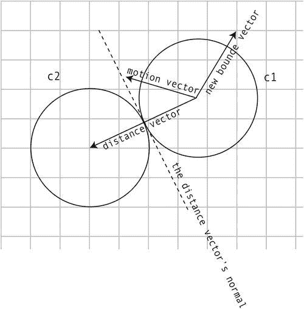

# 十二、附录 A：运动和碰撞检测的向量

你可能不知道，但在你的游戏中有一个看不见的世界，有看不见的力量在起作用，叫做**矢量**。它们使您的对象移动并检测碰撞，并帮助您创建真实世界物理对象的模拟。向量就像游戏宇宙中的原子和分子——一切都依赖于它们，但它们很难用肉眼看到。

在这个附录中，我们将揭开这个神秘领域的面纱，来检查这些视频游戏世界中最小但最重要的组件。借助一点简单的数学知识，矢量是解码游戏环境空间整体几何图形的关键。学习如何使用它们可以让你无限制地控制你的游戏。

如果可以随意控制重力、风、子弹轨迹、物理热力学定律，你会有什么感受？就像《黑客帝国》中的一个角色一样，你将在你自己的游戏世界中拥有那种力量。

什么是矢量？

矢量是直线。它们有起点和终点。图 A-1 展示了一个叫做 *v1* 的向量的例子。向量从 A 点开始，到 b 点结束。


图 A-1 。称为 v1(向量 1 的简写)的向量，有起点和终点

 **注意**在这个附录中，我将使用一个简单的命名约定来描述向量。矢量名称将以 *v* 加矢量编号开头，如 *v1* 、 *v2* 和 *v3* 。这将有助于保持代码紧凑。

定义一条线的两点能告诉我们什么？正如你在图 A-1 中看到的，向量告诉你它从哪里开始，在哪里结束，以及它指向的方向。这是矢量的两个定义特征:

*   长度(通常用更专业的术语**来指代)**
***   方向**

 **这听起来像是在游戏中有用的信息吗？你已经在使用这些信息了。叫*速度*！

*x* 和 *y* 组件

每当精灵移动时，它都会创建一个向量。向量是由精灵的垂直和水平速度创建的，更好地称为我们亲爱的朋友， **v x** 和 **v y** ，如图图 A-2 所示。


图 A-2 。当游戏对象移动时，它们的 vx 和 vy 属性描述了一个向量

任何移动的精灵都有水平速度( *vx* )和垂直速度( *vy* )。当这些速度结合在一起时，精灵会向某个方向移动。如果精灵的 *vx* 为 5，而 *vy* 为–5，它将看起来向右上方倾斜移动。当这种情况发生时，精灵会在它之前的位置和它的新位置之间创建一个不可见的向量。

这种由物体运动产生的矢量被称为**运动矢量** 。所以你一直在创造和使用向量，而自己却不知道！

值 *vx* 被称为矢量的 ***x*** **分量**。，而 *vy* 则是矢量的**y*分量*****。图 A-3 显示了 *vx* 和 *vy* 如何融入大画面。**

 **

图 A-3 。向量的 x 和 y 分量:vx 和 vy

你可以用 *vx* 和 *vy* 值来描述任何向量。实际上， *vx* 和 *vy* 值*都是*向量。你不需要更多的信息来有效地使用向量。

如果你知道向量的起点和终点，你可以用下面的简单公式计算出向量的 *vx* 和 *vy* 值:

```js
vx = b.x – a.x;
vy = b.y – a.y;
```

从终点 *x* 和 *y* 点数中减去起点 *x* 和 *y* 点数即可。

如果你只知道向量的 *vx* 和 *vy* 属性以及向量的起点，你可以使用这些公式计算出终点:

```js
b.x = a.x + vx;
b.y = a.y + vy;
```

看一下图 A-3 ，看看你是否能算出这些值是如何得到的。如果你一次只迈出一小步，这很容易。用简单的英语，它说:

*新位置(B 点)与旧位置(A 点)相同，加上速度(vx 和 vy)。*

有一种简写这个公式的方法。这看起来眼熟吗？

```js
x += vx;
y += vy;
```

这就是我们在这本书里用来移动精灵的东西！

你看到这些概念有多容易理解了吗？这只是基本的数学。

需要记住的一件非常重要的事情是，如果你有 vx 和 vy 属性，你就有一个向量。

矢量幅度

每个矢量都有长度。在几何学中，向量的长度被称为其**大小**。知道矢量的大小是很重要的，这样你就可以计算出物体有多远或者它们移动有多快。如果一个飞船精灵的运动矢量大小为 3，那么你知道它的速度是多少。你也可以使用这些信息来预测或解决与另一个物体的碰撞，你很快就会知道。

那么我们怎样才能知道一个矢量的大小呢？它是 A 点和 b 点之间的距离。借助于游戏设计者可靠的老备用工具——勾股定理，你可以很容易地计算出这一点:

```js
m = Math.sqrt(vx * vx + vy * vy);
```

我用变量名`m`来指代震级。图 A-4 说明了如何找到矢量的大小。


图 A-4 。用毕达哥拉斯定理求矢量的大小。数值已四舍五入

在一个游戏中，5.8 的星等可以告诉你宇宙飞船移动的速度。A 点是船的起始位置，B 点是它的终点位置，而星等是它的速度。在这个例子中，5.8 可能意味着飞船在一帧运动中(1/60<sup>th</sup>of second)移动了 5.8 个像素。)

或者你可以用星等来确定这艘船离敌人有多远。在这种情况下，A 点将是船，B 点将是敌人，数量级将代表他们之间的距离。

计算角度

知道矢量的角度通常很有用。一点简单的三角学就能帮你找到:

```js
angle = Math.atan2(vy, vx);
```

 **注意**对于`Math.atan2`方法，`y`属性是第一个参数，`x`属性是第二个参数。

这个公式给出一个弧度值。要计算角度的度数，将结果乘以 180 除以 PI (3.14)，如下所示:

```js
angle = Math.atan2(vy, vx) * 180 / Math.PI;
```

这也有有趣的另一面。如果你只有一个向量的角度和大小(长度)，你怎么能找到它呢？再多学一点三角学也会有所帮助:

```js
vx = m * Math.cos(angle);
vy = m * Math.sin(angle);
```

记住，你所需要的是计算任何向量的 vx 和 ??【vy 属性。有了这些结果，你就万事俱备了。有了 *vx* 和 *vy* ，你仍然有一个矢量，尽管它可能还没有一个具体的起点或终点。

这些公式是能够在矢量和角度之间切换的关键，正如你将在本附录中看到的，它们有无穷的效用。图 A-5 显示了它们的使用方法。


图 A-5 。找到一个向量的角度，并找到 vx 和 vy 值

矢量法线

向量隐藏了一个深刻的，黑暗的秘密。紧贴每个矢量底部的是两个不可见的、有点模糊的附加矢量，称为**法线**。

其中一条法线在向量的左边，另一条在向量的右边。它们与主向量完全垂直(成 90 度)。它们共同构成了矢量赖以存在的基础。图 A-6 展示了左右法线如何与主向量连接。法线定义了向量的“法线”方向。它们定义了矢量所站的地面，所以你总是知道在矢量的坐标系中哪个方向是“向上的”。


图 A-6 。左右法线垂直于主向量，有助于定义向量的坐标空间

左右法线也是向量。左法线是指向左边的向量，右法线指向右边。不管你想不想，每次你创建一个向量，你实际上是在创建三个向量:主向量和它的两个法线。法线与主向量的大小相同。它们有助于定义向量的坐标空间。

左法线由变量`lx`和`ly`表示。它们很容易计算:

```js
lx = vy;
ly = -vx;
```

如你所见，这只是主向量的 *vx* 和 *vy* 属性的 90 度扭曲。右法线是这样找到的:

```js
rx = -vy;
ry = vx;
```

一旦你找到了左右法线的`lx`、`ly`、`rx`和`ry`值，你就可以很容易地计算出其余的矢量信息。它们的起点(`a`)总是与主向量相同，所以你可以这样计算它们的终点(`b`):

```js
leftNormal.b.x = v1.a.x + lx;
leftNormal.b.y = v1.a.y + ly;
rightNormal.b.x = v1.a.x + rx;
rightNormal.b.y = v1.a.y + ry;
```

现在你有了两个全新的向量，如果你需要的话。您可以将本附录中的任何其他矢量计算应用于这些新矢量。

直观地理解这一切要容易得多，所以图 A-7 显示了所有这些值是如何找到的。请将这些信息放在手边，因为您很快就会用到它们。

为什么能够计算矢量的法线很重要？你很快就会看到，它们对于研究如何将物体从其他物体上弹开是必不可少的。


图 A-7 。计算法线

标准化向量

有时你需要知道矢量指向的方向。一个物体要去哪里？更重要的是，你能利用这些信息将其他物体导向同一方向吗？

这就是**标准化**向量的技术变得重要的地方。标准化向量有明确的方向，但是它们的大小缩放为 1，这是向量的最小大小。如果你先把向量做得尽可能小，你就可以很容易地把它放大到任何大小，并保持完美的比例。

归一化向量由变量名`dx`和`dy`表示，它们是这样找到的:

```js
dx = vx / m;
dy = vy / m;
```

你只需用矢量的大小来除 vx 和 ?? 和 vy。结果是一个长度为 1 的非常小的向量。在游戏中，它将是单个像素的大小。图 A-8 说明了这是如何工作的。


图 A-8 。标准化向量以帮助将其缩放到不同的大小

 **注意**不要混淆**正常化**和**向量法线**。非常令人困惑(而且是令人困惑！)，它们是两个完全分开的东西。法线是垂直于主向量的向量。归一化是一种用于缩放矢量的技术。

归一化向量也被称为**单位向量** ，因为它们的大小是 1，这是向量可以是最小的可能的完整单位。您可以使用单位向量将向量缩放到任何大小，可以更大也可以更小。你有没有想过爱丽丝喝的那个瓶子里有什么神奇的成分？这是一个单位矢量！

归一化的向量没有任何起点和终点，所以你可以把它想象成只是挂在空间里，等着有人告诉它该做什么。但最重要的是，归一化得到的 *dx* 和 *dy* 值对于计算矢量的方向很有用。

 **提示***dx*和 *dy* 中的 *d* 是什么意思？它代表 delta，在数学中经常用来表示一个值发生了变化。它通常用来表示一个大的值已经减少到一个较小的值。按照惯例， *dx* 和 *dy* 用于表示归一化的 *vx* 和 *vy* 值。

在计算单位向量时，有一个小细节需要注意。如果幅度、 *vx、*或 *vy* 值有可能为零，则公式将返回`NaN`(不是数字。)为了避免这种情况，给`dx`和`dy`默认值 0，以防万一:

```js
dx = vx / m || 0;
dy = vy / m || 0;
```

被零除在计算机编程中总是一件坏事——它会导致各种难以发现的错误。

加减向量

你可以把矢量想象成力。一个大小为 5 的向量是一个使你的飞船每帧移动 5 个像素的力。有时候在一个游戏中，你会有不止一个力作用在一个物体上。也许是重力把你的飞船往下拉，风把它推向右边。您可以创建重力和风的向量，然后将这些向量添加到船的运动向量中或从中减去，以找到船的新方向。

让我们以重力为例。假设你有一个宇宙飞船精灵，它的运动向量的大小为 5。然后想象在你的游戏中有一个重力矢量，大小为 2。如果重力作用在你的飞船上，你想从 5 中减去 2 来找到飞船新的运动矢量，它将是 3。

在大多数情况下，减去矢量的大小是没有用的，因为仅仅是大小并不能告诉你矢量的方向。相反，你需要在两个独立的计算中减去向量的 *vx* 和 *vy* 值。这非常容易做到。

举个例子，想象你有一艘宇宙飞船在一个平坦的行星表面上盘旋。y 轴上的重力将船往下拉。如果重力是 2，你可以这样描述重力的 *vx* 和 *vy* 属性:

```js
gravityVx = 0;
gravityVy = 2;
```

记住:*如果你有一个 vx 和一个 vy 值，你就有一个向量*。它可能没有起点和终点，但它仍然是一个向量。在这种情况下，重力只作用在 *y* 轴上，所以不需要 *vx* 的值。

以下是如何将重力添加到船的运动矢量中:

```js
ship.vy += gravityVy;
```

如果这艘船开始时的 vy 为-5，那么它现在的新值就是-3。这将在下一帧把船拉下来。图 A-9 和 A-10 说明了这种矢量加法是如何工作的。


图 A-9 。当你把一个重力矢量和船的运动矢量结合起来会发生什么？在这个例子中，船的 vy 值是–5，重力向量是+2


图 A-10 。当这两个矢量相加时，就会产生一个新的矢量，它将它们的力结合在一起。这将飞船拉向行星表面

当你以这种方式将向量相加时，结果是一个新的向量。这是重力向下的拉力和船向上的推力的结合。如你所见，数学非常简单，但它非常准确地描述了现实世界中发生的事情。

缩放矢量

在我们简单的重力例子中，船在 *y* 轴上被拉下。这在平台或弹球游戏中没有问题，因为“向下”是屏幕的底部。但是假设你的宇宙飞船正在环绕一颗行星呢？哪条路是向下的？看看图 A-11 ，看你能不能搞清楚。


图 A-11 。要把宇宙飞船拉向一个圆形星球，重力必须同时作用于 x 轴和 y 轴

看着这张图，我会想到两件事:

*   飞船需要知道星球的中心在哪里。
*   为了将飞船移向行星的中心，重力必须作用在 x 轴和 y 轴上。

让我们把目前为止我们所知道的关于向量的所有东西放在一起来解决这个问题。在本章的源文件中运行`gravity.html`得到一个利用重力绕行星运行的宇宙飞船的工作示例，如图图 A-12 所示。


图 A-12 。使用向量来模拟重力

使用键盘左右键旋转船只，使用向上箭头键使船只前进(你在第六章中学会了如何做)。这是在一个非常真实的重力模拟中把船拉向行星的代码。你可以看到它使用了你到目前为止学过的大部分向量数学:

```js
//1\. Create a vector between the planet and the ship
let vx = planet.x - ship.x,
    vy = planet.y - ship.y;

//2\. Find the vector's magnitude
let m = Math.sqrt(vx * vx + vy * vy);

//3\. Normalize the vector
let dx = vx / m,
    dy = vy / m;

//4\. Create the gravity vector. Do this by scaling the vector
//between the planet and the ship to a tiny
//fraction of its original size
let gravityVx = dx * 0.05,
    gravityVy = dy * 0.05;

//5\. Apply the new gravity vector to the ship's motion vector
ship.vx += gravityVx,
ship.vy += gravityVy;

//6\. Apply the ship's velocity to its position to make the ship move
ship.x += ship.vx;
ship.y += ship.vy;
```

让我们来看看这是如何工作的。

代码首先计算飞船和行星之间的矢量(`vx`和`vy`)。然后计算出大小(`m`)并计算出单位矢量(`dx`和`dy`)。)图 A-13 显示了如何从原始的飞船到行星矢量计算出`dx`和`dy`。


图 A-13 。在飞船和星球之间创建一个向量。找到它的`dx`和 *dy* 值，这告诉你矢量的方向

重力矢量通过将单位矢量(`dx`和`dy`)缩小到其原始尺寸的二十分之一来计算:

```js
let gravityVx = dx * 0.05,
    gravityVy = dy * 0.05;
```

这产生了一个非常小的矢量，但是在规模上与行星和船之间的原始矢量完全相等。它从飞船的中心直接指向星球的中心。

最后，将这个重力矢量应用于船的运动矢量:

```js
ship.x += ship.vx;
ship.y += ship.vy;
```

飞船会很自然地被拉向星球的中心，不管它在星球的哪一边。图 A-14 显示了这一新的重力矢量是如何影响船的位置的。将其与图 A-13 进行比较，查看差异。


图 A-14 。给飞船的运动矢量增加重力会把它推向行星

真实重力

您可能已经注意到，我们的宇宙飞船示例有一个小问题。无论飞船离行星多远，重力都是一样的。在太空中，物体之间的引力随着它们的远离而减弱。此外，质量大的大物体比小物体有更大的引力。我们可以实现一个更真实的引力系统，只需要稍微调整一下。

首先，创建一些代表行星和飞船质量的值。您使用的值将取决于试错法，但以下值在此示例中效果很好:

```js
ship.mass = 1;
planet.mass = 10;
```

然后使用以下公式计算重力矢量:

```js
let gravityVx = dx * (planet.mass * ship.mass) / m,
    gravityVy = dy * (planet.mass * ship.mass) / m;
```

如果您添加几个不同质量和初始速度的行星，您可以使用这种技术创建一个复杂的、基于重力的、具有现实物理的太空探索游戏。开始构建自己的宇宙吧！

点积

使用矢量时，一个有用的值是**点积**。点积告诉你两个矢量是指向同一个方向还是相反的方向。

想象你有两个向量`v1`和`v2`。您可以使用以下语法找到它们的点积:

```js
dotProduct = v1.vx * v2.dx + v1.vy * v2.dy
```

如果点积为正，向量指向相同的方向。如果点积为负，则向量相互背离。这些看似无用的信息实际上可以给你一个强有力的描述，说明你的游戏对象彼此之间的关系，并且它形成了复杂的碰撞和边界检测的基础。

运行*boundary.html*文件，获得如何使用点积创建环境边界的工作示例。让飞船飞过对角线。如果船的中心在线的左侧，线的颜色是黄色。如果船在线的右边，线变成红色。文本子画面在屏幕顶部显示点积的当前值。您会注意到，一旦点积从正数变为负数，线条颜色就会改变。图 A-15 显示了你将会看到的。


图 A-15 。当宇宙飞船越过这条线时，点积从正变为负

在这个例子中，你可以看到的另一个重要特征是，点积还可以告诉你船的中心距离直线有多少像素。正如您将在本附录的后面看到的，这个数字将被证明对碰撞检测和反应非常有用。

下面是游戏循环中产生这种效果的代码:

```js
//1\. Get a vector between the center of the ship and the start point of the line
let v1 = {};
v1.vx = boundary.ax - ship.centerX;
v1.vy = boundary.ay - ship.centerY;

//2\. Get the boundary line's vector and magnitude
let v2 = {};
v2.vx = boundary.bx - boundary.ax;
v2.vy = boundary.by - boundary.ay;
v2.m = Math.sqrt(v2.vx * v2.vx + v2.vy * v2.vy);

//3\. Figure out the line vector's left normal
v2.ln = {};
v2.ln.vx = v2.vy;
v2.ln.vy = -v2.vx;

//4\. Get the left normal's unit vector (dx and dy)
v2.ln.dx = v2.ln.vx / v2.m;
v2.ln.dy = v2.ln.vy / v2.m;

//5\. Get the dot product between v1 and v2's left normal
let dotProduct = v1.vx * v2.ln.dx + v1.vy * v2.ln.dy;

//If the dot product is positive, make the line yellow,
//if it's negative, make the line red
if (dotProduct > 0) {
  boundary.strokeStyle = "yellow";
} else {
  boundary.strokeStyle = "red";
}

//Display the value of the dot product
message.content = `Dot product: ${dotProduct}`;
```

代码做的第一件事是在船的中心点和线的起点之间创建一个名为`v1`的向量。然后在直线的起点和终点之间创建另一个向量，名为 *v2* 。图 A-16 展示了这两个向量。


图 A-16 。创建两个向量

然后代码计算 *v2* 的左法线，如图图 A-17 所示。


图 A-17 。这条线是左法线

然后，代码通过将左法线转换为单位向量来缩小它:

```js
v2.ln.dx = v2.ln.vx / v2.m;
v2.ln.dy = v2.ln.vy / v2.m;
```

最后，代码找到`v1`和左法线的单位向量之间的点积:

```js
let dotProduct = v1.vx * v2.ln.dx + v1.vy * v2.ln.dy;
```

这就是我们需要的神奇数字。如果点积为正，则船在线的左侧；如果是负的，船就在右边。

垂直点积

你可以使用的另一个有趣的值是**垂直点积**。它与普通的点积完全相同，除了在等式中不使用`v1`，而是使用`v1`的法线:*垂直*向量。(可以用左法线，也可以用右法线；这无关紧要)垂直点积有时被称为**垂直点积**或**垂直点积**。以下是找到它的方法。

```js
perpProduct = v1.ln.vx * v2.dx + v1.ln.vy * v2.dy;
```

让我们看看如何用这个来计算两个向量的交点。运行`intersection.html`文件获得一个工作示例。将飞船对准这条线，朝它飞去。你会注意到一个白色的圆形目标出现在这条线上的*点，正好是船与这条线相交的*点。图 A-18 展示了你将会看到的东西。当你看到它的运行时，你会觉得有点恐怖，但这只是数学！


图 A-18 。圆形目标预测船将在哪里撞线

这是游戏循环中完成这一切的代码。

```js
//1\. Get the ship's motion vector and left normal
let v1 = {};
v1.vx = ship.vx;
v1.vy = ship.vy;
v1.ln = {};
v1.ln.vx = v1.vy;
v1.ln.vy = -v1.vx;

//2.Figure out the motion vector's start and end points
v1.ax = ship.centerX;
v1.ay = ship.centerY;
v1.bx = v1.ax + v1.vx;
v1.by = v1.ay + v1.vy;

//3\. Get the boundary line's vector, magnitude, and unit vector
let v2 = {};
v2.vx = boundary.bx - boundary.ax;
v2.vy = boundary.by - boundary.ay;
v2.m = Math.sqrt(v2.vx * v2.vx + v2.vy * v2.vy);
v2.dx = v2.vx / v2.m;
v2.dy = v2.vy / v2.m;

//4\. Get a vector between v1 (the ship's motion vector)
//and the start point of the line. Get its left normal
let v3 = {};
v3.vx = boundary.ax - v1.ax;
v3.vy = boundary.ay - v1.ay;
v3.ln = {};
v3.ln.vx = v3.vy;
v3.ln.vy = -v3.vx;

//5\. Find the perpendicular dot product of v3 and v2
let perpProduct1 = v3.ln.vx * v2.dx + v3.ln.vy * v2.dy;

//6\. Find the perpendicular dot product of v1 and v2
let perpProduct2 = v1.ln.vx * v2.dx + v1.ln.vy * v2.dy;

//7\. Find the ratio between perpProduct1 and perpProduct2
let t = perpProduct1 / perpProduct2;

//8\. Find the intersection point on the boundary line
let intersectionX = v1.ax + v1.vx * t,
    intersectionY = v1.ay + v1.vy * t;

//9\. Set the circular target sprite to the intersection point
//(You only want to do this if the intersection point falls
//between the starting and ending points of the line)
if (intersectionX > boundary.ax
    && intersectionX < boundary.by
    && intersectionY > boundary.ay
    && intersectionY < boundary.by
) {
  target.x = intersectionX - target.halfWidth;
  target.y = intersectionY - target.halfWidth;
}
```

代码计算三个向量:船的运动向量、边界线的向量以及船的运动向量和边界线之间的向量。图 A-19 显示了这些向量的位置。


图 A-19 。使用三个向量来帮助找到交点

然后，代码通过计算 *v2* 和其他两个向量之间的垂直点积来计算交点，然后获得它们之间的比率:

```js
let perpProduct1 = v3.ln.vx * v2.dx + v3.ln.vy * v2.dy;
let perpProduct2 = v1.ln.vx * v2.dx + v1.ln.vy * v2.dy;
let t = perpProduct1 / perpProduct2;
```

(注意`t`代表*切线*——交点。)

然后使用该比率`t`来寻找线上交叉点的像素位置。该点通过将船的运动矢量乘以比率来找到:

```js
let intersectionX = v1.ax + v1.vx * t,
    intersectionY = v1.ay + v1.vy * t;
```

这段代码实际上是从船的中心到船将要穿过的那一点画了一条线。

`intersectionX`和`intersectionY`现在告诉你交点在画布上的像素位置值。您可以使用这些值在该点定位任何其他精灵。在这个例子中，一个名为`target`的圆形精灵被移动到那个位置。然而，你只需要移动`target`如果交点恰好落在直线上，而不是超出它的起点和终点。一个`if`语句在定位`target`精灵之前检查这一点。

```js
if (intersectionX > boundary.ax
    && intersectionX < boundary.by
    && intersectionY > boundary.ay
    && intersectionY < boundary.by
) {
  target.x = intersectionX - target.halfWidth;
  target.y = intersectionY - target.halfWidth;
}
```

 **注意**所有矢量最终都会相交，除非它们是平行的。如果两个向量的`dx`和`dy`值完全相同，则这两个向量平行。

现在你知道了如何使用向量来创建一个环境边界，让我们来看看如何防止精灵越过它。

与线碰撞

运行`line` `Collision.html` 文件，获取如何使用直线作为碰撞边界的工作示例。让飞船从左到右飞入这条线——你会发现，无论你如何努力，你都无法飞过这条线。该线为实心碰撞边界，如图 A-20 所示。


图 A-20 。你不能飞过这条线

这是游戏循环中实现这一点的所有代码——我将在列表后解释它到底做了什么。

```js
//1\. Get the ship's motion vector and magnitude
let v1 = {};
v1.vx = ship.vx;
v1.vy = ship.vy;
v1.m = Math.sqrt(v1.vx * v1.vx + v1.vy * v1.vy);

//2\. Find the unit vector
v1.dx = v1.vx / v1.m || 0;
v1.dy = v1.vy / v1.m || 0;

//3\. Get the boundary line's vector, unit vector, left normal,
//and left normal unit vector
let v2 = {};
v2.ax = boundary.ax;
v2.ay = boundary.ay;
v2.bx = boundary.bx;
v2.by = boundary.by;
v2.vx = v2.bx - v2.ax;
v2.vy = v2.by - v2.ay;
v2.m = Math.sqrt(v2.vx * v2.vx + v2.vy * v2.vy);
v2.dx = v2.vx / v2.m || 0;
v2.dy = v2.vy / v2.m || 0;
v2.ln = {};
v2.ln.vx = v2.vy;
v2.ln.vy = -v2.vx;
v2.ln.dx = v2.ln.vx / v2.m || 0;
v2.ln.dy = v2.ln.vy / v2.m || 0;

//4\. Get a vector between the starting point of
//the ship's motion vector and the starting point of the line
let v3 = {};
v3.vx = v2.ax - ship.centerX;
v3.vy = v2.ay - ship.centerY;

//5\. You need two dot products.
//The first tells you whether the ship is
//between the starting and ending points of the line
let dp1 = v3.vx * v2.dx + v3.vy * v2.dy;

//The second dot product tells you if the ship has crossed the line
let dp2 = v3.vx * v2.ln.dx + v3.vy * v2.ln.dy;

//6\. Check to see if the ship is within the vector's scope
if(dp1 > -v2.m && dp1 < 0) {

  //7\. Check if the ship's motion vector has crossed the line from right to left
  if(dp2 <= 0) {

    //8\. Find the collision vector
    let collisionVx = v1.dx * Math.abs(dp2),
        collisionVy = v1.dy * Math.abs(dp2);

    //9\. Move the ship out of the collision
    ship.x -= collisionVx;
    ship.y -= collisionVy;

    //10\. Set the ship's velocity to zero
    ship.vx = 0;
    ship.vy = 0;
  }
}
```

代码首先创建三个向量:船的运动向量，一个表示直线的向量，以及在船的中心和直线的起点之间的第三个向量。然后它计算两个点积。第一个点积告诉你船是否在线的起点和终点之间。如果`dp1`大于`v2`的负值，并且小于`0`，那么你知道船在线的点之间，代码应该检查碰撞。

```js
let dp1 = v3.vx * v2.dx + v3.vy * v2.dy;
if(dp1 > -v2.m && dp1 < 0) {
  //The ship is within the start and end points of the line
}
```

第二个点积用于检查船是否从左向右过线。如果点积变成负值，你就知道这是真的:

```js
let dp2 = v3.vx * v2.ln.dx + v3.vy * v2.ln.dy;
if(dp2 <= 0) {
  //The ship has crossed the line from left to right
}
```

当船越线时，计算**碰撞矢量** 。碰撞向量告诉你船越过这条线多少像素:

```js
let collisionVx = v1.dx * Math.abs(dp2),
    collisionVy = v1.dy * Math.abs(dp2);
```

例如，如果船越过这条线 4 个像素，点积将是–4。如果你把这个数字乘以船的运动矢量的`dx`和`dy`，你最终会得到一个很小的矢量，这个矢量描述了船有多越线。这就是碰撞矢量。

您可以通过将船移回线上来解决冲突。你可以通过从船的位置减去碰撞矢量来实现。

```js
ship.x -= collisionVx;
ship.y -= collisionVy;
```

这使船准确地处于直线上。


最后，将船的速度设置为 0:

```js
ship.vx = 0;
ship.vy = 0;
```

这使得碰撞看起来更精确，因为在碰撞被解决后，防止船继续试图越过该线。

线的另一边

您刚才看到的示例代码只有在船从左向右穿过这条线时才有效。如果您想从右向左检查碰撞，颠倒`v2`的起点和终点:

```js
v2.ax = boundary.bx;
v2.ay = boundary.by;
v2.bx = boundary.ax;
v2.by = boundary.ay;
```

你也知道如果`dp2`是正的，船在这条线的右边，如果是负的，船在左边。如果你的游戏需要，你可以使用这些信息来创建一个更复杂的线碰撞系统，让船绕着线飞行并在两边碰撞。

活力

在前面的例子中，宇宙飞船在撞线时完全静止了。但是在大多数游戏中，你可能希望船以一定的角度弹开。借助于一种叫做**投影** 的技术，我们可以很容易地添加一个反弹效果。

当您将一个向量叠加到另一个向量的坐标系上时，就会发生投影。想象你正站在人行道上。这是一个阳光明媚的日子，太阳在你身后把你的影子投射在水泥地上。你的影子是你在人行道上的投影。如果你把自己想象成一个矢量，把人行道想象成另一个矢量，那么你的影子就是第三个矢量。它有很多你的品质，但是符合人行道的坐标系。

一个投影就是这样:*向量在另一个向量*上的影子。图 A-21 显示了`v1`投射到`v2`上的两个例子。投影本身变成了一个新的矢量。


图 A-21 。投影是向量在其他向量上的阴影。在这个图中，粗黑线是 *v1* 到 *v2* 的投影

在这个例子中，将`v1`投影到`v2`上的数学非常简单。首先，求`v1`和`v2`的点积:

```js
dotProduct = v1.vx * v2.dx + v1.vy * v2.dy
```

然后将点积乘以`v2`的`dx`和`dy`，得到投影向量:

```js
projectionVx = dotProduct * v2.dx;
projectionVy = dotProduct * v2.dy;
```

仅此而已；你有你的投影向量！但是投影有什么用呢？

弹跳！当精灵碰到一条有角度的线时，它需要以正确的角度弹开。这就是投射技术拯救世界的地方。让我们来看看使物体弹跳的一般过程。

首先，我们需要将精灵的运动矢量与它碰撞的线的角度结合起来。第一步是将`v1`投影到`v2`和`v2`的法线上。图 A-22 对此进行了说明。(在这个例子中，投影向量被称为`p1`和`p2`。)


图 A-22 。将 *v1* 投射到 *v2* 和 *v2* 上正常

接下来，*反转*的`p2`向量。我们希望我们的碰撞对象反弹，因此反转该投影将创建一个与碰撞力直接相反的力。要反转一个向量，只需将它的`vx`和`vy`值乘以-1。然后将两个投影向量的`vx`和`vy`值相加。这给了你一个新的**反弹向量** 。图 A-23 对此进行了说明。


图 A-23 。反转 *p2* 并将投影加在一起，创建一个新的反弹向量

最后一步是将这个新的反弹向量应用到碰撞精灵的速度(`v1`)。不管线条的角度如何，精灵都会以正确的角度弹开。将图 A-23 中的反弹向量与图 A-24 中的反弹向量进行比较，您会发现这是完全相同的向量。它使精灵正确地反弹！


图 A-24 。将新的反弹向量指定给对象的速度

现在让我们把这些理论转化成代码。运行`lineBounce.html`文件来看看这是怎么回事。将飞船飞入线中，飞船会以正确的角度弹开，如图图 A-25 所示。


图 A-25 。任何角度都能完美弹跳

大部分代码与前面的示例相同。唯一增加的是内部嵌套的`if`语句中的以下几行。他们计算出投影，创建反弹向量，并将反弹向量添加到船的速度中:

```js
//Find the dot product of v1 and v2
let dp3 = v1.vx * v2.dx + v1.vy * v2.dy;

//Find the projection of v1 onto v2
let p1Vx = dp3 * v2.dx,
    p1Vy = dp3 * v2.dy;

//Find the dot product of v1 and v2's normal (v2.ln)
let dp4 = v1.vx * v2.ln.dx + v1.vy * v2.ln.dy;

//Find the projection of v1 onto v2's normal (v2.ln)
let p2Vx = dp4 * v2.ln.dx,
    p2Vy = dp4 * v2.ln.dy;

//Reverse the projection on v2's normal by multiplying it by –1.
//This is what creates the bounce effect
p2Vx *= -1;
p2Vy *= -1;

//Add up the projected vectors' vx and vy values
//to create a new bounce vector
let bounceVx = p1Vx + p2Vx,
    bounceVy = p1Vy + p2Vy;

//Finally, assign the bounce vector to the spaceship's velocity.
//Add an optional damping value
ship.vx = bounceVx * 0.8;
ship.vy = bounceVy * 0.8;
```

这使得船弹跳起来！

你可以在最后一行看到反弹向量被乘以 0.8。这减少了 20%的反弹力，模拟了船撞线时的能量损失。或者，您可以将反弹向量乘以另一个数字，以放大或减弱反弹效果。大于 1 的数字将使反弹力比原始碰撞力更强大，从而产生蹦床效果。0 表示根本没有反弹。

弹跳解决！

圆形碰撞

恭喜你，你刚刚从向量数学训练营毕业！现在让我们看看如何使用我们新的矢量技能来解决一些真正有趣的碰撞问题。首先:圈与圈之间的碰撞。圆形碰撞分为三类:

*   通用圆形碰撞检测。
*   运动圆和静止圆之间的反应碰撞。
*   运动圆之间的反应碰撞。

让我们首先考虑最容易解决的问题:检测任意两个圆之间的碰撞。

通用圆形碰撞检测

在本书中，我们使用了一个名为`hitTestCircle`的函数来确定两个圆形精灵是否接触:

```js
hitTestCircle(sprite1, sprite2)
```

将它与任何具有`radius`属性的 sprite 一起使用。如果圆接触，它返回`true`。

下面是来自`library/collision.js`文件的`hitTestCircle`函数来完成这项工作。它首先在每个圆形精灵的中心点之间绘制一个矢量(`c1`和`c2`)。如果这个向量的大小小于两个圆的半径之和，那么你知道这两个圆接触了。

```js
export function hitTestCircle(c1, c2, global = false) {

  let vx, vy, magnitude, combinedRadii, hit;

  //Calculate the vector between the circles' center points
  if(global) {

    //Use global coordinates
    vx = (c2.gx + c2.radius) - (c1.gx + c1.radius);
    vy = (c2.gy + c2.radius) - (c1.gy + c1.radius);
  } else {

    //Use local coordinates
    vx = c2.centerX - c1.centerX;
    vy = c2.centerY - c1.centerY;
  }

  //Find the distance between the circles by calculating
  //the vector's magnitude
  magnitude = Math.sqrt(vx * vx + vy * vy);

  //Add together the circles' combined radii
  combinedRadii = c1.radius + c2.radius;

  //Set `hit` to `true` if the distance between the circles is
  //less than their ` combinedRadii `
  hit = magnitude < combinedRadii;

  //`hit` will be either `true` or `false`
  return hit;
};
```

图 A-26 展示了这是如何工作的。


图 A-26 。当两个圆之间的矢量小于它们的组合半径时，就会发生碰撞

下一步是通过在圆接触时将它们分开来产生碰撞反应。

运动圆和静止圆之间的反应碰撞

当两个圆相撞时，你如何将它们分开？根据碰撞中的一个或两个圆是否在移动，您使用的代码略有不同。我们先来看看如何处理运动圆(`c1`)和静止圆(`c2`)的碰撞。

首先，找出圆圈重叠的程度。从圆的组合半径中减去圆之间的距离矢量的大小，就可以算出这一点。

```js
overlap = combinedRadii - magnitude;
```

图 A-27 说明了如何找到这个重叠值。


图 A-27 。找出重叠的数量

接下来，归一化距离向量以找到其`dx`和`dy`值:

```js
dx = vx / magnitude;
dy = vy / magnitude;
```

将`dx`和`dy`值乘以`overlap`值，并从移动圆的`x`和`y`位置中减去这些新值。

```js
c1.x -= overlap * dx;
c1.y -= overlap * dy;
```

这给了你一个非常清晰的圆圈之间的分离。图 A-28 说明了该代码是如何工作的。


图 A-28 。使用重叠值将圆移出碰撞

量子填充

这种数学在完美的实验室环境下工作良好。想想干净的房间，白色的实验服和本生灯。但不幸的是，视频游戏编程的世界要混乱得多。想想睡衣、披萨和宿醉。我们的编程世界充满了浮点舍入误差、速度峰值、复杂的碰撞环境、许多碰撞的对象在周围推挤，以及以不同顺序更新的精灵位置。在一些极端情况下，这种精确的数学并不总是转化为屏幕上的无缝碰撞。为了消除任何潜在的数学尖峰，我喜欢在碰撞圆周围添加一点我称之为**的量子填充** 。量子填充只是一个额外的、微小的值，它被添加到重叠值中，以便碰撞的精灵比纯数学认为它们应该分离的稍微多一点。

要实现量程填充，可以在`overlap`值上加一个任意的小数字。0.3 通常工作良好:

```js
let quantumPadding = 0.3;
overlap += quantumPadding;
```

填充物在圆圈之间增加了微小的空间，以降低它们的表面张力，使它们更滑。值 0.3 是一个很好的起点，但是您可能需要根据您想要的确切行为稍微修改它。填充太少，碰撞的圆会有粘性；太多了，如果挤在一起，它们会开始抖动。

量子填充纯粹是我自己的发明。经过多年的实验，我开始添加它，以改善某些碰撞的美学外观。在现实世界中，原子粒子和表面从来没有真正接触过；所有粒子在发生物理接触之前，都被相互推开的量子力分开。量子填充模拟了这些力，它似乎对圆形碰撞很有效。

`circleCollision`功能

在本书中，我们一直在使用`circleCollision`函数来使一个移动的圆从一个静止的圆上反弹。下面是实现所有这些理论的完整的`circleCollision`函数。你会注意到，如果`bounce`参数是`true`，另一个名为`bounceOffSurface`的函数被调用。我将在下一节解释这是如何工作的。

```js
export function circleCollision(c1, c2, bounce = false, global = false) {

  let magnitude, combinedRadii, overlap,
      vx, vy, dx, dy, s = {},
      hit = false;

  //Calculate the vector between the circles' center points

  if(global) {

    //Use global coordinates
    vx = (c2.gx + c2.radius) - (c1.gx + c1.radius);
    vy = (c2.gy + c2.radius) - (c1.gy + c1.radius);
  } else {

    //Use local coordinates
    vx = c2.centerX - c1.centerX;
    vy = c2.centerY - c1.centerY;
  }

  //Find the distance between the circles by calculating
  //the vector's magnitude
  magnitude = Math.sqrt(vx * vx + vy * vy);

  //Add together the circles' combined half-widths
  combinedRadii = c1.radius + c2.radius;

  //Figure out if there's a collision
  if (magnitude < combinedRadii) {

    //Yes, a collision is happening
    hit = true;

    //Find the amount of overlap between the circles
    overlap = combinedRadii - magnitude;

    //Add some "quantum padding"
    let quantumPadding = 0.3;
    overlap += quantumPadding;

    //Normalize the vector
    //These numbers tell us the direction of the collision
    dx = vx / magnitude;
    dy = vy / magnitude;

    //Move circle 1 out of the collision by multiplying
    //the overlap with the normalized vector and subtract it from
    //circle 1's position
    c1.x -= overlap * dx;
    c1.y -= overlap * dy;

    //Bounce
    if (bounce) {

      //Create a collision vector object, `s`, to represent the bounce "surface".
      //Find the bounce surface's x and y properties
      //(This represents the normal of the distance vector between the circles)
      s.x = vy;
      s.y = -vx;

      //Bounce c1 off the surface
      //(I’ll explain this ahead)
      bounceOffSurface(c1, s);
    }
  }
  return hit;
}
```

弹跳圈

有一个技巧可以让圆圈以正确的角度弹开。假设圆碰到了由它们之间的距离向量的法线创建的虚拟墙。你所需要做的就是将`c1`的运动向量反弹到这面假想的墙上。这与我们在本附录前面看到的，解决让宇宙飞船反弹到直线上的方法是一样的。唯一的区别是，我们看不到圆圈反弹的线；它只是数学上的存在。图 A-29 显示了由距离矢量的法线创建的虚拟墙如果可见的话会是什么样子(图中的虚线)。



图 A-29 。将圆反弹到由距离向量的法线创建的虚拟墙壁(虚线)上

如果你能从一条线上弹开一个点，你就能从其他任何东西上弹开任何东西——这都是同一个问题。这意味着创建一个通用的反弹函数是有意义的，你可以使用点，线，圆和矩形。同样的反弹函数可以适用于所有这些元素。在`library/collision.js`文件中，你会找到一个名为`bounceOffSurface` 的函数来完成这个任务。下面是来自`circleCollision`函数的代码如何使用`bounceOffSurface`将圆弹开。

```js
//Create a vector to represent the bounce surface
let s = {};

//Set the surface vector's x and y properties to the
//distance vector's left normal
s.x = vy;
s.y = -vx;

//Bounce c1 (the moving circle) off the surface
bounceOffSurface(c1, s);
```

这是创建反弹效果的完整的`bounceOffSurface`函数。你会看到代码使用了所有相同的矢量技术来制作一个物体反弹，就像我们在本附录前面看到的那样。如果碰撞中的精灵有一个`mass`属性，该值将用于减弱反弹效果。(在这段代码中，变量`o`代表“对象”。它可以是任何具有 *x* 、 *y* 、 *vx* 和 *vy* 属性的对象，比如精灵。)

```js
function bounceOffSurface(o, s) {
  let dp1, dp2,
      p1 = {},
      p2 = {},
      bounce = {},
      mass = o.mass || 1;

  //1\. Calculate the collision surface's properties

  //Find the surface vector's left normal
  s.lx = s.y;
  s.ly = -s.x;

  //Find its magnitude
  s.magnitude = Math.sqrt(s.x * s.x + s.y * s.y);

  //Find its normalized values
  s.dx = s.x / s.magnitude;
  s.dy = s.y / s.magnitude;

  //2\. Bounce the object (o) off the surface (s)

  //Find the dot product between the object and the surface
  dp1 = o.vx * s.dx + o.vy * s.dy;

  //Project the object's velocity onto the collision surface
  p1.vx = dp1 * s.dx;
  p1.vy = dp1 * s.dy;

  //Find the dot product of the object and the surface's left normal (s.lx and s.ly)
  dp2 = o.vx * (s.lx / s.magnitude) + o.vy * (s.ly / s.magnitude);

  //Project the object's velocity onto the surface's left normal
  p2.vx = dp2 * (s.lx / s.magnitude);
  p2.vy = dp2 * (s.ly / s.magnitude);

  //Reverse the projection on the surface's left normal
  p2.vx *= -1;
  p2.vy *= -1;

  //Add up the projections to create a new bounce vector
  bounce.x = p1.vx + p2.vx;
  bounce.y = p1.vy + p2.vy;

  //Assign the bounce vector to the object's velocity
  //with optional mass to dampen the effect
  o.vx = bounce.x / mass;
  o.vy = bounce.y / mass;
}
```

你可以使用`bounceOffSurface`从任何表面反弹任何精灵。只要识别或创建一个表面向量，然后找到一个具有 *x* 、 *y* 、 *vx* 和 *vy* 属性的精灵，你可以用它来反弹。

运动圆之间的反应碰撞

在像台球或弹珠这样的游戏中，你需要两个圆圈在碰撞中做出反应。当圆碰撞时，每个圆将其运动力传递给另一个圆。

当碰撞发生时，你需要分离圆，然后计算出它们新的反弹速度。这些是我们在前面的例子中看到的相同的概念。然而，当两个圈都在运动时，有一些重要的区别:

*   **分离** :如果一个圆在运动，而另一个不动，在碰撞中很容易将它们分离。在本章的第一个例子中，我们通过简单地将运动圆定位在静止圆的边界上来实现这一点。但是当两个圈都在运动时，边界在哪里呢？你需要找到一个折中的位置:按比例分开。幸运的是，一个非常简单的公式可以帮助我们做到这一点。
*   **反弹**:当移动的圆圈碰撞时，它们新的反弹向量不仅取决于碰撞的角度，还取决于另一个圆圈撞击它的力度。这些圆需要相互传递它们的运动矢量。同样，这里没有什么大的惊喜，您已经拥有了解决方案所需的工具。

首先，计算出圆圈重叠的程度。

```js
overlap = combinedRadii - magnitude;
```

接下来，创建一个碰撞向量。这将为我们提供分离圆所需的`vx`和`vy`值。这个矢量必须分成两半，这样我们就可以在两个圆之间共享它。一半去第一圈，另一半去第二圈。

```js
dx = vx / magnitude;
dy = vy / magnitude;

vxHalf = Math.abs(dx * overlap / 2);
vyHalf = Math.abs(dy * overlap / 2);
```

`vx`和`vy`值需要是绝对值(没有加号或减号)。我们需要这些值是中性的，因为我们希望能够灵活地决定是将这个向量添加到每个圆的位置还是从每个圆的位置减去这个向量(您将在下一步中看到如何操作)。图 A-30 说明了这些计算是如何发现的。


图 A-30 。求碰撞向量，一分为二，求绝对

下一个问题是:第一个圆是在第二个圆的上面、下面、右边还是左边？我们需要知道这一点，以便我们可以正确地增加或减少每个圆的位置重叠矢量。跟踪它的最简单的方法是创建赋值为 1 或–1 的变量，这取决于圆之间的相对位置。下面是一些简洁的 JavaScript 语法，可以为您找到这个值:

```js
(c1.x > c2.x) ? xSide = 1 : xSide = -1;
(c1.y > c2.y) ? ySide = 1 : ySide = -1;
```

我们需要把圆圈推开来解决碰撞。例如，在 *x* 轴上，我们需要向左推一个圆，向右推另一个圆。碰撞向量将是其中一个圆的正确方向，而不是另一个圆的正确方向。然而，我们知道圆圈需要移动的方向将会是彼此相反的两极。这意味着我们可以使用`xSide`和`ySide`变量(将是 1 或–1)来正确地反转其中一个向量:

```js
//Move c1 out of the collision
c1.x = c1.x + (vxHalf * xSide);
c1.y = c1.y + (vyHalf * ySide);

//Move c2 out of the collision
c2.x = c2.x + (vxHalf * -xSide);
c2.y = c2.y + (vyHalf * -ySide);
```

圆的方向总是在变，所以我们永远不知道要反转哪个圆的重叠向量。幸运的是，`xSide`和`ySide`变量会自动为我们跟踪这一点。图 A-31 显示了如何找到圆圈的新位置。


图 A-31 。使用碰撞向量将圆移出碰撞

在你用这种方法把圆分开后，你可以用我们在其他例子中用过的同样的技术把它们弹开。

在这本书里，我使用了`movingCircleCollision`函数 来使移动的圆圈弹开。这里是实现所有这些技术的`movingCircleCollision`函数的完整代码，包括反弹代码。(在这个代码中，`s`代表两个圆之间的距离矢量。)

```js
export function movingCircleCollision(c1, c2, global = false) {

  let combinedRadii, overlap, xSide, ySide,
      //`s` refers to the distance vector between the circles
      s = {},
      p1A = {}, p1B = {}, p2A = {}, p2B = {},
      hit = false;

  //Apply mass, if the circles have mass properties
  c1.mass = c1.mass || 1;
  c2.mass = c2.mass || 1;

  //Calculate the vector between the circles’ center points
  if(global) {

    //Use global coordinates
    s.vx = (c2.gx + c2.radius) - (c1.gx + c1.radius);
    s.vy = (c2.gy + c2.radius) - (c1.gy + c1.radius);
  } else {

    //Use local coordinates
    s.vx = c2.centerX - c1.centerX;
    s.vy = c2.centerY - c1.centerY;
  }

  //Find the distance between the circles by calculating
  //the vector's magnitude
  s.magnitude = Math.sqrt(s.vx * s.vx + s.vy * s.vy);

  //Add together the circles' combined half-widths
  combinedRadii = c1.radius + c2.radius;

  //Figure out if there's a collision
  if (s.magnitude < combinedRadii) {

    //Yes, a collision is happening
    hit = true;

    //Find the amount of overlap between the circles
    overlap = combinedRadii - s.magnitude;

    //Add some "quantum padding" to the overlap
    overlap += 0.3;

    //Normalize the vector.
    //These numbers tell us the direction of the collision
    s.dx = s.vx / s.magnitude;
    s.dy = s.vy / s.magnitude;

    //Find the collision vector.
    //Divide it in half to share between the circles, and make it absolute
    s.vxHalf = Math.abs(s.dx * overlap / 2);
    s.vyHalf = Math.abs(s.dy * overlap / 2);

    //Find the side on which the collision is occurring
    (c1.x > c2.x) ? xSide = 1 : xSide = -1;
    (c1.y > c2.y) ? ySide = 1 : ySide = -1;

    //Move c1 out of the collision by multiplying
    //the overlap with the normalized vector and adding it to
    //the circles’ positions
    c1.x = c1.x + (s.vxHalf * xSide);
    c1.y = c1.y + (s.vyHalf * ySide);

    //Move c2 out of the collision
    c2.x = c2.x + (s.vxHalf * -xSide);
    c2.y = c2.y + (s.vyHalf * -ySide);

    //Now that the circles have been separated, you can bounce
    //them apart. The code below does this in 4 major, numbered steps:

//1\. Calculate the collision surface's properties

    //Find the surface vector's left normal
    s.lx = s.vy;
    s.ly = -s.vx;

    //2\. Bounce c1 off the surface (s)

    //Find the dot product between c1 and the surface
    let dp1 = c1.vx * s.dx + c1.vy * s.dy;

    //Project c1's velocity onto the collision surface
    p1A.x = dp1 * s.dx;
    p1A.y = dp1 * s.dy;

    //Find the dot product of c1 and the surface's left normal (s.lx and s.ly)
    let dp2 = c1.vx * (s.lx / s.magnitude) + c1.vy * (s.ly / s.magnitude);

    //Project c1's velocity onto the surface's left normal
    p1B.x = dp2 * (s.lx / s.magnitude);
    p1B.y = dp2 * (s.ly / s.magnitude);

    //3\. Bounce c2 off the surface (s)

    //Find the dot product between c2 and the surface
    let dp3 = c2.vx * s.dx + c2.vy * s.dy;

    //Project c2's velocity onto the collision surface
    p2A.x = dp3 * s.dx;
    p2A.y = dp3 * s.dy;

    //Find the dot product of c2 and the surface's left normal (s.lx and s.ly)
    let dp4 = c2.vx * (s.lx / s.magnitude) + c2.vy * (s.ly / s.magnitude);

    //Project c2's velocity onto the surface's left normal
    p2B.x = dp4 * (s.lx / s.magnitude);
    p2B.y = dp4 * (s.ly / s.magnitude);

    //4\. Calculate the bounce vectors

    //Bounce c1 using p1B and p2A
    c1.bounce = {};
    c1.bounce.x = p1B.x + p2A.x;
    c1.bounce.y = p1B.y + p2A.y;

    //Bounce c2 using p1A and p2B
    c2.bounce = {};
    c2.bounce.x = p1A.x + p2B.x;
    c2.bounce.y = p1A.y + p2B.y;

    //Add the bounce vector to the circles' velocity
    //and add mass if the circle has a mass property
    c1.vx = c1.bounce.x / c1.mass;
    c1.vy = c1.bounce.y / c1.mass;
    c2.vx = c2.bounce.x / c2.mass;
    c2.vy = c2.bounce.y / c2.mass;
  }
  return hit;
}
```

这样，我们就完成了循环！

矩形碰撞

矩形碰撞可能是你在游戏中需要检测的最常见的碰撞类型。需要两种基本类型的检测:

*   通用矩形碰撞检测
*   计算静止和运动矩形之间的反应碰撞

这两种技术都依赖于一种广泛使用且可靠的多边形碰撞检测技术，称为分离轴定理(SAT) 。

分离轴定理

由传奇计算机科学家 Stefan Gottschalk 首次提出的分离轴定理被广泛认为是检查多边形是否碰撞的最有效方法。这也很容易理解:

*   如果有任何轴( *x* 或 *y* )上的任何两个物体*不*重叠，那么物体之间没有碰撞。在两个矩形的情况下，这意味着如果矩形在 *x* 轴上重叠，而不是在 *y* 轴上重叠，它们就没有碰撞。它们不相交的轴是**分离轴**，该定理由此得名。
*   如果物体在所有轴上都重叠(都是 *x* 和 *y* ，那么就发生了碰撞。
*   重叠最少的轴是发生碰撞的轴。

在任何游戏中，两个物体*不*碰撞的几率远远大于它们碰撞的几率。SAT 利用了这一事实。这是非常有效的，因为你可以通过测试一个轴立即发现两个对象是否重叠。如果在那个轴上没有重叠，你就有了你的答案:没有碰撞。这是一种快速逃避，并且您刚刚为自己节省了一些处理能力。您不需要费心测试任何其他轴。

在矩形的情况下，这意味着你可以减少一半的碰撞检查。对于复杂的多边形，如六边形，这意味着只需要三分之一的碰撞检查。

但是，如果你发现两个物体在一个轴上重叠，并不意味着物体实际上是在碰撞。意思是他们*可能是*，但是你还不知道。所以你接下来需要检查另一个轴来确定。在矩形的情况下，如果你发现在 *x* 和 *y* 轴上有重叠，那么矩形肯定是重叠的，你有一个碰撞。如果你发现任何轴没有重叠，那么就没有碰撞，你可以停止进一步的检查。

假设您需要检查舞台上两个方块之间的碰撞。在伪代码中，正方形的基本 SAT 算法如下所示:

```js
if(the squares overlap on the x axis) {

  //There might be a collision! Let's check:

  if(the squares overlap on the y axis){

    //The squares overlap on both axes, so there's definitely a collision
    //The collision is occurring on the axis with the smallest amount of overlap

  } else {

    //There's no overlap on the y axis, so there's no collision

  }
} else {

  //There's no overlap on the x axis, so there's no collision

}
```

我说的“如果方块在 *x* 或 *y* 轴上重叠”是什么意思？

图 A-32 描绘了屏幕上的两个方块。我们可以看到它们显然没有相交。但是我们需要找到一种方法在编程代码中描述它们的状态。


图 A-32 。两个不相交的正方形。我们如何用代码来描述它呢？

为了检查正方形是否相交，我们不需要检查每个正方形的所有四条边与另一个正方形的所有四条边。我们只需要检查方块的边是否在两个轴上相交: *x* 和 *y* 。为此，我们需要使用投影。我们必须将每个方块投影到 x 轴*和 y 轴*上。你会记得，如果你站在一个形状的后面，用灯光照射，这个形状的投影就是它投射的影子。在这种情况下，每个方块需要投射两个阴影:一个阴影投射到 *x* 轴，另一个投射到 *y* 轴。图 A-33 对此进行了说明。


图 A-33 。将正方形投影到 x 和 y 轴上

因为矩形与载物台的 *x* 和 *y* 轴对齐，所以其高度和宽度等于其投影。这意味着我们不必做任何数学运算来计算投影值——我们可以直接使用矩形的高度和宽度。

 **注**在技术碰撞检测文献中，边与 *x* 和 *y* 轴对齐的正方形或矩形称为**轴对齐包围盒** ，或 **AABBs** 。换句话说，游戏世界是长方形的，方块也是长方形的。没有旋转。这是最简单的碰撞场景。游戏设计者通常会在 AABBs 中包装形状奇怪的非矩形物体，因为使用它们进行碰撞检测速度非常快。

如果方块在 *x* 轴上重叠会怎么样？让我们找出答案。

在图 A-34 中，可以看到顶部的方块已经向左移动。两个方块的投影现在在 *x* 轴上重叠。


图 A-34 。投影在 x 轴上重叠

当然，你可以看到即使它们在 *x* 轴上重叠，正方形仍然不相交——所以没有碰撞。现在让我们进一步推这个例子，看看当正方形在 *y* 轴上重叠时会发生什么，如图图 A-35 所示。


图 A-35 。正方形在两个轴上重叠，所以我们有一个碰撞。碰撞发生在重叠最少的 y 轴上

正方形现在明显相交。你还可以看出碰撞发生在 *y* 轴上，因为这是重叠量最小的轴。

下一步是计算出方块重叠的程度。我们需要一个在两个正方形中心之间的距离向量。距离矢量也需要投影到每个轴上，如图图 A-36 所示。


图 A-36 。绘制形状之间的距离矢量，并将其投影到 x 轴和 y 轴上

使用距离矢量的投影测量每个轴上正方形投影中心之间的距离，如图图 A-37 所示。


图 A-37 。测量形状投影之间的距离，找出它们是否重叠

将各形状的投影相加，然后除以二。如果投影距离向量的大小小于该值，则形状在该轴上重叠。

这在图片中比在阅读中更容易看到，所以好好看看图 A-38 。(我使用的约定是，以`p`开头的变量名指的是投影向量。)


图 A-38 。计算重叠部分

如果知道重叠，就可以解决碰撞；只需将其中一个方块移出碰撞区域相同的距离。

既然我们知道碰撞发生在哪个轴上，我们需要找到它发生在正方形的哪一边。这很容易通过检查距离向量的`vx`和`vy`是大于还是小于零来解决。

*   如果碰撞发生在 *x* 轴上，它发生在正方形的右边还是左边？找到距离向量的`vx`。如果大于零，碰撞发生在右边。如果小于零，碰撞在左边。
*   如果碰撞发生在 *y* 轴上，它是发生在正方形的上边还是下边？找到距离向量的`vy`。如果大于零，碰撞发生在顶部。如果小于零，碰撞在底部。

图 A-39 显示了如何找到碰撞侧。


图 A-39 。找到碰撞侧

这些是基于 SAT 的碰撞检测系统的基本原理。这一基本理论适用于所有形状，不管有多复杂。为了简单起见，我在这些例子中使用了正方形，但是您可以将相同的技术应用于旋转的矩形或任意边数的多边形。当你准备好开始做更复杂的碰撞检测，超出了我们在本书中所做的，这是理论，你可以使用你的碰撞系统的基础。

但是，正如您接下来将看到的，将这一理论应用于非旋转矩形是非常容易的。

 **注意**使用基于卫星的碰撞系统有一个你需要知道的限制。如果物体移动得非常快，重叠最少的轴可能不是发生碰撞的轴。在这种情况下，使用不同的碰撞技术。从快速移动对象的中心向其运动矢量的方向绘制一个矢量。沿着矢量以固定的间隔测试点，看它们是否与任何形状相交。如果他们中的任何一个是，你有一个冲突，你可以决定如何解决这个冲突。(您将在前面的页面中了解如何测试点和形状之间的冲突)。

通用矩形碰撞测试

在本书中，我使用了一个名为`hitTestRectangle` 的函数来告诉你两个矩形精灵是否在碰撞。它简单地返回`true`或`false`，这取决于是否有碰撞。它实现了基本的 SAT 理论。但是因为非旋转矩形的宽度和高度等于它的 *x* 和 *y* 投影，我们可以跳过投影计算，只使用现有的宽度和高度值。下面是完整的`hitTestRectangle`功能:

```js
export function hitTestRectangle(r1, r2, global = false) {

  let hit, combinedHalfWidths, combinedHalfHeights, vx, vy;

  //A variable to determine whether there's a collision
  hit = false;

  //Calculate the distance vector
  if(global) {
    vx = (r1.gx + r1.halfWidth) - (r2.gx + r2.halfWidth);
    vy = (r1.gy + r1.halfHeight) - (r2.gy + r2.halfHeight);
  } else {
    vx = r1.centerX - r2.centerX;
    vy = r1.centerY - r2.centerY;
  }

  //Figure out the combined half-widths and half-heights
  combinedHalfWidths = r1.halfWidth + r2.halfWidth;
  combinedHalfHeights = r1.halfHeight + r2.halfHeight;

  //Check for a collision on the x axis
  if (Math.abs(vx) < combinedHalfWidths) {

    //A collision might be occurring. Check for a collision on the y axis
    if (Math.abs(vy) < combinedHalfHeights) {

      //There's definitely a collision happening
      hit = true;
    } else {

      //There's no collision on the y axis
      hit = false;
    }
  } else {

    //There's no collision on the x axis
    hit = false;
  }

  //`hit` will be either `true` or `false`
  return hit;
}
```

`hitTestRectangle`函数不能解决冲突；它只返回`true`或`false`。为了让矩形对碰撞做出反应，让我们使用另一个函数，叫做`rectangleCollision`。

反应矩形碰撞

`rectangleCollision`函数测试碰撞，将碰撞的精灵推开，并选择性地从第二个精灵弹回第一个精灵。它还检查第一个矩形在哪一侧碰到第二个矩形，并返回一个字符串告诉你:顶部、底部、左侧或右侧。它实现了一个非常简单的反弹系统，但是如果你愿意，你可以选择使用`bounceOffSurface`函数来反弹矩形。下面是完整的`rectangleCollision`功能:

```js
export function  rectangleCollision(
  r1, r2, bounce = false, global = true
) {

  let collision, combinedHalfWidths, combinedHalfHeights,
      overlapX, overlapY, vx, vy;

  //Calculate the distance vector
  if(global) {
    vx = (r1.gx + r1.halfWidth) - (r2.gx + r2.halfWidth);
    vy = (r1.gy + r1.halfHeight) - (r2.gy + r2.halfHeight);
  } else {
    vx = r1.centerX - r2.centerX;
    vy = r1.centerY - r2.centerY;
  }

  //Figure out the combined half-widths and half-heights
  combinedHalfWidths = r1.halfWidth + r2.halfWidth;
  combinedHalfHeights = r1.halfHeight + r2.halfHeight;

  //Check whether vx is less than the combined half widths
  if (Math.abs(vx) < combinedHalfWidths) {

    //A collision might be occurring!
    //Check whether vy is less than the combined half heights
    if (Math.abs(vy) < combinedHalfHeights) {

      //A collision has occurred! This is good!
      //Find out the size of the overlap on both the X and Y axes
      overlapX = combinedHalfWidths - Math.abs(vx);
      overlapY = combinedHalfHeights - Math.abs(vy);

      //The collision has occurred on the axis with the
      //*smallest* amount of overlap. Let's figure out which
      //axis that is

      if (overlapX >= overlapY) {

        //The collision is happening on the X axis
        //But on which side? vy can tell us

        if (vy > 0) {
          collision = "top";

          //Move the rectangle out of the collision
          r1.y = r1.y + overlapY;
        } else {
          collision = "bottom";

          //Move the rectangle out of the collision
          r1.y = r1.y - overlapY;
        }

        //Bounce
        if (bounce) {
          r1.vy *= -1;

         /*Alternative
         //Find the bounce surface's vx and vy properties
          let s = {};
          s.vx = r2.x - r2.x + r2.width;
          s.vy = 0;

          //Bounce r1 off the surface
          bounceOffSurface(r1, s);
          */

        }
      } else {

        //The collision is happening on the Y axis
        //But on which side? vx can tell us

        if (vx > 0) {
          collision = "left";

          //Move the rectangle out of the collision
          r1.x = r1.x + overlapX;
        } else {
          collision = "right";

          //Move the rectangle out of the collision
          r1.x = r1.x - overlapX;
        }

        //Bounce
        if (bounce) {
          r1.vx *= -1;

         /*Alternative
         //Find the bounce surface's vx and vy properties
          let s = {};
          s.vx = 0;
          s.vy = r2.y - r2.y + r2.height;

         //Bounce r1 off the surface
          bounceOffSurface(r1, s);
          */

        }
      }
    } else {

      //No collision
    }
  } else {

    //No collision
  }

  //Return the collision string. It will be either "top", "right",
  //"bottom", or "left" depending on which side of r1 is touching r2.
  return collision;
}
```

您可以在这段代码中看到，反弹效果是通过简单地将第一个矩形的速度乘以–1 而创建的。

```js
r1.vy *= -1;
r1.vx *= -1;
```

这就是我们需要做的。因为矩形是不旋转的，所以我们不需要像对圆形那样计算出任何复杂的投影或反弹向量。

圆形和矩形之间的碰撞

你现在知道如何编码圆和矩形之间的碰撞。但是你如何编码一个圆形和矩形之间的碰撞呢？你需要把它分成两部分:

*   当圆离正方形的边比离正方形的角更近时，就变成了矩形与矩形的碰撞问题。
*   当圆离任何一个角比离边都近时，就变成了圆对点的碰撞问题。您将在前面几页看到如何进行圆对点碰撞检查。

要知道什么时候使用哪种碰撞策略只是一个逻辑问题，并不难解决。你只需要找出圆圈占据了空间的哪个区域(称为**沃罗诺区域** )，并对该区域应用正确的碰撞策略。图 A-40 展示了这些区域的位置以及对每个区域使用的策略。


图 A-40 。根据圆占据的区域选择碰撞策略

通过比较圆的中心位置和正方形的位置，加上它的半高和半宽，可以找出圆在哪个区域。

当圆处于矩形对矩形区域时，出于碰撞的目的，其字面上的*变成了*正方形，如图图 A-41 所示。它在屏幕上看起来可能像一个圆，但碰撞代码将其解释为一个正方形。


图 A-41 。当圆在矩形对矩形区域中时，碰撞代码将圆视为正方形

当圆在圆对点区域时，它完全忽略正方形，只检查与正方形最近的角点的碰撞，如图图 A-42 所示。


图 A-42 。该圆检查与角点的碰撞，并完全忽略正方形的边

一旦你知道了这一点，你所要做的就是写一些逻辑代码，计算出圆圈在哪个区域，并应用适当的碰撞策略。

在`library/collision.js`文件中，您将找到实现这一技术的`hitTestCircleRectangle` 函数。它首先做一个简单的条件检查来找出圆在哪里。如果这个圆在一个圆形区域，它调用`hitTestRectangle`函数。如果圆在圆对点区域，它调用一个名为`hitTestCirclePoint`的函数(一个新函数，稍后您将了解)。`hitTestCircleRectangle`返回一个值，告诉你圆在哪个区域。如果返回值是`undefined`，你就知道没有碰撞。下面是完整的`hitTestCircleRectangle`功能:

```js
export function hitTestCircleRectangle(c1, r1, global = false) {

  let region, collision, c1x, c1y, r1x, r1y;

  //Use either global or local coordinates
  if (global) {
    c1x = c1.gx;
    c1y = c1.gy
    r1x = r1.gx;
    r1y = r1.gy;
  } else {
    c1x = c1.x;
    c1y = c1.y
    r1x = r1.x;
    r1y = r1.y;
  }

  //Is the circle above the rectangle's top edge?
  if(c1y < r1y - r1.halfHeight) {

    //If it is, we need to check whether it's in the
    //top left, top center, or top right.
    //(Increasing the size of the region by 2 pixels slightly weights
    //the text in favor of a rectangle vs. rectangle collision test.
    //This gives a more natural-looking result with corner collisions
    //when physics calculations are added)
    if(c1x < r1x - 1 - r1.halfWidth) {
      region = "topLeft";
    }
    else if (c1x > r1x + 1 + r1.halfWidth) {
      region = "topRight";
    }
    else {
      region = "topMiddle";
    }
  }

  //The circle isn't above the top edge, so it might be
  //below the bottom edge
  else if (c1y > r1y + r1.halfHeight) {

    //If it is, we need to check whether it's in the bottom left,
    //bottom center, or bottom right
    if (c1x < r1x - 1 - r1.halfWidth) {
      region = "bottomLeft";
    }
    else if (c1x > r1x + 1 + r1.halfWidth) {
      region = "bottomRight";
    }
    else {
      region = "bottomMiddle";
    }
  }

  //The circle isn't above the top edge or below the bottom edge,
  //so it must be on the left or right side
  else {
    if (c1x < r1x - r1.halfWidth) {
      region = "leftMiddle";
    }
    else {
      region = "rightMiddle";
    }
  }

  //Is the circle touching the flat sides
  //of the rectangle?
  if (region === "topMiddle"
  || region === "bottomMiddle"
  || region === "leftMiddle"
  || region === "rightMiddle") {

    //Yes, it is, so do a standard rectangle vs. rectangle collision test
    collision = hitTestRectangle(c1, r1, global);
  }

  //The circle is touching one of the corners, so do a
  //circle vs. point collision test
  else {
    let point = {};

    switch (region) {
      case "topLeft":
        point.x = r1x;
        point.y = r1y;
        break;

      case "topRight":
        point.x = r1x + r1.width;
        point.y = r1y;
        break;

      case "bottomLeft":
        point.x = r1x;
        point.y = r1y + r1.height;
        break;

      case "bottomRight":
        point.x = r1x + r1.width;
        point.y = r1y + r1.height;
    }

    //Check for a collision between the circle and the point
    collision = hitTestCirclePoint(c1, point, global);
  }

  //Return the result of the collision.
  //The return value will be `undefined` if there's no collision
  if (collision) {
    return region;
  } else {
    return collision;
  }
}
```

您可以看到，如果圆在圆与点的区域中，代码会调用一个名为`hitTestCirclePoint`的函数:

`collision = hitTestCirclePoint(c1, point, global);`

但是如何检查圆和点之间的碰撞呢？很简单:一个点只是一个直径为一个像素的非常小的圆。所以你需要做的就是创建一个直径为 1，半径为 0.5 的`point`物体，用一个普通的圆对圆碰撞测试，看看它是不是碰到了一个圆。

你可以这样创建一个`point`对象:

```js
let point = {}
point.x = anyXPosition;
point.y = anyYPosition;
```

然后通过`hitTestCirclePoint`函数运行，这个函数只是给这个点添加了一些属性，比如`diameter`和`radius`，然后针对提供的循环 sprite 调用并返回一个普通的`hitTestCircle`函数。如果它返回`true`，你就知道这个点与圆相交:

```js
export function hitTestCirclePoint(c1, point, global = false) {
  point.diameter = 1;
  point.radius = 0.5;
  point.centerX = point.x;
  point.centerY = point.y;
  point.gx = point.x;
  point.gy = point.y;
  return hitTestCircle(c1, point, global);
}
```

如果圆形和矩形发生冲突，所有这些函数都会返回`true`或`false`。但是如果你想把圆弹离矩形的边缘呢？

从矩形反弹出圆形

`library/collision.js`文件包含一个名为`circleRectangleCollision`、的函数，该函数使一个圆从一个矩形上弹回。代码与`hitTestCircleRectangle`相同，除了两行。如果它检测到碰撞，它会调用`rectangleCollision`或`circlePointCollision`函数，根据圆圈所在的区域将圆圈弹开。

```js
collision = rectangleCollision(c1, r1, bounce, global);
collision = circlePointCollision(c1, point, bounce, global);
```

我们已经在本附录前面看到了`rectangleCollision`函数。除了在最后一行调用并返回一个`circleCollision`函数外，`circlePointCollision`函数与`hitTestCirclePoint`函数几乎相同:

```js
export function circlePointCollision(c1, point, bounce = false, global = false) {
  //...the code is the same as hitTestCircleRectangle...
  return circleCollision(c1, point, bounce, global);
}
```

仅此而已！

单点和精灵之间的碰撞

`library/collision.js`文件包含另一个有用的函数，叫做`hitTestPoint` 。它的工作是根据单个点(比如鼠标指针)是否与矩形或圆形精灵相交来返回`true`或`false`。`hitTestPoint`有两个参数:一个点对象(带有 *x* 和 *y* 值)和一个 sprite。如果 sprite 是矩形的，代码将检查该点是否在矩形区域内。如果精灵是圆形的，它测量点和圆心之间的距离。如果这个距离小于圆的半径，它就知道这个点一定与圆相交。这是完成所有这些的完整的`hitTestPoint`函数。

```js
export function hitTestPoint(point, sprite) {

  let shape, left, right, top, bottom, vx, vy, magnitude, hit;

  //Find out if the sprite is rectangular or circular depending
  //on whether it has a `radius` property
  if (sprite.radius) {
    shape = "circle";
  } else {
    shape = "rectangle";
  }

  //Rectangle
  if (shape === "rectangle") {

    //Get the position of the sprite's edges
    left = sprite.x;
    right = sprite.x + sprite.width;
    top = sprite.y;
    bottom = sprite.y + sprite.height;

    //Find out if the point is intersecting the rectangle
    hit = point.x > left && point.x < right && point.y > top && point.y < bottom;
  }

  //Circle
  if (shape === "circle") {

    //Find the distance between the point and the
    //center of the circle
    vx = point.x - sprite.centerX,
    vy = point.y - sprite.centerY,
    magnitude = Math.sqrt(vx * vx + vy * vy);

    //The point is intersecting the circle if the magnitude
    //(distance) is less than the circle's radius
    hit = magnitude < sprite.radius;
  }

  //`hit` will be either `true` or `false`
  return hit;
}
```

这是一个有用的小工具，实现了本附录中的许多概念。

万能*击*功能

我们要看的最后一个碰撞函数是通用的`hit`函数。它会自动检测碰撞中使用的精灵种类，并为您选择合适的碰撞功能:

```js
hit(spriteOne, spriteTwo, react, bounce, global, extra)
```

(最后一个参数`extra`，是一个可选的回调函数，如果发生冲突，您可以将它包含在您想要运行的代码中。)

如果要检查点对象与精灵的碰撞，请使用点作为第一个参数，如下所示:

```js
hit({x: 145, y:65}, sprite)
```

`hit`函数还可以让你检查一个精灵和一个精灵数组之间的冲突。只需将数组作为第二个参数:

```js
hit(ball, bricks.children, true, true, true);
```

自动循环数组中的所有精灵，并根据第一个精灵检查它们。这意味着您不必编写自己的循环代码。

`hit`函数还返回一个`collision`对象，其返回值与您正在检查的精灵类型相匹配。

`hit`函数很方便，因为这意味着对于你需要解决的每个游戏碰撞问题，你只需要使用一个函数。但它实际上只是你已经知道的低级碰撞函数的一个豪华包装，用一点逻辑来计算使用那些碰撞函数中的哪一个。如果你的游戏依赖于尽可能高的性能，就直接使用低级别的碰撞函数，这样你就不会招致轻微的处理债务。开销很小，但还是开销很大。

下面是完整的`hit`函数。代码并不漂亮——它主要只是一堆复杂的条件检查，以找出要实现哪个碰撞函数。我列出它只是作为参考，以防你需要自己编写一个类似的通用函数。一个特别方便的特性是，`hit`函数将自动循环遍历精灵数组，这将你从游戏代码中的`filter`、`for`或`forEach`循环中拯救出来——我将在代码清单之后更详细地解释这个特性是如何工作的。

```js
export function hit(
  a, b, react = false, bounce = false, global, extra = undefined
) {

  let collision,
      aIsASprite = a.parent !== undefined,
      bIsASprite = b.parent !== undefined;

  //Check to make sure one of the arguments isn't an array
  if (aIsASprite && b instanceof Array
  || bIsASprite  && a instanceof Array) {

    //If it is, check for a collision between a sprite and an array
    spriteVsArray();
  } else {

    //If one of the arguments isn't an array, find out what type of
    //collision check to run
    collision = findCollisionType(a, b);
    if (collision && extra) extra(collision);
  }

  //Return the result of the collision.
  //It will be `undefined` if there's no collision and `true` if
  //there is a collision. `rectangleCollision` sets `collision` to
  //"top", "bottom", "left" or "right" depending on which side the
  //collision is occurring on
  return collision;

  function findCollisionType(a, b) {

    //Are `a` and `b` both sprites?
    //(We have to check again if this function was called from
    //`spriteVsArray`)
    let aIsASprite = a.parent !== undefined;
    let bIsASprite = b.parent !== undefined;

    if (aIsASprite && bIsASprite) {

      //Yes, but what kind of sprites?
      if(a.diameter && b.diameter) {

        //They're circles
        return circleVsCircle(a, b);
      }
      else if (a.diameter && !b.diameter) {

        //The first one is a circle and the second is a rectangle
        return circleVsRectangle(a, b);
      }
      else {

        //They're rectangles
        return rectangleVsRectangle(a, b);
      }
    }

    //They're not both sprites, so what are they?
    //Is `a` not a sprite and does it have x and y properties?
    else if (bIsASprite && !(a.x === undefined) && !(a.y === undefined)) {

      //Yes, so this is a point vs. sprite collision test
      return hitTestPoint(a, b);
    }
    else {

      //The user is trying to test some incompatible objects
      throw new Error(
        `I'm sorry, ${a} and ${b} cannot be used together in a collision test.'
      `);
    }
  }

  function spriteVsArray() {

    //If `a` happens to be the array, flip it around so that it becomes `b`
    if (a instanceof Array) {
      let [a, b] = [b, a];
    }

    //Loop through the array in reverse
    for (let i = b.length - 1; i >= 0; i--) {
      let sprite = b[i];
      collision = findCollisionType(a, sprite);
      if (collision && extra) extra(collision, sprite);
    }
  }

  function circleVsCircle(a, b) {

    //If the circles shouldn't react to the collision,
    //just test to see if they're touching
    if(!react) {
      return hitTestCircle(a, b);
    }

    //Yes, the circles should react to the collision
    else {

      //Are they both moving?
      if (a.vx + a.vy !== 0 && b.vx + b.vy !== 0) {

        //Yes, they are both moving
        //(moving circle collisions always bounce apart so there's
        //no need for the third, `bounce`, argument)
        return movingCircleCollision(a, b, global);
      }
      else {

        //No, they're not both moving
        return circleCollision(a, b, bounce, global);
      }
    }
  }

  function rectangleVsRectangle(a, b) {

    //If the rectangles shouldn't react to the collision, just
    //test to see if they're touching
    if(!react) {
      return hitTestRectangle(a, b, global);
    }
    else {
      return rectangleCollision(a, b, bounce, global);
    }
  }

  function circleVsRectangle(a, b) {

    //If the rectangles shouldn't react to the collision, just
    //test to see if they're touching
    if(!react) {
      return hitTestCircleRectangle(a, b, global);
    }
    else {
      return circleRectangleCollision(a, b, bounce, global);
    }
  }
}
```

`hit`函数如何遍历数组

让我们看看`hit`函数如何处理精灵数组。它首先检查第一个或第二个参数是否是数组。如果其中任何一个是，它调用`spriteVsArray`函数。

```js
if (aIsASprite && b instanceof Array || bIsASprite  && a instanceof Array) {
  spriteVsArray();
}
```

执行遍历精灵数组的工作。

```js
function spriteVsArray() {

  //If `a` happens to be the array, flip it around so that it becomes `b`
  if (a instanceof Array) {
    let [a, b] = [b, a];
  }

  //Loop through the array in reverse
  for (let i = b.length - 1; i >= 0; i--) {
    let sprite = b[i];
    collision = findCollisionType(a, sprite);
    if (collision && extra) extra(collision, sprite);
  }
}
```

`spriteVsArray`函数期望数组是第二个参数:`b`。如果不是——如果第一个参数`a`恰好是数组——代码会翻转这些值，使`a`变成`b`。它是在 JavaScript ES6 析构赋值的帮助下完成的:

```js
let [a, b] = [b, a];
```

这是一个将`b`的值复制到`a`并将`a`的值复制到`b`的巧妙技巧。它使您不必使用第三个临时变量来帮助交换值。

接下来，代码反向遍历数组。(它反向循环，因此如果在循环过程中从数组中移除一个 sprite，这种移除不会在数组中创建一个洞。)它运行适当的碰撞函数，然后，如果有碰撞，运行您定义的`extra`回调函数:

```js
if (collision && extra) extra(collision, sprite);
```

这里有一个例子，说明如何在游戏代码中定义这个`extra`回调函数。`extra`函数使用两个参数:冲突检查的返回值，以及冲突中涉及的数组中的 sprite。

```js
let playerVsPlatforms = hit(
  gameCharacter, world.platforms, true, false, false,

  //The `extra` function
  (collision, platform) => {

    //`collision` tells you the side of the `gameCharacter` sprite
    //on which the collision occurred.
    //`platform` is the sprite from the `world.platforms` array
    //that the player is colliding with

  }
);
```

这是一种进行复杂碰撞检查的紧凑方式，它为您提供了大量信息和低级控制，但它也使您不必手动循环数组中的所有精灵。

摘要

这个附录是对向量数学世界的深入探究，它给了你完全控制你的游戏世界几何图形所需的所有工具。现在你知道了什么是向量，以及在各种游戏场景中使用它们所需的基本数学和概念。您不仅学习了一些使用矢量的有用函数，还学习了创建自己的自定义效果所需的所有低级技能。您还学习了如何应用向量数学技能来创建一些有用的碰撞函数，这些函数将使您很好地适应大多数类型的 2D 动作游戏，您还学习了分离轴定理的基础知识，如果需要，您可以使用它来构建自定义碰撞系统。****