雷克斯·范思哲 2017 年

Rex van der Spuy，高级游戏开发人员工具包，10.1007/978-1-4842-1097-0_3

# 3.基于图块的碰撞

雷克斯·范德普<sup class="calibre5">1</sup>号

(1)加拿大安大略省多伦多市

有两种主要的方法可以检查游戏中的碰撞。首先是比较屏幕上精灵的 x 和 y 像素位置。如果它们的形状重叠，就会发生碰撞。这是一种碰撞检测策略，称为**窄相位碰撞**。如果你使用了一个带有碰撞函数的游戏引擎来检查形状是否重叠，这些碰撞函数的名称可能是 hitTestRectangle 或 hitTestCircle，那么很可能这些是窄阶段碰撞函数。他们使用矢量数学(线性代数)来计算精灵的形状是否重叠。正因为如此，你可以实现非常精确的像素级碰撞精度，这对于基于物理的动作游戏非常重要。

另一种检查碰撞的方法是使用基于图块的方法。基于**图块的碰撞**系统不使用几何图形来检查碰撞。它所做的只是读取一个数组中精灵的索引号。如果一个精灵位于一个已经被另一个精灵占据的数组贴图位置，就会发生碰撞。例如，如果一个精灵在地图上和一面墙在同一个位置，那么你就知道这个精灵碰到了墙。然后你可以设置某种碰撞反应，比如阻止精灵移动。

###### 注意

基于磁贴的碰撞是**宽相位碰撞**的一种，你将在第 [6](6.html) 章中了解更多。

基于图块的碰撞的一个很大的优点是，您不必检查每个对象与其他每个对象是否碰撞，并且您不必进行任何几何计算。相反，你只是读取一个数组。这使得它的 CPU 效率比窄相位碰撞测试高得多。更重要的是，你可以为不同类型的东西设置一些通用的碰撞检查，比如“墙”、“敌人”或“物品”即使你在地图上有数百个这样的东西，你也只需要为每一种类型运行一次碰撞检查。这使得基于图块的碰撞非常适合包含数百个类似事物的大型游戏地图。因为基于图块的碰撞是通过读取地图数组来工作的，所以您可以将关于精灵在地图上的位置及其本地环境的信息用于 AI 或其他游戏逻辑。

基于图块的碰撞的缺点是它不能提供像素级的精度。但事实证明，对于许多或大多数种类的 2D 动作游戏来说，精确的像素级碰撞并不必要。基于瓷砖的碰撞有一种特殊的“感觉”:坚实，可预测，就像你在玩一个合适的视频游戏。70 年代和 80 年代的整个 8 位和 16 位视频游戏革命都是建立在基于瓷砖的碰撞基础上的，它仍然是你需要知道的最重要的视频游戏碰撞技术。

###### 注意

你想要像素级的精度，还想要基于图块的效率吗？通过首先使用基于图块的方法检查碰撞，您可以两全其美。然后，如果您检测到一般碰撞，请使用第二个窄相位测试来获得更高的像素级精度。你会在第 [6](6.html) 章中找到如何做到这一点。

在这一章中，你将通过一些经典的迷宫游戏例子来学习基于瓷砖的碰撞的基础知识。您将有机会了解如何使用平铺编辑器来构建平面 2D 视频游戏环境，以及如何使用地图数组来分析该环境。我们还将为基于图块的游戏构建一个通用碰撞函数。最后，我们将把所有这些新技能应用到第 [2](2.html) 章的幻想 RPG 游戏原型中。

## 了解基于图块的碰撞

以下是进行基于图块的碰撞时需要了解的基础知识。在开始之前，您的精灵需要一个名为 index 的新属性:

```js
playerSprite.**index** 
```

索引只是一个数字，告诉你精灵在贴图数组中的位置。

要找到这个数字，你必须将精灵的中心 x 和 y 屏幕位置转换成它的匹配数组索引号。下面是一个通用的 getIndex 函数，您可以使用它来完成这项工作:

```js
getIndex(x, y, tilewidth, tileheight, mapWidthInTiles) {

**//Convert pixel coordinates to map index coordinates** 
  let index = {};
  index.x = Math.floor(x / tilewidth);
  index.y = Math.floor(y / tileheight);

**//Return the index number** 
  return index.x + (index.y * mapWidthInTiles);
};
```

下一步是找出游戏世界中的其他东西可能在同一位置。例如，假设您有一个包含敌人位置的地图数组。你可以称之为敌人阵列。

```js
enemyMapArray = [0, 0, 0, 5, 0, 0, 5, 0, /*...*/];
```

任何有敌人的地方都标有数字“5”任何没有敌人的地方都标有“0”这些数字被称为**网格索引** id 号，或简称为 **gid** 。

您可以通过以下方式找到玩家所在位置的 gid:

```js
gid = enemyMapArray[playerSprite.index];
```

如果 gid 数字是“5 ”,那么你知道玩家 prite 和敌人在同一个位置。发生了碰撞！

```js
if (gid === 5) {

**//Collision!** 
}
```

你现在知道玩家 prite 击中了一个敌人。但是它击中了哪一个呢？

为了解决这个问题，你的游戏需要一个数组来存储对所有敌人精灵的引用:

```js
enemySprites = [enemySprite1, enemySprite2, enemySprite3, /*...*/ ];
```

这些精灵中的每一个还需要一个 index 属性来告诉您它们在 enemyMapArray 中的位置:

```js
enemySprite1.index = 52;
enemySprite2.index = 3;
enemySprite3.index = 108;
//...
```

要找到玩家所在位置的敌人精灵，循环遍历敌人精灵数组，找到与玩家精灵具有相同索引号的精灵。那将是玩家 prite 正在碰撞的那个。

```js
if (gid === 5) {
  enemySprites.some(enemy => {
    if (playerSprite.index === enemy.index) {

/**/You've found the colliding enemy sprite!** 
    }
  });
}
```

这些是基于图块的碰撞的基础，接下来我们将了解如何在游戏中实现它们。

## 收集项目

让我们看一个实际的例子来说明这一点。运行 simpleCollision.html 文件，如图 [3-1](#Fig1) 所示，使用键盘箭头键帮助外星人收集炸弹。每次外星人收集到一个炸弹，炸弹就会从地图上消失。信息输出告诉你外星人的屏幕 x 和 y 位置，以及它当前的地图索引号。

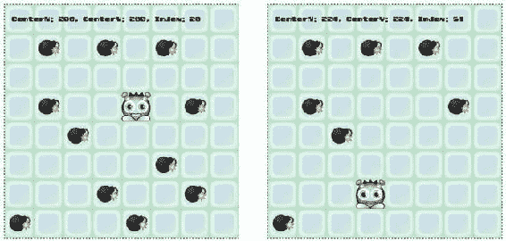

###### 图 3-1。使用基于图块的碰撞的项目收集

### 设计游戏世界

在第 2 章中，你学习了如何使用平铺编辑器来帮助你快速设计一个游戏世界。我用完全相同的技术制作了本章中所有的游戏原型。我使用了三层:背景层、炸弹层和图层，如图 [3-2](#Fig2) 所示。

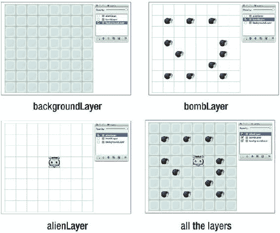

###### 图 3-2。三个地图图层

tileset 中的 alien 和 bomb 图像都被赋予了 name 属性值:“alien”和“bomb”，如图 [3-3](#Fig3) 所示。这将让我们在以后的游戏代码中使用 world.getObject(针对单个对象)和 world.getObjects(针对一组对象)轻松地引用它们，就像你在前一章中所学的那样。

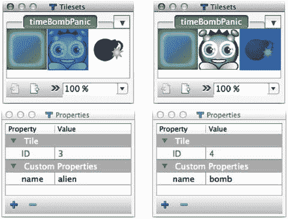

###### 图 3-3。给外星人和炸弹图像起名字

### 初始化游戏世界

游戏代码加载 tileset 图像和 Tiled Editor 生成的 JSON 文件。setup 函数使用 makeTiledWorld 创建世界。

```js
world = g.makeTiledWorld(
  "maps/simpleCollision.json",
  "img/timeBombPanic.png"
);
```

这将在画布上绘制精灵和层。我们在平铺编辑器中分配了 name 属性的任何内容都可以在 world.objects 数组中访问。我们可以通过使用 world.getObject(对于单个对象)或 world.getObjects(带有“s”，表示对象数组)按名称获取对这些对象的引用。以下是如何获得外星人精灵的参考。

```js
alien = world.getObject("alien");
```

我们的游戏也需要引用炸弹层，这样我们就可以访问它的数据数组。

```js
bombLayer = world.getObject("bombLayer");
bombMapArray = bombLayer.data;
```

炸弹杀手现在是一个容器，包含所有的炸弹作为子精灵。bombMapArray 现在是一个有用的数组，它告诉用户世界上所有炸弹的网格位置。(阵列中的炸弹的 gid 编号为 5)。

我们还需要一个包含所有炸弹精灵的数组，这样我们就可以像这样从世界中获取它们:

```js
bombSprites = world.getObjects("bomb");
```

world.getObjects 在世界对象数组中搜索，并找到任何名称属性为“bomb”的对象。在这个例子中，“炸弹”匹配世界上所有 11 个炸弹精灵。bombSprites 现在是一个数组，包含了对这些精灵的引用。

现在让我们看看如何使用炸弹地图数据来检查碰撞。

### 了解炸弹地图

bombMapArray 是一个有用的数字数组，它匹配屏幕上炸弹精灵的位置。如图 [3-4](#Fig4) 所示。每个“5”是一个炸弹，每个“0”是一个空单元格。

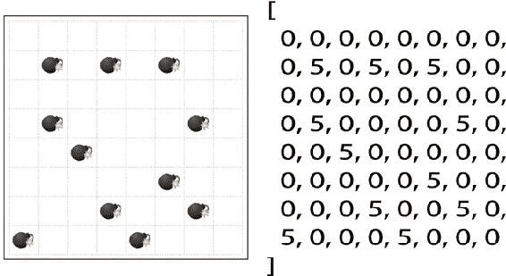

###### 图 3-4。与平铺编辑器中的炸弹层匹配的炸弹阵列

创建炸弹精灵时，每个新精灵都有自己的 index 属性。index 属性存储炸弹在这个数组中的初始位置。

我们需要知道外星人是否和地图上的炸弹在同一个位置。为此，我们必须将外星人的中心 x 和 y 屏幕坐标转换为其匹配的数组索引号。我们可以借助 getIndex 函数做到这一点。

```js
alien.index = getIndex(
  alien.centerX, alien.centerY,
  world.tilewidth, world.tileheight, world.widthInTiles
);
```

为了判断外星人是否接触了其中一个炸弹，检查外星人的索引号是否与炸弹地图中的炸弹 gid 号(“5”)相匹配。

```js
**//Find out if the alien's position in the bomb array matches a bomb gid number** 
if (bombMapArray[alien.index] === 5) {

**//If it does, filter through the bomb sprites and find the one** 
**//that matches the alien's position** 
  bombSprites = bombSprites.filter(bomb => {

**//Does the bomb sprite have the same index number as the alien?** 
    if (bomb.index === alien.index) {

**//If it does, remove the bomb from the** 
**//`bombMapArray` by setting its gid to `0`** 
      bombMapArray[bomb.index] = 0;

**//Remove the bomb sprite from its container group** 
      g.remove(bomb);

**//Filter the bomb out of the `bombSprites` array** 
      return false;
    } else {

**//Keep the bomb in the `bombSprites` array if it doesn't match** 
      return true;
    }
  });
}
```

你可以看到，如果外星人和炸弹有相同的索引号，他们一定占据了相同的地图位置。在这种情况下，通过将该位置的 gid 号设置为零，炸弹将从该级别的炸弹地图中删除。

```js
bombMapArray[bomb.index] = 0;
```

然后使用一个名为 remove 的函数将炸弹精灵从游戏中移除。

```js
g.remove(bomb);
```

游戏代码实际上是维护游戏中所有炸弹的实时地图。玩游戏，捡几个炸弹，检查关卡的 bombMapArray，你可以在控制台上看到它的输出。您会注意到，每次捡起炸弹时，单元格的 gid 值都被设置为“0”炸弹从地图上消失了。图 [3-5](#Fig5) 显示了一些炸弹被捡起后地图上的炸弹地图阵列的样子。你可以看到它和屏幕上炸弹的位置完全吻合。

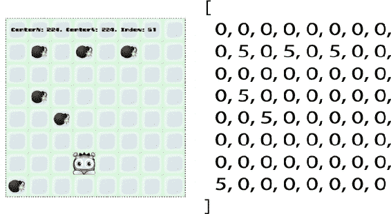

###### 图 3-5。当一个炸弹被捡起时，它在地图上的 gid 号被设置为零

在一个数组中更新这种数据对于做各种其他游戏逻辑分析是有用的，你将在前面看到。

### 移动外星人使其与网格对齐

在我们继续讨论基于图块的碰撞之前，让我们快速了解一下外星人角色的运动系统是如何工作的。像许多迷宫游戏中的角色一样，外星人沿着地图上的网格移动。这意味着当你按下一个键来改变它的方向时，外星人不会向新的方向移动，直到它进入网格中的一个新的行或列。这确保了它将干净地过渡到新的行和列。它有助于保持您的碰撞检测系统简单可靠。

你如何判断一个游戏角色是否与地图网格单元精确对齐？通过检查精灵的 x 和 y 屏幕坐标是否能被贴图的宽度和高度整除。下面是检查这一点的经典代码片段。

if(math . floor(sprite . x)% world . tile width = = = 0

```js
&& Math.floor(sprite.y) % world.tilehieght === 0) {

**//Yes, the sprite is aligned to the map’s rows and columns** 
}
```

您还需要确保 sprite 的速度能够被 tilewidth 和 tileheight 整除。这确保了 sprite 实际上具有允许上述检查变为真的像素位置。这意味着，如果你的瓷砖宽度和高度是 64，你的精灵的速度必须是一个数字，除以 64: 1，2，4，8，16 或 32。如果精灵的速度是 5、7 或 11，它们将永远不会被平均分为 64，因此精灵将永远不会与贴图的行或列精确对齐。

下面是这个例子的工作原理。setup 函数创建响应箭头键的键盘按键对象。然后在 alien 上创建一个名为 direction 的属性，按键动作会改变该方向的值。

```js
**//Create the keyboard objects** 
leftArrow = g.keyboard(37);
upArrow = g.keyboard(38);
rightArrow = g.keyboard(39);
downArrow = g.keyboard(40);

**//Create a `direction` property on the alien** 
alien.direction = "";

**//Assign key `press` actions that change the alien’s `direction**`
leftArrow.press = () => alien.direction = "left";
upArrow.press = () => alien.direction = "up";
rightArrow.press = () => alien.direction = "right";
downArrow.press = () => alien.direction = "down";
```

当任何一个箭头键被按下时，外星人的方向将改变为:“上”、“下”、“左”或“右”游戏循环在每一帧检查这一点，并相应地改变外星人的速度:

```js
if(Math.floor(alien.x) % world.tilewidth === 0
&& Math.floor(alien.y) % world.tileheight === 0) {
  switch (alien.direction) {
    case "up":
      alien.vy = -4;
      alien.vx = 0;
      break;
    case "down":
      alien.vy = 4;
      alien.vx = 0;
      break;
    case "left":
      alien.vx = -4;
      alien.vy = 0;
      break;
    case "right":
      alien.vx = 4;
      alien.vy = 0;
      break;
  }
}
```

然后，游戏循环使用一个名为 contain 的自定义函数移动外星人，并将其保持在画布边界内。

```js
alien.x += alien.vx;
alien.y += alien.vy;
g.contain(alien, g.stage);
```

###### 注意

对于任何依赖于读取数组索引位置的游戏，了解地图边界尤其重要。这是因为您不希望 sprite 的 x/y 位置计算出的数组索引号小于或大于数组中的元素数。如果是这样，您可能会遇到一些神秘的“未定义”的错误消息。这些很难追踪，尤其是如果它们不经常发生。但这还不是最坏的情况。最糟糕的是你根本不会得到任何错误信息。相反，你只会注意到各种没有明显原因的疯狂的随机错误。如果发生这种情况，检查你的精灵的指数和位置值！

在接下来的例子中，你将会看到保持精灵与网格的行和列对齐是如何使用墙壁实现迷宫游戏变得容易的。

### 与移动精灵的碰撞

如果所有的炸弹都在移动，会发生什么？他们的地图索引号会不断变化。为了有助于跟踪这一点，添加另一个新的属性到你的精灵名为 gid。

```js
playerSprite.**gid** 
```

gid 存储引用 tileset 上 sprite 图像的网格索引号。如果 a 播放器精灵的 tileset 图像是顶行的第四个，您可以将其 gid 设置为 4，如下所示:

```js
playerSprite.gid = 4;
```

你在前一章中学习的 makeTileWorld 函数在创建游戏世界时为你的所有精灵添加了一个 gid 属性。

如果精灵在四处移动，使用它们的 gid 和 index 属性来实时更新它们在贴图数组中的位置。使用 updateMap 函数来帮助您做到这一点。updateMap 获取原始数组和一个 sprite，或者一个 sprite 数组，您要更新其位置。它还需要知道世界的宽度、高度和宽度。它返回一个包含这些精灵的新位置的新数组。

```js
mapArray = updateMap(mapArray, bombSprites, world);
```

下面是完成所有工作的完整 updateMap 函数。(注意这段代码使用了你在本章前面学到的 getIndex 函数)。

```js
function updateMap(mapArray, spritesToUpdate, world) {

**//First create a map a new array filled with zeros.** 
**//The new map array will be exactly the same size as the original** 
  let newMapArray = mapArray.map(gid =>  {
    gid = 0;
    return gid;
  });

**//Is `spriteToUpdate` an array of sprites?** 
  if (spritesToUpdate instanceof Array) {

**//Get the index number of each sprite in the `spritesToUpdate` array** 
**//and add the sprite's `gid` to the matching index on the map** 
    spritesToUpdate.forEach(sprite => {

**//Find the new index number** 
      sprite.index = getIndex(
        sprite.centerX, sprite.centerY,
        world.tilewidth, world.tileheight, world.widthInTiles
      );

**//Add the sprite's `gid` number to the correct** 
**//index on the map** 
      newMapArray[sprite.index] = sprite.gid;
    });
  }

**//Is `spritesToUpdate` just a single sprite?** 
  else {
    let sprite = spritesToUpdate;

**//Find the new index number** 
    sprite.index = getIndex(
      sprite.centerX, sprite.centerY,
      world.tilewidth, world.tileheight, world.widthInTiles
    );

**//Add the sprite's `gid` number to the correct** 
**//index on the map** 
    newMapArray[sprite.index] = sprite.gid;
  }

/**/Return the new map array to replace the previous one** 
  return newMapArray;
}
```

(您可以在 Hexi/src/modules/tile utilities/src/tile utilities . js 中找到 updateMap 函数。)

updateMap 获取一个精灵数组，使用它们的索引位置创建一个新的贴图，并用新的贴图替换以前的贴图。这是确保所有位置都是当前位置的最可靠的方法，并且允许两个或更多的精灵在同一位置共享一个 gid 号。updateMap 应该在游戏循环中调用，在精灵的位置改变之后，在你检查碰撞之前。

现在你知道了如何实时更新地图，你如何使用这些信息来检查碰撞？

### 通过比较数组位置来检查冲突

如果你在游戏中有很多移动的精灵，你可以使用数组比较技术来检查碰撞。在本章的第一个例子中，我们检查了外星人和炸弹之间的碰撞，就像这样:

```js
if (bombArray[alien.index] === 5) **//Collision**!
```

这对于对照一组精灵检查单个精灵非常有效。但是如果你想检查一组移动的精灵和另一组移动的精灵呢？

诀窍是将一张地图叠加到另一张地图上。如果这些地图中的任何东西都有相同的索引号，那么就发生了冲突。

下面是工作的基本系统:

首先，从两张包含不同种类事物的地图开始。mapOne 存储“1 ”, map two 存储“2 ”:

```js
mapOne = [0, 0, 1, 0, 1, 0];
mapTwo = [0, 2, 0, 0, 2, 0];
```

你想知道的是是否有地图位置被 a 1 和 a 2 同时占据？有吗？我们可以清楚地看到。在索引号 4 处。

但是我们如何用代码来检查这一点呢？像这样:

```js
mapOne.forEach((gid, index) => {
  if (mapTwo[index] === 2 && gid === 1) {
    console.log("Collision at location: " + index);
  }
});
```

这将显示:

```js
Collision at location: 4
```

如果你有很多不断变换位置的精灵，这可能是检查碰撞最有效的方法。

让我们看一个展示这些新技术的实际例子。运行 movingCollision.html 文件的一个新版本的移动炸弹的示例游戏。使用箭头键让外星人追逐并收集炸弹，如图 [3-6](#Fig6) 所示。

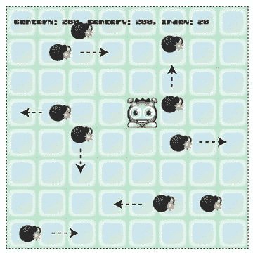

###### 图 3-6。在地图上追逐移动的炸弹

这个新例子使用了同样的三个地图图层:“背景图层”、“炸弹图层”和“外星人图层”图 [3-7](#Fig7) 显示了每一层的数据阵列。

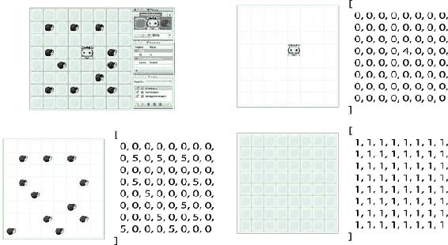

###### 图 3-7。平铺编辑器中的三个地图图层

setup 函数获取对 alien 层数据数组的引用，如下所示:

```js
alienMapArray = world.getObject("alienLayer").data;
```

然后，在游戏循环中的每一帧改变外星人的位置后，调用 updateMap 来更新外星人在数组中的位置。

```js
alienMapArray = updateMap(alienMapArray, alien, world);
```

这意味着 alienMapArray 将始终包含外星人的当前位置。

炸弹的位置在 forEach 循环中更新。循环运行后，updateMap 函数用于用每个炸弹的新位置更新 bombMapArray。下面是实现这一点的代码:

```js
bombSprites.forEach(bomb => {

**//`atXEdge` and `atYEdge` will return `true` or `false` depending on whether or** 
**//not the sprite is at the edges of the canvas** 
let atXEdge = (sprite, container) => {
  return (sprite.x === 0 || sprite.x + sprite.width === container.width)
}
let atYEdge = (sprite, container) => {
  return (sprite.y === 0 || sprite.y + sprite.width === container.height)
}

**//Change the bomb's direction if it's at a map grid column or row** 
if (Math.floor(bomb.x) % world.tilewidth === 0
&& Math.floor(bomb.y) % world.tileheight === 0)
{

**//If the bomb is at the edge of the canvas,** 
**//reverse its velocity to keep it inside** 
  if (atXEdge(bomb, g.canvas)) {
    bomb.vx = -bomb.vx;
  }
  else if (atYEdge(bomb, g.canvas)) {
    bomb.vy = -bomb.vy;
  }

**//If the bomb is inside the canvas, give it a new random direction** 
  else {
    changeDirection(bomb);
  }
}

**//Move the bomb** 
bomb.x += bomb.vx;
bomb.y += bomb.vy;
});
```

bombMapArray 现在将包含该帧炸弹位置的当前记录。您会注意到，在上面的代码中，每当炸弹位于网格单元格的中心时，就会调用一个名为 changeDirection 的函数——接下来让我们看看它是如何工作的。

### 给炸弹一个随机的方向

炸弹只有在与网格行或列对齐时才会改变方向。而且，如果炸弹在画布的边缘，它们就不能改变方向，这可以防止它们生成无效的数组索引号。下面是 changeDirection 函数，只要满足这些条件，就会调用它。

```js
**//Change direction helper function** 
function changeDirection(sprite) {
  let up = 1,
    down = 2,
    left = 3,
    right = 4,
    direction = g.randomInt(1, 4);

  switch (direction) {
    case right:
      sprite.vx = 2;
      sprite.vy = 0;
      break;

    case left:
      sprite.vx = -2;
      sprite.vy = 0;
      break;

    case up:
      sprite.vx = 0;
      sprite.vy = -2;
      break;

    case down:
      sprite.vx = 0;
      sprite.vy = 2;
      break;
  }
}
```

这只是一个非常简单的 switch 语句，它改变 sprite 的速度以匹配其随机分配的方向。

### 冲突检出

如果您在任何时候拍摄 alienMapArray 或 bombMapArray 的快照，您会看到它们的内容与画布上精灵的位置相匹配，如图 [3-8](#Fig8) 所示。

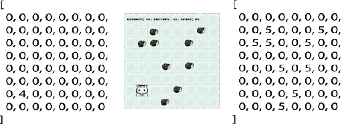

###### 图 3-8。实时更新精灵的地图位置

通过比较这两个数组来检测冲突。该代码循环遍历 bombMapArray，并检查每个索引位置的 gid 是否为“5”。如果是，并且 alienMapArray 在相同的索引号上有一个“4 ”,那么就有冲突。然后，代码会过滤掉该位置的所有炸弹精灵。(同一地点可能有不止一枚炸弹)。当它找到一个匹配时，炸弹从地图上被清除，精灵被移除。

```js
bombMapArray.forEach((gid, index) => {

**//Does the alien have the same index number as a bomb?** 
  if (alienMapArray[index] === 4 && gid === 5) {

**//Yes, so filter out any bomb sprites at this location** 
**//(there might be more than one)** 
    bombSprites = bombSprites.filter(bomb => {
      if (bomb.index === index) {

**//Remove the bomb gid number from the array** 
        bombMapArray[bomb.index] = 0;

**//Remove the bomb from the `bombLayer` group** 
        g.remove(bomb);
        return false;
      } else {
        return true;
      }
    });
  }
});
```

到目前为止，所有这些例子都向你展示了如何使用精灵的中心点来检查碰撞。但是对于很多游戏来说，你需要更精确一点。让我们来看看如何使我们的碰撞检测更准确一点。

## 使用角点

到目前为止，我们的碰撞系统中的一个限制是，我们只使用精灵的中心 x/y 点来计算它的贴图数组位置。

```js
sprite.index = getIndex
**sprite.centerX, sprite.centerY,** 
  world.tilewidth, world.tileheight, world.widthInTiles
);
```

这意味着，即使 sprite 部分进入下一个单元格，getIndex 也不会检测到它的位置发生了变化。只有当精灵的中心点穿过单元格边界时，它才会检测到变化。你可以在图 8-9 中看到，即使外星人正在触摸炸弹，直到外星人的中心进入炸弹的单元，碰撞才被检测到。参见图 [3-9](#Fig9) 。

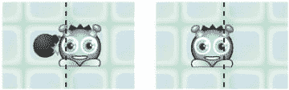

###### 图 3-9。精灵的中心点被用来计算它的地图位置

这可能不是一个问题，事实上在这个例子中效果看起来完全自然。但是对于许多种类的碰撞，你会想要使用精灵的精确边缘作为碰撞边界。这对于与根本不应该重叠的物体的碰撞很重要，例如与墙壁的碰撞，或者对于应该有即时反应的物体，例如与火的碰撞。

那么，如何判断一个精灵的边缘是否在一个新的地图位置呢？不要使用中心点。相反，使用精灵的 4 个角点。图 [3-10](#Fig10) 显示了这四个角点的位置。

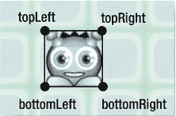

###### 图 3-10。为了更精确，检查精灵的四个角的位置

这些很好算。使用 getPoints 函数计算并返回包含这四个点的 x/y 坐标的对象。getPoints 接受一个参数:为其寻找角点的 sprite。它返回一个具有四个子对象属性的对象，告诉您精灵角的 x 和 y 位置:顶部左侧、顶部右侧、底部左侧和底部右侧。

```js
function getPoints(s) {
  return {
    topLeft: {x: s.x, y: s.y},
    topRight: {x: s.x + s.width - 1, y: s.y},
    bottomLeft: {x: s.x, y: s.y + s.height - 1},
    bottomRight: {x: s.x + s.width - 1, y: s.y + s.height - 1}
  };
}
```

(底部和左侧角点比精灵的宽度和高度小 1 个像素，因此这些点保持在精灵内部，而不是外部)。

###### 注意

为什么在 getCorners 函数中使用“s”而不是“sprite”？虽然我通常建议使用描述性的变量名，但是通过使用一种显而易见的简写方式，您可以使密集和重复的数学计算更加紧凑和易读。

现在不是只检查精灵的中心点来找到贴图位置，而是检查所有四个角点。如果它们和你感兴趣的精灵的 gid 有相同的索引，你就有冲突了。

首先，使用上面的 getPoints 函数找到精灵的四个角点。

```js
sprite.collisionPoints = getPoints(sprite);
```

创建一个 collisionGid 变量，该变量存储要检查与 sprite 冲突的单元格的 Gid。

```js
let collisionGid = 5;
```

您还需要一个包含具有上述 collisionGid 的精灵的 mapArray。

```js
let mapArray = anyMapArray;
```

然后遍历所有四个点，并为每个点调用一个自定义检查点函数。

```js
let hit = Object.keys(sprite.collisionPoints).some(checkPoints);
```

如果任意角点与 mapArray 中与我们感兴趣的 collisionGid 具有相同 gid 的单元格相交，checkPoints 函数将返回 true。

```js
function checkPoints(key) {

**//Get a reference to the current point to check.** 
**//(`topLeft`, `topRight`, `bottomLeft` or `bottomRight` )** 
  let point = sprite.collisionPoints[key];

**//Find the point's index number in the map array** 
  let index = getIndex(
    point.x, point.y,
    world.tilewidth, world.tileheight, world.widthInTiles
  );

**//Find out what the gid value is in the map position** 
**//that the point is currently over** 
  let currentGid = mapArray[index];

**//If it matches the value of the gid that we're interested, in** 
**//then there's been a collision** 
  if (currentGid === collisionGid) {
    return true;
  } else {
    return false;
  }
}
```

如果*一些*角(至少一个)接触到你感兴趣的单元格，上面的代码将返回 true。那是因为我们用了 JavaScript 的 some array 方法:

```js
var hit = Object.keys(sprite.collisionPoints).**some**(checkPoints);
```

一旦找到碰撞中的第一个角点，循环将退出，函数将返回 true。这意味着，如果在第一个点，精灵的左上角得到了一个命中，循环将立即返回 true，而不会检查其他点。这有助于确保对触摸的即时反应。

但是，如果您希望仅在每个角点都接触到您感兴趣的单元格时才检测到碰撞，该怎么办呢？使用 JavaScript 的 every array 方法，像这样:

```js
var hit = Object.keys(sprite.collisionPoints).**every**(checkPoints);
```

在这种情况下，只有当碰撞涉及到每个角点时，hit 才会变为 true。这对于确保一个 sprite 完全在一个单元格内，或者覆盖另一个 sprite 非常有用。你可以使用它非常有效地测试精灵的四个角是否都在迷宫的地板上，这样精灵就不会穿过任何墙壁。(您将在前面的示例中看到如何做到这一点)。

现在您已经知道是否找到了，使用索引号在相同的地图位置查找匹配的 sprite。这只是您在前面的示例中看到的相同代码的变体:

```js
if (hit) {
  enemySprites.some((enemy) => {
    if (enemy.index === collisionIndex) {

**//This is the sprite you're interested in** 
    }
  });
}
```

在我们继续之前，让我们巩固所有这些新代码。

### 一个可重用的基于图块的碰撞函数

现在，您可以看到基于图块的碰撞对于各种不同的游戏情况是多么有用。为了让我们的生活变得更简单，我创建了一个通用的 hitTestTile 函数，这样您只需一行代码就可以实现基于 Tile 的碰撞。你可以把它放到任何有精灵的游戏中，这些精灵的属性和我们在本书中使用的一样。该函数检查任何贴图数组上的 sprite 和 tile gid 编号之间的冲突。该函数还允许您设置要检查的碰撞类型:中心点、一些角点或每个角点。下面是它的使用方法:

```js
let collisionObject = hitTestTile(sprite, mapArray, collisionGid, worldObject, pointsToCheck);
```

hitTestTile 返回包含这两个属性的碰撞对象:

*   collision.hit:一个布尔值，如果发生冲突，该值将为真。

*   collision.index:告诉您碰撞的贴图数组位置的数字。

您可以使用这两个属性来确定如何处理冲突。

第四个参数 worldObject 是一个定义基于磁贴的游戏世界的对象。它需要具备以下特性:

```js
world.tilewidth
world.tileheight
world.widthInTiles
```

(widthInTiles 是一个数字，表示平铺图中的列数)。

我们在前两章中使用的 makeTiledWorld 函数会自动为您返回一个具有这些属性的世界对象。但是，如果您从代码中生成世界地图，而不使用平铺编辑器，您仍然可以使用 hitTestTile，只要您将它传递给您自己的具有相同三个属性的世界对象。

最后一个参数，pointsToCheck，决定了在 sprite 上的哪些点上检查碰撞。您可以使用以下三个字符串选项之一:

```js
"every"
"some"
"center"
```

下面是完整的 hitTestTile 函数。这里没有新的代码，它只是对我们在前面的例子中使用的相同技术的改造。

```js
hitTestTile(sprite, mapArray, gidToCheck, world, pointsToCheck) {

**//The `checkPoints` helper function loops through the sprite's corner points to** 
**//find out if they are inside an array cell that you're interested in.** 
**//Return `true` if they are** 
  let checkPoints = key => {

**//Get a reference to the current point to check.** 
**//(`topLeft`, `topRight`, `bottomLeft` or `bottomRight` )** 
    let point = sprite.collisionPoints[key];

**//Find the point's index number in the map array** 
    collision.index = this.getIndex(
      point.x, point.y,
      world.tilewidth, world.tileheight, world.widthInTiles
    );

**//Find out what the gid value is in the map position** 
**//that the point is currently over** 
    collision.gid = mapArray[collision.index];

**//If it matches the value of the gid that we're interested, in** 
**//then there's been a collision** 
    if (collision.gid === gidToCheck) {
      return true;
    } else {
      return false;
    }
  };

/**/Assign "some" as the default value for `pointsToCheck`** 
  pointsToCheck = pointsToCheck || "some";

**//The collision object that will be returned by this function** 
  let collision = {};

**//Which points do you want to check?** 
**//"every", "some" or "center"?** 
  switch (pointsToCheck) {
    case "center":

**//`hit` will be true only if the center point is touching** 
      let point = {
        center: {
          x: sprite.centerX,
          y: sprite.centerY
        }
      };
      sprite.collisionPoints = point;
      collision.hit = Object.keys(sprite.collisionPoints).some(checkPoints);
      break;

    case "every":

**//`hit` will be true if every point is touching** 
      sprite.collisionPoints = this.getPoints(sprite);
      collision.hit = Object.keys(sprite.collisionPoints).every(checkPoints);
      break;

    case "some":

**//`hit` will be true only if some points are touching** 
      sprite.collisionPoints = this.getPoints(sprite);
      collision.hit = Object.keys(sprite.collisionPoints).some(checkPoints);
      break;
  }

**//Return the collision object.** 
**//`collision.hit` will be true if a collision is detected.** 
**//`collision.index` tells you the map array index number where the** 
**//collision occured** 
  return collision;
}
```

(你可以在本章的源文件 Hexi/src/modules/tile utilities/src 中找到这个函数的工作版本)。

运行 usingCornerPoints.html 的例子，看看 hitTestTile 的实际例子。在这个例子中，当任何一个外星人的角点进入一个有炸弹的格子时，炸弹就会消失。如图 [3-11](#Fig11) 所示。

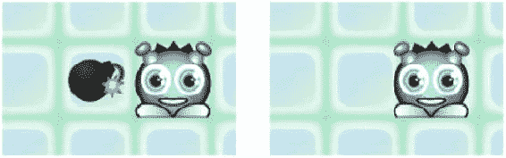

###### 图 3-11。使用一些角点的即时碰撞检测

那个碰撞反应会不会显得太直接了？把“一些”改成“每一个”，可以达到完全不同的效果:

```js
let alienVsBomb = hitTestTile(alien, bombMapArray, 5, world, **"every"**);
```

现在，只有当每个角点都在炸弹的单元内时，碰撞才会被检测到。这让外星人在炸弹消失前完全包围它。图 [3-12](#Fig12) 对此进行了说明。

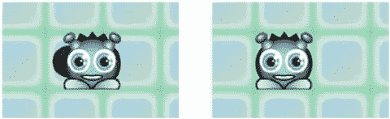

###### 图 3-12。仅当每个角点都在地图像元内时才检测到碰撞

结果看起来非常自然，这是使用基于几何的碰撞检测系统很难实现的效果。事实证明，检查每个角点的碰撞还有另一个重要的用途:可以用它在特定的贴图位置包含一个精灵。让我们看看下一步该怎么做。

## 使用反向碰撞检测来检查障碍物

对于迷宫或 RPG 游戏，你通常需要知道地图的哪些部分是角色可以行走的区域，哪些是不可以。例如，角色应该能够在草地上行走，但不能在墙壁、岩石或树上行走。这些被称为地图上的可步行区域和不可步行区域。通常你会发现只有一种东西可以让一个角色行走，但是很多东西是不允许行走的。因此，不要检查与角色不能行走的三个物体(如墙壁、岩石和树木)的碰撞，而只测试与角色可以行走的一个物体(如草地)的碰撞。)如果角色在草地上，它可以走，但如果它在触摸其他任何东西，它就不能。这是一个*逆*碰撞策略。这是相反的，因为你通过检查*是否没有撞到*另一个障碍物来发现一个精灵是否撞到了一个障碍物。如果它在草地上，你知道它没有碰到墙、岩石或树。简单！对于某些类型的碰撞，这可能非常有效。

你怎么知道一个精灵是否完全在一个地图单元格内？通过检查它的四个角点。如果精灵的四个角都在同一个位置，你知道精灵没有覆盖任何其他单元。是的，您可能不会惊讶地发现，您可以通过使用 JavaScript 的 every 循环来检查这一点！让我们用经典的例子来看看如何做到这一点:迷宫墙。

运行 wallsAndBombs.js 文件，使用箭头键在迷宫中导航外星人并捡起炸弹。外星人可以在走廊和拐角处顺利移动，但墙壁会阻碍它的移动，如图 [3-13](#Fig13) 所示。

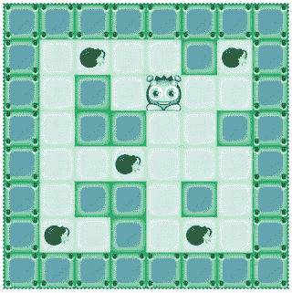

###### 图 3-13。导航迷宫捡起炸弹

图 [3-14](#Fig14) 显示了迷宫和用于创建迷宫的墙壁阵列。

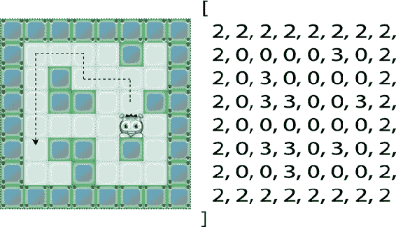

###### 图 3-14。添加墙壁来创建一个迷宫游戏

你可以看到任何 gid 数为 2 或 3 的东西都是墙。但是因为我们要做反向碰撞检查，我们对那些不感兴趣。我们只对不是墙的东西感兴趣。那就是地图上用“0”表示的任何东西。因此，我们的碰撞算法将遵循这样的逻辑:*如果外星人没有接触“0”细胞，阻止它移动。*

这是游戏循环中完成这项工作的所有代码。除了一些小细节外，它与上一个示例中的代码非常相似。

```js
let alienVsFloor = g.hitTestTile(alien, wallMapArray, 0, world, "every");

if (!alienVsFloor.hit) {

**//Prevent the alien from moving** 
  alien.x -= alien.vx;
  alien.y -= alien.vy;
  alien.vx = 0;
  alien.vy = 0;
}
```

可以看到，只有当每个角点都在“0”单元格内时，alienVsFloor 才会变为真。如果 alienVsFloor 变成 false，我们就知道外星人正在触摸一个不是“0”的东西——而那个东西一定是一面墙。

该示例使用了世界上最简单的碰撞反应代码。如果外星人撞上了墙，通过从其位置中减去其速度，然后将其速度设置为零，可以防止外星人移动。

```js
alien.x -= alien.vx;
alien.y -= alien.vy;
alien.vx = 0;
alien.vy = 0;
```

我们可以摆脱这样一个简单的碰撞反应系统，因为外星人的运动与地图的网格行和列一致，我们没有使用任何物理方法来改变它的速度。这些约束消除了一整类我们不必担心的碰撞问题。

为了了解如何在上下文中使用这些代码，下面是游戏循环中的所有代码，这些代码使用 hitTestTile 来检查外星人和地板之间以及外星人和炸弹之间的碰撞。

```js
**//Check for a collision between the alien and floor** 
let alienVsFloor = g.hitTestTile(alien, wallMapArray, 0, world, "every");

**//Prevent the alien from moving if it's not touching a floor tile** 
if (!alienVsFloor.hit) {
  alien.x -= alien.vx;
  alien.y -= alien.vy;
  alien.vx = 0;
  alien.vy = 0;
}

**//Check for a collision between the alien and the bombs** 
let alienVsBomb = g.hitTestTile(alien, bombMapArray, 5, world, "every");

**//Find out if the alien's position in the bomb array matches a bomb gid number** 
if (alienVsBomb.hit) {

**//If it does, filter through the bomb sprites and find the one** 
**//that matches the alien's position** 
  bombSprites = bombSprites.filter(function(bomb) {

**//Does the bomb sprite have the same index number as the alien?** 
    if (bomb.index === alienVsBomb.index) {

**//If it does, remove the bomb from the** 
**//`bombMapArray` by setting its gid to `0`** 
      bombMapArray[bomb.index] = 0;

**//Remove the bomb sprite from its container group** 
      g.remove(bomb);

**//Filter the bomb out of the `bombSprites` array** 
      return false;
    } else {

**//Keep the bomb in the `bombSprites` array if it doesn't match** 
      return true;
    }
  });
}
```

现在我们有了一个有用的基于瓷砖的碰撞系统，我们可以用在所有类型的基于瓷砖的游戏中。现在让我们来看看如何在我们在前一章开始构建的幻想角色扮演游戏中使用所有这些新技能。

## 角色扮演游戏中基于图块的碰撞

播放第 [1](1.html) 章中的 fantasy.html 原型示例，重新熟悉它的行为。你会注意到小精灵角色会和两种东西相撞:

*   阻碍运动的障碍物:树的底部、墙的底部和灌木丛的底部。

*   可以收集的物品:心脏、头骨和旱獭。

图 [3-15](#Fig15) 对此进行了说明。碰撞机制都是基于我们在前面几节中学到的基于平铺的碰撞系统。但是有一些有趣的新细节，远不是边缘情况，是你需要为许多种游戏解决的典型碰撞问题。

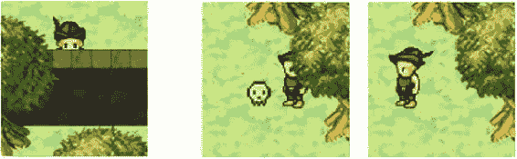

###### 图 3-15。障碍物阻碍移动，可以收集物品

### 定义碰撞区域

游戏地图中的所有方块都由图形组成，这些图形整齐地填充了 32×32 像素的方块。然而，精灵角色并不遵循这种模式。它的 sprite 大小是 64 乘 64 像素，字符插图的实际大小是 28 乘 52 像素。图 [3-16](#Fig16) 对此进行了说明。

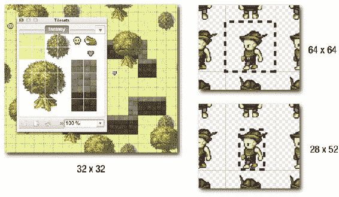

###### 图 3-16。所有的尺寸都不一样

在迷宫游戏示例中，这不是问题，因为图块大小、精灵大小和迷宫单元网格大小都完全相同:64x64 像素。我们现在要干嘛？

放松点。在精灵身上制造一个碰撞区域就好了。碰撞区域定义了 elf 的哪个部分应该对碰撞敏感。在这个游戏中，我只想让小精灵头部以下的身体区域对碰撞做出反应。这是一个 20 乘 20 像素的正方形区域，您可以在图 [3-17](#Fig17) 中看到。它在精灵的顶部偏移了 44 个像素，在左侧偏移了 22 个像素。

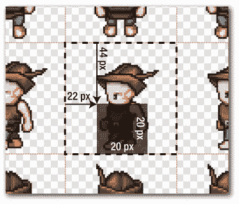

###### 图 3-17。精灵的碰撞区域

这保留了浅 2.5D 深度效果，因为这意味着小精灵的头不会撞到视觉上在它上面的东西，而是在较低的深度层上——比如墙或树的顶部。

要在我们的游戏代码中设置这个，我们只需要在 elf sprite 上创建一个 collisionArea 对象来定义这个形状。这是游戏设置函数中的一段代码。

```js
elf.collisionArea = {
  x: 22,
  y: 44,
  width: 20,
  height: 20
};
```

(参考第 [1 章](1.html)中的 fantasy.js 源文件，查看这段代码的完整上下文)。

现在，不使用精灵的四个角点，而是使用这个新碰撞区域的四个角点进行碰撞检查。要实现这一点，请使用这个新版本的 getPoints 函数。

```js
getPoints(s) {
  let ca = s.collisionArea;
  if (ca !== undefined) {
    return {
      topLeft: {
        x: s.x + ca.x,
        y: s.y + ca.y
      },
      topRight: {
        x: s.x + ca.x + ca.width,
        y: s.y + ca.y
      },
      bottomLeft: {
        x: s.x + ca.x,
        y: s.y + ca.y + ca.height
      },
      bottomRight: {
        x: s.x + ca.x + ca.width,
        y: s.y + ca.y + ca.height
      }
    };
  } else {
    return {
      topLeft: {
        x: s.x,
        y: s.y
      },
      topRight: {
        x: s.x + s.width - 1,
        y: s.y
      },
      bottomLeft: {
        x: s.x,
        y: s.y + s.height - 1
      },
      bottomRight: {
        x: s.x + s.width - 1,
        y: s.y + s.height - 1
      }
    };
  }
}
```

你现在可以为游戏中的任何精灵设置一个自定义的碰撞区域。现在，幻想 RPG 游戏示例中的碰撞系统是如何工作的？

## 与障碍物的碰撞

你会记得在第 [2](2.html) 章中，所有阻止精灵移动的瓷砖都是在一个名为障碍物的地图图层上创建的，如图 [3-18](#Fig18) 所示。

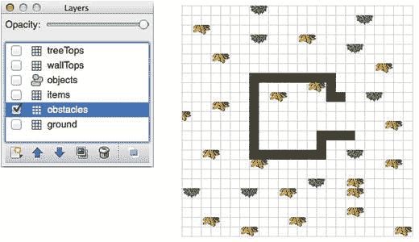

###### 图 3-18。地图的障碍图层

这导出了一个漂亮的胖数组，其中充满了代表障碍的 gid 数字。但是，最重要的是，它也充满了零。数组中的任何“0”都表示“没有障碍”这意味着我们可以使用反向碰撞的小技巧。我们可以查看 elf 碰撞区域的所有四个角是否都接触到“0”单元。如果它们中的任何一个不是“0”，我们就知道小精灵碰到了障碍物。我们最终得到的代码与我们在早期迷宫游戏示例中用来检查迷宫墙的代码几乎相同。下面是游戏循环中检查小精灵是否碰到障碍物的代码。如果是，代码阻止小精灵移动。

```js
let obstaclesMapArray = world.getObject("obstacles").data;
let elfVsGround = g.hitTestTile(elf, obstaclesMapArray, 0, world, "every");

if (!elfVsGround.hit) {

**//Prevent the elf from moving** 
  elf.x -= elf.vx;
  elf.y -= elf.vy;
  elf.vx = 0;
  elf.vy = 0;
}
```

如果你想知道小精灵碰到了哪种障碍呢？您可以使用 collision.index 属性在映射数组中查找它的 gid 号。下面是如何从 obstacleMapArray 中找到一个 gid 号:

```js
obstaclesMapArray[elfVsGround.index]
```

如果小精灵撞到了树的右边，你会得到 33 分。这意味着你现在可以获得关于精灵如何与环境互动的详细信息，并使用这些信息开始构建一些复杂的游戏逻辑。

### 与物品碰撞

你会记得，当我们在平铺编辑器中设计游戏地图时，我们给项目平铺这些名称属性:“头骨”、“心脏”和“土拨鼠”物品也被添加到它们自己的层上，如图 [3-19](#Fig19) 所示。

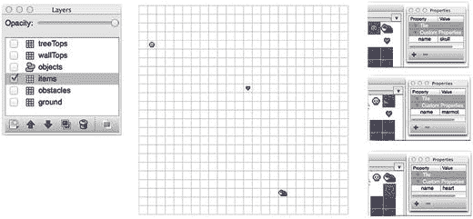

###### 图 3-19。项目切片位于各自的图层上，并具有名称属性

我们可以在游戏代码中使用这些自定义名称属性来告诉我们小精灵正在触摸哪些物品。让我们找出方法。

首先，我们需要获得对 items 层的引用。

```js
itemsLayer = world.getObject("items");
```

记住 itemsLayer 是一个 sprite 容器。它包含该层上的所有精灵；只有三个:心脏，头骨和土拨鼠。您可以在层的子数组中访问这些精灵。所以下一步是获取对 itemsLayer.children 的引用。

```js
items = itemsLayer.children;
```

我们现在有一个名为 items 的数组，包含三个 item 精灵。

###### 注意

或者，您可能希望*克隆*数组，而不是创建一个指向原始数组的直接引用指针。您可以像这样克隆阵列:

```js
items = itemsLayer.children.slice(0);
```

克隆数组的优点是，如果对 items 数组进行更改，原始的 itemsLayer.children 数组将保持不变。如果您需要将游戏重置为原始状态，这可能非常有用。

小精灵和物品的碰撞是如何进行的？没有惊喜！这和本章前面例子中炸弹和外星人的碰撞完全一样。唯一增加的是，当碰撞发生时，屏幕上会显示三秒钟的信息，告诉你小精灵收集的物品的名称。

```js
let itemsMapArray = world.getObject("items").data;
let elfVsItems = g.hitTestTile(elf, itemsMapArray, 0, world, "some");

if (!elfVsItems.hit) {
items = items.filter(item => {

**//Does the current item match the elf's position?** 
  if (item.index === elfVsItems.index) {

**//Display the message** 
    message.visible = true;
    message.content = "You found a " + item.name;

**//Make the message disappear after 3 seconds** 
    g.wait(3000, function() {
      message.visible = false;
    });

**//Remove the item** 
    itemsMapArray[item.index] = 0;
    g.remove(item);
    return false;
  } else {
    return true;
  }
  });
}
```

图 [3-20](#Fig20) 显示了收集物品时屏幕上出现的消息。

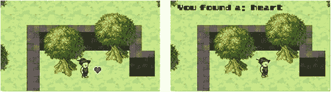

###### 图 3-20。显示项目的名称属性

基于瓷砖的碰撞:已解决！

## 摘要

基于图块的碰撞是你可以学习的最有用的游戏设计技术之一。我们在本章中使用的简单系统可以作为你在 2D 动作游戏中需要进行的大部分或全部碰撞的基础。你现在知道如何在世界地图上找到一个物体的位置，检查它与其他物体的碰撞，对这些碰撞做出反应，并更新游戏世界。您可以使用通用的 hitTestTile 函数，以及 getIndex 和 getPoints 来处理任何类型的任何 2D 视频游戏的冲突。

但是如果我再一次告诉你“我们还没完”，你会吃惊吗？？既然你已经了解了如何创建一个交互式的基于磁贴的游戏世界，一个全新的游戏设计技术领域已经向你敞开了大门。在接下来的几章中，我们将尽情享受所有这些新技术:影响贴图，宽相位碰撞，寻路，程序级生成，下一章，等距贴图。我希望你饿了！