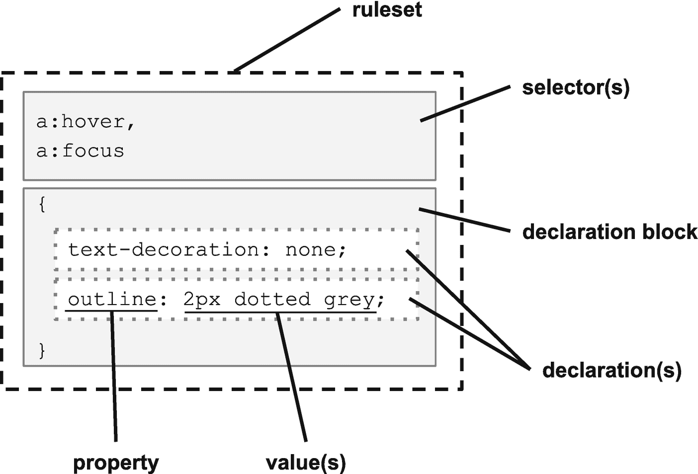
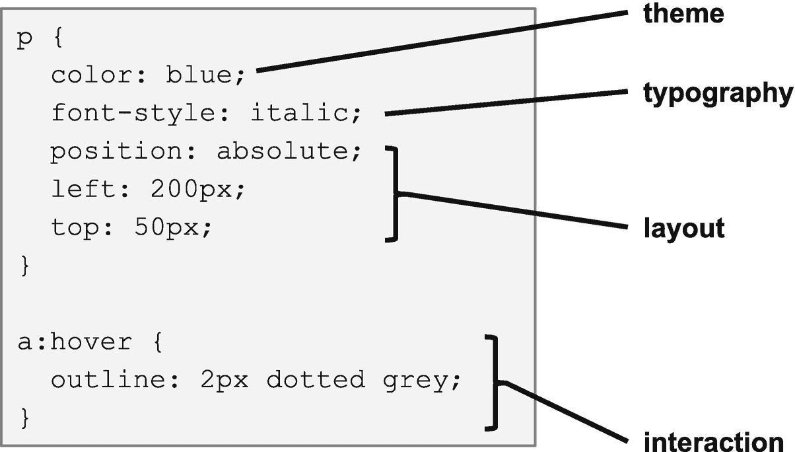
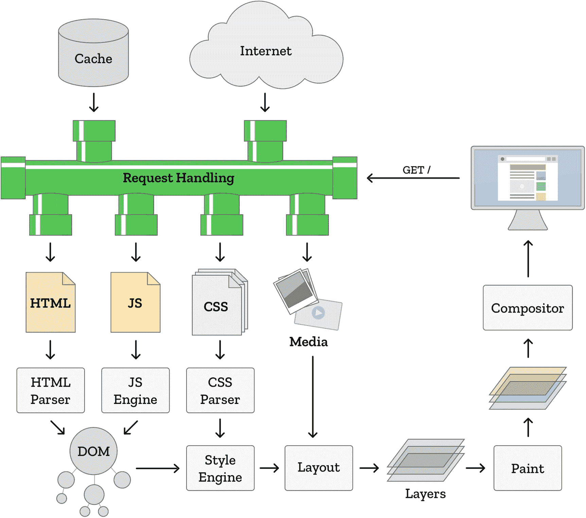
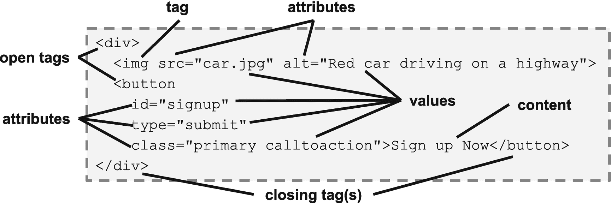
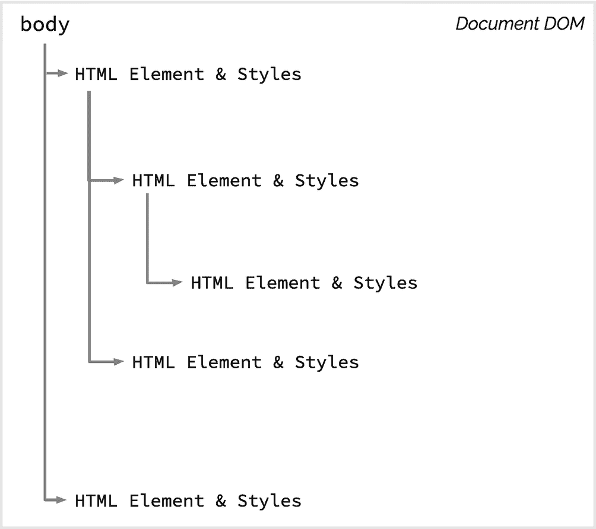

# 一、级联样式表

这本关于级联样式表(CSS)的书采用了与大多数书截然不同的方法。它不是试图教你如何设计网页，除了粗略的概述之外，也不是专注于教你如何使用 CSS。本章介绍了本书的重点，即如何(以及为什么)将 CSS 作为一种编程语言来对待。

## 分类

级联样式表(CSS)是一种允许将布局、主题和样式应用于文档的 web 技术。在大多数情况下，所讨论的文档是超文本标记语言(HTML)文件，并且由 web 浏览器执行呈现。

CSS 通常被视为一种设计工具，因为它允许网页的作者或设计者决定网页的视觉外观。因为它控制着网页的最终外观，CSS 对可用性和可访问性都有直接的影响。由于这些因素，创建样式表和编写 CSS 有时被认为是设计任务，而维护样式表的任务可能是软件团队中的设计师。

有趣的是，在 CSS 成为 Web 的主流样式语言之前，有许多其他的竞争提案。然而，

*   “CSS 有一个与众不同的特点:它考虑到在网络上，文档的风格不能由作者或读者自己设计，而是他们的愿望必须以某种方式结合或级联；事实上，不仅仅是读者和作者的愿望，还有显示设备和浏览器的功能。” <sup>1</sup>

那么，CSS 的核心就是把控制权交到作者和读者手中。这使得它具有一定的交互性，并服从于网页读者的意愿，因为他们能够根据自己的喜好影响页面的最终外观。最常见的情况是，当作者的意图与最终用户的影响相遇，以创建一个独特的混合输出，这就是所谓的编程。所以这就引出了一个问题:到底什么是 CSS？写样式表应该算编程吗，写 CSS 的应该算程序员吗？

对于初学者来说，就像 JavaScript 和 Python 等流行的编程语言一样，CSS 是一种*语言*。如“结构”一节所示，CSS 有一个必须遵循的特定语法，您编写的规则导致操作被执行。此外，万维网联盟(W3C)将 CSS 称为一种语言。 <sup>2</sup>

衡量一门编程语言的一个标准是看它是否是图灵完备的。跳过形式定义，图灵完全语言的简单解释是可以解决任何任意计算。请注意，这不是一个严格的要求，有一些非常有用的编程语言并不是图灵完整的，最著名的是结构化查询语言(SQL)和正则表达式(RegEx)。然而，如果一种语言可以被证明是图灵完备的，那么它将消除所有关于其分类的疑问。CSS + HTML 的组合已经得到了被归类为图灵完备的必要的形式证明。 <sup>3</sup>

这意味着 CSS + HTML 符合任何通用编程语言的要求，写 CSS 和 HTML 算编程。这意味着你绝对是一名程序员(或者 web 开发人员，如果你喜欢的话)。

### 语言特征

尽管 CSS 被归类为一种编程语言，我们可能会同意使用 CSS + HTML 来完成一般的编程任务并不特别方便。这是因为这真的不是 CSS(或 HTML)的重点。

不管怎样，这种语言有许多有趣的特性与更传统的编程语言相似，包括

*   变量

*   功能

*   计算

*   进口

*   范围

*   评论

*   多态性

当利用 CSS 预编译器时，您可以获得更多的编程语言特性，例如

*   混入类

*   延长

*   命名空间

*   列表和映射数据结构

*   数学表达式

参见第章第二部分更深入地探究 CSS 语言特性，参见第章第七部分更多地了解 CSS 预编译器。

### 结构

值得注意的是，CSS 是一种声明性语言，而不是命令性语言。这意味着，我们不是编写代码来告诉 web 浏览器如何将样式应用于页面，而是告诉浏览器应用什么样式以及在哪里应用它们。这些声明在规范中被称为规则集，但也可以简称为*规则*。

CSS 中的每个规则都由一个或多个选择器和一个或多个声明组成，如图 1-1 所示。



图 1-1

CSS 规则集

每个声明都由一个属性值对组成。在撰写本文时，CSS 工作组列出了 564 个可能的属性。每个属性都必须得到用户代理(通常是 web 浏览器)的支持才能生效。不支持的属性会被忽略。

规则集可以通过 at-rules 如`@media`或`@supports`进一步分组和修改，并被收集到样式表中。样式表只是一个带有. css 扩展名的文本文件，它包含许多描述文档或网页表示的规则。

## 软件体系结构

一旦我们承认 CSS 拥有编程语言的所有复杂性，我们就需要接受这样的暗示:我们必须像对待代码一样对待样式表。这意味着我们可以利用软件架构的许多原则、最佳实践和设计模式，并在编写 CSS 时应用它们。

Note

您可能会发现术语*软件架构*与术语*软件设计*可以互换使用。这在行业内很常见，这两个术语指的是相同的高级设计思想和过程方法。由于 CSS 经常用于*视觉设计*，我们在本书中选择了术语*架构*来避免这些概念之间的混淆。

软件架构着眼于系统的结构和组件，并权衡各种可能的组合和方法的利弊。各种系统和方法的优点、缺点和局限性都应该考虑。架构师的方法更像是高层次的鸟瞰图，而不是开发人员的(尽管通常是同一个人做这两项工作)。

例如，如果您想让一个图像在单击按钮时在页面上移动，您将如何实现该功能？你会使用 CSS 还是 JavaScript？你会使用``元素、可缩放矢量图形(SVG)还是画布？哪个会产生最流畅的视觉动画？当需求改变时，哪种方法最容易维护？这些是软件架构试图评估的问题类型。

做这些决定时，你不必从头开始。有一些公认的软件架构原则和最佳实践，可以指导您在 CSS 方面做出更具战略性的决策。

### 关注点分离

术语*关注点分离*被认为是埃德格·迪克斯特拉 <sup>4</sup> 的功劳，指的是一次专注于问题的一个方面非常有帮助的想法。正如后面的“web 架构”一节所显示的，Web 应用程序将内容、风格和动作分开，甚至对每一个关注点使用不同的技术。

看看与 CSS 相关的关注点分离，我们可能会在规则集中发现哪些关注点？如图 1-2 所示，我们看到布局、主题、版式和交互都是可以用 CSS 控制的网页的各个方面。见图 1-2 。



图 1-2

CSS 关注的领域

现在，假设您有一个包含 20，000 个规则集的样式表。这显然是难以管理的，这些规则集需要被分割到多个文件中。如何确定需要多少个文件以及每个文件包含哪些规则集？一种方法是基于关注点(例如，布局与主题)分割文件，而另一种方法是基于规则集所应用的特定组件对规则集进行分组。这个问题对于第十章中不同 CSS 架构模型的讨论来说非常重要。

软件架构的两个最广泛接受的原则，内聚和耦合，用来更好地定义关注点分离的概念。这些度量标准首次发表在*结构化设计* <sup>5</sup> 中，并从此成为软件工程中的标准。

#### 内聚力

凝聚力可以被描述为一种责任的度量。它是对给定代码单元所负责的不同任务或效果的广度以及这些任务或效果之间的关系性质的定性度量。传统上，衔接有七个等级，从*巧合*(最差)到*功能*(最好)。

另一个与凝聚力相关的流行原则是*单一责任原则* (SRP)。这个想法是每个功能和模块应该只有一个职责。由此衍生出两个重要目标:

1.  **缺少副作用** `–`如果一个函数只做一件事，那么它的使用几乎没有副作用或意想不到的后果的风险。

2.  **改变的理由只有一个** `–`每次代码改变，都会增加引入错误和 bug 的风险。如果我们减少变更的数量，我们就能减少风险。此外，这有助于避免系统范围变化的副作用。

内聚和单一责任的目标都是促进简单性和减少风险，这是我们所有架构决策的重要目标。

#### 耦合

耦合描述了两个或多个代码单元之间的相互依赖。松散耦合与良好的内聚性相关联，通常描述具有良好可重用性的模块，该模块可以独立于其他模块进行更新，对整个系统的影响最小。这是健壮和灵活系统的一个重要属性。

紧密耦合与较差的内聚性相关联，并且描述了难以独立测试或修改的模块。这种模块通常不能自由重用，并且在改变时可能需要更大的测试工作量。尽可能支持松散耦合。

当构建 web 应用程序时，我们会发现减少内容和设计之间的耦合有很多价值。理想情况下，我们应该能够创建适用于各种内容的样式表，而无需调整。当我们做到这一点时，我们可以说我们有正交性。

#### 正交性

虽然在讨论系统设计时，正交性是一个重要且常见的术语，但近年来，这个词已经积累了一些不利因素。这可能是由于误用和不良定义的结合，导致它有时被描述为“技术术语” <sup>6</sup> 然而，正交性是一个重要的概念，它与 <sup>7</sup> 的内聚和耦合直接相关，并且它将成为我们在本书后面讨论的许多决策的因素。

正交性描述的是一种合作而非相互依赖的关系，其中两件事情朝着共同的目标一起工作，同时保持一定程度的独立性。

在数学中，两个向量的正交性的最简单形式是当它们彼此垂直时，这意味着它们形成直角并且只相交一次。正交性也可以被描述为统计独立性，意味着两个(或更多)因素的变化不会相互影响

在计算机软件中，我们使用正交性来描述两个模块或组件之间的关系，这两个模块或组件能够彼此独立地改变。例如，如果我们能够编辑一个 HTML 文件来更改页面的内容和/或结构，而不对 CSS 进行相应的更改，则可以认为 HTML 页面与其 CSS 正交，但页面的视觉设计在更改后仍不受影响。

事实上，文档布局和结构之间的这种关注点分离是 CSS 背后最初的设计考虑之一。

### 非技术因素

为了实现关注点的分离，我们必须首先练习将复杂且具有挑战性的问题分解成简单部分的艺术。我们经常发现，看似不可能的任务其实是许多简单任务的大量积累。在学习看到单个部分的过程中，我们现在有了创建解决方案所需的构件。

除了软件架构的技术方面，我们的决策中还必须考虑一些实际的因素。

#### 维护成本

人们很容易接受这样的观点，即今天最便宜的东西就是最好的财务决策；然而，软件产品的真实拥有成本必须包括计算中的持续维护成本。通常，建造成本最低的东西可能维护成本最高。也许我们可以购买现有的第三方库或模板，并从它们那里获取更新，而不是自己构建和维护？

#### 程序调试时间

我们经常在紧迫的期限内工作，不断努力为客户创造价值，为公司创造收入。架构决策的总时间和工作量是一个重要的决策点，因为它可能会影响成本和时间表。有时候值得一开始就尝试一种新方法，随着时间的推移，这种方法会变得更快。其他时候，我们需要承认使用我们已经熟悉的东西是最好的选择。但是一定要考虑到开发时间是非常昂贵的，所以有时一个看起来微不足道的决定(在开发期间减少 10 秒的页面重新加载时间)可能会在以后产生回报(10 秒 x 每天 100 次 x 260 个工作日 x 5 个开发人员=每年节省 15 天)。

#### 开发者满意度

虽然我们决策的技术和财务影响相对直接，但决策对士气的影响同样重要，而且容易被忽略。因此，当在 CSS、Sass 和 Less 之间做出决定或者选择下一个 CSS 框架时，团队的态度和认同是一个重要的考虑因素。有时，摩擦可能是通常对变革的阻力或变革的速度；有时这是一个合理的担忧，即决策不是最适合产品或团队的。然而其他时候，这是因为开发人员没有感觉到决策在帮助他们建立有用的技能。认真对待这些问题，因为士气会影响绩效、生活质量和人员流动。

### 最佳实践

重要的是要认识到，对架构的研究围绕着为常见问题定义解决方案模式，但也没有绝对的答案。没有一种方法永远是正确的，也没有一个决定在所有情况下都行得通。实践架构就是了解你的可用选项，权衡每个选项的积极和消极结果，然后做出决定。记录这些决定，以及进入这些决定的推理，是作为一个架构师的另一个重要部分。至关重要的是，我们和其他人都可以从成功和失败中吸取教训。

有一系列实践通常是决策制定中的良好默认。这并不是说它们总是正确的答案，而是在没有任何令人信服的相反理由的情况下使用它们通常会产生好的结果。

#### 不要重复你自己

通常被称为 DRY，不要重复自己表明重复可能是一种反模式。当一段代码在一个项目中重复十次时，这意味着我们必须在这段代码发生变化时更新十个地方。如果我们在未来的更新中只更新其中的八个地方，我们可能会发现难以诊断的错误在我们认为它们已经被修复后仍然存在。

CSS 也是如此——随着时间的推移，重复相同的规则集和声明会导致额外的维护工作和外观上的不一致。

有许多机制可以减少样式表中的重复，包括级联、继承、变量和混合。

#### 奥卡姆剃刀

奥卡姆的逻辑剃刀是:“不要在没有必要的情况下增加实体！”。虽然奥卡姆从未写下这些确切的词语，但这一原则来自他在解决问题时的工作，使其与编程环境相关。奥卡姆剃刀原理更广为人知的说法可能是“最简单的工作方案可能是最好的方案。”

Note

逻辑剃刀是一种理性的原则，用来刮掉对给定现象可能但不现实或不太可能的解释。 <sup>9</sup>

简单性为我们的代码提供了巨大的价值。它可以让代码更容易调试，更容易阅读，也让新队友更容易上手。此外，这提供了一个排除任何外部因素的极好的缺省值——我们能想到的最简单的解决方案应该足以应对许多情况。

#### 你不需要它

有时被称为 YAGNI，你不会需要它的原则是，我们通常应该避免在代码中添加任何我们没有特定需求的东西。一般来说，我们应该尽可能保持代码简单，以避免过早优化，除非有令人信服的理由。通常，这甚至意味着忽略 DRY 原则，直到我们知道我们将需要三到四次或更多的代码，因为最小化重复的成本对于仅仅两到三个案例来说可能太昂贵了。

#### 向他人学习

使用现有的架构模式和方法，比如在第 [10](https://doi.org/10.1007/978-1-4842-5750-0_10) 章中介绍的那些。使用谷歌找到其他有类似挑战的人，并向他们学习。利用社交媒体获得同事的帮助。

## 网络架构

如前所述，web 页面通常由文档(HTML)、样式表(CSS)和可能的脚本(JavaScript)组成，所有这些都通过用户代理(web 浏览器)提供给最终用户。web 浏览器执行许多活动来从这些组件构建网页。Mozilla Firefox 模型如图 1-3 所示。



图 1-3

浏览器引擎 <sup>10</sup>

所有的源文件都必须从 web 服务器上获取，然后文本必须根据其类型进行解析。HTML 和 JavaScript 结合起来构建和操作文档对象模型(DOM ),这将在下文中更详细地描述。样式引擎将 DOM 和 CSS 结合起来生成布局，包括任何媒体文件，如图像或视频。但是，即使这个布局也只是一个非可视的模型，必须使用绘制和合成步骤将其呈现在屏幕上。

虽然没有必要完全理解浏览器进行的所有活动，但 HTML 和 CSS 之间的关系是本书特别感兴趣的。因为我们已经解释了 CSS，所以在接下来的章节中提供了 HTML 和 DOM 的概述。

### 超文本标记语言

为了让 CSS 在 web 环境中工作，必须从 HTML(超文本标记语言)文档中引用所需的样式或样式表。有三种可能的选择，但是大多数情况下最好的方法是链接到一个外部样式表文件，如清单 1-1 所示。

```html
<!DOCTYPE>
<html>
<head>
  <title>Linked Style Sheet</title>
  <link rel="stylesheet" href="styles.css">
</head>
<body>
  <p>Sample HTML</p>
</body>
</html>

Listing 1-1Link to External Style Sheet

```

在一些罕见的情况下，HTML 是独立的，并且在一个文件中包含所有的样式信息，这可能是必要的或可取的。这可以通过使用清单 1-2 中所示的样式标签来实现。

```html
<!DOCTYPE>
<html>
<head>
  <title>Embedded Style Sheet</title>
  <style>
    p { font-weight: bold; }
  </style>
</head>
<body>
  <p>Sample HTML (in bold)</p>
</body>
</html>

Listing 1-2Self-Contained Styles

```

最后一种方法是在 HTML 标签中直接内联包含样式，如清单 1-3 所示。使用该方法在功能上等同于直接使用 JavaScript 设置元素样式。

```html
<!DOCTYPE>
<html>
<head>
  <title>Inline Styles</title>
</head>
<body>
  <p style="color: red">Sample HTML (in red)</p>
</body>
</html>

Listing 1-3Inline Styles

```

有大量的 CSS 特性是使用内联样式无法实现的，包括大多数 at-rules。此外，这“打破”了级联和继承，这在第三章中有更深入的描述。

HTML 文档必须指定自己的样式表，这一事实意味着文档与样式表之间存在权威关系。样式表不能指定它属于什么样的文档，但是它可以指定选择器和条件来决定规则应用于文档的情况，这个概念将在后面的章节中详细阐述。

由于 CSS 和 HTML 之间的关系，理解图 1-4 中概述的 HTML 文档的结构和词汇很重要。



图 1-4

HTML 结构

如前所述，HTML 由尖括号分隔的标签组成。HTML 元素是指标签的全部内容，从开始标签的第一个尖括号到结束标签的最后一个尖括号。有些元素，比如``，没有主体，因此没有结束标签。一些元素，如`<div>`或`<button>`，可能在它们的开始和结束标签之间包含文本甚至其他标签。所有标签都可能有属性，如`ID`、`class`或`title`。一些标签具有强制属性，这些属性被认为是有效的。

标签、属性和值都有 CSS 选择器，这将在第二章中详细介绍。这里值得注意的一点是，一些 HTML 标签的存在主要是为了提供语义上下文。

Note

语义学是语言学和逻辑学中有关意义的分支。当应用于代码(包括 HTML)时，我们使用“语义”一词来表示一个单词或标签，它传达的意义或目的不仅仅是一个简单的标签。

例如，`<div>`可以用来对任意一组标签进行分组，但这只是一个普通的划分或分组。`<nav>`标签表示导航，`<article>`表示独立自足的内容，`<aside>`表示相关但次要的内容，很像前面的**注释**。这个额外的含义对用户代理和屏幕阅读器很有帮助，但也可以在我们的 CSS 中使用，以编写更健壮和更有意义的选择器。

### 文档对象模型

文档对象模型(DOM)是由用户代理构建的关系树，它从一个或多个来源(包括 HTML、JavaScript 和 CSS)描述整个文档。DOM 规范包括一个用于 JavaScript 访问和操作的 API，每个 HTML 元素和属性都映射到 DOM 上，如图 1-5 所示。



图 1-5

文档对象模型

DOM 中的每一项都称为一个节点。节点可以是元素、属性或文本，反映了底层的 HTML。和 HTML 一样，元素也有属性。所有这些都可以使用动态网页的 JavaScript 直接读取和修改。

注意 CSS 并不直接影响 DOM。然而，通过直接修改`class`或`style`属性，可以使用 DOM 来改变可视化输出。回头看图 1-5 ，我们看到 DOM 提供了样式引擎在生成布局时应用 CSS 的结构。

## CSS 的历史

<colgroup><col class="tcol1 align-left"> <col class="tcol2 align-left"> <col class="tcol3 align-left"></colgroup> 
| 十月浏览器:万维网，蒂姆 berners-Lee–第一款网络浏览器 | One thousand nine hundred and ninety |   |
|   | One thousand nine hundred and ninety-three | 1 月 23 日浏览器:Mosaic——第一个显示内嵌图像和文本的浏览器 |
| 10 月 1 日万维网联盟(W3C)成立十二月十五日浏览器:网景浏览器 1 | One thousand nine hundred and ninety-four | 十月十日由 kon Wium Lie 首先提出的 CSS |
| 8 月 16 日浏览器:Internet Explorer 1.0 | One thousand nine hundred and ninety-five | 4 月 10 日浏览器:Opera 1 |
|   | One thousand nine hundred and ninety-six | 十二月十七日级联样式表，级别 1 (CSS1)推荐，W3C |
| 5 月 12 日一份名单，杰弗里·泽尔德曼 | One thousand nine hundred and ninety-seven |   |
| 八月网络标准项目(WaSP) | One thousand nine hundred and ninety-eight | 5 月 12 日级联样式表，级别 2 (CSS2)W3C 推荐标准 |
|   | One thousand nine hundred and ninety-nine | 6 月 22 日前 3 个 CSS3 草稿:颜色配置文件、多栏布局和分页媒体 |
| 4 月 14 日 CSS3 简介，W3C 工作草案 | Two thousand |   |
|   | Two thousand and two | 十月十日连线新闻 CSS 重新设计 <sup>11</sup> |
| 1 月 7 日浏览器:Safari 15 月 7 日 CSS 禅宗花园，戴夫谢伊 | Two thousand and three | 二月 ESPN CSS 改版 <sup>12</sup> |
|   | Two thousand and four | 11 月 9 日浏览器:火狐 1.0 |
| 十月 Sass CSS 预处理程序 | Two thousand and five |   |
|   | Two thousand and seven | 7 月 4 日 CSS-Tricks，Chris Coyier |
| 十二月十一日浏览器:谷歌浏览器 1.0 | Two thousand and eight |   |
|   | Two thousand and nine | 八月较少的 CSS 预处理程序 |
| 四月 caniuse.com | Two thousand and ten |   |
|   | Two thousand and eleven | 6 月 7 日级联样式表，级别 2 修订版 1 (CSS 2.1)，W3C 建议 |
| 6 月 19 日媒体查询，W3C 推荐<sup>13</sup> | Two thousand and twelve |   |
|   | Two thousand and thirteen | 11 月 7 日样式属性 W3C 推荐<sup>14</sup> |
| 3 月 20 日 CSS 形状模块级别 1W3C 候选人推荐 <sup>15</sup> | Two thousand and fourteen |   |
|   | Two thousand and fifteen | 12 月 3 日级联变量的 CSS 自定义属性 W3C 候选人推荐 <sup>16</sup> |
| 3 月 1 日 CSS 灵活框布局级别 1，W3C 候选人推荐 <sup>17</sup> | Two thousand and sixteen | 9 月 29 日 CSS 网格布局模块级别 1，W3C 候选人推荐 <sup>18</sup> |
| 9 月 25 日滚动条模块级别 1，W3C 首次公开草案 <sup>19</sup> | Two thousand and eighteen | 11 月 6 日选择器级别 3，W3C 推荐<sup>20</sup> |
| 十一月二十四日书写模式级别 3W3C 提出建议 <sup>21</sup> | Two thousand and nineteen |   |

### CSS 的创建

影响网页的视觉风格是一个众所周知的问题。最初，一些基本的可视化控件被内置到 HTML 中，但是这种方法的问题很快就被发现了。正如本章开始时提到的，许多人提出，甚至实现了设计网页样式的机制，在此期间，kon Wium Lie 提出了 CSS 的想法。他和伯特·波斯一起制定了一个提案，并提交给了新成立的 W3C。

Lie 和 Bos 与克里斯·威尔逊和 Vidur Apparao 一起成立了第一个 W3C CSS 工作组，Chris Lilley 是第一任工作组主席。CSS 级推荐标准在两年后的 1996 年发布。

#### håkon wium lie 博士

1994 年，kon Wium Lie 加入了欧洲粒子物理研究所的万维网项目，在那里他加入了网络先驱蒂姆·伯纳斯·李和罗伯特·卡里奥。在第一年，他利用他在麻省理工学院媒体实验室的电子出版背景，提出了 CSS 的建议。第二年，他去了 W3C 的 CSS 工作组工作。

Lie 在 1999 年成为 Opera Software 的 CTO，Opera Software 是当时对 CSS 最友好的浏览器。他继续担任这一职务，直到 2016 年公司被出售。

#### -你好。伯特·博斯

当 kon Wium Lie 在做他的 CSS 提案时，伯特·波斯正在制作他自己的基于流的样式表提案。他审阅了 CSS 的初始方案，他和 Lie 确定这两个方案可以合并。在 1995 年万维网项目从 CERN 转移出来期间，Bos 受雇于新成立的 W3C，在那里他继续与 Lie 一起研究 CSS1 规范。

Bos 仍然是 CSS 工作组的活跃成员，之前曾担任该工作组的主席。他和 Lie 一起写了*层叠样式表:为网络设计*，这是关于 CSS 的最早的书籍之一。

#### 克里斯·莉莉

Chris Lilley 作为从事 HTML 2.0 和 PNG 图形格式工作的互联网工程任务组(IETF)的成员，开始建立 web 标准。他于 1996 年加入 W3C，最初从事图形和字体方面的工作，主持一个 Web 字体工作组。一年后，当 CSS 工作组成立时，他成为了这个工作组的主席。第二年，他开始担任 W3C 可缩放矢量图形(SVG)工作组主席，为期 10 年。多年来，Lilley 撰写和编辑了大量的 web 和图形规范，以及相关书籍。

#### 克里斯·威尔逊

克里斯·威尔逊是第一个 CSS 工作组的创始人之一，他被 kon Wium Lie 誉为在规范完成之前就将 CSS 添加到 Internet Explorer 第 3 版的程序员。从那以后，他一直活跃在 W3C 中，他担任的职务包括 Web 平台孵化小组主席、HTML 工作组主席和顾问委员会成员。他在 2009 年之前一直为微软开发 Internet Explorer，2010 年他加入了谷歌，在那里他负责 Chrome，特别是增强和虚拟现实功能。

#### 真空出现了

Vidur Apparao 在 Netscape 担任首席架构师时加入了最初的 CSS 工作组，当时他正在开发 Gecko 布局引擎。除了在 CSS 组的工作之外，他还参与了文档对象模型的推荐工作。在做了十多年的 web 架构师之后，Apparao 继续他的云软件高管生涯。

### 早期采用

在 CSS 成为众所周知的成熟技术之前，一些早期的网站需要冒险用内嵌样式更新他们的旧 HTML3 网站，使其布局和主题更加“纯粹”。

这些非常公开的网站迁移的第一个是有线新闻。2002 年 10 月 11 日，Wired News 宣布了他们的重新设计，包括符合 web 标准和技术，包括 XHTML 和全 CSS 布局。埃里克·迈耶说过:

*   这种新设计在 Web 服务器本身上更容易访问、下载更快、更灵活、更容易。任何对网络未来感兴趣的人只需要看看这个就够了。 <sup>24</sup>

当《连线》杂志发布他们的重大公告时，ESPN 的另一个团队正在努力开发他们的新网站。仅仅 4 个月后宣布，他们的巨大胜利是(几乎)无表布局。 <sup>25</sup> 通过证明使用基于 CSS(而不是基于表格)的布局来构建网站可以为月浏览量达到数百万的网站服务， <sup>26</sup> 这两个网站帮助巩固了 CSS 作为强大的网络标准的地位。

### 早期倡导者

如果没有早期的倡导者来通知和教育 web 开发人员，我们今天可能会有一个非常不同的 Web。大量的开发人员，包括本书的作者，都受到了这些倡导者的教育和启发，本书并不是孤立的，而是建立在他们多年工作的基础上。

#### 名单之外

web 和 CSS 教育和宣传的第一次重大努力是从电子邮件列表开始的。杰弗里·泽尔德曼于 1997 年创立了一个名为“与众不同”的组织，埃里克·迈耶很快加入其中。这个早期的邮件列表已经发展成为一个完整的生态系统，包括书籍和会议，直到今天仍然具有影响力。

##### 泽尔德曼

杰弗里·泽尔德曼在 1995 年开始了他的网页设计生涯，此前他从事了十年的广告文案工作。在创立 List Apart 的第二年，他与乔治·奥尔森和格伦·戴维斯共同创立了 web 标准项目(WaSP ),开始了对开放 Web 标准的长期推动。泽尔德曼于 2012 年入选 SXSW 交互名人堂，是第一个获此殊荣的人。 <sup>27</sup>

##### 埃里克·迈尔

Meyer 与 kon Wium Lie 和 Tim Boland 一起开发了 CSS1 的首个测试套件，旨在帮助评估是否符合该标准。同年，他加入 WaSP，并共同创建了 CSS 行动委员会。Meyer 已经写了六本关于 CSS 的书，并且为一些最有影响力的网页设计出版物写了无数的文章，包括一个列表。他还创建了 CSS-discuse 邮件列表，并与杰弗里·泽尔德曼共同创建了一个活动。2006 年，Meyer 因其在 HTML 和 CSS 方面的国际工作而入选国际数字艺术与科学学院。

#### CSS 禅宗花园

2003 年，一个神奇的新网站启动了，展示了 CSS 的力量。CSS Zen Garden 有一个独特的方法`–`它提供了一个固定的 HTML 文档，设计者被鼓励使用 CSS(和图片)来设计他们想要的风格和主题。通过阻止对 HTML 的编辑，网页设计者被迫分离他们的设计实现，结果是不可思议的。最初的几个主题是由网站作者 Dave Shea 提供的，但是很快全世界的设计师都提交了他们的主题供考虑。这提供了一个强大的动手实验室，一劳永逸地证明了 CSS 作为网络生态系统的一等公民的地位。

2005 年，Dave 与 Molly Holzschlag 合作出版了一本书，书名为*CSS 设计之禅*，这本书卖出了 70，000 多册，成为网页设计的国际标准。 <sup>28</sup>

##### 戴夫·谢伊

在推出 CSS Zen Garden 之前不久，Dave Shea 开始了一个关于网页设计的博客，名为 *mezzoblue* 。在接下来的几年里，他成为了一名多产的博客作者，就广泛的话题提供了有价值的见解。Shea 在 Web 标准项目中很活跃，也为一个独立的列表写文章。 <sup>29</sup>

##### 茉莉木版

当欧洲粒子物理研究所构思网络时，莫莉·霍尔茨施拉格开始了她在互联网技术方面的职业生涯。1996 年，她出版了第一本关于网页设计的书，之后又写了超过 35 本关于网页技术和设计的书。她被广泛认为是网络上最有影响力的女性之一。

Holzschlag 直接与 CERN、AOL、微软、BBC、易贝、Opera 和 Netscape 合作，确保浏览器支持现代标准。她是 WaSP 的项目负责人，W3C CSS Accessibility Community Group 的主席，也是国际化指南、教育和推广工作组以及 HTML 工作组的 W3C 特邀专家。 <sup>三十</sup>

#### CSS 技巧

阅读这本书的人不太可能不通过 Chris Coyier 创建的 CSS-Tricks 网站来寻找 CSS 的答案。十多年来，这个网站一直在分享关于 CSS 和其他 web 开发主题的实用技巧和诀窍。

##### 克里斯科伊耶

2007 年，克里斯·科伊尔创建了 CSS-Tricks，作为一个关于 CSS 的个人博客。今天，网站上有大量 web 开发人员和设计人员的文章，包括本章列出的许多人。与蒂姆·萨巴特和亚历克斯·瓦兹奎一起，科伊尔创立了 CodePen，这是一个非常受欢迎的在线代码编辑器和共享平台。 <sup>31</sup>

### 今日 CSS

W3C 的 CSS 工作组在出色的领导下仍然很强大。当前 CSS level 3 的模块化方法，以及常青浏览器的新趋势，导致了稳步的进步。以下是一些活跃的有影响力的人，除了已经提到的那些人之外，他们正在继续改善 CSS 的状况。

#### 雷切尔·安德鲁

Rachel Andrew 是 20 多本关于 web 开发书籍的作者。她是 WaSP 的成员，也是 W3C CSS 工作组的特邀专家。她是一名谷歌开发专家，一份独立列表的撰稿人，以及 Smashing 杂志的主编。 <sup>32</sup>

#### 珍·西蒙斯

Jen Simmons 是 Mozilla 的一名设计师和倡导者，她负责 Firefox，特别是 Grid Inspector。她曾在许多会议上发言，包括一个单独的事件和 SXSW。Simmons 是 W3C CSS 工作组的活跃成员，她在 CSS 网格布局的设计和部署方面影响极大。自 1998 年以来，她一直是一名活跃的 web 开发人员，她的客户包括 CERN、W3C 和 Google。 <sup>33</sup>

#### 妮可·沙利文

妮可·沙利文是一个受欢迎的演讲者，她的会议露面包括一个事件除了和 SXSW。她合著了两本关于 web 性能的书，并且是 CSS 和 web 标准的倡导者。Sullivan 开始了面向对象的 CSS (OOCSS)项目，它为 CSS 提供了一个架构框架。她还和 Nicholas Zakas 一起创建了 CSS Lint，一个帮助捕捉常见 CSS 错误的工具。 <sup>34</sup>

#### 米丽娅姆·苏珊娜

Miriam Suzanne 是一名项目经理、用户体验设计师和前端架构师。作为一名多才多艺的作家和小说家，她撰写了《Jump Start Sass》一书，并且是 CSS Tricks 的专职撰稿人。Suzanne 是 Sass 核心团队的成员，是流行的开源工具(包括 Susy、True 和 Herman)的创建者。她是 W3C CSS 工作组的特邀专家，也是 Mozilla Developer channel 的教师，为 web 专业人员制作资源，包括工具、视频、文章和演示。Suzanne 是一名国际会议演讲者，2017 年她在 CSS Dev 大会上获得了“最佳”演讲者奖。 <sup>35</sup>

## 摘要

在这一章中，你已经了解了 CSS 的历史，它是如何发展成为一种编程语言的，以及 CSS 如何适应网页的构建。具体来说，您已经了解了:

*   CSS 规则集各部分的名称

*   CSS 是一种编程语言，为什么这很重要

*   用户代理(如 web 浏览器)如何将 CSS 应用于网页

在下一章中，你将回顾 CSS 语言的基本特性，特别关注高级的和不常用的语言特性。

<aside aria-label="Footnotes" class="FootnoteSection" epub:type="footnotes">Footnotes 1

伯特·波斯(2016 年 12 月 17 日)。2016 年之前的 CSS 简史。万维网联盟。检索 2019 年 8 月 9 日，来自 [`www.w3.org/Style/CSS20/history.html`](http://www.w3.org/Style/CSS20/history.html)

  2

万维网联盟。HTML & CSS。检索 2019 年 7 月 30 日，来自 [`www.w3.org/standards/webdesign/htmlcss`](http://www.w3.org/standards/webdesign/htmlcss)

  3

劳拉·申克(2019 年 5 月 25 日)。CSS 图灵完成了吗？检索 2019 年 7 月 31 日，来自 [`https://notlaura.com/is-css-turing-complete/`](https://notlaura.com/is-css-turing-complete/)

  4

埃德格·W·迪杰斯特拉(1974 年 8 月 30 日)。论科学思维的作用。检索 2019 年 8 月 12 日，来自 [`www.cs.utexas.edu/users/EWD/transcriptions/EWD04xx/EWD447.html`](http://www.cs.utexas.edu/users/EWD/transcriptions/EWD04xx/EWD447.html)

  5

W.P. Stevens、G. J. Myers 和 L. L. Constantine，“结构化设计”，载于 *IBM 系统杂志*，第 13 卷，第 2 期，第 115-139 页，1974 年。doi: 10.1147/sj.132.0115

  6

RationalWiki。(2019 年 7 月 2 日)。技术术语。检索 2019 年 7 月 30 日，来自 [`https://rationalwiki.org/wiki/Technobabble`](https://rationalwiki.org/wiki/Technobabble)

  7

科芬，j .(2015 年 12 月 16 日)。正交、面向对象编程的原理。从 [`https://medium.com/@jasoncof/9bf1eb92a2e5`](https://medium.com/%2540jasoncof/9bf1eb92a2e5) 检索到 2019 年 7 月 30 日

  8

乔纳森·谢弗(2015)。如果没有必要，什么不能相乘,《澳大拉西亚哲学杂志》, 93:4，644–664，doi:10.1080/000484838565

  9

[`https://rationalwiki.org/wiki/Logical_razor`](https://rationalwiki.org/wiki/Logical_razor)

  10

potch(2017 年 5 月 9 日)。量子近距离:什么是浏览器引擎？Mozilla 黑客。检索 2019 年 8 月 12 日，来自 [`https://hacks.mozilla.org/2017/05/quantum-up-close-what-is-a-browser-engine/`](https://hacks.mozilla.org/2017/05/quantum-up-close-what-is-a-browser-engine/)

  11

[`www.holovaty.com/writing/136/`](http://www.holovaty.com/writing/136/)[`https://stopdesign.com/archive/2002/10/11/finally-were-live.html`](https://stopdesign.com/archive/2002/10/11/finally-were-live.html)

  12

[`https://mikeindustries.com/blog/archive/2003/06/espn-interview`](https://mikeindustries.com/blog/archive/2003/06/espn-interview)

[`www.holovaty.com/writing/192/`](http://www.holovaty.com/writing/192/)

  13

[`www.w3.org/standards/history/css3-mediaqueries`](http://www.w3.org/standards/history/css3-mediaqueries)

  14

[`www.w3.org/standards/history/css-style-attr`](http://www.w3.org/standards/history/css-style-attr)

  15

[`www.w3.org/standards/history/css-shapes-1`](http://www.w3.org/standards/history/css-shapes-1)

  16

[`www.w3.org/standards/history/css-variables-1`](http://www.w3.org/standards/history/css-variables-1)

  17

[`www.w3.org/standards/history/css-flexbox-1`](http://www.w3.org/standards/history/css-flexbox-1)

  18

[`www.w3.org/standards/history/css-grid-1`](http://www.w3.org/standards/history/css-grid-1)

  19

[`www.w3.org/standards/history/css-scrollbars-1`](http://www.w3.org/standards/history/css-scrollbars-1)

  20

[`www.w3.org/standards/history/selectors-3`](http://www.w3.org/standards/history/selectors-3)

  21

[`www.w3.org/standards/history/css-writing-modes-3`](http://www.w3.org/standards/history/css-writing-modes-3)

  22

[`http://web.archive.org/web/20000817100343/http://odur.let.rug.nl/~bert/stylesheets.html`](http://web.archive.org/web/20000817100343/http://odur.let.rug.nl/%257Ebert/stylesheets.html)

  23

[`https://dev.opera.com/articles/css-twenty-years-hakon/`](https://dev.opera.com/articles/css-twenty-years-hakon/)

  24

[`www.holovaty.com/writing/136/`](http://www.holovaty.com/writing/136/)

  25

[`www.holovaty.com/writing/192/`](http://www.holovaty.com/writing/192/)

  26

[`https://stopdesign.com/archive/2002/10/11/finally-were-live.html`](https://stopdesign.com/archive/2002/10/11/finally-were-live.html)

  27

[`www.austinchronicle.com/screens/2012-03-02/where-no-man-has-gone-before/`](http://www.austinchronicle.com/screens/2012-03-02/where-no-man-has-gone-before/)

  28

[`http://daveshea.com/projects/zen-book/`](http://daveshea.com/projects/zen-book/)

  29

[`http://thewebahead.net/guest/dave-shea`](http://thewebahead.net/guest/dave-shea)

  30

[`www.computerhope.com/people/molly_holzschlag.htm`](http://www.computerhope.com/people/molly_holzschlag.htm)

  31

[`https://chriscoyier.net/`](https://chriscoyier.net/)

  32

[`https://rachelandrew.co.uk/`](https://rachelandrew.co.uk/)

  33

[`https://aneventapart.com/speakers/jen-simmons`](https://aneventapart.com/speakers/jen-simmons)

  34

[`https://aneventapart.com/speakers/nicole-sullivan`](https://aneventapart.com/speakers/nicole-sullivan)

  35

[`www.miriamsuzanne.com/who/`](http://www.miriamsuzanne.com/who/)

 </aside>