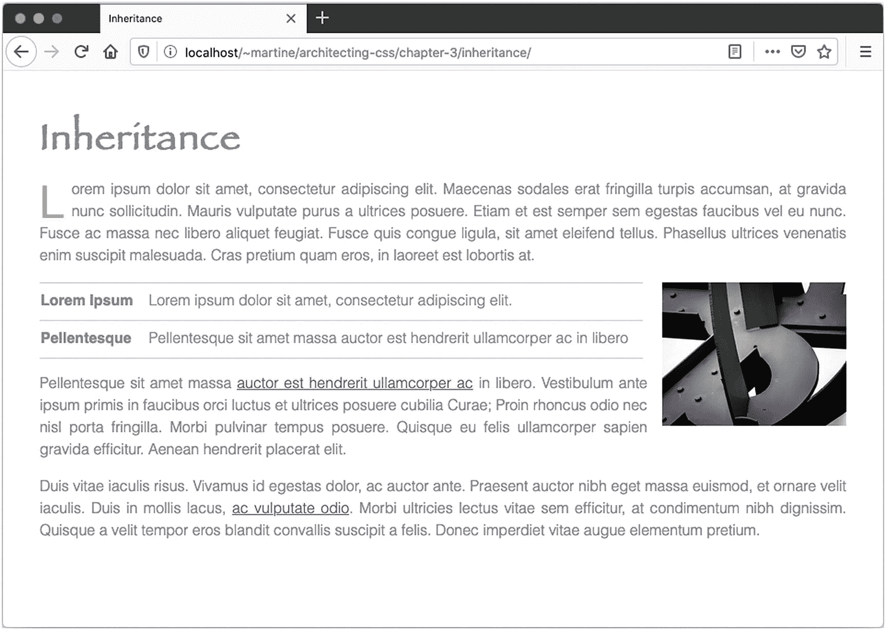
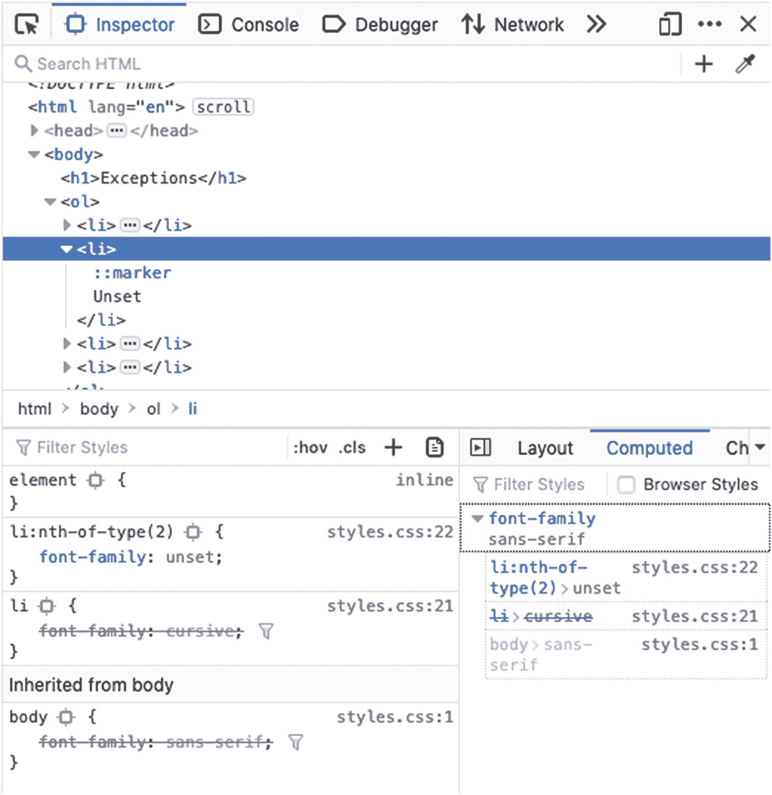
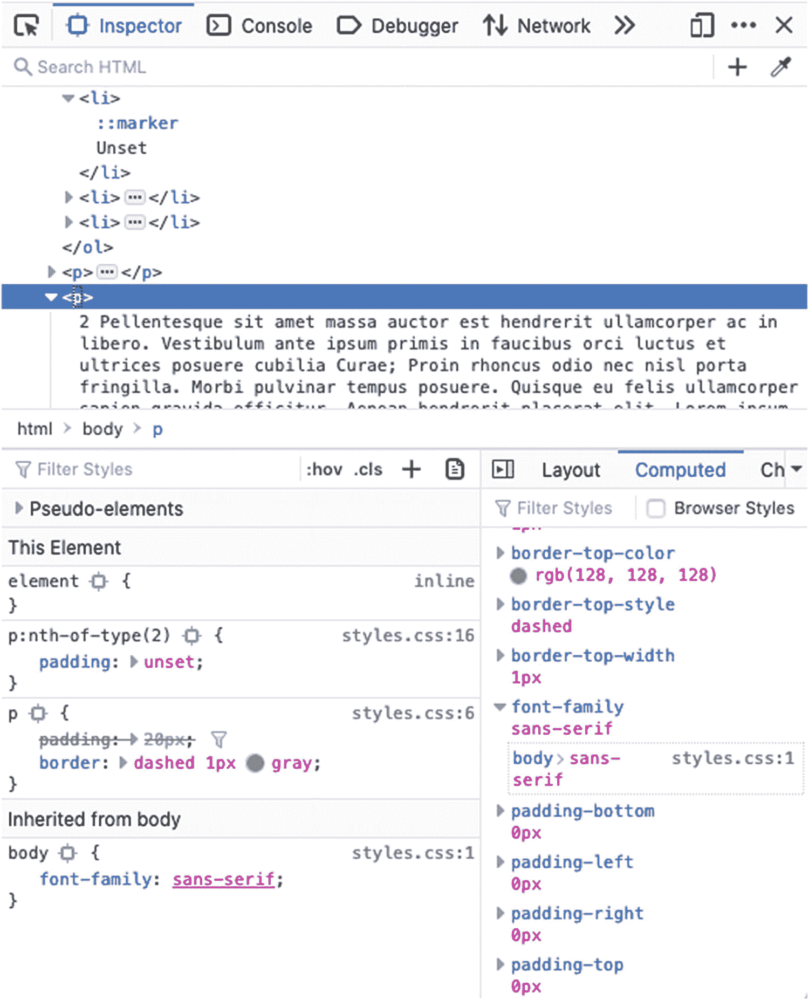
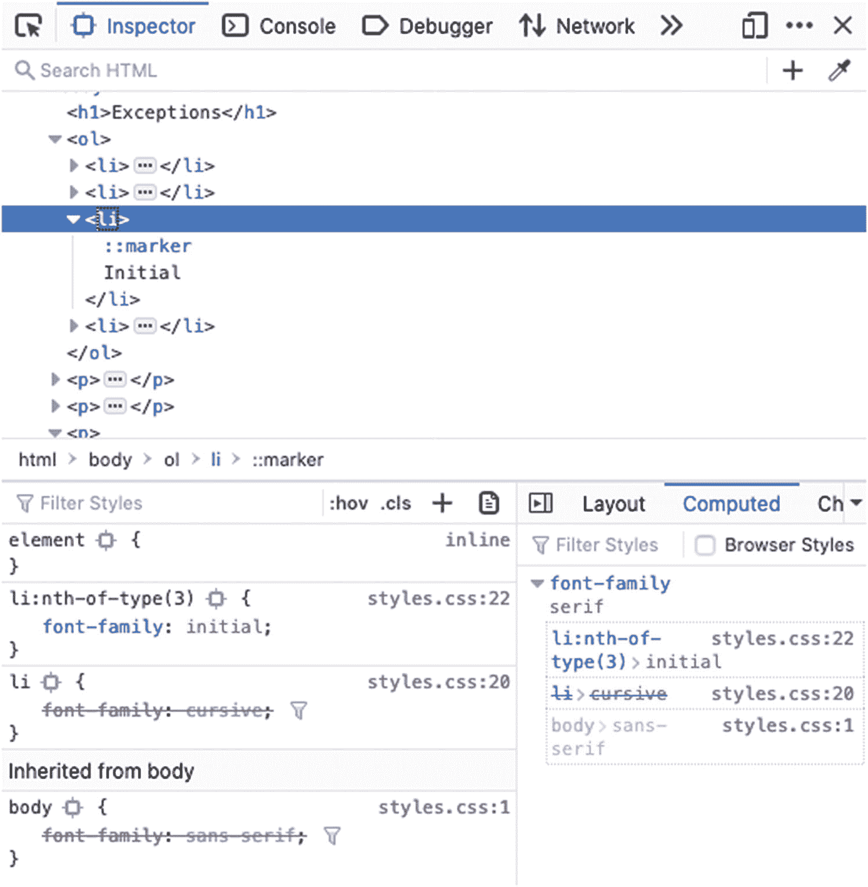
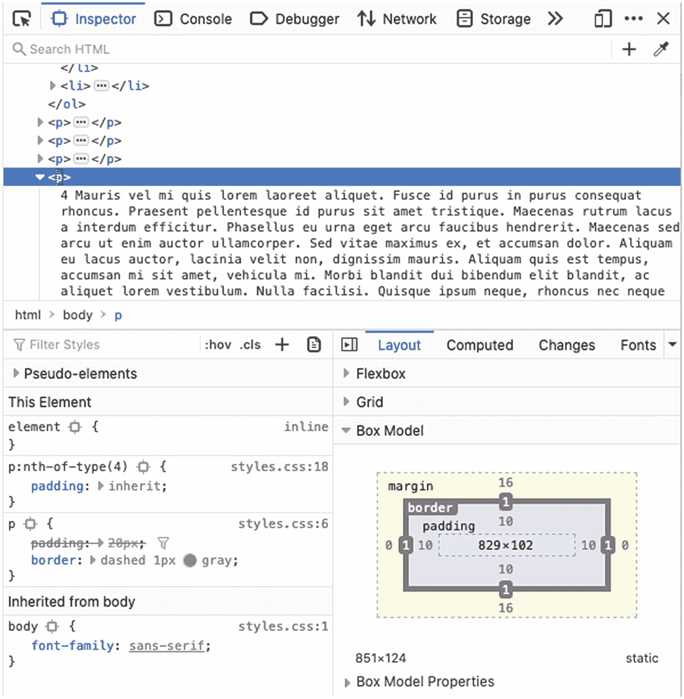

# 三、重要性顺序

正如在第一章中提到的，CSS 的一个重要特性是用户、浏览器和 web 开发者都能够影响页面的最终输出。用户代理、作者和用户都可以影响页面的输出。为了规定什么属性值“胜出”，需要执行多步计算。

## 遗产

继承是一种机制，通过这种机制，CSS 允许父元素上设置的值(如`<body>`)传播到其子元素。这有助于确定在元素属性上没有声明属性时使用什么值。继承的值由父代或祖先的计算值决定。如果不存在，则使用初始值或浏览器设置的默认值。

默认情况下，并非所有属性值都会被继承。 <sup>1</sup> 确实如此的属性通常与主题化相关，例如与排版相关的属性(字体大小、行高、字母间距等。).与布局相关的属性(如显示、边框、宽度和高度)通常不是。如果不可继承的属性没有声明的值，则使用初始值。见清单 3-1 和 3-2 和图 3-1 。

```html
<body>
  <h1>Inheritance</h1>

  <p>Lorem ipsum dolor sit amet, consectetur... </p>
  
  <table>
    <tr>
      <th>Lorem Ipsum</th>
      <td>Lorem ipsum dolor sit amet, consectetur... </td>
    </tr>
    <tr>
      <th>Pellentesque</th>
      <td>Pellentesque sit amet massa auctor est... </td>
    </tr>
  </table>
  <p>Pellentesque sit amet massa... </p>
</body>

Listing 3-1Cascading and Inheritance HTML

```

```html
body {
  color: gray;
  padding: 2rem;
  text-align: justify;
  line-height: 1.5rem;
  font-family: Helvetica, Arial, sans-serif;
  font-weight: lighter;
}

h1 {
  color: slategray;
  font-family: 'Comic Sans MS';
  font-size: 2.5rem;
  letter-spacing: .0625rem;
}
h1 {
  font-family: fantasy;
}

p:first-of-type::first-letter {
  color: gold;
  display: block;
  float: left;
  font-size: 3rem;
  line-height: 0;
  margin: .5rem .5rem 0 0;
}

table {
  border-collapse: collapse;
}
tr {

  color: slategray;
  border-top: solid 1px lightsteelblue;
  border-bottom: solid 1px lightsteelblue;
}
td {
  padding: .5rem 1rem;
}

img {
  margin: 0 0 0 1rem;
  float: right;
  width: 200px;
}

Listing 3-2Cascading and Inheritance CSS

```



图 3-1

级联和继承

body 属性的`text-align`属性值为`justify`。段落属性上未设置样式；然而，这些段落事实上是合理的。段落的`text-align`值继承自主体的`text-align`属性。然而，填充不是继承的，这就是为什么即使正文选择器的填充值为两个 rem，段落、图像、链接等也没有两个 rem 的填充值。

继承的主要好处之一是，它避免了在不同的选择器中一遍又一遍地为相同的属性编写值的需要，有助于代码的风格一致性和可维护性。

在本例中，颜色也是继承的，但是第一段的第一个字母并没有像在`body`选择器中设置的那样显示为灰色，而是像在`p:first-of-type::first-letter`选择器中设置的那样显示为金色。第一段的第一个字母是金色而不是灰色的原因是一个特殊性的问题；`p:first-of-type::first-letter`比`body`更具体。

### 全球价值观

Inherit、unset 和 initial 与 CSS 中的其他属性值略有不同。这些值在所有属性上都可用，它们的明显区别是要么将值重置为默认值，要么重置为祖先值而不是新值。这些值使您可以明确控制属性的继承方式。

`inherit`、`unset,`和`initial`的示例基于清单 3-3 和 3-4 中的代码。

```html
body {
  font-family: sans-serif;
  padding: 10px;
}

p {
  padding: 20px;
  border: dashed 1px gray;
}
p::first-letter {
  display: block;
  float: left;
  font-size: 3rem;
  color: red;
}
p:nth-of-type(2) { padding: unset }
p:nth-of-type(3) { padding: default }
p:nth-of-type(3) { padding: initial }
p:nth-of-type(4) { padding: inherit }

li { font-family: cursive; }
li:nth-of-type(2) { font-family: unset; }
li:nth-of-type(3) { font-family: initial; }
li:nth-of-type(4) { font-family: inherit; }

Listing 3-4Exceptions CSS

```

```html
<body>
  <h1>Exceptions</h1>

  <ol>
    <li>Cursive</li>
    <li>Unset</li>
    <li>Initial</li>
    <li>Inherit</li>
  </ol>

  <p>1 Lorem ipsum dolor sit amet, consectetur... </p>
  <p>2 Pellentesque sit amet massa auctor est... </p>
  <p>3 Duis vitae iaculis risus. Vivamus id egestas... </p>
  <p>4 Mauris vel mi quis lorem laoreet aliquet... </p>
</body>

Listing 3-3Exceptions HTML

```

#### 未设置

根据所分配的属性，Unset 的工作方式会有所不同。如果值可以从父代继承，它将继承；否则，它会将属性值设置为 initial。

在列表项的情况下，由于`font-family`可以被继承，第二个列表项将具有`sans-serif`的`font-family`。该值继承自其父容器`body`(见图 3-2 )。



图 3-2

继承未设置

因为填充是不可继承的，所以填充在第二个段落标签上被设置为`0`，因为段落标签上的初始填充值是`0`(见图 3-3 )。



图 3-3

对不可继承的属性取消设置

#### 最初的

属性的初始值可以由浏览器设置，并且可以根据用户代理而变化。如果 CSS 规范中声明了初始值，那么 initial 应该返回该值。大多数现代浏览器是一致的，但里程可能会有所不同。例如，在 Firefox 中，`font-family`的默认值是`serif`。因此，第三个列表元素`font-family`的值为`serif`(见图 3-4 )。



图 3-4

最初的

#### 继承

属性值将等于父属性的值，无论该属性是否是默认继承的。填充不是继承的。即便如此，当在第四个段落标记的 padding 属性上设置 inherit 时，该段落标记采用设置为其父级`<body>`的值。Body 的填充值为 10px 因此，该段也是如此。见图 3-5 。



图 3-5

继承

如这个例子所示，我们可以通过使用`inherit`属性来强制继承，从而直接控制级联。

## 特征

根据计算特异性的方式，不同类型的选择器有不同的重要性顺序。表 3-1 中总结了四个重要类别，每个类别都比其下一个类别重要一个数量级。

表 3-1

选择器排名

<colgroup><col class="tcol1 align-left"> <col class="tcol2 align-left"></colgroup> 
| 

种类

 | 

选择器

 |
| --- | --- |
| A | ID 选择器 |
| B | 类选择器、属性选择器、伪类 |
| C | 类型选择器，伪元素 |
| Zero | 通用选择器 |

任何给定选择器的特异性计算为三位数，数字 A、B 和 C，其中 A、B 和 C 代表其类别中选择器的总数。 <sup>2</sup> 几个例子见表 3-2 。

表 3-2

计算特异性

<colgroup><col class="tcol1 align-left"> <col class="tcol2 align-left"> <col class="tcol3 align-left"> <col class="tcol4 align-left"> <col class="tcol5 align-left"></colgroup> 
| 

示例选择器

 | 

A

 | 

B

 | 

C

 | 

特征

 |
| --- | --- | --- | --- | --- |
| `*` | Zero | Zero | Zero | Zero |
| `button` | Zero | Zero | one | one |
| `ul li` | Zero | Zero | Two | Two |
| `button:not([type=submit])` | Zero | one | one | 1 1 |
| `a[href$=".pdf"]::before` | Zero | one | Two | 1 2 |
| `button.outline.bold` | Zero | Two | one | 2 1 |
| `button#submit` | one | Zero | one | 1 0 1 |

特殊性在决定级联过程中应用哪些样式时起着重要的作用。

Inline Styles

直接应用于 HTML 中元素的样式，如

`<p style="margin-left: 10px">Lorem ipsum am met...</p>`

是内嵌样式。它们相当于使用 JavaScript 直接在 DOM 中添加属性值。内联样式被赋予了[1 0 0 0]， <sup>3</sup> 的特异性，这比使用普通选择器可能得到的任何东西都高，如表 3-2 所示。内联样式通常被认为是不好的做法，因为它们忽略了继承和级联。但是也有一些不可避免的例外，包括 HTML 电子邮件。

## 优先

规则的应用顺序很重要。直接作为目标的规则总是优先于从父项或祖先继承的规则。如果应用了两个具有相同特征级别的规则，将应用最后一个规则。这个概念是 CSS 的核心，从一开始就有了，正如它的名字“级联样式表”所表明的。

!important

CSS 从业者都知道,`!important`注释既是一个强大的工具，也是一个巨大的负担。当其他方式都不起作用时，web 开发人员有时会使用它来强制一种样式生效。但是你知道吗，`!important`的*目的*实际上是为了提高可访问性。因为重要的用户声明总是具有最高的优先级，所以在呈现页面时，它让用户最终决定设置哪些属性和值。

除了特殊性，规则的来源也是确定元素使用的值的一个因素。表 3-3 按照从最不重要到最重要的顺序显示了层叠期间应用规则的顺序。

表 3-3

级联顺序 <sup>4</sup>

<colgroup><col class="tcol1 align-left"> <col class="tcol2 align-left"> <col class="tcol3 align-left"> <col class="tcol4 align-left"></colgroup> 
| 

命令

 | 

起源

 | 

重要

 | 

优先

 |
| --- | --- | --- | --- |
| one | 用户代理人 | 标准 | eight |
| Two | 用户 | 标准 | seven |
| three | 作者 | 标准 | six |
| four | 动画片 |   | five |
| five | 作者 | `!important` | `4` |
| six | 用户 | `!important` | `3` |
| seven | 用户代理人 | `!important` | `2` |
| eight | 过渡 |   | one |

在层叠中，最后应用的项目获胜；所以，转场会争取用户代理！重要包含用户规则！重要的规则等等。

## 级联

级联表示来自各种源的属性和值以不同的优先级和特性级别组合在一起，以确定将呈现的最终样式集。

需要注意的是，级联到元素的是属性，而不是规则集。元素的最终状态可能包括在许多不同的规则集中声明的属性。

为了计算级联，应用以下公式: <sup>5</sup>

1.  选择具有最高*优先级*的声明。

2.  选择剩余的具有最高*特异性*的声明。

3.  当所有其他因素相同时，最后出现在*的声明将被应用。*

### 价值处理

所有不同来源的属性值被一起使用，以使用以下计算来确定最终值: <sup>6</sup>

1.  首先，对于每个元素上的每个属性，收集应用于元素的所有**声明值**。可能有 0 个或多个声明值应用于该元素。

2.  级联产生**级联值**。每个元素的每个属性最多有一个级联值。

3.  默认产生**指定值**。每个元素的每个属性只有一个指定值。

4.  解析值依赖关系产生**计算值**。每个元素的每个属性只有一个计算值。

5.  格式化文档会产生**已用值**。对于给定的属性，如果该属性适用于元素，则该元素仅具有已用值。

6.  最后，基于显示环境的约束，使用值被转换成**实际值**。与使用的值一样，元素上的给定属性可能有也可能没有实际值。

W3C 规范中的这一计算引用了各种值分类，它们被定义为

*   **声明的** `–`这些都是与被检查的元素和属性相匹配的值(0 `–`多)。

*   **级联** `–`这是处理级联后选择的值(0 `–` 1)。

*   **指定** `–`这是级联的值，如果可用，或者是属性和元素的默认值。对于每个属性和元素，始终有一(1)个指定值。

*   **计算的** `–`指定的值的绝对值，该值可以被子元素继承。

*   **已用** `–`这是用户代理用于文档布局的最终值。

*   **实际** `–`这是设备上实际显示的值，由于设备或环境的限制，可能会从*使用的*值进行调整。

每个元素的每个属性的最终实际值由项目代码以外的各种因素决定，包括设备、用户代理或浏览器、用户代理样式表和用户提供的样式表。

## 摘要

在这一章中，你已经学习了 CSS 如何从许多不同的来源获取规则集，并为网页建立一个应用样式的内聚集的细节。特别是，你学到了

*   HTML 内联样式和`!important`注释如何影响层叠

*   如何计算任何给定选择器的特异性

*   在 DOM 树中继承属性的方式

在下一章中，你将了解 CSS 提供的不同选项，这些选项用于构建能够适应设备和内容变化的流畅的响应性布局。

<aside aria-label="Footnotes" class="FootnoteSection" epub:type="footnotes">Footnotes 1

[`www.w3.org/TR/CSS22/propidx.html`](http://www.w3.org/TR/CSS22/propidx.html)

  2

[`www.w3.org/TR/2018/REC-selectors-3-20181106/`](http://www.w3.org/TR/2018/REC-selectors-3-20181106/)

  3

[`www.w3.org/TR/2018/REC-selectors-3-20181106/#specificity`](http://www.w3.org/TR/2018/REC-selectors-3-20181106/%2523specificity)

  4

CSS 级联介绍:级联顺序。 *MDN 网络文档*。检索 2019 年 12 月 5 日，来自 [`https://developer.mozilla.org/en-US/docs/Web/CSS/Cascade`](https://developer.mozilla.org/en-US/docs/Web/CSS/Cascade)

  5

CSS 级联和继承级别 3:级联。W3C 。检索 2019 年 12 月 5 日，来自 [`www.w3.org/TR/css-cascade-3/#cascading`](http://www.w3.org/TR/css-cascade-3/%2523cascading)

  6

CSS 级联和继承级别 3:值处理。W3C 。检索 2019 年 12 月 5 日，来自 [`www.w3.org/TR/css-cascade-3/`](http://www.w3.org/TR/css-cascade-3/)

 </aside>