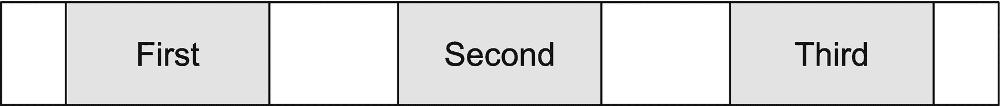

# 四、布局

单个元素放在一起就形成了一个布局。使用 CSS，我们依靠盒子模型来控制每个元素的宽度和行为，而不需要布局。为了控制元素之间的相互关系，我们可以使用 display 和 float 这样的属性。在这一章中，我们定义了盒子模型，并着眼于具体布局的浮动、伸缩、内嵌块和网格。

## 盒子模型

布局内容的基础根植于**框模型**，它描述了为文档树中的元素生成的矩形框。如图 4-1 所示，内容由三个框包围:填充、边框和边距。


图 4-1

盒子模型

这些属性中的每一个，包括内容，都将由维度、类型、定位、与其他元素的关系以及外部信息来控制。

### 盒子尺寸

**Box-sizing** ，或者定义元素高度和宽度的属性，默认情况下有一个 content-box 的值，这意味着当为元素定义宽度和高度时，它只应用于内容。因此，向元素添加填充或边距会增加元素利用的总可用视区的百分比宽度。

#### 内容盒

如果需要两列布局，每个 div 等于视口宽度的 50%,则需要从给定元素的宽度中减去应用于每列的填充量，否则两个元素的总宽度将超过 100%。

考虑包含两个 div 的 800 像素宽的视口。如果没有向 div 添加任何填充、边距或边框，并且每个 div 的宽度为 50%，则它们的组合宽度将等于视口的 100%。如果它们是浮动的，它们将完美地并排放置并占据 100%的屏幕，如图 4-2 所示。


图 4-2

内容框`–`无填充

如果向列添加了填充，列的宽度将增加填充量，从而导致它们超过视区的宽度。图 4-3 显示了添加了填充的列。


图 4-3

带填充的内容框`–`

如果 div 是浮动的，那么第二个 div 将因此被推到第一个 div 的下面，因为它们的组合宽度现在大于容器的 100%,如图 4-4 所示。


图 4-4

使用`box-sizing:` `content-box`时填充和边框的效果

##### 用代码

让我们把前面描述的场景放到代码中(清单 4-1 和 4-2；输出如图 4-4 所示。

```html
.container { overflow:auto; }

.container > div {
  width: 50%;
  float: left;
}

.container p {
  background: rgba(0, 0, 0, .16); /* light grey */
  text-align: center;
}

.container > div:last-of-type p { /* second rectangle */
  background: rgba(0, 0, 0, .32); /* dark grey */
}

.has-padding > div {
  outline: dashed 1px rgba(0, 0, 0, .5);
  padding: 10px;
}

Listing 4-2CSS

```

```html
<body>
  <h1>No Padding</h1>
  <div class="container">
    <div>
      <p>Content</p>
    </div>
    <div>
      <p>Content</p>
    </div>
  </div>

  <h1>With Padding</h1>
  <div class="container has-padding">
    <div>
      <p>Content</p>
    </div>
    <div>
      <p>Content</p>
    </div>
  </div>
</body>

Listing 4-1HTML

```

边框的行为方式与填充相同；因此，应用的任何边框宽度都需要包含在内容和填充的总和中，以计算布局中包含的元素的全宽或全高。

#### 边缘塌陷

边距的行为与填充略有不同。当同级元素都有填充时，应用两者的填充，两个元素之间的间距是两组填充的总和。然而，根据具体情况，利润率可能会下降。**页边距折叠**是指**顶部**和**底部**页边距合并或折叠成一个页边距，等于应用的最大页边距，如图 4-5 所示，或者，如果所有页边距都为负值，则等于最大负值页边距的大小。左右边距不会折叠。


图 4-5

边距折叠

利润率将会崩溃

*   没有任何东西分隔父对象的边距和其子对象的边距，包括填充、边框、内联部分、块格式上下文或清除属性 clear(例如，`clear: right`，与 floats 一起使用)。

*   元素是相邻的兄弟元素，除非后者需要通过浮动来清除(本章后面会有更多关于浮动的内容)。

*   即使其中一个边距等于 0。 <sup>1</sup>

##### 用代码

当两个各有 10 个像素填充的 div 并排设置时，它们之间只有 10 个像素的垂直边距(如清单 4-3 、 4-4 和图 4-6 所示)。

```html
div {
 margin: 10px;
 background: rgba(0, 0, 0, .16); /* light grey */
}

div:last-of-type {
 background: rgba(0, 0, 0, .32); /* dark grey */
}

Listing 4-4CSS

```

```html
<body>
  <div>Content</div>
  <div>Content</div>
</body>

Listing 4-3HTML

```


图 4-6

边缘塌陷

但是，如果我们以前面的例子为例，其中的列是浮动的，并替换了边距的填充，请注意边距没有折叠。当这些列的组合总宽度大于 100%[50%+(2*x*10*px*]*x*2 = 105%时，它们仍然会堆叠在一起，但是因为 div 是浮动的，所以边距不会折叠。见图 4-7 。


图 4-7

浮动 div`–`无边距塌陷

与 border 不同，border 可以应用于任何类型的元素，而 margin 和 padding 对于它们可以应用于哪些元素都有限制。不能在 display 属性值为的元素上设置填充

*   表格-行-组`(<tbody>)`

*   表格标题组`(<thead>)`

*   表格-页脚-组`(<tfoot>)`

*   表格行`(<tr>)`

*   表格-列-组

*   表格列

不能在具有表格显示类型(如`<tr>`、`<td>`等)的元素上设置边距。)除了表格、内嵌表格和表格标题。 <sup>2</sup>

##### 利弊

虽然混合像素和基于百分比的值可以产生一些有趣的数学结果，但是将`box-sizing`值保持为`content-box`的好处是，当宽度或高度值被分配给内容时，它不会受到添加的填充的副作用的影响。内容将完全是由开发人员指定的高度或宽度。此外，因为它是默认值，所以元素的大小将表现出“正常”的预期行为，而不必了解元素上已经设置的其他属性。

Special Case: Outlines and Box Shadows

轮廓和框阴影在边界周围创建框，可以认为属于框模型。事实并非如此，因为轮廓和方框阴影不占用空间。它们自身重叠，类似于图 4-8 中描述的绝对位置。


图 4-8

轮廓和方框阴影

轮廓和方框阴影不仅会覆盖下面的内容，而且会溢出视窗，无法滚动到视窗。因为它们不占用空间，所以不构成溢出，因此滚动条不会被触发。见图 4-9 和清单 4-5 和 4-6 。

```html
.container div {
  background: rgba(0, 0, 0, .16); /* light grey */
  height: 50px;
}

.container div:last-of-type {
  background: rgba(0, 0, 0, .32); /* dark grey */
}

.container.outline div:last-of-type {
  outline: dotted 15px rgba(0, 0, 0, .5);
}

.container.box-shadow div:last-of-type {
  box-shadow: 0px 0px 10px 10px rgba(0, 0, 0, .5)
}

Listing 4-6CSS

```

```html
<body>
  <h1>Outline</h1>
  <div class="container outline">
    <div>Content</div>
    <div>Content</div>
  </div>
  <h1>Box-Shadow</h1>
  <div class="container box-shadow">
    <div>Content</div>
    <div>Content</div>
  </div>
  <h1>Both</h1>
  <div class="container outline box-shadow">
    <div>Content</div>
    <div>Content</div>
  </div>
</body>

Listing 4-5HTML

```


图 4-9

方框阴影和轮廓不占用布局中的空间

当轮廓和框阴影都设置时，它们将相互重叠。

#### 边框

如前所述，`box-sizing: content-box`在混合绝对单位和基于百分比的单位时有一些缺点。当内容有填充时，将内容设置为总宽度或高度的百分比时，内容框也会增加额外的复杂性。

这就是 border-box 出现的原因。分配`box-sizing: border-box`改变元素的宽度和高度的计算方式。它不仅包含内容，还包含内容、填充和边框。当添加填充或边框时，内容本身的宽度和高度会因此而减小。见图 4-10 。


图 4-10

带衬垫的边框

因此，如果我们以两个浮动列的第一个示例为例，我们将看到这两个列保留了 50%的宽度。页边空白仍然以与`content-box`相同的方式运行。清单 4-7 和 4-8 以及图 4-11 显示了与图 4-4 相同的示例，使用`box-sizing: border-box`代替默认的`box-sizing: content-box`。


图 4-11

使用边框的元素

```html
.container { overflow:auto; }
.container > div {
  width: 50%;
  box-sizing: border-box;
  float: left;
}
.container p {
  background: rgba(0, 0, 0, .16); /* light grey */
  text-align: center;
  margin: 0;
}
.container > div:last-of-type p { /* second rectangle */
  background: rgba(0, 0, 0, .32); /* dark grey */
}
.has-padding > div {
  border: dashed 1px rgba(0, 0, 0, .5);
  padding: 10px;
}
.has-margin > div {
  border: dashed 1px rgba(0, 0, 0, .5);
  margin: 10px;
}

Listing 4-8CSS

```

```html
<body>
  <h1>No Padding or Margin</h1>
  <div class="container">
    <div>
        <p>Content</p>
    </div>
    <div>
      <p>Content</p>
    </div>
  </div>

  <h1>With Padding</h1>
  <div class="container has-padding">
    <div>
      <p>Content</p>
    </div>
    <div>
      <p>Content</p>
    </div>
  </div>

  <h1>With Margin</h1>
  <div class="container has-margin">
    <div>
      <p>Content</p>
    </div>
    <div>
      <p>Content</p>
    </div>
  </div>
</body>

Listing 4-7HTML

```

盒子大小不是继承的。它将需要被应用到所有需要被改变的元素。

## 显示

边距和填充允许操作元素的显示；display 属性通过指定框用于元素的呈现类型来控制元素如何相互显示。

自 CSS 出现以来，display 属性就一直是 Web 布局的基石。表 4-1 显示了每个显示值添加到规格的时间。

表 4-1

按 CSS 版本显示属性值 <sup>3</sup>

<colgroup><col class="tcol1 align-left"> <col class="tcol2 align-left"> <col class="tcol3 align-left"></colgroup> 
| 

一级

 | 

第二级

(修订版 1)

 | 

三级

 |
| --- | --- | --- |
| One thousand nine hundred and ninety-six | Two thousand and eleven | Two thousand and eighteen |
| 街区在一条直线上的列表项目没有人 | 内嵌块桌子内嵌表格表格-行-组表格标题组表格-页脚-组表格-行表格-列-组表格列表格单元格表格标题继承 | 内容流根试车内嵌列表项目 flex *嵌入式-flex *网格*嵌入式网格*红宝石** |

**人选推荐*

** *工作草案*

### 在一条直线上的

考虑到流动内容，在流动布局中，内联元素与文本内联放置。默认情况下，以下元素是内联的:

```html
<a>, <abbr>, <acronym>, <audio> (if it has visible controls), <b>, <bdi>, <bdo>, <big>, <br>, <button>, <canvas>, <cite>, <code>, <command>∗∗, <data>, <datalist>, <del>, <dfn>, <em>, <embed>, <i>, <iframe>, , <input>, <ins>, <kbd>, <keygen>*, <label>, <map>, <mark>, <meter>, <noscript>, <object>, <output>, <picture>, <progress>, <q>, <ruby>, <s>, <samp>, <script>, <select>, <slot>, <small>, <span>, <strong>, <sub>, <sup>, <svg>, <template>, <textarea>, <time>, <u>, <tt>, <var>, <video>, <wbr>4

```

* *已弃用*

** *废弃*

当内容以内联方式显示时，默认情况下，元素从左到右排列，并在宽度允许的情况下并排放置。默认情况下，无论填充和边距如何，元素都将自己与文本基线对齐。如果宽度不允许，内容将在下面换行，如图 4-12 和 4-13 以及清单 4-9 和 4-10 所示。


图 4-12

内嵌元素


图 4-13

使用边框的元素

```html
body {
  font-size: 24px;
  padding: 36px;
  margin: 0;
}

a {
  padding: 10px;
  outline: dotted 2px grey;
}

code {
  margin: 10px;
  outline: dotted 2px grey;
  outline-offset: 8px;
}

Listing 4-10CSS

```

```html
<body>
    I am some text.
    <span>I am a span.</span>
    More text goes here.
    <code>I am code.</code>
    And some more text.
    <a href="">I am an anchor tag.</a>
</body>

Listing 4-9HTML

```

### 块状元素

也被认为是流动内容，块元素堆叠在另一个之上，除非它们受到另一个属性(如 float)的影响。

以下元素默认为块级元素: <sup>5</sup>

```html
<address>, <article>, <aside>, <blockquote>, <details>, <dialog>, <dd>, <div>, <dl>, <dt>, <fieldset>, <figcaption>, <figure>, <footer>, <form>, <h1>, <h2>, <h3>, <h4>, <h5>, <h6>, <header>, <hgroup>, <hr>, <li>, <main>, <nav>, <ol>, <p>, <pre>, <section>, <table>, <ul>

```

图 4-14 和 4-15 显示了块级元素的默认行为。


图 4-14

默认块级行为图

默认情况下，块级元素将占据视口的整个宽度。如果应用了宽度，即使元素内联仍有足够的空间，block 元素仍会将其自身放置在前一个元素的下方。参见清单 4-11 和 4-12 。


图 4-15

默认块级行为

```html
html, body {
  font-size: 24px;
  padding: 36px;
  margin: 0;
}

div {
  background: rgba(0, 0, 0, .16);
  height: 50px;
  margin: 20px;
  outline: dotted 1px gray;
  outline-offset: 19px;
  text-align: center;
}

div:first-of-type {
  padding: 20px;
}

div:nth-of-type(2),
div:last-of-type {
  width: 200px;
}

Listing 4-12CSS

```

```html
<body>
  <div>Content</div>
  <div>Content</div>
  <div>Content</div>
</body>

Listing 4-11HTML

```

如果一个行内元素被放置在一个块元素之后，行内元素仍然会被放置在块元素之后，如清单 4-13 、 4-14 和图 4-16 所示。


图 4-16

块和内联

```html
html, body {
  font-size: 24px;
  padding: 36px;
  margin: 0;
}

div {
  background: rgba(0, 0, 0, .16);
  height: 50px;
  width: 200px;
}

Listing 4-14CSS

```

```html
<body>
  <div>Block Content</div>
  <span>Inline Content</span>
</body>

Listing 4-13HTML

```

### 内嵌块

内联式数据块利用了数据块和内联式的概念。它的行为类似于一个块元素，但会像内联一样与周围的内容一起流动。内嵌块的一个常见用例是水平导航；参见清单 4-15 和 4-16 以及图 4-17 。


图 4-17

内嵌块

```html
html, body {
  font-size: 24px;
  padding: 36px;
  margin: 0;
}

ul {
  margin: 0;
  padding-left: 0;
  background: lightgray;
}
li {
  list-style-type: none;
  display: inline-block;
  margin: 2rem;
}

a {
  padding: 1rem 2rem;
  background: white;
  border-radius: 2rem;
}

Listing 4-16Inline-Block CSS

```

```html
<body>
  <nav>
    <ul>
      <li><a href="">Home</a></li>
      <li><a href="">About</a></li>
      <li><a href="">Contact</a></li>
    </ul>
  </nav>
</body>

Listing 4-15Inline-Block HTML

```

内联、块和内联块元素的默认行为不足以创建经常需要的布局。在 grid 和 flex 等选项于 2018 年推出或 float(直到 1996 年推出)之前， <sup>6</sup> 即使数据不是表格，我们也依赖于表格。长期以来，这是创建一些更复杂布局的唯一选择，因为即使 CSS 规范描述了更好的方法，浏览器也不一定支持它们。今天，这种情况不再存在，并且现在完全不赞成将表格用于显示目的，因为它阻止了辅助技术将正在显示的内容正确地传达给用户。一些例外，如电子邮件模板，仍然存在。类似于为什么历史上它们被用于网站的显示目的，大多数电子邮件客户端很少或根本不支持 CSS 布局属性，但是可访问性问题仍然存在，因此应该尽可能避免用于布局的表格。然而，对于一般的 web 使用，使用表格进行布局被认为是不好的形式并且不可访问。我们将讨论三种常用的内容布局模式:浮动、flexbox 和网格。

### 浮动

与 flex 和 grid 不同，float 不是 display 属性的一部分，而是一个独立的属性。

浮动的一个很好的用例是当一个图形包含在文本中时，允许文本围绕图形流动，如图 4-18 所示。


图 4-18

浮动图像

然而，使用 float 创建布局要困难得多。让我们看一个使用以下 HTML 的例子(清单 4-17 )。

```html
<body>
  <h1>Flexbox</h1>
  <nav>
    <ul>
      <li>Nav Element</li>
      <li>Nav Element</li>
      <li>Nav Element</li>
    </ul>
  </nav>
  <div class="container">
    <section>
      <div><span>1</span></div>
      <div><span>2</span></div>
      <div><span>3</span></div>
    </section>
    <main>
      <h2>Main Content</h2>
      <p>Lorem ipsum dolor sit amet, consectetur... </p>
      
      <p>Varius morbi enim nunc faucibus a. Ut placerat... </p>
      <p>Eget duis at tellus at urna condimentum mattis... </p>
    </main>
    <aside>
      <h2>Aside</h2>
      <p>Placerat duis ultricies lacus sed turpis tincidunt id aliquet... </p>
    </aside>
  </div>
</body>

Listing 4-17Example HTML

```

我们将尝试实现图 4-19 中的布局。


图 4-19

布局示例

从导航开始，我们已经看到了图 4-20 (列表 4-18 和 4-19 )中的问题。

```html
html, body {
  padding: 36px;
  margin: 0;
}

h1 {
  text-align: center;
}
nav {
  border-top: solid 1px gray;
  border-bottom: solid 1px gray;
}
nav ul { padding: 0; }
nav li {
  list-style-type: none;
  width: 33%;
  float: left;
}

Listing 4-18Float: CSS

```

一旦列表项被浮动，边框就会在它们上面升起，左边栏中的数字会自动出现在它的左边(图 4-20 )。


图 4-20

浮动导航

为了让数字正常工作，必须清除浮点。我们可以使用列表中的`display: flow-root`来清除浮动。这是一处相当新的房产。历史上，“clearfix”或“group”类(见清单 4-19 )会被添加到列表中。

```html
.clearfix::after {
  content: "";
  clear: both;
  display: table;
}

Listing 4-19Clearfix

```

继续向下页面，我们可以接近带有浮动的目标布局(图 4-19 )(见清单 4-20 和图 4-21)；但是，该列并没有在屏幕底部对齐。当调整窗口大小和内容重排时，将左栏中的数字居中以看起来均匀分布也不起作用。此外，由于填充用于使数字居中，如果内容是为完整的句子而不是数字编辑的，则必须重新计算填充，否则文本将不再居中。


图 4-21

尝试使用浮动的布局

```html
html, body {
  padding: 36px;
  margin: 0;
}

h1 {
  text-align: center;
}
nav {
  border-top: solid 1px gray;
  border-bottom: solid 1px gray;
  display: flow-root;
}
nav ul {
  padding: 0;
  margin: 0;
}
nav li {
  box-sizing: border-box;
  list-style-type: none;
  float: left;
  padding: 1rem;
  text-align: center;
  width: 33.33%;
}

section {
  float: left;
  background: rgba(0, 0, 0, .16);
}
section div {
  box-sizing: border-box;
  color: white;
  background: rgba(0, 0, 0, .50);
  height: 100px;
  width: 100px;
  text-align: center;
  padding: 37px;
  margin-top: 5rem;
  margin-bottom: 5rem;
}

main {
  background: rgba(0, 0, 0, .05);
  box-sizing: border-box;
  padding: 30px;
  float: left;
  width: calc(100vw - 244px - 30%)
}

aside {
  box-sizing: border-box;
  background: rgba(0, 0, 0, .16);
  width: 30%;
  padding: 30px;
  float: right;
}

img {
  width: 100%;
  max-width: 250px;
  float: left;
  padding-right: 20px;
}

Listing 4-20CSS for Figure 4-21

```

让图片周围的文本工作得非常好，因为这就是 float 的设计目的。然而，布局的其余部分有一些问题。填充以及设置的高度和宽度的组合很可能会使较长的内容在最左边的栏中扩展到其容器之外。同样令人担忧的是，100%不容易被 3 整除，因此根据浏览器决定如何计算每个导航元素的宽度，内容可能会以不应该的方式被推来推去。最后，柱子上的背景并不一致。

出于所有这些原因，这将是一个容易出错且难以维护的布局。为了实现这种布局，并使 UI 流畅，在引入 flexbox 和 grid 之前，就需要使用表格、CSS `display: table`属性和/或 JavaScript。

### flex box(flex box)的缩写形式

从历史上看，在前面的例子中，有两种类型的布局非常困难，包括:

*   不管其中的内容如何，背景颜色都要对齐的多列

*   垂直居中内容

今天我们有了 flexbox。解决这两个问题是 flex 真正的亮点。Flexbox 还允许根据内容量动态确定列宽。当创建一个需要控制容器中元素间距的布局时，使用`display: flex`特别有用。

让我们再次尝试创建我们的布局，这次使用 flexbox(清单 4-21 )。

```html
h1 { text-align: center; }

nav {
  border-top: solid 1px gray;
  border-bottom: solid 1px gray;
}

ul {
  display: flex;
  padding-left: 0;
  justify-content: space-around;
}

.container { display: flex; }

aside {
  background: rgba(0, 0, 0, .16);
  flex-basis: 30%;
  flex-shrink: 0;
  padding: 30px;
}

section {
  background: rgba(0, 0, 0, .5);
  align-items: center;
  display: flex;
  flex-direction: column;
  justify-content: space-evenly;
}

section div {
  color: white;
  background: rgba(0, 0, 0, .50);
  align-items: center;
  display: flex;
  height: 100px;
  justify-content: center;
  width: 100px;
}

main {
  background: rgba(0, 0, 0, .05);
  padding: 30px;
}

li { list-style-type: none; }
img {
  width: 100%;
  max-width: 250px;
  float: left;
  padding-right: 20px;
}

Listing 4-21Flexbox CSS

```

剖析前面的布局，我们将 flex 应用于布局的三个区域，三个内容列、导航和最左边的列本身。对于最左边的列和导航，使用 flex 来分别垂直和水平地分布容器中的内容。

#### 弯曲方向

Flexbox 应用于两个轴:主轴和横轴。主轴定义了布局的方向。属性`flex-directio` n 用在容器上，包括四个选项:`row`、`row-reverse`、`column`、`column-reverse`，默认为`row`。这将决定元素显示的顺序和布局的方向(见图 4-22 )。


图 4-22

柔性盒主轴

默认情况下，Flexbox 会尝试将所有内容放在一行中，但是可以使用`flex-wrap`属性让内容换行。`flex-wrap`属性可以取以下任意值(图 4-23 ):


图 4-23

包装

*   `nowrap` `–`这是默认的。所有项目将被放置在主轴线后的一行上，必要时会导致溢出。

*   `wrap` `–`项会从上到下换行。

*   `wrap-reverse` `–`项将自下而上换行。

通过添加到 row、column 或 wrap，我们可以改变元素的显示顺序。如果我们想单独移动序列中的特定元素，我们可以使用`order`。属性采用整数，默认情况下为 0。如果一个元素被赋值为 1，并且所有其他元素被设置为缺省值 0，那么它将出现在最后。如果赋值为-1，该元素将出现在开头。因此，顺序基于提供的序列，然后基于使用 order 属性分配给每个元素的值进行加权。

#### 调整内容

为了确定每个元素在主轴上的位置，我们在容器上使用`justify-content`。可能的值如下:

**flex-start** `–`元素放在容器的开头。弹性启动是默认值。


**flex-end** `–`元素被放置在容器的末端。


**居中** `–`元素被放置在容器的中心。


**space-between** `–`元素在容器中均匀分布，容器的边缘与第一个和最后一个项目之间没有空间。


**空间环绕** `–`元素在容器中均匀分布，容器边缘与第一个和最后一个项目之间的空间是其他项目之间空间的一半。


**空间均匀** `–`元素在容器中均匀分布，边缘与第一个和最后一个元素之间以及元素之间的间距相同。


Inline-Block

Flex-start、middle 和 flex-end 比 inline-block 有一些优势。对于很多用例来说，`display: inline-block`配合`text-align`使用可以达到同样的效果；然而，内联块在间距方面有一些复杂性。即使边距设置为 0，元素之间也会出现小间隙。因此，元素的总和等于容器宽度的 100%的布局变得很难创建。让我们看看代码及其输出(清单 4-22 和 4-23 以及图 4-24 )。

**例 1**


图 4-24

内嵌块间隙

```html
html, body {
  padding: 12px 36px;
  margin: 0;
  font-size: 32px;
}

ul {
  padding-left: 0;
}

li {
  display: inline-block;
  padding: 10px 20px;
  background: grey;
  color: white;
}

Listing 4-23Inline-Block CSS

```

```html
<body>
  <h1>Example 1</h1>
  <nav>
    <ul>
      <li>inline-block element</li>
      <li>inline-block element</li>
      <li>inline-block element</li>
    </ul>
  </nav>
</body>

Listing 4-22Inline-Block HTML

```

请注意内联块元素之间的间隙。列表元素上没有边距。弯曲的项目不会受到这种意外行为的影响。

#### 对齐项目和对齐自身

横轴垂直于主轴。回顾我们最初的 flexbox 示例(图 4-24 ，我们有三列内容，左边的数字部分、中间的内容部分和右边的部分。对于它们中的每一个都有相同的长度，由它们各自的背景颜色在底部对齐来表示，我们可以使用`align-content`属性。这些值如下所示:

**拉伸** `–`元素将扩展到容器的可用高度(如果伸缩方向为列，则为宽度)。



对于列来说，这种行为允许弯曲的元素增加大小，类似于表格行，以便包含的所有元素都与数组中最新的元素具有相同的高度。

**flex-start 或 start** `–`元素将与容器顶部对齐，类似于`vertical-align: top`。


**flex-end 或 end** `–`元素将与容器底部对齐，类似于`vertical-align: bottom`。


**中心** `–`元素将对齐容器的中间，类似于`vertical-align: middle`。


**基线** `–`元素将与文本基线对齐，类似于`vertical-align: baseline`。


上述属性是在容器上设置的，将应用于中的所有元素。要操作单个元素并使其行为不同于其他元素，我们可以使用`align-self`。其值与前面列出的`align-items`的值相同。

#### 弹性基础、弹性增长和弹性收缩

**Flex-basis** 允许设置元素开始的基本宽度。它们的内容将决定它们是否需要增长或收缩以适应容器中的可用空间。

为了确保内容填满容器中 100%的可用空间，可以应用一个 **flex-grow** 属性。默认设置为 0，它指定弯曲项目的增长因子。该值基于比率。如果容器的所有同级都具有相同的值，那么它们都将增长相同的量，因此元素的总和等于可用宽度的 100%(如果 flex-direction 设置为 column，则为高度)。否则，它将根据每个弯曲元素上定义的比率进行分配。

**Flex-shrink** 的工作方式与 flex-grow 类似，只是收缩内容以防止溢出。默认情况下设置为 1，它可以设置为 0，并与 flex-basis 结合使用，以确保弯曲元素具有固定的宽度(或高度，如果将 flex-direction 设置为 column)。

由于能够动态处理所提供的空间，display-flex 使得生成流畅的设计和对齐内容比以往任何时候都更容易，而无需为了显示而使用表格，但它是非常单向的。然而，网格带来了第二维度。

### 格子

最近引入的还有网格。grid 的亮点在于它让开发人员能够命名各个部分，使代码易于阅读和维护。与 flexbox 一次只处理一个方向不同，grid 允许定义行和列。这些部分可以是名称，如清单 4-24 中所示，或者基于行号和列号，如清单 4-26 中所示。

```html
.container {
 display: grid;
 grid-template-columns: 1fr 1fr 1fr 300px;
 grid-template-rows: 46px auto 36px;
 grid-template-areas:
   "header header header header"
   "main main . sidebar"
   "footer footer footer sidebar";
}

Listing 4-24Grid CSS

```

`Grid-template-columns`定义了四列。前三个等宽，最后一个 300 像素。这里使用的“fr”单位以比率的形式表示剩余空间的分数。 <sup>7</sup> 最后一列将被赋予 300 像素的宽度；其他三个将获得与其宽度相等的剩余空间。

`Grid-template-rows`定义三行，第一行的高度和最后一行的高度分别为 46 和 36 像素。中间一行设置为 auto，将调整其高度以适应其内容。

`Grid-template-areas`在刚刚创建的 4 乘 3 的网格上，按行定义命名区域，如图 4-25 所示。


图 4-25

网格模板区域

所以看看完整的实现，代码看起来和输出看起来如下(清单 4-25 和 4-26 )。图 4-26 显示输出。

```html
html, body {
  padding: 36px;
  margin: 0;
}

header {
  grid-area: header;
  background: rgba(0, 0, 0, .1);
  text-align: center;
  padding: 5px;
}
main {
  grid-area: main;
  background: rgba(0, 0, 0, .2);
  padding: 10px;
}
.sidebar {
  grid-area: sidebar;
  padding: 10px;
  background: rgba(0, 0, 0, .3);
}
footer {
  grid-area: footer;
  background: rgba(0, 0, 0, .5);
  text-align: center;
  color: white;
}
.container {
 display: grid;
 grid-template-columns: 1fr 1fr 1fr 1fr;
 grid-template-rows: 46px auto 36px;
 grid-template-areas:
   "header header header header"
   "main main . sidebar"
   "footer footer footer sidebar";
}

header, footer {
  display: flex;
  align-items: center;
  justify-content: center;
}
header h2, footer h2 {
  margin: 0;
}

Listing 4-26Grid CSS

```

```html
<body>
  <div class="container">
    <header>
      <h2>Header</h2>
    </header>
    <main>
      <h2>Main</h2>
      <p>Lorem ipsum dolor sit amet, consectetur… </p>
      <p>Quisque faucibus, augue sed varius ornare… </p>
    </main>
    <aside class="sidebar">
      <h2>Sidebar</h2>
      <ol>
        <li>Lorem</li>
        <li>Ipsum</li>
        <li>Dolor</li>
        <li>Sit</li>
        <li>Amet</li>
      </ol>
    </aside>
    <footer>
      <h2>Footer</h2>
    </footer>
  </div>
</body>

Listing 4-25Grid HTML

```

请注意“.”第二行的`grid-template-areas`为容器类；这允许三列/第二行网格部分保持空白。


图 4-26

电网输出

每个 UI 元素都被设置为其命名的`grid-area`。这样做的好处是命名可以遵循被定位容器的目的，使得代码易于阅读和维护。此外，当为了响应性而重新定位元素时，唯一需要更新的属性是`grid-template-areas`。

Grid 还允许使用列号和行号来定义区域。如图 4-27 所示，列的编号从最左边的 1 开始，行的编号从最上面的 1 开始。


图 4-27

网格行和列

使用与前面相同的 HTML，我们可以通过给每个部分分配`grid-row`和`grid-column`值来获得相同的输出(清单 4-27 )。

```html
html, body {
  padding: 36px;
  margin: 0;
}

header {
  grid-area: header;
  background: rgba(0, 0, 0, .1);
  text-align: center;
  padding: 5px;
  grid-row: 1;
  grid-column: 1 / 5;
}
main {
  grid-area: main;
  background: rgba(0, 0, 0, .2);
  padding: 10px;
  grid-row: 2;
  grid-column: 1;
}
.sidebar {
  grid-area: sidebar;
  padding: 10px;
  background: rgba(0, 0, 0, .3);
  grid-row: 2 / 4;
  grid-column: 4;
}
footer {
  grid-area: footer;
  background: rgba(0, 0, 0, .5);
  text-align: center;
  color: white;
  grid-row: 3;
  grid-column: 1 / 4;
}
.container {
 display: grid;
 grid-template-columns: 1fr 1fr 1fr 1fr;
 grid-template-rows: 46px auto 36px;
}

header, footer {
  display: flex;
  align-items: center;
  justify-content: center;
}
header h2, footer h2 {
  margin: 0;
}

Listing 4-27Grid CSS

```

`Grid-row`和`grid-column`可以用一个整数(`grid-row: 1`)或者用一个`/` ( `grid-row: 1/3`)分开的两个整数来定义。当只使用一个整数时，该部分将从指定的行开始，跨越一列或一行，例如前面示例中的`main`元素。当使用由`/`分隔的两个整数时，该部分将从第一个整数指定的行开始，到第二个整数指定的行结束，如页脚的`grid-column`值所示。

与 flexbox 或 table 类似，可以调整内容在节中的位置。可以在 grid 容器上使用 justify-items 属性来确定节或单元格内的内容如何从左到右对齐。其值为开始、结束、中心和拉伸，如图 4-28 所示。拉伸是默认值。


图 4-28

对齐-项目值

通过使用特定部分的`justify-self`属性，可以使用相同的值来更改特定单元格的对齐方式。

要指定内容如何在单元格中垂直对齐，我们可以将 align-items 属性分配给 grid 容器。其值与之前的相同，也默认为拉伸(图 4-29 )。


图 4-29

使用 Align-Items 进行垂直对齐

与`justify-self`类似，相同的值可以与单个部分上的`align-self`属性一起使用，以允许单元格的行为不同于容器上的默认设置。

就像 flexbox 一样，grid 也有一个 justify-content 和 align-items 属性。它们与 flexbox 具有相同的价值观和工作方式。它们在容器内水平和垂直定位网格单元。当网格本身小于网格容器时，这非常有用。

为了增加单元格之间的空间，可以使用网格间隙。这将决定每行和/或每列之间的间距。分别使用网格-行-间隙和网格-列-间隙来设置它们。例如，`grid-gap: 5px 2rem`将在每行之间设置 5 个像素的间隙，在每列之间设置 2 个 rems 的间隙。

最后，grid 有一个自动布局算法。当要放置的项目多于 CSS 定义的项目时，或者当一个元素的 grid-column 或 grid-row 值超出容器模板中定义的界限时，就会出现这种情况。使用网格自动流动属性控制自动放置的行为。自动流动可以优化灌装

*   **用行值**逐行`–`填充行，并根据需要添加新行

*   **按列，使用列值** `–`填充列并根据需要添加新列

为了让网格填充可能存在的任何间隙，可以将 dense 添加到行和列值中，`grid-auto-flow: column dense`。

网格现在在 evergreen 浏览器中得到更广泛的支持，但在 Internet Explorer 11 等较老的浏览器中存在一些兼容性问题，Internet Explorer 11 目前还没有完全实现该规范。

 **使用 Flexbox 或 Grid 时的可访问性**

Grid 和 flexbox 提供了随意重新定位和重新排序内容的能力，只需改变一两个属性，而不考虑 HTML 中的顺序。这对于可访问性来说是个问题。

网站内容可访问性指南指出

当内容呈现的顺序影响其含义时，可以通过编程来确定正确的阅读顺序。(A 级)准则 1.3.2 有意义的序列(A 级) <sup>8</sup>

当使用 CSS 改变元素的顺序时，确保编程顺序仍然有意义是很重要的。

## 响应性设计

响应性设计实现的核心是媒体查询。

Media Query

媒体查询允许作者测试和查询用户代理或显示设备的值或特征，而与正在呈现的文档无关。它们用在 CSS **@media** 规则中，以有条件地将样式应用于文档，以及各种其他上下文和语言，如 HTML 和 JavaScript。

—媒体查询级别 4 <sup>9</sup>

更具体地说，使用媒体查询允许您根据视口的特性有条件地更改样式。响应式设计中经常使用的是与视口宽度相关的媒体查询，最终目标是为小型移动屏幕和大型桌面显示器以及介于两者之间的任何设备定制布局。为了实现这一技术，在样式将改变的不同视口宽度处选择断点。CSS 可能如清单 4-28 所示。

```html
@media (min-width: 500px) { ... }

Listing 4-28Media Query

```

其中除非视口的宽度大于 500 像素，否则括号之间的任何内容都不会被应用。宽度范围也可以这样声明(清单 4-29 )。

```html
@media (500px <= width <= 700px) { ... }

Listing 4-29Ranged Media Query

```

当视口宽度在 500 和 700 像素之间时应用样式的位置。

人们很容易陷入这样的思维陷阱:需要为每个断点重写样式。此外，当从窄到宽布局时，需要覆盖的样式比从宽到窄少得多。这是因为在较窄的布局中，项目比宽布局更容易简单地堆叠。对于大多数用例，设置响应以减少代码量的最简单方法是从窄布局开始，然后随着屏幕变宽而增加。我们来看看这个样本设计的实现(图 4-30 )。


图 4-30

响应式设计

为了实现这种布局，将使用清单 4-30 中的 HTML。

```html
<body>
  <header>
    <h1>Responsive Design</h1>
  </header>
  <nav>
    <ul>
      <li><a href="">Link 1</a></li>
      <li><a href="">Link 2</a></li>
      <li><a href="">Link 3</a></li>
    </ul>
  </nav>
  <h2>My Items</h2>
  <main>
    <article>
      <h3>Article Title</h3>
      <p>Lorem ipsum dolor sit amet, consectetur elit...</p>
      <a href="">Read More</a>
    </article>
    ...
  </main>
</body>

Listing 4-30Responsive Layout HTML

```

我们做的第一件事是建立一些不管屏幕大小都适用的基本样式(清单 4-31 )。

```html
html, body {
  margin: 0;
  padding: 0;
}

body {
  box-sizing: border-box;
  font-family: 'Gill Sans', 'Gill Sans MT', ... sans-serif;
  height: 100vh;
  left: 0;
  margin: 0;
  position: absolute;
  top: 0;
  width: 100vw;
}

h1, h2, h3 {
  font-family: Impact, Haettenschweiler, ... sans-serif;
  margin: 0;
}

header {
  background: rgba(0, 0, 0, .1);
  box-sizing: border-box;
  grid-area: header;
  text-align: center;
  padding: .75rem;
}

nav {
  background: #c6c6c6;
  grid-area: nav;
}
nav ul {
  margin: 0;
  padding: 0;
  display: flex;
  justify-content: space-evenly;
}
nav li { list-style-type: none; }
nav a {
  display: block;
  padding: 1rem;
}

h2 {
  background: #c6c6c6;
  grid-area: title;
  padding: .5rem 1rem;
}

main {
  padding: 1rem;
  grid-area: main;
  overflow: auto;
}
article {
  background: #e9e9e9;
  border-left: solid 2.5rem gray;
  padding: 1rem;
  margin-bottom: 1rem;
}
article a {
  display: block;
  text-align: right;
}

Listing 4-31Base Styles

```

然后我们可以为每个断点添加布局特定的信息(清单 4-32 和 4-33 )。

```html
/* Desktop layout */
@media (min-width: 500px) {
  body {
    grid-template-columns: 1fr;
    grid-template-rows: auto auto auto;
    grid-template-areas:
      "header"
      "nav"
      "title"
      "main";
    height: auto;
    overflow: auto;
  }

  main { column-width: 250px ; }
  article { break-inside: avoid; }
  h2 { background: none; }
}

Listing 4-33Desktop CSS

```

```html
/* Mobile layout */
body {
  display: grid;
  grid-template-columns: 1fr;
  grid-template-rows: 4rem auto auto 3rem;
  grid-template-areas:
    "header"
    "title"
    "main"
    "nav";
  height: 100vh;
  overflow: hidden;
}

Listing 4-32Mobile CSS

```

注意，在清单 4-33 中，为桌面用户重新调整布局只需要很少的 CSS。这是因为基本样式已经应用，不需要复制。在这里，我们还可以看到命名区域对于网格布局的优势，以及组织它们以实现正确布局的便利性。

## 摘要

元素受制于盒子模型，盒子模型规定了元素的宽度、填充、边距和边框的行为方式。当这些元素放在一起时，就形成了一个布局。有多少种布局就有多少种方法，但是每种技术都有自己的优点和缺点。我们已经研究了 float、flexbox 和 grid，以及针对响应性布局的媒体查询。

在下一章，我们将会看到 CSS 没有像预期的那样工作的场景，特别关注浏览器之间的差异。

<aside aria-label="Footnotes" class="FootnoteSection" epub:type="footnotes">Footnotes 1

掌握保证金崩溃。(2019 年 8 月 4 日)。检索自 [`https://developer.mozilla.org/en-US/docs/Web/CSS/CSS_Box_Model/Mastering_margin_collapsing`](https://developer.mozilla.org/en-US/docs/Web/CSS/CSS_Box_Model/Mastering_margin_collapsing)

  2

8 箱型。(2019 年 8 月 4 日)。检索自 [`www.w3.org/TR/CSS22/box.html`](http://www.w3.org/TR/CSS22/box.html)

  3

显示。(2019 年 8 月 4 日)。检索自 [`https://developer.mozilla.org/en-US/docs/Web/CSS/display`](https://developer.mozilla.org/en-US/docs/Web/CSS/display)

  4

内嵌元素。(2019 年 8 月 4 日)。从 [` developer 中检索。mozilla。org/en-US/docs/Web/HTML/Inline _ elements`](https://developer.mozilla.org/en-US/docs/Web/HTML/Inline_elements)

  5

块级元素。(2019 年 8 月 4 日)。检索自 [`https://developer.mozilla.org/en-US/docs/Web/HTML/Block-level_elements`](https://developer.mozilla.org/en-US/docs/Web/HTML/Block-level_elements)

  6

级联样式表，级别 1。(1996 年 12 月 17 日)。检索自 [`www.w3.org/TR/CSS1/#float`](http://www.w3.org/TR/CSS1/%2523float)

  7

CSS 网格布局模块级别 1: 7.2.3。灵活的长度:“fr”单位。(2019 年 8 月 5 日)。检索自 [`www.w3.org/TR/css3-grid-layout/#fr-unit`](http://www.w3.org/TR/css3-grid-layout/%2523fr-unit)

  8

网页内容可访问性指南(WCAG) 2.0，有意义的序列。(2019 年 8 月 7 日)。检索自 [`www.w3.org/TR/2008/REC-WCAG20-20081211/#content-structure-separation-sequence`](http://www.w3.org/TR/2008/REC-WCAG20-20081211/%2523content-structure-separation-sequence)

  9

媒体查询级别 4。(2019 年 8 月 9 日)。检索自 [`www.w3.org/TR/mediaqueries-4/`](http://www.w3.org/TR/mediaqueries-4/)

 </aside>