# 五、兼容性和默认值

在编写 CSS 时，大多数开发人员很快就会意识到，当相同的代码在不同的浏览器中运行，甚至在不同的设备上运行时，它们的行为会有所不同。本章介绍了浏览器的差异和处理跨浏览器兼容性的技术。

## 浏览器支持

测试布局时，在多种浏览器中测试应用程序很重要，因为它们并不都使用相同的布局和 JavaScript 引擎，这导致它们解释代码的方式有所不同。表 5-1 列出了一些常用的浏览器及其引擎。

表 5-1

浏览器技术

<colgroup><col class="tcol1 align-left"> <col class="tcol2 align-left"> <col class="tcol3 align-left"></colgroup> 
| 

浏览器

 | 

布局引擎

 | 

JavaScript 引擎

 |
| --- | --- | --- |
| 铬 | 眨眼，WebKit | V8 |
| 火狐浏览器 | 壁虎，量子 | 蜘蛛猴 |
| 微软公司出品的 web 浏览器 | 三叉戟 | 脉轮，JScript |
| 微软边缘 | EdgeHTML，WebKit(在 IOS 上)，Blink(在 Android 上)——切换到 Chromium 平台 <sup>1</sup> | 人体精神力量的中心 |
| 歌剧 | 闪烁(铬) | 铬 V8 |
| 旅行队 | 网络工具包 | 硝基 |

布局引擎负责页面的外观。它根据 CSS 决定视图应该如何布局、绘制和动画。渲染细节见第一章。此外，许多都是开源的，由不同的团体和机构维护，允许任何给定规范的实现和状态存在差异。

例如，scroll-snap-type CSS 属性是 Scroll Type 模块的一部分，它的第一个公开草案于 2015 年 3 月发布，现在是推荐的候选对象，它在不同的浏览器中具有非常不同的支持和实现。这就导致了行为差异。具体浏览器支持详情见表 5-2 。

表 5-2

浏览器版本 <sup>3</sup> 支持滚动捕捉

<colgroup><col class="tcol1 align-left"> <col class="tcol2 align-left"></colgroup> 
| 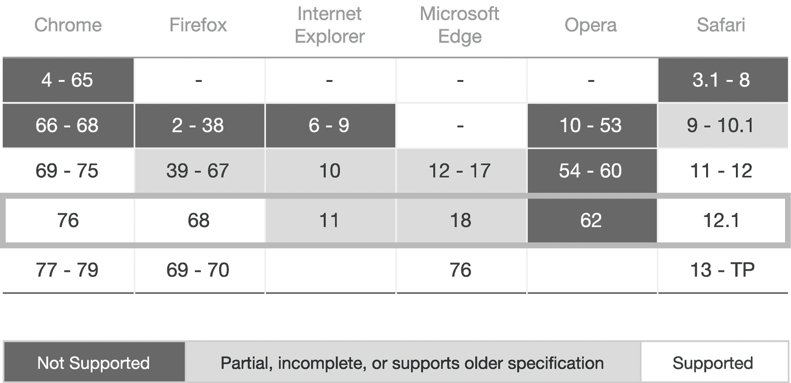 |

随着时间的推移，很明显使用这个属性会在不同的浏览器上产生不同的结果。此外，浏览器包括 CSS 默认设置，这些也略有不同。

## 浏览器默认值

当编写没有应用 CSS 的 HTML 时，某些标签具有默认样式，例如 header 标签(参见图 5-1 )。

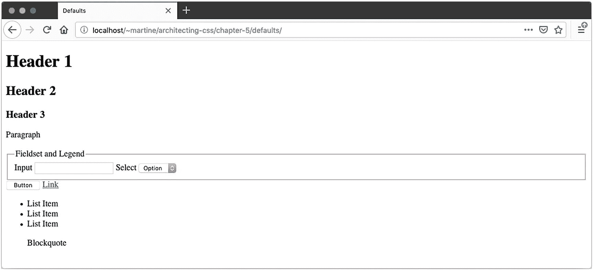

图 5-1

默认样式

然而，浏览器不使用相同的样式表，因此没有相同的默认设置。虽然大多相似，但也有一些细微的差别。例如，Textarea 在 Safari 和 Firefox 中的表现会有所不同(见图 5-2 和 5-3 )。

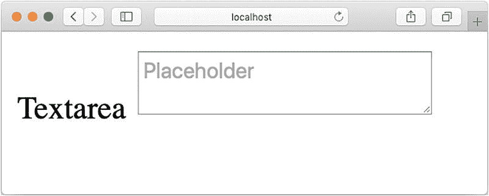

图 5-3

旅行队

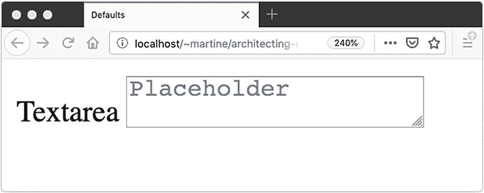

图 5-2

火狐浏览器

注意文本区域中的默认字体；在 Firefox 中是等宽字体，而在 Safari 中是无衬线字体。对齐方式也略有不同。在 Firefox 上，textarea 与文本的基线对齐，而在 Safari 上，textarea 则在基线之上。当试图让一个设计在不同的浏览器和版本中具有相同的外观和行为时，这些细微的差异可能会令人恼火。

解决这个问题的一个可靠的方法是手动设置默认值，这样所有的浏览器都可以运行相同的基本样式。虽然这没有解决兼容性差异，但是它将解决细微的非故意行为差异，例如前面概述的差异。

### CSS 重置

CSS reset 是一个文件，它接受浏览器对元素设置的所有默认值，并“重置”它们。目标是获取元素样式，并使它们都达到相同的一致基线，以减少或消除浏览器之间存在的不一致。有很多选择，但最常用的是 Eric Meyer(见表 5-3 )，他是 CSS reset 的先驱之一。无论你使用哪一个，都没有一个尺寸适合所有人，它可能需要根据你的特定项目进行定制。

表 5-3

CSS 重置

<colgroup><col class="tcol1 align-left"> <col class="tcol2 align-left"></colgroup> 
| 

参考

 | 

环

 |
| --- | --- |
| 工程地点 | [`https://meyerweb.com/eric/tools/css/reset/index.html`](https://meyerweb.com/eric/tools/css/reset/index.html) |
| 样式表 | [`https://meyerweb.com/eric/tools/css/reset/reset.css`](https://meyerweb.com/eric/tools/css/reset/reset.css) |

### 使标准化

Normalize 是尼古拉斯·加拉格尔和乔纳森·尼尔在 2016 年 8 月发表的一个项目。它专注于修复浏览器之间的已知差异。这种方法与 CSS 重置完全不同，CSS 重置旨在通过扁平化默认样式来防止差异。Normalize 保留默认值。通过将 normalize 添加为项目中要加载的第一个 CSS，使其成为要导入的第一个样式表，或者将其作为要应用的第一个 CSS 包含在项目的 CSS 中，这些变化已经得到处理，并且焦点可以转移到实现布局上，而不是与浏览器之间的细微差异作斗争(关于在哪里找到 normalize，请参见表 5-4 )。值得指出的是，许多 CSS 框架和库，比如 Bootstrap，已经包含了某种形式的规范化。值得仔细检查正在使用的任何 UI 库或框架是否已经考虑到差异，以防止不必要的膨胀。

表 5-4

使标准化

<colgroup><col class="tcol1 align-left"> <col class="tcol2 align-left"></colgroup> 
| 

参考

 | 

环

 |
| --- | --- |
| 工程地点 | [`http://necolas.github.io/normalize.css/`](http://necolas.github.io/normalize.css/) |
| GitHub 存储库 | [`https://github.com/necolas/normalize.css`](https://github.com/necolas/normalize.css) |
| 新公共管理理论 | [`www.npmjs.com/package/normalize.css`](http://www.npmjs.com/package/normalize.css) |
| 加拿大 | [`https://yarnpkg.com/en/package/normalize.css`](https://yarnpkg.com/en/package/normalize.css) |
| 样式表 | [`https://necolas.github.io/normalize.css/latest/normalize.css`](https://necolas.github.io/normalize.css/latest/normalize.css) |

尽管规范化基本样式解决了 CSS 默认值的差异，但它并没有解决实现或支持方面的差异。

Note

Normalize 和 reset 没有得到任何形式的认可，任何包的质量和相关性都可能会发生快速变化。请研究您打算使用的任何依赖项。

## 浏览器兼容性

跨浏览器兼容性，确保 UI 在多个浏览器上看起来一样，是 CSS 中最难做到的事情之一。有多种方法可以解决这个问题，它们经常相互结合使用。

### 供应商前缀

当浏览器的功能仍处于试验阶段或非标准时，浏览器通常使用特定于供应商的前缀来提供这些功能。虽然这可能有助于在用户代理之间达到相似性，但是在生产中使用依赖于供应商前缀的 CSS 不是一个好主意，因为实现是实验性的，可能不符合规范。因为历史上开发人员一直在产品中使用这些前缀，所以浏览器越来越倾向于将非标准的和实验性的特性放在特性标志之后，以结束这种做法；然而，许多仍在使用中(见表 5-5 )。 <sup>4</sup>

表 5-5

供应商前缀

<colgroup><col class="tcol1 align-left"> <col class="tcol2 align-left"></colgroup> 
| 

前缀

 | 

浏览器

 |
| --- | --- |
| -网络工具包- | 基于 WebKit 的浏览器(Chrome、Safari 等。) |
| 蚊子 | 火狐浏览器 |
| 用作复合形式的末尾元音 | Opera 的 WebKit 前版本 |
| -女士- | Internet Explorer 和 Microsoft Edge |

例如，Internet Explorer 11 (IE)就有一个非标准的网格实现。其实现基于 2011 年 4 月 7 日的工作草案，而非候选人推荐。因此，为了让网格在 IE 中工作，必须使用供应商前缀。然而，即使使用了前缀，行为仍然不同。在 IE 中，明确定位网格中的每个元素是必要的，但在其他浏览器中则不然，它们将自己放置在下一个可用空间中。此外，当前规范的某些方面，如`grid-gap`，根本就不存在。清单 5-2 和 5-3 展示了使用 grid 时在 IE 和 Firefox 中实现相同布局的代码。两者都将使用相同的 HTML(清单 5-1 )。它们各自的输出如图 5-4 和 5-6 所示，而图 5-5 显示的是没有厂商前缀的 IE。

```html
<body>
  <div class="grid-container">
    <aside>My Aside</aside>
    <section>Section 1</section>
    <section>Section 2</section>
    <section>Section 3</section>
    <section>Section 4</section>
  </div>
</body>

Listing 5-1Grid HTML

```

```html
html, body {
  padding: 36px;
  margin: 0;
}

.grid-container {
  display: grid;
  grid-template-columns: 1fr 1fr 1fr;
  grid-template-rows: 5rem 5rem;
  grid-gap: 1rem;
}

aside {
  grid-row: 1/3;
  background: lightgray;
}

section {
  border: solid 1px gray;
}

Listing 5-2Grid Without Vendor Prefixes

```

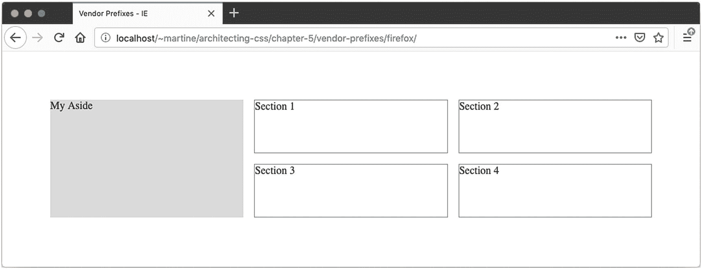

图 5-4

Firefox 中的网格

当在 IE 中运行清单 5-2 中的相同代码时，不会呈现网格，元素只是简单地堆叠在一起(图 5-5 )。

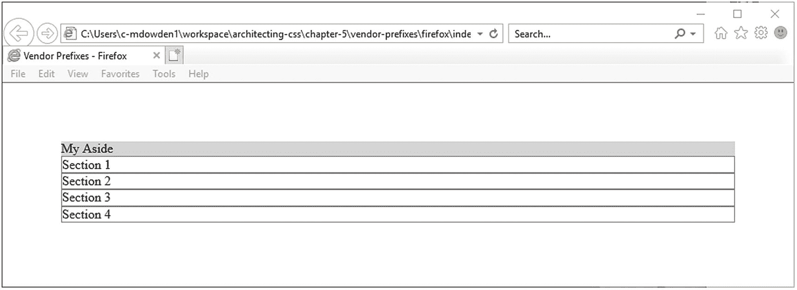

图 5-5

IE 中没有供应商前缀的网格

这是因为显示值 grid 不存在。要在 Internet Explorer 中访问网格功能，需要使用供应商前缀。

```html
html, body {
  padding: 36px;
  margin: 0;
}

.grid-container {
  margin: -.5rem;
  display: -ms-grid;
  -ms-grid-columns: 1fr 1fr 1fr;
  -ms-grid-rows: 5rem 5rem;
}

aside {
  background: lightgray;
  -ms-grid-row-span: 2;
  margin: .5rem;
}

section {
  border: solid 1px gray;
  margin: .5rem;
}
section:nth-of-type(1) {
  -ms-grid-column: 2;
  -ms-grid-row: 1;
}

section:nth-of-type(2) {
  -ms-grid-column: 3;
  -ms-grid-row: 1;
}
section:nth-of-type(3) {
  -ms-grid-column: 2;
  -ms-grid-row: 2;
}
section:nth-of-type(4) {
  -ms-grid-column: 3;
  -ms-grid-row: 2;
}

Listing 5-3Grid with Internet Explorer Vendor Prefixes

```

使用`-ms`供应商前缀并用网格间隙代替边距，可以实现相同的布局(图 5-6 )。

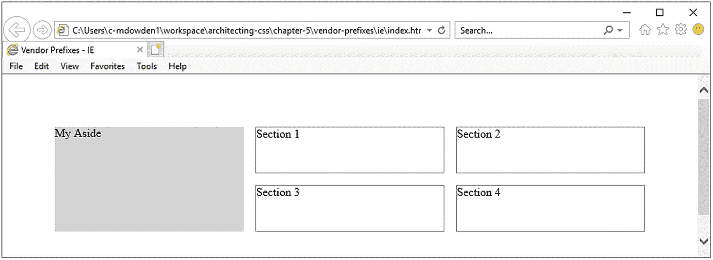

图 5-6

IE 中带有供应商前缀的网格

### 后退

当浏览器不支持某个属性时，解决供应商前缀的一个更好的方法是创建一个后备。当浏览器遇到它不支持的属性或值时，它将忽略该属性或值，因此，将保持以前设置的值。如果元素没有预先设置的值或者没有继承值，将使用默认值。

例如，(在撰写本文时)cross-fade 有一个实验版本，在 Safari 中位于供应商前缀(`-webkit`)之后，在 Firefox 中不受支持。要开始使用它，可以创建一个后备。清单 5-4 和 5-5 显示了交叉淡入淡出及其回退的使用(图 5-8 显示了期望的输出)。

```html
html, body {
  box-sizing: border-box;
  padding: 36px;
  margin: 0;
}

.container {
  background-image: url(child.png);
  background-repeat: no-repeat;
  background-size: contain;
  background-position: bottom;
  background-image: -webkit-cross-fade(url(beach.png), url(child.png), 50%);
  background-image: cross-fade(url(beach.png) 50%, url(child.png) 50% );
  box-sizing: border-box;
  padding: 1rem;
  height: 30rem;
  max-width: 100%;
  width: 100%;
}

Listing 5-5Cross-Fade Fallback CSS

```

```html
<body>
  <div class="container"></div>
</body>

Listing 5-4Cross-Fade Fallback HTML

```

首先，设置一个背景图像，然后使用供应商前缀通过交叉淡入淡出覆盖它，最后，通过标准交叉淡入淡出再次覆盖它。不支持交叉淡入淡出或供应商前缀版本的浏览器，如 Firefox(图 5-7 )，将只显示背景图像。

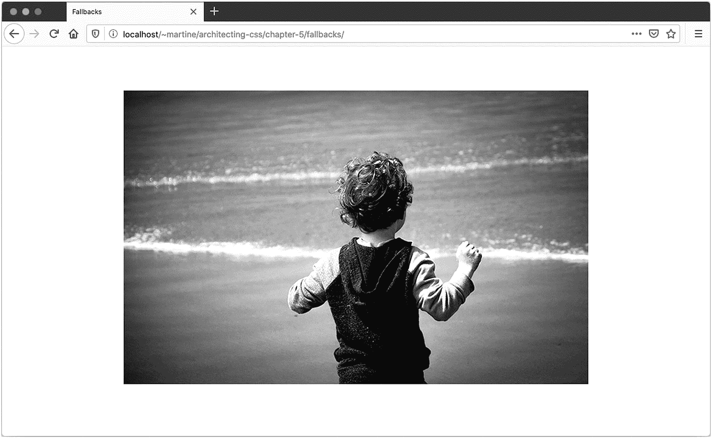

图 5-7

后退到背景图像

支持厂商前缀的浏览器，如 Safari(图 5-8 )，将显示实验版本。

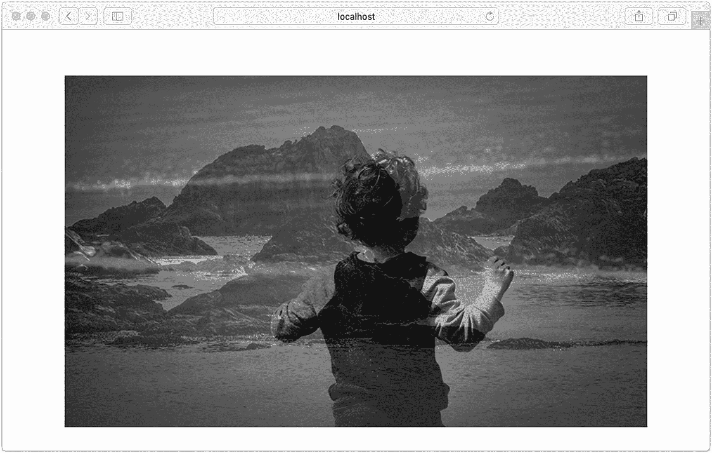

图 5-8

使图像交替淡变

最后，支持最终版本的浏览器将显示规范定义的交叉渐变。

### 支持 At 规则

`@supports` at-rule 允许检查是否支持特定的属性和值对，从而允许相应地定制用户体验。除了 IE 之外，这个功能一般都得到很好的支持。当属性受支持时，表达式`@supports(property:value {}`返回 true，而当属性不受支持时，`@supports not (property:value){}`返回 true。只有当选择器返回 true 时，才会应用选择器中的样式。这些可以用`and`或`or`操作符连接起来，以创建新的表达式。一般来说，最好使用`@supports`来逐步增强新特性，而回退可以用来提供与旧浏览器的向后兼容性。

为了看到`@supports`的实际效果，让我们看看背景滤镜，它在 Opera 中有效，但在 Firefox 中无效。清单 5-6 和 5-7 显示了使用`@supports`来创建使用支持的条件样式。

```html
html, body {
  padding: 36px;
  margin: 0;
}

.container {
  background-image: url('art.png');
  padding: 1rem;
}
p {
  background-color: rgba(255, 255, 255, 0.6);
  backdrop-filter: blur(20px);
  margin: 5rem;
  padding: 1rem;
}

@supports not (backdrop-filter: blur(20px) ) {
  p {
    background-color:white;
  }
}

Listing 5-7Cross-Fade Fallback CSS

```

```html
<body>
  <div class="container">
    <p>Lorem ipsum dolor sit amet, consectetur adipiscing</p>
  </div>
</body>

Listing 5-6Cross-Fade Fallback HTML

```

支持`backdrop-filter`时，段落背景模糊，不透明度为 60%(图 5-9 )。如果不是，段落背景被设置为完全不透明的白色，以增加从模糊中获得的易读性(图 5-10 )。

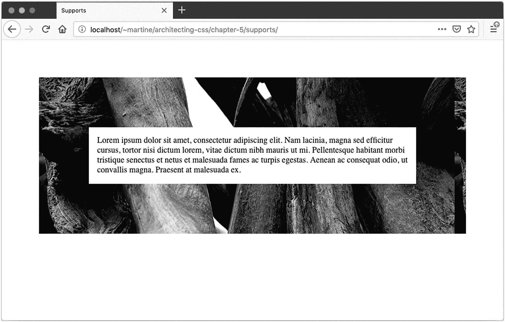

图 5-10

撤退

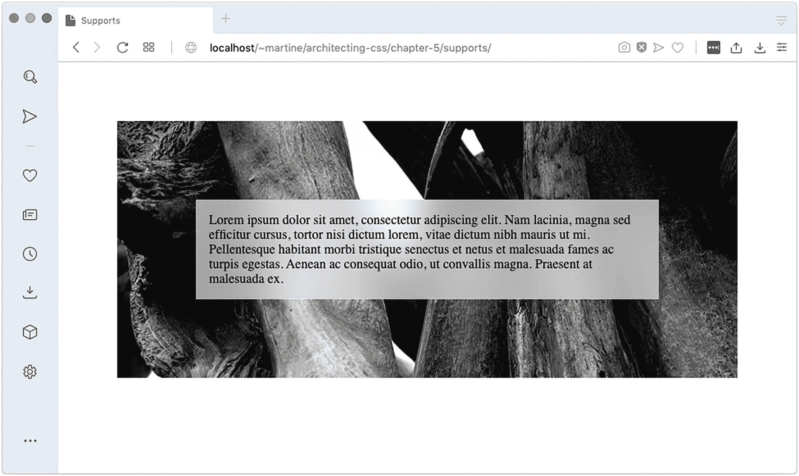

图 5-9

`backdrop-filter`

## 项目默认值

重置浏览器默认值有助于创建跨浏览器的一致性。创建应用程序默认值有助于创建应用程序的一致性。这在使用基于组件的架构时尤其重要。将主题从布局中分离出来也有助于一致性。可以在元素本身和基类上设置样式，以便在整个应用程序中重用。如果改变主题，这些改变只需要在一个地方更新。此外，当创建新视图时，唯一关心的是布局，因为主题已经被考虑了。清单 5-8 和 5-9 是一个示例摘录；图 5-11 显示了输出。

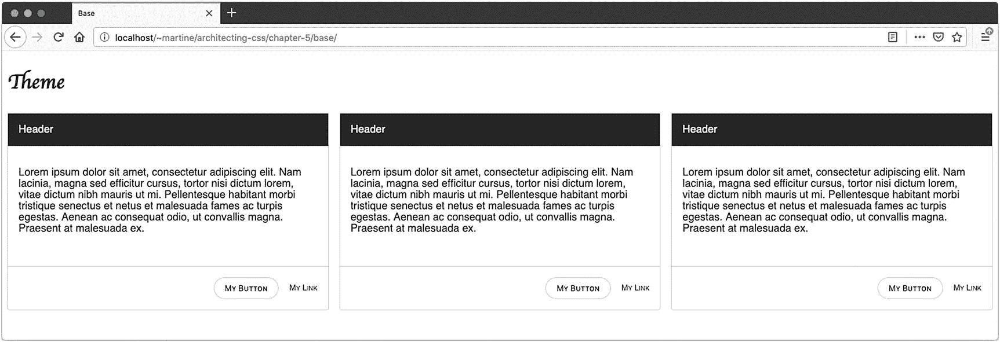

图 5-11

主题

```html
body {
  --border: solid 1px rgba(0, 0, 0, .2);
  --dark: rgba(0, 0, 0, .87);
  --light: rgba(255, 255, 255, .87);
  --shadow: box-shadow: 5px 5px 5px var(--dark);
  color: rgba(0, 0, 0, .87);
  font-family: sans-serif;
}

h1 { font-family: cursive; }

a {
  font-size: .75rem;
  font-variant: small-caps;
  text-decoration: none;
}

button {
  background: none;
  border: var(--border);
  border-radius: 45px;
  box-shadow: var(--shadow);
  box-sizing: border-box;
  font-size: .75rem;
  font-variant: small-caps;
  padding: .5rem 1rem;
}

.actions {
  align-items: center;
  border-top: var(--border);
  display: flex;
  justify-content: flex-end;
  margin-top: 1rem;
}
.actions > * { margin-left: 1rem;}

.card {
  border: var(--border);
  border-radius: 3px;
  margin-bottom: 1rem;
}
.card > div { padding: 1rem; }
.card .header {
  background: rgba(0, 0, 0, .87);
  color: rgba(255, 255, 255, .87);
}

/*  Layout */
.container {
  column-width: 30rem;
}

Listing 5-9Default Styles CSS

```

```html
<body class="view">
  <h1>Theme</h1>
  <div class="container">
    <div class="card">
      <div class="header">Header</div>
      <div class="body">
        <p>Lorem ipsum dolor sit amet, ... </p>
      </div>
      <div class="actions">
        <button>My Button</button>
        <a>My Link</a>
      </div>
    </div>
    <div class="card"> ... </div>
    <div class="card"> ... </div>
    </div>
</body>

Listing 5-8Default Styles HTML

```

通过设置变量、元素的默认样式，并创建默认的容器类，如清单 5-9 中的`.card`类，可以创建一个主题。可以作为主题的一部分包含的属性是围绕外观和感觉的东西，比如颜色、版式、边框、填充等等。从那里开始，创建视图变得更加容易，因为剩下的主要问题是布局。通过设置默认主题，即使在基于组件的架构中，外观和感觉，或者品牌，也可以保持一致。此外，更新主题可以像更改自定义属性值一样简单。

## 摘要

这一章讲述了浏览器的差异和在它们之间标准化 CSS 的技术。还讨论了处理不同浏览器中 CSS 支持差异的技术。最后，主题化被提出。下一章将着眼于使用过渡和动画来支持用户交互。

<aside aria-label="Footnotes" class="FootnoteSection" epub:type="footnotes">Footnotes 1

t .沃伦(2019 年 4 月 8 日)。检索于 2019 年 9 月 3 日，来自 [`www.theverge.com/2019/4/8/18300077/microsoft-edge-chromium-canary-development-release-download`](http://www.theverge.com/2019/4/8/18300077/microsoft-edge-chromium-canary-development-release-download)

  2

CSS 滚动捕捉模块级别 1 发布历史记录。检索 2019 年 9 月 1 日，来自 [`www.w3.org/standards/history/css-scroll-snap-1`](http://www.w3.org/standards/history/css-scroll-snap-1)

  3

我能使用滚动快照吗？检索 2019 年 9 月 1 日，来自 [`https://caniuse.com/#search=scroll-snap`](https://caniuse.com/%2523search%253Dscroll-snap)

  4

供应商前缀。检索 2019 年 9 月 1 日，来自 [`https://developer.mozilla.org/en-US/docs/Glossary/Vendor_Prefix`](https://developer.mozilla.org/en-US/docs/Glossary/Vendor_Prefix)

  5

我能使用网格吗？检索 2019 年 9 月 1 日，来自 [`https://caniuse.com/#search=grid`](https://caniuse.com/%2523search%253Dgrid)

 </aside>