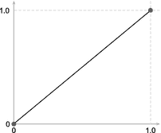

# 六、交互和过渡

当我们想到 HTML 和 CSS 时，我们通常会想到“静态”当想到交互或动画时，JavaScript 更常出现在脑海中。然而，CSS 包括几个特性，这些特性允许作为用户交互的结果来操纵元素。在这一章中，我们将看看如何使用 CSS 来响应用户交互，以及如何使用动画和过渡来支持这些交互。

## 用户交互响应

在 CSS 中响应用户交互最常用的方式之一是使用伪元素`:hover`、`:focus`和:`active`。

当使用定点设备`–`与元素交互时，伪元素`:hover`匹配。最常见的是，当用户将鼠标悬停在元素 <sup>1</sup> 上时，如链接或按钮。这可以用来给用户一个可视的指示，指示该元素可以被交互。

当一个元素获得焦点时，比如使用键盘或者被点击，就会触发`:focus`伪类。焦点是很重要的，因为它向用户提供了一个视觉指示器，指示他们当前正在交互或者将要交互的元素。当输入字段处于焦点时，改变输入字段的边框样式将告诉用户他们将要输入哪个字段，这对于用户定位他们当前在页面中的位置非常有帮助。并非所有元素都可以获得焦点。除了 video 元素之外，按钮、锚标记和表单项(如 input 和 select)是唯一可以获得焦点的元素，而无需向元素添加`tabindex`属性。

当一个元素被激活时，比如一个按钮被按下或者一个链接被点击，伪元素被触发。按钮样式的变化，例如在按下物理按钮时消除阴影，反映了按下物理按钮这一动作在现实世界中的预期。尽管用户可能无法清楚地说出原因，但像这样的小交互会让用户感觉交互更自然。

 Accessibility and Focus

当应用焦点时，大多数浏览器在元素周围会有默认行为。如果压缩默认行为，则需要重新应用一些焦点的视觉指示，以便用户可以在视觉上将处于焦点的元素与其他元素区分开来。 <sup>2</sup> 此外，焦点不应该改变上下文、功能、意义或可操作性。 <sup>3</sup> <sup>，</sup> <sup>4</sup>

通过交互，可以设置响应，比如改变元素的外观、大小甚至位置。如果动画提供了将要发生的变化的信息，那么向视觉变化添加过渡将有助于用户理解所应用的变化。例如，当展开一个可折叠部分时，动画显示可折叠部分的打开将帮助用户保持他们在页面中的位置，特别是因为下面的内容将被移动到不同的位置，可能在视口之外。

当响应 CSS 触发的事件(如悬停、聚焦或活动)时，在 CSS 中保留相关的转换比使用 JavaScript 更容易维护。这使得触发和反应保持在一起，并且它们的关联保持清晰和明显。这有助于在样式表中保留可视说明。

### 改变

创建过渡和动画时，虽然不是必需的，但经常使用 CSS transform 属性。Transform 允许使用 CSS 样式的元素在二维空间中进行转换。变换函数基于变换矩阵。`matrix()`函数是`matrix3d()`的简写，它采用六个参数 a、b、c、d、tx 和 ty，在图 6-1 中以粗体显示。


图 6-1

变换矩阵

参数 a、b、c 和 d 描述线性变换，tx 和 ty 描述要应用的平移。CSS 提供了基于前面矩阵的变换函数来操作元素，如平移、缩放、旋转、倾斜和透视。使用`translate()`函数来改变一个项目的位置，比如将某个东西滑动到视图中，通常会比操纵它的位置更有效。对于`scale()`来说，改变一个元素的高度或宽度也是一样的，比如展开或折叠一个菜单或手风琴。`rotate()`功能常用于微电影；继续 accordion 示例，它可用于旋转 accordion 标题中的箭头或插入符号，以区分相关面板是打开的还是关闭的。当面板被打开时，箭头可以同时旋转，以告知用户所述面板的状态。虽然看起来微不足道，但像这样的小细节，如果信息丰富，可以帮助用户定位和理解他们正在看什么和正在发生什么。关于转换功能的细节可在表 6-1 中找到。

表 6-1

转换函数

<colgroup><col class="tcol1 align-left"> <col class="tcol2 align-left"> <col class="tcol3 align-left"></colgroup> 
| 

功能

 | 

描述

 | 

尺寸

 |
| --- | --- | --- |
| `matrix()` | matrix3d()的简写。参见前面的描述。需要六个参数。 | 2D |
| `matrix3d()` | 三维上的线性变换和平移。参见前面的矩阵描述。取 16 个值。 | 三维（three dimension 的缩写） |
| `translate(tx, ty)` | 通过向量进行平移，其中 x 是第一个平移值，y 是第二个平移值。要单独操作 x 轴或 y 轴，可以使用 translateX(tx)和 translateY(ty)。 | 2D |
| `translate3d(tx, ty, tz)` | 与 translate()相同，但在三维空间中。TranslateZ(tz)可用于平移 z 索引上的元素。此 tz 值不能是百分比，它必须是长度。 | 三维（three dimension 的缩写） |
| `scale(sx, sy)` | 缩放向量，其中`x`缩放高度，`y`缩放宽度，初始值为 1。要单独缩放高度或宽度，可以使用 scaleX(sx)和 scaleY(sy)。 | 2D |
| `scale3d()` | 与 scale()相同，但是是三维的。ScaleZ(tz)可用于平移 z 索引上的元素。 | 三维（three dimension 的缩写） |
| `)``)` | 将元素从变换原点旋转所提供的角度。 | 2D |
| `rotate3d(x, y, z, a)` | 围绕三维空间中的固定轴旋转元素，其中`x`、`y`和`z`描述旋转轴，`a`描述旋转角度。 | 三维（three dimension 的缩写） |
| `skew(``x,``y)` | 根据 x 轴和 y 轴上提供的角度扭曲元素。要按轴倾斜元素，可以使用 skewX(≈x)和 skewY(≈y)。 | 2D |
| `perspective(z)` | 为三维元素提供透视，其中 0 是默认值。当 z 增大时，元素变大，当 z 减小时，元素缩小。 | 三维（three dimension 的缩写） |

### 过渡

当元素的样式改变时，过渡允许从初始状态到新状态的转变在视觉上是平滑的。顾名思义，transition 属性控制值如何随时间从一种状态变化到另一种状态的可视化方面。

transition 属性是以下内容的简写属性:属性、持续时间、计时功能和延迟。其语法在清单 6-1 中描述，其属性在表 6-2 中定义。<sup>??</sup>

```html
transition: property duration timing-function delay;

Listing 6-1Transition Property Shorthand Syntax

```

表 6-2

转换属性值

<colgroup><col class="tcol1 align-left"> <col class="tcol2 align-left"> <col class="tcol3 align-left"></colgroup> 
| 

值名

 | 

行为

 | 

基础资料

 |
| --- | --- | --- |
| `transition``-property` | 定义转换将影响的属性 | 全部 |
| `transition``-duration` | 定义完成过渡需要多长时间 | 0s |
| `transition``-timing``-function` | 定义在过渡期间如何应用值的加速度路缘 | 缓解 |
| `transition``-delay` | 定义过渡开始前的延迟时间 | 0s |

清单 6-2 和 6-3 显示了悬停过渡。

```html
html, body {
  padding: 36px;
  margin: 0;
}

a {
  align-items: center;
  background: gray;
  border: solid 1px white;
  color: white;
  display: flex;
  font-size: 36px;
  height: 100px;
  justify-content: center;
  text-decoration: none;
  transition: all 250ms ease-in-out;
}

a:hover {
  background: white;
  border-color: gray;
  color: gray;
  border-radius: 45px;
}

Listing 6-3CSS for Transition Example

```

```html
<body>
  <a href="">
    <span>Transitions</span>
  </a>
</body>

Listing 6-2HTML for Transition Example

```

在前面的列表中，将鼠标悬停在链接上，会导致背景色、边框颜色、字体颜色和边框半径在 250 毫秒内逐渐变化(参见图 6-2 )。


图 6-2

一段时间内的动画代码输出

User Experience

当一个动作被执行时，通过增强元素之间的关系，过渡可以是一个很好的方式来引导用户通过应用程序。然而，为了实现这个目标，动画应该是**信息性的**、**聚焦性的**、**表现性的**。 <sup>6</sup> 对于较小、不太复杂的动画，动画应该持续 200 到 500 毫秒，或者在较小的屏幕上，在 200 到 300 毫秒的范围内。 <sup>7</sup>

### 关键帧动画

与用户触发事件时只能发生一次的过渡不同，动画可以无限期重复。当一个元素被添加到 DOM 时，比如一个元素从`display:none`到`display:block`，它们也可以被应用。打开菜单时可能会出现这种情况。菜单项对用户来说是隐藏的，它们需要滑动到视图中，而不是突然显示出来。通过动画显示菜单元素，用户隐含地理解了菜单项的来源。动画还提供了对动画步骤的更多控制，允许比过渡更复杂。通过动画中的百分比，关键帧规则设置何时需要发生什么变化。清单 6-4 和 6-5 显示了使用关键帧的示例。


图 6-3

一段时间内的动画代码输出

```html
html {
  padding: 0;
  margin: 0;
}

body {
  box-sizing: border-box;
  padding: 36px;
  margin: 0;
}

body > div {
  box-sizing: border-box;
  margin-bottom: 3rem;
}

@keyframes myAnimation {
  0% {
    background: gray;
    border-color: white;
    color: white;
    border-radius: 0px;
    transform: scale(0);
  }
  25% {
    transform: rotate(5deg) scale(.25);
  }
  50% {
    transform: rotate(-10deg) scale(.5);
  }
  75% {
    transform: rotate(35deg) scale(.75);
  }

  100% {
    background: white;
    border-color: gray;
    color: gray;
    border-radius: 45px;
    transform: rotate(0) scale(1);
  }
}

.animations {
  animation: myAnimation 500ms ease-in-out 1;
  background: white;
  border: solid 1px gray;
  border-radius: 45px;
  box-sizing: border-box;
  color: gray;
  font-size: 2rem;
  padding: 2rem;
  text-align: center;
  width: 100%;
}

Listing 6-5Keyframes CSS

```

```html
<body>
  <div class="animations">Animations</div>
</body>

Listing 6-4Keyframes HTML

```

背景颜色、边框颜色、颜色、边框半径和比例仅在 0%和 100%时定义，因此是插值的。元素将以每个百分比旋转到指定的角度。即使 100%没有指定旋转角度，在动画结束时，元素会将其旋转设置为元素上设置的值，即 0。

为了触发关键帧，使用了 animation 属性(参见清单 6-6 )。动画属性最多可以取七个值:名称、持续时间、计时功能、延迟、迭代计数、方向和填充模式(详见表 6-3 )。

表 6-3

动画属性值

<colgroup><col class="tcol1 align-left"> <col class="tcol2 align-left"> <col class="tcol3 align-left"></colgroup> 
| 

值名

 | 

行为

 | 

基础资料

 |
| --- | --- | --- |
| `animation-name` | 定义动画将使用的关键帧 at-rule | 没有人 |
| `animation-duration` | 定义动画需要多长时间才能完成 | 0s |
| `animation-timing``-function` | 定义在动画过程中如何应用值的加速度路缘 | 缓解 |
| `animation-delay` | 定义动画开始前的延迟时间 | 0s |
| `animation-iteration``-count` | 定义动画播放的次数 | one |
| `animation-direction` | 定义动画应该向前、向后播放，还是向前和向后切换 | 标准 |
| `animation-fill-mode` | 定义动画完成前后如何将样式应用于目标 | 没有人 |

```html
animation: name duration timing-function delay iteration-count direction
           fill-mode;

Listing 6-6Animation Property

```

另一个可以用于动画的属性是`animation-play-state`，它允许开发者暂停和开始动画。继续播放时，动画将从暂停的地方重新开始，而不是从序列的开头开始。`animation-play-state`的默认值是`running`。然而，它需要被单独定义为自己的属性，而不是清单 6-4 中描述的动画速记的一部分。给予用户暂停动画的能力，特别是如果动画对于理解应用程序的内容或状态是不必要的，可以从根本上提高应用程序的可用性。例如，当考虑自动前进的转盘时，添加暂停面板自动递增的能力将允许用户控制他们查看内容的速度。

当从 DOM 中移除一个对象时，也可以使用动画，例如当添加一个显示值 none 时，但是因为`display:none`属性将在动画结束之前应用和完成，所以这不能仅用 CSS 来完成。如果在关闭菜单时，`display:none`被添加到菜单项，不管元素上设置的任何动画或过渡，菜单将突然消失，因为在菜单项被隐藏之前动画没有时间运行。为了解决这个问题，JavaScript `animationend`事件与 CSS 一起使用来监听动画状态。`animationend`将在动画完成时触发，此时`display:none`可以添加到需要隐藏的元素中(参见清单 6-7 和 6-8 )。

```html
@keyframes roll {
  0%   { transform: translateX(-75vw) rotate(-360deg);  }
  100% { transform: translate(0) rotate(0)}
}

@keyframes roll-reverse {

  0% { transform: translate(0) rotate(0)}
  100%   { transform: translateX(-75vw) rotate(-360deg);  }
}

.animation-container {
  background: linear-gradient(lightgrey, grey);
  border-radius: 50%;
  display: none;
  height: 100px;
  margin: 1rem auto;
  width: 100px;
}

.show {
  display: block;
  animation: roll 1s cubic-bezier(0.280, 0.840, 0.420, 1);
}

.close {
  display: block;
  animation: roll-reverse 1s cubic-bezier(0.280, 0.840, 0.420, 1);
}

Listing 6-8Animation End Event CSS

```

```html
<body>
  <div class="show-hide">
    <button onclick="toggleAnimation()" id="button">
      Show
    </button>
    <div
      class="animation-container"
      id="animationContainer">
    </div>
  </div>

  <script>
    function showContainer() {
      animationContainer.classList.add('show');
    }

    function hideContainer() {
      animationContainer.addEventListener('animationend', cleanup);
      animationContainer.classList.replace('show', 'close');
    }

    function cleanup() {
      animationContainer.classList.remove('close');
      animationContainer.removeEventListener('animationend', cleanup);
    }
  </script>
</body>

Listing 6-7Animation End Event HTML and JavaScript

```

当元素被“关闭”或隐藏时，首先添加一个带有退出动画的类。一旦动画结束，`animationend`事件监听器被触发，只有这时 display 属性值才能被更改为 none。使用`transitionend`事件监听器可以实现相同的转换。添加和删除类，而不是在 JavaScript 中处理关闭动画，有助于在 CSS 样式表中保持与显示相关的逻辑，增加可维护性并保持关注点的分离。

### 计时功能

无论是创建过渡还是动画，要定义的一个公共值是计时函数。它决定了值在动画完成所需时间内的变化速度。计时有助于使动画感觉更自然，并更紧密地反映物理世界的相互作用。当制作一个弹跳球的动画时，人们会期望球落地后加速。如果动画是线性的，球总是以相同的速度移动，动画看起来会关闭。有两种特定类型的计时功能可用。

#### 缓解功能

缓动函数基于以法国工程师皮埃尔·贝塞尔命名的贝塞尔曲线定义平滑过渡。曲线是参数化的， <sup>8</sup> 和三次变量由四个点定义:P <sub>0</sub> ，P <sub>1</sub> ，P <sub>2</sub> ，P <sub>3</sub> 。P <sub>0</sub> 和 P <sub>3</sub> 分别定义曲线的起点和终点。P <sub>1</sub> 和 P <sub>2</sub> 代表赋予曲线形状的控制点。每个点由(x，y)坐标定义。

CSS `cubic-bezier`在代表动画初始和最终状态的(0，0)和(1，1)固定点预定义 P <sub>0</sub> 和 P <sub>3</sub> 。剩下要定义的是 P <sub>1</sub> 和 P <sub>2</sub> ，它们的 x 值需要保持在[0，1]范围内，而 y 值可能存在于边界框之外。

CSS 函数如下:`cubic-bezier(x1, y1, x2, y2)`。

虽然时序可以自定义，但为了方便起见，CSS 包括命名的常见时序函数，包括线性、缓入、缓出和缓出(见表 6-4 )。

表 6-4

命名缓动功能 <sup>9</sup>

<colgroup><col class="tcol1 align-left"> <col class="tcol2 align-left"> <col class="tcol3 align-left"></colgroup> 
| 

名字

 | 

公式

 | 

曲线

 |
| --- | --- | --- |
| **线性** | `cubic-bezier(0.0, 0.0, 1.0, 1.0)` |  |
| **缓和** | `cubic-bezier(0.25, 0.1, 0.25, 1.0)` |  |
| **渐强** | `cubic-bezier(0.42, 0.0, 1.0, 1.0)` |  |
| **缓进缓出** | `cubic-bezier(0.42, 0.0, 0.58, 1.0)` |  |
| **缓出** | `cubic-bezier(0.42, 0.0, 0.58, 1.0)` |  |

要创建弹跳效果，一个或两个 y 值应设定在[0，1]范围之外。为此，需要编写一个自定义函数，如下面的函数:`cubic-bezier(0, 0.71, 0.64, 1.23)`。

曲线绘制在图 6-4 中。


图 6-4

样本反弹曲线

#### 步进函数

虽然目前没有很好地支持跨浏览器，但也可以使用步进函数来代替曲线，该函数将动画划分为相等的时间段。两个值用于定义动画的计时:步数(n)和步位置(见表 6-5 )。语法如下:

```html
 animation-timing-function: steps(n, step-position);

```

表 6-5

命名步进功能 <sup>10</sup>

<colgroup><col class="tcol1 align-left"> <col class="tcol2 align-left"> <col class="tcol3 align-left"></colgroup> 
| 

名字

 | 

功能

 | 

步伐

 |
| --- | --- | --- |
| **步进启动** | `steps(1, start)` |  |
| **步骤结束** | `steps(1, end)` |  |
| **跨接启动** | `steps(3, jump-start)` |  |
| **跳转结束** | `steps(3, jump-end)` |  |
| **无跳转** | `step(3, jump-none)` |  |
| **跳转-两者都有** | `step(3, jump-both)` |  |

应用时，代码和输出将如清单 6-9 和 6-10 以及图 6-5 所示。


图 6-5

跳跃启动输出

```html
body {
  box-sizing: border-box;
  padding: 36px;
  margin: 0;
}

body > div {
  box-sizing: border-box;
  margin-bottom: 3rem;
}

@keyframes jumpStart {
 0% {
    width: 0;
    background-color: white;
    border: 1px solid gray;
 }
 100% {
    width: 90vw;
    background-color: gray;
    border: 1px solid gray;
 }
}
.jump-start {

  animation-name: jumpStart;
  animation-duration: 5s;
  animation-iteration-count: infinite;
  margin-bottom: 4px;
  animation-timing-function: steps(5, jump-start);
}

Listing 6-10jump-start Sample Code CSS

```

```html
<body>
  <div class="jump-start">jump-start</div>
</body>

Listing 6-9jump-start Sample Code CSS

```

请注意，动画已经部分开始。因为使用了`jump-start`，宽度为 0 且颜色为白色的初始状态被跳过，动画从宽度为最终状态宽度 20%的容器开始。如果使用了`jump-end`，容器将从宽度 0 开始，但从未达到 100%的宽度。动画结束时，容器的宽度只有 80%。

 Accessibility and Timing

考虑计时时，确保内容在一秒钟内不闪烁超过三次是很重要的。这是为了防止由于使用者的光敏性而诱发癫痫发作。 <sup>11</sup>

## 性能考虑因素

当考虑动画对性能的影响时，并不是所有的动画都是一样的。导致布局改变或视图被重画的动画特别费力。 <sup>12</sup> 例如，高度、宽度或位置的变化会影响布局，并导致页面上的元素被重新定位。导致视图重画的属性包括颜色、背景位置和可见性。影响布局和绘画的动画会比不影响布局和绘画的动画性能差。

通常，为了获得最佳性能，使用 transform 属性是最好的方法，因为它可以依赖于 GPU。只要有可能，最好使用不透明度、平移、旋转和缩放来尝试和坚持动画。 <sup>十三</sup>

当出现性能问题时，使用`will-change`属性会很有诱惑力。`Will-change`提前通知浏览器将要被动画化的变化，允许浏览器针对这些变化进行优化；然而，如果被滥用，它可能弊大于利。正确使用`will-change`的一些指南包括以下内容:

*   **稀疏使用**——应该只在实际需要的时候使用。浏览器已经试图优化一切。不必要的使用实际上会降低页面速度。

*   **仅在需要时打开**–应在动画触发前打开，然后再次关闭以释放用于优化的浏览器资源。

*   **足够的时间**——优化耗时；因此，`will-change`需要在动画设置开始之前，用足够的时间应用到元素上才能生效。 <sup>14</sup>

## 摘要

本章介绍了过渡、动画及其差异，以及用于更改动画和变换应用时间的函数。还包括处理动画时的性能和可访问性考虑。第七章将介绍预处理器及其架构考虑因素和优势。

<aside aria-label="Footnotes" class="FootnoteSection" epub:type="footnotes">Footnotes 1

:悬停。(2019 年 8 月 14 日)。检索自 [`https://developer.mozilla.org/en-US/docs/Web/CSS/:hover`](https://developer.mozilla.org/en-US/docs/Web/CSS/:hover)

  2

焦点可见。(2019 年 8 月 14 日)。检索自 [`www.w3.org/TR/UNDERSTANDING-WCAG20/navigation-mechanisms-focus-visible.html`](http://www.w3.org/TR/UNDERSTANDING-WCAG20/navigation-mechanisms-focus-visible.html)

  3

理解成功标准 3.2.1:专注。(2019 年 8 月 14 日)。检索自 [`www.w3.org/WAI/WCAG21/Understanding/on-focus.html`](http://www.w3.org/WAI/WCAG21/Understanding/on-focus.html)

  4

焦点顺序。(2019 年 8 月 14 日)。检索自 [`www.w3.org/TR/UNDERSTANDING-WCAG20/navigation-mechanisms-focus-order.html`](http://www.w3.org/TR/UNDERSTANDING-WCAG20/navigation-mechanisms-focus-order.html)

  5

过渡。(2019 年 8 月 15 日)。检索自 [`https://developer.mozilla.org/en-US/docs/Web/CSS/transition`](https://developer.mozilla.org/en-US/docs/Web/CSS/transition)

  6

理解运动。(2016 年 8 月 26 日)。[`https://material.io/design/motion/understanding-motion.html`](https://material.io/design/motion/understanding-motion.html)

  7

头，瓦尔。你的 UI 动画应该有多快？(2019 年 8 月 26 日)。检索自 [`https://valhead.com/2016/05/05/how-fast-should-your-ui-animations-be/`](https://valhead.com/2016/05/05/how-fast-should-your-ui-animations-be/)

  8

贝塞尔曲线的定义及其性质。(2019 年 8 月 29 日)。检索自 [`http://web.mit.edu/hyperbook/Patrikalakis-Maekawa-Cho/node12.html`](http://web.mit.edu/hyperbook/Patrikalakis-Maekawa-Cho/node12.html)

  9

<timing-function>。(2019 年 8 月 29 日)。检索自 [`https://developer.mozilla.org/en-US/docs/Web/CSS/timing-function`](https://developer.mozilla.org/en-US/docs/Web/CSS/timing-function)</timing-function>

  10

<timing-function>。(2019 年 8 月 29 日)。检索自 [`https://developer.mozilla.org/en-US/docs/Web/CSS/timing-function`](https://developer.mozilla.org/en-US/docs/Web/CSS/timing-function)</timing-function>

  11

网页内容可访问性指南(WCAG 2.1)。(2019 年 8 月 31 日)。[`www.w3.org/TR/WCAG21`](http://www.w3.org/TR/WCAG21)

  12

动画和表演。(2019 年 8 月 31 日)。检索自 [`https://developers.google.com/web/fundamentals/design-and-ux/animations/animations-and-performance`](https://developers.google.com/web/fundamentals/design-and-ux/animations/animations-and-performance)

  13

高性能动画。(2019 年 8 月 31 日)。检索自 [`www.html5rocks.com/en/tutorials/speed/high-performance-animations/`](http://www.html5rocks.com/en/tutorials/speed/high-performance-animations/)

  14

CSS 将改变模块级别 1。(2019 年 8 月 31 日)。检索自 [`www.w3.org/TR/css-will-change-1/`](http://www.w3.org/TR/css-will-change-1/)

 </aside>