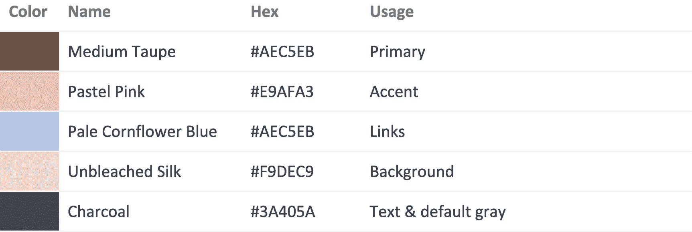
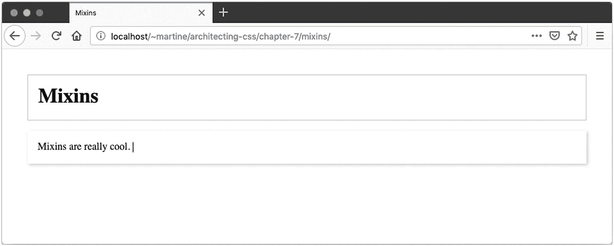
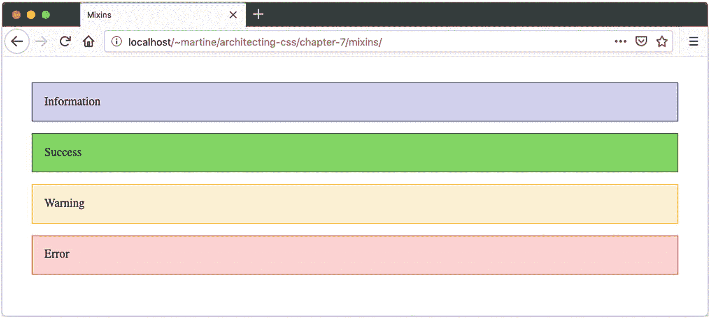

# 七、预处理器

对于 CSS，有几个预处理程序可用。它们将获取数据，以自己特定的语法编写，然后输出 CSS 供浏览器使用。这样做的好处包括可以使用 CSS 中还没有的功能，如颜色编辑功能或嵌套规则。在 CSS 变量被语言本身支持之前，他们也给了我们访问 CSS 变量的权限。一些最流行的处理器包括 Sass、Less 和 Stylus。

Note

本章中的例子将使用 [SCSS](https://sass-lang.com/documentation/syntax) 。 <sup>1</sup> 这些技术可以使用其他的预处理器；但是，功能可用性和语法会因使用的预处理器而异。

## 对架构的启示

由于增加了功能，例如混合和扩展类的能力，使用预处理程序和使用纯 CSS 时，组织和构建代码的方式可能会非常不同。如今，用预处理器之外的方式计算值的能力带来了编写枯燥语义代码的能力。它可以只在一个地方定义，然后在整个样式表中重用，这与其他编程语言中使用的一些面向对象原则没有太大区别。

使用预处理程序的缺点是它们给应用程序增加了一层复杂性，而这在使用纯 CSS 时是不存在的。尽管一些预处理程序，如 Less、 <sup>2</sup> 可以直接在浏览器中运行，但不建议在生产中使用，因为它的性能和可靠性不如普通 CSS。因此，当使用预处理程序时，我们需要某种构建步骤来将代码编译成 CSS。

调试也可能是一项挑战，尤其是在使用一些更复杂或更高级的代码特性时。这是因为生成的 CSS 与编写的代码没有一对一的匹配。例如，被添加到一个类中的属性和特性可能来自一个 mixin(本章后面将详细介绍 mixin ),而不是规则集的一部分。被应用的 CSS 是输出，而不是 mixin 本身，所以追溯到哪个 mixin 创建了输出可能是困难的。Sourcemaps 可以在这方面提供帮助。sourcemap 是一个可以用 CSS 生成的文件，它将输出链接回生成它的代码。但是同样，这需要作为构建过程的一部分进行专门设置。

因此，首先，在选择要使用的处理器之前，应该问一下增加的复杂性是否必要。

### 嵌套

嵌套让我们有了清晰的视觉层次，这是 CSS 所没有的。下面的 CSS(清单 7-1 )可以嵌套(清单 7-2 )，让层次结构一目了然。

```html
nav {
  padding: 0;
  margin: 0;
  ul {
    padding: 0;
    li {
      padding: 10px;
      border: solid 1px blue;
      background: yellow;
      color: blue;
    }
  }
}

Listing 7-2Nested SCSS

```

```html
nav {
  padding: 0;
  margin: 0;
}
nav ul {
  padding: 0;
}
nav ul li {
  padding: 10px;
  border: solid 1px blue;
  background: yellow;
  color: yellow;
}

Listing 7-1CSS

```

虽然很容易知道列表项上设置的样式将只应用于导航列表项，但是嵌套使得创建过于具体的规则变得非常容易。在前面的例子中，在无序列表中嵌套列表项是多余的，不会增加任何值。仅将其嵌套在导航下，比其当前位置高一级，就足够了。

然而，嵌套可以使某些情况变得清晰。我们来看看清单 7-3 。

```html
a:link, a:visited {
  color: gray;
  font-variant: small-caps;
  border: dotted 1px rgba(0, 0, 0, 0);
  text-decoration: none;
  &:hover { border: dotted 1px cornflowerblue; }
  &:focus { border: solid 1px cadetblue; }
  &:active { border: double 1px darkcyan; }
}

Listing 7-3Nested SCSS

```

“与”符号指的是父元素，所以当它是一个链接或一个已访问的链接时，鼠标悬停在锚标记上。这里的嵌套非常清楚地表明了悬停、焦点和活动选择器都是`a:link`和`a:visited`的子元素。

如果没有嵌套，代码应该是这样的(清单 7-4 ):

```html
a:link,
a:visited {
  color: gray;
  font-variant: small-caps;
  border: dotted 1px rgba(0, 0, 0, 0);
  text-decoration: none;
}
a:link:hover,
a:visited:hover {
  border: dotted 1px cornflowerblue;
}
a:link:focus,
a:visited:focus {
  border: solid 1px cadetblue;
}
a:link:active,
a:visited:active {
  border: double 1px darkcyan;
}

Listing 7-4Nonnested CSS

```

如果没有嵌套，很难一眼看出链接和访问过的链接也有悬停、焦点和活动状态的样式。此外，嵌套代码更简洁，不重复根元素，减少了打字错误或错误的机会。

嵌套时必须小心，以免创建过于具体的规则。当元素嵌套太深时会发生这种情况。但是，它有助于提高代码的可读性。

## 颜色函数和变量

变量，虽然今天在 CSS 中可用，如第二章所讨论的，但最初是通过使用预处理器来实现的。CSS 版本(自定义属性)虽然受预处理程序变量的影响，但确实比预处理程序变量有一些优势。自定义属性可以通过 JavaScript 访问和更改，而预处理器变量则不能。在创建 CSS 输出时，预处理器变量不再是变量；它们被它们的赋值所取代。然而，CSS 自定义属性是静态变量，可以在任何时候操作，包括在运行时。

虽然变量可以用于任何值，如默认填充量，但当与颜色函数结合使用来定义应用程序的主题时，它们是非常强大的。应用的品牌颜色包括表 7-1 中给出的颜色。

表 7-1

颜色值和用法

<colgroup><col class="tcol1 align-left"> <col class="tcol2 align-left"></colgroup> 
|  |

可以根据颜色的用途将颜色设置为语义名称，然后在需要改变颜色值或饱和度时使用颜色函数进行操作(清单 7-1 )。

颜色函数会因所用的预处理器而异；大多数都包括使颜色变亮、变暗或改变色调、饱和度或透明度的功能。在清单 7-5 中，我们使用`scale-color()`获取一种颜色，然后可以改变以下颜色属性的任意组合:红色、绿色、蓝色、饱和度、亮度和 alpha。当亮度设置为 10%时，我们使颜色比原始颜色浅 10%,并保持所有其他值不变。

```html
$primary: #AEC5EB;
$accent: #E9AFA3;
$links: #AEC5EB;
$background: #F9DEC9;
$dark: #3A405A;
$light: #FAFAFA;

$border: solid 1px $light;
$dark-text: $dark;
$light-text: $light;

$spacing: 1.25rem;

body {
  background: scale-color($background, $lightness: 10%);
  color: $dark-text;
  padding: $spacing;
}
a:link, a:visited {
  color: $link;
}
a:hover, a:focus {
  color: scale-color($link, $lightness: -10%);
}
button {
  color: $light-text;
  background: $primary;
  border: $border;
  padding: $spacing;
}
section, article {
  background: scale-color($background, $lightness: 20%);
  padding: $spacing;
  margin-bottom: $spacing;
}

Listing 7-5Colors

```

通过使用颜色转换函数和变量，我们不仅不必记住每种颜色的确切值和我们可能使用的任何变化，而且我们还增加了保持主题一致的能力。此外，如果颜色要改变，这可以在一个地方完成。颜色变化的可能性就是为什么颜色名称应该基于它们的用法而不是它们的实际颜色。例如，如果变量名是`$pink`，并且强调色被改为紫色，我们现在必须到处查找变量名并更新它，或者我们将拥有一个不代表分配给它的颜色的变量名。这种情况使得可维护性变得非常困难，代码也很混乱。选择语义变量名对于代码的可维护性非常重要。

## 混入类

Mixins 允许开发人员创建可以在整个应用程序中轻松重用的属性和值的集合。

### 简单混合

清单 7-6 中的简单例子展示了如何使用一个简单的 mixin 在一个地方定义一组属性，然后将它们包含在另一个上下文中。`@include`属性用于将先前定义的 mixin 分配给新的上下文——在本例中是一个元素——但是它也可以很容易地包含在类定义中。

```html
@mixin card {
  background: white;
  box-sizing: border-box;
  margin-bottom: 1rem;
  padding: 1rem;
  box-shadow: 1px 1px 3px silver
}

div {
  @include card;
}

Listing 7-6Simple Mixin

```

### 因素

mixin 也可以接受参数，以便根据传递的参数改变 mixin 的输出，如清单 7-7 中的`$elevation`参数所示。

```html
@mixin card($elevation) {
  background: white;
  box-sizing: border-box;
  margin-bottom: 1rem;
  padding: 1rem;

  $offset: $elevation * 1;
  $blur: $elevation * 2;
  box-shadow: #{$offset}px #{$offset}px #{$blur}px silver;
}

div {
  @include card(3);
}

Listing 7-7Mixin with Arguments

```

### 争论

逻辑也可以添加到 mixin 中。在清单 7-8 中，基于非零值`$elevation`，样式被不同地应用。

```html
@mixin card($elevation) {
  background: white;
  box-sizing: border-box;
  margin-bottom: 1rem;
  padding: 1rem;

  @if $elevation == 0 {
    border: solid 1px silver;
  } @else {
    $offset: $elevation * 1;
    $blur: $elevation * 2;
    box-shadow: #{$offset}px #{$offset}px #{$blur}px silver;
  }
}

body {
  padding: 2rem;
}
h1 {
  margin: 0;
}
header {
  @include card(0)
}
div {
  @include card(2);
}

Listing 7-8Mixin with Arguments and Logic

```

使用 mixins 的优点，尤其是对于参数，是它允许干代码。代码只需编写一次，在一个地方进行管理，但可以应用于多个类。前面的代码(清单 7-8 )将编译成清单 7-9 所示的内容，并显示图 7-1 。



图 7-1

混合输出

```html
body {
  padding: 2rem;
}

h1 {
  margin: 0;
}

header {
  background: white;
  box-sizing: border-box;
  margin-bottom: 1rem;
  padding: 1rem;
  border: solid 1px silver;
}

div {
  background: white;
  box-sizing: border-box;
  margin-bottom: 1rem;
  padding: 1rem;
  box-shadow: 2px 2px 4px silver;
}

Listing 7-9CSS Output

```

Mixins 在防止重复代码或无意义类名的需要方面非常强大。如果没有 mixins，早期的代码可能需要无限数量的类，或者必须多次重写边框和阴影，然后在多个位置维护它。另一个很好的应用是当一个特定的参数可能应用于一个元素的许多方面，但是根据上下文而不同，而元素的其余部分需要保持一致，不管情况如何。给用户的信息框可能是一个例子，其中需要信息、成功、警告和错误。除了颜色之外，盒子需要看起来一样(清单 7-10 和 7-11 和图 7-2 )。



图 7-2

信息框

```html
@mixin message($color) {
  background: lighten($color, 40%);
  border: solid 1px $color;
}

body {
  padding: 2rem;
}

.message {
  padding: 1rem;
}

.info {
  @include message(blue);
}

.success {
  @include message(green);
}

.warning {
  @include message(orange);
}

.error {
  @include message(red);
}

Listing 7-11Informational Boxes SCSS

```

```html
<body>
  <p class="message info">Information</p>
  <p class="message success">Success</p>
  <p class="message warning">Warning</p>
  <p class="message error">Error</p>
</body>

Listing 7-10Informational Boxes HTML

```

尽管填充符可能已经包含在 mixin 中，但是它被分离到它自己的类中，因为当添加 mixin 时，它每次都进行计算并输出所有代码；因此，mixins 不是静态信息的好用例。静态样式只是以编程方式复制到每个类中，增加了 CSS 的大小，从而增加了上传时间。对于静态样式，类、元素的缺省值或者使用`@extend` at-rule 是更好的选择。

## @扩展

与 mixins 不同，Extend 防止在生成的 CSS 中出现重复代码。当 mixin 为包含它的每个选择器复制声明块时，extend 创建一个声明块并合并选择器。

这种方法的优点是为基本样式创建基类，语义命名的类将指向这些基本样式。代码既不重复也不拷贝，防止在 HTML 元素上使用大量无意义的类。为了代码的可维护性，这也意味着元素的样式在 CSS 中得到控制。如果不再需要来自扩展另一个规则的样式，我们只需要移除`@extend`。通过简单地将类名添加到 HTML 中，而不是使用`@extend`，我们将不得不编辑 HTML 来改变外观。通过使用`@extend`,而不是将相同的类名添加到多个元素中，我们继续保持关注点的分离。我们的元素可以有与其用途相匹配的类名，而不是它们如何显示，我们通过 CSS 处理样式。

重温“Mixins”一节中的例子，而不是将消息和类型都添加到每个类中，我们可以创建一个类来确定类型，并由`.message`设置默认值(参见清单 7-12 和 7-13 以及图 7-3 )。


图 7-3

信息框–重新审视

```html
@mixin message($color) {
  background: lighten($color, 40%);
  border: solid 1px $color;
}

body {
  padding: 2rem;
}

.message {
  padding: 1rem;
}

.info-message {
  @include message(blue);
  @extend .message;
}

.success-message {
  @include message(green);
  @extend .message
}

.warning-message {
  @include message(orange);
  @extend .message
}

.error-message {
  @include message(red);
  @extend .message
}

Listing 7-13Informational Boxes SCSS – Revisited

```

```html
<body>
  <p class="info-message">Information</p>
  <p class="success-message">Success</p>
  <p class="warning-message">Warning</p>
  <p class="error-message">Error</p>
</body>

Listing 7-12Informational Boxes HTML – Revisited

```

请注意，两个示例具有相同的结果外观。但是后者只允许一个类而不是两个类来指定元素的整个类。对于代码的可维护性来说，`@extend`的强大之处在于能够在一个地方声明整个类，而无需在 Sass 和编译后的 CSS 中复制粘贴或复制代码(CSS 输出见清单 7-14 )。

```html
body {
  padding: 2rem;
}

.message, .error-message, .warning-message, .success-message, .info-message {
  padding: 1rem;
}

.info-message {
  background: #ccccff;
  border: solid 1px blue;
}

.success-message {
  background: #4dff4d;
  border: solid 1px green;
}

.warning-message {
  background: #ffedcc;
  border: solid 1px orange;
}

.error-message {
  background: #ffcccc;
  border: solid 1px red;
}

Listing 7-14Informational Boxes – Revisited Output CSS

```

注意，message 类现在也有多个其他选择器，但是在输出中没有重复。

## @导入

导入允许用户创建可以放置变量、混合和可重用代码的部分文件。Sass 导入的工作方式与 CSS 导入类似，它将包含的 SCSS 复制到导入它们的样式表中。因此，必须谨慎使用。例如，通过重复导入整个主题到每个组件中，很容易使代码膨胀。共享 mixins 和变量，因为它们不被复制，而是在一个样式中产生一个输出，这是使用`@import`的完美应用，因为不像类，它们不被复制。

在处理组件时，创建导入文件以使信息可以从应用程序中的任何地方访问变得非常有趣，因为通常情况下，例如在使用现成的 Angular 或在 JavaScript 和 Shadow DOM 中创建组件时，CSS 是有作用域的，因此与 CSS 的其余部分相比，它位于应用程序的一个单独的文件或区域中。向**部分**添加变量和混合——一个要导入到其他文件中的文件，它本身并没有用处——有助于保持代码干燥。

Note

分部有时在名称的开头用下划线来表示，以区别于样式表。

`@import`的另一个用例是防止应用程序的 CSS 样式表成为文件不可维护的巨石。通过将 CSS 分成更小的部分导入到主样式表中，代码可以更容易地被查找、协作和维护(参见清单 7-15 )。

```html
@import "_variables"
@import "nav"
@import "carousel"
 .
 .
 .
a:link, a:visited { ... }
 .
 .
 .

Listing 7-15@import

```

## 摘要

在这一章中，我们研究了通过使用预处理器而使用的一小部分功能。我们研究了混合、导入、扩展、颜色函数和变量，以及它们如何影响我们组织和构建应用程序的 CSS。在下一章，我们将看看 JavaScript 如何与 CSS 交互，尤其是在现代框架的环境中。

<aside aria-label="Footnotes" class="FootnoteSection" epub:type="footnotes">Footnotes 1

[`https://sass-lang.com/documentation/syntax`](https://sass-lang.com/documentation/syntax)

  2

[`http://lesscss.org/usage/#using-less-in-the-browser`](http://lesscss.org/usage/%2523using-less-in-the-browser)

 </aside>