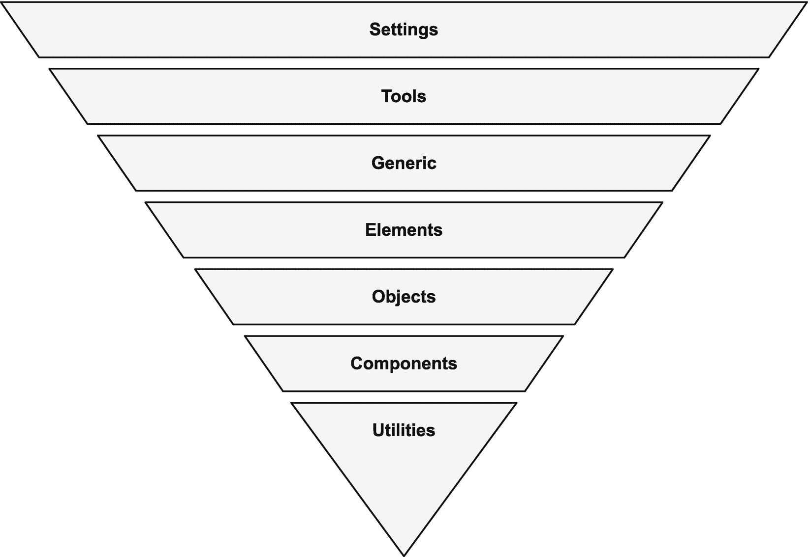

# 九、架构模式

为了给你的 CSS 产生一个架构方法，清楚地建立你的目标，然后确定一个通用的方法是很重要的。在这一章中，我们提出了目标、指导方针和方法供您考虑。

## 方法

当从事 web 开发时，建立一个对外部因素和业务需求敏感的一致的方法是很重要的。我们的开发团队还需要考虑一些因素，以确保我们能够快速产生预期的结果，并且随着内容的添加和更改，网站能够继续按照预期的方式工作。

Note

由于*元素*和*组件*都是在 Web 环境中具有特定含义的技术词汇，我们将使用词语*小部件*来指代由 HTML+CSS 组成的可重用构件。

虽然许多框架会用本地或基于框架的 web 组件实现一个小部件，但这既不是好的 CSS 架构的要求，也不是它的目标。

### 目标

回到第一章，我们的目标是通过高内聚和低耦合实现关注点的分离。我们希望在改善开发人员体验的同时，将维护成本和总体开发时间降至最低。以这些高级目标为起点，我们可以为我们的 HTML 和 CSS 推荐以下具体目标:

*   我们应该能够用 HTML 和 CSS 设计一个模块化的小部件，它可以独立存在而不依赖于外部 CSS。

*   当我们将一个小部件放入我们的网站时，我们希望它呈现我们网站和品牌的整体外观和感觉。

*   没有必要人为地提高特异性或优先级(比如通过添加 ID 选择器或`!important`注释)来按照预期样式化小部件。

*   HTML 文档中的一般内容编辑(插入图像、添加段落、调整表格中的行/列、向列表中添加项目等。)不需要更新样式表。

*   对于新加入我们团队的人来说，应该很容易知道如何对我们的页面和小部件的设计进行调整。

*   我们的风格应该易于阅读、理解和排除故障。

*   我们的网站设计应该容易重新主题，而不影响网站的布局和功能。

*   进行设计更改(比如颜色和排版)应该很简单，不需要在样式表的 CSS 属性上使用搜索和替换。

*   我们应该能够独立地调整 Widget-A 和 Widget-B 的样式，而不用担心对其中一个的更改会无意中影响到另一个。

*   应该尊重用户关于风格的意愿，以改善他们的体验和整体可访问性。

在他 2012 年关于 CSS 架构的博客文章中，Philip Walton 提出了一个重要的提醒:“如果你的 CSS 需要对你的 HTML 结构有深入的了解才能工作，那么从你的 HTML 中去掉所有的表示代码是达不到目的的。”

### 指导方针

从前面列出的目标出发，我们可以得出一些一般性的指导原则，这些原则可能有助于选择正确的方法。这些并不是一成不变的规则，而是你可以选择的一组合理的默认位置。

*   避免使用反映标签名称、属性值或伪类的类名(例如，不再使用`<button type="button" class="button">`或`<input type="password" class="password">`)。

*   避免使用通用的类名，如`content`、`container`、`wrapper`、`right`和`left`。这些名称对于它们的用法或意图没有提供任何有意义的理解，并且它们容易与我们项目中的其他样式表或第三方库发生命名冲突。

*   通常，避免使用 id 作为选择器。

*   首选选择器特性在[0 1 0]和[0 2 2]之间。再低的话，你就有可能将样式泄露到网站的其他部分。再高一点，你就有覆盖继承或者无意中使一个值变得有粘性的风险。更高的特异性也有过于冗长、脆弱或难以理解的风险。有目的且小心地使用更高特异性的选择器。

*   避免在样式表中使用`!important`和在 HTML 中使用内嵌样式。

*   为开发人员的体验和正在进行的更改的方便性和准确性优化您的 CSS 架构决策，而不是过度关注样式表的性能。

*   选择一致的命名策略。

*   分开关注。

*   仅在必要时使用子代和同级选择器(理想情况下仅在一个小部件中)，但避免使用后代选择器，因为它们具有未知的影响。

## 方法学

对于代码中的大多数东西，有不止一种方法来处理任何给定的问题。CSS 架构也不例外。在考虑如何构建代码和命名类时，有四种模式脱颖而出:BEM、OOCSS、SMACSS 和 ITCSS，如表 9-1 所列。我们将在下面的文本中讨论每一个，强调它们的一些优点和缺点。

表 9-1

CSS 方法

<colgroup><col class="tcol1 align-left"> <col class="tcol2 align-left"> <col class="tcol3 align-left"></colgroup> 
| 

年

 | 

创造者

 | 

方法:官方网站

 |
| --- | --- | --- |
| Two thousand and eight | 妮可·沙利文 | OOCSS: [`https://github.com/stubbornella/oocss/wiki`](https://github.com/stubbornella/oocss/wiki) |
| Two thousand and nine | Yandex | 嗯:[`https://en.bem.info/methodology/`](https://en.bem.info/methodology/) |
| Two thousand and twelve | 斯努克 | SMACSS: [`http://smacss.com/`](http://smacss.com/) |
| Two thousand and fifteen | 哈里·罗伯茨 | 痒 <sup>3</sup> : [`https://itcss.io/`](https://itcss.io/) |

以下方法的一个共同点是在 HTML 和 CSS 中大量使用类。他们都同意一个特定的观点——类在 HTML 中的唯一用途是用于 CSS 或 JavaScript 绑定。

需要指出的是，许多 CSS 专业人员混合搭配了这些方法中他们最喜欢的部分。像往常一样，选择对你和你的团队有用的，但是要始终如一。

### OOCSS

面向对象的 CSS (OOCSS)最初是由妮可·沙利文在 Web Directions North 上提出的，它借用了面向对象设计的概念来为 CSS 提供结构。OOCSS 中的对象就是我们所说的小部件，Sullivan 将其定义为“一种重复的视觉模式，可以抽象为 HTML、CSS 甚至 JavaScript 的独立片段。该对象可以在整个站点中重用。 <sup>4</sup>

OOCSS 有两条核心规则，旨在生成灵活、模块化和可交换的小部件。他们是

*   将结构与皮肤分开

*   将容器与内容分开

这些规则将使用清单 9-1 中的 HTML 来说明。

```html
<body>
  <div class="sidebar theme-light">
    <nav>
      <ul>
        <li><a href="/home">Home</a></li>
        <li><a href="/about">About</a></li>
      </ul>
    </nav>
    <form class="login">
      <input type="text" placeholder="Username">
      <input type="password" placeholder="Password">
      <button type="submit">Login</button>
    </form>
  </div>
  <main>
    <section class="hero theme-light">
      <p>Lorem ipsum dolor sit amet...<p>
      <button class="call-to-action">Subscribe</button>
    </section>
  </main>
</body>

Listing 9-1OOCSS Example HTML

```

#### 将结构与皮肤分开

结构(或布局)是指元素在页面上的位置，或者这些元素的功能和交互。布局属性包括影响元素大小和位置的项目，如`height`、`width`、`margin`、`padding`、`overflow`。

皮肤(或主题)是指元素的视觉方面。主题属性包括`color`、`border`、`box-shadow`、`font`、`opacity`等。

结构和皮肤应该通过不同的类来应用，如清单 9-2 所示。

```html
/* OOCSS wants this */
.theme-light {
  color: slategray;
  background-color: lightgoldenrodyellow;
  border: 1px solid navy;
}
.sidebar {
  padding: 1rem;
  float: left;
  width: 200px;
}
.hero {
  margin: 1rem 1rem 1rem 250px;
  padding: 1rem;
}

/* Not this */
.sidebar {
  color: slategray;
  background-color: lightgoldenrodyellow;
  border: 1px solid navy;
  padding: 1rem;
  float: left;
  width: 200px;
}
.hero {
  color: slategray;
  background-color: lightgoldenrodyellow;
  border: 1px solid navy;
  margin: 1rem 1rem 1rem 250px;
  padding: 1rem;
}

Listing 9-2OOCSS Separate Structure from Skin

```

这种方法允许将主题应用于广泛的元素，并且只在一个位置进行维护。为了按预期实现 OOCSS，有必要向 HTML 中添加类，以避免仅仅依赖 HTML 的语义。

#### 将容器与内容分开

这基本上意味着更喜欢基于属性而不是位置的样式。因此，给定清单 9-1 中的 HTML，我们就有了清单 9-3 中所示的 CSS。

```html
/* Given this default */
button {
  background-color: lightblue;
}

/* OOCSS wants you to do this */
.call-to-action {
  background-color: lightgreen;
}

/* Not this */
.hero button {
  background-color: lightgreen;
}

Listing 9-3OOCSS Separate Container from Content

```

这个建议有几个目的，比如更好的一致性和可维护性。一些具体目标:

*   不管在什么位置，按钮看起来都是一样的，除非 HTML 通过类指定了其他东西。

*   所有带有`call-to-action`类的元素将具有相同的外观，而不管标签或位置。

*   查看按钮的 HTML，我可以很容易地找到它的规则集。

*   避免人为夸大特异性，允许在必要时可预测地覆盖样式。

虽然这些是没有提供太多细节的通用指南，但是遵循这些建议没有明显的问题。

但是，请记住 CSS 要求每个属性都有一个值，所以任何没有提供的值都将使用默认值。此外，不同的元素(比如，`<a>`和`<button>`)对于这些属性有不同的默认值和不同的默认外观。因此，当使用 OOCSS 这样的方法并依赖于没有附带类型选择器的类选择器时，考虑一下当这个类应用于具有不同默认值的新元素时会发生什么。

### 不列颠帝国勋章

BEM 代表块、元素、修饰符，它总结了所使用的命名约定和组织的整体方法。BEM 中的“块”指的是我们的可重用小部件的概念。在 BEM 中使用“Block”和“Element”是很不幸的，因为它们的命名重叠了相似但不完全相同的 HTML 概念。(为了避免混淆，我们将在本章中使用斜体的 BEM 概念。)

虽然 BEM 是一个成熟的前端方法，但它是 CSS 开发人员中最流行的命名约定。命名遵循以下模式:

```html
block__element--modifier

```

在命名之间使用两个下划线和连字符是为了在一个节名中使用一个连字符，例如

```html
login-form__password-field--visible

```

边界元法中的一个常见问题是如何决定一个给定的项目应该是一个*块*还是一个*元素*。一般原则是，如果代码段不能与其父容器分开使用，那么它就是一个*元素*。如果可以独立重用，那么就是一个*块*。 <sup>5</sup>

清单 9-4 中的 HTML 显示了一个 BEM 命名的例子，它使用了与 OOCSS 例子相同的基本 HTML 结构。

```html
<body>
  <div class="sidebar sidebar--theme-light">
    <!-- Mix: both an element and a block -->
    <nav class="sidebar__nav nav">
      <ul>
        <li class="nav__item"><a href="/home">Home</a></li>
        <li class="nav__item">
          <a href="/about">About</a>
        </li>
      </ul>
    </nav>
    <form class="login-form">
      <input type="text" placeholder="Username">
      <input
        type="password"
        class="login-form__password-field--visible"
        placeholder="Password">
      <button
        class="login-form__submit"
        type="submit">Login</button>
    </form>
  </div>
  <main>
    <section class="hero hero--theme-light">
      <p>Lorem ipsum dolor sit amet...<p>
      <button
        class="hero__call-to-action">Subscribe</button>
    </section>
  </main>
</body>

Listing 9-4BEM Example HTML

```

在很多情况下，你可能会参考尼古拉斯·加拉格尔简化的边界元命名约定 <sup>6</sup> ，它看起来像这样:

```html
ComponentName-descendent--modifier

```

您可能已经注意到，这种表示法用骆驼大小写替换了带连字符的部分名称，并使用了一种更好的命名约定，不会与 HTML 重叠。更新我们的 HTML 示例可能会给出类似清单 9-5 中的代码。

```html
<body>
  <div class="Sidebar Sidebar--themeLight">
    <!-- Mix: both an element and a block -->
    <nav class="Sidebar-nav Nav">
      <ul>
        <li class="Nav-item"><a href="/home">Home</a></li>
        <li class="Nav-item">
          <a href="/about">About</a>
        </li>
      </ul>
    </nav>
    <form class="LoginForm">
      <input type="text" placeholder="Username">
      <input
        type="password"
        class="LoginForm-passwordField--visible"
        placeholder="Password">
      <button
        class="LoginForm-submit"
        type="submit">Login</button>
    </form>
  </div>
  <main>
    <section class="Hero Hero--themeLight">
      <p>Lorem ipsum dolor sit amet...<p>
      <button class="Hero-callToAction">Subscribe</button>
    </section>
  </main>
</body>

Listing 9-5Simplified BEM HTML

```

BEM 的一个目标是使*块*内部的结构扁平化，这样如果 HTML 的嵌套发生变化，相关的 CSS 就不必改变。在清单 9-4 的例子中，我们可以从使用`<ul>`和`<li>`标签改为使用`nav__item`的`<div>`标签，CSS 不需要改变。正如这个例子所示，BEM 不鼓励使用 HTML 元素作为 CSS 选择器。

BEM 的另一个目标是可预测和一致的命名以及简单的可维护性。例如，在一个项目中执行文本搜索来找到一个给定类名被使用的地方应该是非常容易的，这样就有可能放心地从我们的样式表中删除未使用的规则。

BEM 的一个好处是，基于*块*，样式表可以非常容易地分成多个文件，并且具有很高的可信度。

BEM 中修改器的使用违背了 OOCSS 的建议，即创建表示皮肤或主题的通用且可重用的样式。使用 SCSS 混音至少可以部分克服这一点，但这是一个值得注意的区别。虽然它使 BEM 非常可预测，但它大大降低了组合可重用样式的能力，有利于非常明确。

### SMACSS

CSS 的可扩展和模块化架构(SMACSS)是 CSS 方法论和同名书籍 <sup>7</sup> ，都是 Jonathan Snook 写的。其核心是规则集的分类系统。有五个类别:

*   **基础**–基础规则建立默认值。每个规则通常只适用于一个元素。这是标准化和基本字体大小的好地方。

*   布局(Layout)——这是我们放置维度和定位声明的地方，以及我们的小部件协同工作可能需要的任何粘合剂。

*   模块——这些是我们在 SMACSS 中找到可重用部件的地方。这里定义了这些模块化设计单元，如标注、侧栏和登录表单。

*   **状态**–大多数 web 应用程序在设计组件中可视化地展示了大量的状态，这属于这里。这可以包括诸如可见/隐藏、活动/不活动、悬停、聚焦和展开/折叠的值。

*   **主题**–影响外观、感觉和品牌(但不影响布局或功能)的声明通常是主题性的。这类似于 OOCSS 中的皮肤概念。

对事物进行分类的目的不是为了制造人为的障碍，而是为了更好地整理设计中的重复模式。SMACSS 并不惩罚违反分类准则的例外情况，而只是建议例外情况应被证明是有利的。

#### 类别命名

*基础*类别中的规则通常不使用类，也不需要命名约定。对于布局规则，在类名上使用前缀`l-`(小写的“L”后跟一个连字符)，比如`.l-leftnav`。对于州规则，使用一个`is-`前缀，例如`.is-visible`。这些规则如清单 9-6 所示，以说明它们如何适应 HTML 文档。

```html
<body class="l-leftnav">
  <div id="sidebar" class="sidebar-left">
    <!-- Mix: both an element and a block -->
    <nav class="nav">
      <ul class="l-stacked">
        <li><a href="/home">Home</a></li>
        <li><a href="/about">About</a></li>
      </ul>
    </nav>
    <form class="login">
      <input type="text" placeholder="Username">
      <input
        type="password"
        class="is-visible password"
        placeholder="Password">
      <button type="submit">Login</button>
    </form>
  </div>
  <main>
    <section class="hero hero-light">
      <p>Lorem ipsum dolor sit amet...<p>
      <button class="call-to-action">Subscribe</button>
    </section>
  </main>
</body>

Listing 9-6SMACSS Naming

```

正如您在清单 9-6 中看到的，模块(小部件)只是有一个有意义的名字。我们可以通过“子类化”来进一步澄清模块，在名字中增加一个新的部分，类似于 BEM 中的*修饰符*。例如，`.hero-light`将是`.hero`的子类。清单 9-7 展示了如何在样式表中使用命名约定。

```html
/* SMACSS wants you to do this */
.l-leftnav #sidebar { ... }
.login input[type=password] { ... }
.l-stacked > * { ... }
.hero { height: 8rem; border: 2px solid green; }
.hero-light { border-color: lightgreen; }

/* Not this */
#sidebar.sidebar-left { ... }
.login .password { ... }
.l-leftnav .nav li { ... }
.hero { height: 8rem; border: 2px solid green; }
.hero.hero-light {
  height: 8rem;
  border: 2px solid lightgreen;
}

Listing 9-7SMACSS Example CSS

```

#### 推荐

中小企业联合会的建议有两个总体目标:

1.  **改善语义**–这意味着让开发者更容易理解小部件和元素是如何以及为什么被使用的。

2.  **增加正交性**——在 SMACSS 书中，Snook 将目标表述为“减少对特定 HTML 的依赖”， <sup>9</sup> ，这仅仅意味着 HTML 的重组应该对我们的 CSS 产生最小的影响。

基于这些目标，该方法推荐了一些指导原则:

*   基于布局类而不是页面名称触发特定于布局的更改。

*   在选择器中使用模块(小部件)类名，而不是 HTML 元素。

*   避免在输入字段、按钮和表格等公共元素上设置主题默认值。

正如你可能已经注意到的，这些建议与我们在本章开始时建立的建议非常接近，这些建议来自于我们在第一章中对软件架构的探索。

### ITCSS

由 Harry Roberts 创建的倒三角形 CSS (ITCSS)试图使用 CSS 的自然优先级来解决选择器特异性。与 OOCSS 和 SMACSS 完全不同，样式表根据它们的用途被分成层 <sup>10</sup> ，如图 9-1 所示。



图 9-1

ITCSS 图

三角形的底部(在图表的顶部)代表最广泛和最不具体的规则，最明确的规则在三角形的点附近。这些层进一步定义如下:

*   **设置**–用于预处理程序，这一层包括变量定义和站点范围的设置，如字体和颜色。通常不应输出任何 CSS。

*   **工具**–进一步重用的全局混合和函数。这主要是为预处理程序设计的，通常应该避免输出 CSS。

*   **通用**–样式、CSS 变量和框大小设置的标准化和重置。从这个布局上应该产生 CSS。这类似于 SMACSS 中的基本规则类别。

*   **元素**–标准 HTML 元素的默认样式。

*   **对象**–基于类的选择器，定义可重用的框架对象，如 OOCSS 媒体对象。

*   组件(Components)——这是我们的小部件发挥作用的地方，大多数样式都在对象或组件层。

*   **Utilities**–可能需要能够覆盖三角形中早期所有内容的助手类。例如，显示/隐藏类。

ITCSS 没有定义命名或设计实践，而是推荐了样式规则本身的特定结构和组织，而没有提供关于允许何种规则的太多细节。 <sup>11</sup> 因此 ITCSS 完全兼容 OOCSS、SMACSS 和 BEM。

## 处理

软件架构师经常扮演的重要角色之一是帮助他们的团队建立良好的过程和实践。重要的是，您的流程要适合更大的网站发布和交付框架。

假设您正在构建一个网站，从公司营销团队管理的内容管理系统(CMS)中提取内容。虽然可以修改 CMS 产生的输出或训练营销团队向某些元素添加类，但这可能会给内容团队带来太大的压力。更可靠的做法可能是简单地编写 CSS，使您收到的内容达到预期的效果。在这个例子中，web 开发团队控制了一些 HTML，但不是全部。

### 决策

通常会有两种或两种以上的方法可以用来实现一个目标，这将由你来比较这些选项并作出决定。您选择的方法可能是第一个这样的决定，但是清单 9-8 展示了一些基于问题“我们如何在出错时用红色突出显示密码？”的代码决定

```html
/* CSS Rulesets */
.red-border: { border: 2px solid red; }
.password: { color: black; }

<!-- Sample HTML -->
<form class="login">
  <input type="text" placeholder="Username">
  <input type="password" placeholder="Password">
  <button type="submit">Login</button>
</form>

/*** How do we highlight the password in red on error? ***/

/* OPTION 1 - Add CSS Selector */
.login [type=password]:invalid,
.red-border: {
  border: 2px solid red;
}
.password: { color: black; }

/* OPTION 2 - Use SCSS Mixin */
.login [type=password]:invalid { .red-border; }

<!-- OPTION 3 - Add class to HTML -->
<input
  class="red-border"
  type="password"
  placeholder="Password">

Listing 9-8CSS Reuse Dilemma

```

清单 9-8 中的例子展示了基于状态的代码重用的三个选项，但是清单 9-9 展示了在页面上设置默认字体的两种不同方式。

```html
/* Cascade from the <body> tag */
body { font-family: helvetica, arial, sans-serif; }
p { font-family: 'Lucida Handwriting', cursive; }

/* Set explicitly on every element */
* { font-family: Consolas, 'Liberation Mono', monospace; }
p, p * {
  font-family: 'Lucida Handwriting', cursive;
}

Listing 9-9Set Default Font

```

大多数样式表作者选择从 body 标签级联字体默认值，如清单 9-9 所示，而不是使用通用选择器；然而，两者在技术上都是可能的。因为通用选择器的特异性为零，所以任何规则都会覆盖它；然而，由于它是在每个单独的元素上设置的，简单地重置`<p>`元素上的字体将*而不是*改变任何子元素的字体，比如锚标签、定义、按钮、标签等等。为了实现这种行为(当依赖于从`body`继承时，这是默认的)，我们需要将更改单独应用到每个子元素，或者再次使用通用选择器。

Note

类名只为页面作者和开发人员提供意义。您对类名的选择应该反映这一点。您的类名不会向用户代理或系统传达任何意义，也不会向您页面的访问者显示。 <sup>12</sup>

更有可能的是，无论您选择哪种方法，您的样式表都不会满足本章开始时陈述的所有目标。你需要决定哪些目标对你的团队和情况最重要。您可能需要问的一些具体问题包括

*   你的项目有多大/会有多大(部件、文件等)。)?

*   你的团队有多大/你期望发展到多大？

*   需要支持可互换主题吗？

*   您的开发人员对 HTML 或 CSS 有更多的控制权吗(许多应用程序涉及从外部来源提取内容、数据或样式)？

### 林挺

有助于确保跨浏览器兼容性、可访问性和良好代码的一种方法是通过林挺。Linters 是检查语法和格式错误的工具。根据所使用的工具，有些人还会检查效率低下或有问题的模式。W3 有一个验证服务 <sup>13</sup> ，但是许多人更喜欢一边验证代码一边运行。CSS Lint 等工具可以通过命令行 <sup>15</sup> 在浏览器<sup>14</sup>中运行，甚至作为编辑器扩展运行。 <sup>16</sup>

预编译的 CSS，比如 Sass 或更低版本，如果无效就不能编译，所以林挺不是问题。然而，linters 确实存在于预编译的 CSS 语言中，并且在调试和标记潜在的有问题的规则组合和冗余方面非常有用。

### 测试

像大多数代码一样，CSS 是可以测试的。有许多库可以做到这一点。有两种主要的方法可以测试 CSS:通过单元测试或者快照。

#### 单元测试

CSS 的单元测试包括检查期望应用的样式实际上是在元素上设置的。诸如堂吉诃德 <sup>17</sup> 之类的库测试浏览器中正在呈现的内容是作者想要的。作者可以通过类或 ID 选择特定的元素，并验证任何 CSS 属性。

使用预编译器时，也可以测试 mixins。与函数类似，mixins 有输入和输出；因此，可以根据传递的输入来测试输出。咖啡师 <sup>18</sup> 或真 <sup>19</sup> 等库可以确保 mixin 输出符合作者的意图。

#### 视觉回归测试

另一种测试 CSS 的方法是通过视觉回归测试。像 Cypress <sup>20</sup> 或 Jest <sup>21</sup> 这样的库提供了一个获取和比较快照的框架。通过对照参考快照检查当前快照，开发人员可以在 CSS 更改时得到意外副作用的通知。任何不匹配的快照都会产生一个标记，供作者检查。

### 代码审查

虽然林挺和自动化测试是以可预测的方式验证 CSS 的绝佳方式，但是可以通过自动化验证的 CSS 架构是有限的。有意义的代码审查是验证的好方法

*   实现的一致性

*   架构决策被遵循

*   最小代码重复

此外，代码评审是一个公开讨论架构决策和这些决策的具体结果的机会。代码评审不应该作为评判其他开发人员的方式，而应该作为一个分享知识、互相学习、确保您的团队和项目长期成功的论坛。

## 摘要

在这一章中，你已经学习了我们可以使用 CSS 提供的一切来构建样式表的架构模式。具体来说，我们讨论了

*   有助于评估各种选项的目标和指南

*   CSS 方法论 OOCSS、BEM、SMACSS 和 ITCSS

*   你可以用来评估你的决策以保持正确的过程

现在，您已经准备好在自己的项目中选择和实现 CSS 架构方法了！祝你好运，编码愉快！

<aside aria-label="Footnotes" class="FootnoteSection" epub:type="footnotes">Footnotes 1

[`https://philipwalton.com/articles/css-architecture/`](https://philipwalton.com/articles/css-architecture/)

  2

加拉格尔没有创造边界元法，但在边界元法的基础上推广了 CSS 的简化语法。

  3

[`www.creativebloq.com/web-design/manage-large-scale-web-projects-new-css-architecture-itcss-41514731`](http://www.creativebloq.com/web-design/manage-large-scale-web-projects-new-css-architecture-itcss-41514731)

  4

[`https://github.com/stubbornella/oocss/wiki`](https://github.com/stubbornella/oocss/wiki)

  5

[`https://en.bem.info/methodology/quick-start/#should-i-create-a-block-or-an-element`](https://en.bem.info/methodology/quick-start/%2523should-i-create-a-block-or-an-element)

  6

[`http://nicolasgallagher.com/about-html-semantics-front-end-architecture/`](http://nicolasgallagher.com/about-html-semantics-front-end-architecture/)

  7

[`http://smacss.com/book/`](http://smacss.com/book/)

  8

[`http://smacss.com/book/categorizing`](http://smacss.com/book/categorizing)

  9

[`http://smacss.com/book/html5`](http://smacss.com/book/html5)

  10

[`www.xfive.co/blog/itcss-scalable-maintainable-css-architecture/`](http://www.xfive.co/blog/itcss-scalable-maintainable-css-architecture/)

  11

[`www.creativebloq.com/web-design/manage-large-scale-web-projects-new-css-architecture-itcss-41514731`](http://www.creativebloq.com/web-design/manage-large-scale-web-projects-new-css-architecture-itcss-41514731)

  12

[`http://nicolasgallagher.com/about-html-semantics-front-end-architecture/`](http://nicolasgallagher.com/about-html-semantics-front-end-architecture/)

  13

[`https://jigsaw.w3.org/css-validator/validator`](https://jigsaw.w3.org/css-validator/validator)

  14

[`http://csslint.net/#results`](http://csslint.net/%2523results)

  15

[`https://github.com/CSSLint/csslint/wiki/Command-line-interface`](https://github.com/CSSLint/csslint/wiki/Command-line-interface)

  16

[`https://github.com/CSSLint/csslint/wiki/IDE-integration`](https://github.com/CSSLint/csslint/wiki/IDE-integration)

  17

[`https://github.com/jamesshore/quixote`](https://github.com/jamesshore/quixote)

  18

[`https://developer.helpscout.com/seed/css-unit-testing/`](https://developer.helpscout.com/seed/css-unit-testing/)

  19

[`https://github.com/oddbird/true`](https://github.com/oddbird/true)

  20

[`https://docs.cypress.io/guides/tooling/visual-testing.html#Functional-vs-visual-testing`](https://docs.cypress.io/guides/tooling/visual-testing.html%2523Functional-vs-visual-testing)

  21

[`https://jestjs.io/docs/en/snapshot-testing`](https://jestjs.io/docs/en/snapshot-testing)

 </aside>