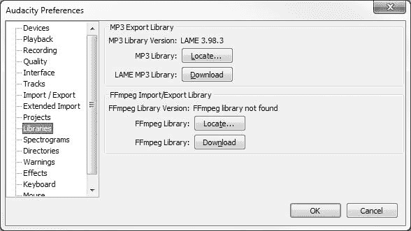
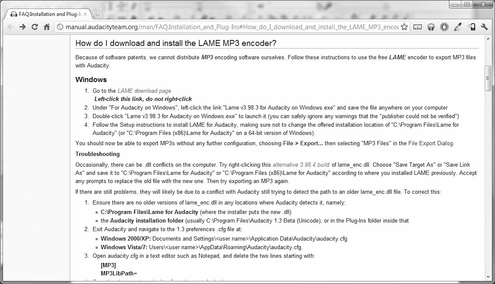
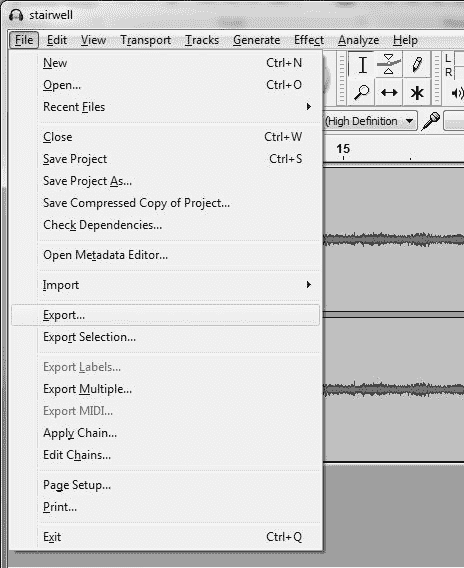
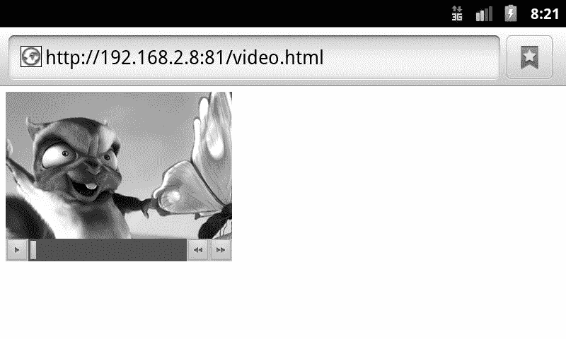
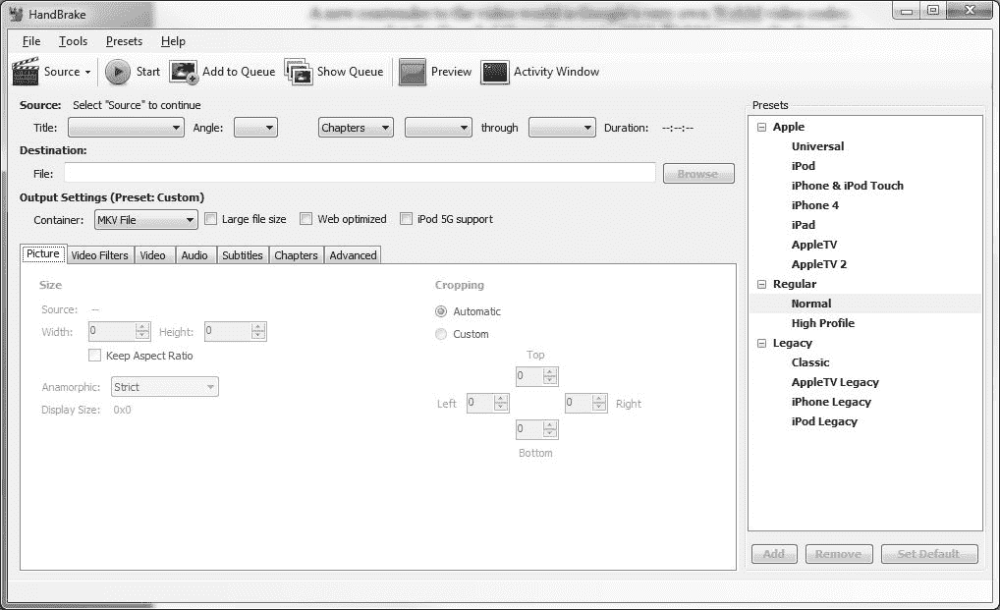
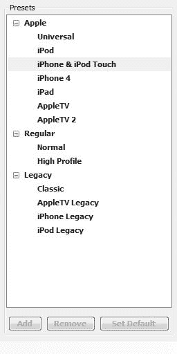
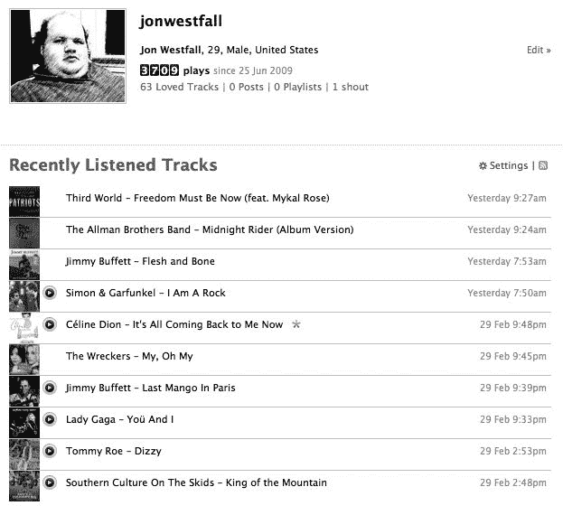
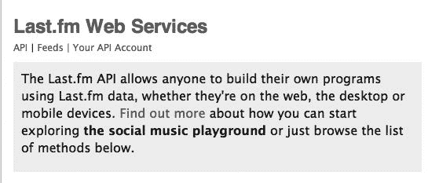
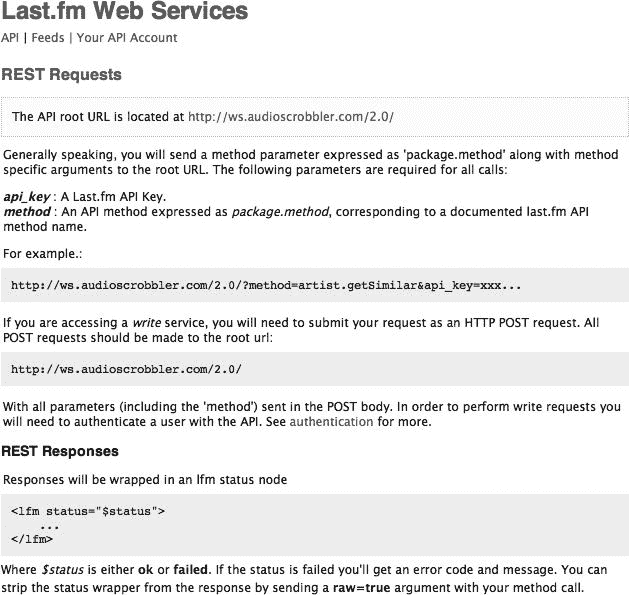
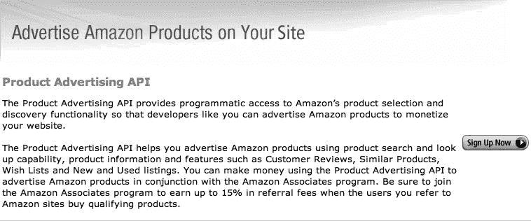

# 十一、使用音频和视频挑战极限

音频和视频是移动网络中最难涉及的两个话题。虽然每一种技术都可以增强网站或应用的视觉和听觉吸引力，但通常这两种技术都会被移动内容创作者滥用。例如，我注意到在移动世界越来越普遍的一种滥用形式是针对移动浏览器的基于音频的广告。虽然音频和视频技术都可能被不正确地使用，或者只是以一种普通的令人讨厌的方式使用，但如果使用正确，它们确实可以达到很好的目的。

比方说，我们正在开发一个手机游戏应用，我们想添加一些轻松的背景音乐来增强用户体验。当使用`audio`标签时，我们可以使用 Android 操作系统浏览器的内置 HTML5 功能相当容易地做到这一点，只需要几行代码。除此之外，我们甚至可以使用一点 JavaScript 来操作音频元素。我们可以通过按键来播放、停止或暂停音频。

通过 Android 的浏览器程序，我们还能够利用 HTML5 `video`标签来增强我们的 Web 应用，包括 h.264、MPEG-4 和 WebM 格式的视频。这两个标签——`audio`和`video`标签——如果使用得当，可以创造出一些顶级的用户体验来增强它们所在的应用，使它们散发出卓越的魅力。

在这一章中，我们将看一看这些元素，它们的 API，以及在我们的应用中使用这些新的`HTML5`标签的优缺点。

### 面向移动 Web 应用的音频

直到几年前，作为一名开发人员，如果您想在 web 应用中包含音频，您的选择是微乎其微的。几乎所有的解决方案都涉及到使用 Adobe Flash，并使用 Flash 作为中间人将音频传输到用户的音频输入设备。虽然可以通过`embed`和`object`标签给你的用户体验添加音频，但更多的时候你会得到一个非常有限且不可接受的用户体验，这让你的最终用户和开发者希望得到更多。

HTML5 采用率的上升使得在 HTML5 `audio`标签的 Android 实现中处理音频(尽管在一些罕见的情况下仍然很痛苦)变得普遍顺畅。有大量的例子表明，移动 Web 应用和游戏利用音频元素将背景音乐和声音效果带到他们的项目中，这有助于为用户创造更多引人入胜的场景。

不幸的是，像 Web 开发世界中的大多数事情一样，并不是所有的音频编解码器都是一样的。在关注移动世界时尤其如此。自 2010 年年中 Android 2.0 首次问世以来，谷歌的 Android 操作系统一直在使用 HTML5 音频标签，但它只使用了两种更受欢迎的音频编解码器选择——MP3 和 AAC 音频格式。

#### 利用 HTML5 音频标签

使用 HTML5 `audio`标签非常简单。看看清单 11–1 中的例子，我们在用户页面中添加了一个重复的音频循环。

**清单 11–1。***html 5 音频元素的基本使用*

`<audio autoplay="autoplay" controls="controls">
    <source src="audio/stairwell.ogg" type="audio/ogg" />
    <source src="audio/stairwell.mp3" type="audio/mpeg" />
    "Sorry, your browser does not support the audio element."
</audio>`

音频标签的基本用法与 HTML 空间中的其他标签非常相似。当声明 HTML 音频元素时，我们可以在文档中调用几个属性。让我们看看下面的一些属性:

*   `autoplay`—如果被调用，该属性将在音频元素准备就绪并可用时播放它
*   `controls`—确定是否向用户显示该音频元素的控件。
*   `loop`—如果设置，该属性告诉音频无限循环。就像那首永远不会结束的歌！
*   `preload`—这决定在文档加载时是否将音频元素预加载到页面中。
*   `src`—音频文件的 URL。

查看清单 11–1，我们还可以注意到`audio`标签也包含另外两个源标签。这些`source`标签都有`src`属性，指向服务器上文件的 URL。

使用多个标签的原因实际上是编写一个可以在多种浏览器上工作的 HTML 文档的巧妙方法。如果你的浏览器支持 HTML5 `audio`标签，它会检查每一个源编解码器，直到找到一个适合你的浏览器。如果它成功地找到了一个合适的文件(即，您提供了一个可以在用户系统上播放的文件版本)，它将播放该文件。如果没有，它将什么都不做。如果出于某种原因，你正在从一个没有显示音频标签的旧 Android 设备上查看这个页面，那么浏览器将会忽略这个元素，并显示预设的错误消息“对不起，??”。您的浏览器不支持如图 Figure 11–1 所示的音频图像。

**图 11–1。***Android Gingerbread 2.3 设备上的 HTML5 音频元素，带有“控件”属性集*

#### 将音频整合到“那是谁的推文”?

在我们在本书中使用的第一个应用中，我们要求人们猜测哪一个 Twitter 帐户产生了一条给定的 tweet。现在想象一下，我们想要放一点音频来抚慰那些玩我们游戏的人的野蛮的心灵。我们可以很容易地用音频标签做到这一点，使用下面的清单 11–2 中的代码。

**清单 11–2。** *HTML 代码那是谁的推文？带音频*

`<!DOCTYPE HTML>
<html>
<head>
<meta charset="utf-8">
<title>Who’s That Tweet?</title>
<link href='http://fonts.googleapis.com/css?family=Droid+Sans&v1' rel='stylesheet' type='text/css'>
<link rel="stylesheet" type="text/css" href="css/style.css">

</head>
<body>
**<audio autoplay="autoplay" loop="loop">**
    **<source src="audio/themesong.ogg" type="audio/ogg" />**
</audio>

  <header>
    
<strong>Score:</strong>0

    <h2>Player 1</h2>
  </header>
  <section>
    

      

      

    

    <ul></ul>
  </section>
</body>
</html>`

在本例中，我们已经开始播放我们的主题曲，并且我们已经设置了 loop 属性，这样它将简单地重复循环，直到时间结束。我们没有指定控件，如果音频无法加载，我们也不会显示任何消息。现在我们只需要找到一首好的主题曲，不会让我们的用户太烦！

#### 使用音频编解码器

如果您正在为 Android 设备构建您的应用，您将希望坚持使用整个平台上可用的以下三种编解码器之一:MPEG-2 音频层 III (MP3)、高级音频编码(AAC)和开源粉丝最喜欢的 Ogg。虽然每一个都有自己的好处，但大多数开发者通常只坚持 MP3 和 Ogg，因为有很多免费的开源工具可以将你的音频转换成这些格式。

##### MP3 文件

MP3 音频格式被称为有损压缩音频格式。有损压缩格式在多媒体中非常流行，如果你以前曾经使用过 Adobe Fireworks、Gimp 或 Adobe Photoshop 等图形设计程序，那么当你试图从图像中挤出几个额外的字节时，你可能对有损压缩比较熟悉(没有双关语)。在不损害图像完整性的情况下，删除数字图像的一部分以减小图像大小的方法同样适用于音频。

在 MP3 的例子中，压缩算法在数字音频中运行，并去除普通人耳通常不能拾取的部分音轨。MP3 文件的比特率越低，表示从录音中删除的数据越多。

虽然有些人声称由于丢失了音频信息，从 MP3 中听到了微弱的声音，但大多数人似乎无法说出与无损数字拷贝相比的区别。这使得 MP3 成为一个非常棒的音频编解码器，可以用于 HTML5 音频，因为你可以获得非常小的文件，可以下载并快速传输到用户的浏览器。也就是说，你应该小心为 MP3 文件选择合适的比特率——比如 128 kbps。任何较低的声音在高质量的音频设备上可能会有微弱的声音(例如，HTC Rezound)。如果不使文件太大的话，移动到 192、256 或 320 kbps 可能是有用的；然而，考虑到相对较小的好处，您可能会发现这是不必要的。超过 320 kbps 很可能是一种浪费，除非你的应用是为发烧友打造的！

在很大程度上，MP3 是互联网上事实上的音频格式，这就是为什么几乎每个主流浏览器都支持 MP3 音频和 HTML5，无需额外的插件。

##### 加气混凝土

高级音频编码，也称为 AAC，是另一种即将出现的音频格式。如果你曾经从苹果 iTunes 上购买过音乐，那么你很可能购买了这种音频格式的音乐。AAC 是由几家公司开发的，包括索尼、诺基亚、杜比和 AT&T。这种格式确实比它的前身 MP3 获得了更好的音频质量，并于 1997 年春天被宣布为国际音频标准。

这种音频格式受开发人员欢迎的原因之一，除了与其竞争对手相比声音更好这一明显事实之外，是因为分发或传输 AAC 编码内容不需要许可证或专利费用。注意，这种许可只适用于实际编码——你不能拿着不属于你的有版权的材料，用 AAC 编码，在你把它分发给全世界后嘲笑律师。好吧，我想你可以笑，但这对你的案子没有帮助！

##### Ogg

在我们探索征服 Android 设备上的 HTML5 音频的过程中，另一个崭露头角的是我个人最喜欢的编解码器之一:Ogg。Ogg 的创建者在过去声明过，他们创建 Ogg 是为了成为一种不受限制和软件专利束缚的格式。这促进了 Ogg 在大多数浏览器中作为默认 HTML5 音频编解码器的采用。如果你将你的音频编码成 Ogg 格式，它很有可能不仅能在 Android 设备上运行，也能在当今市场上的许多其他设备和浏览器上运行。

虽然 Ogg 是一种像 MP3 和 AAC 一样的有损压缩格式，但 Ogg 背后的框架可以在市场上的几种无损音频格式中找到，如 OggPCM 和 FLAC。有了 Ogg，你可以随心所欲:微小的文件或巨大的无损文件。天空是无限的。

#### 使用 Audacity 音频编辑器

我最喜欢的开源音频软件之一是 Audacity ( `[`audacity.sourceforge.net/`](http://audacity.sourceforge.net/)`)。这个免费的跨平台应用可以让您轻松地从许多不同的格式导入各种各样的音频。使用 Audacity，您可以轻松地将音频拼接在一起，剪切音频文件，录制现场音频，改变音频文件的音高和速度，给音频轨道添加噪音，降低过高的音频轨道的音量，以及许多其他非常酷和有用的功能(参见图 11–2)。

**图 11–2。** *Audacity 1.3 Beta 编辑一个知识共享音频文件*

每当我处理来自客户的音频时，当我看到一个大的 512 MB–1024 MB 的 WAV 音频文件时，Audacity 总是我的第一选择，它可以删除音频文件中我不需要的部分，或者将音频文件转换成更小、更易于管理的格式。

因为这本书只是打算涵盖 Android 移动设备设计的初学者方面，所以我不会对 Audacity 的所有特性进行过多的深入探讨。相反，我将介绍一些基础知识，比如将一种音频格式导出到另一种格式。

如果你想把你的文件转换成 MP3 格式，那么你需要下载蹩脚的 MP3 库。您可以通过 Audacity 中的首选项轻松地做到这一点。

1.  转到编辑菜单并选择属性。
2.  Choose the Libraries option in the left hand section of the Properties window as shown in Figure 11–3. 

    **图 11–3。** *查看 Audacity 1.3 测试版首选项对话框。*

3.  一旦到了那里，您可以选择将 Audacity 指向您的蹩脚库(如果您已经在计算机上安装了它的话)。如果您还没有安装 LAME 库，请继续执行步骤 4。
4.  Click the Download button, which will take you a site where can download the latest and greatest copy of the LAME MP3 Library, as shown in Figure 11–4. 

    **图 11–4。** *瘸腿 MP3 库下载页面。*

5.  一旦你下载了这个库并解压到你的硬盘上，你就可以录制音频并导出为 MP3 格式了。

如果你看一下本节前面的图 11–2，你会发现我们已经在使用一个名为楼梯间. ogg 的创作共用音频文件。我们要做的是将这个 Ogg 文件立即转换成 MP3 文件。为此:

1.  Click File in the menu bar, and then select the Export item as seen in Figure 11–5. 

    **图 11–5。** *在 Audacity 1.3 Beta 中从 Audacity 文件菜单中选择导出。*

2.  在下拉框中，确保将文件格式更改为 MP3，而不是音频文件的当前格式。
3.  选择您想要保存文件的位置，单击保存按钮，您就完成了！

你看，我不是答应过你不会痛的吗？现在，您已经知道如何快速将音频从一种格式转换为另一种格式，是时候通过非常方便的 HTML5 音频数据 API 来处理音频了。

#### 音频数据 API

使用音频数据 API，开发人员可以用几年前不可能的方式与音频数据进行交互。使用 JavaScript 和一些 HTML，您可以轻松地创建自己的控件来与您的音频数据交互，正如我们在清单 11–3 中看到的。

看一下下面的例子，你可以看到我们在清单 11–1 上进行扩展，并添加了一些新的定制控件来播放和停止音频。

**清单 11–3。** *更高级的 HTML5 音频数据 API*

`<audio id="audioDemo">
    <source src="audio/stairwell.ogg" type="audio/ogg" />
    <source src="audio/stairwell.mp3" type="audio/mpeg" />
    "Sorry, your browser does not support the audio element."
</audio>

<button id="play">Play</button>
<button id="pause">Pause</button>

`

当您在浏览器中运行这段代码时，您可能注意到的第一件事就是页面上根本没有任何音频控件，除了我们添加到页面上的两个按钮，它们的 id 分别是`play`和`pause`。这些按钮虽然不像在图 11–6 中看到的那么漂亮，但将是我们操纵页面上音频的唯一手段。

**图 11–6。** *在 Android 2.3.4 姜饼设备上加载我们的演示 HTML5 音频文档*

现在，如果你在 JavaScript 中查看清单 11–3 的底部，我们可以检查真正的奇迹发生在哪里。在这里，我们为`audio`、`playButton`和`pauseButton`声明变量。接下来，我们向每个按钮添加一个事件监听器，这样当用户单击这些按钮时，我们就可以发出一些代码来播放或停止音频流。如果我们愿意，我们可以包含额外的音量按钮，这将采取与上述代码类似的形式，但调用`audio.volume=X`，其中 X 将是一个 0 到 1 之间的数字，表示音量级别百分比(因此，如果您想将音量增加 10%，您的代码将读取`audio.volume = audio.volume + .1`)。

你也不仅仅局限于随意暂停你的音频文件。使用 HTML5 音频数据 API，您可以轻松控制在页面中播放或欣赏音频的许多方面，例如操纵音频文件的音量，分析一个轨道中每分钟的节拍数，将`canvas`的强大功能与音频数据 API 结合起来，创建您自己的可听音调，等等。

### 向移动应用添加视频

既然我们已经讲述了美妙的音频世界，现在是时候通过 HTML5 视频了解互联网多媒体的视觉吸引力了。视频标签是未来几年出现的 HTML5 新元素之一。它的创建是为了让开发人员的工作更容易，并让我们摆脱对 Adobe Flash 的依赖。对我们来说，不幸的是，没有人能真正就视频标准达成一致，而且有这么多的障碍、编解码器、许可协议和专利挡在我们的路上，我们不太可能很快就推出一种基于浏览器的通用视频格式。

好消息是，由于我们只专注于基于 Android 的设备，我们不必处理在桌面计算世界中使用 HTML5 视频带来的许多挫折。在这里，很简单。有一些视频编解码器可以在 Android 浏览器上工作，只要你坚持使用其中的一种或全部，你就能为你的移动用户提供更丰富的多媒体体验。

#### 使用 HTML5 视频标签

调用 HTML5 `video`标签就像调用我们在本章前面讨论的`audio`标签一样简单。看一下清单 11–3，看看我们如何使用几行代码轻松地向用户显示视频。

**清单 11–3。***html 5 视频元素的基本使用*

`<video width="320" height="240" controls="controls" poster="video/big_buck_bunny.jpg">
    <source src="video/big_buck_bunny.mov" type="video/mp4" />
    <source src="video/big_buck_bunny.ogg" type="video/ogg" />
    <source src="video/big_buck_bunny.webm" type="video/webm" />
    Sorry! Unfortunately your browser does not support the video tag
</video>`

在这个例子中，我们只是调用一个视频文件，并将视频容器的`width`设置为 320 像素，将`height`设置为 240 像素。我们还告诉视频显示它的控制，这样用户可以播放，暂停，停止，并操纵视频的音量。你可以在图 11–7 中的移动设备上看到这个样子。

**图 11–7。** *在 Android 2.3.4 姜饼设备上观看 HTML5 视频*

您还会注意到,`video`标签与`audio`标签的不同之处在于具有不同的属性。最突出的一个是`poster`属性，它让我们添加一个截图(或任何其他图像)来表示将要播放的视频。这对于移动设备来说非常好，因为当你在 Android 设备上播放视频时，Android 设备会将视频流传递给内置的视频播放器，后者会为你播放视频，而不是像人们在使用台式电脑多年后所期望的那样在浏览器中播放视频。

虽然这个功能有趣且方便，但它完全消除了人们使用视频数据 API 的许多理由，因为它在我们的页面之外播放视频——在一个专用的视频应用中。这破坏了用户体验，使我们无法控制用户在观看我们的视频时会看到什么。

一会儿，我们将给出一个视频例子，类似于我们在上面使用的音频 API。然而，我们应该注意到，虽然你可以用视频数据 API 做一些很酷的事情，但是很多事情都超出了大多数人的需求。以下是基本情况；然而，完整的 API 可在`[www.w3.org/2010/05/video/mediaevents.html](http://www.w3.org/2010/05/video/mediaevents.html).`获得参考。现在让我们来看看在开发下一个使用视频的移动 web 应用时可以使用的最有用的属性！

*   `height—`控制播放视频的高度
*   `width—`控制正在播放的视频宽度
*   `preload`—如果设置，将在页面加载时预加载视频
*   `autoplay`—如果设置，将在视频准备就绪时自动播放
*   `loop`—如果设置，将无限循环播放视频
*   `controls`—如果设置，将向用户显示控件以控制视频
*   `src`—指向视频文件来源的 URL

#### 编解码器

就像我们对音频所做的那样，视频必须被编码成原生 Android web 浏览器支持的几种格式之一(后面会提到)。对视频进行编码可能比对音频进行编码要稍微复杂一些，因为你要对两种东西进行编码——即音频和视频！我们将介绍您可以使用的格式，并讨论如何轻松地在它们之间移动音频和视频。

##### h.264/MPEG-4

多年来，MPEG-4 已经成为互联网和我们日常消费生活中视频编码的首要标准之一，尤其是在高清视频方面。最近，随着 YouTube 和 Vimeo 等社交视频共享网站的兴起，MPEG-4 进入了公众的视野，这些网站允许用户上传这种格式的视频。MPEG-4 的当前版本被称为 h.264/MPEG-4 AVC，是高质量视频压缩的标准，如蓝光光盘上的标准。

##### Ogg Theora

Theora 是一种免费的开源有损视频压缩格式，由负责维护 Ogg 音频编解码器的同一个基金会 Xiph 创建。Org 基金会。虽然 Theora 本身是基于一个名为 VP3 的专有视频编解码器，但它后来被发布到公共领域，从 2002 年 3 月起任何人都可以免费使用。

Ogg Theora 在设计上类似于 MPEG-4，并且在过去几年中作为一项技术得到了快速发展。虽然它在质量上仍然比不上 MPEG-4 视频，但它非常接近，以至于许多以前喜欢广泛接受 MPEG-4 的开发人员现在选择走 HTML5 视频路线，开始加入 Theora 的行列。

##### WebM

视频世界的一个新竞争者是谷歌自己的 WebM 视频编解码器。WebM 是在 2010 年的谷歌 I/O 大会上宣布的，是一种免版税的视频编解码器，谷歌将其投入使用，试图规避 HTML5 音频和视频中出现的许多问题。虽然每个人都很高兴在他们的 web 应用和网站中使用这些新技术，但是如果没有所有的浏览器制造商都同意一个标准，就很难做到这一点。

WebM 是完全免费的，这意味着任何人都可以获得这项技术，并将其包含在他们的网络浏览器中，而不用担心谷歌将来会敲他们的门要求支付费用。但是，请记住，这里指的是技术，而不是实际的内容。分发有版权的电影会让其他人来敲你的门要求支付！

即使有了这个免版税的安全网，与 Ogg Theora 等其他视频编解码器相比，WebM 的采用率仍然相当低。

#### 使用手刹转码视频

现在，您已经对一些视频编解码器有了更好的了解，我敢打赌，您会问自己如何创建视频内容，以便在应用中使用它们。最简单、最省事的方法之一是一个叫做手刹(`[`handbrake.fr/`](http://handbrake.fr/)`)的小应用。手刹是另一个令人难以置信的开源应用，旨在使视频爱好者和普通视频转码消费者的日常生活更加轻松。

看看图 11–8。这是我们打开手刹应用时看到的默认视图。正如你所看到的，这里的一切都非常用户友好，易于使用。在应用的顶部，如果您单击电影隔板图标，您可以设置您想要转码的视频源，或者从一种格式转换为另一种格式。在该图标下面，有一个区域，您可以在其中设置新创建的视频的目的地，以及更改您想要存放视频的容器。手刹提供的两个容器是`MKV`和`M4V`视频容器。容器是一种简单的文件格式，用于保存视频的两个独立部分(图片和音频)。

**图 11–8。** *在 Windows 7 操作系统上打开手刹后的视图*

该应用的下半部分是一个选项卡式视图，您可以使用它来定制您的视频，甚至更喜欢。这里最重要的选项卡是视频选项卡。在这里，您可以设置您想要将视频转换为哪种编解码器。根据您选择的视频容器，手刹为您提供了三种视频转换选择——MPEG-4 或 Ogg Theora。

应用的右边将会为你带来很多奇迹。在这里，您可以从各种预配置的视频设置中进行选择，因此您所要做的就是输入一个视频源，决定您要将视频保存到哪里，选择一个您喜欢的设置，然后开始编码。

如果你看一下图 11–9，你也会注意到视频容器选项旁边的两个小复选框。这些复选框`Web Optimized`和`iPod 5G Support`，是您在对视频进行编码时可能想要尝试的两个选项。在某些情况下，我发现这些设置帮助我创建了质量更好的视频文件，以便在浏览器中使用。然而，在其他时候，它们只会让我心痛。这一切都归结到你作为你的源材料使用的视频文件。视频可能很棘手，尤其是将它从一种格式转换成另一种格式时。最后，人们通常必须“玩”一点设置，以获得最好的结果。如果您的视频文件很大(因此需要更多时间进行转码)，您可以考虑将它分割成一小部分进行试验。一旦你找到了设置和选项的正确组合，你就可以转换视频的长版本，为自己节省一些时间。

**图 11–9。** *设置 Windows 7 手刹内的视频源、目的地和视频容器设置*

**图 11–10。** *选择 iPhone & iPod Touch 为我们的视频预设配置设置*

最后，手刹的选择可能有点多。如果你在寻找更简单的东西，你可能想看看更方便消费者的(即，为非开发人员或高级用户制作的)解决方案，如 DoubleTwist ( `[www.doubletwist.com](http://www.doubletwist.com)`)和 Videora ( `[www.videora.com](http://www.videora.com)`)。两者都可以将视频转换成在移动设备上可以观看的格式，只需很少的努力或需要定制。

现在我们已经了解了一些关于创建、显示和使用您自己的音频和视频的基本信息，我们将介绍一些您可以通过与程序员可用的不同 API 接口来扩展您的应用的领域。

### 自己探索:音乐服务应用编程接口

许多 web 服务通过 API(应用编程接口)向程序员提供对其平台的访问。在这一节中，我们将讨论两个流行的应用，以及它们提供的 API。您可能会发现，通过将您的应用绑定到这些服务中的之一，您不仅可以使用一些很酷的工具——您还可以增加应用对该服务用户的吸引力。

#### “滚动”曲目至 Last.fm

Last.fm 是一项服务，它不仅可以将音乐传输到你的电脑或手机上，还可以智能地了解你的偏好。一种方法是允许多个设备(即安装了 Last.fm 客户端的 iOS 设备和 android 手机)将收听的曲目信息发送到 Last.fm，Last.fm 将这一过程称为“scrobbling”。例如，我用谷歌音乐通过浏览器收听我的音乐收藏。通过使用 Chrome 的一个扩展将我的曲目滚动到 Last.fm，我可以在以后查看我的收听行为，Last.fm 知道我喜欢听什么类型的音乐(图 11–11)。

**图 11–11。** *我的 Last.fm 最近听的曲目*

一旦录制了一首曲目，它就会告知 Last.fm 我的收听习惯。这有助于告诉 Last.fm 向我推荐什么，并允许我找到我可能喜欢的新音乐。

想象一下，我们想在我们的新应用 MusicDiscovery 中向用户展示音乐片段。假设 MusicDiscovery 为用户播放 45 秒的歌曲片段。用户评价他们有多喜欢这首歌，如果他们评价足够高，我们就把它滚动到 Last.fm，这样它就可以记录他们的偏好。我们将如何着手做这件事？

首先，我们需要了解 Last.fm API。大多数提供 API 访问的 web 服务会在他们网站的“面向开发者”或“API 访问”部分清楚地展示如何使用它。Last.fm 在其主页底部包含一个“API”链接，通过该链接可以进入 API 主页(图 11–12)。

**图 11–12。***last . FM 网络服务页面*

翻看 Last.fm API 信息，好像是两步走的过程。首先，你必须申请成为一名开发者(这包括告诉 Last.fm 你打算将他们的数据用于什么目的，即商业或非商业用途)，并填写一些关于你的应用的基本信息。一旦解决了这个问题，您就可以探索他们的 API 的使用了。

API Intro 页面列出了一些基本信息，包括 API 根 URL。这是我们将向其发送信息的网址。大多数请求将利用 AJAX，这是一种我们将在下一章详细讨论的技术。浏览文档，我们可以找到如何将数据发送到 Last.fm 的示例。

正如我们在 Figure 11–13 中看到的，我们对 Last.fm API 的请求采用特殊格式的 URL 或 HTTP POST 请求的形式。然后，Last.fm API 使用 XML 返回响应。

**图 11–13。***last . FM API 请求文档*

现在我们已经大致了解了信息将如何在我们的应用和 Last.fm 之间来回传递，我们可以开始探索 scrobbling 特性了。Last.fm 的 scrobble 文档(`[www.last.fm/api/scrobbling](http://www.last.fm/api/scrobbling)`，图 11–14)详细地展示了整个过程，包括使用哪些 API 调用(或函数)，以及发送 scrobble 请求时使用什么标准。

**图 11–14。** *捡破烂过程*

现在我们已经得到了所有的片段，我们需要做的就是编写适当的 JavaScript 代码来获取用户已经评级的当前音乐片段，在 Last.fm 的目录中查找它，并发送 scrobble 请求。在这里你可以发挥你的编程能力并解决它。一路上，一定要看看 Last.fm 的其他广泛的查找和录制功能。不仅可以为 Last.fm 用户提升用户体验，还可以利用 Last.fm 数据为自己不使用 Last.fm 的用户提升体验！

#### 挖掘亚马逊产品广告 API 的力量

大约 15 年前，Amazon.com 以书店起家。现在，他们已经发展成为一个巨大的零售巨头，提供从书籍到云计算服务器等等的一切。最近，他们已经扩大了他们的音乐产品，在应用中提供音乐或视频的开发者可能希望通过亚马逊提供购买这些资源的链接。

亚马逊产品广告 API ( `[`affiliate-program.amazon.com/gp/advertising/api/detail/main.html`](https://affiliate-program.amazon.com/gp/advertising/api/detail/main.html)`，图 11–15)是一个庞大的网站，所以我们只能在这里强调它的主要特性。你可以花上几天时间来探索你可以用亚马逊的数据做的一切，所有这些都是为了通过你的应用提供亚马逊产品来增加收入。

**图 11–15。** *亚马逊产品广告 API*

Amazon 不仅提供关于他们的 API 的文档，还提供开发者论坛，在那里你可以向其他开发者寻求帮助，甚至提供代码示例，这可以让你快速上手并运行。

对代码数据库进行一些快速搜索，就会发现一段非常有趣的代码，对于任何希望构建一个展示特定艺术家的应用的人来说都是如此。假设你在一个乐队，想为你的乐队开发一个应用。你决定开发一个 web 应用，因为它可以在每个人的智能手机上轻松运行，而且你正在亚马逊的 S3 云存储中存储你的音乐会录音、演示和专辑。我们该如何向粉丝们推销呢？它有一个演示，叫做 io objects(`[`j.mp/iobjects`](http://j.mp/iobjects)`，图 11–16)。

**图 11–16。***io objects 代码示例*

虽然这比我们在上一节中讨论的 Last.fm API 要复杂得多，但它确实展示了在应用中使用 API 的强大功能。现在你不需要担心支付你的材料(因为亚马逊灵活支付系统(FPS)可以照顾这一点)，你可以很容易地通过你的应用，通过亚马逊提供产品，这是你的粉丝熟悉并经常使用的机会！

正如我们所见，使用来自 Amazon 或 Last.fm 等服务的 API 不仅可以增加应用的交互性，还可以带来新的收入流和创新方式。当你的乐队(或你客户的乐队)的用户还在音乐会上就可以下载歌曲时，他们肯定会脱颖而出，而你将成为实现这一切的开发者英雄！

### 总结

在移动 HTML5 前端处理音频和视频可能会非常轻松，因为您必须支持的手机和操作系统数量有限。然而，正如本章开始时提到的，如果使用不当，它们都是很容易被滥用的技术，或者很快就会对你不利。在这一章中，我希望我已经向你展示了使用这些技术对你有益的工具。

当谈到音频和视频转换和操作时，我们甚至还没有开始触及到您可以使用哪些工具来完成这项工作。有太多高质量的音频和视频工具了——我们大概可以写一整本书来谈论它们。你不必使用我在本章中建议的工具，我鼓励你做一些研究，找到最适合你的解决方案。