# 六、简单电子邮件服务

虽然我们的应用已经取得了很大的进步，但在它准备好投入使用之前，我们还需要构建一些功能。当然，最明显的是用户账户缺乏安全性。甚至不需要登录就可以上传到别人的相册。在这种情况下，安全确实是一种幻觉。不过不用担心，我会在第八章的大结局中谈到这个话题。

事实上，在真正投入生产之前，我们的应用还缺少相当多的部分。如果这是一本严格意义上的编程书籍，我们仍然需要浏览关于构建管理门户、不当内容标记系统和社交网络功能的教程。不幸的是，在这些课程中没有时间构建一个完整的企业应用。我们的重点仍然是在 AWS 上构建一个可伸缩的弹性应用，其成本在于关注集成到 AWS 服务中的功能，而不是那些您可以从另一本 Node.js 编程书籍中的年长和明智的开发人员那里学到的功能。

也就是说，我们仍然可以通过 AWS 和一些优秀的老式编程之间的协同作用来构建一些功能。因为我们的应用完全作为 web 服务进行交互，所以感觉有点单调，不是吗？上传了这么多旅行照片，得到的回复都是 JSON 这个，JSON 那个。通往我内心的路是我的收件箱，是时候让我们的应用发送一些邮件了！

## 简单电子邮件服务简介

不管内容如何，任何包含用户生成内容的 web 应用都可以从某种通知系统中受益，无论是电子邮件还是移动推送通知。亚马逊提供了一些不同的服务来支持通知，但我们将专注于亚马逊简单电子邮件服务(SES)。Amazon SES 旨在允许您以编程方式生成任何类型和数量的电子邮件通知。从大规模营销活动到密码重置电子邮件，您可以使用 Amazon SES 发送任意数量的静态和动态内容。

如果您以前曾经用任何语言构建过服务器端应用，那么您很有可能曾经生成过电子邮件。如果您使用 PHP，您可能已经花了一些时间仔细格式化`mail()`函数的参数。这种方法虽然乏味，但在小范围内效果很好。但是想象一下，如果您的应用有成千上万的用户。突然之间，仅仅生成电子邮件就有了资源管理方面的问题。

Amazon 为这个问题提供了一个解决方案，它允许您将发送邮件的工作负载从应用堆栈中分离出来。相反，我们将使用 AWS SDK 向 Amazon SES 发送命令，它将代表我们发送邮件。这将提供显著的资源节约，并且我们的应用堆栈将保持没有邮件服务器的负担。我们也免去了配置自己的邮件服务器的麻烦。我们也不必看着我们辛辛苦苦生成的电子邮件直接进入垃圾邮件文件夹。

让我们欣慰的是，亚马逊 SES 有一个免费层。在撰写本文时，你每月可以免费发送 62，000 封电子邮件。之后，你要为每一千封邮件支付 0.10 美元。除了发送邮件的费用，您的邮件包含在从 EC2 费率表中转出的数据中，并且您还需要为每 GB 附件支付 0.12 美元。总之，这非常合理，并且您的 SES 成本可能会比 RDS 或 EC2 账单低一个数量级。

### 探索 SES 仪表板

我们将向我们的应用添加一些电子邮件，这将在我们的代码中以编程方式生成。在此之前，我们必须在 AWS 控制台中执行一些任务。让我们从配置 SES 开始。在 AWS 控制台中，在页面右侧的“应用服务”列中找到 SES，然后单击它。我们将在 SES 控制面板中开始这一过程。正如你在屏幕上看到的(以及图 6-1 )，这个仪表盘上发生了很多事情。

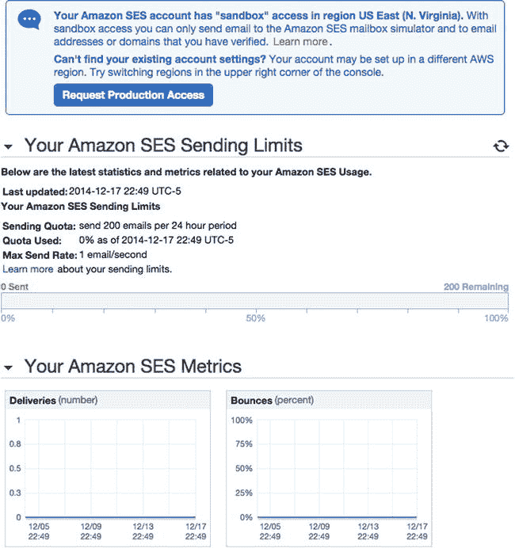

图 6-1。

SES dashboard

与许多其他 AWS 仪表板一样，视图的左栏是二级导航。在主要内容区域，您会立即看到一条警告，提示您的帐户拥有“沙盒”访问权限。默认情况下，所有 AWS 帐户都是在沙盒模式下创建的，这限制了 AWS 客户向公众发送大量电子邮件的能力。这只是一种反垃圾邮件的预防措施，因为请求生产访问很容易。稍后我会更详细地讨论这一点，但是现在，请注意，此时您不能向任何人发送电子邮件。

在警告的正下方，您可以看到 Amazon SES 发送限制的快速快照。您会注意到，当前的发送配额是每 24 小时 200 封电子邮件。在您向 SES 请求生产访问权限之前，此配额一直有效。明确地说，这意味着 200 个接受者。如果你发送 20 封电子邮件，每封有 10 个收件人，你将达到你的配额。

在您的亚马逊 SES 发送限制下方，您会看到一个标题为“您的亚马逊 SES 指标”的标题。在此部分，您可以查看 SES 发送的消息的结果，以实际数量或比率(百分比)查看。如果你以前用过电子邮件营销软件，你会认识这些术语:投递、退回、投诉、拒绝。如果您仅使用 SES 向订阅和注册用户发送通知，这些指标可能对您没有价值。但是如果你计划用电子邮件营销来恐吓你的用户，这些可以是有用的标准。

### SES 验证

当我们处于沙盒模式时，对于我们可以向谁发送电子邮件有很大的限制。我们用作发件人或收件人的任何地址都必须经过验证。在图 6-2 中，注意左侧导航中的验证发送者。

图 6-2。

SES Verified Senders

您可以在两个级别验证 SES 地址:个人电子邮件地址级别和域级别。对于已验证的电子邮件地址，您需要手动验证每个电子邮件地址。然后，您可以向经过验证的地址发送电子邮件，也可以从该地址接收电子邮件。如果在域级别进行验证，则可以从域中的任何地址发送电子邮件。例如，在一种情况下，您可能希望验证从`support@yourdomain.com`发送电子邮件的域，而在另一种情况下，您可能希望验证从`donotreploy@yourdomain.com`发送电子邮件的域。验证域只允许您从有问题的域发送电子邮件。例如，你不能验证 [`gmail.com`](http://gmail.com/) 并被允许向数百万 Gmail 用户发送电子邮件。

出于开发目的，从我们的应用的 web 域向注册用户发送电子邮件是理想的。虽然我们正在开发，注册用户还必须在 ses 中验证电子邮件地址。稍后，我们将请求 SES 的生产访问权限，使我们能够向所有用户发送电子邮件。但是我们不必这样做来完成开发和测试。

#### 电子邮件地址验证

让我们首先验证一个电子邮件地址——您自己的个人电子邮件。在图 6-2 所示的已验证发件人标题下，点击电子邮件地址。您将看到一个经过验证的地址表，现在已经没有了。单击页面顶部的验证新电子邮件地址。页面上方会出现一个模态窗口，如图 6-3 所示。输入您的电子邮件地址，然后单击验证此电子邮件地址。

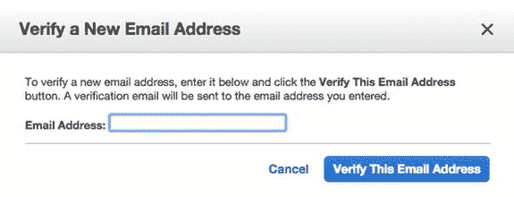

图 6-3。

Verifying an e-mail address

几分钟后，模式窗口将通知您验证电子邮件已经发送。当您退出模式并返回主视图时，您的地址将出现在表格中，状态为待验证(参见图 6-4 )。

图 6-4。

SES verified e-mail addresses

在您的收件箱中，查看主题为“亚马逊 SES 地址验证请求”的电子邮件，地址在 region[您当前所在的地区]。您将看到一个冗长的验证 URL，您应该单击它来确认地址。如果您在 24 小时内没有点击该链接，它将过期，并且您的电子邮件地址的验证状态将变为失败。该链接会将您带到 AWS 页面，祝贺您验证了您的电子邮件地址。庆祝即将开始！

当您刷新电子邮件地址列表时，您的地址状态现在应该得到验证。让我们做一个快速测试。选择您的地址，然后单击发送测试电子邮件。将出现一个模式窗口，允许您填充电子邮件的“收件人”、“主题”和“正文”字段(参见图 6-5 )。您可以单击“更多选项”来添加其他电子邮件标题，如“密件抄送:。让你自己也成为收件人:填写一条消息，然后点击发送测试邮件。

图 6-5。

SES Send Test Email

过一会儿，您应该会收到电子邮件。现在让我们试着给别人发一封电子邮件。从列表中选择您的电子邮件，然后再次单击发送测试电子邮件。这一次，在 To:字段中，输入属于朋友的不同地址或您自己的地址，然后再次单击 Send Test Email。这一次，您会遇到一个错误，如图 6-6 所示，因为收件人也必须是经过验证的电子邮件地址。

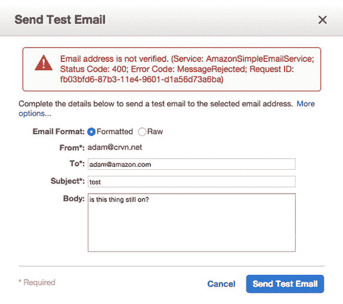

图 6-6。

SES Send Test Email again

就这么简单。然而，出于开发的目的，我们必须能够发送邮件，而不仅仅是与自己往来。让我们继续验证我们的域，这样我们就可以开始从应用发送邮件了。

#### 域验证

选择左侧导航栏中“已验证的发件人”标题下的“域”。单击顶部的验证新域按钮。将再次出现一个模态窗口，提示您输入域名。输入域名并点击生成 DKIM 设置旁边的复选框(见图 6-7 )，然后点击验证该域。

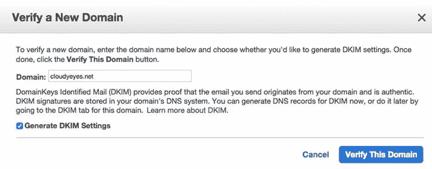

图 6-7。

Verifying a domain

一会儿，一个新的模态视图将出现，如图 6-8 所示。

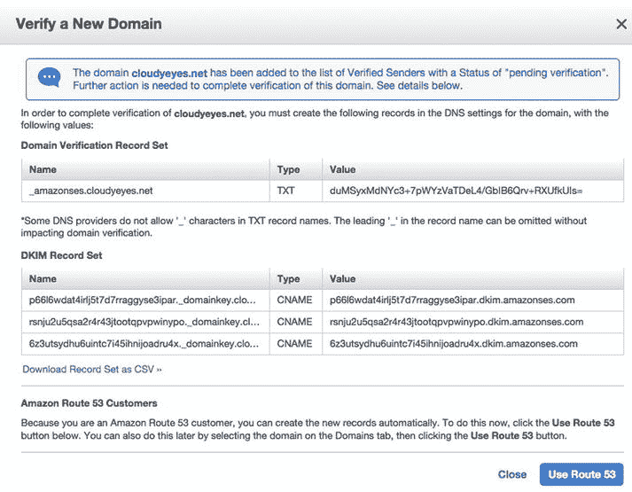

图 6-8。

Verify domain DNS records

为了完成域验证，必须在您的主机上创建这些 DNS 记录。此外，理想情况下应创建 DKIM 记录。DKIM，或域密钥识别邮件，本质上是一种加密方法，用于验证声称从一个域发送的邮件实际上是源自所述域。通过在域级别启用 DKIM，我们降低了应用消息出现在垃圾邮件文件夹中的风险。

如果您在别处管理您的 DNS，您必须创建 TXT 和 CNAME 记录，如模态视图所示。但是，您会注意到右下角的“使用 53 号公路”按钮。因为我们使用 Route 53 来管理我们的 DNS，所以我们可以自动完成配置。点击此按钮继续。

另一个模态视图将会出现，而不是被重定向到 53 号公路，准备执行一些 53 号公路的任务。您将看到域验证和 DKIM 记录集的表格，每个表格上方都有复选框，用于切换这些记录的创建(参见图 6-9 )。

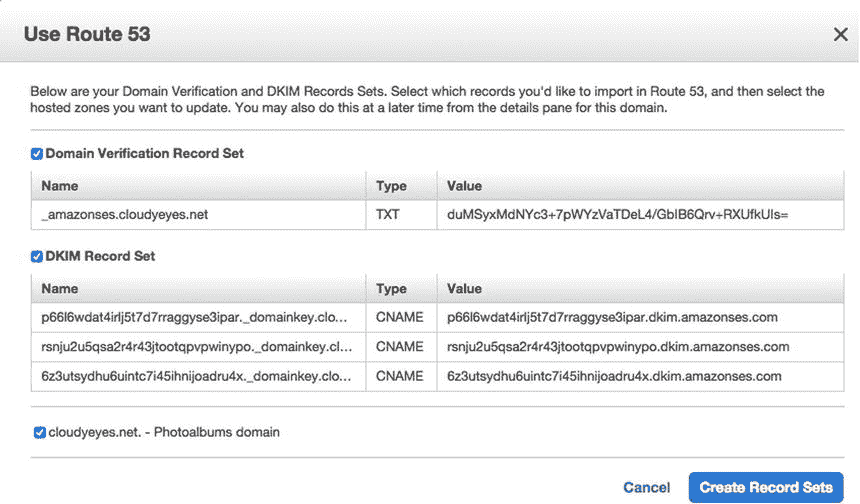

图 6-9。

Creating DNS records in Route 53

单击创建记录集以自动创建记录集。过一会儿，您将返回到“已验证的发件人:域”表，如图 6-10 所示，该表将列出您的域，并显示待验证状态。

图 6-10。

Verified domains

作为健全性检查，让我们验证记录是否被正确创建。打开 AWS 服务菜单，导航至 53 号公路。选择托管区域，并从出现的表格中选择您的域名。在顶部，单击转到记录集以查看与您的域相关联的 DNS 记录。果然，您应该看到三个 CNAME 记录和一个 TXT 记录，它们的名称和值与我们在 SES 中生成的内容相对应(参见图 6-11 )。由于这实际上是一个 DNS 更改，可能需要 72 小时来验证您的域。有趣的是，它比使用 53 号公路花费的时间要少得多。在任何情况下，我们的域名都不会被立即验证。

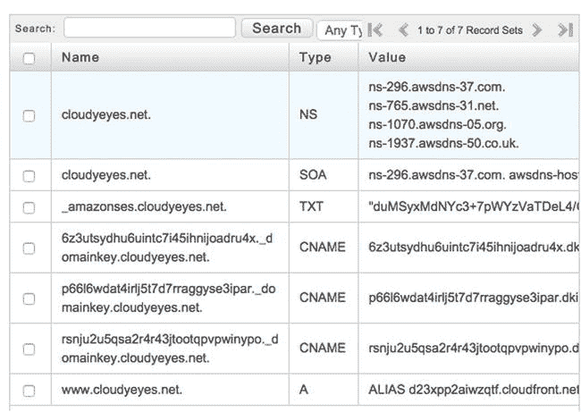

图 6-11。

Route 53 record sets for SES

## 使用 IAM 管理 SES 权限

同时，我们可以完成 AWS 的设置。到目前为止，您可能已经得出结论，我们将使用 AWS SDK 从应用堆栈中的 EC2 实例生成 SES 邮件。上次我们使用 AWS SDK 来控制另一个服务时，我们必须在 IAM 中管理权限，以便允许我们的实例运行命令。我们将再次经历同样的过程。

导航到 IAM 仪表板。从导航中选择角色，您将看到我们创建的 IAM 角色列表。在列表中找到 AWS-ops works-photo albums-ec2-role 并单击它。在权限标题下，您应该看到我们在上一章中创建的策略，该策略授予此角色上传到 S3 存储桶的权限。策略的名称描述了它的效用。我们将为新权限添加一个内联策略，而不是修改现有策略。单击创建角色策略再次开始策略生成过程。选择策略生成器标题后，单击选择。在编辑权限视图中，从 AWS 服务下拉列表中选择 Amazon SES，并从操作下拉列表中选择所有操作(*)(参见图 6-12 )。

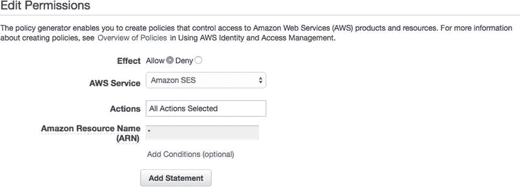

图 6-12。

Amazon SES full permissions policy

单击 Add Statement，然后单击 Next Step，这将显示策略的原始 JSON 以及自动生成的名称。该策略应该类似于清单 6-1 。您可能还想将策略名称字段中的名称更改为类似 amazonsefullcaccess-AWS-ops works-photo albums-ec2-role 的名称。单击右下角的应用策略。

Listing 6-1\. SES Full-Access IAM Policy

`{`

`"Version": "2012-10-17",`

`"Statement": [`

`{`

`"Sid": "Stmt1424445811000",`

`"Effect": "Allow",`

`"Action": [`

`"ses:*"`

`],`

`"Resource": "*"`

`}`

`]`

`}`

当您返回到角色的详细视图时，权限/策略应该如图 6-13 所示。

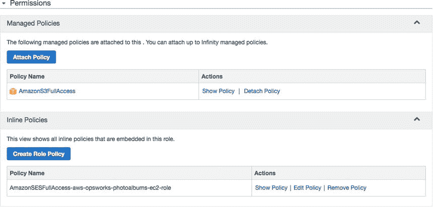

图 6-13。

EC2 Instance role policies

我们还希望能够在本地开发环境中使用 SES 功能。这意味着我们还必须给予 photoalbums-s3 用户相同的权限，我们在本地使用该用户的凭证。从 IAM 导航中选择用户，然后选择相册堆栈用户(或您用于本地开发的任何用户)。在用户详细信息视图中向下滚动，直到看到权限标题。单击链接为此用户创建内联策略。

同样，您将向下滚动策略模板列表，直到找到 Amazon SES 完全访问权限。您将允许该服务的所有权限，单击“添加语句”，然后单击“下一步”。您可以再次查看您选择的策略。策略文档应该就像我们之前在清单 6-1 中看到的一样。

单击应用策略返回到用户详细信息视图。该用户现在应该有两个策略:一个用于 S3 访问的托管策略和一个用于 SES 权限的内联策略(参见图 6-14 )。

图 6-14。

IAM user policies

## 将 SES 与 AWS SDK 一起使用

现在我们已经准备好开始将 SES 集成到我们的应用中了！目前，让我们添加一些非常标准的功能。当新用户注册时，我们会向她发送一封注册确认电子邮件。我们不会强迫她在邮件里激活账号；这将只是一个受欢迎的信息。

在深入讨论之前，我们必须再次确定如何使我们的地址动态化，也就是说，避免将它们硬编码到应用中。毕竟，我们希望我们的代码在开发环境中像在生产环境中一样工作良好。发送注册邮件的电子邮件地址应该类似于`donotreply@yourdomain.com`。总是假设发件人应该是“不知道”可能是一个合理的决定我们还将域存储在 OpsWorks 环境变量中—格式错误。这里我们可以采取一些方法。

Store specific e-mail addresses, such as `contact@yourdomain.com` in OpsWorks Environment Variables, and access them programmatically.   Use the existing `DOMAIN` environment variable and programmatically trim `http://www` off the beginning, to make it usable in constructing e-mail addresses dynamically.   Make a new environment variable for the mail domain and use that.  

所有这三种方法(可能还有一些我没有想到的方法)都非常有效。为了简单起见，我们将使用第二种方法，这将省去我们创建新环境变量的麻烦。但是，此时您应该对使用前面的任何方法在这个上下文中动态构造电子邮件地址的能力充满信心。

### 全球

在代码编辑器中打开`/lib/globals.js`并滚动到末尾。在`absoluteURL()`功能后，粘贴以下内容:

`rootDomain : function(){`

`return this.awsVariables().domain.replace('``http://www`

`}`

这个简单的函数会将 [`http://www.yourdomain.com`](http://www.yourdomain.com) 转换成简单的`yourdomain.com`。我们称之为`rootDomain`，而不仅仅是`mailDomain`，因为我们可能在以后的某个时候需要根域。为了清楚起见，您的`globals`文件现在应该如下面的清单 6-2 所示:

Listing 6-2\. Updated Globals

`module.exports = {`

`applicationPort : 80,`

`database  : function(){`

`if(process.env.ENVIRONMENT){`

`var opsworks = require('./../opsworks');`

`var opsWorksDB = opsworks.db;`

`var rdsConnection = {`

`host  : opsWorksDB.host,`

`port : opsWorksDB.port,`

`database : opsWorksDB.database,`

`user : opsWorksDB.username,`

`password : opsWorksDB.password`

`};`

`return rdsConnection;`

`} else {`

`var local = require('./../config/local');`

`var localConnection = local.db;`

`return localConnection;`

`}`

`},`

`awsVariables : function(){`

`if(process.env.ENVIRONMENT){`

`var variables = {`

`bucket : process.env.S3BUCKET,`

`domain : process.env.DOMAIN`

`}`

`return variables;`

`} else {`

`var local = require('./../config/local');`

`return local.awsVariables;`

`}`

`},`

`absoluteURL : function(path){`

`if(this.awsVariables().domain){`

`return this.awsVariables().domain + '/' + path;`

`}`

`return path;`

`},`

`rootDomain : function(){`

`return this.awsVariables().domain.replace('``http://www`

`}`

`}`

### Mail.js

虽然我们可以将其余大部分代码放在 users route 中，但是用一个单独的类来处理我们所有的 SES 事务可能更有组织意义。毕竟，我们可能希望在应用的其他地方为其他目的生成电子邮件。可以肯定地说，电子邮件通信应该有自己的代理类。

在`/lib`目录下创建一个名为`mail.js`的新文件。当然，如果你愿意，你可以给它起个名字，比如`ses.js`。首先，我们必须包含这个文件的依赖项。我们需要访问我们的`globals.js`，以及 AWS SDK。在文件的顶部，粘贴以下几行:

`var aws = require('aws-sdk');`

`var globals = require('./globals');`

目前，我们仅添加注册电子邮件。但是，我们应该假设将来会添加其他邮件功能来构建这个文件。因此，我们将编写两个函数:一个构造注册电子邮件的内容，另一个发送 SES 邮件。

首先，将`sendEmail()`函数添加到`mail.js`(参见清单 6-3 )。这个函数将简单地发送 SES 邮件和传递给它的参数。它将仍然是一个私人功能。

Listing 6-3\. `sendEmail` Function

`function sendEmail(params, callback){`

`if(globals.awsVariables().key){`

`aws.config.update({ accessKeyId: globals.awsVariables().key, secretAccessKey: globals.awsVariables().secret });`

`}`

`var ses = new aws.SES({region:'us-east-1'});`

`var recipient = params.username + '<' + unescape(params.email) + '>';`

`var sesParams = {`

`Source: params.messageSource,`

`Destination: {`

`ToAddresses: [recipient],`

`BccAddresses: params.bccAddress`

`},`

`Message: {`

`Subject: {`

`Data: params.subject,`

`Charset: 'UTF-8'`

`},`

`Body: {`

`Text: {`

`Data: params.messageText,`

`Charset: 'UTF-8'`

`},`

`Html: {`

`Data: params.messageHTML,`

`Charset: 'UTF-8'`

`}`

`}`

`},`

`ReplyToAddresses: [emailSender()]`

`}`

`ses.sendEmail(sesParams, function(err, data){`

`callback(err, data);`

`});`

`}`

您会注意到一个与我们的 S3 上传功能相似的模式。如果找到 IAM 键，意味着我们在本地环境中，那么调用`aws.config.update()`来使用我们的本地凭证。然后，我们从 SDK 初始化 SES 的一个实例。要使用 SES，您还必须设置区域。在我们的例子中，是`'us-east-1'`。该函数的其余部分是用在`params`对象中发送的值填充 SES 参数。最后，`ses.sendEmail()`发送电子邮件。

接下来，我们将创建`sendRegistrationConfirmation()`函数。该函数将构造传递给`sendEmail`的参数。为了向我们的应用添加其他电子邮件，我们将仅仅复制`sendRegistrationConfirmation`功能。添加清单 6-4 到`mail.js`中的代码。

Listing 6-4\. `sendRegistrationConfirmation` Function

`function sendRegistrationConfirmation(params, callback){`

`var emailParams = {`

`username : params.username,`

`email : params.email`

`};`

`emailParams.messageSource = emailSender();`

`emailParams.bccAddress = [];`

`emailParams.subject = 'Registration Confirmation';`

`emailParams.messageText = 'You have successfully registered for Photoalbums. Your username is ' + emailParams.username + '.';`

`emailParams.messageHTML = 'You have successfully registered for Photoalbums. Your username is <strong>' + emailParams.username + '</strong>.';`

`sendEmail(emailParams, callback);`

`}`

如您所见，我们以纯文本和 HTML 格式生成电子邮件主题和消息。您会注意到`messageSource`被设置为`emailSender()`。因为我们可能会向用户发送多个系统电子邮件，所以可重用函数是最小化代码重复的好方法。`emailSender()`功能也应该添加到`mail.js`中。

`function emailSender(){`

`return 'donotreply@' + globals.rootDomain();`

`}`

在前面的代码中，我们使用源自 OpsWorks 环境变量的根域来构造发件人的电子邮件地址。

最后，我们必须使`sendRegistrationConfirmation()`成为一个公共方法。在文件末尾，添加以下行:

`exports.sendRegistrationConfirmation = sendRegistrationConfirmation;`

### 用户注册途径

接下来，我们将这个新功能集成到我们的应用中。目前，我们只在用户路线中增加了邮件功能。打开`/routes/users.js`。在文件的顶部，将`mail`包含在文件中:

`var mail   = require('./../lib/mail');`

找到您将添加`mail.sendRegistrationConfirmation()`功能的`/register`路线。在我们成功地在数据库中创建用户帐户之前，我们不想发送注册电子邮件。路线应该如下所示(列表 6-5 ):

Listing 6-5\. New User Registration Code

`router.post('/register', function(req, res) {`

`if(req.param('username') && req.param('password') && req.param('email')){`

`var email = unescape(req.param('email'));`

`var emailMatch = email.match(/\S+@\S+\.\S+/);`

`if (emailMatch !== null) {`

`var params = {`

`username: req.param('username').toLowerCase(),`

`password: req.param('password'),`

`email: req.param('email').toLowerCase()`

`};`

`model.createUser(params, function(err, obj){`

`if(err){`

`res.status(400).send({error: 'Unable to register'});`

`} else {`

`mail.sendRegistrationConfirmation({username: req.param('username'), email: req.param('email')}, function(errMail, objMail){`

`if(errMail){`

`res.status(400).send(errMail);`

`} else {`

`res.send(obj);`

`}`

`});`

`}`

`});`

`} else {`

`res.status(400).send({error: 'Invalid email'});`

`}`

`} else {`

`res.status(400).send({error: 'Missing required field'});`

`}`

`});`

Note

在生产环境中，您可能希望在注册过程中检查重复的电子邮件地址。

### 部署和测试

这些就是我们需要的所有代码更改！将您的代码提交到您的存储库中；导航到 OpsWorks 并选择您的应用堆栈。从下拉列表中选择应用。当您在列表中看到您的应用时，单击部署。给应用几分钟的部署时间。

当您的部署完成后，我们可以测试新功能。通过向`http://www.[` `yourdomain` `].com/users/register`发出`POST`请求来注册新用户。确保包括以下参数:`username`、`email`和`password`。使用您喜欢的任何用户名和密码，并确保使用 SES 验证的电子邮件作为电子邮件。发送请求，您应该会看到以下响应:

`{  message: "Registration successful!" }`

这是个好迹象。继续检查你的电子邮件。您应该会看到一条类似图 6-15 的消息。

图 6-15。

E-mail sent by SES

让我们回到 SES，看看我们的指标。在 AWS 菜单中，选择 SES。在仪表板中，您现在应该可以看到您的测试结果，如图 6-16 所示。如您所见，您已经发送了 200 封邮件中的 1 封，并且您的电子邮件有 100%的送达率。

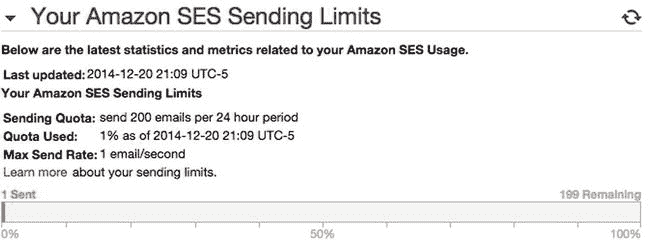 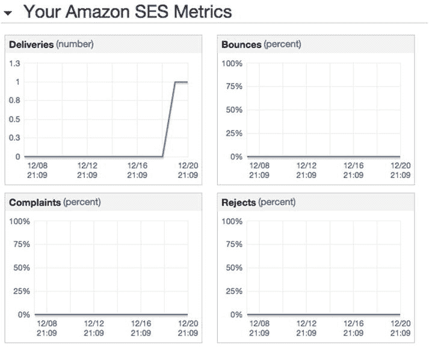

图 6-16。

SES sending limits and metrics

这就是全部了！您已经将 SES 集成到您的应用中，应该能够在本课的基础上进行推断，在其他用例中从您的应用中生成电子邮件。但是在我们结束这一章之前，我们将快速浏览一下 AWS 资源的组织。

## AWS 资源组

到了第六章，你已经在你的应用中使用了一些服务。随着基础架构的增长，可能很难保持跟踪。有几种方法可以组织我们的资源，使它们更容易找到。我们将很快重新访问一些 AWS 服务，用我们的应用名标记它们，并从这些标记创建一个资源组。

正如我在第三章中讨论的，标签没有技术用途；它们的存在纯粹是为了我们自己的方便。虽然它们可以帮助我们组织我们的资源，但它们对分析您的 AWS 账单尤其有用，这个主题超出了本书的范围。

为了便于组织，我们可以给相册资源一组通用的标签。然后，我们将基于这些公共标签创建一个资源组，这将使整合我们系统的移动部分变得更加容易。

### 标记资源

让我们从标记我们的数据库开始。从 AWS 控制台，导航到 RDS。单击左侧导航栏中的 Instances，这将在右侧视图中显示您的实例。在视图底部，单击“标签”按钮。该视图将作为实例的详细页面重新加载。在底部，您会看到标签标题下方的表格，如图 6-17 所示。

图 6-17。

RDS instance tags

当前分配给 RDS 实例的唯一标签是 workload-type: production。让我们添加一个标签来表明这个数据库是 Photoalbums 项目的一部分。单击添加/编辑标签。在标签数据库实例视图中(见图 6-18 ，点击添加另一个标签。输入 project 作为关键字，photoalbums 作为值。单击保存标签。

图 6-18。

Adding tags to the database

这个很简单。不幸的是，默认情况下，我们不能像我们希望的那样在应用堆栈中标记实例(但是我们可以使用 Chef 脚本)。现在，让我们手动标记 EC2 实例。前往 EC2 仪表板。点击左侧导航栏中的标签，将显示 EC2 标签列表(参见图 6-19 )。您会注意到有些标签是为您的实例自动生成的。

图 6-19。

EC2 tags

单击页面顶部的管理标签。现在您将看到一个视图，您可以在其中多选实例并添加新标签。选择实例并将 project: photoalbums 标签添加到实例中，然后单击“添加标签”。您的实例现在已被标记。

记住:您的负载平衡器也在这里！从左侧菜单中选择负载平衡器。选择您的负载平衡器，然后单击标记选项卡。如图 6-20 所示，它已经有了一些标签(我们在第三章中创建的)！如果同样的标签被自动应用到我们在 OpsWorks 中创建的所有资源上，那不是很好吗？我们可以梦想…

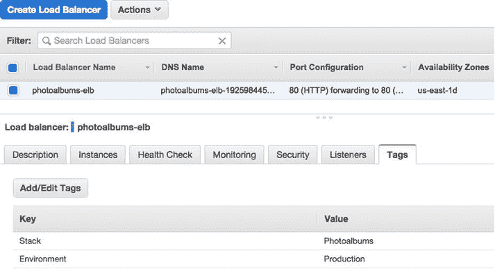

图 6-20。

ELB tags

不幸的是，我们必须添加自己的标签。单击 Add/Edit Tags，当模式出现时，通过单击 Create Tag，输入标记，然后单击 Save，添加与前面相同的标记键/值对。

这真是一次回忆之旅。我们还可以标记哪些资源？S3 水桶应该是目前为止最后一个了。前往 S3；选择您的存储桶；在右侧视图中，展开 Tags 部分。添加您的标签，如图 6-21 所示，点击保存。

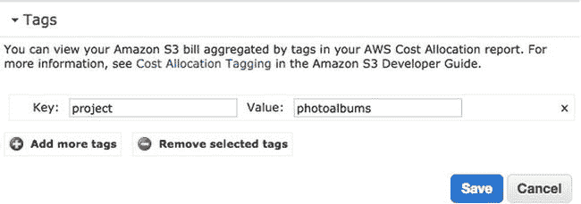

图 6-21。

S3 tags

### 创建和查看资源组

接下来，让我们用新的标记创建一个资源组。您会注意到导航栏中有一个名为 AWS 的菜单，我们从未使用过。展开菜单，如图 6-22 所示，点击创建资源组。

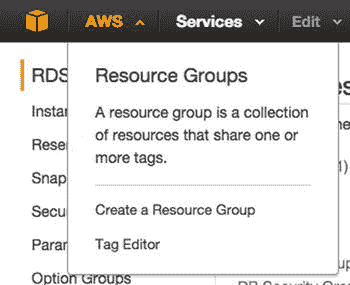

图 6-22。

AWS menu

在 Create a resource group 视图中，我们可以配置资源组。在这个视图中，我们将通过标签过滤我们的资源。首先，将资源组命名为 Photoalbums Resources。首先，我们将向资源组添加两个标记。在“标签”下拉列表中，选择“项目”，然后在附带的文本字段中，选择“相册”。

在“区域”字段中，您可以选择该组中包含哪些地理区域。我们所有的资源都在美国东部，所以你只能选择美国东部。将资源类型字段留空以包含所有资源类型(参见图 6-23 )。完成后，单击保存。

图 6-23。

Editing a resource group

现在我们有了一种快速获取资源的新方法。资源组视图可随时从 AWS 的主导航中访问，它将您快速链接到项目中的所有资源(参见图 6-24 )。

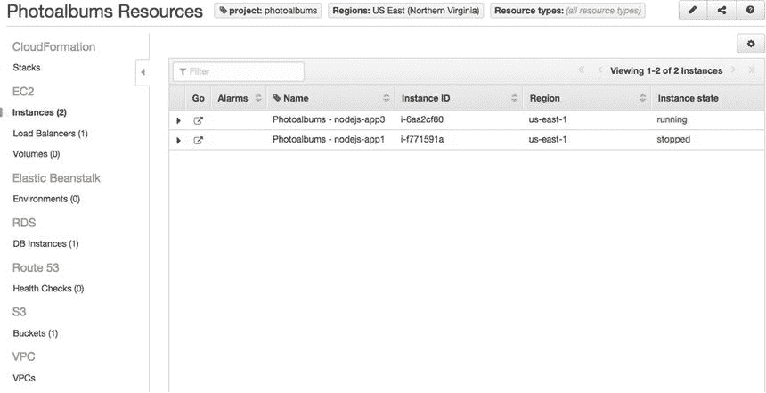

图 6-24。

Viewing the Resource Group

事实上，你可能永远也不会用到它。我们已经养成了快速从一项服务切换到另一项服务的习惯，这是有好处的。但是现在你知道你可以标记资源，事实上，AWS 会自动为你标记一些资源。您可以使用这些标签来查看您连接的资源的详细信息，也可以使用这些标签来管理您的账单。

如果您想要维护多个应用环境/应用堆栈，您可以为 photoalbums dev 添加另一个标记值，并且您可以创建一个所有堆栈共有的标记，从而有效地创建跨所有 AWS 服务的不同资源视图。

## 摘要

我们的应用现在可以给我们的用户发送电子邮件了！这是一个快速的教训，它应该打开许多大门。我们还走了一条捷径来组织我们越来越多的 AWS 资源，当您在 AWS 中构建一个复杂的系统时，这非常有用。在下一章中，我们将最终扩展我们的应用并响应需求，就像我们最初计划的那样。

Footnotes 1

更多关于 DKIM 的精彩世界，请访问官方网站 [`www.dkim.org`](http://www.dkim.org/) 。