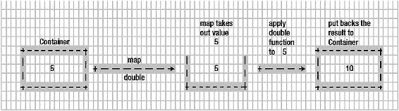

# 八、使用仿函数获取乐趣

在前一章中，我们讨论了许多函数式编程技术。在本章中，我们将看到编程中的另一个重要概念，叫做*错误处理*。错误处理是一种常见的编程技术，用于处理应用程序中的错误。不过，错误处理的函数式编程方法会有所不同，这正是我们在本章将要看到的。

我们将会看到一个叫做*函子*的新概念。这个新朋友将帮助我们以一种纯粹功能性的方式处理错误。一旦我们掌握了函子的概念，我们将实现两个真实世界的函子:也许和任何一个。我们开始吧。

### 注意

章节示例和库源代码在第八章分支。回购的网址是[`github.com/antsmartian/functional-es8.git`](https://github.com/antsmartian/functional-es8.git)。

一旦你检查出代码，请检查分支第八章:

...

git checkout -b 第八章来源/第八章

...

对于运行代码，与之前一样，运行:

...

npm 跑步游乐场

...

## 什么是函子？

In this section we are going to see what a functor really is. Here is its definition:

*   仿函数是一个普通的对象(或者其他语言中的类型类),它实现了函数映射，当运行对象中的每个值时，生成一个新的对象。

乍一看，理解这个定义并不容易。我们将一步一步地分解它，以便我们清楚地理解它，并(通过编写代码)看到函子是什么。

### 仿函数是一个容器

Simply put, a functor is a container that holds the value in it. We have seen this in the definition stating that functor is a plain object. Let’s create a simple container that can hold any value we pass into it, and call it a Container (see Listing 8-1).const Container = function(val) {         this.value = val; } Listing 8-1

容器定义

### 注意

您可能想知道为什么我们不使用箭头语法来编写容器函数:

常量容器= (val) => {

this.value = val

}

这段代码没有问题，但是当我们试图在容器上应用新的关键字时，我们会得到一个类似这样的错误:

容器不是构造函数(...)(匿名函数)

这是为什么呢？嗯，从技术上讲，要创建一个新对象，函数应该有内部方法[[Construct]]和属性 prototype。可悲的是，箭头函数不具备这两者！所以这里我们回到了我们的老朋友函数，它有一个内部方法[[Construct]]，它也可以访问 prototype 属性。

Now with Container in place, we can create a new object out of it, as shown in Listing 8-2.let testValue = new Container(3) => Container(value:3) let testObj = new Container({a:1}) => Container(value:{a:1}) let testArray = new Container([1,2]) => Container(value:[1,2]) Listing 8-2

玩容器

Container is just holding the value inside it. We can pass any data type in JavaScript to it and Container will hold it. Before we move on, we can create a util method called of in the Container prototype, which will save us in writing the new keyword to create a new Container. The code looks like Listing 8-3.Container.of = function(value) {   return new Container(value); } Listing 8-3

方法定义的

With this of method in place, we can rewrite the code in Listing 8-2 as shown in Listing 8-4.testValue = Container.of(3) => Container(value:3) testObj = Container.of({a:1}) => Container(value:{a:1}) testArray = new Container([1,2]) => Container(value:[1,2]) Listing 8-4

正在创建包含的容器

It is worth noting that Container can contain nested Containers, too.Container.of(Container.of(3)); is going to print:Container {         value: Container {                 value: 3         } }

既然我们已经定义了函子只不过是一个可以容纳值的容器，那么让我们再来看看函子的定义。

Functor 是一个普通的对象(或其他语言中的类型类),它在运行对象中的每个值以产生新对象时实现函数映射。

看起来 functor 需要实现一个名为 map 的方法。让我们在下一节实现这个方法。

### 实施地图

在我们实现 map 函数之前，让我们在这里暂停一下，想一想为什么我们首先需要 map 函数。请记住，我们创建的容器只保存我们传递给它的值。但是，保存这个值几乎没有任何用处，这就是 map 函数发挥作用的地方。map 函数允许我们对容器当前保存的值调用任何函数。

The map function takes the value out of the Container , applies the passed function on that value, and again puts the result back in the Container. Let’s visualize using the image shown in Figure 8-1. Figure 8-1

容器和映射函数的机制

Figure 8-1 shows the way the map function is going to work with our Container object. It takes the value in the Container—in this case the value is 5—and passes on that value to the passed function double (this function just doubles the given number). The result is put back again into the Container. With that understanding in place, we can implement the map function, as shown in Listing 8-5.Container.prototype.map = function(fn){   return Container.of(fn(this.value)); } Listing 8-5

地图功能定义

As shown earlier, the preceding map function simply does what we have discussed in Figure 8-1. It’s simple and elegant. Now to make the point concrete, let’s put our image piece into code action:let double = (x) => x + x; Container.of(3).map(double) => Container { value: 6 } Note that the map returns the result of the passed function again in the container, which allows us to chain the operation:Container.of(3).map(double)                            .map(double)                            .map(double) => Container {value: 24} Now implementing Container with our map function, we can make complete sense of the functor definition:

*   Functor 是一个普通的对象(或其他语言中的类型类),它实现了函数映射，当运行对象中的每个值时，会产生一个新的对象。

Or in other words:

*   仿函数是一个实现映射契约的对象。

既然我们已经定义了它，你可能想知道函子对什么有用。我们将在下一节回答这个问题。

### 注意

函子是一个寻找契约的*概念*。我们看到的契约很简单，实现 map。我们实现 map 函数的方式提供了不同类型的函子，比如 MayBe 和 any，我们将在本章后面讨论。

## 可能

我们以如何使用函数式编程技术处理错误和异常的争论开始了这一章。在前一节中，我们学习了函子的基本概念。在这一节，我们将看到一个叫做 MayBe 的*型*函子。MayBe 函子允许我们以更函数化的方式处理代码中的错误。

### 实施也许

MayBe is a type of functor, which means it’s going to implement a map function but in a different way. Let’s start with a simple MayBe in Listing 8-6, which can hold the data (very similar to a Container implementation):const MayBe = function(val) {   this.value = val; } MayBe.of = function(val) {   return new MayBe(val); } Listing 8-6

也许函数定义

We just created MayBe, which resembles the Container implementation. As stated earlier, we have to implement a map contract for the MayBe, which looks like Listing 8-7.MayBe.prototype.isNothing = function() {   return (this.value === null || this.value === undefined); }; MayBe.prototype.map = function(fn) {   return this.isNothing() ? MayBe.of(null) : MayBe.of(fn(this.value)); }; Listing 8-7

也许是地图功能定义

The map function does very similar things to the Container (simple functor) map function. MayBe’s map first checks whether the value in the container is null or undefined before applying the passed function using the isNothing function , which takes care of null and undefined checks:(this.value === null || this.value === undefined); Note that map puts the result of applying the function back in the container:return this.isNothing() ? Maybe.of(null) : Maybe.of(f(this.__value));

现在是时候看看实际情况了。

### 简单的用例

As we discussed in the previous section, MayBe checks the null, undefined before applying the passed function in map. This is a very powerful abstraction that takes care of error handling. To make this concrete, a simple example is provided in Listing 8-8.MayBe.of("string").map((x) => x.toUpperCase()) Listing 8-8

创造我们的第一个也许

which returnsMayBe { value: 'STRING' } The most important and interesting point to note here is this:(x) => x.toUpperCase() doesn’t care if x is null or undefined or that it has been abstracted by the MayBe functor. What if the value of the string is null? Then the code looks like this:MayBe.of(null).map((x) => x.toUpperCase()) We will be getting back this:MayBe { value: null }

现在我们的代码不会出现空值或未定义的值，因为我们可能已经将我们的值包装在了*类型安全*容器中。我们现在以声明的方式处理空值。

### 注意

在 MayBe.of(null)情况下，如果我们调用 map 函数，从我们的实现中我们知道 map 首先通过调用 isNothing 来检查值是否为 null 或未定义:

//映射的实现

maybe . prototype . map = function(fn){

return **this.isNothing()** ？maybe . of(null):maybe . of(fn(this . value))；

};

如果 isNothing 返回 true。我们返回 MayBe.of(null)而不是调用传递的函数。

In a normal imperative way, we would have done this:let value = "string" if(value != null || value != undefined)         return value.toUpperCase(); The preceding code does exactly the same thing, but look at the steps required to check if the value is null or undefined, even for a single call. Also using MayBe, we don’t care about those sneaky variables to hold the resulting value. Remember that we can chain our map function as desired, as shown in Listing 8-9.MayBe.of("George")      .map((x) => x.toUpperCase())      .map((x) => "Mr. " + x) Listing 8-9

与地图链接

gives back:MayBe { value: 'Mr. GEORGE' } Before we close this section, we need to talk about two more important properties of MayBe. The first one is that even if your passed function to map returns null/undefined , MayBe can take care of it. In other words, in the whole chain of map calls, it is fine if a function returns null or undefined. To illustrate the point, let’s tweak the last example:MayBe.of("George")      .map(() => undefined)      .map((x) => "Mr. " + x) Note that our second map function returns undefined ; however, running the preceding code will give this result:MayBe { value: null }

不出所料。

The second important point is that all map functions will be called regardless if they receive null/undefined. We’ll pull out the same code snippet (Listing 8-9) that we used in the previous example:MayBe.of("George")      .map(() => undefined)      .map((x) => "Mr. " + x) The point here is that even though the first map does return undefined:map(() => undefined)

第二个映射将被称为 *always* (即链接到任何级别的映射将被称为 always)；只是链中的下一个映射函数返回 undefined(就像前一个映射返回 undefined/null 一样)，而没有应用传递的函数。重复这个过程，直到链中的最后一个 map 函数调用被求值。

### 真实世界的用例

Because MayBe is a type of container that can hold any values, it can also hold values of type Array. Imagine you have written an API to get the top 10 SubReddit data based on types like top, new, and hot (see Listing 8-10).let getTopTenSubRedditPosts = (type) => {     let response     try{        response = JSON.parse(request('GET',"https://www.reddit.com/r/subreddits/" + type + ".json?limit=10").getBody('utf8'))     }catch(err) {         response = { message: "Something went wrong" , errorCode: err['statusCode'] }     }     return response } Listing 8-10

获取前 10 个子编辑帖子

### 注意

请求来自包同步请求。这将允许我们以同步的方式发出请求并获得响应。这只是为了说明；我们不建议在生产中使用同步调用。

The getTopTenSubRedditPosts function just hits the URL and gets the response. If there are any issues in hitting the Reddit API, it sends back a custom response of this format:. . . response = { message: "Something went wrong" , errorCode: err['statusCode'] } . . . If we call our API like this:getTopTenSubRedditPosts('new') we will be getting back the response in this format:{"kind": "Listing", "data": {"modhash": "", "children": [], "after": null, "before": null}} where the children property will have an array of JSON objects. It will look something like this:"{   "kind": "Listing",   "data": {     "modhash": "",     "children": [       {         "kind": "t3",         "data": {           . . .           "url": "https://twitter.com/malyw/status/780453672153124864",           "title": "ES7 async/await landed in Chrome",           . . .         }       }     ],     "after": "t3_54lnrd",     "before": null   } }"

从响应中，我们需要返回包含 URL 和标题的 JSON 对象数组。请记住，如果我们将一个无效的 subreddit 类型(比如 test)传递给 getTopTenSubRedditPosts，它将返回一个没有数据或子属性的错误响应。

With MayBe in place, we can go ahead and implement the logic as shown in Listing 8-11.//arrayUtils from our library import {arrayUtils} from '../lib/es8-functional.js' let getTopTenSubRedditData = (type) => {     let response = getTopTenSubRedditPosts(type);     return MayBe.of(response).map((arr) => arr['data'])                              .map((arr) => arr['children'])                              .map((arr) => arrayUtils.map(arr,                                 (x) => {                                     return {                                         title : x['data'].title,                                         url   : x['data'].url                                     }                                 }                             )) } Listing 8-11

使用 MayBe 获取前 10 个子编辑帖子

Let’s break down how getTopTenSubRedditData works. First we are wrapping the result of the Reddit API call within the MayBe context using MayBe.of(response). Then we are running a series of functions using MayBe’s map :. . . .map((arr) => arr['data']) .map((arr) => arr['children']) . . . This will return the children array object from the response structure:{"kind": "Listing", "data": {"modhash": "", "children": [ . . . .], "after": null, "before": null}} In the last map, we are using our own ArrayUtils’s map to iterate over the children property and return only the title and URL as needed:. . . .map((arr) =>         arrayUtils.map(arr,     (x) => {         return {             title : x['data'].title,             url   : x['data'].url         }     } . . . Now if we call our function with a valid Reddit name like new :getTopTenSubRedditData('new') we get back this response:MayBe {   value:    [ { title: '/r/UpliftingKhabre - The subreddit for uplifting and positive stories from India!',        url: 'https://www.reddit.com/r/ },      { title: '/R/JerkOffToCelebs - The Best Place To Off To Your Fave Celebs',        url: 'https://www.reddit.com/r/ },      { title: 'Angel Vivaldi channel',        url: 'https://qa1web-portal.immerss.com/angel-vivaldi/angel-vivaldi' },      { title: 'r/test12 - Come check us out for INSANE',        url: 'https://www.reddit.com/r/' },      { title: 'r/Just - Come check us out for GREAT',        url: 'https://www.reddit.com/r/just/' },      { title: 'r/Just - Come check us out for GREAT',        url: 'https://www.reddit.com/r/just/' },      { title: 'How to Get Verified Facebook',        url: 'http://imgur.com/VffRnGb' },      { title: '/r/TrollyChromosomes - A support group for those of us whose trollies or streetcars suffer from chronic genetic disorders',        url: 'https://www.reddit.com/r/trollychromosomes' },      { title: 'Yemek Tarifleri Eskimeyen Tadlarımız',        url: 'http://otantiktad.com/' },      { title: '/r/gettoknowyou is the ultimate socializing subreddit!',        url: 'https://www.reddit.com/r/subreddits/comments/50wcju/rgettoknowyou_is_the_ultimate_socializing/' } ] }

### 注意

读者的反应可能不一样，因为反应会随时改变。

The beauty of the getTopTenSubRedditData method is how it handles unexpected input that can cause null/undefined errors in our logic flow. What if someone calls your getTopTenSubRedditData with a wrong Reddit type? Remember that it will return the JSON response from Reddit:{ message: "Something went wrong" , errorCode: 404 } That is, the data—children property—will be empty. Try this by passing the wrong Reddit type and see how it responds:getTopTenSubRedditData('new') which returns:MayBe { value: null }

没有抛出任何错误。尽管我们的 map 函数试图从响应中获取数据(在本例中不存在)，但它返回 MayBe.of(null)，因此相应的 map 不会应用传递的函数，正如我们前面讨论的那样。

我们可以清楚地感觉到 may 是如何轻松处理所有未定义/空错误的。我们的 getTopTenSubRedditData 看起来非常具有声明性。

这就是可能函子的全部内容。我们将在下一节中遇到另一个函子，叫做“要么”。

## 任一函子

In this section we are going to create a new functor called Either, which will allow us to solve the branching-out problem. To provide a context, let’s revisit an example from the previous section (Listing 8-9):MayBe.of("George")      .map(() => undefined)      .map((x) => "Mr. " + x) This code will return the resultMayBe {value: null}

正如我们所料。然而，问题是哪个分支(即，来自两个较早的 map 调用)因未定义或空值而失败。我们不能简单地用也许来回答这个问题。唯一的办法就是手动挖掘 MayBe 的分支，发现罪魁祸首。这并不意味着 MayBe 有缺陷，只是在某些用例中，我们需要一个比 MayBe 更好的函子(通常是在有许多嵌套映射的情况下)。这就是这两种情况出现的原因。

### 实施任一

We have seen the problem Either is going to solve for us; now let’s see its implementation (Listing 8-12).const Nothing = function(val) {   this.value = val; }; Nothing.of = function(val) {   return new Nothing(val); }; Nothing.prototype.map = function(f) {   return this; }; const Some = function(val) {   this.value = val; }; Some.of = function(val) {   return new Some(val); }; Some.prototype.map = function(fn) {   return Some.of(fn(this.value)); } Listing 8-12

任一仿函数部分定义

The implementation has two functions, Some and Nothing. You can see that Some is just a copy of a Container with a name change. The interesting part is with Nothing. Nothing is also a Container, but its map doesn’t run over a given function but rather just returns this:Nothing.prototype.map = function(f) {   return this; }; In other words, you can run your functions on Some but not on Nothing (not a technical statement, right?). Here’s a quick example:Some.of("test").map((x) => x.toUpperCase()) => Some {value: "TEST"} Nothing.of("test").map((x) => x.toUpperCase()) => Nothing {value: "test"} As shown in the preceding code snippet, calling map on Some runs over the passed function. However, in Nothing, it just returns the same value, test. We wrap these two objects into the Either object as shown in Listing 8-13.const Either = {   Some : Some,   Nothing: Nothing } Listing 8-13

任一定义

你可能想知道有些或没有的用处是什么。为了理解这一点，让我们重温一下我们的 Reddit 示例版本 MayBe。

### 任一版本的 Reddit 示例

The MayBe version of the Reddit example looks like this (Listing 8-11):let getTopTenSubRedditData = (type) => {     let response = getTopTenSubRedditPosts(type);     return MayBe.of(response).map((arr) => arr['data'])                              .map((arr) => arr['children'])                              .map((arr) => arrayUtils.map(arr,                                 (x) => {                                     return {                                         title : x['data'].title,                                         url   : x['data'].url                                     }                                 }                             )) } On passing a wrong Reddit type, say, for example, unknown:getTopTenSubRedditData('unknown') => MayBe {value : null} we get back MayBe of null value, but we didn’t know why null was returned. We know that getTopTenSubRedditData uses getTopTenSubRedditPosts to get the response. Now that Either is in place, we can create a new version of getTopTenSubRedditPosts using Either, as shown in Listing 8-14.let getTopTenSubRedditPostsEither = (type) => {     let response     try{        response = Some.of(JSON.parse(request('GET',"https://www.reddit.com/r/subreddits/" + type + ".json?limit=10").getBody('utf8')))     }catch(err) {        response = Nothing.of({ message: "Something went wrong" , errorCode: err['statusCode'] })     }     return response } Listing 8-14

使用以下任一方法获取前十个子编辑

Note that we have wrapped the proper response with Some and the error response with Nothing. Now with that in place, we can modify our Reddit API to the code shown in Listing 8-15.let getTopTenSubRedditDataEither = (type) => {     let response = getTopTenSubRedditPostsEither(type);     return response.map((arr) => arr['data'])                              .map((arr) => arr['children'])                              .map((arr) => arrayUtils.map(arr,                                 (x) => {                                     return {                                         title : x['data'].title,                                         url   : x['data'].url                                     }                                 }                             )) } Listing 8-15

使用以下任一方法获取前十个子编辑

这段代码只是字面上的可能版本，但它只是没有使用可能；相反，它使用任何一种类型。

Now let’s call our new API with the wrong Reddit data type:getTopTenSubRedditDataEither('new2') This will returnNothing { value: { message: 'Something went wrong', errorCode: 404 } }

这太棒了。现在，有了这两种类型，我们就可以得到分支失败的确切原因了。可以猜到，getTopTenSubRedditPostsEither 在出现错误的情况下(即未知的 Reddit 类型)不返回任何内容；因此 getTopTenSubRedditDataEither 上的映射也不会发生，因为它的类型是 Nothing。您可以感觉到，在保留错误消息和阻止函数映射方面，什么都没有帮到我们。

On a closing note, we can try our new version with a valid Reddit type:getTopTenSubRedditDataEither('new') It will return the expected response in Some:Some {   value:    [ { title: '/r/UpliftingKhabre - The subreddit for uplifting and positive stories from India!',        url: 'https://www.reddit.com/r/ },      { title: '/R/ - The Best Place To Off To Your Fave,        url: 'https://www.reddit.com/r/ },      { title: 'Angel Vivaldi channel',        url: 'https://qa1web-portal.immerss.com/angel-vivaldi/angel-vivaldi' },      { title: 'r/test12 - Come check us out for INSANE',        url: 'https://www.reddit.com/r/ /' },      { title: 'r/Just - Come check us out for',        url: 'https://www.reddit.com/r/just/' },      { title: 'r/Just - Come check us out for',        url: 'https://www.reddit.com/r/' },      { title: 'How to Get Verified Facebook',        url: 'http://imgur.com/VffRnGb' },      { title: '/r/TrollyChromosomes - A support group for those of us whose trollies or streetcars suffer from chronic genetic disorders',        url: 'https://www.reddit.com/r/trollychromosomes' },      { title: 'Yemek Tarifleri Eskimeyen Tadlarımız',        url: 'http://otantiktad.com/' },      { title: '/r/gettoknowyou is the ultimate socializing subreddit!',        url: 'https://www.reddit.com/r/subreddits/comments/50wcju/rgettoknowyou_is_the_ultimate_socializing/' } ] }

两者都差不多。

### 注意

如果你来自 Java 背景，你可以感觉到这两者都非常类似于 Java 8 中的 Optional。实际上，Optional 是一个函子。

## 警告:尖函子

在我们结束这一章之前，我们需要明确一点。在这一章的开始，我们开始说我们创建了 of 方法，只是为了在创建容器的地方转义新的关键字。我们做了同样的事情。回想一下，functor 只是一个具有映射契约的接口。*指向函子*是函子的子集，它有一个接口，该接口有一个 of contract。

到目前为止，我们所设计的叫做点函子。这只是为了使书中的术语正确，但你要看到函子或尖函子在现实世界中为我们解决了什么问题，哪个更重要。

## 摘要

我们在本章开始时问了一些关于我们将如何在函数式编程世界中处理异常的问题。我们从创建一个简单的函子开始。我们将函子定义为一个实现了映射函数的容器。然后我们实现了一个叫做 MayBe 的函子。我们看到了 MayBe 如何帮助我们避免讨厌的空/未定义检查。也许允许我们以函数和声明的方式编写代码。然后，我们看到这两者是如何帮助我们在分支时保留错误消息的。两者都只是“有”和“无”的超类型。现在我们已经看到了函子的作用。