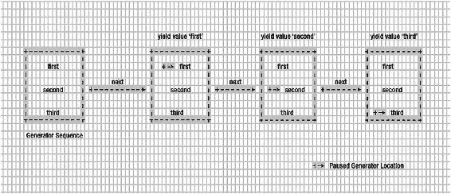
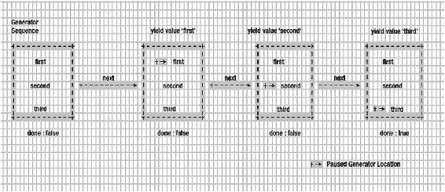
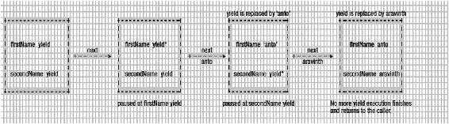
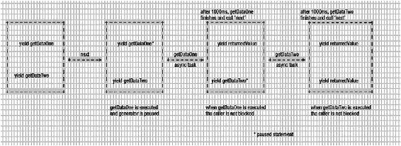
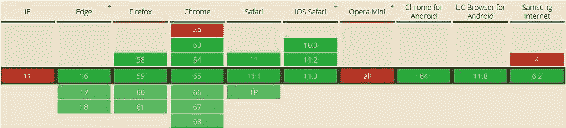
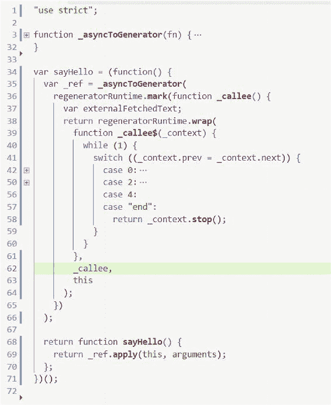

© Anto Aravinth, Srikanth Machiraju 2018 Anto Aravinth and Srikanth MachirajuBeginning Functional JavaScript[https://doi.org/10.1007/978-1-4842-4087-8_10](https://doi.org/10.1007/978-1-4842-4087-8_10)

# 10.暂停、恢复和与发生器异步

Anto Aravinth[1](#Aff3)  and Srikanth Machiraju[2](#Aff4) (1)Chennai, Tamil Nadu, India (2)Hyderabad, Andhra Pradesh, India  

我们从函数的简单定义开始阅读这本书，然后我们看到了如何使用函数通过函数式编程技术来做大事。我们已经看到了如何用纯函数的术语来处理数组、对象和错误处理。对我们来说，这是一个相当长的旅程，但是我们仍然没有谈到每个 JavaScript 开发人员都应该知道的另一个重要技术:异步代码。

您已经在项目中处理了大量的异步代码。您可能想知道函数式编程是否能帮助开发人员编写异步代码。答案是肯定的，也是否定的。我们最初要展示的技术是使用 ES6 生成器，然后使用 Async/Await，这是 ECMAScript 2017/ES8 规范的新内容。这两种模式都试图用自己的方式解决同一个回调问题，所以要密切注意细微的差别。发电机是 ES6 中函数的新规格。生成器并不是真正的函数式编程技术；然而，它们是函数的一部分(函数式编程是关于函数的，对吧？);出于这个原因，我们在这本函数式编程书中专门为它写了一章。

即使你是承诺的忠实粉丝(这是一种解决回调问题的技术)，我们仍然建议你看一下这一章。您可能会喜欢生成器以及它们解决异步代码问题的方式。

### 注意

章节示例和库源代码在第 10 章分支中。回购的网址是[https://github.com/antsmartian/functional-es8.git](https://github.com/antsmartian/functional-es8.git)。

一旦你检查出代码，请检查分支第 10 章:

git checkout -b 第 10 章来源/第 10 章

对于运行代码，与之前一样，运行:

...npm 跑步游乐场...

## 异步代码及其问题

在我们真正了解什么是生成器之前，让我们在本节中讨论一下在 JavaScript 中处理异步代码的问题。我们要讨论一个回调地狱问题。大多数异步代码模式，如 Generators 或 Async/Await，都试图以自己的方式解决回调问题。如果您已经知道它是什么，请随意进入下一部分。对于其他人，请继续阅读。

### 回调地狱

Imagine you have a function like the one shown in Listing [10-1](#PC1).let sync = () => {         //some operation         //return data } let sync2 = () => {         //some operation         //return data } let sync3 = () => {         //some operation         //return data } Listing 10-1

同步功能

The functions sync, sync1, and sync2 do some operations synchronously and return the results. As a result, one can call these functions like this:result = sync() result2 = sync2() result3 = sync3() What if the operation is asynchronous? Let’s see it in action in Listing [10-2](#PC3).let async = (fn) => {         //some async operation         //call the callback with async operation         fn(/*  result data */) } let async2 = (fn) => {         //some async operation         //call the callback with async operation         fn(/*  result data */) } let async3 = (fn) => {         //some async operation         //call the callback with async operation         fn(/*  result data */) } Listing 10-2

异步函数

### 同步与异步

同步是指函数在执行时阻塞调用者，并在结果可用时返回结果。

异步是指函数在执行时不阻塞调用者，而是返回可用的结果。

当我们在项目中处理 AJAX 请求时，我们会大量处理异步。

Now if someone wants to process these functions at once, how they do it? The only way to do it is shown in Listing [10-3](#PC4).async(function(x){     async2(function(y){         async3(function(z){             ...         });     }); }); Listing 10-3

异步函数调用示例

哎呀！你可以在清单 [10-3](#PC4) 中看到，我们将许多回调函数传递给我们的异步函数。这段代码展示了什么是回调地狱。回调地狱让程序更难理解。处理错误和从回调中冒泡错误是很棘手的，并且总是容易出错。

在 ES6 到来之前，JavaScript 开发者用承诺来解决这个问题。承诺是伟大的，但鉴于 ES6 在语言层面引入了生成器，我们不再需要承诺了！

## 发电机 101

如前所述，生成器是 ES6 规范的一部分，它们在语言级别被捆绑在一起。我们讨论了使用生成器来帮助处理异步代码。不过，在这之前，我们要谈谈发电机的基本原理。本节重点解释生成器背后的核心概念。一旦我们学习了基础知识，我们就可以使用生成器创建一个通用函数来处理我们库中的异步代码。我们开始吧。

### 创建生成器

Let’s start our journey by seeing how to create generators in the first place. Generators are nothing but a function that comes up with its own syntax. A simple generator looks like Listing [10-4](#PC5).function* gen() {     return 'first generator'; } Listing 10-4

第一个简单生成器

The function gen in Listing [10-4](#PC5) is a generator. As you might notice, we have used an asterisk before our function name (in this case gen) to denote that it is a generator function. We have seen how to create a generator; now let’s see how to invoke a generator:let generatorResult = gen() What will be the result of generatorResult ? Is it going to be a first generator value? Let’s print it on the console and inspect it:console.log(generatorResult) The result will be:gen {[[GeneratorStatus]]: "suspended", [[GeneratorReceiver]]: Window}

### 发电机的警告

前面的示例显示了如何创建生成器，如何为它创建实例，以及它如何获取值。然而，当我们使用发电机时，有一些重要的事情需要注意。

The first thing is that we cannot call next as many times as we want to get the value from the generator. To make it clearer, let’s try to fetch a value from our first generator (refer to Listing [10-4](#PC5) for the first generator definition):let generatorResult = gen() //for the first time generatorResult.next().value => 'first generator' //for the second time generatorResult.next().value => undefined

正如您在这段代码中看到的，第二次调用 next 将返回一个未定义的而不是第一个生成器。原因是生成器就像序列:一旦序列的值被消耗，你就不能再消耗它。在我们的例子中，generatorResult 是一个作为第一个生成器有值的序列。通过对 next 的第一次调用，我们(作为生成器的调用方)消耗了序列中的值。因为序列现在是空的，所以第二次调用它将返回未定义的结果。

To consume the sequence again, you need to create another generator instance:let generatorResult = gen() let generatorResult2 = gen() //first sequence generatorResult.next().value => 'first generator' //second sequence generatorResult2.next().value => 'first generator'

这段代码还显示了生成器的不同实例可以处于不同的状态。这里的要点是，每个生成器的状态取决于我们如何调用它的下一个函数。

### yield 关键字

With generator functions, there is a new keyword that we can use called yield. In this section, we are going to see how to use yield within a generator function. Let’s start with the code in Listing [10-5](#PC11).function* generatorSequence() {     yield 'first';     yield 'second';     yield 'third'; } Listing 10-5

简单生成器序列

As usual we can create a generator instance for that code:let generatorSequence = generatorSequence(); Now if we call next for the first time we get back the value first:generatorSequence.next().value => first What happens if we call next again? Do we get first? Or second? Or third? Or an error? Let’s find out:generatorSequence.next().value => second We got back the value second. Why? yield makes the generator function pause the execution and send back the result to the caller. Therefore when we call generatorSequence for the first time, the function sees the yield with value first, so it puts the function to pause mode and returns the value (and it remembers where it exactly paused, too). The next time we call the generatorSequence (using the same instance variable), the generator function resumes from where it left off. Because it paused at the line:yield 'first';

第一次，当我们第二次调用它(使用同一个实例变量)时，我们得到值 second。当我们第三次调用它时会发生什么？是的，我们将得到第三个值。

This is better explained by looking at Figure [10-1](#Fig1). This sequence is explained via the code in Listing [10-6](#PC16).//get generator instance variable let generatorSequenceResult = generatorSequence(); console.log('First time sequence value',generatorSequenceResult.next().value) console.log('Second time sequence value',generatorSequenceResult.next().value) console.log('third time sequence value',generatorSequenceResult.next().value) Listing 10-6

调用我们的生成器序列

 Figure 10-1

清单 [10-4](#PC5) 中所列发电机的视觉视图

This prints the following back to the console:First time sequence value first Second time sequence value second third time sequence value third

有了这样的理解，你就能明白为什么我们称一个生成器为一系列值了。需要记住的更重要的一点是，所有具有 yield 的生成器都将按照惰性求值顺序执行。

### 懒惰评估

什么是懒评？简单地说，懒惰评估意味着代码在我们请求它运行之前不会运行。正如您所猜测的，generatorSequence 函数的例子显示了生成器是惰性的。这些值只有在我们需要时才被执行和返回。对发电机太懒惰了，不是吗？

### 生成器的完成属性

现在我们已经看到了生成器如何使用 yield 关键字生成一系列值。一个生成器也可以产生 *n* 个数列；作为生成器函数的用户，您将如何知道下一次何时停止调用？因为对已经使用的生成器序列调用 next 将返回未定义的值。你如何处理这种情况？这就是 done 属性进入画面的地方。

Remember that every call to the next function is going to return an object that looks like this:{value: 'value', done: false}

我们知道这个值是来自我们的生成器的值，但是 done 呢？done 是一个属性，它将告诉我们生成器序列是否已被完全使用。

We rerun the code from previous sections here (Listing [10-4](#PC5)), just to print the object being returned from the next call.//get generator instance variable let generatorSequenceResult = generatorSequence(); console.log('done value for the first time',generatorSequenceResult.next()) console.log('done value for the second time',generatorSequenceResult.next()) console.log('done value for the third time',generatorSequenceResult.next()) Listing 10-7

用于理解 done 属性的代码

Running this code will print the following:done value for the first time { value: 'first', done: false } done value for the second time { value: 'second', done: false } done value for the third time { value: 'third', done: false } As you can see we have consumed all the values from the generator sequence, so calling next again will return the following object:console.log(generatorSequenceResult.next()) => { value: undefined, done: true } Now the done property clearly tells us that the generator sequence is already fully consumed. When the done is true, it’s time for us to stop calling next on that particular generator instance. This can be better visualized with Figure [10-2](#Fig2). Figure 10-2

generatorSequence 的生成器完成属性视图

Because generator became the core part of ES6, we have a for loop that will allow us to iterate a generator (after all it’s a sequence):for(let value of generatorSequence())         console.log("for of value of generatorSequence is",value) This is going to print:for of value of generatorSequence is first for of value of generatorSequence is second for of value of generatorSequence is third

特别是使用生成器的 done 属性来遍历它。

### 将数据传递给生成器

在这一节中，让我们讨论如何将数据传递给生成器。起初，将数据传递给生成器可能会让人感到困惑，但是正如您将在本章中看到的，这使得异步编程变得容易。

Let’s take a look at the code in Listing [10-8](#PC24).function* sayFullName() {     var firstName = yield;     var secondName = yield;     console.log(firstName + secondName); } Listing 10-8

传递数据生成器示例

This code now might not be a surprise for you. Let’s use this code to explain the concept of passing data to the generator. As always, we create a generator instance first:let fullName = sayFullName() Once the generator instance is created, let’s call next on it:fullName.next() fullName.next('anto') fullName.next('aravinth') => anto aravinth In this code snippet the last call will print anto aravinth to the console. You might be confused with this result, so let’s walk through the code slowly. When we call next for the first time:fullName.next() the code will return and pause at the linevar firstName = yield; Because here we are not sending any value back via yield , next will return the value undefined. The second call to next is where an interesting thing happens:fullName.next('anto') Here we are passing the value anto to the next call. Now the generator will be resumed from its previous paused state. Remember that the previous paused state is on the linevar firstName = yield; Because we have passed the value anto on this call, yield will be replaced by anto and thus firstName holds the value anto. After the value is set to firstName, the execution will be resumed (from the previous paused state) and again sees the yield and stops the execution atvar secondName = yield; Now for the third time, if we call next:fullName.next('aravinth') When this line gets executed, our generator will resume from where it paused. The previous paused state isvar secondName = yield; As before, the passed value aravinth of our next call will be replaced by yield and aravinth is set to secondName. Then the generator happily resumes the execution and sees this statement:console.log(firstName + secondName); By now, firstName is anto and secondName is aravinth, so the console will print anto aravinth. This full process is illustrated in Figure [10-3](#Fig3). Figure 10-3

解释数据如何传递给 sayFullName 生成器

您可能想知道为什么我们需要这样的方法。事实证明，通过向生成器传递数据来使用生成器使它变得非常强大。我们在下一节中使用相同的技术来处理异步调用。

## 使用生成器处理异步调用

在这一节中，我们将使用真实世界的发生器。我们将看到向生成器传递数据如何使它们在处理异步调用时变得非常强大。在这一部分，我们会玩得很开心。

### 异步生成器:一个简单的例子

在这一节中，我们将看到如何使用生成器来处理异步代码。因为我们从使用生成器解决异步问题的不同心态开始，所以我们希望事情简单，所以我们将使用 setTimeout 调用来模拟异步调用！

Imagine you two functions shown in Listing [10-9](#PC35) (which are async in nature).let getDataOne = (cb) => {         setTimeout(function(){         //calling the callback         cb('dummy data one')     }, 1000); } let getDataTwo = (cb) => {         setTimeout(function(){         //calling the callback         cb('dummy data two')     }, 1000); } Listing 10-9

简单的异步函数

Both these functions mimic the async code with setTimeout . Once the desired time has elapsed, setTimeout will call the passed callback cb with value dummy data one and dummy data two, respectively. Let’s see how we will be calling these two functions without generators in the first place:getDataOne((data) => console.log("data received",data)) getDataTwo((data) => console.log("data received",data)) That code will print the following after 1,000 ms:data received dummy data one data received dummy data two

现在，正如你所注意到的，我们通过回调来获得响应。我们已经讨论了异步代码中的回调有多糟糕。让我们用我们的发电机知识来解决当前的问题。我们现在更改 getDataOne 和 getDataTwo 函数，使用生成器实例而不是回调来传递数据。

First let’s change the function getDataOne (Listing [10-8](#PC24)) to what is shown in Listing [10-10](#PC38).let generator; let getDataOne = () => {         setTimeout(function(){         //call the generator and         //pass data via next         generator.next('dummy data one')     }, 1000); } Listing 10-10

将 getDataOne 更改为使用生成器

We have changed the callback line from. . . cb('dummy data one') . . . togenerator.next('dummy data one') That’s a simple change. Note that we have also removed the cb, which is not required in this case. We will do the same for getDataTwo (Listing [10-8](#PC24)), too, as shown in Listing [10-11](#PC41).let getDataTwo = () => {         setTimeout(function(){         //call the generator and         //pass data via next         generator.next('dummy data two')     }, 1000); } Listing 10-11

将 getDataTwo 更改为使用生成器

Now with that change in place, let’s go and test our new code. We’ll wrap our call to getDataOne and getDataTwo inside a separate generator function, as shown in Listing 10-12.function* main() {     let dataOne = yield getDataOne();     let dataTwo = yield getDataTwo();     console.log("data one",dataOne)     console.log("data two",dataTwo) } Listing 10-12

主发电机功能

Now the main code looks exactly like the sayFullName function from our previous section. Let’s create a generator instance for main and trigger the next call and see what happens.generator = main() generator.next(); That will print the following to the console:data one dummy data one data two dummy data two

这正是我们想要的。看看我们的主代码；代码看起来像对函数 getDataOne 和 getDataTwo 的同步调用。然而，这两个调用都是异步的。请记住，这些调用永远不会阻塞，它们以异步方式工作。让我们总结一下整个过程是如何运作的。

First we are creating a generator instance for main using the generator variable that we declared earlier. Remember that this generator is used by both getDataOne and getDataTwo to push the data to its call, which we will see soon. After creating the instance, we are firing the whole process with the linegenerator.next() This calls the main function . The main function is put into execution and we see the first line with yield:. . . let dataOne = yield getDataOne(); . . .

现在，生成器将进入暂停模式，因为它已经看到了一个 yield 语句。不过，在进入暂停模式之前，它调用了函数 getDataOne。

### 注意

这里重要的一点是，即使 yield 使语句暂停，它也不会使调用者等待(即调用者没有被阻塞)。为了更具体地说明这一点，请参见下面的代码。

generator . next()//即使生成器因异步代码而暂停

console.log("将被打印")

= >将被打印

= >打印发电机数据结果

这段代码表明，即使我们的 generator.next 使生成器函数等待下一次调用，调用者(调用生成器的那个)也不会被阻塞！如您所见，console.log 将被打印出来(展示 generator.next 没有被阻塞)，然后一旦异步操作完成，我们就从生成器中获取数据。

Now interestingly the getDataOne function has the following line in its body:. . .     generator.next('dummy data one') . . . As we discussed earlier, calling next by passing a parameter will resume the paused yield, and that’s exactly what happens here in this case. Remember that this piece of line is inside setTimeout , so it will get executed only when 1,000 ms have elapsed. Until then, the code will be paused at the linelet dataOne = yield getDataOne(); One more important point to note here is that while this line is paused, the timeout will be running down from 1,000 to 0\. Once it reaches 0, it is going to execute the line. . .     generator.next('dummy data one') . . . That is going to send back dummy data one to our yield statement , so the dataOne variable becomes dummy data one://after 1,000 ms dataOne becomes //'dummy data one' let dataOne = yield getDataOne(); => dataOne = 'dummy data one' That’s a lot of interesting stuff happening. Once dataOne is set to the dummy data one value, the execution will continue to the next line:. . . let dataTwo = yield getDataTwo(); . . . This line is going to run the same way as the line before! So after the execution of this line, we have dataOne and dataTwo :dataOne = dummy data one dataTwo = dummy data two That is what is getting printed to the console at the final statements of the main function :. . .     console.log("data one",dataOne)     console.log("data two",dataTwo) . . . The full process is shown in Figure [10-4](#Fig4). Figure 10-4

解释主发生器内部工作方式的图像

现在，您已经使异步调用看起来像同步调用，但是它以异步方式工作。

### 异步的生成器:一个真实的例子

在上一节中，我们看到了如何使用生成器有效地处理异步代码。为了模拟异步工作流，我们使用了 setTimeout。在这一节中，我们将使用一个函数来触发对 Reddit APIs 的真正 AJAX 调用，以展示现实世界中生成器的强大功能。

To make an async call, let’s create a function called httpGetAsync , shown in Listing [10-13](#PC54).let https = require('https'); function httpGetAsync(url,callback) {     return https.get(url,         function(response) {             var body = ";             response.on('data', function(d) {                 body += d;             });             response.on('end', function() {                 let parsed = JSON.parse(body)                 callback(parsed)             })         }     ); } Listing 10-13

httpGetAsync 函数定义

这是一个简单的函数，它使用来自一个节点的 https 模块来触发 AJAX 调用以获得响应。

### 注意

这里我们不打算详细了解 httpGetAsync 函数是如何工作的。我们试图解决的问题是如何转换像 httpGetAsync 这样的函数，它以异步方式工作，但需要一个回调来获得 AJAX 调用的响应。

Let’s check httpGetAsync by passing a Reddit URL:httpGetAsync('https://www.reddit.com/r/pics/.json',(data)=> {         console.log(data) }) It works by printing the data to the console. The URL [https://www.reddit.com/r/pics/.json](https://www.reddit.com/r/pics/.json) prints the list of JSON about the Picture Reddit page. The returned JSON has a data key with a structure that looks like the following:{ modhash: ",   children:    [ { kind: 't3', data: [Object] },      { kind: 't3', data: [Object] },      { kind: 't3', data: [Object] },      . . .      { kind: 't3', data: [Object] } ],   after: 't3_5bzyli',   before: null }

假设我们想要获得数组的第一个子元素的 URL 我们需要导航到 data.children[0].data.url。这会给我们一个类似[https://www . Reddit . com/r/pics/comments/5bqai 9/introducing _ new _ rpics _ title _ guidelines/](https://www.reddit.com/r/pics/comments/5bqai9/introducing_new_rpics_title_guidelines/)的 URL。因为我们需要获得给定 URL 的 JSON 格式，所以我们需要追加。json 到网址，这样就变成了[https://www . Reddit . com/r/pics/comments/5bqai 9/introducing _ new _ rpics _ title _ guidelines/。json](https://www.reddit.com/r/pics/comments/5bqai9/introducing_new_rpics_title_guidelines/.json) 。

Now let’s see that in action:httpGetAsync('https://www.reddit.com/r/pics/.json',(picJson)=> {     httpGetAsync(picJson.data.children[0].data.url+".json",(firstPicRedditData) => {         console.log(firstPicRedditData)     }) })

该代码将根据需要打印数据。我们最不担心被打印的数据，但我们担心我们的代码结构。正如我们在本章开始时看到的，看起来像这样的代码遭受回调地狱。这里有两个层次的回调，这可能不是一个真正的问题，但如果它到了四个或五个嵌套层次呢？你能容易地阅读这样的代码吗？绝对不是。现在让我们看看如何通过发电机解决这个问题。

Let’s wrap httpGetAsync inside a separate method called request, shown in Listing [10-14](#PC58).function request(url) {     httpGetAsync( url, function(response){         generator.next( response );     } ); } Listing 10-14

请求功能

We have removed the callback with the generator’s next call, very similar to our previous section. Now let’s wrap our requirement inside a generator function; again we call it main, as shown in Listing [10-15](#PC59).function *main() {     let picturesJson = yield request( "https://www.reddit.com/r/pics/.json" );     let firstPictureData = yield request(picturesJson.data.children[0].data.url+".json")     console.log(firstPictureData) } Listing 10-15

主发电机功能

这个主函数看起来非常类似于我们在清单 [10-11](#PC41) 中定义的主函数(唯一的变化是方法调用细节)。在代码中，我们对两个请求调用让步。正如我们在 setTimeout 示例中看到的，在请求时调用 yield 将使它暂停，直到请求通过发送回 AJAX 响应来调用生成器。第一个 yield 会得到图片的 JSON，第二个 yield 通过调用 request 分别得到第一个图片数据。现在我们已经使代码看起来像同步代码，但实际上，它以异步方式工作。

我们也使用生成器逃离了回调地狱。现在代码看起来很干净，清楚地说明了它在做什么。这对我们来说更有力量！

Try running it:generator = main() generator.next()

它将按要求打印数据。我们已经清楚地看到了如何使用生成器将任何期望回调机制的函数转换成基于生成器的函数。反过来，我们得到处理异步操作的干净代码。

## ECMAScript 2017 中的异步函数

到目前为止，我们已经看到了多种异步运行函数的方法。最初，执行后台任务的唯一方式是使用回调，但是我们刚刚了解了它们是如何导致回调地狱的。生成器或序列提供了一种使用 yield 操作符和生成器函数解决回调问题的方法。作为 ECMA8 脚本的一部分，引入了两个新的操作符，称为 async 和 await。这两个新操作符通过引入使用 Promise 创作异步代码的现代设计模式，解决了回调地狱问题。

### 承诺

If you are already aware of Promises you can skip this section. A Promise in JavaScript world is piece of work that is expected to complete (or fail) at some point in the future. For example, parents might Promise to give their child an XBOX if they get an A+ on an upcoming test, as represented by the following code.let grade = "A+"; let examResults = new Promise(     function (resolve, reject) {         if (grade == "A+")             resolve("You will get an XBOX");         else             reject("Better luck next time");     } ); Now, the Promise examResults when consumed can be in any of three states: pending, resolved, or rejected. The following code shows a sample consumption of the preceding Promise.let conductExams = () => {     examResults     .then(x => console.log(x)) // captures resolve and logs "You will get an XBOX"     .catch(x => console.error(x)); // captures rejection and logs "Better luck next time" }; conductExams();

现在，如果你已经成功地重新学习了承诺的哲学，我们就能理解 async 和 wait 做什么了。

### 等待

await 是一个关键字，如果函数返回一个 Promise 对象，可以将它添加到函数的前面，从而使它在后台运行。通常使用一个函数或另一个承诺来消费一个承诺，而 await 通过允许承诺在后台解析来简化代码。换句话说，await 关键字等待承诺解决或失败。一旦承诺得到解决，由承诺返回的数据——无论是已解决的还是被拒绝的——都可以被使用，但同时应用程序的主要流程可以畅通无阻地执行任何其他重要任务。当承诺完成时，剩下的执行就展开了。

### 异步ˌ非同步(asynchronous)

使用 await 的函数应该标记为 async。

Let us understand the usage of async and await using the following example.function fetchTextByPromise() {     return new Promise(resolve => {         setTimeout(() => {             resolve("es8");         }, 2000);     }); } Before ES8 can consume this Promise, you might have to wrap it in a function as shown in the preceding example or use another Promise as shown here.function sayHello() {     return new Promise((resolve, reject) => fetchTextByPromise()   .then(x => console.log(x))         .catch(x => console.error(x))); } Now, here is a much simpler and cleaner version using async and await.async function sayHello() {     const externalFetchedText = await fetchTextByPromise();     console.log(`Response from SayHello: Hello, ${externalFetchedText}`); } We can also write using arrow syntax as shown here.let sayHello = async () => {     const externalFetchedText = await fetchTextByPromise();     console.log(`Response from SayHello: Hello, ${externalFetchedText}`); // Hello, es8 } You can consume this method by simply callingsayHello()

### 链接回调

在我们看到远程 API 调用的一些示例使用之前，async 和 await 的优点是很难理解的。下面是一个例子，我们调用一个远程 API 来返回一个 JSON 数组。我们静静地等待数组到达并处理第一个对象，然后进行另一个远程 API 调用。这里要学习的重要一点是，当所有这些发生时，主线程可以处理其他事情，因为远程 API 调用可能需要一些时间；因此，网络调用和相应的处理在后台进行。

Here is the function that invokes a remote URL and returns a Promise.// returns a Promise const getAsync = (url) => {     return fetch(url)         .then(x => x)         .catch(x =>             console.log("Error in getAsync:" + x)         ); } The next function consumes getAsync .// 'async' can only be used in functions where 'await' is used async function getAsyncCaller() {     try {         // https://jsonplaceholder.typicode.com/users is a sample API which returns a JSON Array of dummy users         const response = await getAsync("https://jsonplaceholder.typicode.com/users"); // pause until Promise completes         const result = await response.json(); //removing .json here demonstrates the error handling in Promises         console.log("GetAsync fetched " + result.length + " results");         return result;     } catch (error) {         await Promise.reject("Error in getAsyncCaller:" + error.message);     } } The following code is used to invoke the flow.getAsyncCaller()     .then(async (x) => {         console.log("Call to GetAsync function completed");         const website = await getAsync("http://" + x[0].website);         console.log("The website (http://" + x[0].website + ") content length is " + website.toString().length + " bytes");     })     .catch(x => console.log("Error: " + x)); // Promise.Reject is caught here, the error message can be used to perform custom error handling Here is the output for the preceding invocation: *This message is displayed while waiting for async operation to complete, you can do any compute here...* *GetAsync fetched 10 results* *Call to GetAsync function completed* *The website (*http://hildegard.org*) content length is 17 bytes* As you can see, the code execution continues and prints the following console statement, which is the last statement in the program, while the remote API call is happening in the background. Any code following this also gets executed.console.log("This message is displayed while waiting for async operation to complete, you can do any compute here..."); The following result is available when the first await completes; that is, the first API call is completed, and the results are enumerated. *This message is displayed while waiting for async operation to complete, you can do any compute here...* *GetAsync fetched 10 results* *Call to GetAsync function completed* At this point the control returns to the caller, getAsyncCaller in this case, and the call is again awaited by the async call, which makes another remote call using the website property. Once the final API call is completed, the data are returned to the website object and the following block is executed:        const website = await getAsync("http://" + x[0].website);         console.log("The website (http://" + x[0].website + ") content length is " + website.toString().length + " bytes");

您可以观察到，我们已经异步地进行了相关的远程 API 调用，但是代码看起来是扁平的和可读的，因此调用层次结构可以增长到任何程度，而不涉及任何回调层次结构。

### 异步调用中的错误处理

As explained earlier, Promises can be rejected as well (say the Remote API is not available or the JSON format is incorrect). In such cases the consumer’s catch block is invoked, which can be used to perform any custom exception handling, as shown here.        await Promise.reject("Error in getAsyncCaller:" + error.message); The error can be bubbled to the caller’s catch block as well, as shown next. To simulate an error, remove the .json function getAsyncCaller (read the comments for more details). Also, observe the async usage in the then handler here. Because the dependent remote call uses await the arrow function can be tagged as async.getAsyncCaller()     .then(async (x) => {         console.log("Call to GetAsync function completed");         const website = await getAsync("http://" + x[0].website);         console.log("The website (http://" + x[0].website + ") content length is " + website.toString().length + " bytes");     })     .catch(x => console.log("Error: " + x)); // Promise.Reject is caught here, the error message can be used to perform custom error handling The new asynchronous pattern is more readable, includes less code, is linear, and is better than the previous ones, making it an instinctive replacement for the previous patterns. Figure [10-5](#Fig5) shows the browser support at the time of writing. For latest information, you can check the browser support from [https://caniuse.com/#feat=async-functions](https://caniuse.com/#feat=async-functions) . Figure 10-5

异步浏览器支持。来源:[*https://caniuse.com/#feat=async-functions*](https://caniuse.com/#feat=async-functions)

### 传输到生成器的异步函数

Async and await have an awfully close relationship with generators. In fact, Babel transpiles async and await to generators in the background, which is quite evident if you look at the transpiled code.let sayHello = async () => {     const externalFetchedText = await new Promise(resolve => {         setTimeout(() => {             resolve("es8");         }, 2000)});     console.log(`Response from SayHello: Hello, ${externalFetchedText}`); }

例如，前面的 async 函数将被编译成下面的代码，您可以使用任何在线 Babel transpiler，如 [https://babeljs.io](https://babeljs.io) 来观看转换。transpiled 代码的详细解释超出了本书的范围，但是您可能会注意到，关键字 async 被转换成了一个名为 _asyncToGenerator 的包装函数(第 3 行)。_asyncToGenerator 是 Babel 添加的一个例程。对于任何使用 async 关键字的代码，这个函数都将被拉入 transpiled 代码中。我们前面代码的关键被转换成一个 switch case 语句(第 41–59 行),其中每一行代码都被转换成一个 case，如下所示。

然而，async/await 和 generators 是在 JavaScript 中创作线性异步函数的两种最突出的方式。决定使用哪一个纯粹是选择的问题。async/await 模式使异步代码看起来像 sync，因此增加了可读性，而生成器对生成器内的状态变化以及调用者和被调用者之间的双向通信提供了更好的控制。

## 摘要

这个世界充满了 AJAX 调用。曾经在处理 AJAX 调用时，我们需要传递一个回调来处理结果。回调有其自身的局限性。例如，过多的回调会产生回调地狱问题。我们在本章中已经看到了 JavaScript 中的一种类型，叫做 generator。生成器是可以暂停并使用下一个方法恢复的函数。下一个方法适用于所有生成器实例。我们已经看到了如何使用 next 方法将数据传递给生成器实例。向生成器发送数据的技术有助于我们解决异步代码问题。我们已经看到了如何使用生成器使异步代码看起来同步，这对于任何 JavaScript 开发人员来说都是一项非常强大的技术。生成器是解决回调地狱问题的一种方式，但是 ES8 提供了另一种直观的方式来使用 async 和 await 解决相同的问题。新的异步模式由 Babel 等编译器在后台传输到生成器中，并使用 Promise 对象。Async/await 可用于以简单、优雅的方式编写线性异步函数。Await(相当于 generators 中的 yield)可以与任何返回 Promise 对象的函数一起使用，如果一个函数在函数体中的任何地方使用 await，它应该被标记为 async。新模式还简化了错误处理，因为同步和异步代码引发的异常可以用相同的方式处理。