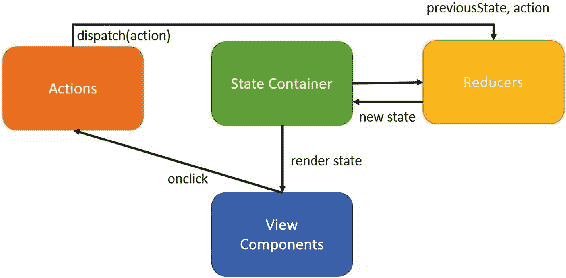
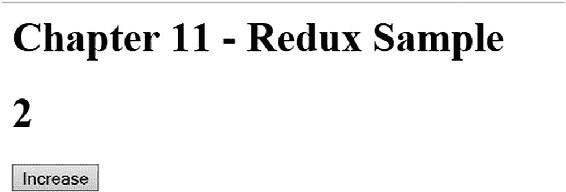
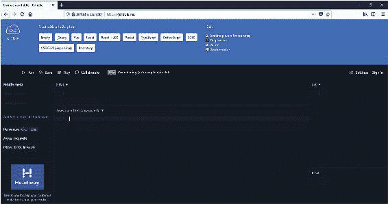
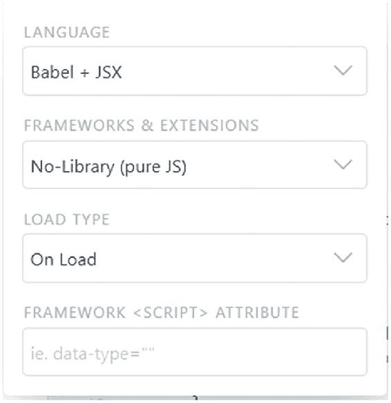
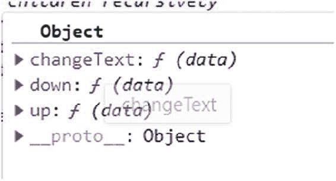
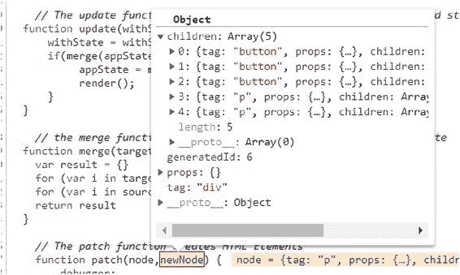
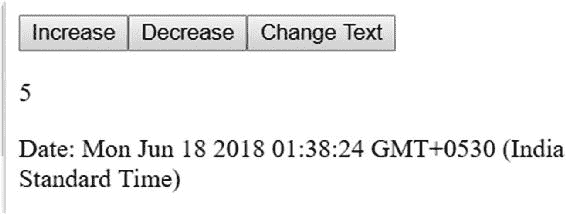

# 十一、构建一个类似 React 的库

到目前为止，我们已经学会了编写功能性 JavaScript 代码，并体会到它给应用程序带来的模块化、可重用性和简单性。我们已经看到了诸如组合、过滤器、映射、减少等概念，以及其他诸如异步、等待和管道等特性。尽管如此，我们还没有将这些特性结合起来构建一个可重用的库。这是我们在本章将要学习的内容。在这一章中，我们构建了一个完整的库，它将有助于构建应用程序，就像 React 或 HyperApp([https://hyperapp.js.org](https://hyperapp.js.org))。本章致力于构建应用程序，而不仅仅是函数。我们将使用到目前为止学到的函数式 JavaScript 编程概念构建两个 HTML 应用程序。我们将学习如何使用中央存储构建应用程序，使用声明性语法呈现用户界面(UI ),以及使用我们的自定义库连接事件。我们将构建一个微型 JavaScript 库，它将能够呈现带有行为的 HTML 应用程序。在下一章中，我们将学习为我们在本章中构建的库编写单元测试。

在开始构建库之前，我们需要理解 JavaScript 中一个非常重要的概念，叫做不变性。

### 注意

章节示例和库源代码在第 11 章分支中。回购的网址是[https://github.com/antsmartian/functional-es8.git](https://github.com/antsmartian/functional-es8.git)。

一旦你检查出代码，请检查分支第 11 章:

git checkout -b 第 11 章来源/第 11 章

以管理员身份打开命令提示符，导航到包含 package.json 的文件夹，然后运行

npm 安装

下载代码运行所需的包。

## 不变

JavaScript functions act on data, which are typically stored in variables like strings, arrays, or objects. The state of data is usually defined as the value of the variable at any given point in time. For example:let x = 5; // the state of x is 5 here let y = x; // the state of y is same as that of x y = x * 2; // we are altering the state of y console.log('x = ' + x); // prints: x=5; x is intact, pretty simple console.log('y = ' + y); // prints: y=10 Now consider string data type:let x = 'Hello'; // the state of x is Hello here let y = x; // the state of y is same as x x = x + ' World'; // altering the state of x console.log('x = ' + x);  // prints: x = Hello World console.log('y = ' + y);  // prints: y = y = Hello ; Value of y is intact So, to conclude JavaScript numbers and strings are immutable. The state of these variable types cannot be altered after it is created. That is not the case with objects and arrays, however. Consider this example:let x = { foo : 'Hello' }; let y = x; // the state of y should be the same as x x.foo +=  ' World'; // altering the state of x console.log('x = ' + x.foo); // prints: x = Hello World console.log('y = ' + y.foo); // prints: y = Hello World; y is also impacted

JavaScript 对象和数组是可变的，可变对象的状态可以在创建后修改。

### 注意

这也意味着等式对于可变对象不是一个可靠的操作符，因为在一个地方改变一个值将会更新所有的引用。

Here is an example for arrays.let x = [ 'Red', 'Blue']; let y = x; x.push('Green'); console.log('x = ' + x); // prints [ 'Red', 'Blue', 'Green' ] console.log('y = ' + y); // prints [ 'Red', 'Blue', 'Green' ] If you would like to enforce immutability onto JavaScript objects, it is possible by using Object.freeze . Freeze makes the object read-only. For example, consider this code:let x = { foo : 'Hello' }; let y = x; Object.freeze(x); // y.foo +=  ' World'; // uncommenting the above line will throw an error, both x and y are made read-only. console.log('x = ' + x.foo); console.log('y = ' + y.foo); To summarize, Table [11-1](#Tab1) differentiates the mutable and immutable types in JavaScript.Table 11-1

JavaScript 中的数据类型

<colgroup class="calibre24"><col class="tcol"> <col class="tcol"></colgroup> 
| 

不可变类型

 | 

可变类型

 |
| --- | --- |
| 数字，字符串 | 对象，数组 |

对于构建可跨项目重用的模块化 JavaScript 库来说，不变性是一个非常重要的概念。应用程序的生命周期由其状态驱动，JavaScript 应用程序主要将状态存储在可变对象中。预测应用程序在任何给定时间点的状态是至关重要的。

在下一节中，我们将构建一个可用作可预测状态容器的库。在这个库中，我们使用了不变性和我们之前学过的各种函数式编程概念。

## 构建一个简单的 Redux 库

Redux 是一个库，其灵感来自流行的单一应用程序架构，如 Flux、CQRS 和事件源。Redux 帮助您集中应用程序状态，并帮助您构建可预测的状态模式。在理解 Redux 是什么之前，让我们试着理解在少数流行的 JavaScript 框架中状态是如何处理的。让我们以 Angular 为例。Angular 应用依赖于文档对象模型(DOM)来存储状态，数据被绑定到称为视图(或 DOM)的 UI 组件，视图表示模型，反过来模型的变化可以更新视图。当应用程序随着您添加新功能而水平扩展时，预测状态变化的级联效应变得非常具有挑战性。在任何给定的时间点，状态都可能被应用程序或另一个模型中的任何组件更改，这使得确定应用程序状态更改的时间和原因变得非常不可预测。另一方面，React 使用虚拟化的 DOM 工作。给定任何状态，React 应用程序都会创建一个虚拟 DOM，然后可以呈现这个虚拟 DOM。

Redux is a framework-agnostic state library. It can be used with Angular, React, or any other application. Redux is built to address the common problems with application state and how they are influenced by models and views. Redux is inspired by Flux, an application architecture introduced by Facebook. Redux uses a unidirectional flow of data. The following are the design principles of Redux.

*   *单一真值来源:*应用有一个中心状态。

*   *状态只读:*称为动作的特殊事件描述状态变化。

*   *变化由纯函数产生:*动作由 reducer 消耗，reducer 是纯函数，在识别用户动作时可以调用。一次只发生一个变化。

Redux 的关键特征是有一个单一的真理来源(状态)。状态本来就是只读的，所以改变状态的唯一方法是发出一个描述发生了什么的动作。这个动作被 reducer 使用，并创建了一个新状态，这又触发了一个 DOM 更新。这些动作可以被存储和重放，这允许我们做像时间旅行调试这样的事情。如果你仍然困惑，不要担心；继续读下去，当我们开始使用我们到目前为止所学的知识来实现它时，模式会变得更加简单。

Figure [11-1](#Fig1) shows how Redux implements predictable state container. Figure 11-1

状态容器的 Redux 实现

 Figure 11-2

使用 redux 库的例子

Redux 的关键组件是 reducers、动作和状态。有了这个背景，让我们开始构建自己的 Redux 库。

### 注意

我们在这里构建的 Redux 库还不能用于生产；相反，Redux 示例用于展示函数式 JavaScript 编程的强大功能。

Create a new folder for the Redux library and create a new file called redux.js that will host our library. Copy and paste the code from the following sections into this file. You can use any JavaScript editor of your choice; for example, VS Code. The first and most important part of our Redux library is state. Let’s declare a simple state with one property called counter .let initialState = {counter: 0}; The next key ingredient is reducer, the only function that can alter the state. A reducer takes two inputs: the current state and an action that acts on the current state and creates a new state. The following function acts as reducer in our library:function reducer(state, action) {   if (action.type === 'INCREMENT') {     state = Object.assign({}, state, {counter: state.counter + 1})   }   return state; }

在第 4 章中，我们讨论了 Object.assign 通过合并旧状态来创建新状态的用法。当您想避开可变性时，这种方法非常有用。reducer 函数负责在不改变当前状态的情况下创建新状态。您可以看到我们如何使用 object.assign 来实现这一点:object.assign 用于通过将两个状态合并为一个状态来创建一个新状态，而不会影响 state 对象。

The action is dispatched by a user interaction; in our example it is a simple button click as shown here.document.getElementById('button').addEventListener('click', function() {     incrementCounter();   }); When the user clicks a button with Id button the incrementCounter is invoked. Here is the code for incrementCounter:function incrementCounter() {   store.dispatch({     type: 'INCREMENT'   }); } What is store? store is the main function that encapsulates behaviors that cause the state to change, invokes listeners for state change like UI, and registers listeners for the actions. A default listener in our case is the view renderer. The following function elaborates how a store looks.function createStore(reducer,preloadedState){   let currentReducer = reducer;     let currentState = preloadedState;     let currentListeners = [];     let nextListeners = currentListeners;     function getState() {       return currentState;     }     function dispatch(action) {         currentState = currentReducer(currentState, action);         const listeners = currentListeners = nextListeners;       for (let i = 0; i < listeners.length; i++) {         const listener = listeners[i];         listener();       }       return action;     }     function subscribe(listener) {       nextListeners.push(listener);     }     return {       getState,       dispatch,       subscribe     }; } The following code is our one and only listener that renders the UI when there is a change in state.function render(state) {   document.getElementById('counter').textContent = state.counter; } The following code shows how the listener is subscribed using the subscribe method .store.subscribe(function() {   render(store.getState()); }); This code is used to bootstrap the application:let store = createStore(reducer, initialState); function loadRedux(){     // Render the initial state     render(store.getState()); } It is time to plug our Redux library into an application, create a new file called index.html under the same folder, and paste in the following code.<html> <head>       <h1>Chapter 11 - Redux Sample</h1> </head> <body>         <h1 id="counter">-</h1>         <button id="button">Increase</button>          </body> </html> The function loadRedux is invoked on page load. Let us understand the life cycle of our application.

1.  1.

    *加载时* *:* 创建 Redux store 对象，使用 store.subscribe 注册监听器，同时注册 onclick 事件调用 reducer。

2.  2.

    *点击* *:* 调度程序被调用，它创建一个新的状态并调用监听器。

3.  3.

    *On render* *:* 监听器(render 函数)获取更新后的状态并呈现新的视图。

This cycle continues until the application is unloaded or destroyed. You can either open index.html in a new file or update package.json with the following code (to see the details of the full package.json, check out the branch mentioned at the beginning of the chapter)."scripts": {     "playground" : "babel-node functional-playground/play.js --presets es2015-node5",     "start" : "open functional-playground/index.html"   } To run the application you can run this command, which opens index.html in the browser:npm run start

注意，在 UI 上执行的每个动作都存储在 Redux store 中，这为我们的项目增加了巨大的价值。如果您想知道应用程序当前状态的原因，只需遍历对初始状态执行的所有操作并重放它们；这个特征也被称为时间旅行。这种模式还可以帮助您在任何时间点撤销或重做状态更改。例如，您可能希望用户在 UI 中进行一些更改，但只基于某些验证提交这些更改。如果验证失败，您可以轻松地撤销状态。Redux 也可以和非 UI 应用一起使用；请记住，它是一个具有时间旅行功能的状态容器。如果你想了解更多关于 Redux 的信息，请访问 https://redux.js.org/。

## 构建一个类似 HyperApp 的框架

Frameworks help reduce development time by allowing us to build on something that already exists and to develop applications within less time. The most common assumption with frameworks is that all the common concerns like caching, garbage collection, state management, and DOM rendering (applicable to UI frameworks only) are addressed. It would be like reinventing the wheel if you start to build an application without any of these frameworks. However, most of the frameworks available in the market to build a single-page UI application suffer from a common problem: bundle size. Table [11-2](#Tab2) provides the gzipped bundle size of most popular modern JavaScript frameworks.Table 11-2

流行 JavaScript 框架的捆绑包大小

<colgroup class="calibre24"><col class="tcol"> <col class="tcol"></colgroup> 
| 

名字

 | 

大小

 |
| --- | --- |
| 角度 1.4.5 | 51K |
| 角度 2 + Rx | 143K |
| React 16.2.0 + React DOM | 31.8K |
| Ember 2.2.0 | 111K |

*来源:*【https://gist.github.com/Restuta/cda69e50a853aa64912d】T2

 Figure 11-3

下图显示了 JSFiddle 编辑器

另一方面，HyperApp 有望成为构建 UI 应用程序可用的最薄的 JavaScript 框架。HyperApp 的 gzip 版本为 1 KB。为什么我们在谈论一个已经建成的图书馆？本节的目的不是介绍或用 HyperApp 构建应用程序。HyperApp 建立在函数式编程概念之上，比如不变性、闭包、高阶函数等等。这是我们学习建立一个类似超级应用程序的库的主要原因。

因为 HyperApp 需要解析 JSX (JavaScript 扩展)语法等等，所以我们将在接下来的章节中学习什么是虚拟 Dom 和 JSX。

### 虚拟 DOM

DOM is a universally accepted language to represent documents like HTML. Each node in an HTML DOM represents an element in an HTML document. For example:
 <h1>Hello, Alice </h1> <h2>Logged in Date: 16th June 2018</h2> 
 JavaScript frameworks used to build UI applications intend to build and interact with DOM in a most efficient way. Angular, for example, uses a component-based approach. An application built using Angular contains multiple components, each storing part of the applicaion state locally at the component level. The state is mutable, and every state change rerenders the view, and any user interaction can update the state. For example, the preceding HTML DOM can be written in Angular as shown here:
 <h1>Hello, {{username}} </h1> ➔ Component 1 <h2>Logged in Date: {{dateTime}}</h2> ➔ Component 2 
 The variables username and dateTime are stored on the component. Unfortunately, DOM manipulations are costly. Although this is a very popular model, it has various caveats, and here are a few.

1.  1.

    *状态不是中心的:*应用程序的状态本地存储在组件中，并在组件间传递，导致整体状态及其在任何给定时间点的转换的不确定性。

2.  2.

    *直接 DOM 操作:*每次状态改变都会触发一次 DOM 更新，所以在一个页面上有 50 个或更多控件的大型应用程序中，对性能的影响是非常明显的。

为了解决这些问题，我们需要一个能够集中存储和减少 DOM 操作的 JavaScript 框架。在上一节中，我们学习了 Redux，它可以用来构建一个中央可预测状态容器。使用虚拟 DOM 可以减少 DOM 操作。

Virtual DOM is an in-memory representation of DOM using JSON. The DOM operations are done on the in-memory representation before they are applied to the actual DOM. Based on the framework, the representation of DOM varies. The HyperApp library we discussed earlier uses Virtual DOM to detect the changes during state change and only re-creates the delta DOM, which leads to an increase in the overall efficiency of the application. The following is a sample representation of DOM used by HyperApp.{   name: "div",   props: {     id: "app"   },   children: [{     name: "h1",     props: null,     children: ["Hello, Alice"]   }] }

React 框架大量使用虚拟 DOM，它使用 JSX 来表示 DOM。

### 小艾

JSX is a syntax extension of JavaScript that can be used to represent DOM. Here is an example of JSX:const username = "Alice" const h1 = <h1>Hello, {username}</h1>; //HTML DOM embedded in JS React heavily uses JSX but it can live without it, too. You can put any valid JavaScript expression into the JSX expression like calling a function as shown next.const username = "aliCe"; const h1 = <h1>Hello, {toTitleCase(username)}</h1>; let toTitleCase = (str) => {     // logic to convert string to title case here }

我们将不深究 JSX 的概念；引入 JSX 和虚拟 DOM 的目的是让您熟悉这些概念。要了解更多关于 JSX 的信息，请访问 https://reactjs.org/docs/introducing-jsx.html。

### js 提琴手

在前面的所有章节中，我们已经执行了来自开发机器的代码。在本节中，我们将介绍一个名为 JS Fiddle([https://jsfiddle.net](https://jsfiddle.net))的在线代码编辑器和编译器。JS Fiddle 可用于编码、调试和协作基于 HTML、JavaScript 和层叠样式表(CSS)的应用程序。JS Fiddle 包含现成的模板，它支持多种语言、框架和扩展。如果你打算做快速和肮脏的 POCs(概念证明)或者像这本书一样学习一些有趣的东西，JS Fiddle 是最好的工具。它允许您在线保存工作，并在任何地方工作，使我们不再需要为任何语言、编译器和库的新组合建立合适的开发环境。

Let us start building our library by creating a new JS Fiddle. Click Save on the top ribbon anytime you wish you save the code. As shown in Figure [11-4](#Fig4), in the Language drop-down list box, select Babel + JSX. In the Frameworks & Extensions drop-down list box, select No-Library (Pure JS). Selecting the right combination of language and framework is very important for the library to compile. Figure 11-4

下图显示了该代码示例的框架和扩展选择

Our library consists of three main components: state, view, and actions (like HyperApp). The following function acts as a bootstrap for our library. Paste this code into the JavaScript + No-Library (Pure JS) code section.function main() {       app({ view: (state, actions) =>           
              <button onclick={actions.up}>Increase</button>          <button onclick={actions.down}>Decrease</button>          <button onclick={actions.changeText}>Change Text</button>          
{state.count}
          
{state.changeText}
           
,           state : {               count : 5,           changeText : "Date: " + new Date().toString()           },           actions: {        down: state => ({ count: state.count - 1 }),        up: state => ({ count: state.count + 1 }),        changeText : state => ({changeText : "Date: " + new Date().toString()})      }       }) } The state here is a simple object. state : {               count : 5,               changeText : "Date: " + new Date().toString() } The actions do not change the state directly, but return a new state every time the action is called. The functions down, up, and changeText act on the state object passed as a parameter and return a new state object.actions: {        down: state => ({ count: state.count - 1 }),        up: state => ({ count: state.count + 1 }),        changeText : state => ({changeText : "Date: " + new Date().toString()}) } The view uses JSX syntax representing a Virtual DOM. The DOM elements are bound to the state object and the events are registered to the actions.   
              <button onclick={actions.up}>Increase</button>          <button onclick={actions.down}>Decrease</button>          <button onclick={actions.changeText}>Change Text</button>          
{state.count}
          
{state.changeText}
 
 The app function shown here is the crux of our library, which accepts state, view, and actions as a single JavaScript object and renders the actual DOM. Copy the following code into the JavaScript + No-Library (Pure JS) section.function app(props){ let appView = props.view; let appState = props.state; let appActions = createActions({}, props.actions) let firstRender = false; let node = h("p",{},"") } The function h is inspired from HyperApp, which creates a JavaScript object representation of DOM. This function is basically responsible for creating an in-memory representation of the DOM that is rendered when the state changes. The following function, when called during pageLoad , creates an empty 

 node. Copy this code into the JavaScript + No-Library (Pure JS) section.//transformer code function h(tag, props) {   let node   let children = []   for (i = arguments.length; i-- > 2; ) {     stack.push(arguments[i])   }   while (stack.length) {     if (Array.isArray((node = stack.pop()))) {       for (i = node.length; i--; ) {         stack.push(node[i])       }     } else if (node != null && node !== true && node !== false) {       children.push(typeof node === "number" ? (node = node + "") : node)     }   }   return typeof tag === "string"     ? {         tag: tag,         props: props || {},         children: children,         generatedId : id++       }     : tag(props, children) } Please note that for the JSX to call our h function, we would have left the following comment:/** @jsx h */

这由 JSX 解析器读取，并调用 h 函数。

app 函数包含各种子函数，这些子函数将在接下来的章节中解释。这些函数是使用我们已经学过的函数式编程概念构建的。每个函数接受一个输入，对其进行操作，并返回一个新的状态。转换器(即 h 函数)接收标签和属性。该函数由 JSX 解析器调用，通常是在解析 JSX 并将标签和属性作为参数发送时调用。如果我们仔细观察 h 函数，就会发现它使用了基本的函数式编程范例——递归。它以 JavaScript 数据类型递归构建 DOM 的树结构。

For example, calling h('buttons', props) where props is an object carrying other properties attached to the tag like onclick function , the function h would return a JSON equivalent as shown here.{ children:["Increase"] generatedId:1 props:{onclick: *ƒ*} tag:"button" }

### 创建操作

The createActions function creates an array of functions, one each for action. The actions object is passed in as a parameter as shown earlier. Notice the usage of Object.Keys, closures, and the map function here. Each object within the actions array is a function that can be identified by its name. Each such function has access to the parent’s variable scope (withActions), a closure. The closure when executed retains the values in the parent scope even though the function createAction has exited the execution context. The name of the function here in our example is up, down, and changeText.function createActions(actions,withActions){       Object.keys(withActions || {}).map(function(name){            return actions[name] = function(data) {                 data = withActions[name];                 update(data)            }       })     return actions   } Figure [11-5](#Fig5) is a sample of how the actions object looks during runtime. Figure 11-5

运行时的操作对象

 Figure 11-6

下图显示了运行时子对象的状态

### 提出

The render function is responsible for replacing the old DOM with the new DOM.  function render() {     let doc = patch(node,(node = appView(appState,appActions)))     if(doc) {         let children = document.body.children;         for(let i = 0; i <= children.length; i++){             removeElement(document.body, children[i], children[i])       }       document.body.appendChild(doc);       }   }

### 修补

patch 函数负责在递归中创建 HTML 节点；例如，当 patch 接收虚拟 DOM 对象时，它递归地创建节点的 HTML 等价物。

function patch(node,newNode) {         if (typeof newNode === "string") {             let element = document.createTextNode(newNode)           } else {               let element = document.createElement(newNode.tag);               for (let i = 0; i < newNode.children.length; ) {                     element.appendChild(patch(node,newNode.children[i++]))                }                   for (let i in newNode.props) {                     element[i] = newNode.props[i]           }               element.setAttribute("id",newNode.props.id != undefined ? newNode.props.id : newNode.generatedId);          }     return element;       } }

### 更新

The update function is a higher order function responsible for updating the old state with a new state and rerendering the application. The update function is invoked when the user invokes an action like clicking any of the buttons shown in Figure [11-7](#Fig7). Figure 11-7

下图显示了该示例的最终用户界面

更新函数接收一个函数作为参数；例如，up、down 或 changeText，这使它成为一个高阶函数。这给了我们向应用程序添加动态行为的好处。怎么做？更新函数直到运行时才知道状态参数，这使得应用程序的行为在运行时根据传递的参数来决定。如果通过了 up，则状态递增；如果向下传递，则递减。用更少的代码实现如此多的功能，这就是函数式编程的强大之处。

The current state of the application is passed on to your actions (example, up, down). Actions fundamentally follows the functional paradigm by returning a new state altogether. (Yes, HyperApp strictly follows the concepts of Redux, which in turn is fundamentally based on functional programming concepts.) This is done by the merge function. Once we get a new state, we will call the render function, as shown here.function update(withState) {       withState = withState(appState)       if(merge(appState,withState)){            appState = merge(appState,withState)            render();       }   }

### 合并

The merge function is a simple function that ensures the new state is merged with the old state.function merge(target, source) {     let result = {}     for (let i in target) { result[i] = target[i] }     for (let i in source) { result[i] = source[i] }     return result } As you can see, where the state is altered, a new state that contains the old state and the state that has changed is created and altered. For example, if you invoke the Increase action, the merge ensures only the count property is updated. If you look closely, the merge function very closely resembles what Object.assign does; that is, it creates a new state from any given state by not affecting the given states. Hence we can also rewrite the merge function as shown here.function merge(target, source) {     let result = {}     Object.assign(result, target, source)     return result }

这就是 ES8 语法的强大之处。

### 移动

The following functions are used to remove the children from the real DOM.// remove element function removeElement(parent, element, node) {     function done() {       parent.removeChild(removeChildren(element, node))     }     let cb = node.attributes && node.attributes.onremove     if (cb) {       cb(element, done)     } else {       done()     } } // remove children recursively function removeChildren(element, node) {     let attributes = node.attributes     if (attributes) {       for (let i = 0; i < node.children.length; i++) {         removeChildren(element.childNodes[i], node.children[i])       }     }     return element } The UI of the application looks like Figure [11-8](#Fig8). Increase, Decrease, and ChangeText are the actions, the number is 5, and Date is the state. Figure 11-8

下图显示了该示例的最终用户界面

库的源代码可以在 checkout 分支的 hyperapp.js 下找到。您可以将它复制粘贴到一个新的 JS Fiddle 中来创建应用程序(记住要选择前面解释过的正确语言)。你也可以在[https://jsfiddle.net/vishwanathsrikanth/akhbj9r8/70/](https://jsfiddle.net/vishwanathsrikanth/akhbj9r8/70/)从我的 JS 小提琴上拿叉子。

这样，我们就完成了第二个图书馆的建设。显然，我们的库比 1 KB 小得多，但它能够构建交互式 web 应用程序。我们构建的两个库都只基于函数。所有这些函数只作用于输入，而不是全局状态。函数使用类似高阶函数的概念，使系统更容易维护。我们看到每个函数如何按时接收输入，并只处理该输入，返回新的状态或函数。我们重用了许多高阶函数，比如 map、each、assign 等等。这显示了如何在我们的代码库中重用定义良好的函数。

此外，这两个代码都取自 Redux 和 HyperApp(当然有所调整)，但是您可以看到只要遵循函数概念就可以构建出多么受欢迎的库。归根结底都是关于功能的！

尝试使用本书中解释的函数式 JavaScript 概念来构建更多这样的库。

## 摘要

在这一章中，我们学习了使用函数式 JavaScript 概念来构建一个库。我们已经了解了分布式状态如何随着时间的推移破坏应用程序的可维护性和可预测性，以及类似 Redux 的框架如何帮助我们集中状态。Redux 是一个状态容器，具有集中的只读状态；状态更改仅允许还原器通过传递操作和旧状态来进行。我们还使用函数式 JavaScript 概念构建了一个类似 Redux 的库和一个 HTML 应用程序。我们学习了虚拟 DOM 以及它如何帮助减少 DOM 操作，以及可用于在 JavaScript 文件中表示 DOM 的 JSX 语法。JSX 和虚拟 DOM 概念用于构建 HyperApp 这样的库，HyperApp 是可用于构建单页面应用程序的最薄的库。