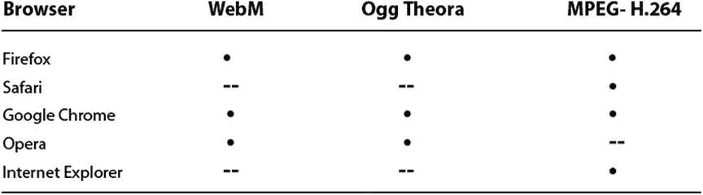
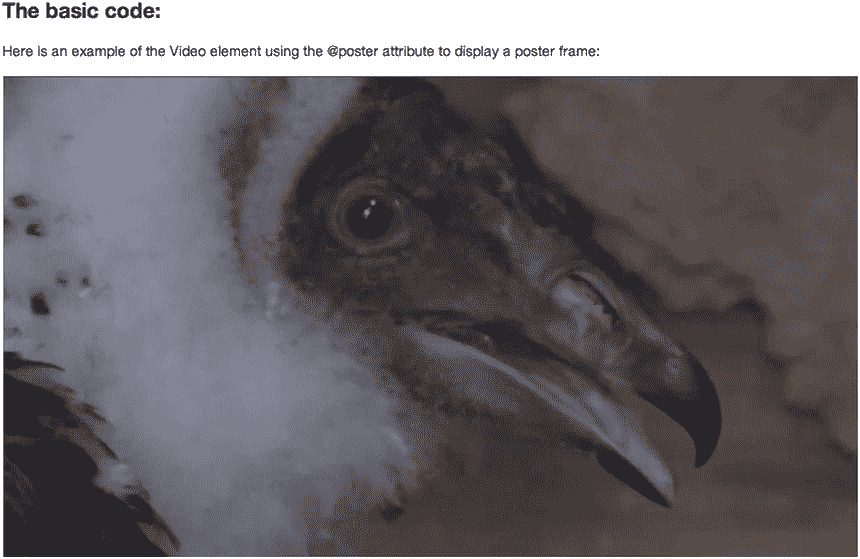
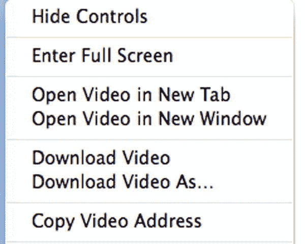

# 二、使用和操作 HTML5 视频和音频元素

视频文件编码后，我们现在可以将注意力转向播放和控制视频文件的 HTML5 标记。在这一章中，我们将全面回顾 HTML5 中引入的<video>和

<audio>元素。我们还将回顾现代浏览器使用的各种用户界面，因为它们确实会随着浏览器的不同而变化。当我们阅读本章时，你可以找到在`http://html5videoguide.net`出现的所有例子。</audio></video> 

最后一点:HTML5 视频仍然是一项正在进行的工作。如果您发现有些东西不像您预期的那样工作，您真的应该检查一下实际的规范，看是否有任何更新被添加进来。HTML5.0 规范可以在`www.w3c.org/TR/html5/`找到。下一个版本将在`www.whatwg.org/specs/web-apps/current-work/multipage/`开发新功能。

 **注**作者感谢多伦多亨伯学院媒体研究学院允许使用本章展示的秃鹫视频剪辑。我们还要感谢 Joseph Labrecque 允许我们使用本章音频部分的音频剪辑。

在我们开始之前，让我们记住现代浏览器，如图 2-1 所示，只支持特定的编解码器。了解这一点很重要，因为有时你会看到一个空白的屏幕，不知道为什么视频会丢失。几乎 100%的可能性是浏览器不支持所使用的编解码器或文件格式。



图 2-1 。浏览器支持

就像网络上常见的那样，标准不是一成不变的。即将推出的是两种新的编解码器——VP9 和 H.265，它们是专为在缓慢向 4K 或超高清(高清)视频发展的世界中生存而设计的。H.265 被设计成比 H.264 更好的压缩器，而不是设计成将更多数据压缩到一个小空间中而不可避免地损失质量的压缩器。

另一个即将推出的是 VP9。与 H.265 不同，VP9 是开源的，免版税。由谷歌作为 VP8 的继任者开发，这也解释了为什么谷歌悄悄在 Chrome 和 YouTube 中加入了 VP9 支持。Firefox 还增加了对 VP9 的支持。

尽管新的编解码器可能看起来非常不同，但 VP9 和 H.265 有一些共同点:两者都将 720p 和 1，080p 内容的文件大小减半，从而更容易通过相对较慢的连接下载或传输高清视频。

<video>元素</video>

HTML5 引入了`<video>`元素，允许你在网页中放置视频内容，而不需要使用复杂的代码或者`<object>`和`<embed>`标签。这个元素可以直接放在页面上，也可以放在页面上 CSS 驱动的`<div>`中。在这一章中，我们将展示应用于 HTML 5 视频的各种属性的用法。本章中使用的标记模板非常简单，如清单 2-1 所示。请注意，列表编号与我们在`http://html5videoguide.net/`上发布的示例文件相关，因此您可以更容易地找到它们。

***清单 2-1*** 。一个裸露的视频元素

```html
<body>
<div class=".container">

    <h1>Beginning HTML5 Media</h1>
    <h2>The basic code:</h2>
    <p>Here is an example of the Video element:</p>

    <video></video>

</div>
</body>
```

视频“神奇”都发生在`<video></video>`标签之间。就目前的情况而言，您将完全看不到任何内容，因为没有指向任何视频内容。

后备内容

您可能已经注意到了`<video>`元素有一个开始和结束标签。这有两个原因。

首先，其他元素可以作为`<video>`元素的子元素引入，特别是`<source>`和`<track>`元素。我们将向您介绍《??》第四章中的`<track>`元素，它处理可访问性。

其次，在<video>元素中发现的任何不在<video>元素的特定子元素中的内容都被视为“回退内容”我们的意思是，如果浏览器不支持某个元素，它将忽略该元素，而是显示其内容——在本例中是音频和视频元素中的内容。它可能像清单 2-2 中代码块显示的消息一样简单。</video></video>

***清单 2-2*** 。带有回退文本的视频元素

```html
<video src = "Vultures.mp4">
        Your browser doesn’t support the HTML5 video element.
</video>
```

如果将其加载到旧的 Internet Explorer (IE) 6 浏览器中，用户将会在为视频留出的块中看到该消息。事实上，在任何包含 HTML5 视频的页面中始终包含后备内容是一个最佳实践。

您可以在`<video>`元素中添加任何 HTML 标记，包括我们所说的`<object>`和`<embed>`元素。因此，例如，您可以提供一个显示使用 mp4 或 flv 格式的 Flash 视频文件的后备，始终假设不支持媒体元素的旧浏览器至少支持 Adobe Flash。

这种视频插件不支持 HTML5 `<video>`元素的 JavaScript API(应用编程接口),但您可以获得模拟一些 JavaScript API 功能的 JavaScript 库，并可用于在各种条件下提供后备。示例库，其中两个我们将在下一章探讨，是

*   mwEmbed: `https://github.com/kaltura/mwEmbed`
*   视频给大家:`http://camendesign.com/code/video_for_everybody`
*   崇高视频:`www.sublimevideo.net/`
*   video js:??]
*   JW 玩家:`www.jwplayer.com/`

还要记住，即使您使用的是现代浏览器，例如，如果它不支持 ogv，它也不会显示回退内容。你必须使用 JavaScript 来捕捉这个错误，我们将在第三章中讨论如何捕捉这个加载错误。只有当您打算使用单一媒体格式并希望捕捉不支持您的选择的浏览器的错误时，这才真正相关。

介绍<video>元素就这么多了；让我们继续回顾一下<video>元素的所有内容属性，看看`<video>`元素变得有多健壮。</video></video>

@src

在其最基本的形式中，所有的`<video>`元素需要被指向一个视频文件，然后它从那里接管。这里，清单 2-3 ，展示了代码。

***清单 2-3*** 。具有@src 属性的视频元素

```html
<video src="video/Vultures.mp4"></video>

```

通过简单地添加`@src`属性并将其指向站点上包含秃鹫`.mp4`文件的文件夹，我们可以在页面上包含一个视频文件。图 2-2 显示了结果。


图 2-2 。一个只有@src 属性的<视频>元素

您可能已经注意到，该视频看起来像一个简单的图像。它不会播放，只会显示视频中的第一帧，这就是图像的外观。以这种方式使用<video>元素只有在用 JavaScript 控制视频或者你想让视频在加载后立即开始播放时才有意义。</video>

@自动播放

要让视频自动开始，你只需要添加`@autoplay`属性。如果没有设置为自动播放，浏览器将只从视频中下载足够的字节来决定是否能够解码视频和标题。当你谈论 HTML5 视频时，文件头实际上是视频文件的元数据，包含我们在上一章讨论的分辨率和帧率等信息。

当您提供`@autoplay`属性时，视频将在设置解码管道、缓冲数据并在提供和解码足够的数据后开始回放后请求更多的音频和视频数据。这解释了为什么一些视频需要一段时间才能加载，而另一些几乎立即就能开始。浏览器确保它能够以给定的数据速率播放视频，而不会耗尽缓冲区。

当你开始做的时候，添加一个带有`@src`属性的`@autoplay`属性是播放一个视频所需要的最低要求。如清单 2-4 所示，代码如下:

***清单 2-4*** 。带有@autoplay 的视频元素

```html
<video src="video/Vultures.webm" autoplay></video>
```

`@autoplay`属性是一个“布尔”属性，意味着它只有两个可能的值:真或假，其中“真”意味着该属性存在，“假”意味着它不存在。通过将`@autoplay`添加到标记中，真值被启用。启用`@autoplay`后，视频将立即开始播放(参见图 2-3 )并在视频结束时停止。小心这一个:使用`@autoplay="false"`也通过其纯粹的存在来启用属性。如果你不想要`@autoplay`，你必须移除它。给它一个值，它就会被激活。


图 2-3 。启用了@autoplay 的 webm 文件

另一件需要注意的事情是，如果视频的下载速度不够快，无法提供流畅的播放，或者浏览器的解码速度太慢，视频将停止并开始播放，因为缓冲区在继续播放之前会被重新填充。

最后，使用`@autoplay`并不被视为行业最佳实践。如果你曾经到达一个开始播放烦人视频的网站，你就会明白这一点。请小心使用该属性。它可以自由使用的一个地方是视频被用作没有音频的整页背景视频，并且更多的是一种设计元素而不是媒体。

@静音

最佳实践是让用户选择是否播放视频中的音轨。然而，也有一些时候你根本不需要音频来播放。这是通过清单 2-5 中的属性来完成的。

***清单 2-5*** 。带有@muted 的视频元素

```html
<video src="video/Vultures.webm" muted autoplay></video>
```

`@muted`和`@autoplay`一样，都是布尔属性。如果静音，则值为真，音轨被关闭。如果不是，则播放音轨。

如果想让用户控制音频，可以使用`@controls` 属性或 JavaScript API。

@loop

`@loop`属性使视频能够在播放完毕后自动重启。显然，这个属性把视频变成了一个连续的循环。清单 2-6 显示了代码，

***清单 2-6*** 。带有@loop 的视频元素

```html
<video src="video/Vultures.webm" autoplay loop></video>
```

`@loop`和`@autoplay`一样，是一个布尔属性，会连续播放和重播视频，直到用户要么离开页面，要么退出浏览器。如果视频更多的是设计元素(例如，全屏背景视频)或者相对较短，那么可以随意使用它。否则，应该少用这个属性。

如果你想限制视频循环的次数，你需要使用 JavaScript API。

@海报

加载视频时，浏览器通常会显示视频中的第一帧。有时，第一帧有彩条，或者全黑或全白，不能很好地代表您的视频。HTML5 允许你定义一个图像，通常是从视频中选取的，作为视频的海报图像。你可以在图 2-4 中看到这一点。我们看了几分钟视频，提取了一张小秃鹫的图片，并将其保存为`.jpg`图像，用作海报框架。当我们在`@poster`属性中添加这张图片时，图 2-4 是用户加载视频时将会看到的图像。


图 2-4 。要用作海报框架的屏幕截图

标志帧对于需要一些时间来加载和播放的视频特别有用。这样用户就不会盯着页面的空白区域。海报帧的巧妙之处在于，它们不必从视频中截取。如果图像与视频具有相同的物理尺寸，它可以是您创建的任何`.jpg`或`.png`图像，包括带有视频标题文本的图片。一些网站甚至选择使用循环动画`.gif`来显示简短的视频摘要。

清单 2-7 显示了加载`BabyVulture.jpg`图像作为海报帧的代码。

***清单 2-7*** 。带有@海报的视频元素

```html
<video src="video/Vultures.mp4" poster="img/BabyVulture.jpg"></video>
```

各种浏览器处理海报框架的方式有所不同。火狐、Chrome、Opera、Safari 会显示海报(见图 2-5 )而不是视频，如果没有`@autoplay`属性就暂停。IE 就有点问题了。IE 将在设置解码管道时显示海报，但是，一旦管道建立，它将显示一个黑色帧，然后过渡到视频的第一帧。



图 2-5 。那个。用作海报框架的 jpg 图像

如果使用`@autoplay`属性，海报图像只会在视频元数据加载时和播放开始前短暂出现。一个好的经验法则是不要将`@poster`属性与`@autoplay`一起使用。

@宽度，@高度

到目前为止，我们已经在浏览器中显示了相同的两个视频，您可能已经注意到视频镜像的物理尺寸与原始源文件的尺寸相同。浏览器是怎么做到的？

本质上，尺寸是从视频资源的第一张图片计算出来的，这可以从`@poster`属性或视频本身获得。在本例中使用的 HK_Traffic 视频的尺寸为 1，066 x 600(这是视频的固有尺寸)。

如果没有可用的海报或视频尺寸—视频加载错误或没有`@poster`属性—视频显示区域或“视口”以 300 x 150(最小显示)或其固有大小显示。

如果海报尺寸和视频尺寸不同，视频最初会以海报尺寸显示，稍后会适应视频尺寸。

由此您可以推断，默认情况下会有大量扩展。当视窗在不同比例的海报图像和视频之间突然改变尺寸时，这实际上会在浏览器中产生性能瓶颈和破坏性显示。为了避免这种情况，我们建议在<video>元素中使用`@width`和`@height`属性，或者更好的是，使用宽度和高度 CSS</video> 属性。

应该使用什么值？`@width`和`@height`属性可以用像素(px)或百分比(%)来表示。唯一不接受百分比值的浏览器是 IE9，它将百分比解释为 px 值(随后在 IE10 中被修复)。在一个响应迅速的 web 环境中，百分比至高无上，我们建议使用 CSS 来表示百分比。

清单 2-8 显示了使用`@width`和`@height`属性的代码。

***清单 2-8*** 。具有@width 和@height 百分比的视频元素

```html
<video src="video/HK_Traffic.mp4" width="50%" height="50%"></video>
```

如果我们使用数字而不是百分比，代码行将如清单 2-9 所示。

***清单 2-9*** 。以像素为单位的@width 和@height 的视频元素

```html
<video src="video/HK_Traffic.mp4" width="533px" height="300px"></video>
```

虽然您可以使用 px，但更常见的应用是简单地忘记 px，而使用数字。清单 2-10 显示了一个例子。

***清单 2-10*** 。具有@width 和@height 的视频元素，没有度量单位

```html
<video src="video/HK_Traffic.mp4" width="533" height="300"></video>
```

如图 2-6 中的所示，结果是一个视频在视窗中被缩放到其尺寸的一半。


图 2-6 。视频被缩放到其原始大小的 50%

当然，存在一些问题，其中大部分与纳入百分比有关。让我们看得更深入一点。当海报和视频都使用百分比值时，Firefox 会将视频和海报缩放到所需的值。而不是 Safari 和 Chrome。它们与海报图像的高度值成比例。

通过给定固定像素值来调整大小不会没有它的“问题”，因为 CSS 像素，而不是屏幕像素，是用来定义像素的。CSS 像素是一种测量单位，它为像素长度建立了光学标准，并且完全独立于设备屏幕的大小。在 W3C 的 CSS3 标准中，这个单位被描述为大约 1/96 英寸(在 CSS3 之前，一个像素被定义为标准 96 dpi 显示器上的一个设备像素，位于距离观察者大约一臂的距离处，现在被称为参考像素(参见`www.w3.org/TR/css3-values/#absolute-lengths`)。这解释了为什么设备上的内容有时相当模糊。在这种情况下，CSS 像素可能比屏幕上的设备像素大。

对于`@width`和`@height`属性，您可能会遇到的另一个棘手问题是纵横比。如果宽高比为 16:9 (1280 x 720)的视频被缩小到 4:3(640 x 480)，该视频将被放入信箱或邮箱。注意 IE9 使用黑条，而不是其他浏览器使用的透明条。

@控件

向网页添加视频的便利性使得视频的使用变得无处不在。伴随着无处不在的是责任。此时使用`@autoplay`，视频开始播放并一直播放到结束。这不是最佳做法。用户应该有能力选择何时播放视频....不是你。这就给我们带来了武器库中最有用的属性:`@controls`。

像`@autoplay`这个是布尔属性。如果指定，加载视频时将显示控件。在回放过程中，当用户将鼠标放在视频上时，控件会显示出来，否则会隐藏起来。

清单 2-11 显示了使用`@controls`属性的代码。

***清单 2-11*** 。带有@controls 的视频元素

```html
<video src="video/HK_Traffic.mp4" controls></video>
```

结果如图 2-7 所示，视频底部有一个漂亮的控制条，直到用户点击播放按钮才会播放。


图 2-7 。Chrome 中的@controls 属性将用户控件添加到视频中

@preload

我们需要看的最后一个属性是`@preload`。

`@preload`取代了早期的属性`@autobuffer`，它是一个布尔属性，因此不能区分用户的几种不同的缓冲需求。这就是为什么引入了`@preload`属性。它允许 web 开发人员向浏览器提供关于用户缓冲需求的更详细的信息。

`@preload`属性是一个除非有非常特殊的需求，否则通常不会使用的属性。因此，以下段落仅适用于高级用户。

当 web 浏览器遇到一个<video>元素时，它需要决定如何处理它所链接的资源。</video>

如果<video>元素设置为`@autoplay`，那么浏览器需要开始下载视频资源，设置视频解码管道，开始解码音视频帧，开始同步显示解码后的音视频。通常，浏览器甚至在下载完整的资源之前就开始显示音频和视频，因为视频资源不可避免地很大，并且下载需要很长时间。因此，当 web 浏览器显示解码的视频时，它可以并行地继续下载视频资源的剩余部分，解码这些帧，缓冲它们以供回放，并在正确的显示时间显示它们。这种方法被称为渐进式下载。</video>

相反，如果在<video>上没有设置`@autoplay`属性，也没有给出</video> `@poster`图像，浏览器将只显示视频资源的第一帧。它不需要立即开始渐进式下载，甚至不知道用户是否将开始视频回放。因此，浏览器只需下载设置解码管道、解码第一个视频图像并显示它所需的视频属性和元数据。然后，它将停止下载视频资源，以免用户不想使用的数据耗尽用户的带宽。视频资源的元数据部分通常不超过几千字节。

如果<video>元素实际上有一个`@poster`属性，进一步的带宽优化是可能的。在这种情况下，浏览器可能甚至懒得开始下载任何视频资源数据，可能只是显示`@poster`图像。请注意，在这种情况下，浏览器处于信息贫乏状态:它无法发现关于视频资源的任何元数据。特别是，它还不能确定视频的持续时间，或者甚至不能确定它是否能够解码该资源。因此，笔记本电脑或台式机设备上的大多数浏览器仍然会下载元数据和视频的第一帧，而在移动设备上，浏览器通常会避免这种额外的带宽使用。</video>

作为一名 web 开发人员，您可能比 web 浏览器更有资格决定用户可以接受的带宽使用。这个决定也是一个问题，因为视频数据的延迟下载也会导致播放延迟。也许 web 开发人员不想让他们的用户等待解码管道的建立。

因此，`@preload`属性为您提供了明确的方法来控制 web 浏览器对<video>元素的下载行为。</video>

`@preload`属性可以采用“无”、“元数据”或“自动”的值

让我们从清单 2-12 中显示的“none”参数开始。

***清单 2-12*** 。带有@ preload“None”的视频元素

```html
<video src="video/HK_Traffic.ogv" poster="img/Traffic.jpg" preload="none" controls></video>
```

在您不希望用户实际播放媒体资源并希望最小化带宽使用的情况下，您可以选择“无”。一个典型的例子是一个包含许多视频元素的网页——类似于视频画廊——其中每个视频元素都有一个`@poster`图像，浏览器不必解码第一个视频帧来表示视频资源。在视频图库的情况下，用户选择回放所有视频的概率相当小。因此，在这种情况下，最好将`@preload`属性设置为“none ”,以避免带宽浪费，但是当实际选择播放视频时，可以接受延迟。您也接受某些元数据对于视频实际上是不可用的，并且不能被浏览器显示(例如，视频的持续时间)。

另一种选择是预加载元数据，如清单 2-13 所示。

***清单 2-13*** 。带有@preload“元数据”的视频元素

```html
<video src="video/HK_Traffic.mp4" poster="img/Traffic.jpg" preload="metadata" controls></video>
```

在需要元数据和可能的第一个视频帧，但不希望浏览器开始渐进式下载的情况下，您将选择“元数据”。例如，这可能是视频画廊的情况，尤其是没有海报属性的情况。在这种情况下，如果要将网页传送到移动设备或通过低带宽连接传送，您可能需要选择“无”，但在高带宽连接上选择“元数据”。此外，如果您要返回到用户之前已经访问过的单个视频的页面，您可能希望选择“元数据”,因为您可能不希望用户再次查看该视频，但是您确实希望显示元数据和第一帧。默认预加载模式是“元数据”。

清单 2-14 显示了最后一个参数，“自动”

***清单 2-14*** 。带有@ preload“Auto”的视频元素

```html
<video src="video/HK_Traffic.webm" poster="img/Traffic.jpg" preload="auto" controls></video>
```

您将选择“自动”以鼓励浏览器实际开始下载整个资源(即，即使视频资源未设置为`@autoplay`，也进行渐进式下载)。特定的浏览器可能不希望这样做(例如，如果它在移动设备上)，但是作为 web 开发人员的您以这种方式向浏览器发出信号，您的服务器不会有问题，并且希望以这种方式优化用户体验，尽可能缩短回放等待时间。

在 Firefox 和 Safari 中实现了对`@preload`的支持，因此“none”不加载任何内容,“metadata”和“auto”设置视频元素及其元数据和解码管道，并将第一个视频帧设置为标志帧。Chrome 和 Opera 支持它，但你不能在不同的页面上使用不同预加载策略的同一视频，否则它们会冻结。IE 好像还不支持属性，忽略了。

作为建议，一般来说，最好不要干扰浏览器的默认缓冲行为，并避免使用`@preload`属性。

在深入研究<video>元素的功能之前，我们将用几页的时间来介绍它的兄弟元素

<audio>元素。</audio></video> 

音频元素

其中一位作者在举办媒体研讨会时，不可避免地将 audio 称为“金发碧眼的家庭中的红发孩子”。他的意思是，当网页设计者和开发者关注闪亮的新元素时，音频不可避免地被忽视了。这是一个巨大的错误，因为如果使用得当，音频实际上可以“达成协议”如果有一个场景是屏幕一片漆黑，你听到的只有拖拖拉拉的脚步声，恐怖电影就不会令人毛骨悚然了。

<audio>与<video>元素共享许多标记和功能，但是它没有`@poster`、`@width`和`@height`属性，因为<音频>元素的本地表示是不可视显示的。</video></audio>

此时，我们需要看看 HTML5 中支持的音频编解码器。表 2-1 显示了支持 web 浏览器的主要 HTML5 媒体所支持的编解码器列表。

表 2-1 。主流浏览器原生支持的音频编解码器


您可能已经注意到，并非所有的 web 浏览器都支持单一的编码格式。可以预期，IE 可能会实现对 WAV 的支持，但由于 WAV 是未压缩的，它不是一个非常有效的选项，应该只用于短音频文件。至少你需要提供 Ogg Vorbis 和 MP3 文件来发布到所有的浏览器。

@src

清单 2-15 是一个简单的代码示例，它将在 HTML5 中嵌入一个音频资源。

***清单 2-15*** 。带有@src 的音频元素

```html
<audio src="audio/Shivervein_Razorpalm.wav"></audio>

<audio src="audio/Shivervein_Razorpalm.ogg"></audio>

<audio src="audio/Shivervein_Razorpalm.mp3"></audio>
```

这是播放音频文件所需的绝对最小代码。由于 audio 元素没有控件，所以`<audio>`元素没有可视化表示。这只有在两种情况下才是明智的:要么通过 JavaScript 控制`<audio>`(参见第三章)要么将`<audio>`设置为自动开始回放，为此它需要一个`@autoplay`属性。

@自动播放

要让音频自动启动，你需要添加清单 2-16 中使用的`@autoplay`属性。

***清单 2-16*** 。带有@autoplay 的音频元素

```html
<audio src="audio/Shivervein_Razorpalm.mp3" autoplay></audio>
```

属性是一个布尔属性，所有浏览器都支持，就像元素一样。只要浏览器下载并解码了足够的音频数据，就可以开始播放音频。音频文件将从头到尾播放一次。我们建议您谨慎使用该功能，因为它可能会让用户非常恼火。

注意“节制”和“气人”这两个词。使用它必须有一个有效的理由，如背景音频文件。如果你的理由是“这是一条很酷的赛道”，那么你可能需要重新考虑。

@loop

为了让音频在播放结束后自动重启，你可以使用清单 2-17 中的`@loop`属性。

***清单 2-17*** 。带有@autoplay 的音频元素

```html
<audio src="audio/Shivervein_Razorpalm.ogg" autoplay loop></audio>
```

`@loop`属性和`@autoplay`属性一起，提供了一种在你的网页上设置连续播放“背景”音乐或声音的方法。不建议这样做；这里提到它只是为了完整。

如果您无意或有意创建了几个这样的元素，它们将同时并在彼此之上播放，但不是同步的。事实上，由于每个

<audio>元素只遵循自己的回放时间线，它们可能会暴露出彼此之间的巨大差异。在第四章的中，我们将学习定义来同步这些元素的`@mediagroup`属性。不幸的是，目前大多数浏览器都不支持它。所以，你必须使用 JavaScript 来同步这些元素。您将轮询每个元素的当前回放时间，并定期将所有元素重置到相同的回放位置。我们将在第三章的中学习相关工具。对于音频流，你也可以使用网络音频 API(见第六章)。</audio>

@控件

你可能已经注意到我们对使用`@autoplay`和`@loop`属性的威胁。如果你计划在你的网页上显示一个音频资源用于用户交互而不是背景娱乐，你需要为你的

<audio>元素打开`@controls`，如</audio>

清单 2-18 所示。

***清单 2-18*** 。带有@loop 的音频元素

```html
<audio src="audio/Shivervein_Razorpalm.wav" controls></audio>
```

你会注意到不同浏览器的控件(见图 2-8 )使用了不同的设计。它们的宽度和高度不同，并且不是所有的都显示音频资源的持续时间。由于< audio >元素没有固有的宽度和高度，控件可以在浏览器认为合适的时候呈现。这意味着 Safari 使用 200 px 的宽度；其他的都用 300 px 的宽度。高度从 25 px (Safari，Opera)到 28 px (Firefox)到 30 px (Google Chrome)到 52 px (IE)不等。


图 2-8 。许多浏览器的音频控制

在第三章中，我们展示了如何运行你自己的控件，从而使它们在不同的浏览器中保持一致。

@preload

<audio>的`@preload`属性与<video>的属性类似。您通常不需要处理这个属性。正如您在</video></audio>

清单 2-19 的代码片段中所看到的，`@preload`属性接受三个不同的值:“无”、“元数据”或“自动”，这些值与它的<video>表亲的值相同。</video>

***清单 2-19*** 。带有@preload 的音频元素

```html
<audio src="audio/Shivervein_Razorpalm.mp3" controls preload="none"></audio>
```

在不期望用户实际回放媒体资源并且希望最小化带宽使用的情况下，Web 开发者可以选择“无”。浏览器通常会加载音频资源的设置信息，包括元数据，例如资源的持续时间。如果没有元数据，资源的持续时间将无法显示。因此，选择无预载只有在处理大量音频资源时才有意义。这通常只对显示许多音频资源的网页有用，例如播客的存档。

在您不希望用户实际回放媒体资源并希望最小化带宽使用，但又不想以丢失音频元数据信息为代价的情况下，请使用“元数据”。这通常是 web 浏览器的默认行为，除非该元素被设置为自动播放，但如果浏览器支持，web 开发人员可以通过此属性来加强这种行为。

“自动”通常用于您希望实际回放音频资源并希望鼓励浏览器预缓冲该资源(即，开始逐步下载完整的资源，而不仅仅是设置信息)的情况。通常情况下，`<audio>`元素是页面上的主要元素，比如播客页面。使用带有“自动”值的`@preload`的目的是抢先使用带宽，通过更快的回放开始来创建更好的用户体验。

大多数浏览器都实现了对`@preload`的支持，因此“none”不加载任何内容,“metadata”和“auto”设置音频元素及其元数据和解码管道。

既然您已经熟悉了<video>和

<audio>元素，我们需要研究一下<source>元素，因为它对于视频和音频文件在浏览器中的播放方式有着重要的作用。</audio></video> 

源元素

在前一章中，您发现由于浏览器供应商的原因， <video>和<音频>元素都没有普遍支持的基线编解码器。因此，HTML5 规范创建了一种方法，允许通过<源>元素指定替代源文件。这允许 web 开发人员将所有需要的链接集成到标记中的替代媒体资源，而不必测试浏览器的支持并使用 JavaScript 来更改当前活动的资源。</video>

显然，对每个视频 types—.mp4 使用单独的<video>元素。webm，还有。ogg——就是效率低下。元素允许你在一个<视频>元素中添加所有的媒体文件。</video>

清单 2-20 显示了一个具有多个资源的<视频>元素的例子。

***清单 2-20*** 。具有不同源文件的视频元素

```html
<video poster="img/BabyVulture.png" controls>
   <source src="video/Vultures.mp4"/>
   <source src="video/Vultures.webm"/>
   <source src="video/Vultures.ogv"/>
</video>
```

对于清单 2-21 中的所示的

<audio>，它看起来如下:</audio> 

***清单 2-21*** 。具有不同源文件的音频元素

```html
<audio controls>
   <source src="audio/Shivervein_Razorpalm.mp3"/>
   <source src="audio/Shivervein_Razorpalm.ogg"/>
   <source src="audio/Shivervein_Razorpalm.wav"/>
</audio>
```

<source>元素是一个空元素。它不允许有任何子元素，因此没有一个结束标签。如果使用了这样的结束标记，它将创建另一个没有任何属性的<source>元素，所以不要使用它。然而，可以像在<source>中一样在<source>元素开始标签的末尾添加一个斜杠“/”——HTML 用户代理将解析这个——但这不是 HTML5 的要求。但是，如果使用 XHTML5，则需要以这种方式关闭空元素，以符合 XML 要求。

@src

<source>元素的列表为<video>或

<audio>元素指定了替代媒体资源，其中`@src`属性以 URL(统一资源定位符)的形式提供了媒体资源的地址。</audio></video> 

浏览器按照给定的顺序遍历`<source>`元素。它将尝试加载每个媒体资源，第一个成功的将是为<media>元素选择的资源。如果都不成功，则媒体元素加载失败，就像不能解析

<audio>或<video>的直接</video></audio></media> `@src`属性的 URL 一样。

比如目前版本的 Opera 就不能播放一个`.mp4`视频。在前面的例子中，它会检查`.mp4`源并意识到，“不。不能用。”然后它会向下移动直到找到一个。webm—它可以使用并开始播放它。这些文件检查被称为内容类型嗅探。它们消耗了浏览器可以用来加载它实际可以加载的文件的宝贵时间。这就是`@type`属性的用武之地。

@类型

元素有一个属性来指定被引用媒体资源的媒体类型。该属性是来自 web 开发者的提示，并且使浏览器更容易确定它是否可以播放所引用的媒体资源。它会跳过那些它确定无法加载的文件，只测试那些它有机会加载的文件。

在清单 2-22 的中显示的`@type`属性包含一个带有可选编解码器参数的 MIME 类型。

***清单 2-22*** 。具有不同源文件和@type 属性的视频元素

```html
<video poster="img/BabyVulture.png" controls>
   <source src="video/Vultures.mp4" type=’video/mp4’/>
   <source src="video/Vultures.webm" type=’video/webm; codecs="vp8, vorbis"’/>
   <source src="video/Vultures.ogv" type=’video/ogg; codecs="theora, vorbis"’/>
</video>
```

请注意，您需要用双引号将多个参数括起来，因此您必须将`@type`值放在单引号中，或者对`@type`属性值两边的双引号进行转义。您不能在编解码器参数上使用单引号，因为 RFC 4281 ( `www.ietf.org/rfc/rfc4281.txt`)指定它们具有特殊的含义。RFC 4281 是在 MIME 类型上定义编解码器参数的规范。

用 WAV、Ogg Vorbis 和 MP3 格式嵌入音频(见清单 2-23 )和 explicit `@type`非常相似。

***清单 2-23*** 。具有不同源文件和@type 属性的音频元素

```html
<audio controls>
  <source src="audio/Shivervein_Razorpalm.mp3" type="audio/mpeg; codecs=mp3"/>
  <source src="audio/Shivervein_Razorpalm.ogg" type="audio/ogg; codecs=vorbis"/>
  <source src="audio/Shivervein_Razorpalm.wav" type="audio/wav; codecs=1"/>
</audio>
```

浏览器将解析`@type`属性，并使用它作为提示来确定它们是否可以播放该文件。MIME 类型并不总是提供媒体资源的完整描述。例如，如果提供了“audio/ogg ”,则不清楚这是 Ogg Vorbis、Ogg Flac、Ogg Speex 还是 Ogg Opus 文件。或者如果给出了“音频/mpeg”，则不清楚这将是 MPEG-1 还是 MPEG-2 音频文件层 1、2 还是 3(只有层 3 是 MP3)。还要注意，audio/wav 的编解码器=1 是 PCM。

因此，基于`@type`属性的值，浏览器将猜测它是否能够播放媒体资源。它可以做出以下三个决定:

*   它不支持资源类型。
*   “可能”:有可能支持该资源类型。
*   “可能”:web 浏览器确信它支持该资源类型。

通常，只有在编解码器参数存在的情况下，才能做出“可能”的可靠决定。

浏览器基于它所获得的关于它支持哪些编解码器的信息来做出“可能”的决定。这可以是直接在浏览器中实现的一组固定的编解码器，也可以是从 GStreamer、Media Foundation 或 QuickTime 等底层媒体框架中检索的编解码器列表。

您可以使用下面的代码片段，如清单 2-24 所示，来测试您的浏览器支持哪些 MIME 类型:

***清单 2-24*** 。如何发现支持哪些视频 MIME 类型

```html
<p>Video supports the following MIME types:
  <ul>
    <script type="text/javascript">
      var types = new Array();
      types[0] = "video/ogg";
      types[1] = ’video/ogg; codecs="theora, vorbis"’;
      types[2] = "video/webm";
      types[3] = ’video/webm; codecs="vp8, vorbis"’;
      types[4] = "video/webm";
      types[5] = ’video/webm; codecs="vp9, opus"’;
      types[6] = "video/mp4";
      types[7] = ’video/mp4; codecs="avc1.42E01E, mp3"’;
      types[8] = "video/mp4";
      types[9] = ’video/mp4; codecs="avc1.42E01E, mp4a.40.2"’;
      // create a video element
      var video = document.createElement(’video’);
      // test types
      for (i=0; i<types.length; i++) {
        var support = video.canPlayType(types[i]);
        if (support == "") support="no";
        document.write("<li><b>"+types[i]+"</b> : "+support+"</li>");
      }
    </script>
  </ul>
</p>
```

`canPlayType()`函数来自 JavaScript API，我们将在第三章中讨论。

当给定不带编解码器参数的 MIME 类型时，浏览器将返回“可能”,当给定带有它们支持的格式的编解码器参数的 MIME 类型时，浏览器将返回“可能”。否则，它们返回空字符串。

如清单 2-25 所示，你可以对音频做同样的测试。

***清单 2-25*** 。如何发现支持哪些音频 MIME 类型

```html
<p>Audio supports the following MIME types:
      <ul>
        <script type="text/javascript">
          var types = new Array();
          types[0] = "audio/ogg";
          types[1] = "audio/ogg; codecs=vorbis";
          types[2] = "audio/mpeg";
          types[3] = "audio/mpeg; codecs=mp3";
          types[4] = "audio/wav";
          types[5] = "audio/wav; codecs=1";
          types[6] = "audio/mp4";
          types[7] = "audio/mp4; codecs=mp4a.40.2";
          types[8] = "audio/x-m4b";
          types[9] = "audio/x-m4b; codecs=aac";
          types[10] = "audio/x-m4p";
          types[11] = "audio/x-m4p; codecs=aac";
          types[12] = "audio/aac";
          types[13] = "audio/aac; codecs=aac";
          types[14] = "audio/x-aac";
          types[15] = "audio/x-aac; codecs=aac";
          types[16] = "audio/ogg";
          types[17] = "audio/ogg; codecs=opus";

          // create a audio element
          var audio = document.createElement(’audio’);
          // test types
          for (i=0; i<types.length; i++) {
            var support = audio.canPlayType(types[i]);
            if (support == "") support="no";
            document.write("<li><b>"+types[i]+"</b> : "+support+"</li>");
          }
        </script>
      </ul>
</p>
```

虽然所有的浏览器都在转向所谓的内容类型嗅探，即通过下载一小部分文件来检查其类型，但旧版本的浏览器仍然依赖于正确提供的文件的 MIME 类型。无论如何，为您的文件提供正确的 MIME 类型是最佳实践。因此，请确保您的 web 服务器为您的文件报告正确的 MIME 类型。通常，web 服务器会检查文件扩展名和 MIME 类型之间的映射(例如，对于 Apache，它是`mime.types`文件)。在浏览器页面检查器中，检查 web 浏览器下载的视频文件的“内容类型”HTTP 头以进行确认。

即便如此，我们也不得不承认，我们无法控制哪块屏幕——从智能手机到你家中的平板电视——将被用来观看或收听你的内容。在这种情况下，您可能需要创建各种分辨率的视频文件，一旦浏览器判断出使用的是哪种屏幕，就只能加载其中一种。这就是`@media`属性在当今响应式 Web 设计世界中发挥巨大作用的地方。

`@type`中的“编解码器”参数是可选的，尽管它有助于浏览器更加确信他们是否能够解码资源，但最终该测试只会在尝试加载资源时出现。因此，我们建议您仅使用不带编解码器参数的 MIME 类型。

@media

元素的存在只是为了帮助浏览器从列表中选择第一个可接受的媒体资源。`@type`属性有助于识别浏览器是否支持该媒体格式。`@media`属性进一步提供了将所谓的媒体查询与资源相关联。

为了保护您的用户的理智，以适合您的目标设备的分辨率对您的视频进行编码-这将使您能够从同一视频元素中针对从 4K 屏幕大小到移动设备的任何内容。您不需要调整视频元素的宽度和高度。您提供由媒体查询调用的不同文件的副本。您不希望将一个巨大的高清视频文件传送到一个小的移动屏幕上，这将导致浏览器不得不下载比它能够显示的更多的数据，解码比它能够显示的更高的分辨率，然后不得不针对您的实际设备进行降采样。因此，即使是高质量的编码视频，在移动设备上的呈现也比适当大小的视频差。

介质查询的存在是为了指定特定的资源适合特定(范围)的输出设备。例如，`"min-width: 400px"`的`@media`值指定资源面向至少 400 px 宽度的显示区域。

许多不同的媒体查询是可能的。以下是媒体元素上使用的几个示例:

*   `@media="handheld"`表示媒体资源适用于手持设备。
*   `@media="all and (min-device-height:720px)"`表示媒体资源适用于 720 行或更大像素的屏幕。
*   `@media="screen and (min-device-width: 100px)"`表示媒体资源适用于 100 行或更高像素的屏幕。

如果您只专注于在台式机、笔记本电脑上使用浏览器，在某些情况下，在平板电脑上使用浏览器，那么这个属性应该没有多大意义。

默认玩家界面

我们通过快速浏览浏览器为音频和视频元素实现的用户界面来结束这次讨论。这些界面设计仍在不断变化——YouTube 大约每六个月推出一个新的播放器界面——在未来一段时间内，网络浏览器很可能会对其音频和视频播放器进行改进并添加功能。

HTML5 音频和视频元素的默认用户界面分为两种不同的类型:可见控件和隐藏在上下文菜单中的控件，通常通过右键单击元素来实现。播放器的设计取决于浏览器，这意味着每个播放器都是不同的。

可见控件

我们已经遇到了主要浏览器的可视控件。在这一节中，我们将从每种浏览器提供的功能方面更深入地了解它们。音频和视频元素之间的控制基本相同。

我们从图 2-9 所示的火狐控件开始。


图 2-9 。Firefox 控件

Firefox 的控件提供了以下功能:

*   播放/暂停切换
*   直接跳转到时间偏移的时间线(查找)
*   时间轴显示回放位置和缓冲进度
*   播放时间/持续时间显示
*   音量滑块
*   音量开/关按钮
*   全屏显示按钮

如果视频没有音轨，则会显示一个带叉线的音量控制器。除了全屏幕按钮之外，Firefox 音频控制具有相同的功能。

Firefox 通过键盘控制使这些控件变得容易访问和使用。

Firefox 的控件还提供以下键盘访问:

*   tab:切换到视频元素上或切换出视频元素。在视频元素上，以下键盘快捷键起作用。
*   空格键:在播放和暂停之间切换。
*   左/右箭头:向前/向后播放视频 15 秒。
*   command/CTRL+左/右箭头键:将视频向前/向后播放媒体时间长度的 1/10。
*   主页:跳到视频的开头。
*   结束:跳到视频的结尾。
*   上/下箭头:当聚焦在音量按钮上时，增加/减少音量。

不能通过键盘命令进行全屏访问。

Macintosh 键盘的等效键是 PC CTRL 键的 Command 和 PC Alt 键的 option、PC Home 键的功能键左箭头键和 PC End 键的功能键右箭头键。

接下来是苹果的 Safari。图 2-10 显示了 Safari 播放器。


图 2-10 。Safari 中视频元素的控制

Safari 的控制提供以下功能:

*   30 秒跳回按钮
*   播放/暂停切换
*   回放时间显示
*   直接跳转到时间偏移的时间线(查找)
*   时间轴显示回放位置和缓冲进度
*   回放倒计时时间显示
*   带有音量滑块的音量开/关按钮
*   全屏按钮

音频控制与普通视频控制具有相同的功能(以 264 px 的最小宽度显示时)，只是它们没有全屏幕按钮。

Safari 似乎还没有为媒体元素提供键盘控制。

接下来我们来看看谷歌 Chrome 的控件如图图 2-11 所示。


图 2-11 。谷歌浏览器中视频和音频元素的控件

Google Chrome 的控件提供了以下功能:

*   播放/暂停切换
*   直接跳转到时间偏移的时间线(查找)
*   时间轴显示回放位置和缓冲进度
*   加载时显示文件持续时间，播放时显示播放时间
*   音量开/关按钮
*   音量滑块
*   全屏按钮

如果视频元素没有音频轨道，音量按钮将呈灰色显示。同样，音频控件与视频控件相同，只是它们缺少全屏按钮。

谷歌浏览器似乎还没有为媒体元素提供键盘控制。

接下来是 Opera，如图 2-12 所示，与 Chrome 非常相似。


图 2-12 。歌剧控制

Opera 的控件提供以下功能:

*   播放/暂停切换
*   直接跳转到时间偏移的时间线(查找)
*   时间轴显示回放位置和缓冲进度
*   加载时显示文件持续时间，播放时显示播放时间
*   音量开/关按钮
*   音量滑块
*   全屏按钮

Opera 还通过键盘控制使这些控件易于访问和使用。

Opera 的控件提供以下键盘访问:

*   Tab 键:tab 键切换到播放按钮，以控制音量。
*   当按下播放按钮时:空格键在播放和暂停之间切换。
*   打开音量控制时:空格键在音量开和关之间切换。
*   当在走带控制条上时:向左/向右分别移动到起点/终点。
*   当在走带控制条上时:CTRL-left/right 向后/向前移动视频时长的 1/10。
*   打开音量控制时:上/下箭头增加/减少音量。

我们的最后一个浏览器是 Internet Explore 10 的控件，如图 2-13 所示。


图 2-13 。IE 10 中对视频和音频元素的控制

IE 的控件提供以下功能:

*   播放/暂停切换
*   直接跳转到时间偏移的时间线(查找)
*   时间轴显示回放位置和缓冲进度
*   播放时间和持续时间显示
*   音量滑块
*   音量开/关按钮
*   全屏按钮

IE 还可以通过键盘控制来访问和使用其中的一些控件。

*   tab 键:在视频上上下移动
*   空格键:在播放和暂停之间切换
*   向上/向下箭头:增加/减少音量
*   左/右箭头:将视频绕到开头/结尾

IE 控件是半透明的。Firefox 的控件也是半透明的。所有其他浏览器都有纯色控件。

上下文菜单

上下文菜单为用户提供了常用操作的快捷方式。在 Mac 上，当用户右键单击或按住 Control 键单击视频或音频元素时，可以看到上下文菜单。音频和视频的大多数功能是相同的。

Firefox 的上下文菜单图 2-14 ，包含以下项目:

*   切换播放/暂停
*   切换静音/取消静音
*   选择播放速度—适用于较长的视频
*   切换显示/隐藏控件
*   查看视频(在新标签中单独打开视频，类似于查看图像)。
*   复制视频位置(这是视频 URL)。
*   将视频另存为....将视频文件保存在本地。
*   将快照另存为...将当前视频帧保存为本地图像。
*   电子邮件视频...撰写一封正文中包含视频 URL 的电子邮件。


图 2-14 。Firefox 上下文菜单

在 Safari 的例子中，如图 2-15 中的所示的上下文菜单，如果不是极简的话，也有点不同。有些菜单项允许您隐藏控件或选择仅视频全屏渲染，而不是单击控制器上的“进入全屏”按钮。



图 2-15 。Safari 中视频元素的上下文菜单

如图 2-16 中的所示，谷歌浏览器的上下文菜单包含以下功能:

*   切换播放/暂停
*   切换静音/取消静音(当声音可用时)
*   打开/关闭循环
*   切换显示/隐藏控件
*   以一个名称在本地保存视频
*   复制视频位置
*   在新标签中打开视频
*   检查`<video>`元素(这个特性是为想要检查 HTML 代码的开发人员准备的)


图 2-16 。谷歌浏览器中视频元素的上下文菜单

Opera 的上下文菜单，如图 2-17 所示，和其他的非常相似。


图 2-17 。Opera 中视频元素的上下文菜单

最后一个是 Internet Explorer 10 的上下文菜单，如图 2-18 中的所示，它提供了通常的选项，同时还有一个给页面添加书签的机会。


图 2-18 。IE 中视频元素的上下文菜单

发布

至此，我们已经介绍了如何用 HTML5 视频元素编写网页。在前一章中，我们回顾了如何对媒体文件进行编码，以使它们受到支持 HTML5 视频的浏览器的支持。现在，我们通过了解这些文件如何从“这里”(服务器)移动到“那里”(浏览器)，来看看如何实际发布视频及其网页，从而结束这个循环。在这之后，我们有了所有的工具来制作带有视频和音频的 HTML5 网页。

在这里，我们将仅仅看看如何通过一个普通的网络服务器发布你的媒体文件集。这是最基本的发布手段。

记住，你必须创建至少一个 MPEG-4 版本的视频文件和一个 WebM(或 Ogg Theora)版本的视频文件，这样你才能在所有浏览器上使用。对于音频文件，你需要 MP3 和 Ogg Vorbis 版本。此外，如果您针对高分辨率和低分辨率的视频，您最好使用不同尺寸的不同视频文件版本，并使用媒体查询来区分它们。

清单 2-26 显示了一个视频标记的例子。

***清单 2-26*** 。支持多种浏览器和视频元素大小的视频元素

```html
<video poster="img/BabyVulture.png" controls>
     <source src="video/Vultures.mp4" media="screen and (min-width:800px)"
                   type=’video/mp4’ />
     <source src="video/Vultures-small.mp4" media="screen and (max-width:799px)"
                   type=’video/mp4’ />
     <source src="video/Vultures.webm" media="screen and (min-width:800px)"
                   type=’video/webm’ />
     <source src="video/Vultures-small.webm" media="screen and (max-width:799px)"
                   type=’video/webm’ />
</video>
```

您应该将 WebM 和 MP4 文件复制到 web 服务器上适合您的 web 应用/网页的目录中。web 服务器是一种软件，它可以使用 HTTP(超文本传输协议)并通过计算机网络传送 web 内容。有几种开源 web 服务器，最流行的是 Apache 和 Nginx。

通过 HTTP 提供 HTML5 视频是 web 浏览器支持 HTML5 视频元素的标准方式。在选择服务器软件时，请确保它支持 HTTP 1.1 字节范围请求。大多数常见的 web 服务器，包括 Apache 和 Nginx，都会支持它，但偶尔您仍然可以找到一个不支持或不能正常工作的服务器。

支持 HTTP 字节范围请求非常重要，因为这是浏览器从 web 服务器接收 HTML5 媒体资源的标准方式，这称为渐进式下载。字节范围请求的重要性是双重的:首先，它允许以小块的形式传输媒体文件，这使浏览器能够开始回放，而不必等待下载完整的文件。其次，也是更重要的一点，它允许从文件中的任何地方获取这些块，而不是等待接收到所有以前的数据。这尤其允许寻找视频的随机位置并从那里开始回放。

这是怎么回事？媒体文件解码是一件复杂的事情。媒体文件包含设置音频和视频解码管道所需的信息(参见第一章)。该信息通常存储在文件的开头。音频和视频数据以多路复用的方式提供(即，一个视频位，然后是相关的音频位，然后是下一个视频位，等等)。).为了分隔这些数据位，并获得回放时间的映射，媒体文件通常包含一个索引表。在 MP4 文件中，该索引位于文件的末尾。如果没有收到该文件，浏览器将无法开始解码和播放。因此，如果没有字节范围请求，我们就必须等待回放，直到下载完完整的文件。

在设置元数据并获得索引表后，浏览器通常只对整个媒体资源发出一次请求，并在数据到达时开始播放。对于很长的文件，当下载在当前播放位置之前很远，并且用户已经停止观看视频时，浏览器可能会暂停下载。允许浏览器暂停下载的条件是 web 服务器支持字节范围请求，因此当回放位置再次接近缓冲位置时，浏览器可以恢复下载。这将节省带宽的使用，特别是超过几分钟的视频。

所有接收到的数据都将缓存在浏览器中。当用户搜索且搜索时间尚未缓冲时，浏览器将停止下载并请求从用户搜索到的给定时间偏移开始的字节范围。

我们刚刚描述的是由浏览器在后台执行的。这是用户永远不会真正注意到的，但对你来说理解是很重要的。

当设置您的 web 服务器来托管 HTML5 音频和视频时，您不必做任何特殊的事情。对于执行有限内容嗅探的旧浏览器，您需要确保媒体资源使用正确的 MIME 类型。您的 web 服务器可能需要手动将以下一些媒体类型添加到`mime.types`安装文件中:

```html
audio/ogg    ogg oga
audio/webm   webm
video/ogg    ogv
video/webm   webm
audio/mp4    mp4a
audio/mpeg   mp3
video/mp4    mp4
```

要发布 HTML 音频和视频，您只需将文件复制到 web 服务器上的目录结构中，并通过进行浏览器测试来确保资源位置和超链接都是正确的，并且可以正常工作。

下面的文本块显示了 web 服务器上目录结构的示例布局(/var/www 是 Linux 服务器上 Apache 托管的网站的典型根目录)。

```html
/var/www/ - the Web server root directory, exposed e.g. as www.example.net/

/var/www/page.html – the Web page with a video element

/var/www/video/video.webm and
/var/www/video/video.mp4 – the video in two formats

/var/www/thumbs/video.png – the video’s thumbnail

/var/www/audio/audio.ogg and
/var/www/audio/audio.mp3 – the compressed audio in two formats
```

这基本上说的是在`www.example.net/page.html`的网页将包括一个带有的视频<source>和一个带有`video/video.mp4`的视频。

要测试您的 web 服务器是否支持 HTTP 1.1 字节范围请求，您可以通过浏览器开发工具检查 HTTP 头，或者尝试从以下命令行下载视频文件，例如，使用 curl 等 URL 加载工具:

```html
$ curl -I  http://www.example.net/video/video.webm
```

您正在寻找包含“接受范围:字节”的响应标题行如果存在，你就没事。否则，您应该使用不同的 web 服务器。

现在你知道了如何添加媒体、控制媒体和服务媒体，让我们看看这个等式的最后一部分——它是如何通过 CSS3 呈现给用户的。

CSS 和视频

正如典型的 web 设计和开发的演变一样，这些年来事情已经发生了变化。最大的变化之一是转向响应式网页设计，承认我们无法控制用来查看内容的屏幕/视窗。这导致了使用 CSS 来控制视频的呈现，而不是内联样式，从而将内容及其呈现完全嵌入到 HTML 文档的主体中。

我们对 CSS 的假设是你对这项技术有一个基本的了解。

随着向响应式世界的转变和向 HTML5 的转变，CSS 中也有一个重要的变化正在进行中。一个新的标准——CSS level 3 或 CSS3——正在开发中，它提供了许多新的和改进的功能，包括改进的布局、形状、扩展的媒体查询以及使用语音合成呈现文本的改进。其中许多可以应用于 HTML5 视频，在这一节中，我们将简要看看具体的例子。

为了简单起见，我们将使用内联样式来演示技术，而不是使用外部样式表，这被认为是最佳实践。

我们从基本的 CSS 盒子模型开始，只是给浏览器中的<video>元素添加了一点“爵士乐”。到目前为止，它只是被当作页面上的内容。CSS3 让你更容易注意到它。在这种情况下，我们添加了阴影和圆形边框，添加了一些填充，并调整了视频的大小。清单 2-27 给出了代码。</video>

***清单 2-27*** 。CSS 使你的视频看起来更好

```html
video{
    width: 80%;
    padding: 15px;
    margin: 0px;
    border: 5px solid black;
    border-radius: 15px;
    box-shadow: 10px 10px 5px gray;
    box-sizing: border-box;
}
```

在浏览器中查看时，图 2-19 是用户看到的。


图 2-19 。CSS3 造型将注意力吸引到视频上

不仅仅是<video>元素的样式能吸引浏览者的注意；也是它在页面上的定位让它脱颖而出。CSS 通过其“框模型”在页面上布局所有元素，也就是说，所有 HTML 元素都由页面上的矩形框表示，并根据标准规则呈现，所有这些都可以被 CSS 属性否决。</video>

以下是用于样式框的典型 CSS 属性:

*   宽度和高度:与 HTML 元素上的`@width`和`@height`属性一样，您可以相对(百分比或 em)或绝对(px)缩放框。
*   填充:框中内容周围的空间，它共享内容的背景。
*   border:内容周围的边框，包括填充空间。
*   边距:框外部周围的透明空间。

CSS3 引入了许多新的样式方法，比如框上圆角的 border-radius，使用图像作为边框的 border-image，下拉阴影的 border-shadow，以及指定尺寸计算与框的哪些部分相关的框大小。

然而，CSS 不仅仅做样式。它还负责框在页面上的精确定位。首先通过识别盒子的默认显示位置，然后用“位置”和“浮动”属性调整它的位置

有三种不同的基本显示框类型。

*   块框(display: block):单独放置在一行上的框——想想文本段落以及它们如何放置在彼此之下。
*   内联框(display: inline):按正常流程一行一行放置的框，通常在块框内——想想文本句子的字符以及它们是如何流动的。
*   不可见框(display: none):页面上不可见的框(例如，没有`@controls`属性的音频元素)。

所有其他显示框类型都是这三种基本类型的衍生物。不仅如此，您还可以通过更改盒子的“显示”属性来影响盒子的类型。

默认情况下，音频和视频具有嵌入式框类型。这意味着它们的行为基本上就像段落中的一个字符，并在相邻的行内框元素和父块元素的上下文中移动。

如果我们从清单 2-28 所示的基本代码开始，我们可以在这个 50%宽的视频例子中看到这一点。

***清单 2-28*** 。视频元素是内嵌元素

```html
<div class=".container">

    <h2>The basic code:</h2>
    A sentence before the video element.
    <video src ="video/Vultures.mp4"  controls></video>
   A sentence after the video element.
</div>
```

图 2-20 显示了结果。注意视频上方和下方句子的位置。这是正常模式。


图 2-20 。视频处于正常的内嵌模式

要让视频出现在它自己的段落(行)上，你可以在每个句子周围放一个

或

，这样视频就在它自己的匿名块中了。您还可以在 video 元素上放置一个“display:block”规则，将它变成一个“block”元素，并将每个元素前后的句子放在它们自己的匿名块中。

清单 2-29 用以下标记显示了这个过程:

***清单 2-29*** 。让视频在自己的匿名块中脱颖而出

```html
 <p>A sentence before the video element.</p>
```

```html
  <video poster="img/BabyVulture.jpg" controls>
     <source src="video/Vultures.mp4" type=’video/mp4’/>
     <source src="video/Vultures.webm" type=’video/webm’/>
     <source src="video/Vultures.ogv" type=’video/ogg’/>
  </video>
  <p>A sentence after the video element.</p>
```

当您进行浏览器测试时，内容移动到水平内容对齐，这是一种典型的内嵌框类型，如图 2-21 所示。


图 2-21 。视频在它自己的(匿名)块中

如果我们让视频“显示:无”，它将从渲染中消失。相反，我们可以用“可见性:隐藏”使它不可见。这将保持嵌入式视频框在原来的位置，但使它完全透明。请注意，视频仍将预加载，因此您可能希望使用`@preload="none"`来避免这种情况。

一旦完成了元素在页面上的默认定位，也就是说，浏览器已经根据它们的“显示”属性将所有元素放置在它们的“正常”显示位置，浏览器将检查“位置”和“浮动”属性。

一种更常见的技术是将视频放在文本块中，并让文本围绕它流动。这是使用 float 属性完成的，可以设置为 left 或 right，如清单 2-30 中的代码所示。

***清单 2-30*** 。将视频在其父块中向右浮动

```html
video{
    float: right;
    width: 30%;
    padding: 15px;
    margin: 10px;
    border: 5px solid black;
    border-radius: 15px;
    box-shadow: 10px 10px 5px gray;
    box-sizing: border-box;
}
```

结果如图 2-22 中的所示，文本环绕了一个`<video>`元素。


图 2-22 。使用 float:right 属性进行文本换行

既然我们已经了解了 CSS 如何用于定位`<video>`元素，那么让我们来看看 CSS 属性如何改变它在页面上的“外观”。

CSS 基本属性

有许多 CSS 属性可以应用于 HTML5 媒体元素，但是，为了节省空间和时间，让我们看看下面两个可以应用的属性:

*   不透明:视频是半透明的；和
*   渐变:给视频添加颜色效果。

不透明属性已经存在很长时间了，但是直到它成为官方的 CSS3 阵容时才成为跨浏览器的标准。不透明度定义为 0.0 到 1.0 之间的任何值，其中 0.0 表示元素完全透明，1.0 表示元素完全不透明。

清单 2-31 展示了应用于一个视频的 60%不透明度的代码，以及使用“位置”、“顶部”和“左侧”属性将视频移动到之前渲染的图像的顶部。

***清单 2-31*** 。显示半透明的视频

```html
video{
    opacity: 0.6;
    width: 50%;
    padding: 15px;
    margin: 0px;
    border: 5px solid black;
    border-radius: 15px;
    box-shadow: 10px 10px 5px gray;
    box-sizing: border-box;
    position: relative;
    top: -440px;
    left: 126px;
    background-color: white;
}
...
    
    <video poster="img/BabyVulture.jpg" controls>
       <source src="video/Vultures.mp4" type=’video/mp4’/>
       <source src="video/Vultures.webm" type=’video/webm’/>
       <source src="video/Vultures.ogv" type=’video/ogg’/>
    </video>
```

正如你在图 2-23 中看到的，视频下方的背景图像正在透过。


图 2-23 。视频的不透明度值为 0.5

对视频应用渐变是一个非常有趣的挑战。对于图像，人们可以将图像放入背景中，并在其上叠加一个渐变。我们想复制这个视频，但不能使用 CSS 将视频放在背景中。因此，我们必须在视频顶部渲染一个渐变`<div>`。CSS3 规范指定了两个函数来创建渐变:线性渐变()和径向渐变()。

在我们的例子中(见清单 2-32 )我们想为视频应用一个线性渐变。为了实现这一点，我们简单地创建了一个`<div>`来保存从透明到纯白的渐变。然后，我们使用相对定位将渐变叠加到视频元素上。

***清单 2-32*** 。在视频顶部显示渐变

```html
<style type= "text/css">
video{
    width: 400px;
        height: 225px;
}
#gradient{
    position: relative;
    width: 400px;
    height: 225px;
    top: -225px;
    background: linear-gradient(rgba(255,255,255,0), white);
    pointer-events: none;
}
</style>
...
    <video src ="video/Vultures.mp4" controls></video>
     <div id="gradient"></div>
```

这里的关键是背景属性。该属性需要两个值:开始颜色和结束颜色。在这种情况下，我们在渐变底部从透明的白色移动到不透明的白色。不透明度的变化给出了渐变遮罩在视频上的效果。我们使用供应商前缀来确保渐变在所有浏览器中都有效。图 2-24 显示了最终结果。


图 2-24 。渐变被放置在视频上

这个功能的一个副作用是，正如你所看到的，视频实际上隐藏在渐变`<div>`的下面。这意味着控件对用户交互是隐藏的。您必须将渐变`<div>`上的 CSS 指针事件属性设置为“none ”,以将指针事件重定向到视频元素。您也可以将视频设置为自动播放，并删除`@controls`属性，但这样用户就不能与视频互动了。您最后的办法是创建自己的 JavaScript 控件。我们将在下一章教授如何做到这一点。

播放背景视频

这种技术越来越普遍。你到达一个站点，在页面的内容下面有一个全屏的视频在播放。尽管有许多相当复杂的技术来实现这一点，但这很容易做到。诀窍就在 CSS 中。可用的 CSS 属性之一是 z 位置。正数将带有视频的

放在所有内容的前面，负数将其推到所有内容的下面。


图 2-25 。全屏背景视频

如图 2-25 所示，书籍作者的名字显示在后台播放的视频上。

由此你可以推测，如清单 2-33 所示，通过在下面的代码块中使用大的负 z 索引号，视频被简单地“滑动”到内容下面:

***清单 2-33*** 。使用 CSS z-index 属性在背景中定位视频

```html
#video_bkgrnd{
        position: absolute;
        bottom:0px;
        right:0px;
        min-width:100%;
        min-height:100%;
        width:auto;
        height:auto;
        z-index: -1000;
        overflow:hidden;
}

<video id="video_bkgrnd" poster ="img/BabyVultures.jpg" muted autoplay loop >
  <source src="video/HK_Traffic.mp4" type="video/mp4">
  <source src="video/HK_Traffic.webm" type="video/webm">
  <source src="video/HK_Traffic.ogv" type="video/ogg">
  <p>This browser can’t show HTML5 video.</p>
</video>
```

显然，为这类事情提供控件和音频是不可能的，因为我们无法控制用户在页面上停留多长时间，视频应该循环播放，这就是为什么它在清单 2-33 中有一个`@loop`属性。

虽然这种技术属于“酷”的范畴，但是你需要非常小心地使用它。

首先，视频的物理尺寸很好地限制了它在桌面上的使用。即使这样，这种技术也最适合于循环播放较短(大约 10-30 秒)且文件大小不大的视频。例如，将视频的颜色深度降低到灰度或 8 位(256 色)将对最终的文件大小产生重大影响。此外，视频需要尽可能有效地压缩，同时仍然能够跨设备和屏幕缩放。根据经验，尽量将文件大小保持在 5 mb 以下，500k 是最理想的。

理想情况下，视频应该显示一个占位符图像，以适应不支持 HTML5 的浏览器。此占位符图像也将用作移动设备的背景，因为大多数手机和平板电脑不支持自动播放。

CSS 2D 变换

CSS3 规范的一个非常好的特性是使用了变换，它允许你在 CSS 盒子中重新定位视频。以下是可用的转换函数:

*   矩阵:描述盒子上的线性变换。
*   rotate，rotateX，rotateY:描述如何旋转盒子。
*   scale，scaleX，scaleY:描述应该如何旋转长方体的 x 轴和 y 轴。
*   skew，skewX，skewY:描述 x 轴和 y 轴应该如何根据角度倾斜。
*   translate，translateX，translateY:描述盒子的水平或垂直重定位。

在本例中，我们将视频旋转-30 度。清单 2-34 中的代码实现了这一点。

***清单 2-34*** 。显示-30 度倾斜的视频

```html
video {
 width: 50%;
 transform: rotate(-30deg);
 -webkit-transform: rotate(-30deg);
 position: relative;
 left: 100px;
}

<body>
  <video src="media/HK_Traffic_1.mp4" controls/>
</body>
```

在本例中，使用 transform 属性简单地将视频向左旋转 30 度。我们使用了–WebKit 前缀使其在 Chrome、Safari 和 Opera 中工作，这些浏览器正在移除这个前缀。

图 2-26 显示了最终结果。


图 2-26 。应用于视频的旋转变换

CSS 动画〔??〕

CSS3 引入了动画，允许您在不编写 JavaScript 的情况下让对象运动。

在讨论这个规范时忽略 JavaScript 并不是没有争议的，因为 JavaScript 已经允许相同的效果。然而，一个关键的网络原则赢得了胜利。这个原则是我们在本章一直强调的:HTML 管理内容，CSS 处理显示，JavaScript 处理交互性。

动画实际上只不过是 CSS 过渡的延伸。它们有一个开始状态和一个结束状态，物体在给定的时间内从“这里”移动到“那里”。您还可以通过使用`@keyframes`选择器向动作添加一系列中间状态。

清单 2-35 显示了从左到右再从左到右移动视频的代码。

***清单 2-35*** 。视频元素在 0 和 600 像素标记之间移动两次

```html
@keyframes moveIt {
  0% {transform: translateX(0);}
  100% {transform: translateX(600px);}
}
video{
    width: 200px;
    animation-name: moveIt;
    animation-duration: 2s;
    animation-timing-function: ease-out;
    animation-iteration-count: 4;
    animation-fill-mode: forwards;
    animation-direction: alternate;
}
```

我们省略了-webkit 前缀，这对于除 IE 和 Firefox 之外的所有浏览器都是必需的。图 2-27 显示了动画视频元素的初始状态和中间状态。


图 2-27 。动画视频元素的两种状态

从代码中可以看出，代码实际上有两部分。这些属性以名称 moveIt 开始，它链接到了`@keyframes`规则。`@keyframes`规则定义了动画步进点。视频在屏幕上移动超过两秒钟，alternate 属性只是反转动画。您还应该特别注意动画-时间-功能属性，该属性将缓动应用于运动。

`@keyframes`规则设置 X 轴上运动距离的限制。

我们只是简单介绍了 CSS 对视频元素的使用。尤其是 CSS3，它有更多可以应用于 CSS 盒子的特性。你可以开发的视觉效果几乎是无限的。在之前的版本中，我们展示了旋转的 3D 立方体，每一面都有视频。

摘要

正如你在本章中发现的，处理 HTML5 视频不仅仅是简单地将它放在标签之间。我们覆盖了

*   对<video>元素的彻底审查</video>
*   回顾可应用于<video>元素的属性</video>
*   如何使用

    <audio>元素的属性</audio>

*   对媒体如何从服务器转移到网页的全面回顾
*   其中 CSS 适合设计和开发过程，包括 CSS 转换、CSS 过渡和 CSS 动画的使用

这是一个很大的范围，但它是你需要知道的成功添加音频或视频到 HTML5 页面。在下一章中，我们将深入探讨如何通过使用 JavaScript API 来实现媒体交互。我们在那里见。