# 四、可访问性、国际化和导航

可访问性和国际化是可用性的两个方面。第一种——无障碍——是为那些有某种形式的感官或身体障碍(如失明)的人设计的。第二种方式——国际化——吸引了那些不会说音频或视频文件所用语言的人。

自 20 世纪 90 年代中期以来，Web 已经开发了大量的功能来满足这些用户的额外需求。网站以多种语言呈现，屏幕阅读器或盲文设备为视力受损的用户提供了阅读网页内容的能力。视频的字幕，尤其是外语视频，或者对图像使用`@alt`属性，已经变得几乎无处不在，对图像使用`@alt`已经是很长时间以来的最佳实践。

在 HTML5 规范中引入音频和视频带来了新的可访问性挑战，需要扩展这一最佳实践。我们第一次发布需要让听力受损用户和/或不讲音频数据中所用语言的用户能够访问的音频内容。我们还首次发布了 HTML 图像内容，这些内容会随着时间的推移而变化，需要让视力受损的用户能够访问。

 **注意**最后一句话可能看起来有点不合时宜，但视频实际上只不过是一系列静止图像——由增量帧分隔的关键帧——它们会随着时间而变化。

我们绝不能忘记的是“万维网”中的“世界”一词。不像媒体广播公司可以挑选他们的观众，我们的观众是由通晓多种语言的健全人和残疾人以及不同的文化和语言组成的。每个访问你的视频或音频内容的人都有和其他人一样的权利去访问它，你不能挑选和选择谁来查看你的内容。

满足这种需求的主要手段是开发所谓的替代内容技术(或替代内容)，在这种技术中，向用户提供的内容以他们能够消费的格式给出了原始内容的替代表示。1995 年，随着 HTML 2 中的`@alt`属性的引入，提供 alt 内容的实践被正式化，从那时起，它就成了规范的一个固定部分。

当 W3C 决定在 HTML5 中引入`<audio>`和`<video>`标签时，alt 内容的问题成为了一个主要关注点。例如，对于带有画外音的简单视频，有许多选择。它们包括以下内容:

*   字幕，是供听力受损用户使用的音轨的替代内容。
*   字幕，是供外语用户使用的音轨的替代内容。
*   视频描述，为视力有障碍的用户提供视频轨道的替代内容。

当发布媒体内容时，所有这些备选方案也应该发布，这样就不会遗漏任何受众。不要把它当成一件苦差事:alt 内容通常是有用的附加内容，例如，在视频的字幕或章节标记的情况下，它可以帮助任何用户跟踪正在讲的内容，并导航到视频文件中有用的位置。

在本章中，我们将讨论 HTML5 为满足媒体用户的可访问性和国际化需求而提供的特性。我们从需求分析开始这一章，概述了媒体内容的替代内容技术。然后我们介绍 HTML5 为满足需求而提供的特性。

 **注意**为视频创建替代内容对网络上的所有用户都有重要意义——不仅仅是那些有特殊需求的用户或非本地用户。最大的优点是，文本，确切地表示视频中正在发生的事情，是可用的，并且这些文本是进行搜索的最佳手段。请记住，搜索技术在文本方面非常先进，但在音频或视频内容方面仍然相当有限。正是由于这个原因，alt content 为高质量搜索提供了唯一可靠的视听内容索引方法。

替代内容技术

在本书中，我们以“特征-示例-演示”的形式介绍了各种可用于向 HTML5 文档添加音频和视频资产的技术在此之前，我们将介绍 web 设计人员和开发人员在努力应对日益增长的可访问性和国际化需求时面临的许多问题。

首先要面对的是立法性质的问题。

越来越多的国家正在通过关于网络的无障碍法律。例如，在美国，1973 年《康复法》第 504 条是第一部旨在保护残疾人免受基于其残疾状况的歧视的民权立法。虽然互联网，更不用说个人电脑，还不存在，但该法律适用于任何接受联邦资金的雇主或组织，这包括政府机构，从 K-12 到大专的教育机构，以及任何其他联邦资助的项目。1998 年，当互联网蓬勃发展时，重新授权的康复法案第 508 条创建了具有约束力和可执行的标准，明确概述和指定了“可访问”的电子和信息技术产品的含义。结果是，在美国，为接受联邦资金的公司或组织开发的任何 web 项目都必须遵守 Section 508。如果你不熟悉第五百零八部分，在`http://webaim.org/articles/laws/usa/`有一个很好的概述。

虽然可访问性政策因国家而异，但大多数国家——包括欧盟国家——都采用了基于 W3C 的网络内容可访问性指南(`www.w3.org/TR/WCAG/`)的标准，这是一套由 W3C 开发的标准化规则，用于解释如何使网络内容可访问。WCAG 的发展是因为，越来越多的不仅仅是政府在努力解决可访问性的问题，而是所有主要的网络内容发布网站。如果您不熟悉 W3C 的 Web Accessibility Initiative，更多信息请访问`www.w3.org/WAI/`。你需要知道的是，许多立法措施都是基于这个小组的工作。

挑战 web 开发人员的下一个问题是围绕音频和视频的 alt 内容的用户需求的多样性，这是相当复杂的。如果你想了解更多关于媒体可访问性需求的知识，还有一个由 WAI 发布的 W3C 文档，由本书的作者之一合著:`www.w3.org/WAI/PF/media-a11y-reqs/`。

视力受损的用户

对于视力不好或没有视力的用户来说，有两个主要的挑战:如何感知视频的视觉内容，以及如何与媒体元素交互和控制媒体元素。

感知视频内容

为帮助视障用户消费视频的图像内容而开发的方法是 ***描述的视频*** 。在这种方法中，随着视频时间的推移，对视频中正在发生的事情的描述变得可用，并且音频继续回放。以下方法是可行的:

*   **音频描述** :随着视频的进行，一个扬声器解释视频中可见的内容。
*   **文本描述** :与屏幕上发生的事情同步的文本块被及时提供，并且屏幕阅读器将其合成为针对视力受损用户的语音。

 **注意**可能有必要在视频中引入停顿，以便在主音轨中插入没有时间的额外解释。这将延长消耗视频的时间。因此，这样的描写称为**引申描写** 。

音频描述可以创建为添加到主音频轨道的单独音频记录，也可以混合到主音频记录中，并且不能再次提取。

这种**混合音频描述** 轨道可以作为多轨道视频资源的一部分提供，只要它们不延长视频的时间线。人们可以创建一个没有音频描述的音频轨道和一个单独的带有音频描述的混音轨道，这样它们就可以作为彼此的替代物被激活。

当需要扩展描述时，混合音频描述需要使用完全独立的视频元素，因为它们在不同的时间线上工作。然而，创建这样一个混合了音频描述的新视频文件所涉及的制作工作是巨大的。因此，只有在没有其他方法来提供所描述的视频时，才应该使用混音。

文本描述始终作为附加内容提供，以便按需激活。

从技术角度来看，有两种发布描述视频的方式。

*   **带内**文本描述总是在主音频轨道之外被激活。作为单独录音的音频描述也会被额外激活，而混合描述是主音频轨道的替代选择。这实际上非常类似于传统上通过辅助音频节目提供的描述性音频(见`http://en.wikipedia.org/wiki/Second_audio_program`)。
*   **外部** :音频或文本描述作为单独的资源提供。当时间线匹配时，HTML5 提供标记机制将媒体资源链接在一起。然后，外部资源中的音轨被作为“带内”音轨的“带外”版本来处理，并且 HTML5 提供了与带内音轨相同的激活机制。在回放期间，浏览器处理独立资源的下载、解释和同步。

HTML5 的多音轨媒体 API(应用编程接口)处理带内和带外音频和文本描述音轨。Apple 在 Safari 和 Quicktime 中支持带内字幕。

与内容互动

视力受损的用户需要以多种方式与所描述的视频进行交互。

*   **激活/停用描述** **。**在通过带内轨道或外部资源提供描述视频的情况下，浏览器可以基于在浏览器中的用户偏好设置中指定的用户需求来自动激活或停用描述轨道。显式的用户控制也应该通过交互式控制可用，例如所有可用轨道及其激活状态的菜单。目前，浏览器没有为视频描述提供这样的偏好设置或菜单。然而，它们可以用 JavaScript 开发。
*   **在媒体内导航并进入媒体** **。**视听内容是视障用户的主要信息来源，因此导航至该内容非常重要。视力正常的用户通常通过点击播放进度条上的时间偏移来浏览视频。视力有障碍的用户也需要使用这种直接访问功能。直接跳到时间偏移或语义上有意义的内容部分对内容的消费有很大的帮助。此外，还必须提供一种更加语义化的方式，沿着章节、场景或行为等结构导航内容。媒体片段 URIs(统一资源标识符)和 WebVTT (Web 视频文本轨道)章节提供了直接访问功能。

重听用户

对于听力有困难的用户，音轨的内容需要以音频的替代形式提供。字幕、文字记录和手语翻译传统上被用作替代方法。此外，对播放音频的改进也可以帮助并非完全失聪的重听人掌握音频的内容。

对于标题，我们区分以下几种情况:

*   传统字幕:文本块与屏幕上发生的事情同步，并与视频同步显示。它们通常覆盖在视频视窗的底部，有时放在视窗的其他地方以避免与屏幕上的其他文本重叠，有时放在视窗的下面以避免任何重叠。很少(如果有的话)样式被应用于字幕以确保文本具有适当的字体、颜色和通过例如文本轮廓或文本背景将其与视频颜色分开的手段是可读的。一些字幕视频引入了扬声器的颜色编码、扬声器标签和/或屏幕上靠近扬声器的文本定位，以进一步提高认知和阅读速度。HTML5 引入了“标题”类型的文本轨道和 WebVTT 来在浏览器中呈现标题。
*   增强的字幕:在现代网络环境中，字幕可以不仅仅是文本。动画和格式化的文本可以在标题中显示。图标可以用来传达意思，例如，不同的扬声器或声音效果使用不同的图标。超链接可用于将屏幕上的 URL 链接到实际的网站，或者提供到进一步信息的链接，使得更容易使用视听内容作为导航的起点。图像覆盖可用于字幕中，以允许显示带有视听内容的定时图像。为了实现这种用途，标题中最好使用通用的 HTML 标记。使用带有“元数据”类型的文本轨道的 WebVTT 可以做到这一点

现在，我们将专注于传统的字幕。

这种字幕总是以文本形式创作，但有时会直接添加到视频图像中。这种技术被称为烧录字幕，或“开放字幕”，因为它们总是活跃的，开放给每个人看。传统上，这种方法已经被用于在电视和电影院传送字幕，因为它不需要任何额外的技术来复制。然而，这种方法非常不灵活。在网络上，这种方法是不鼓励的，因为它很容易提供文字说明。只有没有烧录字幕的视频不可用的传统内容才能以这种方式发布。最好的情况是，带有烧录字幕的视频应该作为多轨道媒体文件中的单独轨道或媒体源中的单独流提供，这样用户就可以在带有字幕的视频轨道和不带字幕的视频轨道之间进行选择。

从技术角度来看，有两种发布标题的方式。

*   **带内**:烧录字幕轨道或文本字幕在媒体资源中作为单独的轨道提供。这允许独立激活和停用字幕。它要求网络浏览器支持多轨视频的处理。
*   **外部**:文本字幕作为独立的资源提供，并通过 HTML 标记链接到媒体资源。类似于单独的轨道，这允许独立激活和停用字幕。它要求浏览器在回放过程中下载、解释额外资源，并使之与主资源同步。这在 HTML5 中通过文本轨道和 WebVTT 文件得到支持

如果您可以选择，将字幕作为单独的外部文件发布，因为稍后再次编辑它们并对它们进行其他文本分析要比它们与媒体数据混合在一起简单得多。

虽然我们已经指定了最常见的使用案例，但我们不能忘记，对于有认知障碍(阅读障碍)的人或需要这些替代内容技术的学习者来说，也有一些案例。

副本

视听资源的音频轨道的全文抄本是使重听用户，事实上是任何人都能获得这些内容的另一种手段。阅读(或交叉阅读)音频或视频资源的副本可能比完整阅读更有效。一个特别好的例子是一个名为 Metavid 的网站，它有美国参议院会议的全部记录，并且是完全可搜索的。

通常使用两种类型的抄本。

*   普通文本 :这相当于文字说明，但是被放在一个单独的文本块中。该文本块可以简单地呈现为视频周围某处的网页上的文本，或者作为通过视频附近的链接提供的单独资源。
*   互动文字记录 :这些文字记录也相当于字幕，但被放在一个文本块中，文本和视频之间的关系更紧密。抄本继续具有时间同步的块，使得在特定文本提示上的点击将导航视听资源到该时间偏移。此外，当视频到达下一个文本提示时，抄本将自动移动新的文本提示中心阶段，例如，通过确保它滚动到特定的屏幕位置和/或被突出显示。

顺便说一句，后一种类型的交互式文字稿在与屏幕阅读器结合使用时，作为导航辅助工具，对视力受损的用户也很有用。然而，当搜索交互式抄本时，有必要将视听内容静音，因为否则它将与来自屏幕阅读器的声音竞争，使两者都难以理解。

符号翻译

对于重听用户，尤其是聋人用户，手语通常是他们说的最熟练的语言，其次是他们所居住国家的书面语。他们通常用手语更快更全面地交流，这很像普通话和类似的亚洲语言，通常通过单一的语义实体符号进行交流。字母也有手语，但是用手语表达字母非常慢，而且只在特殊情况下使用。手语的使用是重听用户之间最快也是最具表现力的交流方式。

从技术角度来看，有三种方法可以实现标识翻译。

*   **Mixed-in**: sign translation that is mixed into the main video track of the video can also be called burnt-in sign translation, or “open sign translation,” because it is always active and open for everyone to see. Typically, open sign translation is provided as a picture-in-picture (PIP) display, where a small part of the video viewport is used to burn in the sign translation. Traditionally, this approach has been used to deliver sign translation on TV and in cinemas because it doesn’t require any additional technology to be reproduced. This approach is, however, very inflexible since it forces all users to consume the sign translation without possibilities for personal choice, in particular without allowing the choice of using a different sign language (from a different country) for the sign translation.

    在网络上，这种方法是不鼓励的。作为小 PIP 视频提供的手语翻译在小的嵌入式视频中尤其难以看到，而嵌入式视频通常用于网络视频。因此，只有没有内置标志翻译的视频不可用的传统内容才能以这种方式发布。在可能的情况下，标识翻译应该作为独立的内容存在。

*   **带内**:符号翻译作为媒体资源中的一个独立部分提供。这允许额外信息的独立激活和去激活。它要求网络浏览器支持多轨视频的处理。
*   **外部**:标牌翻译作为单独的资源提供，并通过 HTML 标记链接到媒体资源。类似于单独的轨道，这允许额外信息的独立激活和去激活。它要求浏览器同步播放两个视频资源。

清除音频

这不是针对听力受损者的替代内容，而是提高音频内容可用性的更普遍适用的功能。人们普遍认为语音是音轨中最重要的部分，因为它传达了最多的信息。在现代多声道内容中，语音有时作为独立于声音环境的单独声道提供。一个很好的例子是卡拉 ok 音乐内容，但是清晰的音频内容也可以容易地提供给专业开发的视频内容，例如电影、动画或电视连续剧。

许多用户在理解混合音轨中的语音时存在问题。但是，当在单独的音轨中提供语音时，可以允许独立于其余音轨来增加语音音轨的音量，从而呈现“更清晰的音频”——即，更容易理解的语音。

从技术上讲，这只有在有单独的语音轨道可用的情况下才能实现，无论是作为单独的带内轨道还是作为单独的外部资源。

聋哑用户

很难为既看不见也听不见的用户提供替代内容。对他们来说，唯一的消费手段基本上是盲文，这需要基于文本的替代内容。

个人消费

如果聋哑用户自己消费视听内容，提供包含屏幕和音频上发生的事情的描述的抄本是有意义的。它基本上是一个文本视频描述和一个音频抄本的组合。因此，这在技术上的实现最好是作为一个组合的抄本。有趣的是，盲文设备非常擅长导航超文本，因此一些用导航标记增强的转录形式也很有用。

共享观看环境

在一个共享的观看环境中，其中聋哑用户与一个看得见和/或听得见的人一起消费内容，文本和音频描述的组合需要与视频回放同步提供。典型的盲文阅读速度是每分钟 60 个单词。相比之下，成年人的平均阅读速度约为每分钟 250 至 300 个单词，甚至通常的说话速度为每分钟 130 至 200 个单词，你会意识到，对于一个聋哑人来说，很难跟上任何正常的视听演示。可能需要一个概要版本，它仍然可以同步提供，就像同步提供文本描述一样，并且可以交给盲文设备。因此，这一点的技术实现要么是作为交互式抄本，要么是通过概括的文本描述。

学习支持

一些用户喜欢减慢回放速度，以帮助他们感知和理解视听内容；对于其他人来说，正常播放速度太慢。特别是视力受损的用户已经学会以惊人的速度消化音频。对于这样的用户来说，能够减慢或加快视频或音频资源的回放速度是非常有帮助的。这种速度变化需要保持音频的音高以保持其可用性。

对那些有学习障碍的人非常有帮助的一个特征是提供解释的能力。例如，每当使用一个不常见的单词时，弹出该术语的解释(例如，通过到维基百科或字典的链接)会非常有帮助。这有点类似于增强字幕的目的，并且可以通过允许超链接和/或覆盖以相同的方式提供。

有了学习材料，我们还可以在时间同步性上提供内容的语法标记。这通常用于语言学研究，但也可以帮助有学习障碍的人更好地理解内容。语法标记可以被增加到标题或副标题上，以提供给定上下文中单词的语法角色的转录。或者，语法角色可以仅作为时间段的标记来提供，依靠音频来提供实际的单词。

在学习类别下，我们还可以包含歌词或卡拉 ok 的用例。像字幕一样，这些为用户提供了一个时间同步的朗读(或演唱)文本显示。在这里，他们帮助用户学习和理解歌词。与字幕类似，它们在技术上可以通过烧录、带内多轨或外部轨道来实现。

外国用户

不说视听内容的音轨中使用的语言的用户被视为*外国用户。*这样的用户也需要替代内容，以允许他们理解媒体内容。

场景文本翻译

视频轨道通常对外国用户来说只是一个小挑战。大多数场景文本并不重要，不需要翻译或者可以从上下文中理解。然而，有时屏幕上有解释位置的文本，如标题，翻译会很有用。建议在字幕中包含这样的文字。

音频翻译

有两种方法可以让外国用户访问音轨。

*   **配音**:提供一个补充音轨，可以用来替代原来的音轨。该补充音轨可提供给**带内**多轨视听资源，或**外部**作为链接资源，其中回放需要同步。
*   **(增强)字幕**:提供音轨中所讲内容的文本翻译。这个补充文字轨道可以提供**烧入、带内**，或者作为**外部资源**，就像字幕一样。就像字幕一样，老化字幕也不被提倡，因为它们不够灵活。

技术总结

当分析为原始内容提供替代方案和满足特殊用户需求所需的不同类型的技术时，我们可以看到这些技术大致分为以下几类:

*   **老化**:这种类型的替代内容实际上不是作为替代物提供的，而是作为主要资源的一部分。因为没有办法关闭它(除了通过信号处理)，所以不需要开发 HTML5 规范来支持它们。
*   **Page text** :这种类型包括可以与视频相关或完全独立使用的转录。
*   **同步文本**:这种类型包括带内或外部文本，与内容同步显示，包括文本描述、标题和副标题。
*   **同步媒体**:这种类型包括音频或视频，带内或外部，与内容同步显示，包括音频描述、符号翻译和配音。
*   **导航**:这主要是视障用户或行动不便用户的需求，但通常对所有用户都有用。

有了对我们正在处理的事情和需要满足的需求的基本理解，让我们来看看一些使媒体可访问的方法。我们从最明显的开始:成绩单。

副本

抄本是一种方法,旨在提供在视听资源中找到的音轨的全文抄本——交互式或纯文本。这是一种让重听用户和任何人都可以访问视听内容的好方法。阅读(或交叉阅读)音频或视频资源的副本可能比完整阅读更有效。一个提供视频内容文字记录(见图 4-1 )的网站是`ted.com` 。

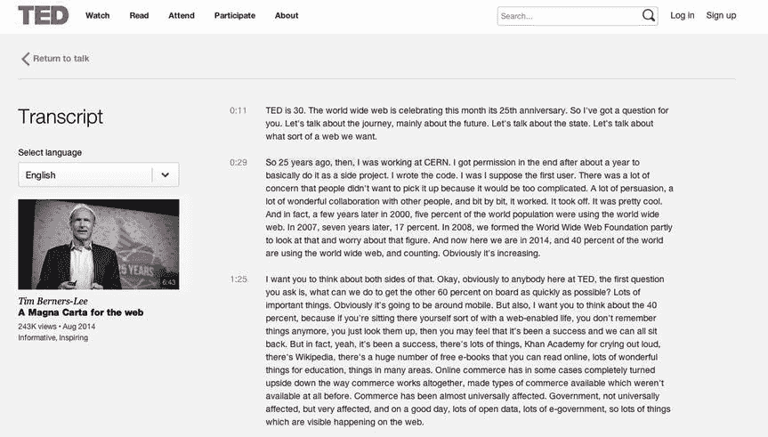

图 4-1 。一个提供抄本的网站是 ted.com

在下面的代码清单中，我们保留了编号方案，这样您可以很容易地从清单编号中找到`http://html5videoguide.net/`上的代码示例。例如清单 4-1a 和 4-1b 出自第四章中的例 1。

清单 4-1a 中的代码块展示了一个如何将一个普通的脚本链接到一个媒体元素的例子。

***清单 4-1a*** 。为视频元素提供普通的脚本

```html
<video poster="img/ElephantDreams.png" controls>
  <source src="video/ElephantDreams.mp4"  type="video/mp4">
  <source src="video/ElephantDreams.webm" type="video/webm">
</video>
<p>
    <a id="videoTranscript" href="ElephantDreams.html">
    Read the transcript for this video.</a>
</p>
```

在这个例子中，脚本是一个名为`ElephantDreams.html`的链接 html 文档。视频打开时，链接会出现在视频下方。这允许(听力受损的)用户阅读视频内容。清单 4-1b ，是一个非常基本的 HTML 文档。

***清单 4-1b*** 。这个脚本是一个非常基本的 HTML 文档

```html
<!DOCTYPE html>
<html lang="en">
  <head>
    <title>Media Accessibility Demo</title>
  </head>
  <body>
    <h1>
    Transcript: <a href="../media/video_elephant.ogv">Elephant’s Dream</a>
    </h1>
    <p>
      Screen text: "The orange open movie project presents"
    </p>
    <p>
      [Introductory titles are showing on the background of a water pool with
       fishes swimming and mechanical objects lying on a stone floor.]
    </p>
    <p>
      "Elephant’s Dream"
    </p>
    <p>
      Proog: At the left we can see... At the right we can see the...the
      head-snarlers. Everything is safe.
      Perfectly safe.
    </p>
    <p>
      [Two people stand on a small bridge.]
    </p>
    <p>
      Proog: Emo? Emo! Watch out!
    </p>
  </body>
</html>
```

当你在浏览器中打开文件时(见图 4-2 )，你会看到视频的 HTML 页面，页面下方有超链接。单击该链接，脚本 HTML 页面将打开。

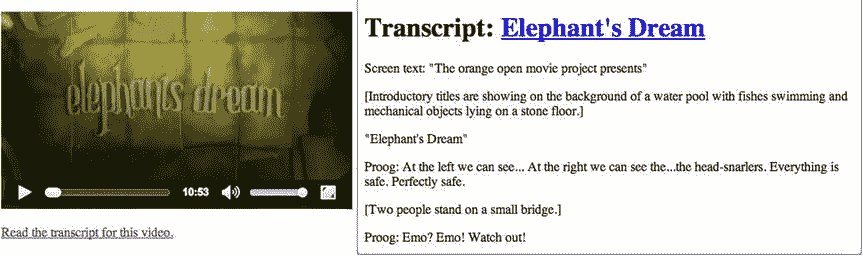

图 4-2 。普通外部抄本链接到一个视频元素

图 4-2 中显示的文字记录既有口头文本的记录，也有视频中发生的事情的记录。这是有意义的，因为抄本独立于视频，因此它必须包含视频中发生的一切。它还代表了文本描述和抄本，使其适用于被翻译成盲文的聋哑用户。

互动成绩单

在前面的例子中，脚本以一个单独的 HTML 文档的形式呈现，该文档在自己的窗口中打开。在许多方面，这是一种提供抄本的静态方法。互动抄本以一种完全不同的方式提供体验。它们不仅提供了口语文本和视频中发生的事情的转录，而且它们还随着视频的时间移动，不需要单独的窗口。

目前，还没有 HTML5 规范通过标记提供这样的交互式脚本。因此，交互性必须通过使用 JavaScript 和一系列 HTML

元素来完成，以便为屏幕阅读器保存文本提示。

在清单 4-2a 中的代码中可以看到一个示例的 HTML 标记:

***清单 4-2a*** 。HTML 提供了时间和文本

```html
<div id="videoBox">
    <video poster="img/ElephantDreams.png" controls>
      <source src="video/ElephantDreams.mp4"  type="video/mp4">
      <source src="video/ElephantDreams.webm" type="video/webm">
    </video>
</div>
<div id="speaking" aria-live="rude">
</div>
<div id="transcriptBox">
  <h4>Interactive Transcript</h4>
  <p style="font:small;">Click on text to play video from there.</p>
  <div id="transcriptText">
    <p id="c1" class="cue" data-time="0.0" aria-live="rude" tabindex="1">
      [Screen text: "The orange open movie project presents"]
    </p>
    <p id="c2" class="cue" data-time="5.0" aria-live="rude" tabindex="1">
      [Introductory titles are showing on the background of a water pool
      with fishes swimming and mechanical objects lying on a stone floor.]
    </p>
    <p id="c3" class="cue" data-time="12.0" aria-live="rude" tabindex="1">
      [Screen text: "Elephant’s Dream"]
    </p>
    <p id="c4" class="cue" data-time="15.0" tabindex="1">
      Proog: At the left we can see...  At the right we can see the... the
      head-snarlers.
      Everything is safe. Perfectly safe. Emo? Emo!
    </p>
...
</div>
</div>
```

在<video>元素旁边，我们提供了一个 id 为`speaking`的</video>

元素。为该元素提供了屏幕阅读器应该读出的文本提示。为此，它有一个`@aria-live`属性，告诉 screenreader 一旦发生变化，就读出元素中已经发生变化的任何文本。这为视力受损的用户提供了一种简单的呈现文本描述的方法。

接下来，我们提供一个名为`transcriptBox`的可滚动的

来显示脚本。`transcriptBox`中的每个提示都有一个`@data-time`属性，其中包含它的开始时间和一个`@tabindex`，允许视力有障碍的用户通过按 Tab 键来导航。一个提示隐含地以下一个提示结束。

图 4-3 显示了我们想要达到的结果。

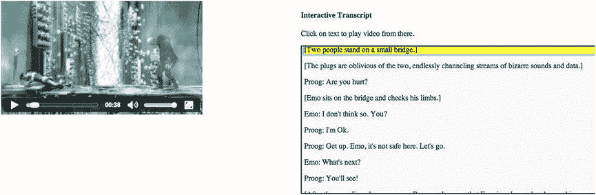

图 4-3 。视频元素的交互式脚本

创建交互性并呈现文本描述的 JavaScript 如清单 4-2b 所示。

***清单 4-2b*** 。JavaScript 为脚本提供了交互性

```html
window.onload = function() {
  // get video element
  var video = document.getElementsByTagName("video")[0];
  var transcript = document.getElementById("transcriptBox");
  var trans_text = document.getElementById("transcriptText");
  var speaking = document.getElementById("speaking");
  var current = -1;

  // register events for the clicks on the text
  var cues = document.getElementsByClassName("cue");
  for (var i=0; i<cues.length; i++) {
    cues[i].addEventListener("click", function(evt) {
      var start = parseFloat(this.getAttribute("data-time"));
      video.currentTime = start;
      video.play();
    }, false);
  }

  // pause video as you mouse over transcript
  transcript.addEventListener("mouseover", function(evt) {
    video.pause();
  }, false);

  // scroll to text as video time changes
  video.addEventListener("timeupdate", function(evt) {
    if (video.paused || video.ended) {
      return;
    }
    // scroll to currently playing time offset
    for (var i=0; i<cues.length; i++) {
      var cueTime = cues[i].getAttribute("data-time");
      if (cues[i].className.indexOf("current") == -1 &&
          video.currentTime >= parseFloat(cueTime) &&
          video.currentTime < parseFloat(cueTime)) {
        trans_text.scrollTop =
          cues[i].offsetTop - trans_text.offsetTop;
        if (current >= 0) {
            cues[current].classList.remove("current");
        }
        cues[i].className += " current";
        current = i;
        if (cues[i].getAttribute("aria-live") == "rude") {
          speaking.innerHTML = cues[i].innerHTML;
        }
      }
    }
  }, false);
};
```

如您所见，JavaScript 处理以下函数:

*   在提示上注册一个`onclick`事件处理程序，这样就可以使用它们在视频中导航。
*   在转录框上注册一个`onmouseover`事件处理程序，这样当您将鼠标移动到转录框中进行导航时，视频就会暂停。
*   在视频上注册一个`ontimeupdate`事件处理程序，它检查文本的滚动位置并根据需要向上滚动，在当前活动的提示上设置背景颜色，还检查提示的`@aria-live`属性的值，这样，如果视频中没有朗读，屏幕阅读器就会读出相应的内容。

此处设计的元素适用于视力和听力受损的用户。当您单击视频上的播放按钮时，视频会正常播放，并且作为交互式脚本一部分的字幕文本会显示在右侧的滚动显示中，突出显示当前提示。如果启用了 screenreader，脚本中标记有`@aria-live`属性的标记将被复制到 screenreader 中，以便在适当的时候读出。点击一段文字，视频就会移动到播放的那个位置。

<track>元素:字幕、标题和文本描述

现在你已经知道如何将脚本包含在你的视频项目中，让我们将注意力转向标题、副标题和描述，它们通常是与你的网页分开创作的。因此，HTML5 引入了特殊的标记和 API(应用编程接口)来自动将这些外部文件与视频的时间轴同步。

在这一节中，我们主要关注<track>元素及其 API。它们已经被引入到 HTML 中，并允许您将基于时间的文本文件与媒体资源相关联。这个文本文件——通常是一个 *WebVTT 或* `.vtt`文件——可以以多种方式使用，包括添加媒体内容的字幕、标题和文本描述。

 **注意**值得一提的是，浏览器在< track >元素中可能还支持其他文件格式。比如 IE10 既支持 WebVTT，又支持 TTMLT5(定时文本标记语言)。字幕行业经常使用 TTML 在创作系统之间交换字幕，见`www.w3.org/TR/ttml1/`。我们不会在这里更详细地讨论 TTML，因为它只在 IE 中受支持，其他浏览器已经明确表示他们对实现对它的支持不感兴趣。

WebVTT 是一个新标准，所有实现<`track>`元素的浏览器都支持它。WebVTT 提供了一种简单的、可扩展的、人类可读的格式来构建文本轨道。

在下一节中，我们将深入探讨 WebVTT 格式的特性细节。然而，要使用<track>元素，您需要使用一个基本的`.vtt`文件。如果您不熟悉这种格式，基本的理解是有帮助的。WebVTT 文件是 UTF-8 文本文件，仅由“WEBVTT”文件标识符和一系列所谓的*提示*组成，包含开始和结束时间以及一些提示文本。提示之间需要用空行隔开。例如，一个简单的 WebVTT 文件应该是

```html
WEBVTT

00:00:15.000 --> 00:00:17.951
At the left we can see...

00:00:18.166 --> 00:00:20.083
At the right we can see the...
```

第一行——web vtt——必须全部用大写字母，浏览器用它来检查它是否真的是一个`.vtt`文件。IE10 实际上要求这个头文件是“WEBVTT 文件”,因为其他浏览器忽略了额外的文本，所以你最好总是用这个标识符来创作文件。

提示中的时间标记提供了提示的持续时间，表示为*小时:分钟:秒 mms* ，提示文本是屏幕上显示的文本。在这种情况下，从视频播放时间线的 15 秒到 17.951 秒，将会看到左侧的“??”字样……“??”。任何创建纯文本文件的文字处理器或编辑器都可以用来创建一个`.vtt`文件。

 **注** WebVTT 是以前叫 WebSRT 的现代版。对于那些在 SRT 已经有字幕项目的人来说，你会发现 VTT 采取了非常相似的方式。在`https://atelier.u-sub.net/srt2vtt/`有一个简单的转换器。

随着`.vtt`文件的创建，它需要被绑定到<track>元素。该元素放在

<audio>或<video>元素中，并引用外部时间同步的文本资源——一个</video></audio>

`.vtt`文件——与

<audio>或<video>元素的时间线对齐。在<video>元素中，标题和字幕呈现在视频视窗的顶部。因为

<audio>元素没有视窗，所以作为

<audio>元素的子元素的<track>元素不会被渲染，只对脚本可用。</audio>

??</audio>

??</video></video></audio>

 **注意** IE10 要求`.vtt`文件服务的 mime 类型为“text/vtt”；否则它会忽略它们。因此，确保您的 Web 服务器有这样的配置(例如，对于 Apache，您需要将它添加到`mime.types`文件中)。在浏览器页面检查器中，您可以检查 Web 浏览器为一个`.vtt`文件下载的“内容类型”HTTP 头，以确认您的服务器提供了正确的 mime 类型。

让我们看看<track>元素的内容属性。

@src

自然，这个属性引用了一个外部文本轨道文件。清单 4-3 是一个引用 WebVTT 文件的 track 元素的简单代码示例。

***清单 4-3*** 。带有. vtt 文件的<轨道>标记示例

```html
<video controls poster="img/ElephantDreams.png">
  <source src="video/ElephantDreams.mp4"  type="video/mp4">
  <source src="video/ElephantDreams.webm" type="video/webm">
  <track src="tracks/ElephantDreams_en.vtt">
</video>
```

`@src`属性仅创建对外部文本轨道文件的引用。它不会激活它，但它允许浏览器向用户提供一个引用曲目的列表。这通常通过视频控件中的菜单显示。

 **注意**如果你和我们一起工作，在网络服务器上而不是本地运行<赛道>例子是很重要的。从文件 URL 加载的文档在基于 blink 的浏览器中有特殊的安全限制，以阻止您可能保存到桌面的恶意脚本做坏事。对于 Chrome，你也可以用这样的命令行标志来运行它，以避免这个问题:`chrome --disable-web-security`。

图 4-4 显示了 Safari(左)和 Google Chrome(右)中清单 4-3 的结果显示。

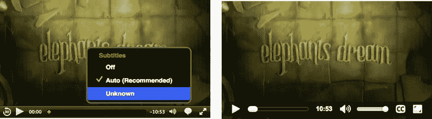

图 4-4 。Safari 和 Google Chrome 中带有 track 子元素的视频元素

Safari ，如图 4-4 左侧所示，在视频控件上的语音气泡后面有一个菜单。你可以通过点击语音气泡来激活菜单。我们定义的曲目在菜单中被列为“未知”。通过点击激活该轨道，你可以观看渲染字幕。

谷歌 Chrome ，在右边，显示了一个“CC”按钮，通过它你可以激活标题和字幕。如果你点击那个按钮并观看视频，你将能够看到从呈现在视频顶部的`.vtt`文件加载的字幕。

Opera 看起来和谷歌 Chrome 一模一样。在 Firefox 中，还没有字幕激活按钮。接下来我们将解释如何通过标记激活字幕。或者，您也可以通过 JavaScript 来完成，我们也将在本章的后面讨论。

Internet Explorer (见图 4-5 )是 Safari 和 Chrome 的结合。它包括 CC 按钮，当点击它时，会显示曲目的名称。点击名字，字幕就呈现出来了。

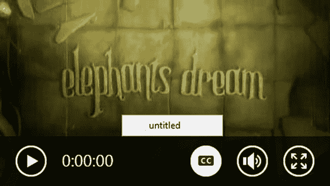

图 4-5 。Internet Explorer 中带有跟踪子元素的视频元素

 **注意**你可能已经注意到 Safari 和 Internet Explorer 为文本轨道提供了最有用的视觉激活和选择机制:从视频控件激活的菜单。所有的浏览器都打算实现这个特性，但是并不是所有的浏览器都达到了那个状态。谷歌 Chrome 和 Opera 目前只显示一个“CC”按钮，它可以激活最合适的字幕轨道(例如，如果你的浏览器语言设置为英语，则为英语)。

@默认

下一个属性——`@default`——允许网页作者选择一个文本轨道，并在默认情况下将其标记为激活。这是一个布尔属性，意味着默认值与布尔真值相同。在这里，清单 4-4 提供了一个例子:

***清单 4-4*** 。带有. vtt 文件的<跟踪>标记示例，使用@default 激活

```html
<video controls poster="img/ElephantDreams.png">
  <source src="video/ElephantDreams.mp4"  type="video/mp4">
  <source src="video/ElephantDreams.webm" type="video/webm">
  <track src="tracks/ElephantDreams_en.vtt" default>
</video>
```

你可以在图 4-6 中看到左边 Opera 中的“CC”按钮和右边 Safari 中的菜单选择是如何自动开启的。谷歌 Chrome 和 Opera 一样，自动开启“抄送”按钮。

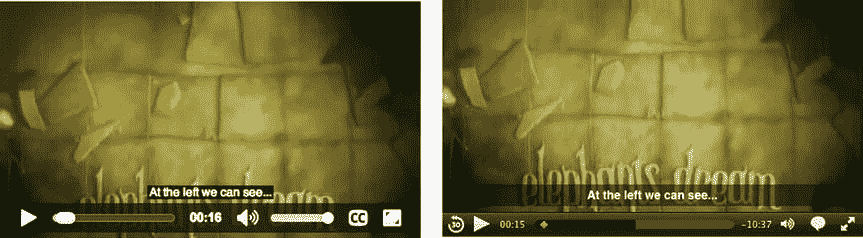

图 4-6 。Opera(左)和 Safari(右)中带有@default 激活轨道子元素的视频元素

现在，您也可以在 Firefox 中回放视频，并看到字幕显示，这与上一个示例中的结果不同。通过使用`@default`属性，包含在`.vtt`文件中的如图图 4-7 所示的字幕被激活。请注意，如果用户将光标放在视频底部，字幕将被视频控件隐藏。

如图 4-7 所示，Internet Explorer 不仅会激活字幕，还会显示正在播放的默认曲目。它目前被称为“无标题”，所以我们需要给它一个合适的名字。

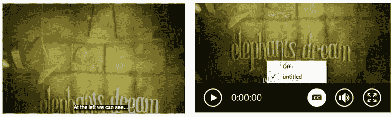

图 4-7 。Firefox 和 Internet Explorer 中带有@default 激活轨道子元素的视频元素

@标签

我们刚刚了解到，在曲目选择菜单中，没有命名的曲目会被随机标记为“未知”或“未命名”。我们可以通过提供一个显式的`@label`属性来解决这个问题。

清单 4-5 提供了一个例子。

***清单 4-5*** 。带有. vtt 文件和@标签的<轨道>标记示例

```html
<video controls poster="img/ElephantDreams.png">
  <source src="video/ElephantDreams.mp4"  type="video/mp4">
  <source src="video/ElephantDreams.webm" type="video/webm">
  <track src="tracks/ElephantDreams_en.vtt" default label="English">
</video>
```

图 4-8 显示了标签在 Safari 中的呈现方式。“英语”比“未知”明显得多，也容易理解得多。

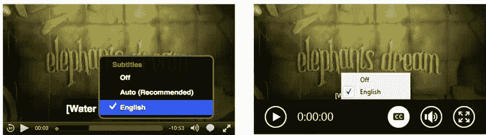

图 4-8 。在 Safari 中使用@label 命名 track 子元素的视频元素(左)和 Internet Explorer(右)

@srclang

现在音轨已经有了标签，用户可以知道这是一首英文音轨。这是不应该对浏览器隐藏的重要信息。如果我们让浏览器知道我们正在处理一个英语音轨，那么当用户开始观看带有他们喜欢的语言字幕的视频时，浏览器可以决定自动激活这个音轨:“英语。”浏览器从浏览器或操作系统的设置中检索这样的用户偏好。为了使浏览器能够根据用户的喜好选择正确的曲目，我们有了`@srclang`属性，它被赋予了一个根据 BCP47 的 IETF(互联网工程任务组)语言代码，以区分不同的曲目。

 **注意**浏览器还没有扩展他们的浏览器偏好来包括关于激活文本轨道的偏好设置。然而，一些浏览器使用平台设置来处理这个问题，特别是 Safari。

还要注意，在`@srclang`中提供关于音轨资源语言的信息还有其他有效的用途(例如，Google 索引或自动翻译)。

清单 4-6 展示了一个如何使用`@srclang`的例子。

***清单 4-6*** 。带有. vtt 文件和@标签的<轨道>标记示例

```html
<video controls poster="img/ElephantDreams.png">
  <source src="video/ElephantDreams.mp4"  type="video/mp4">
  <source src="video/ElephantDreams.webm" type="video/webm">
  <track src="tracks/ElephantDreams_en.vtt" srclang="en">
</video>
```

清单 4-6 中的一个重要方面是它不包含`@label`或`@default`属性。唯一的属性是`@srclang`。当在 Safari 中渲染时，如图 4-9 所示，该音轨在菜单中仍标记为“英语”。该图还显示了标题的本地 OSX 辅助功能首选项设置。在这种情况下，字幕在 Safari 中显示为大文本，此选项还会打开“自动(推荐)”轨道选择，进而激活英文轨道。

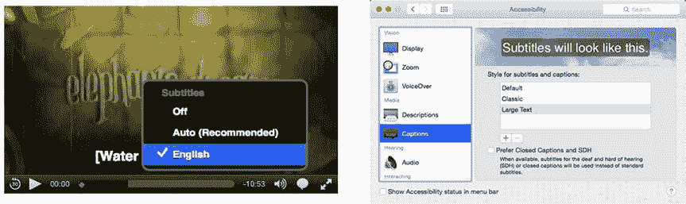

图 4-9 。具有@srclang 属性的视频元素和平台上的默认激活

@善良

`@kind`属性 指定您正在处理的文本轨道的类型和可用的`@kind`属性值。这些值是:

*   **字幕** **:** 对白的转录或翻译，适用于声音可用但听不懂的情况(如用户听不懂媒体资源的配乐语言)。这样的轨道适合于国际化的目的。
*   **字幕** **:** 对话、声音效果、相关音乐提示和其他相关音频信息的转录或翻译，适用于当音轨不可用时(例如，对话被静音、被环境噪声淹没或因为用户是聋子)。这样的音轨适合听力不好的用户。
*   **描述:**媒体资源的视频组件的文本描述，当可视组件模糊、不可用或不可用时(例如，用户正在与应用交互，因为用户是盲人)，这对于音频合成是有用的。合成为音频。这种轨道适合视力受损的用户。
*   **章节:**章节标题用于导航媒体资源。此类曲目在浏览器界面中显示为交互式(潜在嵌套)列表。
*   **元数据** **:** 用于 JavaScript 的音轨。浏览器不会渲染这些轨道。

如果没有指定`@kind`属性，该值默认为“字幕”，这是我们在前面的例子中经历过的。

如果被激活，标记为*字幕*或*字幕*的轨道将在视频视窗中呈现。在任一时间点只能激活一个字幕或副标题轨道。这也意味着这些轨道中只有一个应该使用`@default`属性创作——否则浏览器不知道默认激活哪个。

标记为*描述*的曲目，如果被激活，将会把它们的提示合成为音频——可能通过屏幕阅读器 API。由于屏幕阅读器也是盲文设备的中介，这足以使视力受损的用户可以访问描述。任何时候只能有一个*描述*轨道处于活动状态。

 **注意**在撰写本文时，没有浏览器支持这样的描述“渲染”。然而，有两个 Chrome 扩展来呈现描述:一个使用 Chrome 的文本到语音 API ( `https://chrome.google.com/webstore/detail/html5-audio-description-v/jafenodgdcelmajjnbcchlfjomlkaifp`)，另一个使用屏幕阅读器(如果安装了的话):(`https://chrome.google.com/webstore/detail/html5-audio-description-v/mipjggdmdaagfmpnomakdcgchdcgfbdg`)。

标记为*章节*的曲目用于导航目的。预计该功能将通过媒体控件时间线上的菜单或其他形式的导航标记在浏览器中实现。到目前为止，还没有浏览器本身支持章节渲染。

最后，标记为*元数据*的轨道将不会被可视化渲染，而只会暴露给 JavaScript。web 开发人员可以用这些元数据做任何事情，这些元数据可以由 web 页面脚本可以解码的任何文本组成。这包括 JSON、XML 或任何其他特殊用途的标记，以及提供用于导航的视频缩略图或带有超链接的字幕(如广告中使用的那些)的图像 URL。

清单 4-7 是包含这些轨道类型的代码示例。

***清单 4-7*** 。带有每种类型轨道的<轨道>标记示例

```html
<video controls poster="img/ElephantDreams.png">
  <source src="video/ElephantDreams.mp4"  type="video/mp4">
         <source src="video/ElephantDreams.webm" type="video/webm">
        <track src="tracks/ElephantDreams_zh.vtt" srclang="zh" kind="subtitles">
        <track src="tracks/ElephantDreams_jp.vtt" srclang="ja" kind="captions">
        <track src="tracks/ElephantDreams_en.vtt"
                   srclang="en" kind="metadata" label="Metadata">
        <track src="tracks/ElephantDreams_chapters_en.vtt"
                   srclang="en" kind="chapters"  label="Chapters">
        <track src="tracks/ElephantDreams_audesc_en.vtt"
                   srclang="en" kind="descriptions" label="Descriptions">
       </video>
```

该示例包含以下内容:

*   中文字幕:`srclang="zh" kind="subtitles"`
*   日语字幕:`srclang="ja" kind="captions"`
*   英文元数据:`srclang="en" kind="metadata" label="Metadata"`
*   英文章节:`srclang="en" kind="chapters" label="Chapters"`
*   英文描述:`srclang="en" kind="descriptions" label="Descriptions"`

当在 Safari 中查看时(参见图 4-10 )，所有的轨迹都是暴露的。选择任何章节、描述或元数据轨道都不会导致任何渲染。令人惊讶的是，Safari 甚至将它们列在了菜单中。

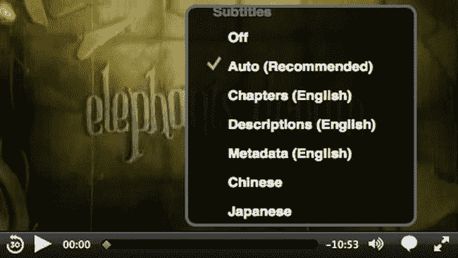

图 4-10 。Safari 中的视频元素,带有多个不同@种类的轨道

选择日语字幕轨道后，我们可以看到(图 4-11)UTF-8 编码的字符正确地呈现在视频视窗的顶部。


图 4-11 。带有日文字幕轨道的视频元素被激活

尽管浏览器在实现控制文本轨道的按钮和菜单方面有点落后，但第三方玩家已经开始利用<轨道>元素及其字幕和副标题的呈现。

例如，我们在第三章的中探索的 JWPlayer ，支持包含在 WebVTT 文件中的“元数据”轨道中的标题、章节和缩略图。如图 4-12 中的所示，它让它们没有了多余的装饰。你可以看到章节在时间轴上用小标记呈现，当你悬停在它们上面时，你会得到该章的标题。您还可以看到，当您悬停在 JWPlayer 时间轴上时，当提供缩略图时，它们会弹出。

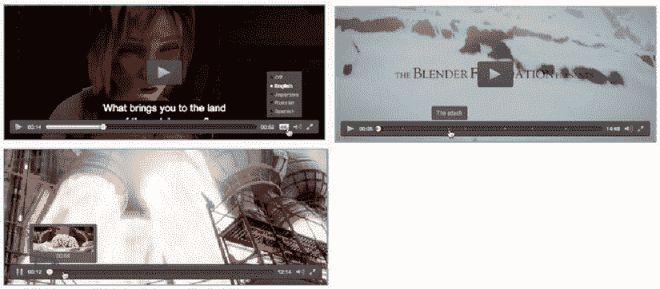

图 4-12 。JWPlayer 通过 WebVTT 呈现标题、章节轨道和预览缩略图

 **注意**用于 JWPlayer 的 WebVTT 的例子在`http://support.jwplayer.com/customer/portal/articles/1407438-adding-closed-captions`、`http://support.jwplayer.com/customer/portal/articles/1407454-adding-chapter-markers`和`http://support.jwplayer.com/customer/portal/articles/1407439-adding-preview-thumbnails`。

用于缩略图时间轴的 WebVTT 标记如下所示在清单 4-8 中:

***清单 4-8*** 。带有缩略图的“元数据”类轨道的示例 WebVTT 文件

```html
WEBVTT

00:00:00.000 --> 00:00:30.000
/path/thumb1.png

00:01:00.000 --> 00:01:30.000
/path/thumb2.png
```

缩略图是使用以下命令行 ffmpeg 命令创建的，每 30 秒创建一个:

```html
$ ffmpeg -i video.mp4 -f image2 -vf fps=fps=1/30 thumb%d.png
```

带内文本轨道

WebVTT 文件不一定要通过<track>元素进行外部链接。它们也可以直接嵌入到视频文件中。这些被称为 ***带内曲目*** 。由于`mp4`和`webm`格式是容器格式，WebVTT 文件可以直接添加到容器中，通常通过多路复用到文件中作为数据轨道。这是一项相对较新的技术，浏览器刚刚开始添加带内支持。要了解有关这种新兴技术的更多信息，我们建议您从以下网站开始:

*   WebM has a specification for storing WebVTT in-band:

    `http://wiki.webmproject.org/webm-metadata/temporal-metadata/webvtt-in-webm`

*   MPEG-4 has a specification for embedding WebVTT in-band:

    `www.w3.org/community/texttracks/2013/09/11/carriage-of-webvtt-and-ttml-in-mp4-files/`

*   MPEG DASH can deal with WebVTT:

    `http://concolato.wp.mines-telecom.fr/category/general/mpeg/dash/`

*   苹果的 HLS 也可以:`http://tools.ietf.org/html/draft-pantos-http-live-streaming-09`

目前，还没有可视化编辑器可以将 WebVTT 音轨嵌入到媒体文件中。然而，有一些命令行方法可以将这些音轨添加到一个`mp4`或`webm`文件中。

可以用 MP4Box ( `http://concolato.wp.mines-telecom.fr/2013/07/28/webvtt-mp4-files-dash-and-gpac/`)在 MPEG-4 中创作 WebVTT，用 ffmpeg 在 WebM 中创作 WebVTT。

以下是如何使用 mp4box 创建带有 WebVTT 轨道的`mp4`文件的示例:

```html
$ mp4box -add Monty_subs_en.vtt:FMT=VTT:lang=en Monty_subtitles.mp4
```

该命令将`monty_subs_en.vtt`字幕轨道添加到`Monty_subtitles.mp4`。

以下是如何使用 ffmpeg 创建带有 WebVTT 轨道的`webm`文件的示例:

```html
$ ffmpeg -i Monty.mp4 -i Monty_subs_en.vtt -metadata:s:s:0 kind="captions" \
         -scodec copy Monty_subtitles.webm
```

它告诉 ffmpeg 使用`Monty.mp4`作为输入媒体文件，告诉它使用`Monty_subs_en.vtt`作为 WebVTT 字幕复制到 WebM 文件中的输入文件，并给字幕轨道一种“字幕”

尽管这是一项相对较新的技术，HTML5 已经使带内文本轨道在 Web 浏览器中与在<track>中定义的外部轨道一样公开。这意味着不管文本轨道的来源如何，都可以使用相同的 JavaScript API。

 **注意**作为一名 Web 开发人员，您可以选择将您的 WebVTT 文件作为独立文件发布，或者使用 WebVTT 带内的视频文件。在撰写本文时，浏览器支持并不一致。考虑到这一点，我们建议使用外部文本轨道文件— `.vtt`文件—而不是带内轨道，直到浏览器一致实现带内文本轨道。

JavaScript API :网络开发者的灵活性

正如我们在第三章中指出的，JavaScript 可以用来扩展网页各种元素的功能。在这种情况下，JavaScript 可用于操纵媒体源中使用的文本轨道，无论该文本轨道是在媒体的带内还是外部。这为希望制作可访问的视频或音频内容的 web 开发人员和设计人员提供了许多创造性的可能性。在本节中，我们将回顾 JavaScript API，因为它与外部文本轨道相关。

我们从<track>元素开始。

跟踪元件

track 元素的 IDL(接口定义语言)接口如下所示:

```html
interface HTMLTrackElement : HTMLElement {
            attribute DOMString kind;
            attribute DOMString src;
            attribute DOMString srclang;
            attribute DOMString label;
            attribute boolean default;
   const unsigned short NONE = 0;
   const unsigned short LOADING = 1;
   const unsigned short LOADED = 2;
   const unsigned short ERROR = 3;
   readonly attribute unsigned short readyState;
   readonly attribute TextTrack track;
};
```

这个 IDL 是表示一个<track>元素的对象。当列出外部文本轨道时，它可用。IDL 属性`kind`、`src`、`srclang`、`label`和`default`包含与前面介绍的相同名称的内容属性的值。与 audio 和 video 元素一样，其余的 DOM 属性反映了 track 元素的当前状态。

@readyState

`@readyState` IDL 是一个只读属性，表示跟踪元素的当前就绪状态。可用状态如下:

*   `NONE(0)`:表示没有获得文本轨迹的提示。
*   `LOADING(1)`:表示文本音轨正在加载，目前为止没有遇到致命错误。解析器仍然可以将进一步的线索添加到音轨中。
*   `LOADED(2)`:表示文本轨道已加载，没有致命错误。
*   `ERROR(3)`:表示文本轨道已启用，但当用户代理尝试获取文本轨道时，由于某种原因失败(例如，无法解析 URL、网络错误和未知的文本轨道格式)。一些或所有提示可能会丢失，并且将不会被获得。

当获得轨道时，文本轨道的就绪状态动态地改变。

作为一名 JavaScript 开发人员，确保所有预期要加载的文本轨道都实际加载了并且没有导致`ERROR`是很有用的。如果您正在显示您自己的可用字幕轨道菜单，这一点尤其重要，因为您可能只想显示轨道以供选择，如果它们实际上可以加载的话。

@曲目

如前所述，带内文本轨道和外部<track>参考文本轨道创建的对象是相同的。它们是 *TextTrack* 对象的实例。该属性链接到相应的<轨道>元素的 TextTrack 对象。

 **注意**在接下来的例子中，我们将使用蒙蒂·蒙特格美里的名为“极客数字媒体入门”的视频摘录(根据知识共享署名非商业性类似共享许可证发布；`http://xiph.org/video/vid1.shtml`见`)。我们感谢 Xiph.org 基金会提供了这段视频——完整的视频和系列中的其他视频都非常值得一看。`

 `为了更好地了解 track 元素的 IDL 中的属性是如何协同工作的，清单 4-9 显示了加载时一个 Track 元素的所有 IDL 属性的值，然后在回放开始后显示`readyState`。

***清单 4-9*** 。<轨道>元素的 IDL 属性

```html
<video poster="img/Monty.jpg" controls width="50%">
  <source src="video/Monty.mp4"  type="video/mp4">
  <source src="video/Monty.webm" type="video/webm">

  <track label="English" src="tracks/Monty_subs_en.vtt" kind="subtitles"
         srclang="en" default>
</video>
<h3>Attribute values:</h3>
<p id="values"></p>
<script>
var video = document.getElementsByTagName(’video’)[0];
var track = document.getElementsByTagName(’track’)[0];
var values = document.getElementById(’values’);
values.innerHTML += "Kind: " + track.kind + "<br/>";
values.innerHTML += "Src: " + track.src + "<br/>";
values.innerHTML += "Srclang: " + track.srclang + "<br/>";
values.innerHTML += "Label: " + track.label + "<br/>";
values.innerHTML += "Default: " + track.default + "<br/>";
values.innerHTML += "ReadyState: " + track.readyState + "<br/>";
values.innerHTML += "Track: " + track.track + "<br/>";

function loaded() {
    values.innerHTML += "ReadyState: " + track.readyState + "<br/>";
}
video.addEventListener("loadedmetadata", loaded, false);
</script>
```

图 4-13 显示了 Firefox 的结果。


图 4-13 。默认激活的<轨道>元素的 IDL 属性

所有关于<track>元素属性值的信息，包括`kind`、`src`、`srclang`、`label`和`defaul` t。你也可以看到`readyState`起初是`LOADING(1)`，当视频开始播放时，它变成了`LOADED(2)`。

在讨论 track 属性的内容之前，让我们简单地列出可能在<track>元素上触发的事件。

装载

当浏览器成功加载`@src`属性中引用的资源时，在`HTMLTrackElement`处触发一个`onload`事件—`readyState`随后也变为`LOADED(2)`。

不良事件

当`@src`属性中引用的资源加载失败时，在`HTMLTrackElement`处触发`onerror`事件。然后`readyState`也变成了`ERROR(3)`。

oncuechange

当该轨道中的提示变为活动或停止活动时，在`HTMLTrackElement`触发一个`oncuechange`事件。

清单 4-10 是捕捉这些事件的代码块的一个很好的例子。

***清单 4-10*** 。捕捉<轨道>元素上的事件

```html
<video poster="img/Monty.jpg" controls width="50%" autoplay>
  <source src="video/Monty.mp4"  type="video/mp4">
  <source src="video/Monty.webm" type="video/webm">

  <track label="Australian" src="tracks/Monty_subs_au.vtt" kind="subtitles"
         srclang="en-au" default>
  <track label="English" src="tracks/Monty_subs_en.vtt" kind="subtitles"
         srclang="en">
</video>
<h3>Events:</h3>
<p id="values"></p>
<script>
var video = document.getElementsByTagName(’video’)[0];
var tracks = document.getElementsByTagName(’track’);
var values = document.getElementById(’values’);

function trackloaded(evt) {
    values.innerHTML += "Track loaded: " + evt.target.label
                     + " track<br/>";
}
function trackerror(evt) {
    values.innerHTML += "Track error: " + evt.target.label + " track<br/>";
    tracks[1].track.mode = "showing";
}
function cuechange(evt) {
    values.innerHTML += "Cue change: " + evt.target.label + " track<br/>";
    video.pause();
}
for (var i=0; i < tracks.length; i++) {
    tracks[i].onload = trackloaded;
    tracks[i].onerror = trackerror;
    tracks[i].oncuechange = cuechange;
}
</script>
```

我们特意定义并由`@default`激活了第一个文本轨道，它的`@src`资源`Monty_subs_au.vtt`并不存在。结果是触发了提及澳大利亚轨道的第一个错误事件。在错误事件回调中，我们激活了第二个轨道——`Monty_subs_en.vtt`——这反过来又激活了加载回调。然后，当视频播放到达第一个提示时，`cuechange`事件被激活并暂停视频。

在 Google Chrome 中运行这个程序会得到如图 4-14 所示的结果。

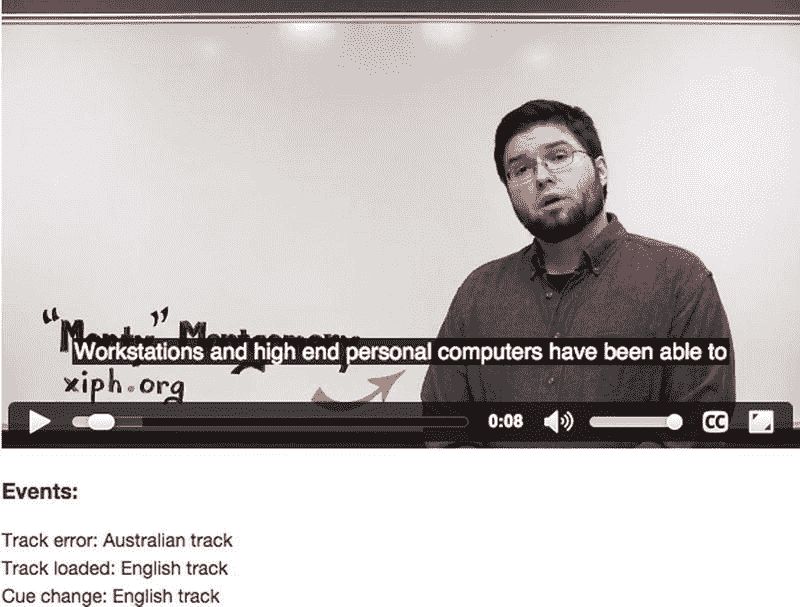

图 4-14 。在<轨道>元素上捕捉事件

 **注意**这些事件在浏览器中的实现存在 bug。例如，Firefox 似乎不会引发`load`和`cuechange`事件，Safari 也不会引发`cuechange`事件。

既然我们理解了可以在`HTMLTrackElement`触发的事件，我们可以将注意力转向`@track`属性的内容，它是一个`TextTrack`对象。

TextTrack 对象

为与媒体元素相关联的每个文本轨道创建一个`TextTrack`对象。不管是否存在以下情况，都会创建此对象

*   它通过<track>元素来自外部文件，
*   它来自媒体资源的带内文本轨道；或者
*   它完全是用 JavaScript 通过`HTMLMediaElement`的`addTextTrack()`方法创建的，我们将在本章后面讲到。

因此，`TextTrack`对象的属性值来源于`HTMLTrackElement`的属性值、带内值(参见`http://dev.w3.org/html5/html-sourcing-inband-tracks/`)或`addTextTrack()`方法的参数。

 **注意**源自<track>元素的`TextTrack`对象链接自 `HTMLTrackElement`对象和媒体元素的`TextTrackList`，后者是<track>元素的子元素。带内轨道和脚本创建的轨道仅存在于媒体元素的 `TextTrackList`中。

`TextTrack`对象的 IDL 如下所示:

```html
enum TextTrackMode { "disabled",  "hidden",  "showing" };
enum TextTrackKind { "subtitles",  "captions",  "descriptions",  "chapters",  "metadata" };

interface TextTrack : EventTarget {
   readonly attribute TextTrackKind kind;
   readonly attribute DOMString label;
   readonly attribute DOMString language;
   readonly attribute DOMString id;
   readonly attribute DOMString inBandMetadataTrackDispatchType;
            attribute TextTrackMode mode;
   readonly attribute TextTrackCueList? cues;
   readonly attribute TextTrackCueList? activeCues;
   void addCue(TextTrackCue cue);
   void removeCue(TextTrackCue cue);
            attribute EventHandler oncuechange;
};
```

前四个属性如下:

*   `@kind`属性被`TextTrackKind`对象限制为合法值，我们在前面的<track>元素中已经了解到了。
*   `@label`属性包含由<track>元素的 `@label`属性、带内轨道的字段或`HTMLMediaElement`的`addTextTrack()`方法的标签参数提供的标签字符串。
*   `@language`属性包含由<track>元素的 `@srclang`属性、带内轨道的字段或`HTMLMediaElement`的`addTextTrack()`方法的语言参数提供的语言字符串。
*   `@id` 属性包含从<轨道>元素的`@id`属性(每个元素都有这样的属性)或从带内轨道的标识符字段提供的标识符字符串。

IDL 中的其余属性需要更多的解释。

@磁带中继资料 track dispatch type

这是从媒体资源中提取的字符串，专门用于`@kind`“元数据”的文本轨道这个字符串解释了提示中数据的确切格式，因此可以设置足够的 JavaScript 函数来解析和显示这些数据。

例如，具有特定内容格式的文本轨道可以包含用于广告定位的元数据、游戏节目期间的琐事游戏数据、体育游戏期间的游戏状态或烹饪节目期间的食谱信息。因此，专用脚本模块可以使用该属性的值绑定到解析这样的轨道。

如何识别数据格式在`http://dev.w3.org/html5/html-sourcing-inband-tracks/`中规定。由于该属性对于特定类型的应用来说是非常特定的，并且对可访问性的影响可以忽略不计，因此对该属性的进一步讨论超出了本书的范围。

@模式

根据`TextTrackMode`类型的定义，`TextTrack`对象可以有三种不同的模式。

*   ***禁用*** **:** 表示文本轨道未激活。在这种情况下，浏览器已经识别出了一个<轨道>元素的存在，但是它还没有下载外部轨道文件或者解析它。没有激活的提示，也没有触发事件。<轨道>-默认情况下未激活的已定义文本轨道最初以此状态结束。
*   ***隐藏*** **:** 表示文本轨迹的线索已经或者应该被获取，但是没有被显示。浏览器维护着一个列表，其中列出了哪些提示是活动的，并相应地触发事件。带内文本轨道和 JavaScript 创建的文本轨道最初都处于这种状态。
*   ***显示*** **:** 表示文本轨迹的提示已经或应该被获取，如果是呈现的`@kind`则正在显示。浏览器维护着一个列表，其中列出了哪些提示是活动的，哪些事件相应地被触发。<track>-用 `@default`属性激活的已定义文本轨道最初以此状态结束。

@cues

一旦`TextTrack`被激活(即模式被隐藏或显示)，这就是已加载的`TextTrackCues`列表。为了连续加载媒体文件，该列表可以随着媒体资源连续解析带内文本轨道而连续更新。

@activeCues

这是当前活动的`TextTrack`上的 T `extTrackCues`列表。活动提示是那些在当前回放位置之前开始并在回放位置之后结束的提示。

在我们继续讨论`TextTrack`对象使用的方法和事件之前，清单 4-11 给了我们一个机会来检查`<track>`元素的 IDL 属性。

***清单 4-11*** 。< track >元素的@track 属性的 IDL 属性

```html
<video poster="img/Monty.jpg" controls width="50%">
  <source src="video/Monty.mp4"  type="video/mp4">
  <source src="video/Monty.webm" type="video/webm">

  <track id="track1" label="English" src="tracks/Monty_subs_en.vtt"
         kind="subtitles" srclang="en" default>
</video>
<h3>TextTrack object:</h3>
<p id="values"><b>Before loading:</b><br/></p>
<script>
var video = document.getElementsByTagName(’video’)[0];
var track = document.getElementsByTagName(’track’)[0];
var values = document.getElementById(’values’);
values.innerHTML += JSON.stringify(track.track, undefined, 4) + "<br/>";
values.innerHTML += "track.cues length: " + track.track.cues.length
                    + "<br/>";

function loaded() {
    values.innerHTML += "<b>After loading:</b><br/>";
    values.innerHTML += "track.cues[0]: " + track.track.cues[0] + "<br/>";
    values.innerHTML += "track.cues length: " + track.track.cues.length;
}
video.addEventListener("loadeddata", loaded, false);
</script>
```

图 4-15 显示了<track>元素加载前`@track`属性中`TextTrack`对象的值，以及在 Google Chrome 中加载后的提示数。您会看到 `@cues`的长度是 0(因为“cues”在加载前为空，而在加载后为 51)。

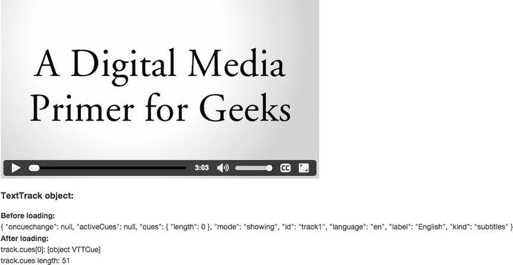

图 4-15 。Opera 中显示的< track >元素的@track 属性的 IDL 属性值

Firefox 实际上并没有那么早创建`TextTrack`对象，这意味着`@track`属性在加载之前仍然是一个空对象，但是它始终报告提示的数量。

add()t 0]

该方法将一个`TextTrackCue`对象添加到文本轨道的提示列表中。这意味着对象被添加到`@cues`，并且如果媒体元素的当前时间在该提示的时间间隔内，还被添加到`@activeCues`。注意，如果给定的提示已经在另一个提示的文本轨道列表中，那么在它被添加到这个提示之前，它被从那个提示的文本轨道列表中移除。

removeCue( )

该方法从文本轨道的提示列表中删除一个`TextTrackCue`对象。

onCueChange 事件

当轨道中的一个或多个提示变为活动或停止活动时，引发`cueChange`事件。

清单 4-12 提供了一个在<track>元素的`TextTrack`上应用`addCue()`和`removeCue()`方法并捕获结果 `cuechange`事件的 JavaScript 示例。

***清单 4-12*** 。< track >元素的@track 属性的方法和事件

```html
var video = document.getElementsByTagName(’video’)[0];
var track = document.getElementsByTagName(’track’)[0];
var values = document.getElementById(’values’);

function loaded() {
    var cue = new VTTCue(0.00, 5.00, "This is a script created cue.");
    values.innerHTML += "Number of cues: " + track.track.cues.length
                     + "<br/>";
    values.innerHTML += "<b>After adding cue:</b><br/>"
    track.track.addCue(cue);
    values.innerHTML += "Number of cues: " + track.track.cues.length
                     + "<br/>";
}
video.addEventListener("loadedmetadata", loaded, false);

function playing() {
    values.innerHTML += "<b>After play start:</b><br/>"
    values.innerHTML += "Number of cues: " + track.track.cues.length
                     + "<br/>";
    values.innerHTML += "First cue: "
                     + JSON.stringify(track.track.cues[0].text) + "<br/>";
    function cuechanged() {
        track.track.removeCue(track.track.cues[1]);
        values.innerHTML += "<b>After removing cue:</b><br/>"
        values.innerHTML += "Number of cues: " + track.track.cues.length
                         + "<br/>";
        video.pause();
    }
    track.track.addEventListener("cuechange", cuechanged, false);
}
video.addEventListener("play", playing, false);
```

加载视频后，我们创建一个 vtt cue—`new VTTCue`—它是一种`TextTrackCue`。我们从 51 个线索开始，到 52 个结束。开始回放后，我们加载了所有的 52 个线索，然后注册了一个`cuechange`事件，在这个事件中，线索 1 被删除，返回到 51 个线索。图 4-16 显示了谷歌浏览器中的结果。还要注意，第一个提示是 52 个提示列表中的脚本创建的提示。

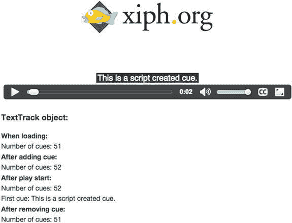

图 4-16 。TextTrack 对象的方法和事件

 **注意**这个例子在 Firefox 中不能正常工作，因为 Firefox 还不支持`TextTrack`对象上的`oncuechange`事件。

TextTrackCue

`TextTrack` IDL 的`@cues`和`@activeCues`属性中的提示具有以下格式:

```html
interface TextTrackCue : EventTarget {
   readonly attribute TextTrack? track;
            attribute DOMString id;
            attribute double startTime;
            attribute double endTime;
            attribute boolean pauseOnExit;
            attribute EventHandler onenter;
            attribute EventHandler onexit;
};
```

这些是球杆的基本属性。特定的提示格式如`VTTCue`可以进一步扩展这些属性。这里快速回顾一下`TextTrackCue`的属性。

@曲目

这是该提示所属的`TextTrack`对象，如果有的话，否则为`null`。

@id

这是提示的识别字符串。

@ start time、@endTime

这些是提示的开始和结束时间。它们与媒体元素的回放时间相关，并定义提示的活动时间范围。

@ pause exit

`@pauseOnExit` 标志是一个布尔值，它指示当到达提示的活动时间范围的末尾时是否暂停媒体资源的回放。例如，它可以用于在到达提示的末尾时暂停视频，以便引入广告。

onenter 和 onexit 事件

当提示变为活动状态时引发`enter`事件，当提示停止活动时引发`exit`事件。

文本跟踪列表

`TextTrack` IDL 的`@cues`和`@activeCues`属性是以下格式的`TextTrackCueList`对象:

```html
interface TextTrackCueList {
   readonly attribute unsigned long length;
   getter TextTrackCue (unsigned long index);
   TextTrackCue? getCueById(DOMString id);
};
```

`@length`返回列表的长度。

getter 使得通过索引(例如，`cues[i]`)访问提示列表元素成为可能。

`getCueById()`函数允许通过提供 id 字符串来检索一个`TextTrackCue`。

清单 4-13 展示了如何浏览一个音轨的提示列表并访问提示属性。

***清单 4-13*** 。访问文本轨道的所有提示的属性

```html
<video poster="img/Monty.jpg" controls width="50%">
  <source src="video/Monty.mp4"  type="video/mp4">
  <source src="video/Monty.webm" type="video/webm">

  <track id="track1" label="English" src="tracks/Monty_subs_en.vtt"
         kind="subtitles" srclang="en" default>
</video>
<h3>TextTrack object:</h3>
<table>
    <thead>
        <tr>
            <td>Cue Number</td>
            <td>ID</td>
            <td>StartTime</td>
            <td>EndTime</td>
            <td>Text</td>
        </tr>
    </thead>
    <tbody id="values">
    </tbody>
</table>
<script>
var video = document.getElementsByTagName(’video’)[0];
var track = document.getElementsByTagName(’track’)[0];
var values = document.getElementById(’values’);
var content;

function loaded() {
    for (var i=0; i < track.track.cues.length; i++) {
        content = "<tr>";
        content += "<td>" + i + "</td>";
        content += "<td>" + track.track.cues[i].id + "</td>";
        content += "<td>" + track.track.cues[i].startTime + "</td>";
        content += "<td>" + track.track.cues[i].endTime + "</td>";
        content += "<td>" + track.track.cues[i].text + "</td></tr>";
        values.innerHTML += content;
    }
}
video.addEventListener("loadedmetadata", loaded, false);
</script>
```

当你在浏览器中测试时，如图 4-17 所示，你会发现这种技术有助于快速自省提示，以确保顺序、时间和文本拼写是正确的。

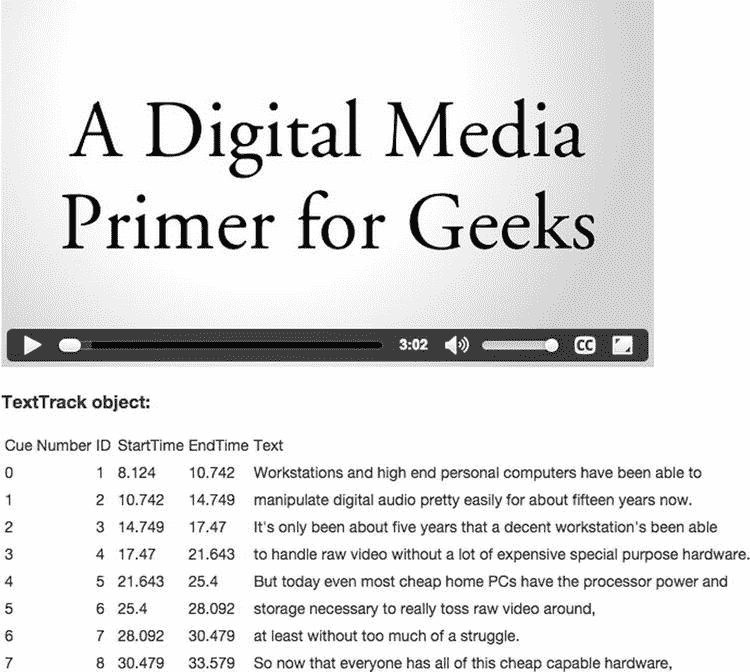

图 4-17 。列出文本轨道的所有线索

媒体元素

我们已经看到了如何访问<track>元素、它们的提示列表以及每个提示的内容。现在我们将远离<track>元素，回到媒体元素的文本轨道列表。这也包括带内文本轨道和脚本创建的轨道。

TextTrackList

首先我们需要理解`TextTrackList`对象:

```html
interface TextTrackList : EventTarget {
   readonly attribute unsigned long length;
   getter TextTrack (unsigned long index);
   TextTrack? getTrackById(DOMString id);
            attribute EventHandler onchange;
            attribute EventHandler onaddtrack;
            attribute EventHandler onremovetrack;
};
```

类似于`TextTrackCueList`对象，`TextTrackList`是一系列`TextTrack`对象。

列表的长度在`@length`属性中给出。

可以通过索引(例如`track[i]`)来访问各个轨道。

他的`getTrackById()`方法 允许通过提供一个`TextTrack`的 id 字符串来检索它。

此外，每当列表中的一个或多个曲目被启用或禁用时，将引发“change”事件，每当曲目被添加到曲目列表时，将引发`addtrack`事件，每当曲目被移除时，将引发`removetrack`事件。

为了访问与音频或视频元素相关联的所有文本轨道，使用以下属性和方法扩展了`MediaElement`的 IDL:

```html
interface HTMLMediaElement : HTMLElement {
...
  readonly attribute TextTrackList textTracks;
  TextTrack addTextTrack(TextTrackKind kind, optional DOMString label = "",
                         optional DOMString language = "");
};
```

@textTracks

媒体元素的`@textTracks`属性是一个`TextTrackLis` t 对象，它包含媒体元素可用的文本轨道列表。

addTextTrack（ ）

这个用于媒体元素的新方法 **addTextTrack (** ***种类*** ， ***标签*** ， ***语言*** **)** 用于纯粹从 JavaScript 中为具有给定种类、标签和语言属性设置的媒体元素创建新的文本轨道。新轨道，如果有效，立即在`LOADED(2) @readyState`和“隐藏的”`@mode`中，带有一个空的`@cues TextTrackCueList`。

我们之前提到过，`@textTracks`包含了与媒体元素相关联的所有轨道，不管它们是由<track>元素创建的，还是从带内文本轨道公开的，或者是由 JavaScript 通过 `addTextTrack()`方法创建的。磁道实际上总是按以下顺序访问:

1.  `<track>`创建了`TextTrack`个对象，按照它们在 DOM 中的顺序。
2.  `addTextTrack()`创建了`TextTrack`个对象，按照它们被添加的顺序，最旧的放在最前面。
3.  带内文本轨道，按照媒体资源中给定的顺序。

在清单 4-14 中，我们有一个通过<轨道>元素创建的字幕轨道和一个脚本创建的章节轨道。

***清单 4-14*** 。列出并访问视频元素的所有文本轨道

```html
<video poster="img/Monty.jpg" controls width="50%">
  <source src="video/Monty.mp4"  type="video/mp4">
  <source src="video/Monty.webm" type="video/webm">
  <track id="track1" label="English" src="tracks/Monty_subs_en.vtt"
         kind="subtitles" srclang="en" default>
</video>
<h3>TextTrack object:</h3>
<p id="values"></p>
<script>
var video = document.getElementsByTagName(’video’)[0];
var values = document.getElementById(’values’);
var new_track = video.addTextTrack("chapters", "English Chapters", "en");

var cue;
cue = new VTTCue(0.00, 7.298, "Opening Credits");
new_track.addCue(cue);
cue = new VTTCue(7.298, 204.142, "Introduction");
new_track.addCue(cue);

function loaded() {
    values.innerHTML += "Number of text tracks: "
                     + video.textTracks.length + "</br>";
    for (var i=0; i < video.textTracks.length; i++) {
        values.innerHTML += "<b>Track[" + i + "]:</b></br>";
        values.innerHTML += "Number of cues: "
                         + video.textTracks[i].cues.length + "<br/>";
        values.innerHTML += "First cue: "
                         + video.textTracks[i].cues[0].text + "<br/>";
    }
}
video.addEventListener("loadedmetadata", loaded, false);
</script>
```

视频加载完成后，我们显示文本轨道的数量，以及每个轨道的提示数量和第一个提示中的文本。图 4-18 显示了结果。

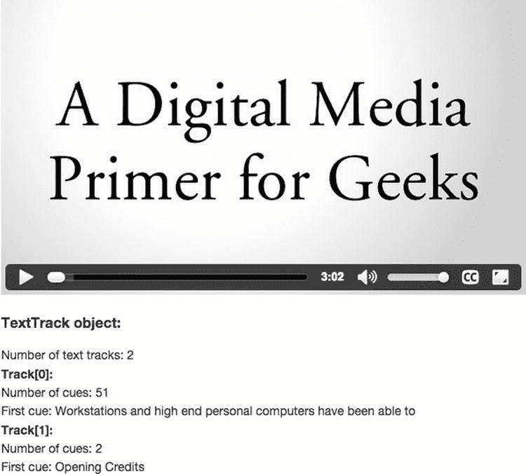

图 4-18 。列出一个视频元素的所有文本轨道

这就结束了对 JavaScript 对象及其 API 的描述，它们允许我们处理一般的文本轨迹并检索相关信息或对特定事件做出反应。

WebVTT:创作字幕、标题、文本描述和章节

尽管我们在本章的前面快速浏览了 WebVTT 以及如何使用它，但我们将在本章的这一节深入探讨这个主题。这将包括格式化提示和字幕，并在视频上定位它们。

正如我们指出的，WebVTT 是一种专门定义的文件格式，允许作者独立于网页创建文本轨道提示，并在单独的文件中分发它们。网页作者通常不创建视频内容；因此，要求字幕作为网页的一部分是没有意义的。

我们还看到，一个简单的 WebVTT 文件是一个文本文件，由一个 WEBVTT 字符串签名和一个由空行分隔的提示列表组成。以下是一个示例文件:

```html
WEBVTT

1 this is an identifier
00:00:08.124 --> 00:00:10.742
Workstations and high end personal computers have been able to

transcription-line
00:00:10.742 --> 00:00:14.749
manipulate digital audio pretty easily for about fifteen years now.

3
00:00:14.749 --> 00:00:17.470
It’s only been about five years that a decent workstation’s been able
```

如您所见，每个提示都以 string 开始，这是可选的标识符。下一行包含提示显示的开始和结束时间，以 hh:min:sec.mms 的形式表示，并用“->”字符串分隔。请注意，每个小时和分钟部分必须由两位数字组成，例如 01 代表一小时或一分钟。第二段必须由两位数和三位小数组成。

接下来的一行或多行文本是实际的提示内容，也就是要呈现的文本。

这个文件将被<track>元素引用，它只不过是一个简单的文本文件，文件名的扩展名为`.vtt`。当提示被显示并且是“字幕”或“标题”时，它们出现在视频视窗底部中间的一个黑框中。很自然，这提出了一个明显的问题:这些线索能被“激活”吗？”答案是:“是的。“让我们来看看处理这些线索的一些方法。

球杆造型

一旦 WebVTT 格式的提示可用于网页，就可以使用 CSS 对其进行样式化。使用前面的例子，您可以使用`::cue`伪选择器来:

*   使用

    ```html
    video::cue(#\31\ this\ is\ an\ identifier) { color: green; }
    ```

    设定第一个球杆的样式
*   使用

    ```html
    video::cue(#transcription\-line) { color: red; }
    ```

    设定第二个球杆的样式
*   使用

    ```html
    video::cue(#\33) { color: blue; }
    ```

    设定第三个球杆的样式
*   使用

    ```html
    video::cue { background-color: lime; }
    ```

    设置所有提示的样式

 **注意** CSS 比 WebVTT 在选择器字符串中允许更少的自由度，所以你需要对你的标识符中的一些字符进行转义来实现这个功能。更多信息见`https://mathiasbynens.be/notes/css-escapes`。

可应用于 cue 中文本并与`::cue`一起使用的 CSS 属性包括:

*   【颜色】
*   “不透明”
*   “能见度”
*   “文本装饰”
*   "文本-阴影"
*   对应于“背景”简写的属性
*   对应于“大纲”简写的属性
*   对应于"字体"速记的属性，包括
    *   "行高"
    *   "空白"

使用`::cue()`,您可以另外设置与过渡和动画特性相关的所有属性的样式。

提示标记

提示属于“元数据”类型，可以包含提示内容中的任何内容。这包括 JSON (JavaScript 对象表示法)、XML 或数据 URL。

其他种类的提示包含受限制的提示文本。提示文本包含 UTF 8 中的纯文本以及一组有限的标记。&符号(`&`)和小于号(`<`)必须作为字符进行转义，因为它们代表转义字符序列或标记的开始。使用以下转义实体，就像在 HTML 中一样:`&amp; (&)`、`&lt; (<)`、`&gt; (>)`、`&lrm`；(左右标)，`&rlm`；(左右标记)，和`&nbsp;`(不破空格)。左右和左右标记是非打印字符，允许作为国际化和双向文本的一部分更改文本的方向。这在用希伯来语或阿拉伯语等从右向左显示单词的语言标记脚本时，或者在标记混合语言文本时非常重要。

接下来，我们将列出当前定义的标签，并给出简单的例子，说明一旦这样的提示被包含并显示在网页上，如何用 CSS 从 HTML 页面处理它们。这些标签是:

*   **Class span** `<c>`: to mark up a section of text for styling, for example,

    ```html
    <c.myClass>Apply styling to this text</c>
    ```

    这将允许使用如下 CSS 选择器:

    ```html
    ::cue(.myClass) { font-size: 2em; }
    ```

    您可以在所有标签上使用`.myClass`类属性。

*   **Italics span** `<i>`: to mark up a section of italicized text, for example,

    ```html
    <i>Apply italics to this text</i>
    ```

    这也允许使用 CSS 选择器，如下所示:

    ```html
    ::cue(i) { color: green; }
    ```

*   `Bold span <b>`: to mark up a section of bold text, for example,

    ```html
    <b>Apply bold to this text</b>
    ```

    这也允许使用 CSS 选择器，如下所示:

    ```html
    ::cue(b) { color: red; }
    ```

*   `Underline span <u>`: to mark up a section of underlined text, for example,

    ```html
    <u>Apply underlines to this text</u>
    ```

    这也允许使用 CSS 选择器，如下所示:

    ```html
    ::cue(u) { color: blue; }
    ```

*   `Ruby span <ruby>`: to mark up a section of ruby annotations.

    拼音注释是与基本文本并排显示的简短文本，主要用于东亚排版中作为发音指南或包含其他注释。以下是一个标记示例:

    ```html
    <ruby>`</rt></ruby>`
    ```

     `这也允许使用 CSS 选择器，如下所示:

    ```html
    ::cue(ruby) { font-weight: bold; }
    ::cue(rt) { font-weight: normal; }
    ```` 
`*   `Voice span <v>`: to mark up a section of text with a voice and speaker annotation, for example,

    ```html
    <v Fred>How are you?</v>
    ```

    一旦提示包含在 HTML 页面中，这也允许使用如下 CSS 选择器:

    ```html
    ::cue(v[voice="Fred"]) { font-style: italic; }
    ```

    *   `Language span <lang>`: to mark up a section of text in a specific language, for example,

    ```html
    <lang de>Wie geht es Dir?</lang>
    ```

    一旦提示包含在 HTML 页面中，这也允许使用如下 CSS 选择器:

    ```html
    ::cue(lang[lang="de"]) { font-style: oblique; }
    ::cue(:lang(ru)) { color: lime; }
    ```

    *   `Timestamps <hh:mm:ss.mss>`: to mark up a section of text with timestamps.

    时间戳的美妙之处在于，它们给你机会在精确的时间点上设计提示，而不是接受我们在本章中使用的黑色背景上的白色文本。下面的代码块显示了时间戳的使用示例:

    ```html
    <00:01:00.000><c>Wie </c><00:01:00.200><c>geht </c><00:01:00.400><c>es </c><00:01:00.600><c>Dir? </c><00:01:00.800>
    ```

    在这个例子中，单词“Wie”、“geht”、“es”和“Dir”将在指示的时间出现在屏幕上。

    这也允许在 HTML 页面中包含提示后使用 CSS 选择器，如下所示:

    ```html
    ::cue(:past) { color: lime; }
    ::cue(:future) { color: gray; }
    ```

    例如，您可以使用时间戳来标记卡拉 ok 提示或添加字幕。什么是“绘画”标题？绘画式字幕是“画”在屏幕上的单个单词。它们以组成标题单词的单个单词的形式出现，从左到右出现，通常是一字不差的。` 

 ` **注意**除非另行通知，否则您需要使用< c >标签将文本括在时间戳之间，以使 CSS 选择器生效(直到`www.w3.org/Bugs/Public/show_bug.cgi?id=16875`被解析)。

下面是一个关于标签和 CSS 用法的有趣演示，应用于 Tay Zonday 的一个音乐视频。这个名为“巧克力雨”的视频几年前在 YouTube 上疯传，现在获得了知识共享许可。

我们从清单 4-15a 中的 WebVTT 标记开始。

***清单 4-15a*** 。“巧克力雨”的 WebVTT 文件

```html
WEBVTT

1 first cue
00:00:10.000 --> 00:00:21.710
<v Tay Zonday>Chocolate Rain</v>

2
00:00:12.210 --> 00:00:21.710
<b>Some </b><i>stay </i><u>dry </u>and others feel the pain

3
00:00:15.920 --> 00:00:21.170
<c.brown>Chocolate </c><u>Rain</u>

4
00:00:18.000 --> 00:00:21.170
<00:00:18.250><c>A </c><00:00:18.500><c>baby </c><00:00:19.000><c>born </c><00:00:19.250><c>will </c><00:00:19.500><c>die </c><00:00:19.750><c>before </c><00:00:20.500><c>the </c><00:00:20.750><c>sin</c>
```

并将适当的 CSS 标记应用于清单 4-15b 中的 HTML。

***清单 4-15b*** 。这些提示在 HTML 页面中被设计为“巧克力雨”

```html
<style>
video::cue {color: lime;}
video::cue(#\31\ first\ cue) {background-color: blue;}
video::cue(v[voice="Tay Zonday"]) {color: red !important;}
video::cue(:past) {color: lime;}
video::cue(:future) {color: gray;}
video::cue(c.brown) {color:brown; background-color: white;}
</style>

<video poster="img/chocolate_rain.png" controls>
  <source src="video/chocolate_rain.mp4"  type="video/mp4">
  <source src="video/chocolate_rain.webm" type="video/webm">
  <track id="track1" label="English" src="tracks/chocolate_rain.vtt"
         kind="subtitles" srclang="en" default>
</video>
```

如您所见，提示是在 VTT 文档中创建的，并使用内嵌 CSS 和来自提示标记的各种样式在 HTML 中进行样式化。样式可以很容易地包含在外部 CSS 样式表中。结果如图 4-19 所示，在不同的浏览器之间并不完全一致，这是你在进行这种项目时需要注意的。

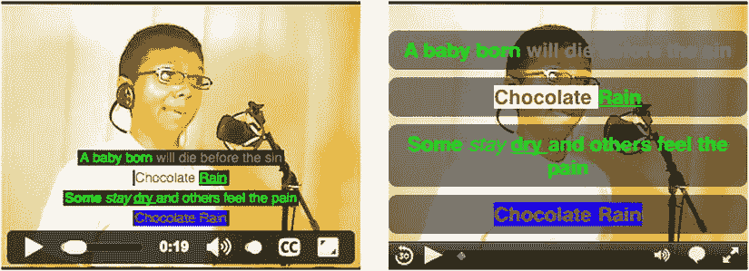

图 4-19 。在 Google Chrome(左)和 Safari(右)中渲染“巧克力雨”示例

 **注意**谷歌 Chrome 和 Safari 目前拥有最好的样式支持。Firefox 不支持`::cue`伪选择器，Internet Explorer 已经无法解析标记提示文本。

提示设置

既然您已经知道了如何设置提示内容的样式，那么让我们来处理您可能会有的另一个问题:“它们必须总是在屏幕的底部吗？”简单的回答是:“不”。你可以选择把它们放在哪里，这就是“WebVTT:创作字幕、标题、文本描述和章节”一节的最后一部分的主题

这是由于 WebVTT 引入了“提示设置”而实现的。这些指令添加在同一行中提示的结束时间规范之后，由冒号(:)分隔的名称-值对组成。

我们从垂直线索开始。

垂直提示

一些语言垂直而不是水平地呈现它们的脚本。许多亚洲语言尤其如此。比如蒙古语，就是竖着写，右边加行。大多数其他竖排书写都是在左侧添加行，例如繁体中文、日文和韩文。

垂直提示的 WebVTT 提示设置如下:

```html
vertical:rl
vertical:lr
```

第一个提示设置指定垂直文本从右向左生长，第二个提示设置指定文本从左向右生长。

清单 4-16 显示了一个日文文本的例子和图 4-20Safari 中的一个渲染。请注意< ruby >标记还不被支持。

***清单 4-16*** 。带有垂直文本提示的 WebVTT 文件

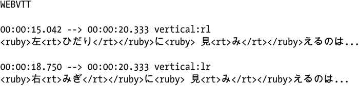

如你所见，在图 4-20 中，增加了垂直提示。有一个小问题。Chrome 和 Opera 目前混淆了`rl`和`lr`，Firefox 和 Internet Explorer 还不支持垂直渲染。只有 Safari 能做到这一点。

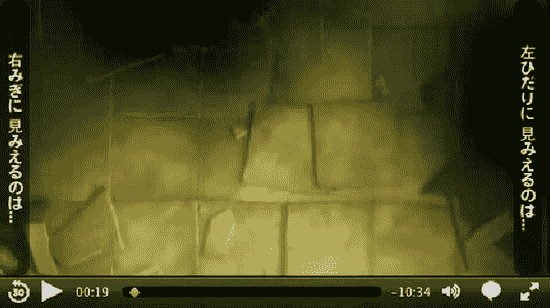

图 4-20 。在 Safari 中渲染垂直文本提示

线定位

默认情况下，提示行呈现在视频视口的底部中央。然而，有时 WebVTT 作者会希望将文本移动到另一个位置，例如，当烧录文本在该位置的视频上显示时，或者当大部分动作在该位置时，如足球比赛中的情况。在这些情况下，您可以决定将提示放置在视频视窗的顶部或视窗顶部和底部之间的任何其他位置。

视口的顶部是垂直提示`rl`的右侧和`lr`的左侧，视口左右之间的间距的计算方式与水平文本非常相似。

行定位的典型 WebVTT 提示设置如下所示:

```html
line:0
line:-1
```

第一个版本指定视频视口顶部的第一行，即从该处继续向下的任何连续数字(例如，4 是视口顶部的第五行)。第二行指定视口底部的第一行，从那里开始递减计数(例如，-5 是从底部算起的第五行)。

您也可以从视频视口的顶部指定百分比定位。

```html
line:10%
```

如果我们假设视频的高度为 720 像素，则字幕将出现在视频视窗顶部下方 72 像素处。

正如您所看到的，行提示设置允许您以三种不同的方式定位提示顶部和底部:从顶部计数行、从底部计数行和从顶部百分比定位。

球杆校准

通过对齐设置，提示框中的文本可以左对齐、中对齐或右对齐。

```html
align:left
align:middle
align:right
align:start
align:end
```

“开始”和“结束”设置适用于应与文本的开始/结束对齐的情况，与文本的方向是从左到右还是从右到左无关。

文本定位

有时，WebVTT 作者会希望将提示框从中间位置移开。例如，选择的位置覆盖说话者的脸。在这种情况下，提示应该移动到扬声器的左侧、右侧或下方。

文本定位的 WebVTT 提示设置为:

```html
position:60%
```

这会将水平提示与距离视频视窗左边缘 60%的部分对齐。

 **注意**小心文本定位，因为提示的最终位置取决于文本的对齐方式。例如，如果提示居中对齐，文本位置的原点将是文本块的中心。对于右对齐文本，它将是块的右边缘，依此类推。如果得到不一致的结果，首先要查看提示对齐属性。

球杆尺寸

能够在视窗中改变提示位置是一个很好的特性，但是也存在标题可能太宽的风险。这就是`size`属性——总是用百分比表示——有用的地方。例如，将一个提示放在扬声器下方的左侧将要求您也限制提示的宽度，如下所示。

```html
position:10% align:left size:40%
```

为了更好地理解所有这些提示设置的效果，清单 4-17 显示了一个使用线条、对齐、位置和大小设置来适应变化的提示位置和宽度的提示示例。

***清单 4-17*** 。带有提示的 WebVTT 文件，带有提示设置

```html
WEBVTT

1a
00:00:08.124 --> 00:00:10.742 line:0 position:10% align:left
Workstations

1b
00:00:08.124 --> 00:00:10.742 line:50% position:50%
and high end personal computers

1c
00:00:08.124 --> 00:00:10.742 align:right size:10% position:100%
have been able to
```

第一个提示 1a 呈现在视频视窗的第一行，并以 10%的偏移量左对齐。第二个提示—1b—正好呈现在中间。第三个提示—1c—是视口宽度的 10%，在右边缘右对齐呈现。

图 4-21 显示了 Chrome(左)和 Safari(右)中的结果。

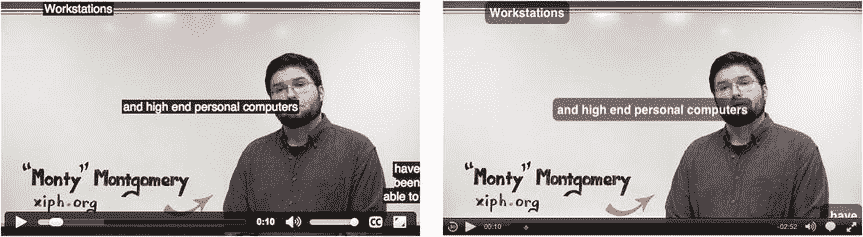

图 4-21 。在 Chrome 和 Safari 中使用提示设置渲染提示

Chrome、Opera 和 Firefox 基本上以相同的方式呈现提示。Safari 的定位有着有些不同的解读。IE 不支持任何提示设置。

其他 WebVTT 功能

至此，我们已经概述了最重要的 WebVTT 特性。在结束之前，我们还想提几个其他的问题。

*   **评论**:你可以在一个 WebVTT 文件中创作评论——基本上，它们是一个没有标识符或时间线的提示，文本块以`NOTE`开始
*   区域(Regions):这是一个正在讨论中的特性，允许更详细的定位，允许在提示上提供背景颜色，并允许滚动文本(滚动字幕)。目前还不清楚浏览器是否会实现这部分规范。
*   **嵌套线索**:轨迹`@kind=` `’chapters’`允许定义嵌套线索(即完全包含在其他线索中的线索)。这对于轨道来说很有用，它区分了章、节、小节等等，其中每个较低的层次都完全包含在较高的层次中。因此，章节轨道可以用于不同分辨率的导航，尽管很难想象如何在浏览器中呈现。

到目前为止，我们已经关注了一个视频，并向您展示了如何添加脚本、字幕、标题、章节和文本描述。正如你所发现的，它们都是使视频和音频能够被不同的观众所接受的关键因素。尽管如此，我们都在电视上看到过这样的视频，在新闻发布会上，有人在一旁用手语翻译对聋人说的话。因此，在某些情况下，视频流也需要使用“签名者”的单独视频这是您需要创建具有多个同步音频和视频轨道的视频的地方。

多个音频和视频轨道:音频描述和手语视频

我们已经谈了很多关于如何发布视频的文本替代，包括抄本、标题、字幕和文本描述。然而，视力受损的视频观众习惯于使用视频中的音频描述，许多聋人用户发现阅读/观看手语比文本更容易。同样，国际用户已经习惯了配音音轨，如之前评论的清晰音轨。这给我们提出了一个相当有趣的挑战，一个视频不只有一个视频和一个音频轨道，而是有多个视频和音频轨道。

这一挑战可以通过两种方式来应对。首先是准备彼此同步的单独的音频和视频文件。第二种方法是产生一个单一的多路复用视频文件，我们从中检索与特定用户相关的音轨。HTML5 提供了这两种选择。前者通过`MediaController` API 支持，后者通过多轨媒体文件支持。


多轨道媒体

当引用一个在<video>元素中包含多个音频和视频轨道的视频时，浏览器只显示一个视频轨道并呈现所有启用的音频轨道。为了访问与

<audio>或<video>元素相关联的所有音频和视频轨道，`MediaElement`的 IDL 扩展了以下属性:</video></audio></video> 

```html
interface HTMLMediaElement : HTMLElement {
...
  readonly attribute AudioTrackList audioTracks;
  readonly attribute VideoTrackList videoTracks;
};
```

@音轨

媒体元素的`@audioTracks`属性是一个`AudioTrackList`对象，它包含媒体元素可用的音轨列表及其激活状态。

@视频跟踪

媒体元素的`@videoTracks`属性是一个`VideoTrackList`对象，它包含媒体元素可用的视频轨道列表及其激活状态。

音频和视频轨道

其中包含的`AudioTrackList`对象和`AudioTrack`对象定义如下:

```html
interface AudioTrackList : EventTarget {
   readonly attribute unsigned long length;
   getter AudioTrack (unsigned long index);
   AudioTrack? getTrackById(DOMString id);
            attribute EventHandler onchange;
            attribute EventHandler onaddtrack;
            attribute EventHandler onremovetrack;
};

interface AudioTrack {
   readonly attribute DOMString id;
   readonly attribute DOMString kind;
   readonly attribute DOMString label;
   readonly attribute DOMString language;
            attribute boolean enabled;
};
```

`VideoTrackList`对象和它的`VideoTrack`对象非常相似:

```html
interface VideoTrackList : EventTarget {
   readonly attribute unsigned long length;
   getter VideoTrack (unsigned long index);
   VideoTrack? getTrackById(DOMString id);
   readonly attribute long selectedIndex;
            attribute EventHandler onchange;
            attribute EventHandler onaddtrack;
            attribute EventHandler onremovetrack;
};

interface VideoTrack {
   readonly attribute DOMString id;
   readonly attribute DOMString kind;
   readonly attribute DOMString label;
   readonly attribute DOMString language;
            attribute boolean selected;
};
```

一个`AudioTrackList`是一列`AudioTrack`对象。列表的长度由`@length`属性提供。单个轨道可以通过它们的索引号(例如`track[i]`)来访问，并且`getTrackById()`方法允许通过提供其 id 字符串来检索`AudioTrack`。此外，每当列表中的一个或多个曲目被启用或禁用时，就会引发一个`change`事件；每当曲目被添加到曲目列表时，就会引发一个`addtrack`事件；每当曲目被移除时，就会引发一个`removetrack`事件。

`VideoTrackList`是相同的，只适用于`VideoTrack`对象。它有一个额外的属性:`@selectedIndex`，指定当在<video>元素中使用时，列表中的哪个轨迹被选中并被渲染。</video>

`AudioTrack`和`VideoTrack`对象都包含以下属性:

*   `@id`:可选的标识符字符串，
*   `@kind`:轨道的可选类别，
*   `@label`:可选的人类可读的字符串，带有音轨内容的简要描述，
*   `@language`:根据 BCP47 的可选 IETF 语言代码，指定轨道中使用的语言，可以是手语代码。

`AudioTrack`对象还有一个用于打开或关闭音轨的`@enabled`属性。顺便提一下，这在包含`AudioTrack`的列表中触发了一个`onchange`事件。

`VideoTrack`对象还有一个`@selected`属性，通过该属性可以打开视频轨道。当视频轨道打开时，它会自动关闭`VideoTrackList`中的任何其他视频轨道，并在该列表中触发一个`onchange`事件。

为音轨定义了以下`@kind`值:

*   `"main"`:主音轨，
*   `"alternative"`:主音轨的替代版本(例如，干净的音频版本)，
*   `"descriptions"`:主视频轨道的音频描述，
*   `"main-desc"`:混合有音频描述的主音轨，
*   `"translation"`:主音轨的配音版，
*   `"commentary"`:主视频和音频轨道上的导演评论。

以下`@kind`值是为视频轨道定义的:

*   `"main"`:主视频轨道，
*   `"alternative"`:主视频轨道的替代版本(例如，不同的角度)，
*   `"captions"`:带有烧录字幕的主视频轨道，
*   `"subtitles"`:带有预烧字幕的主视频轨道，
*   `"sign"`:主音轨的手语翻译，
*   `"commentary"`:主视频和音频轨道上的导演评论。

创建多轨道媒体文件

您可以使用 MP4Box ( `http://concolato.wp.mines-telecom.fr/2013/07/28/webvtt-mp4-files-dash-and-gpac/`)来创作多轨道 MPEG-4 文件。下面是一个例子:

```html
$ MP4Box -new ElephantDreams.mux.mp4 -add ElephantDreams.mp4 \
         -add ElephantDreams.sasl.mp4 -add ElephantDreams.audesc.mp3
```

该命令将`ElephantDrams.sasl.mp4`和`ElephantDreams.audesc.mp3`文件添加到`ElephantDrams.mp4`文件中，从而创建 SASL(南非手语)和音频描述音轨。

为了检查它是否工作正常，您可以使用

```html
$ MP4Box -info ElephantDreams.mux.mp4
```

。。。确认 mux 文件有四个磁道。

对于 WebM 文件，你可以使用`mkvmerge`(参见 GUI 应用的`http://mkvtoolnix.en.softonic.com/`)。下面是一个例子:

```html
$ mkvmerge -w -o ElephantDreams.mux.webm ElephantDreams.webm \
  ElephantDreams.sasl.webm ElephantDreams.audesc.ogg
```

该命令将`ElephantDreams.sasl.webm`手语文件和`ElephantDreams.audesc.ogg`音频描述文件添加到`ElephantDreams.webm`中。

为了检查它是否工作正常，您可以使用

```html
$ mkvinfo ElephantDreams.mux.webm
```

这确认了 mux 文件具有四个轨道。

你可以在 VLC 播放这些文件——它会显示两个视频轨道并同步它们。不幸的是，VLC 一次只允许一个音频轨道活跃，所以你只能听主音频轨道或音频描述轨道。

现在让我们把它们放在一个 HTML 文件的例子中，如清单 4-18 所示。

***清单 4-18*** 。多轨视频文件的检查

```html
<video poster="img/ElephantDreams.png" controls width="50%">
  <source src="video/ElephantDreams.mux.webm" type="video/webm">
  <source src="video/ElephantDreams.mux.mp4"  type="video/mp4">
</video>
<h3>Attribute values:</h3>
<p id="values"></p>
<script>
  var video = document.getElementsByTagName("video")[0];
  var values = document.getElementById(’values’);

  function start() {
    if (video.videoTracks) {
      values.innerHTML += "videoTracks.length: "
                       + video.videoTracks.length + "<br/>";
      values.innerHTML += "audioTracks.length: "
                       + video.audioTracks.length;
    } else {
      values.innerHTML += "Browser does not support multitrack audio and video.";
    }
    video.pause();
  }
  video.addEventListener("play", start, false);
  video.play();
</script>
```

我们正试图提取清单 4-19 中的`@videoTracks`和`@audioTracks`属性的内容，这样我们也许能够操纵哪个音频或视频轨道是活动的。然而，图 4-22 显示我们并不幸运——Safari 只显示 0 个视频和音频轨道。

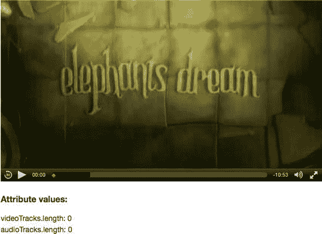

图 4-22 。在 Safari 中渲染@videoTracks 和@ audio tracks

不幸的是，其他浏览器更差，甚至不支持该属性。现在不建议你尝试在 HTML5 中使用多轨媒体资源。浏览器大多认为多轨道资源不是处理多个同步音频和视频轨道的好方法，因为它会导致必须传输音频和视频轨道的成本，其中只有一小部分被呈现给用户。

今天的首选方法是使用新的媒体源扩展来提供多轨媒体资源。使用 MediaSource 扩展，在媒体播放开始时会传输一个清单文件，该文件描述了哪些曲目可用于资源。然后，只有来自那些被用户实际激活的轨道的数据将被传输。媒体源扩展超出了本书的范围。

HTML5 规范提供了另一种使不同媒体文件相互同步的方法，我们将在接下来探讨这一点。

媒体控制器:同步独立的媒体元素

`MediaController`是一个协调多个媒体元素回放的对象，例如将手语视频与主视频同步。每个媒体元素都可以附加到一个`MediaController`上，或者从属于一个`MediaController`。当这种情况发生时，`MediaController`修改从属于它的每个媒体元素的回放速率和音量，并确保当它控制的任何媒体停止时，其他媒体也同时停止。需要记住的另一点是，当使用`MediaController`时，循环被禁用。

默认情况下，媒体元素没有`MediaController`。因此，必须使用`@mediagroup`属性或者通过显式设置`MediaElement`的 IDL 的控制器属性来声明性地创建`MediaController`:

```html
interface HTMLMediaElement : HTMLElement {
...
            attribute DOMString mediaGroup;
            attribute MediaController? controller;
};
```

@ media group〔??〕

`mediaGroup` IDL 属性反映了`@mediagroup`内容属性的值。`@mediagroup`属性包含一个字符串值。我们可以随机选择字符串的名称——它必须在我们试图同步的媒体元素之间相同。所有具有相同字符串值的`@mediagroup`属性的媒体元素都从属于同一个`MediaController`。

清单 4-19 展示了这一切是如何工作的一个例子。

***清单 4-19*** 。将主视频和手语视频捆绑在一起

```html
<video poster="img/ElephantDreams.png" controls width="50%" mediagroup="sync">
  <source src="video/ElephantDreams.webm" type="video/webm">
  <source src="video/ElephantDreams.mp4"  type="video/mp4">
</video>
<video poster="img/ElephantDreams.sasl.png" width="35%" mediagroup="sync">
  <source src="video/ElephantDreams.sasl.webm" type="video/webm">
  <source src="video/ElephantDreams.sasl.mp4"  type="video/mp4">
</video>
<h3>Attribute values:</h3>
<p id="values"></p>
<script>
  var video1 = document.getElementsByTagName("video")[0];
  var video2 = document.getElementsByTagName("video")[1];
  var values = document.getElementById(’values’);

  function start() {
    setTimeout(function() {
      video1.controller.pause();
      values.innerHTML += "Video1: duration=" + video1.duration + "<br/>";
      values.innerHTML += "Video2: duration=" + video2.duration + "<br/>";
      values.innerHTML += "MediaGroup: " + video1.mediaGroup + "<br/>";
      values.innerHTML += "MediaController: duration="
                       + video1.controller.duration + "<br/>";
      values.innerHTML += "MediaController: paused="
                       + video1.controller.muted + "<br/>";
      values.innerHTML += "MediaController: currentTime="
                       + video1.controller.currentTime;
    }, 10000);
  }
  video1.addEventListener("play", start, false);
  video1.controller.play();
</script>
```

我们使用`@mediagroup=` `"sync"`同步两个视频元素——一个与 ElephantDreams 同步，另一个与同一视频的 SASL 签名者同步。在 JavaScript 中，我们让视频播放 8 秒钟，然后显示视频持续时间与控制器持续时间的比较值。你会注意到在图 4-23 的渲染中，控制器的持续时间是其从属媒体元素的最大值。我们还打印控制器的`paused`、`muted`和`currentTime` IDL 属性值。

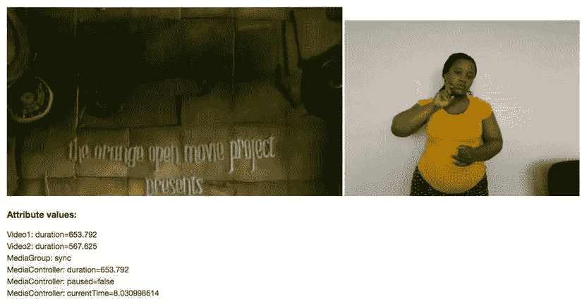

图 4-23 。Safari 中从属媒体元素的呈现

请注意，Safari 是目前唯一支持`@mediagroup`属性和`MediaController`的浏览器。

@控制器

`MediaController`对象包含以下属性:

```html
enum MediaControllerPlaybackState { "waiting", "playing", "ended" }; [Constructor] interface MediaController : EventTarget {
   readonly attribute unsigned short readyState;
   readonly attribute TimeRanges buffered;
   readonly attribute TimeRanges seekable;
   readonly attribute unrestricted double duration;
            attribute double currentTime;
   readonly attribute boolean paused;
   readonly attribute MediaControllerPlaybackState playbackState;
   readonly attribute TimeRanges played;
   void pause();
   void unpause();
   void play();
            attribute double defaultPlaybackRate;
            attribute double playbackRate;
            attribute double volume;
            attribute boolean muted;
};
```

`MediaContoller`的状态和属性表示其从属媒体元素的累积状态。`readyState`和`playbackState`是所有从属媒体元素的最低值。`buffered`、`seekable`和`played TimeRanges`是集合，表示从属媒体元素上相同的各自属性的交集。`Duration`是所有从属媒体元素的最大持续时间。`CurrentTime`、`paused`、`defaultPlaybackRate`、`playbackRate`、`volume`和`mute` d 被施加到所有的`MediaController’s`从属媒体元素上，以保持它们全部同步。

A `MediaController`还触发以下事件，这些事件有点类似于在`MediaElement`上发现的事件:

*   **`Emptied`** :当所有从属媒体元素结束或者不再有任何从属媒体元素时引发。
*   **`loadedmetadata`** :当所有从属媒体元素至少达到`HAVE_METADATA readyState`时引发。
*   **`loadeddata`** :当所有从属媒体元素至少达到`HAVE_CURRENT_DATA readyState`时引发。
*   **`canplay`** :当所有从属媒体元素至少达到`HAVE_FUTURE_DATA readyStat` e 时引发
*   **`canplaythrough`** :当所有从属媒体元素至少达到`HAVE_ENOUGH_DATA readyState`时引发。
*   **`playing`** :所有从属媒体元素新播放时引发。
*   **`ended`** :所有从属媒体元素新结束时引发。
*   **`waiting`** :当至少有一个从属媒体元素正在新等待时引发。
*   **`durationchange`** :当任何从属媒体元素的持续时间改变时引发。
*   **`timeupdate`** :当`MediaController`的`currentTime`改变时引发。
*   **`play`** :当`MediaController`的暂停状态改变时引发。
*   **`pause`** :当所有媒体元素移动到暂停时引发。
*   **`ratechange`** :新换`MediaController`的`defaultPlaybackRate`或`playbackRate`时触发。
*   **`volumechange`** :当`MediaController`的音量或静音属性新改变时引发。

清单 4-20 展示了一个脚本创建的`MediaController`的例子。

***清单 4-20*** 。使用 MediaController 将主视频和音频描述捆绑在一起

```html
<video poster="img/ElephantDreams.png" controls width="50%">
  <source src="video/ElephantDreams.webm" type="video/webm">
  <source src="video/ElephantDreams.mp4"  type="video/mp4">
</video>
<h3>Attribute values:</h3>
<p id="values"></p>
<script>
var values = document.getElementById(’values’);
var video = document.getElementsByTagName("video")[0];
video.volume = 0.1;
var audio = new Audio();
if (audio.canPlayType(’audio/mp3’) == "maybe" ||
    audio.canPlayType(’audio/mp3’) == "probably") {
  audio.src = "video/ElephantDreams.audesc.mp3";
} else {
  audio.src = "video/ElephantDreams.audesc.ogg";
}
audio.volume = 1.0;

var controller = new MediaController();
video.controller = controller;
audio.controller = controller;
controller.play();

controller.addEventListener("timeupdate", function() {
  if (controller.currentTime > 30) {
    values.innerHTML += "MediaController: volume=" + controller.volume;
    values.innerHTML += "MediaController: audio.volume=" + audio.volume;
    values.innerHTML += "MediaController: video.volume=" + video.volume;
    values.innerHTML += "MediaController: currentTime="
                        + controller.currentTime;
    values.innerHTML += "MediaController: audio.currentTime="
                        + audio.currentTime;
    values.innerHTML += "MediaController: video.currentTime="
                        + video.currentTime;
    controller.pause();
  }
}, false);
</script>
```

`MediaController`将一段音频描述与一段主视频同步，播放 30 秒左右，然后显示一些 IDL 属性值。

请特别注意，我们是如何决定在将音频和视频对象捆绑在一起之前设置它们的音量的。通过这样做，我们适应了资源的不同记录容量。如果音量是通过`MediaController`设置的，`MediaController`会将其音量施加到所有从属元素上。

图 4-24 显示了结果。

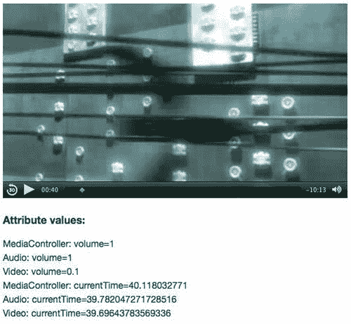

图 4-24 。Safari 中的 MediaController 对象及其从属元素

请注意所有从属音频和视频媒体元素在回放位置上的差异。

由于 Safari 是目前唯一支持`@mediaGroup` 和`MediaController`的浏览器，你将不得不使用 JavaScript 来获得与其他浏览器相同的功能。这样做时要小心，因为这不仅仅是同时开始播放两个视频以保持它们同步的问题。它们将以不同的速率解码，并最终逐渐分离。频繁地重新同步他们的时间表是必要的。

导航:访问内容

如前所述，仅仅提供 alt 内容不足以满足所有的可访问性需求。

为视障用户创建视频的一个主要挑战是如何使浏览视频变得容易。浏览器中的媒体控件包含一个时间线导航条，可视用户使用它来点击并直接跳转到时间偏移。这避免了观看和等待某个感兴趣的片段出现。问题是视力有障碍的用户看不到导航栏。

在第二章中，我们讨论了默认播放器界面的功能，以及浏览器如何让它们可以通过键盘访问。Opera 的`CTRL-left/right`箭头导航缩短了视频时长的 1/10，Firefox 的左/右箭头导航以 10 秒为增量，这些功能为视力受损的用户提供了更轻松的导航方式。

然而，缺少的是语义导航，即直接跳转到感兴趣的点的能力，例如，在长格式的媒体文件中。大多数内容都是结构化的。这本书——只要看看组成这本书结构的章节——就是结构化内容的一个例子。类似地，长格式媒体文件也有一个结构。例如，DVD 或蓝光光盘上的电影带有允许直接访问有意义的时间偏移的章节。事实上，在`http://chapterdb.org/`有一个专门关于这个主题的网站。

在本章的前面，我们已经看到了<track>元素如何暴露`kind=` `"chapters"`的文本轨迹，以及我们如何创作 WebVTT 文件来提供这些章节。我们如何利用章节和时间偏移来进行语义导航，让视力受损的用户也可以使用？

清单 4-21 提供了一个使用媒体片段 URIs 来导航通过 WebVTT 文件提供的章节的例子。

***清单 4-21*** 。使用媒体片段 URIs 导航章节

```html
<video poster="img/ElephantDreams.png" controls width="50%">
  <source src="video/ElephantDreams.webm" type="video/webm">
  <source src="video/ElephantDreams.mp4"  type="video/mp4">
  <track src="tracks/ElephantDreams_chapters_en.vtt" srclang="en"
         kind="chapters" default>
</video>
<h3>Navigate through the following chapters:</h3>
<ul id="chapters">
</ul>
<script>
var video = document.getElementsByTagName("video")[0];
var source;
var chapters = document.getElementById(’chapters’);

function showChapters() {
  source = video.currentSrc;
  var cues = video.textTracks[0].cues;
  for (var i=0; i<cues.length; i++) {
    var li = document.createElement("li");
    var link = document.createElement("a");
    link.href = "#t=" + cues[i].startTime + "," + cues[i].endTime;
    var cue = cues[i].getCueAsHTML();
    cue.textContent = parseInt(cues[i].startTime) + " sec : "
                    + cue.textContent;
    link.appendChild(cue);
    li.appendChild(link);
    chapters.appendChild(li);
  }
  video.removeEventListener("loadeddata", showChapters, false);
}
video.addEventListener("loadeddata", showChapters, false);

function updateFragment() {
  video.src = source + window.location.hash;
  video.load();
  video.play();
}
window.addEventListener("hashchange", updateFragment, false);
</script>
```

视频加载后，我们运行`showChapters()`函数 来遍历`.vtt`文件中的章节提示列表，并将它们添加到视频下方的`<ul>`列表中。列表使用提示的开始和结束时间来构建媒体片段:`#t=[starttime],[endtime`。这些媒体片段作为每个章节的 URL 提供:`link.href = "#t=" + cues[i].startTime + "," + cues[i].endTime;`。

当链接被激活时，网页的 URL 哈希发生变化，并激活`updateFragment()`函数，其中我们将 URL 更改为视频元素，以包含媒体片段:`video.src = source + window.location.hash;`。然后，我们重新加载视频并播放它，这将激活对视频 URL 的更改，从而导航视频。

导航到“Emo 创建”章节后，结果可在图 4-25 中看到。

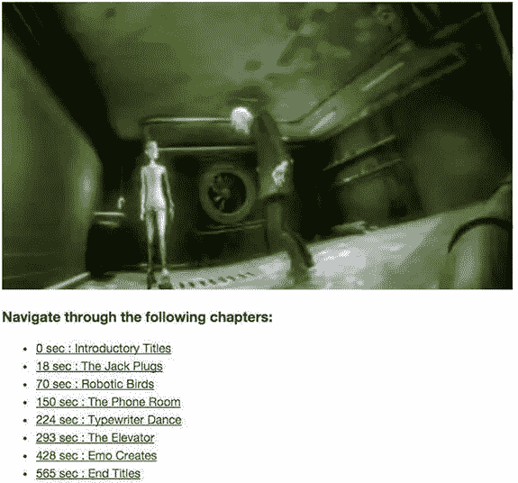

图 4-25 。使用谷歌浏览器中的媒体片段 URIs 导航章节

由于锚元素

摘要

这是一个相当长的章节，我们敢打赌，你从来没有考虑到这样一个事实，即让残疾人或只是不会说你的语言的人使用媒体有这么多好处。

本章最重要的教训是，可访问性不是一个简单的话题。这仅仅是因为存在如此多不同的可访问性需求。满足他们的最简单的方法是提供文本抄本。问题是，抄本提供了最差的用户体验，应该只作为后备机制。

媒体最重要的可访问性和国际化需求如下:

*   为听力受损的用户提供字幕或手语视频，
*   针对视力受损用户的音频或文本描述，以及
*   为国际用户提供字幕或配音音轨。

您已经看到了如何使用 WebVTT 创作文本轨道，以满足所有基于文本的可访问性需求。您还看到了如何使用多轨道媒体或`MediaController`来处理手语视频、音频描述或配音音轨。

随着 HTML5 的成熟和浏览器制造商的不断进步，本章介绍的许多有限功能将变得司空见惯。

说到司空见惯，智能手机和设备在不到五年的时间里迅速从新奇变成了司空见惯。由于 HTML5 画布，HTML5 视频已经发展成为一种交互式和创造性的媒体。这是下一章的主题。我们在那里见。``