# 五、HTML5 视频和画布

到目前为止，本书中的视频一直被视为某种静态媒体。正如您所发现的，视频只不过是以特定速率呈现在屏幕上的一系列图像，用户与视频的唯一交互是点击控件和/或阅读脚本或字幕。除此之外，对于用户来说，除了坐下来欣赏节目之外，真的没有什么可以做的了。通过一点 JavaScript 和 HTML5 画布的使用，你可以让这个被动的媒体变得互动，更重要的是，把它变成一个创造性的媒体。这一切都始于一个非常重要的概念:成像。

当在屏幕上绘制图像时，HTML5 可以呈现两种图像类型:SVG(可缩放矢量图形)或光栅位图图形。简单地说，SVG 图像由点、线和空间填充组成。它们通常由代码驱动，由于它们的性质，它们是独立于设备的，这意味着它们可以在屏幕上调整大小和重新定位，而不会损失分辨率。

另一方面，光栅图形是基于像素的。它们本质上与屏幕中的像素相连。随着 HTML5 视频和 canvas 元素的出现，屏幕就像它的名字所暗示的那样:一个空白的画布，你可以在这里画任何东西，从直线到复杂的图形。

SVG 环境是处理基于矢量的形状的声明性图形环境，而 HTML canvas 提供了围绕像素或位图的基于脚本的图形环境。与 SVG 相比，在 canvas 中操作数据实体更快，因为直接访问单个像素更容易。另一方面，SVG 提供了一个 DOM(文档对象模型),并且有一个 canvas 没有的事件模型。这应该告诉您，需要交互式图形的应用通常会选择 SVG，而进行大量图像处理的应用通常会选择 canvas。两者中可用的变换和效果是相似的，可以用两者实现相同的视觉效果，但是需要不同的编程工作和潜在的不同性能。

当比较 SVG 和 canvas 的性能时，通常绘制大量对象最终会降低 SVG 的速度，因为 SVG 必须维护对对象的所有引用，而对于 canvas 来说，只需要照亮更多的像素。所以，当你有很多对象要画，而你继续访问单个对象并不重要，只是在画完像素后，你应该使用画布。

相比之下，画布绘制区域的大小对

<canvas>的速度有着巨大的影响，因为它必须绘制更多的像素。所以，当你有一个很大的区域要覆盖少量的对象时，你应该使用 SVG。</canvas>

请注意，canvas 和 SVG 之间的选择并不完全排斥。通过使用名为`toDataURL()`的函数将画布转换成图像，可以将画布放入 SVG 图像中。例如，在为 SVG 图像绘制漂亮且重复的背景时，可以使用这种方法。在画布中绘制背景并通过`toDataURL()` 函数将其包含到 SVG 图像中可能更有效:这解释了为什么本章重点是画布。

像 SVG 一样，画布本质上是一种面向视觉的媒体——它与音频没有任何关系。当然，您可以通过简单地将

<audio>元素作为页面的一部分，将背景音乐与令人惊叹的图形显示结合起来。在 9elements ( `http://9elements.com/io/?p=153`)可以找到音频和画布如何结合的惊人例子。该项目通过在音乐背景上使用彩色和动画圆圈，是一个令人惊叹的 Twitter 聊天可视化。</audio>

如果你已经有了 JavaScript 的经验，canvas 应该不会太难理解。它几乎就像一个具有绘图功能的 JavaScript 库。它特别支持以下功能类别:

*   **画布处理**:创建绘图区域，2D 上下文，保存并恢复状态。
*   **画基本形状**:矩形、路径、直线、圆弧、贝塞尔曲线、二次曲线。
*   **绘图文本**:绘图填充文本、描边文本、测量文本。
*   **使用图像**:创建、绘制、缩放和切片图像。
*   应用样式:颜色、填充样式、笔画样式、透明度、线条样式、渐变、阴影和图案。
*   **应用变换**:平移、旋转、缩放和变换矩阵。
*   **合成**:裁剪和重叠绘制合成。
*   **应用动画**:通过关联时间间隔和超时，随时间执行绘图功能。

首先，让我们在画布上处理视频。

画布中的视频

理解如何在画布中处理视频的第一步是从<video>元素中提取像素数据，并将其“绘制”在画布元素上。就像任何伟大的艺术家面对空白的画布一样，我们需要在画布上绘制图像。</video>

drawImage( )

`drawImage()`函数接受一个视频元素以及一个图像或画布元素。清单 5-1 展示了如何在视频中直接使用它。您可以在`http://html5videoguide.net`跟随示例。

***清单 5-1*** 。将视频像素数据引入画布

```html
<video controls autoplay height="240" width="360" >
  <source src="video/HelloWorld.mp4"  type="video/mp4">
  <source src="video/HelloWorld.webm" type="video/webm">
</video>

<canvas width="400" height="300" style="border: 1px solid black;">
</canvas>
<script>
var video, canvas, context;
video = document.getElementsByTagName("video")[0];
canvas = document.getElementsByTagName("canvas")[0];
context = canvas.getContext("2d");
video.addEventListener("timeupdate", paintFrame, false);

function paintFrame() {
  context.drawImage(video, 0, 0, 160, 120);
}
</script>
```

HTML 标记很简单。它只包含我们正在绘制视频数据的<video>元素和

<canvas>元素。</canvas></video> 

JavaScript 相当简单。`addEventListener`是关键。每次视频的`currentTime`更新——`timeupdate`——`paintFrame`函数使用与`getContext("2d")`对象关联的`drawImage()`方法将捕获的像素绘制到画布上。如图 5-1 所示，这些像素被绘制在<画布>元素(0，0)的左上角，并填充一个 160 × 120 的空间。所有浏览器都支持此功能。

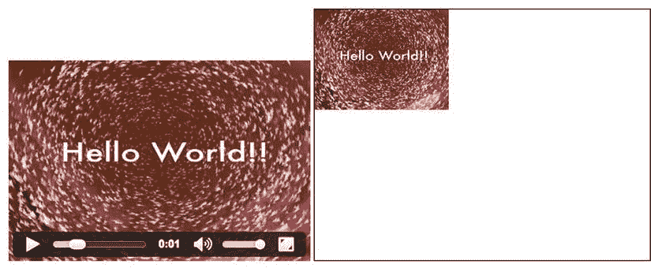

图 5-1 。每次发生 timeupdate 事件时，将视频绘制到画布中

您会注意到视频播放的帧速率高于画布。这是因为`timeupdate`事件不会在视频的每一帧都触发。它每隔几帧就触发一次，大约每隔 100-250 毫秒。目前没有任何功能可以让您可靠地抓取每一帧。然而，我们可以使用`requestAnimationFrame()`函数创建一个每次屏幕刷新时都会更新的绘画循环。在典型的浏览器中，这大约是每秒 60 次，鉴于大多数现代视频大约是每秒 30 帧，它应该获得大多数帧，如果不是所有帧的话。

在下一个例子中，我们使用`play`事件在用户开始回放时启动绘画循环，并一直运行到视频暂停或结束。另一种选择是使用`canplay`或`loadeddata`事件独立于用户交互来启动显示。

此外，让我们让下一个例子更有趣一点。既然我们现在知道了如何捕捉视频帧并将其绘制到画布上，让我们开始处理这些数据。在清单 5-2 中，每次画布重绘时，我们在 x 轴和 y 轴上移动 10 个像素。

***清单 5-2*** 。使用 requestAnimationFrame 将不同偏移量的视频帧绘制到画布中

```html
<video controls autoplay height="240" width="360" >
  <source src="video/HelloWorld.mp4"  type="video/mp4">
  <source src="video/HelloWorld.webm" type="video/webm">
</video>
<canvas width="400" height="300" style="border: 1px solid black;">
</canvas>
<script>
var video, canvas, context;
video = document.getElementsByTagName("video")[0];
canvas = document.getElementsByTagName("canvas")[0];
context = canvas.getContext("2d");
video.addEventListener("play", paintFrame, false);
var x = 0, xpos = 10;
var y = 0, ypos = 10;
function paintFrame() {
  context.drawImage(video, x, y, 160, 120);
  if (x > 240) xpos = -10;
  if (x < 0)   xpos =  10;
  x = x + xpos;
  if (y > 180) ypos = -10;
  if (y < 0)   ypos =  10;
  y = y + ypos;
  if (video.paused || video.ended) {
    return;
  }
  requestAnimationFrame(paintFrame);
}
</script>
```

如图 5-2 中的所示，结果可能相当有趣。视频本身似乎是画布上的画笔，它在画布上移动，将视频帧绘制到似乎是随机的位置。实际上，如果你仔细观察`paintFrame()`函数，情况并非如此。每个图像的尺寸设置为 160 × 120，视频的运动由`xpos`和`ypos`值决定。每一个连续的帧都与前一个帧向左和向右偏移 10 个像素，直到它到达画布的边缘，这时偏移被取消。

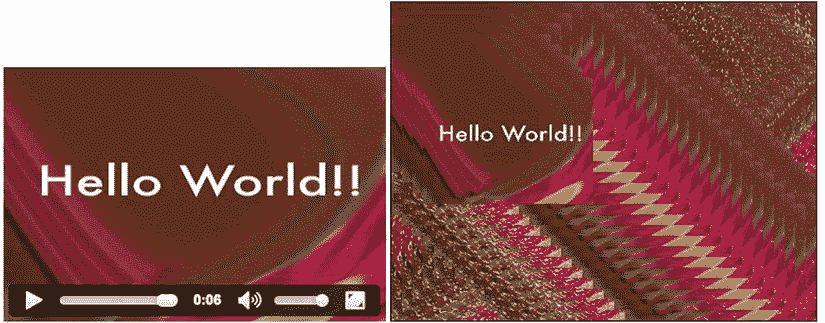

图 5-2 。使用 Chrome 中的 requestAnimationFrame 函数将视频绘制到画布中

本例绘制的帧率等于`requestAnimationFrame()`函数的帧率，通常为 60Hz。这意味着我们现在更新画布的频率甚至比更新视频帧的频率还要高。

由于`requestAnimationFrame()`方法还是相当新的，在旧的浏览器(尤其是 IE10 和更低版本)中，你需要使用`setTimeout()`而不是`requestAnimationFrame()`在给定的时间间隔后从视频中重复抓取一帧。

因为`setTimeout()`函数在给定的毫秒数后调用一个函数，并且我们通常以每秒 24 (PAL)或 30 (NTSC)帧的速度运行视频，所以 41 毫秒或 33 毫秒的超时会更合适。为了安全起见，你可能想使用与`requestAnimationFrame()`相同的帧率，这相当于你典型的 60Hz 的屏幕刷新率。因此，将超时设置为 1000/60 = 16 毫秒，以达到类似于图 5-2 的效果。对于您的应用，您可能希望进一步降低频率，使您的 web 页面更少占用 CPU(中央处理器)资源。

当您开始尝试使用`setTimeout()`函数时，您会注意到它允许我们以比原始视频和`requestAnimationFrame()`允许的更高的帧速率将视频帧“渲染”到画布中。让我们以清单 5-2 中的例子为例，用`setTimeout()`和一个 0 超时重写它，这样你就能明白我们的意思了(参见清单 5-3 )。

***清单 5-3*** 。使用 setTimeout 将不同偏移量的视频帧绘制到画布中

```html
<video controls autoplay height="240" width="360" >
  <source src="video/HelloWorld.mp4"  type="video/mp4">
  <source src="video/HelloWorld.webm" type="video/webm">
</video>
<canvas width="400" height="300" style="border: 1px solid black;">
</canvas>
<script>
var video, canvas, context;
video = document.getElementsByTagName("video")[0];
canvas = document.getElementsByTagName("canvas")[0];
context = canvas.getContext("2d");
video.addEventListener("play", paintFrame, false);
var x = 0, xpos = 10;
var y = 0, ypos = 10;
var count = 0;
function paintFrame() {
  count++;
  context.drawImage(video, x, y, 160, 120);
  if (x > 240) xpos = -10;
  if (x < 0)   xpos =  10;
  x = x + xpos;
  if (y > 180) ypos = -10;
  if (y < 0)   ypos =  10;
  y = y + ypos;
  if (video.paused || video.ended) {
    alert(count);
    return;
  }
  setTimeout(function () {
      paintFrame();
  }, 0);
}
</script>
```

结果，如图 5-3 所示，起初可能会令人惊讶。我们看到比使用`requestAnimationFrame()`方法更多的视频帧被渲染到画布中。当你进一步思考这个问题时，你会意识到我们所做的只是尽可能快地从视频中抓取一帧到画布中，而不去担心它是否是一个新的视频帧。视觉效果是，我们在画布中获得了比在视频中更高的帧速率。事实上，在我们的一台机器上的谷歌 Chrome 中，我们在画布上实现了 210 fps。请注意，您的屏幕不会以该帧速率进行渲染，但通常仍会以 60 fps 左右的速率进行渲染，但每次渲染时，画布都会放置三到四个新帧，因此它看起来比前一个版本快得多。

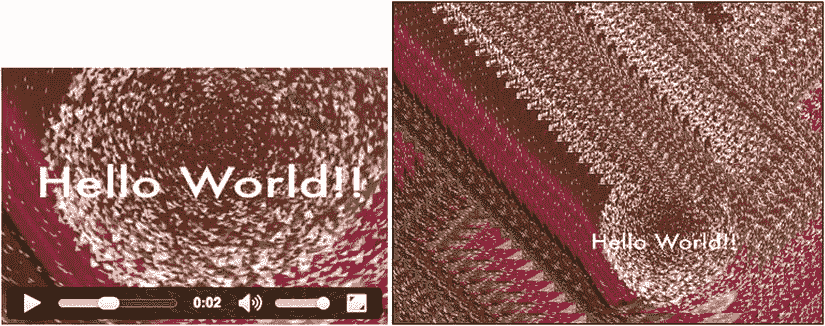

图 5-3 。使用 Chrome 中的 setTimeout 事件将视频绘制到画布中

如果你在各种各样的现代浏览器中尝试过这种方法，你可能会注意到，在完整的 6 秒钟的剪辑回放过程中，每种浏览器都设法绘制了不同数量的视频帧。这是因为他们的 JavaScript 引擎速度不一。他们甚至可能会在继续绘制更多帧之前在中间停留一会儿。这是因为如果有其他更高优先级的工作要做，浏览器有能力延迟一个`setTimeout()`调用。`requestAnimationFrame()`函数不会遇到这个问题，它保证了一个等距的递归渲染调用，从而避免了播放抖动。

 **注意**虽然我们已经演示了一个例子，但不要忘记这是代码，代码的巧妙之处在于能够使用它。例如，像改变`xpos`和`ypos`值这样简单的事情会产生与图中所示完全不同的结果。

扩展的 drawImage( )

到目前为止，我们已经使用了`drawImage()`函数将从视频中提取的像素绘制到画布上。这幅图还包括画布为我们做的缩放，以将像素放入给定的宽度和高度尺寸中。还有一个版本的`drawImage()`允许你从原始视频中提取一个矩形区域，并将其绘制到画布中的一个区域上。这种方法的一个例子是平铺，视频被分成多个矩形，并在矩形之间留有间隙。清单 5-4 展示了一个简单的实现。我们只展示了新的`paintFrame()`函数，因为代码的其余部分与清单 5-2 中的相同。我们还选择了`requestAnimationFrame()`版本的绘画，因为我们真的不需要以比视频更高的帧率进行绘画。

***清单 5-4*** 。将视频平铺到画布中的简单实现

```html
function paintFrame() {
    in_w = 720; in_h = 480;
    w = 360;    h = 240;
    // create 4x4 tiling
    tiles = 4;
    gap = 5;
    for (x = 0; x < tiles; x++) {
      for (y = 0; y < tiles; y++) {
        context.drawImage(video, x*in_w/tiles, y*in_h/tiles,
                          in_w/tiles, in_h/tiles,
                          x*(w/tiles+gap), y*(h/tiles+gap),
                          w/tiles, h/tiles);
      }
    }
    if (video.paused || video.ended) {
      return;
    }
    requestAnimationFrame(paintFrame);
}
```

带有许多参数的`drawImage()`函数允许从原始视频中的任何偏移中提取矩形区域，并将该像素数据绘制到画布中的任何缩放矩形区域中。图 5-4 显示了该功能的工作原理。如您所见，视频的特定区域取自源，并被绘制到画布中的特定区域。源和目的地的特定区域在`drawimage()`参数中设置。

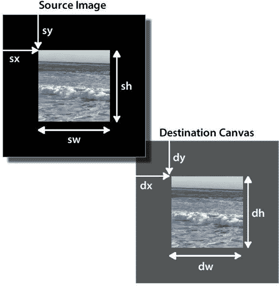

图 5-4 。使用 drawImage()将源视频中的矩形区域提取到画布中的缩放矩形区域中

参数如下:`drawImage(image, sx, sy, sw, sh, dx, dy, dw, dh)`(见图 5-4 )。在清单 5-4 中，参数用于将视频细分为图块，图块的大小由`in_h/tiles`使用`in_w/tiles`设置，其中`in_w`和`in_h`是所用视频文件的固有宽度和高度(即`video.videoWidth`和`video.videoHeight`)。然后用`w/tiles`乘以`h/tiles`缩放这些图块，其中`w`和`h`是画布中视频图像的缩放宽度和高度。然后，每个图块以 5 像素的间距放置在画布上。

 **注意**重要的是你要明白，视频资源的固有宽度和高度用于从视频中提取区域，而不是视频元素中潜在的缩放视频。如果忽略这一点，您可能会计算缩放视频的宽度和高度，并提取错误的区域。还要注意，可以通过将提取的区域放入不同尺寸的目标矩形中来缩放它。

图 5-5 显示了运行清单 5-4 的结果。正如你所看到的，视频在一个 4 × 4 的网格上被分成一系列的小块，每个小块之间相隔 5 个像素。所有浏览器都显示相同的行为。

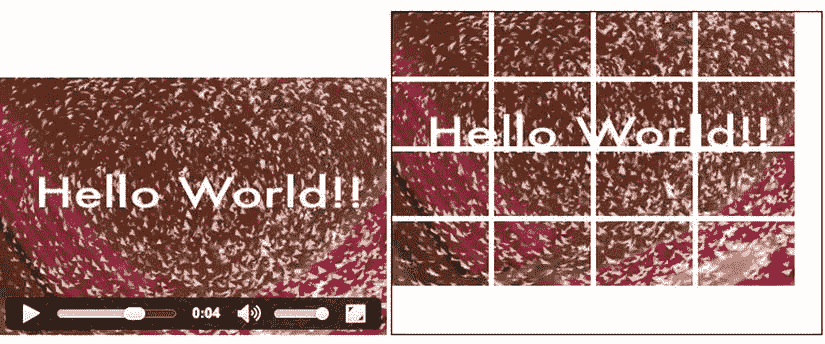

图 5-5 。在 Chrome 中将视频平铺到画布中，视频在左边，画布在右边

这种实现并不完全是最佳实践，因为我们对每个图块调用一次`drawImage()`函数。如果您将变量`tiles` 设置为值`32`，一些浏览器会跟不上画布渲染，画布中的帧速率会停滞不前。这是因为在`setTimeout`函数期间，每次调用`drawImage()`获取视频元素时，都会从视频中检索像素数据。结果是一个超负荷的浏览器。

有三种方法可以克服这一点。它们都依赖于通过画布将视频图像放入中间存储区域，并从那里重新绘制图像。在第一种方法中，你将抓取帧并重画它们，在第二种方法中，你将抓取帧并重画像素，在最后一种方法中，你将使用第二块画布进行像素操作。

抓帧

这种方法包括将视频像素绘制到画布中，然后用`getImageData()`从画布中提取像素数据，再用`putImageData()`将其写出。由于`putImageData()`有参数再次只画出图片的一部分，你应该可以复制和上面一样的效果。下面是函数的签名:`putImageData(imagedata, dx, dy [, dirtyx, dirtyy, dirtyw, dirtyh ])`。

不幸的是，这些参数与`drawImage()`函数的参数不同。“脏”矩形从图像数据中定义要绘制的矩形(默认情况下是完整的图像)。则 dx 和 dy 允许将该矩形从其在 x 和 y 轴上的位置移动得更远。图像不会发生缩放。

你可以在清单 5-5 中看到代码——同样，只提供了`paintFrame()`函数，因为其余部分与清单 5-2 相同。

***清单 5-5*** 。使用 putImageData()在画布中重新实现视频平铺

```html
    function paintFrame() {
        in_w = 720; in_h = 480;
        w = 360; h = 240;
        context.drawImage(video, 0, 0, in_w, in_h, 0, 0, w, h);
        frame = context.getImageData(0, 0, w, h);
        context.clearRect(0, 0, w, h);

        // create 4x4 tiling
        tiles = 4;
        gap = 5;
        for (x = 0; x < tiles; x++) {
          for (y = 0; y < tiles; y++) {
            context.putImageData(frame,
                                 x*gap, y*gap,
                                 x*w/tiles, y*h/tiles,
                                 w/tiles, h/tiles);
          }
        }
        if (video.paused || video.ended) {
          return;
        }
        requestAnimationFrame(paintFrame);
    }
```

在这个版本中，`putImageData()`函数使用参数来指定绘图偏移量，包括视频帧的间隙和剪切矩形的大小。该帧已经通过`getImageData()`作为调整大小的图像被接收。注意，用`drawImage()`绘制的帧需要在用`putImageData()`重新绘制之前清除，因为我们不会在 5 px 的间隙上进行绘制。图 5-6 显示了运行清单 5-5 的结果。

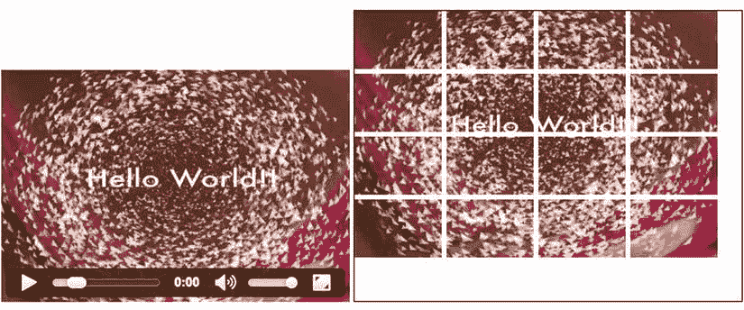

图 5-6 。试图使用`putImageData()`将视频平铺到画布中

 **注意**注意，您必须从 web 服务器上运行这个示例，而不是从本地计算机上的文件中运行。原因是`getImageData()`不能跨站点工作，安全检查将确保它只能在同一个 http 域上工作。这排除了本地文件访问。

像素绘画

第二种方法是手动执行剪切。由于我们已经通过`getImageData()`获得了像素数据，我们可以自己创建每个图块，并使用仅带有偏移属性的`putImageData()`来放置图块。清单 5-6 显示了这种情况下`paintFrame()`函数的实现。

***清单 5-6*** 。用 createImageData 在画布中重新实现视频平铺

```html
function paintFrame() {
    w = 360; h = 240;
    context.drawImage(video, 0, 0, w, h);
    frame = context.getImageData(0, 0, w, h);
    context.clearRect(0, 0, w, h);

    // create 15x15 tiling
    tiles = 15;
    gap = 2;
    nw = w/tiles;
    nh = h/tiles;

    // Loop over the tiles
    for (tx = 0; tx < tiles; tx++) {
      for (ty = 0; ty < tiles; ty++) {
        output = context.createImageData(nw, nh);

        // Loop over each pixel of output file
        for (x = 0; x < nw; x++) {
          for (y = 0; y < nh; y++) {
            // index in output image
            i = x + nw*y;
            // index in frame image
            j = x + w*y + tx*nw + w*nh*ty;
            // copy all the colours
            for (c = 0; c < 4; c++) {
              output.data[4*i+c] = frame.data[4*j+c];
            }
          }
        }

        // Draw the ImageData object.
        context.putImageData(output, tx*(nw+gap), ty*(nh+gap));
      }
    }

    if (video.paused || video.ended) {
      return;
    }
    requestAnimationFrame(paintFrame);
}
```

首先，我们遍历每个图块，并调用`createImageData()`来创建图块图像。为了用像素数据填充图块，我们循环遍历图块图像的像素，并从视频帧图像的相关像素进行填充。然后我们使用`putImageData()`放置瓷砖。图 5-7 显示了 15 × 15 格子瓷砖的结果。

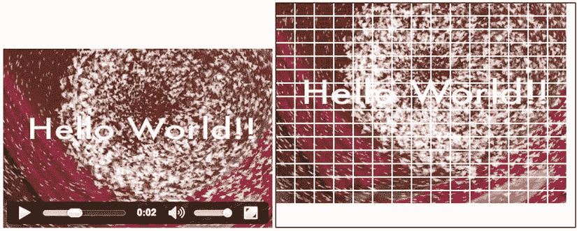

图 5-7 。试图在 Chrome 中使用 putImageData()将视频平铺到画布中

这显然可以通过只写单个图像并在我们写该图像时在瓦片之间放置间隙来改善。每个单幅图块都有一个图像的好处是，您可以更轻松地操作每个单幅图块，例如旋转、平移或缩放单幅图块，但是您需要管理单幅图块的列表(即，保存指向单幅图块的指针列表)。

 **注意**您必须从 web 服务器上运行这个示例，而不是从本地计算机上的文件中运行。原因是`getImageData()`不能跨站点工作，安全检查将确保它只能在同一个 http 域上工作。这排除了本地文件访问。

草稿画布

最后一种方法是将带有`drawImage()`的视频图像存储到一个中间画布中——我们称之为 scratch canvas，因为它的唯一目的是保存像素数据，并且它甚至不在屏幕上显示。一旦完成，您使用`drawImage()`和来自草稿画布的输入在显示的画布上进行绘制。我们的期望是，画布中的图像已经是一种可以一片一片复制到显示的画布中的形式，而不是像以前的幼稚方法那样不断缩放。清单 5-7 中的代码展示了如何使用草稿画布。

***清单 5-7*** 。使用临时画布在画布中重新实现视频平铺

```html
  <video controls autoplay height="240" width="360">
    <source src="video/HelloWorld.mp4"  type="video/mp4">
    <source src="video/HelloWorld.webm" type="video/webm">
  </video>
  <canvas width="400" height="300" style="border: 1px solid black;">
  </canvas>
  <canvas id="scratch" width="360" height="240" style="display: none;"></canvas>

<script>
  var context, sctxt, video;
  video = document.getElementsByTagName("video")[0];
  canvases = document.getElementsByTagName("canvas");
  canvas = canvases[0];
  scratch = canvases[1];
  context = canvas.getContext("2d");
  sctxt = scratch.getContext("2d");
  video.addEventListener("play", paintFrame, false);
  function paintFrame() {
    // set up scratch frames
    w = 360; h = 240;
    sctxt.drawImage(video, 0, 0, w, h);
    // create 4x4 tiling
    tiles = 4;
    gap = 5;
    tw = w/tiles; th = h/tiles;
    for (x = 0; x < tiles; x++) {
      for (y = 0; y < tiles; y++) {
        context.drawImage(scratch, x*tw, y*th, tw, th,
                          x*(tw+gap), y*(th+gap), tw, th);
      }
    }
    if (video.paused || video.ended) {
      return;
    }
    requestAnimationFrame(paintFrame);
  }
</script>
```

注意 HTML 中第二个带有`id=``scratch`的画布。它必须设置得足够大，以便能够包含视频帧。如果您没有给它一个宽度和高度属性，它将默认为 300 × 150，您可能会丢失边缘周围的数据。这个草稿画布的目的是在视频帧被传递到画布之前接收和缩放视频帧。我们不想显示它，这就是为什么它被设置为`display:none`。然后使用清单 5-4 中所示的扩展`drawImage()`函数将图块绘制(参见图 5-8 )到显示的画布中。

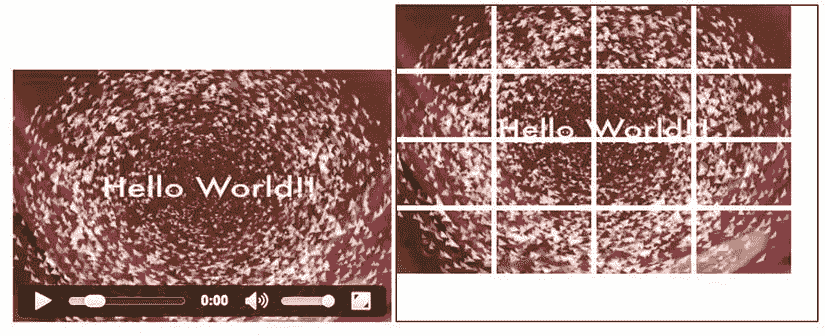

图 5-8 。在 Chrome 中使用“scratch canvas”技术

 **注意**这是最有效的平铺实现方式，因为它不需要重复复制视频中的帧，也不需要不断调整原始帧的大小。它也适用于所有浏览器，包括 IE。它也不需要在网络服务器上运行，这是一个额外的优势。

正如你可能已经收集到的，在画布上平铺视频提供了一些相当有趣的创意可能性。由于每个区块可以单独操作，因此每个区块可以使用不同的变换或其他技术。Sean Christmann 的“放大你的视频”展示了一个将平铺与其他画布效果(如变换)相结合的惊人例子(见`http://craftymind.com/factory/html5video/CanvasVideo.html`)。当你点击视频时，该区域被平铺，平铺散开，如图 5-9 所示，产生了爆炸效果。

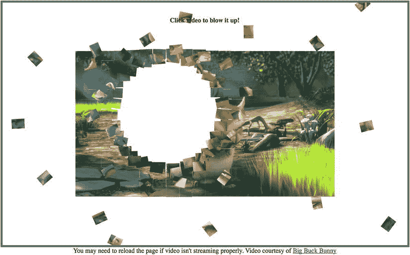

图 5-9 。平铺为你提供了一些严肃的创作可能性

式样

现在我们知道了如何在画布中处理视频，让我们对画布像素进行一些简单的操作，这会产生一些非常有趣的结果。我们将从使视频中的某些像素透明开始。

替换背景的像素透明度

在 HTML5 video 出现之前，Flash video 的标志之一是能够在动画或静态图像上使用 alpha 通道视频。这种技术不能在 HTML5 世界中使用，但是对画布的操作允许我们确定哪些颜色是透明的，并将画布覆盖在其他内容上。清单 5-8 显示了一个视频，其中除了白色之外的所有颜色在被投影到带有背景图像的画布上之前都是透明的。在浏览器中，像素由三种颜色组合而成:红色、绿色和蓝色。r、g 和 b 分量中的每一个可以具有 0 到 255 之间的值，相当于 0%到 100%的强度。当所有 rgb 值都为 0 时为黑色，当所有 RGB 值都为 1 时为白色。在清单 5-8 中，我们发现一个像素的 r、g 和 b 分量都在 180 以上，足够接近白色，所以我们也可以保留一些更“脏”的白色。

***清单 5-8*** 。通过画布操作使视频中的某些颜色透明

```html
function paintFrame() {
  w = 360; h = 240;
  context.drawImage(video, 0, 0, w, h);
  frame = context.getImageData(0, 0, w, h);
  context.clearRect(0, 0, w, h);
  output = context.createImageData(w, h);

  // Loop over each pixel of output file
  for (x = 0; x < w; x++) {
    for (y = 0; y < h; y++) {
      // index in output image
      i = x + w*y;
      for (c = 0; c < 4; c++) {
        output.data[4*i+c] = frame.data[4*i+c];
      }
      // make pixels transparent
      r = frame.data[i * 4 + 0];
      g = frame.data[i * 4 + 1];
      b = frame.data[i * 4 + 2];
      if (!(r > 180 && g > 180 && b > 180))
        output.data[4*i + 3] = 0;
    }
  }
  context.putImageData(output, 0, 0);
  if (video.paused || video.ended) {
    return;
  }
  requestAnimationFrame(paintFrame);
}
```

清单 5-8 显示了基本的绘画功能。页面的其余部分与清单 5-2 非常相似，只是在<画布>样式中添加了一个背景图像。所有像素都以完全相同的方式绘制，除了每个像素的第四个颜色通道设置为 0。这是`a`通道，它决定了`rbga`颜色模型的不透明度，所以我们将所有非白色的像素设为不透明。图 5-10 显示的结果是星星是仅存的不透明像素，在香港的图像上产生烟花的效果。

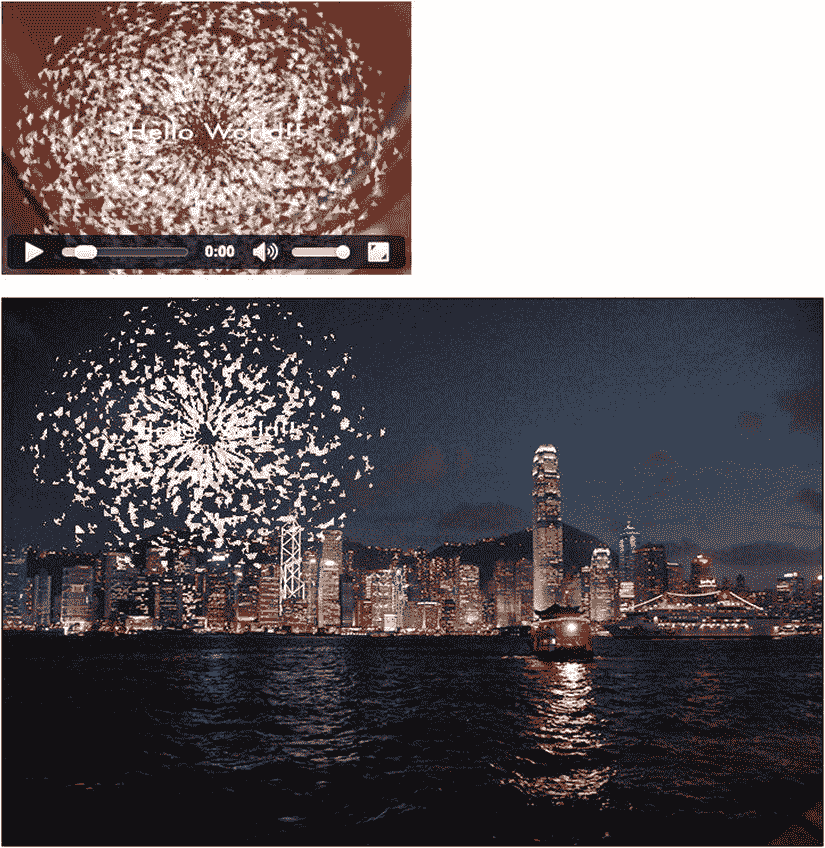

图 5-10 。将遮罩的视频投影到画布中的背景图像上

 **注意**这种技术也可以应用于蓝屏或绿屏视频。在这种情况下，视频中构成纯蓝色或绿色背景的像素变成透明的。如果屏幕光线不均匀，这将不起作用。

缩放像素切片以获得 3D 效果

视频通常放置在 3D 显示器中，通过使用透视使它们看起来更像真实世界的屏幕。这需要将视频的形状缩放为梯形，其中宽度和高度都独立缩放。在画布中，您可以通过绘制不同高度的视频图片垂直切片并使用`drawImage()`函数缩放宽度来实现这一效果。清单 5-9 展示了这种技术的一个很好的例子。

***清单 5-9*** 。使用 3D 效果在 2D 画布中渲染视频

```html
function paintFrame() {
    // set up scratch frame
    w = 270; h = 180;
    sctxt.drawImage(video, 0, 0, w, h);

    // width should be between -500 and +500
    width = -250;
    // right side scaling should be between 0 and 200%
    scale = 2;

    // canvas width and height
    cw = 1000; ch = 400;
    // number of columns to draw
    columns = Math.abs(width);
    // display the picture mirrored?
    mirror = (width > 0) ? 1 : -1;
    // origin of the output picture
    ox = cw/2; oy= (ch-h)/2;
    // slice width
    sw = columns/w;
    // slice height increase steps
    sh = (h*scale-h)/columns;

    // Loop over each pixel column of the output picture
    for (x = 0; x < w; x++) {
      // place output columns
      dx = ox + mirror*x*sw;
      dy = oy - x*sh/2;
      // scale output columns
      dw = sw;
      dh = h + x*sh;
      // draw the pixel column
      context.drawImage(scratch, x, 0, 1, h, dx, dy, dw, dh);
    }
    if (video.paused || video.ended) {
      return;
    }
    requestAnimationFrame(paintFrame);
  }
```

在这个例子中，只显示了`paintFrame()`函数，我们使用了一个 1000×400 的画布和一个 scratch 画布，我们将像素数据放入其中。

当我们将视频帧拖入草稿画布时，我们将视频缩放到我们想要应用效果的大小。然后，我们将像素一列一列地拉到显示的画布中。这样做的时候，我们将像素列的宽度和高度缩放到输出图像所需的“宽度”和高度。输出图像的宽度通过`width`变量给出。输出图像的高度在输出图像左侧的原始高度和右侧的原始高度的`scale`倍之间缩放。负宽度将确定我们正在通过视频的“背面”观看。

这个例子是以这样一种方式编写的，你可以通过简单地改变`width`和`scale`变量来实现无数的创造性效果。比如你可以通过同步改变`width`和`scale`的值来达到翻书的效果。

图 5-11 显示了 Chrome 中的结果。包括 IE 在内的所有浏览器都支持这个例子，并且会显示相同的结果。

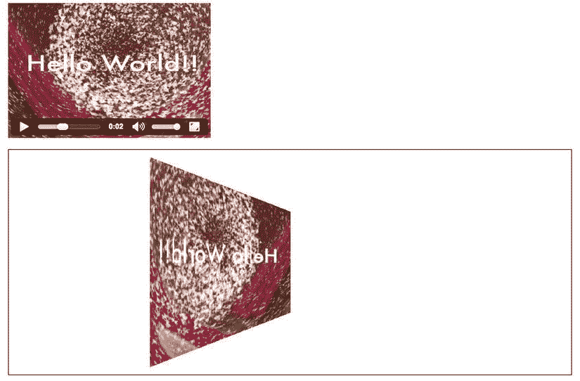

图 5-11 。在 Chrome 中以 3D 视角呈现视频

环境 CSS 颜色框架

画布可以用于的另一个很好的效果通常被称为视频的环境色帧。在这种效果下，会在视频周围创建一个彩色帧或边框区域，并且该帧的颜色会根据视频的平均颜色进行调整。

如果您的视频需要在页面上添加边框，或者您希望它引人注目，这种技术尤其有效。为此，您将经常计算视频的平均颜色，并使用它来填充视频后面的一个比视频稍大的 div。清单 5-10 展示了这种技术的一个实现例子。

***清单 5-10*** 。画布中平均颜色的计算和环境色框的显示

```html
<style type="text/css">
#ambience {
  transition-property: all;
  transition-duration: 1s;
  transition-timing-function: linear;
  padding: 40px;
  width: 366px;
  outline: black solid 10px;
}
video {
  padding: 3px;
  background-color: white;
}
canvas {
  display: none;
}
</style>
<div id="ambience">
    <video controls autoplay height="240" width="360">
      <source src="video/HelloWorld.mp4"  type="video/mp4">
      <source src="video/HelloWorld.webm" type="video/webm">
    </video>
  </div>
  <canvas id="scratch" width="320" height="160"></canvas>
</div>

<script>
  var sctxt, video, ambience;
  ambience = document.getElementById("ambience");
  video = document.getElementsByTagName("video")[0];
  scratch = document.getElementById("scratch");
  sctxt = scratch.getContext("2d");
  video.addEventListener("play", paintAmbience, false);

  function paintAmbience() {
    // set up scratch frame
    sctxt.drawImage(video, 0, 0, 360, 240);
    frame = sctxt.getImageData(0, 0, 360, 240);
    // get average color for frame and transition to it
    color = getColorAvg(frame);
    ambience.style.backgroundColor =
      ’rgb(’+color[0]+’,’+color[1]+’,’+color[2]+’)’;
    if (video.paused || video.ended) {
      return;
    }
    // don’t do it more often than once a second
    setTimeout(function () {
        paintAmbience();
    }, 1000);
  }

  function getColorAvg(frame) {
    r = 0;
    g = 0;
    b = 0;
    // calculate average color from image in canvas
    for (var i = 0; i < frame.data.length; i += 4) {
      r += frame.data[i];
      g += frame.data[i + 1];
      b += frame.data[i + 2];
    }
    r = Math.ceil(r / (frame.data.length / 4));
    g = Math.ceil(g / (frame.data.length / 4));
    b = Math.ceil(b / (frame.data.length / 4));
    return Array(r, g, b);
  }
</script>
```

尽管前面的代码块看起来相当复杂，但也相当容易理解。

我们首先设置 CSS 样式的环境，这样视频就被放在一个单独的

元素中，它的背景色从白色开始，但是会随着视频的播放而改变。视频本身有一个 3 px 的白色填充帧，将它与变色的分开。

由于有了`setTimeout()`功能，视频周围的颜色每秒钟只会改变一次。我们决定在这个例子中使用`setTimeout()`而不是`requestAnimationFrame()`,以减少围绕视频的取景。为了确保平滑的颜色过渡，我们使用 CSS 过渡在一秒钟内完成改变。

正在使用的画布是不可见的，因为它仅用于每秒拉出一个图像帧并计算该帧的平均颜色。然后用那个颜色更新

的背景。图 5-12 显示了结果。

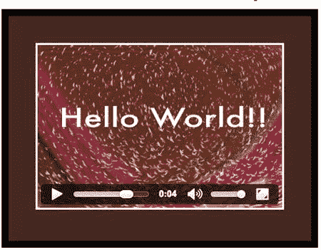

图 5-12 。Opera 中环境 CSS 颜色帧的渲染

如果你正在阅读印刷版，在图 5-12 中，你可能只看到一个深灰色的视频背景。然而，颜色实际上变成了背景中占主导地位的棕色的各种阴影。

 **注意**尽管这项技术属于“酷技术”的范畴，但还是要谨慎使用。如果有一个令人信服的设计或品牌的理由来使用它，无论如何都要使用它。仅仅因为“我能”而使用它不是一个有效的理由。

作为模式的视频

画布提供了一个简单的功能来创建平铺有图像、另一个画布或视频帧的区域。功能是`createPattern()`。这将获取一个图像并将其复制到给定区域，直到该区域充满图像或视频的副本。如果您的视频没有达到您的模式要求的大小，您将需要首先使用一个草稿画布来调整视频帧的大小。

清单 5-11 展示了它是如何完成的。

***清单 5-11*** 。用视频图案填充矩形画布区域

```html
  <video autoplay style="display: none;" >
    <source src="video/HelloWorld.mp4"  type="video/mp4">
    <source src="video/HelloWorld.webm" type="video/webm">
  </video>
  <canvas width="720" height="480" style="border: 1px solid black;">
  </canvas>
  <canvas id="scratch" width="180" height="120" style="display:none;">
  </canvas>

<script>
  var context, sctxt, video;
  video = document.getElementsByTagName("video")[0];
  canvas = document.getElementsByTagName("canvas")[0];
  context = canvas.getContext("2d");
  scratch = document.getElementById("scratch");
  sctxt = scratch.getContext("2d");
  video.addEventListener("play", paintFrame, false);

  function paintFrame() {
    sctxt.drawImage(video, 0, 0, 180, 120);
    pattern = context.createPattern(scratch, ’repeat’);
    context.fillStyle = pattern;
    context.fillRect(0, 0, 720, 480);
    if (video.paused || video.ended) {
      return;
    }
    requestAnimationFrame(paintFrame);
  }
</script>
```

我们隐藏了原始的视频元素，因为视频已经在输出画布上绘制了 16 次。草稿画布大约每 16 毫秒抓取一帧(假设`requestAnimationFrame()`以 60 fps 运行)，然后使用`createPattern()`的“重复”模式将其绘制到输出画布中。

每次调用`paintFrame()`函数时，视频中的当前图像被抓取并用作`createPattern()`中的复制图案。HTML5 canvas 规范声明，如果图像(或画布帧或视频帧)在使用它的`createPattern()`函数调用后被改变，模式不会受到影响。

我们知道无法指定正在使用的图案图像的缩放比例，因此我们必须首先将视频帧加载到草稿画布中，然后从这个草稿画布中创建图案，并将其应用到绘图区域。

图 5-13 显示了 Safari 中的结果。因为所有浏览器都显示相同的行为，所以这代表了所有浏览器。

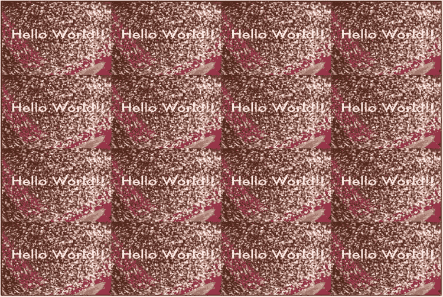

图 5-13 。在 Safari 中渲染视频模式

渐变透明蒙版

渐变遮罩用于逐渐淡化对象的不透明度。尽管市场上几乎每个视频编辑应用都广泛提供透明遮罩，但渐变遮罩也可以在运行时以编程方式添加。这是通过将页面内容(让我们假设一个图像)放在视频下面并在视频上应用灰度渐变来实现的。使用 CSS `mask`属性，我们可以对渐变不透明的灰度蒙版应用透明度。我们也可以使用画布来完成这项工作。

使用 canvas，我们有更多的灵活性，因为我们可以在渐变中使用像素的 rgba 值。在这个例子中，我们简单地重用了前面的代码块，并将视频绘制到画布的中间。通过使用径向渐变，视频被混合到环境背景中。

清单 5-12 显示了代码的关键元素。

***清单 5-12*** 。将渐变透明标记引入环境视频

```html
<style type="text/css">
#ambience {
  transition-property: all;
  transition-duration: 1s;
  transition-timing-function: linear;
  width: 420px; height: 300px;
  outline: black solid 10px;
}
#canvas {
  position: relative;
  left: 30px; top: 30px;
}
</style>
<div id="ambience">
  <canvas id="canvas" width="360" height="240"></canvas>
</div>
<video autoplay style="display: none;">
  <source src="video/HelloWorld.mp4"  type="video/mp4">
  <source src="video/HelloWorld.webm" type="video/webm">
</video>
<canvas id="scratch" width="360" height="240" style="display: none;">
</canvas>
<script>
  var context, sctxt, video, ambience;
  ambience = document.getElementById("ambience");
  video = document.getElementsByTagName("video")[0];
  canvas = document.getElementsByTagName("canvas")[0];
  context = canvas.getContext("2d");
  context.globalCompositeOperation = "destination-in";
  scratch = document.getElementById("scratch");
  sctxt = scratch.getContext("2d");
  gradient = context.createRadialGradient(180,120,0, 180,120,180);
  gradient.addColorStop(0, "rgba( 255, 255, 255, 1)");
  gradient.addColorStop(0.7, "rgba( 125, 125, 125, 0.8)");
  gradient.addColorStop(1, "rgba( 0, 0, 0, 0)");
  video.addEventListener("play", paintAmbience, false);

  function paintAmbience() {
    // set up scratch frame
    sctxt.drawImage(video, 0, 0, 360, 240);
    // get average color for frame and transition to it
    frame = sctxt.getImageData(0, 0, 360, 240);
    color = getColorAvg(frame);
    ambience.style.backgroundColor =
      ’rgba(’+color[0]+’,’+color[1]+’,’+color[2]+’,0.8)’;
    // paint video image
    context.putImageData(frame, 0, 0);
    // throw gradient onto canvas
    context.fillStyle = gradient;
    context.fillRect(0, 0, 360, 240);
    if (video.paused || video.ended) {
      return;
    }
    requestAnimationFrame(paintAmbience);
  }
</script>
```

我们不重复在清单 5-10 中定义的`getColorAvg()`函数。

我们通过将显示画布的`globalCompositeOperation`属性更改为`destination-in`来实现带有渐变的视频遮罩。这意味着我们能够使用放置在视频帧上的渐变来控制视频帧像素的透明度。在这种情况下，我们在`initCanvas`函数中使用径向渐变，并在每个视频帧中重复使用。

图 5-14 显示了所有浏览器中的结果。

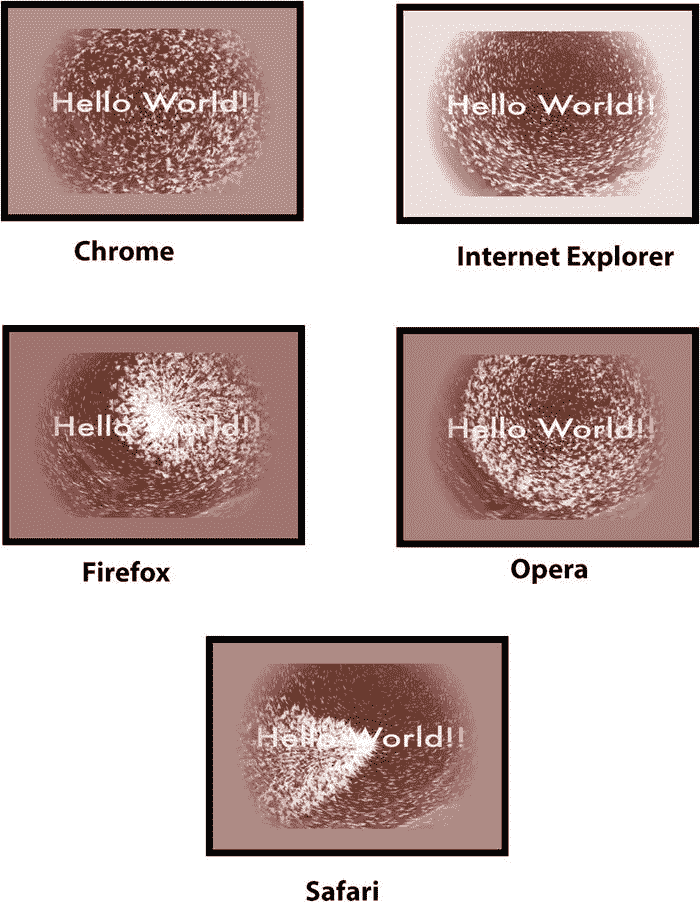

图 5-14 。在各种浏览器中将带有透明遮罩的视频渲染到环境色帧上

剪辑一个区域

另一个有用的合成效果是从画布中剪切出一个区域进行显示。这将导致随后绘制到画布上的所有其他内容都只在剪裁区域中绘制。对于这种技术，一条路径被“画”出来，它可能也包括基本的形状。然后，我们不再使用 stroke()或 fill()方法在画布上绘制这些路径，而是使用`clip()`方法绘制它们，在画布上创建裁剪区域，进一步的绘制将被限制在该区域内。清单 5-13 显示了一个例子。

***清单 5-13*** 。使用剪切路径过滤出视频区域以供显示

```html
<canvas id="canvas" width="360" height="240"></canvas>
<video autoplay style="display: none;">
  <source src="video/HelloWorld.mp4"  type="video/mp4">
  <source src="video/HelloWorld.webm" type="video/webm">
</video>
<script>
  var canvas, context, video;
  video = document.getElementsByTagName("video")[0];
  canvas = document.getElementsByTagName("canvas")[0];
  context = canvas.getContext("2d");
  context.beginPath();
  // speech bubble
  context.moveTo(75,25);
  context.quadraticCurveTo(25,25,25,62.5);
  context.quadraticCurveTo(25,100,50,100);
  context.quadraticCurveTo(100,120,100,125);
  context.quadraticCurveTo(90,120,65,100);
  context.quadraticCurveTo(125,100,125,62.5);
  context.quadraticCurveTo(125,25,75,25);
  // outer circle
  context.arc(180,90,50,0,Math.PI*2,true);
  context.moveTo(215,90);
  // mouth
  context.arc(180,90,30,0,Math.PI,false);
  context.moveTo(170,65);
  // eyes
  context.arc(165,65,5,0,Math.PI*2,false);
  context.arc(195,65,5,0,Math.PI*2,false);
  context.clip();
  video.addEventListener("play", drawFrame, false);

  function drawFrame() {
    context.drawImage(video, 0, 0, 360, 240);
    if (video.paused || video.ended) {
      return;
    }
    requestAnimationFrame(drawFrame);
  }
</script>
```

在这个例子中，我们不显示视频元素，而只在画布上绘制它的帧。在画布的设置过程中，我们定义了一个由一个语音气泡和一个笑脸组成的剪辑路径。然后，我们为`play`事件设置事件监听器，并开始回放视频。在回调中，我们只需要将视频帧绘制到画布上。

这是一个非常简单有效的方法来掩盖视频区域。图 5-15 显示了 Chrome 中的结果。它在所有浏览器中都以同样的方式工作，包括 IE。

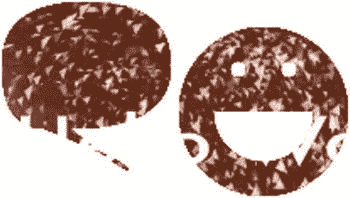

图 5-15 。在谷歌浏览器的裁剪过的画布上渲染视频

 **注意**记住这个例子使用了一个相当简单的编程绘制的形状来屏蔽视频。使用标志或复杂的形状来达到同样的效果是一项艰巨的任务。

绘图文本

正如您在前面的示例中看到的，简单的形状可以用于创建视频遮罩。我们也可以使用文本作为视频的遮罩。这种技术非常简单，既易于可视化(文本颜色被视频取代)，也易于实现。清单 5-14 展示了如何用画布来完成。

***清单 5-14*** 。充满视频的文本

```html
  <canvas id="canvas" width="360" height="240"></canvas>
  <video autoplay style="display: none;">
    <source src="video/HelloWorld.mp4"  type="video/mp4">
    <source src="video/HelloWorld.webm" type="video/webm">
  </video>

<script>
  var canvas, context, video;
  video = document.getElementsByTagName("video")[0];
  canvas = document.getElementsByTagName("canvas")[0];
  context = canvas.getContext("2d");
  // paint text onto canvas as mask
  context.font = ’bold 70px sans-serif’;
  context.textBaseline = ’top’;
  context.fillText(’Hello World!’, 0, 0, 320);
  context.globalCompositeOperation = "source-in";
  video.addEventListener("play", paintFrame, false);

  function paintFrame() {
    context.drawImage(video, 0, 0, 360, 240);
    if (video.paused || video.ended) {
      return;
    }
    requestAnimationFrame(paintFrame);
  }
</script>
```

我们有一个目标画布和一个隐藏的视频元素。在 JavaScript 中，我们首先将文本绘制到画布上。然后，我们使用`globalCompositeOperation`属性将文本用作随后绘制到画布上的所有视频帧的遮罩。

注意，我们使用了`source-in`作为合成函数。这适用于除 Opera 之外的所有浏览器，Opera 只是简单地绘制文本，但之后会忽略`fillText()`剪切部分，再次绘制完整的视频帧。图 5-16 显示了所有支持该功能的其他浏览器的结果。


图 5-16 。在谷歌浏览器中作为文本填充的视频渲染

转换

canvas 也支持 CSS 支持的常见转换。这些 CSS 变换包括平移、旋转、缩放和变换矩阵。我们可以将它们应用到从视频中提取的帧上，给视频一些特殊的效果。

反思

网页设计者和开发者常用的一种视觉效果是倒影。反射实现起来相对简单，而且非常有效，尤其是在黑暗的背景下。你需要做的就是将视频帧拷贝到源视频下面的画布上，翻转拷贝，降低其不透明度，并添加渐变，这些我们之前都学过。

如果我们能够使用使用`box-reflect`属性的纯 CSS 方法来创建反射，那肯定会更容易。不幸的是，这个属性还没有标准化，因此只有 blink 和基于 webkit 的浏览器实现了它。这是坏消息。

好消息是帆布来救援了。通过使用画布，我们可以在跨浏览器环境中创建一致的反射，同时保持复制的视频和源视频同步。

清单 5-15 是一个适用于所有浏览器的例子。

***清单 5-15*** 。使用画布的视频反射

```html
<div style="padding: 50px; background-color: #090909;">
  <video autoplay style="vertical-align: bottom;" width="360">
    <source src="video/HelloWorld.mp4"  type="video/mp4">
    <source src="video/HelloWorld.webm" type="video/webm">
  </video>
  <br/>
  <canvas id="reflection" width="360" height="55"
          style="vertical-align: top;"></canvas>
</div>
<script>
  var context, rctxt, video;
  video = document.getElementsByTagName("video")[0];
  reflection = document.getElementById("reflection");
  rctxt = reflection.getContext("2d");
  // flip canvas
  rctxt.translate(0,160);
  rctxt.scale(1,-1);
  // create gradient
  gradient = rctxt.createLinearGradient(0, 105, 0, 160);
  gradient.addColorStop(0, "rgba(255, 255, 255, 1.0)");
  gradient.addColorStop(1, "rgba(255, 255, 255, 0.3)");
  rctxt.fillStyle = gradient;
  rctxt.rect(0, 105, 360, 160);
  video.addEventListener("play", paintFrame, false);

  function paintFrame() {
    // draw frame, and fill with the opacity gradient mask
    rctxt.drawImage(video, 0, 0, 360, 160);
    rctxt.globalCompositeOperation = "destination-out";
    rctxt.fill();
    // restore composition operation for next frame draw
    rctxt.globalCompositeOperation = "source-over";
    if (video.paused || video.ended) {
      return;
    }
    requestAnimationFrame(paintFrame);
  }
</script>
```

 **注意**这个例子使用了<视频>元素来显示视频，尽管第二块画布也可以用于这个目的。如果您采用这种方法，请确保移除`@controls`属性，因为它会破坏反射感知。

该示例将视频和视频下方对齐的画布放入一个深色的

元素中，为倒影提供一些对比度。同样，确保给<video>和

<canvas>元素相同的宽度。虽然，在这个例子中，我们给反射的高度是原始视频的三分之一。</canvas></video> 

当我们设置画布时，我们使用`scale()`和`translate()`函数将其准备为镜像绘图区域。平移会将其沿视频高度向下移动，缩放会沿 x 轴镜像像素。然后，我们在镜像画布上的视频帧的底部 55 个像素上设置渐变。

`paintFrame()`功能在视频开始播放后并以最大速度播放时应用反射效果。因为我们已经决定让<video>元素显示视频，所以

<canvas>可能跟不上显示，这会导致<video>和它的反射之间有一点时间上的脱节。如果这让你感到困扰，解决方案是通过另一个画布“绘制”视频帧，并隐藏视频本身。您只需要设置第二个

<canvas>元素，并在`paintFrame()`函数上方的画布中添加一个</canvas></video> </canvas></video> `drawImage()`函数。

对于反射，我们将视频帧“绘制”到镜像画布上。当使用两个

<canvas>元素时，您可能会尝试使用`getImageData()`和`putImageData()`来应用画布转换。但是，画布变换不适用于这些函数。你必须使用一个画布，你已经通过`drawImage()`将视频数据拉进画布来应用变换。</canvas>

现在我们只需要镜像图像的渐变。

为了应用梯度，我们使用视频图像的梯度的合成函数。我们之前已经使用合成将画布中的当前图像替换为下一个图像。创建新的合成属性会改变这一点。因此，我们需要在应用渐变后重置合成属性。另一个解决方案是在改变合成属性之前和应用渐变之后使用`save()`和`restore()`函数。如果你改变了不止一个画布属性，或者你不想知道你必须重新设置属性的先前值，使用`save()`和`restore()`确实是更好的方法。

图 5-17 显示了最终的效果图。

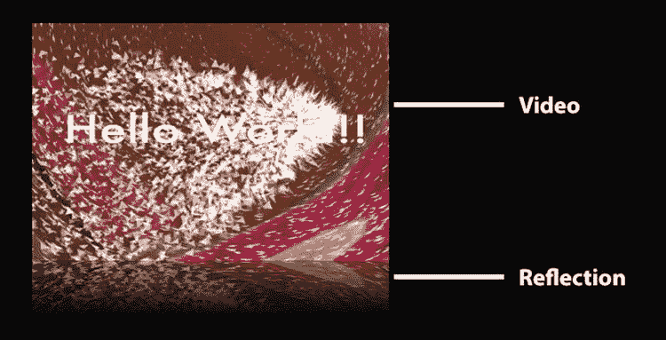

图 5-17 。具有反射的视频渲染

螺旋视频

画布变换可以使我们在本章开始时看到的基于像素的操作变得容易得多，特别是当您想要将它们应用到整个画布时。在列表 5-2 和图 5-2 中显示的例子也可以用`translate()`函数来实现，除了你仍然需要计算何时点击画布的边界来改变你的`translate()`函数。这是通过添加一个`translate(xpos,ypos)`函数来实现的，并且总是在位置(0，0)绘制图像，这并不十分成功。

我们想在这里看一个使用转换的更复杂的例子。我们将使用一个`translate()`和一个`rotate()`来使视频的帧在画布上盘旋。清单 5-16 展示了我们是如何做到这一点的。

***清单 5-16*** 。使用画布的视频螺旋

```html
<script>
  var context, canvas, video;
  var i = 0;
  video = document.getElementsByTagName("video")[0];
  canvas = document.getElementsByTagName("canvas")[0];
  context = canvas.getContext("2d");
  // provide a shadow
  context.shadowOffsetX = 5;
  context.shadowOffsetY = 5;
  context.shadowBlur = 4;
  context.shadowColor = "rgba(0, 0, 0, 0.5)";
  video.addEventListener("play", paintFrame, false);

  function paintFrame() {
    context.drawImage(video, 0, 0, 120, 80);
    context.setTransform(1, 0,
                         0, 1,
                         0, 0);
    i += 1;
    context.translate(3 * i , 1.5 * i);
    context.rotate(0.2 * i);
    if (video.paused || video.ended) {
      alert(i);
      return;
    }
    requestAnimationFrame(paintFrame);
  }
</script>
```

<video>和

<canvas>元素定义与之前的例子没有变化。我们只需要增加画布的大小来适应整个螺旋。我们也给画在画布上的帧添加了阴影，这使它们与之前画的帧产生了偏移。</canvas></video> 

 **注意**Chrome 中视频元素附加的阴影目前不起作用。谷歌正在解决这个问题。

我们绘制螺旋的方式是这样的，我们在平移和旋转的画布上绘制新的视频帧。为了将平移和旋转应用于正确的像素，我们需要在绘制一帧后重置变换矩阵。

这非常重要，因为先前的转换已经为画布存储，这样另一个调用——例如对`translate()`的调用——将沿着旋转设置的倾斜轴进行，而不是像您预期的那样直线下降。因此，必须重置变换矩阵；否则，操作是累积的。

我们还计算了显示的帧数，以便比较不同浏览器的性能。如果你把视频从头到尾播放一遍，你会看到一个带有该数字的警告框以供比较。

图 5-18 显示了 Firefox 中的渲染结果。

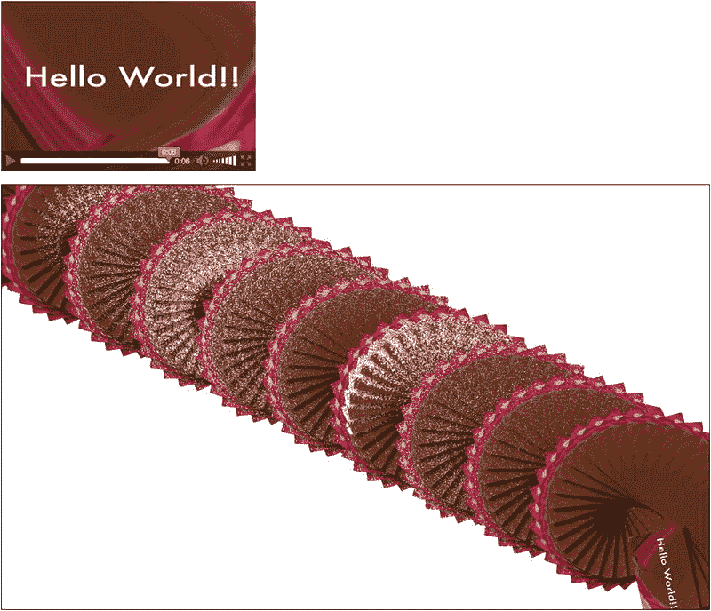

图 5-18 。Firefox 中螺旋形视频帧的渲染

您可能会认为这很棒，但是这给浏览器带来了什么样的性能“冲击”呢？我们来做一个小的浏览器之间的性能比较。

视频文件的持续时间为 6.06 秒。`requestAnimationFrame()`功能以 60Hz 探测视频，因此理论上在视频持续时间内拾取大约 363 帧。Chrome、Safari、Opera 和 IE 都实现了这么多帧的渲染。Firefox 只能达到 165 帧。经过一些实验后，发现画布的大小是问题所在——`drawImage()`要绘制的画布越大，Firefox 就越慢。我们希望这只是我们观察到的暂时问题。

这一比较是在没有为图形操作设置额外硬件加速的情况下，在 Mac OS X 上下载并安装的浏览器上进行的。

结果是，使用这种技术必须有一个合理的理由，因为您无法控制用户选择哪种浏览器。

动画和交互性

我们已经使用`requestAnimationFrame()` 和`setTimeout()`通过画布从视频帧中创建与视频时间轴同步的动画图形。在这一节，我们想看看另一种方式来制作画布动画:通过用户交互。

这里的关键“要点”是画布只知道像素，没有对象的概念。因此，它不能将事件与绘图中的特定形状相关联。然而，作为一个整体，画布接受事件，这意味着您可以将一个`click`事件附加到

<canvas>元素，然后将点击事件的[</canvas>

`x,y` ]坐标与画布的坐标进行比较，以确定它可能与哪个对象相关。

在这一节中，我们将看一个有点像简单游戏的例子。通过单击开始播放视频后，您可以随时再次单击以从引用集合中检索引用。就当是一场幸运饼干赌博吧。清单 5-17 显示了我们是如何做到的。

***清单 5-17*** 。在画布中与用户互动的幸运饼干和视频

```html
<script>
  var quotes =  ["Of those who say nothing,/ few are silent.",
                 "Man is born to live,/ not to prepare for life.",
                 "Time sneaks up on you/ like a windshield on a bug.",
                 "Simplicity is the/ peak of civilization.",
                 "Only I can change my life./ No one can do it for me."];
  var canvas, context, video;
  var w = 640, h = 320;
  video = document.getElementsByTagName("video")[0];
  canvas = document.getElementsByTagName("canvas")[0];
  context = canvas.getContext("2d");
  context.lineWidth = 5;
  context.font = ’bold 25px sans-serif’;
  context.fillText(’Click me!’, w/4+20, h/2, w/2);
  context.strokeRect(w/16,h/4,w*7/8,h/2);
  canvas.addEventListener("click", procClick, false);
  video.addEventListener("play", paintFrame, false);
  video.addEventListener("pause", showRect, false);

  function paintFrame() {
    if (video.paused || video.ended) {
      return;
    }
    context.drawImage(video, 0, 0, w, h);
    context.strokeStyle=’white’;
    context.strokeRect(w/16,h/4,w*7/8,h/2);
    requestAnimationFrame(paintFrame);
  }
  function isPlaying(video) {
    return (!video.paused && !video.ended);
  }

  function showRect(e) {
    context.clearRect(w/16,h/4,w*7/8,h/2);
    quote = quotes[Math.floor(Math.random()*quotes.length)].split("/");
    context.fillStyle = ’blue’;
    context.fillText(quote[0], w/4+5, h/2-10, w/2-10);
    context.fillText(quote[1], w/4+5, h/2+30, w/2-10);
    context.fillStyle = ’white’;
    context.fillText("click again",w/10,h/8);
  }

  function procClick(e) {
    var pos = canvasPosition(e);
    if ((pos[0] < w/4) || (pos[0] > 3*w/4)) return;
    if ((pos[1] < h/4) || (pos[1] > 3*h/4)) return;
    !isPlaying(video) ? video.play() : video.pause();
  }
</script>
```

在这个例子中，我们使用一组引号作为显示的“幸运 cookies”的来源。请注意，字符串中有一个“/”标记，用于将字符串分成多行。这样做是为了便于在单个字符串中存储。

我们继续设置一个空画布，其中有一个矩形，文本为:`"Click me`！".回调是为画布上的`click`事件注册的，也为视频上的`pause`和`play`事件注册的。诀窍是使用“click”回调来暂停和播放视频，这将触发与视频暂停和播放事件相关联的相应效果。我们将可点击区域限制为矩形区域，以展示区域如何在画布中进行交互，即使不知道有什么形状。

`pause`事件触发在视频中间的矩形区域显示幸运饼。`play`事件触发视频帧的继续显示，从而清除了幸运 cookie。注意，如果视频暂停，我们在`paintFrame()`不做任何事情。这将处理从`setTimeout()`函数到`paintFrame()`的任何潜在排队调用。

你可能已经注意到我们在上面的例子中缺少了一个函数——函数`canvasPosition()`和函数。这个函数有助于获得画布中单击的 x 和 y 坐标。它已经被提取到清单 5-18 (你可以在`http://diveintohtml5.org/canvas.html` `)`找到这个例子，因为它将是任何使用 canvas 进行交互工作的人的忠实伴侣。

***清单 5-18*** 。获取画布中点击的 x 和 y 坐标的典型函数

```html
function canvasPosition(e) {
    // from http://www.naslu.com/resource.aspx?id=460
    // and http://diveintohtml5.org/canvas.html
    if (e.pageX || e.pageY) {
      x = e.pageX;
      y = e.pageY;
    } else {
      x = e.clientX + document.body.scrollLeft +
          document.documentElement.scrollLeft;
      y = e.clientY + document.body.scrollTop +
         document.documentElement.scrollTop;
    }
    // make coordinates relative to canvas
    x -= canvas.offsetLeft;
    y -= canvas.offsetTop;
    return [x,y];
  }
```

图 5-19 用不同浏览器的截图展示了这个例子的渲染。

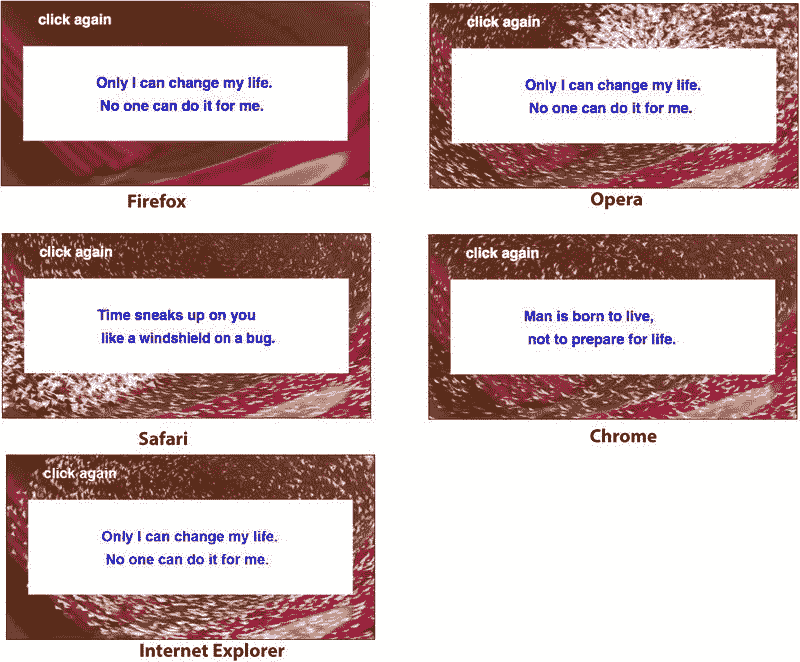

图 5-19 。通过带有视频的交互式画布呈现幸运 cookies 示例

我们可以进一步改进这个例子，当鼠标悬停在盒子上时，将鼠标指针显示为抓手。为此，我们在画布上为`mousemove`事件注册了一个回调，调用清单 5-19 中的函数，该函数在框内改变指针。

***清单 5-19*** 。函数来改变鼠标光标在白盒顶部的位置

```html
function procMove(e) {
  var pos = canvasPosition(e);
  var x = pos[0], y = pos[1];
  if (x > (w/16) && x < (w*15/16) && y > (h/4) && y < (h*3/4)) {
    document.body.style.cursor = "pointer";
  } else {
    document.body.style.cursor = "default";
  }
}
```

您必须重用前面的`canvasPosition()`函数来获取光标位置，然后在将它设置为“pointer”之前决定光标是否在框内

 **注意**注意不同浏览器的字体呈现方式不同，但除此之外，它们都支持相同的功能。

摘要

在本章中，我们利用了 canvas 的一些功能来处理视频图像。

我们首先了解到,`drawImage()`函数允许我们将图像从<video>元素中取出，并作为像素数据放入画布中。然后，我们确定了处理画布中的视频帧的最有效方式，并发现“草稿画布”是一个有用的准备空间，用于处理需要作为模式操作一次并重复使用多次的视频帧。</video>

我们认为`getImageData()`和`putImageData()`函数是操纵视频帧数据的强大助手。

然后，我们利用像素操作功能，如改变某些像素的透明度以实现蓝屏效果，缩放像素切片以实现 3D 效果，或计算视频帧的平均颜色以创建周围环境。我们还利用了`createPattern()`函数在给定的矩形上复制一个视频帧。

然后我们转向画布的合成功能，将几个独立的功能放在一起。我们使用渐变从视频渐变到环境背景、剪辑路径和文本作为模板，从视频中剪切出某些区域。

有了画布转换功能，我们终于能够创建一个跨浏览器工作的视频反射。我们还用它来旋转视频帧，从而让它们在画布上盘旋。

我们通过将用户在画布上的点击与视频活动联系起来，总结了我们对画布的看法。因为画布上没有可寻址的对象，只有可寻址的像素位置，所以它不像 SVG 那样适合捕捉对象上的事件。

在下一章，我们将深入音频 API。我们在那里见。