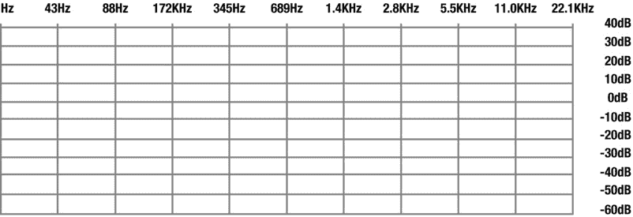
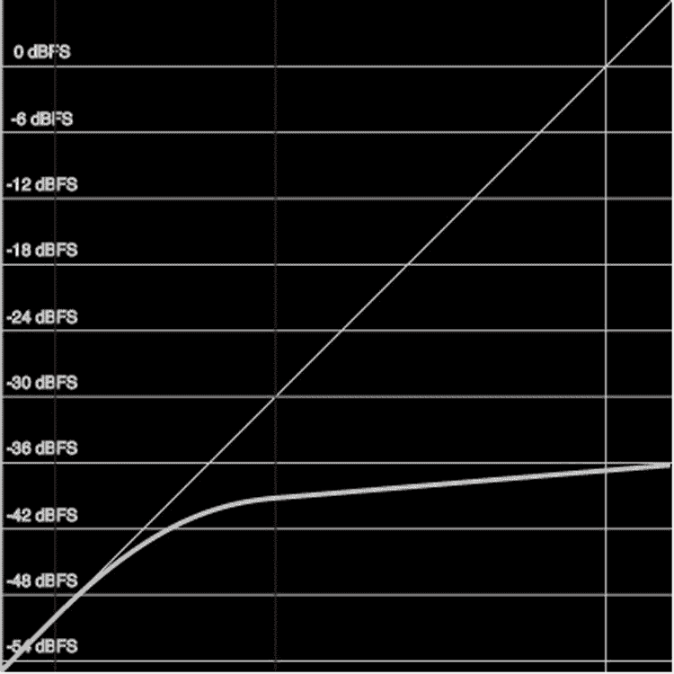

# 六、通过网络音频 API 操纵音频

说到网络，音频是...“嗯”...它就在那里。这并不是贬低音频，但是，在许多方面，音频被视为一种事后的想法或一种烦恼。然而，它的重要性不能低估。从作为用户反馈的点击声等简单效果到描述产品或事件的画外音，音频是一种主要的沟通媒介，正如一位作者喜欢说的那样，“达成交易”

音频的关键在于，当它被数字化时，它可以被操纵。要做到这一点，我们需要停止将音频视为声音，并看到它的真实面目:可以被操纵的数据。这就把我们带到了本章的主题:如何在网络浏览器中操作声音数据。

Web Audio API(应用编程接口)补充了我们刚刚了解的处理视频数据的功能。这使得开发复杂的基于 web 的游戏或音频制作应用成为可能，在这些应用中，可以用 JavaScript 动态地创建和修改音频。它还支持音频数据的可视化和数据分析，例如，确定节拍或识别正在演奏的乐器，或者您听到的声音是女性还是男性。

Web 音频 API ( `http://webaudio.github.io/web-audio-api/`)是 W3C 音频工作组正在开发的规范。这个规范已经在除了 IE 之外的所有主流桌面浏览器中实现。微软已经将它添加到它的开发路线图中，所以我们可以假设它会得到普遍支持。Safari 目前在实现中使用了一个`webkit`前缀。Mozilla 曾经实现了一个更简单的音频处理规范，称为“音频数据 API ”,但后来也用 Web 音频 API 规范取代了它。

 **注** W3C 音频工作组也开发了一个 Web MIDI API 规范(`www.w3.org/TR/webmidi/`)，但目前只提供给 Google Chrome 作为试用实现，所以我们暂时不解释这个 API。

在我们开始之前，回顾一下数字音频的基础知识是很有用的。

位深度和采样率

我们传统上将声音想象成正弦波——波越靠近，频率越高，因此声音也越高。至于波的高度，那叫做信号的振幅，波越高，声音越大。这些波，例如图 6-1 中的所示的，被称为**波形**。横线是时间，如果信号没有离开横线，那就是沉默。


图 6-1 。Adobe Audition CC 2014 的典型波形

对于任何要数字化的声音，比如 Fireworks 或 Photoshop 中的彩色图像，都需要对波形进行采样。样本只不过是以固定间隔采样的波形的快照。以一张音频 CD 为例，以每秒 44100 次的频率采样，传统上认定为 44.1kHz，在快照时刻采样的值是代表当时音量的数字。每秒钟采样波形的频率称为采样率。采样率越高，原始模拟声音的数字表现就越准确。当然，这样做的缺点是采样率越高，文件越大。

*Bitdepth* 是样本值的分辨率。8 位的位深度意味着快照表示为范围从–128 到 127 的数字(即，该值适合 8 位)。16 位的位深度意味着该数字在–32，768 到 32，767 之间。如果你计算一下，你会发现一个 8 位快照每个样本有 256 个潜在值，而它的 16 位副本每个样本只有 65，000 个潜在值。样本潜在值的数量越多，数字文件可以代表的动态范围就越大。

立体声信号 每只耳朵都有一个波形。这些波形中的每一个都被单独数字化成一系列样本。它们通常被存储为一系列的对，这些对被分开以回放到它们各自的通道中。

当这些数字按照采样的顺序和频率播放时，它们会重现声音的波形。显然，更大的位深度和更高的采样速率意味着回放波形的精度更高，对波形拍摄的快照越多，波形的表现就越准确。这解释了为什么一张专辑中的歌曲有如此大的文件大小。它们以尽可能高的位深度被采样。

最常用的三种采样率是 11.025kHz、22.05kHz 和 44.1kHz。如果将采样率从 44.1kHz 降低到 22.05kHz，文件大小将减少 50%。如果速率降低到 11.025kHz，您会获得更显著的降低，另一个 50%。问题是降低采样速率会降低音频质量。以 11.025 千赫的频率听贝多芬的第九交响曲会让音乐听起来像是从锡罐里放出来的。

作为一名网页设计者或开发者，你的主要目标是以最小的文件大小获得最好的音质。尽管许多开发人员会告诉你 16 位、44.1kHz 立体声是最佳选择，但你会很快意识到这不一定是真的。例如，16 位、44.1kHz 的立体声鼠标点击声或持续时间不到几秒钟的声音——如物体滑过屏幕时发出的嗖嗖声——都是对带宽的浪费。持续时间如此之短，声音中表现的频率如此有限，以至于如果你点击的是 8 位、22.05kHz 的单声道声音，普通用户不会意识到这一点。他们听到咔哒声后继续前进。音乐文件也是如此。普通用户最有可能通过购买电脑时附赠的廉价扬声器收听。在这种情况下，一个 16 位、22.05kHz 的音轨听起来会像它的 CD 质量丰富的表亲一样好。

HTML5 音频格式

在第一章中，我们已经讨论了用于 HTML 5 的三种音频格式:MP3、WAV 和 OGG Vorbis。这些都是编码音频格式(即，音频波形的原始样本被压缩以占用更少的空间，并能够在互联网上更快地传输)。所有这些格式都使用感知编码，这意味着它们从音频流中丢弃了人类通常无法感知的所有信息。当信息以这种方式被丢弃时，文件大小会相应减小。用于编码的信息包括你的狗能听到但你听不到的声音频率。简而言之，你只能听到人类能够感知的声音(这也解释了为什么动物不太喜欢 iPods)。

所有感知编码器允许你选择多少音频是不重要的。大多数编码器使用不超过 16 Kbps 的速度来创建语音记录，从而产生高质量的文件。例如，当你创作一首 MP3 时，你需要注意带宽。格式是好的，但是如果带宽没有针对其预期用途进行优化，您的结果将是不可接受的，这就是为什么创建 MP3 文件的应用要求您设置带宽和采样率。

在这一章中，我们将处理原始音频样本，并对其进行处理以获得专业的音频效果。浏览器负责为我们解码压缩的音频文件。

泛泛而谈就到此为止；让我们从实际出发，通过使用 Web 音频 API 来处理音频数据核心的 1 和 0。我们从过滤图和`AudioContext` 开始。

过滤图和音频上下文

Web Audio API 规范基于构建连接的`AudioNode`对象的图形来定义整体音频渲染的思想。这非常类似于作为许多媒体框架基础的过滤图思想，包括 DirectShow、GStreamer 以及 JACK 音频连接工具包。

一个**滤波器图**背后的思想是，通过以特定方式修改输入数据的一系列滤波器(声音修改器)发送输入信号，将一个或多个输入信号(在我们的例子中:声音信号)连接到目的渲染器(声音输出)。

术语**音频滤波器** 可以指改变音频信号的音色、谐波含量、音高或波形的任何东西。该规格包括用于各种音频用途的滤波器，包括:

*   空间化的音频在 3D 空间中移动声音。
*   模拟声学空间的卷积引擎。
*   实时频率分析，以确定声音的组成。
*   提取特定频率区域的频率滤波器。
*   样本精确的预定声音回放。

Web Audio API 中的过滤图包含在一个`AudioContext`中，由连接的`AudioNode`对象组成，如图图 6-2 所示。


图 6-2 。网络音频 API 中过滤图的概念

正如您所看到的，存在没有传入连接的 AudioNode 对象—这些被称为源节点。它们也只能连接到一个音频节点。示例包括麦克风输入、媒体元素、远程麦克风输入(通过 WebRTC 连接时)、存储在内存缓冲区中的纯音频样本或振荡器等人工声源。

 **注****WebRTC**(Web Real-Time Communication)是万维网联盟(W3C)起草的 API 定义，它支持浏览器到浏览器的应用进行语音通话、视频聊天和 P2P 文件共享，而无需内部或外部插件。这是一个很大的话题，超出了本书的范围。

没有传出连接的对象称为目的节点，它们只有一个传入连接。例如音频输出设备(扬声器)和远程输出设备(通过 WebRTC 连接时)。

中间的其他`AudioNode`对象可能有多个输入连接和/或多个输出连接，是中间处理节点。

开发者不用担心两个`AudioNode`对象连接时的低级流格式细节；正确的事情就会发生。例如，如果单声道音频滤波器连接了立体声输入，它将只接收左右声道的混音。

首先，让我们创建一个网络音频应用的“Hello World”。为了跟随示例，在`http://html5videoguide.net/`中提供了完整的示例。清单 6-1 显示了一个简单的例子，一个振荡器源连接到默认的扬声器目的节点。你会听到频率为 1 千赫的声波。一句警告的话:我们将处理音频样本和文件，你可能要确保你的电脑音量降低。

***清单 6-1*** 。振荡器源节点和声音输出目的节点的简单过滤图

```html
// create web audio api context
var audioCtx = new (window.AudioContext || window.webkitAudioContext)();

// create Oscillator node
var oscillator = audioCtx.createOscillator();
oscillator.connect(audioCtx.destination);
oscillator.type = ’square’;
oscillator.frequency.value = 1000; // value in hertz

oscillator.start(0);
```

 **注意**如果你想听到不同的音调，只需改变`oscillator.frequency.value`中的数字。如果你不添加频率值，默认是 440 赫兹，对于音乐倾向，是一个高于中音 c 的 A。为什么是这个值？如果你曾经去过交响乐团，听到乐队成员调整他们的乐器，那种音调已经成为音乐会音高的标准。

`oscillator.start()`函数有一个可选参数来描述声音应该在什么时间开始播放。不幸的是，在 Safari 中它不是可选的。所以一定要加上 0。

图 6-3 显示了我们创建的过滤器图。


图 6-3 。网络音频 API 中的简单过滤图示例

让我们深入研究一下这个例子刚刚介绍的不同结构。

音频上下文接口

`AudioContext`提供了创建`AudioNode`对象并将其相互连接的环境。所有类型的`AudioNode`对象都在下面代码所示的`AudioContext`中定义。有许多`AudioNode`对象，我们将一步一步地接近这个对象，并在本章的每一步解释我们需要的一些东西。

```html
[Constructor]
interface AudioContext : EventTarget {
     readonly    attribute AudioDestinationNode destination;
     readonly    attribute float                sampleRate;
     readonly    attribute double               currentTime;
     Promise                         suspend ();
     Promise                         resume ();
     Promise                         close ();
     readonly    attribute AudioContextState    state;
                 attribute EventHandler         onstatechange;
     OscillatorNode                  createOscillator ();
      ...
};
interface AudioDestinationNode : AudioNode {
    readonly    attribute unsigned long maxChannelCount;
};
enum AudioContextState {
    "suspended",
    "running",
    "closed"
};
```

每个`AudioContext` 包含一个只读`AudioDestinationNode`。目的地通常是计算机连接的音频输出设备，如扬声器或耳机。脚本会将所有用户想要听到的音频连接到这个节点，作为`AudioContext`的过滤图中的“终端”节点。你可以看到我们已经通过使用`AudioContext`对象并在其上调用`createOscillator()`创建了振荡器，并设置了振荡器的一些参数。然后我们通过调用振荡器对象上的`connect()`函数将其连接到扬声器/耳机输出的目的地。

`AudioContext`的`sampleRate`在`AudioContext`的生命周期内是固定的，并设置上下文中所有`AudioNodes`的采样率。因此，在`AudioContext`中不可能进行采样率转换。默认情况下，`sampleRate`为 44,100Hz。

`AudioContext`的`currentTime`是以秒为单位的时间，表示`AudioContext`的年龄(即，当上下文被创建时，它从零开始，并且实时增加)。所有预定时间都是相对于它的。重要的是要记住`AudioContext`中的所有事件都是针对这个时钟运行的，它在几分之一秒内进行。

`suspend()`、`resume()`和`close()`呼叫将影响`currentTime`并暂停、恢复或停止其增加。他们也影响着`AudioContext`是否能控制音频硬件。调用`close()`后，`AudioContext`不可用于创建新节点。`AudioContextState`表示`AudioContext`所处的状态:暂停、运行或关闭。

 **注意**浏览器目前不支持`suspend()`、`resume()`、`close()`功能和状态属性。

清单 6-2 显示了一个`AudioContext`的几个参数，结果显示在图 6-4 中。

***清单 6-2*** 。音频上下文的参数

```html
<div id="display"></div>
    <script type="text/javascript">
      var display = document.getElementById("display");
      var context = new (window.AudioContext || window.webkitAudioContext)();
      display.innerHTML  = context.sampleRate + " sampling rate<br/>";
      display.innerHTML += context.destination.numberOfChannels
                                               + " output channels<br/>";
      display.innerHTML += context.currentTime + " currentTime<br/>";
    </script>
```


图 6-4 。Chrome 中默认的 AudioContext 的参数

在通过`AudioDestinationNode`播放声音之前，不知道输出通道的数量。

让我们再看看那个振荡器。它属于类型`OscillatorNode`，包含一些我们可以操作的属性。

```html
interface OscillatorNode : AudioNode {
                attribute OscillatorType type;
    readonly    attribute AudioParam     frequency;
    readonly    attribute AudioParam     detune;
    void start (optional double when = 0);
    void stop (optional double when = 0);
    void setPeriodicWave (PeriodicWave periodicWave);
                attribute EventHandler   onended;
};
enum OscillatorType {
    "sine",
    "square",
    "sawtooth",
    "triangle",
    "custom"
};
```

第一个属性是`OscillatorType` ，我们在例子中将其设置为“square”。您可以在示例中改变它，并会注意到音调的音色如何变化，而其频率保持不变。

频率是一个`AudioParam`对象，我们马上就会看到。它有一个可以设置的值，在我们的示例中，我们将其设置为 1，000Hz。

`OscillatorNode`还有一个`detune`属性，它将频率偏移给定的百分比量。其默认值为 0。去谐有助于使音符听起来更自然。

`OscillatorNode`上的`start()`和`stop()`方法参照`AudioContext`的`currentTime`确定振荡器的开始和结束时间。请注意，您只能调用`start()`和`stop()`一次，因为它们定义了声音存在的范围。但是，您可以将振荡器与`AudioDestinationNode`(或滤波器图中的下一个`AudioNode`)连接或断开，以暂停/取消暂停声音。

`setPeriodicWave()`功能允许设置自定义振荡器波形。使用`AudioContext`的`createPeriodicWave()`功能，使用傅立叶系数阵列创建自定义波形，作为周期波形的分波。除非你在写合成器，否则你可能不需要理解这个。

AudioParam 接口

我们刚刚用于`OscillatorNode`的`frequency`和`detune`属性的`AudioParam`对象类型实际上相当重要，所以让我们试着更好地理解它。它是`AudioNode`在滤波器图中进行的任何音频处理的核心，因为它保存了控制`AudioNodes`关键方面的参数。在我们的例子中，它是振荡器运行的频率。我们可以通过`value`参数随时改变频率。这意味着一个事件被安排在下一个可能的时刻改变振荡器的频率。

由于浏览器可能会非常繁忙，所以无法预测这一事件何时会发生。在我们的例子中，这可能没问题，但如果你是一名音乐家，你会希望你的计时非常准确。因此，每个`AudioParam`维护一个按时间顺序排列的变更事件列表。计划更改的时间在`AudioContext’s currentTime`属性的时间坐标系中。这些事件要么立即启动更改，要么启动/结束更改。

以下是`AudioParam`界面的组件:

```html
interface AudioParam {
                attribute float value;
    readonly    attribute float defaultValue;
    void setValueAtTime (float value, double startTime);
    void linearRampToValueAtTime (float value, double endTime);
    void exponentialRampToValueAtTime (float value, double endTime);
    void setTargetAtTime (float target, double startTime, float timeConstant);
    void setValueCurveAtTime (Float32Array values, double startTime,
                              double duration);
    void cancelScheduledValues (double startTime);
};
```

事件列表由`AudioContext`在内部维护。以下方法可以通过向列表中添加新事件来更改事件列表。事件的类型由方法定义。这些方法被称为*自动化*方法。

*   **`setValueAtTime()`** 告诉`AudioNode`在给定的`startTime`处将其`AudioParam`改为*值*。
*   **`linearRampToValueAtTime()`** 告知`AudioNode`通过给定的`endTime`将其`AudioParam`值提升至*值*。这意味着它要么从“现在”开始，要么从`AudioNode`事件列表中的前一个事件开始。
*   **`exponentialRampToValueAtTime()`** 告诉`AudioNode`使用指数连续变化从先前预定的参数值到给定的`value`通过给定的`endTime`增加其`AudioParam`值。由于人类感知声音的方式，表示滤波器频率和回放速率的参数最好以指数方式变化。
*   **`setTargetAtTime()`** 告诉`AudioNode`以给定的`startTime`开始以给定`timeConstant`的速率指数逼近目标`value`。在其他用途中，这对于实现 ADSR(起音-衰减-延音-释放)包络的“衰减”和“释放”部分很有用。参数值不会在给定时间立即变为目标值，而是逐渐变为目标值。`timeConstant`越大，过渡越慢。
*   **`setValueCurveAtTime()`** 告诉`AudioNode`按照从给定`startTime`开始的任意参数`values`的数组为给定`duration`修改其值。值的数量将被缩放以适合所需的`duration`。
*   **`cancelScheduledValues()`** 告诉`AudioNode`取消所有时间大于或等于`startTime`的预定参数变更。

预定事件对于包络、音量渐变、lfo(低频振荡)、滤波器扫描或颗粒窗口等任务非常有用。我们不打算解释这些，但是专业的音乐人会知道它们是什么。重要的是，您要理解自动化方法提供了一种在给定时间实例中将参数值从一个值更改为另一个值的机制，并且这种更改可以遵循不同的曲线。这样，可以在任何`AudioParam`上设定任意基于时间线的自动化曲线。我们将在一个例子中看到这意味着什么。

使用时间线，图 6-5 显示了一个自动计划，用于使用前面介绍的所有方法改变振荡器的频率。黑色的是`setValueAtTime`调用，每个调用的`value`是一个黑色的叉号，它们的`startTime`在`currentTime`时间线上。`exponentialRampToValueAtTime`和`linearRampToValueAtTime`调用在`endTime`(时间线上的灰色线)处有一个目标`value`(灰色十字)。`setTargetAtTime`调用有一个`startTime`(时间线上的灰色线)和一个目标`value`(灰色十字)。`setValueCurveAtTime`调用有一个`startTime`、一个`duration`和在此期间它经历的多个`values`。所有这些结合在一起就产生了哔哔声和你在测试代码时听到的变化。


图 6-5 。振荡器频率的 AudioParam 自动化

清单 6-3 展示了我们如何用这种自动化来改编清单 6-1 。

***清单 6-3*** 。振荡器的频率自动化

```html
var audioCtx = new (window.AudioContext || window.webkitAudioContext)();
  var oscillator = audioCtx.createOscillator();
  var freqArray = new Float32Array(5);
  freqArray[0] = 4000;
  freqArray[1] = 3000;
  freqArray[2] = 1500;
  freqArray[3] = 3000;
  freqArray[4] = 1500;

  oscillator.type = ’square’;
  oscillator.frequency.value = 100; // value in hertz

  oscillator.connect(audioCtx.destination);
  oscillator.start(0);
  oscillator.frequency.cancelScheduledValues(audioCtx.currentTime);
  oscillator.frequency.setValueAtTime(500, audioCtx.currentTime + 1);
  oscillator.frequency.exponentialRampToValueAtTime(4000,
                                                   audioCtx.currentTime + 4);
  oscillator.frequency.setValueAtTime(3000, audioCtx.currentTime + 5);
  oscillator.frequency.linearRampToValueAtTime(1000,
                                               audioCtx.currentTime + 8);
  oscillator.frequency.setTargetAtTime(4000, audioCtx.currentTime + 10, 1);
  oscillator.frequency.setValueAtTime(1000, audioCtx.currentTime + 12);
  oscillator.frequency.setValueCurveAtTime(freqArray,
                                           audioCtx.currentTime + 14, 4);
```

`AudioNodes`实际上可以对每个单独的音频样本或 128 个样本的块进行值计算。当需要对块的每个样本单独进行数值计算时，`AudioParam`将指定它是一个 **a-rate** 参数。它将指定它是一个 **k-rate** 参数，此时只计算块的第一个样本，结果值用于整个块。

振荡器的`frequency`和`detune`参数都是 a 速率参数，因为每个单独的音频样本都可能需要调整频率和失谐。

*a-rate* `AudioParam`获取音频信号的每个样本帧的当前音频参数值。

一个 *k-rate* `AudioParam`对处理的整个块(即 128 个样本帧)使用相同的初始音频参数值。

音频节点接口

前面我们已经熟悉了`OscillatorNode`，它是`AudioNode`的一种，是过滤图的构建模块。一个`OscillatorNode`是一个源节点。我们还熟悉了过滤图中的一种目的节点类型:??。是时候我们深入了解一下`AudioNode`接口本身了，因为这是`OscillatorNode`的`connect()`功能的来源。

```html
interface AudioNode : EventTarget {
    void connect (AudioNode destination, optional unsigned long output = 0,
                  optional unsigned long input = 0);
    void connect (AudioParam destination, optional unsigned long output = 0 );
    void disconnect (optional unsigned long output = 0);
    readonly    attribute AudioContext          context;
    readonly    attribute unsigned long         numberOfInputs;
    readonly    attribute unsigned long         numberOfOutputs;
                attribute unsigned long         channelCount;
                attribute ChannelCountMode      channelCountMode;
                attribute ChannelInterpretation channelInterpretation;
};
```

一个`AudioNode`只能属于一个`AudioContext`，存储在`context`属性中。

`AudioNode`中的第一个`connect()`方法将它连接到另一个`AudioNode`。在一个特定节点的给定输出和另一个节点的给定输入之间只能有一个连接。`output`参数指定要连接的输出索引，类似地`input`参数指定要连接到目的地`AudioNode`的哪个输入索引。

`AudioNode`的`numberOfInputs`属性提供了输入到`AudioNode`的输入数量，而`numberOfOutputs`提供了从`AudioNode`输出的数量。源节点有 0 个输入，目的节点有 0 个输出。

一个`AudioNode`可能有比输入更多的输出；因此支持扇出。它的输入可能多于输出，这支持扇入。将一个`AudioNode`连接到另一个`AudioNode`并返回是可能的，从而形成一个循环。这只有在循环中至少有一个`DelayNode`时才被允许，否则你会得到一个`NotSupportedError`异常。

非源和非目标`AudioNode`的每个输入和输出都有一个或多个通道。输入、输出及其通道的确切数量取决于`AudioNode`的类型。

`channelCount` 属性包含`AudioNode`固有处理的通道数量。默认情况下，它是 2，但是可能会被这个属性的一个显式的新值覆盖，或者通过`channelCountMode`属性覆盖。

```html
enum ChannelCountMode {     "max",     "clamped-max",     "explicit" };
```

这些值具有以下含义:

*   当`channelCountMode`为“max”时，`AudioNode`处理的通道数是所有输入和输出连接的最大通道数，`channelCount`被忽略。
*   当`channelCountMode`为“clamped-max”时，`AudioNode`处理的通道数是所有输入和输出连接的最大通道数，但也是`channelCount`的最大值。
*   当`channelCountMode`为“显式”时，`AudioNode`处理的通道数量由`channelCount`决定。

对于每个输入，`AudioNode`混合(通常是上混合)到该节点的所有连接。当输入的通道需要向下或向上混合时，`channelInterpretation`属性决定如何处理这种向下或向上混合。

```html
enum ChannelInterpretation { "speakers", "discrete" };
```

当`channelInterpretation`为“离散”时，上混是通过填充通道直到它们用完，然后将剩余通道归零，下混是通过填充尽可能多的通道，然后丢弃剩余通道。

如果`channelInterpretation`设置为“speaker”，则为特定的声道布局定义上混和下混:

*   1 通道:单声道(通道 0)
*   2 个通道:左通道(通道 0)，右通道(通道 1)
*   4 声道:左声道(通道 0)、右声道(通道 1)、环绕左声道(通道 2)、环绕右声道(通道 3)
*   5.1 声道:左声道(ch 0)、右声道(ch 1)、中声道(ch 2)、低音炮(ch 3)、左环绕声道(ch 4)、右环绕声道(ch 5)

向上混合的工作方式如下:

*   单声道:复制到左右声道(2 和 4 声道)，复制到中央(5.1 声道)
*   立体声:复制到左右声道(适用于 4 声道和 5.1 声道)
*   4 声道:复制到左侧和右侧，环绕左侧和环绕右侧(适用于 5.1)

每隔一个频道保持在 0。

缩混的工作原理如下:

*   单声道缩混:
    *   2 -> 1: 0.5 *(左+右)
    *   4 -> 1: 0.25 *(左+右+环绕左+环绕右)
    *   5.1 -> 1: 0.7071 *(左+右)+居中
    *   + 0.5 *(左环绕+右环绕)
*   立体声缩混:
    *   4 -> 2: left = 0.5 * (left + surround left)

        左= 0.5 *(右+环绕右)

    *   5.1 -> 2: left = L + 0.7071 * (center + surround left)

        右= R + 0.7071 *(中央+环绕右侧)

*   四声道缩混:
    *   5.1 -> 4: left = left + 0.7071 * center

        右=右+ 0.7071 *中心

        环绕左=环绕左

        右环绕=右环绕

图 6-6 描述了一个`AudioNode`的假设输入和输出场景，其中每个场景都有不同的通道集。如果通道数不在 1、2、4 和/或 6 中，则使用“离散”解释。


图 6-6 。音频节点的通道和输入/输出

最后，`AudioNode`对象上的第二个`connect()`方法将一个`AudioParam`连接到一个`AudioNode`。这意味着参数值由音频信号控制。

可以将一个`AudioNode`输出连接到一个以上的`AudioParam`,并多次调用`connect()`,从而支持扇出并通过一个音频信号控制多个`AudioParam`设置。也可以通过对`connect();`的多次调用将多个`AudioNode`输出连接到单个`AudioParam`，从而支持扇入并控制具有多个音频输入的单个`AudioParam`。

一个特定节点的给定输出和一个特定的`AudioParam`之间只能有一个连接。同一`AudioNode`和同一`AudioParam`之间的多个连接被忽略。

一个`AudioParam` 将从连接到它的任何`AudioNode`输出获取渲染的音频数据，并通过缩混将其转换为单声道(如果它还不是单声道)。接下来，它会将它与任何其他此类输出以及内在参数值(没有任何音频连接时，`AudioParam`通常会具有的值)混合在一起，包括为该参数安排的任何时间线更改。

我们将通过一个操纵`GainNode`增益设置的振荡器的例子来演示这一功能，即所谓的 LFO。增益仅仅意味着增加信号的功率，这导致其音量增加。`GainNode`的增益设置被置于频率固定的振荡器和目的节点之间，从而使固定音调以振荡增益呈现(见清单 6-4 )。

***清单 6-4*** 。一个振荡器的增益由另一个振荡器控制

```html
var audioCtx = new (window.AudioContext || window.webkitAudioContext)();
var oscillator = audioCtx.createOscillator();

// second oscillator that will be used as an LFO
var lfo = audioCtx.createOscillator();
lfo.type = ’sine’;
lfo.frequency.value = 2.0; // 2Hz: low-frequency oscillation

// create a gain whose gain AudioParam will be controlled by the LFO
var gain = audioCtx.createGain();
lfo.connect(gain.gain);

// set up the filter graph and start the nodes
oscillator.connect(gain);
gain.connect(audioCtx.destination);
oscillator.start(0);
lfo.start(0);
```

当运行清单 6-3 时，您将听到频率为 440Hz(振荡器的默认频率)的音调以每秒两次的频率在增益 0 和 1 之间波动。图 6-7 解释了过滤图的设置。请特别注意，`lfo OscillatorNode`连接到`GainNode`的增益参数，而不是增益节点本身。


图 6-7 。音频节点的通道和输入/输出

我们只是使用了`AudioContext`的另一个函数来创建一个`GainNode`。

```html
[Constructor] interface AudioContext : EventTarget {
               ...
               GainNode                        createGain ();
               ...
}
```

为了完整起见，以下是`GainNode`的定义:

```html
interface GainNode : AudioNode {
    readonly    attribute AudioParam gain;
};
```

`gain`参数表示要应用的增益量。其默认值为 1(增益不变)。标称值`minValue`为 0，但对于反相可能为负。简而言之，相位反转就是“翻转信号”——想想我们一开始用来解释音频信号的正弦波——反转它们的相位意味着在时间轴上镜像它们的值。名义上的`maxValue`是 1，但是允许更高的值。这个参数是一个 a-rate。

一个`GainNode`接受一个输入并创建一个输出，`ChannelCountMode`是“max”(即，它处理给定的尽可能多的通道)，而`ChannelInterpretation`是“speakers”(即，对输出执行上混合或下混合)。

读取和生成音频数据

到目前为止，我们已经通过振荡器创建了音频数据。然而，一般来说，您会想要读取一个音频文件，然后获取音频数据并对其进行操作。

`AudioContext`提供了这样的功能。

```html
[Constructor] interface AudioContext : EventTarget {
               ...
Promise<AudioBuffer>  decodeAudioData (ArrayBuffer audioData,
                      optional DecodeSuccessCallback successCallback,
                      optional DecodeErrorCallback errorCallback);
AudioBufferSourceNode createBufferSource();
               ...
}
callback DecodeErrorCallback   = void (DOMException error);
callback DecodeSuccessCallback = void (AudioBuffer decodedData);
```

`decodeAudioData()` 函数异步解码`ArrayBuffer`中包含的音频文件数据。要使用它，我们首先必须将音频文件提取到一个`ArrayBuffer`中。然后我们可以将它解码成一个`AudioBuffer`，并将那个`AudioBuffer`交给一个`AudioBufferSourceNode`。现在它在`AudioNode`中，并且可以通过过滤图连接(例如，通过目的节点回放)。

XHR ( `HTMLHttpRequest`)接口用于从服务器获取数据。我们将使用它将文件数据放入一个`ArrayBuffer`中。我们假设您熟悉 XHR，因为它不是特定于媒体的界面。

在清单 6-5 的中，我们使用 XHR 检索文件“transition.wav ”,然后通过调用`AudioContext`的`decodeAudioData()`函数将接收到的数据解码成一个`AudioBufferSourceNode`。

 **注意**感谢 CadereSounds 在 freesound 的知识共享许可下提供“transition.wav”样本(见`www.freesound.org/people/CadereSounds/sounds/267125/`)。

***清单 6-5*** 。使用 XHR 获取媒体资源

```html
var audioCtx = new (window.AudioContext || window.webkitAudioContext)();
  var source = audioCtx.createBufferSource();

  var request = new XMLHttpRequest();
  var url = ’audio/transition.wav’;

  function requestData(url) {
    request.open(’GET’, url, true);
    request.responseType = ’arraybuffer’;
    request.send();
  }

  function receivedData() {
    if ((request.status === 200 || request.status === 206)
        && request.readyState === 4) {
      var audioData = request.response;
      audioCtx.decodeAudioData(audioData,
        function(buffer) {
          source.buffer = buffer;
          source.connect(audioCtx.destination);
          source.loop = true;
          source.start(0);
        },
        function(error) {
          "Error with decoding audio data" + error.err
        }
      );
    }
  }

  request.addEventListener(’load’, receivedData, false);
  requestData(url);
```

首先我们定义一个函数，它对文件进行 XHR 请求，然后在网络检索之后调用`receivedData()`函数。如果检索成功，我们将得到的`ArrayBuffer`交给`decodeAudioData()`。

 **注意**你必须把这个上传到网络服务器，因为 XHR 认为文件:URL 是不可信的。你也可以使用更现代的 API 来代替 XHR，它没有同样的问题。

我们按顺序来看一下涉及的对象。

首先，XHR 从服务器获取音频文件的字节，并将它们放入一个`ArrayBuffer`中。浏览器可以解码任何格式的数据，?? 元素也可以解码。 `decodeAudioData()`功能将音频数据解码成线性 PCM。如果成功，它将被重采样到`AudioContext`的采样率，并存储在一个`AudioBuffer`对象中。

音频缓冲接口

```html
interface AudioBuffer {
    readonly    attribute float  sampleRate;
    readonly    attribute long   length;
    readonly    attribute double duration;
    readonly    attribute long   numberOfChannels;
    Float32Array getChannelData (unsigned long channel);
    void         copyFromChannel (Float32Array destination, long channelNumber,
                                  optional unsigned long startInChannel = 0);
    void         copyToChannel (Float32Array source, long channelNumber,
                                optional unsigned long startInChannel = 0);
};
```

该接口表示驻留在存储器中的音频资产(例如，用于单镜头声音和其他短音频剪辑)。其格式为非交错 IEEE 32 位线性 PCM，标称范围为-1 至+1。它可以包含一个或多个通道，并可由一个或多个`AudioContext`对象使用。

您通常使用`AudioBuffer`来播放短声音——对于较长的声音，例如音乐配乐，您应该使用带有音频元素和`MediaElementAudioSourceNode`的流。

`sampleRate`属性包含音频资产的采样率。

`length`属性包含样本帧中音频资源的长度。

`duration`属性包含以秒为单位的音频资产的持续时间。

`numberOfChannels`属性包含音频资产的离散通道的数量。

`getChannelData()`方法返回特定通道 PCM 音频数据的 float 32 数组。

`copyFromChannel()`方法将样本从`AudioBuffer`的指定通道复制到目的 Float32Array。可在`startInChannel`参数中提供从通道复制数据的可选偏移量。

`copyToChannel()`方法将样本从 source Float32Array 复制到`AudioBuffer`的指定通道。可在`startInChannel`参数中提供从通道复制数据的可选偏移量。

可以将`AudioBuffer`添加到`AudioBufferSourceNode`中，以便音频资产进入过滤网络。

您可以使用`AudioContext`的`createBuffer()`方法直接创建一个`AudioBuffer`。

```html
[Constructor]
interface AudioContext : EventTarget {
...
AudioBuffer  createBuffer (unsigned long numberOfChannels,
                           unsigned long length,
                           float sampleRate);
    ...
};
```

它将用给定长度(以采样帧为单位)、采样率和通道数的样本填充，并且只包含无声段。然而，最常见的是，`AudioBuffer`用于存储解码样本。

AudioBufferSourceNode 接口

```html
interface AudioBufferSourceNode : AudioNode {
                attribute AudioBuffer? buffer;
    readonly    attribute AudioParam   playbackRate;
    readonly    attribute AudioParam   detune;
                attribute boolean      loop;
                attribute double       loopStart;
                attribute double       loopEnd;
    void start (optional  double when = 0, optional double offset = 0,
                optional  double duration);
    void stop (optional   double when = 0);
                attribute EventHandler onended;
};
```

一个`AudioBufferSourceNode`表示一个音频源节点，在一个`AudioBuffer`中有一个存储器内音频资产。因此，它有 0 个输入和 1 个输出。这对于播放短音频资源很有用。输出的通道数总是等于分配给`buffer`属性的`AudioBuffer`的通道数，或者如果`buffer`为空，则为一个无声通道。

`buffer`属性包含音频资产。

`playbackRate`属性包含渲染音频资源的速度。其默认值为 1。这个参数是 k-rate。

`detune`属性调节音频资源渲染的速度。其默认值为 0。其标称范围为[-1200；1,200].这个参数是 k-rate。

`playbackRate`和`detune`两者一起用于确定随时间 t 变化的`computedPlaybackRate`值:

```html
computedPlaybackRate(t) = playbackRate(t) * pow(2, detune(t) / 1200)
```

`computedPlaybackRate`是该`AudioBufferSourceNode`的`AudioBuffer`必须播放的有效速度。默认情况下是 1。

`loop`属性表示音频数据是否应该循环播放。默认值为 false。

`loopStart`和`loopEnd`属性以秒为单位提供了循环运行的时间间隔。默认情况下，它们从 0 到缓冲持续时间。

`start()`方法用于安排声音回放的时间。当缓冲区的音频数据播放完毕时(如果 loop 属性为 false)，或者当调用了`stop()`方法并且到达了指定的时间时，播放将自动停止。对于一个给定的`AudioBufferSourceNode`，不能多次发出`start()`和`stop()`。

由于`AudioBufferSourceNode`是一个`AudioNode`，它有一个`connect()`方法参与过滤网络(例如，连接到音频目的地进行回放)。

MediaElementAudioSourceNode 接口

另一种可用于将音频数据放入过滤图的源节点是`MediaElementAudioSourceNode`。

```html
interface MediaElementAudioSourceNode : AudioNode {
};
```

`AudioContext`提供了创建这样一个节点的功能。

```html
[Constructor] interface AudioContext : EventTarget {
               ...
MediaElementAudioSourceNode     createMediaElementSource(HTMLMediaElement
                                                         mediaElement);
               ...
}
```

总之，它们允许将来自

<audio>或<video>元素的音频作为源节点引入。因此，`MediaElementAudioSourceNode`有 0 个输入和 1 个输出。输出的通道数对应于`HTMLMediaElement`引用的媒体的通道数，作为参数传递给`createMediaElementSource()`，如果`HTMLMediaElement`没有音频，则为一个无声通道。一旦连接，`HTMLMediaElement`的音频不再直接播放，而是通过过滤图播放。</video></audio>

对于较长的媒体文件，`MediaElementAudioSourceNode`应该优先于`AudioBufferSourceNode`使用，因为`MediaElementSourceNode`传输资源。清单 6-6 显示了一个例子。

***清单 6-6*** 。将音频元素流式传输到音频上下文中

```html
var audioCtx = new (window.AudioContext || window.webkitAudioContext)();
var mediaElement = document.getElementByTagName(’audio’)[0];
mediaElement.addEventListener(’play’, function() {
  var source = audioCtx.createMediaElementSource(mediaElement);
  source.connect(audioCtx.destination);
  source.start(0);
});
```

我们必须等待 play 事件触发，以确保音频已经加载并被解码，这样`AudioContext`就可以获得数据。清单 6-6 中音频元素的音频恰好回放一次。

MediaStreamAudioSourceNode 接口

可用于将音频数据放入过滤器图的最后一种源节点是`MediaStreamAudioSourceNode`。

```html
interface MediaStreamAudioSourceNode : AudioNode {
};
```

该接口表示来自`MediaStream`的音频源，它基本上是一个现场音频输入源——麦克风。我们不会在本书中描述`MediaStream`API——这超出了本书的范围。然而，一旦你有了这样一个`MediaStream`对象，`AudioContext`就提供了将`MediaStream`的第一个`AudioMediaStreamTrack`(音轨)转换成过滤图中的一个音频源节点的功能。

```html
[Constructor] interface AudioContext : EventTarget {
               ...
MediaStreamAudioSourceNode      createMediaStreamSource(MediaStream
                                                        mediaStream);
               ...
}
```

因此，`MediaStreamAudioSourceNode`有 0 个输入和 1 个输出。输出的通道数对应于`AudioMediaStreamTrack`的通道数，通过参数传递给`createMediaStreamSource`()，如果`MediaStream`没有音频，则为一个无声通道。

清单 6-7 显示了一个例子。

***清单 6-7*** 。将音频流的音频提取到 AudioContext

```html
navigator.getUserMedia = (navigator.getUserMedia ||
                          navigator.webkitGetUserMedia ||
                          navigator.mozGetUserMedia ||
                          navigator.msGetUserMedia);
var audioCtx = new (window.AudioContext || window.webkitAudioContext)();
var mediaElement = document.getElementsByTagName(’audio’)[0];
var source;

onSuccess = function(stream) {
   mediaElement.src = window.URL.createObjectURL(stream) || stream;
   mediaElement.onloadedmetadata = function(e) {
      mediaElement.play();
      mediaElement.muted = ’true’;
   };

   source = audioCtx.createMediaStreamSource(stream);
   source.connect(audioCtx.destination);
};

onError = function(err) {
   console.log(’The following getUserMedia error occured: ’ + err);
};

navigator.getUserMedia ({ audio: true }, onSuccess, onError);
```

清单 6-6 中音频元素的音频通过过滤网络播放，尽管在音频元素上被静音。

 **注意**还有一个类似的`MediaStreamAudioDestinationNode`，用于将过滤图的输出渲染到一个`MediaStream`对象，为通过对等连接到另一个浏览器的音频流做准备。`AudioContext`的`createMediaStreamDestination()`函数创建了这样一个目的节点。然而，这目前只在 Firefox 中实现。

操纵音频数据

到目前为止，我们已经了解了如何通过四种不同的机制为我们的音频滤波器图创建音频数据:振荡器、音频缓冲区、音频文件和麦克风源。接下来让我们看看`AudioContext`提供给 web 开发者的一组音频操作函数。这些是标准的音频操作功能，音频专业人员会很好地理解。

这些操作功能中的每一个都通过一个处理节点在过滤图中表示，并通过`AudioContext`中的 create-function 创建:

```html
[Constructor] interface AudioContext : EventTarget {
...
    GainNode                  createGain ();
    DelayNode                 createDelay(optional double maxDelayTime = 1.0);
    BiquadFilterNode          createBiquadFilter ();
    WaveShaperNode            createWaveShaper ();
    StereoPannerNode          createStereoPanner ();
    ConvolverNode             createConvolver ();
    ChannelSplitterNode       createChannelSplitter(optional unsigned long
                                                    numberOfOutputs = 6 );
    ChannelMergerNode         createChannelMerger(optional unsigned long
                                                  numberOfInputs = 6 );
    DynamicsCompressorNode    createDynamicsCompressor ();
               ...
}
```

增益节点接口

`GainNode`表示音量的变化，用`AudioContext`的`createGain()`方法创建。

```html
interface GainNode : AudioNode {
    readonly    attribute AudioParam gain;
};
```

它使输入数据在传播到输出之前获得给定的增益。一个`GainNode`总是正好有一个输入和一个输出，两者都有相同数量的通道:

| 输入数量 | one |
| 产出数量 | one |
| 通道计数模式 | "麦克斯" |
| 频道计数 | Two |
| 渠道解释 | "扬声器" |

`gain`参数是一个无单位值，标称值介于 0 和 1 之间，其中 1 表示无增益变化。该参数为 a-rate，因此增益应用于每个样本帧，并乘以所有输入通道的每个相应样本。

增益可以随着时间而改变，并且使用去压缩算法来应用新的增益，以防止在所得到的音频中出现不美观的“咔哒声”。

清单 6-8 展示了一个通过滑动条操纵音频信号增益的例子。确保释放滑块，这样当您自己尝试时，滑块的值实际上会改变。过滤图由一个`MediaElementSourceNode`、一个`GainNode`和一个`AudioDestinationNode`组成。

***清单 6-8*** 。操纵音频信号的增益

```html
<audio autoplay controls src="audio/Shivervein_Razorpalm.wav"></audio>
<input type="range"  min="0" max="1" step="0.05" value="1"/>

<script>
var audioCtx = new (window.AudioContext || window.webkitAudioContext)();
var mediaElement = document.getElementsByTagName(’audio’)[0];

var source = audioCtx.createMediaElementSource(mediaElement);
var gainNode = audioCtx.createGain();
source.connect(gainNode);
gainNode.connect(audioCtx.destination);

var slider = document.getElementsByTagName(’input’)[0];
slider.addEventListener(’change’, function() {
  gainNode.gain.value = slider.value;
});
</script>
```

 **注意**记得把这个例子上传到网络服务器，因为 XHR 认为文件的 URL 是不可信的。

延迟节点接口

`DelayNode`将输入的音频信号延迟一定的秒数，并使用`AudioContext`的`createDelay()`方法创建。

```html
interface DelayNode : AudioNode {
    readonly    attribute AudioParam dealyTime;
};
```

默认`delayTime`为 0 秒(无延迟)。当延迟时间改变时，过渡是平滑的，没有明显的滴答声或毛刺。

| 输入数量 | one |
| 产出数量 | one |
| 通道计数模式 | "麦克斯" |
| 频道计数 | Two |
| 渠道解释 | "扬声器" |

最小值为 0，最大值由`AudioContext`方法`createDelay`的`maxDelayTime`参数决定。

该参数为 a-rate，因此延迟应用于每个样本帧，并乘以所有输入声道的每个相应样本。

一个`DelayNode`通常用于创建一个滤波器节点循环(例如，结合一个`GainNode`来创建一个重复的、衰减的回声)。当在一个周期中使用一个`DelayNode`时，`delayTime`属性的值被限制在最少 128 帧(一个块)。

清单 6-9 显示了一个衰减回声的例子。

***清单 6-9*** 。通过增益和延迟滤波器衰减回声

```html
<audio autoplay controls src="audio/Big%20Hit%201.wav"></audio>
<script>
var audioCtx = new (window.AudioContext || window.webkitAudioContext)();
var mediaElement = document.getElementsByTagName(’audio’)[0];

mediaElement.addEventListener(’play’, function() {
  var source = audioCtx.createMediaElementSource(mediaElement);
  var delay = audioCtx.createDelay();
  delay.delayTime.value = 0.5;

  var gain = audioCtx.createGain();
  gain.gain.value = 0.8;

  // play once
  source.connect(audioCtx.destination);

  // create decaying echo filter graph
  source.connect(delay);
  delay.connect(gain);
  gain.connect(delay);
  delay.connect(audioCtx.destination);
});
</script>
```

使用`createMediaElementSource()`将音频重定向到滤波器图中。源声音直接连接到目的地进行正常回放，然后也馈入延迟和增益滤波器循环，衰减回声也连接到目的地。图 6-8 显示了创建的过滤器图形。


图 6-8 。衰减回声的滤波器图

 **注意**感谢 robertmcdonald 在 freesound 上制作了《Big Hit 1.wav》的知识共享许可样本(见`www.freesound.org/people/robertmcdonald/sounds/139501/`)。

BiquadFilterNode 接口

`BiquadFilterNode`代表低阶滤波器(详见`http://en.wikipedia.org/wiki/Digital_biquad_filter`)，由`AudioContext`的`createBiquadFilter()`方法创建。低阶滤波器是基本音调控制(低音、中音、高音)、图形均衡器和更高级滤波器的构件。

```html
interface BiquadFilterNode : AudioNode {
                attribute BiquadFilterType type;
    readonly    attribute AudioParam       frequency;
    readonly    attribute AudioParam       detune;
    readonly    attribute AudioParam       Q;
    readonly    attribute AudioParam       gain;
    void getFrequencyResponse (Float32Array frequencyHz,
                               Float32Array magResponse,
                               Float32Array phaseResponse);
};
```

滤波器参数 s 可以随时间变化(例如，频率变化产生滤波器扫描)。

| 输入数量 | one |
| 产出数量 | one |
| 通道计数模式 | "麦克斯" |
| 频道计数 | 输出中的数量与输入中的数量相同 |
| 渠道解释 | "扬声器" |

每个`BiquadFilterNode`都可以配置为多种常见滤波器类型之一。

```html
enum BiquadFilterType {
    "lowpass",
    "highpass",
    "bandpass",
    "lowshelf",
    "highshelf",
    "peaking",
    "notch",
    "allpass"
};
```

默认的滤镜类型是`lowpass` ( `http://webaudio.github.io/web-audio-api/#the-biquadfilternode-interface`)。

`frequency`参数的默认值为 350Hz，从 10Hz 开始，一直到奈奎斯特频率的一半(对于`AudioContext`的默认 44.1kHz 采样速率为 22，050Hz)。它根据滤波器类型提供频率特性，例如，低通滤波器和高通滤波器的截止频率，或者带通滤波器的频带中心。

`detune`参数提供了一个失谐频率的百分比值，使其更加自然。默认为 0。

`Frequency`和`detune`是速率参数，它们共同决定滤波器的计算频率:

```html
computedFrequency(t) = frequency(t) * pow(2, detune(t) / 1200)
```

`Q`参数是双二阶滤波器的品质因数，默认值为 1，标称范围为 0.0001 至 1，000(尽管 1 至 100 最为常见)。

`gain`参数提供应用于双二阶滤波器的升压(dB ),默认值为 0，标称范围为-40 至 40(尽管 0 至 10 最为常见)。

`getFrequencyResponse()`方法计算`frequencyHz`频率数组中指定频率的频率响应，并返回`magResponse`输出数组中的线性幅度响应值和`phaseResponse`输出数组中以弧度表示的相位响应值。这对于可视化过滤器形状特别有用。

清单 6-10 显示了应用于音频源的不同滤波器类型的例子。

***清单 6-10*** 。应用于音频源的不同双二阶滤波器类型

```html
<audio autoplay controls src="audio/Shivervein_Razorpalm.wav"></audio>
<select class="type">
  <option>lowpass</option>
  <option>highpass</option>
  <option>bandpass</option>
  <option>lowshelf</option>
  <option>highshelf</option>
  <option>peaking</option>
  <option>notch</option>
  <option>allpass</option>
</select>

<script>
var audioCtx = new (window.AudioContext || window.webkitAudioContext)();
var mediaElement = document.getElementsByTagName(’audio’)[0];
var source = audioCtx.createMediaElementSource(mediaElement);
var bass = audioCtx.createBiquadFilter();

// Set up the biquad filter node with a low-pass filter type
bass.type = "lowpass";
bass.frequency.value = 6000;
bass.Q.value = 1;
bass.gain.value = 10;

mediaElement.addEventListener(’play’, function() {
  // create filter graph
  source.connect(bass);
  bass.connect(audioCtx.destination);
});

// Update the biquad filter type
var type = document.getElementsByClassName(’type’)[0];
type.addEventListener(’change’, function() {
  bass.type = type.value;
});
</script>
```

输入音频文件连接到一个双二阶滤波器，频率值为 6，000Hz，品质因数为 1，增益为 10 dB。过滤器的类型可以通过下拉菜单在所有八种不同的过滤器之间进行更改。这样，您可以很好地了解这些滤波器对音频信号的影响。

在这个例子中使用`getFrequencyResponse()`方法，我们可以可视化过滤器(参见`http://webaudio-io2012.appspot.com/#34`)。清单 6-11 展示了如何绘制频率增益图。

***清单 6-11*** 。绘制频率增益图

```html
<canvas width="600" height="200"></canvas>
<canvas width="600" height="200" style="display: none;"></canvas>

<script>
var audioCtx = new (window.AudioContext || window.webkitAudioContext)();
var canvas = document.getElementsByTagName(’canvas’)[0];
var ctxt = canvas.getContext(’2d’);
var scratch = document.getElementsByTagName(’canvas’)[1];
var sctxt = scratch.getContext(’2d’);

var dbScale = 60;
var width = 512;
var height = 200;
var pixelsPerDb = (0.5 * height) / dbScale;
var nrOctaves = 10;
var nyquist = 0.5 * audioCtx.sampleRate;

function dbToY(db) {
  var y = (0.5 * height) - pixelsPerDb * db;
  return y;
}

function drawAxes() {
  ctxt.textAlign = "center";
  // Draw frequency scale (x-axis).
  for (var octave = 0; octave <= nrOctaves; octave++) {
    var x = octave * width / nrOctaves;
    var f = nyquist * Math.pow(2.0, octave - nrOctaves);
    var value = f.toFixed(0);
    var unit = ’Hz’;
    if (f > 1000) {
      unit = ’KHz’;
      value = (f/1000).toFixed(1);
    }
    ctxt.strokeStyle = "black";
    ctxt.strokeText(value + unit, x, 20);

    ctxt.beginPath();
    ctxt.strokeStyle = "gray";
    ctxt.lineWidth = 1;
    ctxt.moveTo(x, 30);
    ctxt.lineTo(x, height);
    ctxt.stroke();
  }
  // Draw decibel scale (y-axis).
  for (var db = -dbScale; db < dbScale - 10; db += 10) {
      var y = dbToY(db);
      ctxt.strokeStyle = "black";
      ctxt.strokeText(db.toFixed(0) + "dB", width + 40, y);

      ctxt.beginPath();
      ctxt.strokeStyle = "gray";
      ctxt.moveTo(0, y);
      ctxt.lineTo(width, y);
      ctxt.stroke();
  }
  // save this drawing to the scratch canvas.
  sctxt.drawImage(canvas, 0, 0);
}
</script>
```

我们为此使用了两个画布，因此我们有一个画布来存储准备好的网格和轴。我们将频率轴(x 轴)绘制为从音频环境的奈奎斯特频率向下 10 个八度音阶。我们绘制了从-60 dB 到 40 dB 的增益轴(y 轴)。图 6-9 显示了结果。



图 6-9 。频率增益图

现在，我们需要做的就是将滤波器的频率响应绘制到这张图中。清单 6-12 显示了用于此的函数。

***清单 6-12*** 。应用于音频源的不同双二阶滤波器类型

```html
function drawGraph() {
  // grab the axis and grid from scratch canvas.
  ctxt.clearRect(0, 0, 600, height);
  ctxt.drawImage(scratch, 0, 0);

  // grab the frequency response data.
  var frequencyHz = new Float32Array(width);
  var magResponse = new Float32Array(width);
  var phaseResponse = new Float32Array(width);
  for (var i = 0; i < width; ++i) {
    var f = i / width;
    // Convert to log frequency scale (octaves).
    f = nyquist * Math.pow(2.0, nrOctaves * (f - 1.0));
    frequencyHz[i] = f;
  }
  bass.getFrequencyResponse(frequencyHz, magResponse, phaseResponse);

  // draw the frequency response.
  ctxt.beginPath();
  ctxt.strokeStyle = "red";
  ctxt.lineWidth = 3;
  for (var i = 0; i < width; ++i) {
    var response = magResponse[i];
    var dbResponse = 20.0 * Math.log(response) / Math.LN10;
    var x = i;
    var y = dbToY(dbResponse);
    if ( i == 0 ) {
        ctxt.moveTo(x, y);
    } else {
        ctxt.lineTo(x, y);
    }
  }
  ctxt.stroke();
}
```

首先，我们从草稿画布中抓取前面的图形，并将其添加到一个空的画布中。然后，我们准备想要检索响应的频率数组，并对其调用`getFrequencyResponse()`方法。最后，我们通过绘制从数值到数值的直线来绘制频率响应曲线。对于完整的例子，组合清单 6-10 、清单 6-11 清单和清单 6-12 清单，并调用 play 事件处理程序中的`drawGraph()`函数(参见`http://html5videoguide.net`)。

图 6-10 显示了清单 6-10 中的低通滤波器的结果。


图 6-10 。清单 6-10 的低通滤波器频率响应

波形节点接口

`WaveShaperNode`代表非线性失真效果，使用`AudioContext`的`createWaveShaper()`方法创建。失真效果通过压缩或削波声波的波峰来产生“温暖”和“肮脏”的声音，从而产生大量添加的泛音。此`AudioNode`使用曲线将波形失真应用于信号。

```html
interface WaveShaperNode : AudioNode {
                attribute Float32Array?  curve;
                attribute OverSampleType oversample;
};
```

`curve`数组包含整形曲线的采样值。

`oversample`参数指定在应用整形曲线时，应该对输入信号应用何种类型的过采样。

```html
enum OverSampleType {
    "none",
    "2x",
    "4x"
};
```

默认值为“无”，表示曲线直接应用于输入样本。值“2x”或“4x”可以通过避免一些锯齿来提高处理质量，其中“4x”产生最高质量。

| 输入数量 | one |
| 产出数量 | one |
| 通道计数模式 | "麦克斯" |
| 频道计数 | 输出中的数量与输入中的数量相同 |
| 渠道解释 | "扬声器" |

在这里，造型曲线是需要理解的重要概念。它由 x 轴区间[-1]中的曲线提取组成；1]的值仅在-1 和 1 之间。值为 0 时，曲线的值为 0。默认情况下，`curve`数组为空，这意味着`WaveShaperNode`不会对输入声音信号进行任何修改。

创造一个好的塑形曲线是一种艺术形式，需要对数学有很好的理解。这里有一个关于波形如何工作的很好的解释:`http://music.columbia.edu/cmc/musicandcomputers/chapter4/04_06.php`。

我们将使用 y = 0.5x <sup>3</sup> 作为我们的波形整形器。图 6-11 显示了它的形状。


图 6-11 。波形整形器示例

清单 6-13 展示了如何将这个函数应用到一个过滤图中。

***清单 6-13*** 。将波形整形器应用于输入信号

```html
var audioCtx = new (window.AudioContext || window.webkitAudioContext)();
var mediaElement = document.getElementsByTagName(’audio’)[0];
var source = audioCtx.createMediaElementSource(mediaElement);

function makeDistortionCurve() {
  var n_samples = audioCtx.sampleRate;
  var curve = new Float32Array(n_samples);
  var x;
  for (var i=0; i < n_samples; ++i ) {
    x = i * 2 / n_samples - 1;
    curve[i] = 0.5 * Math.pow(x, 3);
  }
  return curve;
};

var distortion = audioCtx.createWaveShaper();
distortion.curve = makeDistortionCurve();
distortion.oversample = ’4x’;

mediaElement.addEventListener(’play’, function() {
  // create filter graph
  source.connect(distortion);
  distortion.connect(audioCtx.destination);
});
```

在`makeDistortionCurve()`函数中，我们通过在`AudioContext`的`samplingRate`处采样 0.5x <sup>3</sup> 函数来创建波形曲线。然后，我们用整形曲线和 4 倍过采样创建波形整形器，并将滤波器图形放在音频输入文件中。回放时，您会注意到声音变得安静了很多，这是因为这个特定的波形整形器只有-0.5 到 0.5 之间的值。

立体面板节点接口

`StereoPannerNode`表示一个简单的立体声声相器节点，可以用来向左或向右移动音频流，它是用`AudioContext`的`createStereoPanner()`方法创建的。

```html
interface StereoPannerNode : AudioNode {
    readonly    attribute AudioParam pan;
};
```

它使给定的声相位置在传播到输出之前应用于输入数据。

| 输入数量 | one |
| 产出数量 | one |
| 通道计数模式 | "最大箝位" |
| 频道计数 | Two |
| 渠道解释 | "扬声器" |

该节点始终处理两个通道，`channelCountMode`始终为“箝位最大值”来自具有更少或更多通道的节点的连接将被适当地向上混合或向下混合。

`pan`参数描述输入在输出立体图像中的新位置。

*   -1 表示最左侧
*   +1 表示完全正确

它的默认值是 0，其标称范围是从-1 到 1。这个参数是一个 a-rate。

声相可以随时间改变，从而产生移动声源的效果(例如，从左到右)。这是通过修改左右声道的增益来实现的。

清单 6-14 显示了一个通过滑块操纵音频信号的声相位置的例子。确保释放滑块，这样当您自己尝试时，滑块的值实际上会改变。过滤图由一个`MediaElementSourceNode`、一个`StereoPannerNode`和一个`AudioDestinationNode`组成。

***清单 6-14*** 。操纵音频信号的声相位置

```html
<audio autoplay controls src="audio/Shivervein_Razorpalm.wav"></audio>
<input type="range"  min="-1" max="1" step="0.05" value="0"/>

<script>
var audioCtx = new (window.AudioContext || window.webkitAudioContext)();
var mediaElement = document.getElementsByTagName(’audio’)[0];

var source = audioCtx.createMediaElementSource(mediaElement);
var panNode = audioCtx.createStereoPanner();
source.connect(panNode);
panNode.connect(audioCtx.destination);

var slider = document.getElementsByTagName(’input’)[0];
slider.addEventListener(’change’, function() {
  panNode.pan.value = slider.value;
});
</script>
```

回放时，您可能想要使用耳机来更好地感受滑块移动如何影响信号的立体声位置。

卷积器节点接口

`ConvolverNode`代表一个处理节点，对`AudioBuffer`进行线性卷积，用`AudioContext`的`createConvolver()`方法创建。

```html
interface ConvolverNode : AudioNode {
                attribute AudioBuffer? buffer;
                attribute boolean      normalize;
};
```

我们可以想象一个线性卷积器代表一个房间的声学特性，而`ConvolverNode`的输出代表该房间中输入信号的混响。声学特性存储在一种叫做脉冲响应的东西中。

`AudioBuffer buffer`属性包含单声道、立体声或四声道脉冲响应，由`ConvolverNode`用来创建混响效果。它是作为音频文件本身提供的。

`normalize`属性决定来自`buffer`的脉冲响应是否将通过等功率归一化进行缩放。默认是`true`。

| 输入数量 | one |
| 产出数量 | one |
| 通道计数模式 | "最大箝位" |
| 频道计数 | Two |
| 渠道解释 | "扬声器" |

`ConvolverNode`可以接受单声道音频输入，并应用双声道或四声道脉冲响应，以产生立体声音频输出信号。来自具有更少或更多通道的节点的连接将被适当地向上混合或向下混合，但是最多允许两个通道。

清单 6-15 展示了一个应用于音频文件的三种不同脉冲响应的例子。过滤图由一个`MediaElementSourceNode`、一个`ConvolverNode`和一个`AudioDestinationNode`组成。

***清单 6-15*** 。对音频信号应用三种不同的卷积

```html
var audioCtx = new (window.AudioContext || window.webkitAudioContext)();
var mediaElement = document.getElementsByTagName(’audio’)[0];
var source = audioCtx.createMediaElementSource(mediaElement);
var convolver = audioCtx.createConvolver();

// Pre-Load the impulse responses
var impulseFiles = [
  "audio/filter-telephone.wav",
  "audio/kitchen.wav",
  "audio/cardiod-rear-levelled.wav"
];
var impulseResponses = new Array();
var allLoaded = 0;

function loadFile(url, index) {
  var request = new XMLHttpRequest();

  function requestData(url) {
    request.open(’GET’, url, true);
    request.responseType = ’arraybuffer’;
    request.send();
  }

  function receivedData() {
    if ((request.status === 200 || request.status === 206)
        && request.readyState === 4) {
      var audioData = request.response;
      audioCtx.decodeAudioData(audioData,
        function(buffer) {
          impulseResponses[index] = buffer;
          if (++allLoaded == impulseFiles.length) {
              createFilterGraph();
          }
        },
        function(error) {
          "Error with decoding audio data" + error.err
        }
      );
    }
  }

  request.addEventListener(’load’, receivedData, false);
  requestData(url);
}
for (i = 0; i < impulseFiles.length; i++) {
  loadFile(impulseFiles[i], i);
}

// create filter graph
function createFilterGraph() {
  source.connect(convolver);
  convolver.buffer = impulseResponses[0];
  convolver.connect(audioCtx.destination);
}

var radioButtons = document.getElementsByTagName(’input’);
for (i = 0; i < radioButtons.length; i++){
  radioButtons[i].addEventListener(’click’, function() {
    convolver.buffer = impulseResponses[this.value];
  });
}
```

你会注意到我们正在通过`XMLHttpRequest`加载三个脉冲响应，如清单 6-5 中的。然后，我们将它们存储在一个数组中，当用户在输入单选按钮之间切换时，我们可以在它们之间进行切换。我们只能在所有脉冲响应都已加载(即 allLoaded = 2)后将滤波器图放在一起。

它的 HTML 将有三个输入元素作为单选按钮，用于在不同的脉冲响应之间切换。当您玩这个例子时，您会注意到“电话”、“厨房”和“仓库”脉冲响应之间的混响差异。

ChannelSplitterNode 和 ChannelMergeNode 接口

`ChannelSplitterNode`和`ChannelMergerNode`表示用于在滤波器图中将音频流的各个声道分开和合并在一起的`AudioNode`。

`ChannelSplitterNode`是用`AudioContext`的`createChannelSplitter()`方法创建的，该方法带一个可选的`numberOfOutputs`参数，该参数表示扇出`AudioNode` s 的大小，默认为 6。哪个输出实际上具有音频数据取决于`ChannelSplitterNode`的输入音频信号中可用的通道数量。例如，将一个立体声信号扇出到六个输出，只会产生两个带信号的输出，其余的都是无声的。

`ChannelMergerNode`与`ChannelSplitterNode`相反，使用`AudioContext`的`createChannelMerger()`方法创建，该方法采用一个可选的`numberOfInputs`参数，表示扇入`AudioNode`的大小。默认情况下为 6，但并非所有扇入都需要连接，也并非所有扇入都需要包含音频信号。例如，扇入六个输入，其中只有前两个具有立体声音频信号，每个输入创建六声道流，其中第一和第二输入被下混合为单声道，其余声道为静音。

```html
interface ChannelSplitterNode : AudioNode {};
interface ChannelMergerNode   : AudioNode {};
```

|   | `ChannelSplitterNode` | `ChannelMergeNode` |
| 输入数量 | one | n(默认值:6) |
| 产出数量 | n(默认值:6) | one |
| 通道计数模式 | "麦克斯" | "麦克斯" |
| 频道计数 | 扇出至多个单声道输出 | 扇入多个缩混单声道输入 |
| 渠道解释 | "扬声器" | "扬声器" |

对于`ChannelMergerNode`，`channelCount`和`channelCountMode`属性不可更改——所有输入都被视为单声道信号。

`ChannelSplitterNode`和`ChannelMergerNode`的一个应用是进行“矩阵混合”,其中每个通道的增益被单独控制。

清单 6-16 显示了我们示例音频文件的矩阵混合示例。您可能希望使用耳机来更好地听到左右声道的单独音量控制。

***清单 6-16*** 。对音频文件的左右声道应用不同的增益

```html
<audio autoplay controls src="audio/Shivervein_Razorpalm.wav"></audio>
<p>Left Channel Gain:
  <input type="range"  min="0" max="1" step="0.1" value="1"/>
</p>
<p>Right Channel Gain:
  <input type="range"  min="0" max="1" step="0.1" value="1"/>
</p>

<script>
var audioCtx = new (window.AudioContext || window.webkitAudioContext)();
var mediaElement = document.getElementsByTagName(’audio’)[0];

var source = audioCtx.createMediaElementSource(mediaElement);
var splitter = audioCtx.createChannelSplitter(2);
var merger = audioCtx.createChannelMerger(2);
var gainLeft = audioCtx.createGain();
var gainRight = audioCtx.createGain();

// filter graph
source.connect(splitter);
splitter.connect(gainLeft, 0);
splitter.connect(gainRight, 0);
gainLeft.connect(merger, 0, 0);
gainRight.connect(merger, 0, 1);
merger.connect(audioCtx.destination);

var sliderLeft = document.getElementsByTagName(’input’)[0];
sliderLeft.addEventListener(’change’, function() {
  gainLeft.gain.value = sliderLeft.value;
});
var sliderRight = document.getElementsByTagName(’input’)[1];
sliderRight.addEventListener(’change’, function() {
  gainRight.gain.value = sliderRight.value;
});
</script>
```

这个例子很简单，两个输入滑块分别控制两个增益节点的音量，每个通道一个。需要理解的一件事是在`AudioNode`上使用`AudioNode`的`connect()`方法的第二个和第三个参数，它们允许连接`ChannelSplitterNode`或`ChannelMergerNode`的独立通道。

图 6-12 显示了该示例的过滤图。


图 6-12 。左右声道音量控制的滤波图

DynamicCompressorNode 接口

`DynamicCompressorNode`提供压缩效果，降低信号中最响亮部分的音量，以防止多个声音一起播放和多路复用时可能发生的削波和失真。总体来说，可以实现更响亮、更丰富、更饱满的声音。它是用`AudioContext`的`createDynamicCompressor()`方法创建的。

```html
interface DynamicsCompressorNode : AudioNode {
    readonly    attribute AudioParam threshold;
    readonly    attribute AudioParam knee;
    readonly    attribute AudioParam ratio;
    readonly    attribute float      reduction;
    readonly    attribute AudioParam attack;
    readonly    attribute AudioParam release;
};
```

| 输入数量 | one |
| 产出数量 | one |
| 通道计数模式 | “明确” |
| 频道计数 | Two |
| 渠道解释 | "扬声器" |

`threshold`参数提供分贝值，超过该值压缩将开始生效。其默认值为-24，标称范围为-100 到 0。

`knee`参数提供一个分贝值，代表曲线平滑过渡到压缩部分的阈值以上的范围。其默认值为 30，标称范围为 0 到 40。

`ratio`参数代表输出变化 1 dB 时输入所需的 dB 变化量。其默认值为 12，标称范围为 1 到 20。

`reduction`参数代表压缩器当前应用于信号的增益降低量，单位为 dB。如果没有输入信号，该值将为 0(无增益降低)。

`attack`参数代表将增益降低 10 dB 的时间量(秒)。其默认值为 0.003，标称范围为 0 到 1。

`release`参数表示增益增加 10 dB 所需的时间(秒)。其默认值为 0.250，标称范围为 0 到 1。

所有参数都是 k-rate。

清单 6-17 显示了一个动态压缩的例子。

***清单 6-17*** 。音频信号的动态压缩

```html
<audio autoplay controls src="audio/Shivervein_Razorpalm.wav"></audio>
<p>Toggle Compression: <button value="0">Off</button></p>

<script>
var audioCtx = new (window.AudioContext || window.webkitAudioContext)();
var mediaElement = document.getElementsByTagName(’audio’)[0];
var source = audioCtx.createMediaElementSource(mediaElement);

// Create a compressor node
var compressor = audioCtx.createDynamicsCompressor();
compressor.threshold.value = -50;
compressor.knee.value = 20;
compressor.ratio.value = 12;
compressor.reduction.value = -40;

mediaElement.addEventListener(’play’, function() {
  source.connect(audioCtx.destination);
});

var button = document.getElementsByTagName(’button’)[0];
button.addEventListener(’click’, function() {
  if (this.value == 1) {
    this.value = 0;
    this.innerHTML = "Off";
    source.disconnect(audioCtx.destination);
    source.connect(compressor);
    compressor.connect(audioCtx.destination);
  } else {
    this.value = 1;
    this.innerHTML = "On";
    source.disconnect(compressor);
    compressor.disconnect(audioCtx.destination);
    source.connect(audioCtx.destination);
  }
});
</script>
```

在这个例子中，通过点击一个按钮，可以在过滤器图形中包括和排除压缩机。

图 6-13 描绘了所使用的压缩机。您可以看到，在-50 dB 以下，没有应用压缩。在接下来的 20 dB 内，平滑过渡到压缩曲线。该比率决定了超过阈值时应用的压缩量，我们选择输入变化 12 dB，输出变化 1 dB。1 dB 的变化不会导致任何变化，比率值越大，压缩图变平的速度越快。



图 6-13 。示例中使用的动态压缩图

总体效果是音频信号的音量降低，但只是在先前的高音量部分，而不是在较安静的部分。

我们对`AudioNode`接口的了解到此结束，这些接口是操纵音频信号不同方面的标准功能，包括增益、动态、延迟、波形、通道、立体声位置和频率滤波器。

3D 空间化和平移

在本节中，我们将了解音频信号的三维定位，这在游戏中特别有用，因为游戏中需要根据听众的位置将多个信号以不同方式混合在一起。Web Audio API 带有内置的硬件加速定位音频功能。

我们处理两个构造来操纵 3D 音频信号:听众的位置和`PannerNode`，它是一个过滤器节点，用来操纵声音相对于听众的位置。听者的位置由`AudioContext`中的`AudioListener` 属性描述，而`PannerNode`是通过也是`AudioContext`一部分的函数创建的。

```html
[Constructor] interface AudioContext : EventTarget {
...
    readonly    attribute AudioListener        listener;
    PannerNode            createPanner ();
            ...
}
```

AudioListener 接口

该界面表示收听音频场景的人的位置和方向。

```html
interface AudioListener {
    void setPosition    (float x, float y, float z);
    void setOrientation (float xFront, float yFront, float zFront,
                         float xUp, float yUp, float zUp);
    void setVelocity    (float x, float y, float z);
};
```

`AudioContext`假设听者所处的三维右手笛卡尔坐标空间(见图 6-14 )。默认情况下，侦听器站在(0，0，0)处。


图 6-14 。听者所处的右手笛卡尔坐标空间

`setPosition()`方法允许我们改变位置。虽然坐标是无单位的，但通常会指定相对于特定空间尺寸的位置，并使用百分比值来指定位置。

`setOrientation()`方法允许我们在 3D 笛卡尔坐标空间中改变听者耳朵指向的方向。提供了一个`Front`位置和一个`Up`位置。用简单的人类术语来说，`Front`位置代表人的鼻子指向哪个方向，默认为(0，0，-1)，表示 z 方向与耳朵指向的位置相关。`Up`位置代表人的头顶所指的方向，默认为(0，1，0)，表示 y 方向与人的身高有关。图 6-14 也显示了`Front`和`Up`位置。

`setVelocity()`方法允许我们改变听者的速度，这控制了 3D 空间中行进的方向和速度。该速度相对于音频源的速度可用于确定要应用多少多普勒频移(音高变化)。默认值为(0，0，0)，表示侦听器是静止的。

用于该矢量的单位是*米/秒*，并且独立于用于位置和方向矢量的单位。例如，值(0，0，17)表示收听者以 17 米/秒的速度在 z 轴方向上移动。

清单 6-18 显示了一个改变听众位置和方向的例子。默认情况下，音频声音也位于(0，0，0)。

***清单 6-18*** 。改变听者的位置和方向

```html
<p>Position:
  <input type="range"  min="-1" max="1" step="0.1" value="0" name="pos0"/>
  <input type="range"  min="-1" max="1" step="0.1" value="0" name="pos1"/>
  <input type="range"  min="-1" max="1" step="0.1" value="0" name="pos2"/>
</p>
<p>Orientation:
  <input type="range"  min="-1" max="1" step="0.1" value="0" name="dir0"/>
  <input type="range"  min="-1" max="1" step="0.1" value="0" name="dir1"/>
  <input type="range"  min="-1" max="1" step="0.1" value="-1" name="dir2"/>
</p>
<p>Elevation:
  <input type="range"  min="-1" max="1" step="0.1" value="0" name="hei0"/>
  <input type="range"  min="-1" max="1" step="0.1" value="1" name="hei1"/>
  <input type="range"  min="-1" max="1" step="0.1" value="0" name="hei2"/>
</p>

<script>
var audioCtx = new (window.AudioContext || window.webkitAudioContext)();
var source = audioCtx.createBufferSource();

var request = new XMLHttpRequest();
var url = ’audio/ticking.wav’;
request.addEventListener(’load’, receivedData, false);
requestData(url);

var inputs = document.getElementsByTagName(’input’);
var pos = [0, 0, 0];   // position
var ori = [0, 0, -1];  // orientation
var ele = [0, 1, 0];   // elevation

for (i=0; i < inputs.length; i++) {
  var elem = inputs[i];
  elem.addEventListener(’change’, function() {
    var type = this.name.substr(0,3);
    var index = this.name.slice(3);
    var value = parseFloat(this.value);

    switch (type) {
      case ’pos’:
        pos[index] = value;
        audioCtx.listener.setPosition(pos[0], pos[1], pos[2]);
        break;
      case ’ori’:
        ori[index] = value;
        audioCtx.listener.setOrientation(ori[0], ori[1], ori[2],
                                         ele[0], ele[1], ele[2]);
        break;
      case ’ele’:
        ele[index] = value;
        audioCtx.listener.setOrientation(ori[0], ori[1], ori[2],
                                             ele[0], ele[1], ele[2]);
        break;
      default:
        console.log(’no match’);
    }
  });
}
</script>
```

在这个例子中，我们使用清单 6-5 中介绍的函数将一个循环声音加载到一个`AudioBuffer`中，并且我们操纵三个参数的三维。

 **注意**感谢 Izkhanilov 在 freesound 的知识共享许可下提供了“滴答响的时钟. wav”样本(见`www.freesound.org/people/Izkhanilov/sounds/54848/`)。

有趣的是，当您复制我们的示例时，您会注意到参数变化对声音回放没有影响。这是因为没有明确指定声源的位置。因此，我们认为`AudioContext`假设听者和声源位于同一位置。它需要一个`PannerNode`来指定声源的位置。

PannerNode 接口

这个接口代表一个处理节点，它在 3D 空间中相对于听众定位/空间化输入的音频流。它是用`AudioContext`的`createPanner()`方法创建的。

```html
interface PannerNode : AudioNode {
    void setPosition    (float x, float y, float z);
    void setOrientation (float x, float y, float z);
                attribute PanningModelType  panningModel;
                attribute DistanceModelType distanceModel;
                attribute float             refDistance;
                attribute float             maxDistance;
                attribute float             rolloffFactor;
                attribute float             coneInnerAngle;
                attribute float             coneOuterAngle;
                attribute float             coneOuterGain;
};
```

一种思考平移者和听者的方式是考虑一个游戏环境，其中对手正在 3D 空间中奔跑，声音来自场景中的各种来源。这些源中的每一个都有一个与之相关联的`PannerNode`。

物体有一个方向向量，代表声音发出的方向。此外，它们有一个音锥来代表声音的方向性。例如，声音可以是全向的，在这种情况下，无论它的方向如何，它都可以在任何地方听到，或者它可以是更具方向性的，只有当它面对听众时才能听到。在渲染过程中，`PannerNode`计算方位角(听众对声源的角度)和仰角(听众上方或下方的高度)。浏览器使用这些值来呈现空间化效果。

| 输入数量 | one |
| 产出数量 | 1(立体声) |
| 通道计数模式 | "最大箝位" |
| 频道计数 | 2(固定) |
| 渠道解释 | "扬声器" |

`PannerNode`的输入可以是单声道(一个声道)或立体声(两个声道)。来自具有更少或更多通道的节点的连接将被适当地向上混合或向下混合。此节点的输出被硬编码为立体声(两个声道)，当前无法配置。

`setPosition()`方法设置音频源相对于听众的位置。默认值为(0，0，0)。

`setOrientation()`方法描述了音频源在 3D 笛卡尔坐标空间中指向的方向。根据声音的方向性(由圆锥体属性控制)，远离听众的声音可以非常安静或完全无声。默认值为(1，0，0)。

`panningModel`属性指定这个`PannerNode`使用哪个平移模型。

```html
enum PanningModelType {
    "equalpower",
    "HRTF"
};
```

平移模型描述如何计算声音空间化。“等功率”模式使用等功率平移，忽略仰角。HRTF (头部相关传递函数)模型使用与来自人的测量脉冲响应的卷积，从而模拟人的空间化感知。`panningModel`默认为 HRTF。

`distanceModel`属性决定了当音频源远离听众时，将使用哪种算法来降低其音量。

```html
enum DistanceModelType {
    "linear",
    "inverse",
    "exponential"
};
```

“线性”模型假设随着声源远离听众，增益线性降低。“逆”模型假设增益降低越来越小。“指数”模型假设增益降低越来越大。`distanceModel`默认为“反相”

`refDistance`属性包含一个参考距离，用于随着源远离收听者而减小音量。默认值为 1。

`maxDistance`属性包含源和收听者之间的最大距离，超过该距离后，音量将不再降低。默认值为 10，000。

`rolloffFactor`属性描述了当源远离收听者时音量降低的速度。默认值为 1。

`coneInnerAngle`、`coneOuterAngle`和`coneOuterGain`一起描述了一个内部体积减少比外部少得多的圆锥体。有一个内锥体和一个外锥体，它们将声音强度描述为来自声源方向向量的声源/听者角度的函数。因此，直接指向听众的声源会比离轴指向的声源更响。

图 6-15 直观地描述了音盆概念。


图 6-15 。相对于收听者的全景声节点的源锥体的可视化

`coneInnerAngle`提供了一个角度，以度为单位，在该角度范围内，体积不会减少。默认值是 360，使用的值是模 360。

`coneOuterAngle`提供了一个角度，以度为单位，超出该角度，音量将减小到恒定值`coneOuterGain`。默认值为 360，该值以 360 为模。

`coneOuterGain`提供了`coneOuterAngle`之外的音量减小量。默认值为 0，该值以 360 为模。

让我们扩展清单 6-18 中的例子，并引入一个`PannerNode`。这具有将声源定位在不同于听众位置的固定位置的效果。我们还包括一个音盆，这样我们可以更容易地听到增益降低的影响。参见清单 6-19 中的变化。

***清单 6-19*** 。引入声源的位置和声锥

```html
var audioCtx = new (window.AudioContext || window.webkitAudioContext)();
var source = audioCtx.createBufferSource();
var panner = audioCtx.createPanner();
panner.coneOuterGain = 0.5;
panner.coneOuterAngle = 180;
panner.coneInnerAngle = 90;
source.connect(panner);
panner.connect(audioCtx.destination);
```

现在，当我们改变位置、方向和仰角时，我们相对于声源移动听者，声源保持在声音场景的中间。例如，当我们将位置的 x 值向右移动时，声音向我们的左侧移动，我们将声音向右侧避开。一旦声音在我们的左边，当我们在-0.1 和+0.1 之间移动方向的 z 值时，声音在左右之间移动-在 0 时，我们面对声音，在+0.1 时，我们将我们的右侧转向它，在-0.1 时，我们将我们的左侧转向它。

请注意，我们实际上并没有移动声源的位置，而只是移动了听者的位置。你可以使用`PannerNode`的`setPosition()`和`setOrientation()`来实现，你可以用多种声音来实现。我们将把这作为一个练习留给读者。

 **注意**Web Audio API 规范用于为`PannerNode`提供一个`setVelocity()`方法，该方法将计算移动声源和听众的多普勒频移。这已被否决，并将在版本 45 后从 Chrome 中删除。有计划引入一个新的`SpatializerNode`界面来取代它。现在，你需要自己计算多普勒频移，可能使用`DelayNode`接口或者改变`playbackRate`。

音频数据的 JavaScript 操作

Web Audio API 规范目前的实现状态包括一个名为`ScriptProcessorNode`的接口，可以直接使用 JavaScript 生成、处理或分析音频。这种节点类型已被弃用，目的是用`AudioWorker`接口替换它，但我们仍将解释它，因为它在当前的浏览器中实现，而`AudioWorker`接口没有。

`ScriptProcessorNode`和`AudioWorker`界面的区别在于，第一个界面运行在主浏览器线程上，因此必须与布局、渲染和浏览器中进行的大多数其他处理共享处理时间。Web Audio API 的所有其他音频节点都在单独的线程上运行，这使得音频更有可能不受其他大任务的干扰。这将随着`AudioWorker`而改变，它也将在音频线程上运行 JavaScript 音频处理。它将能够以更少的延迟运行，因为它避免了线程边界的改变和必须与主线程共享资源。

这听起来很棒，但是现在我们不能使用`AudioWorker`，因此将首先查看`ScriptProcessorNode`。

ScriptProcessorNode 接口

该接口允许编写您自己的 JavaScript 代码来生成、处理或分析音频，并将其集成到滤波器图中。

通过`AudioContext`上的`createScriptProcessor()`方法创建一个`ScriptProcessorNode`:

```html
[Constructor] interface AudioContext : EventTarget {
...
    ScriptProcessorNode createScriptProcessor(
                 optional unsigned long bufferSize = 0 ,
                 optional unsigned long numberOfInputChannels = 2 ,
                 optional unsigned long numberOfOutputChannels = 2 );
...
}
```

它只接受可选参数，建议将这些参数的设置留给浏览器。然而，以下是他们的解释:

*   a `bufferSize`以 256，512，1，024，2，048，4，096，8，192，16，384 个样本帧为单位。这控制了发送音频处理事件的频率以及每个调用中需要处理的样本帧的数量。
*   `numberOfInputChannels`默认为 2，但最多可达 32。
*   `numberOfOutputChannels`默认为 2，但最多可达 32。

`ScriptProcessorNode`的界面定义如下:

```html
interface ScriptProcessorNode : AudioNode {
                attribute EventHandler onaudioprocess;
    readonly    attribute long         bufferSize;
};
```

`bufferSize`属性反映了创建节点时的缓冲区大小，而`onaudioprocess`将一个 JavaScript 事件处理程序与节点关联起来，当节点被激活时就会调用这个处理程序。处理程序接收的事件是一个`AudioProcessingEvent`。

```html
interface AudioProcessingEvent : Event {
    readonly    attribute double      playbackTime;
    readonly    attribute AudioBuffer inputBuffer;
    readonly    attribute AudioBuffer outputBuffer;
};
```

它包含以下只读数据:

*   一个`playbackTime`，这是音频将在与`AudioContext`的`currentTime`相同的时间坐标系中播放的时间。
*   一个`inputBuffer`，包含输入音频数据，其声道数等于`createScriptProcessor()`方法的`numberOfInputChannels`参数。
*   一个`outputBuffer`，用于保存事件处理程序的输出音频数据。它的通道数必须等于`createScriptProcessor()`方法的`numberOfOutputChannels`参数。

`ScriptProcessorNode`不改变其通道或输入数量。

| 输入数量 | one |
| 产出数量 | one |
| 通道计数模式 | “明确” |
| 频道计数 | 输入通道的数量 |
| 渠道解释 | "扬声器" |

使用`ScriptProcessorNode`的一个简单例子是给音频样本添加一些随机噪声。清单 6-20 显示了一个这样的例子。

***清单 6-20*** 。在 ScriptProcessorNode 中向音频文件添加随机噪声

```html
<audio autoplay controls src="audio/ticking.wav"></audio>

<script>
var audioCtx = new (window.AudioContext || window.webkitAudioContext)();
var mediaElement = document.getElementsByTagName(’audio’)[0];
var source = audioCtx.createMediaElementSource(mediaElement);

var noiser = audioCtx.createScriptProcessor();
source.connect(noiser);
noiser.connect(audioCtx.destination);

noiser.onaudioprocess = function(event) {
  var inputBuffer = event.inputBuffer;
  var outputBuffer = event.outputBuffer;

  for (var channel=0; channel < inputBuffer.numberOfChannels; channel++) {
    var inputData = inputBuffer.getChannelData(channel);
    var outputData = outputBuffer.getChannelData(channel);

    for (var sample = 0; sample < inputBuffer.length; sample++) {
      outputData[sample] = inputData[sample] + (Math.random() * 0.01);
    }
  }
};
</script>
```

当我们将输入数据复制到输出数据数组时，我们将 0 到 1 之间的一个随机数的 10%添加到输入数据中，从而创建一个带有一些白噪声的输出样本。

 **注意**你可能想看看规范中新的`AudioWorker`接口以及它是如何取代`ScriptProcessorNode`的。我们不能在这里描述它，因为在我写这篇文章的时候，它每天都在变化。原则是创建一个 JavaScript 文件，其中包含一个`AudioWorkerNode`应该执行的脚本，然后在现有的`AudioContext`上调用一个`createAudioWorker()`函数，将这个脚本交给一个`Worker`，后者在一个单独的线程中执行它。在`AudioWorkerNode`和`AudioContext`之间会引发事件来处理每个线程中的状态变化，并且能够向`AudioWo` `rkerNode`提供`AudioParams`。

离线音频处理

`OfflineAudioContext`接口是一种`AudioContext`接口，它不将滤波器图形的音频输出呈现给设备硬件，而是呈现给一个`AudioBuffer`。这使得处理音频数据的速度可能比实时更快，如果您只想分析音频流的内容(例如，当检测节拍时)，这非常有用。

```html
[Constructor(unsigned long numberOfChannels,
             unsigned long length,
             float sampleRate)]
interface OfflineAudioContext : AudioContext {
               attribute EventHandler oncomplete;
    Promise<AudioBuffer> startRendering ();
};
```

构建一个`OfflineAudioContext`的工作方式类似于用`AudioContext`的`createBuffer()`方法创建一个新的`AudioBuffer`，并采用相同的三个参数。

*   `numberOfChannels`属性包含`AudioBuffer`应该拥有的离散通道的数量。
*   `length`属性包含样本帧中音频资源的长度。
*   `sampleRate`属性包含音频资产的采样率。

`OfflineAudioContext`提供了一个`oncomplete`事件处理程序，在处理完成时调用。

它还提供了一个`startRendering()`方法。当`OfflineAudioContext`被创建时，它处于“暂停”状态。对该函数的调用启动了过滤器图形的处理。

使用`OfflineAudioContext`的一个简单例子是从一个音频文件中抓取音频数据到一个`OfflineAudioContext`中，而不打扰可能正在做其他工作的将军`AudioContext`。清单 6-21 展示了如何通过调整清单 6-5 来实现这一点。

***清单 6-21*** 。在 ScriptProcessorNode 中向音频文件添加随机噪声

```html
// AudioContext that decodes data
var offline = new window.OfflineAudioContext(2,44100*20,44100);
var source = offline.createBufferSource();
var offlineReady = false;

// AudioContext that renders data
var audioCtx = new (window.AudioContext || window.webkitAudioContext)();
var sound;

var audioBuffer;

var request = new XMLHttpRequest();
var url = ’audio/transition.wav’;

function receivedData() {
  if ((request.status === 200 || request.status === 206)
      && request.readyState === 4) {
    var audioData = request.response;
    offline.decodeAudioData(audioData,
      function(buffer) {
        source.buffer = buffer;
        source.connect(offline.destination);
        source.start(0);
        offlineReady = true;
      },
      function(error) {
        "Error with decoding audio data" + error.err
      }
    );
  }
}

request.addEventListener(’load’, receivedData, false);
requestData(url);

function startPlayback() {
  sound = audioCtx.createBufferSource();
  sound.buffer = audioBuffer;
  sound.connect(audioCtx.destination);
  sound.start(0);
}

var stop = document.getElementsByTagName(’button’)[0];
stop.addEventListener(’click’, function() {
    sound.stop();
});

var start = document.getElementsByTagName(’button’)[1];
start.addEventListener(’click’, function() {
  if (!offlineReady) return;
  offline.startRendering().then(function(renderedBuffer) {
    audioBuffer = renderedBuffer;
    startPlayback();
  }).catch(function(err) {
    // audioData has already been rendered
    startPlayback();
  });
});
```

我们在清单 6-5 的例子中添加了第二个按钮，现在手动启动音频文件。下载音频文件后，离线上下文正在对其进行解码并开始呈现(当我们单击 start 按钮时)。在渲染例程中，我们保存解码后的`AudioBuffer`数据，以便在稍后阶段重新加载。就是这个`AudioBuffe` `r`数据，我们交给直播`AudioContext`回放。

音频数据可视化

我们需要了解的最后一个接口是`AnalyserNode`接口。该接口表示能够提供实时频率和时域样本信息的节点。这些节点不会对直接通过的音频流进行任何更改。因此，它们可以放在过滤器图中的任何位置。该界面的主要用途是可视化音频数据。

通过`AudioContext`上的`createAnalyser()`方法创建一个`AnalyserNode`:

```html
[Constructor] interface AudioContext : EventTarget {
...
    AnalyserNode    createAnalyser ();
...
}
```

`AnalyserNode`的界面定义如下:

```html
interface AnalyserNode : AudioNode {
                attribute unsigned long fftSize;
    readonly    attribute unsigned long frequencyBinCount;
                attribute float         minDecibels;
                attribute float         maxDecibels;
                attribute float         smoothingTimeConstant;
    void getFloatFrequencyData  (Float32Array array);
    void getByteFrequencyData   (Uint8Array array);
    void getFloatTimeDomainData (Float32Array array);
    void getByteTimeDomainData  (Uint8Array array);
};
```

这些属性包含以下信息:

*   `fftSize`:用于分析的缓冲区大小。它必须是 32 到 32，768 范围内的 2 的幂，默认值为 2，048。
*   `frequencyBinCount`:FFT(快速傅立叶变换)大小一半的固定值。
*   `minDecibels`、`maxDecibels`:将 FFT 分析数据换算成无符号字节值的功率值范围。默认范围是从`minDecibels` = -100 到`maxDecibels` = -30。
*   `smoothingTimeConstant`:介于 0 和 1 之间的值，表示平滑结果的滑动窗口的大小。0 表示没有时间平均，因此结果波动很大。默认值为 0.8。

这些方法将下列数据复制到提供的数组中:

*   `getFloatFrequencyData`、`getByteFrequencyData`:不同数据类型的当前频率数据。如果数组的元素比`frequencyBinCount`少，多余的元素将被丢弃。如果数组的元素比`frequencyBinCount`多，多余的元素将被忽略。
*   `getFloatTimeDomainData`、`getByteTimeDomainData`:当前时域(波形)数据。如果数组中的元素少于`fftSize`的值，多余的元素将被丢弃。如果数组的元素多于`fftSize`，超出的元素将被忽略。

`AnalyserNode`不改变其通道或输入数量，输出可以不连接:

| 输入数量 | one |
| 产出数量 | one |
| 通道计数模式 | "麦克斯" |
| 频道计数 | one |
| 渠道解释 | "扬声器" |

清单 6-22 显示了一个将波形渲染到画布上的简单例子。

***清单 6-22*** 。呈现音频上下文的波形数据

```html
<audio autoplay controls src="audio/ticking.wav"></audio>
<canvas width="512" height="200"></canvas>

<script>
// prepare canvas for rendering
var canvas = document.getElementsByTagName("canvas")[0];
var sctxt = canvas.getContext("2d");
sctxt.fillRect(0, 0, 512, 200);
sctxt.strokeStyle = "#FFFFFF";
sctxt.lineWidth = 2;

// prepare audio data
var audioCtx = new (window.AudioContext || window.webkitAudioContext)();
var mediaElement = document.getElementsByTagName(’audio’)[0];
var source = audioCtx.createMediaElementSource(mediaElement);

// prepare filter graph
var analyser = audioCtx.createAnalyser();
analyser.fftSize = 2048;
analyser.smoothingTimeConstant = 0.1;
source.connect(analyser);
analyser.connect(audioCtx.destination);

// data from the analyser node
var buffer = new Uint8Array(analyser.frequencyBinCount);

function draw() {
  analyser.getByteTimeDomainData(buffer);

  // do the canvas painting
  var width = canvas.width;
  var height = canvas.height;
  var step = parseInt(buffer.length / width);
  sctxt.fillRect(0, 0, width, height);
  sctxt.drawImage(canvas, 0, 0, width, height);
  sctxt.beginPath();
  sctxt.moveTo(0, buffer[0] * height / 256);
  for(var i=1; i< width; i++) {
    sctxt.lineTo(i, buffer[i*step] * height / 256);
  }
  sctxt.stroke();
  window.requestAnimationFrame(draw);
}
mediaElement.addEventListener(’play’, draw , false);
</script>
```

我们使用一个画布来绘制波浪，并用黑色背景和白色绘图颜色来准备它。我们为样本输入实例化了`AudioContext`和音频元素，准备好`analyser`并把它们都连接到一个过滤图。

一旦音频元素开始回放，我们就开始绘图，从`analyser`中抓取波形字节。这些通过一个`getByteTimeDomainData()`方法公开，该方法填充一个提供的`Uint8Array`。我们获取这个数组，从先前的绘图中清除画布，并将这个新数组作为连接所有值的线绘制到画布中。然后在一个`requestAnimationFrame()`调用中再次调用`draw()`方法来抓取下一个无符号 8 位字节数组进行显示。这将连续地将波形绘制到画布上。

使用`requestAnimationFrame`的另一种更传统的方法是使用超时为 0 的`setTimeout()`函数。我们建议使用`requestAnimationFrame`进行所有绘图，因为它是为渲染而构建的，并确保在下一个可能的屏幕重绘机会正确安排绘图。

图 6-16 显示了运行清单 6-22 的结果。


图 6-16 。在 Web 音频 API 中呈现音频波形

我们对 Web 音频 API 的探索到此结束。

摘要

在这一章中，我们了解了现有的关于音频 API 的提议，它提供了对样本的访问，无论它们是由算法创建的音频源、音频文件还是麦克风提供的。Web Audio API 还为此类音频数据提供了硬件加速的操作和可视化方法，以及将您自己的 JavaScript 操作例程与音频过滤器图挂钩的方法。