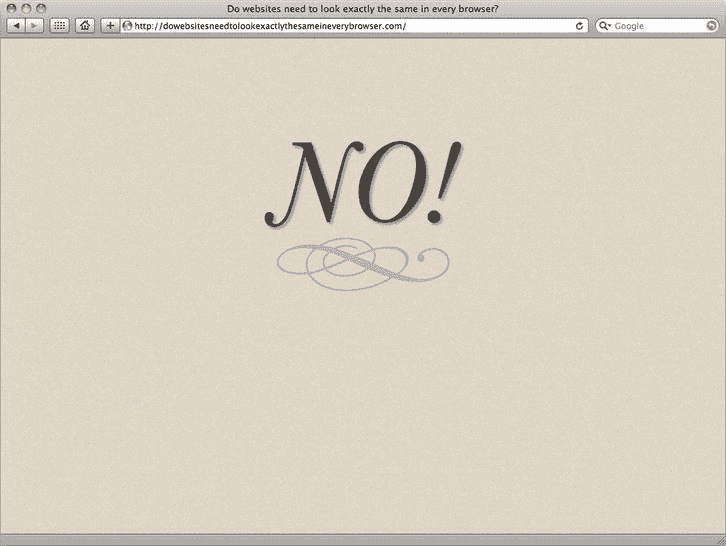

# 一、现在，而不是 2022 年

恭喜你，你已经到达第章第一章！你的网络进化之旅即将开始。这一章确立了基本原则。它的焦点，以及本书前半部分的其余部分，主要是 HTML5。我们将讨论 HTML5 是如何产生的，它旨在解决什么问题，什么设计原则指导了它的开发，以及它带来了什么新特性。我们也将揭穿一些 HTML5 的神话。然而，我们将从我们在 web 开发工作中遵循的基本原则开始，为什么标准如此重要，以及为什么我们应该努力使我们的标记普遍可访问并且制作精良。

这是一个跌宕起伏的过山车，但它是一个令人兴奋的旅程。事不宜迟，让我们开始吧…

### 基本原则

本书中的信息建立在一些坚定的原则之上:开放网络标准的重要性，结构良好的语义标记的工艺，以及对编写良好的 HTML 是设计过程的一部分的坚定信念。我们的固体 HTML 结构应该用 CSS 来设计(当我们在本章后面讨论层的分离时，我们将会谈到这种方法)。

#### 一种 web 标准方法

向标准驱动的 Web 的发展在很大程度上要归功于 Web 标准项目，或 WaSP ( `[`j.mp/webstandardsproject`](http://j.mp/webstandardsproject)1`)。在 90 年代后期，Internet Explorer 和 Netscape 在一个被称为“浏览器战争”的时期为获得网络霸权而战这是一个可怕的时代，因为这些竞争对手试图通过推出无数跨浏览器不兼容的新功能来赢得用户。结果是网站要么只能在一个浏览器上运行，要么有两个不同的版本来支持两个主要的玩家。这对网络开发者来说是一场噩梦，它伤害了用户。

WaSP 成立于 1998 年，致力于跨不同浏览器的标准实现和基于标准的网页设计方法。其目的是降低 web 开发的成本和复杂性，并通过使 web 内容在各种设备和辅助技术之间更加一致和更加兼容来提高网页的可访问性。他们游说浏览器和工具供应商改善对万维网联盟(W3C)推荐的 web 标准的支持，如 HTML 和 CSS。

注意:万维网联盟(W3C)是一个国际组织，它制定标准以确保网络的长期发展。用它自己的话说，“W3C 的使命是通过开发协议和指导方针来确保万维网的长期发展，从而使万维网发挥出最大的潜力。”

他们取得了很大的成功。跳到现代，web 标准在所有主流浏览器中都得到了一致的实现。尽管偶尔仍会出现一些奇怪的浏览器行为，但已经比以前好多了。现在让我们简单看看什么是 web 标准。

##### 什么是 web 标准？

我们每天都在使用标准，却常常没有意识到这一点。例如，当我们购买灯泡时，我们知道如果我们购买旋入式或卡口式灯泡，当我们把它带回家时，它将适合我们的灯具。标准确保我们购买的灯泡不会太大或太宽，不适合我们的灯具。标准就在我们身边:看看你家里的插头，你的电器的额定功率，以及我们社会中所有事物使用的时间、距离和温度测量。

网络标准也是从同样的原则出发的。随着浏览器制造商和 web 开发人员逐渐接受标准，编写特定于浏览器的标记的需求已经减少。通过使用结构良好的 HTML 来标记内容，使用 CSS 来控制表示，我们现在应该能够设计出一个不管使用什么操作系统，都能在符合标准的浏览器上一致显示的网站(尽管偶尔的怪癖仍然存在)。同样重要的是，当相同的标记由功能较弱、不符合标准的浏览器(在较旧的基于文本的浏览器或移动浏览器中)呈现时，内容仍应保持可访问性。作为设计师，网络标准节省了我们的时间，让我们可以安心地在晚上睡觉，因为我们知道，无论谁在哪个浏览器和哪个平台上观看，我们精心制作的杰作都是可以访问的。

__________

1

注意:我们所说的标准被 W3C 正式称为“建议”。它们是 web 技术应该工作的推荐方式。法律上没有强迫浏览器和工具供应商采用它们；相反，采纳是为了网络的利益和每个人的共同利益。

##### 为什么要使用 web 标准？

也许一个更好的问题是，“为什么要忽略网络标准？”采用 web 标准方法的好处如此引人注目，为什么不使用它们呢？

使用 web 标准的好处包括:

*   减少开发时间:你可以建立一个可以在所有平台、浏览器、设备等上运行的网站。如果没有标准，你可能不得不为每个浏览器开发不同的站点，等等。
*   *创建易于更新和维护的站点*:根据 web 标准和最佳实践，例如，您可以更新单个 CSS 文件来改变包含许多 HTML 页面的整个站点的样式。在这成为规范之前，我们习惯于将样式信息放在 HTML 中，这意味着改变每个页面上的信息。这确实是重复和不方便的。
*   *提高搜索引擎排名*:HTML 内的内容是基于文本的，因此搜索引擎可读。此外，写好的文案和恰当地使用语义 HTML(比如标题)可以给恰当的关键词更多的权重，让你的页面在谷歌排行榜上迅速蹿升。
*   *提高可访问性*:精心编写的 HTML 和 CSS 使网站更容易被不同的用户群访问，如残疾人、使用移动设备的人、低带宽连接的人等。

既然我们已经清楚地了解了 web 标准方法的主要好处，那么让我们来看看我们将在本书中深入探讨的两个原则:语义标记的重要性和臭名昭著的 web 琐事。

##### 语义标记

我们相信语义标记的重要性(有时称为 POSH，意为普通的旧式语义 HTML)。我们认为 HTML 是一个设计元素，在添加表示层(增强底层标记)之前，关注于构建结构良好的内容的坚实基础是很重要的。

语义标记是自描述的，并为正确的工作使用正确的 HTML 元素。例如，您可以标记这样的标题:

`
My heading
`

当然，它看起来像一个标题，但就意义或目的而言，它不会起到标题的作用。因此，它会对搜索引擎优化(标题中的关键字权重更大)、可访问性(屏幕阅读器使用标题元素作为导航路标)、开发(当您不使用正确的语义元素时，使用样式和脚本来定位元素要复杂得多)等等产生负面影响。

最好使用适当的元素，就像这样:

`<h1>My heading</h1>`

语义标记也应该尽可能的轻量级，这意味着移除所有嵌套的`<divs>`和其他意大利面条式的代码。这使得文件更小，编码更容易。

既然我们已经理解了打造一个坚实的 HTML 基础的重要性，那么是时候了解一下 Web 琐事了。

##### 网络琐事:分离这些层

每个人都喜欢蛋糕，尤其是在圣诞节。

安迪·克拉克在 2005 年写的《Stuff & ningness》(`[`j.mp/stuffandnonsense`](http://j.mp/stuffandnonsense)2`)一书中，将这种不起眼的蛋糕比喻到了一个新的高度，他用它来描述“网络标准蛋糕”，这是一种由海绵、水果果冻、奶油冻、奶油和最重要的浇头组成的令人兴奋的混合物。可以在`[`j.mp/standardstrifle`](http://j.mp/standardstrifle)3`看他的原帖。其中大部分至今仍然适用。

他所说的本质是你应该将你的数据结构、样式信息和脚本/行为分离到不同的层中。

*   语义 HTML 提供了数据结构，即一组清晰、易于访问的内容。HTML5 很好地提供了这一点。您应该尽可能地使这些数据易于访问和使用，而不需要任何脚本增强样式。
*   CSS 提供了样式信息，它获取我们的数据并给出我们想要的可视化表示。CSS3 比它的前身 CSS2 提供了更强大的工具。
*   JavaScript(包括 HTML5 和其他地方定义的基础语言和脚本 API)提供了脚本/行为层，为我们的站点增加了可用性增强和更丰富的功能。

#### 网页设计之道:拥抱不确定性

浏览器的格局正在迅速演变。然而，与浏览器大战的西部时代不同，今天的格局正在演变并向标准靠拢。Firefox、Safari、Opera、Chrome，当然还有我们的老朋友 IE，都在朝着支持 HTML5、CSS3 等所有新标准特性的方向前进——诚然速度不同。许多 web 开发人员也在向 web 标准及其相关的最佳实践转移，尽管许多人已经落后了。

__________

2

3

但是我们现在要担心一种新的不确定性:我们不再仅仅支持桌面浏览器。通过移动设备、平板电脑、电视、游戏机等在旅途中访问网络的人数正在快速增长。苹果的 iPhone 和 iPad、谷歌的 Android 设备、黑莓、Wii、DS 以及飞利浦和索尼的网络电视等设备的激增，已经让位于在移动中、在客厅中和离开办公桌时访问网络的人数的显著增加。

Opera Mini(世界上最受欢迎的移动浏览平台之一)的创造者 Opera 报告称，在旅途中浏览网页的用户数量同比(和环比)显著增长。随着智能手机不可阻挡的崛起，这一数字看起来将呈指数级增长。

有了这么多不同的设备来消费网络内容，准确预测你的网站在所有用户设备上看起来会是什么样子变得越来越困难。我们需要拥抱不确定性，设计灵活的网站来适应不同的浏览环境，而不是沉迷于拥有像素级的完美控制。

这绝不是一个新的想法。约翰·奥尔索普的《网页设计之道》(The Dao of Web Design)早在 2000 年就在一个列表上发表，强调了网页设计师学会放手、学会适应网络的复杂性和不可控性、接受缺乏控制的重要性，这是我们为之设计的复杂的网页交付世界的固有部分。为网页设计时起作用的变量加下划线(屏幕尺寸、分辨率差异、显示器深度、安装的字体等。)，奥尔索普在世纪之交鼓励网页设计师拥抱网页设计固有的不可预测性，为缺乏印刷媒体精确控制的网页进行设计。

他鼓励网页设计师透过“显微镜的另一端”来观察，将印刷设计的“控制”重新定义为“限制”，指出“我们可以控制纸张页面的事实实际上是这种媒介的限制。”再读一遍。这是一个微妙但重要的观点。

快进到今天，这种观点并不罕见。如今，越来越多的人庆祝网络的流动性。你仍然会在网上遇到许多痴迷于打印设计像素完美的设计师和客户，但更容易说服他们流动的方式是正确的，特别是现在浏览设备比以往任何时候都更加多样化。

丹·塞德霍尔姆 2007 年的网站《网站需要在每种浏览器中都看起来一样吗？》(图 1-1 )明确地回答了这个问题，并坚决地说“不！”

**图 1-1。**网站需要在所有浏览器中看起来都一样吗？不要。

正如奥尔索普所说，网页设计师不是控制者，网页也不是印刷品。这是一个根本性的转变。对于习惯了印刷世界典型的固定参照系的设计师来说，这可能需要很长时间来适应。奥尔索普重申，“作为设计师，我们需要重新思考这个角色，放弃控制，寻求与页面的新关系。”

反思控制的缺失；不要再把它视为弱点，而要把它视为优点。这是奥尔索普作品的关键点。正如他所说，“制作适应性强的页面。”为什么呢？因为适应性强容易接近。正如奥尔索普所说，想想“设计通用页面”

下一句话强化了我们之前所说的语义 HTML:“如果 HTML 提供了合适的元素，就使用它。如果没有，就使用类。”很简单。尽管许多懒惰的设计者倾向于过度依赖不必要的类属性，但 HTML 是一种丰富而全面的语义语言，所以我们应该充分利用它。

而且，当我们在接下来的章节中研究 HTML5 时，我们会看到，有更丰富的语义元素供我们使用，因此将来需要更少地依赖类。如果有的话，我们的任务看起来变得更容易。美好时光！

#### 无障碍

可访问性，有时缩写为 a11y(一个数字或基于数字的单词:“a，然后是 11 个字母，然后是 y”)，应该是我们方法的基础。拥抱网页设计之道带来了许多好处，包括对更广泛、更多样化的受众的更广泛的可访问性。

关键是要考虑不同的用户如何使用网络。有些人就像你一样使用它。有些人使用不同的设备或网络连接速度较慢。有些人只用键盘。有些人使用屏幕阅读器为他们朗读网页。有些人听不到音频内容。无论你做什么，都要熟悉不同的网络用户群体。不要假设其他人都像你一样使用网络。

我们认为可访问性是一件好事，所以当我们强调 HTML5 给可访问性带来的一些好处(和潜在的缺陷)时，不要感到惊讶。

#### 制作你的标记

我们坚信网页设计和网页开发中工艺的重要性。关注细节很重要，为自己的工作感到自豪也很重要，即使是在编写标记的时候。

在他的优秀著作《工匠》中，理查德·塞尼特写到了参与创建 Linux 的工匠，强调他们的重点是“实现质量[和]做好工作。”更接近网页设计的世界，丹·塞德霍尔姆在*手工制作 CSS* 说

> 细节并不总是显而易见。一件制作精良的家具，直到你开始使用它，你才可能注意到它制作得有多好。例如，拉出抽屉，注意燕尾接合。
> 
> 所有这些都与网页设计有关。看似不明显的细节往往可以区分好的网页设计和伟大的网页设计。你可能不会欣赏一个设计良好的网站的质量，直到你开始使用它，查看它的内部，进行测试。

我们完全同意塞德霍尔姆先生的意见。好的网页内容和伟大的网页内容之间的区别在于工艺，花额外的时间去打点细节——注意细节。

随着网页设计世界的发展，我们越来越多地发现自己与他人合作，在团队中工作。一种可靠的、精心制作的标记方法——基于一致同意的规则和标准——可以极大地增强协作，简化过程，并且(我们甚至可以说)使之更令人愉快。

我们认为工艺很重要，我们相信您也是如此。

### html 5 是如何创建的？

> 你可能会问自己，我是怎么走到这一步的？
> 
> -会说话的头，“一生一次”

HTML5 只是 HTML 发展过程中的一个点，HTML 的发展经历了不同规范的各种风格。尽管它们可能在细节上有所不同，但每种风格的 HTML 都有一个基本的共同点:HTML 是一种标记语言。

是的，HTML 4.01 和 XHTML 1.0 可能在编码风格上有所不同，但它们有着共同的目标。由于支持他们的两个阵营意见不同，而且经常强烈表达意见，因此很容易忽略共同点。

HTML5 在许多方面代表了所有领域中最好的，并且加入了大量新的潜力，稍后您将会看到。在我们介绍 HTML5 和它的不同方面之前，让我们简单回顾一下我们是如何发现自己现在所处的位置的。

#### 超越 HTML 4…

HTML4 没毛病，真的。这是一个非常好的规范，而且这项技术非常适合完成它最初的目标:标记静态文档以及它们之间的链接。但是事情从来不会静止不动。Web 开发人员并不乐意在他们的余生继续制作静态文档。他们希望制作更像应用而不是页面的动态网站，并开始使用 PHP、JavaScript 和 Flash 等技术来实现这一目标。

因此需要进化。

*注意:Flash 最初流行是因为跨浏览器 web 标准支持在 90 年代末非常糟糕，Flash 插件提供了一种使内容在不同浏览器间表现一致的方法。此外，Flash 允许 web 开发人员在 Web 上制作动画和视频。当时，Web 标准没有支持这一点的工具。*

#### XHTML 1.0

事实上，早在 1998 年，大约是 HTML4 规范接近完成的时候，W3C 决定将网络转向 XHTML 而不是 HTML(见 `[`j.mp/futuremarkup`](http://j.mp/futuremarkup)4`)。然后，他们在 HTML4 下划了一条线(上一个版本实际上是 4.01，其中包括一些错误修复等)，而是专注于 XHTML1.0 规范。

在 2002 年 8 月，W3C 评论说

> XHTML 家族是互联网发展的下一步。今天，通过迁移到 XHTML，内容开发人员可以带着所有附带的好处进入 XML 世界，同时仍然对其内容的向后和未来兼容性充满信心。

有了这个号召，当考虑如何最好地发展 HTML 时，W3C 最初支持 XHTML 就不足为奇了(注意“最初”这个词)。XHTML1.0 似乎是明智之举。它基本上只是 HTML4 重新表述为 XML 词汇表，带来了更严格的 XML 语法规则(例如，属性值必须用引号括起来，元素需要用引号括起来)。目标是更好的质量，更有效的标记。

#### XHTML 2.0 与反冲

然而，W3C 的下一步行动并不顺利。XHTML 的下一个版本 XHTML2.0 是用一种有点乌托邦的方法创建的。它包含了一些很棒的想法，是一个写得很好的规范，但是它并没有反映出 web 开发人员在 Web 上实际做了什么。这更像是 W3C 希望他们做的事情。

此外，它不能向后兼容网络上已经存在的内容。许多功能的工作方式不同；例如，XHTML mimetype ( `application/xhtml+xml`)根本不能在 IE 上工作，可用的开发工具也不能处理 XML

社区对此感到沮丧，并出现了反弹。最引人注目的是，在 2004 年，一群志同道合的开发人员和实现人员(包括来自 Opera、Mozilla 以及后来的苹果公司的代表)联合起来，成立了一个名为 WHATWG ( `[www.whatwg.org](http://www.whatwg.org)`)的叛逆者规范小组，旨在编写一个更好的标记规范，为创作新型 web 应用提供一组更有效的功能，并且不破坏向后兼容性，这一点至关重要。

WHATWG 创建了 Web 应用 1.0 规范(`[`j.mp/webappliactions1`](http://j.mp/webappliactions1)5`)，该规范记录了现有的可互操作浏览器行为和功能，以及开放 Web 堆栈的新功能，如 API 和新的 DOM 解析规则。经过 W3C 成员之间的多次讨论，2007 年 3 月 7 日，一个新的 HTML 工作组在一个开放的参与过程中重新开始了 HTML 的工作。HTML WG 的第一个决定是采用 Web 应用 1.0 规范，并将其命名为 HTML5。

WHATWG 和 W3C 现在开发了 HTML5 规范和两个不同的规范。

__________

4

5

*   WHATWG HTML 规范(`[`j.mp/html5-current`](http://j.mp/html5-current)6`)是一个供贡献者快速创建和开发创新功能的地方，远远早于它们可能成为官方推荐。请注意，版本号已被删除；这是一个生活标准，将作为一个独立的实体继续发展，不受版本控制。
*   W3C HTML5 规范(`[`j.mp/w3c-html5`](http://j.mp/w3c-html5)7`)记录了最稳定、公认的特性。这个版本描绘了一幅更真实的画面，显示了我们在浏览器中哪些功能最完整，最有可能得到支持。

直到最近，谷歌的伊恩·希克森还是这两份规范的编辑。他有点像一个“仁慈的独裁者”，并不是每个人都同意他的工作方式。但是他做了一件令人钦佩的工作，处理他收到的关于规格的所有反馈，并总体上保持事情正常——对于如此庞大的文档来说，确实不是一件容易的任务。

*注意:开放标准的美妙之处在于任何人都可以在他们的开发中有发言权，并提供反馈。如果你想参与进来，加入 W3C HTML 工作组(`[www.w3.org/html/wg](http://www.w3.org/html/wg)`)和/或 WHATWG ( `[www.whatwg.org](http://www.whatwg.org)`)并加入邮件列表、IRC 频道等的讨论。*

### HTML5 前进！

HTML5 在 XHTML2.0 失败的地方取得了成功，因为它的开发考虑到了当前和未来的浏览器开发以及过去、现在和未来的 web 开发工作。结果，它获得了巨大的动力。在实用主义的驱动下，它已经成为 W3C 加速开发的选择。约翰·奥尔索普总结得很好:

> 网络继续教给我们的一个教训是，比起理论上的完美，它更重视实用性的发展。

HTML5 是向后兼容的。它包含了 HTML4 规范的所有特性，尽管有一些变化和改进。但它也包含了更多构建动态 web 应用和创建高质量标记的额外内容，例如:

*   新的语义元素允许我们明确地、语义地定义标记的更多部分，而不是使用大量的类和 id。
*   用于向我们的站点添加视频、音频、可脚本化的图形和其他丰富的应用类型内容的新元素和 API。

__________

6

7 `[www.w3.org/TR/html5/](http://www.w3.org/TR/html5/)`

*   我们已经以定制的方式构建的标准化功能的新特性。服务器发送的更新和表单验证立即浮现在脑海中。
*   新功能填补了开放标准中传统功能的空白，例如定义浏览器应如何处理标记错误，允许 web 应用离线工作，允许我们使用始终打开的套接字连接进行应用数据传输，以及音频、视频和可脚本化的图像(canvas)。

HTML5 是特意构建来与 Flash 和 Silverlight 等专有插件竞争的。看起来这些技术越来越退居二线了。正如你在阅读这本书的过程中所看到的，许多 HTML5 在所有现代浏览器上都有很好的支持，因此现在可以在你的生产项目中使用。通过一点 JavaScript 哄骗，它甚至可以在旧的浏览器上工作。

HTML5 太酷了，甚至有了自己的 logo 参见`[`j.mp/html5-logo`](http://j.mp/html5-logo)8`。W3C 的宣传活动是众多活动之一(苹果、微软和其他公司也提供了类似的推广活动),旨在让开发人员对采用这种新语言感兴趣，并将 HTML5 作为一个流行词和一套技术进行推广。

这些计划的大部分问题在于它们在定义 HTML5 方面令人困惑。如果你看一下刚刚提到的 W3C 页面，你会看到它列出了许多不同的技术作为 HTML5 的一部分，包括许多实际上不属于 html 5 的技术(CSS3 和 SVG 是最突出的例子)。CSS 和 SVG 是和 HTML 完全不同的技术，目的完全不同！我们想建议你注意不要在交谈中混淆不同的技术，因为这会使交流更加困难，尤其是当你与网络团队中技术含量较低的成员(如项目经理和营销人员)交谈时。

所以，现在我们知道浏览器支持是存在的，我们已经介绍了导致 HTML5 出现的一些历史。让我们来看看指导规范开发的一些原则。我们已经提到了其中的一些，但是现在让我们更详细地讨论一下。

### HTML5 设计原则

HTML5 受许多设计原则的指导，这些原则旨在支持现有内容，同时为新的标记方法铺平道路。其中，W3C 将这些原则定义如下:

*   确保支持现有内容。
*   在旧浏览器中优雅地降级新功能。
*   不是重新发明轮子。
*   铺设牛道。
*   进化，而不是革命。
*   实现普遍接入。

__________

8

与 XHTML 2.0 不同，HTML5 采用了一种实用的标记方法，比起 XHTML 2.0 的开发者所采用的乌托邦式的方法(最终导致其灭亡的方法)，它更喜欢“真实世界”的方法。这种实用的方法让我们现在就可以使用 HTML5，因为我们知道它在设计时就考虑到了未来的发展。

让我们看看 W3C 在“HTML 设计原则”(`[`j.mp/html-design-principles`](http://j.mp/html-design-principles)9`)中概述的一些原则，并解释它们在实践中的意义。

#### 支持现有内容

网络在 2011 年庆祝了它的 21 岁生日。它惊人的增长速度在历史上是无与伦比的，已经产生了数十亿的网页。HTML5 开发的核心是支持所有这些现有内容的重要性。

HTML5 并不是要清除旧的并用新的东西完全取代它。这是关于保持我们已经拥有的，并在顶部添加增强功能。考虑到这一点，W3C 声明

> 基于现有浏览器的行为，应该可以将现有的 HTML 文档作为 HTML5 来处理，并获得与用户和作者的现有期望相兼容的结果。

简而言之，随着 HTML5 的普及，将会考虑如何处理使用旧版本 HTML 设计和开发的现有内容。

#### 优雅地降级

为了支持现有内容，随着 HTML5 的发展，W3C HTML 设计原则确保考虑旧浏览器如何处理新元素。考虑到这一点，W3C 声明

> html 5……应该设计成即使在使用新元素、属性、API 和内容模型时，web 内容也能在旧的或能力较弱的用户代理中优雅地降级。

这一原则的一个关键部分在于考虑“旨在满足特定需求或解决专门市场的用户代理，如辅助技术”，从而帮助和改善可及性。不是坏事。

__________

9

#### 不要多此一举

正如你将在第三章中看到的，当你了解 HTML5 引入的新元素是如何命名的，HTML5 的设计考虑了以前已经发生的事情。W3C 非常强调不要重新发明轮子，或者不那么正式地说，“如果它没坏，就不要修理它。”

W3C 声明

> 如果已经有一种覆盖特定用例的广泛使用和实现的技术，考虑指定该技术，而不是出于相同目的发明新的技术。

如果你已经在 web 上工作了一段时间，并且接受了 Web 标准，这意味着——从设计上来说——你习惯的大部分内容已经影响了 HTML5 的开发，你不需要重新学习所有的东西。

#### 铺牛腿

铺路？牛仔？

本质上，这句话的意思是，如果一条路径或一种工作方式已经自然发展，并在开发人员中广泛使用，那么使用它比替换它更好。接受并采用官方规范中事实上的标准。同样，当我们查看 HTML5 中引入的新元素名称的来源时，我们将在第三章中看到这个设计原则是如何被付诸实践的。

#### 进化，而不是革命

正如 W3C 所说，

> 革命有时会让世界变得更好。然而，大多数情况下，改进现有的设计比抛弃它更好。这样，作者就不必学习新的模式，内容会活得更久。

实际上，这意味着现有的设计人员和开发人员不需要重新学习所有的东西。这又是一件好事。

所以现在我们知道谁在推动 HTML5 和指导原则的发展。是时候用一个流言终结来结束这一章了。

### 关于 HTML5 的十几个神话

现在，您已经有了 HTML 的简史，我们也介绍了 HTML5 的开发背景，是时候消除一些神话和驳斥一些谎言了。HTML5 受到谣言的困扰，但很多都是完全不真实的。让我们打破一些神话。

#### 1。浏览器不支持 HTML5

关于 HTML5 的一个误解是，浏览器对 HTML5 的支持太不可预测，所以现在不能开始使用该规范。正如我们之前所说，情况并非如此。自 2010 年以来，HTML5 书籍的激增——由各种受尊敬的作者撰写——清楚地表明浏览器支持是存在的，HTML5 的时代是现在，而不是 2022 年。

当像新闻周刊(`[`newsweek.com)`](http://newsweek.com))`)和 YouTube ( `[`youtube.com`](http://youtube.com)`)这样的主流网站开始全心全意地拥抱 HTML5 时，显然你也可以。(毕竟这就是你看这本书的原因！)

#### 2。好吧，大多数浏览器支持 HTML5，但 IE 肯定不支持

考虑到我们的好朋友 IE 在涉及到所有与标准相关的事情时的历史特质，你可能会原谅这种想法。然而，这一次，这不是真的。在 2010 年 6 月回顾 IE9 时，网络标准项目声明

> 到目前为止，我们印象深刻。IE9 真的把经常被诽谤的浏览器和其他浏览器放在了一起，甚至在某些情况下给了他们优势。向 IE 团队致敬，这是伟大的工作。

当 IE 被挑出来表扬的时候，你就知道他们在变。IE9 和 IE10 引入了对很多 HTML5 特性的支持，比如`<video>`、`<audio>`、`<canvas>`、HTML5 语义元素等等。

#### 3。HTML5 要到 2022 年才能完成

同样，不正确。2022 年是一个虚构的日期，摘自伊恩·希克森的采访(`[`j.mp/hixie-interview`](http://j.mp/hixie-interview)10`)，是最终的推荐状态。

鉴于这是我们每天都在使用的 CSS 2.1 还没有的东西，很明显，2022 年这个日期解决了一个语义问题(特别是如何定义术语“完成”)。

__________

10

#### 4。现在我必须重新学习一切！

一点也不。正如你在本章已经看到的，HTML5 开发的核心是拥抱进化而不是革命的两个概念(*进化*现有标准而不是*取代*它们)和铺平道路(使用已建立的经过验证的实践来构建)。

到目前为止，您学到的大部分内容都集成到了 HTML5 中。

#### 5。HTML5 使用表示元素

乍一看，你这样想是情有可原的，但是仔细观察，你会发现事实并非如此。是的，HTML5 规范列出了像`<small>`这样的元素，以前被认为是表示性的。以这个元素为例，它被重新定义了。`<small>`不再是展示性的(意思是“以小尺寸显示这个”)。它现在是语义上的，意思是“这是小字。”

#### 6。HTML5 是标签汤的回归

不，当然不是。HTML5 包括新的语义元素，这将允许我们进一步简化我们的标记，而不是膨胀它。

#### 7 .。HTML5 杀死可访问性小猫

为了确保新的 HTML5 特性可以继续使用(以及保护小猫)，我们付出了巨大的努力。没必要担心。HTML5 允许我们像 HTML4 一样编写可访问的标记。

#### 8。闪电侠死了

不完全是。由于开放标准现在提供许多相同的功能，并且许多 Flash 开发人员正在转向开放标准，专有技术目前在许多情况下确实处于次要地位，但在未来几年内它仍将有其用途。

#### 9。HTML5 将打破网页！

绝对不会。正如已经讨论过的，HTML5 是向后兼容的，我们已经看到一些知名的商业网站都配备了 HTML5 的特性。

#### 10。HTML5 的开发由浏览器供应商控制

同样，不正确。虽然 WHATWG 是由浏览器供应商建立的，但同意开发 HTML5 的过程是对所有人开放的。是的，浏览器厂商正在快速创新，但是每个人都有发言权，包括你。

#### 11。HTML5 包括 CSS3、地理定位、SVG 和世界上所有其他现代技术

不要。关于 HTML5 是什么和不是什么，仍然有很多困惑。正如 Opera 的 Bruce Lawson 所说，“就像‘Ajax’一样，HTML5 已经成为一个笼统的术语，人们把各种不相关的技术，如 SVG、CSS3、JavaScript、地理定位，甚至 webfonts 都归入其中。”这是真的。许多设计师混淆地将 CSS3 称为“HTML5 的一部分”它不是。这是我们在本书中试图澄清的另一件事。如果您不确定某个特性是否是 HTML5 的一部分，请在规范中查找。

Bruce 创建了下面的图表来帮助我们定义网络生态系统。

#### 12。那么我什么时候可以开始使用 HTML5 呢？

就现在！

### 总结

我们对 HTML5 的介绍到此结束。我们希望这已经很好地设定了前端 web 开发的发展方向，并给了你学习更多和更新技能的渴望！在这一章中，我们讨论了 web 标准方法；最重要的网页设计原则；语义标记和层分离的重要性；现代网络浏览器的前景；接受不确定性；拥抱可及性。我们还研究了 HTML5 的历史和起源，指导其开发的设计原则，以及它旨在解决什么问题。我们揭穿了一些 HTML5 的神话，结束了我们的旅程。

__________

11

#### 作业

这本书的原则之一是，我们使用家庭作业来确保读者理解每一章的原则。在每章的结尾，我们将为您设置一些任务，这些任务与该章所涵盖的内容相对应。

对于某些章节，我们提供了示例内容，可从随附的网站`[`thewebevolved.com`](http://thewebevolved.com)`下载。如果您遇到任何问题或需要进一步的建议，请不要犹豫，通过网站联系我们的作者。祝你好运！

#### 第一章作业

对于第一章，很简单:我们已经向你们提供了一些关于戈多(一只被证明是太空竞赛先驱的猴子)的内容，你们中的一些人可能已经从 *HTML 和 CSS Web 标准解决方案:Web standarditas ' Approach*进一步冒险(从`[`thewebevolved.com`](http://thewebevolved.com)`下载)中见过。

我们把它组织成典型的内容，混合了标题、段落、一两个引号和一些列表。总之就是每天都会遇到的那种。

您的首要任务是使用您当前选择的风格(XHTML 1 或 HTML 4.01)来标记所提供的内容。你将在第二章中使用这个作业的结果来比较和对比你当前的 HTML 风格和 HTML5 的关系。

#### 定向阅读

这证明了 HTML5 的迅速崛起，不仅有许多先锋书籍在其上出版，而且还有许多免费访问的网站提供参考资料和教程。

我们推荐以下资源:

*   在榜单上看到 HTML5 Doctor 并不奇怪。除了这本书的两位作者，HTML5 Doctor 还接待了许多非常有才华的作者，包括布鲁斯·劳森(Bruce Lawson)和雷米·夏普(Remy Sharp)，他们是《介绍 HTML5 (New Riders)的作者。
*   作为 HTML5 WHATWG 的创始成员，Opera 一直站在推动基于标准的开发的最前沿，主要关注 HTML5 的推广。看到 Opera 通过 Opera 开发者社区推广标准并不奇怪。社区的定期贡献者包括 Patrick Lauke 和 Chris Mills(本书的技术评论员)。这很值得做书签并定期检查。