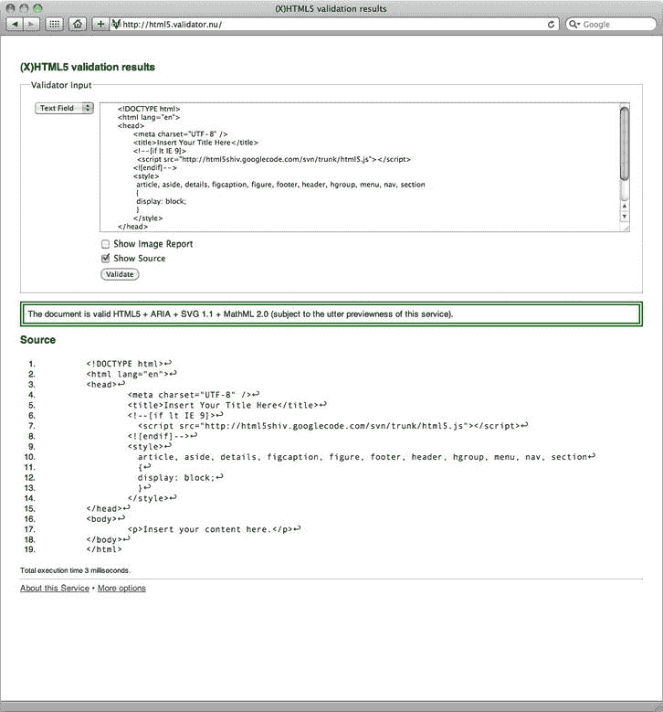
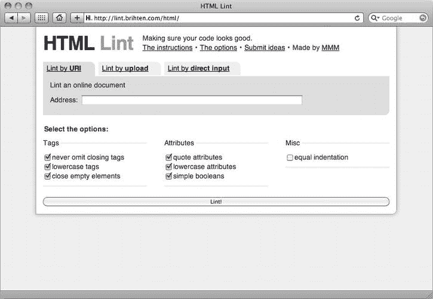
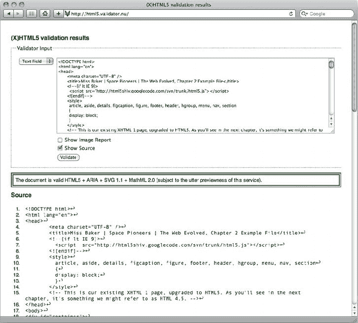
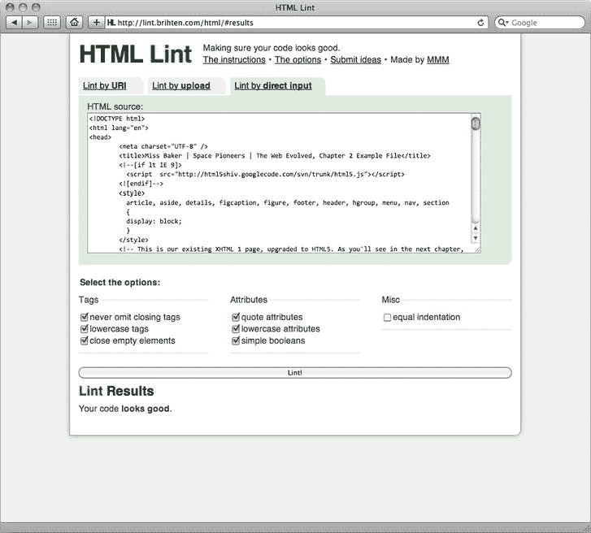

# 二、第一次走进 HTML5

在第一章中，我们介绍了 HTML5 的背景，为什么我们现在应该开始使用它，以及一些现代 web 标准开发原则。在这一章中，我们将开始创建一些实际的 HTML5 网页。

我们将从我们如何标记第一章的作业页开始这一章。我们将以它为基础，探索一些众所周知的元素是如何变化的，尤其是 DOCTYPE，它现在变得简单多了，也更容易记忆。

一旦我们完成了，我们就开始了一个历史悠久的传统，那就是“你好，世界！”旅程，最终创建了我们的第一个 HTML5 页面。接下来，我们将介绍一些变通方法，它们将帮助您交付精心制作的 HTML5 页面，以便它们可以在当前的浏览器中工作(毫无疑问，我们的老朋友 IE 在这里得到了提及)。最后，我们将看看 HTML5 和 XHTML5 的优缺点，以及验证器和 lint 检查器如何处理 HTML5。

这是一个很大的范围，所以，没有更多的麻烦，让我们开始吧…

### 作业复习

在第一章的最后，我们要求你用你当前喜欢的标记风格，XHTML1 或 HTML4，来标记一个典型的网页。当我们开始本章和下一章时，我们将向您展示如何使用 HTML5 标记相同的网页。这里的目的是向您展示您当前使用的标记和 HTML5 标记之间的关系，并在此过程中强调 HTML5 的新功能及其提供的优势。

与拉丁文或其他填充文本相反，使用真实内容可以让你深入了解真实内容是如何影响真实标记的。简而言之，内容驱动了标记。这就是为什么我们不提供无意义的逻辑推理。

那么，我们如何标记我们的网页呢？

我们选择了 XHTML 1，正如您将在下面的例子中看到的，我们查看了提供的内容，并尽可能使用最合适的元素对其进行了标记。为了节省纸张(和树木)，我们用省略号替换了一些内容，但是你应该能认出这些内容(如果你做了第一章的的功课)。除了使用良好的旧语义标记，我们还选择了`id`和`class`名称来提供额外的含义。

#### 我们的页面

结果页面如下所示:

`<!DOCTYPE html PUBLIC "-//W3C//DTD XHTML 1.0 Strict//EN"
        "http://www.w3.org/TR/xhtml1/DTD/xhtml1-strict.dtd">
<html >
<head>
    <meta http-equiv="content-type" content="text/html; charset=UTF-8" />
    <title>Miss Baker | Space Pioneers | The Web Evolved, Chapter 2 Example File</title>
</head>
<body>

    

        <h1>The Original Space Pioneers</h1>
        <h4>America's Unsung Heroes</h4>
    

    

        <h2>Miss Baker</h2>
        <h4>First Lady of Space</h4>
        

            
Before humans were launched into space, many animals were propelled
 heavenwards…

            …
        

        

            <h3>Miss Baker's Historic Flight</h3>
            
Miss Baker and fellow female pioneer Able's historic flight…

            …
        

        

            <h3>The Mission</h3>

            
Miss Baker's flight was another milestone in the history of space flight…

            …
        

        

            <h3>The US Space Programme</h3>` `            
A technological and ideological competition between the United States and
 the Soviet Union…

            …
        

        

            <h3>Life in Retirement</h3>

            
Miss Baker spent the latter part of her life at the US Space and Rocket
 Centre…

            …
        

        
Copyright 2010 &middot; Christopher Murphy

    

    

        
The Space Pioneers web site is an example site, designed to accompany The Web
 Evolved, published by Apress. Text: The Web Evolved; Design: Jonny Campbell.

        
HTML + CSS released under a Creative Commons Attribution 3.0 license.

        
Photography &copy; iStockphoto

    

</body>
</html>`

这应该是你熟悉的领域。您对标记的选择可能会有所不同——您可能选择了 HTML4，也可能选择了不同的元素——但底线是您应该使用语义标记来制作最有意义的页面。

在本章的剩余部分，我们将过渡到 HTML5，这样我们就可以开始拥抱它提供的机会。虽然有些方面对你来说是新的，但是不要害怕——正如你很快会看到的，我们所涉及的很多内容都是熟悉的。在这方面，我们有一些好消息。

#### 你的加价还有 84.8%

虽然我们不能 100%保证 84.8%这个数字在科学上是准确的(说实话，这个数字是我们编造的)，但它在精神上是准确的。正如在第一章中提到的，HTML5 背后的指导原则包括强调不要重新发明轮子，铺平道路，以及拥抱进化而不是革命的务实精神。

简而言之，重点是在已有成果的基础上再接再厉。随着本章和本书的深入，你会看到这些原则在起作用。所以请放心:当我们踏上 HTML5 开发之旅时，您不需要重新学习一切。是的，我们已经学会使用的所有语义优势仍然存在。有一些新的元素供我们使用(我们将在下一章看到)，但我们学到的很多东西仍然存在。

**关于编码风格的一个旁白**

正如您将看到的，当我们浏览许多不同的标记样式时——HTML 4.01、XHTML 1.1 和 HTML 5——当然存在差异。这本书的作者团队更喜欢用 XHTML 风格编写标记，但是使用 HTML5 的新元素；您可能更喜欢使用更宽松的 HTML 风格来编写您的 HTML。HTML 两者都允许，允许你坚持你喜欢的。

自从 1990 年蒂姆·伯纳斯·李首次实现 HTML 以来，编码风格已经发生了很大的变化。当 Berners-Lee 第一次发表“HTML 中使用的标签”(`[`j.mp/tags-in-html`](http://j.mp/tags-in-html)1`)时，他使用的风格是用大写字母编写元素，打开和关闭一些标签，而让其他标签打开和不关闭。Berners-Lee 指出，“标签和属性的名称不区分大小写:它们可以是小写、大写或混合大小写，意思完全相同。(在本文档中，它们通常用大写字母表示。)"

### 这都是头脑中的想法

在我们开始创造一些好的，老式的“你好，世界！”网页(开始任何新的编程冒险时的一个传统)，让我们来看看我们将会遇到的一些变化，特别是当我们转向 HTML5 时，我们将在`<head>`中做出的变化。在进入`<body>`标记的实际细节之前，理解这些基础知识是一个好主意。

在这一节中，我们将介绍新的 HTML5 DOCTYPE，解释如何在 HTML5 中声明语言，并介绍一个新的、更简单的`meta charset`属性。

在我们开始这个旅程之前，让我们看看我们现在拥有什么。(记得我们为贝克小姐页面选择了 XHTML 1；你的`<head>`可能会不同。)目前我们贝克小姐页面上的`<head>`如下:

`<!DOCTYPE html PUBLIC "-//W3C//DTD XHTML 1.0 Strict//EN"
        "http://www.w3.org/TR/xhtml1/DTD/xhtml1-strict.dtd">
<html >
<head>
    <meta http-equiv="content-type" content="text/html; charset=UTF-8" />
    <title>Miss Baker | Space Pioneers | The Web Evolved, Chapter 2 Example File</title>
</head>`

现在我们来看看 HTML5 中的。

`<!DOCTYPE html>
<html lang="en">
    <head>
        <meta charset="UTF-8" />
        <title>Miss Baker | Space Pioneers | The Web Evolved, Chapter 2 Example File</title>` `    </head>`

__________

1

如您所见，这相当简单，这不是坏事。现在让我们开始吧。我们将从对总是不可能记住的 DOCTYPE 的一些受欢迎的改变开始。

#### 更完美的文档类型

可怕的 DOCTYPE。很少有人——除了那些有照相记忆的人——能记住它。到目前为止，无论您选择的是 XHTML 1 Strict 还是 HTML 4 Strict(或者任何其他可用的类型)，DOCTYPE 都是一个难以理解的字符串。如果您一直在使用 XHTML 1 Strict 编写标记，您会习惯于看到下面的 DOCTYPE:

`<!DOCTYPE html PUBLIC "-//W3C//DTD XHTML 1.0 Strict//EN"
        "http://www.w3.org/TR/xhtml1/DTD/xhtml1-strict.dtd">`

如果您选择的标记风格是 HTML 4 Strict，那么您会更熟悉这个 DOCTYPE:

`<!DOCTYPE HTML PUBLIC "-//W3C//DTD HTML 4.01//EN"
        "http://www.w3.org/TR/html4/strict.dtd">`

DOCTYPE 没有必要如此复杂和难以记忆。W3C 在最初创建标记规范时，可能有一些宏伟的设计，但实际上它为我们做的只是告诉浏览器以标准模式而不是古怪模式来呈现我们的页面。在编写 HTML5 规范时，WHATWG 认识到了这一点，并将 DOCTYPE 更改为构成有效 DOCTYPE 的尽可能短的字符序列。

`<!DOCTYPE html>`

就这样。更简单，我们敢说，甚至令人难忘。

即使您不做任何其他事情，您现在也可以开始使用新的 HTML5 DOCTYPE，安全地知道这 15 个字符是触发标准模式所需要的全部。现在，通过改变你的第一章作业上的文档类型并重新验证你的页面来尝试一下。它会工作得很好。鉴于谷歌已经在搜索页面上使用 HTML5 DOCTYPE，没有理由不改变你的 DOCTYPE。

#### 在 HTML5 中声明语言

现在让我们看看如何在 HTML5 中声明语言。但是为什么要声明语言呢？W3C 对这个问题的回答如下:

> 从对语言敏感的搜索到应用特定语言的显示属性，指定内容的语言对于许多应用都很有用。在某些情况下，语言信息的潜在应用仍在等待实现，而在其他情况下，如通过语音浏览器检测语言，这是今天的一种需要。

__________

2

> 给内容添加语言信息的标记是今天可以而且应该做的事情。没有它，就不可能利用任何未来的发展。

声明一种默认语言对于诸如可访问性和搜索引擎这样的应用已经很重要了，但是随着时间的推移，其他可能的应用也会出现。

指定 HTML 文档语言的最简单方法是向 HTML 页面的根元素添加一个`lang`属性。HTML 页面的根元素总是`<html>`，所以要指定一种语言，我们要做以下事情:

`<html lang="en">`

在这个例子中，`lang`属性的值是`en`，它指定文档是用英语编写的。但是，如果您的文档包含用指定的`lang`之外的语言编写的元素呢？没问题。language 属性也可以内联使用。下面的示例包括一个内联的``元素，该元素包含一个值为`fr,`的`lang`属性，表示其中包含的内容是用法语编写的:

`
Miss Baker, on entering the capsule, declared to her fellow astronaut Able: 
 lang="fr">"Bon chance!"
`

很好，很好。

正如你所料，其他语言也有两个字母的主要代码——例如`de`(德语)、`it`(意大利语)、`nl`(荷兰语)、`es`(西班牙语)、`ar`(阿拉伯语)、`ru`(俄语)和`zh`(中文)。如果这还不够，还有 8000 多个语言属性值可用；这些在 IANA 语言子标签注册处(`[`j.mp/lang-subtag`](http://j.mp/lang-subtag)3`)有完整的列表。

也可以在一种语言中指定方言。这些通常用基本语言代码来表示，例如`en`，后跟一个连字符和所讨论的方言。下面的例子分别展示了英国英语和美国英语:

`en-US: US English
en-GB: UK English`

如果你想拥抱一种更前卫的语言，包含一个主要标签`x`表示一种实验性的语言，如下所示:

`
nuqDaq 'oH puchpa''e'
`

对于外行人来说，克林贡语短语“nuqDaq 'oH puchpa''e '”翻译过来就是“洗手间在哪里？”你可以在克林贡语言学院非常古老的学校网站上听到它的发音。

__________

3

4

最后，如果你想创建自己的语言代码，这是完全可能的(尽管不建议这样做)。HTML5 Outliner(将在下一章讨论)的作者 Geoffrey Snedders 在他的个人网站中使用了以下语言代码:

`<html lang="en-gb-x-sneddy">`

如果您已经了解了，应该很清楚 Snedders 先生的`lang`属性翻译如下:

`English - Great British - Experimental - Sneddy`

(尽管为什么您可能想要指定您自己的特定语言是有问题的。)说够了。

**XMLNS 属性**

如果您习惯于使用 XHTML 编写标记，您可能想知道我们的 Baker 小姐页面上的`xmlns`属性发生了什么变化。

` <html >`

答案是不再需要了。属性通知浏览器该页面上的所有元素都在 XHTML 名称空间中；然而，在 HTML5 中，元素总是在这个名称空间中，所以不再需要显式声明。您可以删除`xmlns`属性，因为您的页面在所有浏览器中都可以正常工作。

#### 字符编码

让我们看看本章开始时的贝克小姐页面。我们指定字符编码如下:

`<meta http-equiv="content-type" content="text/html; charset=UTF-8" />`

在 HTML5 中，指定页面的字符编码要简单得多。我们来看看 HTML5 版本:

`<meta charset="UTF-8" />`

您不需要详细了解什么是字符编码，但基本上，它定义了可以在文档中使用的有效人类语言字符集。坚持使用 UTF 8 是最安全的，这是一个通用字符集，允许所有语言的所有字符。

#### 记忆先生

所以我们有了它:把以上所有的放在一起，很容易看到你现在可能会用记忆专长震惊你的朋友。不再有复杂的样板文件；以下内容对任何人来说都应该很容易记住:

`<!DOCTYPE html>
<html lang="en">
    <head>` `        <meta charset="UTF-8" />
        <title>Miss Baker | Space Pioneers | The Web Evolved, Chapter 2 Example File</title>
    </head>`

所以让我们在一些实际的页面上看到所有的东西一起工作。“你好，世界”节目时间到了！行动。

### 一句“你好，世界！”旅行

传统要求我们使用历史悠久的“Hello World！”向您介绍您的第一个 HTML5 页面佩奇。正如精彩的维基百科所说，

> 对于试图学习一门新编程语言的人来说，写一句“Hello World！”通常被认为是程序员的一个传统编程是学习这种特殊语言的第一步。

我们凭什么打破传统？

为了向您展示标记如何根据您一直使用的 HTML 的风格而有所不同，以及向您展示向 HTML5 的过渡如何反映以前的实践(如在进化中，而不是革命中)，我们将快速浏览一系列“Hello World！”网页来演示 HTML5 提供了多种标记样式首选项。我们将通过查看我们认为最好的标记样式来总结:合并 XHTML(一种更严格、更容易学习的语法)和 HTML5(一种前瞻性的、更丰富的语义调色板)的最佳方面。

我们开始吧。

#### “你好世界！”XHTML1.0 风格

我们的第一个例子是一个非常简单的“Hello World！”使用 XHTML 1 Strict DOCTYPE 标记的网页。这是完全有效的，如果您一直在使用 XHTML 进行标记，这应该不足为奇。

`<!DOCTYPE html PUBLIC "-//W3C//DTD XHTML 1.0 Strict//EN"
        "http://www.w3.org/TR/xhtml1/DTD/xhtml1-strict.dtd">
<html >
<head>
    <meta http-equiv="content-type" content="text/html; charset=UTF-8" />
    <title>Hello World! XHTML 1 Strict</title>
</head>
<body>
    
Hello World!

</body>
</html>`

这里没有惊喜。这是一个典型的页面，格式良好，完全有效，但是如果您的首选是 HTML 4 呢？让我们看看下一个例子。

#### “你好世界！”HTML4 风格

接下来的例子与前面的例子相同，但是使用 HTML 4 Strict DOCTYPE 进行标记，并且使用了一个简单得多的开始标记`<html>`(在我们的 XHTML 1 版本中，去掉了 XML 名称空间声明)。

和前面的例子一样，这是完全有效的。同样，这也不足为奇。

`<!DOCTYPE HTML PUBLIC "-//W3C//DTD HTML 4.01//EN"
        "http://www.w3.org/TR/html4/strict.dtd">
<html>
<head>
    <meta http-equiv=content-type content="text/html; charset=UTF-8">
    <title>Hello World! HTML 4 Strict</title>
</head>
<body>
    
Hello World!

</body>
</html>`

迄今为止，如此…熟悉。现在我们来看一个 HTML5 的例子。

#### “你好世界！”在 HTML5“松散”风格中

我们之前演示的 XHTML 1 和 HTML 4 页面应该不足为奇。现在让我们来看一个最简单的 HTML5 页面。下面的页面虽然只有几行，却是 100%有效的 html 5“Hello World！”页面:

`<!DOCTYPE html>
    <meta charset=UTF-8>
    <title>Hello World!</title>
    
Hello World!`

如果到目前为止您一直在使用 XHTML 语法，这可能会有点令人吃惊。没有开始和结束`<html>`标签？没有`<head>`或`<body>`元素？未加引号的属性？这是因为 HTML5 继承了 HTML 4 的许多特性，HTML 4 的语法比 XHTML 1 的限制少得多。

正如我们在前一章中所概述的，HTML5 的发展以实用主义方法为特征，WHATWG 允许所有通用的语法变化，包括 XHTML 的严格语法和 HTML 4 的宽松语法。为了强调这一点，并了解 HTML5 是如何从以前的基础上发展而来的，让我们来看看一个稍微小一点但仍然完全有效的 HTML 4 页面。

`<!DOCTYPE HTML PUBLIC "-//W3C//DTD HTML 4.01//EN"
        "http://www.w3.org/TR/html4/strict.dtd">
    <meta http-equiv=content-type content="text/html; charset=UTF-8">
    <title>Hello World! HTML 4.01 Strict</title>
    
Hello World!`

除了更冗长的 HTML 4 DOCTYPE 和更长的`meta charset`属性之外，这两个例子是相同的。也没有开始或结束的`<html>`标签，或者`<head>`或`<body>`元素。

原因很简单，我们在第一章中谈到了支持现有内容的 HTML 设计原则。为了向后兼容，HTML5 允许使用 HTML 4 或 XHTML 1 语法标记网页。不管你的语法偏好是什么，HTML5 包含了以前没有的东西。

如果您一直在使用 XHTML，那么您一直在使用小写的标签和属性名称，结束元素，引用元素，并给所有属性赋值。一些人认为这些规则是限制性的；其他人欣赏他们赋予标记的一致性。

总之，使用你选择的语法来编写你的 HTML5 页面是可能的，而且你完全可以这样做；然而，我们建议保留更严格的 XHTML 语法。

为什么呢？规则很有用。它们支持协同工作，允许每个人遵循标准化的语法。规则也使学习标记变得更加容易。您应该坚持使用 XHTML 还有其他一些原因；例如，可访问性最佳实践要求您使用`<html>`标签上的`lang`属性为文档指定一种语言。如果你不把它包含在页面中，这是不可能的！

记住这一点，让我们来看看包含 XHTML 规则和语法的最终 HTML5 页面。

#### “你好世界！”在 HTML5“严格”风格中

如果您一直使用 XHTML 的严格语法和规则编写标记，那么您已经习惯了小写元素、引用属性和结束空元素。正如您在上一个例子中看到的，在 HTML5 中，一切皆有可能。大写元素？没问题。未加引号的属性？好的。

但是，如果您想跳到 HTML5，但是又想带上所有的 XHTML 习惯，该怎么办呢？没有恐惧；我们可以选择使用 XHTML 语法来标记页面，这样可以两全其美。让我们看一个例子。

`<!DOCTYPE html>
<html lang="en">
    <head>
        <meta charset="UTF-8" />
        <title>Hello World!</title>
    </head>
    <body>
        
Hello World!

    </body>
</html>`

百分百有效。这个页面结合了 HTML5 的优点和 XHTML 1 语法的严格性。简而言之:两全其美。

### 支持 HTML5 跨浏览器

让我们继续来看看我们可以用来让新的 HTML5 语义元素跨浏览器工作的技术，甚至像 IE6 这样的旧浏览器。然后，我们将采用最后一个风格良好的 html 5“Hello World！”示例页面并添加到其中，为您提供了一个样板文件，您现在就可以开始使用 HTML5 了。

我们将从浏览器如何处理未知元素开始。

#### 浏览器如何处理未知元素？

HTML 是一种宽容的语言。很长一段时间以来，大多数浏览器通过将它们视为匿名内联元素并允许我们对它们进行样式化，优雅地处理了它们没有识别的元素和属性的包含。

每个浏览器都有它支持的元素列表。例如，Firefox 的列表存储在一个名为`nsElementTable.cpp`的文件中。这个文件告诉浏览器如何处理它遇到的元素，通知浏览器如何设置它们的样式，以及它们在文档对象模型(DOM)中应该如何处理。

演示这一点的最佳方式是运行一个示例。下面这个非常基本的页面使用了新的`<time>`元素(我们将在第四章中适当地遇到它)。我们包含了一个非常简单的样式表，其中有一个针对新元素的规则。问题是，浏览器将如何设计`<time>`元素的样式？

`<!DOCTYPE html>
<html lang="en">
  <head>
    <meta charset="UTF-8" />
    <title>Styling Unknown Elements - 1</title>
    
  </head>
  <body>
    
Miss Baker made her historic journey on <time datetime="1959-05-28">May 28,
 1959</time>.

  </body>
</html>`

首先，好消息是:大多数现代浏览器都会看到`<time>`元素，并用斜体显示日期“1959 年 5 月 28 日”。然而，我们的老朋友 IE 有不同的想法。IE(直到并包括版本 8)甚至看不到`<time>`元素，因此这个文本没有样式。

不用说，如果我们要取得进一步的进展，这是我们需要解决的问题。好消息是这个问题有一个解决方案:为了 IE 的利益，我们可以使用一点 JavaScript 来显式声明元素。(就当是给了 IE 一记温和的耳光。)

这项技术归功于 Sjoerd Visscher，它包括创建一个新的 DOM 元素(与目标元素同名)来欺骗 IE“看到”新元素，然后，哒！，应用样式(见`[`j.mp/trick-ie`](http://j.mp/trick-ie)5`)。

让我们来看看。下面是一行使用`document.createElement`在 DOM 中显式创建`<time>`元素实例的 JavaScript 代码:

`<!DOCTYPE html>
<html lang="en">
  <head>
    <meta charset="UTF-8" />
    <title>Styling Unknown Elements - 2</title>
    
    ` `  </head>
  <body>
    
Miss Baker made her historic journey on <time datetime="1959-05-28">May 28,
 1959</time>.

  </body>
</html>`

通过这段简单的 JavaScript 代码，IE 被骗去看到了`<time>`元素，允许斜体样式出现。显然，这只能解决单个元素的问题(在本例中是`<time>`元素)。下一个例子演示了如何解决 HTML5 中引入的所有新元素的问题。这里我们包括了所有我们想要强制 IE 识别的元素:

`<!DOCTYPE html>
<html lang="en">
  <head>
    <meta charset="UTF-8" />
    <title>Styling Unknown Elements - 3</title>
    
    
  </head>
  <body>
    
Miss Baker made her historic journey on <time datetime="1959-05-28">May 28,
 1959</time>.

  </body>
</html>`

__________

5

显然，这需要在每个页面上包含相当多的 JavaScript。如果，但愿不会，任何新的 HTML5 元素被添加到新元素列表中？虽然在您可能创建的任何 HTML5 页面上使用一点正则表达式魔法进行查找和替换是可能的，但是有一个简单得多的选择。

解决方案是 shiv，我们接下来会谈到它。

#### 遇见刀剑

我们承诺了一个更简单的方法来解决 IE 中未知元素样式的棘手问题，这就是我们的承诺。由 Remy Sharp 提供，命名为“HTML5 启用脚本”(或者更通俗地说，“shiv”)，它是这样的:

`<!DOCTYPE html>
<html lang="en">
  <head>
    <meta charset="UTF-8" />
    <title>Styling Unknown Elements - 4</title>
    <!--[if lt IE 9]>
      
    <![endif]-->
    
  </head>
  <body>
    
Miss Baker made her historic journey on <time datetime="1959-05-28">May 28,
 1959</time>.

  </body>
</html>`

将这个脚本包含在你的页面中，它会处理我们之前讨论过的所有事情，甚至更多。Remy 已经在 Google Code 托管过了，你只需要链接一下就可以了；你不需要担心 JavaScript 里面有什么，也不需要考虑你是否有最新的版本。

通过在条件注释中嵌套脚本，我们可以针对比 IE 9 更早的 IE 版本(IE 9 对 HTML5 的支持要好得多)。这使得不需要它的浏览器可以把它当作一个简单的 HTML 注释，直接跳过它。结果呢？不需要该脚本的浏览器不会下载它，从而节省了一个 HTTP 请求。

最后，有几点需要强调。首先，shiv 需要放在`<head>`元素中，以便 IE 在呈现新的 HTML5 元素之前知道它们。其次，shiv 依赖于启用的 JavaScript。如果你的大多数观众在浏览网页时禁用了 JavaScript，你需要考虑一个替代方案，比如在你的标记中使用语义 HTML5 `class`名称。(当我们介绍我们自己的规范 HTML4.5 时，我们将在第三章中重温这个想法。)

#### IE 打印保护器

正如哥伦布所说，“还有一件事……”我们承诺在 Google Code 链接到 shiv 有额外的好处，为您提供最新版本的 shiv。我们没有撒谎。

Remy Sharp 的 html5shiv 现在还包括 Jonathan Neal 的 IE Print Protector ( `[`j.mp/ie-print`](http://j.mp/ie-print)6`)，它解决了 IE 在试图打印 HTML5 页面时遇到的一个问题(它也不能在打印的页面上正确呈现`element`)。IE Print Protector 的工作原理是，当您打印时，用支持的后备元素(如`
`和``)临时替换 HTML5 元素，根据您现有的样式为这些元素创建一个特殊的样式表。

这解决了 IE 的问题，但我们还需要为任何不知道如何呈现 HTML5 新语义元素的浏览器添加一段 CSS。

#### 声明块级元素

如上所述，当涉及到样式时，浏览器将未知元素视为匿名内联元素。HTML5 引入了许多新的块级元素:如果这些元素没有包含在浏览器的已知元素查找表中，它们将被视为内联元素。因此，我们需要添加一个 CSS 规则，将它们声明为块级元素。

``

这个简单的规则指示浏览器将新的 HTML5 `<article>`、`<aside>`、`
`、`<figcaption>`、`<figure>`、`<footer>`、`<header>`、`<hgroup>`、`<menu>`、`<nav>`和`<section>`元素视为块级元素，并相应地显示它们。

注意:随着 HTML5 规范的变化和更多特性的加入，你应该定期更新这些 Shiv 技术以确保它们是最新的。

__________

6

另外，对于那些在你的样式工作中使用 CSS 重置的人，请注意其中许多已经被更新，包括了 HTML5 显示:块声明。例子包括 Normalize 和 Eric Meyer 的 Reset。CSS 重置将在第七章中详细讨论。

### 一个 HTML5 样板页面

因此，我们已经讨论了 shiv 和将 HTML5 元素声明为块级的重要性，以便浏览器知道如何处理它们。我们还介绍了新的 HTML5 DOCTYPE，研究了如何声明语言，以及字符编码与简化的`meta charset`属性一起工作。让我们一起创建一个简单的 HTML5 样板页面。下面的 HTML5 样板文件包括了本章中的所有内容:

`<!DOCTYPE html>
<html lang="en">
<head>
    <meta charset="UTF-8" />
    <title>Insert Your Title Here</title>
    <!--[if lt IE 9]>
      
    <![endif]-->
    
</head>
<body>
    
Insert your content here.

</body>
</html>`

当我们在本书的后半部分介绍 CSS 重置时，我们将提供这个样板文件的更高级版本。现在，在为下一章做准备时，您可能想试验一下这个文件。可以从[h`ttp://thewebevolved.com`](http://thewebevolved.com)7*下载 HTML5 样板文件。*

你们当中精明的人可能会注意到前一个例子中遗漏了一件小事。

#### 没有更多类型属性

我们不再需要在声明 JavaScript 或 CSS 时包含一个`type`属性。过去，我们会包含一个如下所示的`type`属性:

__________

7h`ttp://thewebevolved.com/02/boilerplate.html`

`<!--[if lt IE 9]>
**  
<![endif]-->
**`

不再需要属性`type`、`type="text/javascript"`和`type="text/css"`。您现在可以保存几个字节并丢弃它们，如下所示:

`<!--[if lt IE 9]>
  
<![endif]-->
`

这是因为除了 CSS 和 JavaScript 之外，没有任何其他样式和脚本语言可供使用，因此无法区分它们。(过去，我们曾在某些场合使用 VBScript 编写脚本，但 VBScript 已经过时了。)

所以又少了一件需要记住的事情。美好时光！

#### 多填充物和替代品

我们刚刚向您展示的 HTML5 样板文件——以及现代浏览器对 HTML5 和 CSS3 的大量支持——已经带我们走了很长一段路，为创建令人敬畏的现代 web 体验做好了准备，但在许多情况下，它们还不够。你会经常被要求支持不支持 HTML5 和 CSS3 新特性的旧浏览器(如 IE 6-8 ),有时你会想使用不支持所有现代浏览器的前沿特性。

有很多方法可以处理这些情况，我们将在整本书中看到许多不同的技术，但通常这些技术属于三个阵营之一。

*   优雅的退化:我们已经讨论过这样一个想法，许多 web 功能可以被构建成在现代浏览器中看起来很棒，然后在旧的浏览器中它们会退化，这样尽管它们看起来不那么好，但它们仍然是可访问和可用的。
*   *渐进增强/替代方案*:正如我们已经讨论过的，渐进增强是适度退化的反义词。在这里，我们构建了一个适用于所有浏览器的基本功能级别，然后在支持高级功能的浏览器之上构建了风格和可用性增强。有时候，当你构建你的标记和样式时，这是理所当然的，有时候我们需要一些额外的帮助。
*   多孔填料:你会在整本书中遇到许多多孔填料。这些程序通常构建在 JavaScript 中，将对 web 技术的支持添加到原本不支持 web 技术的浏览器中。一个很好的例子是 CSSPie，它在旧版本的 ie 中添加了对 CSS 渐变、圆角和其他 CSS3 功能的支持。

*注:在第七章中，你会遇到一个名为 Modernizr 的特征检测库。它检测浏览器是否支持 CSS3、HTML5 等的各种特性。，然后允许您提供不同的风格和脚本来适应。例如，如果您有一个使用 CSS 动画作为界面功能的网站，您可以使用 Modernizr 检测对它的支持，然后为不支持的浏览器提供一组更简单的样式，仍然可以访问和使用内容，尽管可能不是那么令人兴奋。*

### 验证

我们在这一章已经讲了很多；结束时，您将能够将您的贝克小姐页面更新为 HTML5。在第三章中，我们将介绍 HTML5 中添加的一些新的语义元素，你可以用它们来进一步改进你的贝克小姐页面。

有一件事我们还没有涉及到，我们现在就要补救，那就是验证我们闪亮的新 HTML5 页面的主题。

为什么要验证？验证页面通常是发现问题的第一步。使用验证器可以帮助您发现简单的、容易忽略的错误，并了解更多关于标记如何工作的知识。验证是一个需要养成的有用习惯，尤其是在学习的时候，我们希望你意识到这一点，如果你没有积极使用的话。记住这一点，让我们看看如何验证我们的 HTML5 页面。

#### HTML5 验证器

WHATWG 在`[`j.mp/whatwg-validator`](http://j.mp/whatwg-validator)8`维护了一个当前已知的 HTML5 验证器和其他工具的列表。

有几个可用的 HTML5 验证器，但我们将重点关注 Henri Sivonen 创建的一个:`[`j.mp/nu-validator`](http://j.mp/nu-validator)9`

让我们检查一下样板文件，看看它是否是有效的 HTML5 ( 图 2-1 )。

__________

8

9

**图 2-1。**好消息！样板 HTML5 页面是有效的…取决于服务的绝对预见性。

结果呢？验证器返回以下内容:该文档是有效的 HTML5 + ARIA + SVG 1.1 + MathML 2.0(取决于该服务的绝对预见性)。"

Henri Sivonen 的 HTML5 验证器没有检查特定的语法设置(比如检查 XHTML 样式的语法)。丹·塞德霍尔姆对这个话题评论道:

> 对于验证器来说，简单方便地添加一个检查语法的选项是很重要的，这将有助于培养良好的编码习惯，避免令人头疼的渲染问题等。这就是我今天选择编码 XHTML 的原因——这是一种个人偏好，它帮助我维护、优化代码和排除代码故障，无论文档类型如何，我都将继续这种习惯。

也就是说，缺少在 HTML5 验证器检查语法的选项并不意味着我们不能在其他地方检查语法；只是少了一点方便。下一节将介绍 HTML Lint，这是一个可以用来确保标记格式良好且制作完美的工具。

#### HTML Lint

在没有允许我们检查首选语法的验证器的情况下，我们推荐在`[`j.mp/htmllint`](http://j.mp/htmllint)10`使用 HTML Lint。

由 MMM 开发的 HTML Lint(见图 2-2 )是一个 Lint 检查器，可以让你指定检查的选项。(术语 *lint* 来源于羊毛中不良纤维和绒毛的名称。)

**图 2-2。MMM 的 HTML Lint 通过检查一系列用户可选择的选项，使您能够确保您的标记格式良好。**

__________

10

正如 MMM 所说，

> 虽然 XHTML 对语法非常严格，但 HTML5 更宽松……这意味着保持一致的代码风格变得更加困难。

任何喜欢 XHTML 的严格语法的人都会喜欢 HTML Lint 提供的选项，包括检查结束标记、结束的空元素、带引号的属性以及小写元素和属性的能力。

在创建允许验证和语法检查的验证器之前(我们希望很快创建一个)，可以分别使用 HTML5 验证器和 HTML Lint 进行验证和简单标记。

### 重访贝克小姐

现在我们已经看到了一些 HTML5 页面的运行。我们的最后一个练习——向您展示过渡到 HTML5 有多简单——是重新访问我们在本章开始时介绍的贝克小姐页面，给它一个新的 DOCTYPE，并对我们之前介绍的`<head>`进行更改。

`<!DOCTYPE html>
<html lang="en">
<head>
    <meta charset="UTF-8" />
    <title>Miss Baker | Space Pioneers | The Web Evolved, Chapter 2 Example File</title>
    <!--[if lt IE 9]>
      
    <![endif]-->
    
</head>
<body>

    

        <h1>The Original Space Pioneers</h1>
        <h4>America's Unsung Heroes</h4>
    

    

    …
    

    

        
The Space Pioneers web site is an example site, designed to accompany The Web
 Evolved, published by Apress. Text: The Web Evolved; Design: Jonny Campbell.

        
HTML + CSS released under a Creative Commons Attribution 3.0 license.
` `        
Photography &copy; iStockphoto

    

</body>
</html>

http://thewebevolved.com/02/miss_baker_html_4.5.html`

在 HTML5 验证器中测试这个页面会得到图 2-3 。

**图 2-3。**更新后的贝克小姐页面完全有效。

使用 HTML Lint 测试它的语法会得到图 2-4 。

**图 2-4。**更新后的贝克小姐页面完全有效。

简单地改变贝克小姐页面的`<head>`元素，而不改变正文中的标记，就可以得到一个有效的 HTML5 页面。就这么简单。

### 总结

至此，我们已经接触了 HTML5，并了解了 XHTML1、HTML4、“宽松”的 HTML5 风格和带有 XHTML 语法的更严格的 HTML5(我们建议您使用后者)之间的语法差异。我们还展示了新的 HTML5 DOCTYPE，将文档升级到 HTML5 需要对文档的`<head>`进行的更改，以及如何让 HTML5 内容在所有浏览器上工作，甚至是旧版本的 IE。最后，我们展示了一个 HTML5 样板文件，您可以用它作为所有 HTML5 文档的起点，并展示了如何最好地验证您的 HTML5 标记。很简单，不是吗？！

### 作业

1.  创建一个“Hello World！”网页，请参考本章中的示例。
2.  验证它。
3.  重新访问你的 Gordo 页面，按照本章中的例子把它改成 HTML5。