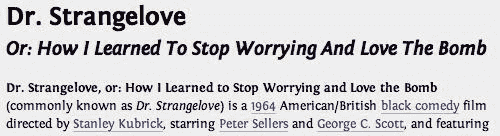
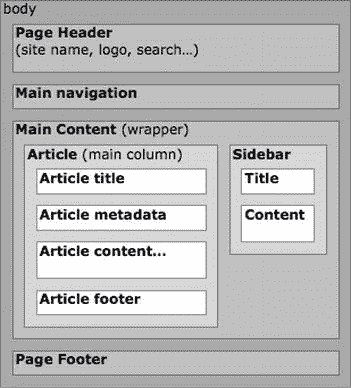
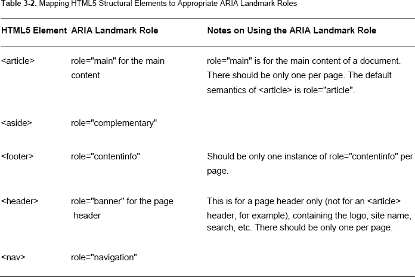
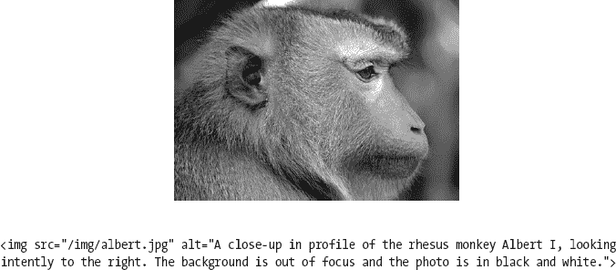
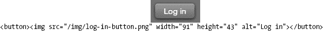
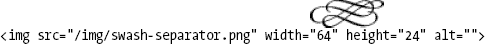

# 三、新的结构元素

正如我们在第一章、*末尾的练习中看到的，这都是关于语义的*。选择我们的标记仅仅是为了它的表现的错误想法，以基于`<table>`的布局和`spacer.gif` s 为代表，已经被“标准化”运动彻底地扫地出门。相反，我们的战斗口号是

> “使用语义上最合适的元素。”

令人高兴的是，大多数时候，每个元素的默认浏览器表示都与其语义密切相关。这给了我们可访问性的好处，因为语义标记提供了意义的基础，而不考虑表现形式。它还具有让我们的内容经得起未来考验的优势，允许它在新的替代设备上“正常工作”。鉴于所谓的开放式网络堆栈作为一个无处不在的平台的光明前景，这是一个相当大的优势。

在这一章中，我们将看看 HTML5 中用于指示结构的新元素，这可能是我们的工具包中最引人注目的(也可能是最令人困惑的)新增内容。我们还将了解它们如何与早期 HTML 版本的相关元素一起使用，HTML5 引入的大纲算法，以及 HTML5 风格的标题元素级别。然后我们将把我们学到的东西应用到实践中，与 HTML5 之前的编码模式进行比较。最后，我们将看看为旧浏览器添加这些新元素的语义的其他方法，并解决 HTML5 中的可访问性变化。

但是首先，让我们离题简单看一下工作流…

### 工作流实践，不断发展？

传统上，网页设计师使用流动的 lorem ipsum 创建美丽的像素完美的模型，然后在设计获得批准后，煞费苦心地试图将*真实的*内容放入其中。可悲的是，向客户展示平面模型注定会失败——如果“像素级完美”曾经有可能实现，那么在当前众多移动设备的情况下，那个时代已经一去不复返了。另一个导致这一过程失败的因素是网站的*交互性*。甚至无法测试链接翻转，这些模型是蜡像，不可思议地逼真，但几乎肯定是死的。

相反，我们更喜欢通常被称为“在浏览器中设计”的工作流程顾名思义，这包括创建基于 HTML 和 CSS 的模型，从内容语义和布局开始，然后转移到颜色等细节。对于商业工作，这发生在与客户建立项目的范围和目标，并通过草图和情绪板决定总体设计之后。然后在反馈过程中与客户共享模型，而不仅仅是完成的版本。Naz Hamid 在这条推文中简洁地总结了这种方法的好处:

你可以比在静态环境中更快地原型化和*失败*。你得到的*感觉*很快(`[`j.mp/fail-faster`](http://j.mp/fail-faster)1`)。

我们最喜欢的工作流程的标准是由安迪·克拉克提出的，他的“墙倒塌了”的演讲(`[`j.mp/in-the-browser`](http://j.mp/in-the-browser)2`)让这个工作流程的革命变得引人注目。虽然批评者认为 HTML 和 CSS 会从根本上限制你的潜在创造力，但我们认为同样的观点适用于任何工具。CSS3 最近的进步开始让 Photoshop 看起来相当(我们敢说吗？)是一个普通的网页设计工具，我们相信在使用电脑之前，你会用纸和笔以正确的方式开始你的设计*。*

 *你们中的一些人可能在大型组织中工作，因此无法影响自己的工作流程。我们鼓励你在一个个人项目中尝试这种方法，看看它是如何比较的。你可能会发现，你的热情以及对成本和时间节约的提及会让你的经理感兴趣。你们中的其他人可能对 HTML 和 CSS 一无所知，为其他人实现设计。我们希望，已经写了这么多关于 HTML 和 CSS 的书，鼓励你继续学习。你对你的设计是如何实现的了解越多，你的工作就会越好。到本书结束时，你将会知道足够的 HTML 和 CSS 来制作网站。

__________

1

2

虽然用 HTML 设计最初可能会令人害怕，但与客户讨论你的进展(即使非常粗略)有助于将他们纳入过程，并防止在展示时出现任何灾难性的意外。逐步添加更多的细节自然会关注客户的反馈，避免在讨论布局时出现“我不喜欢那个颜色”这样的评论(我们发现在布局阶段用灰色设计也有帮助)。当然，你也可以演示交互性和展示模型的工作，包括不同的浏览器如何不同地显示事物，让客户更好地了解成品的感觉。这对于反驳“在每个浏览器中必须看起来一样”的谬论以及解释渐进增强的乐趣有很大的帮助。最后，你不会因为你的客户在一个不灵活的模型上签字而被限制在一个固定宽度的布局上。

*注意:目前*这是我们首选的工作流程*；然而，我们也期待有一天有人能创造出比手工编码更好的应用。我们并不孤单，正如杰森·圣玛利亚的“一个真正的网页设计应用”文章(`[`j.mp/webdesign-app`](http://j.mp/webdesign-app)3`* )之后的大量评论所表明的。

一旦你的研究、计划、草图和迭代完成，下一步——就像在第一章练习中一样——是开始*识别和标记内容*。在这样做的时候，我们有责任去了解和理解我们可以使用的所有标记——这是我们技术的一个基本工具集。先说 HTML5 的新结构元素。

### 勇敢的新语义黎明

在 HTML 4 和 XHTML 1 中，我们的标记选择有些有限。虽然`
`比`<table>`更适合布局，但它仍然只是一个流内容的通用容器。我们可以使用类和 id 来添加 CSS 样式，如果我们使用描述元素内容的名称(而不是它的表示)，我们还可以使用它们来添加额外的特定语义。然而，虽然`<ul class="nav">`和`
`工作得很好，但我们添加的额外语义对用户来说是不可访问的，它们甚至不能被浏览器识别(除了样式)。我们不妨用`<ul class="naomi">`和`
`。

__________

3

*注:HTML 4 指的是*块*元素和*内联*元素。当 CSS 被添加到组合中时，这变得相当混乱，所以在 HTML5 中，它们分别被称为*流*元素和*短语*元素。*

那么 HTML5 有什么变化呢？嗯，一旦你开始使用 HTML5，你首先会注意到的是页面部分的新元素(`[`j.mp/html5-structural`](http://j.mp/html5-structural)4`)，我们称之为*结构元素*。这些元素取代了我们之前使用`class`和`id`属性应用的页面部分的通用特定语义，只是这次使用了标准化的*媒体无关的*语义。这些新的结构元素是

> `<section>`
> 
> `<article>`
> 
> `<header>`
> 
> `<footer>`
> 
> `<hgroup>`
> 
> `<nav>`
> 
> `<aside>`

*注意:*媒体独立*仅仅意味着它应该跨不同的平台、设备和媒体工作。有关更多信息，请参考本章后面的“辅助功能和 HTML5”一节。*

这一章涵盖了其他几个元素，包括我们的老朋友`
`和`<h1>`–`<h6>`，加上新来者`<figure>`和它的孩子`<figcaption>`，以帮助我们比较和对比结构元素。

__________

4

**锻造新元素**

你可能想知道这些新元素的名字是从哪里来的。2005 年 12 月，HTML5 规范编辑伊恩·希克森组织了 Web 创作统计研究。这项研究分析了大约 10 亿个文档的类名、元素、属性和相关元数据的真实使用情况。关于流行类名的发现揭示了作者使用的一些共同的语义模式。虽然使用`class`属性的*而不是*是最常见的做法，但是最流行的类名如下:

1.  `footer`
2.  `menu`
3.  `title`
4.  `small`
5.  `text`
6.  `content`
7.  `header`
8.  `nav`
9.  `copyright`
10.  `button`
11.  `main`
12.  `search`
13.  `msonormal`
14.  `date`
15.  `smalltext`
16.  `body`
17.  `style1`
18.  `top`
19.  `white`
20.  `link`

在这个列表中，我们可以看到几个语义指示器，它们紧密地映射到新的 HTML5 元素，如表 3-1 所示。

所以如果你是一个好的标准化者，并且使用基于意义的类名，*你*已经帮助选择了这些新的 HTML5 元素名。太棒了。有一些稍微抽象一些，比如`<aside>`(我们很快会遇到)超过`class="sidebar"`，但是在这些情况下，流行的类名*太过具体，限制了元素的可能用途。*

__________

5

### 结构积木:<师>、<段>、<条>

让我们首先比较一下用来构建页面的三个容易混淆的元素。

*   我们都知道并喜爱的普通容器。它是一个没有额外语义的流内容元素(`[`j.mp/html5-div`](http://j.mp/html5-div)6)`)。
*   `<section>`:一个通用的文档或应用部分，几乎总是有一个标题(可能在一个`<header>`中)，有时也有一个`<footer>,`。它是一大块与*相关的内容*，比如一篇长文的一个小节、页面的一个主要部分(比如主页上的新闻部分)，或者 web 应用标签式界面中的一个页面(`[`j.mp/html5-section`](http://j.mp/html5-section)7)`)。
*   `<article>`:文档或站点的一个*独立的*部分。这意味着它应该能够独立存在，如果您在其他地方遇到它(例如，在 RSS 提要中)，它仍然有意义。例子包括博客文章(duh)、论坛帖子或评论。像`<section>`，这些应该有一个标题，可能有一个页眉和/或页脚(`[`j.mp/html5-article`](http://j.mp/html5-article)8)`)。

#### 与<部门>、<部门>、<条>的区别

这些定义最初听起来非常相似，所以让我们从`
`开始比较和对比它们。

###### 元素

在编写 POSH (plain old semantic HTML)时，我们应该使用最合适或语义最准确的元素。虽然`
`具有一般流容器元素的语义，但除此之外它没有任何语义意义，并且它在没有更合适的元素时使用(即在 HTML 4 中*一直是*)。不要求`
`的内容彼此相关。

__________

6

7 `[www.whatwg.org/specs/web-apps/current-work/multipage/sections.html#the-section-element](http://www.whatwg.org/specs/web-apps/current-work/multipage/sections.html#the-section-element)`

8

###### <节>元素

新的 HTML5 `<section>`元素类似于作为通用容器元素的`
`，但是它*确实*有一些额外的语义——它包含的东西是*相关内容的逻辑组*。

*注意:`<section>`元素表示文档或应用的通用部分。在这种情况下，节是内容的主题分组，通常带有标题。*

`<section>`也是一个*切片内容元素*。与`<article>`、`<nav>`和`<aside>`一起，表示文档中的新章节。想象一下，将您的页面制作成相关部分的嵌套列表，或者使用文字处理程序的 outline 视图:每个分区内容元素的标题都是一个新项目，缩进反映了嵌套。

> **1。**示例列表项
> 
> **2。**另一个项目
> 
> 1.嵌套项目
> 
> 你明白了吗

我们将在本章后面的“HTML5 大纲算法”一节中介绍如何对内容元素进行分段来创建 HTML5 文档大纲，但是需要注意的重要一点是,`
`不是一个分段内容元素。

###### 

<article>元素</article>

新的 HTML5 `<article>`元素就像是一种特殊的`<section>`；它有更具体的语义含义，即*是页面的一个独立、自包含的部分*。我们*可以*使用`<section>`，但是使用`<article>`会给出更多的语义含义。

#### 选哪个？

想一想 HTML 4，我们可以把这个选择比作`
`和`<pre>`之间的选择。两者都是文本的流动内容元素，但是`<pre>`就像是一种特殊的`
`，具有更具体的含义(“这是一个*预格式化的*文本块”)。`<section>`和`<article>`也是如此；`<section>`表示“相关内容”，而`<article>`表示“一段相关内容，*对其自身*有意义”，甚至在页面上下文之外(页面的页眉和页脚等)。).

这其中潜在的令人困惑的部分是，`<section>`可以用于页面的部分，可以包含`<article>`(就像主页的“最近文章”部分)，也可以用于长的`<article>`(在和`<article>`中的*)的部分。*

因此，要决定`<article>`、`<section>`或`
`是否合适，选择第一个合适的选项。

1.  在 feed 阅读器中，附带的内容本身有意义吗？如果有，用`<article` >。
2.  所附内容是否相关？如果有，使用

    <section>。</section>

3.  如果没有语义关系，就用。

除了偶尔使用为还没有风格的风格提供一个挂钩，我们预计不起眼的`
`将经常被`<section>,` `<article>`和其他新的结构元素取代——如果合适的话——在语义 HTML5 中。但是，不要害怕在适当的时候使用`
`；它仍然是有效的 HTML5。

`<section>`和`<article>`的用法类似于`
`在 HTML 4 中的用法；例如，这些元素不能在`<blockquote>`或`<address>`中使用。同样，一般来说，避免将一个`<article>`嵌套在另一个`<article>.`中，而是使用`<section>` s 来表示一个`<article>`的逻辑部分。一个值得注意的例外是博客文章的评论。最后，`<section>`和`<article>`不需要标题的情况是在 web 应用中(想想电子邮件应用的主列表视图)，但是*最好添加一个标题，*即使你通过 CSS 隐藏它。

#### 使用这些元素的基本结构

这里有几个例子展示了`<section>`和`<article>`的用法。

###### 一篇博客文章

这是我们正在处理的结构:

> 博客文章
> 
> 标题
> 
> 内容…

在 HTML 4 中，我们可能会将文章包装在`
`中，等等。显然，我们应该在 HTML5 中使用`<article>`来代替。

`<article>
  <h1>Heading</h1>
  
Content…

</article>`

###### 一篇有小节的长文章(像论文)

下面是我们正在处理的文章结构:

> 文章
> 
> 标题
> 
> 一节
> 
> 章节标题
> 
> 内容
> 
> 一节
> 
> 章节标题
> 
> 内容
> 
> 一节
> 
> 章节标题
> 
> 内容

同样，在 HTML 4 中，文章通常会被包装在一个`
`中，而小节只会由`<h1>`–`<h6>`元素来提示。在 HTML5 中，文章应该包装在`<article>`中，而`<article>`的子部分应该通过包装在`<section>`元素中来明确表示，如果您喜欢部分编号，可能是在有序列表项中。

`<article>
  <h1>Heading</h1>
  <section>
    <h2>Section heading</h2>
    
Content

  </section>
  <section>
    <h2>Section heading</h2>
    
Content

  </section>
  <section>
    <h2>Section heading</h2>
    
Content
` `  </section>
</article>`

这些都是有些过于简单的例子，所以在本章的最后，我们将看看一个基本的博客主页的结构。

### 标题:<表头>、<h 组>??、和<h1>–<h6>，加上<表尾>

接下来，让我们详细看看新的`<header>`、`<footer>`和`<hgroup>`元素。

*注:切片元素包括`<section>`、`<article>`、`<aside>`、`<nav>`，还有`<blockquote>`、`<body>`、`
`、`<fieldset>`、`<figure>`、`<td>`。我们将在本章后面的“HTML5 大纲算法”一节中介绍这个概念。*

*   `<header>`:用于*切片元素*的*介绍和导航内容*。这通常包括标题(一个`<h1>`–`<h6>`元素或一个`<hgroup>`元素)，但也可以包含其他内容，如`<nav>`元素或导航链接、目录、搜索表单或任何相关的徽标。它不能包含`<footer>`或另一个`<header>`(参见`[`j.mp/html5-header`](http://j.mp/html5-header)`)。
*   `<footer>`:用于*关于内容的附加信息*，如作者、相关文档的链接、版权数据、页面顶部的链接等。，通常出现在内容的末尾。像`<header>`一样，不能包含`<header>`或`<footer>`元素(参见`[`j.mp/html5-footer`](http://j.mp/html5-footer)`)。
*   `<hgroup>`:一种特殊形式的`<header>`，它只能包含`<h1>`–`<h6>`元素。它用于将标题和副标题组合在一起(见`[`j.mp/html5-hgroup`](http://j.mp/html5-hgroup)9`)。
*   `<h1>`–`<h6>`:HTML 4 中的标题元素又回来了，基本上没有变化，除了 HTML5 对正确使用它们有更强的指导(一般来说，不要跳过级别)，以及有趣的增加了 HTML5 风格的标题级别，我们将在本章后面介绍。(`[`j.mp/html5-h1-h6`](http://j.mp/html5-h1-h6)`)。

__________

9

`<header>`的定义目的是包含*介绍性或导航帮助*，而不是定义它们的位置(标题通常在一个部分的顶部，但不是必须的)。

`<footer>`为*相关链接、版权、作者信息*。一个`<footer>`通常出现在一个部分的末尾，但是也可以出现在顶部，并且可以出现不止一次(例如，一个“页面顶部”链接)。对于某些内容，使用这些元素中的哪一个有一些交叉——作者信息在任何一个中都可以。

`<header>`和`<footer>`似乎在暗示设计师熟悉的页眉页脚。但是，不要让第一印象欺骗了你，因为这些元素适用于当前的截面元素。如果该元素是`<body>`，那么`<header>`或`<footer>`将应用于整个页面。但是如果是另一个分段元素，那么`<header>`或`<footer>`仅适用于该元素。想想俄罗斯嵌套娃娃…在可爱的小尖括号。

*注意:`<address>`元素已经从为页面提供联系信息(每页只有一个)变成了由上下文“限定范围”。在 HTML5 中，`<address>`联系信息是针对*最近的 *`<article>`或`<body>`* 元素的祖先*。和 HTML 4 一样，它不用于文字地址，除非地址也是联系信息——这种情况很少见(关于标记普通邮政地址，请参考第四章中的“微格式”)。假设每篇文章都是一个`<article>`，主页上的最近文章列表可以使用`<address>`作为每篇文章的作者名和简历链接(或其他联系信息)。*

一个`<header>`或`<footer>`本身可以包含分段内容元素——例如，在一个`<footer>`中，这可以是一个附录、索引、长跋或许可协议。但是，不要因为他们*不能*牵制`<header>`或者`<footer>`而过于得意忘形。对于复杂的页眉或页脚，需要嵌套的节内容元素，它们有自己的`<header>`和`<footer>`，使用`<section>`代替。

虽然`<header>`和`<hgroup>`最初很容易混淆，但是请记住`<hgroup>`只能包含一个`<h1>`–`<h6>`元素的*标题组*，用于副标题、可选标题或标语。`<header>`可以包含一个`<h1>`–`<h6>`元素或`<hgroup>` *，此外还有*其他引入该部分的元素。如果没有其他的`<header>`内容，只有一个标题(所以不需要`<hgroup>`，也不需要样式挂钩，就使用相关的`<h1>`–`<h6>`元素。

让我们看一些例子。

#### 只有一个标题的文章

这只有一个标题`<h1>`。不需要`<hgroup>`或`<header>`。

`<article>
  <h1>Article heading</h1>
  
Content…
` `</article>`

#### 一篇文章 *<* 标题 *>* 带标题和元数据

现在我们在`<header>`中包装一个标题和元数据。

`<article>
  <header>
    <h1>Article heading</h1>
    
(<time datetime="2009-07-13" </time>)

  </header>
  
Content…

</article>`

#### 一篇带有<h 组>-封闭副标题的文章

这个例子在`<hgroup>`中有一个标题`<h1>`和副标题`<h2>`。

`<article>
  <hgroup>
    <h1>Article heading</h1>
    <h2>Article subheading</h2>
  </hgroup>
  
Content…

</article>`

#### 带有标题、副标题和元数据的文章

最后，这里有一个使用`<header>`和`<hgroup>`的标题的例子。

`<article>
  <header>` `    <hgroup>
      <h1>Article heading</h1>
      <h2>Article subheading</h2>
    </hgroup>
    
(<time datetime="2009-07-13" pubdate>13th July, 2009</time>)

  </header>
  
Content…

</article>`

#### 一些< hgroup >使用的例子

在这个部分中，您可以看到使用<`hgroup>`的效果。这是一篇带有备选标题的文章。

这是一个带有标语(品牌短语)的网站名称。

这是一篇长文章，标题分为一个标题和一个副标题。

现在，您可能想知道为什么需要同时拥有`<header>`和`<hgroup>`——它们似乎都是`<h1>`—`<h6>`元素的包装器。嗯，`<hgroup>`实际上执行另一个功能:隐藏子标题，使其不被大纲算法发现。让我们深入 HTML5 大纲的世界，看看它到底意味着什么。

### html 5 的大纲算法

能够自动制作页面轮廓对浏览器和机器人来说都是一个有用的技巧。例如，它可以用于为盲人用户生成目录，使他们能够快速浏览页面。为了从 HTML 4 或 XHTML 1 文档制作页面轮廓，我们可以找到所有的`<h1>`–`<h6>`元素，并使用每个标题的编号来指示嵌套的级别。然而，字幕会增加嵌套，许多语义不太明确的页面为了表现会跳过层次，这两者都会给出不准确的轮廓。此外，大纲工具将无法分辨哪些标题是主要内容的一部分，哪些在侧边栏中，例如，两组标题通常都在通用的`
`元素中。

HTML5 通过一个新的大纲算法(`[`j.mp/html5-outline`](http://j.mp/html5-outline)10`)解决了这个问题，我们在提到内容元素的分段时提到过这个算法(一个“简单的旧嵌套列表”)。虽然这听起来可能不令人兴奋，但它有助于使我们的内容更容易访问和使用。此外，理解轮廓的创建将会解释一些容易混淆的事情。这些大纲由*中的标题组成，这些标题将内容元素*分段，比如我们见过的`<section>`和`<article>`，加上`<nav>`和`<aside>`，它们定义了页面上相关内容的主要块。

每个章节内容元素中的第一个`<h1>`–`<h6>`作为大纲中该章节的标题，任何后续标题在大纲中创建一个*隐式*包围章节(`[`j.mp/headings-sections`](http://j.mp/headings-sections)11`)；也就是说，它不在您的代码或 DOM 中，但是大纲算法假装它在。较低级别的标题元素构成嵌套的隐式节，而相同或更高级别的标题元素在当前的隐式节之后并且在相同的级别上构成新的隐式节。

*注意:*隐式封闭部分是 HTML5 的大纲如何处理错误和 HTML5 之前的内容。

例外情况是`<hgroup>`元素，它隐藏了大纲算法中除第一个孩子`<h1>`–`<h6>`之外的所有元素，我们很快就会见到它。请注意，`<header>`不是标题内容元素(规范用语为`<h1>`–`<h6>`和`<hgroup>`)或分段内容元素，它不影响大纲算法。

__________

10

11

#### 概述行动

这在理论上很好，但这意味着什么呢？好吧，让我们来看看一些实际的概要，感受一下正在发生的事情。你可以在家里玩一个 outliner，比如 h5o ( `[`j.mp/html5-outliner`](http://j.mp/html5-outliner)12`)或者(`[`j.mp/gsnedders-outliner`](http://j.mp/gsnedders-outliner)13`)。

下面是一个基本的 HTML 4 示例及其概要:

`<body>
  <h1>Article heading</h1>
  <h3>Article subheading</h3>
  
Some text

  <h2>Section heading</h2>
  
More text

  <h2>Another section heading</h2>
  
A little more text

</body>`

请注意，文章副标题在大纲中显示为相当于章节标题，因为它的标题更低。然而，它的标题级别(`<h3>`)并不影响大纲——它只是缩进一级，而不是两级。

> **1。**文章标题(隐含部分)
> 
> 1.文章副标题(隐含部分)
> 
> 2.章节标题(隐含章节)
> 
> 3.另一个节标题(隐式节)

__________

12

13

这里是 HTML5 中的同一个例子，使用了显式分段元素和`<hgroup>`。

`<body>
  <article>
    <hgroup>
      <h1>Article heading</h1>
      <h2>Article subheading</h2>
    </hgroup>
    
Some text

    <section>
      <h2>Section heading</h2>
      
More text

    </section>
    <section>
      <h2>Another section heading</h2>
      
A little more text

    </section>
  </article>
</body>`

没有更多的文章副标题，但一个神秘的“无标题部分”出现。请继续阅读，找出原因。

> **2。**无标题部分
> 
> 1.文章标题
> 
> 1.章节标题
> 
> 2.另一个章节标题

#### 剖切根元素

除了划分内容元素之外，还有另一组元素可以拥有自己的轮廓。

> *   `<blockquote>`
> *   `<body>`
> *   `
`
> *   `<fieldset>`
> *   `<figure>`
> *   `<td>`

这些*剖切根元素*对它们祖先的轮廓没有贡献。一般来说，这意味着它们隐藏了大纲算法中没有用的东西。虽然`<body>`也在这个列表中，但它是文档大纲的基本元素。像划分内容元素一样，划分根元素定义了所包含的`<header>`和`<footer>`元素的范围，它们从来都不是隐式部分的子元素。

#### 无标题的祸害一节

那么，当我们有一个没有标题的*剖分元素*时会发生什么呢？你可能已经猜到了，我们在大纲中有一个部分叫做“无标题部分”我们在前面的大纲示例中看到了这一点——在那种情况下，无标题部分来自`<body>`。当然，“无标题部分”并不是特别有帮助，所以一般来说`<section>`、`<article>`、`<body>`、*应该总是*有标题。对于其他切片元素，如`<aside>`，在禁用 CSS 的情况下检查页面，看看内容是否仍然有意义。如果你不希望一个标题出现在完成的设计中，你可以添加一个并通过 CSS 隐藏它。这确保了标题对于屏幕阅读器和机器人仍然可用，例如，在 HTML 4 和 XHTML 1 中使用`
`有时是为了便于访问。如果有疑问，我们建议你添加一个——盲人用户(包括谷歌)会感谢你的。

*注意:*分段元素*是我们对“分段内容和分段根元素”的简称，因为这相当拗口。*

下面是另一个轮廓示例，显示了如何从祖先的轮廓中排除剖切根元素的轮廓(`<blockquote>`、`<body>`、`
`、`<fieldset>`、`<figure>`和`<td>`)。

`<body>
  <h1>Exciting simian adventures</h1>
  <article>
    <h1>Article heading</h1>
    
Some text

    <!-- woops! we forgot the section -->
    <h2>Section heading</h2>
    
More text

    <blockquote>
      <h3>Quote heading</h3>
      …
    </blockquote>
    <h3>Subsection heading</h3>
    …
    <section>
      <!-- woops! we forgot the heading -->
      
A little more text

    </section>
  </article>
</body>`

下面是大纲，显示了运行中的截面根元素、隐式截面和无标题截面。

> **3。**刺激的猿猴冒险
> 
> 1.文章标题
> 
> 1.章节标题(注意没有`<blockquote>`标题)
> 
> 1.分段标题(基于标题级别的隐式分段)
> 
> 2.无标题部分(`<section>`无标题)

此外，我们可以看到隐式节创建了一个嵌套节，因为它的标题相对较低— `<h2>Subsection heading</h2>`将使它与“节标题”处于同一级别，但是`<h4>`标题不会进一步缩进大纲中的标题。最后，显式的“无标题部分”关闭了前面的隐式部分。

这个大纲算法，以及它的隐式节的创建，解释了为什么我们应该总是为至少`<section>`和`<article>`使用标题内容元素，为什么副标题应该用`<hgroup>`包装，以及为什么每个标题元素应该在它自己的节元素中。然而，它也有一个有趣的副作用:将标题级别从文档大纲中分离出来。

### HTML5 样式的标题元素级别

在 HTML 中，作者被鼓励合理地使用标题元素`<h1>`–`<h6>`*——使用层次来表示嵌套，而不是跳过层次——但这在长的或复杂的文档中可能是个问题。有一些文件实际上需要超过六级的标题！(事实上，我们一直想知道可怜的`<h7>`–`<h9>`后来怎么样了。)由于大纲算法，我们现在有两种方法可以在 HTML5 中使用标题。*

 **   就像在 HTML 4 中，标题元素(`<h1>`–`<h6>`)决定了内容的重要程度(想象一下做一个大纲)。`<h1>`用于页面或文章标题，后续标题根据需要合理增加，以表明提纲。
*   HTML5 中引入的一种新方法，其中显式分段内容元素的嵌套决定了文档的轮廓。这意味着分区内容元素(`<section>`、`<article>`、`<nav>`或`<aside>`)中排名最高的标题元素(`<h1>`–`<h6>`或`<hgroup>`)成为该节的标题，而不管它是否跳过级别。

这种新方法可能更容易，因为文档大纲中的标题级别与所使用的标题元素(以及如何使用 CSS 设置标题样式)是分开的。因为大多数部分只需要一个 heading 元素，所以你可以在任何地方使用`<h1>`(几乎)，根据`<section>`父元素的数量来设计样式。然而，当前的浏览器不会正确地解释这一点(例如，当 CSS 被禁用时)，这需要高级 CSS 选择器支持样式，所以现在我们建议您不要这样做。

或者，因为使用显式分段元素允许我们跳过标题级别，所以您可以使用任何想要的标题(例如，基于 CSS 样式)，而不必担心合理使用`<h1>`–`<h6>`。需要时，可以通过`<hgroup>`或类的样式来处理字幕等样式异常。

#### 嵌套标题元素层次的例子

这是标题元素的标准嵌套(使用

# 到

#### )。

`<article>
  <hgroup>
    <h1>Article heading</h1>
    <h2>Article subheading</h2>
  </hgroup>
  <section>
    <h3>Section heading</h3>
    
Content…

      <section>
        <h4>Subsection heading</h4>
        
Content…

      </section>
  </section>
</article>`

#### 标题元素级别的新样式示例

这个示例使用 HTML5 样式的标题级别—新的节重置(

### 被有意跳过，以便子节的标题使用

#### 样式)。

`<article>
  <hgroup>
    <h1>Article heading</h1>
    <h2>Article subheading</h2>
  </hgroup>` `  <section>
    <h2>Section heading</h2>
    
Content…

      <section>
        <h4>Subsection heading</h4>
        
Content…

      </section>
  </section>
</article>`

这两者将产生相同的 HTML5 轮廓。

> **4。**文章标题
> 
> 1.章节标题
> 
> 1.小节标题

如前所述，在 HTML5 中，除了第一个标题元素之外，sectioning content 元素中的所有元素都会在文档大纲中生成一个隐含的节。因此，建议*添加显式切片包装器*。如果你没有，确保你没有跳过标题级别。

### 更多的结构元素:<导航>，<暂且不说>，<人物>(还有<人物标题>)

现在我们来看看另外两个分段内容元素，`<nav>`和`<aside>`。我们还将触及`<figure>`和它的孩子`<figcaption>`，并将它们与`<aside>`进行比较。

*   `<nav>`:导航链接的一个部分，或者指向其他页面(通常是站点导航)，或者指向同一页面上的部分(例如长文章的目录)。这是针对*主要导航块*的，而不仅仅是针对任何一组链接。一个经验法则是，你可以为它添加一个“跳过导航”链接(`[`j.mp/html5-nav`](http://j.mp/html5-nav)14`)。
*   `<aside>`:页面的一部分，由与周围内容无关但又独立的*内容组成。在印刷中，这将是一个侧栏，引用，或脚注。在博客文章中，这可能是关于文章的相关信息、页边空白处的额外信息或评论部分(`[`j.mp/html5-aside`](http://j.mp/html5-aside)15`)。*
*   `<figure>`:对于理解至关重要，但可以从文档流中删除(移动到不同位置)而不影响文档含义的内容。这可用于图像或视频，但也可用于任何其他内容，包括图表、代码示例或其他媒体。使用可选的(也是美味的)子元素`<figcaption>`来提供一个标签(`[`j.mp/html5-figure`](http://j.mp/html5-figure)16`)。

你可能已经在使用`<ul class="nav">`或类似的东西进行网站导航了。元素允许我们显式地标记导航链接组。这具有可访问性的好处；例如，它允许屏幕阅读器等辅助技术的用户跳过导航，直接进入内容，或者跳过*到*导航。我们可以用这个作为另一种方式来决定某个东西是否是一个主要的导航块——通过热键访问导航对盲人用户有帮助吗？虽然站点和页面内导航显然是必不可少的，但页面页脚的内容突出显示可能不是。搜索框？嗯，这要看情况…网站的用户会这么想吗？注意，如果你使用列表导航，你仍然需要`<ul>`或`<ol>`元素(你应该这样做——这是最合适的元素),但是你也可以包含标题或其他相关内容。下面是一个使用中的`<nav>`的例子，带有一个标题(很可能通过 CSS 隐藏)。

`<nav>
  <h2 class="a11y">Main navigation</h2>
  <ul>` `    <li><a href="/">Home</a></li>
    <li><a href="/blog/">Weblog</a></li>
    <li><a href="/about/">About</a></li>
    <li><a href="/contact/">Contact</a></li>
  </ul>
</nav>`

__________

14

15

16

内容应该是对主要内容的补充(但不是理解主要内容所必需的);即*任何*相关的内容。虽然印刷设计可以提供灵感，但不要停留在引用上。例如，脚注提供了额外但不重要的信息，引用(虽然是重要内容)是从主要内容中引用的文本。但是，记住`<aside>` *一定是相关的。*将你的站点的侧边栏作为`<body>`的子节点放在`<aside>`中是可以的，但是整个站点的信息不应该出现在`<article>`的子节点`<aside>`中。此外，`<aside>`也适用于广告，只要它与父 sectioning 元素相关。这里有一个例子`<aside>`在文章的空白处提供额外的信息。

`<aside class="sidenote">
  
<em>Sectioning root</em> elements are <code>&lt;blockquote&gt;</code>,
<code>&lt;body&gt;</code>, <code>&lt;details&gt;</code>, <code>&lt;fieldset&gt;</code>,
<code>&lt;figure&gt;</code>, and <code>&lt;td&gt;</code>

</aside>

<code>&lt;header&gt;</code> and <code>&lt;footer&gt;</code> apply to the current sectioning
content or 'sectioning root' element…
`

`<figure>`内容*是*必不可少的，但它的位置不是。您当前使用 CSS 定位的任何部分都是不错的选择。通常这将从文本中引用，如下所示，但这不是必需的。

`
… Here is an example of using <code>hgroup</code> for a subtitle.

<figure>
  
</figure>`

您还可以使用`<figcaption>`为`<figure>`提供可选标题，如下所示，作为第一个或最后一个子元素。

`<figure>
  <figcaption>An article heading with an alternative heading</figcaption>
  
</figure>`

最后，`<figure>`可以包含多条内容，如下所示。

`<figure>
  <pre>&lt;ruby&gt;&lt;strong&gt;cromulent&lt;/strong&gt;
&lt;rp&gt;(&lt;/rp&gt;&lt;rt&gt;crôm-yü-
lənt&lt;/rt&gt;&lt;rp&gt;)&lt;/rp&gt;&lt;/ruby&gt;</pre>
  
  <figcaption>Using ruby text for a dictionary definition by displaying the ruby text inline
after the base text</figcaption>
</figure>`

通过问自己内容是否对理解该部分至关重要，在`<aside>`或`<figure>`之间做出选择。如果内容只是相关的，而不是必要的，使用`<aside>`。如果内容是必要的，但是它在内容流中的位置不重要(它可以移到附录吗？)，使用`<figure>`。当然，如果它的位置关系到前面和后面的内容，使用其他更合适的东西！还要记住，`<nav>`和`<aside>`是分节内容元素，因此它们的标题将被添加到文档大纲中。`<figure>`是一个分段根元素，因此任何子标题都将从大纲中隐藏。

### 把所有这些放在一起

我们已经走过了很多地方。概括地说，HTML5 为相关内容块提供了几个新元素——基本上是文档的一个逻辑部分。使用这些元素而不是`
`在语义上更有意义，并且免费给我们带来额外的好处(比如改进的可访问性)。让我们回顾一下到目前为止我们已经讨论过的内容，看看我们如何通过将一个简单的页面转换成 HTML5 来在实践中使用这些新元素。我们还将查看几个备选方案，以帮助您考虑新的语义，而不必承诺使用新的语义元素。

#### 概括地说新增剖切内容要素

下面是我们讨论过的新元素的总结。

*   `<section>`:一大块相关内容。
*   `<article>`:一个独立的、自包含的相关内容块，仍然*对其自身*有意义(例如，在 RSS 提要中)。
*   一大块内容，与周围的内容关系不大，但对理解这些内容并不重要。
*   (参见`<figure>`:对理解周围内容至关重要但可以移动的内容块(例如，移动到附录)。
*   `<nav>`:主导航块(一般是站点或页面导航)。
*   `
`:没有附加语义的内容块*(例如，用于 CSS 样式挂钩)。*

除了极少数例外(通常在 web 应用中)，`<section>`和`<article>` *元素应该有一个标题*，可能在一个`<header>`元素中带有任何其他介绍性信息。我们可以使用 HTML5 Doctor 网站上发布的以下评论(在文章“部分元素”之后)(`[`j.mp/section-heading`](http://j.mp/section-heading)17`)作为在`<section>`和`
`之间做出决定的经验法则:

> *【C】有意识地为每个`<section>`添加一个标题，即使你随后用 CSS 隐藏了标题(对于可访问性来说`<nav>`通常就是这种情况)。如果当 CSS 被禁用时，它看起来像是不应该有标题的内容，那么它很可能不是一个`<section>`。*
> 
> 研究用油

记住，有一个或多个副标题的标题应该在`<hgroup>`中。除了`<header>`，sectioning 元素还可以包含一个或多个带有附加信息的`<footer>`元素，例如作者(`<address>`)或版权(`<small>`)内容、相关链接等。需要注意的是`<header>`和`<footer>`适用于它们所在的分节元素(这是页眉或页脚的`<body>`)。还有，记住`<header>`和`<footer>`不能包含`<header>`或`<footer>`本身。

__________

17 `[`html5doctor.com/the-section-element/#comment-940`](http://html5doctor.com/the-section-element/#comment-940)`

*注:切片元素包括切片内容元素`<section>`、`<article>`、`<aside>`、`<nav>`，以及切片根元素`<blockquote>`、`<body>`、`
`、`<fieldset>`、`<figure>`、`<td>`。*

最后，虽然单词“页眉”、“页脚”和“旁白”都带有先入之见，*它们的语义来自它们包含的内容类型*，而不是来自它们的呈现或相对位置。例如，`<aside>`可以包含一个脚注，而包含“页面顶部”链接的`<footer>`可以同时出现在一个部分的顶部和底部。

现在让我们看看理想化的文章页面的示例结构，使用标准的页眉布局(带有标志等)。)，站点导航，主列，侧列和页脚。

#### 将一个简单的页面转换成 HTML5

这是我们页面各部分的轮廓。

> 页面标题(网站名称、徽标、搜索等。)
> 
> 主导航
> 
> 主要内容(包装)
> 
> 文章(主栏)
> 
> 文章标题
> 
> 文章元数据
> 
> 文章内容
> 
> 文章页脚
> 
> 侧栏
> 
> 侧栏标题
> 
> 侧栏内容
> 
> 页面页脚

图 3-1 说明了该页面。

**图 3-1。**文章页面布局

所以我们用标准的 POSH (XHTML 1.0 风格)来写吧。

`<!DOCTYPE html PUBLIC "-//W3C//DTD XHTML 1.0 Strict//EN"
  "http://www.w3.org/TR/xhtml1/DTD/xhtml1-strict.dtd">
<html lang="en" xml:lang="en">
  <head>
    <title>Article (XHTML 1)</title>
    <meta http-equiv="Content-Type" content="text/html; charset=utf-8" />
  </head>
  <body>
    

      <h1>Site name</h1>
      <!-- other page heading content -->
    

    <ul id="nav"><li>Site navigation</li></ul>` `    

      
 <!-- main content (the article) -->
        <h1>Article title</h1>
        
Article metadata

        
Article content…

        
Article footer

      

      
 <!-- secondary content -->
        <h2>Sidebar title</h2>
        
Sidebar content…

      

    

    
Footer

  </body>
</html>`

现在让我们使用新的结构元素将其转换为 HTML5。

*注意:为了简洁起见，我们将省略第二章中涉及的用于浏览器支持的 CSS 和 JavaScript。如果你在家编码，记得添加它们。*

`<!-- 'HTML-style' HTML5 -->
<!DOCTYPE html>
<html lang="en">
  <head>
    <meta charset="utf-8">
    <title>Article (HTML5)</title>` `</head>
  <body>
    <header id="branding"><!-- page header (not in section etc) -->
      <h1>Site name</h1>
      <!-- other page heading content -->
    </header>
    <nav>
      <ul><li>Main navigation</li></ul>
    </nav>
    
 <!-- wrapper for CSS styling and no title so not section -->
      <article> <!-- main content (the article) -->
        <header>
          <h1>Article title</h1>
          
Article metadata

        </header>
        
Article content…

        <footer>Article footer</footer>
      </article>
      <aside id="sidebar"> <!-- secondary content for page (not related to article) -->
        <h3>Sidebar title</h3> <!-- ref: HTML5-style heading element levels --
>
        
Sidebar content

      </aside>
    

    <footer id="footer">Footer</footer> <!-- page footer -->` `</body>
</html>
<!-- 'XHTML-style' HTML5 -->
<!DOCTYPE html>
<html lang="en">
  <head>
    <meta charset="utf-8" />
    <title>Article (HTML5)</title>
  </head>
  <body>
    <header id="branding"> <!-- page header (not in section etc) -->
      <h1>Site name</h1>
      <!-- other page heading content -->
    </header>
    <nav>
      <ul><li>Main navigation</li></ul>
    </nav>
    
 <!-- wrapper for CSS styling and no title so not
section -->
      <article> <!-- main content (the article) -->
        <header>
          <h1>Article title</h1>
          
Article metadata

        </header>
        
Article content…
` `        <footer>Article footer</footer>
      </article>
      <aside id="sidebar"> <!-- secondary content for page (not related to article) -->
        <h3>Sidebar title</h3> <!-- ref: HTML5-style heading element levels --
>
        
Sidebar content

      </aside>
    

    <footer id="footer">Footer</footer> <!-- page footer -->
  </body>
</html>`

我们所做的改变几乎就像是一次代码春季大扫除。我们已经更改为简单的 HTML5 文档类型和`charset`在第二章中介绍，并将用于页面语义部分的`
`替换为新的 HTML5 结构元素。我们的代码是不同的，但是 HTML5 的“进化，而不是革命”方面是显而易见的。

注意这里我们假设侧边栏包含与文章无关的内容(比如最近的文章等等)。)，所以它是`<body>`(一个*页面*侧边栏)而不是`<article>`的后代。如果它只包含与文章无关的内容，我们可以让`<aside>`成为`<article>`的孩子。此外，我们假设页眉和页脚不包含嵌套的`<header>`或`<footer>`元素，因为在这种情况下我们必须使用`<section>`来代替(记住`<header>`和`<footer>`本身不能包含`<header>`或`<footer>`)。

那么，对于那些你担心关闭了 JavaScript 的 Internet Explorer 用户，或者你的老板是谨慎型的人的网站呢？这是否意味着我们介绍的令人兴奋的 HTML5 元素只是一个白日梦？不要害怕，亲爱的读者。

#### 介绍“HTML4.5”:通过< div class="" >添加 HTML5 的语义

我们不断回到 HTML5 的一个方面是，它是一个滑动的尺度，而不是全部或没有。本着这种精神，我们为你发明了一个全新的元规范，我们称之为“HTML4.5”。与其说这是 W3C 风格的规范，不如说这更像是一个想法——我们可以使用 HTML5 中我们想要的部分，而不需要全力以赴。在这种情况下，我们希望 HTML5 的新元素具有良好的语义，但又不用担心 Internet Explorer 会破坏一切。我们可以通过使用 HTML5 的新元素名(和隐含的语义)作为`
`类名来做到这一点。

当然，我们没有得到内置语义的任何好处。然而，仅仅*考虑一下* HTML5 的结构元素就会使我们的代码更具逻辑性和语义性。如果您认为将来可能会转换到 HTML5，HTML5-elements-as-class-names 方法应该可以消除很多转换的痛苦，特别是使用一点 regexp 魔法。

下面是使用 HTML5 元素类名的 XHTML 1 版本。

`<!DOCTYPE html PUBLIC "-//W3C//DTD XHTML 1.0 Strict//EN"
  "http://www.w3.org/TR/xhtml1/DTD/xhtml1-strict.dtd">
<html lang="en" xml:lang="en">
  <head>
    <title>Article (XHTML 1), with HTML5 class names</title>
    <meta http-equiv="Content-Type" content="text/html; charset=utf-8" />
  </head>
  <body>
    
 <!-- page header -->
      <h1>Site name</h1>
      <!-- other page heading content -->
    

      <ul id="main-nav" class="nav">
        <li>Site navigation</li>
      </ul>
    

      
 <!-- main content -->
        

          <h1>Article title</h1>` `          
Article metadata

        

        
Article content…

        
Article footer

      

      
 <!-- secondary content -->
        <h2>Sidebar title</h2>
        
Sidebar content…

      

    

    
Footer

  </body>
</html>`

这里是在 HTML5 中，再次使用带有 HTML5 元素类名的`
`,而不是新的 HTML5 元素。

`<!-- 'HTML-style' HTML5 -->
<!DOCTYPE html>
<html lang="en">
  <head>
    <title>Article (HTML5), with HTML5 class names</title>
    <meta charset="utf-8">
  </head>
  <body>
    
 <!-- page header -->
      <h1>Site name</h1>` `<!-- other page heading content -->
    

      <ul id="main-nav" class="nav">
        <li>Site navigation</li>
      </ul>
    

      
 <!-- main content -->
        

          <h1>Article title</h1>
          
Article metadata

        

        
Article content…

        
Article footer

      

      
 <!-- secondary content -->
        <h2>Sidebar title</h2>
        
Sidebar content…

      

    

    
Footer

  </body>
</html>

<!-- 'XHTML-style' HTML5 -->` `<!DOCTYPE html>
<html lang="en">
  <head>
    <title>Article (HTML5), with HTML5 class names</title>
    <meta charset="utf-8" />
  </head>
  <body>
    
 <!-- page header -->
      <h1>Site name</h1>
      <!-- other page heading content -->
    

      <ul id="main-nav" class="nav">
        <li>Site navigation</li>
      </ul>
    

      
 <!-- main content -->
        

          <h1>Article title</h1>
          
Article metadata

        

        
Article content…

        
Article footer

      

      
 <!-- secondary content -->` `        <h2>Sidebar title</h2>
        
Sidebar content…

      

    

    
Footer

  </body>
</html>`

您可能想知道为什么这两个例子如此相似——毕竟，只有 DOCTYPE 和 charset 不同！答案是 HTML5 的核心原则之一是*兼容性* ( `[`j.mp/html-design`](http://j.mp/html-design)18`),而`
`仍然是一个完美的 cromulent HTML5 元素。

#### 通过 ARIA 地标角色向“HTML4.5”和 HTML5 添加语义

刚刚说过，如果我们使用`
`，浏览器将不会获得任何语义上的好处，有一种方法可以增加语义——通过 ARIA landmark `role` s ( `[`j.mp/landmark-roles`](http://j.mp/landmark-roles)19`)。Web Accessibility Initiative-Accessible Rich Internet Applications specification(WAI-ARIA)是一个 W3C 可访问性规范，它提供了一个框架，用于添加属性来标识用户交互功能、它们之间的关系以及它们的当前状态。例如，如果您将一个链接设计成一个按钮，那么您可以使用`role="button"`将按钮语义应用到这个链接。这对于屏幕阅读器来说有很大的不同，例如，允许用户更容易地导航和与我们的内容交互。

好消息是，只要我们不试图改变 HTML5 元素的强原生语义，在 HTML5 ( `[`j.mp/html5-semantics`](http://j.mp/html5-semantics)20`)中使用 ARIA 是没问题的。使用适当的`role`将传达我们的语义，使这些元素*成为导航地标*以支持屏幕阅读器。由于 screen 读者在实现 HTML5 支持方面进展缓慢，目前这同样适用于新的 HTML5 元素，因为*已经*拥有这些语义(腰带和吊带方法)以及我们的`
`风格。一个额外的好处是，我们可以在 HTML5 中使用 ARIA 来验证我们的代码，这在使用 W3C 验证器的 HTML 4 中是不可能的。表 3-2 显示了 HTML5 结构元素的默认隐含 ARIA 角色。

__________

18

19

20 `[www.whatwg.org/specs/web-apps/current-work/multipage/elements.html#wai-aria](http://www.whatwg.org/specs/web-apps/current-work/multipage/elements.html#wai-aria)`

#### 现实淋在我们易接近的游行上

但是现在是坏消息——至少一个流行的屏幕阅读器(Internet Explorer 中的 Window-Eyes v7.5)在新的 HTML5 元素(`[`j.mp/aria-support`](http://j.mp/aria-support)21`)上使用 ARIA `role` s 时出现了严重的问题。尽管如此，我们仍然认为在适当的地方加入标志性角色是值得的，因为有其他流行的屏幕阅读器*支持*这一点，但还不支持 HTML5 的原生语义。

__________

21

值得庆幸的是，大多数使用屏幕阅读器的人不止使用一个，在最坏的情况下，语义将与标准的 HTML 4 页面相同。在 HTML5 的原生语义得到认可的那一天到来之前，尽可能通过在代码中添加这些角色来支持提高可访问性的崇高事业。此后，由于 HTML5 的原生语义，一个良好编码的 HTML5 页面(使用新的结构元素)通常不再需要 ARIA 角色。

### 可访问性和 HTML5

既然我们已经提到了在 HTML5 中使用 WAI-ARIA 是可能的，那么现在是一个很好的机会来简单地谈谈 HTML5 的可访问性。不幸的是，可访问性是一个缺乏支持、应用更差、充满激情的政治话题(或者被称为火焰战争)，但至少烟花是漂亮的。

幸运的是，W3C HTML 设计原则既易于访问又实用。“普遍接入”原则提到了*媒体独立*和*不分能力人人接入* ( `[`j.mp/html-design`](http://j.mp/html-design)22`)。媒体独立性意味着 HTML5 特性应该在各种平台上工作，而不仅仅是在可视化浏览器中。我们将在第四章的中看到 HTML 4 的表示元素的重新排列的例子。

然而，每个人的访问暗示了 HTML5 处理可访问性的一个更基本的变化。传统上，使内容可访问在很大程度上依赖于使用特定于可访问性的特性，比如``和`<table summary="">`。不幸的是，在现实世界中，这样的隐藏元数据很少被添加，当*被*添加时，做得很差或不正确。因为它是隐藏的，所以当主要内容更新时，它也经常变得不同步。HTML5 的基本理念是通过将信息移动到主要内容中来公开这些信息，因为这对所有用户都有好处。这导致了 HTML5 规范中关于我们应该如何确保图像、表格等的详细指导。得到了充分的描述，并且这应该优先于在属性中隐藏信息。这一理念可以总结如下:

__________

22

> *“在可能的情况下，在作者没有意识到的情况下，欺骗他们写出容易理解的内容。”(`[`j.mp/trick-authors`](http://j.mp/trick-authors)23` )*

虽然这有点讽刺，但本章中的新元素(都有“内置”语义)是 HTML5 如何暗中鼓励我们默认创建可访问内容的明显例子。虽然更好的可访问性总是需要额外的工作，但是我们欢迎这种新的方法，它将显著提高基线可访问性。

#### 可访问性技术，不断发展

值得注意的是，并不是每个人都对 HTML5 目前在可访问性方面采取的“实用主义”立场充满热情，比如在``上的`longdesc`(“过时”！)，以及`<table>`上的`summary`(“作者应该用一种不同的手法来代替”！).然而，只要我们坚持 HTML5 的设计原则，关注每个人的访问，不管能力如何，我们就可以忽略这些争论。

这些变化影响了一些使我们的内容可访问的标准技术，所以让我们来看一下基础知识。

###### 上的 alt 属性

HTML5 更明确地将`alt`定义为“元素``的*回退内容*”(强调是添加的)，而不仅仅是替换文本。该规范还规定(除了少数特定情况)`alt` *文本是必需的*，*必须是图像*的适当替换。然而，什么是合适的取决于图像的目的。

*   *提供有用的信息*:文本`alt`应该传达同样的信息。
*   *执行功能*:文本`alt`应该传达功能。
*   *增强美感(例如，不添加任何信息的装饰性图像)*:虽然这取决于具体情况，但大多数装饰性图像应该有空白的`alt`文本(`alt=""`)。

图 3-2 显示了带有描述性替代文本的图像，为图像提供了适当的文本替换。

__________

23

**图 3-2。**带有描述图像内容的可选文字的图像

图 3-3 是一个图像，其中的`alt`文本包含按钮的内容——“登录”——以传达其功能。

**图 3-3。**带有描述图像功能的替代文本的功能图像

图 3-4 中的图像仅用于装饰，因为它不传达任何信息，所以空的`alt=""`是合适的。

**图 3-4。**带有空 alt 文本的装饰图像

在一些特定的情况下，HTML5 规范规定我们应该使用空白的`alt`文本(`alt=""`)。

*   当图像已经在周围内容中描述过，比如一个`<figcaption>`(避免重复)。
*   当图像是更大图像的一部分时，其中另一个图像包含所有图像的适当的`alt`文本。

在以下情况下，如图图 3-4 所示，HTML5 表示我们*必须*使用`alt=""`:

*   当一个图像仅仅是为了装饰(它不是内容；它不提供美学以外的功能或信息)。
*   当图像不可见时；例如，统计计数器(`width`和`height`必须设置为 0)。
*   当图标或徽标出现在具有相同含义的文本旁边时。

这意味着同一幅图像可以有完全不同的`alt`文本(甚至是`alt=""`)，这取决于它的使用场合和它想要表达的内容。

> *“我们的目的是用图像的`alt`属性的文本替换每一幅图像，而不会改变页面的含义。”(`[`j.mp/alt-guidelines`](http://j.mp/alt-guidelines)24` )*

我们可以使用 ARIA 属性`aria-describedby=""`在图像和它在内容中的描述之间建立明确的语义联系，但是在一般情况下这是不必要的。请记住，`alt`文本是后备内容，而不是图像说明或标题。将`<figure>`与`<figcaption>`(与`aria-labelledby`具有相同的原生语义)或`title`属性用于图像的标题或其他额外信息。

下面是一个图片示例，在`alt`中提供了后退内容，在`<figcaption>`中提供了标题。我们可以将`aria-labelledby="albert"`添加到``中，明确地将它与`<figcaption>`(通过`id="albert"`)关联起来，直到用户代理理解了`<figcaption>`的原生语义，但是考虑到上下文，这可能是不必要的。

`<figure>
  
  <figcaption id="albert">Albert I before his historic trip to space on 14th` ` June, 1949.</figcaption>
</figure>`

__________

24

当书写文本时，想象一下通过电话向某人描述页面。更详细的建议请参考 HTML5 规范(`[`j.mp/html5-alt`](http://j.mp/html5-alt)25`)。

###### 上过时的 longdesc 属性

`longdesc`属性旨在提供一个链接，链接到一个包含更多图像信息的单独页面。因为这基本上是隐藏的内容，几乎从不使用，而且几乎总是被错误地使用，所以它现在在 HTML5 中已经过时了。这意味着如果它已经在你的内容中，浏览器支持没有变化(缺少)，但是 HTML5 规范鼓励你不要使用`longdesc`，你将从 HTML5 验证器得到一个错误。

推荐的 HTML5 替代方法是将这些内容添加到当前页面，可能使用`aria-describedby=""`显式连接，我们刚刚遇到了它，它允许我们将描述从图像中移出。如果内容无法包含在当前页面中(比如因为描述了一个非常详细的图表，太长)，我们可以用`<a>`做一个描述性页面的链接，反正基本上就是`longdesc`的功能了。这使得所有用户都可以访问内容，而不仅仅是那些使用辅助技术浏览器的用户。

###### 上过时但符合的汇总属性

首先，这到底是什么意思？好吧，过时的特征在验证中给出错误，而过时但符合的特征只给出警告。所以这是“不要用这个”的一种不太严厉的说法，但是信息是不变的。

`summary`属性旨在允许专门针对辅助技术用户的`<table>`的详细描述。真实世界的使用与`longdesc`非常相似。HTML5 提倡将这种解释性文本移到主要内容中，并建议我们应该引入任何可能难以理解的表格。这可以通过多种方式实现，比如在周边内容中，在`<caption>`中，在`<caption>`内部的`
`中，通过`<figure>`等。理想的解决方案是调整`<table>`的布局和标题，使其易于理解，这样就不需要解释了。

下面是表 3-2(“html 5 元素与 ARIA 地标`role`对比”表)的一个例子，使用了`<caption>`、`<thead>`、`scope`，足够清晰，不需要额外解释:

__________

25 `[www.whatwg.org/specs/web-apps/current-work/multipage/embedded-content-1.html#alt](http://www.whatwg.org/specs/web-apps/current-work/multipage/embedded-content-1.html#alt)`

`<table id="mapping-html5-to-aria-landmark">
  <caption>Mapping HTML5 Structural Elements to Appropriate <abbr>ARIA</abbr>
 Landmark Roles</caption>
  <thead>
    <tr>
      <th scope="col">HTML5 Element</th>
      <th scope="col"><abbr>ARIA</abbr> Landmark role</th>
      <th scope="col">Notes</th>
    </tr>
  </thead>
  <tbody>
  …`

###### andObsolete axis properties on

`axis`属性允许作者将单元格放入概念类别中，这些概念类别可以被视为在 n 维空间中形成轴。如果这对你有意义，那么…

接下来，它基本上旨在供将来的某种浏览器使用，具有“表查询语言”，大概类似于 SQL 通过允许用户过滤表来访问数据库信息。它的工作原理是将类别应用于标题单元格…至少在理论上是这样。在 HTML 4 定型十多年后，`axis`属性仍然没有浏览器支持，几乎没有工具支持。幸运的是，在实践中，`scope`属性结合清晰、良好编码的`<table>`通常足以复制这一功能。您可以在前面的代码示例中看到正在使用的`scope`。

#### 其他 HTML5 可访问性问题

HTML5 可访问性的其他几个领域仍在积极工作，最显著的是新元素`<video>`、`<audio>`(现在与`<track>`)和`<canvas>`。我们将在第五章的中更详细地讨论这些。

#### HTML5 可访问性:新希望

尽管存在可访问性问题的挑战，但正如 W3C HTML 设计原则所声明的“每个人的访问，无论能力如何，都是必不可少的”(`[`j.mp/html-design`](http://j.mp/html-design)26`)。对于我们和 HTML5 的创造者来说，重要的是实现这个目标，而不是我们使用的具体技术。随着新元素的内置语义的极大增强，以及媒体独立性作为基本原则，HTML5 在默认情况下已经比它的前辈更容易访问。虽然在良好编码的 HTML5 中这通常是不必要的，但拥有使用 WAI-ARIA 的能力也让我们能够在需要时补充可访问性——只要我们不试图覆盖 HTML5 的内置语义。现在我们所需要的是用户代理支持赶上来！

### 总结

我们已经遇到了 HTML 4 的`
`的一系列新的、更具语义的替代物，例如分段内容元素(`<section>`、`<article>`、`<aside>`和`<nav>`)。我们还发现了大纲的算法乐趣，它基于对内容元素和标题的划分(`<h1>`–`<h6>`)。我们已经看到了轮廓是如何受到`<hgroup>`、隐式截面和截面根元素(`<blockquote>`、`<body>`、`
`、`<fieldset>`、`<figure>`和`<td>`)的影响的。我们还介绍了`<header>`和`<footer>`是如何在 sectioning 元素中使用的(以及如何被 sectioning 元素限定范围),看了一下 HTML5 样式的标题，并了解了`<figure>`和`<figcaption>`。将所有这些放在一起，我们已经看到了如何制作 HTML5 *和*“html 4.5”页面，此外，我们还对 HTML5 中的可访问性进行了简要概述。总而言之，这是相当大的进步。

虽然 HTML5 是进化的，但这些新的语义要求我们在提供新的视角的同时，重新思考过去的习惯。你可以通过改变文档类型来开始使用 HTML5，就像在第二章中提到的那样，并且随着你了解的越来越多，也许应该一次做一点点的转换。然而，要真正受益于 HTML5 的新思维，我们建议从 HTML5 的角度重新思考任何现有的网站。这也是一个很好的机会来重新评估你的技术和工作流程，并取代现在过时的想法。

__________

26 `[`dev.w3.org/html5/html-design-principles/#accessibility`](http://dev.w3.org/html5/html-design-principles/#accessibility)`

### 作业

我们一直在为戈多和贝克小姐制作页面，所以选择一个并在适当的地方添加 HTML5 的语义元素*。当你这样做的时候，试着忘记你的基于 HTML 4 和 XHTML 1 的关于使用什么元素的假设，更重要的是关于元素应该是什么样子的假设。在运用本章所学的知识时，重点放在语义上。如果你觉得自己开始滑下一个语义兔子洞，深呼吸，记住语义吹毛求疵是不必要的。有时有不止一种方法来标记事物，这很好。如果有疑问，请记住`
`仍然完全可以使用。*

 *通过以下方式检查您的作业:

1.  验证您的页面。
2.  安装并使用 HTML5 Outliner (h5o) bookmarklet。结果如你所料吗？
3.  在浏览器中查看页面。虽然我们的页面可能看起来有点厚，但即使使用浏览器默认样式，仍然应该有一个清晰的视觉层次，并且一切都应该有意义。

对于额外的学分，试着在你做的另一个页面上这样做，看看你的新语义眼镜是否让你以不同的方式看待事物。

### 延伸阅读

本章涵盖的每个元素都有关于 HTML5 Doctor 的文章，你可以在`[`html5doctor.com/article-archive`](http://html5doctor.com/article-archive)`找到链接。如果您发现大纲算法部分令人困惑，那么 Mike Robinson 撰写的关于文档大纲的 HTML5 Doctor 文章将会有所帮助(`[`html5doctor.com/outlines`](http://html5doctor.com/outlines)`)。一定要看完每篇文章的评论！***