# 四、更丰富的内容标记方法

## 尽我们所能烤出最好的蛋糕

正如我们在第一章中所强调的，创建一个高质量的网站需要技巧，而我们技巧的很大一部分就是知道如何使用相关的工具。因为 HTML 是“网络琐事”的基础，所以对它非常熟悉是非常必要的。虽然《??》第三章中的新语义元素——以及我们将在《??》第五章中涉及的`<video>`和`<canvas>`等明星——得到了很多关注，但 HTML5 也提供了许多小的补充和变化。它们可能不那么令人兴奋，但是它们会帮助你的工作流程更加顺畅。这些添加和更改包括您将一直使用的元素和适合某些内容的新元素。

为了与“HTML5 作为一种进化”保持一致，改变后的 HTML 4 元素通常会重新调整，以更好地适应不断发展的 Web。还有一个潜在的驱动力是*媒体独立性*——确保每个元素都将传达相同的*语义*，而不管使用的是视觉、听觉还是触觉媒体。虽然这可能使定义看起来有点笼统或模糊，但它对增加网络的包容性至关重要。随着越来越多的人使用互联网，并在更多不同的设备上使用互联网，这将变得越来越重要。

本章涵盖了已经被修改、重新定义，甚至被废弃的 HTML 4 元素；处理块级链接；查看一些新的文本级元素；并以扩展 HTML5 的方式结束，包括使用微格式和微数据。让我们从一些最常用的标记工具的重新调整开始。

### *Ex*-表象元素和朋友

虽然许多 HTML 4 元素在本质上没有改变地被引入 HTML5，但 HTML 4 的*表示元素*要么已经过时(被 CSS 取代)，要么被赋予了新的语义。这样做是因为他们的表象定义是基于他们在屏幕上的样子，这对辅助技术的用户没有帮助，比如有视觉障碍的人。HTML5 解决了这个问题。

首先让我们来看看旧的字体样式元素`<i>`和`<b>`，并将它们与语义中坚`<em>`和`<strong>`进行比较。

*   `<i>`为斜体，现在用于表示*“变声”、“??”的文本，如外来词、技术术语和分类名称。*
*   `<b>`为粗体，现在为*【文体偏移】*文本，如关键词、评论中的产品名称，或一篇文章的标题。
*   `<em>`过去是强调，现在是为了*强调*，比如你发音不同的东西。
*   `<strong>`表示更强的强调，现在表示*非常重要*(基本相同)。

我们还将看看 HTML5 中的另外四个元素，它们已经被变形为与媒体无关的语义。

*   `<small>`用于较小的文本，现在用于*侧边注释*，如小字。
*   `
`是一条横线，现在用于*段落级主题分隔符。*
*   `<s>`用于删除线，现在用于不再相关或准确的内容*(我们将简要介绍`<del>`和`<ins>`进行比较)。*
**   `<u>`用于带下划线的文本，现在用于*一段文本，该段文本带有未明确表达的、尽管已明确呈现的非文本注释*；请继续阅读，了解这到底意味着什么！*

 *#### 赋予了< i >和< b >元素新的语义

`In` HTML 4、`<i>`和`<b>`是字体样式元素(`[`j.mp/html4-fse`](http://j.mp/html4-fse)1`)。然而，它们现在有了语义，当然它们的默认风格可以通过 CSS 改变(例如`<b>`不一定要加粗)。因为这个**，我们建议添加有意义的 CSS 类名**，以便以后更容易改变样式。

###### *元素*

> *`<i>`元素表示一段可选语音或语气的文本，或者以指示不同文本质量的方式偏离正常散文。*
> 
> 生活标准，WHATWG ( `[`j.mp/html5-i`](http://j.mp/html5-i)2`)

通常斜体的东西包括外来词(使用属性`lang=""`)、分类和技术术语、船名、脚本中的内嵌阶段说明、一些音乐符号，以及在内嵌表示思想或手写文本时。图 4-1 、 4-2 和 4-3 显示了示例。

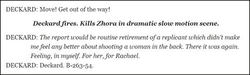

**图 4-1。**用< i class="voiceover" >表示画外音(备选语气)

__________

1

2

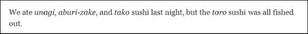

**图 4-2。**用< i lang="ja-latn" >表示从外文音译过来的散文(其中 lang="ja-latn "为日文音译)。

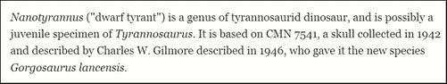

**图 4-3。**使用< i class="taxonomy" >作为分类名称

要检查字符集的`lang=""`值，您可以使用 W3C 的 Richard Ishida 开发的优秀的语言子标记查找工具(`[`j.mp/subtags`](http://j.mp/subtags)3`)。

只有在没有更合适的方法时才使用`<i>`，比如用`<em>`来强调文本；`<strong>`对于具有语义重要性的文本；`<cite>`用于引文或参考书目中的标题；`<dfn>`为一个词的定义实例；而`<var>`为数学变量。使用 CSS 而不是斜体的文本块，如旁白，诗句，图标题，或块报价。记住使用`class`属性来标识元素被使用的原因，这使得重新设计特定用途的样式变得容易。你可以使用属性选择器(例如`[lang="ja-latn"]`)在 CSS 中定位`lang`，我们在第八章的中已经介绍过了。外国散文的完整句子一般应在自己的段落(或`<blockquote>`)中加上引号，并且*不应*使用`<i>`。请将`lang`属性添加到包含元素中。

###### **元素**

> *`<b>`元素表示出于实用目的而引起注意的文本范围，没有传达任何额外的重要性，也没有替代声音或语气的含义。*
> 
> 生活标准，WHATWG ( `[`j.mp/html5-b`](http://j.mp/html5-b)4`)

__________

3

4

对于仅仅看起来不同的`<b>`文本，不需要使用`font-style: bold`；。其他样式可以包括圆角背景、较大的字体大小、不同的颜色或格式，如小型大写字母。图 4-1 中的脚本包含了一个这样的例子，因为`<b class="character">`被用来表示谁在说话或叙述。

你可以在评论中使用`<b>`作为产品名称，在文档摘要中使用关键词，在复杂或传统设计的页面上使用初始文本，如图 4-4 和图 4-5 。

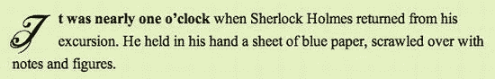

**图 4-4。**使用< b class="opening-phrase" >将 versal(首字下沉)与文本连接

伪元素选择器`:first-letter`用于创建 versal。在这种情况下，开头的短语被加粗只是出于文体上的原因。如果它在语义上很重要，`<strong>`或其他元素会更合适。

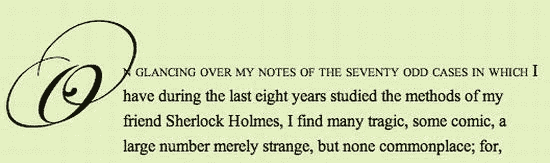

**图 4-5。在这种情况下，CSS 伪元素选择器:first-line 更合适**

虽然我们可以使用`<b>`在第一个单词、短语或句子上应用传统的印刷样式，比如小型大写字母，但是 CSS 伪元素选择器`:first-line`更适合于像图 4-5 这样的情况(更多细节参见第八章)。

只有在没有其他更合适的元素时才使用`<b>`，比如对于语义重要的文本使用`<strong>`；`<em>`用于强调文本(带有“重音”的文本)；`<h1>` - `<h6>`为封号；和`<mark>`用于高亮或标记的文本。对标签云的列表项使用类。为了重现传统的印刷效果，在适当的地方使用 CSS 伪元素选择器，如`:first-line`和`:first-letter`(参见第八章)。同样，记住使用`class`属性来标识元素被使用的原因，这使得重新设计特定用途的样式变得容易。

###### <em>和< strong >元素

虽然`<em>`和`<strong>`基本保持不变，但它们的含义有了细微的变化。在 HTML 4 中，它们意味着*强调*和*强烈强调*。现在它们的意思已经被区分为代表*强调*(比如你发音不同的东西)的`<em>`和代表*重要性*的`<strong>`。

###### *元素*

> em 元素表示其内容的重音。
> 
> 生活标准，WHATWG ( `[`j.mp/html5-em`](http://j.mp/html5-em)5`)

这里所说的“压力”是语言学上的；如果说出来，它会强调一个词的发音，可以改变句子的细微差别。例如“现在就给医生打电话！”医生强调，也许是在回答某人的提问“她看起来很渴，我应该叫顺势疗法吗？”相比较而言，“现在叫医生*！”将重点改为快速完成。*

 *使用`<strong>`来表示重要性，当你想要斜体字而没有强调的意思时，使用`<i>`。如果一个`<em>`元素出现在已经用`<em>`强调的文本中，嵌套的级别代表相对的强调级别。

###### **元素**

> 强元素表示其内容非常重要。
> 
> 生活标准，WHATWG ( `[`j.mp/html5-strong`](http://j.mp/html5-strong)6`)

没什么好说的，真的——这是我们都非常熟悉的。通过嵌套`<strong>`元素来表示相对重要性，并使用`<em>`代替强调文本，使用`<b>`表示“风格偏移”或加粗但不更重要的文本，使用`<mark>`突出显示相关文本。

__________

5

6

#### <小>元素

> *<小>元素代表侧边注释，比如小字。*
> 
> 生活标准，WHATWG ( `[`j.mp/html5-small`](http://j.mp/html5-small)7`)

`<small>`现在是侧边注释，相当于`<aside>`的内嵌部分——不是页面主要焦点的内容。一个常见的例子是行内法律术语，比如页脚中的版权声明、免责声明或者(如图图 4-6 )许可信息。也可用于归因。**不要用于块级内容**(段落、列表等)。)，因为这将被视为主要内容。

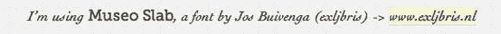

**图 4-6。**使用<small class = " font-license ">满足字体许可协议的要求

另一个例子是关于一个属性，就像这样:

`<small><a rel="license" href="http://creativecommons.org/licenses/by-sa/3.0/">Creative Commons
Attribution Share-alike license</a></small>`

`<small>`文本不需要比周围的文本小。如果你只是想要较小的文本，用 CSS 代替。仅对内嵌内容使用`<small>`。最后，`<small>`不影响`<em>`或`<strong>`的语义。

#### 
元素

> hr 元素代表段落级别的主题中断。
> 
> 生活标准，WHATWG ( `[`j.mp/html5-hr`](http://j.mp/html5-hr)8`)

__________

7 `[www.whatwg.org/specs/web-apps/current-work/multipage/text-level-semantics.html#the-small-element](http://www.whatwg.org/specs/web-apps/current-work/multipage/text-level-semantics.html#the-small-element)`

8

“段落级”位表示一个文本块，如`
`或`<ul>`，但不包括例如内联内容或标题。主题中断是主题的变化，如小说中场景之间的变化。`
`和`</section><section>`语义相同，所以在对元素和标题进行分段之前或之后，最好使用 CSS 而不是`
`。然而，你可以在任何可以使用`
`的地方使用它。虽然现在还没有广泛使用(考虑到默认浏览器的单调渲染)，但是可以通过 CSS 用一个图像来代替它，如图 4-7 所示。

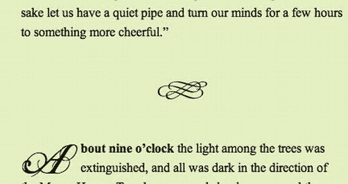

**图 4-7。**样式< hr >通过使用 CSS:HR { height:24px；背景:URL(' floride . png ')不重复 50% 50%；边距:3em 0；边框:0；}

无论如何，IE7 及以下版本通过在图像周围添加边框来实现其声誉，但这通常可以解决(`[`j.mp/hr-ir`](http://j.mp/hr-ir)9`)。或者，您可以通过 IE7 及更低版本的样式表隐藏它。最后，如图 4-8 所示，如果主题中断明显(例如，在博客评论之间)或者预期用途仅仅是演示性的，那么`
`是不合适的。添加一个 CSS 边框或背景图片(可能使用`:before`或`:after`，我们在第八章的中提到过)到另一个元素中。

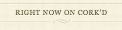

**图 4-8。** Cork'd.com 在标题上使用装饰性的 CSS 背景图片。这里**不是**使用<人力资源>的好地方。

__________

9

#### <s>元素，连同< del >和< ins >

`<s>`元素最初在 HTML5 中被废弃，但是随着语义用例的出现，它在最近才回归规范。`<s>`的定义很简洁。

> s 元素表示不再准确或不再相关的内容。
> 
> 生活标准，WHATWG ( `[`j.mp/html5-s`](http://j.mp/html5-s)10`)

最初，这个角色将由`<del>`元素覆盖，它被定义为

> *del 元素表示从文档中删除。del 元素不应该跨越隐含的段落边界。*
> 
> 生活标准，WHATWG ( `[`j.mp/html5-del`](http://j.mp/html5-del)11`)

但是，语义略有不同。`<s>`是指*曾经*准确或相关，但现在不再准确或相关的内容，并且被留下来提供上下文。`<del>`是指作为文档编辑的一部分(无论出于何种原因)已被标记为从文档中删除的内容，不需要提供上下文，甚至可能不会向读者显示或传达。`<s>`的例子包括过时的价格或售罄的事件列表。

`<ol> <!-- between April 7th and May 1st -->
  <li>**<s>**Early bird (ends Apr 6): $799**<s>**</li>
  <li>Middle bird (Apr 7~May 1): $899</li>
  <li>Late bird (May 2~May 23): $999</li>
</ol>`

既然我们在讨论`<del>`，那就让我们也简单看看它的孪生兄弟`<ins>`。

__________

10

11

> *ins 元素表示对文档的添加。ins 元素不应该跨越隐含的段落边界。*
> 
> 生活标准，WHATWG ( `[`j.mp/html5-ins`](http://j.mp/html5-ins)12`)

`<del>`和`<ins>`是不常见的元素，因为它们可以用作短语或流元素，所以它们可以放在`
`元素内部或包含`
`元素。“不应该跨越隐含段落边界”的告诫告诉我们不要同时使用它们，或者，从字面上看，不要从一个`
`元素内部到另一个`
`元素内部。

`<!-- don’t do this -->

Be careful using ins and del.<del> They shouldn’t cross a paragraph boundary.

<!-- del’s opening tag is in one block-level element, but the closing tag is in another -->

You have two options.</del> Use an ins or del element inside each containing element, or
one ins or del element outside.

<!-- instead, use two ins or del elements inside the containing elements -->

Be careful using ins and del.**<del>** They shouldn’t cross a paragraph boundary.**</del>**

**<del>**You have two options.**</del>** Use an ins or del element inside each containing element,
or one ins or del element outside.

<!-- or one ins or del element outside the containing elements -->
**<del>**
  
 Be careful using ins and del They shouldn’t cross a paragraph boundary.

  
You have two options. Use an ins or del element inside each containing element, or one
ins or del element outside.
` `**</del>**
**<ins>**
  
Be careful using ins and del. Use an ins or del element inside each containing element,
or one ins or del element outside.

**</ins>**`

__________

12

我们还必须小心在列表和表格中使用它们，例如，它们应该将内容包装在`<li>`元素和*而不是*元素中。

`<del>`和`<ins>`都可以有两个可选属性。`cite`属性用于添加提供更多信息的页面的 URL(比如解释编辑背后的原因)。

`<del **cite="/edits/r102.html"**>`

`datetime`属性用于记录编辑的日期和时间。格式是:

`year-month-date then T then hour:minute:second then a timezone`

考虑下面的例子(这些日期时间是相同的时间，但是在不同的时区):

`<ins **datetime="2012-03-05T23:16:00Z"**>
<ins **datetime="2012-03-06T08:16:00+09:00"**>`

当我们讨论`<time>`元素时，我们将很快再次遇到`datetime`属性。

#### <u>元素

与`<s>`一样，`<u>`元素最近从过时部分返回，定义如下:

> u 元素表示一段文本，该段文本带有一个未明确表示的(尽管是明确呈现的)非文本注释。
> 
> 生活标准，WHATWG ( `[`j.mp/html5-u`](http://j.mp/html5-u)13`)

__________

13

具有这些“非文本”注释的文本的一些例子包括中文专有名称标记，指示拼写检查反馈，以及指示罗马化的非西方姓名的姓。除了这三种用途，几乎可以肯定还有更合适的元素可以使用，但它是我们工具箱中的又一个工具。记住*任何语义都应该出现在 HTML 层*。虽然这些用例可能看起来多种多样，但重要的部分是文本被标记以引起读者的注意——他们将在上下文中理解它。

最后，与所有具有默认浏览器样式的元素一样，没有什么可以阻止您使用 CSS 将默认下划线样式更改为更合适的样式。例如，拼写检查器通常用红色虚线下划线来指示拼写错误，而罗马化的日本姓氏可以用大写字母来指示。这些很容易用`<u class="spelling-error">`或`<u class="family-name">`和一点 CSS 来应用，我们会在第七章中发现。

#### 表现元素:过去时代的遗迹

正如我们所看到的，HTML 4 的表示元素`<b>`、`
`、`<i>`、`<s>`、`<small>`和`<u>`在 HTML5 中被重新定义为*非*表示，具有与它们的典型用法相关的有用的媒体无关的语义。HTML 4 贬低或不鼓励的其他表示元素——`<basefont>`、`<big>`、``、`<tt>`和`<strike>`——在 HTML5 中已经过时。用 CSS 代替。

### 与<一个>元素的块级链接

超链接是 HTML 最初的“杀手级应用”。然而，从历史上看，在一个`<a>`元素中链接多个文本或其他内联内容是不可能的。这也是一个可访问性问题，因为一个大的可点击区域对那些使用鼠标有困难的人或任何使用触摸感应手机浏览的人来说是一个很大的帮助。除了`<a>`元素之外，Internet Explorer 6 无法在任何东西上设计`:hover`的样式，这也加剧了这个问题。

我们的解决方法包括制作链接`display:block;`并用填充物填充它，或者给几个元素添加单独的链接，给人一个大的可点击区域的印象。然后就是把所有东西包装在一个链接中，尽管根据规范(和验证)这是不正确的。

然而，总的来说，它实际上是有效的。因此，为了与 HTML5 的实际倾向保持一致，这种灰色地带技术已经成为规范的一部分。现在，您可以将流内容正式包装在一个`<a>`元素中，前提是它不包含任何交互式内容，包括表单元素，尤其是其他链接。这很容易做到，并导致 Internet Explorer < 8 的问题，所以注意不要将一个链接嵌套在另一个链接中。

> *a 元素可以围绕整个段落、列表、表格等等，甚至整个部分，只要其中没有交互内容(例如，按钮或其他链接)。*
> 
> 生活标准，WHATWG ( `[`j.mp/html5-a`](http://j.mp/html5-a)14`)

#### 编写块链接

现在，如果我们想把标题中的几个东西变成一个块链接，这很容易。传统上，建立一个 block 链接需要很多链接和 CSS 体操。

`<!-- faking a block-level link: (don’t do this) -->
<header>
  <hgroup>
    <h1><a href="/">Space monkeys</a></h1>
    <h2><a href="/">Going were no primate has dared to go</a></h2>
  </hgroup>
  
</header>`

在 HTML5 中，你可以在任何地方添加链接——简单多了。

`<!-- HTML5 block-level link -->
<a href="/" class="block-link">
  <header>
    <hgroup>
      <h1>Space monkeys</h1>` `      <h2>Going were no primate has dared to go</h2>
    </hgroup>
    
  </header>
</a>`

__________

14

默认情况下，链接被视为`{display:inline;}`，因此您可能需要设置`{display:block;}`或`{display:inline-block;}`来应用一些样式。像块级链接中的`<h1>`这样的块级元素不会继承一些链接样式，所以你可能需要使用`inherit`来显式声明它们，比如`h1 {background-color:inherit;}.`你可以使用像`<a class="block-link">`这样的`class`名称来实现。

#### 火狐浏览器警告< 4(留给后人)

这一切听起来很棒，但像往常一样，有一个或两个小皱纹抓住我们。在 Firefox 4 之前的 Firefox 版本中(它展示了一个基于 HTML5 的新 DOM 模型)，如果块级链接的第一个孩子是我们在第三章中遇到的新 HTML5 元素之一，那么块级链接将被关闭，并且将为每个块级元素添加单独的内联链接。虽然包含的内容仍然是链接的和可用的，但这通常也意味着块级链接的`:hover`等样式看起来不太正确。

一个解决方案是**在块级链接中添加一个`
`包装器**(或者另一个 HTML 4 元素)。

`

  <a href="/">
**    
<!-- wrapper div for Firefox 3.x and below -->**
      <hgroup>
        <h1>Title</h1>
        <h2>Subtitle</h2>
      </hgroup>
**    
**
  </a>

`

Firefox 3.x 处理块级链接中的标签不匹配错误……很差。如有疑问，请验证。

不幸的是，使用`
`包装器并不是灵丹妙药。由于 Firefox 神秘的“数据包边界”错误，这个问题仍然存在很小的可能性，在 Firefox 4 中再次得到了修复。这只是偶尔出现，并不是在每个块级链接上(这使得测试非常困难)，但是链接仍然会工作。幸运的是，考虑到 Firefox 的快速升级周期，数据包边界问题可能太小(无论是受影响的用户还是错误的严重性),不必担心——除非您的网站有大量 Firefox 4 之前的用户。

### 与 HTML 4 相比有微小变化的其他元素

其他一些元素在 HTML5 中的用法略有变化，或者有了新的属性。让我们看看这些元素和属性，包括`<ol>`和相关的属性`type`、`start`、`value`和`reverse`、`<dl>`和`<cite>`。

#### <ol>元素和相关的新(和旧)属性

虽然`<ol>`是 HTML 4 中包含包装在`<li>`元素中的列表项的相同有序列表，但在 HTML5 中，它现在有了新的`reversed`属性 http://j.mp/html5-ol)。还有一些从 HTML 4 中掉落的*前表示*属性已经返回了——`<ol>`的`type`和`start`，以及`<li>`的`value`。和前面提到的表示性元素一样，这些属性实际上具有语义，语义属于 HTML。让我们看看如何依次使用这些属性。

###### 类型属性

一般来说，有序列表的计数器样式是表示性的，应该在 CSS 中处理。但是在一些文档中，它可以是文档的*的一部分，意思是*，例如法律或技术文档，以散文形式引用非十进制列表项。在这些情况下，我们可以使用`type`属性在 HTML 中指定列表的样式，如表 4-1 所示。

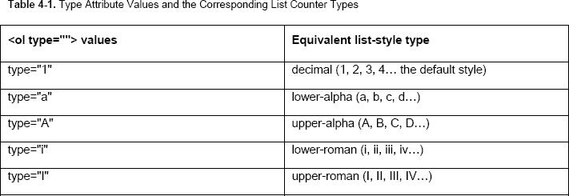

###### 开始和值属性

`start`属性让我们设置有序列表的第一个计数器，方便地将一个列表分割成几个`<ol>`元素，但是从上一个列表停止的地方继续第二个列表的编号。相关值属性允许我们设置一个`<li>`的值，允许我们手工对一个或多个列表项进行编号。下面的代码展示了如何使用`start`或`value`来继续一个列表，并演示了`type`:

`<!-- Continuing a previous list with value="" -->
<ol **type="I"**>
  <li **value="7"**>seventh item</li>
  <li>eighth item</li>
  <li>ninth item</li>
</ol>

<!-- Continuing a previous list with start="" -->
<ol **type="I" start="7"**>
  <li>seventh item</li>
  <li>eighth item</li>
  <li>ninth item</li>
</ol>`

虽然这些是我们的 HTML 工具箱的便利补充，但是添加或删除列表项会使编号显得混乱。因此，您可能希望研究 CSS 生成的内容计数器；阅读大卫·斯托里的《用 CSS 计数器自动编号》。像“1.2.1”这样的嵌套列表计数器也需要它们。

__________

15

###### 颠倒的属性

`<ol reversed>`是全新的，允许我们创建*降序*列表，这对于十大列表和火箭发射非常方便。虽然在撰写本文时浏览器对`reversed`的支持还处于萌芽状态，但我们总是可以使用`value`来伪装它，它和其他 HTML 3.2 属性一样，仍然被所有浏览器支持。这很方便，因为我们可以结合使用 Modernizr 和 JavaScript polyfill 来轻松添加支持(关于 polyfill 的定义，请参见第二章)。关于这个(和所有这些属性)的更多信息，请参考我们更详细的文章“ol 元素和相关属性:类型、开始、值和反转”(`[`j.mp/ol-attrib`](http://j.mp/ol-attrib)16`)。

#### <dl>元素

在 HTML 4 中，`<dl>`是定义列表，也是标准化组织中激烈争论的话题。取决于你与谁交谈，它要么仅仅是字典式的定义，要么可能是一个适合所有类型内容的容器:对话、地址，等等。HTML 4 有些松散的描述和不寻常的例子没有帮助。

在 HTML5 中，事情变得更加清晰。最大的变化是现在为*名称-值对*提供了一个*描述列表*。

> dl 元素表示一个由零个或多个名称-值组组成的关联列表(一个描述列表)。…名称-值组可以是术语和定义、元数据主题和值、问题和答案或任何其他名称-值数据组。
> 
> 生活标准，WHATWG ( `[`j.mp/html5-dl`](http://j.mp/html5-dl)17`)

我们新的描述列表仍然使用旧的`<dt>`作为名称，使用`<dd>`作为值，并且我们仍然可以有多个名称(因此称为“组”)。一个新的警告是每个`<dl>`只能使用一个`<dt>`名称，这要求我们将所有相关的`<dd>`值一起列在相关的`<dt> (`或一组`<dt>`的`),`下，而不是重复的名称。

虽然 HTML5 规范对现在的`<dl>`更加具体，但它实际上有相当广泛的用途。

__________

16

17 `[www.whatwg.org/specs/web-apps/current-work/multipage/grouping-content.html#the-dl-element](http://www.whatwg.org/specs/web-apps/current-work/multipage/grouping-content.html#the-dl-element)`

###### 在字典或词汇表中定义单词

这仍然是对`<dl>`的完美使用，只要我们用语义上合适的“定义实例”`<dfn>`元素来表示被定义的单词。

`<dl>
  <dt lang="en"><dfn>rocket</dfn></dt>
  <dt lang="ja"><dfn>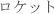</dfn></dt>
  <dd lang="en">A vehicle that is propelled by the high-speed expulsion of exhaust gases, from
propellants the vehicle carries.</dd>
</dl>`

###### [计]元数据

元数据通常由名称和值组成。例如，可以使用`<dl>`显示一张照片的 EXIF 数据。

`<dl>
  <dt>Camera</dt>
  <dd>Canon EOS 5D Mark II</dd>
  <dt>Exposure</dt>
  <dd>0.01 sec (1/100)</dd>
  <dt>Aperture</dt>
  <dd>f/1.2</dd>
</dl>`

虽然 HTML 4 规范展示了一个使用`<dl>`作为对话框的例子，但这不再是一个有效的用法。使用`
`或带有`<li>`的`<ol>`作为容器；如有必要，使用`<b>`标记发言者姓名。

虽然我们已经展示了一些好的用途和一个不合适的用途，但有些内容可能更难决定。如果你不确定`<dl>`是否合适，考虑一下`<table>`(用于更多的语义结构)或者仅仅是`<h1>` - `<h6>`(用于包含大量内容的值)是否更适合内容。

#### <引用>元素

这个元素也是很多争论的主题，也是因为一个模糊的 HTML 4 规范。尽管使用了一些`<cite>`来引用人(最著名的是 Mark Pilgrim 和 Jeremy Keith)，HTML5 规范现在说

> cite 元素代表作品的标题。[……]一个人的名字不是一件作品的标题——即使人们称这个人是一件作品——因此，这个要素不得被用来标记人的名字。
> 
> 生活标准，WHATWG ( `[`j.mp/html5-cite`](http://j.mp/html5-cite)18`)

规范列出了这些“一件工作”的例子

*   书
*   纸
*   文章
*   诗
*   得分
*   歌曲
*   脚本
*   电影
*   电视节目
*   比赛
*   雕刻
*   绘画
*   戏剧制作
*   玩
*   歌剧
*   音乐的
*   展览
*   法律案件报告等。

__________

18

###### 使用

以下是引用一本书的例子，有链接和没有链接。

`
While Remy and Bruce did a masterful job on **<cite>**Introducing HTML5**</cite>**, I’m not sure
about that shade of brown.

While Remy and Bruce did a masterful job on **<cite>**<a
href="http://introducinghtml5.com/">Introducing HTML5</a>**</cite>**, I’m not sure about that
shade of brown.
`

###### 何时不使用

HTML5 规范没有明确地将网页列为“作品”的例子，添加一个带有`<a>`的链接就足够了，除非你特别想要一个更学术风格的引用。这也无妨，否则我们将在<引用>中包装每个外部站点的链接。以下是对`<blockquote>`中一段引文的学术风格引用:

`<blockquote>
  
A person’s name is not the title of a work — even if people call that person a piece of
work

</blockquote>

**<cite>**<a href="http://www.whatwg.org/specs/web-apps/current-work/multipage/text-level-
semantics.html#the-cite-element">HTML Living Standard</a>**</cite>**, WHATWG, retrieved 25 March
2012
`

假设你*没有*决定坚持 HTML 4 中包含人的`<cite>`定义，任何名字都可以用`<b>`来标记。我们建议您考虑使用微数据或微格式在语义上表示人(我们将很快讨论这两者)。此外，当您想要引用某些文本时，要注意不要使用`<cite>`，因为行内引用应该使用`<q>`(或者甚至只使用适当的撇号，比如" ")。

### 新增语义元素

现在让我们来认识一些填补 HTML 中语义空白的新元素:`<mark>`、`<time>,`以及`<ruby>`、`<rt>`、`<rp>`三人组。这些将帮助我们从语义上公开一些特定类型的数据，我们到目前为止还没有工具来处理这些数据。

#### <标记>元素

这个新元素用于指示你特别想要突出显示或引起注意的文本，*而不*改变其重要性或强调。规格说明听起来相当不具体。

> mark 元素表示一个文档中的一串文本，由于其在另一个上下文中的相关性，该文本被标记或突出显示以供参考。
> 
> 生活标准，WHATWG ( `[`j.mp/html5-mark`](http://j.mp/html5-mark)19`)

但是，对于某一类内容来说，这正是你一直想要的。为了让事情更清楚，有几个具体的用例。

*   指示在搜索结果页面中搜索的单词或短语。
*   指示代码示例中感兴趣的特定代码，如周围文本中讨论的更改。
*   突出原文中没有强调的引用部分。

突出显示搜索词是我们都可以想象的事情，但我们不会经常这样做，所以让我们看一些代码示例。为了实现相同的格式，我们可以使用下面的 HTML:

`
While Remy and Bruce did a masterful job on <mark>&lt;cite&gt;</mark>Introducing
HTML5<mark>&lt;/cite&gt;</mark>, I’m not sure about that shade of brown.
`

`While Remy and Bruce did a masterful job on **<cite>**Introducing HTML5**</cite>**, I’m not sure about that shade of brown.`

__________

19

注意，在表示关联性时，`<mark>`不同于`<em>`和`<strong>`。这在原文已经包含`<em>`或`<strong>`的引用中非常方便，但是您想要将注意力吸引到特别相关的部分(结果如图图 4-9 所示)。

`<blockquote>
  
<strong>Dogs are the best!</strong> They are <em>obviously</em> much cooler than monkeys,
even if **<mark>**the first animal in space was a monkey**</mark>**.

</blockquote>` 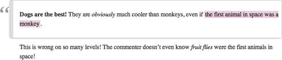

**图 4-9** 。包含`<em>`、`<strong>`和`<mark>`的引用文本的渲染示例

像往常一样，考虑是否有更合适的语义元素。除了`<strong>`、`<em>`、`<b>`、`<i>`之外，使用没有`href`属性的`<a>`来表示导航中的当前页面(活动标签页)，使用`<a>`上的一个类来代替永久链接。不是你每天都需要的东西，但现在你知道如何使用它了。

#### 红宝石标注有<红宝石>、< rt >和< rp >

拼音文本是一些基本文本的简短注释。它通常用于在汉语、日语和朝鲜语(CJK)的汉字或日本汉字的语音脚本中提供发音指导。它是以一个旧的印刷术语命名的，指的是 5.5 磅的极小尺寸。

> ruby 元素允许用 ruby 注释标记一段或多段语法内容。
> 
> 生活标准，WHATWG ( `[`j.mp/html5-ruby`](http://j.mp/html5-ruby)20`)

__________

20 `[www.whatwg.org/specs/web-apps/current-work/multipage/text-level-semantics.html#the-ruby-element](http://www.whatwg.org/specs/web-apps/current-work/multipage/text-level-semantics.html#the-ruby-element)`

顾名思义，拼音文本很小，默认情况下在水平文本中显示在基础文本的上方，在垂直文本中显示在右侧。不支持`<ruby>`的浏览器将拼音文本放在基本文本之后。

这些是在 HTML5 中创建拼音文本时使用的元素:

*   `<ruby>`是一个内联元素，包含带有拼音注释和可选拼音括号的基本文本。
*   `<rt>`是拼音文本，位于它定义的基本文本之后。
*   `<rp>`是拼音括号，一个用于将左括号和右括号括在`<rt>`(拼音文本)周围的元素。这些是为不支持 ruby 文本的用户代理准备的，所以它在内联显示时有意义。支持`<ruby>`的浏览器通过`{display:none;}`隐藏`<rp>`。

如果你从未见过 ruby 的实际操作，你可能会想知道我在说什么，所以图 4-10 显示了一个来自日本漫画的例子。微小的字符是汉字左边的红宝石注释，向读者显示正确的发音。

**图 4-10** 。井上雄彦的*漫画*流浪汉中的红宝石文字(日语称为 *furigana*

正如国际化特性通常所做的那样，浏览器支持是稀疏的。出乎意料的是，Internet Explorer 从 IE5 开始就支持`<ruby>`——比实际的 2001 W3C Ruby 注释规范早了三年！虽然这个规范被合并到 XHTML 1.1 中，但是没有浏览器实现过它。

HTML5 中的`<ruby>`基于 IE 实现的逆向工程，比旧的 Ruby 注释规范更简单。WebKit 浏览器在 2010 年初增加了 HTML5 `<ruby>`支持，但是 Firefox 和 Opera 还没有在本地实现`<ruby>`。在 CSS 文本布局模块级别 3 中也有支持 ruby 的 CSS3 属性，但是这些属性的实现都很差。幸运的是，有一个基于 CSS 2.1 的 polyfill 和一个通过 Modernizr 检测支持的社区插件。首先，在展示 polyfill 之前，我们将看看如何在英语中使用它。

###### 英语使用

不是每个人都使用东亚语言，但是任何简短的注释(理论上)都是适用的，并且不需要多填充。虽然英语通常没有发音指导，但字典中会使用语音注释。下面的代码通过在基本文本后内联显示拼音文本，将拼音文本用于词典定义。我们使用了`<dfn>`元素来表示这是术语的*定义实例*(参见图 4-11 中的结果)。

`
<ruby><dfn>cromulent</dfn> <rp>(</rp><rt>crôm-yü-l**ə**nt</rt><rp>)</rp></ruby>` 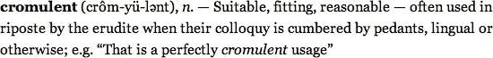

**图 4-11** 。通过在基本文本后内联显示拼音文本，将拼音文本用于词典定义。

我们明确地将`<ruby>`视为*语音注释*的语义(也是有价值的),就像`<abbr>`元素的`title`属性提供关于潜在混淆内容的额外信息一样。然而，在这种用法之外，`<ruby>`可以被看作是一种表象上的欺骗。与`<q>`非常相似，当默认显示与纯文本相同时，使用`<ruby>`的额外代码可能不合理。

`<ruby>`、`<rt>`和`<rp>`元素是有效的 HTML5，即使它们没有得到广泛支持，它们也会默认显示*，就好像它们是不支持的浏览器中的* `` *s* 。结合聚合填充支持的能力，我们说如果您确实需要`<ruby>`的语义，比如 CJK 注音，就使用它们*(见下一节)。对于非语音注释，考虑使用`<abbr title="">`通过鼠标悬停在缩写或首字母缩略词上给出扩展读数，除非默认显示读数很重要。考虑一下`<small>`对内容*的措辞*级别的附带评论，比如法律术语。*

###### 多填充<ruby>支持东亚语言</ruby>

由于`<ruby>`的 polyfill 只需要 Modernizr 和 CSS，我们来看看如何为东亚文本实现它，作为 poly fill 的一个例子(这将让您知道如何在其他真正需要它的注释的情况下使用它)。首先，我们需要定制一个包含“elem-ruby”附加组件的 Modernizr 脚本来检测`<ruby>`支持。你可以通过去`[www.modernizr.com](http://www.modernizr.com)`并选择“生产:配置你的构建”来得到它在配置窗口中，确保您至少选择了

*   额外的现代负荷
*   扩展性 Modernizr.addTest
*   社区附加组件 elem-ruby

在样式表引用之后，将此脚本添加到页面的`<head>`中:

`<!DOCTYPE html>
<html lang="en">
  <head>
    <meta charset="utf-8">
    <title>Ruby test</title>
    <link rel="stylesheet" href="main.css">
    ****<!-- for ruby -->
  </head>
  …`

成功添加脚本后，使用浏览器的开发工具检查页面，会发现 Modernizr 已经将`<html>`起始标签更新为`<html lang="en" **class="js ruby"**>`以支持浏览器，或者更新为`<html lang="en" **class="js no-ruby"**>`以支持非支持浏览器(假设 JavaScript 没有被禁用)。我们现在可以在样式表中使用`no-ruby`类来添加 CSS polyfill。我们将使用的 CSS 基于 Zoltan·拉克(`[`j.mp/ruby-polyfill`](http://j.mp/ruby-polyfill)21`)的“使用 CSS 的跨浏览器 HTML5 Ruby 注释”。

`ruby {ruby-align: center;}
.no-ruby ruby {
  display: inline-table;
  text-align: center;
  border-collapse: collapse;
  border: none;
  vertical-align: middle;
}
.no-ruby rp {display: none;}
.no-ruby rt {
  display: table-header-group;
  font-size: 0.5em;
  line-height: 1.2em;
  white-space: nowrap;
}
.no-ruby rt + rt {
  display: table-row;
  border-bottom: hidden;
}`

__________

21

关于这将如何显示的示例，无论有无聚合填充(或有本地支持)，参见图 4-12 (无`<rp>`)和图 4-13 (使用`<rp>`)。别管日本人是什么意思；请记住，`<rt>`中的简单字符是它们前面的复杂字符的 ruby 读数。

图 4-12 显示了 *furigana* 中的一个系列，带有代码示例、一个支持或多填充的浏览器渲染，以及一个不支持的浏览器渲染(例如，在 Opera 中没有多填充或有多填充但禁用了 JavaScript)。ruby 注释“内联”时缺少括号，这使得最后一个例子难以阅读。

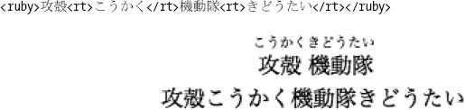

**图 4-12** 。用`<ruby>`表示果壳动漫中鬼的日文名字发音

图 4-13 添加了`<rp>`元素，这是在不支持的浏览器中为拼音文本提供的 HTML 级回退，即使在没有 polyfill 的不支持的浏览器中也能正常降级。

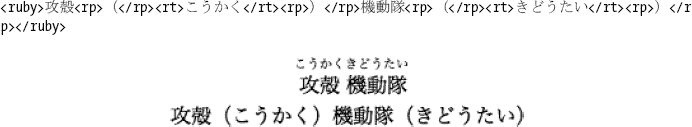

**图 4-13** 。相同的例子，但是在`<rp>`元素中用括号将`<rt>`文本括起来

#### <时间>元素

另一个新元素是`<time>`，它最终为我们提供了一种官方的机器可读的方式来表示时间、日期和持续时间数据。

> *time 元素表示其内容，以及 datetime 属性中这些内容的机器可读形式。内容的种类仅限于各种日期、时间、时区偏移量和持续时间。*

生活标准，WHATWG ( `[`j.mp/html5-time`](http://j.mp/html5-time)22`)

日期或时间信息可以是元素的内容，但通常您会希望使用更自然的表达方式(例如“三天前”)。`<time>`为此使用属性`datetime`。表 4-2 说明了允许的日期和时间类型(是 ISO8601 的子集)。

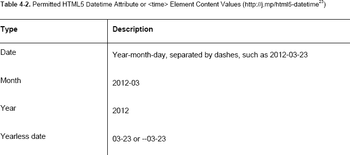

本地日期时间相对于作者是本地的。对于全球日期时间时区，`Z`表示协调世界时，即 UTC。它有时被称为祖鲁时间(因此称为“Z”)，相当于时区`+00:00`，更普遍的说法是 GMT。

__________

22

23

###### 何时不使用

`<time>`使用基于公历的日期，这只能追溯到 0000 年，所以不可能对这之前的日期使用`<time>`(考虑微数据或 RDFa 代替)。此外，历史爱好者需要将儒略历日期转换为格里高利日期作为`datetime`值，如下所示:

`Gaius Julius Caesar Augustus was born 23 September 63 BC<!-- we can’t use <time> for this date
-->, and died <time datetime="0014-07-17">19 August AD 14</time> (Julian calendar).`

`<time>`元素不能用于日期范围、不能转换成秒的持续时间(不包括月和年)，或者类似“发射前几周”或“莱卡出生于 1954 年左右”的近似时间

###### 对<time>的更改</time>

`<time>`自从最初添加到规范中后，已经经历了一些变化。一个积极的变化是该元素现在可以表示没有年份的日期、星期、时区偏移量和持续时间，这在以前是没有的。这使得它能够表示`<input>`元素的新的日期相关类型(在第六章中涉及)。

另一个变化是删除了`pubdate`属性，这是一个布尔属性，用于指示这个日期时间值是最近的祖先`<article>`元素的发布日期，如果没有，则是整个文档的发布日期。在撰写本文时，这个属性已经从 HTML5 规范中删除，建议的替换是将`<time>`元素与 hAtom 微格式词汇表或 Schema.org 文章微数据词汇表一起使用。微格式和微数据将在本章后面介绍。

### 扩展 HTML5

虽然 HTML5 有一堆很棒的新语义元素，如`<article>`和`<time>`，但有时就是没有一个元素有正确的语义。我们想要的是扩展我们已有的东西的方法——添加浏览器、脚本或机器人可以使用的*机器可读数据*。这可以从添加用于 JavaScript 的元数据到为 HTML5 元素添加额外的语义，再到添加内容中没有的全新语义数据。

HTML 4 有五种基本的扩展方式。

*   `<meta>`元素
*   `class`、`rel`、`rev`和`profil` e 属性

而`rev`和`profile`已经半途而废(由于几乎没有人正确使用`rev`，也几乎没有人真正使用`profile` ), `<meta>`、`class`和`rel`仍然留在 HTML5 中。事实上，`<meta>`现在有了规范定义的名称(`[`j.mp/html5-meta-name`](http://j.mp/html5-meta-name)24`)和提交新名称值的方法，而`rel`有了在 HTML5 规范(`[`j.mp/html5-rel-type`](http://j.mp/html5-rel-type)25`)中定义的几个新链接类型()和提交更多链接的方法。更好的是，ARIA 的角色和`aria-*`属性(我们在第三章的结尾遇到过，它们不是 HTML 4 的一部分)可以用于在 HTML5 中添加与可访问性相关的角色(“附加”可访问性)，HTML5 验证器可以检查 HTML5+ARIA。

__________

24

除此之外，还有几种扩展 HTML5 的新方法，包括:

*   `<data>`元素及其`val`属性
*   自定义数据属性(`data-*`)
*   微观数据
*   网页摘要和结构化标记

虽然我们不会讨论 RDFa，但我们将快速浏览一下微格式，微格式是一种使用约定的`class`属性值添加语义的方法，也是创建 HTML5 微数据的先驱。让我们先来看看新产生的`<data>`元素，它基本上是我们刚刚遇到的`<time>`元素的一般化版本。

#### <数据>元素

`<time>`元素为我们提供了一种以机器可读的方式表示日期、时间和持续时间的简单方法，但是在显示人类可读的内容时，我们可能还想让许多其他类型的数据成为机器可读的。为此引入了具有`value`属性的`<data>`元素。

> *数据元素表示其内容，以及那些内容在`value`属性中的机器可读形式。*
> 
> 生活标准，WHATWG ( `[`j.mp/html5-data`](http://j.mp/html5-data)26`)

__________

25 `[www.whatwg.org/specs/web-apps/current-work/multipage/links.html#linkTypes](http://www.whatwg.org/specs/web-apps/current-work/multipage/links.html#linkTypes)`

26 `[www.whatwg.org/specs/web-apps/current-work/multipage/text-level-semantics.html#the-data-element](http://www.whatwg.org/specs/web-apps/current-work/multipage/text-level-semantics.html#the-data-element)`

它非常适合使用微数据和(潜在的)微格式，并允许我们将脚本数据与人类可读的对等物关联起来。唯一的限制是`<data>` *必须*具有`value`属性，该属性必须是元素内容的表示。以下代码显示了这是如何工作的:

`The Kármán Line is <data value="100km">62 miles</data> above the Earth’s sea level, and
defines the boundry between the atmosphere and outer space.`

#### 自定义数据属性(data-*)

例如，您可能需要将值存储在 HTML 中供 JavaScript 使用。最好避免隐藏元数据，而是使用像`<time>`和`<data>`这样的元素将机器可读数据与页面内容联系起来。然而，有时有一种方法可以将脚本的数据附加到任何元素上，这是非常方便的。HTML5 没有滥用像`class`这样的其他全局属性，而是为这种用途引入了自定义数据属性(“`data-*`”)。“`data-*`”名称来自这个全局属性“`data-`”加上您想要使用的名称。

> 自定义数据属性旨在存储页面或应用专用的自定义数据，对于这些数据没有更合适的属性或元素。
> 
> 生活标准，WHATWG ( `[`j.mp/html5-data-`](http://j.mp/html5-data-)27`)

一个使用的例子(我们将在第九章中更详细地介绍)是用于*响应*图像，你默认显示小图像，然后使用 JavaScript 在大屏幕设备上换成大图像。我们可以使用`data-*`直接在``元素中存储大图像。

``

然后，一个脚本可以将其更新为

``

在合适的设备上。只要记住`data-*`是针对你自己的脚本，不适合任何你希望外部脚本使用的数据。有关更多信息，包括如何在 JavaScript 中访问、创建和更改`data-*` 值，请阅读 Chris Bewick ( `[`j.mp/html5-data2`](http://j.mp/html5-data2)28`)的“HTML5 自定义数据属性(data-*)”。

__________

27 `[www.whatwg.org/specs/web-apps/current-work/multipage/elements.html#embedding-custom-non-visible-data-with-the-data-*-attributes](http://www.whatwg.org/specs/web-apps/current-work/multipage/elements.html#embedding-custom-non-visible-data-with-the-data-*-attributes)`

#### 微格式

微格式是用额外的*机器可读的*语义扩展 HTML 的一种简单方式，首先是为人类设计的，其次是为机器设计的。它们是从普通的旧式语义 HTML (POSH)编码模式发展而来，用于 HTML 4 和 XHTML 1，并通过约定的`class`、`rel`、`rev`和`profile`语法、编码模式和嵌套工作。机器可读部分意味着理解所用微格式词汇表的机器人或脚本可以理解微格式添加到标记数据中的额外语义。每种微格式都用于特定类型的数据，通常基于现有的数据格式，如 vcard(地址簿数据；RFC2426)和 icalendar(日历数据；RFC2445)，或者公共编码模式(web 的“铺路”)。微格式易于实现，因此许多服务都提供 hCard 格式的概要信息；因此，即使您以前从未使用过微格式，您也可能已经有了微格式的概要文件。您可以在微格式 wiki ( `[`microformats.org/wiki`](http://microformats.org/wiki)`)上找到更多关于许多微格式和创建新微格式的过程的信息。

#### 微格式简介

以防您以前从未使用过它们，我将简要介绍一些简单的微格式——希望如此简单，您会被鼓励立即尝试它们。

###### 使用 rel-license 获取许可信息

添加许可信息是一个相当常见的活动，虽然我们可以很容易地添加到 Creative Commons 或另一个许可的链接，但有人必须阅读它才能理解内容的许可。

`<small>This article is licensed under a <a href="http://creativecommons.org/licenses/by-nc-
sa/2.0/">Creative Commons Attribution Non-commercial Share-alike (By-<abbr>NC</abbr>-
<abbr>SA</abbr>) license</a>.</small>`

如果这些信息是机器可读的，它将有助于消费者搜索具有特定许可的内容。通过使用`rel-license`微格式将`rel="license"`添加到链接中(表明它是页面主要内容的许可证)，我们可以做到这一点。

__________

28 `[`html5doctor.com/html5-custom-data-attributes`](http://html5doctor.com/html5-custom-data-attributes)`

`<small>This article is licensed under a <a **rel="license"**
href="http://creativecommons.org/licenses/by-nc-sa/2.0/">Creative Commons Attribution Non-
commercial Share-alike (By-<abbr>NC</abbr>-<abbr>SA</abbr>) license</a>.</small>`

这可能太容易了，你甚至没有意识到你已经对链接进行了微格式化。谷歌使用这些数据来允许通过许可证进行搜索，如图 4-14 所示。

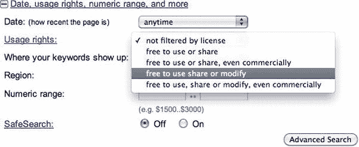

**图 4-14** 。谷歌高级搜索选项中的使用权下拉菜单

这个基本的微格式已经成为 HTML5 的一部分，作为链接类型之一，作为一个`rel=""`值添加到一个`<a>`、`<link>`或`<area>`元素(`[`j.mp/html5-rel-type`](http://j.mp/html5-rel-type)29`)。

###### 使用 XHTML 朋友网络(XFN)

也许我们应该称之为可扩展的朋友网络:-)这是一种指定你与人们关系的方式——从“相识”到“爱人”——在他们主页的链接上使用`rel`属性。然而，有三个主要的价值。

*   你知道如何联系的人。
*   `rel="me":`允许您认领您的各种网站，包括您在社交网络上的账户。
*   当前文章作者的链接，例如他们的网站或个人资料页面(这是 HTML5 规范中三种链接类型中唯一的一种)。

我们可以使用最后两个来证明我们的身份在线只使用链接。例如，如果你卑微的作者有一个网站或个人资料页面，他可以添加一个链接到我的 Twitter 账户。

__________

29 `[www.whatwg.org/specs/web-apps/current-work/multipage/links.html#linkTypes](http://www.whatwg.org/specs/web-apps/current-work/multipage/links.html#linkTypes)`

`
Oli Studholme — <a href="https://twitter.com/boblet">follow me on Twitter (@boblet)</a>
`

虽然一个人可以推断出`@boblet`是我的 Twitter 用户名，但是通过添加`rel="me"`，我们可以用一种*机器可读的*方式来陈述这种关系。

`
Oli Studholme — <a **rel="me"** href="https://twitter.com/boblet">follow me on Twitter
(@boblet)</a>
`

这需要在这个人自己的个人资料页面上，并在他们的 Twitter 个人资料上添加相同的个人资料页面 URL，才能真正发挥作用。但通过这样做，一个理解 XFN 的社交网络应用可以确认谁是`@boblet`的，检查 Twitter 上的朋友，检查这些人是否已经注册，然后允许他一键关注所有人——这就容易多了。

谷歌还将允许你通过结合使用`rel="me"`和`rel="author"`来证明文章的作者身份(只要你有 Google+个人资料或谷歌个人资料)。有几种方法可以做到这一点，所以我们会让你参考谷歌关于证明作者身份的文档(`[`j.mp/google-author`](http://j.mp/google-author)30`)，如果你使用 WordPress，请参见 Joost de Valk 的文章“rel="author "和 rel = " me " in WP and other platforms”(`[`j.mp/wp-rel-me`](http://j.mp/wp-rel-me)31`)。这样做可以改变搜索结果的显示方式，例如在搜索结果中将您的个人资料图片放在您撰写的文章旁边。

`Rel-license`和 XFN 是简单的基于`rel`的微格式，但是即使简单，你也能看到这种机器可读的东西的潜在力量。现在让我们看看如何使用微格式来保存联系信息。

###### 使用 hCard 获取联系信息

几乎每个网站都有一个“关于”页面，上面有一些联系方式。

`
By Oli Studholme — <a href="http://oli.jp/">http://oli.jp</a>, or <a
href="http://twitter.com/boblet">follow me on Twitter (@boblet)</a>.
`

不幸的是，将某人的联系信息添加到您的电话或地址簿通常需要大量的复制和粘贴。如果数据是机器可读的，我们可以使用工具导入它。让我们将 hCard 微格式添加到以下代码中:

`
By ****Oli Studholme**** — <a **class="url"**
href="http://oli.jp/">http://oli.jp</a>, or <a **class="url"**
href="http://twitter.com/boblet">follow me on Twitter (@**<span**
**class="nickname">**boblet****)</a>.
`

__________

30 `[`support.google.com/webmasters/bin/answer.py?hl=en&answer=1229920`](http://support.google.com/webmasters/bin/answer.py?hl=en&answer=1229920)`

31 `[`yoast.com/wordpress-rel-author-rel-me`](http://yoast.com/wordpress-rel-author-rel-me)`

我们添加的类别如下:

*   包含的`
`元素上的`vcard`，这表明这里有微格式化的 hCard 数据。
*   `fn`，代表全名。
*   `url`访问相关主页。
*   为了，嗯，一个绰号。

因为我们只是添加类(以及偶尔添加类的``元素)，除非我们也开始添加 CSS 样式，否则我们的内容的外观或行为不会有任何改变。如果我们*需要样式化这些信息，我们已经添加了一些可以使用的类。这是一个非常简单的例子，但是 hCard 有深度。我们可以标记各种与联系人相关的数据，比如地址、公司信息，甚至是个人资料照片。例如，默认情况下，hCard 将`fn`中的两个单词映射为“名”和“姓”(这在英语中很常见)。但是对于一种不同顺序的语言，或者中间名和头衔等等，我们可以(嗯，必须)显式地陈述这些数据。以下代码显示了对先前 hCard 代码的更新，只是这一次使用了日文名称，并显式显示了`family-name`和`given-name` hCard 类:*

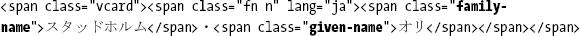

那么这样做有什么好处呢？嗯，有几个工具可以将这种 hCard 微格式数据转换成 vcard 文件，我们可以下载并自动添加到我们的地址簿中，例如图 4-15 所示的 Firefox 的 Operator 插件。

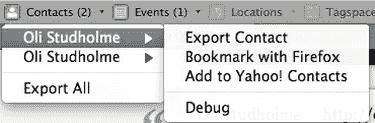

**图 4-15** 。Firefox 插件运营商可以将 hCard 格式的内容保存为 vcard，这是大多数地址簿和电子邮件程序都可以导入的格式

谷歌的 Rich Snippets(shcema.org 的前身，我们将在本章后面的微数据部分介绍)，如图 4-16 所示，以及雅虎的 SearchMonkey，这对于任何公司网站上的联系信息都非常有用。

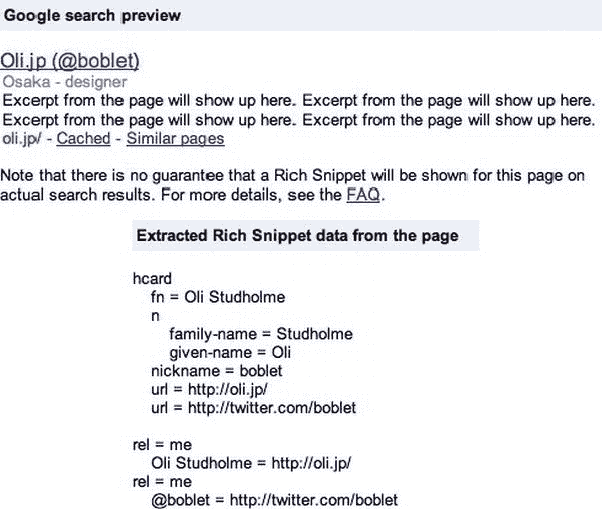

**图 4-16** 。Google 丰富的代码片段测试工具

###### 在 HTML5 中使用微格式

微格式是在 HTML5 之前开发的，有一些使用了已经被放弃的属性(`rev`和`profile`)。然而，大多数微格式只使用`class`和/或`rel`，所以它们在 HTML5 中完全没问题。但是因为微格式是在 HTML5 之前开发的，它们(还)没有利用新的`<time>`和`<data>`元素。一些处理或生成微格式的工具也不支持 HTML5。虽然微格式可能是用预定义语义扩展 HTML5 的最简单的方法，但是让我们将它们与新的“本地”HTML5 扩展方法微数据进行比较。

#### 微数据:HTML5 的语义层

微数据是一种新的轻量级语义元语法，使用嵌套的数据名称-值对，通常基于页面的内容。这是添加额外语义信息和扩展 HTML5 的全新方式。

> 有时，希望用特定的机器可读标签来注释内容，例如，允许通用脚本提供针对页面定制的服务，或者使来自多个合作作者的内容能够由单个脚本以一致的方式处理。[…]微数据允许将名称-值对的嵌套组与现有内容并行添加到文档中。
> 
> (`[`j.mp/html5-microdata`](http://j.mp/html5-microdata)32`)

*注意:微数据一直有些争议，所以它在 W3C 是一个单独的规范，但仍然是 WHATWG HTML5 规范的一部分。保持冷静，坚持下去。*

微数据和微格式之间的主要区别是

*   微数据使用新的全局属性，而不是“重载”属性。
*   微数据可以在不知道所用词汇的情况下被机器解析。
*   虽然我们建议标记作为页面内容一部分的值，但页面内容和任何微数据项之间没有内在联系。

#### 微数据语法

微数据引入了五个新的全局属性。

*   `Itemscope`:定义一组名值对，称为*项。*
*   `itemprop="property-name"`:给微数据项添加一个*属性*。属性的名称可以是单词或 URL，值是具有此属性的元素的“内容”:
*   对于大多数元素，该值是元素的文本内容(不包括任何 HTML 标记)。
*   对于具有 URL 属性的元素，值是 URL ( ``、`<a href="">`、`<object data="">`等)。
*   对于`<time>`元素，该值是`datetime=""`属性。
*   对于`<data>`元素，该值是`value=""`属性。
*   对于`<meta itemprop="" content="">`，该值是`content=""`属性。
*   `itemref=""`:通过引用`id`属性，允许微数据项包含*非继承属性*。
*   `itemtype=""`:通过在与`itemscope`相同的元素上使用`itemtype=""`来定义项目的*类型*(包含一个充当唯一词汇名称的 URL)。
*   `itemid=""`:允许微数据项与词汇表指定的*唯一标识符*相关联，例如一本书的 ISBN 号。在与项目的`itemscope`和`itemtype`相同的元素上使用`itemid`。

__________

32

让我们研究一下这些新属性，看看如何在实践中使用微数据。

###### *项目范围*和*项目属性*

`itemscope`的存在使得`
`元素成为微数据项。派生元素上的属性`itemprop`定义了该项目的属性`name`，并将其与值`Salter Cane`(``的内容)相关联。一个项目必须至少有一个`itemprop`才有效。

`
I’m going to the Salter Cane gig next week.
Excited!
`

`itemprop`名称可以是单词或 URL 字符串。使用 URL 使得名称*成为全球唯一的*。如果使用单词，最好通过词汇表使用定义好的单词，这也使名字独一无二。我们将在“类型化项和全局唯一名称”一节中对此进行更详细的介绍。

###### 属性中的 *itemprop* 值

对于某些元素来说，`itemprop`的值来自元素的属性。

`
I’m going to the <**a itemprop="url" href="http://www.saltercane.com/"**>Salter
Cane</a> gig <**time itemprop="date" datetime="2012-08-18"**>next week </time>. Excited!
`

这定义了一个具有属性`url`和`date`的项目，分别具有值`[`www.saltercane.com/`](http://www.saltercane.com/)`和`2012-08-18`。

注意，链接的`itemprop="url"`值是`[`www.saltercane.com/`](http://www.saltercane.com/)`，而不是元素的“Salter Cane”文本内容。在微数据中，以下元素以值的形式提供它们的 URL:

*   `<a href="">`
*   `<area href="">`
*   `<audio src="">`
*   `<embed src="">`
*   `<iframe src="">`
*   ``
*   `<link href="">`
*   `<object data="">`
*   `<source src="">`
*   `<track src="">`
*   `<video src="">`

*注意:不使用的包含 URL 属性的 HTML5 元素是*

`*<base href="">*
*<script src="">*
*<input src="">*`

要使用文本`<a href="">`作为属性值，我们需要添加一个额外的`itemprop`。

`
I'm going to the <a itemprop="url" href="http://www.saltercane.com/">**<span**
**itemprop="name">**Salter Cane****</a> gig <time itemprop="date" datetime="2012-08-18">next
week</time>. They’re gonna rawk!
`

这定义了一个有三个属性的项目:`url`是`[`www.saltercane.com/`](http://www.saltercane.com/)`,`name`是`Salter Cane`,`date`是`2012-08-18`。

###### 嵌套项目

将`itemscope`添加到带有`itemprop`的元素中，使属性成为嵌套项。

`
The Salter Cane drummer is Jamie Freeman.
`

这定义了一个具有两个属性的项目:`name`和`members`。`name`是`Salter Cane`,`members`是包含属性`name`和值`Jamie Freeman`的嵌套项。注意`members`没有文本值。

不属于其他项目的项目(即任何带有`itemscope`而不是`itemprop`的项目)被称为顶级微数据项。微数据 API 只返回顶级微数据项及其属性(包括嵌套项)。

###### 多重属性

项目可以有多个具有相同名称和不同值的属性。

`The band members are Chris
Askew, Jeremy Keith, Jessica
Spengler and Jamie Freeman.`

这用四个值定义了属性名:Chris Askew、Jeremy Keith、Jessica Spengler 和 Jamie Freeman。

一个元素也可以有多个属性值相同的属性(用空格分隔的多个`itemprop=""`名)。

`
Chris Askew is so dreamy.
`

这定义了属性`guitar`和`vocals`，它们的值都是`Chris Askew`。

###### 页内参考文献

项目可以通过属性`itemref=""`使用非后代属性(不是`itemscope`元素的子元素的名称-值对)。使用它可以在页面上的其他位置列出属性或嵌套项的 id。

`
I'm going to the <a itemprop="url"
href="http://www.saltercane.com/">Salter Cane</a> gig <time
itemprop="date" datetime="2012-08-18">next week</time>. Excited!

…

Salter Cane are Chris Askew, <itemprop="name">Jeremy Keith, Jessica Spengler and Jamie
Freeman.
`

这定义了属性`url`、`name`和`date`，并引用 ID `salter-cane-members`，它包含具有四个`name`属性的项目`members`，每个属性具有不同的值。我们也可以利用这一点来保持我们的代码干燥(不要重复自己)，例如，通过使用`itemref`在一个页面的同一个位置包含几个事件，节省我们为每个事件重复它。

###### 使用通过属性添加内容

如果您想要添加*的文本*还不是页面内容的一部分，您可以使用`content`属性(`<meta itemprop="" content="">`)将其添加到项目中。

`
Jessica Spengler**<meta itemprop="likes"**
**content="Mameshiba">**’s fans are always really raucous.
`

不幸的是，一些不支持的浏览器将`<meta>`移到了`<head>`。优雅的解决方法是通过`itemref`使用页面内引用。

`
Jessica Spengler<**meta**
**id="meta-likes"** itemprop="likes" content="Mameshiba">'s fans are always really
raucous.
`

这两个代码片段都用值`Jessica Spengler`定义了属性`name`，用值`Mameshiba`定义了嵌套属性`likes`。

*注意:微数据和页面内容没有关系。通过`<meta>`添加所有微数据相当于使用页面内容添加元数据——只是不推荐。*

虽然微数据最适合注释现有内容，但通过使用基于`<meta>`的值或隐藏值，微数据不必与页面内容绑定。然而，一般来说，向页面添加隐藏内容是一个坏主意，因为很容易忘记它，不能保持它的最新状态。如果信息对某些用户有用，就把它添加到页面内容中。如果不方便在条目中添加内容，可以考虑把它放在一个`<footer>`中，并包含一个页面内引用。

###### 具有 itemid 的全局标识符

有时，一个条目可以用一个唯一的标识符来标识，比如一本书可以用它的 ISBN 号来标识。这可以通过属性`itemid=""`使用*全局标识符*在微数据中完成。将该属性添加到同时具有`itemscope`和`itemtype=""`的元素中。

`

  <!-- book info… -->

`

这将定义一个包含由 ISBN 号 1-59059-533-5、*标识的书的信息的条目，只要*`[`vocab.example.com/book`](http://vocab.example.com/book)`词汇表定义这个全局标识符。

###### 类型化项(itemtype)和全局唯一名称

我们可以通过在带有`itemscope`的元素上使用属性`itemtype=""`给一个项目赋予一个*类型*来将它与微数据词汇表联系起来。`itemtype=""`值是一个代表微数据词汇表的 URL。注意，这个 URL 只是一个文本字符串，充当惟一的词汇标识符；它实际上不需要任何内容。这样做之后，我们可以使用词汇表中的名称作为`itemprop`名称来应用词汇表定义的语义。

`
I went to hear <a itemprop="url"
href="http://saltercane.com/">Salter Cane</a> last night. They
were great!
`

这个例子根据`[`schema.org/MusicGroup`](http://schema.org/MusicGroup)`词汇表(`MusicGroup`是 schema.org 上一种特殊的组织词汇表)定义了值为`[`saltercane.com/`](http://saltercane.com/)`的属性 URL 和值为 Salter Cane 的属性 name。

或者，如果您使用 URL 作为`itemprop`名称，就没有必要使用`itemtype`，因为名称中已经包含了词汇信息。这些被称为*全球唯一的名字*。虽然基于词汇表的名称必须在键入的项目中使用，以具有词汇表定义的含义，但是您可以在任何地方使用 URL `itemprop`名称。让我们用基于 URL 的名称重写前面的例子。

`
I went to hear <a **itemprop="http://schema.org/MusicGroup/url"**
href="http://saltercane.com/">Salter
Cane</a> last night. They were great!
`

这允许您在同一个代码片段中使用多个词汇表，即使它们使用相同的属性名。

#### 行动中的微数据

所以现在我们知道了*如何*，但是*为什么*我们会想要使用微数据呢？一个用途是添加额外的语义或数据，我们可以通过 JavaScript 以类似于定制数据属性(`data-*`)等的方式来操作它们。然而，如果我们通过`itemtype`或基于 URL 的`itemprop`名称来使用词汇表，微数据会变得更加强大。微数据是机器可读的，不需要知道词汇表，一旦我们使用了词汇表，其他人就可以知道我们的属性是什么意思。这使得数据有了自己的生命。说什么？实际上，使用词汇表使微数据成为内容的轻量级 API。

现在我们可以开始临时编造自己的名字，但这很大程度上限制了其他人使用我们的数据。通过使用词汇表并遵循其规则，其他人也可以使用我们的数据。使用词汇表是个好主意，那么我们去哪里找呢？

###### 使用 schema.org 词汇

必应、谷歌和雅虎合作开发了一套名为 schema.org 的微数据词汇表。通过使用这些词汇表，我们可以用这些搜索引擎能够理解的方式在内容中传达语义信息。虽然使用这些词汇添加语义不会影响您的搜索排名，但包含的数据可能会显示在搜索结果中。schema.org 提供的主要词汇有

*   创意作品:创意作品，书籍，电影，音乐录音，食谱，电视剧…
*   嵌入的非文本对象:音频对象、图像对象、视频对象
*   事件
*   组织
*   人
*   地方，本地商业，餐馆…
*   产品，报价，总报价
*   审查，汇总评级

它们是 Google 早期 Rich Snippets 词汇表的跨搜索引擎继承者。不像 Rich Snippets，它也有微格式和 RDFa 版本，schema.org 词汇表目前有争议地只支持微数据。

下面是一个基本的 HTML 代码片段。

`<section>
  <h3><a href="http://code12melb.webdirections.org/">Designing in the browser</a> by <a
href="http://nimbupani.com/">Divya Manian</a></h3>
  
<time datetime="2012-05-23T16:20:00+10:00">May 23rd 4:20pm</time>-<time datetime="2012-
05-23T17:15:00+10:00">5:15pm</time> at the <abbr title="Royal Automobile Club of
Victoria">RACV</abbr> City Club, 501 Bourke St, Melbourne, Australia

  
The new technologies available in HTML5 already allow you to create prototypes quickly in
the browser. Learn how to create a prototype from start to finish using these new technologies
while taking advantage of quick prototyping tools.

</section>`

让我们给它添加一些微数据精灵粉。为事件、演讲者和位置添加微数据属性(加上偶尔添加的``),而不改变 HTML 的显示方式。

`<section **itemscope itemtype="http://schema.org/Event"**>
  <h3><a **itemprop="url"** href="http://code12melb.webdirections.org/">**<span**
**itemprop="name">**Designing in the browser****</a> by ****<a **itemprop="url"** href="http://nimbupani.com/">**<span**
**itemprop="name">**Divya Manian****</a>****</h3>
  
<time **itemprop="startDate"** datetime="2012-05-23T16:20:00+10:00">May 23rd 4:20pm</time>-
<time **itemprop="endDate"** datetime="2012-05-23T17:15:00+10:00">5:15pm</time> at the **<span**
**itemprop="location" itemscope itemtype="http://schema.org/Organization">**<a **itemprop="url"**
href="http://j.mp/HdvMwM">****<abbr title="Royal Automobile Club of
Victoria">RACV</abbr> City Club****</a>****

  
The new technologies available in HTML5 already allow you to
create prototypes quickly in the browser. Learn how to create a prototype from start to finish
using these new technologies while taking advantage of quick prototyping tools.

</section>`

虽然这些内容的显示方式没有任何变化，但有了这些微数据项，以下信息现在是机器可读的(词汇表将这一个演讲视为一个事件，或者更准确地说，是一次会议的子事件，尽管为了简单起见，我们将把它省略掉):

*   演讲名称(`name`)
*   语音 URL(`<a>`上的`url`)
*   发言人(`performers`)，其代表为
    *   发言者姓名(`name`)
    *   演讲者的关联 URL ( `url`)
*   演讲开始和结束时间(`startDate`和`endDate`)
*   语音位置(`location`)，由
    *   地名(名称)
    *   放置 URL (url 在
*   言语描述(`description`)

*注意:虽然这些`itemprops`可能是不言自明的，但是您可以在`event`、`person`和`place vocabulary`页面上看到每个`itemprop`的含义描述。*

这将给出以下机器可读的输出:

`:type: http://schema.org/Event
:properties:
  url:
  - http://code12melb.webdirections.org/
  name:
  - Designing in the browser
  performers:
  - :type: http://schema.org/Person
    :properties:
      url:
      - http://nimbupani.com/
      name:
      - Divya Manian
  startDate:
  - Wed, 23 May 2012 16:20:00 +1000
  endDate:
  - Wed, 23 May 2012 17:15:00 +1000
  location:
  - :type: http://schema.org/Place
    :properties:
      url:` `      - http://j.mp/HdvMwM
      name:
      - RACV City Club
  description:
  - The new technologies available in HTML5 already allow you to create prototypes quickly in
the browser. Learn how to create a prototype from start to finish using these new technologies
while taking advantage of quick prototyping tools.`

Google 提供了一个丰富的 Snippet 测试工具，显示了它可以从页面上的微数据(加上任何可识别的微格式和 RDFa)中提取什么数据(见图 4-17 )。

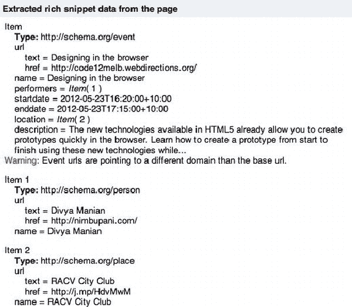

**图 4-17。**拉拉拉

然后，搜索引擎可以在显示搜索结果时使用这些额外的数据，例如在结果中添加日期和位置，所有这些都不需要那些讨厌的自然语言解释器(也称为人类)。

任何以前使用过微格式的人都会注意到这些词汇表看起来非常类似于 hCard 和 hCalendar，尽管有一些名称上的变化(例如，Calendar 的`class="dtstart"`变成了`itemprop="startDate")`)。

虽然 schema.org 词汇表是所有搜索引擎都承诺支持的，但是您可以自己扩展这些词汇表。最安全的方法是通过

*   基于维基百科的产品或服务的产品类型本体(`[www.productontology.org](http://www.productontology.org)`)。
*   电子商务的 GoodRelations 词汇术语(`[`j.mp/goodrel`](http://j.mp/goodrel)33`)。
*   使用 schema.org 电子邮件列表，合作开发你自己的 schema.org 词汇扩展。请务必先阅读“创造自己的词汇”部分。

###### 工具和浏览器支持

使用正确的工具，我们可以使用这些数据，完成其显式语义，例如，将这个事件直接添加到日历中——如果您打算去，这非常方便！随着 schema.org 的发布，微数据工具开始出现，但在地面上仍然有些单薄。但是，以下库是可用的:

*   Philip jgenstedt(`[`j.mp/live-md`](http://j.mp/live-md)35`)的实时微数据和相关微数据
*   Alex Holt 的 PHP 微数据解析器(`[`j.mp/php-md`](http://j.mp/php-md)36`)
*   蓝雨青，一个 Ruby 的微数据解析器/提取器库和命令行工具
*   微观数据-按术语排列的 JS(`[`j.mp/md-js`](http://j.mp/md-js)38`)

__________

33

34

35

36

37 `[`lawrencewoodman.github.com/mida`](http://lawrencewoodman.github.com/mida)`

Live 微数据将微数据转换成 JSON。PHP 微数据库允许您解析 HTML 文件中的微数据，返回 JSON 或 PHP 数组。蓝雨青允许你提取微数据作为 JSON，然后搜索或检查物品。它支持定义词汇，并包括 schema.org 词汇。您甚至可以从命令行使用它。微数据-JS 是微数据的聚合填充。Validator.nu ( `[`validator.nu`](http://validator.nu)`)也会验证你对微数据的使用，但不会验证它是否符合某个词汇表。正如我们已经看到的，Google Rich Snippets 测试工具验证微数据，如果你使用 schema.org 词汇表，*应该*显示这些数据如何被整合到搜索结果中。

微数据规范描述了微数据 DOM API，它允许我们访问顶级项目及其属性。API 浏览器支持仍处于萌芽状态，在撰写本文时只有 Opera 12 预览版，尽管 Firefox 和 WebKit 正在努力。幸运的是，这没问题，因为这些数据对搜索引擎机器人和第三方工具仍然有用，并且在有原生 API 支持之前，我们可以使用微数据。

###### 创造你自己的词汇

如果你在 schema.org 找不到合适的词汇，你可以考虑自己创造。以下是步骤。

1.  制定你的词汇规则。这有点像建立一个数据库。为每种类型的数据指定名称，然后考虑每个名称的值应该/必须包含什么类型的数据(URL、日期时间、自由文本、有限制的文本……)，以及某个内容是否需要成为另一个内容的子内容。
2.  在你控制的域上创建一个 URL，最好把你的词汇表放在那里。
3.  使用 itemtype= " "中的 URL 来引用您的词汇表。

也有很好的理由*而不是*来创造自己的词汇。它们可能很难创建，正如制作微格式词汇表的工作所证明的那样。对于真正特定于站点的数据，您可以使用 HTML5 定制的`data-*`属性或者以同样的方式使用微数据。但是要真正获得微数据的类似 API 的好处，您需要使用不仅仅是您的站点上的词汇表。要创建这样的词汇表，你需要涵盖的不仅仅是你自己的需求，而是同一主题领域其他人 80%的需求。

首先，查看一下`microformats.org`,看看在大致相同的区域是否有你可以微数据化的东西。之后，尝试 RDFa 词汇表。如果你仍然运气不好，试着和你专业领域的其他人合作学习一个词汇。如果你打算从开始写你自己的微数据词汇表，我们建议你先试着写一个微格式(`[`j.mp/uf-process`](http://j.mp/uf-process)39`)，因为你会得到很多好的反馈，他们也有关于如何写的好信息。然后很容易将得到的微格式词汇表转换成微数据词汇表。

__________

38

也可以通过指定**、**、`itemtype`和使用 URL 作为`itemprop`名称来直接使用 RDFa 词汇表。参考位于`[`prefix.cc`](http://prefix.cc)`的 RDF 词汇表交换中心(“名称空间查找”)来找到它们。

#### 关于微观数据的最终想法

我们浏览了微数据的构建块，这是一个简单的五属性组合，在任何元素上包含`itemscope`、`itemprop`、`itemref`、`itemtype`和`itemid`，并在`<meta>`上使用`content`。我们研究了如何组合这些属性来为内容添加复杂的语义注释和关系。我们还研究了如何使用一个公共词汇表来允许带注释的数据被广泛重用(包括被搜索引擎重用)，这使得为您的网站创建一个元 API 变得很容易。

用语义数据扩展 HTML5 还有其他方法。尽管我们简要介绍了微格式，但我们不会触及 RDFa，这是一种重量级的方法，通过它，`data.gov.uk`，`data.gov`和铁杆数据极客可以注释他们的数据——也是蒂姆·伯纳斯·李在 ted 演讲中如此雄辩地推广的“链接数据网络”的基础。虽然比微数据更强大，但 RDFa 也更复杂，而且(至少对于您的作者来说)理解和实现起来有点困难。然而，如果你喜欢三元组或者一直想使用 SPARQL，那么 RDFa 可能就是你想要的。

以下是微数据的一些突出之处，以及它与微格式和 RDFa 的比较:

*   微数据可以用于任何数据。不需要预定义的词汇表(微格式中有)，尽管使用一个词汇表会使您的数据更加有用。
*   微数据比微格式更加严格。您可以在不了解词汇表的情况下解析微数据
*   微数据和微格式一样，相对容易手写。对于非计算机科学的人来说，RDFa 可能很复杂(好吧，反正对我们来说)。
*   微数据没有 RDFa 的 XML 文字(值中的代码)或数据类型的对等物。换句话说，你不能明确地指定“这是一个日期”，尽管一个词汇表可以指定这个信息。

__________

39

或者，总结每项技术:

*   微格式很容易，在某种程度上受到 HTML 4 的限制，可以在 HTML5 中工作(有一些警告)，并且很可能最终会过渡到使用新的 HTML5 元素和属性。
*   微数据是新的(很少的工具),但作为一种轻量级的方式，它显示出了为所有常见用例的页面内容添加额外语义的前景。
*   RDFa 更强大，难度也相应增加，并且有根深蒂固的支持者。

虽然微数据和 RDFa 可以被看作是相互竞争的技术(政治！)，我们个人认为它们是互补的。我们或许可以将微格式、微数据和 RDFa 之间的关系表示为从简单/有限到困难/强大的滑动标度。由于它们都使用不同的技术来添加注释，您甚至可以在同一个页面上一起使用它们(语义过载！).我们的观点是:对于设计师来说，微数据处于中间的最佳位置，但是每种添加额外语义的方法都有其优点和缺点。

### 总结

在这一章中，我们介绍了让我们的代码真正发光的工具。我们研究了旧的收藏夹是如何进化的，以跟上不断发展的网络的需求。我们还展示了几个新元素和属性，它们扩展了我们可以在语义上表示的内容类型。最后，我们研究了进一步扩展 HTML5 的方法，包括使用微数据。

对于家庭作业，尽可能多地使用本章的元素，同时思考它们的语义。如果你已经习惯了 HTML 4 的定义，实践也将帮助你巩固 HTML5 对变化元素的定义。最后，用微格式或微数据标记一些东西，然后使用工具用你添加的额外语义做一些事情。如此强大的力量！明智地使用它来准备一个丰富的语义蛋糕——为我们在本书的后半部分将要看到的所有精彩内容打下坚实的基础。

#### 延伸阅读及相关链接

*   HTML5 元素索引— HTML5 医生(`[`html5doctor.com/element-index`](http://html5doctor.com/element-index)`)
*   *走向统一的 Ruby 模型*由 Fantasai ( `[`fantasai.inkedblade.net/weblog/2011/ruby`](http://fantasai.inkedblade.net/weblog/2011/ruby)`)提出
*   *微格式:为 Web 2.0 赋予你的标记能力*，作者约翰·奥尔索普
*   深入研究 html 5——“分布式”、“可扩展性”，以及马克·皮尔格林(`[`diveintohtml5.net/extensibility.html`](http://diveintohtml5.net/extensibility.html)`)的其他花哨词汇
*   关联数据教程(RDFa 介绍)(`[`ld2sd.deri.org/lod-ng-tutorial`](http://ld2sd.deri.org/lod-ng-tutorial)`)
*   Philip jgenstedt(`[`blog.foolip.org/2009/08/23/microformats-vs-rdfa-vs-microdata`](http://blog.foolip.org/2009/08/23/microformats-vs-rdfa-vs-microdata)`)的微格式 vs RDFa vs 微数据
*   谷歌帮助——丰富的片段；包含对微数据、微格式和 RDFa 的精彩介绍，以及每种语言的代码示例(`[www.google.com/support/webmasters/bin/topic.py?topic=21997](http://www.google.com/support/webmasters/bin/topic.py?topic=21997)`)**