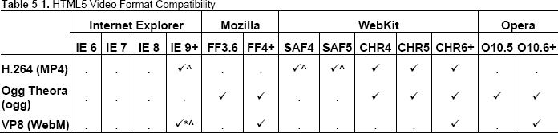

# 五、富媒体

还记得网络只是一系列包含文本和图像的相互链接的文档的时代吗？没有吗？别担心。我们将给你们上一堂简短的历史课。在 90 年代中期，大多数网站包含大量的文本和一些图片。后来，一个注定要改变游戏规则的东西出现了:FutureSplash 插件。因为它是一个专有插件，而不是一个被认可的开放规范，关于它是否应该成为网络架构的一个基本部分的争论仍然存在。然而，FutureSplash 并不是唯一的一个；Real Player 和 QuickTime 也想加入这个专有插件的行列。

你可能知道故事是如何继续的——future Flash 被 Macromedia 收购，并将其重命名为 Flash，它在桌面上变得无处不在。它的成功基于这样一个事实，即它提供了许多开放标准所缺少的功能，比如视频和动画。插件，比如 Flash，解决了跨浏览器兼容的问题。但是故事将如何结束呢？Flash 和其他专有格式的未来会如何？HTML5 和开放网络的兴起会宣告专有格式的终结吗？在这一章中，我们将讨论我们前进的方向，并向您介绍 native `video`和`audio`以及对`canvas`和`SVG`(可缩放矢量图形)的简要了解，它们很可能包含答案。

### 闪光灯的情况

让我们明确一点:我们并不反对 Flash。事实上，恰恰相反。该插件丰富的创作工具允许习惯于编写 HTML 4.01 的开发人员为他们的站点带来动态、音频、视频、动画，最重要的是，开箱即用的跨浏览器兼容性。它对浏览器功能的增强远远超过我们基本的网络琐事所能做到的——也许直到现在。Flash 也已经成为普遍接受的向网站添加视频和音频的方法。当谈到拓展在线可能性的边界时，它是非常领先的。

曾经有一段时间，当你不能访问一个网站时，你不会被 Flash 中创建的可怕的介绍屏幕所震惊，但它已经发展成为一个能够创建高度复杂应用的复杂软件包。当使用 Flash 的原生创作语言 ActionScript 构建时尤其如此，action script 与 Adobe Flex 和 Adobe AIR 一起，鼓励熟练的开发人员在 Web 上展示他们的创造力并开辟新的天地。

Flash 插件的问题在于它是一种封闭的、专有的格式，这是进入的障碍。Flash 文件基本上只能通过使用一个昂贵的软件包来创建，这个软件包仍然掌握在一个供应商手中——Adobe。专有格式的替代品？开放标准。

#### 专有格式与开放标准

在我们讨论 HTML5 打算如何改变游戏环境之前，让我们简单地了解一下专有格式和开放标准之间的区别。维基百科将专有格式描述为

> *通常由私人或组织为其应用的利益而控制，受专利保护或作为商业秘密，并旨在给予许可持有人排除他人(当前或未来)对技术的独家控制权。*
> 
> `[`en.wikipedia.org/wiki/Proprietary_format`](http://en.wikipedia.org/wiki/Proprietary_format)`

Openformats.org 将开放标准描述为

> 公共机构或国际组织制定的标准，旨在建立软件互操作性的规范。
> 
> `[www.openformats.org/en1](http://www.openformats.org/en1)`

包括 Flash 在内的专有格式为可访问性、设备独立性和开箱即用的数据可移植性带来了挑战。此外，它们并不总是能很好地与开放标准或原生浏览器功能兼容。另一方面，开放标准促进了跨平台和设备的互操作性。开放标准提供了较低的准入门槛；你所需要的只是一个文本编辑器和一个浏览器，然后你就可以创建一个网站了。

正如您将看到的，即使 HTML5 也没有完全摆脱专有格式(尽管它们没有在规范中明确标识)，但从长远来看，开放标准往往会因其设备和平台独立性而胜出。

说到紧要关头，如果 Adobe 或苹果明天、下周或明年破产，会发生什么？Flash 不会突然消失，但可以说，开发人员将不得不考虑另一种解决方案来交付他们的项目。相比之下，开放标准不能破产。网络是无所不包的，不应该——不，不应该——被几家兜售其专有格式的大公司所控制。

#### 输入 HTML5 和好友

开放网络正在快速发展。HTML5 开始向我们展示只使用开放标准可以实现什么。正如你将在本章看到的，HTML5 为浏览器提供了视频和音频。它还为我们提供了`canvas`以及将 SVG 文件直接嵌入页面的能力。这些技术允许我们使用简单的脚本技术来绘制和操作动态的基于像素的(`canvas`)和基于矢量的(`SVG`)图像。

这些富媒体元素与强大的 API 相结合，只使用开放的 Web 标准，为提供可互操作的、可访问的、丰富的、引人注目的体验做出了巨大贡献。问题是，Flash 等专有插件愿意躺着被开放标准赶超吗？

#### 【HTML5 是否预示着 Flash 的终结？

在 List Apart 的一篇精彩文章中，Dan Mall 将 HTML5 与 Flash 的辩论比作网络冷战。他接着说

> 技术本身没有好坏之分。它们只在特定情况下合适或不合适。它们是达到目的的手段，本身并不是解决方案。
> 
> `[www.alistapart.com/articles/flashstandards/](http://www.alistapart.com/articles/flashstandards/)`

Dan 的方法类似于我们自己的方法，因为我们相信开发者应该在他们的军械库中使用最合适的技术。事实上，如果你是一名 Flash 开发人员，你已经掌握了用`canvas`创造伟大事物所需的大部分技能；只要看看 Seb Lee-Delisle 的 3D particles ( `[`j.mp/3dparticles`](http://j.mp/3dparticles)1`)就知道从 ActionScript 转换成 JavaScript 有多容易了。这是因为这两个脚本都是基于 ECMAScript 语言的，这意味着在一个和另一个之间切换是相对容易的！

Flash 肯定会在未来几年继续推动在线可能的边界，游戏可能会处于这一推动的最前沿(尽管它的束缚正在减弱)。然而，即使是 Adobe 也害怕 HTML5，在 Gartner 代表 Adobe 进行的一份报告中称“HTML5 对 Adobe Flash 构成了威胁”。苹果决定不在 iPhone 或 iPad 上支持 Flash，这当然也于事无补。就连 Ricardo Cabello(你们中的一些人会称他为 Doob 先生)也从他的投资组合中删除了所有 Flash 项目，因为他“再也没有兴趣做 Flash 项目了”(`[`j.mp/doobnoflash`](http://j.mp/doobnoflash)2`)。

__________

1

2

简而言之，Flash 不会很快走向任何地方，但是希望这一章的内容会让你思考你*实际上*需要在你建立的下一个网站上使用哪种技术。

### 视频 HTML5 方式

没有一天我们不被告知视频(我们不只是在谈论 YouTube)是网络的未来。如果是这样的话，特别是对于普通用户来说，我们肯定需要一种简单、可靠的方式来包含视频内容，而不必投资昂贵的专有软件。HTML5 正好提供了这一点，直接在浏览器中用(最少)一行标记。

让我们来看看近年来我们是如何使用`object`标签向我们的网站添加视频的。我们确信你们都会认出 YouTube 嵌入代码。

`<object width="640" height="385">
  <param name="movie" value="http://www.youtube.com/v/24FNE60FRzw&hl=en_GB&fs=1&">
  </param>
  <param name="allowFullScreen" value="true"></param>
  <param name="allowscriptaccess" value="always"></param>
  <embed src="http://www.youtube.com/v/24FNE60FRzw&hl=en_GB&fs=1&"
         type="application/x-shockwave-flash" allowscriptaccess="always"  
         allowfullscreen="true" width="640" height="385">
  </embed>
</object>`

很丑，是吧？嗯，你可能已经猜到了，HTML5 不仅帮助我们变得更加语义化，还让我们向网站添加视频变得像 ABC 一样简单(好吧，几乎一样简单)。您需要的基本标记是

`<video src="gordoinspace.webm"></video>`

默认情况下，浏览器不显示任何播放控件；用户需要打开一个上下文菜单(右键单击或 cmd+单击)来播放使用该标记的视频，这不是很直观。当浏览器计算尺寸时，如果您没有显式设置视频的`width`和`height`，您也会在加载页面时看到一个小故障。此外，用户也不会先睹为快地看到他们将要观看的内容。为了补救这种情况，我们将添加`poster`和`controls`属性以及维度(稍后我们将更详细地解释这些属性)。

`<video src="gordoinspace.webm" width="720" height="405" poster="poster.jpg" controls>
</video>`

在 Chrome 中，你应该会看到类似图 5-1 的东西。

**图 5-1。**Chrome 中的基本视频元素

然而，标准的全局属性以及`poster`和`controls`并不是唯一可用的属性。

HTML5 中定义的标准全局属性有:

`accesskey              dropzone
class                  hidden
contenteditable        id
contextmenu            itemid
dir                    itemprop
draggable`

让我们更详细地看一看每一个。

*   `autoplay`:告诉浏览器在视频下载后立即开始播放。
*   `controls`:显示浏览器自带的内置控件。基本控制往往包括播放/暂停按钮、计时器、音量控制和时间擦洗器。
*   `crossorigin`:允许或禁止使用 CORS(跨源资源共享)跨其他域共享视频。
*   `height`:识别视频的高度(如果您的高度/宽度比例不正确，您将会在视频的上方和下方看到黑色条纹；不会扭曲)。
*   `loop`:告诉浏览器在播放完成后循环播放视频。
*   `mediagroup`:通过创建媒体控制器，允许多个媒体元素链接在一起。因此，您可以同步多个视频或一个视频与音频。
*   `muted`:允许作者指定视频开始播放时是否静音。
*   `poster`:识别用作保持框的静止图像的位置。
*   `preload`:允许作者在页面加载后立即通知浏览器开始(或不开始)下载视频。`preload`已经取代了`autobuffer`属性。如果存在的话，`autoplay`属性可以覆盖`preload`属性。可用的状态有
*   `none`:告诉浏览器不要预加载文件。当用户单击播放时，文件将开始加载。
*   `metadata`:告诉浏览器仅预加载元数据(尺寸、第一帧、持续时间等。).当用户单击播放时，文件的其余部分将开始加载。
*   `auto`:告诉浏览器选择是下载整个文件，什么都不下载，还是只下载元数据。如果没有指定`preload`，这是默认状态。
*   `src`:标识视频文件的位置(注意，如果存在子`source`元素，这不是必需的，我们将在后面介绍)。
*   `width`:识别视频的宽度(如果你的高/宽比例不正确，你会看到视频上下有黑色条纹；不会扭曲)。

`loop`、`autoplay`、`preload`、`controls`为布尔属性，表示如果代码中存在关键字，则值为`true`。如果你写的是 XHTML，那就把`controls`写成`controls="controls"`。

*注意:`mediagroup`和`crossorigin`属性最近才被添加到规范中，因此没有在任何浏览器中实现。*

正如我们将看到的，一些浏览器还不支持`video`元素(或特定的编解码器——稍后会详细介绍)。不过，使用适度的降级，我们可以通过以下载视频的链接的形式提供后备内容来迎合这些浏览器。这是因为浏览器总是显示它们无法识别的 HTML5 元素中的内容。

`<video src="gordoinspace.webm" width="720" height="405" poster="poster.jpg" controls>
Download <a href="gordoinspace.webm>Gordo in Space</a> the movie.
</video>`

*注意:我们不认为自动播放视频是一个好主意，主要是从可访问性(a11y)的角度来看。这同样适用于总是包含控件。事实上，迪士尼曾因拥有盲人用户无法关闭的视频和音频而对他们提起诉讼(`[`j.mp/noaccessdisney`](http://j.mp/noaccessdisney)3`),你不会希望自己处于那种境地。*

到目前为止很简单，对吧？不幸的是，事情从来没有这么简单，不是吗？让我们来谈谈房间里的大象。

__________

3

#### 视频格式

大象——不，是大象——藏在后面的是视频格式和编解码器。HTML5 规范的早期版本指定了 Theora 编解码器(见下一节)，但苹果拒绝实现它。Theora 编解码器随后从规范中删除，因为浏览器供应商无法就通用编解码器达成一致。这意味着不再记录首选编解码器。

在我们深入探究哪些浏览器支持哪些编解码器之前，让我们偏离常规，简要描述一下视频容器和编解码器之间的区别。

##### 视频容器和编解码器

我们与视频相关联的文件扩展名`.mp4`、`.avi`和`.flv`本身并不是编解码器，而是一种容器格式。想一想 ZIP 或 RAR 文件是如何包含几种类型的文件的；视频容器格式做同样的事情。容器格式应该被认为是“如何存储数据”，而编解码器应该被认为是“如何理解和播放数据”

这些容器倾向于包括多个轨道，通常至少一个用于视频，一个用于音频。音轨通过包含在音轨中的标记来同步。对于不同的语言，可以有多个音频轨道或字幕轨道(稍后将详细介绍)。容器还可以有关联的元数据，可能包括视频的标题或章节点。

你可能会想，“但是这和 HTML5 视频有什么关系呢？”答案是，为了实现 HTML5 视频跨浏览器，我们需要知道三种容器格式。

*   *WebM* :加入 HTML5 党的最新容器格式(`[`j.mp/webmproject`](http://j.mp/webmproject)4`)。它是在 2010 年谷歌 I/O 大会上宣布的，此前谷歌收购了 On2 技术(`[`j.mp/googleon2`](http://j.mp/googleon2)5`)。基于 Matroska 容器格式，它设计用于开源 VP8 视频编解码器和 Vorbis 音频编解码器。YouTube 支持 WebM 格式，前提是你已经选择加入它的 HTML5 实验(`[`j.mp/youtubehtml5`](http://j.mp/youtubehtml5)6`)，并且使用兼容的浏览器。
*   *Ogg* :开放的标准容器格式，没有任何专利限制，由 Xiph.Org 基金会(`[`j.mp/oggtheora`](http://j.mp/oggtheora)7`)维护。Ogg 的视频编解码器叫做 Theora，音频编解码器叫做 Vorbis。
*   *MPEG-4* :基于苹果公司的 QuickTime 容器格式 MOV ( `[`j.mp/mpeg4container`](http://j.mp/mpeg4container)8`)。它与文件扩展名`.mp4`和`.m4v`相关联。MPEG 4 的缺点是它受专利保护，这可能意味着用户从 2016 年开始将不得不支付版税。MPEG 4 使用 H.264 视频编解码器。

__________

4

5

6

7 `[`en.wikipedia.org/wiki/Ogg`](http://en.wikipedia.org/wiki/Ogg)`

我们已经介绍了我们感兴趣的容器格式，但是具体的编解码器呢？虽然编解码器的数量范围很广(即使是这三种容器格式)，但我们只对以下三种感兴趣:

*   VP8 :不受任何已知专利限制的开放视频编解码器。它归谷歌所有，由谷歌收购的 On2 技术公司开发。它的质量类似于 H.264，预计在未来几年将得到进一步发展。
*   *Theora* :也是由 On2 科技原创(一群聪明的家伙，你不觉得吗？)但是现在由 Xiph.Org 基金会开发。像 VP8 一样，它是免费的，不受任何已知专利的限制。Theora 相当于 VP3，一般配合 Ogg 容器使用，但质量远低于 VP8 或 H.264
*   H.264:由 MPEG 集团开发，旨在以低于以前标准的比特率创建高质量的视频。H.264 可以分为不同的配置文件，以满足不同设备的需求，因此，例如，桌面设备可能比移动设备需要更高的配置文件。它可以与大多数容器格式(通常是 MPEG-4)一起使用，但缺点是它受到 MPEG-LA 的专利保护。

正如我们前面提到的，因为浏览器供应商不能就编解码器达成一致，所以规范中没有详细说明。您现在知道有三种浏览器可供选择，但是哪种浏览器支持哪种呢？

#### 浏览器支持

所有五个主要的浏览器都支持 HTML5 `video`。表 5-1 显示了浏览器支持不同编解码器的当前状态。

__________

8

谷歌确实在 2011 年 1 月宣布他们将放弃对 H.264 ( `[`j.mp/chromeh264`](http://j.mp/chromeh264)9`)的支持，但在撰写本文时，这还没有发生，浏览器仍然支持所有三种编解码器。针对 HTML5 视频的现状，LongTail 制作了一份名为“*html 5 视频的现状*”的综合报告，这是任何想使用原生视频的人必读的([`j.mp/h5longtail`](http://j.mp/h5longtail)10)。

引用 Mark Pilgrim 在深入 HTML5 中的话，

> 没有一种容器和编解码器的组合可以在所有的 HTML5 浏览器中工作。这在不久的将来不太可能改变。为了让您的视频在所有这些设备和平台上都可以观看，您需要对您的视频进行多次编码。
> 
> `[`diveintohtml5.info/video.html#what-works`](http://diveintohtml5.info/video.html#what-works)`

随着宣布对 Flash Player ( `[`j.mp/adobevp8`](http://j.mp/adobevp8)11`)的 VP8 支持，有一个解决方法，您可以对不支持 VP8 编解码器但支持其他 HTML5 视频格式(Safari)的浏览器使用 Flash fallback。

实现跨浏览器兼容性的另一个选择是多次编码您的视频。有很多工具可以实现这一点，其中之一是 Miro 视频转换器(`[`j.mp/miroconverter`](http://j.mp/miroconverter)12`)，如图图 5-2 所示，可用于 PC 和 Mac。使用 Miro 转换视频非常简单，只需拖动文件，选择所需的输出格式，然后单击转换！

__________

9

10

11

12

**图 5-2。**米罗视频转换器

对于进一步的编码选项，Mark Pilgrim 提供了一个深入研究 HTML5 的很好的教程(`[`j.mp/videopilgrim`](http://j.mp/videopilgrim)13`)。

#### 添加视频源

我们现在已经对视频进行了三次编码，但是到目前为止，我们只能给我们的`video`元素添加一个`src`属性——休斯顿，我们有一个问题。我们可以使用 JavaScript 检测支持，并为每个浏览器提供适当的文件。然而，更可靠的方法是使用`source`元素。

`source`允许我们为我们的媒体元素指定多个备选视频(或使用`audio`时的音频，我们将在后面介绍)，如下所示。它是一个不可见的元素，这意味着浏览器不会呈现任何东西来直观地表明它在文档中的存在。

`<video poster="poster.jpg" controls width="720" height="405">
  <source src="gordoinspace.mp4" type="video/mp4">
  <source src="gordoinspace.webm" type="video/vp8">
  <source src="gordoinspace.ogv" type="video/ogg">
  Download <a href="gordoinspace.webm>Gordo in Space</a> the movie.
</video>`

请注意我们是如何添加三个`source`元素及其适当的`type`属性来满足所有浏览器的需求的(好吧，不完全是*所有的*，你可能早就注意到了，但我们会谈到这一点)。

__________

13

*注意:不要混淆`source`元素和`src`属性。*

我们现在已经从`video`元素中移除了`src`属性，因为我们使用了子元素`source`。请注意，下载视频的链接仍然存在，主要是为那些可能在纯文本浏览器或其他设备上观看的用户。

如果不在 source 元素中添加`type`属性，浏览器会在意识到编解码器不受支持之前下载每个文件的一小部分。因此，您应该确保每个视频源都包含了`type`属性。

*注意:当对 Ogg Theora 编码的视频使用`type`属性时，必须将其指定为`video/ogg`，而不是`video/ogv`(最后一个字母* g *，而不是* v *)。这让我们困惑了好几次，混淆的原因是文件类型有一个。`ogv`分机。*

浏览器将播放其理解格式的第一个视频。例如，在能够播放所有格式的 Chrome 6 的情况下，它将播放 MP4 文件。如果浏览器不理解视频的类型，它会简单地跳到下一个`source`元素，直到找到一个它理解的元素。

`source`元素的顺序同样重要:MP4 必须排在第一位，因为在老款 iPads 上，它只查看第一个`source`元素(现在已经解析)。WebM 被放在第二位，因为它的质量高于 Ogg，从而确保 Opera 10.6+和 Firefox 4+将播放 WebM 文件而不是 Ogg；Ogg 排在第三，支持 Opera 10.5 和 Firefox 3.5/3.6。久而久之(或者甚至现在，如果你愿意的话)，我们可能不需要用 Ogg 来编码我们的视频，因为目前使用它的新版本浏览器也将支持更高质量的 WebM。对我们的视频进行三重编码并添加三个`source`元素涵盖了许多浏览器和平台，但是 IE6、7 和 8 呢？

*注意:根据您的服务器配置，视频可能无法播放。如果在 Apache 服务器上是这种情况，您可能需要指定提供视频的方式。您可以通过在您的`.htaccess`文件中添加以下几行来做到这一点:*

`*AddType video/webm .webm*
*AddType video/ogg .ogg*
*AddType video/mp4 .mp4*`

*还要注意，您可能需要对`audio`做同样的事情。*

`*AddType audio/webm .webm*
*AddType audio/ogg .oga*
*AddType audio/mp3 .mp3*`

##### 进入我们的老朋友 Flash

没错，伙计们:虽然我们已经讨论了开放标准取代 Flash 等专有技术的好处，但在这种情况下，我们值得信赖的老朋友 Flash 先生帮助我们支持旧版本的 Internet Explorer。有许多可用的 Flash 视频播放器，因此您可以选择使用哪一个。这个例子使用了 JW Player 的非商业版本(`[`j.mp/jwplayer`](http://j.mp/jwplayer)14`)。它在链接脚本后提供的默认代码如下:

`<object id="player" classid="clsid:D27CDB6E-AE6D-11cf-96B8-444553540000" name="player"
width="720" height="429">
        <param name="movie" value="player.swf" />
        <param name="allowfullscreen" value="true" />
        <param name="allowscriptaccess" value="always" />
        <param name="flashvars" value="file=gordoinspace.mp4&image=poster.jpg" />
        <embed  type="application/x-shockwave-flash"  id="player2" name="player2"
src="player.swf"         width="720"  height="429"  allowscriptaccess="always"
allowfullscreen="true" flashvars="file=file= gordoinspace.mp4&image= poster.jpg" />
</object>`

通过将 Flash `object`与我们之前的例子相结合，我们最终得到了一个可访问的、跨浏览器的、*本地*解决方案。您会注意到在`object`中有一个`img`元素，供没有安装 Flash 插件的用户使用，正如您在这个完整的文档示例中看到的:

`<!DOCTYPE HTML>
<html lang="en-UK">
<head>
        <meta charset="UTF-8">
        <title>Gordo in Space</title>
        
        
</head>
<body>
<h1>Gordo in Space</h1>

<video poster=" poster.jpg" controls width="720" height="405">
  <source src="gordoinspace.webm" type="video/vp8" />
  <source src="gordoinspace.mp4" type="video/mp4" />
  <source src="gordoinspace.ogv" type="video/ogg" />
  <object id="player" classid="clsid:D27CDB6E-AE6D-11cf-96B8-444553540000" name="player"
width="720" height="429">
        <param name="movie" value="player.swf" />
        <param name="allowfullscreen" value="true" />
        <param name="allowscriptaccess" value="always" />
        <param name="flashvars" value="file=gordoinspace.mp4&image=poster.jpg" />
        <embed
        type="application/x-shockwave-flash"
        id="player2"
        name="player2"` `        src="player.swf"
        width="720"
        height="429"
        allowscriptaccess="always"
        allowfullscreen="true"
        flashvars="file=file= gordoinspace.mp4&image= poster.jpg"
        />
        
        
Your browser doesn't support video, please <a href="gordoinspace.webm">download
it</a>.

        </object>
</video>

</body>
</html>`

__________

14

上述技术基于 Camen Design 的 Kroc Camen 的解决方案。我们建议你阅读克罗克的“人人视频！”(`[`j.mp/videoforeverybody`](http://j.mp/videoforeverybody)15`)文章，了解最新浏览器支持和陷阱的更新。还有一个“人人视频”生成器，可以让这个过程自动化一点(`[`j.mp/vfegenerator`](http://j.mp/vfegenerator)16`)。

#### 追踪元素

然而，这并不是我们可以在原生视频中使用的唯一元素。作为 HTML5 规范的相对后来者，`track`元素(及其相关 API，Text Track API)旨在允许作者为视频和音频指定外部定时轨道或数据。`track`只能用作`video`或`audio`媒体元素的子元素。它的用法如下(为了简单起见，我们去掉了`source`元素):

`<video src="gordoinspace.webm" width="720" height="405" poster="poster.jpg" controls>
  <track kind="subtitles" src="gordo_subtitles.vtt" />
</video>`

`track`可以取以下属性:

*   `default:`设置默认使用的`track`元素，除非用户的偏好表明另一个`track`更合适。
*   `kind:`描述该跟踪元素提供的信息类型。它可以取以下值(如果没有指定值，默认使用`subtitles`):
    *   对话的抄本或译本。文本将在视频上显示为覆盖图。
    *   `captions:`类似于`subtitles`，但也可以包括音效或其他相关音频信息。适用于音频不可用的情况。文本将在视频上显示为覆盖图。
    *   `descriptions:`提供当视频不可用时(例如，当用户正在使用屏幕阅读器时)媒体元素的文本描述。
    *   `chapters:`定义章节标题以导航媒体元素的内容。
    *   `metadata:`包括关于媒体元素的信息和内容，默认情况下不打算向用户显示。如果愿意，您可以使用 JavaScript 公开这些信息。
*   `label:`为文本轨道定义用户可读的标题。对于同一媒体元素中具有相同`kind`属性的每个轨道元素来说，`label`必须是唯一的。
*   `src:`文本轨道数据的 URL。
*   `srclang:`文本轨道数据的语言

__________

15

16

现在让我们看一个带有多语言(英语、法语和德语)字幕的例子。

`<video src="gordoinspace.webm" width="720" height="405" poster="poster.jpg" controls>
    <track kind="subtitles" src="gordo_subtitles_en.vtt" srclang="en" label="English"  />
    <track kind="subtitles" src="gordo_subtitles_de.vtt" srclang="de" label="Deutsch"  />
    <track kind="subtitles" src="gordo_subtitles_fr.vtt" srclang="fr" label=" Français"  />
</video>`

使我们的视频具有内置的、可互操作的可访问性，但因为它太新了，还没有任何浏览器支持它(但他们目前正在努力)。在此之前，最好的解决方法是使用 JavaScript polyfill 来提供支持(我们将在本章后面进一步讨论这些，包括一些带有`track`支持的)。

##### WebVTT

精明的人会注意到前面两个例子中的文件扩展名“`.vtt`”。这是一种 WebVTT (Web Video Text Tracks) ( `[`j.mp/w3cwebvtt`](http://j.mp/w3cwebvtt)17`)文件格式，用于标记外部文本轨道。这种格式以前被称为 WebSRT (Web 字幕资源轨道)(`[`j.mp/videowebsrt`](http://j.mp/videowebsrt)18`)，由于它与 50 多种其他定时文本格式竞争，因此存在一些争议(`[`j.mp/annevkwebsrt`](http://j.mp/annevkwebsrt)19`)。所有主流浏览器都计划支持 WebVTT，微软宣布它也将支持 TTML(定时文本标记语言)。

WebVTT 目前仅在 WHATWG HTML 规范中指定，但是 W3C Web Media Text Tracks 社区组已经成立，以帮助其顺利进入 W3C 规范。

WebVTT 文件是一个非常简单的文本文件，包含许多“提示”这些提示区分文本应该何时出现以及应该显示什么文本。每个提示都有一个唯一的 ID，并且必须在自己的行上。一个简单的 WebVTT 文件如下所示(注意第一个`WEBVTT`行是文件有效所必需的):

__________

17 `[`dev.w3.org/html5/webvtt`](http://dev.w3.org/html5/webvtt)`

18

19

`WEBVTT

1
00:00:01.000 --> 00:00:10.000
The first lot of subtitles displays from 1 to 10 seconds

2
00:00:15.000 --> 00:00:20.000
The next line displays from 15 to 20 seconds
and can run onto two lines`

您会注意到每个提示使用的时间格式是`hh:mm:ss:msmsms.`您还可以在文本周围内嵌计时器，使其以卡拉 ok 风格连续出现，如下所示:

`WEBVTT

1
00:00:01.000 --> 00:00:10.000
The first lot of subtitles <00:00:03.000> displays from <00:00:07.000>1 to 10 seconds`

你也可以选择你的字幕样式(嗯，*样式*可能有点夸张)。与你在第四章的中所学的一切相反，你可以用`<b>`表示粗体文本，`<i>`表示斜体，`<u>`表示下划线，`<ruby>`和`<rt>`表示错别字、红宝石文本。你也可以使用`<c.className>`来定义一个类，你可以用它来设置文本的样式。最后，使用`<v>`你可以定义一个与文本相关的声音。这使用了下面的格式`<v Speaker Name>`,并且将在字幕上显示演讲者的名字和标题。让我们看一个包含这些标签的例子。

`WEBVTT

1
00:00:01.000 --> 00:00:05.000
<v James Misson Control>Gordo are you ready for takeoff?

2
00:00:05.000 --> 00:00:08.000
<v Gordo><i>Laughs uncontrollably</i>

3
00:00:08.000 --> 00:00:16.000
<v James Mission Control>Good, we’re ready for launch
in 3, 2, … 1 …
We are <c.launch>go</c>!

4
00:00:16.000 --> 00:00:20.000
<v James Mission Control>Good, we’re ready for launch
in 3, 2, … 1

5
00:00:20.000 --> 00:00:30.000
<v Gordo><b>Arrrghhhhhhhhhhh</b>`

最后，使用 WebVTT，我们可以通过在时间戳后添加一些提示`settings`来指定标题出现的位置。表 5-2 显示了哪些设置可用。

我们来看一个例子。

`WEBVTT

1
00:00:01.000 --> 00:00:05.000 A:start T:0
<v James Misson Control>Gordo are you ready for takeoff?

2
00:00:05.000 --> 00:00:08.000 A:end L:10% D:vertical
<v Gordo><i>Laughs uncontrollably</i>`

示例中的第一个提示将文本放在框架的最左侧，文本与行首对齐。第二个提示距离顶部 10%，垂直，文本与结尾对齐。在图 5-3 中可以更清楚地看到这一点。

**图 5-3。**使用 WebVTT cue 设置在视频上显示字幕的示例

这是对 WebVTT 的温和介绍。随着规范和浏览器支持的发展，还有更多的东西需要研究、解释和学习，所以一定要跟上时代的步伐。

#### 用视频做更多事情

总有一天，你会需要对你的视频做更多的事情，无论是创建品牌上的自定义控件，还是添加快进和快退按钮。其中一些动作可以使用 HTML5 DOM media elements API ( `[`j.mp/dommediaelements`](http://j.mp/dommediaelements)20`)来实现。因为复杂的 JavaScript 超出了本书的范围，所以我们将简要介绍一些可用的方法和属性，让您自由地进行更多的实验。伊恩·德夫林(`[`j.mp/devlinbook`](http://j.mp/devlinbook)21`)的 HTML5 多媒体和西尔维娅·普发(`[`j.mp/pfeifferbook`](http://j.mp/pfeifferbook)22`)的*html 5 视频权威指南*对此进行了更详细的解释。

*注意:我们在这里讨论的与`video`相关的 DOM(文档对象模型)媒体元素 API 在很大程度上也适用于`audio`，我们将在后面介绍。*

我们将从在视频中添加自定义播放和暂停按钮开始。在示例中，我们已经从 video 元素中移除了`controls`属性，但是我们建议在生产环境中，您在脚本中移除这些属性，以确保没有 JavaScript 的用户仍然可以看到本地控件。下面是简化的`video`代码:

`<video src="gordoinspace.webm">
  Download <a href="gordoinspace.webm>Gordo in Space</a> the movie.
</video>`

接下来，我们将为视频分配一个变量。

__________

20 `[www.w3.org/TR/html5/video.html#media-elements](http://www.w3.org/TR/html5/video.html#media-elements)`

21

22

`<video src="gordoinspace.webm">
  Download <a href="gordoinspace.webm>Gordo in Space</a> the movie.
</video>
****`

最后，我们将添加两个按钮来播放和暂停我们的视频。

`<video src="gordoinspace.webm">
  Download <a href="gordoinspace.webm>Gordo in Space</a> the movie.
</video>

**<input type="button" value="Play" onclick="gordovid.play()">**
**<input type="button" value="Pause" onclick="gordovid.pause()">**`

然后可以使用 CSS 样式化控件，并将其放置在视频上。如果需要，您可以将它们设计为只在悬停、聚焦或其他任何时候显示。这就是原生视频在浏览器中与其他开放标准协同工作的美妙之处。如果您想更进一步，可以使用以下 DOM 事件来创建完全可定制的控件:

*   `volume`:用于改变音频的音量；范围从 0.0 到 1.0
*   `muted`:无论音量大小如何，都使视频静音
*   `currentTime`:返回当前播放位置，以秒为单位

将前面的事件与`loadeddata`、`play`、`pause`、`timeupdate`和`ended`的事件监听器结合起来，您就拥有了构建自己的控件集所需的一切。

你可以看到开始出现的可能性。由于`video`现在是 DOM 中的块级元素，我们可以使用 CSS 来设计它的样式，或者添加悬停或聚焦效果。在本章后面介绍`canvas`的时候，我们会看到更多令人兴奋的事情。

##### 额外作业？

对于那些渴望做得更多的海狸来说，继续制作一套你自己定制的带字幕的视频吧。让谷歌成为你的朋友。

#### 取出重物

如果编写和记住实现跨浏览器视频的所有代码似乎太难了，有许多工具可以帮助自动化这个过程。这些 polyfills 涵盖所有需要的检测，并为每个浏览器提供适当的文件。以下是我们的五大工具，排名不分先后。然而，还有更多可用的 VideoSWS (Video，参见 What Sucks)维护 HTML5 视频播放器的比较列表(`[`j.mp/html5videochart`](http://j.mp/html5videochart)23`)。

##### JW 播放器

我们之前见过的 JW Player 是 LongTail Video 的一款完全可配置、可换肤的播放器，可以从`[www.longtailvideo.com/players](http://www.longtailvideo.com/players)`下载。它使用 jQuery 并为 Flash 提供了一个到标准 JW 播放器的后备(见图 5-4 )。对于目前 HTML5 视频的状态，LongTail 也是前面提到的 HTML5 视频报告状态(`[`j.mp/h5longtail`](http://j.mp/h5longtail)24)`)的制作者。

**图 5-4。**适用于 HTML5 的 JW 播放器

##### 运动员

Playr 是一个非常简单的视频播放器(图 5-5 )，由 Julien‘Delphi ki’ville torte 创建。它不包括 Flash 回退，但包括对`track`元素的出色支持，因此它提供了字幕。此外，它可以通过键盘访问。代码和文档可在`[www.delphiki.com/html5/playr](http://www.delphiki.com/html5/playr)`获得。

__________

23

24

**图 5-5。**带字幕的 Playr 在行动

##### mediaelement . js-媒体元素. js

js 是约翰·戴尔创建的一个强大的跨浏览器脚本(图 5-6 )。有一系列插件可用于添加循环按钮、翻译(使用`track`)和视频背光——更多插件即将推出。可以从`[`mediaelementjs.com`](http://mediaelementjs.com)`下载。

**图 5-6。约翰·戴尔的 MediaElement.js**

##### 视频联播

VideoJS ( 图 5-7 )是一个小型的开源 JavaScript 库，可以跨浏览器运行。像其他玩家一样，对于不支持`video`的浏览器，它退回到 Flash。还有一种全窗口模式。在`[`videojs.com`](http://videojs.com)`有售。

**图 5-7。史蒂夫赫弗南和 Zencoder 公司的视频**

##### SublimeVideo

Jilion 的 SublimeVideo Player ( 图 5-8 )是使用一个独立的 JavaScript 库构建的，该库为不太高级的浏览器提供了 Flash 后备。它有全窗口模式和全屏模式，播放列表支持，等等。您可以从`[`sublimevideo.net`](http://sublimevideo.net)`下载试用版。

**图 5-8。**来自吉利翁的 SublimeVideo

### 音频

我们已经看到了浏览器中的原生视频的可能性，现在是时候看看`video`的妹妹`audio`了。虽然`video`可能是稍微性感一点的兄弟姐妹，但`audio`有太多的用例，尤其是在线电台和服务，如 Last.fm 和 Spotify。下面是将`audio`添加到页面的标记:

`<audio src="gordo_interview.ogg" controls></audio>`

如您所见，它的工作方式与`video`非常相似，并且共享一些相同的属性和 API。`audio`和`video`共有的属性有

*   `src`
*   `controls`
*   `autoplay`
*   `preload`
*   `loop`
*   `muted`
*   `crossorigin`
*   `mediagroup`

*注意:在 HTML 中不需要指定`audio`元素的宽度和高度。*

像`video`一样，控件在不同的浏览器中有不同的样式(见图 5-9 中 Opera 的样式)，但是你可以使用 JavaScript 创建你自己的控件。`audio`的媒体 API 与`video`的相同，使用相同的方法。

**图 5-9。** Opera 的音频控制

到目前为止，我们所看到的并不复杂，但是我们需要再次讨论一下那些大象——音频编解码器。

#### 音频编码解码器

与`video`一样，HTML5 规范中没有指定音频编解码器，因为浏览器供应商支持不同的编解码器。实质上，音频编解码器将流解码为可以通过扬声器播放的格式。有几十种音频编解码器可用，但我们只对以下五种感兴趣:

*   *Vorbis* :没有任何专利限制的开放编解码器。它倾向于包装在 Ogg 容器中，但也可以包装在 WebM 或其他容器中。
*   MP3:1991 年标准化的受专利保护的编解码器。
*   *AAC* :高级音频编码的简称，用于苹果的 iTunes 商店。它受专利保护，与 MP3 不同，它定义了多个配置文件。
*   *WAV* :波形音频文件格式的简称，是在 PC 上存储音频的标准。WAV 文件通常很大，因此不适合流式音频；我们在这里提到它们是因为有可用的浏览器支持。
*   *MP4* :主要用于视频，但也可用于音频。

有了这五种编解码器可供选择，我们确信您已经知道哪些浏览器支持不同的格式，但是让我们在下一节中阐明它。

#### 浏览器支持

支持分布在不同编解码器的浏览器中，但是大多数浏览器(除了 IE8 和更低版本)支持不止一个编解码器，如表 5-3 所示。

与`video`一样，没有一个单一的编解码器可以跨浏览器工作，这意味着你必须对你的音频进行多次编码。幸运的是，正如我们将看到的，我们可以再次使用`source`元素来支持多种浏览器。

#### 添加音频源

像使用`video`一样使用`source`元素，我们可以指定多个音频文件，并允许浏览器播放它理解的第一个文件。为了迎合那些不支持`audio`元素的浏览器，我们将添加一个下载音频文件的链接。

`<audio controls>
  <source src="gordo_interview.mp3" type="audio/mp3">
  <source src="gordo_interview.aac" type="audio/aac">
  <source src="gordo_interview.ogg" type="audio/ogg">` `  Download <a href="gordo_interview.ogg>Gordo interview</a>.
</audio>`

您可以使用本章前面介绍的相同技术为`video`提供跨浏览器兼容性的快速回退。如果您不想自己完成所有这些工作，您可以使用插件或库来帮助您。此外，一定要参考前面关于`track`元素和 DOM media elements API(“用视频做更多事情”)的章节，它们既适用于`audio`，也适用于`video`。

#### 使用 jPlayer

由 Happyworm 开发的 jPlayer ( 图 5-10 )是一个 jQuery 插件，它为兼容的浏览器提供 HTML5 音频和视频支持，并为不兼容的浏览器提供 Flash 支持。可以从`[www.jplayer.org](http://www.jplayer.org)`下载。

**图 5-10。**由 Happyworm 制作的 jPlayer 演示

#### 视频和音频摘要

这就结束了我们对 HTML5 原生音频和视频的介绍。每分钟都有价值 24 小时的视频上传到 YouTube(`[`j.mp/youtube24`](http://j.mp/youtube24)25`)，可能是你开始尝试的时候了。在这一章的后半部分，我们将为我们的武器库添加一些动态图形元素，并展示一些如何将它们与`video`和`audio`结合起来产生惊人效果的例子。

### 画布

如果你是 Mac 用户，你可能已经接触过`canvas`而不自知。它是由苹果公司创建的，是其 Dashboard widgets 和 Safari 的一部分。WebKit 浏览器继续这项工作，紧接着是 Mozilla 和 Opera。`canvas`然后成为 WHATWG 的 HTML5 版本的一部分。微软 Internet Explorer 直到第 8 版都只支持 VML(一种用于生成矢量图形的废弃标记语言)，而 IE9 支持`canvas`。然而，如果你认为你现在不能使用它，就不要害怕；通过使用 ExplorerCanvas 库(`[`j.mp/excanvaslib`](http://j.mp/excanvaslib)26`，我们可以让`canvas`在 IE7 上工作。这很好，但是它有什么用呢？

__________

25 `[`youtube-global.blogspot.com/2010/03/oops-pow-surprise24-hours-of-video-all.html`](http://youtube-global.blogspot.com/2010/03/oops-pow-surprise24-hours-of-video-all.html)`

26 `[`code.google.com/p/explorercanvas/`](http://code.google.com/p/explorercanvas/)`

#### 基于像素的自由

简而言之，`canvas`及其相关的 API 提供了编写脚本的能力，用于即时生成动态图像和交互。不像 SVG，我们很快就会看到，`canvas`是基于像素(光栅)的，允许快速渲染，但缩放性差。这也意味着更改需要重新绘制整个画布。`canvas`可用于创建游戏、图表、图形、交互式图形，以及在某些情况下，完整的应用；它是否是这项工作的正确工具完全是另一回事。你甚至可以将它与`video`和`audio`结合起来，创建一些真正有趣的实验，我们稍后会看到。

`canvas`包括用于绘制和操作动态图像的 2D 和 3D 上下文。由于其浏览器实现的范围，我们将在这里集中讨论 2D 上下文；然而，Firefox 和 Opera 的实验版本包括对 3D 环境的支持。

*虽然`canvas`元素保留在 HTML5 规范中，但是上下文 API(使用`canvas`的方法)已经被分解成它们自己独立的规范。*

#### 添加/实现画布

为了实现一个`canvas`并开始在我们的文档中绘图，我们需要做两件基本的事情。

1.  向文档中添加一个`canvas`元素。
2.  使用 JavaScript 获取上下文。

向文档中添加`canvas`就像添加任何其他元素一样。

`<!DOCTYPE HTML>
<html lang="en_UK">
  <head>
    <meta charset="UTF-8">
    <title>Canvas</title>
  </head>
<body>
  <canvas width="640" height="480" id="outerspace"></canvas>
</body>
</html>`

为了定义可用的绘图区域，需要在 HTML 中为`canvas`显式设置宽度和高度。如果不设置尺寸，`canvas`默认为 300 × 150 像素。给它一个`id`可以让我们轻松地在脚本中定位这个元素。

`canvas`的工作方式与`video`和`audio`完全相同，并允许不支持的浏览器在元素中回退内容。IE9 增加了对将回退内容暴露给辅助技术的支持，即使在支持`canvas`时也是如此。史蒂夫·福克纳已经在 Paciello 集团博客(`[`j.mp/canvasie9`](http://j.mp/canvasie9)27`)上写了这方面的文章。这是工作组目前正在处理的一个问题。下面是一个带有一些回退内容的`canvas`的例子:

`<canvas width="640" height="480" id="outerspace">
  Sorry, your browser doesn't support canvas.
</canvas>`

就是这样；我们已经在标记中添加了`canvas`。如果你在浏览器中查看这个例子，你会看到，嗯，什么都没有——因为默认情况下`canvas`是透明的。我们需要使用 JavaScript 来真正展示我们的绘图技能。

*注意:当使用`canvas`绘制或制作动画时，DOM 中不会出现任何东西，这意味着它不太容易访问——如果你愿意的话，它是一个黑盒。幸运的是，W3C 已经成立了一个工作组来解决这个问题。*

##### 2D 的背景

然而，在我们开始画画之前，我们需要一些可以借鉴的东西:那就是背景。把它想象成一个画板，或者更确切地说，画板中的一页。我们可以得到这样的上下文:

``

首先，我们为我们的`canvas`声明一个变量，并使用`getElementById`方法来选择我们的`canvas` ( `outerspace`)。然后我们声明第二个变量(`ctx`)并使用`getContext`方法来选择上下文(在本例中是 2D)。

为了便于访问，我们可以更进一步，使用不显眼的 JavaScript ( `[`j.mp/gracefuljs`](http://j.mp/gracefuljs)28`)来防止不受支持的浏览器出错。这是通过添加一个简单的`if`语句实现的。

``

好了，无聊的事结束了，我们保证。现在我们开始画画。为了让你慢慢适应，我们从一个简单的矩形开始。为此，我们使用`fillRect`方法并声明 x 轴起始位置、y 轴起始位置、宽度和高度的属性。声明坐标时，`canvas`的网格(或坐标)空间从左上角开始，x 轴向右增加，y 轴向下增加。

__________

27 `[www.paciellogroup.com/blog/?p=670](http://www.paciellogroup.com/blog/?p=670)`

28 `[`en.wikipedia.org/wiki/Unobtrusive_JavaScript`](http://en.wikipedia.org/wiki/Unobtrusive_JavaScript)`

``

最后，我们添加一个`onload`函数，并将脚本添加到文档中。结果如图 5-11 所示。

`<!DOCTYPE HTML>
<html lang="en_UK">
<head>
<meta charset="UTF-8">
<title>Canvas</title>

</head>

<body>
<canvas width="640" height="480" id="outerspace">
    Sorry, your browser doesn't support canvas.
</canvas>
</body>
</html>` 

**图 5-11。**使用`canvas`绘制的简单矩形

我们可以使用`fillStyle`方法改变矩形的颜色。注意*出现在* `fillRect`之前。正如雷米·夏普指出的，“如果你要画画，你需要先把画笔蘸到颜料罐里”(`[`j.mp/sharpcanvas`](http://j.mp/sharpcanvas)29`)。`fillStyle`可以使用关键字(蓝色)、十六进制代码(#002654)或 rgba(参见第十一章)提供的值，如下例所示:

``

如果我们希望矩形有一个轮廓而不是被填充，我们可以使用`strokeRect`方法，如下所示(结果见图 5-12 )。你也可以使用`clearRect`方法使一个区域透明。

`` 

**图 5-12。**用`canvas`绘制的描边矩形

谢天谢地，我们没有被矩形束缚住；我们还可以绘制线条、路径(对于复杂的曲线)、渐变和文本。我们还可以处理图像、幻灯片和变换，所有这些都可以让我们展示我们的创造力。

下一个例子显示了一个简单的圆(见图 5-13 )。希望你记得你在学校学过的数学，因为你会需要它。

__________

29 `[`html5doctor.com/an-introduction-to-the-canvas-2d-api`](http://html5doctor.com/an-introduction-to-the-canvas-2d-api)`

**图 5-13。**用`canvas`画的圆

提示:在 Canvas API 中，角度是用弧度来度量的，而不是度数。使用以下 JavaScript 表达式将角度转换为弧度:

`*var radians = (Math.PI/180)*degrees*`。

要创建圆，我们遵循以下步骤:

1.  启动路径(`beginPath`)。
2.  画一个圆弧(`ctx.arc`)，圆心位置 320，半径 240，半径 200。
3.  将其从 0 到 2*PI 弧度(360 度)的角度旋转。
4.  使用`closePath`方法关闭路径，并应用预定义的填充。

此代码示例显示了如何做到这一点:

``

如果你跟不上，重温前面的步骤，直到你理解它们。我们现在将我们的圆进一步，并添加一个梯度。为此，我们首先为渐变定义一个变量(`mygrad`)，然后应用`createLinearGradient`方法并指定渐变的起点(`x1`、`y1`)和终点(`x2`、`y2`)，如下所示:

`var mygrad = ctx.createLinearGradient(300,100,640,480);
// varmygrad = ctx.createLinearGradient(x1,y1,x2,y2);`

现在我们有了一个包含渐变的对象，我们将使用`addColorSto` p 方法给它分配颜色。该方法有两个参数:`position`和`color`。`position`是一个介于 0(最小值)和 1(最大值)之间的值，它定义了颜色相对于其形状大小的位置。例如，将`position`设置为 0.25 会将颜色放置在渐变的四分之一处。`color`参数是基于 CSS 的字符串，可以使用关键字、十六进制值或 rgba。

`mygrad.addColorStop(0, '#6c88ba');
// mygrad.addColorStop(position, color);`

为确保渐变平滑且不占据整个圆，在线性渐变示例中添加三个色标，分别位于 0(最小值)、0.9 和 1(最大值)(结果见图 5-14 )。

`` 

**图 5-14。**用`canvas`绘制的带有线性渐变的圆

请注意，我们没有使用径向渐变来达到这种效果。使用径向渐变稍微复杂一点，让我们来看一下。

从使用`createRadialGradient`方法开始，它的工作方式类似于`createLinearGradient`方法，增加了两个半径参数。

`var radgrad = ctx.createRadialGradient(305,215,150,320,240,200);
// var radgrad = ctx.createRadialGradient(x0, y0, radius1, x1, y1, radius2)`

然后，我们用与线性示例相同的方式定义色标(这次我们使用四个色标)。

`radgrad.addColorStop(0, '#6c88ba');
radgrad.addColorStop(0.8, 'rgba(61,71,89,0.7)');
radgrad.addColorStop(0.9, 'rgba(61,71,89,0.8)');
radgrad.addColorStop(1, 'rgba(255,255,255,1)');`

最后，我们画一个矩形来放置径向渐变。

`ctx.fillStyle = radgrad;
ctx.fillRect(0,0,640,480);
//rectangle that fills the whole canvas`

让我们结合前面的代码来完成这个完整的例子。

``

你应该能看出图 5-14 和图 5-15 中两个例子的不同。

**图 5-15。**用`canvas`绘制的带有径向渐变的圆

回到线性渐变的例子，我们可以使用以下四个属性给圆形添加阴影。它们在定义渐变之后、绘制圆之前插入。

`// Create a drop shadow
ctx.shadowOffsetX = 5;
ctx.shadowOffsetY = 10;
ctx.shadowBlur = 20;
ctx.shadowColor = rgba(0,0,0,0.9);`

一切都很简单。请注意，偏移量可以设置为负数，这意味着阴影不会总是出现在形状的右下方。结合我们之前的线性渐变，我们得到了下面的脚本:

``

如果你把这个脚本添加到你的 HTML 文档中，完成一个`canvas`元素，并在一个支持`canvas`的浏览器中打开它，你应该会得到如图图 5-16 所示的结果。

**图 5-16。**用`canvas`绘制渐变和阴影的圆

看起来不错，是吧？我们认为是的。我们已经学习了一些基本的`canvas`绘制方法，但是你还可以从 API 中获得更多，比如使用`createPattern`合并图像，绘制线条、贝塞尔曲线和文本。您还可以使用变换、翻译和动画。如果你真的想把船推出去，你可以通过调用`toDataURL`方法把你的画布保存为图像。我们没有足够的空间在这里一一介绍，但是有一些专门介绍`canvas`的书籍。

##### IE 中的画布

我们很快就会看到人们用`canvas`制作的一些令人惊叹的演示例子，但是首先我们要解决你可能会问的问题，“IE 中的`canvas`怎么样？”

当我们第一次介绍`canvas`的时候，我们提到过你可以通过使用一个名为 ExplorerCanvas(excan vas . js)(`[`j.mp/excanvaslib`](http://j.mp/excanvaslib)30`)的 JavaScript 库来支持 IE。它通过将你的脚本转换成微软专有的 VML 技术来工作，这与我们已经描述过的`canvas` API 没有什么不同。就像下载文件并在页面的`head`中添加一个链接一样简单，如下所示:

`<!DOCTYPE html>
<html>
 <head>
  <meta charset="utf-8">
  <title>Gordo's Space Adventures</title>
  <!--[if lt IE 9]>
**     **
  <![endif]-->
  
 </head>
<body>
  <canvas id="outerspace" width="640" height="480"></canvas>
</body>
</html>`

__________

30 `[`code.google.com/p/explorercanvas`](http://code.google.com/p/explorercanvas)`

在使用 excanvas.js 时，你应该意识到它的执行和渲染速度可能会很慢，这取决于你想要达到的复杂程度。以下是更多的问题:

*   不支持径向渐变。
*   图案必须在 x 轴和 y 轴上重复。
*   不支持剪辑区域。
*   阴影没有实现。

随着 IE9 包括`canvas`的支持，我们希望 excanvas.js 将成为过去。

#### 画布的力量和潜力

我们已经讨论了`canvas`的潜力，所以现在我们将简要地看一些人们使用`canvas`和它的 API 创建的演示的例子。

##### 比赛

首先，我们来看几个游戏例子。

###### 割断绳子

《割断绳子》(图 5-17 )是 iPhone 游戏玩家的最爱，它已经被微软、ZeptoLab 和 Pixel Lab 移植到 HTML5 上。他们将游戏从 Objective-C 移植到 JavaScript，特别是利用`canvas`来制作图形。他们甚至发现在某些领域`canvas`提供了比他们在 iPhone 版本上使用的 OpenGL 更多的功能。在`[www.cuttherope.ie](http://www.cuttherope.ie)`找到它。

**图 5-17。**使用`canvas`切割绳子。

###### 帆布骑士

Canvas Rider ( 图 5-18 )允许用户控制骑手沿着一条路线行进而不会掉下来。游戏允许用户提交自己的关卡，这些关卡是用`canvas`创建的。访问`[`canvasrider.com`](http://canvasrider.com)`进行游戏。

**图 5-18。**画布骑士，用`canvas`创作的游戏

###### 3D 俄罗斯方块

另一个使用`canvas`、3D 俄罗斯方块(图 5-19 )以 3D 方式重现的游戏经典是由本·乔菲创作的。一定要去本的网站(`[www.benjoffe.com](http://www.benjoffe.com)`)上看看更多的`canvas`游戏的例子。

**图 5-19。**用`canvas`制作的伪 3D 俄罗斯方块

##### 应用

现在我们来看一些应用示例。

###### 暗房

暗室(`[`mugtug.com/darkroom`](http://mugtug.com/darkroom)`)由 MugTug 创建，是一个使用`canvas`构建的一体化图像处理包(见图 5-20 )。暗室有一个广泛的功能集，允许设计师在飞行中裁剪，镜像和旋转图像。与 Photoshop 一样，用户可以改变图像的层次，提高亮度或对比度，或者应用默认滤镜之一，如“黑白”编辑完图像后，您可以将其保存到桌面上。

**图 5-20。**mug tug 的暗室

###### 画板

MugTug 还发布了另一款在线工具 sketchbad(`[`mugtug.com/sketchpad`](http://mugtug.com/sketchpad)`)。这是一个运行在浏览器中的全功能绘图包，由`canvas`构建(见图 5-21 )。

**图 5-21。**mug tug 的画板

###### Picozu 编辑器

Picozu Editor ( 图 5-22 )是一个用 JavaScript、HTML5 和 CSS3 构建的绘图和照片润色应用。该应用使用`canvas`来应用图像过滤器和拖放 API，以允许用户从他们的桌面添加图像。可以在`[www.picozu.com/editor](http://www.picozu.com/editor)`玩一玩。

**图 5-22。**pico zu 编辑器中的一些可用选项

##### 将视频和音频与画布相结合

我们在本章前面谈到了新的原生媒体元素(`audio`和`video`)是如何被设计成与`canvas`一起工作来创建丰富的、引人注目的在线体验的。这里有一些实际的例子，给你一些如何真正给你的网站添加一些点缀的想法。

###### 9 元素 HTML 画布实验

9elements 的人开始尝试新的 HTML5 特性，特别是`audio`和`canvas`。他们将此与 Twitter API(搜索术语“HTML5”)和 Processing.js ( `[`processingjs.org`](http://processingjs.org)`)结合起来进行粒子渲染，以创建一个漂亮的推特和粒子动画可视化，并同步到音频轨道(见图 5-23 )。这个实验的详细报道可以在 9 元素博客(`[`j.mp/9elementsblog`](http://j.mp/9elementsblog)31`)上找到。

__________

31 `[`9elements.com/io/?p=153`](http://9elements.com/io/?p=153)`

**图 5-23。**9 元素`canvas`实验

###### 环境光

如果你看过飞利浦流光溢彩电视(`[`j.mp/ambilighttv`](http://j.mp/ambilighttv)32`)并且印象深刻，那么这个演示就是为你准备的。流光溢彩由 Sergey Chikuyonok 创建，其工作原理是从视频的每一帧收集像素颜色数据，并将环境光反射到视频两侧的两个画布元素上。如图图 5-24 所示的效果，简直是出神入化:`[`j.mp/ambilightcanvas`](http://j.mp/ambilightcanvas)33`。

__________

32

33

**图 5-24。Sergey Chikuyonok 的《??》流光溢彩**

###### 视频销毁

Crafty Mind 的 Sean Christmann 创建了一个结合了`video`和`canvas`元素的演示。演示的基本前提是展示画布如何与其他元素(`video`)结合使用，以创建令人惊叹的效果。点击视频使其“爆炸”，如图图 5-25 所示；随附的文章(`[`j.mp/blowupvideoarticle`](http://j.mp/blowupvideoarticle)34`)解释了它是如何实现的。

它还提供了一些使用 CSS 对这些元素进行转换和翻译的预览。请放心，你将在第十二章中了解所有相关内容。

**图 5-25。**视频破坏

__________

34

#### 进一步画布资源

我们短暂参观了一下`canvas`所能提供的力量。要更详细地介绍它，需要自己写一本书，所以现在我们将向您介绍一些进一步的`canvas`资源，让您自己去试验:

*   *开发。歌剧*:米哈伊·苏灿(`[`dev.opera.com/articles/view/html-5-canvas-the-basics`](http://dev.opera.com/articles/view/html-5-canvas-the-basics)`)的《HTML5 画布——基础》
*   *Mozilla 开发者中心*:画布教程(`[`developer.mozilla.org/En/Canvas_tutorial`](https://developer.mozilla.org/En/Canvas_tutorial)`)
*   *HTML5 博士*:雷米·夏普(`[`html5doctor.com/an-introduction-to-the-canvas-2d-api`](http://html5doctor.com/an-introduction-to-the-canvas-2d-api)`)的《画布 2D API 简介》
*   *html 5 Doctor*:Tab Atkins Jr .(`[`html5doctor.com/video-canvas-magic`](http://html5doctor.com/video-canvas-magic)`)的《视频+画布=魔术》
*   *画布演示*:使用 HTML 5 <画布>元素(`[www.canvasdemos.com](http://www.canvasdemos.com)`)的应用、游戏、工具和教程
*   *。net 杂志*:Rob Hawkes(`[www.netmagazine.com/tutorials/learning-basics-html5-canvas](http://www.netmagazine.com/tutorials/learning-basics-html5-canvas)`)的“学习 HTML5 画布的基础知识”

### SVG

可缩放矢量图形是一种基于 XML 文件格式在浏览器中创建矢量图形的技术。它是 W3C 自 1999 年(`[www.w3.org/TR/SVG](http://www.w3.org/TR/SVG)`)以来积极开发的一个开放标准。我们必须指出 SVG *不是 HTML5 的*部分。跟着我们重复——“SVG**不是 HTML5 的**部分。”然而，HTML5 确实允许内嵌 SVG，这就是我们在这里关注它的原因。

#### 矢量功率

正如您从名称中所看到的，SVG 文件是基于矢量的，这意味着它们可以在不损失质量的情况下放大或缩小。这与`canvas`形成了鲜明的对比，后者是基于像素(光栅)的，不能很好地缩放。所有主流浏览器都支持基本 SVG(IE8 及以下版本除外)。HTML5 中嵌入的 SVG，也称为“内联 SVG”(我们将重点介绍)，受 Chrome 7+、Internet Explorer 9+、Firefox 4+、Opera 11.5+和 Safari 5.1+支持。它可以实现很多和`canvas`一样的效果。一个主要的区别是每个 SVG 元素都成为 DOM 的一部分(记得我们说过`canvas`总是空的)，允许每个对象被索引，并提供一个更易访问的解决方案。我们现在面临一个两难的选择，`canvas`还是 SVG？

##### 在画布和 SVG 之间选择

我们已经提到了这样一个事实，即`canvas`和 SVG 都是可脚本化的图像，都可以创建形状、线条、弧线、曲线、渐变等等，但是如何在两者之间做出选择呢？

SVG 内容可以是静态的、动画的或交互式的。您可以用 CSS 对其进行样式化，或者用 SVG DOM 添加行为。因为每个元素都成为 DOM 的一部分，这意味着 SVG 相对容易访问。它还独立于分辨率，可以缩放到任何屏幕尺寸。但是，对于更复杂的形状，它的渲染速度会很慢。

相比之下，`canvas`使用 JavaScript API，允许我们以编程方式进行绘制。它有两个上下文对象，2D 或 3D。没有具体的文件格式，只能用脚本来画。因为没有 DOM 节点(不像 SVG ),所以您可以专注于绘图(脚本),而不会因为图像复杂性的增加而影响性能。您也可以将生成的图像保存为 PNG 或 JPG。

在决定哪种技术最适合您的项目之前，请考虑一些用例:SVG 适用于数据图表和独立于分辨率的图形、交互式动画用户界面或矢量图像编辑。适用于游戏、位图图像处理(就像我们之前看到的暗室例子)、生成光栅图形(数据可视化、分形等)。)，以及图像分析(直方图等。).

总而言之，适当地使用两者。在某些情况下，这两者甚至会相互补充(例如，如果您正在创建一个可以渲染光栅和矢量图像的图像编辑器)。

如果您仍然不清楚使用哪一种，请阅读这些关于这两种技术优缺点的优秀文章:

*   戴夫。歌剧:(`[`j.mp/canvasorsvg1`](http://j.mp/canvasorsvg1)35`)
*   站点点(`[`j.mp/canvasorsvg2`](http://j.mp/canvasorsvg2)36`
*   IE 博客(`[`j.mp/iecanvassvg`](http://j.mp/iecanvassvg)37`)

#### SVG 释放的向量

要制作 SVG 图形，您可以选择两种方法之一:使用 Adobe Illustrator 或 Inkscape(一种开源的 SVG 图形编辑器)等图形软件包，或者自己编写。猜猜我们要给你看哪个。

##### 实现基本 SVG

编写内联 SVG 的语法相对简单；首先在 HTML 的主体中添加一个`svg`元素。然后将 SVG XML 名称空间和维度一起添加到元素中。但是请记住，因为它是 XML，所以您必须确保始终引用您的属性并包括那些尾随斜线。首先，我们在页面中创建了`svg`元素。

__________

35[`dev . opera . com/articles/view/SVG-or-canvas-chopping-within-the-two`](http://dev.opera.com/articles/view/svg-or-canvas-choosing-between-the-two)

36

37 `[`blogs.msdn.com/b/ie/archive/2011/04/22/thoughts-on-when-to-use-canvas-and-svg.aspx`](http://blogs.msdn.com/b/ie/archive/2011/04/22/thoughts-on-when-to-use-canvas-and-svg.aspx)`

`<!doctype html>
<html lang="en_UK">
<head>
  <meta charset="UTF-8">
  <title>SVG</title>
</head>
<body>

<svg width="400px" height="400px">
  <!—SVG content will go here -->
</svg>

</body>
</html>`

接下来，我们将基本的 SVG 形状元素添加到父 SVG 元素中。有几种基本形状可供选择:`rect`、`circle`、`ellipse`、`line`、`polyline`和`polygon`。我们将从创建一个简单的矩形开始。这些例子可以在前面提到的所有浏览器中运行。

`<!doctype html>
<html lang="en_UK">
<head>
  <meta charset="UTF-8">
  <title>SVG</title>
</head>
<body>

<svg width="400px" height="400px">
  <rect fill="black" stroke="red" x="150" y="150" width="100" height="50"/>
</svg>

</body>
</html>`

你应该会看到类似于图 5-26 的东西。属性是不言自明的。`x`和`y`值代表绘制的起始坐标(从 SVG 元素的左上角开始)。这意味着矩形将从 SVG 元素的左边缘开始绘制 150 像素，从顶部开始绘制 150 像素。`stroke`和`fill`值可以指定为十六进制代码、关键字、rgba 或 rgba 值。

**图 5-26。**用 SVG 创建的矩形

我们现在将创建与我们对`canvas`所做的相同的例子，以允许您比较两者。首先，使用基本的`circle`形状创建一个圆。

`<circle fill="#6c88ba" stroke="red" cx="150" cy="150" r="150"/>`

`cx`和`cy`值代表圆心，`r`代表半径。将我们之前例子中的矩形替换为圆形，效果应该如图 5-27 所示。

**图 5-27。**用 SVG 创建的圆

我们现在继续添加一个渐变。这是通过创建一组定义(`defs`)并指定诸如渐变类型(`linearGradient`)、id ( `id="MyGradient"`)、角度(`gradientTransform="rotate(45)"`)和一系列色标(`<stop ... />)`)等参数来实现的。

`<defs>
  <linearGradient id="MyGradient" gradientTransform="rotate(45)">
    <stop offset="0%" stop-color="#6c88ba" />
    <stop offset="90%" stop-color="#677794" />
    <stop offset="100%" stop-color="#6e747f" />
  </linearGradient>
</defs>`

现在我们已经定义了渐变，我们需要将它应用到圆形。这是通过引用带有`url`分隔符的圆上`fill`属性的渐变`id`值(`MyGradient`)来实现的。这与我们之前使用`canvas`达到的效果相同(见图 5-28 )。

`<!DOCTYPE HTML>
<html lang="en_UK">
<head>
  <meta charset="UTF-8">
  <title>SVG</title>
</head>
<body>

<svg width="400px" height="400px">
  <defs>
    <linearGradient id="MyGradient" gradientTransform="rotate(45)">
      <stop offset="0%" stop-color="#6c88ba" />
      <stop offset="90%" stop-color="#677794" />
      <stop offset="100%" stop-color="#6e747f" />` `    </linearGradient>
  </defs>

  <circle fill="url(#MyGradient)" cx="150" cy="150" r="150"/>
</svg>

</body>
</html>` 

**图 5-28。**用 SVG 创建的带渐变的圆

你也可以用 SVG 创建径向渐变，还有更多。当嵌入 HTML5 时，我们仅仅触及了这种强大语言的表面。我们希望我们已经吊起了您的胃口，并说服您进一步研究 SVG 可以实现什么。

#### SVG 相关阅读

如果您有兴趣了解更多关于 SVG 的知识，我们强烈推荐以下资源:

*   *Dev。作品* : SVG 文章(`[`dev.opera.com/articles/svg`](http://dev.opera.com/articles/svg)`
*   *Mozilla 开发者中心*:“HTML 中的 SVG 简介”(`[`developer.mozilla.org/en/svg_in_html_introduction`](https://developer.mozilla.org/en/svg_in_html_introduction)`)
*   *Carto:net* :关于 SVG 的例子和论文(`[www.carto.net/papers/svg](http://www.carto.net/papers/svg)`)
*   *拉斐尔*:IE 中支持 SVG 的库(`[`raphaeljs.com`](http://raphaeljs.com)`)
*   *一份清单*:Brian Suda(`[www.alistapart.com/articles/svg-with-a-little-help-from-raphael](http://www.alistapart.com/articles/svg-with-a-little-help-from-raphael)`)的《拉斐尔的小小帮助下的 SVG》

### 总结

正如你在本章看到的，在浏览器中使用富媒体的可能性是无限的。通过组合我们描述的一种或多种技术，可以创建令人惊叹的效果，迄今为止，只有使用 Flash 或其他专有插件才能实现这种效果。在我们的浏览器中拥有这种原生多媒体内容的好处意味着不再需要插件；浏览器提供了内置键盘辅助功能的本机控件。最后，由于不需要插件，站点性能将得到提高。

通过介绍如何在 HTML5 文档中实现`video`、`audio`、`canvas`和 SVG，我们希望我们已经让您看到了在线使用富媒体的新机遇。现在由你来打破常规，创造真正引人注目的、开放的、可访问的交互体验。

至于 Flash 和其他插件，还没有定论它们是否已经死亡，但有一点是肯定的——竞争对手正在迎头赶上。

### 作业

我们把你的作业分成两部分。首先将图书网站上提供的文件编码成足够的格式，以确保跨浏览器的兼容性，然后使用`video`和`audio`元素将它们显示在您的示例站点上。如果你很感兴趣，你可以完成我们之前提到的额外作业，创建你自己的自定义游戏控件。

其次，选择`canvas`或 SVG 来生成一个简单的图表，显示地球、月亮和太阳在轨道上运行，并将其添加到您的站点。在根据所提供的链接进行进一步研究之后，继续制作图表动画。