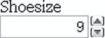

# 六、为 Web 应用铺平道路

为了确保我们都唱同一首赞美诗，让我们从定义一个 web 应用开始。广义地说， *web 应用*是通过网络访问的应用，通常是互联网或内联网。Web 应用通常是用服务器端技术构建的(比如。NET、PHP、Python 或 Rails)并使用 HTML、CSS 和 JavaScript 在浏览器中呈现应用。

在过去的几年里，网络应用的数量急剧上升。毫无疑问，这部分归功于 Ajax 的引入。当杰西·詹姆斯·加勒特在 2005 年创造了短语 *Ajax* 时，我们已经有了 JavaScript 和 XML，以及微软的 XMLHttpRequest(现在正式成为 HTML5 的一部分)。这似乎创造了一个转折点，现场网络应用的数量不可阻挡地上升。当然，Ajax 并不局限于应用；该技术也用于网站，使它们看起来、感觉起来和行为起来都像应用。

在这一章中，我们将带你了解 HTML5 规范中与 web 应用相关的一些开发和 API。我们将从 HTML5 表单和它们提供的新特性开始。接下来将简要介绍一些特定于 web 应用的元素，比如 HTML5 中引入的`menu`和`command`。最后，我们将介绍 HTML5 的 API，以及一些与术语“HTML5”相关的 API

### HTML5 表单

毫无疑问，你每天至少要与网络上的一种形式互动。无论您是在搜索内容还是登录您的电子邮件帐户或脸书页面，使用在线表单都是在 Web 上执行的最常见的任务之一。作为设计者和开发者，创建表单有一定的单调感，尤其是为它们编写验证脚本。HTML5 为我们的标记工具包引入了许多新的属性、输入类型和其他元素。

正如您将看到的，这些新功能将大大简化我们的生活，同时提供令人愉快的用户体验。这一切中最棒的是什么？你现在可以开始使用它们了。

#### html 5 表单的历史

HTML5 的 forms 部分最初是一个名为 Web Forms 2.0 ( `[`j.mp/web-forms`](http://j.mp/web-forms)1`)的规范，为表单添加了新类型的控件。它由 Opera 创建，由当时的 Opera 雇员伊恩·希克森编辑，于 2005 年初提交给 W3C。这项工作最初是在 W3C 下进行的。然后，它与 Web 应用 1.0 规范相结合，创建了分离的 Web 超文本应用技术工作组(WHATWG) HTML5 规范的基础。

##### 使用 HTML5 设计原则

HTML5 表单最好的一点是，您现在几乎可以使用所有这些新的输入类型和属性。他们甚至不需要任何刀，黑客，或变通办法。这并不是说它们现在都被“支持”,但是它们在支持它们的现代浏览器中确实很酷——并且在不理解它们的浏览器中优雅地降级。

为此，我们必须感谢 HTML5 的设计原则(`[`j.mp/designprinciples`](http://j.mp/designprinciples)3`)，你在第一章中学到了这些。在这种情况下，我们具体指的是优雅退化的原则。本质上，这意味着现在没有理由不使用这些特性。事实上，这意味着你走在了潮流的前面。

#### HTML5 表单属性

本节涵盖了我们可以添加到表单中并从今天开始使用的几个新属性。它们不仅会改善你的用户体验，还会让你不必编写大量的 JavaScript。准备好了吗？那我们开始吧。

##### 占位符

首先是`placeholder`属性，它允许我们像当前在 HTML4 中使用`value`属性一样设置占位符文本。它应该只用于简短的描述。对于更长的时间，使用`title`属性。与 HTML4 的不同之处在于，只有当字段为空并且没有获得焦点时，才会显示文本。一旦字段获得焦点(例如，您单击或切换到字段)，并且您开始键入，文本就会消失。它非常类似于你在 Safari 中看到的搜索框(见图 6-1 )。

__________

1

2

3

**图 6-1。**Safari 中没有焦点和有焦点的浏览器搜索框

让我们看看如何实现`placeholder`属性。

`<input type="text" name="user-name" id="user-name" placeholder="at least 3 characters">`

就这样！我们可以听到你在想，“这有什么了不起的？我已经用 JavaScript 做了很多年了。”是的，确实如此。然而，对于 HTML5，它是浏览器的一部分，这意味着更容易访问的跨浏览器解决方案需要更少的脚本(即使 JavaScript 被禁用)。图 6-2 显示了在 Chrome 中工作的`placeholder`属性。

**图 6-2。**Chrome 中的占位符属性支持，非聚焦和聚焦

不支持`placeholder`属性的浏览器会忽略它，所以它不会渲染。但是，通过包含它，您为那些拥有浏览器支持的用户提供了增强的用户体验，并且您的站点是“面向未来的”(我们将在本章稍后讨论检查支持)。所有现代浏览器都支持`placeholder`，它也将在 Internet Explorer 10 中得到支持。

*注意:没有官方的用于样式化`placeholder`文本的伪类，但是 Mozilla(Firefox 的开发者)和 WebKit 都为样式化`(-moz-placeholder`和`–webkit-input-placeholder`提供了厂商前缀属性。这使得假设伪类将成为样式化占位符文本的标准是安全的。关于进一步的细节，在 WHATWG 的邮件列表上有一个关于这个主题的帖子，在`[`j.mppseudoplaceholder`](http://j.mppseudoplaceholder)4`。*

##### 自（动）调焦装置

跟罐头上说的一模一样。将它添加到一个`input`中会在页面呈现时自动聚焦该字段。与`placeholder`一样，`autofocus`是我们过去使用 JavaScript 实现的。

然而，传统的 JavaScript 方法确实存在一些严重的可用性问题。例如，如果用户在脚本加载之前就开始完成表单，那么当脚本加载时，他们将(不和谐地)返回到第一个表单字段。HTML5 中的`autofocus`属性通过在文档加载时立即关注来解决这个问题，而不必等待 JavaScript 加载。然而，我们只建议将它用于唯一目的是表单的页面(如 Google ),以防止可用性问题。

__________

4

它是一个布尔属性(除非您正在编写 XHTML5 参见注释),实现如下:

`<input type="text" name="first-name" id="first-name" autofocus>`

所有现代浏览器都支持该属性，像`placeholder`一样，不支持`autofocus`属性的浏览器会忽略它。

*注意:几个新的 HTML5 表单属性是布尔属性。这只是意味着，如果它们存在，它们就被设置，如果它们不存在，它们就不被设置。在 HTML5 中，它们可以用几种方式编写。*

`*autofocus*
*autofocus=""*
*autofocus="autofocus"*`

*但是，如果你写的是 XHTML5，就不得不用`autofocus="autofocus"`风格了。*

##### 自动完成

属性帮助用户根据之前的输入完成表单。该属性从 IE5.5 开始就存在了，但最终被标准化为 HTML5 的一部分。默认状态设置为`on`。这意味着通常我们不需要使用它。但是，如果您希望每次完成一个表单时都输入一个表单域(而不是让浏览器自动填充该域)，您可以这样实现它:

`<input type="text" name="tracking-code" id="tracking-code" autocomplete="off">`

字段上的`autocomplete`状态会覆盖包含`form`元素的任何`autocomplete`状态。

##### 需要

`required`属性不需要过多介绍；像`autofocus`一样，它做的正是你所期望的。通过将它添加到表单字段，浏览器要求用户在提交表单之前在该字段中输入数据。这取代了目前用 JavaScript 实现的基本表单验证，使事情变得更有用，并节省了我们更多的开发时间。`required`是布尔属性，像`autofocus`。让我们看看它的实际效果。

`<input type="text" id="given-name" name="given-name" required>`

`required`目前只在 Opera 9.5+，Firefox 4+，Safari 5+，Chrome 5+中实现，所以暂时你需要继续写一个脚本来检查在其他浏览器中的客户端完成字段(*cough* IE！).Internet Explorer 10 将支持`required`。Opera、Chrome 和 Firefox 在提交表单时向用户显示一条错误消息(见图 6-3 )。在大多数浏览器中，错误会根据声明的语言进行本地化。Safari 不会在提交时显示错误信息，而是将焦点放在该字段上。

**图 6-3。**具有必填属性的表单字段在 Opera 中显示浏览器生成的错误消息

“必需的”错误消息的默认呈现取决于各个浏览器；目前，错误信息气泡不能在所有浏览器中用 CSS 样式化。然而，Chrome 确实有一个专有属性，你可以用它来设计错误气泡。彼得·加斯顿写了一篇关于语法的文章。您也可以使用`:required`伪类(`[`j.mp/pseudoforms`](http://j.mp/pseudoforms)6`)来设计`input`(参见第七章了解更多关于伪类的信息)。另一种方法是使用 JavaScript 中的`setCustomValidity()`方法覆盖措辞和样式。重要的是，不要忘记这种浏览器验证也不能代替服务器上的验证。

##### 模式

`pattern`属性可能会让许多开发人员非常兴奋(嗯，就像你对表单属性一样兴奋)。它为要检查的字段值指定了一个 JavaScript 正则表达式。`pattern`便于我们对产品代码、发票号等实现特定验证。`pattern`的可能性非常广泛，这只是一个使用产品编号的简单例子。

`<label> Product Number:
<input pattern="[0-9][A-Z]{3}" name="product" type="text" title="Single digit followed by
three uppercase letters."/>
</label>`

这种模式规定产品编号应该是一个数字[0-9]，后跟三个大写字母[A-Z]{3}。对于更多的例子，HTML5 模式网站(`[`j.mp/html5p`](http://j.mp/html5p)7`)列出了常见的正则表达式样式模式来帮助您入门。

和`required`一样，Opera 9.5+、Firefox 4+、Safari 5+、Chrome 5+是目前唯一支持`pattern`的浏览器。Internet Explorer 10 将支持`pattern`。然而，随着浏览器市场快速发展，其他公司将很快赶上。

__________

5

6

7 `[`html5pattern.com`](http://html5pattern.com)`

*正则表达式(regex 或 regexp)提供了一种将输入的文本字符串匹配到特定模式的方法。正则表达式可能用于检查产品或邮政编码的特定格式。它们可以与许多编程语言一起使用，其中一些语言(Perl、Ruby)将它们内置到了语法中。Regex 是`pattern`属性的来源。*

##### 列表和 datalist 元素

`list`属性使用户能够将选项列表与特定字段相关联。属性的值必须与同一文档中的`datalist`元素的 ID 相同。`datalist`元素是 HTML5 中的新增元素，代表表单控件的预定义选项列表。它的工作方式类似于浏览器中的搜索框，当你输入时自动完成(见图 6-4 )。

**图 6-4。**Safari 中的谷歌搜索自动建议

下面的例子展示了`list`和`datalist`是如何组合的(参见图 6-5 ):

`<label>Your favorite fruit:
<datalist id="fruits">
    <option value="Blackberry">Blackberry</option>
    <option value="Blackcurrant">Blackcurrant</option>
    <option value="Blueberry">Blueberry</option>
    <!-- … -->
  </datalist>
If other, please specify:
<input type="text" name="fruit" list="fruits">
</label>`

通过在`datalist`中添加一个`select`元素，你可以提供比简单使用一个`option`元素更好的优雅降级。这是一个由 Jeremy Keith ( `[`j.mp/datalistpattern`](http://j.mp/datalistpattern)8`)设计的优雅的标记模式，它完全符合 HTML5 的优雅降级原则。

`<label>Your favorite fruit:
<datalist id="fruits">
  <select name="fruits">
    <option value="Blackberry">Blackberry</option>
    <option value="Blackcurrant">Blackcurrant</option>
    <option value="Blueberry">Blueberry</option>
    <!-- … -->
  </select>
If other, please specify:  
</datalist>
<input type="text" name="fruit" list="fruits">
</label>`

浏览器对`list`和`datalist`的支持目前仅限于 Opera 9.5+(见图 6-5 )和 Firefox 5+。Internet Explorer 10 将支持`list`属性和`datalist`。

**图 6-5。**Opera 中呈现的 datalist 元素

##### 多个的

我们可以通过应用布尔属性`multiple`让`list`和`datalist`更进一步，允许从`datalist`输入多个值。这里有一个例子。

`<label>Your favorite fruit:
<datalist id="fruits">
  <select name="fruits">
  <option value="Blackberry">Blackberry</option>
  <option value="Blackcurrant">Blackcurrant</option>
  <option value="Blueberry">Blueberry</option>
  <!-- … -->
  </select>
If other, please specify:
</datalist>
<input type="text" name="fruit" list="fruits" **multiple**>
</label>`

然而,`multiple`并不只是和`datalist`一起使用。`multiple`的另一个例子可能是向朋友发送项目或文件附件时的电子邮件地址，如下所示:

__________

8

`<label>Upload files:
<input type="file" multiple name="upload"></label>`

`multiple`在 Firefox 3.6+、Safari 4+、Opera 11.5+和 Chrome 4+中受支持。Internet Explorer 10 也将支持它。

##### novalidate 和 formnovalidate

`novalidate`和`formnovalidate`属性表示表单在提交时不应该被验证。它们都是布尔属性。`formnovalidate`可用于`submit`或`image`输入类型。只能在`form`元素上设置`novalidate`属性。

`formnovalidate`属性的一个用例是“保存草稿”按钮，其中表单有提交草稿所需的字段，但保存草稿并不需要。如果您不想验证表单，但又想利用新输入类型提供的更有用的用户界面增强功能，我们将在本章的后面看到。

以下示例显示了如何使用`formnovalidate`:

`<form action="process.php">
  <label for="email">Email:</label>
  <input type="text" name="email" value="gordo@example.com">
  <input type="submit" formnovalidate value="Submit">
</form>`

这个例子展示了如何使用`novalidate`:

`<form action="process.php" novalidate>
<label for="email">Email:</label>
  <input type="text" name="email" value="gordo@example.com">
  <input type="submit" value="Submit">
</form>`

##### 形式

`form`属性用于将`input`、`select`或`textarea`元素与表单(被称为其*表单所有者*)相关联。使用`form`意味着元素不需要是关联形式的子元素，并且可以在源中远离它。这方面的主要用例是，放置在表格中的输入按钮现在可以与表单相关联。

`<input type="button" name="sort-l-h" form="sort">`

##### formaction、formenctype、formmethod 和 formtarget

`formaction`、`formenctype`、`formmethod`和`formtarget`属性在`form`元素上都有相应的属性，这在 HTML4 中是很熟悉的，所以让我们简单地浏览一下它们。引入这些新属性主要是因为您可能需要不同提交按钮的替代操作，而不是在一个文档中有几个表单。

###### 形成动作

`formaction`指定将提交表单的文件或应用。它与`form`元素上的`action`属性具有相同的效果，并且只能与提交或图像按钮(`type="submit"`或`type="image"`)一起使用。当提交表单时，浏览器首先检查一个`formaction`属性；如果不存在，它继续在表单上寻找一个`action`属性。

`<input type="submit" value="Submit" formaction="process.php">`

###### 表单 enctype

`formenctype`详细说明如何使用 POST 方法类型对表单数据进行编码。它与`form`元素上的`enctype`属性具有相同的效果，并且只能与提交或图像按钮(`type="submit"`或`type="image"`)一起使用。如果不包括，默认值为`application/x-www-form-urlencoded`。

`<input type="submit" value="Submit" formenctype="application/x-www-form-urlencoded">`

###### 形法

`formmethod`指定将使用哪种 HTTP 方法(GET、POST、PUT、DELETE)来提交表单数据。它与`form`元素上的`method`属性具有相同的效果，并且只能与提交或图像按钮(`type="submit"`或`type="image"`)一起使用。

`<input type="submit" value="Submit" formmethod="POST">`

###### 表单目标

`formtarget`指定表单结果的目标窗口。它与`form`元素上的`target`属性具有相同的效果，并且只能与提交或图像按钮(`type="submit"`或`type="image"`)一起使用。

`<input type="submit" value="Submit" formtarget="_self">`

##### 表单属性摘要

我们已经研究了几个新的表单属性，它们有助于改善用户体验并节省开发时间。还有更多的新属性需要讨论，但是我们将在下一节把它们和 HTML5 的新输入类型一起介绍。

#### 新的输入类型

HTML5 介绍的不下一个面包师的一打(对，就是 13！)表单的新输入类型。我们将简要地看一下它们，并解释为什么您现在应该使用它们*。这些新的输入类型有双重好处:使用它们意味着更少的开发时间和更好的用户体验。我们将看到的新输入类型有*

 **   `search`
*   `email`
*   `url`
*   `tel`
*   `number`
*   `range`
*   `date`
*   `month`
*   `week`
*   `time`
*   `datetime`
*   `datetime-local`
*   `color`

##### 搜索

搜索似乎是我们进军 HTML5 输入类型的合适起点。当我们谈论搜索时，我们不仅仅是在谈论谷歌、必应或雅虎。我们谈论的是你刚刚购买的电子商务网站、维基百科、甚至你的个人博客上的搜索领域。这可能是每天在 Web 上执行的最常见的操作，但是它并没有在语义上很好地标记出来，不是吗？我们都倾向于写这样的东西:

`<input type="text" name="search">`

嗯，如果我们可以写一些像…

`<input type="search" name="search">`

有了 HTML5，我们可以。感觉好多了，不是吗？桌面浏览器会以类似于标准文本字段的方式呈现这些内容，直到你开始输入。此时，字段右侧会出现一个小十字。注意图 6-6 中的 x。这让我们可以快速清除字段，就像 Safari 的内置搜索字段一样。

**图 6-6。【Windows 版 Safari 中显示的 type="search "**

然而，在移动设备上，事情开始变得有趣起来。以图 6-7 中的 iPhone 为例。当你使用`type="search"`关注一个输入时，注意键盘，特别是键盘上的动作按钮(右下角)。你有没有注意到上面写的是“搜索”而不是常规的“开始”？这是一个细微的差别，大多数用户甚至不会注意到，但那些注意到的用户会苦笑一下。

**图 6-7。**iPhone 上的 type="search "

正如我们看到的新属性，不理解它们的浏览器只会优雅地降级。这同样适用于这里讨论的所有新输入类型。如果一个浏览器不理解`type="search"`，就会默认为`type="text"`。这意味着你不会失去任何东西。事实上，您正在使用渐进式增强，并帮助用户获得增强的体验。让我们面对现实:填写 web 表单并不有趣，所以我们可以添加任何东西来确保更流畅的体验，这越好。

##### 电子邮件

在呈现方面，`email`输入类型与标准文本输入类型没有什么不同，并且允许输入一个或多个电子邮件地址。结合`required`属性，浏览器就能够寻找模式来确保输入了有效的电子邮件地址。当然，这种检查是基本的，可能是寻找@字符或句点(。)并且不允许空格。Opera 9.5+、Firefox 4+和 Chrome 5+已经实现了这一基本验证，IE 10 将提供支持。如果输入的电子邮件地址无效，浏览器甚至会向用户显示一条错误消息(参见 Opera 图 6-8 )。您可以使用`:valid`、`:invalid`或`:required`伪类(假设您在`input`上有`required`属性)来设置输入值时的字段样式。

`<input type="email" name="email" required>`

*注:关于使用伪类设计表单的更多信息，“CSS 忍者”Ryan Seddon 在 9 at `[`j.mp/alaninja`](http://j.mp/alaninja)`上做了一个很棒的演示。*

**图 6-8。** Opera 电子邮件地址错误消息

*注意:规范详细说明了允许一个或多个电子邮件地址。这意味着`multiple`属性也可以和`type="email"`一起使用。*

很酷吧。这再次强调了 HTML5 表单如何帮助减少我们在执行表单验证时必须编写的 JavaScript 代码量。不过，总会有陷阱的，对吧？在撰写本文时，`type="email"`有一个国际化问题。当它与双字节国际化域名一起使用时，浏览器会使它们无效；所以这个例子

`<input type="email" name="email" value="gordo@.jp">`

在 Firefox、Safari 或 Chrome 中无效(在 Opera 中没有这个问题)。然而，Kyle Barrow ( `[`j.mp/emaili18n`](http://j.mp/emaili18n)10`)创建了一个变通方法，它将`type="text"`与我们前面遇到的`pattern`属性结合使用，如下所示:

`<input type="text" name="email" value="gordo@.jp" pattern="[^ @]*@[^ @]*">`

另一个解决方案是在提交按钮上继续使用带有`formnovalidate`属性的`type="email"`，如下所示。这确保了表单提交时不会执行任何验证，这可能适合也可能不适合您的需求。

`<form action="process.php">
<label for="email">Email:</label>
<input type="email" name="email" value="gordo@.jp">
<input type="submit" formnovalidate value="Submit">`

或者您可以在表单上使用`novalidate`属性，如下所示:

`<form action="process.php" novalidate> <label for="email">Email:</label>
<input type="email" name="email" value="gordo@.jp">
<input type="submit" value="Submit">`

__________

9

10

撇开国际化问题不谈，还记得我们说过 HTML5 的输入类型有双重好处吗——更少的开发时间和更好的用户体验？让我们回过头来再看一眼 iPhone，如图图 6-9 所示。

**图 6-9。**iPhone 在使用 type="email "时显示自定义键盘。

这次你注意到了吗？没有吗？再看键盘。没错，键盘不一样。有专用于@和的键。字符来帮助您更有效地填写字段。正如我们与`type="search"`讨论的那样，现在使用`type="email"`没有任何负面影响。如果一个浏览器不支持它，它将退化到`type="text"`。在一些浏览器中，用户会得到帮助。

##### 全球资源定位器(Uniform Resource Locator)

如您所料，`url`输入类型是用于网址的。您可以使用`multiple`属性输入多个 URL。像`type="email"`一样，浏览器会对这些字段进行简单的验证，并在表单提交时显示一条错误消息。这可能包括查找正斜杠、句点和空格，并可能检测有效的顶级域名(如。com 或. co.uk)。像这样使用`url`输入类型:

`<input type="url" name="url" required>`

*目前有一些关于用户是否必须使用`input="url"`将`http://`输入字段的争论。浏览器供应商正在讨论在表单提交后进行检查后，预先挂起对 URL 的`http://`的可能性。有关最新信息，请参考 HTML5 规范。*

再次，我们来看看 iPhone 如何渲染`type="url"`。正如你在图 6-10 中看到的，它再次更新了屏幕键盘，通过将默认的空格键替换为句点、正斜杠和。通讯键。(访问更多结尾，如。org 和。net，点击并按住。com 键。)

**图 6-10。** type="url "激活 iPhone 上的 url 专用键盘。

##### 电话

`tel`与`email`和`url`的不同之处在于它没有强制使用特定的语法。世界各地的电话号码各不相同，这使得很难保证任何类型的特定符号，除了只允许输入数字和一个+符号。您可以使用客户端验证来验证特定的电话号码(如果您能保证格式的话)。`type="tel"`标记如下:

`<input type="tel" name="tel" id="tel" required>`

iPhone 又一次识别了`type="tel"`，只是这次它更进一步，将键盘完全改成了标准的手机键盘，如图图 6-11 左图所示。除了 iPhone，一些 Android 设备(比如 HTC Desire，如图图 6-11 右侧所示)也为`type="tel"`显示了数字键盘。很方便，你不觉得吗？用于输入电话号码的漂亮的大按键可以帮助你快速完成那个又大又讨厌的表格。

**图 6-11。**iPhone 和一些 Android 设备上的 type="tel "会动态地将键盘更改为数字小键盘。(斯图尔特·朗里奇提供的安卓截图)

##### 数字

如你所料，number 用于指定一个数值。和大多数这些新的输入类型一样，Opera 是第一个实现`type="number"`的。It、Safari 和 Chrome 将`input`呈现为一个 spinbox 控件(见图 6-12 ，你可以点击箭头上下移动。或者，如果您愿意，可以直接在字段中键入。另一方面，Firefox 将字段呈现为标准的文本框。对`type="number"`的支持也将出现在 IE 10 中。

**图 6-12。**歌剧中的 type="number "

使用附加属性`min`、`max`和`step`，我们可以更改这个 spinbox 控件的默认步长值，以及设置最小值、最大值和起始值(使用标准的 HTML `value`属性)。此示例显示了这些属性的工作原理:

`<input type="number" min="5" max="18" step="0.5" value="9" name="shoe-size" >`

在本例中，`min`表示该字段将接受的最小值，`max`表示最大值。如果我们达到最大值或最小值，spinbox 控件上相应的箭头将变灰，这样您就不能再与之交互。`step`是数值应该上下调整的增量，默认步长值为`1`。这意味着我们可以包括负值或以 0.5 或 5 的增量增加。`value`是你在以前的 HTML 版本中习惯的属性吗？每个属性都是可选的，如果不使用它们，就会设置默认值。

与 Opera 的实现相反，iPhone(如图 6-13 左侧所示)和一些 Android 设备(如 HTC Desire，如图 6-13 右侧所示)只是将字段呈现为标准文本框，但优化了键盘以方便输入。

**图 6-13。**type = iPhone 和 Android HTC Desire 上的数字(Android 截图由 Stuart Langridge 提供)

为了让 iPhone 使用标准的电话键盘，就像我们在`type="tel"`中看到的那样，CSS Tricks 的 Chris Coyier 设计了一个你可以使用的小恶作剧。与其使用`type="number`，不如使用标准的`type="text"`输入，并添加一个只接受数字的模式属性，如下所示。这个解决方案并不理想，但是如果你认为它可能有用，Chris 已经制作了一个视频短片展示它的实际应用(`[`j.mp/numbertrick`](http://j.mp/numbertrick)11`)。

`<input type="text" pattern="[0-9]*" name="shoe-size">`

随着`inputmode`属性的引入，Chris 的技术可能会很快变得非常完善。最近添加到规范中的属性将允许用户指定对用户最有用的输入机制的类型。实现后，您将能够在数字、拉丁文、电子邮件或假名输入模式之间进行选择。

##### 范围

`range`输入类型与`number`相似，但更具体。它表示给定范围内的数值。为什么不同，我听到你哭了？因为当你使用`range`时，确切的值并不重要。它还允许浏览器提供比`number`更简单的控制。在 Opera、Safari 和 Chrome 中，`type="range"`呈现为滑块(参见图 6-14 )。此外，在 Opera 中，如果 CSS 定义的高度大于宽度，滑块控件将垂直呈现，而不是标准的水平呈现。

*注意:对于不支持`type="range"`的浏览器，Remy Sharp 已经创建了一个 JavaScript polyfill 来填补空白。你可以在他的博客(`[`j.mp/rangepolyfill`](http://j.mp/rangepolyfill)12`)上了解更多。*

下面的代码显示了我们如何通过设置`min`和`max`属性在 1 到 100 的范围内标记我们的技能水平(参见图 6-14 )。我们还可以使用`value`属性设置`range`的起点。

`<input id="skill" type="range" min="1" max="100" value="0">` 

**图 6-14。**类型=铬合金范围

##### 日期和时间

如果你曾经在网上订票，你会遇到日期选择器来帮助你快速方便地选择你需要的日期。也许你已经在自己的网站上实现了日期选择器。一般来说，这是使用 JavaScript 库完成的，比如 jQuery、Dojo 或 YUI。当您需要加载整个库和相关插件来实现一个简单的日期选择器时，这可能是一件痛苦的事情。嗯，有了 HTML5，我们将这种功能融入到浏览器中。不仅如此，我们不必仅仅停留在选择一个日期上；我们可以使用不同的输入类型选择周、月、时间、日期和时间，甚至是带时区的日期和时间。标记非常简单。

`<input id="dob" name="dob" type="date">`

__________

11

12

您可以进一步使用`min`和`max`属性来确保用户只能从指定的日期范围内进行选择。

`<input id="startdate" name="startdate" min="2012-01-01" max="2013-01-01" type="date">`

与许多其他表单实现一样，Opera 引领了潮流。接下来让我们看看浏览器是如何呈现这些输入类型的。

*你可能已经注意到 HTML5 中没有定义`type="year"`输入类型。原因是缺乏相关的用例。已经提出的一年输入类型的所有用例都可以使用`type="number"`来实现。*

###### 日期

图 6-15 显示了 Opera 10.5 对`type="date"`的渲染。

**图 6-15。**type = Opera 10.5 中的日期

这些日期选择器并不局限于桌面设备；一些黑莓设备和 Chrome for Android 在与`type="date"`一起使用时会渲染其内部日期选择器(参见图 6-16 )。

**图 6-16。**黑莓手机上的 type=date(截图由特伦斯·伊登提供)

###### 月

接下来，图 6-17 显示了`type="month"`，例如，它可能被用来表示信用卡的有效期。

`<input id="expiry" name="expiry" type="month" required>` 

**图 6-17。**类型= Opera 10.5 中的月份

###### 周

也可以下钻到`type="week"`。注意 Opera 是如何使用相同的日期选择器控件突出显示特定的一周的，如图 6-18 所示。

`<input id="vacation" name="vacation" type="week">` 

**图 6-18。**歌剧中的类型=周 10.5

###### 时间

你可以在图 6-19 中看到`type="time"`呈现了一个类似于之前用来选择精确时间的旋转框。

`<input id="exit-time" name="exit-time" type="time">` 

**图 6-19。**type = Opera 10.5 中的时间

###### 日期时间

我们可以通过使用`type="datetime"`指定给定日期的精确时间来组合日期和时间，如图图 6-20 所示。

`<input id="entry-day-time" name="entry-day-time" type="datetime">` 

**图 6-20。**Opera 10.5 中的 type=datetime

###### 日期时间-本地

最后，图 6-21 显示了我们可以通过使用`type="datetime-local"`选择给定日期的精确时间和当地时区的变化来实现更精细的控制。

`<input id="arrival-time" name="arrival-time " type="datetime-local">` 

**图 6-21。**Opera 10.5 中的 type=datetime-local

**日期和时间说明**

这些实现有两个注意事项。首先，在当前的实现中，不可能在字段中键入日期(在所有浏览器中)。不过，日期选择器可以通过键盘操作。然而，我们可以预见一个潜在的问题；如果在一个数据输入员经常完成的表单上实现，他们可能会比使用键盘或日期选择器更快地输入日期。其次，不可能设计日期选择器的外观。我们倾向于认为这是一件好事，因为用户将在他们访问的所有网站上获得共同的体验(假设他们一直使用同一个浏览器)。然而，毫无疑问，公司将需要一个品牌日期选择器。Safari 5 和 Chrome 5 已经实现了这些输入类型，但不幸的是，它们对用户并不友好。日期必须以与我们在第四章的中遇到的`time`元素相同的格式输入。因此，对于日期，格式应该是 YYYY-MM-DD，对于带有时间的日期，用户必须输入 YYYY-MM-DDT00:00Z，这一点也不友好。

与其他新的输入类型一样，如果浏览器不能识别它们，它将简单地默认返回到`type="text"`并让用户继续使用您的 JavaScript 日期选择器。

##### 颜色

`color`输入类型非常简单明了:它允许用户选择一种颜色并返回该颜色的十六进制值。预计用户既可以键入值，也可以从颜色选择器中进行选择，颜色选择器可以是操作系统自带的，也可以是浏览器自己的实现。Opera 11 已经用一个简单的颜色选择器实现了`type="color"`，它提供了许多标准的颜色选择或者选择其他的选项，这带来了操作系统颜色选择器(显示在图 6-22 的右边)。

`<input id="color" name="color" type="color">` 

**图 6-22。**左边是 Opera 中的 type="color ",右边是点击其他的结果

相比之下，某些黑莓设备已经实现了呈现颜色选择器的`color`输入类型，如图图 6-23 所示。

**图 6-23。**黑莓手机上的 type=color(截图由特伦斯·伊登提供)

##### 输入类型摘要

通过使用 HTML5 的新表单输入类型*现在*，我们可以增强用户体验，使我们的网站经得起未来考验，并使我们作为开发人员的生活更加轻松。显然，我们不能让不支持所有这些新特性的浏览器一直悬而未决，所以在下一节中，我们将看看如何使用 JavaScript 来检测对这些表单特性的支持。

#### 验证和如何提供回退

在这一章中，我们介绍了新的属性和输入类型，但是我们没有讨论验证或者如何为这些增加提供合适的支持。这就是我们在这一部分要关注的。

##### 客户端和服务器端验证的区别

在我们继续之前，我们需要快速了解一下客户端和服务器端验证之间的区别。这两种技术应该相互补充，为用户提供无缝的体验，同时帮助您(开发人员)获得高质量的表单提交，其中包含您所希望的准确数据。

使用 JavaScript 在客户端验证表单域可以节省时间和带宽。它还有助于向用户显示他们可能在哪里输入了不正确或格式错误的字段。它在表单提交时(或者有时在表单完成时，一种称为内嵌验证的方法)在浏览器中运行，并允许您指导用户处理出现的错误。自然，这使得用户的处理速度更快，因为如果输入了无效数据，就不需要往返服务器。

另一方面，服务器端验证更安全，它检查提交的数据以确保其正确性。这有助于防止恶意用户绕过您的客户端验证，向服务器提交具有潜在危险的数据(例如，为攻击您的站点而定制的脚本)。在服务器端验证还有助于兼容性，以确保表单错误仍然可以显示给没有启用 JavaScript 的用户。

为了回答“我应该使用哪种类型的验证？”答案几乎总是“都有”。在这种情况下使用 HTML5 表单属性和输入类型的优点是，我们现在必须编写的客户端 JavaScript 的大部分将是浏览器本机的，并且不能通过关闭 JavaScript 来绕过。您仍然需要服务器端验证，但是您在前端节省的时间将使您有时间专注于您的站点和应用的其他令人兴奋的附加功能。

##### 浏览器错误处理和处理

正如我们在`required`属性以及`email`和`url`输入类型中看到的，使用 HTML5 表单的一个主要优点是浏览器可以为我们完成一些繁重的工作。这意味着浏览器可以执行基本的错误处理，而不需要大量额外的 JavaScript 或正则表达式来执行简单的任务。

我们还看到，这些特性中的一些并不能在所有的浏览器中工作(下一节将详细介绍支持)，而是在不影响用户体验的情况下被跳过，或者在不理解的情况下默认返回到`type="text"`。那么，我们如何检查一个特性是否受支持，以及如何检测这种支持呢？为此，我们需要使用 JavaScript 检测。

##### 使用 JavaScript 进行特征检测

使用 Mark Pilgrim 的检测技术(`[`j.mp/pilgrimdetect`](http://j.mp/pilgrimdetect)13`)作为基础，我们可以使用 JavaScript 以几种不同的方式检测对特定特性的“支持”。

1.  检查像`window`这样的全局对象上是否存在属性。
2.  创建一个元素并测试它是否有属性。
3.  创建一个元素，测试该元素上是否存在方法，然后调用该方法测试它返回的值。
4.  创建一个元素，将一个属性设置为一个值，并检查保留的值。

由于我们对支持哪些输入类型特别感兴趣，我们将使用检测技术#4 来测试是否支持`input type="email"`。

`var input = document.createElement('input');
input.setAttribute('type','email');
return input.type !== 'text';`

这段 JavaScript 告诉浏览器创建一个`input`元素，并将`type`属性设置为您正在检测支持的元素(在本例中为 email)。对于支持输入类型的浏览器，该值将被保留。对于那些没有，我们设置的值将被忽略，`type`属性将默认为“文本”。

您可以继续编写前面的函数 13 次，以检测每种新的 HTML5 表单`input`类型。然而，为了让您的生活更轻松，我们建议您研究一个名为 Modernizr ( `[`j.mp/modernizr`](http://j.mp/modernizr)14`)的便利工具，我们在第二章中简要介绍了它，您将在下一章中更详细地了解它。Modernizr 检测对所有 13 种输入类型的支持，并为每种类型返回一个值 true 或 false。然后，您可以使用另一种方法来为您想要实现的效果提供合适的退路。

__________

13

14

`*   // if placeholder isn't supported:*
    if (!Modernizr.input.placeholder){
      *// provide a fallback with a hint script*
      setInputHint(document.getElementById('user-name'),at least 3 characters');
    }`

为了检测对我们讨论过的一些新属性的支持，我们将使用检测技术#2。下面是它对`placeholder`属性的工作原理:

`function support_placeholder () {
var input = document.createElement('input');
return 'placeholder' in input;`

如果您的浏览器不支持`placeholder`属性，您可以使用 JavaScript 编写一个可以在焦点上清除的`value`。

如您所见，我们必须运行检查来检测跨浏览器的 HTML5 表单功能的支持是非常简单的。如果您将这些功能构建到您的开发工具包中，那么您现在就可以开始使用这些新特性了。

##### 表单聚合填充

Modernizr 不会自动添加对那些缺失特性的支持，所以您需要使用另一种技术。对于不支持某些属性或输入类型的浏览器(见下一节)，有许多聚合填充可以帮助填补这些空白。如果您查看 HTML5 跨浏览器 Polyfills 页面(`[`j.mp/h5fills`](http://j.mp/h5fills)15`)的“Web Forms”部分，您会发现许多脚本可以帮助您在不支持的浏览器中模仿本机支持。

#### 当前浏览器支持

我们已经在整章中暗示了哪些浏览器支持 HTML5 表单。表 6-1 和表 6-2 分别显示了新属性和输入类型的当前状态。如你所见，Opera 和 Chrome 在支持方面领先。事实上，Opera 从 9.5 版本开始就有了几乎完整的 HTML5 表单实现。

随着新版本浏览器的发布速度越来越快，很难跟上支持或不支持的版本。如果你想持续关注目前的进展，我们建议访问 When I can use…(`[`j.mp/caniuse`](http://j.mp/caniuse)16`)或 findmebip(`[`j.mp/findmebyip`](http://j.mp/findmebyip)`)17)或 Wufoo 的 HTML5 forms research ( `[`j.mp/wufooh5`](http://j.mp/wufooh5)18`)。

__________

15

16

17 `[`findmebyip.com/litmus/#target-selector`](http://findmebyip.com/litmus/#target-selector)`

18

除了这些网站，兼容性表之王 Peter-Paul Koch (PPK)写了一篇优秀的文章，介绍了他对新输入类型和属性进行测试的结果(`[`j.mp/ppkinput`](http://j.mp/ppkinput)19`)。有些信息现在已经有点过时了(因为浏览器的用户界面已经改进了)，但是看看我们从哪里来，到我们现在在哪里，对你没有任何坏处。

__________

19

#### 行动中的形式

现在我们已经看到了 HTML5 表单的强大功能，让我们通过标记一些常见的在线表单来很好地利用我们所学的知识。我们将从查看登录表单开始，然后查看博客的评论表单。

图 6-24 显示了一个登录表单。看一下图片和下面的 HTML 4 标记，然后看看是否可以根据您所学的知识在 HTML5 中标记表单。

**图 6-24。**Safari 中常见的登录表单

`<form id="app-login" action="process.php">
<fieldset>
<legend>Login Details</legend>

  <label>Username:
  <input name="user-name" type="text" value="Your username is your email address" onfocus=
"if (!this.reset) { this.value = ''; this.reset = true }">
  </label>

  <label>Password:
  <input name="password" type="password" value="Your username is your email address"
 onfocus="if (!this.reset) { this.value = ''; this.reset = true }">
  </label>

  <input name="login" type="submit" value="Login">
</label>

</fieldset>
</form>`

你做得怎么样？下面是我们如何在 HTML5 中标记它，利用了`email`输入类型以及`placeholder`、`required`和`autofocus`属性:

`<form id="app-login" action="process.php">
<fieldset>
<legend>Login Details</legend>

  <label>Username:
  <input name="user-name" type="email" placeholder="Your username is your email address"
 required autofocus>
  </label>

  <label>Password:
  <input name="password" type="password" placeholder="6 digits, numbers & letters" required>
  </label>

` `  <input name="login" type="submit" value="Login">
</label>

</fieldset>
</form>`

我们现在来看看博客的评论表格，如图 6-25 所示。看一下图片和下面的 HTML 4 标记，看看是否可以根据本章前面所学的内容在 HTML5 中标记表单。

**图 6-25。**Safari 中的基本评论表单

`<form id="respond" action="process.php">
<fieldset>
<legend>Leave a comment</legend>

  <label>Name:
  <input name="name" type="text" value="Your name" onfocus="if (!this.reset) { this.value =
 ''; this.reset = true }">
  </label>

  <label>Email:
  <input name="email" type="text" value="Your email address" onfocus="if (!this.reset)
 { this.value = ''; this.reset = true }">
  </label>

` `

  <label>URL:
  <input name="url" type="text" value="Your website" onfocus="if (!this.reset)
 { this.value = ''; this.reset = true }">
  </label>

  <label>Your Comment:
  <textarea name="comment"></textarea>
  </label>

  <input name="submit" type="submit" value="Submit" formaction="comments.php">
</label>

</fieldset>
</form>`

你做得怎么样？下面是我们如何在 HTML5 中标记它，利用了`email`和`url`输入类型以及`placeholder`、`required`、`autofocus`和`formaction`属性:

`<form id="respond" action="process.php">
<fieldset>
<legend>Leave a comment</legend>

  <label>Name:
  <input name="name" type="text" placeholder="Your name" required autofocus>
  </label>

  <label>Email:
  <input name="email" type="email" placeholder="Your email address" required>
  </label>

  <label>URL:
  <input name="url" type="url" placeholder="Your website">
  </label>

  <label>Your Comment:
  <textarea name="comment"></textarea>
  </label>

  <input name="submit" type="submit" value="Submit" formaction="comments.php">
</label>

</fieldset></form>`

#### HTML5 表单 API

为了补充这些新的输入类型和属性，有许多新的对象、方法、事件和函数结合在一起，为 HTML5 表单创建了许多 API。我们无法在本书中一一介绍，但它们包括了一些函数，如用于处理`step`属性的`stepUp`和`stepDown`，将文本转换为数字的`valueAsNumber`函数(参见本章后面的`output`元素)和`ValidtyState`对象。关于这些 API 的更多信息，彼得·吕贝尔斯、布莱恩·艾伯斯和弗兰克·塞利姆的《专业 HTML5 编程 ( `[`j.mp/prohtml5`](http://j.mp/prohtml5)20`)的第七章值得一读。

#### HTML5 表单摘要

我们已经展示了许多新的表单属性和输入类型，并简要讨论了相关的 API。总的来说，使用它们的三个主要好处是改进用户界面和体验；在某些字段上限制用户输入；和自动的、浏览器内的表单域验证，不需要额外的脚本。如果这还不足以说服你去开始使用它们，我们不知道什么才是。

__________

20 `[www.prohtml5.com](http://www.prohtml5.com)`

### Web 应用

随着互联网连接速度的提高，我们奔向普遍的、无处不在的网络连接，显而易见，互联网不再是由相互链接的静态文档组成。我们现在经常在网上听音乐或看视频。像脸书和推特这样的服务如雨后春笋般涌现，带来了强大的 API，允许开发者构建他们自己的定制网络应用。

此外，在过去的几年里，我们已经看到越来越丰富的互联网应用(“网络应用”)在网上变得司空见惯。像 Gmail、Google Docs 和 Basecamp 这样的例子使我们能够从桌面转移到网上进行越来越多的工作。

正如我们在第一章中看到的，Opera、Mozilla 和苹果在 2004 年开始记录一个名为 *Web 应用 1.0* 的规范。他们预见到了 web 应用的崛起，并引入了许多新元素和 API 来帮助处理从文档到在线应用的巨大转变。

不幸的是，涵盖所有 API 的细节不在本书的范围之内。相反，我们将简要介绍 HTML5 和相关 API 中的一些新应用元素，并向您展示可以进一步研究的地方。

#### 网络应用元素简介

在这一部分中，我们将会看到九个元素，其中包括一个被重新定义的元素。它们在 HTML5 规范中被分类为表单元素或交互元素。

##### 表单元素

我们将从表单元素开始。

###### 数据列表

正如我们在本章前面看到的，`datalist`元素代表了表单控件的预定义选项列表。此处显示了一个代码示例:

`<label>Your favorite fruit:
<datalist id="fruits">
    <select name="fruits">
    <option value="Blackberry">Blackberry</option>
    <option value="Blackcurrant">Blackcurrant</option>
    <option value="Blueberry">Blueberry</option>
    <!-- … -->
  </select>
If other, please specify:
</datalist>
<input type="text" name="fruit" list="fruits">
</label>`

`datalist`已经在 Opera 9.5+(如图图 6-26 )、Firefox 4+和 Internet Explorer 10 中实现。

**图 6-26。**Opera 中呈现的 datalist 元素

新的输入类型并不是移动设备上用户体验增强的唯一项目；一些黑莓设备也实现了该功能，允许用户从可选项的下拉列表中进行选择。

###### 基根

由 Netscape 发明并由其他浏览器供应商(微软除外)重新设计的,`keygen`元素表示一个控件，用于生成一个公共-私有密钥对并从该密钥对提交公共密钥。提交表单时，会生成公钥和私钥。私钥存储在客户端，公钥发送到服务器。然后，安全服务器可以使用公钥来生成证书，使其更加安全，并防止您的网站被黑客攻击。这里有一个`keygen`的例子。

`<form action="process.php" method="post" enctype="multipart/form-data">
<keygen name="key">
<input type=submit value="Submit">
</form>`

###### 输出

`output`元素相当简单；它表示计算或用户操作的结果。使用`for`属性，在计算结果和进入计算的值之间创建一个关系。Opera 9.5+、Firefox 4+、Chrome、Safari 5+和 Internet Explorer 10 都支持`output`元素。以下示例(如图 6-27 所示)将两个输入值相加，产生输出。这由放置在`output`元素上的`oninput`事件触发，并由浏览器使用新的`valueAsNumber`函数处理——不需要复杂的脚本！有关更多信息，请参见作者理查德·克拉克对输出的详细描述(`[`j.mp/outputelement`](http://j.mp/outputelement)21`)。

`<form onsubmit="return false" oninput="o.value = a.valueAsNumber + b.valueAsNumber">
  <input name="a" id="a" type="number" step="any"> +
  <input name="b" id="b" type="number" step="any"> =
  <output name="o" for="a b"></output>
</form>` 

**图 6-27。**Opera 10.5 中 input type="range "的输出元素

__________

21

###### 进步

`progress`元素是不言自明的。它表示给定任务的完成进度。进度可以显示为不确定的(如果没有指定`value`属性),或者是一个从零到最大的数字，基于到目前为止已经完成的工作的百分比。使用 JavaScript 更新当前值，向用户显示进度的可视化表示(见图 6-28 )。Opera 11+、Firefox 6+和 Chrome 7+都支持`progress`元素。

**图 6-28。**Chrome 7 中进度元素完成了 60%

`
Percent Downloaded:
<progress id="p" max="100" value="0">0%</progress>

`

Mozilla 的开发人员 Mounir Lamouri 写了一篇详细的文章，介绍了如何使用伪类(有些带有供应商前缀)来设计`progress`元素的样式。这是一篇有趣且内容丰富的文章(`[`j.mp/stylingprogress`](http://j.mp/stylingprogress)22`)。

###### 米

不要与`progress`混淆，`meter`元素代表一个已知范围内的标量测量，或者一个分数值。这方面的例子有社交网络档案的完成百分比(见图 6-29 )或特定搜索结果的相关性。除非有已知的最大值，否则`meter`元素不应该用于任意值，如身高或体重。使用`high`、`low`、`max`和`min`属性，元素的颜色将根据当前值而改变。通常情况下，该值会在页面加载之前写入服务器端，但也可能是使用 JavaScript 更新该值的情况。Opera 11+和 Chrome 7+都支持`meter`元素。

**图 6-29。**镀铬仪表元件完成 40%

`
Your profile is 40% complete.
` `<meter min="0" max="100" value="40"></meter>`

__________

22

##### 互动元素

现在我们来看看交互元素。浏览器对这些元素的支持很少，所以我们建议您在实现它们时运行自己的测试。

###### 细节

`details`元素表示一个控件，如果需要，用户可以根据需要从该控件获得附加信息或控件。默认情况下，`details`中的信息是隐藏的，用户可以请求“打开”控件。应该注意的是，`details`元素不适合做脚注。`details`目前在 Chrome 中实现，不久将在 Opera 中支持。

因为`details`一般与`summary`成对出现，所以下一节给出代码示例。

###### 摘要

`summary`元素表示`summary`元素的父`details`元素内容的摘要、标题或图例，如果有的话。`summary`必须始终是`details`的第一个子元素，但是每个`details`元素可以使用多个`summary`元素。

`

Name & Extension:

<input type="text" name="fn" value="Space Cadet Handbook.pdf">

<label><input type="checkbox" name="ext" checked> Hide extension</label>

`

###### 命令

`command`元素表示用户可以调用的命令。`command`只有在作为`menu`的孩子使用时才显示，可以选择三种`type`属性使用:`radio`、`checkbox`或`command`。如果没有设置`type`属性，默认行为是`type="command"`的行为。`command`很可能在 web 应用中代替按钮来完成特定的动作(保存、发布等。)并且通常使用 JavaScript `onClick`事件来调用。参见`menu`部分的代码示例。

###### 菜单

虽然`menu`对 HTML5 来说并不新鲜，但它已经被重新定义了。它表示交互式选项或命令的列表。它仅用于 web 应用。对于文档，作者应该使用`nav`，这是我们在第三章中遇到的。

`<menu type="toolbar">
<command type="command" disabled label="Save" icon="icons/save.png" onclick="save()">
<command type="command" disabled label="Publish" icon="icons/pub.png" onclick="publish()">
</menu>`

#### html 5 相关 API 介绍

到目前为止，在本书中，我们已经介绍了 HTML5 带给我们的新标记。我们还看到了一些新的富媒体元素，如`audio`、`video`和`canvas`。如果你认为这看起来很多，那么在 HTML5 的保护伞下还有很多 API。

众所周知，HTML5 规范有两个版本，一个由 W3C 发布，另一个由 WHATWG 发布。由 WHATWG 维护的 live HTML 规范包含了 W3C HTML5 规范中的附加 API(虽然通常它们也由 W3C 维护，但在单独的规范中)。

除了规范中的 API 之外，还有许多相关的 API，它们构成了标准堆栈的一部分，通常被归入“HTML5”的大类。在某些情况下，API 已经存在并实现了一段时间，但是它们从来没有被记录下来(HTML5 已经开始改变这一点)。图 6-30 给出了每个 API 与 HTML5 的关系，但并不全面。

**图 6-30。**Sergey MAV rody 的 HTML5 分类和状态

我们倾向于认为每一个 API 都有助于形成网络架构的基础，因此它们本身就很重要。在这一节中，我们不打算看代码，而是将重点放在描述 API 的上，它们的目的和进展。如果你想进一步研究，这本书的姐妹出版物，彼得·吕贝尔斯、布莱恩·艾伯斯和弗兰克·萨利姆的 *Pro HTML5 编程* ( `[`j.mp/prohtml5`](http://j.mp/prohtml5)23`)是一个很好的起点。

##### HTML5 规范中的 API

我们将从 W3C HTML5 规范中的 API 开始(在第五章中介绍的媒体和文本跟踪 API 也在 HTML5 规范中)。

###### 拖放 API

拖放 API 一直是争论的话题。最初由微软在 Internet Explorer 第 5 版中创建，现在受 Firefox、Safari 和 Chrome 支持。那么它是做什么的呢？

嗯，顾名思义，它给浏览器带来了原生的拖放支持。通过添加设置为 true 的`draggable`属性，用户能够移动任何元素。然后，在目标放置区添加一些事件处理程序，告诉浏览器可以将元素放在哪里。

当你开始在浏览器之外思考的时候，API 的真正力量就展现出来了。使用拖放，用户可以将图像从桌面拖到浏览器中，或者您可以创建一个图标，当用户将其拖出浏览器拖到新的应用目标时，该图标将加载内容。

拖放在以下文章/规范中有深入介绍:

*   拖放 API，W3C ( `[`dev.w3.org/html5/spec/dnd.html#dnd`](http://dev.w3.org/html5/spec/dnd.html#dnd)`)
*   原生拖拽，HTML5 医生，雷米夏普(`[`html5doctor.com/native-drag-and-drop`](http://html5doctor.com/native-drag-and-drop)`)
*   拖放，MDN ( `[`developer.mozilla.org/en/DragDrop/Drag_and_Drop`](https://developer.mozilla.org/en/DragDrop/Drag_and_Drop)`)
*   拖放 API，HTML5 实验室，Ian Devlin ( `[www.html5laboratory.com/drag-and-drop.php](http://www.html5laboratory.com/drag-and-drop.php)`)

###### 离线 web 应用/应用缓存

随着本地应用(移动和桌面)和网络应用的模糊，不可避免的任务是让应用离线。离线 Web 应用规范详细说明了如何使用应用缓存来实现这一点。

应用缓存是通过创建一个简单的清单文件来实现的，该文件列出了应用脱机工作所需的文件。然后，作者可以确保他们的网站离线运行。清单使用户的浏览器保留文件的副本，供以后脱机使用。当用户在无法访问网络的情况下查看文档/应用时，浏览器会切换到使用本地副本。所以理论上，当你在地铁上的时候，你应该能够写完那封重要的电子邮件或者播放网页版的《愤怒的小鸟》。

__________

23

凭借相对强大的浏览器支持，尤其是在移动领域(Firefox、Safari、Chrome、Opera、iPhone 和 Android)，你现在就可以开始使用它。对于进一步的阅读，我们建议

*   离线 Web 应用，W3C ( `[`dev.w3.org/html5/spec/offline.html#offline`](http://dev.w3.org/html5/spec/offline.html#offline)`)
*   让我们离线，进入 HTML5，标记朝圣者(`[`diveinto.html5doctor.com/offline.html`](http://diveinto.html5doctor.com/offline.html)`)
*   使用 HTML5 AppCache，dev.opera，Shwetank Dixit ( `[`dev.opera.com/articles/view/offline-applications-html5-appcache`](http://dev.opera.com/articles/view/offline-applications-html5-appcache)`)离线运行您的 web 应用
*   用应用缓存离线，HTML5 医生，迈克罗宾逊(`[`html5doctor.com/go-offline-with-application-cache`](http://html5doctor.com/go-offline-with-application-cache)`)
*   用 ApplicationCache，Sitepoint，Malcolm Sheridan ( `[www.sitepoint.com/offline-browsing-in-html5-with-applicationcache](http://www.sitepoint.com/offline-browsing-in-html5-with-applicationcache)`)在 HTML5 中离线浏览
*   下车(线)，网络方向，约翰奥尔索普(`[www.webdirections.org/blog/get-offline](http://www.webdirections.org/blog/get-offline)`)

###### 用户交互

和离线一样，用户交互也是 HTML5 主要规范的一部分。这里值得一提，因为它的一些特性，比如`contenteditable`属性，在创建 web 应用时非常有用。`contenteditable`从 5.5 版本开始就出现在 internet Explorer 中，并且可以在所有五种主要浏览器中运行。将属性设置为`true`表示元素是可编辑的。例如，作者可以将此与本地存储结合起来，以跟踪文档的更改。

更多信息，请查看当前规范(`[`dev.w3.org/html5/spec/Overview.html#editing`](http://dev.w3.org/html5/spec/Overview.html#editing)`)，但请注意，有一些部分已经转移到正在进行中的 HTML 编辑 API(`[`dvcs.w3.org/hg/editing/raw-file/tip/editing.html`](http://dvcs.w3.org/hg/editing/raw-file/tip/editing.html)`)中。

###### 历史 API

浏览器的后退按钮是 chrome 中使用最频繁的部分。Ajax-y web 应用破坏了它，后果不堪设想。使用 HTML5 的历史 API，开发人员可以更好地控制用户浏览器会话的历史状态。

HTML5 之前的历史 API 允许我们向前或向后发送用户，并检查历史的长度。HTML5 带来的是在用户历史记录中添加和删除条目、保存数据以恢复页面状态以及更新 URL 而不刷新页面的方法。脚本相当简单，将帮助我们构建复杂的应用，不需要刷新页面，我们可以像往常一样继续共享 URL。

有关历史 API 的更多详细信息，请参见

*   历史 API，W3C ( `[`dev.w3.org/html5/spec/history.html#history`](http://dev.w3.org/html5/spec/history.html#history)`)

*   为了乐趣和利益操纵历史，潜入 HTML5，Mark Pilgrim ( `[`diveinto.html5doctor.com/history.html`](http://diveinto.html5doctor.com/history.html)`)
*   介绍 HTML5 历史 API，dev.opera，Mike Taylor & Chris Mills ( `[`dev.opera.com/articles/view/introducing-the-html5-history-api`](http://dev.opera.com/articles/view/introducing-the-html5-history-api)`)
*   操纵浏览器历史记录，MDN ( `[`developer.mozilla.org/en/DOM/Manipulating_the_browser_history`](https://developer.mozilla.org/en/DOM/Manipulating_the_browser_history)`)
*   用历史 API 推送和弹出，HTML5 Doctor，Mike Robinson ( `[`html5doctor.com/history-api`](http://html5doctor.com/history-api)`)

###### MIME 类型和协议处理程序注册

这个 API 允许站点将自己注册为某些方案的处理者。通过使用`registerProtocolHandler`方法，一个示例用例可以是一个在线电话消息服务将自己注册为 sms: scheme 的处理程序，这样如果用户点击这样的链接，他就有机会使用该网站。

某些方案被列入白名单(如 sms、tel 和 irc)。此外，还有一个`registerContentHandler`方法，允许站点注册为特定 mime 类型内容的处理程序。spec ( `[`dev.w3.org/html5/spec/timers.html#custom-handlers`](http://dev.w3.org/html5/spec/timers.html#custom-handlers)`)是学习 MIME 类型和协议处理程序注册的最佳起点。

##### WHATWG 规范中的 API

到目前为止，我们已经查看了 W3C 和 WHATWG 版本的 HTML5 规范。我们现在将非常简要地介绍更多的 API，这些 API 被记录在 WHATWG 的 live standard HTML 规范中，但被 W3C 分解成更小、更易管理的规范。两个版本的目的和大部分内容是相同的。你已经在第五章中看到过一个，画布 2D 背景，所以我们忽略它。

*   **跨文档和通道消息传递**:跨文档消息传递定义了一种文档间相互通信的方式，而不考虑它们的来源域，并且不会导致跨站点攻击。同样，通道消息传递使用独立的代码片段直接进行通信。
*   **微数据**:为您的文档增加一层额外的语义，搜索引擎、浏览器等可以从中提取信息并提供增强的浏览体验。
*   **Web 工作器** :在后台运行 JavaScript 的 API，独立于任何用户脚本。允许完成长时间运行的任务，而不会阻止页面无响应。
*   **Web 存储**:存储客户端数据(键值对)的规范，类似于 cookies。
*   **Web Sockets** :允许页面使用 WebSocket 协议在浏览器和服务器之间发送双向消息。
*   **服务器发送事件**:允许推送通知以 DOM 事件的形式从服务器发送到浏览器。

##### “HTML5”的流行词 API

如果我要列出所有其他与 HTML5 密切相关的 API，我会在这里呆上一段时间。也许下次吧。其中一些经常被错误地描述为 HTML5 的是地理定位、索引数据库、选择器、文件系统 API，甚至 CSS3！

W3C 的 Mike Smith 汇编了一份关于 web 平台和浏览器技术各个方面的综合列表，非常值得收藏。

我们仅仅触及了这些详细、有用、强大的 API 的表面。为了找到更多的东西，深入了解每一个细节，就去埋头于代码中吧。在研究和实验过程中，你会对你的发现感到惊讶。至于那些还没有完全出炉的 API，希望我们已经吊起了你对即将在你附近出现的浏览器的胃口。

### 在一个兼容浏览器的世界里，所有人都可以在各种设备上访问基于标准的网络时代的辉煌黎明

在您深入了解 CSS3 的外观美之前，让我们带您踏上一段旅程。

现在是 2022 年，HTML5 刚刚被 W3C 批准。它现在是一个正式的、成熟的规范。全世界的 Web 设计人员和开发人员都很高兴知道，他们现在可以走出去，构建基于标准的网站和应用，供所有人在各种设备上访问。

跨浏览器的普遍预期行为越来越接近了。Web 应用可以迎合触摸、语音和手势驱动的设备。公众已经认识到，一个应用的行为可能会有所不同，这取决于它是在电视、电脑还是手持设备上使用，甚至取决于用户的位置。*语境*在线为王。

网络已经爆炸成一个无处不在、无时不在的错综复杂的网络。你的汽车由谷歌地图驾驶，你的个性化新闻由世界各地的公民记者即时传递。哦，曾祖母在推特上。

我们正在接近一个建立在坚实的、基本的、开放的标准之上的网络的临界点。网络比任何一个供应商、团体、公司、政府或个人都要大。网络*是*开放的，它应该保持这种状态。

如果你已经读过这本书的前六章，你会意识到我们刚刚描述的场景不是 2022 年，而是事实上今天的网络状态。

__________

24

### 家庭作业:用新的标记来标记“加入戈多的太空学员”表格

现在您已经掌握了如何构建符合标准的 HTML5 表单的知识，是时候将它付诸实践了。当编写标记时，不要忘记使用你的 HTML 4 知识，因为不是所有的数据都需要 HTML5。以下是您需要获取的数据:

*   西方人名的第一个字
*   姓
*   出生日期
*   电子邮件地址
*   统一资源定位器
*   电话号码
*   鞋码
*   飞行技能水平
*   地址(包括邮政编码)和国家
*   他们为什么要加入太空学员
*   记录按钮*