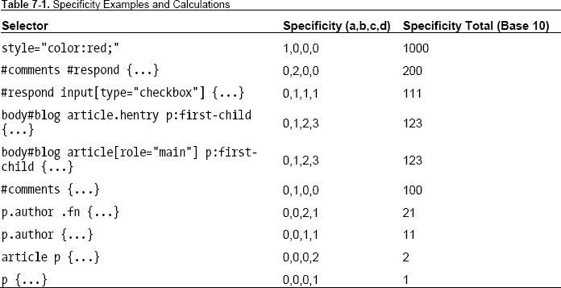
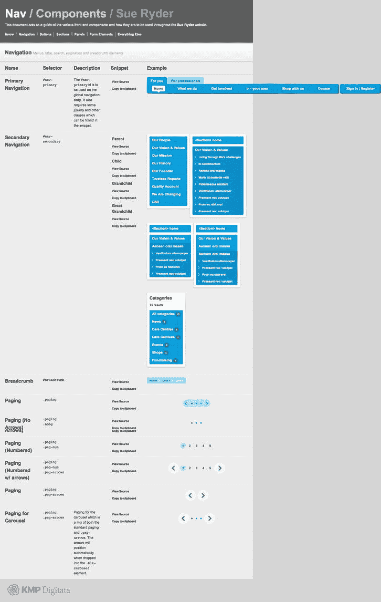
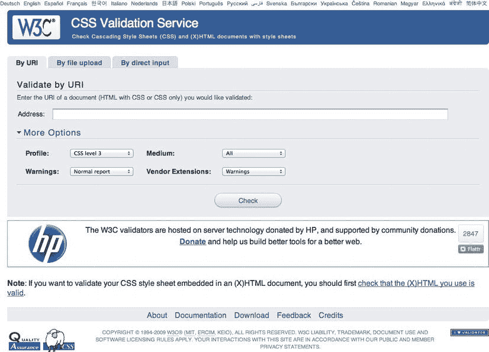
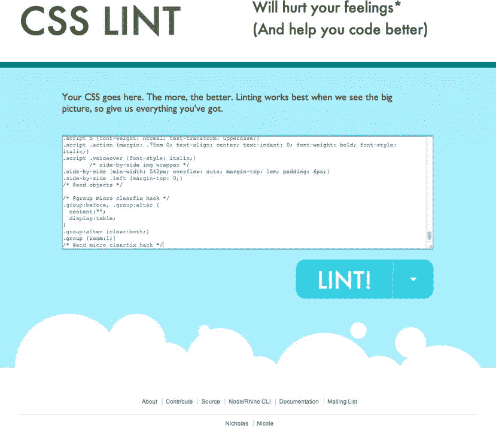
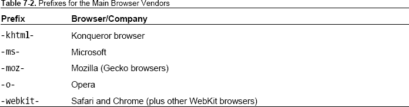
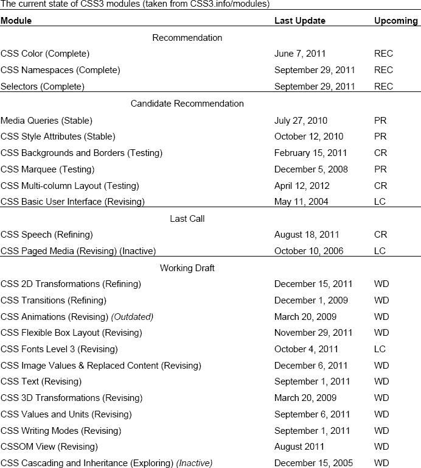
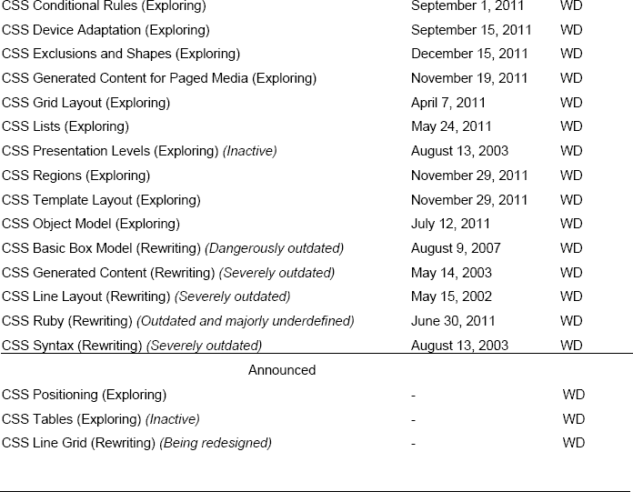

# 七、CSS3，此时此地

恭喜你！你已经读到这本书的第二部分了。前半部分着重于在 HTML 中建立一个坚实的结构基础的重要性，创建一个语义层。我们向您介绍了 HTML5，这是 web 的下一代标记，我们强调了 HTML5 必须提供的好处，包括一些很棒的新 API 和大量新的语义元素，这些元素将确保您的 Web 页面是未来友好的。

这就像坐过山车一样，我们经历了很多。如果您已经完成了作业，那么您已经构建了一个坚实的 HTML5 站点，现在已经准备好添加一点——有些人可能会说，早该添加了——样式。在本书的后半部分，我们通过介绍 CSS3 加入了这种风格，CSS3 是级联样式表规范的下一个发展。在这个过程中，我们将向您展示一些方法，您可以使用这些方法来创建设计精美的网站，这些网站可以为当代浏览器提供漂亮的体验，为功能较弱的浏览器优雅地降级，并且易于维护、可访问，尽可能经得起未来的考验。

这一章提供了一些关于 CSS 当前状态的背景知识。我们将概述 CSS 的一些历史和发展，并提供 CSS3 发展方向的指示。这听起来有点像历史课，你可能想跳过这一章，但我们劝你不要这样做。我们将讨论一些基本原则——我们敦促您遵守的原则——我们还将看看 CSS 是如何发展的，强调我们已经可以用 CSS 2.1 做很多事情的事实，以及 CSS3 建立在已经是一个强大的(如果使用不足的话)规范的基础上。

我们将重温一些 CSS 基础知识，如声明的定义，如何计算特异性，以及级联。我们还将看看一些最佳实践，比如渐进式增强——编写代码的方法,以确保您的样式表易于维护，并在团队环境中很好地发挥作用，在团队环境中，可能不止一个人参与维护样式表。

所以，事不宜迟，我们开始吧。

### web 标准重要性的回顾

到目前为止，您应该很清楚 web 标准的好处。在本书的前半部分，我们一直在为 web 标准辩护。现在，您应该拥有了一个全面的工具箱来创建 HTML5 标记，使您能够轻松处理任何语义情况。你还应该自豪地 POSH(编写简单的旧式语义 HTML ),拥有结构化标记的坚实语义基础，可以在此基础上构建精美的网站。

因此，现在是时候创建一个有效的、符合标准的 CSS 表示层了。这是我们将在本书的后半部分讨论的内容。

确保我们的 CSS 层易于维护的一个重要方法是确保我们的样式表是干燥的。我们说的干是什么意思？简单:不要重复自己(`[`j.mp/drywiki`](http://j.mp/drywiki)1`)。“级联”，我们将在后面看到，允许我们在顶层设置样式，并让这些样式级联到我们随后建立的元素，使我们能够在全局级别设置通用样式，并仅在需要时覆盖它们。

在我们进入正题之前，让我们回顾一下 CSS 的历史。随着 web 的发展，级联样式表规范也在不断发展，以应对新的挑战。我们将在下一节简要回顾一下这段历史。

### CSS 1， CSS 2.1， CSS3 ...

W3C 的级联样式表(CSS)规范在过去 15 年中不断发展，从 1996 年 12 月 17 日成为 W3C 推荐标准的 CSS 1 规范发展到 2011 年 6 月 7 日成为推荐标准的 CSS 2 规范(尽管 CSS3 的创建在很久以前就已经开始了)。尽管在这一演变过程中发生了很多变化，但我们不要忘记，很多事情都是一样的。毕竟，标准就是这样发展的。

注意:顺便提一下，为了避免你认为我们写得很笨拙，值得注意一下不同 CSS 规范的命名是如何变化的。请注意，与它的前辈 CSS 1 和 CSS 2(以及 CSS 2.1)不同，CSS 3 不是“CSS3”，而是“CSS3”(没有空格)。大多数人都忽略了这些细微差别，但你(我们希望)不会。(不要问我们是谁决定放弃最重要的空间，但要知道它已经过去了。)

__________

1

虽然 CSS 规范的发展一直很缓慢，但浏览器厂商近年来已经加快了步伐。规范和实现孰先孰后的老问题已经过去了。规范(由 W3C 等标准制定机构建立和概述)和实现(由浏览器供应商提出的建议，围绕规范进行创新)慢慢走到了一起。这是件好事，你很快就会看到。

我们可能还没有解决先有鸡还是先有蛋的难题，但过去由标准制定机构制定的规范和浏览器厂商提出的实现之间的分离已经没有以前那么明显了，前者常常被指责创新缓慢，后者常常被指责创新过快，从而违反了规范。更重要的是，越来越多的人意识到先有鸡还是先有蛋；其实两者同等重要。

但是这种关于鸡和蛋的比喻已经够多了。燃眉之急很简单:CSS3 准备好了吗？

好消息！我们将在下一节回答这个问题。

### CSS3 准备好了吗？

值得注意的是，当我们开始本书的后半部分时，CSS3 自 2001 年 5 月 23 日以来一直是 W3C 的工作草案。令人难以置信的是，在我写这篇文章的时候，已经超过了十年！所以，对于那些声称在拥抱 CSS3 之前等待它“完成”的人来说，乍一看，似乎还有很多东西需要等待…

值得庆幸的是，W3C 维护着“CSS WG 工作的粗略时间表”，所以如果你想跟踪 CSS3 的开发，这里据称是开始的地方。要了解“CSS 当前工作和如何参与”的概况，请参见`[`j.mp/currentcss`](http://j.mp/currentcss)2`的时间表。

那么，我们现在在哪里？好了，CSS Level 2 Revision 1(那是你可能更熟悉的 CSS 2.1)终于完成了。(好消息，因为毫无疑问你已经在日常工作中使用它很多年了。)但是 CSS3 呢？

CSS3 也在以同样快的速度发展，我们很快就会看到，它已经准备好在此时此地被接受。正如你已经接受了 CSS 2.1 并把它作为你的网页设计师工作流程的一部分，我们和许多其他人鼓励你冒险使用 CSS3。是的，规范正在发展，但是没有比这更好的时机去尝试它所提供的机会了。

#### 上下文

让我们把 CSS 的冒险放在上下文中。正如霍肯·维姆·利和伯特·波斯在他们的书*层叠样式表:为网页设计*(早在 1997 年出版)中所说，CSS 的传奇始于 1994 年，从那以后就像坐过山车一样。

__________

2

如果您不相信我们早在 1994 年 CSS 就是一个提案，我们强烈建议您阅读 kon Wium Lie 的提案(发表于 1994 年 10 月 10 日)。当时，Lie 将层叠样式表(CSS)称为“层叠 HTML 样式表”，但是如果你出于历史好奇心花点时间来阅读这个简短的提议，你会惊讶地发现它是如何形成我们今天所知道的基本构件的。

所以，我们从 CSS 1 开始，它演变成 CSS 2，随后演变成 CSS 2.1，这正在演变成 CSS3。

值得注意的是，CSS 2.1 提供了很多经常被忽视的潜力。多年来，CSS 规范中加入了大量可爱之处，许多人错误地认为这些可爱之处最初只是作为 CSS3 规范的一部分加入的。这包括`@font-face`、属性选择器、生成的内容和文本阴影。

随着我们在不断发展的浏览器环境中对 CSS3 的支持越来越广泛，许多人将当前的样式表环境误认为是新事物。不是的。

就像我们在 CSS 2.1 成为 W3C 推荐标准之前接受它一样，作为你的表示层的一部分*此时此地*，我们鼓励你此时此地接受 CSS3 *。好处很多；此外，随着浏览器支持的不断推出，对您工作流程的影响将会一次又一次地得到回报。*

#### CSS3 模块化

CSS 发展的一个主要变化是 W3C 决定将 CSS3 分成一系列模块。正如 CSS 工作组所说，

> 随着 CSS 越来越受欢迎，对规范进行补充的兴趣也越来越大。比起试图将几十个更新塞进一个单一的规范中，能够更新规范的各个部分会更容易和更有效。模块将使 CSS 以更加及时和精确的方式更新，从而允许规范作为一个整体更加灵活和及时的发展。
> 
> `[www.w3.org/TR/2001/WD-css3-roadmap-20010119](http://www.w3.org/TR/2001/WD-css3-roadmap-20010119)`

这对我们这些网络工匠来说是个好消息。随着 CSS 规范为了响应设计者的需求而发展壮大，模块化规范的需求变得越来越迫切。随着 CSS 中如此多的新发展，一个庞大的、无所不包的 CSS3 规范的想法变得越来越不现实，导致 W3C 决定采用模块化的方法。

__________

3

这样做的好处有很多:浏览器供应商正在 CSS 领域快速创新，因此通过采用模块化方法，随着不同浏览器供应商实现对给定功能的支持，CSS3 规范的元素可以以不同的速度向前发展。当然，这也有不好的一面:不同的浏览器在不同的时间支持不同的特性会使跨浏览器开发变得复杂，但是有一些策略可以解决这个问题。

那么，向模块化的发展如何影响 CSS3 规范的发展呢？重要的一点是要注意，模块通过一系列的*成熟度等级*，使我们能够看到什么正在向推荐状态发展(因此，是可靠的使用)。

#### 成熟度等级

W3C 为他们的每一个规范指定了一个成熟度级别，这表明了它在开发过程中的当前状态。模块向上移动一系列级别，从工作草案到最后一次呼叫，再到候选人推荐，最后是建议推荐。

这个过程一开始可能看起来有点笨拙，但是它允许您看到支持什么，同样重要的是，在不久的将来可能会支持什么。W3C 在网站上用典型的模糊语言定义了成熟度等级(`[`j.mp/reclevels`](http://j.mp/reclevels)4`)。

尽管成熟度级别不一定代表浏览器支持，但通常两者之间有一个平等的级别(在某些方面比其他方面更平等)。我们将在本章的后面更详细地讨论浏览器支持，但是首先让我们来看看一些有问题的模块。

### CSS3 的好处

让我们稍微了解一下 CSS3 的好处，以及为什么现在接受 CSS 的下一次发展可以让你作为一名网页设计师的生活变得更容易一些。随着浏览器厂商共同努力形成这些新标准，站点呈现的主要差异正在慢慢成为过去。CSS3 中定义的新属性(有或没有供应商前缀)通过静默的后台更新在浏览器中快速出现，确保标准支持以不断增长的速度增加。这意味着我们可以为客户和用户打造比以往更丰富的网络体验。

*注意:记住 IE 的一些老版本——即 6-8——仍然有大量的用户，这确实在某种程度上打乱了苹果的计划。同样，有一些策略可以确保内容在不支持的浏览器中仍然可以访问和使用，这一点我们将在本书的后面讨论。*

随着 CSS3 的发展，我们作为设计师的工作变得越来越容易，我们可以开始看到许多吸引人的好处。设计得到了简化，我们的工作流程得到了改进，而且，随着我们将表示方面的工作转移到浏览器，我们可以减少在 Photoshop 上花费的时间，增加编写标记或 CSS 的时间。

__________

4

#### 流线型设计

传统上，网页设计过程(从视觉角度来看)是从在 Photoshop 中创建新的设计开始的，然后尝试在 HTML 和 CSS 中重新创建它。这种情况正在开始改变。有了过多的设备、浏览器，以及需要迎合的环境，越来越多的设计师开始“在浏览器中”进行设计。安迪·克拉克长期鼓吹的一种技术，其概念是通过在我们设计的媒介中工作，我们拥抱它的缺陷和不可预测性，就像约翰·奥尔索普多年前在*网页设计之道*中描述的那样。

建议我们永远不再打开 Photoshop(或其他图像编辑器)是不现实的，但在 CSS3 的帮助下，这种需求正在逐渐消失。我们可以将大量的视觉负担转移到浏览器上，直接在浏览器中创建效果，这在以前是需要图像编辑器的。

这不仅改善了我们的工作流程，缩短了项目的长度，而且还使得维护和变更请求更容易处理。客户要求更改？没问题；更改 CSS。没有更多艰苦(和痛苦)的往返图像编辑器。

正如我们将在下一节中看到的，CSS3 提供了许多新的方法来创建效果，这是我们以前必须解决或(小声地)破解的。

#### 减少变通办法和黑客攻击

使用 CSS3 可以避免大量的变通方法，包括

*   *指定丰富的网络字体*:不再需要在图像编辑器中创建字体，并通过图像替换或使用像 sIFR 这样的工具来提供。
*   *自动创建圆角*:不再依赖图像来创建圆角方框。都可以用`border-radius`自动处理。
*   *不透明度和 alpha 通道*:使用`opacity`或`rgba.`创建没有图像的透明度
*   *动态创建渐变*:不再为渐变或图案创建重复的图像。简单地使用 CSS 渐变(径向或线性)。
*   *为简单动画减少繁重的脚本编写*:无需使用 JavaScript 来创建简单的过渡或变换。现在可以用 CSS 处理了。
*   *剪切附加标记*:无需编写附加标记来创建列。
*   更少的类:当元素可以使用新的 CSS3 选择器时，不需要添加额外的无关类。

这些改变应该会节省你的时间，让你可以专注于项目的其他方面，而不必到处乱搞。我们将回到这个渐进增强的想法，但是现在让我们简单回顾一下 CSS 基础知识，以确保我们说的是同一种语言。在下一节中，我们将研究 CSS 的语言和术语以及一些最佳实践。

### CSS 基础复习

这部分是关于 CSS 基础的。这真的是一个复习，其中大部分应该是常识，但我们觉得浏览一遍很重要。不要跳过！虽然这又回到了 CSS 的基础，但我们觉得理解编写样式表时使用的词汇很重要。这本书的后半部分集中在 CSS3 上，所以对 CSS 词汇的贫乏理解会妨碍你开发样式表。

为了帮助我们及时地浏览基础知识，我们的作者之一(达薇亚·马年)为你创建了一个非常有用的清单，我们对它进行了重新组织和总结，以提供一个简短的、一目了然的 CSS 参考(`[`j.mp/cssvocab`](http://j.mp/cssvocab)5`)。

#### 剖析一个规则(或规则集)

正如您所希望的那样，一个简单的 CSS 规则编写如下:

`selector {
        property: value;
}`

让我们分解一个简单的 CSS 规则来看看属性、值、声明和声明块。一旦我们完成了这些，我们将深入一点。

#### 房产

在下面的示例中，`border`是属性:

`h1 {
        border: 1px;
}`

属性是应用于选择器的样式。查看上一节中的通用示例，选择器可以是许多元素中的任何一个，比如一个`h1`、`p`或`img`元素。

所以这个`border`，在这种情况下，是一个属性，我们来看看它的值。当您发现本例中的值是`1px`时，应该不会感到惊讶。

#### 一个值

`border`的*值*设定为`1px`。

__________

5

`h1 {
        border: 1px;
}`

正如我们将在下一节看到的，我们可以在一个声明中设置多个值。

#### 宣言

一个*属性:值对*被称为一个*声明*。继续同一个示例，声明为`border: 1px;`，如下所示:

`h1 {
        border: 1px;
}`

看一个稍微复杂一点的声明，再次使用`border`属性，您可以在一个声明中设置多个值，如下所示:

`h1 {
        border: 1px dotted red;
}`

在前面的例子中，我们已经建立了多个值——`1px`、`dotted`和`red`——来创建一个更复杂的声明。我们已经用速记符号写了这个，但是我们也可以跨多个声明来写这个，以创建一系列声明，或者一个声明块。

#### 声明块

一个规则可以有不止一个声明——而且经常如此。将前面的例子从单行速记声明扩展到多行*声明块*，我们得到如下结果:

 `h1 {
        border: 1px;
        border-style: dotted;
        border-color: red;
}`

显然，上一个例子中的简写版本更有效，但是手写版本更容易维护。暂时保持这种想法；我们将在稍后研究 CSS 速记时回到这个问题。

#### 关键词

在我们之前的例子中，我们使用长度单位来设置边框的宽度，在本例中是`px`。CSS 规范还定义了许多可以用来定义值的*关键字*。我们之前的例子展示了两个额外的关键字:设置为`dotted`的`border-style`和设置为`red`的`border-color`。

你可能已经熟悉了很多 CSS 关键字，比如不同的颜色名称(`red`、`green`、`blue`等)，不同的边框样式(`dashed`、`dotted`、`solid)`)。还有很多，你会在我们阅读这本书的时候找到它们。

#### CSS 单位

再次回到这个例子，

`h1 {
        border: 1px;
}`

在这种情况下，`border`属性的值已经被设置为`1px`。CSS 定义了许多我们可以用来声明值的*单位*。这些包括相对长度单位、绝对长度单位、CSS 单位和颜色单位。Mozilla 在`[`j.mp/css-units`](http://j.mp/css-units)6`提供了一个有用的概述。

进一步看 CSS 单位，让我们探索颜色单位。我们习惯于看到用十六进制定义的颜色，比如`#FF0000`(或者`red`作为关键字)。正如我们将在下一节看到的，我们也可以用所谓的*功能符号*来表达这些单元。

#### 功能符号

正如 W3C 所言，“在 CSS3 中，函数符号用于表示颜色、属性和 URIs。”如果您希望比这个小的引用片段更深入一点，可以在下面的位置随意地这样做，这里列出了许多例子:`[`j.mp/css-values`](http://j.mp/css-values)7`。

尽管如此，请放心，我们会提供一些翻译。(我们会让你任由 W3C 有些干巴巴、常常令人困惑的描述摆布吗？)

让我们看一下前面使用 color 的例子，在这个例子中我们考虑了两个等价的词，`#FF0000`(以十六进制编写)和`red`(以关键字编写)。我们可以用函数符号写出同样的颜色。下面的三个例子(用十六进制的*，使用*关键字*，使用*函数符号*)显示完全相同。*

 *首先，使用十六进制的*:*

`blockquote {
        background: #FF0000;
}`

第二，使用一个*关键字*:

`blockquote {
        background: red;
}`

__________

6

7 `[www.w3.org/TR/css3-values/#functional](http://www.w3.org/TR/css3-values/#functional)`

第三，使用*功能符号*:

`blockquote {
        background: rgb(255,0,0);
}`

在功能符号示例中，我们确定背景`value`是使用“功能”`rgb`(红色、绿色)设置的。蓝色)并用括号中的“参数”定义这个函数(对你我来说，括号就是括号)。这类似于 JavaScript 中的函数。

用伪代码写的，看起来是这样的:

`blockquote {
        background: function(argument);
}`

虽然现在这可能有点令人困惑，但是当我们在接下来的章节中浏览一些例子时，一切都会变得清晰起来。函数符号的其他例子包括`url`函数，您习惯于看到如下:

`blockquote {
        background: url(http://www.example.com/background.png);
}`

在这种情况下，函数是带有参数(在括号中)的`url`，参数是所讨论的背景图像的位置(在这种情况下是`[`www.example.com/background.png`](http://www.example.com/background.png)`)。

理解函数表示法可以提供许多非常有用的机会，值得阅读完整的 W3C 规范(是的，全部！)来真正探索所提供的机会。函数表示法的一个有希望的方面是使用`calc`函数，W3C 在`[`j.mp/csscalc`](http://j.mp/csscalc)8`中对此进行了概述。

正如 W3C 所说，“只要允许长度值，就可以使用`calc(<expression>)`函数。在计算`em`长度的同时，计算括号内的表达式…"这可能有点令人困惑，但一个例子将有望带来一些启发。

`section {
        float: left;
        margin: 1em;
        border: solid 1px;
        width: calc(100%/3 - 2*1em - 2*1px);
}`

无需太多细节(在第十二章的中有更深入的介绍)，`calc()`函数允许用户使用数学表达式作为值。它可以用来代替长度、频率、角度、时间或数值。这当然是一个值得关注的特性，因为它将来会获得更多的浏览器支持。

__________

8

#### 选择器

选择器是声明样式应该应用于哪些元素的方式，`h1`、`blockquote`、`.callout`和`#lovelyweather`都是选择器。选择器有很多种类型，我们将在下一章深入探讨。

#### 组合子

根据一个元素相对于另一个元素的出现来选择该元素(通过选择组合符来选择:空格、`>`、`+`或`~`)。和选择器一样，我们将在第八章的中关注各种类型的组合子。

#### At-规则

At-rules 以`@`字符开头，比如`@import`、`@page`、`@media`和`@font-face`。我们将在第九章和第十章中了解这些 at 规则及其工作原理。

#### 供应商特定的扩展

特定于供应商的扩展正是它们看起来的样子。它们提供特定于特定供应商的功能(即浏览器)。它们不一定代表标准中声明的特性。我们将在本章后面触及供应商前缀。

我们将在本书的后半部分频繁使用这种语言，所以现在让我们看看用 CSS 速记来节省时间。

### CSS 速记

膨胀样式表的一种方法(尽管有时很有用)是在一个声明可以使用的情况下使用多个声明。有许多属性可以转换成 CSS 简写，节省时间和文件大小。我们将查看`margin`和`padding`，但是类似的规则也适用于各种背景、边框、字体、列表样式和轮廓属性。关于这些的更多细节，请阅读罗杰·约翰逊(`[`j.mp/456css`](http://j.mp/456css)9`)的*高效 CSS 和速记属性*以及达斯汀·迪亚兹(`[`j.mp/diazcss`](http://j.mp/diazcss)10`)的 *CSS 速记指南*。

可以用几种方式指定`padding`和`margin`。对于`-top`、`-right`、`-bottom`和`-left`有单独的值，也有简写版本。这里有一个例子:

`p {padding-top: 1.5em;}
p {padding-right: .5em;}
p {padding-bottom: 1.5em;}
p {padding-left: 3em;}`

__________

9

10

这四个 CSS 规则指定了`
`的各个属性。然而，你可以用速记在一行中写出同样的东西。

`p {padding: 1.5em .5em 1.5em 3em;}`

速记属性中的四个值分别是 top、right、bottom 和 left。像模拟时钟一样记住它:从 12 点开始会让你远离麻烦。

有几个相同的值是很常见的，比如 top/bottom 或 left/right，所以还有三种简写形式。如果只有三个值，它们分别代表顶部、左侧*和右侧*以及底部的值。

`p {margin-top: .75em;}
p {margin-right: .5em;}
p {margin-bottom: 1.5em;}
p {margin-left: .5em;}

p {margin: .75em .5em 1.5em;}`

下一种简写形式只有两个值，分别代表上/下和右/左。

`blockquote {margin-top: .75em;}
blockquote {margin-right: 3em;}
blockquote {margin-bottom: .75em;}
blockquote {margin-left: 3em;}

blockquote {margin: .75em 3em;}`

最后，简写的最后一种形式只有一个值，使得四个面都相同。

`div {margin-top: 1.5em;}
div {margin-right: 1.5em;}
div {margin-bottom: 1.5em;}
div {margin-left: 1.5em;}

div {margin: 1.5em;}`

一般来说，最好为元素设置好默认的`margin`和`padding`值，使用速记属性来分配所有四个值。如果您需要覆盖这种样式，如果您只想更改一个或两个值，单独的属性会很方便。这有助于防止以后更改默认值时出现问题，因为新的默认值仍然会级联到您没有更改的其他属性。

`/* Recommended example - only override what you need to */
ul {margin: .75em 1.5em;}
li ul {margin-top: 0; margin-bottom: 0;}

/* We don't recommend setting the same value in two places where possible */
ul {margin: .75em 1.5em;}
li ul {margin: 0 1.5em;}`

当你阅读接下来的五章时，你会发现 CSS3 中引入的一些新属性也可以使用简写符号。我们将在它们出现时介绍它们。现在让我们看看 CSS 的另一个基本方面；级联、特异性和遗传。

### 级联、特异性和遗传性

在处理大型 CSS 文件时，我们经常会盲目地走上一条路——结果却发现自己编写了极其冗长和复杂的规则，以便覆盖文档中较早出现的另一条规则。在大多数情况下，清楚地理解 CSS 级联、特性和继承，就可以避免编写像这样的长规则。

#### CSS 级联

级联是 CSS 的主干。它的工作原理是为每个规则指定一个重要级别，并确定哪些规则和属性会影响给定的元素。其目的是找到“头号王牌”。

现在似乎是时候提醒我们自己，样式表可以来自不同的来源，而不仅仅是来自我们设计师和开发人员。它们可以来自浏览器(用户代理)，来自用户的风格，或者来自我们，作者。

描述级联时，`!important`标志的使用变得很明显。`!important`是作为一种方法创建的，允许具有特定可访问性需求的用户覆盖作者样式。例如，它可以用来增加字体大小或增加对比度。因此，`!important`标志不应该出现在作者样式表中，尽管这种情况很少发生。

按照升序排列(其中 5 最重要)，级联的工作方式如下:

1.  用户代理样式
2.  用户风格
3.  作者风格
4.  作者样式标记为`!important`
5.  标记为`!important`的用户风格

在级联之后，规则按其特殊性排序，这就是我们接下来要看的。

#### 计算特异性

当两个或更多的样式规则应用于同一个元素，并在级联中的相同位置设置相同的属性，具有相同的重要性时，特殊性就开始起作用了。在这种情况下，特异性最高的规则就是顶级王牌。

通过给每种类型的选择器分配一个数值来计算特异性。然后计算出特定规则的总数。选择器的编号类型分为四个级别，每个级别在计算中都有自己的权重。这些分为 a、b、c 和 d，其中

> a =内嵌样式
> 
> b = ID 选择器的总数
> 
> c =类和属性选择器以及选择器中伪类的数量
> 
> d =类型选择器和选择器中伪元素的数量

使用否定伪类(`:not`)的选择器与其他选择器一样被处理；然而，否定本身不是一个伪类。通用`* {...}`选择器在计算中被忽略。

为了确保您的计算保持简单，我们将使用基数 10 来查看结果中的明显差异。因此，我们将为每个内联样式增加 1000；每个 ID 100；每个类、属性和伪类 10 个；每个元素和伪元素各 1 个。清楚了吗？很可能不是，所以我们来看一些例子。

假设您想要样式化段落，那么在您的样式表中您应该写:

`p {...}`

参考本章前面的定义，我们可以看到`p {...}`是一个类型选择器，在特性级别中属于 d。这意味着段落本身的特异性是 a=0，b=0，c=0，d=1，总共为 1。

如果我们给那个段落加一个类，`p.author {...}`，得分如下:a=0，b=0，c=1，d=1。使用基数 10 作为乘数，我们可以计算出总数为 11(类选择器为 10)。因此，类选择器胜过类型选择器，并且会在特异性名人死亡匹配中胜出。表 7-1 显示了特异性总计的更多示例。

注意表 7-1 中的两个选择器(第四行和第五行)具有相同的特异性。当两个选择器具有相同的特异性时，在源顺序中后面出现的选择器优先。

*注:如果你想以一种更直观的方式来看待或思考 CSS 的特殊性，安迪·克拉克早在 2005 年就曾撰文用星球大战的类比(`[`j.mp/starwarsspecificity`](http://j.mp/starwarsspecificity)`)来说明这一点。或者，如果你更喜欢扑克，Carl Camera 在 2007 年(`[`j.mp/pokerspecificity`](http://j.mp/pokerspecificity)`)的一篇文章中把专一性比作扑克手。*

CSS 特异性可能是一项很难掌握的技能，但是一旦你理解了它，它就是一个强大的工具，可以让你以最少的麻烦锁定元素，并使你不必回头修改你精心制作的语义标记。

#### CSS 继承

CSS 中继承的概念相对简单，但可能会引起一些混淆。在其最简单的形式中，继承允许作者只声明一次属性和值，从而避免了在许多元素上设置相同属性的需要。例如，我们可以编写以下代码，将站点的字体更改为 Georgia:

`article, section, h1, h2, h3, p, ol, ul, dl {font-family:georgia, serif;}`

然而，编写这样的代码要容易得多(更不用说可维护性了):

`body {font-family:georgia, serif;}`

然后，`font-family`属性被主体的子元素继承，直到另一个样式规则覆盖它。当明智地使用时，继承结合级联和特性可以节省您的开发时间，并保持您的样式表文件较小且易于维护。这很好地把我们引向了维护和组织的主题。

*注意:虽然不是所有的 CSS 属性都会被自动继承，但是你可以通过使用`inherit`值来强制继承。这是一件好事。想象一下，如果`margin`和`padding`被继承，那么您必须在每个声明中覆盖这些继承的样式。一个警告:`inherit`在低于 8 的 IE 版本中不起作用，除了在`direction`和`visibility`属性上。*

### CSS 组织和维护

当谈到编写 CSS 时，每个人都有自己独特的偏好，无论是单行还是多行，用制表符或空格缩进，或者规则集或属性出现的顺序。孤立地看，这些点中的许多都变得没有实际意义，但是当我们考虑到许多团队成员可能在任何给定的样式表上工作，或者你已经一年没有在那个站点上工作了，现在需要做一些更新，通常最好有一些约定来缓解这些问题。我们将从查看一些 CSS 惯例和评论最佳实践开始，然后再转向查看 CSS 重置和框架。

#### CSS 惯例

CSS 约定可以大致分为两个关键领域:编码风格和命名约定。然后，这两个领域可以细分为单独的辩论(这种辩论设计师已经争论了多年)。我们将解释每个论点的利弊，但通常我们会让您选择适合您的方法。

##### 单行与多行 CSS

最大的争论通常围绕着一条规则是否应该写在一行上，比如:

`h1 {font-family:Georgia; color: green; line-height:1.3; }`

或者多行，比如:

`h1 {
        font-family:Georgia;
        color: green;
        line-height:1.3;
}`

支持单行格式的论据少之又少。行数和空格数减少了，因此文件大小也变小了，但是如果你关心这个问题，你可以在把代码放到实际的生产服务器上之前缩小它(一个*缩小器*是一个从代码文件中删除所有可能的空格的程序)。如果使用单行规则，扫描大量的选择器也更容易，但是扫描单个属性和特性就更困难了。

使用多行 CSS 的好处显而易见。首先，破译密码要容易得多。当使用源代码控制时，很容易跟踪在一个规则集中编辑了哪些属性(因为它们在单独的一行上)。您还可以简单地使用 Cmd+F(或 Ctrl+F)来查找选择器，这样就不需要直观地扫描文件。同样的情况也适用于通过验证器传递文件:当使用多行时，很容易看出哪个属性导致了问题，但是使用单行时，就不会了。还有人认为，在多行方法中，将注释放在单个声明旁边更容易。

围绕右花括号的位置，多行方法还有一个额外的细微差别。它应该位于自己的一行(如前所示)还是与最终声明位于同一行，如下所示？

`h1 {
        font-family:Georgia;
        color: green;
        line-height:1.3;}`

老实说，没什么区别。两种方式都很好。

单行与多行之争中的一个争论围绕着在多行方法中使用制表符或空格来缩进声明。这种争论在 CSS 之前就存在了，而且不容易解决。有些人喜欢一个标签，有些人喜欢两个空格，有些人喜欢四个。我们建议使用制表符缩进，但也可以自由地争论。

你选择的风格由你决定。我们每个作者都有自己偏爱的方式，但总的来说，我们是多重使用者。尝试这两种方法，决定你和其他团队成员更喜欢哪一种。

##### 订购声明

在 CSS 圈子里引起争论的另一个领域是人们对单个规则集中声明排序的偏好。有些人喜欢按字母顺序排列他们的声明，有些人喜欢按类型或相关性分组，有些人根本没有顺序(专业提示:不要选择这个选项)。以下是按字母顺序排列的方法，按物业名称的第一个字母排序:

`header {
        background:#f8f8f8 url(img/bg.png);
        border-bottom:1px solid #ccc;
        color:#333;
        font-family:Georgia;
        font-size:16px;
        font-weight:normal;
        height:60px;
        left:0;
        line-height:1.5;
        margin:0 auto;
        padding:5px 20px;
        position:fixed;
        top:0;
        z-index:2;
}`

下一个示例显示了按类型分组的声明(按以下顺序):

1.  位置
2.  展示和盒子模型
3.  字体和排版
4.  颜色
5.  背景和边框

`header {
        position:fixed;
        top:0;
        left:0;
        z-index:2;
        height:60px;
        margin:0 auto;
        padding:5px 20px;
        font-family:Georgia;
        font-size:16px;` `        font-weight:normal;
        line-height:1.5;
        color:#333;
        background:#f8f8f8 url(img/bg.png);
        border-bottom:1px solid #ccc;
}`

和所有这些辩论一样，选择最适合你的解决方案。有人可能会说，字母排序法更容易学习，属性也更容易浏览。但是，使用分组方法，更容易看出声明(在本例中)如何形成一个 60 像素高的固定浅灰色条，而无需在浏览器中查看结果。这也更容易看出不同的属性是如何相互影响和相互作用的。

对于最后一个声明中的最后一个分号是否应该包含在内，我们不会捅马蜂窝；我只想说我们相信它应该永远存在。

##### 排序规则集

在上一节中，我们讨论了单个规则集中声明的顺序，但是这些规则集在样式表中的顺序呢？以下面的标记为例:

`<aside>
  <section class="history">
    <a href="history.html">
    <h2>History</h2>
    
    
Before humans were launched into space, many animals were propelled heavenwards to pave
the way for mankind’s pioneering endeavors. These original pioneers, including numerous
monkeys, served their nations in order to investigate the biological effects of space travel.
Find out more about these pioneers that changed the face of space forever.

    </a>
  </section>
<aside>`

现在，让我们假设我们希望该部分中的节、锚、标题、图像和段落具有不同的样式。按如下方式构建 CSS 是有意义的(注意，我们在这里使用了单行符号来突出显示选择器):

`.history {...}
.history a {...)
.history h2 {...}
.history img {...}
.history p {...}`

这种方法遵循我们的标记的布局(碰巧是按字母顺序)。对一些人来说，这是有意义的；其他人将所有标题样式(在一个工作表中)组合在一起，如下所示:

`h2 {...}
.history h2 {...)
.mission h2 {...}`

这里很难提供一般的指导(我们将在“注释最佳实践”一节中详细介绍)，但一般来说，第一种方法，可能会根据您的偏好进行一些轻微的重新排序，使管理特殊性和继承性变得更加容易。

##### 命名规格

现在让我们看看 CSS 中的命名约定，它指的是类名或 ID 名，而不是文件名(尽管这也很重要)。类名应该是描述性和语义性的；他们应该描述你的内容，而不是演示文稿。举下面两个例子，看看你认为哪个更能描述内容:

`.bigLeftCol {...}
.littleRightCol {...}

.primary-content {...}
.secondary-content {...}`

希望您能看到第二个例子更准确地描述了内容，而不是演示。虽然第一个例子乍看起来可能不错，但是如果您要改变设计并改变列的位置会怎么样呢？为了做到这一点，您必须编辑您的底层标记，这是低效的。

*注意:第一个例子还强调了我们的另一个命名约定 bug bear:camel case。CamelCase 在多种编程语言中使用，因此在一些开发人员的 DNA 中根深蒂固。但是事情是这样的:CSS 不是一种编程语言，它是一种表示语言。因此，虽然我们可以从编程中借鉴一些有用的约定，但 CamelCase 不在其中。我们在属性名中使用连字符，为什么不在类名中使用呢？毕竟`.primary-content`比`.primaryContent`更容易阅读和使用。如果你不相信我们，读一读哈里·罗伯茨写的关于为什么《骆驼祥子》在`[`j.mp/camelcasesucks`](http://j.mp/camelcasesucks)11`如此糟糕的文章，你会改变主意的。*

请记住，名称应该是语义性和描述性的，而不是结构性和表象性的。在将来，不要用诸如`.bigRedbox`这样的类名，而要用`.warning-block`。

#### 评论最佳实践

注释你的 CSS 只会对你的项目有益。这有几个原因，比如提醒你为什么要写某些规则，或者你用什么计算字体大小。注释对参与项目的其他团队成员也非常有用。虽然像这样的基本注释是正常的，但是添加元数据和目录可以极大地提高文件的可读性和可维护性。请考虑以下几点:

__________

11

`/*-----------------------------------------------
[Master sheet]

Project:       Animals in Space
URL:           http://thewebevolved.com
Version:       1.1
Creator:       Rich Clark
Last changed:  01/02/12
Last Updated:  Oli Studholme
Primary use:   Demo site for book
-------------------------------------------------*/`

通过合并这些信息，从事特定项目的每个人都可以一目了然地看到样式表的用途、创建者和最后更新时间。在大型项目中，当多个团队成员一起工作时，需要多个样式表时，这种方法的好处变得更加明显。这并不复杂，是一种很好的练习。

##### 创建目录

在元数据之后，为您的文件包含一个目录也是一个好主意，可能如下所示:

`/*-----------------------------------------------
Table of contents

1\. Reset
2\. Typography
3\. Basic layout
4\. Widgets
5\. Media items
6\. Forms
7\. Media queries
8\. IE specific styles
-------------------------------------------------*/`

该目录可以根据您的项目需要而简单或详细。使用这种方法并像这样将文件分成几个部分，可以很容易地维护和添加其他样式到文件中的逻辑区域。您应该清楚地用注释将每个部分分开，并添加一个在您的实际代码中不太可能出现的额外字符(如|或),作为搜索文档时的标志。额外的字符作为一个区分符，区别于可能同名的类或 ID 选择器。

`/*-----------------------------------------------
£Widgets
-------------------------------------------------*/`

这为文件的开头设置了一个基本框架，但是我们可以更进一步，还可以包括一个参考表，用于提供颜色和排版等信息。

##### 颜色和排版参考表

在像 JavaScript 这样的语言中，我们可以声明在整个脚本中重用的变量。CSS 中还不存在这种功能(尽管可以使用类似`less.js`的库来添加)。为了解决这个问题，在我们的样式表中包含一个简短的参考表(或术语表)是有意义的，比如颜色和排版。下面是一个例子。

`/*-----------------------------------------------
Color reference sheet

Background:    #f8f8f8 (off white)
Body text:     #444444 (dark grey)
Headings:      #888888 (light grey)
:link          #0090D2 (blue)
:hover,
:active,
:focus         #0063A6 (dark blue)
-------------------------------------------------*/

/*-----------------------------------------------
Typography reference sheet

Body copy:             1.2em/1.6em Georgia, serif;
Headers:               2.7em/1.3em Helvetica, Arial, "Lucida Sans Unicode", Verdana, sans-
serif;
Input, textarea:       1.1em Helvetica, Verdana, Geneva, Arial, sans-serif;
Buttons:               1.2em Georgia, serif;

Notes: reduce heading by 0.4em with every lower heading level
-------------------------------------------------*/`

本文介绍了如何构建样式表并为开始项目创建样式指南，从而确保文件保持良好的结构并易于维护。为了真正创造一个公平的竞争环境，许多人喜欢使用 CSS 重置。

#### CSS 重置并正常化

重置样式表将所有浏览器中的所有内容重置为零，使我们能够从零开始重新构建。本质上，我们在浏览器的默认样式表中阉割了所有的规则。想一想这个问题。

*   告别`h1` - `h6`视觉层级。
*   列表不再有项目符号。
*   默认填充和边距被删除。

一方面，这是有用的(就像在重建之前清理地面一样)，但是你已经移除了所有的东西，所以你需要再次将它们全部放回去(或者至少考虑你选择不放回去的东西)。

就像注释你的代码一样，把这看作是你的过程的一部分。一个重置的样式表加上一个坚实的风格重建就相当于一个框架的开始。你可以构建自己的框架，或者使用其他地方创建的框架，比如由保罗·爱尔兰和合著者迪维娅·马年创建的 HTML5 样板文件(`[`j.mp/h5boiler`](http://j.mp/h5boiler)12`)。如果你决定使用别人创建的框架，在项目进行到一半并陷入困境之前，一定要理解它的内部工作原理。

##### 使用重置

回到重置，最基本的重置使用`*`选择器来重置所有元素的属性。

`* {
  margin:0;
  padding:0;
}`

虽然这种方法很有效，但不推荐使用，因为它会降低站点的速度，而且有些元素的样式你不想删除(例如。

由 Eric Meyer 推广的一种更常见的方法是使用定制的重置样式表，现在已经有很多这样的样式表了。随着 HTML5 的出现，这些样式表中的大多数现在也包含了一个将新元素设置为`display:block;`的规则，如第二章中所述。

搜索“CSS 重置”会返回成千上万的结果，但是一些更流行的重置样式表是

*   迈耶的重置重装上阵(`[`meyerweb.com/eric/tools/css/reset`](http://meyerweb.com/eric/tools/css/reset)`)
*   HTML5 医生重置样式表(作者理查德·克拉克)
*   YUI 重置 CSS ( `[`developer.yahoo.com/yui/reset/`](http://developer.yahoo.com/yui/reset/)`

接下来展示了 Meyer 的 reset reloaded(用于 HTML5)的副本，这样你就可以看到它与之前展示的`*`方法有什么显著的不同。

`/* http://meyerweb.com/eric/tools/css/reset/
   v2.0 | 20110126
   License: none (public domain)
*/

html, body, div, span, applet, object, iframe,
h1, h2, h3, h4, h5, h6, p, blockquote, pre,
a, abbr, acronym, address, big, cite, code,
del, dfn, em, img, ins, kbd, q, s, samp,
small, strike, strong, sub, sup, tt, var,
b, u, i, center,
dl, dt, dd, ol, ul, li,
fieldset, form, label, legend,
table, caption, tbody, tfoot, thead, tr, th, td,
article, aside, canvas, details, embed,
figure, figcaption, footer, header, hgroup,` `menu, nav, output, ruby, section, summary,
time, mark, audio, video {
        margin: 0;
        padding: 0;
        border: 0;
        font-size: 100%;
        font: inherit;
        vertical-align: baseline;
}
/* HTML5 display-role reset for older browsers */
article, aside, details, figcaption, figure,
footer, header, hgroup, menu, nav, section {
        display: block;
}
body {
        line-height: 1;
}
ol, ul {
        list-style: none;
}
blockquote, q {
        quotes: none;
}
blockquote:before, blockquote:after,
q:before, q:after {
        content: '';
        content: none;
}
table {
        border-collapse: collapse;
        border-spacing: 0;
}`

*注意:仔细考虑使用重置——对于许多项目来说，重置往往是多余的，因为你真的需要自己重新定义一切。在更简单的项目中，通常将`margin: 0`和`padding: 0`设置为`<html>`、`<body>`和更多就足够了。*

__________

12

##### 使用 normalize.css

另一种方法是由尼古拉斯·加拉格尔和乔纳森·尼尔开发的。与重置样式表相反，`normalize.css`的目标是让浏览器呈现的元素更加符合现代标准。与重置不同，地面并没有完全清理干净。`normalize.css`保留了有用的默认设置，并通过纠正错误和增加微妙的可用性改进走得更远。`normalize.css`也打包了 HTML5 样板工程。

__________

13

与前面讨论的编码风格一样，您选择哪个选项(如果有的话)完全取决于项目需求和个人偏好。需要注意的是，这些文件都不应该被视为福音(Meyer 最初重置的常见问题)。您应该一行一行地检查文件，并逐个项目地编辑、添加或删除规则。

#### CSS 框架和工具包

CSS 框架通过为预定义的网格系统、排版、颜色、打印样式等提供样式，比 CSS 重置更进一步。有些人甚至在 CSS 之上加入了 HTML 和 JavaScript。

它们对于快速原型制作和处理大多数项目中进行的繁重工作非常有用。不利的一面是，它们包含了你不需要的规则，从而增加了你的项目的臃肿。它们还会妨碍设计过程的技巧，使你的设计看起来非常相似，并使用非语义类名。

我们倾向于尽可能远离框架，但是你可能会发现一些客户坚持让你使用一个特定的框架，因为它在整个组织中被使用。因此，有必要让自己熟悉一些更流行的框架。

*   Blueprint，早期 CSS 框架之一(`[`blueprintcss.org/`](http://blueprintcss.org/)`)。
*   960.js，一个辅助快速原型制作的系统，也可以用在生产环境中(`[`960.gs/`](http://960.gs/)`)。
*   Bootstrap，来自 Twitter 的一个工具包，旨在 kickstart 开发网络应用和网站(`[`twitter.github.com/bootstrap/`](http://twitter.github.com/bootstrap/)`)。
*   Foundation，由 Zurb 构建，作为一个易于使用、功能强大且灵活的框架，用于在任何类型的设备上构建原型和生产代码(`[`foundation.zurb.com/`](http://foundation.zurb.com/)`)。
*   Skeleton，一个响应迅速、移动友好开发的样板(`[`www.getskeleton.com/`](http://www.getskeleton.com/)`)。

你可以从 CSS 框架中学到的一件事是它们的灵活性，以及它们抽象样式以便在多个元素上重用的方式。这很好地引导我们如何使项目更容易维护。

#### 可维护的 CSS

作为前端工匠，我们在设计过程中扮演着至关重要的角色。我们是伟大的研究、用户体验、信息架构和服务器端代码设计的粘合剂。无论起点是从线框还是从 Photoshop comps，有一点是肯定的:我们需要成为优秀的沟通者。与此沟通相关，我们应该创建并遵循一个三重流程。

1.  *发现*:询问用户体验架构师以构建他们的愿景，了解线框系统如何组合在一起，并了解我们将要开发的系统。
2.  *实现*:编写语义标记和灵活、可维护的 CSS。
3.  *交付*:与服务器端开发人员和内容编辑沟通，解释如何使用我们制作精美的标记和 CSS，以及哪些类应该应用于哪些场景，以便我们的工作在发布时和发布后保持良好的结构。

这就是可维护 CSS 背后的主要原则。

丹·塞德霍尔姆在他的《防弹网页设计 ( `[`j.mp/bulletproofcss`](http://j.mp/bulletproofcss)14`)一书中解释了我们应该如何为标记和 CSS 做最坏的打算。创建一个防弹网站不仅仅是在关闭图像或样式表的情况下测试你的设计。而是问“如果呢？”

下一次你收到线框或 Photoshop 排版，在你一头扎进 HTML 之前，问设计师一些问题。

*   这个站点是固定宽度的还是响应性的？
*   如果容器中没有图像会发生什么？
*   如果在那里输入更多的文本会怎样？
*   如果这个标题换行了呢？

你越早找到这些问题的答案，你就能越早围绕它们制定计划。一旦你得到了答案，花些时间回顾设计是值得的。把它们都打印出来，在上面画满，寻找贯穿始终的通用组件。花点时间去理解底层的网格结构，寻找共同的颜色，看看排版是如何处理的。这可能看起来是一个耗时且不必要的步骤，但是它避免了任何重复(记住本章前面的 DRY ),并防止了问题的出现。

##### 创建图案底漆或组件库

当你开始一个项目时，与其直接进入构建模板，不如让我们向你介绍一个模式入门(`[`j.mp/patternprimer`](http://j.mp/patternprimer)15`)或组件库(图 7-1 )的概念。模式入门是 CSS(和标记)的良好起点。

创建模式入门很简单:您单独构建和设计每个组件(在您之前的回顾中确定),从而创建具有语义类的可重用代码块。

本质上，您正在构建一个模板工具包。通过独立地创建每个组件或模块，您可以确保在创建模板时每个组件或模块能够紧密地结合在一起——而不会导致特异性、级联或基于继承的 CSS 问题。然后，您可以同样独立地测试模式引物，并修复任何问题，知道您对一个问题的修复不会产生另一个问题。这突出了你之前的回顾真正有所回报的地方。

__________

14

15

**图 7-1。由 Tim Brook 创建的`sueryder.org`网站的组件库。**

命名组件并注明每个组件的使用位置也是必须的。当传递给服务器端开发人员时，模式入门非常有用，无论设计了多少模板，他们总是必须实现一些没有模板的不可预见的可能性。他们将有一个特定于站点的词汇表来工作。然后，开发人员只需复制适当的代码片段，瞧，这就完美了。

##### 实用、可维护的 CSS

现在你已经计划好了你的项目并开始创建组件，为了确保你写的是可维护的 CSS，你应该坚持什么样的核心编码风格？

在两篇精彩的演讲中(CSS 系统(`[`j.mp/css-systems`](http://j.mp/css-systems)16`)和实用的、可维护的 CSS ( `[`j.mp/practical-css`](http://j.mp/practical-css)17`))，娜塔莉·唐恩(现在就去你最喜欢的搜索引擎找到它们，读一读——我们等着瞧)列出了制作样式表时要记住的八条经验法则，这些法则与我们在本章中描述的实践很好地结合在一起:

*   考虑组件，而不是页面。
*   思考事物的类型，而不是单个事物。
*   更喜欢类而不是 id。
*   创建可组合的类。
*   使用派生选择器来避免多余的类。
*   让你的选择器尽可能的短。
*   根据特殊性对 CSS 规则进行松散的排序。
*   内部布局维度的首选百分比。

花一点时间学习 CSS 的基础知识，如本章前面所述，然后花时间建立这样的系统，可以确保你的 CSS 更有效，更容易维护，并在团队环境中发挥更好的作用。Natalie 非常慷慨地以 pdf 格式提供了这两个演示的链接，其中包括上下文的发言笔记。

如果上面的原则让你想到了创建可维护的、可持续的、灵活的 CSS，为什么不更进一步，学习另一种同样的方法呢？它是由妮可·沙利文设计的面向对象的 CSS。

__________

16

17 `[`natbat.net/2009/Mar/10/practical-maintainable-css/`](http://natbat.net/2009/Mar/10/practical-maintainable-css/)`

##### 面向对象的 CSS

2009 年，妮可·沙利文在 Web Directions North 上发表了一篇关于面向对象的 CSS ( `[`j.mp/oo-cs`](http://j.mp/oo-cs)18`)的演讲，并且她非常友好地在她的网站上写了一些关于原则(`[`j.mp/oocss-principles`](http://j.mp/oocss-principles)19`)的想法。回答这个问题，“你如何为数百万的访问者或数千个页面缩放 CSS？”她将面向对象 CSS 的概念概括为

> 一种快速、可维护、基于标准的 CSS 编写方法。它为 CSS 增加了急需的可预测性，这样即使是初学者也可以参与编写漂亮的网站。
> 
> 妮可·沙利文，OOCSS Github 维基

Nicole 的提议很有趣——尽管你需要去拿一壶茶，留出一些认真阅读的时间——她的想法，尤其是那些借鉴传统软件工程概念的想法，是值得一读的。(任何用乐高来比喻 CSS 组件库的人都会竖起大拇指。)

OOCSS 有两个首要原则:分离结构和皮肤，分离容器和内容。第一种方法是将常见的视觉特性(如边框样式)定义为“皮肤”,无需大量额外代码即可应用于组件。它还倾向于向标记中的元素添加类，而不是仅仅依赖类型选择器。第二个假设是“一个物体无论放在哪里看起来都应该是一样的。”通过将一个`class`应用到一个元素，你可以确保它不依赖于它的位置(例如在一个`section class="history"`中)。

许多人不同意 OOCSS 的原则，强调大量的类会导致代码膨胀和样式表变得难以管理。当编写 CSS 时，我们倾向于选择 OOCSS 的某些方面，并将它们与我们自己的知识和工作实践结合起来，从而创建我们自己的系统和工作流程，完全适合我们和我们客户的需求。我们敦促你也这样做。

总之，通过提前计划并创建没有任何布局限制的独立样式的组件，您可以确保您的 CSS 是灵活的和可维护的，不仅是您自己，还有团队中的其他人。在过去的几页中，我们向您展示了几种构建、排序和维护 CSS 的方法。最终，你选择的路线是你自己的决定，取决于个人(或公司)的偏好。如果您在一个团队中工作，为了所有参与者的利益，在教授和记录实践的同时，确保与您的同事一起验证该方法。当我们谈到验证这个主题时，让我们回避一下 CSS 验证。

__________

18

19

#### CSS 验证

你在第二章中了解了验证 HTML 的重要性，现在是时候看看 CSS 验证了。根据我们的经验，CSS 的验证没有 HTML 频繁，一般来说，这是一件好事。

关于任何形式的验证，需要注意的重要一点是，它是一种工具，而不是目标。验证者应该被用来检查你的工作，但是不要太在意得到认可。只要确保你知道为什么你的 CSS 没有验证。

W3C 为 CSS ( `[`j.mp/css-validator`](http://j.mp/css-validator)20`)提供了一个验证器，就像他们为 HTML 所做的一样。注意，默认情况下，它不检查 CSS3 属性，所以您必须在 Profile 下拉菜单下的选项中选择“CSS level 3*”*，如图图 7-2 所示。

**图 7-2。** W3C CSS 验证器

因为规范还没有最终确定，并且经常变化，所以验证器也是如此。因此，如果在规范中添加或更改了一个属性，它不会自动到达验证器。必须有人更新它，这需要时间。我们将在本章后面讨论供应商前缀这个棘手的问题，但是验证器中的另一个有用的选项是将供应商扩展下拉列表从“默认”改为“警告”(再次提醒，记住所有这些扩展可能不是最新的)。

__________

20 `[`jigsaw.w3.org/css-validator`](http://jigsaw.w3.org/css-validator)`

如果 W3C 不合你的胃口，你可以尝试众多浏览器扩展验证器中的一个，或者其他在线 CSS 验证工具中的一个。一个快速的谷歌搜索将帮助你上路。

在验证之外，你如何检查你写的是格式良好的 CSS？嗯，就像 HTML 一样，你可以使用一个工具来帮助你。

#### CSS 功能区

CSS Lint ( `[`j.mp/css-lint`](http://j.mp/css-lint)21`)于 2011 年 6 月推出，一问世就引起了一些争议。由尼古拉斯·扎卡斯和妮可·沙利文(本章前面提到的 OOCSS 的)开发，它的目的是发现你的 CSS 的问题。它最初是基于许多人不同意的一些规则(有些明智，有些或许愚蠢)。现在该项目托管在 Github 上，因此可以定制以满足您的需求(图 7-3 )。

**图 7-3。** CSS 皮棉

__________

21

我们的建议是像对待 CSS 验证器一样对待 CSS Lint:作为一个工具，而不是目标。如果标记了错误或警告，请理解标记它们的原因。

我们已经强调了如何将验证作为一种工具而不是一个目标，但是如果没有我们最重要的方面:用户和他们的浏览器，所有这些都是没有意义的。在下一节中，我们将了解浏览器支持、供应商前缀、聚合填充以及常用术语*渐进式增强*。

### 浏览器支持、厂商前缀、聚合填充和渐进式增强

当我们进入 CSS3 这个勇敢的新世界和快速发展的设计机会时，值得停下来讨论一下浏览器支持的重要性和定义，以及它与渐进增强和优雅降级的关系。

是时候庆祝我们所拥有的机会的多样性，并考虑一个不断进步的世界了。在这个世界里，不是每个网站在不同浏览器上的外观或行为都完全相同，我们也接受基于浏览器的体验是不同的，这是我们多平台媒介的自然副产品。记住这一点，问自己以下问题:

*   什么是浏览器支持？
*   网站需要在每种浏览器中都有相同的外观或行为吗？

后者很容易回答:当我们想到可供我们使用的一系列设备时，从手机到平板电脑到电视和电子书阅读器，我们不可能认为它们可以。

前者我们更难回答。支援可以被归类为有用的，或者实际上支援可以被归类为观察、反应。并且在每个浏览器中功能相同。

我们的观点是，网站应该对所有人都是可用的、可访问的和包容的，不管他们的浏览器或设备是什么。为了实现这一点，在我们更深入地研究浏览器支持之前，我们需要更深入地研究渐进增强和优雅降级。

#### 渐进增强

拥抱前瞻性的方法，正如我们在第一章讨论约翰·奥尔索普的开创性文章*时提到的那样，网页设计之道*是渐进增强概念的关键。这个术语是由网络标准项目的创始人之一 Steve Champeon 在 2003 年发明的。本质上，这个术语描述了迎合最小公分母并在此基础上为更强大的浏览器和设备提供增强体验的技术。渐进式改进的基本原则在今天与 2003 年基本相同。

*   内容应该是包容性的，所有人都可以访问。
*   HTML 标记应该描述内容。它应该是干净的、语义化的，并且没有表示性的命名或顺序。
*   CSS 应该被用来满足表现的所有方面。
*   应该使用 JavaScript 在需要的地方添加行为。

丹·塞德霍尔姆(Dan Cederholm)采纳了这一概念，并对其进行了修改，在他的著作《手工制作的 CSS》中将其描述为“渐进式充实”。安迪·克拉克在他的书*硬汉网页设计*中采用了渐进增强的视觉方面，并将其逆转。他说

> “硬汉”不是从性能最低的浏览器开始，而是自上而下地工作，首先为最好的浏览器设计。这样，我们可以充分利用更强大的浏览器和新兴技术(如 HTML5 和 CSS3)所提供的一切。

##### 行动中的渐进增强

在下面的例子中，我们从你的家庭作业网站中选取了一个元素。这是一个背景框，用一些`border-radius`给它圆角，用`box-shadow`属性给它一些微妙的阴影。查看在当代浏览器中呈现的这个标记(在本例中是 Safari ),这个框有圆角和微妙的阴影(图 7-4 )。

**图 7-4。**在 Safari 中使用 CSS 圆角和阴影渲染的按钮

在功能较弱的浏览器中查看同一个示例，在本例中为 IE8，框失去了圆角，不再有阴影(图 7-5 )。

**图 7-5。**没有 CSS 圆角和阴影的 IE8 渲染的按钮

在看这两个版本时你需要问自己的问题是:在第二次经历中有猫死了吗？不。圆角和阴影是针对当代浏览器的增强。它们改善和增强了体验，但它们不是关键任务。在开始一个项目之前，值得考虑什么是关键的，什么不是关键的。问问你自己(和你的客户)是否值得花费额外的时间、金钱和精力在市场份额只会下降的老式浏览器上添加圆角。我们倾向于发现答案几乎总是坚决的不

#### CSS3 浏览器支持

如果你今天就开始你的网页设计之旅，你在很多方面都省去了大量不太好的浏览器支持，这标志着我们走向网页标准之旅的开始，浏览器战争的时代。今天的浏览器格局与过去明显不同，浏览器供应商现在快速迭代，创新，并在支持新的和新兴的标准方面向前推进，我们将在以下五章中描述这些标准。

总的来说，跨浏览器的 CSS3 支持处于良好状态。随着许多浏览器进行静默自动更新，用户没有理由不使用最新的技术。这意味着更多你正在学习的 HTML5 和 CSS3 的优点可以在野外使用，*今天*。

甚至我们的老朋友 IE 也加入了这场游戏，并且，我们敢说，它以众多的创新引领潮流。Jason Santa Maria 策划的 Lost World's Fairs ( `[`lostworldsfairs.com/`](http://lostworldsfairs.com/)`)等网站展示了 IE 9 对新兴 WOFF (Web 开放字体格式)的支持，允许 Frank Chimero、Trent Walton 和 Naz Hamid(更不用说 Santa Maria 本人)等设计师探索网络现在提供的印刷可能性。在每一章中，我们将带您详细了解浏览器支持，我们将在第十章中回到 web 字体的复杂性，所以请保持这种想法。

有关最新和更广泛的支持概述，我们建议您查看以下网站，因为它们的更新可能比本出版物更频繁。

*   我何时可以使用…，这是 Alexis Deveria 创建的一个巨大资源，不仅显示了当前支持的内容，还显示了即将支持的内容以及全球浏览器市场份额(`[`caniuse.com/`](http://caniuse.com/)`)。
*   HTML5 请，由本书的作者之一(达薇亚马年)，保罗爱尔兰，和一个贡献者团队。HTML5 请列出 HTML5 和 CSS3 的功能，并指出它们是否适合在黄金时间使用(有或没有后备)，是否应该谨慎使用，或者应该避免使用(`[`html5please.us/`](http://html5please.us/)`)。
*   HTML5 准备，Divya 马年和保罗爱尔兰之间的另一项合作。HTML5 就绪可以让你看到哪些 HTML5 和 CSS3 特性已经可以使用了。不像 HTML5 Please，还可以查看一段时间内的差异(`[`html5readiness.com/`](http://html5readiness.com/)`)。
*   HTML5 & CSS3 支持，深蓝天空编译维护的非常详细的列表。它列出了一系列浏览器的 CSS3 属性(`[`findmebyip.com/litmus/`](http://findmebyip.com/litmus/)`)。

如果使用供应商前缀(或扩展名)，对某些属性的支持会更广泛。此外，通过结合使用功能检测和聚合填充，可以在不支持的浏览器中重新创建一些 CSS3 效果。这就是我们将在接下来的两节中讨论的内容。

##### 供应商前缀

如果你不熟悉这个术语，*供应商前缀*允许浏览器供应商为 CSS 属性添加前缀，用于实验或调试目的。认为这是一种标记他们“进行中”的方式

通过采用基于供应商前缀的方法，浏览器供应商可以实现对不同 CSS 模块的支持，有效地将它们与其他浏览器供应商的实现隔离开来，以便他们可以安全地测试它们，因为他们知道它们不会影响前缀在其他浏览器中的处理方式。

请注意，使用带有供应商前缀的 CSS 可能会有风险。它们或它们的基本规范和符号可能会定期改变，所以要小心使用。然而，当这些实现变得稳定时，供应商将停止使用带前缀的版本，只留下最终的实现。

随着标准进程的迭代，通过使用供应商前缀来测试新的 CSS 属性(还记得“先有鸡还是先有蛋”的问题吗？在这个问题中，浏览器不断创新，朝着所有(希望)都采用的标准前进，然后再作为标准实现)，我们可以拥抱不断发展的 CSS 属性，使它们适应不同浏览器的当前实现。但是我们如何做到这一点呢？最好的方法是浏览一个例子，我们将在下一节中介绍。

供应商前缀已经引起了一些争论:一些人支持它们，一些人认为它们是有害的。他们暂时会留在这里，但谁知道未来会怎样呢？虽然这个话题太复杂了，我们不能在这里讨论，但是我们提供了一些文章来回顾，这些文章呈现了一个平衡的观点。

*   供应商前缀正在伤害网络
*   *前缀或后缀*由埃里克·迈耶在一份名单上分开(`[`alistapart.com/articles/prefix-or-posthack/`](http://alistapart.com/articles/prefix-or-posthack/)`)
*   Peter-Paul Koch (PPK) ( `[`quirksmode.org/blog/archives/2010/03/css_vendor_pref.html`](http://quirksmode.org/blog/archives/2010/03/css_vendor_pref.html)`)认为有害的 CSS 供应商前缀
*   供应商前缀失败。下一步是什么？作者:利·维鲁
*   彼得·加斯顿支持供应商前缀的论点(`[`www.broken-links.com/2011/11/15/an-argument-in-favour-of-vendor-prefixes/`](http://www.broken-links.com/2011/11/15/an-argument-in-favour-of-vendor-prefixes/)`)
*   Google +关于厂商前缀的讨论由 Simurai plus ( `[`plus.google.com/110156363849628236019/posts/UGQhEgxmJx5`](https://plus.google.com/110156363849628236019/posts/UGQhEgxmJx5)`)发起的讨论

##### 供应商前缀在起作用

我们现在知道了不同的浏览器供应商使用供应商前缀来实现 CSS 属性的特定实现，所以让我们来看看实际情况。我们将使用一个虚构的属性，以便不会伤害任何还没有实现某个特性的浏览器的感情。

假设 Firefox 浏览器(Mozilla)的开发者希望开发一个名为`dancing-monkeys`的专有属性，覆盖你的背景，你猜对了，是跳舞的猴子。因为这个属性不在 CSS 规范中，也没有经过全面的测试或实现，Firefox 会在属性名前面加上属性的唯一标识符(-moz-)，就像这样:

`body{
        -moz-dancing-monkeys: loop;
}`

如果该属性随后被添加到规范中，并且 Firefox 版本发布时不需要前缀，您只需将 CSS 更新为:

`body{
        dancing-monkeys: loop;
}`

现在让我们假设微软决定实现这个特性，所以暂时它也需要一个前缀。我们会把它加在无前缀的版本之前。

`body{
        -ms-dancing-monkeys: loop;
        dancing-monkeys: loop;
}`

从特定于供应商的前缀开始，比如`-ms-dancing-monkeys`和`-moz-dancing-monkeys`，将`dancing-monkeys`的通用属性留到最后，这意味着通用属性会覆盖之前的声明。这意味着，随着对实现的支持被标准化，通用属性将胜过一切，将来有一天，当 CSS3 的世界一切都好了，没有人使用过时的浏览器时，您将能够删除特定于供应商的前缀，一切都好了。在此之前，您可以放心，最后一个声明(`dancing-monkeys: loop;`)会覆盖之前的声明。

在我们结束这一部分时，如果没有提供一个通用浏览器厂商前缀表供您参考，我们在这里的角色就不完整了，所以为了履行我们的承诺，我们不再多说，表 7-2 提供了最广泛使用的厂商前缀及其相关浏览器。

##### 歌剧效果

我们所说的“歌剧效应”是什么意思当涉及到向规则中添加特定于供应商的 CSS 声明时，许多 web 设计人员和开发人员选择了懒惰选项:只包含`-webkit-`来处理 Safari 和 Chrome。然而，你知道不应该抄近路。其他浏览器呢？

回头参考表 7-2 ，我们可以看到，通过包含所有的厂商前缀，我们可以为像跳舞的猴子背景这样简单的东西编写大量的代码。

`body{
        -khtml-dancing-monkeys: loop;
        -moz-dancing-monkeys: loop;
        -ms-dancing-monkeys: loop;
        -o-dancing-monkeys: loop;
        -webkit-dancing-monkeys: loop;
        dancing-monkeys: loop;
}`

只选择性地包括厂商前缀，而不考虑所有的*厂商前缀的问题是它给 Opera 带来的压力，Opera(正如我们在上一章看到的)率先支持 HTML5 表单。为你所有的潜在用户*留点心思。许多人通过浏览器访问网络，而不是那些迎合`-webkit-`(和你正在使用的通用属性)的浏览器。**

底线呢？构建您的规则以包含所有浏览器的声明，并记住包含通用的、无前缀的版本，直到厂商前缀成为历史(我们希望这一天即将到来)。有了这个新鲜的想法，我们将向您介绍优秀的 CSS Developers Pledge。

##### 优秀 CSS 开发者誓言

如果您认为前面的例子对于一个规则集来说有很多代码，那么您是对的。使用供应商前缀创建和使用样式表可能是一项痛苦的工作，这就是为什么我们恳求您注册 Good CSS Developers Pledge。跟我们重复:

> 我郑重发誓，只有在我包含所有相关浏览器前缀的情况下，才使用带前缀的属性，并保持它们是最新的！

本质上这意味着

*   您将为所有支持每个前缀的浏览器包含一个单独的前缀行。
*   当(不是如果)另一个浏览器添加了前缀支持，你会添加它。
*   如果(更有可能的是，当)规范发生变化，您将更新您的代码。
*   当不再需要带前缀的声明时，您将删除它们

既然你已经报名了，记得遵守你的誓言，因为我们会检查。

##### -无前缀

如果你对多次写声明的想法感到害怕，并且不能保证遵守你的誓言，有工具可以帮助你。其中最好的是 Lea Verou ( `[`j.mp/prefixfree/`](http://j.mp/prefixfree/)22`)的–prefix-free，这是一个可以包含在站点中的小 JavaScript 文件。根据该网站，它

> 让你在任何地方都只使用无前缀的 CSS 属性。它在幕后工作，只在需要的时候给 CSS 代码添加当前浏览器的前缀。
> 
> `[`leaverou.github.com/prefixfree`](http://leaverou.github.com/prefixfree)`

__________

22

-无前缀附带全面的文档，更多细节可以在*粉碎杂志* ( `[`j.mp/smashing-prefix-free`](http://j.mp/smashing-prefix-free)23`)上找到。

总结一下我们对供应商前缀的看法，当考虑是否使用它们时，个人选择再次排在队列的前面。因此，看看显示供应商前缀的规则，您可能会想，“我们的老朋友，即 IE9 之前的版本，很少支持 CSS3，如果有的话，怎么办？”问得好！下面我们来看看一些处理 IE 的解决方案。

##### IE 过滤器、标准和性能

很久以前，在一个遥远的星系中，在我们听说过供应商前缀之前，我们的老朋友微软引入了过滤器和过渡，正如他们所说，“将各种多媒体风格的视觉效果应用到网页上。”在 IE 4 和更高版本中支持，微软的过滤器和过渡是一组专有的 CSS 扩展，提供类似于使用 CSS3 可以实现的效果。值得注意的是，IE 的过滤器和过渡是扩展，而不是标准(但坚持这种想法，因为我们将回到它)。

感受微软 IE 过滤器如何工作的最简单方法是展示一个例子。假设我们想给页面上的一个元素一个`box-shadow`。对于除 IE 之外的所有人，我们将编写以下内容:

`.boxshadow {
        -webkit-box-shadow: 2px 2px 5px #333;
        -moz-box-shadow: 2px 2px 5px #333;
        box-shadow: 2px 2px 5px #333;
}`

注意，我们不需要添加前面提到的经常被遗忘的`-o-`前缀，因为 Opera 支持不使用前缀的`box-shadow`属性。

好消息是:由于 IE9 对`box-shadow`的本地支持，它将很好地处理这个问题(通过通用声明`box-shadow: 2px 2px #333;`)。坏消息是:IE8 及更老版本不会。以下示例显示了两个添加的声明，一个用于 IE8，另一个用于版本 8 之前的 IE 版本:

`.boxshadow {
        -webkit-box-shadow: 2px 2px #333;
        -moz-box-shadow: 2px 2px #333;
        -ms-filter:"progid:DXImageTransform.Microsoft.dropShadow(color=#333,offX=2,offY=2)";
        filter:progid:DXImageTransform.Microsoft.dropShadow(color=#333,offX=2,offY=2);
        box-shadow: 2px 2px #333;
}`

如果您想知道为什么这里需要两个声明，本质上 IE<8 查看的是`filter`声明，IE > =8 使用的是带`-ms-`前缀的版本。如果你愿意的话，你可能会花一段时间在`[`j.mp/msfilters`](http://j.mp/msfilters)24`阅读一篇关于 IE 过滤器的详细文章。

在代码示例中，我们希望您看到问题的核心，以及为什么 IE 过滤器与供应商前缀有很大的不同。尽管 IE 支持许多类似 CSS3 的属性已经有一段时间了，但这种支持是专有的，不符合标准。看看这个例子，通用的`box-shadow`声明和带有供应商前缀的 WebKit/Mozilla 版本本质上是相同的。供应商前缀所做的只是沙盒 WebKit 和 Mozilla 的特定实现如何处理`box-shadow`直到达到规范。强调这一点很重要，这两者都为标准铺平了道路。另一方面，IE 过滤器是解决这个问题的专有方法，谢天谢地，由于 IE9 的前瞻性，它将很快成为过去。

__________

23

24

最后，值得注意的是 IE 过滤器会对性能产生负面影响。明白我们的目的了吗？我们不建议你使用它们，或者，如果你绝对必须使用它们，把它们作为最后的手段。

所以，如果 IE 过滤器和过渡不可行，那么还有什么可以填补 IE 的空白并帮助推动事情向前发展呢？

### 特征检测和聚合填充

过去，开发人员通常使用 JavaScript 来检测用户使用的浏览器。这是一种邪恶的技术，应该和 IE6 一起被埋葬。应该鼓励开发人员使用特性检测。本质上，我们应该问这个问题(在任何浏览器中)“你支持特性 X 吗？”这意味着我们最终只有两个可能的答案，我们可以据此采取行动；是或不是。与问“你是哪个浏览器？”有成百上千个可能的答案。

您可能认为编写无数的特性测试有点费力，事实也的确如此。但这正是图书馆的用武之地——特别是 Faruk Ateş、Paul Irish 和 Alex Sexton 的 Modernizr。Modernizr 是一个小型 JavaScript 库，用于检测下一代 web 技术(即源于 HTML5 和 CSS3 规范的特性)的本机实现的可用性。Modernizr ( `[www.modernizr.com/docs/](http://www.modernizr.com/docs/)`)使用起来轻而易举；只需链接到文档头部的脚本

``

并将一个回退类`no-js`添加到`html`元素

`<html class="no-js">`

你可以走了。当脚本运行时，它会根据运行它的浏览器的特性支持(或缺乏支持)向`html`元素添加一大堆类。然后，您可以使用这些类为不支持某些功能的浏览器提供回退。考虑以下情况:您想要对一个框应用阴影(使用类`box`)。你可以使用 CSS3s `box-shadow`属性(见第十一章)来做到这一点，但是你想让阴影出现在所有的浏览器中——甚至那些没有`box-shadow`支持的浏览器。

对于支持`box-shadow`的浏览器，你可以像平常一样编写你的 CSS。

`.box {
        box-shadow: 3px 3px 5px #ccc;
}`

对于没有`box-shadow`支持的浏览器，Modernizr 在`html`元素中添加了一个`no-boxshadow`类。然后，您可以在样式表中添加一个规则，使用一个图像来创建与浏览器内阴影类似的效果。

`.no-boxshadow .box {
        background:url(img/shadow.png) repeat-x 100% 100%;
}`

Modernizr 测试了 40 多种 HTML5 和 CSS3 特性，对今天有责任心的开发人员非常有用。有些特征是完全无法被检测到的——不可检测的(`[`j.mp/undetectables`](http://j.mp/undetectables)25`)。在这些情况下，你将不得不求助于邪恶的、秘密的策略，比如浏览器检测。Modernizr 网站(`[www.modernizr.com/](http://www.modernizr.com/)`)提供了更多文档和教程的链接。

*注:Modernizr 还包括第二章中提到的 HTML5 Shiv。如果你决定使用 Modernizr，你也不需要包括 Shiv。*

#### 多填充物

所以 Modernizr 处理特性检测，但是如果您想填补那些能力较弱的浏览器的空白呢？如果你希望尽可能多的浏览器有相同的体验呢？进入舞台右侧，聚填充物。

*Polyfill* 是雷米·夏普(`[`j.mp/polyfillwtf`](http://j.mp/polyfillwtf)26`)杜撰的一个名词；它已经在 web 社区中被采用，并且在很大程度上可以被描述为一个 shim 或 shiv，它模仿了您期望在浏览器中找到的功能。

概括地说，polyfills 是用于填补 HTML5、CSS3 和其他规范中的空白的脚本，直到本地浏览器实现跟上。我们将在整本书中为不同的可能性介绍一系列多孔填料。Modernizr 团队在 Github ( `[`j.mp/h5fills`](http://j.mp/h5fills)27`)上维护了一个有用的跨浏览器 polyfills 列表。

关于 polyfills 有一个警告:在你使用它们或者把它们构建到你的工具包中之前，考虑一下它的优点和缺点。您真的需要加载额外的脚本吗？或者您可以使用优雅的降级来处理它吗？这个剧本有多靠谱？我的客户项目可以依赖别人的作品吗？

如果你真的相信渐进增强的思维模式，这是我们推荐的方法:为未来而构建。无论你填充了多少，过去永远不会完全赶上。

__________

25 `[`github.com/Modemizr/Modernizr/wiki/Undectectables`](https://github.com/Modemizr/Modernizr/wiki/Undectectables)`

26 `[`remysharp.com/2010/10/08/what-is-a-polyfill/`](http://remysharp.com/2010/10/08/what-is-a-polyfill/)`

27 `[`github.com/Modernizr/Modernizr/wiki/HTML5-Cross-Browser-Polyfills`](https://github.com/Modernizr/Modernizr/wiki/HTML5-Cross-Browser-Polyfills)`

#### IE 专用聚合填充

早些时候，我们承诺了一些将我们的老朋友 IE 踢成 CSS3 形状的解决方案。这里有两种可能的解决方案。

##### 选择性 r

IE 中支持 CSS3 的一个 JavaScript 解决方案是由 Keith Clark 编写的 selectivitizr(`[`j.mp/selectivizr`](http://j.mp/selectivizr)28`)。虽然它没有增加对 CSS3 所有优点的支持，但它提供了对 CSS 选择器的支持(CSS 的一个强大方面，我们将在下一章中全面探讨)。

Selectivizr 需要一个 JavaScript 框架来运行，它支持许多选项，包括 jQuery、Prototype、MooTools 等等。Selectivizr 以前被称为 iecss3.js(测试版),它使用 JavaScript 使 IE6 到 ie8 能够识别 css3 伪类选择器，并因此应用它们定义的任何样式规则。正如安迪·克拉克所说，“Selectivizr 自动运行，所以你不需要任何 JavaScript 知识来使用它——你甚至不需要修改你的样式表。只要开始编写 CSS3 选择器，它们就可以在 IE 中工作。”

正如我们将在下一章看到的，CSS3 伪类和属性选择器如果使用得当，会非常有效。Selectivizr 是在旧版本的 IE 中使用其功能的一种方式。

##### CSS3 AT

CSS3 派是什么？嗯，PIE 这个首字母缩写词代表进步的网络浏览器。正如 CSS3 PIE 的创造者 Jason Johnston 所说，“PIE 使 Internet Explorer 6-8 能够呈现几个最有用的 CSS3 装饰功能。”这些特征包括`border-radius`、`box-shadow`和`border-image`加上渐变和多个背景图像。其他功能目前正在开发中。

让我们看一个例子。这里有一个类，用来定义一个带有已定义的`border-radius`的元素:

`.roundcorners {
        -webkit-border-radius: 5px;
        -moz-border-radius: 5px;
        border-radius: 5px;
}`

在现代浏览器中，这会产生一个圆角效果很好的框。然而，在 IE 6、7 或 8 中，结果是一个方形盒子——没有圆角。将下面的声明(`behavior: url(PIE.htc);)`添加到 CSS 中，如下所示，我们为 IE 解决了这个问题:

`.roundcorners {
        -webkit-border-radius: 5px;
        -moz-border-radius: 5px;
        behavior: url(PIE.htc);` `        border-radius: 5px;
}`

__________

28 `[`selectivizr.com`](http://selectivizr.com)`

29 `[`css3pie.com/`](http://css3pie.com/)`

这是如何工作的？在声明中，我们添加了 CSS3 PIE 引用 HTML 组件(HTC ),这是对 DHTML 美好(糟糕)过去的一种回归。我们不会用细节来烦你，但在`[`j.mp/dhtml-behaviors`](http://j.mp/dhtml-behaviors)30`你可以在闲暇时随意探索更多。

这样做的缺点是。【CSS3 PIE 所依赖的行为文件为 30K(未压缩)。即使压缩，这仍然是一个额外的点击，所以问问你自己是否值得为你的网站增加额外的权重(尽管只是为了 IE)。哄骗 IE 屈服有好处也有坏处。现在让我们考虑这些。

一个明显的好处是我们的老朋友 IE 支持许多可爱的新 CSS3 技术。一个明显的缺点是，随着网络的发展，需要学习和支持更多的材料。还值得记住的是，所有这些额外的请求都会通过需要额外的 HTTP 请求来提高站点的速度(在通过多个行为和库添加支持之前，这是值得考虑的)。

所以问问你自己，你是否需要包括所有这些额外的东西来哄骗 IE，或者正如我们之前强调的，是时候停止担心试图让每个网站在每个浏览器中看起来都一样了。当然，这个问题的答案取决于你的环境(和你客户的需求)。正如我们所看到的，一种经过深思熟虑的方法包含了一种渐进的增强理念——圆角等设计方面被认为是非关键的，并且在页面如何跨浏览器显示方面有一些灵活性。所以你可能会故意选择*而不是*来支持不支持这些方面的浏览器。

以积极的方式结束这一部分，IE9 对 CSS3 的支持非常好，IE10 看起来甚至更好。我们可能会到达天堂，在那里变通办法已经成为过去。希望如此！

### 总结

在这一章中，我们给了你一个 CSS 基础知识的回顾——其中一些你肯定已经知道，一些你可能不知道——包括级联、继承和特异性。我们研究了 CSS 的发展和 CSS3 的模块化。我们展示了如何使用 CSS3 和标准的工作方式，例如渐进增强，将会使您的过程受益并得到简化。这同样适用于创建可维护的、灵活的、易于理解的 CSS。最后，我们讨论了浏览器支持、厂商前缀和特性检测。

所有这些都将对你在接下来的六章中的发现大有裨益。我们将带你穿过 CSS3 的疯狂迷宫，在那里你将使用选择器深入挖掘，使用新技术创建各种布局，使用令人惊叹的排版做更多事情，实现一整套新属性，并学习使用 CSS 制作动画。我们去探险吧！

__________

30 `[`msdn.microsoft.com/en-us/library/ms531079(v=vs.85).aspx`](http://msdn.microsoft.com/en-us/library/ms531079(v=vs.85).aspx)`

### 作业

关于你的家庭作业，你需要做一些阅读。从阅读本章提到的文章和演示开始。接下来，检查一些你当前的或旧的项目，重新设计你的 CSS，使它更容易维护，对未来更友好。然后你就可以开始着手下一章了。

### 附录:CSS3 模块状态

*