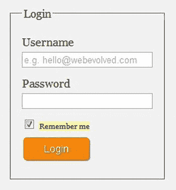
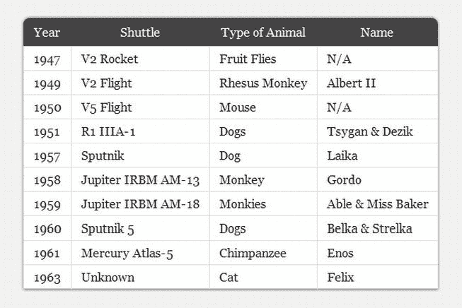

# 八、使用 CSS 选择器保持标记简洁

为了用 CSS 样式化一个元素，我们需要能够定位它。进入 CSS 选择器，它允许我们定位 DOM 中的特定元素。

使用 CSS3 选择器，我们可以在比以前更细粒度的层次上定位元素。这意味着你的标记可以非常简洁、语义化和灵活。此外，新元素状态伪类允许额外突出动态状态变化。

在前一章中，你已经复习了级联、继承和 CSS 特性。在这一章中，我们将提醒自己选择器的基础知识。然后我们将看看 CSS3 属性选择器，接着是结构元素状态、`:target`和否定伪类。然后，我们将简要介绍 CSS 2.1 的生成内容伪元素`:before`和`:after`，看看它们如何很好地处理 HTML5 的部分，我们将在 CSS3 中引入新的双冒号语法。我们还将看看当前浏览器对 CSS 选择器的支持，以及 CSS 选择器的前景。最后，我们将简要讨论第七章中描述的 Selectivzr polyfill，它允许你在所有浏览器中使用这些新的选择器。

### 选择器破落

W3C 选择器级别 3 ( `[`j.mp/w3cselectors`](http://j.mp/w3cselectors)1`)模块在 2011 年 9 月成为推荐标准。它列出了所有的选择器(总共不到 40 个)，而不仅仅是 CSS3 中的那些。正如您已经了解到的，这是因为 CSS3 并不是一个全新的规范，而是建立在 CSS1 和 CSS 2.1 之上的。如果你认为 40 个选择器需要学习很多，不要担心——你可能已经知道很多了。

CSS1 中引入了以下选择器:

*   类型(如`p {...}`、`blockquote {...}`)
*   后代组合子(例如，`blockquote p {...}`)
*   ID(如`<article id="content">`上的`#content {...}`
*   类别(例如，`< article class="hentry">`上的`.hentry {...}`
*   链接伪类(如`a:link {...}`或`a:visited {...}`)
*   用户动作伪类(如`a:active {...}`)
*   `:first-line`伪元素(如`p:first-line {...}`
*   `:first-letter`伪元素(如`p:first-letter {...}`

如果其中任何一个你看起来不熟悉(我们会原谅最后两个)，那么我们建议你查一下。SitePoint CSS 参考是一个很好的起点。 2

CSS 2.1 中又增加了 11 个选择器。

*   通用(如`* {...}`)
*   用户动作伪类(例如`a:hover {...}`和`a:focus {...}`)
*   `:lang()`伪类(例如`article:lang(fr) {...}`)
*   结构伪类(如`p:first-child {...}`)
*   `:before`和`:after`伪元素(如`blockquote:before {...}`或`a:after {...}`
*   子组合子(例如，`h2 > p {...}`)
*   相邻兄弟组合符(例如`h2 + p {...}`)
*   属性选择器(如`input [required] {...}`)
*   属性选择器；完全相等(如`input [type="checkbox"] {...}`)
*   子串属性选择器；一个等于字符串(如`input [class~="long-field"] {...}`)
*   子串属性选择器；以字符串开头的连字符分隔(例如，`input [lang|="en"] {...}`)

__________

1

2

其中一些你可能知道。但是，如果您以前没有看到它们，也不用担心，因为 CSS3 选择器 3 级模块是在这些基础上构建的，并添加了功能。

我们将在本章中看到的 CSS3 中添加的选择器如下:

*   一般兄弟组合子(如`h1 ~ pre {...}`)
*   子串属性选择器；字符串以(例如，`a[href^="http://"] {...}`)开头
*   子串属性选择器；字符串以(例如，`a[href$=".pdf"] {...}`)结尾
*   子串属性选择器；字符串包含(如`a[href*="twitter"] {...}`)
*   `:target()`伪类(例如`section:target {...}`)
*   结构伪类；:`nth-child`(例如`tr:nth-child(even) td {...}`)
*   结构伪类；:`nth—last-child`(例如`tr:nth—last-child(-n+5) td {...}`)
*   结构伪类；:`last-child`(例如`ul li:last-child {...}`)
*   结构伪类；:`only-child`(例如`ul li:only-child {...}`)
*   结构伪类；:`first-of-type`(例如`p:first-of-type {...}`)
*   结构伪类；:`last-of-type`(例如`p:last-of-type {...}`)
*   结构伪类；:`nth-of-type`(例如`li:nth-of-type(3n) {...}`)
*   结构伪类；:`nth-last-of-type`(例如`li:nth-last-of-type(1) {...}`)
*   结构伪类；:`only-of-type`(例如`article img:only-of-type {...}`)
*   结构伪类；:`empty`(例如`aside:empty {...}`)
*   结构伪类；:`root`(例如`:root {...}`)
*   UI 元素状态伪类；`:disabled`和`:enabled`(如`input:disabled {...}`)
*   UI 元素状态伪类；`:checked`(例如`input[type="checkbox"]:checked {...}`)
*   否定伪类；`:not`(例如`abbr:not([title]} {...}`)

通过查看这三个列表，我们可以得出结论，CSS3 中引入的 CSS 选择器数量与 CSS 1 和 CSS 2.1 中引入的数量相同。这对我们来说太难了，所以让我们直入主题吧。

### CSS3 选择器

我们已经到了有趣的部分——CSS3 选择器。由于有一系列不同的选择器可供我们使用，所以很难决定使用哪种类型的选择器。随着新的 CSS3 选择器的引入，我们将为它们提供真实世界的用例，您可以从今天开始在您的项目中使用它们。首先是组合子。

#### 组合子

假设你以前使用过 CSS，你几乎肯定遇到过组合子。毫无疑问，您知道后代选择器，之所以这样称呼是因为它们的目标是子元素、孙元素或文档树中给定元素的后续元素。最简单的情况是，后代组合子允许您将位于另一个元素类型中的单个元素类型的所有实例作为目标，比如`article p {...}`。

相反，子组合子只针对那些父元素的直接子元素。他们使用大于号(`>`)运算符。因此，`article > p {...}`的目标是那些属于`article`的子段落，而*不是*嵌套在文章下面的`section`中的段落，如下面的代码示例所示:

`article > p {
font-size:125%;
}`

下一个组合子，相邻兄弟，目标是在文档树中彼此相邻并具有相同父元素的元素。再次使用前面的例子，我们可以使用`+`操作符编写`h2 + p {...}`来设计每个`section`(假设它们都使用`h2`标题)的开头段落:

`h2 + p {
font-weight:bold;
}`

以下代码显示了哪个选择器针对哪个段落:

`<article>
  <h1>Article Title</h1>
  
...
<!-- Child combinator targets this paragraph -->  
  <section>
    <h2>Section Title</h2>
    
...
<!-- Adjacent sibling combinator targets this paragraph -->
    
...

  </section>
  
...
<!-- Child combinator targets this paragraph -->
</article>`

到目前为止我们看到的例子都是 CSS 2.1 中包含的组合子，那么 CSS3 呢？

CSS3 添加了通用的兄弟组合符，它使用波浪号(`~`)操作符。当使用一般的兄弟组合子时，第二个选择器*不必紧跟着第一个选择器*；但是，选择器的两个部分必须仍然共享同一个父级。扩展这个例子，我们可以在深度嵌套的部分中使用一般的兄弟组合来定位`ul`,如下所示:

`h3 ~ ul {
list-style-type:binary;
}

<article>
  <h1>Article Title</h1>
  
...
<!-- Child combinator targets this paragraph -->
<section>
  <h2>Section Title</h2>
  
...
<!-- Adjacent sibling combinator targets this paragraph -->
  
...

  <ul>
      <li>...</li>
      <li>...</li>
      <li>...</li>
  </ul>
  <section>
    <h3>Section Title</h3>
    
...

    
...

    <ul><!-- General sibling combinator targets this list -->
      <li>...</li>
      <li>...</li>
      <li>...</li>
    </ul>
  </section>  
</section>
  
...
<!-- Child combinator targets this paragraph -->
</article>`

这展示了 CSS 中组合子的力量，特别是 CSS3 如何让我们对目标元素有更多的控制。

#### 属性和子串选择器

在本章的介绍中，你学习了 CSS 2.1 引入了属性选择器。CSS3 通过增加工具箱中子串选择器的数量，扩展了我们可以使用的属性选择器列表。这意味着我们现在可以瞄准一个规则，并根据属性值的一部分将 CSS 样式应用于元素。简而言之，我们将看到如何使用它们来样式化文档下载链接或电子邮件地址，但是首先让我们简单回顾一下 CSS 2.1 的属性和子串选择器。

如果给定的属性存在，最基本的属性选择器允许您设置元素的样式。例如，我们可以使用下面的代码来设计任何具有`title`属性的缩写元素的样式:

`abbr[title] {
  border-bottom:1px dotted #000;
}`

或者我们可以通过使用您在第六章的中遇到的`required`属性来指出那些需要的字段。

`input[required] {
  background:url(img/mandatory-icon.png) 100% 50% no-repeat;` `  padding-right:20px;
}`

使用 equals ( `=`)操作符，我们的属性选择器可以匹配给定属性的特定值，比如复选框。

`input[type="checkbox"] {
  width:20px;
  height:20px;
}`

目前还没有太疯狂的事。接下来，我们可以使用波浪号(`~`)操作符从一列空格分隔的值中指定一个特定的属性值。这对于用微格式或微数据标记的内容非常有用，这些内容通常使用多个属性值。

`<a ... rel="external license">...</a>`

以`rel`属性的`license`值为目标的 CSS 应该是:

`a[rel~="license"] {
  background:url(img/copyright.png) 100% 50% no-repeat;
  padding-right:20px;
}`

最后一个 CSS 2.1 属性选择器不经常使用，但是如果您在使用多种语言的站点上工作，它会很有用。竖线(`|`)操作符允许您从特定值开始定位包含在带连字符列表中的元素。假设您想要将指定了英语语言的锚点作为目标，而不管它是英式英语(en-GB)还是美式英语(en-US)(因为它们都包含“en”)。

`a[hreflang|="en"] {
        border-bottom:3px double #000;
}`

最后两个例子介绍了两个操作符，我们可以用它们来匹配属性值的子串部分。CSS3 更进一步，使用`^`、`$`和`*`操作符提供了三个额外的子串选择器。它们非常有用，可以用来确保您的标记保持超级干净，没有不必要的类，同时增强用户的体验。

##### “开头为”子字符串属性选择器

脱字符号(`^`)操作符，当与子字符串选择器相关时，意味着“开始于”例如，我们可以使用它来定位我们内容中的所有外部链接，并添加一个小图标来指示它们是外部链接。下面的代码通过使用`^`属性子串选择器向所有以`http://`开头的链接添加背景图像和填充:

`a[href^="http://"] {
        background:url(img/external.png) 100% 50% no-repeat;
        padding-right:15px;
}`

在图 8-1 中，你可以看到外部链接在锚点的末端有一个小图标。这个图标，一个有箭头指向的盒子，已经成为一个被广泛认可的外部链接符号。

**图 8-1。**使用`^`属性子串选择器样式的外部链接

这是一个快速添加图标到外部链接的好方法，但是你可能有一些以`http://`开头的链接不是外部链接，比如你自己网站的链接。在这种情况下，您不希望图标出现。我们可以通过在最初的规则下添加另一个规则(因为它们具有相同的特异性)来解决这个异常，从而使我们域的外部链接的属性集无效。因为链接可能指向站点内的不同页面，所以保留了`^`操作符。

`a[href^="http://"] {
        background:url(img/external.png) 100% 50% no-repeat;
        padding-right:15px;
}

a[href^="http://thewebevolved.com"] {
        background:none;
        padding-right:0;
}`

图 8-2 显示了这一点。有两个用图标表示的外部链接和一个图标被移除的内部链接(“许多猴子”)。

**图 8-2。**使用`^`属性子串选择器进行样式化的外部链接和以`http://`开头但没有样式化的内部链接

`^`操作符的另一个用途可能是指向以`mailto:`字符串开始的电子邮件链接，并添加一个图标和填充。

`a[href^="mailto:"] {
        background:url(img/email.png) 100% 50% no-repeat;
        padding-right:15px;
}`

##### “以”结尾的子串属性选择器

我们已经讨论了“始于”，现在让我们来看看“止于”这个操作符是美元符号`$`，语法与`^`语法完全相同。常见用途包括添加图标来表示文档下载的不同文件类型或指示不同的提要类型。

要指示链接指向 PDF 文档，您可以使用

`a[href$=".pdf"] {
        background:url(img/pdf.png) 100% 50% no-repeat;
        padding-right:18px;
}`

在图 8-3 中，文本“生活杂志”链接到一个 PDF 文档。使用前面的代码，我们在链接中添加了一个小的 PDF 图标来表示这一点。

**图 8-3。**使用`$`属性子串选择器样式化的 PDF 链接

您可以使用此方法来定位任何文件类型，如。医生。jpg 或. xml。

##### “包含”子字符串属性选择器

我们要查看的最后一个子字符串选择器使用了星号或星号(`*`)操作符，它代表“contains”它允许您将应用了多个类的元素作为目标。它还可以用于定位锚点中的特定域。在下面的例子中，它被用来突出显示那些链接到一个人的 Twitter 账户的锚(结果见图 8-4 ):

`a[href*="twitter"] {
        background:url(img/twitter.png) 100% 50% no-repeat;
        padding-right:20px;
}` 

**图 8-4。**使用`*`属性子串选择器设计的 Twitter 账户链接

使用`^`操作符和值`[`twitter.com`](http://twitter.com)`可以达到同样的效果，但是使用`*`操作符可以帮助我们节省一些字节。当我们想要根据 Twitter 句柄(例如， `[`twitter.com/ZsaZsa`](http://twitter.com/ZsaZsa)`)对其中一个 Twitter 链接进行不同的样式化时，`*`子字符串选择器的真正威力就显现出来了。为了澄清，所有的链接都包含“twitter”，就像前面的例子一样，但是只有一个包含“ZsaZsa”。

`a[href*="ZsaZsa"] {
        background:url(img/twitter.png) 100% 50% no-repeat;
        padding-right:20px;
        color:#ff0;
}`

我们还可以使用`*`操作符，通过使用 XFN 微格式来表明我们与朋友、家人和其他人的关系状态，正如在第四章中介绍的那样。例如，如果我们想表明玛丽莲·梦露是我们的心上人，我们的标记可能如下所示:

`<a href="http://twitter.com/marilynmonroe" rel="met sweetheart friend">Marilyn Monroe</a>`

因为`rel`属性有三个值，使用`^`或`$`操作符很难确定目标，所以`*`(包含)成为一个选项，CSS 2.1 波浪号(`~`)也是如此，它也可以在这个实例中使用，因为值是用空格分隔的。对于这个例子，我们将使用新的 CSS3 子串选择器`*`:

`a[rel*="sweetheart"] {
        background:url(img/sweetheart.png) 100% 50% no-repeat;
        padding-right:20px;
}`

你有它！玛丽莲·梦露是我们的心上人(见图 8-5 )。

**图 8-5。**使用`*`属性子串选择器样式化的甜心关系

不过，你可能已经发现了一个问题:玛丽莲的 Twitter 图标不见了。这是因为两种样式规则具有相同的特异性，并且`a[rel*="sweetheart"] {...}`规则出现在样式表的更下方。我们可以通过在甜心规则中添加一些额外的填充来解决这个问题，并使用多个背景图片(更多细节，见第十一章)来添加放置在不同位置的两个图标。

`a[rel*="sweetheart"] {
        background:
          url(img/sweetheart.png) 100% 50% no-repeat,
          url(img/twitter.png) 85% 50% no-repeat;
        padding-right:40px;
}`

#### UI 元素状态伪类

大多数表单元素都有可能被启用、禁用或选中。通过使用 UI 元素状态伪类，我们可以在这些元素处于特定状态时定位它们，比如复选框被选中。让我们看一个基本的登录表单，看看如何实现这些元素状态伪类。图 8-6 显示了正常情况下的表单。

**图 8-6。**正常样式的登录表单

现在假设用户名和密码字段以及登录按钮已经被禁用。接下来显示了这方面的 HTML，并在需要的地方应用了`disabled`属性。

`<form action="">
<fieldset>
<legend>Login</legend>

<label for="uname">Username
<input type="text" id="uname" placeholder="e.g. hello@webevolved.com" disabled />
</label>

<label for="password">Password
<input type="password" id="password" disabled />
</label>

<input type="checkbox" id="rememberme" checked disabled />
<label for="rememberme">Remember me</label>

<input type="submit" value="Login" id="login" disabled />

</fieldset>
</form>`

我们现在需要适当地设置字段的样式，以显示它们已被禁用。我们可以在那些需要的元素上使用`:disabled`伪类来设计这些状态(在本例中是所有的`input`)。

`input:disabled {
        background:#999;
        border:1px solid #666;
}`

我们将禁用字段和按钮的背景颜色设置为灰色，这样它们看起来就不“活动”或不可点击。这显示在图 8-7 的右侧中。

**图 8-7。**使用`:disabled`、`:enabled`和`:checked` UI 元素状态的登录表单的两个实例

`:checked`和`:enabled`伪类的工作方式完全相同。正如你在图 8-7 左侧的表格中看到的，我们已经高亮显示了选中复选框旁边的“记住我”标签(使用相邻的兄弟组合符)。我们还用不同的边框颜色突出显示了已启用的字段(属性选择器用于确保更高的特异性)。

`input[type="checkbox"]:checked + label {
        display:inline;
        background: #F9FDA2;
}

input[type="text"]:enabled, input[type="password"]:enabled {
        border:1px solid #75aadb;
}`

当状态为活动时，这些 UI 元素状态伪类被切换(选中/未选中)并应用。使用它们可以为用户提供有用的视觉反馈，并改善您的网站体验，而无需您付出太多努力。

**CSS 基本用户界面模块三级**

选择器模块之外是另一个包含伪类的模块，CSS 基本用户界面模块 Level 3 ( `[`j.mp/css3uimodule`](http://j.mp/css3uimodule)3`)。在这个模块中，你会发现一些额外的 UI 状态伪类，类似于上面讨论的那些。它们是:

默认必需
有效可选
无效只读
范围内读/写
范围外

当与我们在第六章中遇到的 HTML5 表单一起考虑时，这些伪类非常有用。浏览器支持类似于 CSS3 选择器。有些需要厂商前缀，但请放心，它们很快就会出现在您附近的浏览器中。更多细节和支持，请阅读瑞安·塞登斯的“前瞻性思维形式验证”文章。

#### 目标伪类

CSS3 引入了一个新的`:target`伪类。`:target`被设计为当所选元素成为链接的活动目标(URL 中指向它的片段标识符)时工作。虽然你以前可能没有遇到过术语*片段标识符*，但是你会用到它们。片段标识符是页面中特定元素(例如，`#flight`)上的命名锚或 id。当您点击以片段标识符结尾的链接时，该链接所引用的元素就变成了`:target`。

我们可以像设计`:hover`或`:focus`一样设计`:target`的样式。用例范围很广，从简单的 FAQ 列表到目录页面、页面内导航和脚注。

这里有一个例子，它突出显示了你从页面内导航链接到的页面部分。这是页面的基本标记:

`<article>
<hgroup>
<h1>Miss Baker</h1>
<h2>First Lady of Space</h2>
</hgroup>

<nav>
<ol>
  <li><a href="#introduction">Introduction</a></li>
  <li><a href="#flight">Flight</a></li>` `  <li><a href="#mission">Mission</a></li>
  <li><a href="#retirement">Retirement</a></li>
</ol>
</nav>

  
...

<section id="flight">
  <h1>Miss Baker's Historic Flight</h1>
  ...
</section>

<section id="mission">
  <h1>The Mission</h1>
  ...
</section>

<aside>
  <h1>The US Space Program</h1>
  ...
</aside>

<section id="retirement">
  <h1>Life in Retirement</h1>
  ...
</section>

<footer>
  ...
</footer>
</article>`

__________

3

4

注意每个`section`和`div`是如何被赋予自己的 ID 的。然后我们在`nav`中为这些 id 添加了相应的锚。这为我们提供了使用`:target`所需的片段标识符(id)。

我们将添加一个规则，以便在从导航中单击相应的部分时高亮显示该部分。将`:target`伪类添加到 ID 为(片段标识符)*的元素中，而不是将*添加到锚中。因为我们有两种带有片段标识符的元素，所以我们将通过对选择器进行分组，将规则添加到`section`和`div`元素中。

`section:target, div:target {
background: #F9FDA2;
}`

图 8-8 显示了点击锚点后高亮显示的部分。为了更进一步，你可以使用 CSS 动画制作背景颜色的变化，这在第十二章中有介绍。

**图 8-8。**通过使用`:target`伪类实现高亮显示的部分。

当然，对所有类型的元素应用`:target`可能会变得相当混乱，但是我们可以通过使用通用选择器(`*`来解决这个问题，如下面的代码所示。然而，使用`*`选择器会对站点性能产生负面影响，所以要小心使用。

`*:target {
background: #F9FDA2;
}`

可爱！一个简单的规则，你可以添加到你的 CSS 中，帮助用户在通过页面内链接导航时容易地看到他们在文档中的位置。

作为一个额外的例子，我们现在将创建一个基本的 CSS 标签式界面，类似于您习惯用 JavaScript 使用`:target`创建的界面。以下是选项卡式面板和相关导航的简化标记:

`<article>
<h1>Features</h1>
<a href="#s-one">One</a> | <a href="#s-two">Two</a> | <a href="#s-three">Three</a> | <a href="#s-four">Four</a>

<section id="s-one">
  <h1>Section One</h1>
  
Lorem ipsum dolor set amet.

</section>
<section id="s-two">
  <h1>Section Two</h1>
  
Lorem ipsum dolor set amet.

</section>
<section id="s-three">
  <h1>Section Three</h1>
  
Lorem ipsum dolor set amet.

</section>
<section id="s-four">
  <h1>Section Four</h1>
  
Lorem ipsum dolor set amet.

</section>

</article>`

我们将选项卡区域包装在一个`<article>`中，然后包含了导航链接。接下来是一个`
`(用于造型)和几个`<section>`，每个都有一个唯一的 ID，每个锚点都将链接到这个 ID。请注意，我们没有使用`<nav>`标签，也没有将导航项目放在列表中，原因稍后会解释。

我们现在将对`article`、`div`和`section`应用一些基本样式，以绝对定位它们，并作为选项卡式内容区域。

`article, div {
        position:relative;
}

section {
        display:block;
        position:absolute;
        top:10px;
        left:0;
        background:#333;
        color:#fff;
        width:100%;
        min-height:400px;
}`

下一步是激活`:target`伪类。我们希望将它应用到每个`section`，我们将更改`z-index`属性，使该部分显示在其他部分之上。记住，我们将 `:target`应用于带有片段标识符的元素，而不是锚。由于示例的简单性，我们可以创建一个针对文档中所有部分的规则。

`section:target {
        z-index:2;
}`

为了确保第一个选项卡在初始页面加载时是可见的，我们将使用`:first-of-type`选择器(本章后面会详细介绍)来改变它的`z-index`。

`section:target,
section:first-of-type {
        z-index:2;
}`

这给了我们一个基本的 CSS 标签切换器。下一步是让活动选项卡以某种方式突出显示。要做到这一点，我们需要能够定位标记中位于`section`之上的锚。在我们的例子中，`section`是周围`div`的孩子，而后者又是锚的兄弟。这给你提出了一个问题；仅使用 CSS，您无法定位父元素(毕竟，CSS 本质上是“层叠的”)，这是高亮显示活动选项卡所需的*和*。为了解决这个问题，我们需要为每个锚点添加一个 ID，如下所示:

`<a href="#one" id="one">One</a> | <a href="#two" id="two">Two</a> | <a href="#three"
id="three">Three</a> | <a href="#four" id="four">Four</a>`

然后，我们将`:target`应用于我们的锚来设置活动状态。

`a:target {
        background:#f5f5f5;
        font-weight:bold;
}`

这解决了活动标签的问题，但破坏了不再切换的标签面板。为了解决这个问题，使用子和相邻兄弟组合符(本章前面介绍过)来定位每个`section`。

`#one:target ~ div > section#s-one,
#two:target ~ div > section#s-two,
#three:target ~ div > section#s-three,
#four:target ~ div > section#s-four,
section:first-of-type {
        z-index:2;
}`

该规则被设置为针对每个`section`元素，该元素是与标记中的锚相邻(`~`操作符)的`div`的子元素(使用`>`操作符)。还包括默认的`section:first-of-type`规则，以确保第一部分在页面加载时高亮显示。因为，如前所述，您不能使用 CSS 选择父元素，这就是为什么不在`ul`或`nav`元素中放置锚点的原因。如果我们以那种方式编写标记，这将意味着前面的规则无法实现。现在我们有了:一个使用 CSS3 的`:target`伪类构建的简单选项卡式界面(见图 8-9 )。

**图 8-9。**使用 CSS3 的`:target`伪类构建的选项卡式界面

虽然这种技术并不完全可靠，但是还有其他创建 CSS 标签的技术可以进一步研究，如 Corey Mwamba 在 Dev 上所描述的。Opera ( `[`j.mp/operatargettabs`](http://j.mp/operatargettabs)5`)和 Chris Coyier 上 CSS-Tricks ( `[`j.mp/targettabs`](http://j.mp/targettabs)6`)。

如果你更喜欢冒险，你可以通过使用`:target`来创建图片库(`[`j.mp/targetgallery`](http://j.mp/targetgallery)7`)、幻灯片和手风琴(`[`j.mp/targetaccordion`](http://j.mp/targetaccordion)8`)来减少页面中对 JavaScript 的需求。为了进一步拓展边界，你可以将`:target`与 CSS 过渡或转换结合起来，你将在第十二章中了解到，添加那些微妙的点缀来改善用户体验。

#### 结构伪类

我们已经看到了几个伪类:`:target`和 UI 元素状态伪类。现在该看看超级强大的结构伪类了。这些选择器允许我们对 DOM 中的元素或元素的一部分进行样式化，但是如果不添加 id 或类，就不能通过使用其他选择器来定位。它们开始被用来最大限度地减少在标记中添加额外的类，无论是源代码中的类，还是使用 jQuery 等 JavaScript 库动态添加的类。

__________

5

6

7 `[`rem.im/css-gallery/`](http://rem.im/css-gallery/)`

8

除了一个结构伪类，其他的都在 CSS3 中引入了，但是因为我们对你很好，我们甚至会给你一点奖励，解释一下`:first-child`，它是在 CSS 2.1 中引入的。另外，这似乎是我们开始研究结构化伪类的一个好地方。

##### :第一个孩子

如果你曾经在列表的第一项或文章的第一段添加过一个`first`类，请举手。有罪？请放心，我们也举手了。别担心，我们不会告诉任何人，但我们会告诉你如何避免。顾名思义，`:first-child`允许您定位文档树中给定元素的第一个子元素。

以本章前面的示例页面为例，假设我们想要增加引言中第一段的字体大小和粗细。我们可以通过在 ID 为“introduction”的`div`中的段落上使用`:first-child`伪类来做到这一点

`div#introduction p:first-child {
        font-size:18px;
        font-weight:bold;
}`

图 8-10 显示了这一点。

**图 8-10。**第一段使用`:first-child`伪类增加字号

如你所见，这是一个简单而有效的方法，可以帮助你避免患上严重的 classitis。

*注:Internet Explorer 7 中有一个非常奇怪的 bug，带有:first-child，由罗伯特·尼曼(Robert Nyman)发现。如果你在第一个元素(你试图定位的元素)前放置一个注释，IE 7 会把这个注释当作第一个子元素，因此不会把这个规则应用到你试图定位的元素上。解决方案？如果可以的话，移动你的评论。罗伯特在他的博客上写下了这些。*

##### :最后一个孩子

猜猜这个选择器会帮助你瞄准什么，没有奖励。它也是 CSS3 伪选择器中的第一个。图 8-11 显示了一个导航菜单的例子，其中每个项目都有一个右边框。

**图 8-11。**导航菜单，每个项目都有一个右边框

我们可以使用`:last-child`从最后一个列表项中移除边框，就像这样:

`nav li:last-child {
        border-right:0;
}`

您可以在图 8-12 中看到，边框已经从最后一个列表项中移除。非常简单，你不觉得吗？

**图 8-12。**导航菜单使用`:last-child`从最后一个菜单项中移除右边框

##### :第 n 个孩子

伪类是事情开始变得有点棘手的地方，因为我们需要开始使用数学。我们确信你们都对这一前景感到兴奋，但是相信我们，这并没有那么难。

__________

9

`:nth-child`允许您定位给定父元素的一个或多个特定子元素。它可以采用数字(整数)、关键字(`odd`或`even`)或计算(表达式)的形式。当你想设计如图 8-13 中所示的数据表时，这真的很方便。

**图 8-13。**样式简单的 HTML 数据表

我们将从使用关键字值`even`开始，并添加一种背景色，在交替的表格行上创建斑马条纹效果，以提高可读性。

`tr:nth-child(even) td {
        background-color:#eee;
}`

图 8-14 展示了我们配有斑马条纹的桌子。

**图 8-14。** HTML 数据表用斑马条纹表用`:nth-child`

现在，俗话说，“剥猫皮的方法不止一种。”对于前面的例子，我们可以使用表达式`2n`或`2n+0`达到相同的效果，这意味着“每隔一行设置样式”

`tr:nth-child(2n) td {
        background-color:#eee;
}`

如果我们想要反转行并对奇数行应用背景色，我们可以使用关键字`odd`或表达式`2n+1`，这意味着“从第一行开始每隔一行”以下示例具有完全相同的效果:

`tr:nth-child(odd) td {
        background-color:#eee;
}

tr:nth-child(2n+1) td {
        background-color:#eee;
}`

到目前为止一切顺利吗？很好，因为我们会稍微增加复杂性。使用类似于我们以前见过的那些表达式，让我们假设我们想要将表的每第四行作为目标。我们可以简单地使用

`tr:nth-child(4n) td {
        background-color:#eee;
}`

从第二排开始每隔四个项目怎么样？

`tr:nth-child(4n+2) td {
        background-color:#eee;
}`

你可以看到这里出现了一种模式。现在让我们来对付班上那个想倒数的聪明孩子。假设您想要样式化表格中的前五行。您可以通过对`n`使用负值来做到这一点。

`tr:nth-child(-n+5) td {
        background-color:#eee;
}`

##### :第 n 个-最后一个孩子

在我们追求最少标记的终极样式的过程中，另一个可用的选择是`:nth-last-child`伪类，它本质上与`:nth-child`相同，但从*的最后一个*元素开始计数。使用与上一个示例相同的表达式突出显示表中的最后五行(注意与上一个示例中的*前五行*的不同之处)。

`tr:nth-last-child(-n+5) td {
        background-color:#eee;
}`

同样，就像`:nth-child`，`:nth-last-child`接受`odd`和`even`参数，而不必为`n`使用负值。

##### :独生子女

在我们继续之前，还有一个“子”伪类要看，那就是`:only-child`。它像您所期望的那样工作，将任何元素作为其父元素的唯一子元素。如果您有一个只包含一个项目的动态生成的列表，这可能会很方便，在这种情况下，您可能希望减少边距。

`ul li:only-child {
          margin-bottom:2em;
}`

##### :一流的

“类型”伪类的工作方式与“子”选择器相同，关键区别在于“类型”伪类只针对那些与选择器所应用的元素相同的元素。当您不能保证不会有任何不同的子元素时，它们是最有用的。例如，如果在每个段落之间放置了一个`hr`，通过使用`:first-of-type`，我们可以确保我们只针对段落。

以我们之前的`:first-child`为例，我们可以使用`
`作为一个样式挂钩。使用`:first-of-type`，我们可以写

`div#introduction p:first-of-type {
        font-size:18px;
        font-weight:bold;
}`

为了增加乐趣，我们可以将 CSS1(是的，1)中的`:first-of-type`和`::first-letter`伪元素结合起来，以样式化引言中第一段的第一个字母(如图图 8-15 )。CSS3 为伪元素引入了新的双冒号(`::`)语法，以区分伪元素和伪类，如`:hover`。下面是一个示例中的双冒号语法:

`div#introduction p:first-of-type::first-letter {
        font-size:60px;
        float:left;
        width:auto;
        height:50px;
        line-height:1;
        margin-right:5px;
}` 

**图 8-15。**使用 CSS 伪选择器样式的第一段的第一个字母

##### :类型的最后一个

和`:first-of-type`一样，使用`:last-of-type`可以达到和`:last-child`一样的效果。要从最后一个菜单项中移除右边框，可以使用

`nav li:last-of-type {
        border-right:0;
}`

##### :第 n 种类型

`:nth-of-type`的工作方式与`:nth-child`相同，使用相同的语法。然而，如果你的目标之间存在某种因素，它会比`:nth-child`更有用。让我们来看看下面的例子，一个`section`带有一个标题，后面是太空图片中的动物列表:

`<section id="animals">
<h1>Animals in Space</h1>
<ul>
  <li></li>
  <li></li>
  <li></li>
  <li></li>
  <li></li>
  <li></li>
  <li></li>
  <li></li>
  <li></li>
  <li></li>
</ul>
</section>`

现在，删除列表创建的项目符号，浮动每个`li`并添加一些边距。

`#animals ul {
        list-style-type:none;
}

#animals li {
        float:left;
        width:200px;
        text-align:center;
        margin-right:2em;
        margin-bottom:2em;
}`

图 8-16 显示了到目前为止你所拥有的；您可以看到边距导致第三个列表项被放到新的一行上。问题是你的设计要求每行应该有三张图片。

**图 8-16。**太空动物列表

现在使用`:nth-of-type`瞄准每三个列表项(`3n`)，并移除右边距以确保它们不会掉到新的一行。

`#animals li:nth-of-type(3n) {
        margin-right:0;
}`

结果如图 8-17 所示。

**图 8-17。**太空中的动物列表，每行三个项目

与`:nth-child`一样，您也可以使用表达式(`2n+1`)或关键字(`odd`或`even`)来定位特定的元素。

您还可以使用表达式`li:nth-of-type(1) {...}`使用`:nth-of-type`来定位组中的第一个项目，这与使用`:first-of-type`具有相同的效果。

##### :第 n 个类型的最后一个

使用`:nth-last-of-type(1) {...}`和使用`:last-of-type`是一样的，但是结合表达式，允许你从最后一项开始倒计数，就像`:nth-last-child`一样。使用`nth-of-type`的例子，通过增加一个大的左边距将最后一只孤独的动物移到中间(见图 8-18 )。

`#animals li:nth-last-of-type(1) {
        margin-left:232px;
}` 

**图 8-18。最后一项居中的太空动物列表**

##### :仅类型的

`:only-of-type`目标元素的父元素没有其他相同类型的子元素。假设你有一篇文章，可能包含几幅图片；但是，如果只有一个图像，您希望对它进行不同的处理，比如让它全幅显示。这就是`:only-of-type`发挥作用的地方。

`article img:only-of-type {
  width:100%;
}`

##### :空

`:empty`可以是极其有用的伪类。它表示一个没有内容的元素。假设我们的页面中有一个动态生成的`aside`，它没有任何内容；我们可以用`:empty`隐藏它。

`aside:empty {
        display:none;
}`

在你高兴地跳起来之前，有一个警告:如果浏览器发现一个字符，甚至是空白，这个元素将被呈现，因为它不再正确地匹配`:empty`选择器。垃圾。向标记中添加 HTML 注释是安全的，但是要确保没有空格。

##### :根

我们不能忽略的一个结构伪类是`:root`类。HTML 中文档的根通常是`html`元素，这正是`:root`的目标。如果您想出了这个选择器的一个用例(我们确信一定有人想到了)，请务必让我们知道。为了完整起见，它是这样工作的:

`:root {
          background-color:red;
}`

#### 伪元素

我们在本章前面简要讨论了`::first-letter`伪元素，以及 CSS3 如何为伪元素引入新的双冒号(`::`)语法，以区分伪元素和伪类。这个新语法适用于 CSS1 和 CSS2 中的下列伪元素:

*   `::first-letter`
*   `::first-line`
*   `::before`
*   `::after`

虽然这些伪元素可以在以前的 CSS 版本中找到，但直到最近它们才获得广泛的浏览器支持。因此，我们将简要地看一下如何使用`::before`和`::after`伪元素。

##### *之前和之后

`::before`和`::after`伪元素用于在一个元素的内容(或另一个伪元素)之前或之后生成内容。“在元素的内容之后”这个短语在这里很重要。这意味着您不能在具有空内容模型的元素上使用`::before`和`::after`，比如``或`<input>`。这是不幸的，因为`::before`和`::after`有几种可能的用例，比如用`input type="range"`来显示最小值和最大值。为此，需要更改规范。Opera 目前允许这样做，但是这样做违背了规范。

虽然生成不存在于您的标记中的内容可能会令人不快，但正如我们将看到的，有许多合法的用例。这些伪元素的生成内容由`content`属性提供，该属性可以采用以下一个或多个值:

*   *一个字符串*:文本内容
*   *URI*:图像等外部资源的 URI
*   *计数器*:用于生成元素的自动编号
*   *属性值*:指定属性的值的字符串
*   *左引号或右引号*:用 quotes 属性中指定的字符串替换值。
*   *没有开始或结束引号*:没有引入内容，但是增加了嵌套层次。

首先，我们来看看添加一个字符串。要在每个`<figcaption>`元素前插入单词“Figure ”,我们应该写

`figcaption::before {
    content:"Figure:";
}`

该字符串必须用引号括起来。还可以包含 unicode 字符，需要用反斜杠(`\`)进行转义。考虑下面的例子，在这个例子中，我们想要在页面顶部的链接末尾添加一个向上箭头符号(Unicode 2191)。HTML 代码片段如下:

`
<a href="#top">Back to top</a>
`

接下来是使用`::after`伪元素添加箭头的 CSS 规则(见图 8-19 )。它使用一个属性选择器来只定位带有#top `href`的锚点。

`a[href="#top"]::after {
        content:" \2191";
}` 

**图 8-19。**一个锚点使用生成的内容在元素的内容后添加一个箭头符号

现在让我们看看如何使用`content`属性追加属性值。这个例子显示了当一个锚点有焦点(或悬停)时的链接的 URL。我们只希望外部链接出现这种情况，所以我们将使用本章前面描述的“starts with”(`^`)子串选择器。

`a[href^="http://"]:hover::after, a[href^="http://"]:focus::after {
        content:attr(href);
        position:absolute;
        width:auto;
        bottom:-22px;` `        left:0;
        padding:0 5px;
        color:#fff;
}`

您使用了带有带有`href`参数的`attr`值的`content`属性。然后，您将内容放置在链接下面。

最后，为了展示如何组合几个值，我们添加了一个字符串(“外部链接”)，后跟`href`属性。

`a[href^="http://"]:hover::after, a[href^="http://"]:focus::after {
        content:"External Link " attr(href);
        position:absolute;
        width:auto;
        bottom:-22px;
        left:0;
        padding:0 5px;
        color:#fff;
}`

##### 进一步探索伪元素

伪元素的潜力非常广泛，从页面卷曲到章节的自动编号。您甚至可以在打印样式表中包含 URL。现在浏览器对伪元素的支持正在改善(尽管它从 CSS 2.1 就已经存在)，这也有助于删除不必要的用于样式目的的`div`。

如果您希望进一步研究，看看如何实现计数器、引号等等，我们建议您阅读 CSS 2.1 ( `[`j.mp/css2gencontent`](http://j.mp/css2gencontent)10`)和 CSS3 规范(`[`j.mp/css3content`](http://j.mp/css3content)11`)的相应部分。

关于利用你将在第十一章中遇到的一些属性的许多其他用途，看看尼古拉斯·加拉格尔的个人网站(`[`j.mp/necolas`](http://j.mp/necolas)12`)，在那里他详细介绍了几个使用伪元素的实验。最后，乔恩·希克斯写了一篇 24ways 的详细文章，讲述如何结合 HTML5 data-* attributes、@font-face(见第十章)，生成内容显示图标而不使用图像(`[`j.mp/hicksfonts`](http://j.mp/hicksfonts)13`)。这确实是一项非常创新和聪明的技术。

#### 否定伪类

我们要看的最后一个选择器是否定伪类，`:not()`。在许多方面，它的工作原理与其他选择器相反，因为它允许你定位那些*与选择器的参数*不匹配的元素。我们知道这很奇怪，但它仍然非常实用——而且你会发现自己会越来越多地使用它。

__________

10

11

12

13

一个主要的例子是样式化所有表单输入，这些表单输入不是提交按钮。

`input:not([type="submit"]) {
        width:250px;
        border:1px solid #333;
}`

这使您不必仅仅为了设计样式而向 Submit 按钮添加额外的类。或者从另一个角度来看，它让你不必每隔一个`input`添加一个类。这些标记看起来已经精简了，对吗？

您还可以在测试期间使用 negation 伪类来捕捉那些验证不会捕捉到的东西。例如，如果您想查看所有没有指定`title`属性的缩写，只需使用

`abbr:not([title]) {
        outline:2px dotted red;
}`

图 8-20 显示了通过使用`:not()`伪类显示出来的虚线轮廓。

**图 8-20。**没有`title`属性的`abbr`使用否定伪类进行样式化。

您可以使用相同的技术来突出显示没有指定`alt`属性的图像。

`img:not([alt]) {
        outline:2px dotted red;
}`

这是 Eric Meyer 在他的诊断样式表中使用的一种技术。您可以在测试时添加诊断 CSS 来捕捉所有这些错误并修复它们。当您准备好部署到站点时，只需删除该文件。

### 浏览器支持

IE9+、Firefox 3.5+、Chrome 4+、Safari 4+和 Opera 10+完全支持 CSS3 选择器(尽管有三个小的例外)。

__________

14

IE6、IE7 和 IE8 中的支持实际上是不存在的(IE7 和 IE8 支持一般的兄弟组合、`:first-child`和所有的属性选择器)，但是您可以通过用本地 JavaScript 或 jQuery 库进行多填充来解决这个问题。

Internet Explorer 的另一个警告是，如果你正在分组选择器，IE 遇到一个它不理解的选择器，它将忽略整个规则。例如，如果你有

`ul li:nth-child(3n), ul li.last {
  margin-right: 0;
}`

IE 不会识别规则，所以你需要把它们拆分成自己的规则，就像这样:

`ul li:nth-child(3n) {
  margin-right: 0;
}

ul li.last {
  margin-right: 0;
}`

上一章介绍的 selective Zr(`[`j.mp/selectivzr`](http://j.mp/selectivzr)15`)是一个有用的 polyfill。该库模拟了 5.5 到 8 版本中的伪类选择器。不幸的是，目前，当与某些 JavaScript 库一起使用时，它并不能模拟本章所涉及的所有属性选择器或组合子。

或者，您可以决定，如果这些小图标只是作为增强功能添加的，对网站的功能并不重要，那么它们不显示在功能较弱的浏览器中也没关系。选择权在你。

### 未来的选择者

尽管这本书关注的是 CSS3，我们还是想让你知道一个小秘密。CSS4 就在眼前。嗯，就选择者而言。选择器 4 级模块目前处于“工作草案”阶段，并定期更新。尽管还处于早期阶段(预计会有重大的修改)，一些选择器已经从选择器规范中移除，一些已经被添加。那些被排除在外的包括伪元素，将被重新安置在其他地方。相比之下，当前基本用户界面规范中的 UI 状态伪类已经被合并到选择器第 4 级模块中。目前还有许多其他的变化正在进行中，比如扩大了 negation ( `:not`)伪类的范围。

就新的选择器而言，目前有许多选择器，包括匹配相似选择器字符串的选择器(`:matches`)、语言伪类(`:dir`)、时间维伪类(`:current`、`:past`和`:future`)、网格结构选择器(`:column`、`:nth-column`、`:nth-last-column`)，以及令人兴奋的父选择器(语法待定)。当然，要了解比我们在这里提供的更多的细节，你可以阅读规范(`[`j.mp/css4selectors`](http://j.mp/css4selectors)16`)。或者，http://j.mp/storeycss4 在他的博客上写了一篇精彩的总结，但请记住，当你读到这篇文章时，它可能已经过时了。

__________

15

### 总结

在这一章中，你学习了通过使用强大的 CSS3 选择器，我们不需要添加不必要的类和 id 到我们的标记中，确保我们能够真正地将我们的内容和表现彼此分开。您看到了如何定位一个组中的第一个、最后一个、奇数个或偶数个项目。我们还展示了如何单独使用表达式和元素来定位元素组。

您看到了如何使用负伪类来帮助您的测试和诊断。我们引入了在适当的地方添加生成内容的想法。我们还向您展示了如何通过使用`:target`和 UI 元素状态伪类给出更好的反馈来改善用户体验。最后，我们通过简单地看一下 CSS4 选择器和(如 Storey 先生所描述的)magic unicorn 父选择器，让您对未来有所了解。

现在，您已经掌握了定位页面中各种元素的方法，下一章将向您展示如何使用新发现的选择器功能来创建漂亮的基于 CSS 的布局，这些布局可以无缝地跨设备工作。

__________

16

17 `[`generatedcontent.org/post/10865123182/selectors4`](http://generatedcontent.org/post/10865123182/selectors4)`

### 作业

对于您的家庭作业，首先创建您自己的诊断样式表，然后对您的站点进行测试，以挑选任何空属性或缺失值。

继续查看您正在开发的站点，并决定在哪里可以利用这些新的强大的选择器，以使您不必在标记中添加类或 id。你应该能够包含一些我们在本章中使用过的选择器。接下来通过使用`::before`和`::after`伪元素集成一些生成的内容。

最后，仅使用`:target`选择器构建一个仅支持 CSS 的图库。

### 附录

表 8-1 是 CSS 选择器的表格，它们的含义，它们被描述的规范部分，以及它们被添加到哪个版本的 CSS 中。这个表是基于 W3C 在`[www.w3.org/TR/css3-selectors/#selectors](http://www.w3.org/TR/css3-selectors/#selectors)`的表。

