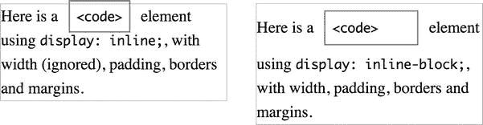
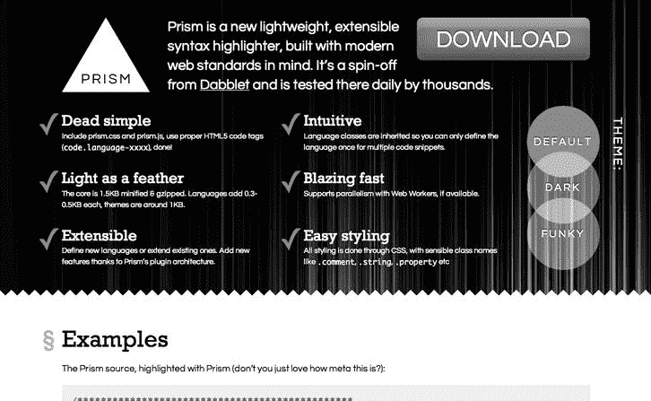
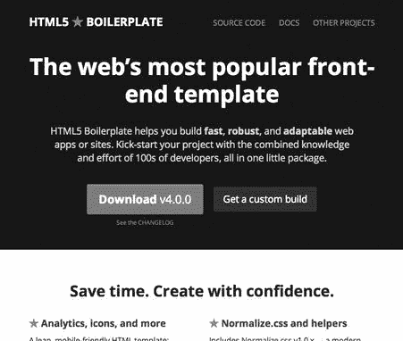
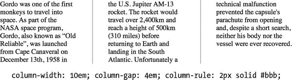
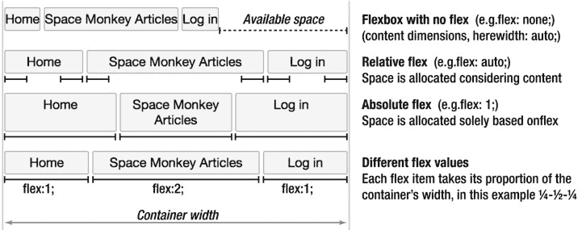

# 九、适合各种场合的布局

在这一章中，你将学习如何使用 CSS 来定位元素，并创建 CSS 布局。这是 CSS 在历史上的弱点——基于 CSS 2.1 的布局技术使用了最初不用于页面布局的属性，并且不适合今天的 web 应用。我们将从重温基础知识开始:CSS 盒子模型、浮动、定位和朋友，以及如何使用它们来创建灵活和固定的布局。然后，我们将看看`@media`媒体查询的隐藏力量，看看如何在响应式 Web 设计的旗帜下，根据设备的功能来调整 CSS，为设备提供定制的体验。然后，我们将以一瞥 CSS3 布局规范的未来来结束。但是首先让我们回顾一下过去，看看影响 CSS 布局的一些趋势，并为为什么媒体查询最近变得如此重要做好准备。

### 许多设备组成的网络

1989 年 3 月，蒂姆·伯纳斯·李在写万维网的最初提案时，提到“异构性”是需求之一。

> *需要从不同类型的系统中访问相同的数据*
> 
> *-信息管理:蒂姆·伯纳斯·李爵士的提议*
> 
> `[`j.mp/html-proposal`](http://j.mp/html-proposal)1`

这是指蒂姆·伯纳斯·李在欧洲粒子物理研究所工作的系统，所列举的系统(VM/CMS、Macintosh、VAX/VMS、UNIX)可能并不都是大家熟悉的。然而，这种精神已经成为网络的基础，并作为通用访问的核心原则的一部分存在于 HTML 的设计原则中。

> 在可能的情况下，功能应该能够跨不同的平台、设备和媒体工作。
> 
> *-HTML 设计原则*，W3C
> 
> `[`j.mp/html-principles-5-1`](http://j.mp/html-principles-5-1)2`

我们所听到的对这一观点的最佳总结来自热情如火的 Molly Holschlag，她在 2009 年西南偏南(SxSW)的 Web 标准项目(WaSP)年会上宣称:

> *任何人，任何地方，任何用户代理，**一张网**。*
> 
> ——Molly Holschlag，在 WaSP 年会上的发言，SxSW 2009[播客；1:03:30]
> 
> (`[`j.mp/wasp-2009audio.sxsw.com/2009/podcasts/D4%20SXSW_PODCASTS/031609_PM2_HILB_WASP_Annual_Meeting.mp3`](http://j.mp/wasp-2009audio.sxsw.com/2009/podcasts/D4%20SXSW_PODCASTS/031609_PM2_HILB_WASP_Annual_Meeting.mp3)`)

那么为什么这个原则如此重要呢？这是因为现在，比以往任何时候，我们使用和构建的网络是由许多设备组成的网络。这一趋势还在加速，我们应该采用新的技术来迎接挑战。

#### 显示器尺寸的演变

追溯到 20 世纪 90 年代，任何浏览互联网的人都可能使用 800x600 像素的屏幕。随着平均显示器尺寸的增加，web 设计者在 2000 年开始瞄准 800x600 px 显示器，然后在 2007 年左右瞄准 1024x768 px 显示器(具有许多固定宽度 CSS 框架今天使用的 960 px 宽度)。([【http://j.mp/960px-width】](http://j.mp/960px-width))3

然而，2006 年关于是否是时候从 800x600 像素转移的争论与最近的发展相比显得苍白无力。虽然移动浏览早在 1998 年就出现了，但直到最近几年，手机才真正开始浏览“一个网络”，而不是早期 WAP 和 cHTML 尝试的病态替代品。当前所谓的智能手机和平板电脑的爆炸式增长给大众带来了真正的移动浏览。虽然许多智能手机都集中在 320x480 px 的屏幕尺寸上，但在尺寸和像素密度方面有很多变化。在撰写本文时，国际上最常见的移动屏幕尺寸是 240x320 px，通常为 152 ppi(每英寸像素)，但屏幕尺寸和分辨率有很大的差异(并且越来越大)。

在光谱的另一端，非常大的屏幕最近变得负担得起，并且高分辨率显示器也正在出现。除了手机、平板电脑和电脑，我们现在还有电视、游戏机，甚至是显示网页的汽车和冰箱，所有这些设备的显示屏尺寸、浏览器功能和带宽都千差万别。

很明显，我们行业以前的固定宽度布局标准无法应对挑战。面对这一大堆设备和功能，斯科特·简森称之为“电子产品的僵尸启示录”([`j.mp/zombie-devices`](http://j.mp/zombie-devices)design mind . frog design . com/blog/the-coming-zombie-启示录-small-cheap-devices-will-disrupt-our-old-school-UX-assumptions . htm)，我们该怎么办？

#### 针对每种设备优化的独立站点？但那是胡说八道！

一种方法是创建针对各类设备优化的网站。目前，这通常意味着桌面电脑的标准网站和智能手机的优化网站。平板电脑的到来可能会给这个列表增加另一类设备。通过这样做，您可以根据每个平台的优势设计定制的体验，并确保设计运行良好。

在某些方面，这是一个很好的解决方案。与在家或工作时相比，人们在旅途中访问网站时通常有非常不同的内容需求。此外，通常还有不同的功能，例如小得多的屏幕的限制或在移动设备上访问地理位置数据的能力。([【http://j.mp/mobile-web-friendly】](http://j.mp/mobile-web-friendly))4

__________

1

2

但是，很快连三个版本都可能不够。这也意味着复杂性的大幅增加，因为现在您需要测试和维护多个站点。虽然在理想的情况下，你有足够的资源来处理好每一个网站，除非你非常专注(并且有足够的资金)，这通常会导致一个维护良好的网站，而其他版本会被忽视。

多年来，人们试图以各种方式解决不同设备能力的问题。在过去，这通常意味着*浏览器嗅探*，根据用户代理字符串检测浏览器，然后从服务器发送定制内容，或者定制网站在客户端的显示。如果执行得不好，这种方法是非常脆弱的，当新的浏览器发布时经常会崩溃。更现代和更负责任的对等物是*功能嗅探*，使用 Modernizr 和 YepNope 等工具检测设备的功能并根据功能定制内容。这是*渐进增强*的扩展，为支持它的用户代理增加了额外的功能。Internet Explorer 的条件注释也起到了一定的作用，例如一直流行的 IE6 通用样式表([`j.mp/universal-ie6-css`](http://j.mp/universal-ie6-css)通用 Internet Explorer 6 样式表`by Andy Clarke stuffandnonsense.co.uk/blog/about/universal_internet_explorer_6_css`)。

理想的方法是创建一个网站，这个网站能够适应用来浏览它的设备。虽然这听起来像是需要魔法的事情，但实际上我们需要做的只是接受媒体的固有特性，因为**适应性是网络默认的功能**。约翰·奥尔索普在十多年前写了一篇关于这个问题的文章，这篇文章可能是我们这个行业的开创性文章，“网页设计之道”

> 灵活是网络的本质，作为设计者和开发者，我们的职责应该是拥抱这种灵活性，并制作出所有人都可以通过灵活访问的页面。
> 
> 约翰·奥尔索普于 2000 年出版的《网页设计之道》
> 
> (`[`j.mp/dao-web`](http://j.mp/dao-web)` 5 )

__________

3 Cameron Moll 在“1024 像素分辨率的最佳宽度？”中介绍了 960 像素网格的开发(www.cameronmoll.com/archives/001220.html)

4 Bruce Lawson 在 Opera 的“移动网络优化指南”中介绍了如何变得对移动设备友好(`dev.opera.com/articles/view/the-mobile-web-optimization-guide`)

虽然默认情况下 Web 可能是灵活的，但默认样式的页面也不那么引人注目。这并不是完美的解决方案，但是容纳众多设备的网络的最简单的方法就是好好编码，使用灵活的布局。然而，在讨论灵活布局之前，让我们快速回顾一下内容在浏览器中显示的基础知识。

### CSS 的可视化格式模型——一路向下都是盒子！

元素在 CSS 中的可视化布局可能很复杂，但本质上是相当简单的。显示的每个元素都由一个或多个框组成。这些盒子可以有不同的属性，可以以不同的方式相互作用，但基本的事实是一切都是一个盒子。当然，CSS 也有一个模型——盒子模型。

#### 盒子模型:内容、填充、边框、边距

想到盒子，你可能会想到包装精美的礼物(也许是蛋糕！).礼物在一个盒子里，可能被一些保护空间或衬垫包围着。除非它接触到其他盒子，否则盒子周围可能还有一些空白。CSS 盒模型盒是类似的，基于元素的内容，加上它的`padding`、`border`和`margin`属性。你已经熟悉了这本书前半部分的内容，所以让我们回顾一下`padding`、`border`和`margin`，因为这三个属性影响一个元素在页面中可以占据多少空间。

*   `padding`向元素内容的一侧或多侧添加空格。它是透明的，所以它揭示了元素的背景颜色和/或背景图像。
*   `border`控制元素每一侧的边框外观，包围内容和`padding`。这通常是一条由`border`属性定义宽度、样式和颜色的彩色或半透明线条，但它可以有圆角，甚至可能使用边框图像(见第十一章)。边框被添加到元素的`padding`和`margin`之间，默认情况下，它覆盖元素的背景。
*   `margin`也影响一个元素的一个或多个边上的空间，并且是透明的，但是与`padding`不同，它也可以接受负值和值`auto`。这些选项允许您将元素从其初始位置移开，或者更改它与周围元素的交互方式。它也可以作为 CSS 布局的一部分，你会在本章后面的“用负边距改变列顺序”一节中看到。

正如你在第七章的“CSS 速记”一节中所记得的，这三个速记属性也有不同的种类(比如`margin-top`)，在`border`的情况下，还有一系列单独的属性(比如`border-bottom-color`)。

这里我们还应该提到`outline`，它类似于`border`，但是并没有改变盒子所占的空间。它被添加到元素的`border`之外，与任何`margin`重叠，并堆叠在元素内容之上。与`border`不同，单个`outline`样式应用于元素盒子的所有侧面。您将主要在*浏览器默认样式表*(浏览器默认应用于每个页面的 CSS 规则)中看到`outline`，用于在链接和表单字段上指示`:focus`以实现可访问性。一般来说，你会希望不使用`outline`，而是使用更灵活的`border`。

这些属性占用的空间量以长度单位定义。这些是:

*   ***`%:`** 包含块宽度的百分比，作为一个数字后跟`%`，如`33.3%`*

*字体-相对长度单位，如:*

*   *`em:`字体的高度(嗯，元素的`font-size`的计算值)。*
*   *`ex:`字体的 x 高度，一般是字符“x”的高度(约 0.5em)*
*   *`ch`:字符单位，定义为字符“0”的前进宽度(一个排印术语)。这对于指定与等宽字体(包括中文、日文和韩文字体)中的字符数相等的值非常有用。(【http://j.mp/defining-ch】6)*
*   *`rem`:根单元的字号，`<html>`。这避免了与`em`的继承问题。*

*视口-相对长度单位如:*

*   *`vw`:视口宽度的百分比。视区是页面的可见部分，由浏览器窗口限定。这与正常的百分比不同，因为它是初始包含块的百分比，可以比元素的当前包含块更宽。*
*   *`vh`:视口高度的百分比。*
*   *`vm`:`vw`和`vh.`* 的较小值

*绝对长度单位，如*

*   *`px` : CSS 像素；出于分辨率的目的，1px 等于 1in 的 1/96，给出 96dpi 的固定 CSS 分辨率。*
*   *`cm`:厘米*
*   *`mm`:毫米*
*   *`in`:英寸*
*   *`pt`:分；1 磅等于 1 英寸的 1/72。*
*   *`pc`:Picas；1pc 等于 12pt。*

__________

6

*(注意长度为`0`时，单位为相对和绝对单位可选。)*

*由于浏览器支持，我们目前仅限于屏幕 CSS 的`%`、`em`和`px`，尽管在现代浏览器中对`rem`有广泛的浏览器支持，但现在可以使用`em`或`px`单元回退(更多细节请参见第十章)。绝对单位(除了`px`)应该只在打印样式表中使用。*

CSS 中的像素也值得进一步解释。这些像素可能与显示像素不同，并被定义为视角，因此无论距离远近，它们的大小都大致相同。移动电话和投影仪上的 CSS 像素的相对大小对观众来说应该是相同的，尽管绝对大小是非常不同的。这也意味着高分辨率显示器可能会使用多个设备像素来显示一个 CSS 像素，而双分辨率显示器的每个 CSS 像素会使用四个设备像素。

非零宽度填充、边框、边距和/或轮廓的显示顺序是从元素的边距和背景色开始，然后是背景图像、填充、边框、实际内容，最后是顶部的轮廓。这在图 9-1 块级盒子的 CSS 盒子模型的分解 3D 图中进行了说明。

**图 9-1。**一个 CSS 盒子(包括轮廓)，有一个分解图显示块级盒子的各个部分是如何堆叠的

这个图展示了盒子模型如何为块级盒子工作，一个使用样式`display: block;`的盒子。属性有一系列不同的值，但是两个基本的值是`block`和`inline`。通常，块级框包含内容块，如包含文本的`
`元素，而内联框被添加到内容中，如围绕一些文本的`<strong>`元素。它们在 CSS Box 模型中的工作方式也有所不同，所以让我们从`display: block;`开始，一次看一个。但首先，简短地跑题一下国际化和定位词。

HTML 和 CSS 的奇妙之处之一是在国际化和可访问性方面做了大量的工作。“同一个网站”是国际化和多语言的，在本章中记住这一点很重要。

虽然英语和许多欧洲语言是从左到右、从上到下书写的，但其他语言不是这样，例如阿拉伯语和希伯来语(从右到左)，以及传统风格的汉语和日语(从上到下、从右到左)。为了简单起见，我们将使用基于英语的示例，其中文本从左到右，内容从上到下阅读。如果你使用的是不同规范的语言，请记住这一点。

###### 带显示的块级框:块

块级盒子是你的结构构建块。默认情况下，带有`display: block;`的元素与它们包含的元素一样宽，并且在页面中垂直排列。块级框的默认高度是包含框中内容所需的高度。这些是元素的*内在尺寸*——在应用 CSS 之前的宽度和高度。虽然如果文本大小或包含元素的宽度改变，段落的高度也会改变，但默认情况下，替换的内容(如图像)将使用其固有的宽度和高度，即使它被视口裁剪。参见图 9-2 。

**图 9-2** 。块级段落和图像。请注意，当视窗较窄时，顶部段落的高度会调整以包含文本，但默认情况下，图像会被裁剪。

*包含元素的概念将在本章后面的“块格式化上下文”部分详细介绍。*

对于块级的盒子，你可以使用属性`width`和`height`来改变这些固有的尺寸。使用百分比值时，它们分别基于包含元素的宽度和高度。一般来说，隐藏内容是一个坏主意，所以我们建议不要在包含文本或任何使用字体相关单位大小的元素上设置`height`——这是自找麻烦。如果浏览器的字体变大或者浏览器窗口变小，你很容易在元素上隐藏内容和滚动条。虽然您可以使用`overflow`属性来控制这种行为，但是最好不要隐藏任何内容。(如果无法避免为文本块设置`height`，使用`ems`来适应文本大小调整，并彻底测试。)

还有`max-width`和`min-width`的相关属性，加上较少使用的`max-height`和`min-height`，它们对元素的维度设置了上限和下限。如果你没有指定一个固定的宽度，但又不想让你的行在一个很宽的浏览器窗口中变得过长，这是非常方便的。它们在 Internet Explorer 6 中不起作用，所以最好为该浏览器添加一个针对 IE 6 的固定`width`。

###### 宽度和高度计算算法

默认情况下，CSS 盒子的`width`和`height`是其内容的大小——由`content`和`padding`之间的边缘定义。然而，盒子占据的空间是内容框**加上**任何填充、边框和边距。默认计算是

*   总宽度=`margin-left`+`border-left-width`+`padding-left`+`width`+`padding-right`+`border-right-width`+`margin-right`
*   总高度=`margin-top`+`border-top-width`+`padding-top`+`height`+`padding-bottom`+`border-bottom-width`+`margin-bottom`

图 9-3 显示了一个示例 div，它有固定的宽度和高度，加上边距、边框和填充来演示这一点。

`.box {
  width: 240px;
  height: 160px;
  margin: 24px 48px; /* = 24px 48px 24px 48px */
  border: 1px solid #ddd;
  padding: 12px 18px 6px; /* = 12px 18px 6px 18px */` 
`}

  <h1>CSS.</h1>
  
It’s boxes all the way down…

` 

**图 9-3** 。带有填充、边框和页边空白的框，以及 Safari 的 Web 检查器的“外观”标签中的相同元素

您最初可能希望 div 占用 240x160px，但默认情况下，它将占用以下空间:

*   总宽度= 48 px+1 px+18 px+240 px+18 px+1 px+48 px = 374 px
*   总计高度= 24px+1px+12px+160 px+6px+1px+24px = 228 px

当试图并排浮动两个 50%宽的元素时，通常会第一次遇到这种情况(我们稍后将讨论浮动)。如果您添加*任何*水平边距、边框或填充，两个框合起来会变得比 100%宽，第二个框会下降到下面。这也使得很难在`margin`、`border`、`padding`和`width`上使用不同的单位，因为`em`的大小和百分比单位分别随着浏览器的字体大小和浏览器宽度而变化。

这可能与你的期望相矛盾，因为当你邮寄礼物时，你要为盒子的尺寸付款*，包括*包装，而不仅仅是里面的东西。雪上加霜的是，6 版之前的 Internet Explorer 曲解了 CSS Box 模型，*将* `border`和`padding`包含为`width`的一部分。如果你忘记用一个 doctype 开始你的 HTML，它仍然会这样做，这就是所谓的怪癖模式。不要忘记文档类型！

###### 盒子大小属性

然而，一切旧的都是新的，使用`box-sizing`属性你现在可以选择`width`和`height`是指默认的`content-box`还是更直观的`border-box`(在边距和边框之间，称为*边框边缘*)，这对于布局来说更容易。使用`border-box`意味着边框和填充值不会像使用`content-box`那样增加元素的宽度和高度。

*   对于`content-box` : `width` =内容宽度
*   对于`border-box` : `width` = `border-left-width` + `padding-left` +内容的宽度+ `padding-right` + `border-right-width`

回到图 9-3 中的前一个例子，让我们看看`border-box`是如何改变数学的。

*   总宽度=`margin-left`+`width`+`margin-right`= 48px+240 px+48px = 336 px
*   总高度=`margin-top`+`height`+`margin-bottom`= 24px+160 px+24px = 208 px

图 9-4 清楚地显示了这种差异——`content-box`内容宽度与`border-box`边框边缘宽度相同。

**图 9-4** 。比较`box-sizing`属性的`content-box`和`border-box`值

请注意，默认情况下，元素的背景对于边框边缘是可见的，并且左上角是背景图像开始的地方。如果你改变了`box-sizing`，你可能会想要改变`background-clip`和/或`background-origin`，我们会在第十一章中介绍。默认情况下，当鼠标悬停在某个元素上时，浏览器的检查器工具中显示的尺寸是到边框边缘的尺寸，因此不包括`margin`。您可以使用我们在图 9-3 中看到的检查员工具的方框模型图来检查页边距。(Opera 的开发者工具和 Firefox 的 Firebug 也包含其他方便的信息，包括元素的`box-sizing`值。)

正如你在表 9-1 中看到的，浏览器对此的支持出奇的好，尽管 Firefox 13 及以下版本在结合`min-/max-height`、`min-/max-width`、SVG 和表格单元格时可能会有问题。

然而，如果您的受众包括 Internet Explorer 7 和更低版本，使用`box-sizing`将需要为这些浏览器定制变通办法，以避免破坏您的布局。虽然 Modernizr 可以检测到这一点，并且有 polyfills，但除非你支持很多传统浏览器，否则只添加面向 IE 的样式可能是最简单的。

*现在还有很多旧版的 ie 浏览器在用。原因包括 Windows XP(不运行 IE9，但仍被广泛使用)，公司政策，以及 IE 是最后一个转向自动更新的主要浏览器(从 2012 年开始)。我们提倡在创建网站时偶尔测试不同版本的 IE，因为你通常可以通过良好的编码和渐进增强来避免问题。然而，虽然 IE10 最终加入了“现代浏览器”的行列，但有时你会在早期版本(在 IE6-7 中更常见)中遇到一个怪癖或错误，需要给它们一点小小的推动。*

*历史上，这是通过使用 CSS 过滤器(`[`j.mp/css-filter`](http://j.mp/css-filter)` 7 )(如下划线和星号)或通过使用 IE 的条件注释(`[`j.mp/ies-cc`](http://j.mp/ies-cc) 8 ). Instead, we recommend using Paul Irish’s conditional classes on `<html>`(`[`j.mp/html-cc`](http://j.mp/html-cc)`9`):*加载特定于 IE 的样式表来完成的

`*<!--[if     lt       IE        7      ]>         <html     class="ie6">    <![endif]-->*
*<!--[if    IE      7      ]>                        <html    class="ie7">  <![endif]-->*
*<!--[if    IE      8      ]>                        <html    class="ie8">  <![endif]-->*
*<!--[if    IE      9      ]>                        <html    class="ie9">  <![endif]-->*
*<!--[if(gtIE9)|!(IE)]><!--> <html> <!--<![endif]-->*`

然后，你可以通过在相关的类前加上前缀来定位任何特定于 IE 的样式，就像这样:

`*img                        {max-width:                           100%;}*
*.ie6 img {width: 100%;}*`

__________

7 `en.wikipedia.org/wiki/CSS_filter`

8

9

###### 块级框的边距

块级框上的正边距值将增加框周围的空间。但是，负边距值的工作方式略有不同。对于块级元素，负的上边距将向上移动该元素(以及后面的元素)，可能会覆盖前面的内容，负的下边距将向上拉后面的内容，可能会覆盖该元素，如图 9-5 所示。

**图 9-5** 。应用于块级框的负垂直边距:左边的示例用于参考(没有负边距)，中间的示例有一个负的`margin-top`向上移动元素(和后面的内容)，右边的示例显示了一个负的`margin-bottom`“向上拉”后面的内容。

根据`width`是否为`auto`,负左右边距的工作方式不同。对于具有相关宽度或高度`auto`的块级元素，负的左边距或右边距将拉出框的边缘，*加宽*元素。对于具有设定宽度的块级元素(包括替换的内容，如图像)，负的左边距将使*元素向左移动*，负的右边距将把内容拉到元素的右边，可能会与元素重叠(尽管只有当块旁边有内容时，例如当应用于两个浮点中的第一个时，您才会看到这一点)。这在图 9-6 中显示。

**图 9-6** 。负水平边距应用于左侧带有`width: auto;`的块级框。中间的例子有一个固定的宽度和负的左边距和上边距。右边的例子在图像 1 上有一个负的`margin-right`，它将内容“拉”到右边。

如果元素的宽度没有父元素宽，使用`auto`作为左边距或右边距将会吸收所有未使用的空间。如图图 9-7 所示，默认情况下，一个图像会与其父元素的左边缘对齐，但是如果该元素有`margin-left: auto;`和`margin-right: 0;`，则该元素会接触到父元素的右侧。如果左边距和右边距都是`auto`，元素将在父元素的宽度上居中，如最右边的示例所示。

**图 9-7** 。对于比其父元素窄的块级框，添加设置为`auto`的水平边距将吸收任何额外的空间，允许您在它们的父元素内右对齐或居中元素。

###### 折叠垂直边距

具有块级盒子的盒子模型的另一个有趣的方面是*如果两个垂直边距接触，只有最大的边距被使用*。这听起来很奇怪，但实际上这是大多数时候你希望发生的事情。例如，在没有折叠页边距的情况下，CSS `p {margin: 1.5em 0;}`意味着段落之间的页边距是第一个段落顶部和最后一个段落底部的*的两倍*，正如你在图 9-6 的左边看到的那样。我们可以对此进行编码，例如只设置`margin-top`。然而，通过折叠垂直边距，我们不需要这样做——段落前和段落间的边距最终是相同的，如右图所示。

**图 9-8** 。两段，带`p {margin: 1.5em 0;}`。左边的例子演示了累积垂直边距是如何工作的。右边的例子显示了折叠垂直边距如何阻止段落之间的空间变得更大。

这看起来是一个小问题，但是当几个嵌套元素都有接触的顶部或底部边界时，就变得很重要了，比如一个列表(见图 9-9 )。

`ul {margin: 1.5em 0 1.5em 1.5em;}
li {margin: 0.75em;}

…

<ul><li>
…
</li></ul>` 

**图 9-9** 。如果多页边空白相互接触，它们会折叠成最大的一页。如果没有边距折叠，元素的嵌套将导致这两段之间有 5.25em 的间距。随着边距的缩小，该值变为 1.5em，这是最大的单个值。

没有边框、填充、内容或空白来分隔它们的元素的顶部和底部边距也是接触的，并且也折叠在一起。这就是为什么添加空段落来增加垂直空间这种直观但糟糕的想法行不通。然而，一旦边距被填充、边框(即使是透明的)或内容分开，垂直边距折叠就会被阻止，如图图 9-10 所示。元素还必须是*流入*(非浮动等)，并且在相同的*块格式化上下文*，这些概念我们将很快介绍。

`p {margin: 1.5em 0;}

…

<!-- two empty paragraphs -->

…
` 

**图 9-10** 。在第一个段落的下边距和最后一个段落的上边距之间，所有的垂直边距都相互接触，并且会被折叠成一个 1.5em 的边距。然而，在右边添加`p {border-top: 1px solid #000;}`意味着这个边框现在防止了一些页边空白接触(和折叠)，空段落变得可见。

现在我们已经讨论了块级盒子——带有`display: block;`的元素——让我们来看看内联盒子，另一种常见的盒子类型。

###### 带显示的嵌入式框:嵌入式

内联框元素通常包含文本内容的单词或短语，HTML5 的内容元素默认为`display: inline;`。与块级的盒子不同，它们和它们的内容一样长，而不是创建一个矩形，它们的盒子把每行的文本*(像荧光笔一样)，如果需要的话可以换行，如图 9-11 中的所示。内嵌框不能包含块级框。*

*

**图 9-11** 。一个包含一个内嵌框的参数图，该框有一个环绕(拆分)两行的边框。

替换的内容包括链接和嵌入的元素，如图像和视频。未替换的内容是其他所有内容，即 HTML 文件中的内容。内联替换和非替换内容的行为略有不同，所以让我们一次看一个。

默认情况下，内嵌替换的内容(如内嵌图像)使用其固有尺寸。它也使用与块级内容相同的盒子模型，填充和边距影响元素的所有边，正如你在图 9-12 中看到的。

**图 9-12** 。内联替换内容的示例。填充、边框和边距会影响此图像在各个方向占用的空间。

内联非替换内容(通常指文本)从`font-size`和`line-height`获得其高度。与图 9-12 中的内联图像不同，内联非替换内容上的填充和边距被应用，但只影响文本流向的元素和周围内容——在图 9-13 中，这是在左边和右边。负的左边距会将元素向左移动，负的右边距会拉近后面的内容，可能会与元素重叠。

**图 9-13** 。内联非替换内容的填充和边距(包括负边距)只影响文本流向周围的内容，在本例中是左右方向。

浏览器在*行框*中一次显示一行内联内容(文本和内联元素)。默认情况下，行框的高度足以容纳行中每个行内元素的框。对于替换的内容(内嵌图像)，这来自内容的尺寸加上垂直边距、边框和填充。这就是为什么图 9-12 的右图中的图像增加了线条之间的距离。对于非替换内容(文本)，这是内容的`line-height`。默认情况下，行内内容在基线上垂直对齐，即使字体大小有很大不同。这可以用`vertical-align`属性来改变，它也会影响内嵌框的高度。图 9-14 显示了添加`line-height: 0;`如何改变大文本和不同垂直对齐元素的行内框，改变包含该内容的行框的高度。

**图 9-14** :默认情况下，行框会扩展到包含其内容的行内框。对于非替换内容，您可以在比默认行框大的行内元素上使用`line-height: 0;`来防止这种情况。

*参考 Eric Meyer 的内联格式模型文章(发表于 2000 年！)以获得关于内联框如何布局的详细信息(`[`j.mp/inline-modelmeyerweb.com/eric/css/inline-format.html`](http://j.mp/inline-modelmeyerweb.com/eric/css/inline-format.html)`)。*

最后，如果您正在内联使用图像，`vertical-align`是您想要尝试的东西(`vertical-align: middle;`通常是您想要的)。我们将在第十章中更详细地介绍`vertical-align`的财产。

###### 其他显示值(特别是内嵌块和无)

虽然`display: block;`和`display: inline;`是最常见的值，`display`也有一些其他值。其中最有用的是`inline-block`，它使一个元素的行为与内联替换的内容相同，因此它被“收缩包装”到其内容中，并被视为内联框，但我们仍然可以使用`width`、`height`、`margin`和`padding`。然而，对于它包含的任何元素，它表现为一个块级容器，你可以在图 9-15 的中看到`inline`和`inline-block`之间的比较。

**图 9-15** 。宽度、填充、边框和边距都为`display: inline;`和`display: inline-block;`的元素。对于`display: inline-block;`，宽度(和高度)、垂直填充和边距影响元素的框和周围的元素，与替换的行内内容相同。

注意 IE 6-7 只接受默认为`display: inline;`的元素上的`inline-block`([`j.mp/ppk-display`](http://j.mp/ppk-display)`[www.quirksmode.org/css/display.html](http://www.quirksmode.org/css/display.html)`)。你可以通过只针对 IE6-7 的样式同时应用`display: inline;`和`zoom: 1;`来欺骗他们装病([`j.mp/ie-inline-block`](http://j.mp/ie-inline-block)10)。注意`display: inline-block;`也可以用于页面布局，尽管有一些注意事项，比如源代码中的空白，这是我们将在本章后面讨论的内容。

有一大组与表格相关的自定义样式表，尽管您不需要为普通的数据表指定它们，因为它们已经在浏览器的默认样式表中了。但是，如果您将 CSS 表格模型用于非`<table>`元素上的布局，您可能会使用它们，这一点我们将在后面介绍。

还有一些特殊用途的样式表，您可能只会在浏览器的默认样式表中看到，比如`list-item`和`ruby`。最后还有`none`，它阻止元素(和所有子元素)产生一个盒子。

###### 匿名信箱

块级框可以包含块级框或行内框。这听起来可能有点奇怪，因为在下面的代码中,`
`包含文本和块级元素，并且完全有效:

`<!-- warning: this div contains inline and block-level content -->

  Some inline content
  
An <strong>important</strong> block-level paragraph

`

__________

10

在这种情况下，浏览器会添加*匿名框*(块级或内联)来匹配可视化格式模型的规则，并使内容的布局更加容易。每当元素的`display` 属性与视觉格式化模型相矛盾时，也会发生这种情况。图 9-16 在左边显示了由元素生成的盒子，在右边是一个浏览器会使用的匿名盒子的代表。

**图 9-16** 。“一些内联内容”将成为块级匿名框，因为它的兄弟`
`是块级的。元素两边的内联内容将成为内联匿名框。

重要的是要注意，你不能使用 CSS 来设计匿名框*本身*的样式——它们从它们的父对象那里获得可继承的样式，并为其他所有东西采用默认值。然而，了解匿名框是有好处的，因为有时这种行为会导致意外的渲染。

不知道元素的默认显示值或它们的 HTML5 内容模型可能会导致意外的呈现，因此我们建议您熟悉这些内容，以便知道什么可以放在哪里。随着时间的推移，你会学到这方面的知识，但是当你有疑问时，使用验证器，并检查规范:

*   *validator.nu ( `[`validator.nu/`](http://validator.nu/)` )*
*   *HTML5 元素索引([`j.mp/html5-elements-index`](http://j.mp/html5-elements-index)11)*
*   *HTML5 元素内容类别([`j.mp/html5-element-categories`](http://j.mp/html5-element-categories)12)*
*   *CSS3 有点难，因为它是模块化的，所以请尝试单独的规格或 CSS3 2010 属性指数(`[`j.mp/css-2010-properties`](http://j.mp/css-2010-properties)` 14 )*
*   *最后，了解你的开发浏览器的检查器，并弄清楚如何检查`display`和其他属性的计算值。这会告诉你浏览器实际使用的是什么；如果和你预期的不一样，可能是这样的原因。*

__________

11

12

13

###### 定位方案和位置属性

前面我们已经了解到，块级别的盒子和它们包含的元素一样宽，并且被添加到前一个块级别的元素下面。这被称为*正常流程*(默认情况下框在那里)，实际上是由于默认的定位方案`position: static;`。CSS 2.1 中还有三种其他的定位方案:相对、绝对和固定定位。这三个定位方案允许您使用属性`top`、`right`、`bottom`和`left`将元素从方案的默认位置移开，这些属性接受长度值。如果您同时设置了`top`和`bottom`，或者`left`和`right`，这些也会分别设置元素的`height`和`width`，

*   *相对定位*:带有`position: relative;`的盒子所占空间与其在正常流程中所占空间相同(如果是`position: static;`)。但是您可以使用`top`、`right`、`bottom`和`left`将*相对于*移动到这个位置。如果移动元素，它所占用的原始空间将被保留(内容不会上移)，并且移动的元素可以与其他内容重叠。`position: relative;`对于为绝对定位的元素建立一个*包含块*也很有用。
*   *绝对定位*:绝对定位的元素也可以使用`top`、`right`、`bottom`和`left`来移动(和调整大小)。然而，与相对定位的元素不同，如果没有设置`width`，它会“收缩”到内容的宽度，并且在正常流中*不会占用*任何空间。一个绝对定位的元素最初将出现在它的静态位置，但是如果使用`top`、`right`、`bottom`或`left`移动，它将相对于它的包含块(它将是没有`position: static;`的最近的祖先元素)或根元素`<html>`定位。
*   *固定定位*:这是一种绝对定位。虽然带有`position: fixed;`的元素最初也将出现在其静态位置，`top`、`right`、`bottom`或`left`将相对于*视窗*(或打印样式表的每一页)对其进行定位。当页面滚动时，带有`position: fixed;`的元素不移动。像绝对定位的元素一样，它们仍然可以覆盖其他内容，如果没有设置`width`，它们也会“收缩包装”。

你可以在图 9-17 中对比这些定位方案。

**图 9-17** 。`positioning`属性的四个值的比较。每一对中右边例子中的定位框也有样式`top: -1em; left: -1em;`，并且稍微透明，以便更容易看到发生了什么。

虽然定位是一个有用的工具，但被定位的元素很容易重叠或隐藏内容，使它们变得不可原谅。即使字体大小和视窗宽度发生变化，也要检查是否留有空间。

###### 图层和 z 索引属性

当发生重叠时，CSS 中的默认分层是 HTML 源代码中后面的元素将覆盖前面的元素。使用`z-index`属性可以改变这一点。它接受整数值，按照从负到正的顺序堆叠元素，此外还有默认的`auto`值。具有整数值的定位框(包括`position: relative;`)建立一个*堆栈上下文*，子元素基于它们的`z-index`值进行堆栈。元素将需要有透明或半透明的背景(如`opacity: 0.5;`、`HSLa`或`RGBa`颜色，或不透明的图像)，以显示它们重叠的元素。

通常，重叠或隐藏的内容不是您想要的，您可能想要为定位的元素腾出空间，例如通过在另一个元素上使用边距，而不是使用`z-index`。然而，有时候只是门票的问题。最后，`z-index`整数是相对的，所以如果你没有得到你想要的效果，使用一个巨大的`z-index`数字是无济于事的——而是寻找原因。

###### 引入彩车

属性最初被指定为允许文本环绕图像。它取值为`left`、`right`、`none`和`inherit`。使用默认的`width: auto;`将`float: left;`应用到一个图像，使其成为一个块级的盒子*，其内容的尺寸为*(“收缩包装”)。因此，除非内容有一个固有的宽度(比如一个图像)，否则您通常也会想要添加一个特定的`width`。`float: left;`向左移动元素，直到它接触到包含框或另一个浮动的边缘，而`float: right;`向右做同样的动作。浮动元素也会将其从文档流中移除，因此它不会占用任何空间。这意味着后续未被浮动的块级元素会忽略被浮动的元素，并向上移动以填充间隙。然而，行内元素和行框*仍然为浮动元素腾出空间。例如，参见图 9-18 。*

**图 9-18** 。后面跟有段落的块级图像。应用`float: left;`或`float: right;`意味着图像不再占用正常流程中的空间(允许段落上移)，但段落的行框*会为图像腾出空间*。

如果不止一个连续的元素被浮动，只要还有空间，它们就会堆叠在一起。带有`float: right;`的元素从右到左排列，如图 9-19 中的右图所示。

**图 9-19** 。如果有空间的话，浮动的元素会在彼此旁边浮动。带有`float:right;`的元素从右到左排列。

一旦没有足够的空间，浮动将“下降”到第一个可用的空间。如果浮动的高度不同(如果涉及文本，这种可能性很大)，这可能不是你所希望的空间，如图 9-20 所示。

**图 9-20** 。一个掉落的浮子将会到达第一个有空间的地方。除非每个浮动元素都是相同的高度，否则这不会是您想要的位置。

如果您的网格只包含图像，您可以控制它们的大小，或者使用包装元素使每个图像具有相同的高度来防止这种情况。虽然你*可以*在 ems 中设置足够大的高度来包含任何内容，但是如果艺术总监的简报中的对象包含文本，那么使用不同的布局技术可能会更容易。

###### 结算浮动

因为浮动元素在正常流中不再占用任何空间，所以只包含浮动的元素将表现得好像没有内容一样。如果浮动容器是为了给浮动提供背景，这是不好的。此外，默认情况下，比容器高的浮动会伸出底部，因此它可以与后续内容进行交互。这对于图片周围的文字来说可能没问题，但是对于下一个部分的标题来说就不太好了。为了控制这一点，你需要学习如何清除浮动。

有几种方法可以将一个元素推到前面的浮动元素之下，或者使一个带有浮动子元素的元素展开以包含它。它们各有优缺点，我们一个一个来看。

*   *`clear`*属性*:对于值为`left`、`right`或`both`的元素，应用该属性可以防止它出现在前面任何分别具有`float: left;`、`float: right;`或 float 值的元素旁边，而是将其移动到被浮动元素的下面。虽然您可以将它添加到一个或多个 float 后面的元素中，为 float“腾出空间”，但有时没有元素可以添加它。历史上，人们在浮动元素后添加` `来使浮动容器扩展以包含它，但是现在有更好的方法。*
**   *简单明了的方法*(。`clearfix`):最初由托尼·阿斯莱特开发的 clearfix 方法([`j.mp/easy-clearing`](http://j.mp/easy-clearing)14)通过使用*生成的内容*和`:after`，给出了使用`clear: both;`而不添加额外元素的好处。虽然这是一种流行的技术，但实际上它在 IE < 8 中的效果略有不同，正如 Thierry Koblentz 在“你所知道的关于 Clearfix 的一切都是错误的”(`[`j.mp/clearfix-details`](http://j.mp/clearfix-details)` 15 )中所详述的那样。*   *浮动容器*:一个浮动自动包含任何被浮动的元素。单独使用，这已被称为浮动几乎一切(FNE)方法清除浮动 ( `[`j.mp/fne-method`](http://j.mp/fne-method)` 16 )。一般来说，我们建议采用以下浮动结算方法，而不是专门为 FNE 结算而浮动。然而，知道浮动将包含浮动的子对象意味着你不需要清除一个浮动容器，它本身就是浮动的。*   *`overflow`*属性*:控制当一个块级元素的内容对于它来说太大时会发生什么，比如一个长单词或者一个`<pre>`块。默认情况下，块级元素将垂直扩展，但是如果元素具有太小的固定高度或宽度，它将显示垂直或水平滚动条以提供对内容的访问。一般来说，除了浏览器的垂直滚动条，任何东西都应该避免——人们尤其讨厌水平滚动。对一个元素应用除了`visible`之外的任何值也会“清除”它旁边或里面的浮动。将`overflow: auto;`添加到一个包含浮动的元素中通常是一个很好的方法，可以使它扩展到包含一个浮动，尽管您需要注意滚动条上比容器更宽或更高的内容。对于图像，你可以使用`max-width: 100%; height: auto;` (CSS，我们将在讨论响应式网页设计时再次讨论)，对于文本，你可以使用`word-wrap`，我们将在第十章中介绍。注意`overflow: hidden;`也是有用的，尽管应该小心使用。最后，请记住这在 IE6 中不起作用，在 IE6 中您需要使用不同的技术，比如 Micro Clearfix 方法或`zoom: 1;`。***   *微 Clearfix 方法:*尼古拉斯·加拉格尔广泛研究了传统 clearfix 方法的问题，并开发了一种新的微 clearfix 方法(`[`j.mp/micro-clearfixnicolasgallagher.com/micro-clearfix-hack/`](http://j.mp/micro-clearfixnicolasgallagher.com/micro-clearfix-hack/)`)，这种方法在不同浏览器之间保持一致，并且代码更少。当你需要清除浮动并且不能使用`overflow`时，我们推荐使用这个。**

 **__________

14

15

16

`/* For modern browsers */
.group:before,
.group:after {
    content: " ";
    display: table;
}
.group:after {
    clear: both;
}
/* For IE 6/7 (trigger hasLayout) */
.group {` 
`    *zoom: 1;
}`

你可以在图 9-21 的中看到浮动清算的不同之处

**图 9-21** 。非浮动的容器元素不会扩展到包含浮动的子元素。一个后来被清除的非浮动兄弟元素，或者对容器应用一个“clearfix ”(比如`overflow: auto;`或者微 clearfix ),将扩展容器以包含浮动的子元素。

我们发现我们通常使用 micro clearfix 和`overflow`方法，但是只针对需要它的元素。然而，简单清除方法的跨浏览器问题给了我们一个很好的机会来研究*为什么*，并顺便提及 CSS 布局的基础之一。

###### 块格式上下文

您知道块级别的框是垂直布局的，它们的左边缘与包含它们的块元素的左边缘相接触(对于从左到右的语言)。但是浏览器怎么知道包含的元素是什么呢？建立*块格式化上下文*的元素成为其子元素的包含元素。默认情况下，这包括

*   浮动元素
*   具有除`static`或`relative`之外的任意`position`值的元素(例如`absolute`或`fixed`
*   阻塞不是块级盒子的容器(`inline-block`、`table-cell`和`table-caption`的`display`值)
*   具有除了`visible`之外的任意值`overflow`的块级盒

建立块格式化上下文可能非常方便。例如，一个浮动旁的未浮动元素将为浮动腾出空间，如果它成为一个块格式化上下文，如图 9-22 所示。

**图 9-22** 。使用`overflow: auto;`在段落上建立块格式上下文

您会注意到，这个列表包括了我们前面提到的几种清除浮动的方法——清除浮动是块格式化上下文的属性之一。除了清除浮动外，请记住:

*   块格式化上下文充当绝对定位元素相对定位的容器。
*   页边距不会超出块格式上下文。
*   只有相同块格式上下文中的框才会经历垂直边距折叠。

块格式上下文是浏览器如何进行布局的一个重要部分，花时间去理解它会让你对布局如何工作有更多的了解。这里有一些关于这个高级主题的进一步阅读材料:

*   《溢德秘益》作者妮可·沙利文(`[`j.mp/overflow-benefit`](http://j.mp/overflow-benefit)` 17
*   蒂埃里·科布伦茨(`[`j.mp/css-bfc`](http://j.mp/css-bfc)` 18 )

__________

17 `www.stubbornella.org/content/209/07/23/overflow-a-secret-benefit/`

18

*回到 IE 6-7 中轻松清除方法的结果略有不同的原因，这是因为这些浏览器不支持`:after`，而 IE 专有的`zoom`属性被用来清除它们。请注意，`zoom: 1;`使用 IE 的内部布局属性`hasLayout: true;`对元素进行样式化。其中，这会导致元素生成一个新的块格式上下文并包含浮动。然而，容易清除，非 IE CSS 规则不这样做，导致潜在的显示差异。micro clearfix 方法会在所有浏览器中产生新的块格式化上下文。*

*随着 Internet Explorer 8 和更高版本支持生成内容，这些版本在遵循规范方面做得越来越好，了解`hasLayout`的特性不再像过去那样重要。不过，在支持 IE6-7 的时候了解一下还是有好处的，所以这里有一些背景:*

*【Internet Explorer has layout 属性】by SitePoint ( `[`j.mp/ie-haslayoutreference.sitepoint.com/css/haslayout`](http://j.mp/ie-haslayoutreference.sitepoint.com/css/haslayout)`*

 `*《论拥有的布局》作者:霍利·伯格文、英戈·曹、布鲁诺·法西诺、约翰·格兰特、格奥尔格·索尔顿、菲利普·维滕贝格([【http://j.mp/having-layoutl】](http://j.mp/having-layout)19)*

*当我们谈到老 IE 怪癖的话题时，如果你遇到 IE6 的双边距错误([`j.mp/doubled-margin`](http://j.mp/doubled-margin)20)，你可以通过为该浏览器应用`display: inline;`来修复它。浮点的计算类型总是`display: block;`，所以这不会有任何负面影响。请注意，如果浮动包含比浮动的`width`更宽的内容，IE6 也会扩展浮动，而不是让内容突出来。如果没有预期的那么多空间，你可以使用针对 IE6 的`overflow: hidden;`来防止这导致浮点下降。*`  `###### 布局浮动

浮动布局只是使用浮动的能力与浮动或未浮动的内容并排排列*而不重叠*，将这种能力应用于布局各部分的容器元素。虽然它们最初不是为布局而设计的，但它们已经成为当前的布局主力，是 CSS 2.1 中不太好的布局选项中的佼佼者。

那么现在你已经知道了基本的浮动和清除浮动，你实际上是如何使用浮动来设计一个网页的呢？当内容垂直扩展时，常见的网页设计布局模式是有一个全幅页眉，接着是 1-3 列内容，最后是一个全幅页脚，出现在最高的一列之后，如图 9-23 所示。

__________

19

20 `www.positioniseverything.net/explorer/doubled-margin.html`

**图 9-23** 。常见的设计模式包括页眉、页脚和一至三列内容。一栏布局是纵向模式下手机的默认布局。灰色背景表示列，但是请注意，当使用浮动时，每个浮动将只和它的内容一样高。

一列布局很容易，全角的页眉和页脚也一样——块级元素默认是全角的。您可以使用浮动将块级元素放在一起，例如两列或更多列。但是，您需要注意所有列的总宽度变得大于包含元素宽度的 100%,好像没有足够的水平空间让浮动适应，这意味着最后一列将“下降”到下面。如前所述，混合水平单位(`width`以百分比表示，`border`以像素表示，等等。)使这成为可能，除非你使用`box-sizing: border-edge;`。我们的老朋友 IE 6 可以增加元素宽度几个像素(除了不支持`box-sizing`)，所以让列的组合宽度比包含元素的宽度小一点是个好主意，这样可以防止意外的列丢失。

让我们看看一些选择。

###### 两列布局方法

*   *将第一列向左浮动到第二列的大的左边距*:给一列添加左边距可以给你一个地方来浮动另一列。
*   第一列向右浮动，第二列有固定的宽度:通过缩小一列，你可以在右边创造空间来浮动另一列。
*   *将两列向左浮动*:当这个操作有效时，任何剩余的空间出现在最后一个浮动的右边。如果你有一个可视的右页面边缘，比如右浮动的边框，它的右边缘不会与容器元素对齐。
*   *左浮动第一列，右浮动第二列*:这确保右列与容器元素的右边缘对齐。任何剩余的空间都会出现在两列之间，不需要边距。

###### 三列或更多列的布局方法

您可以使用上述方法的修改版本来对齐两个以上的列。

*   *未浮动的中间列，浮动列的两边留有边距*:通过向两边添加边距，您可以为额外的列创建浮动空间。
*   *向左浮动列，除了右浮动最后一列*:任何剩余的空间出现在最后一列的左边。

我们建议启动你的文本浏览器(或使用 Dabblet.com 或 CodePen.io 等在线工具)，重新创建其中一些布局，为每个列元素分配不同的背景颜色。通过应用不同的 CSS 规则并查看结果，您将开始了解如何使用浮动构建一个简单的布局。

`

…

…

…
`

记得给每个 div 添加一些文本，或者指定一个宽度和高度，这样你就可以看到它们。

###### 伪造全高列背景

如果你的列有背景色，你可以看到浮动框只延伸到它们的内容。但是，您可能希望列背景色延伸到页脚，即使对于较短的列也是如此。要获得高度相等的列，您可以使用几种技术之一来伪造它。不幸的是，除非你使用基于像素的列宽(丹·塞德霍尔姆的假列宽技术是完美的([`j.mp/faux-columns`](http://j.mp/faux-columns)21)，否则没有基本的*和*广泛支持的方法，然而，克里斯·科伊尔已经汇编了一个 CSS 技巧的选项列表来帮助你([`j.mp/equal-height-cols`](http://j.mp/equal-height-cols)CSS-Tricks . com/fluid-width-equal-height-Columns/)，到你完成这本书时，尼古拉斯·加拉格尔的聪明的伪

__________

21

###### 使用负边距更改列顺序

在尝试这些布局模式时，您会注意到列元素的 HTML *源顺序*决定了它们的位置。当这是你想要的顺序时，这是好的，但有时不是。例如，在你的 HTML 中按照重要性排列你的内容是最理想的(基于用户想要首先看到的)，所以如果你的 CSS 没有加载，主要内容将会在顶部附近。理想情况下，你应该从一个简单的、单栏的、移动友好的布局开始(当我们在本章后面讨论响应式网页设计的时候会有更多的介绍)，然后在编写 CSS 的最后为更宽的显示器上的栏添加 CSS。如果是这样的话，你的内容来源可能已经按重要性排序了。即使你是从桌面布局开始的，当*线性化*你的设计——移除列上的浮动以使一列布局更适合移动设备时，把这想成一个好的源顺序是有用的。

虽然没有属性可以改变同级浮动的顺序，但是当你的列使用相同的`width`单位时，你可以在源中按照重要性顺序保存你的内容，然后通过使用*负边距*重新排列你的列。例如，您可以在图 9-24 的中看到以下代码的结果。

`<!-- note: using divs because we don’t know the content -->

…

…

…

div {
  float: left;
  /* box-sizing for easy testing */
  -webkit-box-sizing: border-box;
  -moz-box-sizing: border-box;
  box-sizing: border-box;
  border: 1px solid #666;
  padding: 0.5em;
  background-color: #ddd;
}
.content content {width: 50%;}
.nav secondary {width: 30%;}
.sidebar {width: 20%;}` 
`/* nav - content - sidebar */
.content {margin-left: 30%;} /* space for nav */
.nav {margin-left: -80%;} /* 50% + 30% */` 
`/* sidebar - content - nav */
.content {margin-left: 20%;} /* space for sidebar */
.sidebar {margin-left: -100%;} /* (50% + 20%) + 30% */

/* content - nav - sidebar */
/* This is easy as it’s source order. Floating alone is enough! */

/* nav - sidebar - content
not necessarily a good layout, but to show how it’s done */
.content {margin-left: 50%;} /* space for nav + sidebar */
.nav {margin-left: -100%;} /* (50% + 50%) */
.sidebar {margin-left: -70%;} /* 50% + 20% */` 

**图 9-24** 。使用负边距和数学重新排列浮动元素

要了解更多关于灵活布局的信息，我们推荐 Zoe Mickley Gillenwater 的书*灵活的网页设计*。还推荐以下文章:

*   《寻找圣杯》作者马修·莱文(`[`j.mp/ala-holy-grail`](http://j.mp/ala-holy-grail)` 22 )
*   Eric Meyer ( `[`j.mp/meyerweb-columnsmeyerweb.com/eric/thoughts/2005/11/09/multi-unit-any-order-columns/`](http://j.mp/meyerweb-columnsmeyerweb.com/eric/thoughts/2005/11/09/multi-unit-any-order-columns/)`)的“多单元任意顺序列”

###### 不同单位对布局的影响

当用于布局尺寸时，三种受支持的长度单位(像素、百分比和 ems)具有不同的属性。当然，您可以将这些布局技术用于页面的某些部分以及页面布局。您还可以根据需要将各种布局技术混合在一起。让我们依次简单看一下每一个。

###### 像素布局

基于使用不灵活的基于像素的布局，把网页设计和印刷设计同等对待是一个悠久而光荣的传统。基于像素的布局只是在容器元素上使用像素尺寸，比如`<body>`或`
`。图 9-25 显示了一个基于像素的页面布局的例子。

22

`*Remember that setting a fixed height on anything containing text (or content sized using ems) is generally asking for trouble*`

```

**图 9-25** 。基于像素的布局在预期的视口宽度下工作良好，但是如果没有额外的工作，在较小的尺寸下将变得非常不可用。这里我们放大了右图中的主要内容，因此部分导航不再可见。在狭窄的视窗中，这将导致水平滚动。(`[`html5doctor.com/)`](http://html5doctor.com/)`

当您的内容主要是固定宽度，尤其是替换的内容(如图像或视频)时，使用像素尺寸进行布局是有意义的。在每个像素都至关重要的情况下，例如移动网站或密集 web 应用的界面，它也很有用。另一个需要考虑基于像素的布局的时候是当你的设计依赖于文本与背景图像的关系时(尽管我们会警告不要使用这种设计)，或者当你需要合并大的固定宽度的横幅广告时。

旁白:视窗是用户浏览网页的窗口。如果网页比视窗大，默认情况下会出现滚动条。

基于像素的布局不能适应字体大小或视口大小的变化。虽然这被认为是像素布局的优势之一，但事实上，这种不灵活性使它们仅适用于理想环境。此外，随着屏幕尺寸不是 320x480px 的移动设备激增，基于像素的手机布局的有用窗口也很有限。因此，我们发现我们不使用基于像素的布局，除非是在测试或原型制作时。

那么像图片这样宽度固定的内容呢？嗯，图像宽度是固定的*只是你的想法，你很快就会看到。*

 *###### 灵活的布局

灵活布局基于使布局适应浏览器环境的单元。虽然它们可能需要更多一点的远见(特别是如果你习惯于基于像素的设计)，但它们的回报是更防弹，或更不容易在压力下破裂。

###### 像水一样有液体的布局

*液体布局*(也称为*液体布局*)使用百分比定义水平尺寸，适应浏览器的宽度，并帮助防止可怕的水平滚动。块级元素的默认样式相当于全宽、单列液体布局。百分比的主要缺点是，如果不小心的话，很容易在大显示器上产生不合理的长行，这会损害可读性。因此，液体布局通常应使用 ems 或像素中的`min-width`和`max-width`值。图 9-26 显示了一个流动页面布局的例子。

**图 9-26** 。一种液体布局，其中元素的宽度会改变以适应可用的空间。它使用`max-width`来防止宽视窗中的线变得过长。([`oli.jp/`](http://oli.jp/)

但是，它们最适合灵活的内容。宽或固定宽度的内容(如图像、表格和代码块)需要特别小心。对于替换的内容，比如图像，解决这个问题的一种方法是使用`max-width`属性。

`
`

默认情况下，图像的大小是`width`和`height`属性的大小(或者图像的固有宽度和高度，如果没有设置这些属性的话)，让浏览器分配空间并防止桌面浏览器中的重排。但是，如果图像的包含块变得比图像的宽度窄，`max-width`和`height`属性将缩放它。这可以防止固有的图像宽度破坏布局，浏览器通常也会合理地缩小图像。图 9-27 显示了结果。

**图 9-27** 。太大的柔性图像(带有相对单位中的`max-width`)将被浏览器缩放。左边的图像有`max-width: 100%;,`，当比包含的元素或视口更宽时将被缩放。如右图所示，默认图像(使用固有尺寸)不会被缩放，默认情况下会触发水平滚动条。

创建液体布局时，可以通过多种方式获得宽度值。除了使用基于网格的值，或看起来合适的值(如 50%、33%、66%等。)，您还可以为目标屏幕宽度创建一个基于像素的网格(可能基于实体模型)，然后使用公式`size ÷ context = result`进行转换，将结果处理为百分比。例如，对于 960 px 宽的设计，360 px 宽的列将得到 360 ÷ 960 = .375，即 37.5%。顺便提一下，这个“期望的`size ÷ context = result”`公式也被用于计算第十章中`ems`的排版。如果这样做，我们建议在值旁边的注释中“显示您的数学”，例如:

`.content {
  width: 37.7083333%; /* 362px/960px */
  …
}`

虽然这看起来比仅仅使用像素要多得多，但基于百分比的布局将优雅地适应更大和更小的视口大小，这是一个巨大的好处。你将需要一些额外的技术来优化你的液体布局，以适应非常窄和非常宽的屏幕，因为它只能适应到此为止。这是我们将在本章后面的媒体询问中涉及的内容。

###### 液体布局浏览器支持问题

虽然我们通常喜欢流畅的布局，但是有一个重要的注意事项要记住。与所有以像素以外的形式指定的长度值一样，浏览器必须将百分比值转换为像素进行显示。正如 John Resig 在“CSS 中的子像素问题”中所描述的那样，不同的浏览器在这方面的方法略有不同(见表 9-2 )，这可能会导致浏览器之间的细微差异。

这可能会导致一些问题，如向下舍入时元素过窄几个像素，向上舍入和向下舍入时元素之间偶尔会有 1 px 的间隙，以及向上舍入时浮动元素会落在其他内容的下方。前两个通常是小问题，但是 Internet Explorer 的舍入可以打破基于浮动的布局。避免这种情况的一个方法是确保你的宽度值略小于 100%，给一点回旋的空间。浏览器正在转向使用亚像素定位(截至 2012 年年中的 Firefox、IE 10、WebKit)，因此未来将更经常地做你期望的事情。

最后，还有一些 Internet Explorer 问题需要解决。如上所述，IE6 不支持`min-width`、`max-width`、`min-height`或`max-height`。对于内容图片，通常可以通过专门针对 IE6 的样式将`max-width: 100%;`替换为`width: 100%;`来保持流畅性。注意`max-width: 100%;` 只影响比包含块更宽的图像。然而，使用`width: 100%;`意味着图像将*始终*是包含块的宽度。这是完全不同的，会导致问题，所以要彻底测试。如果绝对需要，还有基于 JavaScript 的 polyfills，如狄恩·爱德华兹的 IE7.js ( `[`j.mp/ie7-js`](http://j.mp/ie7-js)` `code.google.com/p/ie7-js/`)。

另一个问题是，与现代浏览器不同，IE6 缩放图像的能力非常差。如果这是一个问题，你可以用 CSS `-ms-interpolation-mode: bicubic;`或者使用微软专有的 CSS 过滤器 AlphaImageLoader 来解决。关于 AlphaImageLoader 技术的细节和自动化该过程的便捷脚本，请阅读 Ethan Marcotte 的“流体图像”(`[`j.mp/fluid-images`](http://j.mp/fluid-images)` 23 )。这是他的书*响应式网页设计*第三章的一部分，我们强烈推荐阅读。

###### 弹性布局的印刷重点

弹性布局使用`ems`进行水平测量，这是基于浏览器的字体大小。默认情况下，1em = 16px。这意味着如果用户增加或减少字体大小，基于`em`的布局将相应地调整，保持行的长度。图 9-28 显示了一个弹性页面布局的例子。

**图 9-28** 。伯里亚街 456 号([`www.456bereastreet.com/`](http://www.456bereastreet.com/))，罗杰·约翰逊的网站，展示了基于 em 的布局。通过关闭 Roger 的`max-width`声明，我们可以在第二个图像中看到水平滚动，其中浏览器的字体设置已经增加。

从历史上看，在浏览器中增加或减小尺寸只会改变文本大小，而不会影响其他内容或页面布局。通过在`ems`中设置水平尺寸，你可以改变文本尺寸，也可以缩放页面布局，甚至是图片等内容(如果它们是在`ems`中调整的)。所有浏览器的最新版本现在默认缩放页面，减少了基于 ?? 布局的好处，但是为了向后兼容，记住这一点是很好的。

此外，如果用户设置了非常大的文本大小，这会严重影响布局，因为内容对于视窗来说变得太宽了，所以会出现水平滚动条。与流动布局一样，您应该选择一个支持的文本大小范围，并使用不同单位(如百分比或像素)的`max-width`来防止水平滚动超过这个范围。虽然并不常见，但这仍然是您工具箱中的一个很好的技术，因为您可以在混合布局中组合布局技术。

__________

23

###### 混合式布局让您随心所欲地灵活

混合布局结合多种布局方法来创建布局。通常，这用于将固定宽度的内容(以像素为单位声明的宽度)与流动内容相结合。当你在侧边栏中有固定宽度的内容(比如广告)时，这是一个很好的选择，它结合了一个流动的主内容栏。图 9-29 显示了一个使用浮动的网站，元素宽度以 ems 表示，最大宽度以像素表示，加上一些绝对定位和使用`display: inline-block;`。

**图 9-29** 。Lea Verou 的语法高亮器 Prism([`prismjs.com/`](http://prismjs.com/))的网站是一个混合页面布局的例子，结合了各种布局方法。

混合布局的一个好处是你可以混合你的布局技术来利用每种技术的优势。例如，您可以在 ems 中设置页面的宽度，然后按百分比设置列宽，以使弹性设计更加可靠。然而，最近我们发现自己倾向于使用页面布局，所有列以百分比表示，加上以 ems 或像素表示的`min-width`和`max-width`值，而不是基于像素的混合布局。

总的来说，如果你开始使用 CSS 布局，我们最好的建议是制作一些试用页面，使用浏览器的开发工具查看它们，然后进行实验。尝试编辑应用的 CSS 规则，看看这如何改变元素的位置、计算的布局样式以及与其他元素的交互。之后，尝试看看不同的浏览器如何显示相同的页面，您将很快熟悉使用 CSS 的布局、浏览器差异和基于浏览器的工具。

###### 其他 CSS 2.1 布局方法

CSS 布局通常围绕着一个全幅的页眉和页脚，中间有一列或多列。为此，您需要的最基本的东西如下:

*   将列并排放置
*   设置列宽的能力

如果包含元素收缩包装它们的内容也很好，这样您就不需要显式地设置宽度和/或高度，并且列适应它们的周围环境(换句话说，它们不会相互覆盖)。虽然我们已经详细介绍了浮动，但是还有另外两个基于 CSS 2.1 的方法可以满足这些需求，并且可以用于布局。不幸的是，这两者都…对 Internet Explorer 6-7 具有挑战性。让我们快速浏览一下。

###### 使用 display:inline-block；用于布局

带有`display: inline-block;`的元素并排排列，并收缩其内容。更好的是，您可以使用类似于`text-align: justify;`的属性来等间距放置子元素，`text-align: center;`来轻松地居中放置元素，`vertical-align: top;`来制作一个将成行排列的方框网格。您还可以使用负边距技术，可能与容器元素上的填充相结合，来重新排列列，就像您对浮动所做的那样。图 9-30 显示了图 9-24 使用显示重新制作的布局:内嵌块；

**图 9-30** 。使用负边距对`display: inline-block;`列重新排序。与图 9-24 中的进行比较。

这看起来很棒，但是有两个浏览器支持问题需要解决。IE6 和 7 不支持`inline-block`，尽管如前所述，你可以通过同时应用`display: inline;`和`zoom: 1;`来欺骗它们，只使用针对 IE6-7 的样式。

第二个问题可能更困难——由于 CSS 折叠 HTML 中元素间空白(HTML 代码中的空格、制表符和换行符)的方式，使用 inline-block 的元素之间自然会有一个小空格。这大约是 4 px，但是根据容器元素的字体和字体大小以及浏览器的不同而不同。只要您的设计不依赖于精确对齐，或者知道一行内联块元素的确切宽度，这就不是问题。如果你的设计*依赖于此，比如导航标签应该接触，有几种方法可以解决这个问题。可惜都不理想。*

最简单的方法是删除 HTML 中元素之间的空白。您可以通过以下任何一种方式来实现这一点:

*   将所有内容放在一行上(可能只是通过自动缩小 HTML，这可能是为了提高性能)。
*   将结束标记放在下一个内联块元素的开始标记旁边，中间没有空格。
*   如果你用这种技术来导航，等等。当内联块元素是`<li>`元素时，可以省略结束标记，因为这些元素在 HTML5 中是自结束的。这对`
`、`<section>`等元素不起作用。虽然我们更喜欢显式的结束标记，但这是完全有效的 HTML5。
*   您甚至可以在 HTML 注释中换行。

有关示例，请参见以下代码示例:

`<!-- adjacent inline-block closing and opening tags together -->
<nav class="page-nav">
  …
</nav><article class="content">
  …
</article><aside class="sidebar">
  …
</aside>` 
`<!-- no closing </li> tags  -->` `<ul>
  <li>Home
  <li>Our Work
  <li>Articles
  <li>About Us
  <li>Contact
</ul>

<!-- wrapping line breaks in HTML comments -->
<nav class="page-nav">
  …
</nav><!--
--><article class="content">
  …
</article><!--
--><aside class="sidebar">
  …
</aside>`

解决这一问题的其他方法更加脆弱。您可以尝试以下方法之一:

*   在容器元素上设置`font-size: 0;`，然后在列元素上重置`font-size`。这停止了字体大小的继承，尽管您可以在现代浏览器中使用`rem`来重置它，或者甚至在容器元素上使用`font-size: 1%;`，在子元素上使用`font-size: 10000%;`。
*   使用大约`-0.3em`的右边距。这在 IE6-7 中可能会失败，您需要针对您正在使用的字体进行调整并彻底测试。您还可以将`font-family`设置为 Courier New，确切地说应该是`margin-right: -0.6em`，尽管您还必须在列元素的子元素上重置`font-family`。

CSS4 中提出了一种使用`text-space-collapse: discard;`来解决这个问题的方法，但是，好吧，它是 CSS4，在编写本文时没有任何支持。这些选项都不是特别好，但是只要你的设计不依赖于相邻的元素接触或者知道确切的宽度，这就不是问题。这在 HTML5 样板网站([`html5boilerplate.com/`](http://html5boilerplate.com/))的图 9-31 中有演示，它使用内嵌块来布局导航、按钮和内容栏。

**图 9-31** 。HTML5 样板网站大量使用`display: inline-block;`进行布局。

如果你的设计*依赖于精确的尺寸，考虑一个“去除 HTML 空白”的变通方法，或者一个不同的布局方法。*

###### 使用显示:表格；用于布局

在 web 标准运动花费了 10 年的时间来阻止使用嵌套的`<table>`元素进行布局之后，建议使用表格进行布局可能看起来很奇怪。然而，与表相关的`display`值是基于 CSS 的表示，当应用于像`
`或`<section>`这样的元素时，不会滥用`<table>`元素的语义。通过在列元素上指定`display: table-cell;`，这些列将并排排列，并允许您指定宽度。将`width`值应用到容器和列中可以得到一个布局。

这也给了你同样的好处，使得基于`<table>`的布局如此吸引人。例如，`border-collapse`和`border-spacing`让您控制单元格之间的边框和间距，同一行的单元格将是最高单元格的高度，因此您不需要人造列。你甚至不需要将`display: table;`或`display: table-row;`分配给容器元素——对于单个行，浏览器会将它们添加为匿名框，以容纳带有`display: table-cell;`的元素。您还可以用其他一些与表格相关的显示值做一些有趣的事情。例如，您可以将`display: table-caption;`与`caption-side`一起使用来重新排列元素的顺序，正如 Jeremy Keith 在“重新制表”(`[`j.mp/re-tabulate`](http://j.mp/re-tabulate)` `adactio.com/journal/4780/`)中所介绍的那样。

坏消息是 IE 6-7 不支持`display: table;`，除了为这些浏览器创建一个单独的后备布局之外，没有别的解决方法。也没有与 HTML 属性`colspan`和`rowspan`等价的 CSS，复制它们通常需要带有`display: table;`或`display: table-row;`的复杂嵌套元素。请记住，表格单元格会扩展以包含它们的内容，如果替换了图像等内容，这可能会破坏基于`display: table;`的布局。您可以将`table-layout: fixed;`添加到带有`display: table;`的元素中，以强制遵守单元格宽度。最后，表布局附带了所有使基于表的布局如此脆弱的源顺序依赖性。在撰写本文时，我们认为除了渐进式增强风格的改进之外，这些都是重要的问题。

###### 比较内联块和表格布局

使用`display: inline-block;`和`display: table;`的主要区别如下:

*   如果没有足够的宽度来容纳所有的列，没有宽度的`inline-block`元素将会下拉到下一行(像浮动)，宽度为的`inline-block`元素*中的内容将会突出，`display: table`将会触发水平滚动。*
*   你可以使用的其他属性各不相同，比如用`text-align: center;`代表`display: inline-block;`，用`border-collapse`和`border-spacing`代表`display: table;`，这给了每种技术不同的优缺点。
*   完全缺乏 IE 6-7 对`display: table;`的支持，需要替代布局。

虽然`display: inline-block;`和`display: table;`都是潜在有用的布局选项，但它们都有潜在的严重缺陷。然而，我们认为它们值得尝试并牢记在心，因为偶尔它们会是你想要的。

总之，这些明显不足的基于 CSS 2.1 的布局工具，加上旧浏览器中不稳定的支持，使得复杂布局成为 CSS 中一个明显的痛点。幸运的是，CSS 中的布局终于得到了万维网联盟(W3C)和浏览器制造商的喜爱和关注。然而，在我们看到即将发生的事情之前，让我们先来看看一些相关的有用的(也是必要的)东西:媒体查询，响应性网页设计，以及处理高分辨率显示的技术。

###### 媒体查询和响应网页设计

我们之前在描述液体或流体布局时提到了响应式网页设计——使用百分比表示水平宽度的布局。在《论“响应式”([`j.mp/being-responsive`](http://j.mp/being-responsive)24)一书中，开创了“响应式网页设计”的伊桑·马科特(Ethan Marcotte)将它的三个主要要求定义为:

*   灵活的网格
*   灵活图像(或在灵活网格中工作的图像)
*   使用媒体查询在不同设备之间调整这些

__________

24

从根本上来说，这是约翰·奥尔索普的“网页设计之道”一文中观点的优雅、现代的继承者，即“放开控制，变得灵活”通过以灵活性或适应性为基本理念进行设计，然后使用媒体查询来根据设备的属性进一步调整设计，你*可以*做出在各种设备上都能优雅响应的设计。我们已经介绍了灵活的网格(基于百分比和`em`的布局)和图像(`max-width: 100%; height: auto;`)，所以让我们看看媒体查询如何帮助我们。

###### 引入媒体查询

媒体查询(25)最初是一种根据媒体提供不同 CSS 的方式，比如打印样式表:

`<link rel="stylesheet" media="screen" href="screen.css">
<link rel="stylesheet" media="print" href="print.css">`

它们还允许您测试*媒体特性*，如浏览器宽度、屏幕宽度、设备分辨率等。这允许您基于这些特性定制您的 CSS，例如:

`@media screen and (min-width: 24em) {
  body {CSS for everything except small devices…}
  …
}
@media screen and (min-width: 42em) {
  body {CSS for tablets and larger screens…}` `  …
}`

除了作为样式表`<link>`元素上的属性和样式表中的`@media`块之外，还可以在`@import`规则上使用媒体查询(与`@media`的方式相同)。然而，出于性能原因，我们建议不要使用`@import`,因为以这种方式包含的样式表只会在第一个样式表下载后才开始下载。

###### 媒体查询语法

在撰写本文时，媒体类型包括`all`(默认)、`braille`、`embossed`、`handheld`、`print`、`projection`、`screen`、`speech`、`tty`和`tv`。然而，在大多数情况下，你只需要`all`、`screen`和`print`。

__________

25 `dev.w3.org/csswg/css3-mediaqueries/`

媒体特征的列表更长，并且被添加到括号中的媒体查询中:

*   `width`:浏览器视窗的宽度，最常用的查询
*   `height`:浏览器视窗的高度
*   `device-width`:设备屏幕的宽度
*   `device-height`:设备屏幕的高度
*   `resolution`:输出设备中的像素密度
*   `orientation`:不是`portrait`就是`landscape`
*   `aspect-ratio`:`width`与`height`的比率(例如，对于宽屏电视画面为 16/9)
*   `device-aspect-ratio`:`device-width`与`device-height`的比值
*   `color`:输出设备的每个颜色分量的位数
*   `color-index`:输出设备的颜色查找表中的条目数
*   `monochrome`:单色帧缓冲器中每个像素的位数
*   `scan`:电视输出设备的扫描过程
*   `grid`:查询输出设备是网格还是位图

其中大多数也有`min-`和`max-`两种变体，但您通常会使用以下几种:

*   `min-width`或`max-width`
*   `min-height`或`max-height`
*   `min-resolution`(与`-wekbit-min-device-pixel-ratio`一起)

*`resolution`属性用于具有自定义 CSS 的不同像素密度的目标设备(例如 Apple Retina 显示屏)，并在`dpi`(每 CSS 英寸点数)和最近添加的`dppx`(每 CSS 像素点数)中取值。然而，WebKit 实现了相关的专有属性`device-pixel-ratio`，它接受一个数字值。你最有可能看到的是`-wekbit-min-device-pixel-ratio`，普通显示器是`1`，视网膜显示器(分辨率加倍)是`2`。其他浏览器也将此实现为`-moz-min-device-pixel-ratio`和`-o-min-device-pixel-ratio`(注意 Opera 变体采用小数值)。不过这些浏览器也实现了`resolution`，你可以通过乘以 96 从`device-pixel-ratio`转换成`dpi`。这意味着目前的目标是双密度显示(每个 CSS 像素 4 个设备像素)，你可以使用*

*   *??`@media screen and (-webkit-min-device-pixel-ratio: 2), screen and (min-resolution: 192dpi) {…}`*
*   将来当`dppx`支持变得广泛时，你将能够使用
*   *??`@media screen and (-webkit-min-device-pixel-ratio: 2), screen and (min-resolution: 2dppx) {…}`*

正如您刚才看到的，您可以使用基本的逻辑运算符“and”、“or”(作为逗号)和“not”来组合媒体查询选择器以下是一些例子:

*   `screen and (min-width: 534px)`:将以下样式应用于所有基于屏幕的设备(例如，非打印设备),其显示屏为 534 px 或更宽。
*   `screen and (max-width: 960px), screen and (max-height: 960px)`:将样式应用于宽度在任一维度上高达 960 px 的设备。
*   `screen and (min-width: 20em) and (max-width: 32em)`:基于根`font-size`，将以下样式应用于所有显示器宽度在 20em 和 32em 之间的设备。
*   `screen`和`(max-width: 480px)`和`(-webkit-min-device-pixel-ratio: 2), screen and (max-width: 480px)`和`(min-resolution: 192dpi)`:将样式应用到 480 px 宽的双分辨率显示器设备，如 Retina 显示屏 iPhone(任一方向)。

###### 桌面优先、移动优先和内容优先的设计

移动设备兴起之前建立的网站是按照特定的屏幕宽度建立的。虽然这并不被认为是建立一个“桌面优先”的网站，但事后看来，很容易看出这种偏见。虽然仍然可以首先为桌面浏览器设计，然后在移动电话的媒体查询中覆盖其中的一些样式，我们发现通过最初为移动浏览器设计，然后为更大的屏幕添加具有额外样式的媒体查询，工作流程更容易(并且 CSS 更简单)。另一个好处是，移动布局至少可以在任何不支持媒体查询的浏览器上使用，但宽布局可能不适用于小手机。Luke Wrobluski 在他的演讲“移动优先”([`j.mp/mobile-first-preso`](http://j.mp/mobile-first-preso))中详细介绍了这种方法的好处。 26

然而，从哲学上来说，我们发现杰里米·基思在《内容第一》(【http://j.mp/content-first】adactio . com/journal/4523/)中阐述的*内容第一设计*更适合。在你开始考虑一个布局之前，你应该考虑什么内容是合适的，以及浏览网页的人想要达到什么目的。这样做可以防止“桌面优先”方法的一个常见问题:仅仅因为有空间就添加不必要的内容。从内容和功能入手，将有助于你了解网站(或应用)的架构，并使移动设计和桌面设计更容易。这也意味着在开始设计之前，你应该有很多内容，虽然这对于一些客户来说很棘手，但我们发现，如果可能的话，通过让你的设计立足于现实，最终结果会有很大的不同。

__________

26 `www.lukew.com/presos/preso.asp?26`

虽然您可以通过查阅浏览器屏幕尺寸图表来选择媒体查询的目标宽度，但我们建议您也采用内容优先的方法。取而代之的是，拉伸内容，看看它在哪里断掉(或许可以使用 Remy Sharp 有用的 Responsive px 工具(`[`responsivepx.com/`](http://responsivepx.com/)`)，然后以此为基础设置断点。也没有什么要求你使用像素作为你的媒体查询长度单位——检查`min-width`等等。在 ems 也很好用。

最后，请记住，您可以通过为每个查询仅设置一个`min-`或`max-`特性来进行媒体查询*包含*，或者通过设置两个特性来进行*排除*。例如，

`@media all and (min-width: 534px) {…}
@media all and (min-width: 961px) {…}`

与非常不同

`@media all and (min-width: 534px) and (max-width: 960px) {…}
@media all and (min-width: 961px) {…}`

这将影响应用哪些样式以及哪些样式可能需要替代。这是你在每个项目开始时需要做出的决定之一。关于你的各种与媒体查询相关的选择及其后果的更多信息，我们推荐阅读佐伊·米克利·吉伦沃特的详细文章《制作高质量媒体查询的基本考虑》([`j.mp/quality-mq`](http://j.mp/quality-mq)27)。

###### 支持媒体查询的浏览器

有几种方法可以实现媒体查询。您可以将所有的 CSS 放在一个样式表中，适当地使用`@media`媒体查询规则。在另一个极端，您可以将您的 CSS 分成几个样式表，每个媒体查询一个，然后通过`<link>`添加它们。这两种技术各有利弊。例如，单个文件是好的，因为由于开始下载的开销，一个 20KB 的下载比两个 10KB 的下载快。对每个查询的样式表使用`<link>`也有好处，因为不理解媒体查询的旧浏览器会忽略那些`<link>`元素，避免下载不必要的样式。

不幸的是，还有比这更大的问题。与许多低端手机一样，Internet Explorer 版本 8 及以下支持基本的媒体查询(如`screen`和`print`)，但*不支持包含媒体功能的*查询。哎哟。这意味着如果你从基本的移动风格开始，然后使用媒体查询来补充和覆盖桌面浏览器，IE 6-8 将只应用移动风格。有几种方法可以解决这个问题。

__________

27 `zomigi.com/blog/essential-considerations-for-crafting-quality-media-queries/`

*   *什么都不做*:如果你的布局灵活，你可以让 IE 6-8 得到默认设计。如果这是桌面布局，那就没问题。然而，如果是移动设备，这可能不是一个选项，因为虽然内容仍然可用，但行的长度将变得不可读。
*   *针对 IE 的小调整*:你可以添加针对 IE8 及以下版本的特定样式，也许只是用固定宽度的`<body>`或包装元素来补充基本的移动样式(如果网站默认使用移动样式)。取决于你补充了多少，这可能导致你的代码“分叉”,本质上维持两种设计——如果可能的话，这是应该避免的。
*   *使用 JavaScript 的 poly fill*:这里有几个选项，包括 Scott Jehl 优秀的轻量级 respond . js([`j.mp/respond-js`](http://j.mp/respond-js)`[`github.com/scottjehl/Respond`](https://github.com/scottjehl/Respond)`)poly fill。然而，这意味着如果脚本没有加载或者 JavaScript 被关闭，您将回到“什么都不做”的方法。
*   *为 IE* 将你的风格分成多个文件:最可靠的方法是为你要支持的设备类别制作单独的样式表:也许为所有的东西都建立移动风格、中间风格和桌面风格。包括所有浏览器的基本样式，然后通过媒体查询包括其他样式。最后，在 IE 条件注释中包含没有高级媒体查询的桌面样式。杰里米·基思的文章“Windows mobile media queries”([`j.mp/windows-mq`](http://j.mp/windows-mq)`adactio.com/journal/4494/`)详细介绍了如何操作，但代码如下:

`<!-- assuming a mobile-first design: -->
<link href="/css/base.css" media="all"> <!-- mobile styles for everyone -->
<link href="/css/wide.css" media="all and (min-width: 30em)">
<!--[if (lt IE 9)&(!IEMobile 7)]>
  <link rel="stylesheet" href="wide.css" media="all">
<![endif]-->`

这里有趣的条件注释为低于 IE9 的 Internet Explorer 版本加载了`wide.css`样式表，但为 Internet Explorer Mobile 7 加载了*而不是*，后者不能解析基于功能的媒体查询，但应该获得移动样式。如果你使用 CSS 预处理器或类似的东西，按照你喜欢的方式安排你的 CSS 应该没有问题——你甚至可以创建两个版本的`wide.css`,一个为现代浏览器的`@media`块中的中间设备定制，另一个没有为旧的 Internet Explorer 定制。这是一个你可以通过“桌面优先”的方法避免的问题，但是如果你这样做了，你将面临处理移动问题的更大挑战。

###### 移动电话上的视窗

说到这里，许多智能手机在小屏幕上处理以桌面为中心的设计的一种方式是假装 960 px 宽。然后在视窗中放大和缩小以阅读和移动页面进行导航。但是，您可以告诉移动设备使用它们实际的 CSS 像素宽度，方法是将这个 meta 标签添加到文档的`<head>`:

`<meta name="viewport" content="width=device-width, initial-scale=1.0">`

是的，`width=device-width`和`initial-scale=1.0`就是你所想象的:将视窗的宽度设置为设备的宽度(以 CSS 像素为单位),并且不缩放显示。您还可以将其他逗号分隔的值添加到`content`，例如`minimum-scale`、`maximum-scale`和`user-scalable`。注意`minimum-scale=1.0`可能有用，但是应用`maximum-scale=1.0`或`user-scalable=no`通常会对用户不利，我们建议不要这样做。在 CSS 中设置这些东西也有可能通过 CSS 设备适配规范的`@viewport`规则([`j.mp/css-device-adapt`](http://j.mp/css-device-adapt)28)来实现，尽管在撰写本文时只有 Opera 支持。

###### 图像的问题是

您已经了解了如何制作流畅的图像，以及如何使用媒体查询来基于设备分辨率应用样式，但是这些基于像素的图像在响应式设计中仍然是一个棘手的问题。您希望将*合适的*图像发送到不同的设备——将高度压缩的小图像发送到小屏幕设备，将较大的图像发送到更大的屏幕。高分辨率显示器使这变得更加困难；双分辨率图像的像素是 ?? 的四倍，这让它们明显变大了。你肯定不想把大的、高分辨率的图像发送给外出走动的人的手机。说到这里，虽然有一个带宽检测的规范(网络信息 API 规范[`j.mp/netinfo-api`](http://j.mp/netinfo-api)29)，但在撰写本文时，只有一小部分当前移动设备支持它，因此我们目前被迫通过将带宽与屏幕大小相关联来猜测带宽，甚至求助于服务器端浏览器嗅探。所有这些都使得高分辨率图像成为一个主要问题。

浏览器的默认行为往往是“下载所有的东西！”理解高级媒体查询的浏览器将下载所有`<link>` ed 样式表，即使媒体查询不适用。最新的浏览器不会预加载当前不适用的媒体查询中的图像。但是，在应用 CSS 和 JavaScript 规则之前，它们将开始预取页面上的所有图像。如果一个元素通过`background-image`应用了一个图像，而这个图像随后在层叠中被覆盖，那么许多 Android 和 iOS 移动设备中的旧版本 Mobile WebKit 将会下载这两个图像。所有的浏览器也会下载隐藏在`display: none;`元素中的图片。在撰写本文时，还没有官方的、实现的方法来解决这个图像问题(尽管它正在积极地工作)。总的来说，这意味着目前没有简单的方法来发送合适的图像，而有些人不得不下载同一图像的两个版本。

__________

28 `dev.w3.org/csswg/css-device-adapt/#the-viewport-rule`

29 `www.w3.org/TR/netinfo-api/`

*暂时忽略这些问题，让我们来看一个给你的页面添加高分辨率图像的基本方法:使用一个合适的大图像，然后使用``元素属性或者使用 CSS 中的`width`和`height`来声明想要的尺寸。例如，如果您想将双分辨率 HiDPI 图像添加为 320x240 CSS 像素，并在双分辨率设备上以 640x480 设备像素显示，您可以创建 640x480 px 的图像，然后使用 CSS 或图像元素属性将其调整到所需的大小，如下:*

*   *??`<!-- resizing a 640x480px image using the HTML width and height attributes -->  /* resizing a 640x480px image using the CSS width and height properties */ .hidpi { width: 320px; height: 240px; } `*

*或者，使图像流畅(`max-width: 100%`；)并将其放入一个容器中，该容器不会变得比图像所需的宽度更大。虽然在普通分辨率的设备上你不会注意到差别，但是在高分辨率的设备上差别会很明显，如图图 9-32 所示:*

**图 9-32** :太空猴子贝克小姐的正常分辨率图像，以及使用上述技术之一的高分辨率图像。

那么，该怎么办呢？幸运的是，有创造力的人已经想出了巧妙的方法来解决这个问题。虽然没有一个是完美的，但至少有一些选择。其中包括:

*   Matt Wilcox 的 Adaptive Images，它依赖于服务器端设置(PHP，。htaccess)和一点 JavaScript，然后测试浏览器的视窗，并设置一个 cookie。基于该 cookie 发送适当的图像。这是使一个已建立的站点 HiDPI 友好的最简单的方法。(`[`adaptive-images.com/`](http://adaptive-images.com/)`)
*   Tubal Martin 的 Riloadr 是所有客户端的，使用 JavaScript、`data-*`和一个`<noscript>`回退(当 JavaScript 被禁用时)。它是非常可配置的，也可选地提供延迟加载和带宽测试。(【http://j.mp/riloadr】30)

另一种选择是只创建一个 HiDPI 图像，并使用 JPEG 压缩值 30 左右的文件对其进行大量压缩。当以正常尺寸观看时，这会产生可见的伪像，但是这些伪像被正常分辨率屏幕的浏览器大小调整和 HiDPI 屏幕的微小像素所掩盖。唯一的缺点是，你需要在 HiDPI 屏幕上创建图像，以获得最佳压缩效果。这极大地简化了事情，并且不需要 JavaScript，但是它不适用于必须使用 PNG 或 GIF 的图像，或者在压缩后图像对于移动设备来说仍然太大的情况。

在撰写本文时，这是一个正在积极发展的领域，所以像 Matt Wilcox 的综合概述“响应图像:问题是什么，我们如何解决它？”(`[`j.mp/responsive-img-problem`](http://j.mp/responsive-img-problem)` 31 )以及克里斯·科伊尔的《你应该使用哪种响应式图像解决方案(`[`j.mp/responsive-img-solution`](http://j.mp/responsive-img-solution)` 32 )可能很快就过时了。关注新闻的一个好地方是 Responsive Images 社区小组(`[www.w3.org/community/respimg/](http://www.w3.org/community/respimg/)`)，这是 Responsive([`j.mp/this-is-responsive`](http://j.mp/this-is-responsive)33)，由布拉德·弗罗斯特(Brad Frost)提供的关于 responsive web 设计的精选模式、资源和新闻。

总之，虽然在撰写本文时，我们还不能对适应性和高分辨率图像提出可靠的建议，但学习如何压缩图像是永远不会过时的事情。

*   您可以使用以下程序在上传前压缩图像:
    *   科尔内尔·莱西斯基的 Mac OS X 程序 ImageOptim(`imageoptim.com`)
    *   Kilian Valkhof 和 Paul Chaplin 的 trimage for Linux(`trimage.org`)
    *   对于 Windows，Ardfry Imaging 的 PNGOUTWin ( `[www.ardfry.com/pngoutwin/](http://www.ardfry.com/pngoutwin/)`)或 Benjamin Hollis 的 PNGGauntlet ( `[www.pnggauntlet.com](http://www.pnggauntlet.com)`)
    *   或者用 SmushIt ( `[www.smushit.com](http://www.smushit.com)`)、TinyPNG (tinypng.org)、JPEGMini ( `jpegmini.com`)在线。
*   使用 Lesiński 的 ImageAlpha ( `pngmini.com`)或 Adobe Fireworks ( `[www.adobe.com/products/fireworks.html](http://www.adobe.com/products/fireworks.html)`)等工具，将 PNG-24 图像转换为具有 alpha 透明度的 PNG-8 图像，该图像可在 IE6 中工作。
*   了解如何更好地压缩图像，例如通过模糊 JPEG 中不必要的细节，减少 PNG 中使用的颜色数量，以及使图像更小。

__________

30 `[github.com/tubalmartin/riloadr](https://github.com/tubalmartin/riloadr)`

31 `dev.opera.com/articles/view/responsive-images-problem/`

32

33

将高分辨率图像添加到设计中的另一种方法是使用基于矢量的图像，如可缩放矢量图形(SVG)和图标字体。这些将顺利缩放，比多张图像轻得多。Reda Lemeden 的“走向视网膜网络”很好地概述了这些和其他 HiDPI 技术([`j.mp/sm-retina-web`](http://j.mp/sm-retina-web)coding . smashingmagazine . com/2012/08/20/forward-Retina-Web/)。

### CSS3 布局

公平地说，我们用于布局的 CSS 2.1 工具并不是为我们正在做的布局而设计的。源顺序会限制我们的布局选项，水平对齐和垂直居中很困难，一般来说，创建健壮的布局比应该的要困难得多。然而，我们希望这将在不久的将来改变，因为几个布局模块目前正在开发中，大多数最初在一个或多个浏览器中实现。让我们来认识一下我们未来的布局霸主:

*   *CSS 定位布局模块第三级*:`position`属性的附加值，包括长期以来一直追求的轻松垂直居中。
*   *CSS 分片模块三级*:定义`break-*`及相关属性，被多个布局规范使用。
*   *多列布局模块*:向块级元素添加报纸样式的列，并让内容从一列流向下一列。这更适合页面的一部分，而不是页面布局。
*   CSS 区域模块第三级:创建一个任意顺序的元素连接“区域链”，然后将内容注入其中。就像桌面出版软件一样，内容会根据需要从一个区域流向下一个区域。您也可以按区域应用样式。
*   CSS 排除和形状模块级别 3 :使文本在非矩形形状内部或周围流动，使文本在图像周围流动的杂志技术易于实现。您也可以在同一元素的内部和外部使用不同的形状。
*   *CSS 分页媒体模块第 3 级*:描述内容的页面模型，以“分页”格式呈现，比如在打印时。它包括与页面相关的样式，当与页面媒体模块的 CSS 生成内容结合使用时，也可以用于基于页面的界面，如幻灯片或电子书。
*   *CSS 为分页媒体模块*生成的内容:生成的内容对基于页面的布局有用，包括运行页眉和页脚、领导、交叉引用、脚注、页面标记和出血，以及基于页面的导航控件。与 CSS 分页媒体或多栏布局模块一起使用。
*   *灵活的盒子布局模块*:为布局界面而优化的 CSS 盒子模型。它允许您水平或垂直排列 flex 项目，深度控制如何分配额外空间，当可用空间改变时框如何扩展和收缩，以及框如何对齐。
*   *CSS 网格布局模块*:基于网格的布局，与源顺序无关。这允许我们以与基于表格的布局类似(但更强大)的方式在布局网格上放置元素，非常适合 web 应用布局。它还允许将元素与水平和垂直参考线对齐(类似于流行的图形软件中的参考线)，使实现传统的图形设计布局变得容易。

我们将只简要介绍这些规范中的大部分，但我们希望您会对其潜力感到兴奋，并开始考虑如何使用它们。好了，我们走吧！

#### CSS 定位布局模块第三级

本规范涵盖了基于您的老朋友`position`属性的定位方案。CSS3 版本引入了两个新的值:`position: center;`最终提供了简单的水平*和垂直*居中，属性`top`、`right`、`bottom`和`left`作为对此的偏移量，而`position: page;`创建了一个绝对定位的框，它相对于初始包含块定位，并且可以在分页媒体中分页。还有一组属性`offset`，其作用类似于定位属性`top`、`right`等。，但依赖于语言—对多语言网站有用。遗憾的是，在撰写本文时，浏览器还不支持这些新功能。参见`[`j.mp/css3-positioning`](http://j.mp/css3-positioning)` 34 的 CSS 定位布局模块三级规范。

#### CSS 碎片模块第三级

这个“助手”规范定义了属性和规则，用于*中断*，或者当元素由于 CSS 布局而被一分为二时，元素的内容如何表现。这些属性用于设置或控制多栏布局中的栏间分隔符、CSS 区域中的区域以及 CSS 灵活框布局中的 flex 容器。它们与`page-break-*`属性密切相关，我们将在 CSS 页面媒体模块级别 3 中提及。这些属性如下:

*   `break-before`、`break-after`、`break-inside`:通过以下方式添加和控制分栏符:
    *   `break-before`和`break-after`:写入时的值为`auto`、`always`、`left`、`right`、`page`、`column`、`region`、`avoid`、`avoid-page`、`avoid-column`和`avoid-region`。
    *   `break-inside`:写入时的值为`auto`、`avoid`、`avoid-page`、`avoid-column`和`avoid-region`。
*   `orphans`和`widows`:分别控制元素内容在元素中间断点前后必须出现的最少行数。默认是`2`线。

__________

34

主要是您想要在一个内容块之前或之后触发一个中断，或者防止一个元素内部的中断，就像这样:

`article {break-after: always;}
h3 {break-before: always;}
table {break-inside: avoid;}
p {
  widows: 4;
  orphans: 3;
}`

在撰写本文时，浏览器对`break-*`的支持是与使用它的布局模块绑定在一起的，并且作为多栏布局的一部分，有不同级别的支持，我们将在接下来讨论。目前 IE 8+和 Opera 9.2+支持`widows`和`orphans`。详见 http://j.mp/css3-break(`dev.w3.org/csswg/css3-break/`)CSS 碎片模块三级。

#### 多栏布局模块

多列布局模块允许您轻松地将报纸样式的列添加到元素中。`column-width`和`column-count`(带有简写属性`columns`)的主要属性为元素的内容创建大小相等的列框。因为是 CSS，所以可以使用媒体查询来更改列数。

以下是多栏属性:

*   `column-width`:每列的理想宽度。例如，`{column-width: 15em;}`添加元素宽度(减去`column-gap`宽度)允许的 15em 宽的列，然后相等地增加列宽以填充元素的宽度。百分比值不能用 *( **自动**，长度)。*
*   `column-count`:列数。例如，`{column-width: 4;}`在元素 *( **auto** ，integer)中创建四个大小相等的列。*
*   `columns`:设置`column-width`和/或`column-count`。当两个值都给定时，如果元素的宽度小于所需的宽度，则结果将如同使用了`column-width`，如果宽度大于所需的宽度，则如同使用了`column-count`..如果只有一个值，另一个被设置为默认值`auto`。
*   `column-gap`:控制列间距。每列之间应用相同的间隙。默认的`normal`一般是 1em *( **正常**，长度)。*
*   `column-rule`:在列间增加一条线，取值与`border`和`outline`相同。您也可以使用属性`column-rule-width`、`column-rule-style`和`column-rule-color`分别设置这三个值。嵌线宽度不影响列框的宽度。
*   `column-span`:允许一个块级元素跨越值为`all`的所有列，这也作为一个列分隔符 *( **none** ，all)。*
*   `break-before`、`break-after`、`break-inside`:添加和控制分栏符。虽然在撰写本文时，这些属性是用多列布局模块规范中的下列值定义的，但我们预计它们将在不久的将来被 CSS 碎片模块定义所取代:
*   `break-before`和`break-after`:可能的值有`auto`、`always`、`avoid`、`left`、`right`、`page`、`column`、`avoid-page`、`avoid-column`。
*   `break-inside`:可能的值有`auto`、`avoid`、`avoid-page`和`avoid-column`。
*   `column-fill`:当`height`大于`auto`时，控制内容如何跨列分布。默认的`balance`试图使所有列高度相同，而`auto`一次完全填充一列 *( **平衡**，自动)。*

###### 多列基础

下面是一些使用多栏布局的基本示例。首先，`column-width`建议每一列的期望列宽。如果一列有足够的空间，这将作为最小列宽。*的列数*和*的列宽*都随着元素的宽度而变化，以确保最后一列的边缘接触到元素的右边缘。列的可用宽度是元素的宽度减去`column-gap`宽度。

例如，让我们将`column-width: 10em;`应用于一个 42em 宽的段落，如图 9-33 中的。虽然这是我们可以愉快地留给浏览器的事情，但是我们可以使用这个伪算法来计算列数:

`max(1, floor((available-width + column-gap) / (column-width + column-gap)))`

默认为`column-gap: 1em;`，即`max(1, floor((42em + 1em) / (10em + 1em)))`，计算到`max(1, floor(3.90909))`，即三列。然后，我们可以使用伪算法计算出列宽:

`((available-width + column-gap) / number-of-columns) - column-gap`

在本例中是`((42em + 1em) / 3) - 1em`，这给了我们三个 13.333em 宽的列。

**图 9-33** 将`column-width: 10em;`应用于 42em 宽的段落，前后。列的宽度最终为 13.333em，以填充元素的宽度。

目前`column-width`(和`column-gap`)不允许百分比。如果不想用带`column-width`的长度单位，可以用`column-count`代替，如图图 9-34 。这相当于百分比，因为`column-count`给了我们固定的列数，而*的列宽*随着元素的宽度而变化。

图 9-34**。**当元素的宽度只有 20em 时`column-width: 10em;`和`column-count: 3;`的比较(这对于两个 10em 的列加上一个列间隙来说不够宽)。当`column-width`适应时，`column-count`保持列框的数量，即使它们变得非常窄。

速记属性`columns`可以设置列宽和列数中的一个或两个。当只给出一个值时，另一个就是默认的`auto`。当两个值都给定时，如果元素的宽度小于要求的宽度，结果就像使用了`column-width`，如果宽度大于要求的宽度，结果就像使用了`column-count`。值的顺序并不重要。我们倾向于使用`column-width`或`column-count`，我们发现`column-width`更安全、更灵活。

另外两个重要的属性是`column-gap`和`column-rule`，允许您指定列之间的间隙(或装订线)，以及在该间隙的中心绘制的标尺。`column-gap`占用空间，`column-rule`不占用空间，它们适用于所有列，如图图 9-35 所示。

**图 9-35。**具有大`column-gap`和`column-rule`的多列元素。与图 9-33 中的相比，由于`column-gap`更窄，图 9-33 只有七行高。

###### 浏览器支持多栏布局

表 9-3 显示了 Mozilla、Safari 和 Chrome 对多栏布局属性的基本支持已经有一段时间了。最近，Opera 11.10 和 Internet Explorer 10 中增加了全面支持。

*1 在写的时候，Opera 把两个值都和`column-width`一样的`columns`。*

*2 WebKit 浏览器(Safari 和 Chrome)和 IE 不显示比`column-gap`宽的`column-rule`。Firefox 和 Opera 在内容下面显示规则。*

*3 WebKit 初步支持`break-before`、`break-after`、`break-inside`，拥有专有属性`-webkit-column-break-before`、`-webkit-column-break-after`、`-webkit-column-break-inside`。`-webkit-column-break-before`和`-webkit-column-break-after`支持值`always`、`left`、`right`、、`auto`，`-webkit-column-break-inside`支持值`avoid`、`auto`。不幸的是，在撰写本文时`-webkit-column-break-inside: avoid;`还没有进入 Safari 一个解决方法是使用`display: inline-block;`。*

除了上面提到的几点，还有三个重要的问题:

*   当在 Opera 和 WebKit 浏览器中的列表上使用多列布局时，列表项的垂直填充可以跨个分栏符拆分*，导致各列之间的基线不对齐。避免向多栏布局中的元素添加填充。*
*   根据规范，具有比列框更宽的固定宽度的内容应该在列框之间的边界处被裁剪(这里是`column-rule`)。然而，Firefox *在下一列的内容后面显示*这个溢出的内容。通过使用流体图像来避免这种情况(例如`img {max-width: 100%;}`)。在撰写本文时，Safari 6 改为在`column-gap`的边缘裁剪(虽然我们认为这样看起来更好，但这不符合规范)。
*   在较小的屏幕上，很容易导致列变得比预期的要高(尤其是当使用`column-count`时)。必须向上滚动才能到达下一列的顶部，这几乎与水平滚动阅读每一行一样令人讨厌。小心在移动设备上测试，避免在大块内容上使用多栏布局。

如您所料，对于不支持这些属性的浏览器，元素的内容正常显示在一列中。虽然这可能会导致很长的线路长度(小心！)，内容仍然可读和可访问，使得多栏布局在更广泛的浏览器支持之前具有潜在的可用性。如果你已经为每一列的内容准备了包装器(比如你想分成三列的三个段落)，那么在 Modernizr 的帮助下使用`.csscolumns/.no-csscolumns`添加回退样式真的很容易。虽然对更高级属性的不稳定支持意味着它还不能胜任繁重的布局任务，但可以考虑对小型渐进式增强任务使用多列布局——只要记住避免垂直滚动并进行彻底的测试！

最后一个警告——虽然我们将多栏布局描述为一种“添加报纸风格的栏目”的方式，但是请记住网络是*而不是*新闻纸。确保你的使用适合你的内容，而不仅仅是模仿报纸的风格。

###### 进一步阅读

*   CSS 多栏布局模块规范(`[`dev.w3.org/csswg/css3-multicol/`](http://dev.w3.org/csswg/css3-multicol/)`)
*   “CSS3 多列布局模块介绍”，亚伦·卢姆斯登的精彩视觉介绍(`[`webdesign.tutsplus.com/tutorials/htmlcss-tutorials/an-introduction-to-the-css3-multiple-column-layout-module/`](http://webdesign.tutsplus.com/tutorials/htmlcss-tutorials/an-introduction-to-the-css3-multiple-column-layout-module/)`)
*   “使用 CSS 多栏布局”，详细参考(`[`developer.mozilla.org/en/CSS/Using_CSS_multi-column_layouts`](https://developer.mozilla.org/en/CSS/Using_CSS_multi-column_layouts)`)
*   Zoe Mickley Gillenwater 的文章“CSS3 多栏的问题”。“最后一栏更长”的 WebKit 错误已被修复，但您仍可能在移动 WebKit ( `[`zomigi.com/blog/deal-breaker-problems-with-css3-multi-columns/`](http://zomigi.com/blog/deal-breaker-problems-with-css3-multi-columns/)`)中遇到它
*   “动手多栏”，一个互动工具(`[`ie.microsoft.com/testdrive/Graphics/hands-on-css3/hands-on_multi-column.htm`](http://ie.microsoft.com/testdrive/Graphics/hands-on-css3/hands-on_multi-column.htm)`)

#### CSS 区域模块第三级

大多数桌面出版(DTP)程序允许您将一系列文本框链接在一起，因此它们可以作为一个单独的内容框。如果第一个框中显示的内容太多，内容将自动按顺序溢出到后续的框中(参见图 9-36 )。

**图 9-36** 。桌面出版程序中用连接线链接的两个文本框。文本从一个框流向下一个框。

CSS 区域做同样的事情——使用`flow-into`属性将一个元素分配给一个名为 flow 的*。然后，这个元素的内容将被注入一个区域列表(一个*区域链*)中，该列表被定义为具有相同名称的`flow-from`属性的选择器，按照选择器被列出的顺序。*

`article {
  flow-into: article-chain;
}
/* IDs of regions in flow order: either existing elements or pseudo-elements to be created */
#lede, #part1, #part2, #part3 {
  flow-from: article-chain;` 
`}` `/* styles for positioning these elements */
…`

CSS 区域仅定义命名流的内容如何流经区域链。然后可以使用其他布局模块来定位这些区域，包括作为多栏布局、灵活框布局或网格布局的一部分。区域可以是空元素的支架，例如网格布局的子元素，但不是必须如此——伪元素，例如`::before`和`::after`或任何其他可以被样式化的元素都可以成为区域。非官方的 CSS 分页模板模块 Level 3 规范提出了一种为基于页面的布局定义 DTP 风格的“主模板”的方法，其`@slot`规则也可以定义区域，而不需要空元素的框架。

您可以使用以下属性控制区域中内容的显示:

*   `break-before`、`break-after`和`break-inside`:设置或避免区域链中区域之间的中断，如 CSS 分段模块级别 3 中所定义。
*   `region-overflow`:与`overflow`属性一起控制如何处理最后一个区域的溢出内容。
*   `@region`规则:对特定区域的内容应用框模型、排版和颜色样式。

伪元素`::before`和`::after`也可以用在每个区域上，并且每个区域创建新的块格式化上下文和新的堆叠上下文。

在撰写本文时，Chrome 19+，Safari 5.2 和 IE 10 中有部分供应商前缀支持。WebKit 使用`-webkit-flow`而不是`flow-into`，使用`-webkit-from-flow`而不是`flow-from`，并且在编写时 Chrome 需要启动一个启用标志(或者在 Canary 的`chrome://flags/`中启用“实验 WebKit 特性”标志)。CSS 区域也可以用 Modernizr 2.6+ ( `.css-regions`)检测。最后，CSS 分页模板模块级别 3 在 WebKit nightlies 中也有初始的、厂商前缀的支持。

###### 进一步阅读

*   CSS 区域模块三级规范(`[`dev.w3.org/csswg/css3-regions/`](http://dev.w3.org/csswg/css3-regions/)`)
*   CSS 分页模板模块三级规范，目前非官方(`[`dev.w3.org/csswg/css3-page-template/`](http://dev.w3.org/csswg/css3-page-template/)`)
*   我什么时候可以使用… CSS 区域(`[`caniuse.com/#feat=css-regions`](http://caniuse.com/#feat=css-regions)`)
*   来自 Adobe ( `[`html.adobe.com/webstandards/cssregions/`](http://html.adobe.com/webstandards/cssregions/)`)的 CSS 区域信息，包括:
*   CSS 区域示例代码(`[`adobe.github.com/web-platform/samples/css-regions/`](http://adobe.github.com/web-platform/samples/css-regions/)`)
*   CSS 分页模板示例代码(`[`adobe.github.com/web-platform/utilities/css-pagination-template/`](http://adobe.github.com/web-platform/utilities/css-pagination-template/)`)

#### CSS 排除和形状模块级别 3

浮动的一个有趣的方面是非浮动的块级框忽略它们的方式，但是那些框的*行框*环绕它们。该规范的 CSS 排除部分将影响内联内容的能力扩展到任何元素，使用任何定位方案。您可以使文本在形状内部或周围流动(CSS 形状部分)，并在单个元素的内部和外部使用不同的形状。这使得杂志技术像围绕图像或内部形状流动的文本很容易实现，如图图 9-37 所示。最后，从矩形的暴政中获得自由！

**图 9-37** 。文本环绕左侧的图像，并位于右侧匹配的半圆形状内。

您可以使用`wrap-flow`属性控制块级元素对内联内容的影响。数值为`auto`(默认)`both``start``end``minimum``maximum``clear`，提供多种包裹效果。具有非`auto`值的元素影响同一包含块中的内联内容，并建立新的块格式化上下文。您可以使用属性`wrap-margin`、`wrap-padding`、简写`wrap`(包含前面的三个属性)和`wrap-through`来控制排除。

CSS 形状使用`shape-outside`和`shape-inside`来声明。虽然内部形状可以应用于任何块级元素，但外部形状只有在应用于排除或浮动时才起作用。形状可以通过基本的 SVG 语法(`rectangle()`、`circle()`、`ellipse()`和`polygon()`)直接在 CSS 中定义，通过引用`<svg>`块中的 SVG 形状，通过具有透明度的图像(包含不透明度大于`shape-image-threshold`值的像素的路径，默认为 0.5)，或者通过使用`outside-shape`(与为`shape-outside`定义的形状相同)为`shape-inside`定义。

通过结合排除和形状，各种令人兴奋的布局的可能性打开。然而，如果你的印刷灵感被冲昏了头脑，请记住杂志读者不能调整杂志版面的大小——确保你的使用是“网络的”,并将优雅地适应。

在撰写本文时，IE 10 中有初始的供应商前缀支持(最初称之为“定位浮动”)，WebKit 中有初步支持(在 Canary 中启用`chrome://flags/`中的“实验 WebKit 特性”标志)，Adobe 也发布了一个基于 WebKit 的演示，尽管这使用了比当前规范更早的语法。由于一些浏览器返回误报，Modernizr 在编写时无法检测排除。

###### 进一步阅读

*   CSS 排除和形状模块 3 级规范(`[`dev.w3.org/csswg/css3-exclusions/`](http://dev.w3.org/csswg/css3-exclusions/)`)
*   罗伯特·塞多维克([`galjot.si/css-exclusions`](http://galjot.si/css-exclusions))撰写的介绍性文章《CSS 排除》
*   来自 Adobe ( `[`html.adobe.com/webstandards/cssexclusions/`](http://html.adobe.com/webstandards/cssexclusions/)`)的 CSS 排除和形状信息，包括:
    *   CSS Exclusions prototype ( `[`adobe.github.com/web-platform/samples/css-exclusions/`](http://adobe.github.com/web-platform/samples/css-exclusions/)`):示例图像信息丰富，但是在撰写本文时，WebKit 演示和代码已经过时
*   来自微软的 CSS 排除文档(`[`msdn.microsoft.com/en-us/library/ie/hh673558(v=vs.85).aspx`](http://msdn.microsoft.com/en-us/library/ie/hh673558(v=vs.85).aspx)`)

#### CSS 分页媒体模块三级

该规范详细说明了分页媒体格式化模型，即打印网页时使用的基于*页面框*的模型。这可以使用`@page`规则(以及页面周围区域的相关规则，如`@top-center`和`@bottom-right-corner`)以及`:left`、`:right`和`:first`伪类来设计。这些可以在`@media`规则中使用，规范还定义了与页面相关的属性，包括:

*   `page-break-*`:这些是 CSS 片段模块中`break-*`属性的前身(用于多栏布局、CSS 区域、CSS Flexbox 等。)，并以同样的方式工作。
*   `size`:指定页面尺寸(普通纸张尺寸，或先宽后高)，如有必要，指定方向，如`size: A4 portrait;`或`size: 6in 4in;`。
*   `page`:创建命名的`@page`规则，然后使用`page`属性来控制元素理想出现在什么样的页面上。

例如，下面的 CSS 指定纸张大小和方向，以及左右页的页边距:

`@page {
  size: A5 portrait;
}
/* channeling Müller-Brockmann */
@page :left {
  margin: 15mm 10mm 30mm 20mm;
}
@page :right {
  margin: 15mm 20mm 30mm 10mm;
}`

这些规则也可以嵌套在@media 规则中，例如:

`@media print and (width: 210mm) and (height: 297mm) {
  @page {
    /* rules for A4 paper */
  }
}
@media print and (width: 8.5in) and (height: 11in) {
  @page {
    /* rules for US Letter paper */
  }
}`

CSS 片段模块中的`orphans`和`widows`有助于控制在带有行框的元素中间出现分页符时出现的印刷杂散行。此外，CSS 图像值和替换内容模块级别 3 规范中的几个相关属性`object-fit`和`object-position`控制替换内容(如``、`<video>`、`<object>`和`<svg>`)如何在其框中显示和定位:

*   `object-fit`:如果元素的尺寸或长宽比不同，您可以调整元素框内替换内容的大小。例如，这可让您选择对宽屏影片进行裁剪或信箱操作，非常适合处理各种内容的模板。
*   `object-position`:这和`background-position`一样，允许你在元素框的框架中偏移元素的内容。

在撰写本文时，这些属性中的浏览器支持差别很大。比如`page-break-before`在 Firefox 中被普遍支持而`page-break-inside`不被支持，在 IE 8+和 Opera 9.2+中支持`widows`和`orphans`，只有 Opera 12 的一个定制版支持`object-fit`和`object-position`。

###### 进一步阅读

*   CSS 分页媒体模块三级规范(`[`dev.w3.org/csswg/css3-page/`](http://dev.w3.org/csswg/css3-page/)`)
*   CSS 图像值和替换内容模块三级规范(`[`dev.w3.org/csswg/css3-img/#sizing`](http://dev.w3.org/csswg/css3-img/#sizing)`)
*   我什么时候可以使用…对象适配(`[`caniuse.com/#feat=object-fit`](http://caniuse.com/#feat=object-fit)`)
*   “CSS3 对象匹配和对象位置属性”，作者 Chris Mills ( `[`dev.opera.com/articles/view/css3-object-fit-object-position/`](http://dev.opera.com/articles/view/css3-object-fit-object-position/)`)

#### CSS 为分页媒体模块生成内容

该规范为生成的内容提供了样式，如标题、脚注和交叉引用。它还包括属性的四个新值:`overflow-style`、`paged-x`、`paged-y`、`paged-x-controls`和`paged-y-controls`。这些给出了一个基于页面的界面，有或没有相关的导航控件。这些样式非常适合与 CSS 分页媒体和多栏布局规范搭配使用。

如果你想要一个章节号和基于标题的运行标题，你可以先把章节的`<h1>`内容分配给一个名为字符串的*，并把它绑定到一个*计数器*:*

`h1 {
  string-set: chapter-title content-element;
  counter-increment: chapter;
}`

在这个例子中，我们将`<h1>`的`content-element`内容(元素的内容，不包括任何`:before`或`:after`内容)添加到字符串“chapter-title”中。我们还在每次遇到`<h1>`时增加一个名为“章节”的计数器。使用 CSS 分页媒体模块中的样式，如`@page`规则，您可以调用使用`string()`设置的命名值和使用`counter()`设置的当前计数器，使用`content`属性显示它们，并使用`:left`和`:right`伪类为左右页面适当地定位它们。继续上面的代码:

`title {
  string-set: book-title contents;
}
@page :left {
  @top-center {
    content: string(book-title);
  }
}
@page :right {
  @top-center {
    content: "Chapter " counter(chapter) ": " string(chapter-title);
  }
}`

要为电子书使用分页用户界面，您可以使用以下 CSS:

`@media paged {
  html {
    height: 100%;
    overflow: paged-x-controls;
  }
}`

`height: 100%;`限制了视窗的高度，额外的内容溢出到右边，可以通过默认的浏览器页面导航部件访问。该规范还涵盖了通过`@navigation`的基于页面的导航，基于页面和基于行的伪元素，以及电子书风格的翻页过渡。

在撰写本文时，Opera 12([`j.mp/opera-gcpm`](http://j.mp/opera-gcpm)`people.opera.com/howcome/2011/reader/`)有一个定制版本，支持初始版本和厂商前缀。

###### 进一步阅读

*   CSS 为分页媒体模块生成内容规范(`[`dev.w3.org/csswg/css3-gcpm/`](http://dev.w3.org/csswg/css3-gcpm/)`)
*   Opera 的页面媒体模块 CSS 生成内容指南(`[`people.opera.com/howcome/2011/reader/`](http://people.opera.com/howcome/2011/reader/)`)，演示了该模块的属性。它包括 Opera 12 定制版本的链接。

#### 灵活的方框布局模块

灵活盒子模型(或“Flexbox”)起源于 Firefox 用户界面的布局方式。该规范的早期版本(使用`display: box;`)在 Firefox 和 WebKit 浏览器上获得了尚可的支持，但各种问题导致它被“送回公式”在一个尴尬的中间阶段(使用`display: flexbox;`)之后，它重新出现，成为大大改进的*新* Flexbox(使用`display: flex;`)。Flexbox 规范定义了“为界面设计优化的 CSS 盒子模型”，具有水平或垂直布局和排序盒子的属性，以及对盒子如何对齐以及它们如何相对于可用空间扩展和收缩(“flex”)的深度控制。

要使用 Flexbox，首先使用`display: flex;`(或`display: inline-flex;`用于内联变体)将一个元素制作成一个 *flex 容器*。然后，该元素建立一个新的 *flex 格式上下文*(类似于块格式上下文，但使用 flex 布局)，它形成一个包含块，并防止边距折叠和浮动元素重叠。flex 容器的子元素成为 *flex 项目*。flex 容器不能使用多栏布局，属性`float`、`clear`和`vertical-align`不影响 flex 项目。

图 9-38 显示了用于水平和垂直语言的示例*单线*柔性盒。请注意，描述 flexbox 各个方面的术语是独立于语言的，并且适用于该语言的书写模式。

**图 9-38** 。带有 flex 项目的单行 flex 容器，显示英语和繁体日语的主轴和横轴如何根据它们不同的`writing-mode`值而变化。

以图 9-38 为指导，让我们来看看应用于 flex 容器的属性:

*   `flex-direction`:控制伸缩项的排列方向，取值`row`(默认)`row-reverse``column``column-reverse`，`row`表示主轴与`inline`同向，`column`与`block`同向。这些都是基于当前语言的书写方向，所以默认的`row`在英语中的意思是从左到右，在传统的日语示例中图 9-38 `row`是从上到下。
*   `flex-wrap` : Flex 容器可以有单行的 Flex 项目(默认为`nowrap`)，或者使用`wrap`或`wrap-reverse`包含多行。多条线以`wrap`自始至终叠加，或反方向叠加`wrap-reverse`。
*   `flex-flow`速记属性:它接受`flex-direction`和/或`flex-wrap`值，如果没有声明，则使用默认值。
*   `justify-content`:控制伸缩项目如何在*主轴方向*排成一行。它可能会让你想起第十章中提到的`text-align`内联块元素。这些值是默认的`flex-start`加上`flex-end`、`center`、`space-between`和`space-around`。
*   `align-items`:控制 flex 行中的 flex 项如何在*横轴方向*对齐，可能会提醒您`vertical-align`属性，也在第十章中介绍。这些值是`flex-start`、`flex-end`、`center`、`baseline`和默认的`stretch`，这使得所有 flex 项目具有相同的高度(对于基于行的 Flexbox)。
*   `align-content`:控制*多行*柔性容器中各行在横轴方向的对齐。数值为`flex-start`、`flex-end`、`center`、`space-between`、`space-around`，默认为`stretch`。

应用于弹性项目的属性如下:

*   `order`:该属性允许您对弹性项目重新排序，并接受数值。项目从负到正排序，没有显式顺序声明的项目使用默认值 0。具有相同值的弹性项目按来源顺序显示。该属性只应用于可视(非逻辑)重新排序，不会改变语音阅读器中的顺序。
*   `flex-grow`和`flex-shrink`:这两个属性分别控制在有额外空间的情况下是否允许伸缩项增长，或者在没有足够空间的情况下允许伸缩项收缩。对于同一 flex 线上的 flex 项目，它们共同决定了 *flex 增长比率*和 *flex 收缩比率*，它们决定了每个 flex 项目增长或收缩的比例。这些属性采用 0 和正数，初始值为`flex-grow: 1;`和`flex-shrink: 1;.`，这意味着 flex 项目将默认为相同的宽度(对于水平流轴)，如果没有足够的空间，则扩展或收缩。
*   `flex-basis`:这指定了在`flex-grow`或`flex-shrink`调整其大小以适应容器之前，伸缩项的初始大小。取值与`width`相同(如长度和百分比)，默认为`auto`，视情况使用项目的`width`或`height`(主轴方向的尺寸)。当与 flex 一起使用时，这提供了“相对 flex”。除了`auto`之外的值意味着该项目的`width`或`height`将被忽略。设置`flex-basis: 0%;`或`flex-basis: 0;`会将伸缩项目的主轴尺寸设置为 0，这意味着其大小将取决于`flex-grow`或`flex-shrink`，从而给出“绝对伸缩”。如果使用值`auto`，或接近(或等于)`0`的值，确保您设置了适当的`width`或`height`。
*   灵活速记:这设置了`flex-grow`、`flex-shrink`和/或`flex-basis`。如果没有定义任何值，其初始值就是各个属性值。如果仅设置`flex-grow`和/或`flex-shrink`值，`flex-basis`将为 0，给出“绝对弹性”如果你只设置了`flex-basis`，你会得到“相对弹性”，而`flex-grow`和`flex-shrink`使用默认的 1。注意，`flex`属性中`flex-basis`的零值需要一个单位，例如 0px，以避免与增长和收缩值混淆。`flex`也有一些有用的简写值:
    *   `flex: initial;`或`flex: 0 auto;`:伸缩项将使用其`width`和`height`属性，不会扩展，但会在必要时收缩。这与`flex: 0 1 auto;`的初始值相同，在使用 Flexbox 的对齐属性或结合自动边距时非常有用。
    *   `flex: none;`:类似于`initial`，这将阻止伸缩项伸缩，即使它们的`width`或`height`导致它们溢出(相当于`flex: 0 0 auto;`)。
    *   `flex: auto;`:从其声明的维度(或内容维度，如果使用例如`width: auto;`)开始，flex 项目将增长或收缩以填充空间。如果一个 flex 行中的所有 flex 项都使用`auto`，任何多余的空间将使用“相对 flex”(相当于`flex: 1 1 auto;`)平均分配。
    *   `flex: <positive-number>`:这使得一个 flex 项具有灵活性，同时将`flex-basis`设置为 0px(等于`flex: <positive-number> 1 0px;`)。这使用“绝对伸缩”，所以如果一行中的所有伸缩项都使用这种风格的伸缩(或使用`flex-basis: 0%;`或`flex-basis: 0;`)。那么它们的尺寸将与它们的挠曲比成比例，不受它们固有尺寸的影响。
*   `align-self`:这在横轴方向上对齐一个 flex 项目，并且是 flex 容器的`align-items`属性的 flex 项目等价物。它采用相同的值(`flex-start`、`flex-end`、`center`、`baseline`和`stretch`)，加上默认的`auto`，后者继承了`align-items`的值。

为了解释相对和绝对伸缩之间的区别，让我们通过将`flex`预设值应用到图 9-39 中的简单导航栏来比较它们。我们忽略了 flex:initial；因为它看起来与 flex: none 相同；有多余空间的时候。

`
…
<ul class="nav">
  <li><a href="/">Home</a></li>
  <li><a href="/articles">Space Monkey Articles</a></li>
  <li><a href="/dashboard">Log in</a></li>
</ul>` 

**图 9-39** 。一个简单的导航栏，显示如何使用相对伸缩(将空间添加到内容的宽度)和绝对伸缩(忽略内容的初始宽度添加空间)来分配额外的空间。

如果没有足够的空间，伸缩值(特别是`flex-shrink`)将控制每个伸缩项如何(或是否)收缩以适应。正如你在第一张图中所看到的，仅仅使用没有 flex 的 Flexbox 就使得块级元素相互堆叠，就好像它们是`inline-block`。

也许 Flexbox 最好的能力是它给我们的对 flex 项目的对齐和排序的深度控制。首先，如果 flex 项目的容器有额外的空间，您可以通过使用`auto`边距来对齐没有 flex 的 flex 项目(特别是那些带有`flex-grow: 0;`的项目)——任何额外的空间都将平均分配给轴方向上具有值`auto`的边距。注意，这阻止了与 Flexbox 属性`justify-content`的对齐，因为在 flex 被计算之后，但在 Flexbox 对齐发生之前，自动边距吸收了任何空闲空间。

让我们使用图 9-39 的第一幅图像中的相同导航按钮(flex:无；)演示自动边缘对齐，在图 9-40 中。

**图 9-40** 。在伸缩项目上，任何额外的空间都会与主轴方向上的任何自动边距平均分割。

让我们将其与 Flexbox 的`justify-content`属性进行比较，该属性允许我们通过将其每个值应用到图 9-41 中的相同示例导航按钮，来快速应用几个常见对齐中的一个。

**图 9-41** 。将`justify-content`值应用到 flex 容器。

除了在主轴方向对齐内容，Flexbox 还为我们提供了在横轴方向对齐的强大工具。属性`align-items`和`align-self`取相同的值，并允许我们分别对齐所有 flex 项(通过应用到 flex 容器)或单个 flex 项。让我们比较一下图 9-42 中`align-items`的可能值。

图 9-42**。将`align-items`值应用到 flex 容器。请注意，对于水平行，默认的`stretch`会自动创建高度相等的伸缩项，`center`让我们可以轻松地垂直居中，`baseline`会对齐行中每个伸缩项的第一条基线。**

 **结合`align-content`在横轴方向上对齐多线 flexbox 的 flex 行，Flexbox 真正覆盖了您对 flex 项目对齐和分配的精细控制。

这一切听起来很完美，但我们建议在考虑 Flexbox 的页面布局时要谨慎。虽然您可以使用`order`属性对一行中的 flex 项目进行重新排序，但是复杂的页面布局需要额外的包装器元素，并且布局重排通常需要更改 HTML。Flexbox 的优势在于它对对齐和分配界面或页面的*部分*的惊人控制，它并不理想地适合页面布局*本身*。不幸的是，虽然 CSS Grid Layout 完美地补充了这一点，CSS Grid Layout 专门用于整个页面布局，这也是我们接下来将讨论的内容，但我们可能会首先提供可用的 Flexbox 支持，因此尽管如此，您可能会发现自己正在努力处理基于 Flexbox 的页面布局。

在撰写本文时，Chrome 21 和 Firefox 18 已经对当前灵活的框布局模块提供了初始的、供应商前缀的支持，而 Opera 12.10 则提供了无前缀的支持。然而，在撰写本文时，该规范还是一个候选推荐标准(W3C 称之为“基本完成”)，所有浏览器都支持某种版本的 Flexbox，因此我们预计对新 Flexbox 的支持以及非修复将会相对较快地出现。虽然 Firefox 和 WebKit 也支持该规范的第一个版本(即中间的第二个版本)，但使用这些早期规范有几个重大问题(参考:[`j.mp/old-flexbox`](http://j.mp/old-flexbox)奥利. jp/2011/css3-flexbox/)，我们建议坚持使用`display: flex;`。Modernizr 检测 Flexbox 的当前版本(`display: flex;`)和原始版本(`display: box;`)。

###### 进一步阅读

*   CSS 灵活框布局模块规范(`[`dev.w3.org/csswg/css3-flexbox/`](http://dev.w3.org/csswg/css3-flexbox/)`)
*   “使用 CSS 灵活盒子”，Mozilla 开发者网络上的一篇详细文章(`[`developer.mozilla.org/en-US/docs/CSS/Using_CSS_flexible_boxes`](https://developer.mozilla.org/en-US/docs/CSS/Using_CSS_flexible_boxes)`)
*   " CSS Flexbox 拜托！"北村荣二的互动演示(`[`demo.agektmr.com/flexbox/`](http://demo.agektmr.com/flexbox/)`)
*   我什么时候可以使用… Flexbox ( `[`caniuse.com/#feat=flexbox`](http://caniuse.com/#feat=flexbox)`)

#### CSS 网格布局模块

网格布局正在形成我们一直在等待的“一个真正的布局”方法，一个值得*真爱*的方法。它基于一个网格(呜！)，并且**与源顺序**没有联系，允许使用表格布局或其他 CSS 2.1 布局方案无法实现的布局。

网格由水平和垂直的*网格线*组成，包围*网格域*。我们可以通过创建网格线(可以分配角色)、网格字段或两者来设置网格，任何未定义但需要的线或字段都将被自动添加。网格的块级、替换和内嵌块子元素是*网格框*，可以基于命名网格字段、网格线或命名网格线角色进行定位。您可以将网格框跨越多行，将内容与网格线对齐，重叠网格框，甚至将它们分配到同一位置，并控制它们的堆叠顺序。这些术语如图 9-43 所示。

**图 9-43** 。一个图表显示了写作时的网格布局概念。

您可以用几种方式定义网格:

*   使用`grid-lines-horizontal`和`grid-lines-vertical`属性
*   使用`grid-fields`属性制作一个 ASCII 艺术表示
*   两种方法的结合

网格线的位置可以使用

*   长
*   网格元素大小的百分比(`width`表示行，`height`表示列)
*   剩余空间的一小部分(使用新的`fr`单位)
*   内容的大小，可以是这两行包含的网格框的最大大小(`max-content`)或最小大小(`min-content`)
*   一个尺寸范围，使用`minmax`函数(`minmax (*min*, *max*)`)，可以使用任何前述值类型的最小值和最大值
*   关键字`auto`，相当于`minmax(min-content, max-content)`

请注意，如果`minmax`函数的“最小含量”值使用分数单位，它将被视为 0 px。

*分数(fr)是一个新的单位，表示从容器的宽度或高度中减去显式长度后剩余空间的比例。然后，任何额外的空间在具有与每个小数值成比例的小数值的字段之间分割，类似于`flex-grow`值如何控制灵活框模块中额外空间的相对比例。当未定义可用空间时，使用小数单位计算每个字段的最大内容大小，最大的内容大小用作 1fr 的基础，因此保持相对比例。确保在网格元素上使用宽度(比如 100%)，以避免水平滚动*

在警告了你 Flexbox 的页面布局，并赞美了网格布局的页面布局能力之后，我们不得不遗憾地回到现实。根据在 Internet Explorer 10 中最初实现的反馈，在编写本书时，网格布局规范正在进行全面检查，以使其更适合使用网格线的图形设计影响的布局。虽然 Grid Layout 正在变得非常灵活和强大——非常适合创建一个整体页面布局，然后通过媒体查询重新安排它——但在撰写本文时，它的当前状态意味着我们在几年内也不会使用它。从好的方面来看，这个规范是几个早期布局规范的最佳想法的结合，正在积极地工作，所有的浏览器都计划在它稳定后实现它。

我们急切地等待着这个规范(或未来的变体)最终被广泛传播的那一天。我们也希望最终能看到体面的基于图形用户界面的网页设计工具。与此同时，CSS 2.1 布局技术(在 Flexbox 的帮助下逐步增强，直到它足够广泛地独立存在)将不得不做。

###### 进一步阅读

*   CSS 网格布局(`[`dev.w3.org/csswg/css3-grid-layout/`](http://dev.w3.org/csswg/css3-grid-layout/)`)
*   我什么时候可以使用… CSS 网格(`[`caniuse.com/#feat=css-grid`](http://caniuse.com/#feat=css-grid)`)

#### CSS3 布局模块汇总

让我们再次强调，除了多栏布局之外，这些规范中没有一个能在几年内支持浏览器在生产中使用。其实很多还在编辑中。然而，这意味着这是一个很好的时间来使用它们，思考它们在未来如何有用，当然也可以向 CSS 工作组提供反馈。

显然，这些规范中的一些不能在同一个元素上使用，例如灵活的盒子布局和网格布局。但是，您可以将网格框转换为 flex 容器，将 flex 项目转换为网格容器。

### 结论

在本章中，我们已经讨论了*的很多内容*，从盒子模型和各种盒子的基础开始，然后继续讨论基于 CSS 2.1 的`position`属性、`display: inline;`、`display: inline-block;`和`display: table;`布局的可能性。我们讨论了媒体查询以及如何将它们与适应性布局一起使用来实现响应性 web 设计，还讨论了如何处理高分辨率显示。最后，我们谈到了一些即将到来的 CSS3 布局规范，令人沮丧的是，在撰写本文时，几乎所有的规范都遥不可及，但却有望实现简单的 CSS 布局。

事情的当前状态*令人沮丧——实际上有浏览器支持的 CSS 对于页面布局来说动力不足，并且经常有重大缺陷。提供真正布局工具的规范仍在编写中，这意味着它们可能还需要几年才能得到广泛的浏览器支持。考虑到布局的重要性(这不是我们可以轻易增加的渐进式改进)，广泛的浏览器支持是在除了例外情况之外的所有情况下使用的先决条件。我们可能会很幸运，得到 polyfills 或其他工具，使维护两种布局成为可能，但在短期内，看起来我们将不得不忍受我们现有的 CSS 2.1 布局方法。*

然而，这里有一缕阳光:随着 2012 年 Internet Explorer 10 的推出，所有主流浏览器现在都可以自动更新了。这意味着不再等待 IE6 消失的 **10 多年**，新的规范将在大约 3-4 年的时间内被广泛采用(并成为*可用的*)。现在这算不上什么安慰，但它将改变游戏规则。

我们将通过回到网页设计的基本哲学来结束这一章:*适应*。为变化做准备，优雅地处理它，设计成防弹的。通过对未来友好，你的布局(和你的网站)将避免被新的设备和技术弄得措手不及。记住，网络不是印刷品，这是它的优势之一。

### 延伸阅读

*   “灵活的网页设计”，佐伊·米克尔·吉伦沃特([`www.flexiblewebbook.com/`](http://www.flexiblewebbook.com/))的一本书
*   乔纳森·史努克([`smacss.com/`](http://smacss.com/))的书《CSS 的可扩展和模块化架构》
*   伊森·马科特([`www.abookapart.com/products/responsive-web-design`](http://www.abookapart.com/products/responsive-web-design))写的一本书《响应式网页设计》
*   托马斯·富克斯([`retinafy.me/`](http://retinafy.me/))的书《Retinafy 你的网站和应用》
*   “未来友好”，承认并拥抱不可预测性的宣言([`futurefriend.ly/`](http://futurefriend.ly/)
*   “HTML5 请”建议使用“新的和闪亮的负责任的”，涵盖 HTML，CSS，JavaScript 和 API。(`[`html5please.com/`](http://html5please.com/)`)
*   Paul Irish 的“* { box-sizing: border-box } FTW”:查看浏览器问题的评论。(`[`paulirish.com/2012/box-sizing-border-box-ftw/`](http://paulirish.com/2012/box-sizing-border-box-ftw/)`)
*   Thierry Koblentz 的“CSS 101:阻止格式化上下文”
*   “面向对象的 CSS (OOCSS)”作者妮可·沙利文:一种编写高质量 CSS 的方法，以及基于它的一套 CSS 样式表([`oocss.org/`](http://oocss.org/))
*   Andrew Tetlaw 的“在 CSS 布局中使用浮动”:讨论浮动布局问题，并涵盖内联块和基于表的替代方法。(`[www.sitepoint.com/give-floats-the-flick-in-css-layouts/](http://www.sitepoint.com/give-floats-the-flick-in-css-layouts/)`)
*   Jonathan T. Neal 的“简单的堆栈和面板”:使用`display: inline-block;`和`text-align: justify;`创建一个健壮的网格。(`[www.jonathantneal.com/blog/simple-stacks-and-panels/](http://www.jonathantneal.com/blog/simple-stacks-and-panels/)`)
*   《CSS 表格布局》作者 Rachel Andrew，摘自本书第二章*你所知道的关于 CSS 的一切都是错的* ( `[www.digital-web.com/articles/everything_you_know_about_CSS_Is_wrong/](http://www.digital-web.com/articles/everything_you_know_about_CSS_Is_wrong/)`)
*   Zoe Mickley Gillenwater ( `[`zomigi.com/blog/examples-of-flexible-layouts-with-css3-media-queries/`](http://zomigi.com/blog/examples-of-flexible-layouts-with-css3-media-queries/)`)的“CSS3 媒体查询的灵活布局示例”
*   “响应式资源”，由布拉德·弗罗斯特(`[`bradfrost.github.com/this-is-responsive/resources.html`](http://bradfrost.github.com/this-is-responsive/resources.html)`)撰写的关于响应式网页设计的资源集合
*   Jason Grigsby 的“响应式 IMGs 第二部分:深入研究技术”
*   克里斯托弗·施密特和克里斯·科伊尔(`[`docs.google.com/spreadsheet/ccc?key=0Al0lI17fOl9DdDgxTFVoRzFpV3VCdHk2NTBmdVI2OXc#gid=0`](https://docs.google.com/spreadsheet/ccc?key=0Al0lI17fOl9DdDgxTFVoRzFpV3VCdHk2NTBmdVI2OXc#gid=0)`)编辑的反应图像图表
*   Chris Mills 的“爱你的设备:具有媒体查询、视窗等功能的自适应网页设计”:对响应式网页设计过程的一个很好的概述。(`[`dev.opera.com/articles/view/love-your-devices-adaptive-web-design-with-media-queries-viewport-and-more/`](http://dev.opera.com/articles/view/love-your-devices-adaptive-web-design-with-media-queries-viewport-and-more/)`)
*   马丁·萨瑟兰(Martin Sutherland)的《金发女孩和三种设备像素比率》(Goldilocks and the Three Device Pixel ratio):一篇图文并茂的文章，讲述了像素密度对移动设备的影响，以及`target-densitydpi`的危险。(`[`sunpig.com/martin/archives/2012/03/18/goldilocks-and-the-three-device-pixel-ratios.html`](http://sunpig.com/martin/archives/2012/03/18/goldilocks-and-the-three-device-pixel-ratios.html)`)
*   “HTML5 样板文件”，世界上最流行的前端模板，也是学习 CSS 细节的绝佳资源([`html5boilerplate.com/`](http://html5boilerplate.com/))

#### 规格

*   CSS 值和单位模块级别 3:关于 CSS 单位的信息，包括 CSS 参考像素。(`[`dev.w3.org/csswg/css3-values/`](http://dev.w3.org/csswg/css3-values/)`，`[`dev.w3.org/csswg/css3-values/#absolute-lengths`](http://dev.w3.org/csswg/css3-values/#absolute-lengths)`)
*   CSS 盒子模型包括盒子尺寸，边距，填充和边框。(`[www.w3.org/TR/CSS2/box.html](http://www.w3.org/TR/CSS2/box.html)`)更新版本，CSS 3 基本盒模型更加详细，但在撰写本文时仍在进行中。(`[`dev.w3.org/csswg/css3-box/`](http://dev.w3.org/csswg/css3-box/)`)
*   CSS 基本用户界面模块级别 3 (CSS3 UI)包括轮廓和框大小，加上用户界面伪类和伪元素、文本溢出和其他与 UI 相关的功能。(`[`dev.w3.org/csswg/css3-ui/`](http://dev.w3.org/csswg/css3-ui/)`)
*   CSS 定位布局模块级别 3:更新了对`position`属性的规范，包括有用的新值`center`和`page`、`offset`组属性以及详细的定位算法。(`[`dev.w3.org/csswg/css3-positioning`](http://dev.w3.org/csswg/css3-positioning)`)
*   媒体查询:关于媒体功能的详细信息和有用的语法示例。(`[`dev.w3.org/csswg/css3-mediaqueries/`](http://dev.w3.org/csswg/css3-mediaqueries/)`)
*   CSS 2.1:表格:在撰写本文时，CSS3 表格规范还相当不成熟，所以现在是 CSS 2.1 版本。(`[www.w3.org/TR/CSS2/tables.html](http://www.w3.org/TR/CSS2/tables.html)`)
*   CSS 设备适配:将 CSS 中的`<meta viewport="…">`元素实现为`@viewport`。(`[`dev.w3.org/csswg/css-device-adapt/`](http://dev.w3.org/csswg/css-device-adapt/)`)
*   CSS 碎片模块第三级(`[`dev.w3.org/csswg/css3-break/`](http://dev.w3.org/csswg/css3-break/)`)
*   CSS 多栏布局模块(`[`dev.w3.org/csswg/css3-multicol/`](http://dev.w3.org/csswg/css3-multicol/)`)
*   CSS 区域模块第三级(`[`dev.w3.org/csswg/css3-regions/`](http://dev.w3.org/csswg/css3-regions/)`)
*   CSS 分页模板模块级别 3:一个非正式的提议，将 DTP 风格的“主模板”引入到基于页面的布局中。(`[`dev.w3.org/csswg/css3-page-template/`](http://dev.w3.org/csswg/css3-page-template/)`)
*   CSS 排除和形状模块级别 3 ( `[`dev.w3.org/csswg/css3-exclusions/`](http://dev.w3.org/csswg/css3-exclusions/)`)
*   CSS 分页媒体模块三级(`[`dev.w3.org/csswg/css3-page/`](http://dev.w3.org/csswg/css3-page/)`)
*   CSS 图像值和替换的内容模块级别 3 ( `[`dev.w3.org/csswg/css3-img/`](http://dev.w3.org/csswg/css3-img/)`)
*   CSS 为分页媒体模块生成内容(`[`dev.w3.org/csswg/css3-gcpm/`](http://dev.w3.org/csswg/css3-gcpm/)`)
*   CSS 灵活框布局模块(`[`dev.w3.org/csswg/css3-flexbox/`](http://dev.w3.org/csswg/css3-flexbox/)`)
*   CSS 网格布局(`[`dev.w3.org/csswg/css3-grid-layout/)`](http://dev.w3.org/csswg/css3-grid-layout/))`

### 作业

我们希望您已经尝试了 CSS 2.1 布局的每个新方面，编写了一些小测试，然后在浏览器检查器中检查结果，并进行调整，看看会发生什么。有了这些，是时候回到你的作业页面，练习制作布局的*工作流程*了。你已经有了你的内容，所以现在你可以考虑如何最好地呈现它。从可能的设计的铅笔和纸草图开始，从移动版本开始，然后考虑桌面版本。首先构建移动版本，然后返回到你的草图，找出如何通过媒体查询将其转换为桌面版本。对于额外的标记，在几个不同的设备中测试您的断点，如果需要，添加一个或两个额外的中间媒体查询来平滑粗略的断点。***``***