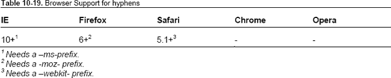

# 十、改进网页排版

很长一段时间，网页排版是一个被忽视的领域。尽管文字技术的进步反馈到了 Adobe Photoshop 或 InDesign 等编辑软件中，但浏览器不得不处理一套非常基本且有限的文字技术。然而，随着 CSS3 的出现，这一切都在改变。在我们深入研究 CSS3 提供的制作字体的新工具之前，让我们先弄清楚“字体”的含义以及在网页排版中使用的各种术语。

### 字样和字体

我们来定义一下术语。

*   字体:指由字体设计师创作的字体设计。乔治亚、Helvetica 和未来都是字体。可以在纸上创建字体，然后在字体设计应用中进行调整，或者在 Font Lab 等软件程序中创建。构成字体一部分的字母具有可以通过各种设置进行调整的特征。
*   *字体*:字体可以打印字样。字体可以是金属的，也可以是数字的。在这一章中，我们将只讨论数字字体。

Jon Tan 写道字体不是字样，网页设计师不应该犯这样的错误。

### 解剖型

字体的解剖结构如图图 10-1 所示。

**图 10-1。**解剖型

*   *基线*:所有字符“坐”的线
*   *中间线*:决定字体中非升序字符结束的线。
*   *X 高度*:基线到中线的距离。
*   *上升段*:小楷字符延伸到字体中线以上的部分。在图 10-1 中，它是“h”的一部分，位于该单词中所有其他字母之上。
*   *下行线*:小写字符延伸到字体基线以下的部分。在图 10-1 中，它是“p”的一部分，延伸到该单词中所有其他字母的下方。
*   *字形*:字形指的是一种类型的单位。它可能是一个“ü”或一个普通的“a”。这些字形根据我们使用的字体有独特的风格。
*   *连字*:两个或多个字形连在一起形成一个字形。在拉丁文字中不常见到(流行的拉丁连字是 ffl 和 FFI)；它在印度语和 CJK 语中更常用。
*   *前导*:这是指文本行之间的空间。我们在样式表中用`line-height`属性对此进行了设置。
*   *字母间距*:指一个单词或一段文字中，字母之间的间距。我们可以用`letter-spacing`属性来控制它。
*   *字距调整*:当我们调整两个特定字符之间的间距时，我们*字距调整*。根据定义，等宽字体在字符之间有固定的间距，不能进行字距调整。大多数字体都有由排版引擎自动应用的字距调整定义。我们后面会讲到如何控制字符间距。
*   通用字体系列:这是一个专门用于网页排版的术语。当我们在网上设置我们的类型时，我们想要的类型可能不可用。在这种情况下，我们可以通过声明一个通用字体系列来指定我们希望页面呈现的字体类别。有五种通用字体系列:衬线字体(例如，Times)、无衬线字体(例如，Helvetica)、草书字体(例如，Zapf-Chancery)、幻想字体(例如，Western)和等宽字体(例如，Courier)。未能设置通用字体系列会导致浏览器选择自己的默认字体(根据浏览器和用户的定制而有所不同)来呈现我们的页面。
*   *对齐*:文本相对于页面的设置。典型值包括左对齐、右对齐、居中或两端对齐。在网络上，对齐的文本容易产生大量的文本。稍后我们将会看到一些解决方案。
*   *寡妇和孤儿*:在一列的顶部或底部悬空的短文本行。孤儿被留在底部，寡妇被留在顶部。

虽然有各种各样的方法来调整字体的一些特征，但是通过 CSS 来调整 web 字体的能力是最近才引入的。这里有一个 web type 的简史，可以帮助你理解它是如何开始的，以及我们下一步要去哪里。

### 网页类型简史

在 Web 的早期，样式表不是由网站的作者创建的，而是由用户创建的。作为用户，您可以指定一个通用样式表，其中包含您希望看到的字体类型，并且您访问的所有网站都将以您指定的样式呈现。这意味着您可以完全控制用于显示网页的字体。

这种情况在 1994 年 10 月左右发生了变化，当时提出样式表不是由用户设置，而是由服务于 HTML 页面的用户设置(这是一个相当彻底的变化！)这就提出了一个问题。如果用户没有样式表作者指定的字体会怎样？例如，如果你作为设计者指定了 Helvetica 新光的字体系列，如果用户的计算机上没有安装该字体，浏览器将如何呈现文本？

CSS 的原始作者霍肯·维姆·利和伯特·波斯考虑了这个问题，并提出了几个选项:

*   *从服务器上提供字体*:没有普遍认可的字体格式(在早期，甚至 TrueType 或 OpenType 字体都不存在)，并且在 90 年代带宽如此缓慢的情况下(还记得 96kbps 的调制解调器吗？)不可能及时下载字体文件来呈现页面。
*   传递几个值并动态生成与所请求的字体相似的字形:这不是最佳选择，有时会导致难看的结果。
*   作者按照偏好的顺序设置一个字体列表，希望其中一个可用:作者还可以设置一个默认的通用字体，如果作者选择的字体都不可用，浏览器将使用该字体从用户的计算机中找到合适的字体。

最后一个选项您可能很熟悉，因为它在 1996 年成为了一个标准。

微软还创建了一个可自由分发的字体堆栈，在屏幕上清晰可辨，并支持国际化，因此它可以用作 web 排版的基础。这导致了 Arial、Courier 和 Comic Sans 在各种操作系统中的扩散。

不幸的是，直到 2008 年才有更多的动作。与此同时，前端设计师试图通过图像替换、sIFR、Cufon 或 SVG 字体，创造性地解决网络排版的问题。在我们研究网络字体的现代奇迹之前，让我们先来看看这些选项。

*维基百科的网页排版页面涵盖了各种网页排版格式的历史。*

### 文本作为图像

呈现用户机器上不可用的字体的最常见方式是将其作为图形。这种技术有无数种变化，每一种都消除或增加了对这些图像使用方式的限制。以下是其中的一些。

#### 法纳图像替换(FIR)

Farhner Image Replacement 是解决样式表中印刷限制的最早发明之一。FIR 以 Todd Farhner 命名，由 C. Z. Roberton 在 1999 年发明，并由 Doug Bowman 和 Jeffery Zeldman 推广，是使用 CSS 用图形替换文本的最流行的方式。有关浏览器支持的信息，请参见表 10-1 。

这种方法的不利之处在于，它使文本对屏幕阅读器不可用，并且对默认关闭图像的用户不呈现任何内容(考虑到当时的带宽限制，这是一个很大的数字)。

*转到`[`jsfiddle.net/nimbu/Q274j/`](http://jsfiddle.net/nimbu/Q274j/)`了解代码中表示的技术。*

#### 莱希/朗里奇法

Seamus Leahy 和 Stuart Langridge 独立地发现了一个可以帮助用户使用屏幕阅读器的解决方案。通过填充文本元素，该方法将文本推到元素的可视区域之外，使其对屏幕阅读器仍然可见，但对桌面用户隐藏。参见表 10-2 了解浏览器对此方法的支持。

不幸的是，关闭图像的用户无法看到文本。

*转至`[`jsfiddle.net/nimbu/pnRb8/`](http://jsfiddle.net/nimbu/pnRb8/)`了解代码中表示的技术。*

#### 法尔克法

同时，Mike Rundle 提出了一个使用`text-indent`隐藏文本的解决方案。这意味着屏幕阅读器仍然可以访问文本，但是关闭图像的用户无法看到文本(表 10-3 )。

*转到`[`jsfiddle.net/nimbu/8ZMmT/`](http://jsfiddle.net/nimbu/8ZMmT/)`查看代码中显示的技术。*

#### 吉尔德/莱文法

Levin Alexander、Petr Stanicek(又名“Pixy”)和 Tom Gilder 发明了一种技术，适用于屏幕阅读器和禁用图像的用户。基本上，它利用一个空元素来应用背景图像，并呈现在文本之上。它带有一个很大的警告:图像不能是透明的。更多信息参见表 10-4 。

*转到`[`jsfiddle.net/nimbu/Ra6p5/`](http://jsfiddle.net/nimbu/Ra6p5/)`查看代码中显示的技术。*

#### JavaScript 图像替换(JIR)

Peter Paul Koch 采取了不同的方法，提供了一个 JavaScript 图像替换解决方案(`[www.quirksmode.org/dom/fir.html](http://www.quirksmode.org/dom/fir.html)`)。这种方法首先在进行图像替换之前通过 JavaScript 检测图像是否被禁用，从而解决了文本对屏幕阅读器或禁用图像的用户不可见的问题。Stewart Rosenberger ( `[www.alistapart.com/articles/dynatext/](http://www.alistapart.com/articles/dynatext/)))`将其扩展为使用 PHP 在服务器上自动生成图像。参见表 10-5 。

然而，所有这些技术都有一个缺点，即当字体大小改变或文本所占宽度改变时，不能缩放。他们不允许任何文本是流动的，而只适合预先确定的框。

进入 sIFR

*转到`[`jsfiddle.net/nimbu/Q6FBQ/`](http://jsfiddle.net/nimbu/Q6FBQ/)`查看代码中显示的技术。*

*在 Mezzoblue ( `[www.mezzoblue.com/tests/revised-image-replacement/](http://www.mezzoblue.com/tests/revised-image-replacement/)`)上可以找到图像替换解决方案的完整列表。*

*尼古拉斯·加拉格尔还在`[`nicolasgallagher.com/css-image-replacement-with-pseudo-elements/`](http://nicolasgallagher.com/css-image-replacement-with-pseudo-elements/)`写了一篇关于鲜为人知的纳什图像替换技术的文章。*

### SIF

2001 年，Mike Davidson 在 ESPN.com 首次大规模使用 Flash image replacement，为安装了 Flash 的用户提供嵌入 Flash 电影的自定义标题字体，为没有安装 Flash 的用户提供纯文本。2004 年，肖恩·因曼发明了一种更好的技术(被称为肖恩·因曼闪存替换；参见`[www.mikeindustries.com/blog/archive/2004/08/sifr](http://www.mikeindustries.com/blog/archive/2004/08/sifr)`)，它处理普通的 HTML 并通过 JavaScript 添加了一个动态生成的 Flash 电影来代替普通文本标题。到 21 世纪初，Flash 几乎无处不在，这使得这项技术很容易落后。

2004 年末，迈克·戴维森和肖恩·因曼合力发布了一个更好的版本，名为“sIFR ”,它可以处理多行文本，不需要精确的尺寸，并在 Flash 电影中呈现出适合纯文本尺寸的字体布局。最大的缺点是，您必须使用不比用于呈现纯文本类型的字体更窄的类型，并且如果您调整了文本的大小(假设您单击了“text-size -> 200%”)，文本不会调整大小。参见表 10-6 。

*   这些浏览器需要启用 JavaScript 并安装 Flash 6 或更高版本。

### 优惠券

Cufón 的目标是通过在现代浏览器中使用新的`canvas`元素和在 IE 中使用 VML 元素来取代 sIFR。Cufón 要求我们将想要使用的字体上传到他们的在线生成器，生成器会将它们转换成 Cufón 可以理解的格式。然后，我们需要将生成的文件包含在 Cufón 的 JavaScript 文件中，以我们的自定义字体呈现文本。

像其他图像替换解决方案一样，Cufón 现在允许我们选择被替换的文本。像 sIFR 一样，要替换的文本越多，渲染的时间就越长。

*位于`[`github.com/sorccu/cufon/wiki/`](https://github.com/sorccu/cufon/wiki/)`的 Cufón Wiki 有更多详细信息。*

### SVG 字体

2001 年 10 月，SVG 1.1 工作草案发布了一个字体元素，允许用户用 SVG 语法指定字形。规范中概述的该元素的目的是

> *…允许在仅显示的环境中传送字形轮廓。网页附带的 SVG 字体必须仅在浏览和查看情况下受支持……*
> 
> SVG 字体的一个关键价值是保证 SVG 用户代理的可用性。在某些情况下，SVG 字体可能是呈现某些文本的首选。在其他情况下，SVG 字体可能是备用字体，以防给定用户无法使用首选字体(可能是提示的系统字体)。
> 
> SVG 1.0 规范，`[www.w3.org/TR/2001/REC-SVG-20010904/fonts.html](http://www.w3.org/TR/2001/REC-SVG-20010904/fonts.html)`

这正是 SVG 字体最近变得突出的原因。iOS 设备不支持渲染开放字体的功能，但 Mobile Safari 和 Opera Mobile 可以渲染 SVG 字体。不幸的是，这意味着字体失去了提示，并且——取决于字体——在小屏幕上看起来更差。我们可以使用著名的@font-face 规则来包含 SVG 字体，稍后我们将对此进行研究。

SVG 字体有一些优点。我们可以在同一个文件中包含几种字体。这节省了网络请求，而网络请求是移动浏览器页面加载缓慢的主要原因。

不幸的是，Firefox 还不支持 SVG 字体，不像今天的其他主流浏览器(`[`bugzilla.mozilla.org/show_bug.cgi?id=119490`](https://bugzilla.mozilla.org/show_bug.cgi?id=119490)`)。这使得 SVG 成为字体格式战争中的外围玩家。

现在让我们来看看最近历史上的一个显著现象，它让我们能够平稳地过渡到在网站上使用网络字体:@font-face 的兴起。

### @font-face

@font-face 是 CSS3 字体模块中的一个标准化规则，它最初是在 2002 年作为工作草案推出的。@font-face 允许我们声明字体在互联网上的位置以及它们的格式，这样它们就可以在我们的样式表中作为`font-family`属性的值使用。有趣的是,@font-face 已经在 CSS 规范中出现了一段时间，但没有被大多数浏览器实现。我们来看看它的演变。

#### 网络资源

在没有定义网络字体的情况下，我们已经走了很远。 *Web 字体*简单地指所有可以通过在`@font-face`规则中声明来使用的字体。通常，所有这些字体都已针对 web 使用进行了优化；因此，它们具有较小的文件大小，并且在使用较小的字体大小时具有正确渲染的别名。

#### 开始时

1996 年，当 CSS 级规范正在制定中时，Adobe 与 Bitstream、Microsoft 和其他公司一起提出了@font-face 提案，宣布了如下@font-face 规则:

`@font-face {
font-family: 'Graublau Web';
src: url('GraublauWeb.ttf') format('ttf');
}`

由于对所有平台的字体格式没有明确的共识，W3C 没有推荐字体格式。这个规则是 CSS 2.1 的一部分。

这个特性也没有考虑到对下载字体的任何形式的限制，所以字体铸造厂开始担心它会被用于字体盗版。

微软与 Monotype Imaging 合作，提出了一个花园墙 DRM 解决方案，它使用了一种新的字体格式(EOT ),这种格式不能安装在任何计算机上，只能被浏览器(在这种情况下是 Internet Explorer)理解，以在页面上呈现字体。不幸的是，其他浏览器供应商不想采用这项技术。这意味着几乎没有商业字体可以通过@font-face 规则用作 web 字体，所以很少有开发者采用这个特性。这种假死状态一直持续到 2006 年。

#### @font-face 反击

2006 年，CSS 工作组决定采取行动，寻找一种单一的格式来终结图像替换技术。2007 年 10 月，Webkit 开始支持@font-face 规则链接 raw TrueType 和 OpenType 字体；Firefox 于 2008 年 10 月推出，Opera 于 2008 年 12 月推出。他们都没有认可微软首创的 EOT 格式。一种新的字体格式被认可，叫做 WOFF。它提供了字体数据的轻量级压缩，以及用于通知用户许可信息等的附加元数据。参见表 10-7 了解当前对各种格式的支持。

#### 剖析字体语法:@font-face 声明

让我们花一分钟来理解@font-face 规则。这就是@font-face 在样式表中的声明方式:

`@font-face {
  font-family: bodytext;
  src: url(ideal-sans-serif.woff) format("woff"),
       url(basic-sans-serif.ttf) format("opentype");
}`

在这个规则中，font-family 声明了我们实际使用时用来指代这个自定义字体的名称。例如，此规则中指定的字体可以按以下方式使用:

`  p {
    font: 12px/1.5 bodytext, sans-serif;
  }`

这将使用我们用名为“bodytext”的字体族指定的字体来呈现`p`元素中的所有文本

第二个属性`src`链接到我们想要使用的字体的实际 URL。

问题是并非所有的浏览器都理解所有的字体格式(见表 10-7 )，所以我们必须指定一个或多个这样的 URL 以及 format 函数来指示 URL 引用的格式。这个例子首先声明一个 WOFF 字体格式的 URL，然后声明一个 OpenType 的 URL。

我们也可以使用`src`中的`local()`函数来呈现一种字体，如果它在本地可用的话。虽然这是出于好意，但是如果本地字体损坏，将不会呈现任何文本。这可能是一个超出 web 开发人员控制的关键问题。因此，您应该避免使用本地字体，只从字体 URL 读取。

在`font-face`规则中，我们也可以使用像`font-weight: bold`或`font-style: italic`这样的字体描述符。这些都是指示浏览器不要在必要时人为地为这些网页字体生成粗体或斜体。当这个`font-face`规则应用于一个标题时，就像这样

`H2 { font: 16px/1.5 bodytext, sans-serif; font-weight: bold; }`

浏览器被迫人为地生成更粗的字体。为了防止这种情况发生，我们只需要将我们的 web 字体描述为粗体，这样就可以按原样使用了。

`@font-face {
  font-family: bodytext;
  src: url(ideal-sans-serif.woff) format("woff"),
       url(basic-sans-serif.ttf) format("opentype");
  font-weight: bold;
}`

这对我们的`p`选择器没有影响，但是防止我们的`h2`标题有一个合成的粗体字(这看起来比原样包含字体要糟糕得多)。

#### @font-face 的防弹语法

根据上一节的内容，您可能会认为编写一个适用于所有浏览器的@font-face 规则并不是什么难事。不幸的是，的确如此。我们需要确保浏览器只下载我们指定的几个资源中的一个，这样我们的页面才能快速加载。幸运的是，有一种语法可以做到这一点。Paul Irish 提出了第一个简单的通用解决方案，然后由 Richard Fink 完善，最后由 Ethan Dunham 完善。

`@font-face {
font-family: 'MyFontFamily';
src: url('myfont-webfont.eot'); /* IE9 Compat Modes */
src: url('myfont-webfont.eot?iefix') format('eot'), /* IE6-IE8 */
url('myfont-webfont.woff') format('woff'), /* Modern Browsers */
url('myfont-webfont.ttf')  format('truetype'), /* Safari, Android, iOS */
url('myfont-webfont.svg#svgFontName') format('svg'); /* Legacy iOS */
}`

如果您担心生成这些格式的字体，不用担心。FontSquirrel 有一个@font-face 生成器(在`[www.fontsquirrel.com/fontface/generator](http://www.fontsquirrel.com/fontface/generator)`)，可以自动将你上传的字体转换成所有支持的网络字体格式。首先确保您有权限将您的字体用作 web 字体。

下载 web 字体需要一些时间，这意味着用户需要等待才能看到使用您指定的字体的文本。这就产生了一个“无样式文本闪现”的问题，您将在接下来了解到这一点。

*Paul Irish 关于防弹语法的帖子对这些选择都有详细的解释(`[`paulirish.com/2009/bulletproof-font-face-implementation-syntax/`](http://paulirish.com/2009/bulletproof-font-face-implementation-syntax/)`)。*

#### 避免无样式文本的闪烁(FOUT)

下载 Web 字体需要一段时间，有时这些请求会超时(或者字体素材可能已经移动，导致 404)。在此期间，浏览器必须决定是应该等待字体下载以呈现需要的文本，还是不等待就提前呈现文本，然后在字体下载完成后更新呈现。火狐(4 之前)和 Opera 做的是前者，后者被称为无样式文本的闪现(FOUT)。有时，在下载网页字体前后对网页进行的调整过于激烈，以至于破坏了与网页的交互。基于 Webkit 的浏览器等待字体下载大约 3 秒钟，如果字体下载失败，则以后备字体呈现文本。

Paul Irish 写了一篇详尽的帖子，讲述了如何打败无样式文本的闪现；他在`[`paulirish.com/2009/fighting-the-font-face-fout/`](http://paulirish.com/2009/fighting-the-font-face-fout/)`概述了这样做的技巧。有几个选择。

*   谷歌的网页字体加载器
*   使用 font.js

##### 谷歌的网页字体加载器

使用 Google 的 WebFont Loader，我们可以在启用 JavaScript 时完全隐藏文本，只在加载字体后通过添加基于`html`元素上的类的声明来呈现文本。

WebFont Loader 可以自动从几个字体库请求，这些字体库根据请求提供字体，如 Google、Ascender、Typekit、Monotype 和 Fontdeck。此外，我们可以在服务器上托管的字体上使用自定义配置。

注意，如果您使用 WebFont Loader，您不需要声明@font-face 规则。它将由 WebFont Loader 处理。

一旦对字体发出请求，WebFont Loader 就会根据资源请求的状态添加类。当请求仍在进行时，WebFont Loader 将类`wf-loading`添加到 HTML 元素中。如果请求失败，WebFont Loader 添加类`wf-inactive`；如果字体下载成功，`wf-active`将被添加到 HTML 元素中。

我们可以使用这些类来选择是否要避开 FOUT。例如，设置

`.wf-loading h1 {
        visibility: hidden;
}`

确保发出请求时`h1`保持不可见。

同样，设置

`.wf-inactive h1 {
        font-family: monospace;
}`

确保当请求的 web 字体下载失败时，使用非常匹配的本地字体来呈现`h1`。

*参见`[`jsfiddle.net/nimbu/HCgp8/`](http://jsfiddle.net/nimbu/HCgp8/)`了解如何使用网页字体加载器。*

##### 使用 font.js

创建 font.js ( `[`pomax.nihongoresources.com/pages/Font.js/`](http://pomax.nihongoresources.com/pages/Font.js/)`)不是为了解决 FOUT 问题，而是为了在 JavaScript 对象模型中表示字体。尽管如此，它在动态加载字体时工作得很好，并且只在字体被加载时才呈现内容。

要使用 font.js，请在页面中结束的`</head>`标记之前包含`font.js`文件。

``

然后在样式表中，使用前面讨论的防弹@font-face 规则包含 web 字体。

在适当的选择器上，添加以下声明:

`#fontjs {
    visibility: hidden;
    font-family: 'Ultra', serif;
}`

在这个规则中，“Ultra”指的是使用防弹字体-字体语法的网络字体。然后，我们需要决定何时让选择器中的内容可见。在这种情况下，让我们在 body 元素获得一个名为`font-loaded`的类名时这样做(你将很快看到*和*如何获得这个类名)。

`.font-loaded #fontjs {
    visibility: visible;
}`

如果 web 字体加载失败，我们还希望内容是可见的，并在发生这种情况时提供一个替代的通用字体系列。让我们在 body 元素获得一个名为`font-error`的类名时这样做。

`.font-error #fontjs **{**
    visibility: visible;
    /* Our custom declarations to deal with the lack of web font availability */
    font-family: sans-serif;
    font-weight: bold;
**}**`

现在，在 JavaScript 中，我们包含了下面的代码片段，当字体加载成功或失败时，这些代码片段可以分别添加类名`font-loaded`或`font-error`。

`var font = new Font();

/* Font loads successfully */
font.onload = function() {
    document.body.className = 'font-loaded';
};

/* Font fails to load */
font.onerror = function(err) {
 document.body.className = 'font-error';
}

/* Kicks off the font loading */` `font.fontFamily = 'Ultra';
font.src = font.fontFamily;`

使用 font.js，我们可以访问一系列字体度量标准，如 ascent 和 descent 我们甚至可以获得特定字符串的指标。

不幸的是，font.js 需要`canvas`支持，并且在 IE8 及以下版本中不工作，这意味着 Google WebFont Loader 是防止 FOUT 的最佳选择。

*进入`[`jsfiddle.net/nimbu/mRQpB/`](http://jsfiddle.net/nimbu/mRQpB/)`查看字体加载失败时的样子。*

*您还可以在`[`jsfiddle.net/nimbu/LrqPb/`](http://jsfiddle.net/nimbu/LrqPb/)`* 加载字体时添加花式效果

#### 使用网络字体时要记住的事情

*   网页字体会在字体加载后重新排列整个页面。所以尽量少用。
*   Firefox 和 IE9 将从你的站点所在的服务器之外的服务器上获取网页字体，但前提是服务器明确允许。
*   请记住您用来加载字体的技术的性能。一些字体托管服务提供了比自己服务更好的性能(见`[www.artzstudio.com/2012/02/web-font-performance-weighing-fontface-options-and-alternatives/](http://www.artzstudio.com/2012/02/web-font-performance-weighing-fontface-options-and-alternatives/)`)。
*   如果嵌入位没有设置为 *installable* ，IE9 不会识别 OpenType 字体。大多数可用的 OpenType web 字体很可能是这种情况，所以请确保使用防弹语法，这样如果 IE9 不能使用 OpenType 格式，它就可以使用 WOFF 或 EOT。
*   如果用户在 IE6 上启用了高安全性设置，当页面使用 web 字体时会弹出一个安全框。除了将 web 字体排除在 IE6 之外，没有其他办法可以解决这个问题。
*   IE6-8 一旦遇到@font-face 规则中指定的字体，就会尝试下载该字体，这可能会减慢从同一服务器下载其他资源的速度(这可以通过从另一个服务器提供字体来减轻)。
*   如果你使用粗体字体作为标题，确保正确设置`font-weight`。如果您想使用字体的粗体，如果您想在将`font-weight`设置为粗体(`[`jsfiddle.net/nimbu/wcBmD/`](http://jsfiddle.net/nimbu/wcBmD/)`)的选择器中使用它，请确保在@font-face 规则中将`font-weight`设置为粗体。否则，浏览器会综合地让你的粗体字体变得更粗，导致不吸引人的结果(见图 10-2 )。

**图 10-2。**合成的粗体显得比天生的粗体粗得多。这是它在 Firefox 中的显示方式。

### 寻找网页字体

有太多的字体可供选择，从免费的到非常昂贵的。在我们查看选项之前，请注意，确保您打算用作 web 字体的任何字体都有相应的许可，这一点很重要。许可证通常会声明它是否允许“嵌入”或用作网络字体。如果字体的许可证没有说明，请务必向字体提供商澄清条款。

#### 免费网络字体

有许多网站提供免费字体。然而，并不是所有的字体都值得用作 web 字体(有些可能缺少字形，或者可能只是因为太大而不适合用作 web 字体)。这些网站提供了最好的网络字体:

*   字体松鼠(`[www.fontsquirrel.com/](http://www.fontsquirrel.com/)`)拥有最大的免费网络字体数据库，每种字体都有方便的@font-face 工具包。它列出了一些可用作 web 字体的字体。
*   可移动字体联盟(`[www.theleagueofmoveabletype.com/](http://www.theleagueofmoveabletype.com/)`)提供了我们可以使用的漂亮的开源字体，而不仅仅是网络字体。
*   Google Web Fonts ( `[www.google.com/webfonts](http://www.google.com/webfonts)`)并不直接让我们下载字体文件，但它们可以通过开源许可证获得，但由 Google 托管，并通过其 web fonts API 提供服务。
*   Kernest ( `[`kernest.com/`](http://kernest.com/)`)也有许多免费字体，我们可以从 Kernest 服务器下载或提供。

#### 商业网页字体

Ralf Herrmann 有一份提供网络字体的商业代工厂名单。

FontFont Library ( `[www.fontfont.com/](http://www.fontfont.com/)`)也开放了它的目录作为网络字体使用。字体是可以下载的，支付一次性许可费后即可使用。

Lost Type ( `[`losttype.com/`](http://losttype.com/)`)提供网络字体，价格由我们指定。

#### 字体即服务

现在有许多网站提供网络字体服务。我们需要做的就是链接到他们的样式表或脚本文件，然后在我们的样式表中使用该字体。成本因服务而异，在撰写本文时是准确的。表 10-8 列出了几个流行的。

#### 使用网页字体进行设计

作为服务提供的网络字体的最大缺点是我们不能在 Photoshop comps 中轻松使用它们。然而，有一个 Adobe Photoshop CS5 插件([`www.webink.com/webfontplugin`](http://www.webink.com/webfontplugin))提供了几个代工厂的字体供我们在排版中使用。

Typecast ( `[`beta.typecastapp.com/`](http://beta.typecastapp.com/)`)声称可以让我们使用几家铸造厂的字体在浏览器中快速创建原型。然而，在撰写本文时，这项服务尚未推出。

*Chris Coyier 在`[`css-tricks.com/examples/IconFont/`](http://css-tricks.com/examples/IconFont/)`做了一个演示，概述了为什么网络字体对图标非常有用。*

#### 使用网络字体作为图标

一个新的趋势是使用字体作为图标。Simurai 有一个关于如何使用它们的很棒的教程([`lab.simurai.com/buttons/`](http://lab.simurai.com/buttons/))。请注意，最好将这些图标映射到它们最近的 Unicode 映射，因为屏幕阅读器倾向于将它们作为字母读出。

#### 网页字体汇总

我们研究了 web 字体是如何产生的，以及声明 web 字体的最佳语法。我们还了解了一些加载字体的技巧，以避免无样式文本的闪现。然后，我们看了一些 web 字体的资源，以及 web 字体如何被重新用于呈现图标。

既然您已经看到了如何在 Web 上使用自定义字体，那么您无疑会对如何操作字体感到好奇。继续读！

### 基线

确保在使用 web 类型时使用正确的默认值，以便为所有浏览器提供最佳体验。下面是要做的第一件事:

`  html { font-size: 100%; }`

这将确保所有浏览器上的字体都以标准默认值开始。在桌面上，这是 16px。在移动设备上，字体的呈现取决于分辨率和设备像素比率。

您可以选择使用 Eric Meyer 的 reset.css 重置所有可能的浏览器默认字体选择，或者确保在所有浏览器上提供相同的默认浏览器体验。

我们强烈推荐第二种选择，尼古拉斯·加拉格尔和乔纳森·尼尔的 normalize.css ( `[`necolas.github.com/normalize.css/`](http://necolas.github.com/normalize.css/)`)提供了现成的最佳默认设置。即使您使用的是 normalize.css，当您稍后在样式表中覆盖字体属性时，也要确保设置正确。

#### 设置字体系列

当我们指定一个字体系列时，我们希望确保当我们选择的字体不可用时，文本以可读的格式呈现。我们可以通过设置后备通用字体来做到这一点。代码风格有一个很好的字体堆栈列表(`[www.codestyle.org/](http://www.codestyle.org/)`)。CSS 字体堆栈(`[`cssfontstack.com/`](http://cssfontstack.com/)`)是美学字体堆栈的另一个资源。

`    body {
    font-family: 'Helvetica Neue', Helvetica, Arial, sans-serif;
    }`

两种最常用的通用字体系列是无衬线字体和衬线字体。一定要记住它们(尤其是 *sans* 和 *serif* 之间的连字符)！另外，记住要用引号将含有空格的字体名括起来，比如“Helvetica 新”。

*iotic.com 探索的一个有趣的想法是创建一种字体，它是在他的机器上找到的所有系统字体的平均值。这是一本非常有趣的读物；在`[`iotic.com/averia/`](http://iotic.com/averia/)`找到它。*

Mathias 已经非常详细地描述了哪些字体系列名称可以不加引号；在`[`mathiasbynens.be/notes/unquoted-font-family`](http://mathiasbynens.be/notes/unquoted-font-family)`找到它

#### 设置垂直间距

设置类型时，一定要设置`line-height`属性。行高可以采用无单位值；这意味着任何选择器和从该选择器继承样式的元素都将它们的行高计算为无单位值和它们当前字体大小的乘积。为`line-height`设置一个大于 1 的无单位值是一个很好的做法，以确保你的文本总是可读的。

#### 设置字号

使用 em 单位设置字体大小。当我们在 ems 中指定`font-size`时，得到的字体大小是 em 值和继承的字体大小的乘积。例如，

`body { font-size: 100%; }
h2 { font-size: 2em; }`

导致 h2 元素的计算字体大小约为 32px。这是一种相对于基本字体大小设置字体大小的简单方法。如果我们增加基本字体大小，其他元素会自动调整。

最流行的设置字体大小的方法是使用像素。这很容易做到，但是当客户要求更大的文本尺寸时，调整所有的尺寸是非常痛苦的。但是，如果我们使用 ems，这是微不足道的。但是话说回来，如果三层嵌套和元素样式被更高特异性的选择器意外覆盖，那么使用 ems 很容易成为维护的噩梦。幸运的是，有一个更好的解决方案:rem 单元。

##### rem 单位

rem 单元允许我们相对于根元素(通常使用的是`html`元素)来设置字体大小。通过使用 rem 而不是 em，我们避免了 ems 的特殊性问题，只需改变根元素的字体大小，使文本一致地变大或变小；参见表 10-9 。

我们强烈建议使用 rem 单位来设置字体，并回退到 em 单位。

接下来，让我们来看看如何渲染文字是令人愉快的阅读。我们通过将字体设置为垂直节奏来做到这一点。

*Jonathan Snook 有一篇关于使用快速眼动装置的很好的文章；参见`[`snook.ca/archives/html_and_css/font-size-with-rem`](http://snook.ca/archives/html_and_css/font-size-with-rem)`。*

### 使用网格进行设计

在一篇开创性的文章中，Richard Rutter 展示了建立印刷垂直节奏的秘密。他解释道:

> *垂直空间的基本单位是行高。建立一个适用于页面上所有文本的合适的行高，无论是标题、正文还是旁注，都是稳定可靠的垂直节奏的关键，这将吸引并引导读者阅读页面。*

有两种方法可以做到这一点，一种是使用 *em* 单位，另一种(简单得多)是使用像素单位。以下是我们将使用垂直节奏的标记:

`      
There were four of us—George, and William Samuel Harris, and myself, and Montmorency.
We were sitting in my room, smoking, and talking about how bad we were—bad from a medical
point of view I mean, of course.

      
We were all feeling seedy, and we were getting quite nervous about it.  Harris said
he felt such extraordinary fits of giddiness come over him at times, that he hardly knew what
he was doing; and then George said that he had fits of giddiness too, and hardly knew what he
was doing.  With me, it was my liver that was out of order.

      
I knew it was my liver that was out of order, because I had just been
reading a patent liver-pill circular, in which were detailed the various symptoms by which a
man could tell when his liver was out of order.  I had them all.
`

在我们继续之前，我们需要决定我们节奏的基本单位。然后，我们可以在像素单位或 em 单位中实现这个基本单位的倍数(以创建一个*节奏*)。为了可读性，在我们的例子中，我们希望我们的基本单位是默认字体大小的 1.5 倍。结果是 1.5em 或 24px，这取决于我们在实现中使用的单位。让我们看看这两种方法。

#### 带像素

`body {
  /* font size is 16px */
  font-size: 100%;

  /* Yay, base unit */
  line-height: 24px;
}

p {
/* total space vertically above and below each paragraph equals to one base unit: 24px  */
  margin: 12px 0;
}`

在这段代码中，我们建立了基线字体间距。现在让我们从第一段开始。我们希望它比任何其他段落都大，但仍然保持垂直节奏。

`p:first-child {
  font-size: 24px;
}`

每次声明边距、填充、边框时，确保上限值和下限值之和是基本单位的倍数。特别要注意的是，页边距折叠会扰乱你的垂直节奏，所以你需要根据应用于前一个元素的页边距仔细地组合你的页边距。

转到`[`jsfiddle.net/nimbu/CV2Kt/7/`](http://jsfiddle.net/nimbu/CV2Kt/7/)`查看应用该样式后该标记的外观。如您所见，每条线都完美地适合垂直网格。

**图 10-3** 使用带有像素的 vertica 节奏拟合网格的文本

让我们设置最后一段有一个边框和较小的字体大小。

`p:last-child {
  font-size: 12px;

  /* margin-top is already margin-collapsed to be 12px, we now need to allocate rest of the
margin to the bottom margin so in total with border-width it would be a multiple of the base
unit */
  margin: 12px 0;

/* Padding top and bottom is 12px each, total = 24px */
  padding: 12px 0;
}`

它看起来是这样的:

**图 10-4。**最后一段较小，但仍适合网格。

以像素计算要容易得多。以下是如何用 *em* s 做到这一点。

#### 带 ems

`/* gives us a base font-size of 16px, base line height of 24px on desktop browsers */
body { font-size: 100%; line-height: 1.5em; }

p {
/* vertical space above and below each paragraph totals to one line: 24px (0.75em = 12px)  */
   margin: 0.75em 0;
}

p:first-child {
  /* font-size is now 24px, line-height if not redeclared will be now 36px */
  font-size: 1.5em;

  /* line height is redeclared, now same as font size! 24px */
  line-height: 1em;

  /* vertical space above and below each paragraph totals to one line: 24px  */
  margin: 1em 0;
}

p:last-child {
  /* font size is now 12px, line height is redeclared and will be 2*12px = 24px  */
  font-size: 0.75em;
  line-height: 2em;

/* previous paragraph has margin bottom set to 12px, hence margin collapsing means we cannot
set a smaller margin-top  for this selector.  We now need to allocate rest of the margin to` `the bottom margin (12px/7.2px = 1.667em) so in total with border-width it would be a multiple
of the base unit */
  margin: 1em 0;

/* Padding top and bottom is 12px each, total = 24px */
  padding: 1em 0;
}`

下面是应用了这种样式的标记的外观(`[`jsfiddle.net/nimbu/eg8D6/15`](http://jsfiddle.net/nimbu/eg8D6/15)`)。

如果您在其他地方覆盖这些元素的字体大小，网格将会混乱。在像素垂直节奏的情况下，未考虑的元素(如大小不是基本单位倍数的图像、广告、显示在表单元素中的浏览器 chrome，或动态加载的文本，如 Twitter 小部件)会导致相同的问题。

#### 设置网格

手动设置基线网格不是一项简单的任务。我们不仅需要考虑当前元素的交互作用，还需要考虑应用了当前元素的先前元素的交互作用。经过几层嵌套，这就变成了一个非常毛的前景。我们还需要考虑空白塌陷，特别是如果较大的空白不是垂直节奏单位的整数倍。

如果我们将网格图像设置为背景，以便立即进行视觉验证，那么定义基线网格的过程就会容易得多。有许多方法可以做到这一点，但在所有这些方法中，我们都需要提供基本单元的大小。

*   *带插件* : Gridbuilder ( `[`gridbuilder.kilianvalkhof.com/`](http://gridbuilder.kilianvalkhof.com/)`)根据我们提供的选项生成图像，然后我们可以将它设置为背景图像。
*   *使用 CSS 渐变*:我们可以用这种方式使用重复渐变来设置网格背景图像(`[`jsfiddle.net/nimbu/BUvMw/`](http://jsfiddle.net/nimbu/BUvMw/)`)。第十一章更深入地讲述了渐变。
*   *使用书签工具*:安德烈·汉森有一个书签工具，可以在我们使用它的页面上为我们呈现网格(`[`peol.github.com/960gridder/`](http://peol.github.com/960gridder/)`)。

#### 自动化垂直节奏

没有多少工具可以创造出自动的垂直节奏，但是下面这些是有用的:

*   Iain Lamb 的排版工具(`[`lamb.cc/typograph/`](http://lamb.cc/typograph/)`)是理解如何应用垂直节奏的好方法。
*   如果我们输入目标字体大小，Andrew 有一个工具(`[`drewish.com/tools/vertical-rhythm`](http://drewish.com/tools/vertical-rhythm)`)来计算垂直节奏的 CSS。对于大多数基本情况，这应该足够了。
*   Smashing Magazine 有一个 Photoshop 工具的综述，用于处理网格(`[www.smashingmagazine.com/2011/11/09/establishing-your-grid-in-photoshop/](http://www.smashingmagazine.com/2011/11/09/establishing-your-grid-in-photoshop/)`)。
*   Compass(位于 Sass 预处理器之上的 CSS 框架)提供了方便的垂直节奏混合，使得用垂直节奏作曲变得简单(`[`compass-style.org/reference/compass/typography/vertical_rhythm/`](http://compass-style.org/reference/compass/typography/vertical_rhythm/)`)。

### 基线网格汇总

设置基线节奏不是一件容易的事情，但是网格工具使这个过程变得更加容易，并且最终为内容的优雅呈现带来了丰硕的成果。接下来，我们将看看用 CSS3 调整字体的不同方法。现在的选择比以前多了很多！

### 有趣的网页类型

还记得解剖铅字课吗？本节展示了这些术语的一些实际应用。CSS3 为调整字体提供了很多支持。以下是在 CSS3 中使用 type 的一些方法。

#### 选择字形的粗细

使用`font-weight`属性，我们可以设置文本渲染得更暗更重。它可以有以下值:

*   `100 to 900`:这些值形成一个有序的序列，其中每个数字表示一个至少和它的前一个一样暗的权重。
*   `normal`:字体渲染时就好像指定了 400 的权重。
*   `bold`:字体的渲染就像权重被指定为 700 一样。
*   `bolder`: Uses a weight that is bolder than the inherited value. For example, `body { font-weight: normal; }
    p { font-weight: bolder; }`

    将所有段落元素的文本设置为大于 400 的权重。

*   `lighter`: Uses a weight that is lighter than the inherited value. For example, `body { font-weight: normal; }
    p { font-weight: lighter; }`

    将所有段落元素的文本宽度设置为小于 400。

`bolder`和`lighter`关键字的精确映射在表 10-10 中。

有趣的特性(也是最让印刷工心痛的特性)是，浏览器为没有定义粗体或浅色值的字体生成粗体/浅色字体。例如，如果我们使用 Helvetica Neue Light，并将字体粗细设置为 800，因为在用户的计算机上没有默认可用的更粗的 Helvetica Neue Light 字体，浏览器将生成更粗的版本以在屏幕上呈现文本(参见图 10-3 )。表 10-11 列出了对`font-weight`的浏览器支持。

**图 10-3。**合成文本

#### 选择合适的字体宽度

使用`font-stretch`,我们可以从一个字体系列中选择一个正常的、压缩的或扩展的字体。支持仅限于 IE9+和 Firefox 9+(参见表 10-12 )。

#### 控制文本溢出

当文本溢出它的块容器时(块容器将 overflow 设置为 visible 之外的任何值)，我们可以控制如何裁剪溢出的文本。该属性在以下情况下被触发

*   The white-space property of the block element is set to `nowrap`

    或者

*   一个单词比块容器的宽度长(如果是以水平文本书写的文本，如英语)。

我们可以将文本设置为在前几个可见字符后裁剪或呈现省略号(…)。图 10-4 展示了一个它如何渲染的例子。浏览器支持见表 10-13 。

**图 10-4。**正文溢出:省略号在行动

#### 从基线垂直对齐文本

属性允许我们设置内联元素相对于其父元素的位置。注意它指的是 *inline* 元素。默认情况下，内联元素(如`b`、`i`、`em`、`img`、`strong`等)。)与父元素的基线对齐。但是我们可以调整内联元素的位置来匹配这些选项中的几个:`baseline`(默认)、`sub`、`super`、`top`、`text-top`、`middle`、`bottom`、`text-bottom`、`inherit`。我们也可以用长度单位和百分比来设置它们，就像这样:

`sup { vertical-align: 30%; }`

图 10-5 显示了一个例子。浏览器支持见表 10-14 。

**图 10-5。**字符 1 放置在基线上方，垂直对齐设置为行高的 30%

这段代码将`sup`的位置从基线提升了`line-height`值的一个百分比。如果我们想从基线上升/下降一个固定值，我们可以使用长度单位。

`sup { vertical-align: 20px; }`

*CSS3 从根本上重新定义了 vertical-align 中允许的值，以考虑除英语(`[www.w3.org/TR/css3-linebox/#vertical-align-prop](http://www.w3.org/TR/css3-linebox/#vertical-align-prop)` )* 之外的其他语言。

#### 控制一个单词的字母之间的空格

`Letter Spacing`让我们设置文本中两个字符之间的间距。负值表示两个字符之间的间距将缩短。参见图 10-6 中的示例和表 10-15 中的浏览器支持。

`p { letter-spacing: 5px; }` 

**图 10-6。**字母间距:5px

在 CSS 中，我们只能设置统一的字母间距，这将在文本中的两组字符之间添加相同的间距。为了定制这一点(调整不同字符集之间的间距)，我们可以使用 lettering.js ( `[`letteringjs.com/`](http://letteringjs.com/)`)，这是一个 jQuery 插件，它用一个 classname 将每个字符包装在一个 span 元素中，然后我们可以用它来调整每个字符的设置。图 10-7 展示了它的一个实例。

**图 10-7** 。letterminations . js 曾经在特伦特·沃尔顿的博客文章`trentwalton.com/2011/11/18workspace/`上产生过良好的效果

*在 CSS3 中，已经更新为取 1 到 3 个值，每个值分别指定最佳间距、最小间距和最大间距。还没有浏览器实现这种新语法。*

#### 调整单词间距

`word-spacing`指定两个单词之间空格的行为。负值表示词与词之间的间距缩小。

`h2 { word-spacing: 2px; }`

我们也可以在内联块元素上创造性地使用这一点，以防止空白以这种方式影响它们的位置(`[`jsfiddle.net/nimbu/UrLBk/`](http://jsfiddle.net/nimbu/UrLBk/)`)。

图 10-8 显示了另一个例子。浏览器支持见表 10-16 。

**图 10-8。**行距:20px 在行动

*在 CSS3 中，已经更新为取 1 到 3 个值，每个值分别指定最佳间距、最小间距和最大间距。还没有浏览器实现这种新语法。*

#### 断长词

如果一个句子包含一个牢不可破的单词(就像“antidisestablishmentarianism”)，浏览器通常会在同一行中呈现它，即使它溢出了容器的宽度。我们可以使用`word-wrap: break-word`来告诉浏览器，如果单词太长而不适合其容器的宽度，就将其断开。图 10-9 显示了一个示例，而表 10-17 列出了浏览器支持。

`h2 { word-wrap: break-word; }` 

**图 10-9。**自动换行:自动换行。当第一个单词变宽时，它会超出容器的宽度，但是通过使用 word-wrap: break-word，第二个单词会断开以适应容器的宽度。

#### 控制空白和换行符

`white-space`属性只是选择以下选项之一来处理所选元素的文本中的空白:

*   `normal`:根据需要折叠空白并换行以填充尺寸(当有换行符时不需要)。
*   `nowrap`:空格被折叠，但行不被破坏。
*   `pre`:空白不折叠，只有在文本中有换行符或在生成内容的情况下有“\A”时才会换行。
*   `pre-wrap`:行为类似于`pre`，但是根据需要换行以填充尺寸，或者如果存在换行符，则换行。
*   `pre-line`:行为类似于`pre-wrap`，除了它也折叠空格和制表符。

图 10-10 显示了一个例子，表 10-18 列出了浏览器支持。

**图 10-10。**包含所有可用关键字值的空白属性

#### 打印连字符

多年来，网页设计者一直试图找到一种解决方案，让他们能够用连字符漂亮地对齐文本。幸运的是，最近已经做了很多工作来控制 CSS 中的连字符。

##### 连字符

使用`hyphens`属性，我们可以控制连字符的显示。它采用下列值之一:

*   `none`:单词不换行。
*   `manual`:如果单词中有换行字符，如软连字符(`&shy;`)或连字符(-)，则单词会被换行。
*   `auto`:在适当的断字点断字。请注意，浏览器需要了解需要断字的文本所使用的语言，因此这只适用于声明了适当语言(通过父元素上的`lang`属性，可以是`html`或`body`)并且浏览器拥有正确断字资源的文本。

`h2 { hyphens: auto; }`

参见图 10-11 中的示例和表 10-19 中的浏览器支持。

**图 10-11。**连字符:自动运行

注意`hyphens`的初始值是手动的。对于要自动断字的单词，该属性应设置为`auto`。

*前往`[`jsfiddle.net/nimbu/Rv6vV/`](http://jsfiddle.net/nimbu/Rv6vV/)`观看连字符演示。*

##### 软连字符

软连字符(在 HTML 实体中表示为`&shy;`)用于向浏览器指示该单词可以用连字符连接的位置。这不是一个 CSS 属性，但它是目前实现跨所有浏览器工作的连字符的唯一方法。下面是一段使用了软连字符的段落:

这个词的一个稍长但不太为人接受的变体可以在艾灵顿公爵的歌曲“你只是一个老的反 disestablish ­精神主义者”[3]中找到，尽管这个词的正确结构应该是“反 disestablish ­精神主义者”(没有“主义”)。

在不需要软连字符的情况下，这一段与没有软连字符的一段呈现相同，正如你在图 10-12 中看到的。

**图 10-12。**软连字符在不需要的时候不会渲染(这里两个部分看起来一样)。

但是一旦单词开始断裂，带软连字符的单词看起来就不一样了，如图 10-13 所示。

**图 10-13。**当单词遇到换行符而需要换行时，会显示软连字符。

很难记住在文本中添加软连字符。幸运的是，我们可以使用一些工具。理想情况下，我们不应该在客户端这样做，但如果有必要，我们可以使用不再更新的 Sweet Justice ( `[`carlos.bueno.org/2010/04/sweet-justice.html`](http://carlos.bueno.org/2010/04/sweet-justice.html)`)或软连字符(`[`www.softhyphen.com/`](http://www.softhyphen.com/)`)。表 10-20 列出了浏览器对软连字符的支持。

### 控制引用字形

使用`quotes`属性，我们可以为每一层引号设置用于开始和结束引号的字形(从最外层到最内层)。然后，通过使用带有左引号或右引号关键字的`content`属性，我们可以为每个选择器设置引号。

标记:

`<blockquote>
Imagine a puddle waking up one morning and thinking, <q>This is an interesting
world I find myself in — an interesting hole I find myself in — fits me rather neatly, doesn't
it?</q>
</blockquote>`

风格:

`blockquote { quotes:  "+" ";" "<" ">"; }

blockquote::before,
q::before { content: open-quote; }

blockquote::after,
q::after { content: close-quote; }`

图 10-14 显示了产生的文本(引用符号用黑色表示)。表 10-21 列出了浏览器支持。

**图 10-14。**自定义引用字形在起作用

#### 悬挂标点符号

在文档布局工具中，我们通常可以设置标点符号，这样它们就不会干扰文本的流动。然而，这在浏览器中是不可能的。有了 CSS3，我们现在可以做到这一点！它可以采用以下值:

*   `none` *:* 无字可挂。
*   `first`*:* An opening bracket or quote at the start of the first formatted line of an element hangs. See Figure 10-15 for an example. 

    **图 10-15。**行动中的`hanging-punctuation: first`

*   `last` *:* 在一个元素的最后一个格式化行的末尾，一个右括号或引号被挂起。
*   `force-end`*:* A stop or comma at the end of a line hangs. See Figure 10-16 for an example. 

    **图 10-16。**行动中的`hanging-punctuation: force-end`

*   `allow-end`*:* A stop or comma at the end of a line hangs if it does not otherwise fit prior to justification.

    我们可以这样使用它:

    `p {
       hanging-punctuation: allow-end;
    }`
*   `hanging-punctuation` *、w* hen set，在测量线条的内容时不考虑适合、对齐或对齐。在撰写本文时，任何浏览器都不支持这一特性，但它大有可为！

#### 控制非拉丁网页类型的渲染

CSS3 引入了许多新的属性，允许更大的灵活性和非拉丁类型的样式。这里有几个这样的特性。

#### 断词

这设置了我们在跨行分配单词时希望单词如何断开(如果有的话)。以下是选项:

*   `normal`:按照通常的规则创建行。
*   `break-all`:在“溢出”容器宽度的每个单词处换行。这只有在我们主要使用 CJK(中文、日文、韩文的缩写)字符，并且希望文本在各行之间分布更加均匀时才有用。
*   `keep-all` : CJK 字符具有隐含的断点，当使用该值时不再适用。这个值意味着单词不会被打断(这对于其他脚本来说相当于正常)。

#### 文本-强调

在 CJK 文字中，强调是由被强调的字符旁边的小符号来表示的。我们可以使用四个属性来设计和呈现这些符号:

*   这个属性允许我们设置想要用来强调的符号种类。我们可以从可用的关键字中进行选择，或者设置我们自己的字符作为符号。`h2 em { text-emphasis-style: double-circle; }`
*   我们可以让这些强调标记的颜色与正文不同。`h2 em { text-emphasis-color: red; }`
*   这个属性让我们指定强调标记的位置。`h2 em { text-emphasis-position: above right; }`
*   `text-emphasis`:这个快捷属性允许我们将`text-emphasis-style`和`text-emphasis-color`设置在一起。然而`text-emphasis-position`依赖于文本的语言并被继承(因为它只需要被设置一次)。这是一个文本强调的演示(在 Chrome 或 Safari 5.1 中查看)。M

`h2 em { text-emphasis: double-circle indianred; }`

目前只有 Chrome 和 Safari 5.1+支持带–WebKit-前缀的`text-emphasis`。

#### 使用连字和其他 OpenType 字体功能

OpenType 格式提供了许多附加字体功能，这些功能通常只能通过 Adobe InDesign 等应用使用。在 CSS3 字体模块中，这些功能现已公开，供 web 开发人员使用。当这被实现时，我们可以在文本中使用连字、花体、小型大写字母和表格数字。语法如下:

`h2.fancy {
  /* enable small caps and use second swash alternate */
  font-feature-settings: "smcp", "swsh" 2;
}`

`smcp`和`swsh`是区分大小写的 OpenType 特征标签。标签的完整列表可以在`[www.microsoft.com/typography/otspec/featurelist.htm](http://www.microsoft.com/typography/otspec/featurelist.htm)`的 OpenType 规范中找到。`swsh`旁边的值 2 表示要选择的字形的索引。

Firefox 4 有一个稍微不同的`font-feature-settings`实现。

`h2.fancy {
  -moz-font-feature-settings: "smcp=1,swsh=2";
}`

表 10-22 列出了浏览器支持。

*阅读 John Daggett 在`[`jsfiddle.net/nimbu/Rv6vV/`](http://jsfiddle.net/nimbu/Rv6vV/)`发表的描述 CSS3 字体特性的文章，以及 Fontdeck 关于字体特性(`[`blog.fontdeck.com/post/15777165734/opentype-1`](http://blog.fontdeck.com/post/15777165734/opentype-1)`)和 Internet Explorer 演示(`[`ie.microsoft.com/testdrive/Graphics/opentype/opentype-fontbureau/index.html`](http://ie.microsoft.com/testdrive/Graphics/opentype/opentype-fontbureau/index.html))`)的博客文章。*

### 总结

我们展示了网页排版从黑暗时代到现在的历史，以及它过多的控制字体的特性。我们展示了@font-face 是如何发展的，以及在页面上调整字体的不同方式。在这一章中，你还学习了根据相对和绝对单位的节奏来排版。我们还简要了解了控制非拉丁字体的一些属性。

### 延伸阅读

*   CSS 文本模块(`[`dev.w3.org/csswg/css3-text/`](http://dev.w3.org/csswg/css3-text/)`):本章中的一些特性在这里有更详细的描述。
*   CSS 生成内容模块(`[`dev.w3.org/csswg/css3-content/)`](http://dev.w3.org/csswg/css3-content/))`):关于`quotes`属性的更多信息可以在这个模块中找到。
*   CSS 字体模块(`[`dev.w3.org/csswg/css3-fonts/`](http://dev.w3.org/csswg/css3-fonts/)`):这个模块深入解释了@font-face 规则以及可用于 OpenType 格式的字体特性设置
*   CSS 线条布局模块(`[`dev.w3.org/csswg/css3-linebox/`](http://dev.w3.org/csswg/css3-linebox/)`):这里将详细讨论 CSS3 中提出的垂直对齐。
*   “用垂直节奏作曲”(`[`24ways.org/2006/compose-to-a-vertical-rhythm`](http://24ways.org/2006/compose-to-a-vertical-rhythm)`):解释垂直节奏的开创性文章。
*   “防弹@font-face 语法”(`[`paulirish.com/2009/bulletproof-font-face-implementation-syntax/`](http://paulirish.com/2009/bulletproof-font-face-implementation-syntax/)`):记录了一年来适用于所有浏览器的字体规则的演变。