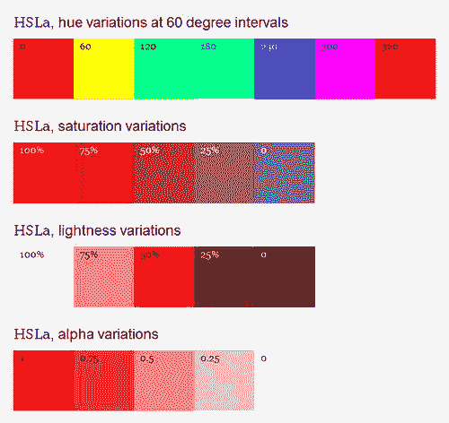

# 十一、让 CSS3 属性发挥作用

到目前为止，在本书的后半部分，你已经复习了 CSS 基础知识；了解了新的选择器；创造了漂亮、灵活的布局；漫步在网络排版的世界里。现在是时候让更多的 CSS3 属性发挥作用，并把这些微妙的东西添加到您的站点中。

在这一章中，我们将研究新的颜色模型、透明度和背景属性；我们还将展示如何应用多种背景、边框、阴影和渐变。因此，无论您是想要创造一个视觉上令人惊叹的前沿设计，还是一个疯狂、喧闹、夸张的 Web 2.0 怪物，我们都支持您。

### 颜色和透明度

我们习惯于在样式表中用关键字(`red`、`blue`)或十六进制值(`#fff`或`#ffffff`)来表示颜色值。CSS3 颜色模块(`[`j.mp/css3color`](http://j.mp/css3color)1`)引入了两种写入颜色值的新方法:RGBa 和 HSLa。在决定使用哪种方法之前，我们需要了解 RGB 和 HSL 之间的区别。

__________

1

#### RGB

毫无疑问，你以前听说过 RGB。为了清楚起见，它表示红色、绿色和蓝色颜色模型，在该模型中，您使用每种颜色的三个数值来创建颜色。回想一下艺术学校，RGB 是一种*加色*颜色模型，通过将三原色相加来创建颜色。这与十六进制计算的工作方式相同，将三个值相乘，不同之处在于这些值以不同的方式表示。RGB 使用 0-255 之间的数字。图 11-1 显示了 Photoshop 的拾色器中指定的 RGB 值。

**图 11-1。**Photoshop 中的拾色器

我们习惯于用 CSS 以三种不同的方式来描述颜色，比如纯蓝色:名称、简写的十六进制代码和完整的十六进制代码。

`color: blue;
color: #00f;
color: #0000ff;`

要使用 RGB 实现颜色，可以使用`rgb`关键字，后跟括号中的 RGB 值。为了用 RGB 来描述纯蓝色，我们可以用数值或百分比来表示红色、绿色和蓝色。RGB 值实际上是 CSS 2.1 的一部分，但直到最近才被普遍使用。这里是数值和百分比值(注意，其余的示例将使用数值)。

`color: rgb(0,0,255);
color: rgb(0,0,100%);
/* color: rgb(red, green, blue); */`

*注意:不要忘记`rgb`不一定要和`color`属性一起使用；你可以在 CSS 中声明颜色值的任何地方使用它，比如`background`和`border-color`。*

你可以马上开始在工作中使用 RGB 值。从 IE6、Safari 3、Firefox 3、Chrome 和 Opera 10 以上的所有浏览器都支持它。

#### RGBa 透明度

通过向属性添加第四个值，可以控制透明度。第四个值，RGBa 中的“a”，代表 alpha。它的作用和在 Photoshop 中改变 alpha 通道完全一样。

要实现 RGBa，你需要把你的`rgb`关键字改成`rgba`；这允许我们设置透明度。“a”(alpha)值通过添加一个介于 0 和 1 之间的数字来设置(其中 0 表示完全透明，1 表示完全不透明)。值 0.6 相当于将透明度设置为 60%。

`color: rgba(0,0,255,0.6);
/* color: rgba(red, green, blue, alpha); */`

图 11-2 显示了从完全不透明(1)到完全透明(0)的不同 alpha 透明度值。

**图 11-2。** RGBa 透明行动

许多知名网站已经开始使用 RGBa。一个最好的例子就是蒂姆·范达姆(`[`j.mp/timvd`](http://j.mp/timvd)3` ) ( 图 11-3 )设计的 24 种方式(`[`j.mp/24ways.org`](http://j.mp/24ways.org)2`)。

__________

2

3

**图 11-3。**24 路站点大量使用 RGBa 建造。

浏览器对 RGBa 的支持不像对 RGB 那样广泛。除了 IE 6-8 之外，它在前面提到的所有浏览器中都受支持。然而，IE9 支持 It *和*。为了迎合那些功能较差的浏览器，在你的样式规则中添加一个纯色选项。

`a {
  color:rgb(0,0,255); /* Fallback for less capable browsers */
  color:rgba(0,0,255,0.6);
}`

浏览器应用它们理解的最后一个属性，所以最后添加关键字`RGBa`确保了更有能力的浏览器将应用透明性。那些不理解`RGBa`的人会简单地忽略它并实现他们理解的属性(第一个`color`值)。如果你不能用纯色，你可以用同样的方法添加一个备用的 PNG。

`article {
  background:url(white50.png); /* Fallback for less capable browsers */
  background:rgba(255,255,255,0.6);
}`

能够在不使用图像的情况下编辑 alpha 透明度意味着我们也可以将其应用于边框和轮廓。此外，在需要更改时只编辑 CSS 比返回 Photoshop 更新多个图像更容易、更快捷。最后，作为一个幸运的副作用，服务器请求的数量减少了(因为你没有加载图像)，这将使你的网站更快。

使用 CSS3 添加颜色的另一种方法是使用 HSLa(色调、饱和度、亮度和 alpha)。HSL 比 RGB 更直观。你可以通过考虑一个色轮，然后调整饱和度和亮度值，直到我们找到我们想要的确切的颜色，来对初始颜色做出明智的猜测。

色调值由 0-360 度的值表示。查看图 11-4 中的色轮，我们可以看到红色由 0 度和 360 度表示，其他两种原色的间隔为 120 度(绿色= 120 度，蓝色= 240 度)。

**图 11-4。**blulob.com HSLa 色轮

HSL 符号中的第二个值是饱和度，或特定颜色的强度。这是一个百分比值，描述为与灰色相比的色彩丰富度，其中 0 表示灰度，100%表示全色饱和度。第三个值代表亮度，用百分比表示，0 表示暗或黑色，50%表示正常亮度，100%表示白色。

为了使用 HSLa 获得纯红色，我们需要结合色调(0 或 360 度)、饱和度(100%，完全饱和)和亮度(50%，正常亮度)的三个值。此外，alpha 通道应设置为 1，以确保颜色完全不透明。

`hsla(0,100%,50%,1)
/* hsla (hue, saturation, lightness, alpha) */`

*注意:HSLa 颜色值是度数和百分比加上一个 alpha 通道的混合。*

图 11-5 显示了通过编辑色调、饱和度、亮度和阿尔法值创建的纯红色示例的多种变化。为了得到这个想法，你自己尝试一下是值得的；一本黑白的书并不总是传达全部的效果。

**图 11-5。**演示如何使用 HSLa 实现色彩变化

与 RGBa 一样，除了 IE 6-8 之外，大多数主流浏览器(包括 IE 9)都支持 HSLa。

对于只使用 CSS 的设计人员来说，计算 RGB 值可能很困难。相比之下，HSL 允许我们为色调选择一种颜色(0-360 之间的值)，然后使用饱和度和亮度值对其进行优化。这一切都是最少的麻烦，并节省了不断跳回到 Photoshop 来检查颜色值是正确的。

*注:Brandon Mathis 的 HSL 拾色器(`[`hslpicker.com/`](http://hslpicker.com/)`)就是这样一个方便的小工具，用来挑选色调，调整饱和度和亮度。它还提供您选择的颜色的十六进制和 rgb 等效值。*

#### 不透明度

Alpha 透明度不是创建透明元素的唯一方式；另一种方法是使用`opacity`属性。它的工作方式类似于 RGBa 或 HSLa 中的 alpha 通道，采用 0 到 1 之间的值，不同之处在于它是为属性指定的唯一值。这意味着你仍然需要使用另一个属性来声明颜色，比如`background-color`或者`color`。要将`article`的背景设置为 50%不透明，我们可以使用:

`article {
  background-color:#fff;
  opacity:0.5;
}`

如图 11-6 中的所示，问题在于当`opacity`被设置时，它影响了包含在父元素中的*所有*子元素的透明度。相比之下，RGBa 和 HSLa 只影响其应用的元素和属性。

**图 11-6。**左边显示不透明的文章，右边显示应用了 50%不透明的文章。

如果可以选择，在大多数情况下，你会希望使用 RGBa 或 HSLa 来增加透明度。当你想让一个元素淡出到背景中，直到与它交互(例如广告或表单)时，这个功能会很有用。

将`opacity`值与`:hover`或`:focus`等伪类一起使用和更改可能会很有效。你也可以把它用于访问过的链接，一旦访问过，就把它们淡入背景。使用 RGBa 或 HSLa 可以达到同样的效果，但是如果你的站点上的链接是多种颜色的，使用`opacity`将会把它们都作为目标，而不需要你为每个颜色实例编写规则。

`a:visited {
  opacity:0.5;
}`

图 11-7 显示了这一点。

**图 11-7。**一个不透明度为 50%的访问链接的例子(在这个例子中“许多动物被推向天空”)

注意`opacity`可以在除 IE 6-8 以外的所有浏览器中工作。有特定的过滤器可以让`opacity`在 IE 中工作，但是，正如在第七章中强调的，我们只会把它们作为最后的手段。

正如我们所见，CSS3 提供了在设计中添加和调整颜色的新方法。您已经看到了如何实现不透明度、RGB 和 HSL 颜色模型，以及如何添加 alpha 透明度。何时何地使用 RGBa、HSLa 和 opacity 由你决定，但毫无疑问，这三者在我们的 CSS 锦囊中都有一席之地。

### 背景

具有广泛实现的最有趣的 CSS3 模块之一是背景和边框模块(`[`j.mp/css3background`](http://j.mp/css3background)4`)，目前是一个候选推荐。我们将在本章后面回到边框，但同时，让我们讨论背景剪辑，多重背景，以及设置背景大小的选项。

__________

4

#### 背景-剪辑

我们习惯于看到背景延伸到他们的边界(图 11-8 )。背景和边框模块中引入的是`background-clip`属性，它允许我们指定背景是否延伸到边框中。

**图 11-8。**背景图像延伸到一个元素的边界

`background-clip`可以取以下三个值:

*   `border-box`
*   `padding-box`
*   `content-box`

如果`background-clip`未声明，则`border-box`值为默认值(图 11-8 )。

将`padding-box`值添加到属性中会剪切要在边框内呈现的背景。

`#introduction {
  border:5px dashed rgb(255,0,0);
  background:rgba(255,255,255,0.7) url(img/bg-moon.jpg) 50% 50%;
  padding:0 20px;
  color:rgb(255,255,255);
  -moz-background-clip:padding;
  background-clip:padding-box;
}`

图 11-9 显示了边框内部渲染的背景。Opera 10.5+，IE 9+，Safari 5+，Firefox 4+，Chrome 5+都实现了没有厂商前缀的`background-clip`属性。

**图 11-9。**应用了填充框值的 CSS3 背景剪辑属性

第三个值`content-box`，将背景裁剪到框的内容区域(图 11-10 )，这是填充内部的区域。

`#introduction {
  border:5px dashed rgb(255,0,0);
  background:url(img/bg-moon.jpg) 50% 50%;
  padding:0 20px;
  color:rgb(255,255,255);
  background-clip:content-box;
}` 

**图 11-10。**应用了内容框值的 CSS3 背景剪辑属性

#### 背景-起源

`background-origin`允许我们指定给定元素的`background position`的起点。它可以采用与`background-clip`相同的值。例如，如果您的背景位于左上角(0，0)，默认的`padding-box` ( 图 11-11 )值将背景定位到填充的外边缘(也是边框的内边缘)。

`#introduction {
  border:5px dashed rgb(255,0,0);
  background:url(img/bg-moon.jpg) 0 0;
  padding:0 20px;
  color:#fff;
  background-clip:border-box;
  background-origin:padding-box;
}` 

**图 11-11。**应用了填充框值的 CSS3 背景-原点属性

与`background-clip`一样，`background-origin`在 Opera、Safari、Firefox、Chrome 和 IE 9 中被原生支持。

*注意:`background-clip`和`background-origin`的值不必相同。*

`border-box`值将背景定位在边框的外边缘(图 11-12 )。根据边框的宽度，这种变化可能非常微妙。

`#introduction {
  border:5px dashed rgb(255,0,0);
  background:url(img/bg-moon.jpg) 0 0;
  padding:0 20px;
  color:#fff;
  background-clip:border-box;
  background-origin:border-box;
}` 

**图 11-12。**应用了边框值的 CSS3 背景-原点属性

`background-origin`可以取的最后一个值是`content-box,`，它将背景起点设置为内容的边缘，或者填充的内边缘(图 11-13 )。

`#introduction {
  border:5px dashed rgb(255,0,0);
  background:url(img/bg-moon.jpg) 0 0;
  padding:0 20px;
  color:#fff;
  background-clip:border-box;
  background-origin:content-box;
}` 

**图 11-13。**应用了内容框值的 CSS3 背景来源属性

尽管有时很难被注意到，但你可能会发现`background-origin`是一个值得的选择，可以替代使用像素定位的背景图像，这取决于你想要达到的效果。

#### 背景尺寸

属性可以用来简化 web 设计者从时间(好吧，也许只是互联网)开始就一直在纠结的问题之一。问题是:不管浏览器窗口大小或屏幕分辨率如何，都需要全尺寸的背景图像，而不必依赖 Flash 或 JavaScript。解决方案是:`background-size`属性。

顾名思义，它允许您指定背景图像在 X(水平)和 Y(垂直)轴上的大小。这意味着，如果你正在构建一个流体设计，你可以使用`background-size`来确保你正在使用的任何背景图像根据视窗的大小或浏览器的宽度进行缩放。

它可以为宽度和高度以及关键字`auto`、`contain`和`cover`取两个值。宽度和高度值可以用像素或百分比表示。第一个值是宽度，第二个值是高度。将`background-size`设置为 85%会产生如图图 11-14 所示的效果。

`html {
  background-image:url(img/earth1.jpg);
  background-position:50% 50%;
  background-repeat:no-repeat;
  background-attachment:fixed;
  background-size:85% 85%;` `  /background-size: width height */
}` 

**图 11-14。**宽度和高度为 85%的 CSS3 背景大小属性

不用设置高度值；实际上，如果没有设置高度，默认值就是`auto`。在这种情况下，这种影响微乎其微。

类似前面提到的后台属性，Opera、Safari、Firefox、Chrome、IE 9 都支持`background-size`。

`contain`关键字缩放背景并保持其纵横比。背景将采用最大尺寸，其宽度*和*高度能够适合它所应用的元素(在我们的例子中是`html`元素)。这确保了在使用`contain`时图像的任何部分都不会被剪切。如果你的容器对于图像来说太大了，你必须确保你的图像淡入一种你可以用作背景默认值的平面颜色(图 11-15 )。您可以使用逗号分隔值来“包含”X 轴或 Y 轴(例如`contain, 250px)`，或者单独使用`contain`关键字来包含 X 轴或 Y 轴)。

此外，如果没有设置宽度和高度值，它们都被假定为`auto`，背景尺寸与使用`co` ntain 的效果相同。

`html {
  background-image:url(img/earth1.jpg);
  background-position:50% 50%;
  background-repeat:no-repeat;
  background-attachment:fixed;
  background-size:contain;
}` 

**图 11-15。**应用了包含值的 CSS3 背景大小属性

另一方面，`cover`关键字，*总是*接管元素的整个背景。它会随着浏览器窗口大小和形状的改变而调整大小，但可能会剪切图像的一些边缘(图 11-16 )。

`html {
  background-image:url(img/earth1.jpg);
  background-position:50% 50%;
  background-repeat:no-repeat;
  background-attachment:fixed;
  background-size:cover;
}` 

**图 11-16。**应用了封面值的 CSS3 背景大小属性

斯蒂芬妮·雷维斯在*的一篇文章中深入探讨了背景尺寸。net* 杂志(`[`j.mp/bgsize`](http://j.mp/bgsize)5`)和链接到她丈夫格雷格为测试封面而创建的有用工具，并包含关键词(`[`j.mp/bgsizetool`](http://j.mp/bgsizetool)6`)。使用它可以快速说明不同的关键字如何产生不同的效果。

__________

5

6

此外，在一篇名为 List Apart ( `[`j.mp/supersizebg`](http://j.mp/supersizebg)7`)的文章中，Bobby van der Sluis 解释了如何结合`background-size`和媒体查询(见第九章)来确保你的背景在较低的屏幕分辨率下不会缩小得太小。请务必阅读这篇文章，并运用 Bobby 的一些技巧。

最后，关于所有背景属性、值、浏览器支持等的有用参考是 Estelle Weyl 的深入指南“你可能想知道的关于 CSS 背景属性的一切:用浏览器支持和到示例和测试用例的链接解释 w3c 规范”(`[`j.mp/estellebg`](http://j.mp/estellebg)8`)。好吧，也许这不是全部，因为它没有涵盖我们接下来要看的多种背景。

#### 多重背景

毫无疑问，你见过 Clearleft 的 Silverback 应用(`[`j.mp/gorillaux`](http://j.mp/gorillaux)9` ) holding page ( 图 11-17 )这样的网站。由 Paul Annett ( `[`j.mp/nicepaul`](http://j.mp/nicepaul)10`)创建的这个网站使用不同的 PNG 透明背景的百分比来放置几个`div`层，以创建深度的幻觉。当调整浏览器窗口大小时，用户会看到视差(`[`j.mp/whatisparallax`](http://j.mp/whatisparallax)11`)效果，因为背景图像会移动以保持它们在浏览器中的比例。

诸如此类的效果往往会创建许多没有任何*含义*的不必要的标记(由于保存在`div` s 中)。如果我们能去掉那些无关的标记会怎么样？你猜怎么着？有了 CSS3 多背景，我们可以。

__________

7 `[www.alistapart.com/articles/supersize-that-background-please](http://www.alistapart.com/articles/supersize-that-background-please)`

8

9

10

11

**图 11-17。【Clearleft 的 Silverback 应用的原始持有页面**

在 CSS3 背景和边框模块中指定的是向单个元素添加多个背景的能力。`background-image`或简写`background`属性的逗号分隔值的数量定义了应用的背景数量。我们将向您展示使用`background` -image 和`background`的例子，所以不要担心混淆两者。对于这些例子，我们将使用三张图片(图 11-18 )并将它们层叠在一整页背景的前面。

**图 11-18。**三个独立的图像

首先，让我们看看目前为止的 CSS。我们已经在`html`元素上设置了一个背景图像，并将其`background-size`属性设置为整个浏览器窗口的`cover`(图 11-19 )。

`html {
  height:100%;
  background-image:url(img/bg-cosmos.jpg);
  background-repeat:no-repeat;
  background-attachment:fixed;
  background-size:cover;
}` 

**图 11-19。**你的起点:应用于 html 元素的背景。

现在我们要给`body`元素添加多重背景。我们也可以将它们添加到`html`元素中，但是使用另一个元素可以为功能较差的浏览器提供更容易的维护和更好的后备。

为了添加我们的第一张背景图片，我们将使用 CSS 2.1 中常见的标准符号。`body`的`height`设置为 100%，以确保它足够高，适合我们的图像。

`body {
  height:100%;
  background-image:url(img/planet1.png);
  background-repeat:no-repeat;
  background-position:50% 30%;
}`

图 11-20 显示了第一张背景图片的位置。

**图 11-20。**一个应用于主体元素的背景图像

为了将第二个背景添加到`body`元素中，我们为每个背景属性添加了一个额外的值，用逗号将它们与第一个属性隔开。然后，我们对`background-repeat`和`background-position`属性重复这些步骤。

`body {
  height:100%;
  background-image:url(img/planet1.png), url(img/planet2.png);
  background-repeat:no-repeat, no-repeat;
  background-position:50% 30%, 15% 90%;
}`

注意第二幅图像是如何出现在第一幅图像下面的(图 11-21 )。这在规范中有定义:

> *列表中的第一幅图像是离用户最近的层；下一张画在第一张的后面，依此类推。背景颜色(如果存在)绘制在所有其他层的下方。*
> 
> `[www.w3.org/TR/css3-background/#layering](http://www.w3.org/TR/css3-background/#layering)`

**图 11-21。**应用于 body 元素的两个背景图片。

如您所见，当声明多个值时，每个属性中的每个值都用逗号分隔。然而，我们可以通过删除`background-repeat`的一个`no-repeat`值来稍微简化我们的例子。这是因为如果没有应用多个值(本例中是第二个),浏览器会被告知重复第一个值。

`body {
  height:100%;
  background-image:url(img/planet1.png), url(img/planet2.png);
  background-repeat:no-repeat;
  background-position:50% 30%, 15% 90%;
}`

相比之下，如果我们不小心忘记添加第二个`background-image`值，但确实包含了两个`background-position`值，浏览器将呈现第一个背景图像的另一个实例，在两个位置重复出现(图 11-22 )。这是因为浏览器重复了`background-image`属性的第一个值。

`body {
  height:100%;
  background-image:url(img/planet1.png); /* Oops we've forgotten to add our second image! */
  background-repeat:no-repeat;
  background-position:50% 30%, 15% 90%;
}` 

**图 11-22。**一个背景图像的两个实例

不想再犯同样的错误，让我们确保在添加第三个图像时添加所有的背景值。这一次我们将使用简写 CSS 符号，使用`background`属性。它以完全相同的方式工作；您只需用逗号分隔每组值。

`body {
  height:100%;
  background:url(img/planet1.png) 50% 30% no-repeat, url(img/planet2.png) 15% 90% no-repeat,
url(img/planet3.png) 75% 20% no-repeat;
}` 

**图 11-23。**应用于 body 元素的三个背景图片。

现在你有了:三张背景图片应用到一个元素上(图 11-23 )。使用百分比值的美妙之处在于，当你调整浏览器大小时，图像会开始移动并隐藏在彼此后面(图 11-24 )，就像银背网站中的视差效果一样。

**图 11-24。**在一个小的浏览器窗口中显示多个背景

浏览器对多种背景的支持范围很广。它可以在 Safari 5、Chrome 5、Opera 10.5、Internet Explorer 9 和 Firefox 3.6 中运行。不过，有一个问题(不是一直都有吗？).如果浏览器不支持多种背景，它不会渲染其中任何一种。由于这个原因(这取决于你的设计),你可能想把最重要的背景图像单独放在一行，以确保至少有一个背景被渲染。

`body {
  height:100%;
  background:url(img/planet1.png) 50% 30% no-repeat;
  background: url(img/planet1.png) 50% 30% no-repeat , url(img/planet2.png) 15% 90% no-repeat,
url(img/planet3.png) 75% 20% no-repeat;
}`

这是一个相对简单的技术，你可以从今天开始使用。请记住，您不必只在`html`或`body`上使用多个背景图像；它们可以应用于任何元素。帕特里克·劳克创造了一个如何使用 CSS3 的多重背景(`[`j.mp/laukedoors`](http://j.mp/laukedoors)12` ) ( 图 11-25 )重现滑动门效果的例子。Patrick 没有像 Douglas Bowmans 2003 original ( `[`j.mp/aladoors`](http://j.mp/aladoors)13`)那样在标记的不同部分使用不同的背景图像，而是简单地在元素上使用多种背景来显示左侧、右侧和中央的背景图像。

**图 11-25。**帕特里克·劳克的多重背景滑动门示例

当然，如果我们有办法很容易地制作圆角盒子，帕特里克的例子会更容易制作……哦，多方便啊！下一节将介绍背景和边框模块的另一半:边框。

### 边框

全世界网页设计师的呼声已经被听到。我们不再需要单调地添加额外的标记或切割额外的图像，只是为了创造一些小细节，比如圆角，让我们的设计更有说服力。请看`border-radius`，因为它为我们提供了仅使用 CSS 的力量来添加原生圆角的能力。

背景和边框模块简直不能停止给予，你不觉得吗？它也让我们能够添加图像到我们的边界，我们稍后会看到。首先，让我们看看实现`border-radius`。

#### 边框半径

给任何元素添加圆角现在都可以通过简单地编写几行 CSS 代码来实现。我们不再需要在我们的标记中添加额外的`span`或者使用 JavaScript 来重新创建一个非常简单的任务。这里是简写的`border-radius`属性，以及各个角落的属性，如`border-top-left-radius`。

深入研究记住半径是圆直径的一半(图 11-26 )，我们可以通过为每个角指定一个值来实现元素上的相等圆角。

`#introduction {
  border-top-left-radius: 20px;
  border-top-right-radius: 20px;
  border-bottom-right-radius: 20px;
  border-bottom-left-radius:20px;
}`

__________

12

13

**图 11-26。**半径是圆直径的一半。

在 Chrome 5、Safari 5、Firefox 4、Internet Explorer 9 和 Opera 10.5 中，这种标记不需要供应商前缀。

*注意:如果你不喜欢自己为所有浏览器编写这些长值，你可以使用像`[`border-radius.com`](http://border-radius.com)`这样的工具来自动化这个过程。输入你的角值，它将为你创建 CSS。*

我们可以像使用`margin`和`padding`一样使用简写的`border-radius`属性，而不是总是为每个单独的角写出四个属性。我们的简化标记如下所示:

`#introduction {
  border-radius:20px 20px 20px 20px;
}`

你现在可能已经猜到了，就像`margin`和`padding`在写速记 CSS 时可以使用一个、两个、三个或四个值一样(参见第七章)。它们像这样影响角落:

*   一个值:所有四个角的半径相同。
*   两个值:第一个值是左上和右下，第二个值是右上和左下。
*   三个值:第一个值是左上，第二个值是右上和左下，第三个值是右下。
*   四个值:按左上、右上、右下、左下的顺序。

因为在我们的例子中所有角的边界半径是相同的，我们可以将我们的规则简化为如下:

`#introduction {
  border-radius:20px;
}`

前面的三个例子都获得了相同的结果(图 11-27 )，我们只是使用简写属性和值来简化代码。

**图 11-27。**边框半径相等的盒子

`border-radius`值可以应用为 ems、像素和百分比。也可以在背景图像存在的情况下应用(图 11-28 )。

`#introduction {
  background:rgba(0,0,0,0.3) url(img/bg-moon.jpg) 50% 50% 
no-repeat;
  border-radius:2em;
}` 

**图 11-28。**带有边框半径和背景图像的方框

更复杂的是(也是为了使属性更加灵活和有用)，边界半径可以有两个长度值:一个用于 X 轴(水平)，一个用于 Y 轴(垂直)。这使我们能够创建椭圆形状。水平值和垂直值之间用正斜杠(/)分隔。斜线前的值代表水平半径，斜线后的值代表垂直半径。图 11-29 显示了结果。

`#introduction {
  background:rgba(0,0,0,0.3) url(img/bg-moon.jpg) 50% 50% 
no-repeat;
  border-radius:2em / 6em;
}` 

**图 11-29。**具有边框半径以及不同水平和垂直半径值的框

如果您愿意，可以在水平和垂直方向上为每个角设置不同的半径。这可以通过使用简写`border-radius`和声明八个值(四个和四个由斜杠分隔)或使用单个角属性(`border-top-left-radius`)来编写，其中两个值由空格分隔*而没有*斜杠。这两个例子对`div` ( 图 11-30 )有完全相同的效果。

速记:

`#introduction {
  background:rgba(0,0,0,0.3) url(img/bg-moon.jpg) 50% 50% 
no-repeat;
  border-radius:2em 4em 6em 8em / 9em 7em 5em 3em;
}`

单个角属性:

`#introduction {
  background:rgba(0,0,0,0.3) url(img/bg-moon.jpg) 50% 50% 
no-repeat;
  border-top-left-radius: 2em 9em;
  border-top-right-radius: 4em 7em;
  border-bottom-right-radius: 6em 5em;
  border-bottom-left-radius: 8em 3em;
}` 

**图 11-30。**每个角的水平和垂直半径具有不同边框半径值的框

**将边框半径直接应用于 IMG 元素**

如果您想将`border-radius`直接应用到`img`或`video`元素，请注意:在任何浏览器中，边框半径都不能正确地裁剪图像(图 11-31 )。最好的解决方案是通过将样式应用到外部的`figure`或`div`来解决这个问题。

**图 11-31。**直接在 img 元素上的边界半径

记住，你不必仅仅用`border-radius`来表示`div` s、`article` s 或`section`s；它也可以应用于锚点、输入，甚至是表格。如果你真的感受到了`border-radius`的爱，没有什么能阻止你全力以赴，创造圆形、椭圆形或更多的形状来为你的设计增添趣味。

#### 边框-图像

如您所料，Border image 允许您指定一个图像作为元素的边框。我们将解释`border-image`的简写版本，但是如果你想单独使用特定的属性，细节在背景和边框模块(`[`j.mp/css3background`](http://j.mp/css3background)14`)中提供。

使用单个图像来创建边界图像，然后沿着各种轴对该图像进行切片、重复或拉伸，使边界围绕元素。换句话说，使用四条线将图像分成九个部分，就像你在创建一个十字板一样，如图图 11-32 。

**图 11-32。**九层重叠的边框图像

然后，四个角切片用于创建元素边框的四个角。剩下的四个边缘切片被`border-image`用来填充元素边界的四个边。然后，指定切片的宽度，以及是否希望它们重复或拉伸以跨越元素边的整个长度。中间的切片，如果不是空白的，将填充应用了`border-image`的元素的背景。

基本的`border-image`属性语法是

`border-image: <image> <slice> <repeat>`

在哪里

*   `image`是用作边框的图像的 URL。
*   `slice`是切片大小的四个百分比或数字值。
*   `repeat`是为了重复而处理边框的方式。这可以从`round`、`stretch`、`space,`和`repeat.`中取两个值

__________

14

*注意:切片不必相等，大小完全由作者决定。欲了解更多详情，请参考规范的边界图像部分(`[`j.mp/borderimage`](http://j.mp/borderimage)15`)。*

在图 11-32 中，每块瓷砖的宽度为 15px。这是我们将与`border-image`属性一起使用的切片值。因此，我们也将把`border-width`属性声明为 15px。我们希望边缘瓷砖重复，所以我们将使用`repeat`关键字。

考虑到上述所有情况，要应用图 11-33 中的所示的边界图像，使用以下代码:

`#introduction {
  border-width:15px;
  border-image:url(img/border1.png) 15 15 15 15 repeat;
}`

结果如图图 11-33 所示。

**图 11-33。**边界图像在歌剧中的应用

__________

15

因为我们的`div`的尺寸，使用`repeat`不是很有效，一些图案会消失在角落图像后面。然而，如前所述，我们有四个拉伸选项

*   `round`:图像重复填充该区域。如果不能容纳全部图块，图像会相应地缩放。
*   `stretch`:图像被拉伸以填充该区域。
*   `repeat`:图像重复填充该区域。
*   `space`:图像重复填充该区域。如果所有的图块都放不下，图像会被隔开以填充该区域。

我们最多可以为 repeat 添加两个值:第一个值用于水平边框，第二个值用于垂直边框。我们现在将把`stretch`和`round`值应用到我们的例子中。因为我们的切片是相等的，所以我们也可以将切片值的数量从四个减少到一个。

`#introduction {
  border-width:15px;
  -moz-border-image:url(img/border1.png) 15 stretch round;
  -webkit-border-image:url(img/border1.png) 15 stretch round;
  border-image:url(img/border1.png) 15 stretch round;
}`

图 11-34 显示了`stretch`和`round`值是如何应用于我们的`div`的。

**图 11-34。**Opera 中应用了 stretch 和 round 关键字的边框图像。

Opera、Chrome、Safari 和 Firefox 都支持`border-image`属性。Internet Explorer 目前不支持`border-image`,目前任何 IE 10 平台预览版都不支持。

*注:Eric Meyer，一个对 CSS 略知一二的人，在 2011 年 1 月写了一篇题为“边界成像”的文章，他向读者提出了一个挑战，使用一张 5px 乘 5px 的图像创建一个边界。有趣的是，就目前的规范而言，这是不可能的，但认为它应该是完全合理的。请记住 Microsoft Publisher 是如何允许您添加边框的。从评论来看，这个规范似乎不会改变。然而，博客文章、评论和邮件列表条目都很有趣。*

作为深思熟虑、勤奋的工匠，你无疑想知道当你把`border-image`和`border-radius`结合在一起时会发生什么。嗯，正如你在图 11-35 中看到的，当半径被应用到背景时，边界图像保持不变。如果您的设计需要解决这个问题，只需在边框图像图形的四个角切片中重新创建圆角即可。

**图 11-35。**应用了边框半径的边框图像

虽然创建疯狂的边界图像有很多乐趣，但请确保您不会退回到一个由 CSS3 构建的 geocities 风格设计组成的平行世界。

__________

16

### 落下阴影

啊，阴影。每个设计师在构思创意概念时的“必备”。这里有一个关于阴影的专业建议:如果当一个设计师在他们的 Photoshop 排版中使用默认的投影，找一个新的设计师。

曾经，加上圆角和渐变，给盒子添加阴影是一场噩梦。有了 CSS3 的背景和边框模块中的`box-shadow`属性，就不再是这样了。

#### 方框-阴影

向元素添加`box-shadow`非常简单。它最多可以有六个值:水平偏移(X)、垂直偏移(Y)、模糊、扩散距离、颜色和一个可选的`inset`关键字来将阴影从外部变为内部。

`box-shadow:inset [offsetX offsetY <blur> <spread> <color>];`

这听起来很复杂，所以让我们通过查看对`box-shadow`的最低要求来了解一下，这是两个偏移值。如果愿意，可以使用负偏移值。正值分别向右下方画阴影，负值向左上方画阴影。你选择的组合由你决定(还有你的假光源从哪里来！).

`#introduction {
  border:5px solid rgba(0,0,0,0.7);
  background:rgba(255,255,255,0.7);
  padding:0 20px;
  border-radius:20px;
  box-shadow:15px 15px;
}`

通过不包含颜色值，`box-shadow`将采用浏览器指定的颜色，所以让我们通过使用`rgba`向示例添加一种颜色。

`#introduction {
  border:5px solid rgba(0,0,0,0.7);
  background:rgba(255,255,255,0.7);
  padding:0 20px;
  border-radius:20px;
  box-shadow:15px 15px rgba(0,0,0,0.4);
}`

如果不指定模糊半径值，阴影将不会模糊，因此边缘会很清晰。模糊半径是我们符号中的第三个值(在这个例子中是 10px)。模糊半径不能使用负值。

`#introduction {
  border:5px solid rgba(0,0,0,0.7);
  background:rgba(255,255,255,0.7);
  padding:0 20px;
  border-radius:20px;
  box-shadow:15px 15px 10px rgba(0,0,0,0.4);
}`

*注:如果你有兴趣了解更多关于模糊半径，它是如何工作的，它意味着什么，Mozilla 的 David Baron 在他的博客`[`j.mp/blurradius`](http://j.mp/blurradius)17`上有详细的文章。*

你要添加的下一个值是扩散半径，该值越大，阴影扩展得越多。与模糊半径不同，您可以使用负扩散值。如果不包含扩散值，阴影将不会扩散。我们已经将扩散半径值设置为 5px ( 图 11-36 )。

`#introduction {
  border:5px solid rgba(0,0,0,0.7);
  background:rgba(255,255,255,0.7);
  padding:0 20px;
  border-radius:20px;
  box-shadow:15px 15px 10px 5px rgba(0,0,0,0.4);
}`

偏移、模糊和扩散的值可以是像素或 ems。Opera、Safari、Chrome、Firefox、Internet Explorer 9 都支持`box-shadow`。

**图 11-36。**Opera 10.6 中没有厂商前缀的盒影工作。

__________

17 `[`dbaron.org/log/20110225-blur-radius`](http://dbaron.org/log/20110225-blur-radius)`

要查看的最后一个值是`inset`关键字，它将阴影放置在元素内部。你可以在图 11-37 中看到这一点:由于阴影现在在元素内部，我们已经减小了它的尺寸。

`#introduction {
  border:5px solid rgba(0,0,0,0.7);
  background:rgba(255,255,255,0.7);
  padding:0 20px;
  border-radius:20px;
  box-shadow:3px 3px 3px 2px rgba(0,0,0,0.4) inset;
}` 

**图 11-37。**Opera 10.6 中使用 inset 关键字的内部框影。

*有一个由 Thany 创建的方便的应用(`[`j.mp/thany`](http://j.mp/thany)18`)，可以让你在不同的浏览器中查看盒子阴影的渲染差异。您只需检查您希望看到的浏览器并查看示例。目前您可以查看 Firefox 3.6 和 4、Internet Explorer 9、Chrome 10、Safari 5、Opera 11.10、Android 2.2、iOS 4.2 和 Opera Mobile 11。*

阴影的乐趣不止于此。你可以有多个阴影，只需用逗号分隔每个阴影(见图 11-38 )。

__________

18

`div#introduction {
  border:5px solid rgba(0,0,0,0.7);
  background:rgba(255,255,255,0.7);
  padding:0 20px;
  border-radius:20px;
  box-shadow:3px 3px 3px 2px rgba(0,0,0,0.4) inset, 15px 15px 10px 5px rgba(0,0,0,0.4);
}` 

**图 11-38。**Opera 10.6 中的多框阴影

*注意:使用太多阴影会影响网站性能。用户滚动时会出现问题:滚动滞后。格兰特·卢卡斯在他的博客上写下了他的发现。这个问题似乎已经在新版本的浏览器中得到解决，但是您应该在一系列浏览器中彻底测试类似的问题。这是安迪·爱丁堡在测试一个网站时发现的，尽管这次`border-radius`是罪魁祸首。为此，Andy 创建了一个 CSS 压力测试书签，允许您确定性能问题的原因。你可以在安迪的博客(`[`j.mp/cssstresstest`](http://j.mp/cssstresstest)20`)上了解更多关于 CSS 压力测试的内容。*

__________

19

20 `[`andy.edinborough.org/CSS-Stress-Testing-and-Performance-Profiling`](http://andy.edinborough.org/CSS-Stress-Testing-and-Performance-Profiling)`

最后，如上所述，你也可以使用负偏移值并反转阴影，给人一种来自不同方向的光源的效果(图 11-39 )。

`div#introduction {
  border:5px solid rgba(0,0,0,0.7);
  background:rgba(255,255,255,0.7);
  padding:0 20px;
  border-radius:20px;
  box-shadow:-3px -3px 3px 2px rgba(0,0,0,0.4) inset, -15px -15px 10px 5px rgba(0,0,0,0.4);
}` 

**图 11-39。**Opera 10.6 中的负框阴影

CSS3 的`box-shadow`属性有无数的机会。事实上，Viget 的团队写了一篇题为“CSS3 盒影的 39 件荒谬的事情”(`[`j.mp/39shadows`](http://j.mp/39shadows)21`)的文章，其中他们演示了 39 种盒影变体，每种都有一个独特的名称。我们最喜欢的是“软焦点”，当然还有“蝙蝠侠”尼古拉斯·加拉格尔受到作者迪维娅·马年和马特·哈姆的启发，在他的文章“没有图像的 CSS 投影”(`[`shadowmagic`](http://shadowmagic)22`)中，他使用`:before`和`:after`伪元素来定位阴影，试图创建页面卷曲效果等。确实聪明。

__________

21

22

最终，虽然有一些乐趣，但`box-shadow`的关键是不要滥用它，巧妙地使用它，当然不要让它看起来像 Photoshop 的默认阴影。

### 正文-阴影

我们已经看到了`box-shadow`属性；不出所料,`text-shadow`惊人地相似。它是 CSS 2.1 的一部分；然而，随着 CSS3 的兴起，它似乎吸引了更多的注意力。您可以使用与`box-shadow`相同的符号对文本应用一个或多个阴影，即水平偏移、垂直轴偏移、模糊和颜色。请注意，`text-shadow`没有传播值或`inset`关键字。

`h1 {
  color:#777;
  text-shadow: 5px 5px 10px rgba(0,0,0,0.5);
  /* text-shadow: x offset y offset blur color; */
}`

你可以在图 11-40 中看到应用的示例代码。

**图 11-40。**Chrome 中的文本阴影

和`box-shadow`一样，你可以对你的元素应用多重阴影。没有`inset`关键字来帮助我们创建内部阴影。通过思考这个问题并使用多个`text-shadow`，有些是负值，我们可以实现活版印刷(或嵌入)排版的外观(图 11-41 )。

`h1 {
  text-shadow: -1px 0 0 rgba(0,0,0,0.5), 0 -1px 0 rgba(0,0,0,0.3), 0 1px 0
rgba(255,255,255,0.5), -1px -2px 0 rgba(0,0,0,0.3);
}` 

**图 11-41。**使用文本阴影创建的活版印刷

虽然`text-shadow`是在 CSS 2.1 中引入的，但是 IE 10 中会有。如果你*真的需要在 IE 中使用*文本阴影，你可以使用微软专有的过滤器来渲染它们。通常情况下，你可以在渐进增强的名义下生活，而不会让 IE 用户看到一两个影子。Opera、Safari、Chrome、Firefox 都支持`text-shadow`。

在我们结束`text-shadow`之前，我们会给你留一点东西让你思考。为什么不使用`text-shadow`来创建一些假的立体图，让你的网站在 3D 中真正“流行”(图 11-42 )。下载示例文件来看看这一辉煌的彩色！)?

`.anaglyph {
  color:rgba(0,0,0,0.8);
  text-shadow: 0.1em 0 0 rgba(0,245,244,0.5), -0.05em 0 0 rgba(244,0,0,0.9);
}` 

**图 11-42。**使用 CSS3 文本阴影的仿 3D 立体图

立体图像很好，但是谁会戴着 3D 眼镜浏览网站呢？我们需要的是真正的 3D，而这正是马克·奥托所做的(图 11-43 )。Mark 的演示在文本上总共使用了 12 个阴影，因此在某些浏览器上可能会有一些性能问题，但它看起来确实很棒。马克在他的博客(`[`j.mp/3dshadow`](http://j.mp/3dshadow)23`)上写了这个实验，我们建议你深入研究一下。

**图 11-43。**马克·奥托使用 CSS3 制作的 3D 文本`text-shadow`

对于我们使用`text-shadow`的最后一个技巧，我们将使用它在文本周围创建一个轮廓。诀窍是在文本的每一边都加上阴影。为了使效果生效，我们必须为文本声明一个与背景颜色相匹配的颜色值来创建透明效果(图 11-44 )。

`.title {
  color:#ccc;
  text-shadow: -1px 0 rgba(0,0,0,0.5), 0 1px rgba(0,0,0,0.5), 1px 0 rgba(0,0,0,0.5), 0 -1px
rgba(0,0,0,0.5);
}.` 

**图 11-44。** WebKit 浏览器使用多个文本阴影创建轮廓效果

__________

23

*如果你的目标受众只使用 WebKit 浏览器(这是不应该的)，有一个专有的`–webkit-text-stroke`属性将达到如图图 11-44 所示的相同效果。不像`text-shadow,`没有模糊值。它的工作原理如下，但还没有任何规范(关于该属性应该被命名为`text-outline`还是`text-stroke`一直存在争议):??*

`h1 {
  color:transparent;
  -webkit-text-stroke:rgba(0,0,0,0.5);
}`

### 渐变

这里，我们在 CSS3 现象的商业端:渐变。你不再需要创建大量单像素宽的图像来重复你的设计。也许更重要的是，当我们想改变渐变的颜色或长度时，我们不必再回到 Photoshop 或 Fireworks 来编辑这些图形。我们将能够简单地编辑我们的 CSS。

CSS 渐变驻留在 CSS 图像值和替换的内容模块(`[`j.mp/css3images`](http://j.mp/css3images)24`)中，该模块目前处于工作草案中。这意味着这又是一个先有鸡还是先有蛋的问题，或者说是规范与实现的问题。尽管如此，正如我们在本书中所展示的，实现通常是最重要的，所以让我们开始吧。

#### 渐变

基于 CSS 的渐变目前受 Firefox、Safari、Chrome 和 Opera 浏览器支持，并将包含在 Internet Explorer 10 中。它们可以在旧版本的 Internet Explorer 中通过使用过滤器来实现，但是，正如你以前从我们这里听到的，这种方法并不推荐。对于不支持 CSS 渐变的浏览器，请确保指定一种背景色作为备用。

渐变有两种风格:线性和径向。我们将向您展示如何使用这两者。

##### 线性渐变

我们将从引入线性渐变开始。`linear-gradient`值有效地生成了一个图像，它可以在 CSS 中与图像相同的地方使用，例如`background-image`、`border-image`或`list-style-image`属性。之所以这样设计，是因为人们熟悉使用图像进行渐变；因此梯度*不能*用作`color`值。基本符号如下所示:

`linear-gradient([ [ <angle> | to <side-or-corner> ] ,]?
        <color-stop>[, <color-stop>]+  )`

__________

24

这些值如下:

*   `angle`:渐变方向的角度(如 90 度)。您可以使用负值或大于 360 度的值。
*   `side-or-corner`:定义渐变的起点(如果不使用角度)，由四个可用关键字(上、下、左、右)中的两个指定。默认值是左上角，如果只声明了一个值，则第二个值默认为“居中”
*   `color-stop`:最简单的形式，一个颜色值。沿着梯度的可选停止位置可以作为 0%和 100%之间的值的百分比添加。颜色值可以是关键字、十六进制代码或`rgba`或`hsla`符号

如果你想到一个在 Photoshop 中应用的渐变，CSS 渐变以同样的方式工作，在从开始(0%)到结束(100%)的不同位置沿着渐变添加颜色停止，如图图 11-45 所示。

**图 11-45。**色标示例

要创建从灰色到黑色的垂直渐变，您可以使用:

`#introduction {
  background:#000; /* fallback for browsers that don’t support gradients */
  background:linear-gradient(to bottom, #ccc, #000);
}`

或者:

`#introduction {
  background:#000; /* fallback for browsers that don't support gradients */
  background:linear-gradient(90deg, #ccc, #000);
}`

这和写作是一样的

`#introduction {
  background:#000; /* fallback for browsers that don't support gradients */
  background:linear-gradient(#ccc, #000);
}`

这是因为不需要声明角、边或拐角；默认情况下，渐变是垂直的。你只需要两个颜色值。

我们现在必须承认，我们确实撒了一点谎，说它是我们创建渐变所需的唯一标记，原因是前面提到的浏览器都不支持没有供应商前缀的渐变。因此，为了创建如图 11-46 所示的渐变，我们将添加供应商前缀。

`#introduction {
  background:#000; /* fallback for browsers that don't support gradients */
  background:-ms-linear-gradient(#ccc, #000);
  background:-moz-linear-gradient(#ccc, #000);
  background:-o-linear-gradient(#ccc, #000);
  background:-webkit-linear-gradient(#ccc, #000);
  background:linear-gradient(#ccc, #000);
}` 

**图 11-46。**Firefox 中的垂直线性渐变

你之前已经看到了`90deg`角度参数意味着渐变是从上到下绘制的。角度值设置从左侧开始的渐变角度，其中

*   0 度=左侧
*   90 度=底部
*   180 度=右
*   270 度 = 顶部
*   360 度=完成一整圈后再次向左

你也可以使用负值的梯度，但它们将等同于逆时针方向的正梯度(例如-90 度= 270 度)。为了创建一个从左下角到右上角的渐变(如图 11-47 中的，我们将使用 45 度角。

`#introduction {
  background:#000;
  background:-ms-linear-gradient(45deg, #ccc, #000);
  background:-moz-linear-gradient(45deg,#ccc, #000);
  background:-o-linear-gradient(45deg, #ccc, #000);
  background:-webkit-linear-gradient(45deg, #ccc, #000);
  background:linear-gradient(45deg, #ccc, #000);
}` 

**图 11-47。**Firefox 中的对角线渐变

只需在参数中添加另一个颜色值，即可添加色标。除非您指定一个值来伴随颜色停止，否则渐变会均匀呈现。图 11-48 显示了 50%的颜色停止，但是你也可以使用像素或 ems 来指定停止出现的位置。

`#introduction {
  background:#000;
  background:-ms-linear-gradient(45deg, #ccc, #c8c8c8 50%, #000);
  background:-moz-linear-gradient(45deg, #ccc, #c8c8c8 50%, #000);
  background:-o-linear-gradient(45deg, #ccc, #c8c8c8 50%, #000);
  background:-webkit-linear-gradient(45deg, #ccc, #c8c8c8 50%, #000);
  background:linear-gradient(45deg, #ccc, #c8c8c8 50%, #000);
}` 

**图 11-48。**Firefox 中带色标的对角线渐变

值得花些时间为渐变创建测试用例，看看改变浏览器中的各种值会产生什么影响。

*注意:Safari 4 和 Chrome 3-9 版本对 CSS 渐变使用了不同的语法，只指定了一个`-webkit-gradient`属性。渐变类型(线性或径向)随后出现在第一个参数中。语法基于`canvas`元素 API 符号。您可以在 WebKit 博客(`[`j.mp/oldwebkitgrads`](http://j.mp/oldwebkitgrads)25`)上了解这种遗留语法。如果您必须在这些旧浏览器中支持渐变，请在现在标准化的`linear-gradient`值之前添加`–webkit-gradient`值，以确保新的 WebKit 浏览器使用新的语法，如下所示。*

`#introduction {
  background:#000;
  background:-webkit-gradient(linear, 0% 100%, 100% 0%, from(#ccc), to(#000), color-stop(0.5,
#c8c8c8));
  background:-ms-linear-gradient(45deg, #ccc, #c8c8c8 50%, #000);
  background:-moz-linear-gradient(45deg, #ccc, #c8c8c8 50%, #000);
  background:-o-linear-gradient(45deg, #ccc, #c8c8c8 50%, #000);
  background:-webkit-linear-gradient(45deg, #ccc, #c8c8c8 50%, #000);
  background:linear-gradient(45deg, #ccc, #c8c8c8 50%, #000);
}`

__________

25 `[www.webkit.org/blog/175/introducing-css-gradients](http://www.webkit.org/blog/175/introducing-css-gradients)`

为了激发你对渐变和可能性的想象，我们建议你去看看由 Lea Verou ( `[`j.mp/veroupatterns`](http://j.mp/veroupatterns)26`)创建和策划的极具创意的 CSS3 Patterns gallery。Lea 还在一篇优秀的文章中为 24 种方式(`[`j.mp/veroupatterns2`](http://j.mp/veroupatterns2)27`)解释了如何使用渐变创建图案。您也可以将渐变与本章前面提到的多种背景结合起来。你会惊讶于使用 CSS3 渐变所能达到的效果。

##### 径向梯度

径向渐变的语法比线性渐变稍微复杂一些。以下是标准符号:

`radial-gradient(
  [ [ <shape> || <size> ] [ at <position> ]? , |
    at <position>,
  ]?
  <color-stop> [ , <color-stop> ]+
)`

其中:

*   `position`是渐变的起点，可以用单位(px、em 或百分比)或关键字(左、下等)来指定。使用关键字的方式与`background-position`相同，默认值是“center”
*   `shape`指定渐变的形状。它可以是`circle`(等半径椭圆)或`ellipse`(轴对齐椭圆)。默认值为椭圆。如果没有声明形状，则从长度单位推断出最终形状。如果是一个长度，形状默认为圆形；如果是两个椭圆。
*   `size`是渐变结束形状的大小。如果不包含，默认为`farthest-side`。可以使用单位或关键字设置大小。
    *   `closest-side`定位渐变，使其接触最靠近元素中心的一侧或多侧。如果形状是椭圆，它在水平和垂直方向上与边相交。
    *   `farthest-side`与`closest-side`相同，但结束形状基于最远的边。
    *   `closest-corner`定位渐变，使其接触最靠近其中心的元素的一个或多个角。如果形状是椭圆，它在水平和垂直方向上与角相交。
    *   `farthest-corner`与`closest-corner`相同，但结束形状基于最远的边。
    *   `contain`和`closest-side`效果一样。
    *   `cover`与`farthest-corner.`的效果相同
*   `color-stop`是其最简单形式的一个颜色值。沿着梯度的可选停止位置可以作为 0 % & 100%之间的值的百分比添加。

__________

26 `[`lea.verou.me/css3patterns`](http://lea.verou.me/css3patterns)`

27 `[`24ways.org/2011/css3-patterns-explained`](http://24ways.org/2011/css3-patterns-explained)`

这一切听起来很混乱，所以让我们进入正题，创造一些梯度。就像线性渐变一样，您需要包含所有供应商前缀。

要绘制一个简单的圆形径向渐变延伸到你的容器的边缘(图 11-49 )，你只需要声明:

`#introduction {
  background:#000;
  background: -moz-radial-gradient(circle closest-side, #ccc, #000);
  background: -ms-radial-gradient(circle closest-side, #ccc, #000);
  background: -o-radial-gradient(circle closest-side, #ccc, #000);
  background: -webkit-radial-gradient(circle closest-side, #ccc, #000);
  background: radial-gradient(circle closest-side, #ccc, #000);
}` 

**图 11-49。**火狐中的圆形径向渐变

尝试将形状和大小值更改为`ellipse`和`farthest-side`，看看这有什么影响。

`#introduction {
  background:#000;
  background: -moz-radial-gradient(ellipse farthest-side, #ccc, #000);
  background: -ms-radial-gradient(ellipse farthest-side, #ccc, #000);
  background: -o-radial-gradient(ellipse farthest-side, #ccc, #000);
  background: -webkit-radial-gradient(ellipse farthest-side, #ccc, #000);
  background: radial-gradient(ellipse farthest-side, #ccc, #000);` `}`

你可以看到这将你的圆挤压成了一个更大范围的椭圆(图 11-50 )。

**图 11-50。**Firefox 中的椭圆形径向渐变

通过添加位置值，我们可以将渐变移离中心(`left top`)。我们还将在 200 像素处添加一个额外的色阶(图 11-51 )。

`#introduction {
  background:#000;
  background: -moz-radial-gradient(left top, ellipse farthest-side, #ccc, #75aadb 200px,
#000);
  background: -ms-radial-gradient(left top, ellipse farthest-side, #ccc, #75aadb 200px, #000);
  background: -o-radial-gradient(left top, ellipse farthest-side, #ccc, #75aadb 200px, #000);
  background: -webkit-radial-gradient(left top, ellipse farthest-side, #ccc, #75aadb 200px,
#000);
  background: radial-gradient(left top, ellipse farthest-side, #ccc, #75aadb 200px, #000);
}` 

**图 11-51。**椭圆形径向渐变在火狐左上角开始

和线性渐变一样，掌握语法的最好方法是尝试一下。给自己设定一些挑战，用渐变再造各种效果；你会惊讶于你用几行 CSS3 就能完成的事情。然而，如果你想更深入一点，约翰·奥尔索普写了一篇关于径向渐变的精彩文章(`[`j.mp/allsoppgrads`](http://j.mp/allsoppgrads)28`)，这本书的技术评论员克里斯·米尔斯也写了一篇(`[`j.mp/millsgrads`](http://j.mp/millsgrads)29`)。我们建议你把这些加入你不断增加的阅读清单。

*注意:我们包括了传统的 WebKit 语法，以提供最好的支持，但是记住你的优秀 CSS 开发人员承诺 TM 保持你的厂商前缀属性是最新的。一旦您决定放弃对这个旧浏览器的支持，您将不再需要包含这些代码。注意，我们将遗留的 WebKit 语法作为第二个声明，就像我们之前做的那样，所以它会被支持标准语法的最新版本覆盖。*

__________

28 `[www.webdirections.org/blog/css3-radial-gradients](http://www.webdirections.org/blog/css3-radial-gradients)`

29 `[`dev.opera.com/articles/view/css3-radial-gradients`](http://dev.opera.com/articles/view/css3-radial-gradients)`

`#introduction {
  background:#000;
  background: -webkit-gradient(radial, 0 0, 20, 0 0, 450, from(#ccc), to(#000), color-
stop(50%, #75aadb));
  background: -moz-radial-gradient(left top, ellipse farthest-side, #ccc, #75aadb 200px,
#000);
  background: -ms-radial-gradient(left top, ellipse farthest-side, #ccc, #75aadb 200px, #000);
  background: -o-radial-gradient(left top, ellipse farthest-side, #ccc, #75aadb 200px, #000);
  background: -webkit-radial-gradient(left top, ellipse farthest-side, #ccc, #75aadb 200px,
#000);
  background: radial-gradient(left top, ellipse farthest-side, #ccc, #75aadb 200px, #000);
}`

总之，通过改变值和添加额外的色标，您可以创建圆锥体、光线等。有许多工具可以在创建渐变时帮助你(并使你不必每次都写出多行 CSS)。我们发现最好的是 ColorZilla 的终极 CSS 生成器(图 11-52 ) ( `[`j.mp/zillagrads`](http://j.mp/zillagrads)30`)。不像其他生成器以不正确的顺序列出声明或者没有更新以反映 WebKit 的语法变化，最终的 CSS 生成器在一个易于使用的界面中拥有您需要的一切。去玩吧。

__________

30 `[www.colorzilla.com/gradient-editor](http://www.colorzilla.com/gradient-editor)`

**图 11-52。** ColorZilla 终极 CSS 生成器

##### 重复渐变

如果你想变得更有创意一点，你也可以使用`repeating-linear-gradient`或`repeating-radial-gradient`，它们允许我们创建重复的渐变。重复图案(图 11-53 )是使用第一个和第二个色标值之间的差值的倍数创建的。与早期的渐变一样，您需要使用供应商前缀来确保在现代浏览器中获得良好的支持。

`div#introduction {
  background:#000;
  background: -ms-repeating-linear-gradient(#333, #ccc 60px, #333 55px, #ccc 30px);
  background: -moz-repeating-linear-gradient(#333, #ccc 60px, #333 55px, #ccc 30px);
  background: -o-repeating-linear-gradient(#333, #ccc 60px, #333 55px, #ccc 30px);
  background: -webkit-repeating-linear-gradient(#333, #ccc 60px, #333 55px, #ccc 30px);
  background: repeating-linear-gradient(#333, #ccc 60px, #333 55px, #ccc 30px);
}` 

**图 11-53。**铬色中的对角线重复线性渐变

对于径向梯度，我们将使用以下代码(结果见图 11-54 ):

`#introduction {
background:#000;
background: -ms-repeating-radial-gradient(center, 30px 30px, #ccc, #333 50%, #999);
background: -moz-repeating-radial-gradient(center, 30px 30px, #ccc, #333 50%, #999);
background: -o-repeating-radial-gradient(center, 30px 30px, #ccc, #333 50%, #999);
background: -webkit-repeating-radial-gradient(center, 30px 30px, #ccc, #333 50%, #999);
background: repeating-radial-gradient(center, 30px 30px, #ccc, #333 50%, #999);
}` 

**图 11-54。**铬色中的径向重复线性渐变

这里展示的花哨例子中的重复渐变可能不是最漂亮的，但它们确实有它们的用途。

### 检测支持并帮助其他浏览器

在这一章中，我们已经谈到了浏览器的支持，以及支持或不支持的内容。一般来说，Safari、Chrome、Firefox、Opera 和 Internet Explorer 9 和 10 对这些属性有很好的、广泛的支持，而 Internet Explorer 6-8 则没有。那么对于这些浏览器该怎么办呢？本质上有三个主要选择。

*   在你的 CSS 中添加回退，以确保功能较弱的浏览器获得合适的体验。
*   运行一个检测脚本，比如 Modernizr(见第七章)，并相应地组织你的样式表。
*   用 JavaScript 库填补空白，比如在第七章中介绍的 CSS3 Pie。

第一种选择是我们在本章中一直在做的。我们现在将简要解释选项二和选项三。

#### 使用 Modernizr

我们在本书的前面简单地提到了 Modernizr ( `[`j.mp/modernizr`](http://j.mp/modernizr)31`);现在我们将看看它与我们在本章中看到的 CSS3 属性的关系。

当用户访问您的站点时，Modernizr 运行并检测用户浏览器对 CSS3 和 HTML5 特性的支持，并向`html`元素添加一系列类。例如，Modernizr 将在 Internet Explorer 中添加一个`no-cssgradients`类。这非常有用，因为这意味着在一个样式表中可以有两个规则来适应两种浏览器。假设你有一个需要渐变背景的设计，而*有*在那里——你不能退回到纯色。对于 Safari、Chrome、Opera 和 Firefox，您需要设计风格

`.cssgradients {
  background:-moz-linear-gradient( center bottom,rgb(240,120,14) 50%,rgb(250,151,3) 90%);
  background:-webkit-linear-gradient( linear, left bottom, left top, color-stop(0.5,
rgb(240,120,14)), color-stop(0.9, rgb(250,151,3)));
background: -o-linear-gradient( linear, left bottom, left top, color-stop(0.5,
rgb(240,120,14)), color-stop(0.9, rgb(250,151,3)));
background: -ms-linear-gradient( linear, left bottom, left top, color-stop(0.5,
rgb(240,120,14)), color-stop(0.9, rgb(250,151,3)));
background:linear-gradient( linear, left bottom, left top, color-stop(0.5, rgb(240,120,14)),
color-stop(0.9, rgb(250,151,3)));
}`

对于旧版本的 Internet Explorer，您可以使用图像创建渐变，并将属性添加到`no-cssgradients`类。

`.no-cssgradients {
  background:#ccc url(img/bg-rpt.png) 0 0 repeat-x;
}`

使用这种方法不仅意味着那些具有出色 CSS3 支持的浏览器可以获得最佳体验，而且那些支持较少的浏览器仍然可以获得非常好的体验。

#### CSS3 Pie

你在第七章看到了 CSS3 派(`[`j.mp/css3pie`](http://j.mp/css3pie)32`)；让我们在这里使用它来应用一些边界半径到 IE 6，7 和 8。这是我们没有派的规矩:

`#introduction {
  background:#ccc;
  padding:20px;
  -moz-border-radius:20px;
  border-radius:20px;
}`

__________

31 `[www.modernizr.com](http://www.modernizr.com)`

32

要添加对 IE6、7 和 8 的支持，您只需将饼图`behavior: url(js/PIE.htc);`行添加到您的规则中，然后，您就可以在 Internet Explorer 中获得圆角。

`#introduction {
  ...
  behavior: url(js/PIE.htc);
}`

CSS3 PIE 涵盖了我们在这一章中学到的大部分内容，所以如果你真的不能忍受 Internet Explorer 中没有圆角，并且能够承受性能损失，或者你不能使用渐进式增强，那么 CSS3 Pie 可能就适合你。

### 组合 CSS3 效果

您已经了解了 CSS3 中的许多新属性，但是到目前为止，它们都是孤立显示的。现在是时候把它们放在一起了。我们将使用本章中发现的所有属性来设计一个漂亮的提交按钮。我们按钮的基本样式(图 11-55 )如下:

`input[type="submit"] {
  font-size:18px;
  width:auto;
  padding:0.5em 2em;
  color:#fff;
  background:orange;
}` 

**图 11-55。**基本按钮样式

首先，转换背景颜色以使用 R = 240、G = 120 和 B = 14`rgb`值。并使用`hsla`为边框颜色去除难看边框(图 11-56 )。

`input[type="submit"] {
  font-size:18px;
  width:auto;
  padding:0.5em 2em;
  color:#fff;
  background:rgb(240,120,14);
  border:1px solid hsla(30,100%,50%,0.8);
}` 

**图 11-56。**RGB 和 hsla 风格的纽扣

接下来，通过添加一些`border-radius`来圆化那些尖角。

`input[type="submit"] {
  font-size:18px;
  width:auto;
  padding:0.5em 2em;
  color:#fff;
  background:rgb(240,120,14);
  border:1px solid hsla(20,100%,50%,0.7);
  border-radius:5px;
}`

按钮周围的小阴影将有助于稍微抬起按钮，使其更加明显(图 11-57 )。

`input[type="submit"] {
  font-size:18px;
  width:auto;
  padding:0.5em 2em;
  color:#fff;
  background:rgb(240,120,14);
  border:1px solid hsla(20,100%,50%,0.7);
  border-radius:5px;
  box-shadow:1px 2px 3px rgba(0,0,0,0.5);
}` 

**图 11-57。**带圆角和外阴影的按钮

现在，应用我们在本章前面使用`text-shadow`创建的插入文本，使文本看起来好像凹进了按钮。为此，我们给文本添加了四个阴影，每个阴影之间用逗号隔开。

`input[type="submit"] {
  font-size:18px;
  width:auto;
  padding:0.5em 2em;` `  color:#fff;
  background:rgb(240,120,14);
  border:1px solid hsla(20,100%,50%,0.7);
  border-radius:5px;
  box-shadow:1px 2px 3px rgba(0,0,0,0.5);
  text-shadow: -1px 0 0 rgba(0,0,0,0.3), 0 -1px 0 rgba(0,0,0,0.3), 0 1px 0
rgba(255,255,255,0.5), -1px -1px 0 rgba(250,151,3,0.5);
}`

为了稍微柔化按钮，我们将为背景使用 CSS 生成的渐变(图 11-58 )。记住这些只能在 Firefox、Safari、Opera 和 Chrome 中使用，所以我们将保留现有的`background`属性作为后备。现在我们有了:我们完整的 CSS3 风格的按钮！一件美丽的东西！

`input[type="submit"] {
  font-size:18px;
  width:auto;
  padding:0.5em 2em;
  color:#fff;
  background:rgb(240,120,14);
  border:1px solid hsla(20,100%,50%,0.7);
  border-radius:5px;
  box-shadow:1px 2px 3px rgba(0,0,0,0.5);
  text-shadow: -1px 0 0 rgba(0,0,0,0.3), 0 -1px 0 rgba(0,0,0,0.3), 0 1px 0
rgba(255,255,255,0.5), -1px -1px 0 rgba(250,151,3,0.5);
  background:-moz-linear-gradient( center bottom,rgb(240,120,14) 50%,rgb(250,151,3) 90%);
  background:-webkit-linear-gradient( linear, left bottom, left top, color-stop(0.5,
rgb(240,120,14)), color-stop(0.9, rgb(250,151,3)));
  background:-o-linear-gradient( linear, left bottom, left top, color-stop(0.5,
rgb(240,120,14)), color-stop(0.9, rgb(250,151,3)));
  background:-ms-linear-gradient( linear, left bottom, left top, color-stop(0.5,
rgb(240,120,14)), color-stop(0.9, rgb(250,151,3)));
  background:linear-gradient( linear, left bottom, left top, color-stop(0.5, rgb(240,120,14)),
color-stop(0.9, rgb(250,151,3)));
}` 

**图 11-58。带有文本阴影和 CSS 渐变背景的按钮**

不要停在那里！为`:hover`和`:focus`状态添加一些样式。结合使用`position:relative`和`top:1px;`会产生一个按钮在悬停时被按下的效果。此外，我们已经反转了背景渐变，减少了方框阴影，并移动了文本阴影，以获得两种状态之间所需的对比度(图 11-59 )。

`input[type="submit"]:hover, input[type="submit"]:focus {
  position:relative;
  top:1px;` `  cursor:pointer;
  box-shadow:1px 1px 2px rgba(0,0,0,0.5);
  text-shadow: -1px 0 0 rgba(0,0,0,0.3), 0 1px 0 rgba(0,0,0,0.3), 0 0 0 rgba(255,255,255,0.5),
-1px 1px 0 rgba(250,151,3,0.5);
  background:rgb(250,151,3);
  background:-moz-linear-gradient(center bottom, rgb(250,151,3) 50%, rgb(240,120,14) 90%,);
  background:-webkit-linear-gradient( linear, left bottom, left top, color-stop(0.5,
rgb(250,151,3)), color-stop(0.9, rgb(240,120,14)));
  background:-o-linear-gradient( linear, left bottom, left top, color-stop(0.5,
rgb(250,151,3)), color-stop(0.9, rgb(240,120,14)));
  background:-ms-linear-gradient( linear, left bottom, left top, color-stop(0.5,
rgb(250,151,3)), color-stop(0.9, rgb(240,120,14)));
  background:linear-gradient( linear, left bottom, left top, color-stop(0.5, rgb(250,151,3)),
color-stop(0.9, rgb(240,120,14)));
}` 

**图 11-59。**按钮处于正常和:悬停状态

完整的样式规则可能看起来很深入，但效果很容易实现。当分解成一口大小的块并组合在一起时，您可以使用 CSS3 属性创建漂亮的样式元素。

*注意:如果你不记得特定属性的语法，或者不记得哪些需要前缀，有一些网站可以帮助你。Paul Irish 和 Jonathan Neal 的 CSS3 Please ( `[`css3please.com/`](http://css3please.com/)`)就是这样一个网站。该网站允许您动态编辑规则，并自动为您更新前缀属性。这是一个真正的省时工具，你会发现自己会反复使用它。*

#### 拿着奶酪

事情是这样的:您现在已经掌握了所有关于 CSS3 属性的新知识。问题是你将在哪里以及如何应用它们？答案取决于你，但关键是微妙。我们会再说一遍，以确保你记住:关键是*微妙*。没有什么比 100%的黑色阴影或比例不当的圆角更能说明懒惰了。

不幸的是，我们不会在你每次想添加渐变背景或边框图像时都给你指导。相反，每当你要添加一个很酷的 CSS3 效果时，停下来问自己这些问题:

*   这有什么用？
*   它给我的设计增加了什么？
*   会给我的用户提供更好的体验吗？

如果你不确定或者任何一个问题的答案是否定的，那就不要回答。

**图 11-60。**西蒙·科利森先生著名的新杂集《colly.com》

如果你不相信我们，试着听听西蒙·科利森(他对网页设计略知一二)。他是这样说在设计他的网站时使用 CSS3 的。

> 我不得不大胆地去掉一些我多年来用 CSS 做过的最酷的东西，但我真的不后悔。无论如何，这些噱头都有可能降低这个想法的价值。我说，小心使用。
> 
> 重新设计未被设计的西蒙·科利森

重申一下，以防它还没有被理解，关于 CSS3 属性的两个主要要点是

*   微妙是关键。
*   小心使用。

### 总结

环顾网络，你会发现一些例子，人们使用这些技术只用 CSS 就创造了大量的图标、形状、按钮、背景和标志。有些使用语义 HTML(图 11-73)，有些使用许多附加的`div`或`span`来实现本质上应该是图像的东西。如果你正在读这本书，你会更清楚。你知道只在适当的时候巧妙地使用 CSS3 属性。

离开如何实现 CSS3 属性或者它们能实现什么，是时候我们开始思考*如何使用它们来改进我们的工作流程或者测试实践了。*

*   作为网页设计师，我们需要向客户推销这种渐进式改进吗？
*   通过使用它，我们是否减少了担心跨浏览器兼容性的时间？
*   我们是不是花了更多的时间在浏览器中设计，而不是创造无尽的 Photoshop 排版？
*   这是否意味着我们为客户提供了更物有所值的服务？

我们没有所有的答案，但现在是时候让我们明白并学习如何使用 CSS3 属性，比如本章中的那些属性，可能会在比我们想象的更多的方面帮助我们。我们*可以*今天使用这些技术，并逐步增强我们的工作，同时确保功能较差的浏览器获得可接受的体验。我们给你的信息很简单:去玩 CSS3 属性，但是记住关键是巧妙地和恰当地使用它们。

### 作业

至于你的家庭作业，浏览整本书中你一直在做的页面，并在你可以的地方添加 CSS3 属性。小心不要过度。请记住，大多数触摸应该几乎看不到。你应该找到可以增加深度的背景，需要更多启示的按钮，可以使用图形边框的内容部分，需要一些精心制作的阴影的文本，等等。