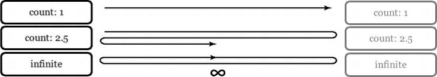

# 十二、变换、过渡和动画

在网络发展的早期，事情和现在并没有太大的不同——网页设计师(和客户)喜欢闪亮的新事物。虽然目标可能没有改变，但我们已经从“让它流行起来”走了很长一段路平了`<blink>`、`<marquee>`，还是经典的《燃烧的标识》动画`.gif`。

90 年代中期，引入了两种新工具来增加一些活力——Flash 和 JavaScript。到了网络热潮时期，它们都是实现 HTML 和 CSS 无法单独实现的事情的流行方式，例如按钮翻转、流媒体视频的开始，以及跟随鼠标光标四处移动的眼睛(`[`j.mp/googly-eyes`](http://j.mp/googly-eyes)`、`[`arc.id.au/XEyes.html`](http://arc.id.au/XEyes.html)`)。

然而，由于诸如分散注意力的动画广告、没有 JavaScript 就无法使用的页面(几乎无法使用)以及臭名昭著的“Skip Intro”Flash 电影等弊端，这两种技术都以某种坏名声告终。得益于坚实的编码最佳实践(如 Hijax、(`[`j.mp/js-hijax`](http://j.mp/js-hijax)`、`[`domscripting.com/blog/display/41))`](http://domscripting.com/blog/display/41))`)和大量的库，JavaScript 已经复苏。Flash 也继续被用于伟大的事情，但是随着 HTML5 中的`<video>`、`<audio>`和`<canvas>`元素，它的明星地位正在减弱。

动画和用户界面效果一直是 Flash 吸引力的一大部分。CSS3 使许多这些能力成为 CSS 转换、过渡和动画规范中的固有功能。我们将看看如何使用这些 CSS3 规范在浏览器中轻松添加类似 Flash 的效果。随着硬件加速的增加(特别是在移动设备中)，CSS3 是一个增加一些“哇！”这在以前是不可能的。第十三章让我们看看 CSS 在不久的将来会有哪些令人兴奋的事情。

现在，那些记得网络琐事的人可能会说，“等等。这是行为不是表现！”虽然这在某种程度上是真实的，但这艘船已经与`:hover`伪级一起导航了。将 movement 添加到 CSS3 中使得这些流行的特性比在 JavaScript 中更容易使用。对于高级动画，你仍然可以选择 JavaScript(或者 Canvas 或者 SVG 和 SMIL，甚至 Flash ),但是对于基础动画，你现在已经有了一些非常好用的工具。

在我们深入研究美味的 CSS3 之前，我们先来看两个警告。

本章中浏览器对 CSS 的支持从非常好到最先进。正因为如此(和往常一样)，重要的是要记住一些用户看不到这些效果——想想那些使用缺乏支持的浏览器的人的体验。正如 Lea Verou 所言:

如果你设计一个页面时考虑到了优雅的降级，那么即使没有任何 CSS3，它也应该工作得很好。如果你不这样做，你会有更大的问题。

—五问与利·维鲁， *CSS 招数(`[`j.mp/lea-verou-5q`](http://j.mp/lea-verou-5q)`，`[`css-tricks.com/five-questions-with-lea-verou/`](http://css-tricks.com/five-questions-with-lea-verou/)` )*

戴夫·鲁珀特(Dave Rupert)、亚历克斯·塞克斯顿(Alex Sexton)、保罗·爱尔兰(Paul Irish)和弗朗索瓦·罗比切特(Franç ois Robichet)的书签“decss 3”(`[`j.mp/css3striptease`](http://j.mp/css3striptease)`、`[`css-tricks.com/examples/CSS3StripTease/`](http://css-tricks.com/examples/CSS3StripTease/)`)，克里斯·科伊尔(Chris Coyier)的书签“CSS3-stripper”，以及迈克尔·布莱格(Michael Bleigh)的书签“toggle CSS3”(`[`j.mp/togglecss3`](http://j.mp/togglecss3)`、`[`intridea.com/2010/4/12/toggle-css3-bookmarklet`](http://intridea.com/2010/4/12/toggle-css3-bookmarklet)`)会有所帮助，但理想的情况是，无论如何，你都要从内容开始构建(或“移动优先”)，直到最后才添加 CSS3。

此外，这些规范对于添加动作都很有用。无论是跳过介绍电影还是动画广告，我们都被太多的动作所困扰，所以当你自己添加时要记住这种感觉。确保它能帮助(而不是烦扰)你的用户完成他们的目标。你通常只需要一个破折号。

所以事不宜迟，让我们来看看用 CSS3 转换移动东西。

### 平移、旋转、缩放、倾斜、变换:2D 和 3D CSS 变换

变换使我们能够对空间中的元素执行基本操作。我们可以平移(移动)、旋转、缩放和倾斜元素，如图 12-1 中的所示。变换后的元素不影响其他元素，可以重叠它们，就像`position:absolute`一样，但是仍然在它的默认(未变换)位置占据空间。与改变元素的宽度/高度/边距等相比，这通常是一个很大的优势。，因为你的布局不会随着变换而改变。它们在两个独立的规范中指定:CSS 2D 变换模块级别 3 ( `[`j.mp/2d-transforms`](http://j.mp/2d-transforms)`、`[`dev.w3.org/csswg/css3-2d-transforms/`](http://dev.w3.org/csswg/css3-2d-transforms/)`)和 CSS 3D 变换模块级别 3 ( `[`j.mp/3d-transforms`](http://j.mp/3d-transforms)`、`[`dev.w3.org/csswg/css3-3d-transforms/`](http://dev.w3.org/csswg/css3-3d-transforms/)`)。结合过渡和动画(你将在本章后面看到),这为善…和(当然)恶提供了一些强大的工具！

`.translate {transform: translate(-24px, -24px);}

.rotate {transform: rotate(-205deg);}

.scale {transform: scale(.75);}

.skew {transform: skewX(-18deg);}` 

**图 12-1。**2D 变换的例子`translate(24px, 24px)`、`rotate(-205deg)`、`scale(.75)`和`skew(-18deg)`。每个框的标签被变换相等且相反的量。

假设你是好的一方，这里有一个方便的转换属性和函数的概述/备忘单。然而，在此之前，我们需要简单地谈一下 CSS 值和单位。

**CSS 值和单位**

概述包含允许值和单位的简写，基于 CSS 值和单位模块级别 3 ( `[`j.mp/css3-values`](http://j.mp/css3-values)`、`[`dev.w3.org/csswg/css3-values/`](http://dev.w3.org/csswg/css3-values/)`)。

__________

如果您正在考虑使用一个不常用的设备，请仔细检查浏览器支持。

*   `transform`:该属性采用一个或多个空格分隔的*转换函数*(如下所列)来应用于一个元素，例如`transform: translate(3em, -24px) scale(.8);`。转换函数可以取负值，默认为`none`。转换函数包括以下内容:
    *   `translate():`沿 X、Y 和/或 Z 轴从`transform-origin`移动元素。这可以写成`translate(tX)`、`translate(tX, tY)`、`translate3D(tX, tY, tZ)`(百分比除 tZ，长度)。还有 2D `translateX(tX)`和`translateY(tY)`，以及 3D `translateZ(tZ)`。 2
    *   `rotate():`在二维空间中围绕其`transform-origin`旋转元素，其中`0`为元素的顶部，正向旋转为顺时针(角度)。还有`rotateX(rX)`、`rotateY(rY),`和`rotateZ(rZ)3`变换属性来围绕单个轴旋转。最后，还有`rotate3D(vX, vY, vZ, angle)`在三维空间中围绕方向向量 vX、vY 和 vZ(无单位数)旋转一个元素一个角度(angles)。
    *   `scale():`改变元素的大小，默认为`scale(1)`。可以写成`scale(s)`、`scale(sX, sY)`、`scale3D(sX, sY, sZ)`(无单位数)。还有 2D 变换`scaleX(sX)`和`scaleY(sY)`，以及 3D 变换`scaleZ(sZ)`。 4
    *   `skew():`沿 X 轴(如果指定了两个数字，还有 Y 轴)倾斜元素。可以写成`skew(tX)``skew(tX, tY)`*(角度)。还有 ?? 和 ??。 5*
    *   这个变换属性采用一个变换矩阵，如果你有一些代数知识的话，你就会知道这个矩阵。`matrix()`采用`matrix(a, b, c, d, e, f)`(无单位数)的形式。`matrix3D()`按列主顺序取 4×4 的变换矩阵。2D 变换`matrix()` 映射到`matrix3D(a, b, 0, 0, c, d, 0, 0, 0, 0, 1, 0, e, f, 0, 1)`(无单位数)。如果你有所需的巨型大脑，这可以让你(几乎)一次完成所有其他的 2D 和 3D 变换。
    *   `perspective():`为 3D 变换提供透视，并控制摄影中的铺垫量*(长度)* —thi *nk fish-e* ye 镜头。该值必须大于零，大约`2000px`看起来正常，`1000px`中度失真，`500px`严重失真。与`perspective`属性的区别在于转换函数影响元素本身，而`perspective`属性影响元素的子元素。注意`perspective()`只影响`transform`规则中之后的变换函数

**   `perspective`:这个功能和`perspective`变换功能一样，给 3D 变换后的元素一种深度感。它影响元素的子元素，使它们保持在同一个 3D 空间中。*   `perspective-origin`:像`transform-origin`为`transform`设置原点一样，设置`perspective`的原点。它采用与`transform-origin`相同的值和关键字:关键字、长度和百分比。默认情况下这是`perspective-origin: 50% 50%;`。它影响它所应用到的元素的子元素，默认为`none`。*   `transform-origin`:设置 X、Y 和/或 Z 轴上的点，围绕该点进行变换。这可以写成`transform-origin: X;`、`transform-origin: X Y;`、`transform-origin: X Y Z;`。我们可以用关键字`left`、`center`和`right`表示 X 轴，用关键字`top`、`center`和`bottom`表示 Y 轴。我们还可以对 X 和 Y 使用长度和百分比，但只对 z 使用长度。最后，对于 2D `transform-origin`，您可以通过列出三个或四个值来使用偏移量，其形式为两对关键字后跟一个百分比或长度。对于三个值，缺失的百分比或长度被视为 0。默认情况下，`transform-origin`是元素的中心，对于 2D 变换是`transform-origin: 50% 50%;`，对于 3D 变换是`transform-origin: 50% 50% 0;`。 6*   `transform-style`:对于 3D 变换，这可以是`flat`(默认)或`preserve-3d`。`flat`将变换元素的所有子元素保留在 2D 的同一平面上。`preserve-3d`子元素在 3D 中变换，父元素前后的距离由 Z 轴控制。*   `backface-visibility`:对于 3D 变换，这控制元素的背面是`visible`(默认)还是`hidden`。*

 *__________

2 `translate(0, 50px)`与`translateY(50px).`相同

3 `rotate(45deg)`与`rotateZ(45deg).`相同

4 `scale(1,2.5)`与`scaleY(2.5).`相同

5 `skew(45deg)`与`skewX(45deg).`相同

6等于`transform-origin: 0 50%`；还有`transform-origin: left center;.`

虽然我们在`scaleY()`这样的函数名中使用了大写的`X`、`Y`、`Z`和`3D`，但这只是为了让它们更容易区分。小写字母，如`scaley()`，也很好，写给恋蛇者更有趣。

*注意:我们可以在`transform`中使用多个空格分隔的变换函数，但是我们不能对每个函数应用其他变换属性的不同值(比如`transform-origin`)。而是将每组属性应用于一个包装元素。*

*如果你使用任何 3D 变换，你需要对变换后的元素应用透视，使它们看起来是 3D 的。如果要变换多个元素以使它们保持在同一个 3D 空间中，您需要对祖先元素使用`perspective`属性。你可能还想使用`transform-style: preserve-3d;`* 。

*警告:转换适用于“块级和原子级内联元素”(`[`j.mp/2d-transforms`](http://j.mp/2d-transforms)`，`[`dev.w3.org/csswg/css3-2d-transforms/#transform-property`](http://dev.w3.org/csswg/css3-2d-transforms/#transform-property)`)，但这些不一定是带有`display: inline;`的元素。如果您想将变换应用于内联元素，请尝试使用`display: inline-block;`* 。

让我们看看每个属性的作用！

#### 使用变换和转换功能

`transform`属性是这些变换的基础，它可以有一个*或多个* 2D/3D 变换函数，用空格隔开。如果有多个`transform`函数，它们会按顺序应用。`transform`的功能从简单到令人难以置信。它们基于代数变换矩阵，CSS 定义基于 SVG 规范的坐标系、变换和单位章节(`[`j.mp/svg-matrix`](http://j.mp/svg-matrix)`、`[www.w3.org/TR/SVG/coords.html#TransformMatrixDefined](http://www.w3.org/TR/SVG/coords.html#TransformMatrixDefined)`)。

###### 用 transform: translate()移动元素；和 transform:translate 3d()；

`transform: translate();`可能是最容易开始的地方，允许我们沿着 X、Y 和/或 Z 轴移动元素及其子元素。它需要长度(`px`、`em`、`rem`等)和百分比，默认值为`0`。

*   `transform: translate(tX)`
*   `transform: translate(tX, tY)`
*   `transform: translateX(tX)`
*   `transform: translateY(tY)`
*   `transform: translateZ(tZ)`
*   `transform: translate3D(tX, tY, tZ)`

图 12-2 中的`transform: translate();`例子包含一个和两个值的转换，包括负值。

`div {width: 25%; height: 100px; /* by default translate: transform(0); */}
span {display: inline-block; width: 50%; height: 50px; transform: translate(-3px,47px);}
div, span {border-width: 3px; transition: all 1s; /* ease by default */}
figure:hover div {transform: translate(280%); /* same as translateX(280%); */}
figure:hover span {transform: translate(90%,-3px);}`

注意，我们已经让内框覆盖了外框的边界，这样我们就可以演示一个带有负值的`translate`。

**图 12-2。**一个在悬停时显示动画的框，显示带有一个值(外框从左向右移动)和两个值(内框水平和垂直移动)的`transform: translate()`

与 2D 的翻译非常相似。如果你也使用`transform-style: preserve-3d;`，这就像一个 2D 翻译，也允许你改变`z-index`。然而，一旦你添加了`perspective`，Z 轴就像 2D 缩放变换一样工作，如图图 12-3 所示。

`.outer-box {
  perspective: 800px;
  transform-style: preserve-3d;
}
.inner-box {transform: translate3d(-3px,47px,-50px);} /* 50px behind the div */` `.outer-box, .inner-box {transition: all 1s;}
.container:hover .outer-box {transform: translate3d(280%,0,0);} /* the same as translate(280%)
*/
.container:hover .inner-box {transform: translate3d(90%,-3px,200px);} /* 200px in front of the
div */` 

**图 12-3** 。同一个盒子，但是`transform: translate3d()`在内盒上，从负值开始(远离查看者并在容器盒后面)，到动画结束时过渡到正值(靠近查看者)。

`rotate()`变换函数取角度值(`deg`、`rad`、`grad`和`turn`，包括负值和大于一圈的值，如图 12-4 中的所示。对于正值，旋转方向为顺时针方向；例如，`transform: rotate(360deg);`是顺时针旋转一整圈。

*   `transform: rotate(angle)`
*   `transform: rotateX(rX)`
*   `transform: rotateY(rY)`
*   `transform: rotateZ(rZ)`
*   `transform: rotate3D(vX, vY, vZ, angle)`

`div {width: 100px; height: 100px;}
span {display: inline-block; width: 50px; height: 50px;}
div, span {transition: all 1s;}
figure:hover div {transform: rotate(180deg);
figure:hover span {transform: rotate(-450deg);}` 

**图 12-4。**悬停时旋转的框，显示`transform: rotate()`，在外框上显示正(顺时针)值，在内框上显示负(逆时针)值。

3D 旋转允许我们围绕前三个值指定的方向向量(`[`j.mp/direction-vector`](http://j.mp/direction-vector)`、`[`en.wikipedia.org/wiki/Direction_vector`](http://en.wikipedia.org/wiki/Direction_vector)`)旋转第四个值指定的角度。方向向量`values`是无单位数，但重要的是它们的比值:`rotate3d(2,1,0,90deg)`等价于`rotate3d(10,5,0,90deg)`。2D `transform: rotate();`相当于用`transform: rotate3d(0,0,1,angle);`绕 Z 轴旋转，但注意大于 180°的`rotate3d()`角度值与`transform: rotate();`不同。我们用图 12-5 中的`rotate()`和`rotate3D()`比较一次旋转一个轴。

`div {transition: all 1s;}
figure:hover .rotate3d-x {transform: rotate3d(1,0,0,180deg);}
figure:hover .rotate3d-y {transform: rotate3d(0,1,0,180deg);}
figure:hover .rotate3d-z {transform: rotate3d(0,0,1,180deg);}
figure:hover .rotatex {transform: rotateX(180deg);}
figure:hover .rotatey {transform: rotateY(180deg);}
figure:hover .rotatez {transform: rotateZ(180deg);}
figure:hover .rotate {transform: rotate(180deg);} /* for comparison */` 

图 12-5**。**显示不同 3D 旋转的一系列方框。第一个盒子是标准的`rotate()`。接下来的三个框使用 2D 单个轴属性分别围绕 X、Y 和 Z 轴旋转 180 度。最后三个盒子使用`transform: rotate3d()`来做同样的事情。请注意，通过 rotateZ(180 度)或 rotate3D(0，0，1，180 度)绕 Z 轴旋转实际上与旋转(180 度)相同。包含元素稍微不透明，在 X 和 Y 轴旋转时可见。

###### 用 transform: scale()缩放元素；and transform:scale 3d()；

`scale()` transform 函数调整元素的大小，默认大小为`scale(1)`，取无单位数作为值。较小的值使元素更小，所以`scale(.5)`是一半大小；同样，值越大，元素越大，因此`scale(2)`的大小是两倍。

*   `transform: scale(s)`
*   `transform: scale(sX, sY)`
*   `transform: scaleX(sX)`
*   `transform: scaleY(sY)`
*   `transform: scaleZ(sZ)`
*   `transform: scale3D(sX, sY, sZ)`

如图 12-6 所示，我们可以使用两个值分别缩放水平和垂直尺寸，甚至负值来反转一个元素(注意内框的边框)。单独的`scaleX()`和`scaleY()`功能相当于为`scale()`设置两个值，其中一个值为 1，因此`scaleX(2)`与`scale(2,1)`相同。

`.one {transform: scale(.5);} /* the same as scale(.5,.5) */
.one span {transform: scale(-3);}
.two {transform: scale(.75,1);} /* the same as scaleX(.75) */
.two span {transform: scale(-3,-1.5);}` 

**图 12-6。**第一个框使用单个值(统一缩放)，第二个框使用两个值，分别缩放 X 轴和 Y 轴。当这些值不同时，对象被扭曲。内部方框有一个负值`scale()`，缩小*超过*零点并反转。

说到`scale3d()`和`scaleZ()`，我们就碰到了元素没有任何深度的问题。因此，在大多数情况下，沿 Z 轴缩放元素并不会真正改变什么。通常你会想沿着 Z 轴平移，而不是用`transform: translateZ();`。

###### 使用 transform: skew()倾斜元素；和朋友

有一个值的`skew()`变换水平倾斜元素(在 X 轴上)，如果有第二个值，它控制垂直倾斜。它像`rotate()`一样采用角度单位(`deg`、`grad`、`rad`、`turn`)。

*   `transform: skew(sX)`
*   `transform: skew(sX, sY)`
*   `transform: skewX(sX)`
*   `transform: skewY(sY)`

图 12-7 显示了这些例子。

`.one {transform: skew(10deg);} /* the same as skewX(10deg) */
.one span {transform: skew(-20deg);}
.two {transform: skew(0,10deg);} /* the same as skewY(10deg) */
.two span {transform: skew(0,-20deg);}
.three {transform: skew(10deg,10deg);}
.three span {transform: skew(-20deg,-20deg);}
/* CAUTION! large values animate unpredictably */
.four {transform: skewX(180);} /* the same as skew(0) */
.four span {transform: skewY(-180deg);} /* the same as skew(0,0) */` 

图 12-7**。**一个值的`skew()`(相当于`skewX()`)，两个值的第一个值为 0(相当于 skewY())，以及两个相同的值(同时倾斜 X 轴和 Y 轴)。在 180 度(或-180 度)时，倾斜元素看起来与倾斜(0)相同，而在 90 度(或-90 度)时，倾斜元素变得无限长且不可见(因此在设置动画时看起来有点疯狂)，如+-180 度示例所示。(0 度、120 度、180 度截图)。

虽然`skew()`可以取负值和较大的值，但是`skew(90deg)`使一个元素消失，因为它的两条平行边接触，它变得无限长。大于`90deg`(或`-90deg`)的值显示为 180 度(或-180 度)以内的镜像，在这里它们显示为 0。这意味着`skew(10deg)`看起来会和`skew(190deg)`一样，但是如果是动画的话，当它经过`90deg`的时候看起来有点疯狂。一般来说，你只需要在`45deg`和`-45deg`之间的值。没有 3D 版的`skew()`。

不是你会经常用到的东西，但如果你需要的话，它就在那里。正如 Russ Maschmeyer 在图 12-8 的“折叠”演示中所证明的，它有它的用途。

**图 12-8。**使用`skew()`的印刷效果，通过戴夫鲁珀特的刻字. js

###### 变换的现象宇宙力量:matrix()；和 transform 3d:matrix()；

我们并不假装深刻理解矩阵变换。然而，数学爱好者将会在家中拥有六值函数`transform: matrix();`，它可以同时执行所有的 2D 变换*(有警告)。下面是`transform: matrix();`的有用定义。*

 **Matrix 以六值变换矩阵的形式指定 2D 变换。`matrix(a,b,c,d,e,f)`相当于应用变换矩阵**【a b c d e f】**。*

CSS 2D 变换模块第三级( *`[`j.mp/2d-transforms`](http://j.mp/2d-transforms)`、`[`dev.w3.org/csswg/css3-2d-transforms/#transform-functions`](http://dev.w3.org/csswg/css3-2d-transforms/#transform-functions)`* )

如果你想知道这到底是什么意思，答案是代数——值 *a* 到 *f* 定义了一个 3*3 的变换矩阵(`[`j.mp/svg-matrix`](http://j.mp/svg-matrix)`，`[www.w3.org/TR/SVG/coords.html#TransformMatrixDefined](http://www.w3.org/TR/SVG/coords.html#TransformMatrixDefined)`)(使用 SVG 规范的定义)，如图 12-9 中的所示。

**图 12-9。**表示变换的定义:matrix()；—作为一个矩阵。第三行(“0，0，1”)对于每个转换都是相同的。对于矩阵相乘来说是必须的，但是下面我们就不赘述了。

让我们看看如何使用`transform: matrix();`来表示每个 2D 变换函数。

*   `translate(tX, tY)` = `transform: matrix(1, 0, 0, 1, tX, tY);`，其中 tX 和 tY 为水平和垂直平移。
*   `rotate(a)` = `transform: matrix(cos(a), sin(a), -sin(a), cos(a), 0, 0);`，其中 a 为`deg`中的值。交换`sin(a)`和`-sin(a)`值，反转旋转方向。请注意，您可以表示的最大旋转角度是 360 度。
*   `scale(sX, sY)` = `transform: matrix(sX, 0, 0, sY, 0 ,0);`，其中 sX 和 sY 为水平和垂直缩放值。
*   `skew(aX, aY)` = `transform: matrix(1, tan(aY), tan(aX), 1, 0 ,0);`，其中 aX 和 aY 为`deg.`中的水平和垂直值

当一次进行多个变换时，最好只使用非矩阵变换，并按顺序列出它们，如图 12-10 所示。

`div {transform: translate(50px, -24px) rotate(180deg) scale(.5) skew(0,
22.5deg);}` 

**图 12-10。**应用多重变换。如果设置了动画，旋转(0)和旋转(180 度)之间的旋转是顺时针的。

然而，如果你熟悉矩阵相乘，或者使用像埃里克·迈耶和亚伦·古斯塔夫森的矩阵分解(`[`j.mp/matrix-tool`](http://j.mp/matrix-tool)`，`[`meyerweb.com/eric/tools/matrix/`](http://meyerweb.com/eric/tools/matrix/)`)这样的转换工具，你可以用`transform: matrix();`来写速记，如图图 12-11 。请注意，我们已经包含了供应商前缀的 CSS，以在 Firefox 的翻译中显示 px 单位。

`div {
  -webkit-transform: matrix(-.5,-.207,0,-.5,50,-24);
     -moz-transform: matrix(-.5,-.207,0,-.5,50px,-24px);
      -ms-transform: matrix(-.5,-.207,0,-.5,50,-24);
       -o-transform: matrix(-.5,-.207,0,-.5,50,-24);
          transform: matrix(-.5,-.207,0,-.5,50,-24);
}` 

**图 12-11。**通过矩阵()应用相同的变换。如果设置动画，旋转现在是逆时针方向。

默认值为`matrix(1,0,0,1,tX,tY)`，使用数字。目前，在 Opera、Internet Explorer 和 WebKit 中，矩阵(tX 和 tY)中的转换只接受像素值(没有单位)。然而，Firefox 3.5+接受`length`值但需要单位，并且从版本 10 开始也接受无单位数字。当设置基于旋转的矩阵变换的动画时，从`0deg`到`180deg`的转换将只逆时针旋转。虽然`transform: matrix();`对于多重转换更简洁，并且是浏览器内部执行转换的方式，但它通常不是最佳选择。这要复杂得多，所以更难把握实际会发生什么。

3D 变换矩阵更令人兴奋，它构成了一个“4×4 的 16 个值的齐次矩阵，按列主顺序排列。”作为一个令人兴奋的例子，下面是`rotate3d()`作为一个 3D 矩阵的样子:

`transform: matrix3d(1 + (1-cos(angle))*(x*x-1), -z*sin(angle)+(1-
cos(angle))*x*y, y*sin(angle)+(1-cos(angle))*x*z, 0, z*sin(angle)+(1-
cos(angle))*x*y, 1 + (1-cos(angle))*(y*y-1), -x*sin(angle)+(1-
cos(angle))*y*z, 0, -y*sin(angle)+(1-cos(angle))*x*z, x*sin(angle)+(1-
cos(angle))*y*z, 1 + (1-cos(angle))*(z*z-1), 0, 0, 0, 0, 1);`

除非你是代数迷，否则我们建议你使用其他的转换函数。

与其深入探究矩阵的激动人心之处，我们不如请你参考 Zoltan·拉克·霍利鲁克的《CSS3 矩阵()变换》中关于数学挑战的文章(http://j.mp/css3-matrix，`[www.useragentman.com/blog/2011/01/07/css3-matrix-transform-for-the-mathematically-challenged/](http://www.useragentman.com/blog/2011/01/07/css3-matrix-transform-for-the-mathematically-challenged/)`)和维基百科中关于变换矩阵的文章(`[`j.mp/wikipedia-matrix`](http://j.mp/wikipedia-matrix)`，`[`en.wikipedia.org/wiki/Transformation_matrix#Examples_in_2D_graphics`](http://en.wikipedia.org/wiki/Transformation_matrix#Examples_in_2D_graphics)`)。你也可以使用彼得·内德洛夫的玩矩阵工具(`[`j.mp/play-matrix`](http://j.mp/play-matrix)`，`[`peterned.home.xs4all.nl/matrices/`](http://peterned.home.xs4all.nl/matrices/)`)来操作一个盒子，并查看矩阵输出。任何想要使用`matrix3d()`的人都不需要任何帮助。；)

还有一个转换函数，`transform: perspective();`。它控制 3D 变换的透视和预示。因为还有一个用于相同目的的 transform 属性`perspective`,所以让我们比较一下它们。

#### 用透视和变换将 3D 事物透视化:透视()

默认情况下，变换发生在平面上。我们可以通过添加属性`perspective`或变换函数`transform: perspective();`来给 3D 变换后的元素一种深度错觉。这些通过指定一个透视投影矩阵来工作(`[`j.mp/3d-projection`](http://j.mp/3d-projection)`、`[`en.wikipedia.org/wiki/3D_projection`](http://en.wikipedia.org/wiki/3D_projection)`)。

*注意，虽然“transform”使用三维坐标系，但元素本身并不是三维对象。而是存在于二维平面(平面)上，没有深度。*

— CSS 3D 转换规范( *`[`j.mp/3d-transforms`](http://j.mp/3d-transforms)`* ，`[`dev.w3.org/csswg/css3-3d-transforms/#introduction`](http://dev.w3.org/csswg/css3-3d-transforms/#introduction)`)

如果你把透视想象成一个金字塔，场景在底部，观看者在顶点，那么透视值就是观看者和场景之间的距离。金字塔越短，鱼眼透镜式失真越多。在这两个属性中，长度值控制这种透视缩短。比如 2000px 很细微，800px 给明显的透视缩小，250px 很扭曲。该值需要大于零，无单位值被视为像素。应用透视还会使具有较大 Z 轴值的元素看起来更大。

*注意:使用`perspective()`只会影响其后的变换函数。例如，`transform: perspective(800px) rotateY(-45deg);`有透视，而`transform: rotateY(-45deg) perspective(800px);`没有。*

`.box {
  transform-origin: left center;
  transition: all 1s;
}
/* using the perspective() transform function */` `.one .box {transform: perspective(2000px) rotateY(-45deg);} /* slight
perspective */
.two .box {transform: perspective(800px) rotateY(-45deg);} /* perspective */
.three .box {transform: perspective(250px) rotateY(-45deg);} /* fish-eye */
/* alternatively, using the perspective property
.four {perspective: 2000px;}
.five {perspective: 800px;}
.six {perspective: 250px;}
.four .box, .five .box, .six .box {transform: rotateY(-45deg);}
*/
.container:hover .box {transform: rotateY(-180deg);}` 

**图 12-12。**在`rotateY(-45deg)`、`rotateY(-112.5deg)`、`rotateY(-180deg)`处改变透视()变换函数值的旋转元素。我们还可以通过对容器元素应用透视属性来实现这一点。

这两种方法的区别在于转换函数`transform: perspective();`将透视直接应用于元素，而`perspective`属性将透视应用于元素的子元素。如果你在不止一个元素上应用 3D 变换，你希望`perspective`出现在一个包装元素上，这样所有的子元素都会在同一个 3D 空间中。使用`perspective`的元素的大小会影响子元素的预示量，使用非默认的`transform-origin`也是如此。

#### 用透视原点属性改变透视原点

这设置了`perspective`的原点，默认为元素(`perspective-origin: 50% 50%;`)的中心。它需要长度、百分比和关键字(比如`transform-origin`的 X 和 Y 值)。当使用两个关键字，或者一个关键字而不是`center`和一个值时，浏览器可以计算出哪个值是 X (= `left`或`right`)，哪个是 Y (= `top`或`bottom`)。否则，第一个值将在 X 轴上，第二个值(如果有)将在 Y 轴上。即使使用关键字，我们也建议您坚持默认的`perspective-origin: pX pY;`顺序。回到我们的金字塔，改变`perspective-origin`就像把顶点(观看者的位置)从场景的中心移开。

*   `perspective-origin: pX;`
*   `perspective-origin: pY; /* if top or bottom */`
*   `perspective-origin: pX pY;`

#### 通过变换原点改变变换

`transform-origin`允许我们设置变换运动的中心，这可以真正改变产生的变换。它可以取一到四个值:

*   如果有一个或两个值，这些值可以是关键字、长度和/或百分比。长度和百分比从左上角开始计算(0，0)。
*   3D 转换可以采用三个值，其中前两个可以是关键字、长度和/或百分比，但第三个值必须是长度。
*   2D 变换也可以取三个或四个值，它们代表偏移量，必须写成两对关键字，后跟一个长度或百分比，例如`transform-origin: top 12px right 0;`。如果只有三个值，缺失的偏移量被假定为零，例如`transform-origin: top 12px right;`。(注意，对它的支持刚刚开始，目前的浏览器只使用前两个值。)

默认情况下，tX 和 tY 是`50%`，而<ins>??【tZ】</ins>是`0`，因此对于 2D 变换，默认值是`transform-origin: 50% 50%;`，对于 3D 变换，默认值是`transform-origin: 50% 50% 0;`。

和`perspective-origin`一样，当只使用关键字时，我们建议你坚持传统的排序:pX *(* pY *(* pZ))。

*   `transform-origin: tX;`
*   `transform-origin: tY; /* if top or bottom */`
*   `transform-origin: tX tY;`
*   `transform-origin: tX tY tZ; /* for a 3D transform */`

回到我们之前在图 12-4 中的`transform: rotate();`例子，让我们看看`transform-origin`能带来的不同。前面的例子没有指定`transform-origin`，所以它使用元素中心的默认值。在图 12-13 中，外盒仍然如此；然而，通过`transform-origin`，内盒都使用不同的角。原点用方形角表示。

`/* Figure 12-4 code, plus... */
.top-left {
  border-top-left-radius: 0;
  transform-origin: left top; /* the same as 0 0 */
}` `.bottom-left {
  border-bottom-left-radius: 0;
  transform-origin: left bottom; /* the same as 0 100% */
}
.top-right {
  border-top-right-radius: 0;
  transform-origin: right top; /* the same as 100% 0 */
}` `.bottom-right {
  border-bottom-right-radius: 0;
  transform-origin: right bottom; /* the same as 100% 100% */
}` 

**图 12-13。**transform-origin 对 transform 造成的差异示例:在外部框上使用正(顺时针)值旋转()，在内部框上使用负(逆时针)值旋转。(外框旋转(0 度)、旋转(120 度)、旋转(180 度)的截图。)

虽然这完全改变了变换，但是指定一个远离元素的点具有更大的效果。

指定一个 3D `transform-origin`就是我们遇到的 2D `transform-origin`加上 Z 轴的长度值。同样，较大的值产生较大的效果，如图图 12-14 所示。

`.container {perspective: 800px;}
.container:hover span {transform: rotate3d(1,1,0,180deg); /* inner box */}
.top-left {transform-origin: left top 20px;}
.bottom-left {transform-origin: left bottom 40px;}
.top-right {transform-origin: right top 80px;}
.bottom-right {transform-origin: right bottom 160px;}` 

图 12-14**。**Z 值依次增大的 3D `transform-origin`与`transform: rotate()`的差异示例。我们还添加了`perspective`和`transform-style: preserve-3d;`来给人 3D 的错觉。(外框旋转(0 度)、旋转(120 度)、旋转(180 度)的截图。)

#### 具有变换风格的 3D 或平面变换

默认情况下，元素出现在与其父元素相同的平面中，堆叠顺序由 HTML 源决定。我们可以使用`z-index`改变堆叠顺序，但是我们仍然在处理一个二维平面。3D 变换给了我们一个 Z 轴，但是默认的`transform-style`是`flat`——同样，仍然在同一个平面上。为了充分看到 Z 轴变换的效果，我们需要使用`transform-style: preserve-3d;`，它适用于元素的子元素。

对于 3D 变换，你可能想将`transform-style: preserve-3d;`与`perspective`或`perspective()`一起使用。3D 变换会导致元素在之后被变换*，所以你可能需要在元素上显式地使用`transform-style: flat;`来覆盖祖先的`preserve-3d`。*

#### 隐藏和显示背面可见的变换元素的背面

当元素在 3D 中围绕 X 或 Y 轴旋转 180°或更多时，默认情况下元素的背面是可见的。这个属性允许我们隐藏它，例如，在用背靠背对齐的两个元素制作双面扑克牌时，这个属性非常有用。在制作 3D 盒子或空间时，它也很方便。如图 12-15 所示，没有它卡片翻转的幻觉，过渡就被打破。

`.card {
  transform-style: preserve-3d;
  perspective: 1000px;
}
.back, .front {
  position: absolute;
  width: 169px;
  height: 245px;
  -webkit-transition: .8s all;
}
.front {transform: rotate3d(0,1,0,180deg);}
.card:hover .back {transform: rotate3d(0,1,0,180deg);}
.card:hover .front {transform: rotate3d(0,1,0,0deg);}
.backface .back, .backface .front {backface-visibility: hidden;}

  
Back

  
Front

` `

  
Back

  
Front

` 

**图 12-15。**翻牌过渡，左边的牌使用默认的`backface-visibility: visible;`(初始状态显示动画开始时两边之间的闪烁)，右边的牌使用`backface-visibility: hidden;`。请注意，在没有背景的情况下，左侧卡片中的“正面”和“背面”文本同时可见。

#### 浏览器支持 CSS 转换

CSS 转换倾向于包含实质性的改变，并且在不支持的浏览器中看起来没有退路。虽然 2D 变换在现代浏览器中得到了很好的支持，但早期版本的 Internet Explorer 缺乏支持，这可能会让您在使用它们时犹豫不决。通过 Internet Explorer 的 CSS `zoom`属性可以很容易地复制`scale()`变换函数，通过 ms 矩阵过滤器可以在 IE 中复制其他 2D 变换(有一定的难度)。

对于 3D 变换，情况更糟。有限的浏览器支持和没有 polyfills 严重限制了我们可以使用它们的地方，而且性能也没有完全达到游戏编程的水平。

我们通常坚持使用 CSS 转换来实现*渐进式增强，例如只有支持浏览器才能获得的不重要的样式。对于任何不仅仅是渐进式改进的东西，你都需要仔细考虑你的受众，并使用后退或替代方法来实现你的目标。*

###### 浏览器对 2D 变换的支持

现代浏览器*包括* Internet Explorer 9 支持 2D 变换，甚至更好的最新版本的 Internet Explorer、Firefox 和 Opera 都支持它们，不需要厂商前缀，正如你在表 12-2 中看到的。

###### 浏览器对 3D 转换的支持

浏览器对 3D 变换的支持并没有延伸得那么远，如表 12-3 所示。

###### 聚合填充、后退和 Internet Explorer 的筛选器属性

如果您愿意，可以扩展 CSS 2D 变换的浏览器支持。一种选择是使用 Internet Explorer 专有的 CSS `filter`属性，基本上是`translate: matrix()`的丑陋前身，允许您支持 Internet Explorer 6-8。将您的无前缀转换 CSS 输入到 Zoltan·霍利卢克和佐伊·米克尔·吉伦沃特的转换翻译器(`[`j.mp/ie-transforms`](http://j.mp/ie-transforms)`、`[www.useragentman.com/IETransformsTranslator/](http://www.useragentman.com/IETransformsTranslator/)`)中，它将输出等效的基于 IE `filter`的转换，以及其他浏览器的供应商前缀转换。然后，您可以将`filter` CSS 添加到一个只有 IE 的样式表中，并通过 IE 条件注释进行包含。

__________

7 注意 IE 的`filters`动画效果很差——如果你使用它们的话，要彻底测试。

如果你选择 polyfill 8 路线，这里有两个 JavaScript polyfills，它们将 2D 变换 CSS 动态转换为 Internet Explorer `filter`属性。当然，如果用户禁用了 JavaScript，什么也不会发生— *概不负责*。

*   Transformie ( `[`transformie.com/`](http://transformie.com/)`)是 Paul Bakaus 开发的 jQuery 插件，它为 IE6-8 增加了基本的`transform`支持。
*   Zoltan“迪拉克”霍利鲁克的 CSS 砂纸(`[`j.mp/csssandpaper`](http://j.mp/csssandpaper)`，`[www.useragentman.com/blog/2010/03/09/cross-browser-css-transforms-even-in-ie/](http://www.useragentman.com/blog/2010/03/09/cross-browser-css-transforms-even-in-ie/)`)增加了对 IE6-8 和 Opera 10.0+的支持，加上`box-shadow`，线性渐变和径向渐变。

最后，转换(和过渡动画)也可以通过 JavaScript 完成，例如使用 jQuery 的效果(`[`j.mp/jq-effects`](http://j.mp/jq-effects)`、`[`api.jquery.com/category/effects/`](http://api.jquery.com/category/effects/)`)。Modernizr 可检测 CSS 2D 和 3D 变换，因此您可以设置后备内容—通过用于 2D 变换的 polyfill 将行为扩展到不支持的浏览器，或者使用合适的非变换替代方式，如图像。在撰写本文时，没有用于 3D 转换的聚合填充。

#### CSS 转换陷阱

由于 CSS 2D 和 3D 转换只是最近才实现，所以仍然有一些奇怪和错误。以下是一些常见问题的技巧和提示。

*   WebKit 浏览器不转换`display: inline;`元素。Opera 11+和 Firefox 4+工作正常。解决方法是使用`display: inline-block;`。
*   在 iOS 中使用`transform: rotate();`时，旋转图像的直边可能会出现锯齿。Thierry Koblentz 发现使用`background-clip: padding-box;`可以解决这个问题。
*   正如已经提到的，在 Firefox 3.5-9 中，`transform: matrix();`中的`translate`值被实现为长度，而不是规范的数字。你只需要为火狐浏览器添加`px`。Firefox 10 支持这两种类型的值。更多信息见`transform: matrix();`。
*   在 Opera 11.60 中，转换后的文本不消除锯齿
*   出于性能原因，3D 转换在 WebKit 浏览器中禁用子像素抗锯齿。在 Safari 中，渲染还是可以的，但是在 Chrome 中会比较明显。此外，在 Chrome 中，这可以在本身不是 3D 转换的元素上禁用它，这些元素将比那些 3D 转换的元素具有更粗糙的抗锯齿。Dave DeSandro 发现，为受影响的元素添加背景色可以在 Chrome 16 中重新启用子像素抗锯齿。
*   在转换或设置变换动画时会出现一些问题，例如在具有不同单位的变换状态之间转换时会出现浏览器错误。我们将在接下来的章节中解决这些问题。

__________

正如在第二章和第七章中提到的，polyfill 为原本不支持的浏览器增加了一些支持，通常使用 JavaScript。

#### CSS 转换总结

虽然转换和相关属性表面上看起来过于简单，但是将它们结合在一起可以让我们进行一些令人印象深刻的操作。例如，图 12-16 中的 Dirk Weber 的 CSS Warp ( `[`j.mp/csswarp`](http://j.mp/csswarp)`，`[`csswarp.eleqtriq.com/`](http://csswarp.eleqtriq.com/)`)就是用 CSS 变换制作的“文本到路径”工具*。*

**图 12-16。** CSSWarp，它使用 CSS 变换将文本放置在路径上。

然而，当转换与过渡、动画和 JavaScript 一起使用时，魔法才真正开始。Hakim El Hattab 的 3D carousel slideshow ( `[`j.mp/3d-slideshow`](http://j.mp/3d-slideshow)`，`[`hakim.se/inc/components/slideshow/`](http://hakim.se/inc/components/slideshow/)`)是一个用一点 JavaScript 实现 3D 变换和过渡的漂亮例子。它甚至可以在支持 3D 变换的 iPhone 和 iPad 上运行。

虽然它们仍然相对较新，但我们认为现在是时候开始使用 2D 变换了——在适当的时候*——来细微地改善用户体验。除了渐进增强之外，2D 变换的使用，或者任何 3D 变换的使用都是不成熟的，除非你有合适的观众。确保彻底测试，因为支持是相对较新的。尽管如此(以及偶尔的浏览器错误)，CSS 转换对于添加一些微妙的味道是很棒的，如果你的用户统计支持，它可以发挥更重要的作用，例如在 iOS 设备的网站上。如果没有别的，它们是尚未广泛分布的未来的一种体验，并且有很多乐趣可玩！*

 *接下来，让我们看看如何用 CSS 过渡和 CSS 动画来改变元素(包括 CSS 转换的元素)*。*

### CSS 过渡和 CSS 动画:比较和对比

这些规范都允许我们“插入 CSS 属性值”或者动画化元素属性值随时间的变化。我们将详细讨论这两者，但是为了理解它们的区别，让我们先做一个快速的比较。以下是 CSS3 动画规范的内容:

当 CSS 属性值由于底层属性的改变而改变时，CSS 转换提供了一种内插 CSS 属性值的方法。这为制作简单的动画提供了一种简单的方法，但是动画的开始和结束状态是由现有的属性值控制的，并且转场对于作者来说对动画如何进行几乎没有什么控制。

*【CSS Animations】引入了定义好的动画，作者可以在其中将 CSS 属性随时间的变化指定为一组关键帧。动画类似于过渡，因为它们随时间改变 CSS 属性的表示值。*

— CSS 动画*规范(`[`j.mp/css3-animations`](http://j.mp/css3-animations)`、`[`dev.w3.org/csswg/css3-animations/#introduction`](http://dev.w3.org/csswg/css3-animations/#introduction)` )*

虽然有许多相似之处，例如，两者都操作相同的“可动画化”属性，并使用相同的计时功能，但对我们来说，这些是主要的区别:

*   CSS 状态和 JavaScript 的*变化可以触发 CSS 转换。CSS 动画*一旦声明就默认播放*，尽管你也可以通过 CSS 状态 9 和 JavaScript 的改变来触发它们。*
*   CSS 过渡将过渡应用到现有的即时变化。CSS 动画*给一个元素添加*样式，并使用它们制作动画。
*   CSS 转场发生在两个*内在样式*、10元素的内在样式在转场触发前后(比如非`:hover`和`:hover`值)。CSS 动画从元素的*内在状态*开始，在(多个)关键帧之间制作动画。默认情况下，当动画结束时，元素将返回到其固有状态。
*   CSS 过渡很简单，有更广泛的浏览器支持。CSS 动画更强大更复杂，浏览器支持更少。

为了将来参考，表 12-4 总结了不同之处。

__________

9 状态改变的一个例子是用`:hover.`将鼠标悬停在一个元素上

一个元素的内在样式是它在应用过渡或动画之前的 CSS 样式。

当您需要在两种状态之间制作动画时，CSS 转场对于简单的增强非常有用。CSS 动画可以做 CSS 过渡所做的一切，甚至更多，但是伴随着它们的强大而来的是更多的复杂性和 CSS 编写。让我们详细检查一下这两者。首先，CSS 过渡。

### CSS 过渡:4D 的珠光宝气！

我们相信大家都熟悉链接翻转，这是我们的朋友`:link`、`:visited`、`:hover`、`:focus`和`:active`伪类提供的基本交互。这些改变是有用的，但却是即时的。

CSS 转换模块(`[`j.mp/css3transitions`](http://j.mp/css3transitions)`，`[`dev.w3.org/csswg/css3-transitions/`](http://dev.w3.org/csswg/css3-transitions/)`)将事情提升了一个档次，让我们能够简单地控制现有 CSS 属性随时间从一个值到另一个值的变化*。这个第四维打开了一个可能性的世界，我们可以通过状态中的 *CSS 变化轻松应用这些转换。这包括以下伪类(更多信息见第八章)。它还包括使用`@media`查询(参见第九章)，以及通过向一个元素添加一个类来使用 JavaScript。**

 **   `:link`
*   `:visited`
*   `:hover`
*   `:focus`
*   `:active`
*   `:disabled`
*   `:enabled`
*   `:checked`

有关触发转换的更多信息，请参考 Louis Lazarus 的文章“不使用:hover 的 CSS3 转换”(`[`j.mp/transitions-pseudo`](http://j.mp/transitions-pseudo)`、`[www.impressivewebs.com/css3-transitions-without-hover](http://www.impressivewebs.com/css3-transitions-without-hover)`)和“使用 JavaScript 触发 CSS3 转换”(`[`j.mp/transitions-js`](http://j.mp/transitions-js)`、`[www.impressivewebs.com/css3-transitions-javascript](http://www.impressivewebs.com/css3-transitions-javascript)`)。

我们使用以下属性来控制转换:

*   `transition-property`:要应用过渡的可过渡属性列表。默认情况下，这是`transition-property: all;`，并且马上会出现一个可转换属性的表。
*   `transition-duration`:以时间为单位的过渡长度，如秒(`.4s`)或毫秒(`400ms`)。默认情况下，这是瞬间`transition-duration: 0s;`，所以它与不使用过渡是一样的。
*   `transition-timing-function`:控制`transition-duration`上过渡的*相对*速度，例如使过渡缓慢开始和快速结束。值包括`linear`、`ease`(默认)、`ease-in`、`ease-out`、`ease-in-out`、`cubic-bezier()`、`step-start`、`step-end`、`steps()`。
*   `transition-delay`:过渡开始前的延迟时间(次)，默认为`transition-delay: 0s;`。这也可以取负值，使其看起来已经在过渡的中途开始。
*   `transition`:一个简写属性，按顺序取`transition-property`、`transition-duration`、`transition-timing-function`和`transition-delay`。缺少的属性使用默认值，默认值为`transition: all 0s ease 0s;`。

#### 用过渡属性设置要过渡的内容

`transition-property`允许我们指定一个或多个逗号分隔的动画 CSS 属性来过渡，默认值为`all`。请注意，带有供应商前缀的属性也需要在`transition-property`中写入供应商前缀。例如，下面是转换`transform`属性的供应商前缀代码(针对列选择对齐):

`.postcard {
  -webkit-transition-property: **-webkit-**transform;
     -moz-transition-property:    **-moz-**transform;
      -ms-transition-property:     **-ms-**transform;
       -o-transition-property:      **-o-**transform;
          transition-property:         transform;
}
...`

有关多个值的更多信息，请参见多个过渡值和下面的过渡速记属性。

###### CSS 过渡和 CSS 动画的动画属性

您可以将 CSS 过渡应用于许多但不是所有的 CSS 属性，如您在表 12-5 中所见(基于 CSS3 过渡规范 11 中的表格)。这些属性也是我们可以用 CSS 动画制作的，这将在本章的后面介绍。

__________

在新的 CSS 规范中，动画属性在属性定义的摘要中被指出。

1.  虽然简写`background`实际上并不在规范中，但它是有效的(至少对于`background-color`和`background-position`值)。
2.  这是一个悬而未决的问题，CSS 背景和边框模块级别 3 中的`background-image`从“仅渐变”变为“不可动画化”,因为该规范成为了候选推荐标准。不过 Chrome 19 Canary 已经出现了支持，这也是设计师想要的。在得到广泛支持之前，简单的过渡渐变可以通过图像精灵和`background-position`或`opacity`在`background-color`加上叠加渐变和背景图像过渡来伪造。
3.  目前规范只为`border-width`、`border-color`、`margin`、`padding`定义了包含`-top-`、`-bottom-`、`-left-`和`-right-`的个别属性。WebKit 浏览器、Firefox 和 Opera 12 也可以动画显示速记属性。
4.  `grid-*`是网格定位模块的属性，在第九章的中介绍。
5.  最后，请注意，过渡颜色发生在 RGBa 颜色空间中，涉及`transparent`或带有 alpha 通道的颜色的过渡可能不会像您预期的那样发生。有关详细信息，请参阅本章后面的“过渡问题”一节。

将来会有更多的属性成为动画，所以在选择是使用`all`还是只使用特定的属性时要记住这一点。虽然`all`很方便，但是当只使用一个属性时，显式更安全。例如，当使用 JavaScript 来转换元素时，`transition: all;`将在每次转换结束*时为每个改变的属性*触发`transitionEnd`事件。此外，目前 Firefox 支持以下附加属性(带有`-moz-`前缀)，这些属性也将通过`transition-property: all;`进行转换。除了带星号的三个属性之外，其他所有属性将来都可能被添加到转换规范中，并且许多属性在 WebKit 浏览器中也是受支持的。

*   `-moz-background-size`
*   `-moz-border-radius`
*   `-moz-box-flex*`
*   `-moz-box-shadow`
*   `-moz-column-count`
*   `-moz-column-gap`
*   `-moz-column-rule-color`
*   `-moz-column-rule-width`
*   `-moz-column-width`
*   `-moz-font-size-adjust`
*   `-moz-font-stretch`
*   `-moz-image-region*`
*   `-moz-marker-offset`
*   `-moz-outline-radius*`
*   `-moz-text-decoration-color`
*   `-moz-transform`
*   `-moz-transform-origin`

有些属性不在您想要转换的规范中。在撰写本文时，这些仅提供部分支持；它们可以在 Firefox、WebKit 和 Opera 浏览器中运行。

*   `border-radius`
*   `box-shadow`

还有几个您想要转换的属性或值，但是在编写本文时它们都没有被访问和支持。

*   `background-image`，包括渐变
    *   `float`
*   使用值`auto`的`height`或`width`(目前两个值都必须是*长度*或*百分比*)
*   同样的情况也适用于`top`、`right`、`bottom`和`left`，但是尽管有规范(可能是由于一个 bug)，WebKit 浏览器*可以使用`auto`将这些制作成动画。*
*   `none`和其他任何东西之间的`display`
*   `static`和`absolute`之间的`position`

CSS 工作组已经意识到了这些问题，其中一些问题将会得到解决(例如，过渡`background-image`正在进行中，过渡`auto`预计将在 CSS *4* 过渡中进行),所以这个列表将来会减少。

###### 用最大宽度和最大高度模拟自动宽度和高度

在`auto`和`0`之间制作动画对于对话框的“滑动抽屉”效果非常有用，jQuery 的 slideToggle 效果(`[`j.mp/jq-slidetoggle`](http://j.mp/jq-slidetoggle)`、`[`j.mp/jq-slidetoggle`](http://api.jquery.com/slideToggle/)`、)就证明了这一点。我们可以通过分别在`max-width`或`max-height`上代入一个大于其所包含内容(`[`j.mp/faking-auto`](http://j.mp/faking-auto)`、`[`dabblet.com/gist/1676548`](http://dabblet.com/gist/1676548)`)的值来赋予`width`和`height`到/从`auto`的动画的*外观*，如图图 12-17 所示。

`.box {
  max-height: 5em; /* larger than your content: 200px would also work here */
  overflow: hidden; /* otherwise the text will be visible */
  padding: .5em .25em;
  transition: all 0.5s;
}
.wrapper:hover .box {
  max-height: 0;
  opacity: 0;
  padding: 0 .25em;
}` 

**图 12-17。**假装从高处过渡:自动；到高度:0；通过最大高度，加上不透明度和填充。对于短期过渡来说，这是可以接受的。

这对伪造动画`height`很有帮助，因为实际上使用固定高度(在`px`中)是自找麻烦(人们确实会调整大小！).然而，一个非常大的值会引入一个延迟，所以我们认为在`em` s 中为`max-height`使用一个值更安全。在前面的例子中，盒子大约有`5em`高，所以我们使用了`max-height: 8em;`。

#### 用过渡持续时间控制一个过渡的持续时间

`transition-duration`属性设置过渡的持续时间，并以秒(`s`)或毫秒(`ms`)为单位获取时间值，三个持续时间如图 12-18 中的所示。

`.one {transition-duration: .2s;}
.two {transition-duration: .4s;}
.three {transition-duration: 1s;}` 

**图 12-18。**三个过渡持续时间的比较——第一个已经在此截图中完成。

状态变化的显著程度会影响转换的持续时间。对于链接的`:hover`状态的明显不同的状态，与`transition-duration: .2s;`(或`transition-duration: 200ms;`)一样快的转换可以用来平滑快速变化，但是任何比这更快的都变得与没有转换没有区别。我们发现`.4s`(或`400ms`)的值对于一个微妙的过渡来说很好。然而，如果你移动一个元素任何距离，`.4s`可能太短了。较长的转场往往会吸引更多的注意力，但如果谨慎使用，对于特定的效果会很有用，尤其是与接下来要介绍的`transition-timing-function`属性结合使用时。

#### 过渡计时函数、三次贝塞尔曲线和步长()

属性是转换中最难理解的部分。幸运的是，一旦你看过一些例子，这一切都很简单。该属性具有基于贝塞尔曲线 12 (沿弧线移动)和步长(停止-开始移动)的功能。三次贝塞尔曲线有四个点:起点和终点在一个正方形的角上对角相对(0，0 和 1，1)，另外两个点是定义曲线的控制手柄，如图图 12-19 所示。相反，步进功能(`steps()`等)。)根据步数，将过渡分成大小相等的间隔。

__________

12 贝塞尔曲线(`[`j.mp/bezier-curves`](http://j.mp/bezier-curves)`，`[`en.wikipedia.org/wiki/Bézier_curve`](http://en.wikipedia.org/wiki/B&#233;zier_curve)`)就是你在 SVG 等矢量图形和 Adobe Illustrator、Inkscape 等软件中熟悉的带手柄的曲线路径。

**图 12-19。**三次贝塞尔等效于过渡-计时-函数:ease，来自 Lea Verou 的优秀立方贝塞尔可视化器`[`cubic-bezier.com`](http://cubic-bezier.com)`。

`transition-timing-function`值包括`cubic-bezier()`和`steps()`，加上几个常用的预置。

*   `cubic-bezier()`
*   这允许您通过设置图案`cubic-bezier(X1, Y1, X2, Y2)`中起点和终点的 X、Y 手柄位置来制作自定义的三次贝塞尔曲线。还有几个常用的预设值。
    *   `linear`:转场速度恒定。相当于`cubic-bezier(0, 0, 1.0, 1.0).`
    *   `ease`:默认过渡，开始很快，然后逐渐减弱，就像一个更快、更平滑的版本`ease-out`。相当于`cubic-bezier(0.25, 0.1, 0.25, 1.0)`(默认)。
    *   `ease-in`:过渡从慢开始，加速到结束。相当于`cubic-bezier(0.42, 0, 1.0, 1.0).`
    *   过渡开始很快，然后变慢。相当于`cubic-bezier(0, 0, 0.58, 1.0).`
    *   `ease-in-out`:过渡开始和结束都很慢，但中间过渡很快。相当于`cubic-bezier(0.42, 0, 0.58, 1.0).`
*   `steps()`:过渡从一个步骤跳到另一个步骤，而不是像基于贝塞尔的过渡那样平滑过渡。它有一个包含步数的值，也可以接受第二个值——或者是`start`或者是`end`——来控制过渡如何进行。 13
    *   分步开始:转换是即时的，一旦被触发就会立即发生。这相当于`steps(1,start).`
    *   step-end:转换是即时的，但发生在`transition-duration`的结尾。这相当于`steps(1,end).`

图 12-20 显示了预设值的演示(我们对它们进行了重新排序，以使区别更加明显)。

__________

13 彼得·贝弗卢很好的演示了`steps()`转场(加上`cubic-bezier`预设)(`[`j.mp/css3-ttf/`](http://j.mp/css3-ttf/)` `[`peter.sh/experiments/css3-transition-timing-functions`](http://peter.sh/experiments/css3-transition-timing-functions)`)。

**图 12-20。**一段时间内过渡-定时-函数预设值的比较，包括一些 steps()函数示例。(截图大概，，和穿越过渡。)

默认的`ease`是一个很好的全面选择，尽管`linear`对于带有小运动的过渡动画更平滑。虽然预设通常足够了，但对于长时间过渡中的特定效果，您可以使用`cubic-bezier(X1, Y1, X2, Y2)`制作自己的贝塞尔计时函数。

y 值可能超过 0-1.0，导致过渡“反弹”，如图 12-21 中的所示。

**图 12-21。**一个带有“反弹”的`cubic-bezier`值(Y 值小于 0 或大于 1)

通过首先使用“钳位”回退(其值在 0 和 1 之间)，可以逐步添加 Y 值小于 0 或大于 1 的`cubic-bezier`计时功能，如图图 12-22 所示。这将比默认的`ease`更接近你想要的定时功能。

`.ease {transition-timing-function: cubic-bezier(.25,.1,.25,1);} /* = ease */
.clamped {transition-timing-function: cubic-bezier(.7,**0**,.2,**1**);} /* Y=0~1 */
.bounce {transition-timing-function: cubic-bezier(.7,**-.2**,.2,**1.3**);}

/* our recommended way to include a cubic-bezier with bounce: */
.bulletproof { /* including vendor prefixes to show WebKit fallback */
  **-webkit-transition-timing-function: cubic-bezier(.7,0,.2,1); /* fallback */**` `  -webkit-transition-timing-function: cubic-bezier(.7,-.2,.2,1.3);
     -moz-transition-timing-function: cubic-bezier(.7,-.2,.2,1.3);
      -ms-transition-timing-function: cubic-bezier(.7,-.2,.2,1.3);
       -o-transition-timing-function: cubic-bezier(.7,-.2,.2,1.3);
          transition-timing-function: cubic-bezier(.7,-.2,.2,1.3);
}` 

**图 12-22。**在不支持 0-1 以外的 Y 值的浏览器中，将使用默认的`ease`计时功能。通过在带有反弹的三次贝塞尔曲线之前添加一个“钳位”的三次贝塞尔曲线回退，您可以在这些浏览器中获得更接近的近似值。

`steps()`计时功能可用于在转换开始或结束时使事情发生。它们可以用于基于帧的动画，正如 Lea Verou 在“纯 CSS3 打字动画与步骤()”(`[`j.mp/typing-steps`](http://j.mp/typing-steps)`、`[`lea.verou.me/2011/09/pure-css3-typing-animation-with-steps/`](http://lea.verou.me/2011/09/pure-css3-typing-animation-with-steps/)`)和“精灵表动画中的 simu rai”(`[`j.mp/sprite-steps`](http://j.mp/sprite-steps)`、`[`jsfiddle.net/simurai/CGmCe/`](http://jsfiddle.net/simurai/CGmCe/)`)中所演示的那样。

最后，虽然这些三次贝塞尔函数和基于步长的计时函数很棒，但它们并没有涵盖潜在计时函数的全部范围。Scripty2 的一些计时功能可能需要其他东西，比如 CSS 动画或 JavaScript，例如(`[`j.mp/scripty2-ttf`](http://j.mp/scripty2-ttf)`、`[`scripty2.com/doc/scripty2%20fx/s2/fx/transitions.html`](http://scripty2.com/doc/scripty2%20fx/s2/fx/transitions.html)`)。

#### 使用过渡延迟来延迟过渡的开始

如您所料，`transition-delay`允许我们在转换被触发后延迟它的开始。就像`transition-duration`一样，需要以秒或毫秒为单位的时间值。当该值为正时，过渡会延迟该值的数量。当该值为负时，动画由`transition-delay`的值*跳转到*开始，就好像时间已经过去一样。将这些与图 12-23 中的默认`transition-delay: 0`进行比较。

`hover .box {transition-duration: 3s;}
:hover .positive-delay {transition-delay: 1s;} /* "delay 1s" box */
/* transition-delay is 0 by default (the "no delay" box) */
:hover .negative-delay {transition-delay: -1s;} /* "delay -1s" box */` 

**图 12-23。**我们可以使用`transition-delay`延迟或快速启动转换的开始。此图显示了 1s 变成 3s 的线性动画。

当一个转换被触发，但是在它完成之前触发器被移除(例如，鼠标经过然后鼠标离开由`:hover`触发的转换)，转换将从它的当前状态反向播放到它的初始状态。如果有一个`transition-delay`，当转换反转时也会发生这种情况——对于正延迟，元素将冻结，对于负延迟，元素将跳跃，然后继续。

#### 多个过渡值和过渡速记属性

所有这些属性都可以接受多个值，用逗号分隔，允许我们用不同的设置一次转换多个属性。当对每个`transition-*`属性使用多个值时，值的顺序很重要，因为每个属性的值是根据这个顺序分组的。例如，这个代码块

`.warning {
  transition-property:  left, opacity, color;
  transition-duration: 600ms,   300ms, 400ms;
     transition-delay:    0s,      0s, 300ms;
} /* values aligned to make their groupings clear */`

相当于这三个逗号分隔的转换

`.warning {transition: left 600ms, opacity 300ms, color 400ms 300ms;}`

#### *过渡*速记属性顺序

当使用`transition`属性时，对于值(或者对于多个转换的每个逗号分隔的值组)坚持这个顺序是很重要的:

1.  `transition-property`
2.  `transition-duration`
3.  `transition-timing-function`
4.  `transition-delay`

我们没有声明的任何值都将使用默认值。在上面的第一个例子中，我们没有声明`transition-timing-function`，所以转换将使用默认的`ease`。此外，虽然我们确实需要在第一个示例中为`transition-delay`声明`0s`值，以便将最后一个值应用于`color`，但是在第二个示例中使用`transition`时，我们不需要这样做，因为`0s`是默认值。

#### 浏览器对 CSS 过渡的支持

现代浏览器，除了 Internet Explorer 9 之外，都很好地支持过渡，正如你在表 12-6 中看到的。

1.  这包括对基本的三次贝塞尔计时函数的支持。
2.  `steps()`(加上预置`step-start`和`step-end`)和 Y 值在 0-1 之外的`cubic-bezier`值(“反弹”)是相对较新的规范。
3.  关于 WebKit 回退，请参见上一节`transition-timing-function`。

除了旧版本的 Internet Explorer，浏览器对过渡的支持很好。幸运的是，这并不是一个真正的问题——通常使用的转换对于功能来说并不重要。虽然它们在智能使用时会改善用户体验，但缺乏它们只意味着状态的即时变化，这是一个完全可以接受的退路。因此，你应该在适当的时候使用它们。

#### CSS 转换陷阱

像往常一样，有些事情会让你措手不及，再加上一些浏览器的怪癖，让你保持警觉。以下是我们遇到的一些例子:

*   当使用类似于`:hover`的链接状态转换时，您可能希望将它们应用到默认状态，这样所有的链接状态改变都会转换。如果将转换添加到`:hover`状态，转换将发生在 mouseover 上，而不是 mouseout 上。
*   颜色在 RGBa 色彩空间中转换，如果您使用 HSLa，这可能会给你意想不到的结果。
*   使用非预乘颜色插值的浏览器非直观地过渡带有 alpha 通道的颜色，如 RGBa 和颜色`transparent`。在过渡期间，其他颜色可能是可见的；例如，`transparent`到`red`会显示一些黑色，因为`transparent`被视为`rgba(0,0,0,0)`。使用预乘颜色通过将 alpha 值应用于每个通道来避免这种情况。在撰写本文时，Opera 正在使用非预乘颜色，Chrome 和 Safari 在 2010 年改为使用预乘颜色(因此影响了 Safari 4.0.5)，Firefox 一直使用预乘颜色。 14 一般可以通过将`transparent`(以及 HSLa 等)转换成合适的`rgba()`值来避免问题。这避免了暗色调中间过渡，并且还使用级联来支持 IE6-8。

`.box {
  background-color: transparent; /* IE6-8 */
  background-color: rgba(255,0,0,0); /* modern browsers (transparent red) */
}`

__________

14 请注意，关于预乘或非预乘色彩的规范仍未确定，因此两种方式目前都有效。

`.box:hover {
  background-color: #f00; /* IE6-8 (or #ff0000 or red) */
  background-color: rgba(255,0,0,1); /* modern browsers */
}`

*   出于性能原因，对于过渡或动画文本浏览器，关闭子像素抗锯齿(WebKit)或根本不抗锯齿(Opera)，使文本看起来更亮。Opera 11.60 也没有反别名*过渡* `@font-face`文本(在 Opera 12 中修复)。
*   如果不触发重排或在设置第二种样式之前使用延迟，就不能通过使用 JavaScript 更改属性值来应用过渡。更多内容请参见迪维娅·马年的演讲“一次一个 Setinterval 地从 JavaScript 中取出表示”([)。](http://nimbu.in/txjs/)

###### 过渡变换(和动画)的问题

将过渡与 CSS 转换结合起来是一个明显的步骤，但是仍然有一些浏览器的怪癖在等着你。

*   避免不同单位之间的转换，例如从`left: 12px;`到`left: 50%;`。Opera 和 Chrome 即时过渡，如果过渡中断，Safari 会有 bug。Firefox 工作正常。
*   Opera 直到 11 都不会通过 JavaScript `addEventListener` *在点击时转换`translate()`，除非*你强制一个回流。这在最近的版本中已经修复。

###### 模糊变换、z 索引和硬件加速

如果我们对 2D 变换应用一个转换，在转换过程中，WebKit 浏览器中的元素会变得模糊。然而，Thomas Fuchs 的一个鬼把戏解决了这个问题:添加一个 3D 变换(即使它什么也不做)使变换使用硬件加速，避免闪烁并保持平滑和快速(`[`j.mp/hw-accel`](http://j.mp/hw-accel)`，`[`mir.aculo.us/2010/08/05/html5-buzzwords-in-action/`](http://mir.aculo.us/2010/08/05/html5-buzzwords-in-action/)`)。这也适用于`opacity`。例如，您可以添加以下内容:

`-webkit-transform: translateZ(0);`

正如 Estelle Weyl 指出的，您可能还需要将`-webkit-transform: translateZ(0);`(或其他一些 3D 变换)应用于其他未变换的元素，以将它们置于 3D 变换的元素之前。3D 变换有效地具有无穷大的`z-index`。

*注意:虽然使用硬件加速可以提高性能，但这是以牺牲内存为代价的，正如 Ariya Hidayat 在“了解移动浏览器上的硬件加速”(`[`j.mp/mobile-hw`](http://j.mp/mobile-hw)`，`[www.sencha.com/blog/](http://www.sencha.com/blog/)` `understanding-hardware-acceleration-on-mobile-browsers/`* 中所解释的那样

###### 变换时停止闪烁(和设置动画)

过渡或动画变换(尤其是 3D 变换)可能要求很高，尤其是在 iOS 和 Android 上，移动设备相对较小的硬件增加了我们的问题。首先，避免过渡或动画元素大于视口。如果你不能，或者仍然遇到闪烁或断断续续的动画，韦斯·贝克建议尝试在动画元素(`[`j.mp/anim-flicker`](http://j.mp/anim-flicker)`、`[`stackoverflow.com/questions/2946748/iphone-webkit-css-animations-cause-flicker`](http://stackoverflow.com/questions/2946748/iphone-webkit-css-animations-cause-flicker)`)上使用`backface-visibility: hidden;`，可能结合`perspective`和/或 3D 变换，如前所述。

`-webkit-backface-visibility: hidden;
backface-visibility: hidden;
/* possibly combined with... */
-webkit-transform: translateZ(0); /* ...or any 3D transformation */
-webkit-perspective: 1000;` `perspective: 1000;`

当然，如果您的动画很复杂或者您正在制作嵌套元素的动画，请考虑是否可以先简化动画。由于 3D 变换只是一个默认值，并且仅用于移动设备上的性能，所以不添加无前缀的属性是很好的。一如既往，彻底测试。最后，由于过渡要求很高，请考虑仅将过渡限制在有能力的设备上。更多细节，请参考马特·西利的“你客厅里的 WebKit”演讲([`j.mp/anim-perf`](http://j.mp/anim-perf)【http://www.youtube.com/watch?v=xuMWhto62Eo】??)。

#### CSS 过渡概要

CSS 转换允许我们控制 CSS 状态随时间的变化，所以没有它们，变化会立即发生。几乎在所有情况下，这意味着它们可以用来增强用户体验，我们认为不值得在不支持 JavaScript 的浏览器上填充它们。请记住以下几点:

*   确保您转换的属性在不同的浏览器中表现相同。
*   当转换的属性也相当新时，要特别仔细地检查，例如使用`transform.`
*   过度使用过渡可能会影响性能，尤其是在移动浏览器中。
*   `:hover`转场在基于触摸的移动设备上不起作用。

就像这一章中的所有内容一样，最好简洁明了。第一次使用时，大量的移动和缓慢、华丽的交互可能会给人留下深刻的印象，但在几次使用后，这两者都会让你的网站感觉过分夸张。

CSS 过渡提供了一个易于使用的工具来增加 UI 交互的趣味，但是它们也有其局限性。有时你想要对动画有更多的控制，例如循环的能力。接下来，我们将看看 CSS 动画，一个更强大和更复杂的选择。

### 用 CSS 动画制作键盘

CSS 动画就像生日派对上昂贵蛋糕上精心制作的糖衣。虽然它可能只是聚会的一小部分，但它有可能抢尽风头，如图 12-24 所示。

**图 12-24。** Mmmm，人人都爱蛋糕……

你已经看到了如何通过 CSS 过渡来完成基本动作。CSS 动画规范(`[`j.mp/css3-animations`](http://j.mp/css3-animations)`，`[`dev.w3.org/csswg/css3-animations/`](http://dev.w3.org/csswg/css3-animations/)`)将基于*关键帧*的动画向前推进了一步。任何使用 Flash 或 Director 等程序制作过动画的人都会对关键帧的概念很熟悉。我们设置我们希望事情在动画期间的某些点上如何进行，然后浏览器处理*补间*(中间动画)来平滑地将我们从一个关键帧状态带到下一个关键帧状态。在 Lea Verou 的 Animatable ( `[`j.mp/css3-animatable`](http://j.mp/css3-animatable)`、`[`leaverou.github.com/animatable/`](http://leaverou.github.com/animatable)`)中有一些可动画属性的例子，在 Dan Eden 的 Animate.css ( `[`j.mp/animate-css`](http://j.mp/animate-css)`、`[`daneden.me/animate/`](http://daneden.me/animate/)`)上有如何在现实世界中使用关键帧动画的例子。

与 CSS 过渡不同，属性根据元素的内在样式制作动画，这些样式是浏览器用来显示元素的*计算值 15* 而不应用动画。这意味着如果`from`(或`to`)关键帧不同于元素的内在样式，当动画开始(或结束)时，默认动画会立即发生这种变化。

CSS 动画分两部分添加，如下面的代码所示。

1.  包含定义和命名动画的单个关键帧的`@keyframes`块。 16
2.  属性将一个命名的`@keyframes`动画添加到一个元素中，并控制动画的行为。

`@keyframes popup { /*  define the animation "popup" */
  from {...} /* CSS for any differences between the element's initial state and
the animation's initial state */
  to {...} /* CSS for the animation's final state */
}
.popup {animation: popup 1s;} /*  apply the animation "popup" */`

__________

15 *计算值*是浏览器用来显示元素的样式，基于所有适用样式的 CSS 层叠。应用动画时，计算出的值是固有样式和动画样式的组合。

在 CSS 文件中应用@keyframes 块时，不需要将它放在声明之前。我们通常根据*一般到特殊*的原则，将它们添加到 CSS 末尾的一个部分中。

每个关键帧规则以一个百分比或关键字`from`(与`0%`相同)或`to`(与`100%`相同)开始，就像一个选择器，指定关键帧在动画中出现的位置。百分比代表`animation-duration`的百分比，因此`2s`动画中的`50%`关键帧将被`1s`到动画中。下面的代码显示了一个带有几个关键帧规则的`@keyframes`声明:

`@keyframes popup {
  0% {...} /* the start of the animation (the same as "from") */
  25% {...} /* a keyframe one quarter through the animation */
  66.6667% {...} /* a keyframe two thirds through the animation */
  ...
  to {...} /* the end of the animation (the same as "100%") */
}`

向关键帧添加要制作动画的属性。浏览器将只使用可设置动画的属性，并添加了`animation-timing-function`属性，该属性仅覆盖该关键帧的动画计时功能。参见表 12-5 中的列表。非动画属性(除了`animation-timing-function`)将被忽略。

*注意:每个关键帧规则中的属性值只有在从一个不同的值补间到另一个不同的值时才会被激活。它们不会层叠，也不会被后面的关键帧继承。这可能意味着您必须向多个关键帧添加声明。*

在命名和定义一个动画之后，我们可以将它应用到一个元素上，并使用`animation-*`属性控制动画是如何出现的。它们可以在一个逗号分隔的列表中使用多个值来定义多个动画(我们将在后面的章节中介绍)。

*   `animation-name`:要应用的`@keyframes`定义的动画的名称(或逗号分隔的名称)。默认情况下这是`none`。
*   `animation-duration`:动画出现一次的时间，单位为秒(`s`)或毫秒(`ms`)。默认情况下，这是`0s`或与无动画相同。
*   `animation-timing-function`:用于动画的计时功能(就像 CSS 转场一样)。值包括`linear`、`ease`(默认)、`ease-in`、`ease-out`、`ease-in-out`、`cubic-bezier()`、`step-start`、`step-end`、`steps()`。这也可以添加到`@keyframes`声明中，以覆盖动画的每关键帧`animation-timing-function`。
*   `animation-delay`:动画开始前的延迟，单位为秒(`s`)或毫秒(`ms`)。默认值是`0s`，也可以取负值，看起来已经在动画中途开始。
*   `animation-iteration-count`:动画重复的次数。可接受的值有`0`(无动画)、正数(包括非整数)和`infinite`。默认计数为`1`。
*   `animation-direction`:取值`normal`(默认值)和`alternate`，仅在`animation-iteration-count`大于`1`时有效。`normal`使动画每次向前播放(从开始到结束)，其中 as `alternate`使动画向前播放，然后反向播放。
*   `animation-fill-mode`:通过以下值控制`from`关键帧在`animation-delay`期间是否影响动画和/或动画结束时是否保持结束状态:
    *   `animation-fill-mode: none;`:仅在正`animation-delay`结束时应用`from`关键帧值，并在动画结束时使用元素的固有样式。这是默认状态。
    *   `animation-fill-mode: forwards;`:这使得元素在动画结束后保留由最后一个关键帧(通常是`100%`或`to`关键帧)定义的属性。`forwards`值(或`both`)使动画的结束状态与 CSS tTransitions 的行为相同。
    *   `animation-fill-mode: backwards;`:这使得元素在`animation-delay`期间具有由第一个关键帧(`0%`或`from`)定义的任何属性，并具有正值。
    *   `animation-fill-mode: both;`:与`forwards`和`backwards.`相同
*   `animation-play-state`:默认情况下该值为`running`，但当该值变为`paused`时，动画暂停。通过变回`running`，可以从同一位置恢复动画。这给了我们一种使用 JavaScript 暂停动画的简单方法。
*   `animation`:`animation`速记属性获取这些动画属性的空格分隔列表(除了`animation-play-state`之外的所有属性)。多个动画用逗号分隔。

*CSS 动画规范仍在积极开发中，预计会有变化。 17 正因为如此，我们建议现在省略无前缀的`animation-*`和`@keyframes`声明。然而，为了简单起见，我们的大多数示例代码将显示无前缀的语法。*

#### 带有动画名称和动画持续时间的简单动画示例

让我们看看一个简单的动画需要多少代码——在图 12-25 中*包括*厂商前缀。

`.box {position: absolute;}
:hover .box {
  -webkit-animation-name: moveit;
     -moz-animation-name: moveit;
      -ms-animation-name: moveit;
       -o-animation-name: moveit;
  -webkit-animation-duration: 1s;
     -moz-animation-duration: 1s;
      -ms-animation-duration: 1s;
       -o-animation-duration: 1s;
}
@-webkit-keyframes moveit {to {left: 100%;}}` `   @-moz-keyframes moveit {to {left: 100%;}}
    @-ms-keyframes moveit {to {left: 100%;}}
     @-o-keyframes moveit {to {left: 100%;}}`

__________

17 这是因为 CSS 工作组计划将动画(`[`j.mp/web-anim`](http://j.mp/web-anim)`、`[www.w3.org/2012/01/13-svg-minutes.html#action02](http://www.w3.org/2012/01/13-svg-minutes.html#action02)`)转移到一个组合的、通用的“效果”规范中，这也将用于 SVG 动画。

**图 12-25。**目前，即使是一个简单的动画也需要大量特定于供应商的 CSS。但是嘿，CSS 中的关键帧动画！

这看起来很多，因为我们正在编写声明来定义动画(?? 块)*和*来调用它(?? 属性)，加上由于浏览器前缀，我们将所有内容都编写了四次，但实际上这是不寻常的*小*。我们真的只用这个就得到 CSS 中的动画吗？ 18

`:hover .box {
  animation-name: moveit;
  animation-duration: 1s;
}
@keyframes moveit {to {left: 100%;}}`

但是怎么做呢？像往常一样，我们得到了违约的帮助。每个动画*都需要*一个`animation-name`，我们怀疑你会想要一个大于默认`0s`的`animation-duration`。然而，所有其他的`animation-*`属性都是可选的，因为它们的默认值不会阻止动画的发生。当然，我们需要一个至少有一个关键帧的`@keyframes`声明，在本例中是`to {left: 100%;}`，我们希望动画化到的状态。动画元素本身提供了动画的开始状态——对于我们的动画属性`left`来说，它是`0`。虽然我们可以使用`from {}`或`0% {}`显式设置动画的开始，但是在这个例子中没有必要。

*注意:并非所有属性和可动画化属性的所有值都可以被动画化。详见本章前面的表 12-5 。*

__________

18 请注意，这段代码只是举例——现在不要使用无前缀的`animation-*`和`@keyframes`声明。

关于`animation-name`和`animation-duration`没有太多别的可说了。如果你读过前面关于 CSS 转换的部分，你就会知道`animation-duration`接受毫秒(`ms`)和秒(`s`)的值，就像`transition-duration`一样。为了安全起见，我们建议您避免使用其他属性值作为`animation-name`，以避免在使用`animation`简写时出现潜在的浏览器错误。

*   交替的
*   倒
*   两者
*   缓解
*   轻松进入
*   缓进缓出
*   放松
*   向前
*   无限
*   线性的
*   没有人
*   标准
*   暂停
*   运转
*   斯蒂芬
*   分步启动
*   步伐

#### 使用@关键帧控制动画

这个例子很简单；我们可以很容易地使用一个过渡，因为它只是在初始和最终状态之间设置动画。我们在图 12-26 中添加一些关键帧。

`.box {position: absolute;}
:hover .box {
  animation-name: shakeit;
  animation-duration: .5s;
}
@keyframes shakeit {
  10%, 37.5%, **75%** {left: -10%;}
  22.5%, 52.5% {left: 10%;}
  **75%** {left: -7%;}` `}

/* This @keyframes declaration could also be written:
@keyframes shakeit {` `  10% {left: -10%;}
  22.5% {left: 10%;}
  37.5% {left: -10%;}
  52.5% {left: 10%;}
  75% {left: -7%;}
} */` 

**图 12-26。** `@keyframes`允许我们做复杂的动画，而使用`transition.`是不可能的。想象盒子在这里来回晃动。

当关键帧属性共享相同的值时，我们可以在它们之间使用逗号，百分比关键帧属性可以包含小数位。我们在这个例子中犯了一个错误，为`75%`定义了两次值。如果在两个不同的关键帧中为相同的关键帧百分比选择器定义了一个属性，将使用较晚的值(在本例中为`left: -7%;`)。

#### 定时功能与动画-定时-功能

只要你已经阅读了本章前面的章节“`transition-timing-function`、三次贝塞尔曲线和`steps()`，这个属性就是小菜一碟。你会很高兴听到`animation-timing-function`和`transition-timing-function`的工作方式完全一样，并且采用相同的值。

*   `cubic-bezier()`
    *   `linear`
    *   `ease`
    *   `ease-in`
    *   `ease-out`
    *   `ease-in-out`
*   `steps()`
    *   `step-start`
    *   `step-end`

图 12-20 使用转场和`transition-timing-function`演示了这些值，但是我们可以使用动画来实现相同的结果，如图图 12-27 所示。此外，我们可以为动画的不同部分使用不同的计时功能。

图 12-27**。**使用`animation-timing-function`演示动画中的一些计时函数值，前两个函数的工作方式与它们在过渡中的工作方式相同。“变量”框使用`ease`、`step-start`，然后是`ease-out`。

与 CSS 过渡不同，一个动画可以有多个计时功能，因为您可以通过将`animation-timing-function`添加到关键帧的规则集中来更改每个关键帧的计时功能*。这将仅覆盖该关键帧的动画计时功能。我们使用下面的代码为图 12-27 中的的“变量”框做了这件事:*

`@keyframes presets {
  33% {
    transform: translate(113%,0);` `    animation-timing-function: step-start;
    }
  67% {
    transform: translate(227%,0);
    animation-timing-function: ease-out;
    }
  to {transform: translate(340%,0);}
}`

这使用了三个定时值。

*   0%-33%使用`ease`(默认)。
*   33%-67%使用在 33%关键帧规则集中定义的`step-start`。
*   67%-100%使用在 67%关键帧规则集中定义的`ease-out`。

正如在“`transition-timing-function`、三次贝塞尔曲线和`steps()`”一节中提到的，这些计时函数并没有涵盖您可能想要的所有计时函数。正如 Thomas Fuchs 在“CSS 动画过渡-计时-函数以及为什么它们不够”中指出的那样，您可能需要使用多个关键帧(或 JavaScript)来模拟您想要的计时函数。

#### 使用动画延迟改变动画开始的方式

如您所料，`animation-delay`获取一个时间值并改变动画的开始时间。也是顺手就跟`transition-delay`一样。当该值为正值时，开始时间会延迟该值的数量。当值为*负*时，动画由`animation-delay`的值*跳转到*开始，就好像时间已经过去一样。让我们看看`animation-delay`如何影响图 12-28 中的事情。

`:hover .box {animation-duration: 3s;}
:hover .positive-delay {animation-delay: 1s;} /* "delay 1s" box */` `/* animation-delay is 0 by default (the "no delay" box) */
:hover .negative-delay {animation-delay: -1s;} /* "delay -1s" box */` 

**图 12-28。**我们可以使用 animation-delay 来延迟或快速启动动画的开始。

在这个例子中，默认动画没有声明`animation-delay`，所以它有默认值`0s`，动画耗时三秒。添加`animation-delay: 1s;`意味着动画在一秒钟的延迟后开始，并在*四*秒后结束。添加`animation-delay: -1s;`意味着动画会立即从已经过了一秒的地方开始，并且动画会在仅仅*两*秒后结束。

#### 多少次？*动画-迭代-计数*会告诉你！

当一个动画被触发时，默认情况下它会播放一次，然后重置到它的初始状态(稍后会有更多的介绍)。使用`animation-iteration-count`我们可以多次播放动画，或者使用值`infinite`播放动画，直到浏览器窗口关闭。图 12-29 显示了这一点。

`:hover .box {animation-duration: 3s;}
/* animation-iteration-count is 1 by default (the “count: 1” box) */
:hover .two-five {animation-iteration-count: 2.5;} /* non-integers are allowed
*/
:hover .infinite {animation-iteration-count: infinite;} /* use carefully! */` 

**图 12-29。** `animation-iteration-count`控制一个动画会播放多少次

使用像`2.5`这样的非整数值将会使动画播放两次半，然后在支持的浏览器中结束。负值的处理方式与`0`相同。由于动画通常很容易分散注意力(Flash 广告制作人很清楚这一点)，而且可能会影响性能 29 ，所以请负责任地使用`infinite`值！

#### 把它和动画导演结合起来

您已经看到了如何使用`animation-iteration-count`增加动画播放的次数。如果数字大于`1`，我们可以用`animation-direction`来控制后续的偶数动画是否也从开始到结束(值`normal`)，或者用值`alternate`反过来。由于`animation-direction: normal;`是默认的，让我们将`animation-direction: alternate;`应用于我们之前的例子，在图 12-30 中。

`:hover .box {
  ...
  animation-direction: alternate;
}` 

**图 12-30。**动画-方向:交替；更改动画迭代计数大于 2 的动画，以在偶数计数时反转其方向。

虽然这是一个简单的属性，但是如果你需要用 CSS 制作一个赛昂人的眼睛，你会发现它的价值不可估量。

#### 使用动画填充模式控制元素在动画前后的行为

正如你在迄今为止的例子中无疑已经注意到的，除非动画正在播放，否则它没有任何效果。这包括正值`animation-delay`期间——任何`from`关键帧值仅在延迟结束后应用。这也意味着，与 CSS 变换不同，当动画结束时，动画元素将默认返回到其固有样式，即使动画触发器仍然适用。这是由于`animation-fill-mode`属性的默认值`none`，但是值`forwards`、`backwards`和`both`让我们控制这些东西。

__________

19 虽然当浏览器标签(或浏览器)不活动时，动画会在下一个关键帧暂停。

*   `animation-fill-mode: forwards;`:动画元素将保持动画结束关键帧的属性。通常这是`100%`或`to`关键帧，但并不总是给定`animation-iteration-count`和`animation-direction`。
*   `animation-fill-mode: backwards;`:在正`animation-delay`期间，动画元素将由动画`from`或`0%`关键帧进行样式化。
*   `animation-fill-mode: both;`:这是`forwards`和`backwards`行为的组合。

在图 12-31 中，让我们看看每个`animation-fill-mode`的动作示例，包括`none`的默认值。

`:hover .box {
  animation-duration: 3s;
  animation-delay: 1s;
}
@keyframes pushit {
  0% {background-color: #bfbfbf;} /* start gray */
  to {left: 100%;} /* end on the right */
}
/* animation-fill-mode is none by default */
  /* forwards: keep the animation’s final state when it ends */
:hover .fill-forwards {animation-fill-mode: forwards;}
  /* backwards: use the from/0% keyframe styles during animation-delay */
:hover .fill-backwards {animation-fill-mode: backwards;}
  /* both: the same as forwards and backwards */
:hover .fill-both {animation-fill-mode: both;}` 

**图 12-31。**四个`animation-fill-mode`值的例子:`none`、`forwards`、`backwards`和`both`。

初始关键帧有一个灰色的`background-color`，但是动画也有一秒钟的延迟。`backwards`和`both`值在`animation-delay`期间应用`0%`关键帧的样式。`forwards`和`both`值保持最后一个关键帧的样式，而不是恢复到元素的固有样式。这个动画是在`:hover`触发的，所以在这个例子中，保持最后一个关键帧的样式(通过`forwards`或`both`)将只在鼠标悬停在元素上时应用。

#### 使用动画播放状态暂停动画

默认情况下，这个简单属性的值为`running`。将此项改为`paused`将暂停动画，如图 12-32 中的所示。如果该值随后被更改为`running`，动画将从停止的地方继续播放。

`:hover .box {
  animation-name: runner;
  animation-duration: 3s;
  animation-timing-function: ease-in-out;
  animation-iteration-count: infinite;
  animation-direction: alternate;
}
**.box:hover {animation-play-state: paused;}**` 

**图 12-32。**当您将鼠标悬停在该图形上时，动画将开始播放，但如果您将鼠标悬停在该框上，动画将暂停播放。

虽然您可以通过删除应用它的类来停止一个元素的动画，但这会立即将动画元素改变到它们的动画前状态。能够暂停动画(有或没有 JavaScript ),然后从我们停止的地方继续，打开了一些新的交互选项。

*注意:你不能通过使用 JavaScript 删除和添加动画类来重启动画。Chris Coyier 的文章“重启 CSS 动画”(`[`j.mp/restart-anim`](http://j.mp/restart-anim)`、*、`[`css-tricks.com/restart-css-animation/`](http://css-tricks.com/restart-css-animation/)`)介绍了一些可行的方法(移除元素并重新添加，或者通过 JavaScript 控制`animation-play-state`)，但是一个简单而笨拙的非 JavaScript 方法是用不同的名称定义一个相同的`@keyframes`动画。

#### 动画速记属性和逗号分隔的动画 *-** 值

我们已经依次查看了每个`animation-*`属性，和`transition`一样，我们可以使用`animation`简写属性一起指定几个值。这将获取每个`animation-*`属性的值(除了`animation-play-state`)。

**动画速记属性顺序**

规范说顺序很重要，但只提到将`animation-duration`放在`animation-delay`之前。我们建议使用以下顺序来避免潜在的浏览器错误:

1.  `animation-name`
2.  `animation-duration`
3.  `animation-timing-function`
4.  `animation-delay`
5.  `animation-iteration-count`
6.  `animation-direction`
7.  `animation-fill-mode`

比如 WebKit 浏览器在`animation-iteration-count`和`animation-direction`之前需要`animation-name`。

我们上一个动画使用了单独的`animation-*`属性。

`:hover .box {
  animation-name: runner;
  animation-duration: 3s;` `  animation-timing-function: ease-in-out;
  animation-iteration-count: infinite;
  animation-direction: alternate;
}`

它相当于这个(短得多的)`animation`属性——记住，我们不必包含任何具有默认值的属性，在本例中是`animation-delay`和`animation-fill-mode`。：

`:hover .box {animation: runner 3s ease-in-out infinite alternate;}`

我们还可以指定多个动画，用逗号分隔值，既可以是单个的`animation-*`属性，也可以是简写的`animation`属性。两种方式都在图 12-33 中展示。

`/* Using individual properties for multiple animations: */
:hover .box {
             animation-name: moveit,      colorstep, fade;
         animation-duration:     3s;                      /* one value? */
  animation-timing-function: linear, steps(2,start);      /* two values? */
} /* values aligned to make their groupings clear */
/* The same styles using the animation shorthand property:
:hover .box {
  animation: moveit 3s linear, colorstep 3s steps(2,start), fade 3s linear;
} */` 

**图 12-33。**使用两个动画，因此我们可以为每个动画使用不同的计时功能— `linear`用于移动，`steps(2)`用于背景颜色。各个属性和简写声明是等效的。

*注意:在单个属性表单中，每个属性的第一个值将与第一个`animation-name`值相关联。如果动画名称的数量没有足够的值，现有的值会重复，如图 12-33 图中的`animation-duration`和`animation-timing-function`所示。通过重复这些值，这些值将被视为`animation-duration: 3s, 3s 3s;`和`animation-timing-function: linear, steps(2,steps), linear;`。*

#### 浏览器对 CSS 动画的支持

作为另一个苹果宝宝，CSS 动画已经在 WebKit 浏览器 Safari 和 Chrome 中支持了相当长一段时间，如表 12-7 所示。Firefox 和最近的 Internet Explorer 增加了支持，Opera 也将很快加入这个行列。*然而*，尽管有三个实现，CSS 动画规范正在改变，所以在撰写本文时*还没有*稳定到可以添加一个无前缀版本。

1.  这包括对基本的三次贝塞尔计时函数的支持。
2.  `steps()`(加上预置`step-start`和`step-end`)，以及`0`-`cubic-bezier`值的`1`之外的 Y 值(“反弹”)，是相对较新的规范。
3.  在 Chrome `cubic-bezier`中，当在相同的单位之间制作动画时，带有“弹跳”的计时功能可以工作。它们在 Safari 5.1.2 中不起作用。
4.  WebKit 浏览器对于`animation-iteration-count`只支持整数值和`infinite`；非整数数值被视为`1.`
5.  当暂停的动画恢复时，WebKit 浏览器有时会显示默认样式的内容，尽管这在最近的版本中似乎已得到修复。
6.  虽然声称支持动画，但 Android 2.13-3 只能动画显示单个属性。Android 4+工作正常。

由于我们需要为`animation-*`属性*和* `@keyframes`块使用浏览器前缀，使用三个渲染引擎加上无前缀版本，这很快就变成了大量代码。但是，记住你的好 CSS 开发者誓言！如果您使用前缀属性，*当*另一个浏览器添加前缀支持时，您将需要添加它。如果规范改变了，你需要更新你的代码。

### 一点动画相关的 JavaScript 弯路

与转换一样，添加动画意味着我们必须决定如何处理不支持的浏览器。对于仅仅增加视觉效果的小动画，我们认为*无*后退是完全可以接受的。然而，如果你想让动画成为你体验的核心部分，你必须做出一些决定。这包括你想使用什么技术，因为除了 CSS 动画，JavaScript，Canvas，SMIL 加 SVG，甚至 Adobe Flash 都有能力，每个都有自己的优缺点。

最简单的方法(在阅读完这一章之后)可能是在支持的地方使用 CSS 动画，并有一个 JavaScript 等价的后备。令人高兴的是，有许多框架可供您使用，包括

*   jQuery 的原生效果(`[`j.mp/jq-effects`](http://j.mp/jq-effects)`、`[`api.jquery.com/category/effects/`](http://api.jquery.com/category/effects/)`)(基本)或者 jQuery UI ( `[`jqueryui.com/)`](http://jqueryui.com/))`
*   jQuery 插件，如路易-雷米·巴贝(`[`j.mp/jq-transition`](http://j.mp/jq-transition)`、`[`github.com/louisremi/jquery.transition.js`](https://github.com/louisremi/jquery.transition.js)` /)的 jquery.transition.js*或本·巴内特(`[`j.mp/jq-animate`](http://j.mp/jq-animate)`、`[`github.com/benbarnett/jQuery-Animate-Enhanced`](https://github.com/benbarnett/jQuery-Animate-Enhanced)`)的 jQuery.animate-enhanced.js*
*   YUI 过渡库* ( `[`j.mp/yui-transition`](http://j.mp/yui-transition)`，`[`yuilibrary.com/yui/docs/transition/`](https://yuilibrary.com/yui/docs/transition/)`)
*   $ FX()([`fx.inetcat.com/`](http://fx.inetcat.com/))
*   scripty2 ( `[`scripty2.com/`](http://scripty2.com/)`)和 script.aculo.us ( `[`script.aculo.us`](http://script.aculo.us)` /)(均基于原型)

其中一些(标有星号)是聚合填充，如果浏览器本身不支持，它们会自动将动画 CSS 转换为 JavaScript 等效文件。其他的将需要一点简单的脚本，加上 Modernizr 来检测浏览器支持。关于这方面的更多内容，艾迪·永野修身写了一篇信息丰富的文章“带有 jQuery 回退的 CSS3 转换动画”(`[`j.mp/jq-fallback`](http://j.mp/jq-fallback)`，`[`addyosmani.com/blog/css3transitions-jquery/`](http://addyosmani.com/blog/css3transitions-jquery/)`)。

除了基本的 CSS3 动画，一点 JavaScript 通常会有所帮助；你想得到的越高级，你可能需要的就越多。将 CSS 动画与 JavaScript 相结合还可以拓宽您的视野，使您能够

*   扩展 CSS3 动画的原生能力，例如 David DeSandro 的同位素(`[`j.mp/jq-isotope`](http://j.mp/jq-isotope)`、`[`isotope.metafizzy.co`](http://isotope.metafizzy.co)` /)或 iDangero.us jQuery Chop 滑块(`[`j.mp/jq-cs`](http://j.mp/jq-cs)`、`[www.idangero.us/cs/](http://www.idangero.us/cs/)`)。
*   接收每个关键帧的事件，比如使用 Joe Lambert 的 CSS3 动画关键帧事件 JavaScript 库(`[`j.mp/cssa-events`](http://j.mp/cssa-events)`、`[www.joelambert.co.uk/cssa/](http://www.joelambert.co.uk/cssa/)`)。
*   使用 Joe Lambert 的 CSS 动画商店创建、访问和修改动画(`[`j.mp/anim-store`](http://j.mp/anim-store)`、`[`blog.joelambert.co.uk/2011/09/07/accessing-modifying-css3-animations-with-javascript/`](http://blog.joelambert.co.uk/2011/09/07/accessing-modifying-css3-animations-with-javascript/)`)。

另一篇值得你花时间的文章是 Dan Mall 的《2010 年 24 种方式中使用 JavaScript、CSS3 和 HTML5 视频的真实动画》(`[`j.mp/24-anim`](http://j.mp/24-anim)`、`[`24ways.org/2010/real-animation-using-javascript-css3-and-html5-video`](http://24ways.org/2010/real-animation-using-javascript-css3-and-html5-video)`)。这篇文章和汤姆·沃特豪斯(`[`j.mp/anim-principles`](http://j.mp/anim-principles)`，`[`coding.smashingmagazine.com/2011/09/14/the-guide-to-css-animation-principles-and-examples/`](http://coding.smashingmagazine.com/2011/09/14/the-guide-to-css-animation-principles-and-examples/)`)的“CSS 动画指南:原则和例子”涵盖了如何让你的动画看起来更自然——即使你在做纯粹的 CSS 动画，这也是很有用的建议。

#### 动画陷阱

这里有一些使用 CSS 动画时需要注意的事情。

*   检查您正在尝试动画化可以动画化的属性，并检查这些属性可以在您的目标元素上动画化*。例如，和 CSS 转换一样，WebKit 浏览器不能用`display: inline;`来激活一个元素，尽管 Firefox 可以。在这种情况下，解决方法是使用`display: inline-block;`或者看看是否有可能用 CSS 转换达到同样的结果，这是*在内联元素上做的*。*
*   在撰写本文时，只有 Firefox 4 和更高版本可以对 CSS 生成的内容进行转换和动画处理，例如下面的 CSS:`div**:before** {
      content: "";
      position: absolute;
      left: 0;
      width: 44px;
      height: 44px;
      -webkit-animation: moveit 3s ease-in-out infinite alternate;
         -moz-animation: moveit 3s ease-in-out infinite alternate;
          -ms-animation: moveit 3s ease-in-out infinite alternate;
    }`
*   如果您的动画不起作用，并且没有`from {...}` / `0% {...}`或`to {...}` / `100% {...}`关键帧，请尝试添加一个，确保这些值不同于元素的默认样式。
*   你不能将一个动画应用到同一个元素两次，比如加载时和通过`:hover`状态。解决方法是用不同的名称复制动画的`@keyframes`声明。
*   更一般地说，虽然动画是新的和令人兴奋的，但它足够新，仍然有很多浏览器错误被发现，性能可能不是你所希望的。如果你的动画表现很差，试着把它调小一点，让它简单一点。如果它根本不起作用，请使用浏览器的检查器检查您的语法是否有效，或者尝试制作一个更简单的版本进行测试。如果你怀疑有 bug，搜索浏览器的 bug 追踪器，特别是当你尝试一些不寻常的东西时。如果你*发现*一个 bug，一定要尽自己的一份力量报告(`[`j.mp/report-bugs`](http://j.mp/report-bugs)`，`[`coding.smashingmagazine.com/2011/09/07/help-the-community-report-browser-bugs/`](http://coding.smashingmagazine.com/2011/09/07/help-the-community-report-browser-bugs/)`)！

#### CSS 动画摘要

我们不得不承认，CSS 动画是你最喜欢的过于丰富的甜点的 CSS 等价物——它们实在是难以抗拒的美味！例如，Cameron Adams 使用 CSS 动画(连同变换和过渡)作为他为 Web Directions South 2010 ( `[`j.mp/wds-2010`](http://j.mp/wds-2010)`、`[`themaninblue.com/writing/perspective/2010/10/18/`](http://themaninblue.com/writing/perspective/2010/10/18/)`)和 2011 年会议(`[`j.mp/wds2011`](http://j.mp/wds2011)`、`[`themaninblue.com/writing/perspective/2011/10/27/`](http://themaninblue.com/writing/perspective/2011/10/27/)` ) ( 图 12-35 )制作的令人惊叹的标题序列的一部分，这只是一种绑定——完全使用 Web 堆栈来演示浏览器现在可以做什么的电影体验。

**图 12-35。** Web Directions South 2011 标题序列，由蓝衣男子使用 CSS3、HTML5 和 JavaScript 完成，并使用两台使用 WebSockets 同步的计算机进行投影。

然而，在提到卡梅伦令人惊叹的工作之后，我们不能不谈论使用正确的工具来完成这项工作。CSS3 动画有利于*增强*内容。制作*动画内容*时，你最好看看画布、SMIL+SVG、WebGL 或 Flash。

至于现在使用 CSS 动画，正如浏览器支持表所示，依赖它们还为时过早*除非*你已经为其他浏览器准备好了后备策略。和往常一样，Modernizr 可以帮你做到这一点。然而，当使用像过渡一样的渐进增强来平滑用户体验和增加视觉效果时，我们说现在使用*很好。*

你可能会忍不住过量摄入这些含糖的食物，但我们建议克制。移动是非常明显的，应该谨慎和克制地使用。与变换和过渡一样，动画可能是一个性能猪，即使是在现代浏览器中。我们的建议是*你只需要一点点*，太多会让你的用户反胃。

### 把所有这些放在一起

我们将为您留下几个真正利用这些规范的令人惊叹的网站。在“查看源代码”上，它们有点吓人，但这是一个很好的例子，说明了什么是可能的。

史蒂文·威登斯的网站 Acko.net(图 12-36 )使用 3D 变换和 JavaScript 来制作页面向下滚动时的 3D 动画。使用 doob 先生的 Three.js JavaScript 库 ( `[`j.mp/three-js`](http://j.mp/three-js)`，`[`mrdoob.github.com/three.js`](http://mrdoob.github.com/three.js)` /)来控制 3D 变换。由于对 3D 变换的支持是有限的，所以对于不支持的浏览器有一个静态图像后备。实现方面的文章也非常出色。

**图 12-36。**史蒂文·威滕斯的《负载下的 3D 变形 Acko.net》(`[`j.mp/3d-acko`](http://j.mp/3d-acko)`，`[`acko.net/blog/making-love-to-webkit`](http://acko.net/blog/making-love-to-webkit)` /)

当苹果公司推出 iPhone 4S ( 图 12-37 )时，网页制作得非常漂亮，六个营销点的图片和文字优雅地在屏幕上滑动。它的工作原理是将所有元素放置在一个比屏幕大得多的`
`舞台上(3200px × 3900px)，我们只能看到其中的一小部分。然后使用 2D 变换和过渡移动单个元素和舞台，使用 Script.aculo.us JavaScript 库通过添加内联样式来控制一切。对于不支持的浏览器，它还可以通过幻灯片式的淡入淡出很好地降级。

**图 12-37。**苹果公司为 iPhone 4S 精心制作的“英雄”动画

安东尼·卡尔扎迪拉(Anthony Calzadilla)在《CSS3 Animation Explained: Apple 的 iPhone 4S 专题页》(`[`j.mp/iphone-expl`](http://j.mp/iphone-expl)`，`[www.anthonycalzadilla.com/2011/10/css3-animation-explained-apples-iphone-4s-feature-page](http://www.anthonycalzadilla.com/2011/10/css3-animation-explained-apples-iphone-4s-feature-page)` /)中对此进行了解释，但真正揭示动画秘密的是约翰·霍尔(John Hall)的解释动画(`[`j.mp/iphone-anim`](http://j.mp/iphone-anim)`，`[`johnbhall.com/iphone-4s/`](http://johnbhall.com/iphone-4s/)`)展示的舞台和画面。虽然这看起来像 CSS 动画，我们怀疑过渡是为了更广泛的浏览器支持。

### 延伸阅读

变换、过渡和动画可能很复杂，所以这里有一些链接供进一步阅读。

*   “CSS3 中的 2D 变换”约翰·奥尔索普(`[`j.mp/wxmbT2`](http://j.mp/wxmbT2)`，`[www.webdirections.org/blog/2d-transforms-in-css3/](http://www.webdirections.org/blog/2d-transforms-in-css3/)`)
*   克莱门·斯拉维奇(`[`j.mp/x7QcUR`](http://j.mp/x7QcUR)`，`[`msdn.microsoft.com/en-us/scriptjunkie/gg709742`](http://msdn.microsoft.com/en-us/scriptjunkie/gg709742)`)解读 CSS3 2D 变换
*   使用 2D 和 3D 变换，在苹果的 Safari 开发者库中(`[`j.mp/xNNVgK`](http://j.mp/xNNVgK)`，`http://developer.apple.com/library/safari/#documentation/InternetWeb/Conceptual/SafariVisualEffectsProgGuide/Using2Dand3DTransforms/Using2Dand3DTransforms.html#//apple_ref/doc/uid/TP40008032-CH15-SW16`)
*   “CSS 3D 变换简介”，作者 David DeSandro ( `[`j.mp/zcuGcr`](http://j.mp/zcuGcr)`，`[`desandro.github.com/3dtransforms/`](http://desandro.github.com/3dtransforms/)`)
*   了解 Dirk Weber 的 CSS 3D 变换系列，包括第二部分(3D 矩阵)和第三部分(使用 JavaScript 的自然旋转)(`[`j.mp/AvL3Of`](http://j.mp/AvL3Of)`，`[www.eleqtriq.com/2010/05/understanding-css-3d-transforms/](http://www.eleqtriq.com/2010/05/understanding-css-3d-transforms/)`)
*   丹·塞德霍尔姆的《理解 CSS3 过渡》([`j.mp/AwWDCP`](http://j.mp/AwWDCP)，`[www.alistapart.com/articles/understanding-css3-transitions/](http://www.alistapart.com/articles/understanding-css3-transitions/)`)
*   约翰·奥尔索普的《让网络感动你——CSS3 动画和过渡》
*   Rich Bradshaw([`j.mp/wrpwop`](http://j.mp/wrpwop)，`[`css3.bradshawenterprises.com`](http://css3.bradshawenterprises.com)` /)的《使用 CSS3 过渡、变换和动画》
*   Addy Osmani 的“带有 jQuery 回退的 CSS3 过渡动画”
*   “CSS 动画大师班”作者 Estelle Weyl ( `[`j.mp/y1iWsB`](http://j.mp/y1iWsB)`，`[www.netmagazine.com/tutorials/masterclass-css-animations](http://www.netmagazine.com/tutorials/masterclass-css-animations)`)
*   使用关键帧制作动画，在 Apple 的 Safari 开发者资源库中(`[`j.mp/xEl6On`](http://j.mp/xEl6On)`、`http://developer.apple.com/library/safari/#documentation/InternetWeb/Conceptual/SafariVisualEffectsProgGuide/AnimatingWithKeyframes/AnimatingWithKeyframes.html#//apple_ref/doc/uid/TP40008032-CH14-SW5`)
*   Louis Lazaris 用 CSS3 替换微妙的 Flash 动画(`[`j.mp/zFYPEh`](http://j.mp/zFYPEh)`，`[www.impressivewebs.com/replace-flash-with-css3-animation](http://www.impressivewebs.com/replace-flash-with-css3-animation)`)
*   “JavaScript:控制 CSS 动画”，作者邓肯·克隆比(`[`j.mp/wNXyJU`](http://j.mp/wNXyJU)`，`[www.the-art-of-web.com/javascript/css-animation/](http://www.the-art-of-web.com/javascript/css-animation/)`)
*   在苹果的 Safari 开发者库中，为视觉效果添加交互控制(包括使变换和过渡在触摸设备上可用)(`[`j.mp/ygau6U`](http://j.mp/ygau6U)`，`http://developer.apple.com/library/safari/#documentation/InternetWeb/Conceptual/SafariVisualEffectsProgGuide/InteractiveControl/InteractiveControl.html#//apple_ref/doc/uid/TP40008032-CH16-SW7`)
*   一次一个 Setinterval 地从 JavaScript 中取出演示文稿，由迪维娅·马年进行演示(幻灯片:[`nimbu.in/txjs/`](http://nimbu.in/txjs/)，视频:[`vimeo.com/26844734`](http://vimeo.com/26844734))。

这里有一些工具可以让你更容易理解 CSS 变换、过渡和动画，并帮助你生成所需的代码。

*   约翰·奥尔索普的 2D 变换工具(`[`j.mp/wvUNey`](http://j.mp/wvUNey)`，`[`westciv.com/tools/transforms`](http://westciv.com/tools/transforms)` /)
*   约翰·奥尔索普的 3D 变换工具(`[`j.mp/zIess7`](http://j.mp/zIess7)`，`[`westciv.com/tools/3Dtransforms`](http://westciv.com/tools/3Dtransforms)` /)
*   约翰·奥尔索普的动画工具(`[`j.mp/wi3lcQ`](http://j.mp/wi3lcQ)`，`[`westciv.com/tools/animations/`](http://westciv.com/tools/animations/)`)
*   Dirk Weber 的 CSS 3D 转换浏览器(链接自理解 CSS 3D 转换)(`[`j.mp/ydQy2f`](http://j.mp/ydQy2f)`，`[www.eleqtriq.com/wp-content/static/demos/2010/css3d/css3dexplorer.html](http://www.eleqtriq.com/wp-content/static/demos/2010/css3d/css3dexplorer.html)`)
*   德克·韦伯的《黑客帝国·2D 探索者》(链接自《黑客帝国革命》)(`[`j.mp/xxZSDR`](http://j.mp/xxZSDR)`，`[www.eleqtriq.com/wp-content/static/demos/2010/css3d/matrix2dExplorer.html](http://www.eleqtriq.com/wp-content/static/demos/2010/css3d/matrix2dExplorer.html)`)
*   Dirk Weber 的 Matrix 3D Explorer(链接自 Matrix Revolutions) ( `[`j.mp/yDSc7q`](http://j.mp/yDSc7q)`，`[www.eleqtriq.com/wp-content/static/demos/2010/css3d/matrix3dexplorer.html](http://www.eleqtriq.com/wp-content/static/demos/2010/css3d/matrix3dexplorer.html)`)****