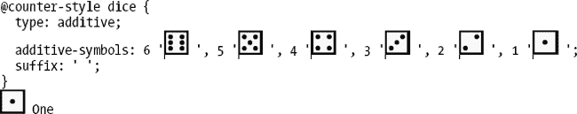

# 十三、CSS 的未来，或者说，即将到来的令人敬畏的东西

那么 CSS 将何去何从呢？你会很高兴地知道关于 *CSS4* 的工作已经开始，一些关于规格的初步工作已经完成，包括:

*   CSS 背景和边框模块级别 4
*   CSS 图像值和替换的内容模块级别 4
*   CSS 伪元素模块级别 4
*   媒体查询级别 4
*   CSS 选择器级别 4
*   CSS 文本级别 4

虽然在浏览器完全实现 CSS3 之前还有很多工作要做，但很高兴知道所有的浏览器制造商都在积极参与 CSS 工作组，并且根据规范快速实现*和*的竞争非常激烈。正如在第九章中提到的，我们认为布局是需要改进的主要方面。令人高兴的是，鉴于浏览器的发布周期越来越短，而且从 Internet Explorer 10 开始，所有浏览器都可以自动更新，你应该可以在 2-3 年内使用目前正在实现的新功能，而不是像现在这样需要 6-10 年。

让我们用一个简短的回顾来结束这本书，看看在接下来的一两年里你会对什么感到兴奋。

### 硬件加速和 CSS 性能

我们想象你已经对 3D 转换的硬件加速感到非常兴奋，在 HTML5 侧画布甚至 WebGL(对于一些浏览器)。我们在第十二章中介绍了使用 3D 变换来实现过渡和动画的硬件加速。通过将 CPU 密集型处理卸载到设备的 GPU，浏览器可以获得显著的性能提升。火狐 3.7+，ie 9+，Chrome 7+，Safari 5+，Opera 12+都有(不同程度的)支持。真正令人兴奋的是，为了寻求更好的性能，浏览器制造商将在未来更多地使用硬件加速，包括 SVG 和通用布局。

CSS 的总体性能也越来越受到关注。选择器性能正在提高，我们终于有了开发人员工具来衡量它。这是最近对性能的普遍关注的一部分，随着浏览器 JavaScript 引擎的惊人改进而开始。这意味着在更多的浏览器中有更快的性能，加上尝试一些直到最近才成为可能的事情的能力。期待这场战斗继续下去，我们所有人都是赢家！

然而，这些改进并不意味着我们可以不再担心性能。移动浏览正在超越桌面，对于快乐的用户来说，速度永远是必不可少的。您可以在 Paul Irish 的演讲“DOM、HTML5 和 CSS3 性能”(视频和幻灯片)(`[`j.mp/pi-perf`](http://j.mp/pi-perf)1`)和“CSS 性能”(`[`j.mp/css-perf`](http://j.mp/css-perf)2`)以及 Matt Seeley 的“WebKit in your living room”演讲(`[`j.mp.anim-perf`](http://j.mp.anim-perf)` `[`www.youtube.com/watch?v=xuMWhto62E0`](http://www.youtube.com/watch?v=xuMWhto62E0)`)中了解有关性能的更多信息。

### 国际化

嗯，也许你本身不会对*感到兴奋*，但是如果你是一个非西方国家的网络开发者，这是一个好消息。CSS 2.1 规范没有解决排版的许多方面，有时没有充分考虑从右到左(RTL)和双向(Bidi)文本。传统上，浏览器在实现对国际化特性的支持方面也很慢，但是规范和实现最终都赶上来了。CSS 计数器样式级别 3 模块中的计数器就是这样一个例子，它用于列表中的计数器(`[`j.mp/css-counter-styles`](http://j.mp/css-counter-styles)` `[`j.mp/css-counter-styles http://dev.w3.org/csswg/css-counter-styles/`](http://dev.w3.org/csswg/css-counter-styles/)3`)。

#### 用 CSS 计数器样式模块定义你自己的列表计数器

在 CSS 2 中，`list-style-type`的允许值是:

__________

1

2

3

*   `disc`
*   `circle`
*   `square`
*   `decimal`
*   `decimal-leading-zero`
*   `lower-roman`
*   `upper-roman`
*   `lower-greek`
*   `lower-latin`
*   `upper-latin`
*   `armenian`
*   `georgian`
*   `lower-alpha`
*   `upper-alpha`
*   `none`
*   `inherit`
*   `hebrew*`
*   `cjk-ideographic*`
*   `hiragana*`
*   `katakana*`
*   `hiragana-iroha*`
*   `katakana-iroha*`

(带有星号的类型在 CSS 2.1 中被丢弃了，但是在除了 Internet Explorer 之外的任何系统中都受支持。)虽然这是一个很大的数目，但它仍然没有涵盖世界语言所需要的所有列表类型。例如，Firefox 还实现了一个额外的 *31* 厂商前缀值，从`arabic-indic`到`urdu`。

幸运的是，CSS3 采取了不同的策略，CSS 计数器样式模块基于七种算法定义计数器。

*   `repeating`
*   `numeric`
*   `alphabetic`
*   `symbolic`
*   `non-repeating`
*   `additive`
*   `override`

在新的`@counter-style`声明中使用这些，您可以复制所有的 CSS 2 `list-item-type`值，加上 Firefox 的额外值。此外，这允许您*定义自己的列表计数器*，比如:

> — *CSS 计数器样式第三级* ( `[`j.mp/css-counter-styles`](http://j.mp/css-counter-styles)4`)

该规范还定义了**所有**预设的 CSS 2 列表项类型值，尽管那些不在 CSS 2.1 中的值目前“处于危险之中”

#### calc()和 attr()函数

CSS 值和单位模块 3 级规范(`[`j.mp/css3-values`](http://j.mp/css3-values)5`)中的这两个函数是 CSS 成为编程语言的一小步。

`calc()`功能允许您使用数学表达式作为数值，它可以用来代替*长度*、*频率*、*角度*、*时间*或*数字*的数值。我们可以使用+、-、*和/，并应用标准的数学运算符优先级规则。

液体布局就是一个很好的例子。当在默认的框模型中使用 CSS 浮动时，`padding`和`border`被添加到框的宽度中，使得浮动的元素更容易落在下面，而不是水平排列。一种变通方法是使用`box-sizing: border-box;`(在第九章的中有所涉及)，它将在元素的宽度中包含`padding`和`border`，并且在除 IE 6-7 ( `[`j.mp/c-boxsizing`](http://j.mp/c-boxsizing)6`)之外的所有当前浏览器上都受支持。

使用`calc()`，你可以从宽度中减去水平`margin`、`border`和`padding`值。

`.content, .sidebar {
  float: left;
  padding: 1em;
}
.content {width: **calc(100% / 3 * 2 - 1em * 2)**;} /* spaces for * and / */
.sidebar {
  margin-left: 1em;
  border-left: 2px solid #999;
  width: **calc(100%/3 - 1em - 2px - 1em*2)**; /* no spaces for * and / */
}`

__________

4

5

6

这将给出一个布局，其中`content`是页面的 2/3`width`减去`padding`，而`sidebar`是页面的 1/3`width`减去`margin`、`border`和`padding.`

*注意:当使用+和-操作符时，确保它们的两边都有一个空格，否则它们会指示后面的数字是正数还是负数。空格对于*和/是可选的。*

与 CSS 计数器样式不同，`calc()`实际上在 Firefox (4+带厂商前缀`-moz-`和 16+，无前缀)Internet Explorer 9+(无前缀)，以及 WebKit(编写时的 Chrome 19+和 Safari 6+带 webkit-)中受支持(`[`j.mp/c-calc`](http://j.mp/c-calc)7`)。这意味着它现在在 cascade 中很有用，例如:WebKit 也在实现`calc()`，所以它在 cascade 中也很有用，例如:

`.sidebar {
  width: 30%; /* bodge for non-supporting browsers */
  -webkit-calc(100%/3 − 1em − 2px − 1em*2);/* For Chrome 19+, Safari 6+ */
  width: -moz-calc(100%/3 - 1em - 2px - 1em*2); /* for Firefox 4+ */
  width: calc(100%/3 - 1em - 2px - 1em*2; /* for IE 9+, Firefox 16+ */
}`

`attr()`函数(或“属性引用”)允许你使用一个元素的属性值作为 CSS 属性中的一个值。在 CSS 2.1 中，这只能在`content`属性中使用，但是在 CSS3 中，它几乎可以在任何属性中使用。虽然浏览器会根据属性的默认值来设定单位，但我们也可以用第二个`attr()`值来设置单位，甚至包括一个有效的回退作为第三个值。

`.box:after {content: attr(*attribute*);} /* CSS 2.1 */
.box {width: attr(*attribute*);} /* CSS3 ... */
.box {width: attr(*attribute*, *unit*);}
.box {width: attr(*attribute*, *unit*, *fallback*);}`

回到第四章，我们讨论了 HTML5 的新`data-*`属性。结合`attr()`，这些看起来非常适合 CSS 中的条形图，而不是当前的内联样式或类选项。

`.bar {width: attr(data-width);}
.bar {width: attr(data-width, %);}
.bar {width: attr(data-width, %, 100px);} /* fallback can be auto, use different units etc */

Widget sales
`

当你需要分别设计几个相似的东西时，这非常方便。可悲的是，虽然在`content`属性中对`attr()`的基本支持是好的(现代浏览器加上 IE8+)，但是还没有对`attr()`的 CSS3 特性的支持(`[`j.mp/mdn-attr`](http://j.mp/mdn-attr)7`)。

展望更远的未来，将`calc()`与`attr()`结合起来有可能使这些功能变得更加美味。

__________

7 `[`caniuse.com/#feat=calc`](http://caniuse.com/#feat=calc)`

8

#### 变量、混合和嵌套

最近，像 Sass ( `[`sass-lang.com`](http://sass-lang.com)`)和 Less ( `[`lesscss.org`](http://lesscss.org)`)这样的 CSS 预处理程序变得流行起来，它们允许使用像`calc()`函数这样的计算。它们还提供了三个有用的编程概念:变量、混合和嵌套。这些有助于以下列方式简化 CSS 编码:

*   *变量*:你在一个地方给一个变量赋一个常用的值(比如颜色)，然后在你的 CSS 中用这个变量代替这个值。如果需要更改值，只需更改变量定义。
*   Mixins :这些可以让你组合(混合)CSS 的片段。它们在被调用时也可以接受值。这允许您创建一个代码片段库，但在使用代码片段时仍然可以进行更改，这再次减少了 CSS 重复。
*   *嵌套*:通过将一个声明缩进到另一个声明中，嵌套的选择器继承了它的祖先选择器，使您不必再键入它们。

虽然在 CSS 中包含这些功能仍有争议，但已经有了 CSS 变量模块 1 级编辑草案(`[`j.mp/css-variables`](http://j.mp/css-variables)**`)并且对该功能的兴趣越来越大。Less 和 Sass 等当前选项的优点是它们生成直接的 CSS，并且这些选项的 CSS 规范语法也可以经过预处理以生成后备 CSS。这意味着如果你现在想使用这些特性，*你可以*作为你工作流的一部分，然后使用生成的 CSS。

虽然这些函数很棒，但是也很容易生成比手工编码多得多的 CSS，并且很容易进行过度限定的声明(包含比所需更多选择器的声明)。一定要检查制作的 CSS 的质量。

#### 转动“OMG！”使用 CSS 着色器时最多 11 个

基于 SVG 滤镜效果，Adobe ( `[`j.mp/css-shaders`](http://j.mp/css-shaders)` `10` )的 CSS 着色器提案将允许这些应用于 CSS 和 HTML。这些是使用一个`filter`属性添加的，该属性包括以下缺省值:

*   虚化
*   投影
*   色调-旋转
*   饱和的
*   转化的
*   灰度等级
*   不透明
*   微克
*   乌贼的墨

__________

9

10

然而，`filter`也是可扩展的，这意味着通过一点数学运算，你就可以*制作你自己的*。如果你还记得你第一次发现 Adobe Photoshop 的滤镜菜单，准备好再次体验同样令人眩晕的兴奋吧…但这次是在你的浏览器中*。如果你认为 06 年疫情的“湿地板效应”很糟糕，那你还什么都没看到呢！*

由于 CSS 着色器的真正功能需要您亲自体验，我们将放弃对它们的描述，转而向您介绍 Vincent Hardy ( `[`j.mp/shaders-intro`](http://j.mp/shaders-intro)11`)的“CSS 着色器简介:网络电影效果”。

### 勇往直前，创造奇迹

我们对 HTML5 和 CSS3 亮点的短暂参观已经结束。我们希望你能享受这一旅程，并在此过程中学到很多东西。虽然让你能够建立自己的美味网络美食是我们的主要目标，但这实际上是掩盖我们邪恶阴谋的诡计。我们希望你…

**图 13-1。**兴奋起来，把事情搞成马特·琼斯12

利用你所学到的技能，将它们与你的热情结合起来，尽你所能使这张网——*我们的网*——尽可能做到最好(见图 13-1 )。如果你需要一些关于如何集中你的技能和热情的建议，我们鼓励你访问 Mat Marquis、Aaron Forsander、Connor Montgomery、Paul Irish、Divya 马年、Nicolas 加拉格尔、Addy Osmani 和朋友们的“参与标准和浏览器开发指南”。

__________

11

NC SA 的 12 CC，允许使用

现在向前冲，让**变得令人敬畏！**

### 附录:基本链接

为了帮助你，这里是我们的基本链接。

*   HTML5 规范(更多信息，参见`[`j.mp/html5-specs`](http://j.mp/html5-specs)13`)
    *   HTML，WHATWG 的生活标准:完整规范(`[`whatwg.org/C`](http://whatwg.org/C)`)
    *   HTML5，Web 开发人员的技术规范:规范减去实现者细节(`[`developers.whatwg.org`](http://developers.whatwg.org)`)
    *   标记语言:快速参考指南
*   HTML5 信息
    *   HTML5 Doctor:深度文章加快速参考信息(`[`html5doctor.com`](http://html5doctor.com)`)
    *   Mozilla 开发者网络，HTML5 和 HTML5 元素:基于 wiki 的全面报道(`[`j.mp/mdn-html`](http://j.mp/mdn-html)14`)
    *   HTML5 Rocks: HTML5 相关的演示、教程和代码(`[www.html5rocks.com](http://www.html5rocks.com)`)
    *   HTML5 演示和示例:Remy Sharp 的 API 演示(`[`html5demos.com`](http://html5demos.com)`)
    *   Planet HTML5:一个 HTML5 新闻和观点聚合器(`[www.w3.org/html/planet](http://www.w3.org/html/planet)`)(也可参见 Paul Irish 的 Web 浏览器、前端和后续标准提要)(`[`j.mp/html5-feeds`](http://j.mp/html5-feeds)15`)
*   HTML5 联机丛书
    *   Jeremy Keith 的《网页设计者的 html 5》:极好的概述(`[`html5forwebdesigners.com`](http://html5forwebdesigners.com)`)
    *   *深入 HTML5* 作者马克·皮尔格林:详细信息(`[`diveintohtml5.info`](http://diveintohtml5.info)`)
*   使用 HTML5 的工具
    *   HTML5 请:建议使用(和不使用)哪些 HTML5 特性(`[`html5please.us`](http://html5please.us)`)
    *   我什么时候可以使用… for HTML5 作者:Alexis Deveria:详细的浏览器支持信息(`[`j.mp/c-html5`](http://j.mp/c-html5)16`)
    *   保罗·爱尔兰、迪维娅·马年、石川、马蒂亚斯·拜恩斯、尼古拉斯·加拉格尔和朋友的 HTML5 样板文件:关于 HTML5 和 CSS3 最佳实践的知识炸弹(`[`html5boilerplate.com`](http://html5boilerplate.com)`)
    *   亨利·西沃宁的 Validator.nu:检查你的代码(`[`validator.nu`](http://validator.nu)`)
*   CSS3 规格
    *   w3.org 中按稳定性排序的 CSS3 规范列表:使用“即将发布”栏中的链接(`[`j.mp/css-roadmap`](http://j.mp/css-roadmap)17`)
*   CSS3 信息
    *   克里斯·科伊尔的 CSS 技巧:所有的事情
    *   Mozilla 开发者网络，CSS:基于 wiki 的全面报道(`[`j.mp/mdn-css`](http://j.mp/mdn-css)18`)
    *   *粉碎杂志* CSS 文章:内容广泛的文章集合(`[`j.mp/smag-css`](http://j.mp/smag-css)19`)
    *   CSS3.info:包含 CSS 工作组成员的临时帖子(`[www.css3.info](http://www.css3.info)`)
*   使用 CSS3 的工具
    *   HTML5 请:关于使用(和不使用)什么 CSS3 特性的建议
    *   我什么时候可以使用…的 CSS 作者 Alexis Deveria:详细的浏览器支持信息(`[`j.mp/c-css`](http://j.mp/c-css)20`)
    *   保罗·爱尔兰，迪维娅·马年，石川，马蒂亚斯·拜恩斯，尼古拉斯·加拉格尔和他的朋友:HTML5 和 CSS3 最佳实践的知识炸弹(`[`html5boilerplate.com`](http://html5boilerplate.com)`)
    *   W3C CSS 验证服务(更改选项以检查 CSS3 等。):不幸的是，这并不完全支持最新的规范，并且会显示许多虚假错误(`[`jigsaw.w3.org/css-validator`](http://jigsaw.w3.org/css-validator)`)
    *   尼古拉斯·扎卡斯和妮可·沙利文的 CSS Lint:虽然它不是一个验证器，而且相当固执己见，但它确实有助于捕捉 W3 的 CSS 验证器可能遗漏的实际错误。再次，更改选项。(`[`csslint.net`](http://csslint.net)`)
*   在线代码沙箱
    *   dabble et:Lea Verou(`[`dabblet.com`](http://dabblet.com)`)开发的一个交互式游戏平台，用于快速测试 CSS 和 HTML 代码片段
    *   JS Bin:Remy Sharp 的协同 JavaScript 调试(`[`jsbin.com`](http://jsbin.com)`)
    *   jsFiddle:网络在线编辑器(`[`jsfiddle.net`](http://jsfiddle.net)`)
    *   jsdo.it:共享 JavaScript、HTML5 和 CSS ( `[`jsdo.it`](http://jsdo.it)`)

13

14

15

16

17 `[www.w3.org/Style/CSS/current-work#roadmap](http://www.w3.org/Style/CSS/current-work#roadmap)`

18

19

20 `[`caniuse.com/#cats=CSS`](http://caniuse.com/#cats=CSS)`