# 一、绘图技术概述

Abstract

当我们需要用图形来表示数据或定性结构，以显示关系，进行比较或突出趋势时，我们会使用图表。图表是由符号组成的图形结构，如折线图中的线条；条形图中的条形；或称切片。图表是有效的工具，可以帮助我们辨别和理解大量数据背后的关系。对于人类来说，阅读图形表示(如图表)比阅读原始数字数据更容易。如今，在各种各样的专业领域以及日常生活的许多其他方面，使用图表已经成为惯例。由于这个原因，根据数据的结构和突出显示的现象，图表有多种形式。例如，如果您将数据分成不同的组，并希望表示每个组相对于总数的百分比，则通常在饼图或条形图中显示这些数据组。相比之下，如果您想要显示一个变量随时间变化的趋势，折线图通常是最佳选择。

当我们需要用图形来表示数据或定性结构，以显示关系，进行比较或突出趋势时，我们会使用图表。图表是由符号组成的图形结构，如折线图中的线条；条形图中的条形；或称切片。图表是有效的工具，可以帮助我们辨别和理解大量数据背后的关系。对于人类来说，阅读图形表示(如图表)比阅读原始数字数据更容易。如今，在各种各样的专业领域以及日常生活的许多其他方面，使用图表已经成为惯例。由于这个原因，根据数据的结构和突出显示的现象，图表有多种形式。例如，如果您将数据分成不同的组，并希望表示每个组相对于总数的百分比，则通常在饼图或条形图中显示这些数据组。相比之下，如果您想要显示一个变量随时间变化的趋势，折线图通常是最佳选择。

在本书中，您将学习如何使用基于 JavaScript 的各种技术来创建、绘制图表，并根据您的需求调整图表。然而，在开始使用 JavaScript 开发图表之前，理解本书章节中涉及的基本概念是很重要的。在这一章中，我将提供这些概念的简要概述。

首先，我将向您展示如何识别构成图表的最常见元素。了解这些元素将会很有帮助，因为您会发现它们以组件、变量和对象的形式存在于专门为实现图表而创建的 JavaScript 库中。

接下来，我将列出最常见的图表类型。您对图表及其功能的了解越多，就越容易为您的数据选择正确的表示方式。如果你要强调你想要表现的关系，做出正确的选择是很重要的，仅仅阅读数据是不够的。只有当你熟悉了最常见的图表类型，你才能选择最适合你的目的的图表。

一旦你熟悉了这些概念，你将需要学习如何通过网络实现它们，以及当前有哪些技术可以帮助你实现这个目标。因此，在这一章的第二部分，我将讨论这些技术方面，逐一介绍本书中提供的例子的开发中所涉及的技术。

最后，鉴于我们所有的工作都将集中在 JavaScript 代码的开发上，我认为对某些类型的数据提供一个简要的描述会有所帮助。那些不熟悉 JavaScript 的人可以从这个关于代码中数据形式的快速参考资料中受益。然而，我强烈建议读者更深入地研究本章中讨论的概念和技术。

## 图表中的元素

您很快就会看到，图表可以呈现多种形式。在图表中，通过使用特定于图表类型的符号，数据呈现出图形结构；但是，有一些特性是所有图表共有的。

通常，每个图表都有一个标题，显示在顶部，提供数据的简短描述。不太常见的是，副标题或脚注用于提供额外的描述(主要是与数据相关的信息，如参考文献、地点、日期和注释)。

图表通常有轴——两条垂直线，允许用户引用每个数据点 P(x，y)的坐标值(x，y)，如图 1-1 所示。水平线通常代表 x 轴，垂直线代表 y 轴。

图 1-1。

A two-dimensional chart

每个轴上都定义了一个刻度。尺度可以是数字的，也可以是分类的。每个轴被分成对应于刻度所代表的特定值范围的段。一个线段和下一个线段之间的边界称为记号。每个分笔成交点报告与该轴相关的刻度值。一般来说，称这些为刻度标签。

图 1-2 显示了四个不同比例的轴。轴 a 和 b 有数字刻度，a 是线性刻度，b 是对数刻度。轴 c 和 d 具有分类标度，c 是序数，因此遵循升序，而 d 只是没有任何特定顺序的类别序列。

图 1-2。

Four axes with different scales

沿着每个轴，最好显示一个标签，简要描述所表示的尺寸；这些被称为轴标签。如果刻度是数字，标签应该在括号中显示测量单位。例如，如果你有一个 x 轴来报告一组数据的时间，你可以把“时间”写成一个轴标签，第二个单位(在这种情况下是秒)用方括号表示为 s )。

图 1-3。

An axis label

在显示图表的绘图区域中，可以包括线网格以帮助数据的可视化对齐。图 1-4 显示了一个图表网格，x 轴为线性时间刻度，y 轴为对数刻度。

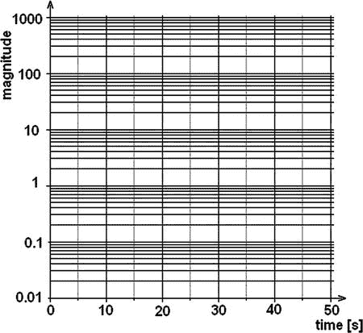

图 1-4。

A chart with two different scales

您已经看到了数据是如何用符号表示的。但是，文本标签也可以用来突出显示特定的数据点。点标签在图表中的相应点处提供图表中的值，而工具提示是当鼠标经过给定点时动态显示的小框架。这两种标签如图 1-5 所示。

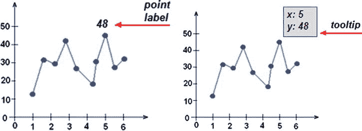

图 1-5。

The point label and the tooltip of a data point

数据通常被分组到几个系列中，为了在同一个图表中表示这些数据，它们必须是可区分的。最常见的方法是为每个系列分配不同的颜色。在其他情况下，例如，对于折线图，线条(虚线、点线等)也可用于区分不同的系列。一旦建立了颜色(或笔画)序列，就有必要添加一个表格来演示颜色和组之间的对应关系。该表被称为图例，如图 1-6 所示。

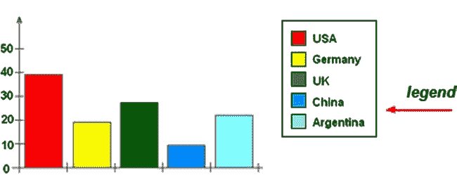

图 1-6。

A legend

虽然讨论这一部分中的概念可能显得琐碎，但是定义我将在整本书中引用的元素的术语是很重要的。它们构成了构建图表的基础。您还将看到专门研究图表表示的 JavaScript 库如何使用这些术语，将它们与编辑和设置组件相关联(参见第八章中的“插入选项”一节)。

## 最常见的图表

本节包含最常见图表类型的简要概述。这些图表将在本书的后续章节中详细描述。

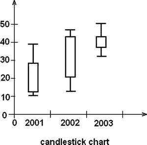

图 1-10。

A candlestick chart

*   蜡烛图:一种专门用于描述价格趋势的图表。每个数据点由四个值组成，通常称为开盘-盘高-盘低-收盘(OHLC)值，并呈现类似烛台的形状(见图 1-10 )。

图 1-9。

A bubble chart and a radar chart

*   气泡图:一个二维散点图，其中第三个变量由数据点的大小表示(见图 1-9 )。
*   雷达图:一种图表，其中一系列数据表示在许多轴上，从图表中心的原点开始呈放射状。这张图表通常呈现蜘蛛网的外观(见图 1-9 )。

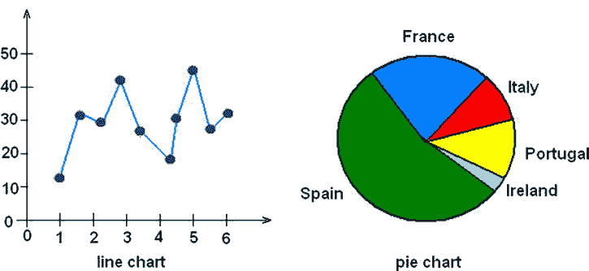

图 1-8。

A line chart and a pie chart

*   折线图:由线条连接的有序数据点序列。数据点 P(x，y)在图表中报告，代表 x 和 y 两个轴的刻度(见图 1-8 )。
*   饼图:一个被分成若干段(片)的圆(饼)。每个切片代表一组数据，其大小与百分比值成正比(见图 1-8 )。

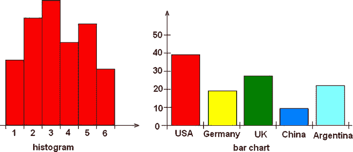

图 1-7。

A histogram and a bar chart

*   直方图:竖立在 x 轴上的相邻矩形，分成离散的间隔(区间)，其面积与该区间的观察频率成比例(见图 1-7 )。
*   条形图:形状类似于直方图，但本质不同，这是一种矩形条的长度与它们所代表的值成比例的图表。每个条形标识一组数据(见图 1-7 )。

Note

开盘-盘高-盘低-收盘(OHLC)是四个数值，通常用于说明金融工具价格随时间的变化。

## 如何在 Web 上实现图表

现在，我已经描述了最常见的图表类型和组成它们的元素，下一步是快速浏览一下今天可用的技术，这些技术将允许您实现您的图表。

如今，web 技术处于不断的变化之中:每天都有新的解决方案被提出，解决不久前还被证明非常复杂的问题。这些创新将为您提供实现具有引人注目的图形的高度交互式图表的可能性，所有这些都只需编写几行 JavaScript 代码。整个事情可以快速而容易地完成，因为大部分工作已经由 JavaScript 库为您完成，这些库在图表表示方面非常专业。这些库现在遍布网络。

在本书中，您将使用 jqPlot、Highcharts 和 D3，它们是目前使用最广泛的库，可以为图表实现过程中可能出现的几乎任何问题提供通用解决方案。

但是，在逐一浏览这些库之前(您将在后面的章节中完成)，您必须首先调查构成 JavaScript 图表开发基础的所有技术，因为这些技术将伴随您阅读本书的其余部分。

## HTML5

最近，有很多关于 HTML5 的讨论，它实际上彻底改变了 web 应用的开发方式。在它出现之前，如果你想引入交互式图形内容，使用 Adobe Flash 等应用几乎是必经之路。但是，使用 Flash 或类似的应用在网上开发图表或其他图形表示有一个明显的限制:依赖于安装在最终用户机器上的插件。此外，智能手机不支持这类应用。由于 HTML5，开发人员现在可以创建高级图形和动画，而不依赖于 Flash。

当你通读这本书时，你会看到 HTML5 是如何导致许多其他技术的诞生的，有些是新的，有些是旧的，但又是更新的，比如 JavaScript。事实上，作为一种语言，JavaScript 正在经历重生，这是由于新库的开发利用了 HTML5 引入的创新。HTML5 有许多新的语法特性，包括

<canvas>元素和标量矢量图形(SVG)内容的集成。由于这些元素，在不使用 Flash 的情况下，在 Web 上集成多媒体和图形内容将非常容易。</canvas>

在 Flash 的位置上，您将使用 JavaScript 库，如 jQuery、jqPlot、Highcharts 和 D3。目前，这些是可用于实现任务(如数据的图形可视化)的最广泛和最完整的库。然而，网络技术的世界在不断发展；在互联网上，你总是可以找到新的图书馆，其特征与本书所包含的特征相似。

## 用 SVG 和画布制作图表

在 HTML5 引入的新技术可以实现的所有可能的图形应用中，我将重点介绍通过图表表示和可视化数据。使用 JavaScript 作为编程语言，我们现在可以利用新浏览器中嵌入的强大渲染引擎。作为这种语言新功能的基础，我将参考 HTML5 canvas 和 SVG。SVG 和 canvas 不是在服务器上绘制静态图像，然后将它们下载到浏览器中，而是允许您开发完全交互式的图表，从而通过内置的动画、过渡和工具提示来丰富您的图形表示。这是因为 SVG 和 canvas 内容是在浏览器中绘制的，所以组成图表的图形元素可以在不刷新页面的情况下进行转换。该功能对于可视化实时数据至关重要，因为实时数据要求图表随着数据的变化而不断更新。以这种方式操作将确保真正的客户端图表。事实上，通过利用这些技术，图表实际上是在客户机上绘制的，只需要从服务器传递数据。这个方面提供了相当多的优点，最重要的是消除了从服务器下载大图形文件的需要。

### Canvas vs SVG 的应用

HTML5 canvas 和 SVG 都是允许您在浏览器中创建丰富图形的 web 技术，但它们是根本不同的。贯穿本文，您将主要看到两个 JavaScript 框架:jqPlot 和 D3。基于 jQuery 框架的 jqPlot 利用 HTML5

<canvas>元素来绘制图表。相比之下，D3 没有利用 canvas 它依赖 SVG 技术进行图形表示。</canvas>

SVG 是一种基于 XML 的矢量图形格式。SVG 内容可以是静态的、动态的、交互式的或动画的，这使得它非常灵活。您还可以使用层叠样式表(CSS)来设置 SVG 元素的样式，并使用 SVG 文档对象模型(DOM)提供的应用编程接口(API)方法向它们添加动态行为。因此，选择这种格式，您可以获得比简单的矢量图形和动画更多的东西:您可以开发高度交互式的 web 应用，包括脚本、高级动画、事件、过滤器和几乎任何您想象得到的东西。

HTML5 canvas 规范是一个通用的 JavaScript API，允许您编写编程绘制操作。Canvas 本身允许您定义一个 canvas 上下文对象，在 HTML 页面上显示为一个

<canvas>元素。然后，可以通过网络图形库(WebGL)使用二维或三维绘图环境在内部绘制该元素。我将只讨论第一种选择；jqPlot 使用二维绘图上下文。二维上下文为您提供了一个强大的 API，可以在位图表面(画布)上执行快速绘制操作。与 SVG 不同，形状没有 DOM 节点，只有像素。</canvas>

与 SVG 相比，canvas 的优点是绘图性能高，图形和图像编辑速度更快。每当需要在像素级别工作时，canvas 是更好的选择。然而，对于 canvas，没有 DOM 节点是一个缺点，尤其是如果您不使用 JavaScript 框架，比如 jqPlot。另一个缺点是文本呈现能力差。

与 canvas 相比，SVG 的优势在于分辨率独立性、对动画的良好支持，以及使用声明性语法来激活元素的能力。不过，最重要的是，使用 JavaScript 中的 SVG DOM API 完全控制每个元素。然而，当复杂性增加时，缓慢的渲染可能是一个问题，但浏览器提供商正在努力使浏览器更快(见表 1-1 和 1-2 )。

表 1-1。

Web Browsers and Engines

<colgroup><col> <col> <col> <col> <col></colgroup> 
| 浏览器 | 目前的 | 发动机 | 开发者 | 许可证 |
| --- | --- | --- | --- | --- |
| 谷歌 Chrome | Twenty-nine | 眨眼 | 谷歌，Opera，三星，英特尔，其他 | GNU 宽松通用公共许可证(LGPL)，Berkeley 软件分发(BSD)风格 |
| Mozilla Firefox | Twenty-three | 壁虎 | 网景/Mozilla 基金会 | Mozilla 公共许可证(MPL) |
| 微软公司出品的 web 浏览器 | Ten | 三叉戟 | 微软 | 所有人 |
| 苹果浏览器 | six | 网络工具包 | 苹果，KDE，诺基亚，黑莓，Palm，其他 | GNU lgpl BSD 样式 |

表 1-2。

Web Technology Support: Comparison of Web Browsers

<colgroup><col> <col> <col> <col> <col></colgroup> 
|   | 浏览器 |
| --- | --- |
| 技术 | Internet Explorer 10 | 铬 29 | 火狐 23 | 野生动物园 6 |
| --- | --- | --- | --- | --- |
| SVG(五)。1.1) |   |   |   |   |
| 过滤 | 是(从 10 开始) | 是 | 是 | 是(从 6 开始) |
| 同步多媒体集成语言(SMIL)动画 | 不 | 是 | 是 | 部分的 |
| 字体 | 不 | 是 | 不 | 是 |
| 片段标识符 | 是 | 不 | 是 | 不 |
| HTML 效果 | 部分的 | 部分的 | 是 | 部分的 |
| css 背景 | 是 | 是 | 部分的 | 是 |
| 半铸钢ˌ钢性铸铁(Cast Semi-Steel) | 是 | 是 | 是 | 是 |
| HTML5 |   |   |   |   |
| 帆布 | 是(从 9 点开始) | 是 | 是 | 是 |
| 新元素 | 是 | 是 | 是 | 是 |
| 视频元素 | 是(从 9 点开始) | 是 | 是 | 是 |
| 百度地图 |   |   |   |   |
| JavaScript 对象符号(JSON)解析 | 是 | 是 | 是 | 是 |
| web GL(web GL) | 不 | 是 | 部分的 | 部分的 |

## 狗

使用在 HTML 页面结构元素层次上工作的库，我们不能避免谈论 DOM。我会经常提到这个概念，因为它是每个网页的基本结构。万维网联盟(W3C)认为有必要为结构化文档的表示创建一个官方标准，以便为所有编程语言和平台开发指导原则，这是正确的。HTML 文档的树结构，以及 XML 文档的树结构，完全遵循了这个标准开发的指导原则。以下是一个 HTML 文档的示例:

`<HTML>`

`<HEAD>`

`<TITLE>A title</TITLE>`

`</HEAD>`

`<BODY>`

`Hello`

` `

`</BODY>`

`</HTML>`

该文档的 DOM 树可以表示为如图 1-11 所示。

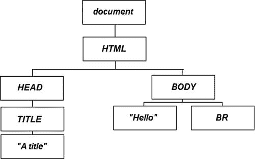

图 1-11。

An example of tree structure of the DOM

但是，DOM 标准并不局限于开发如何在文档中构造 DOM 的指南；该标准还定义了许多功能，用于处理组成文档的元素。因此，任何与文档相关的操作(创建、插入、删除)都应该遵循 DOM 标准。因此，不管您使用的是哪种编程语言，也不管您使用的是哪种平台，您都会发现这个标准表达了相同的功能。通常，术语 DOM 也适用于 API，它管理网页的所有元素。

所有这些都很重要，因为任何选择阅读这本书的人都对开发不仅使用 DOM，而且也是 DOM 的一部分的图表感兴趣，这些图表的每个方面都可以用 JavaScript 检查和操作。在整本书中，您将学习如何最好地利用 jQuery、jqPlot 和 Highcharts (jQuery 扩展)以及 D3 库。使用这些 JavaScript 库，您可以访问每个图表元素，比如更改对象的颜色和位置。

## 用 JavaScript 开发

尽管大多数选择阅读本书的人可能已经对 JavaScript 有了很好的了解，但事实上可能并非如此。出于这个原因，我以实用的方式组织了这本书，给出了一步一步的例子，并提供了例子中必须编写的所有代码。因此，这本书为新来者提供了一个学习这门语言的机会，也为那些已经有一段时间没有使用这门语言的人提供了一个刷新记忆的机会。

要开始使用将用于开发图表的 JavaScript 库，有必要准备一个开发环境。的确，要开发 JavaScript 代码，您可以简单地使用文本编辑器，比如 Notepad(或者更好的 Notepad++ ),但是开发人员通常更喜欢使用专门的应用(通常称为集成开发环境(ide ))来开发代码。除了为文本编辑器提供与代码中使用的关键字相对应的不同颜色之外，此类应用还包含一组旨在简化工作的工具。这些应用可以检查代码中是否有任何错误，提供调试工具，使管理文件变得容易，并帮助在服务器上部署，以及许多其他操作。

现在网络上有很多 JavaScript IDEs，但最突出的还是 Aptana Studio(见图 1-12)；Eclipse Web Developer，安装了 JavaScript 测试驱动程序(JSTD)插件；和 NetBeans。这些编辑器还允许您开发超文本预处理器(PHP)、CSS 和 HTML(有关如何使用 Aptana Studio IDE 建立工作区以实现本书代码的信息，请参见附录 A，或者直接使用本书附带的源代码；您可以在 Apress 网站[ [`www.apress.com/9781430262893`](http://www.apress.com/9781430262893) ]的源代码/下载区找到代码示例。

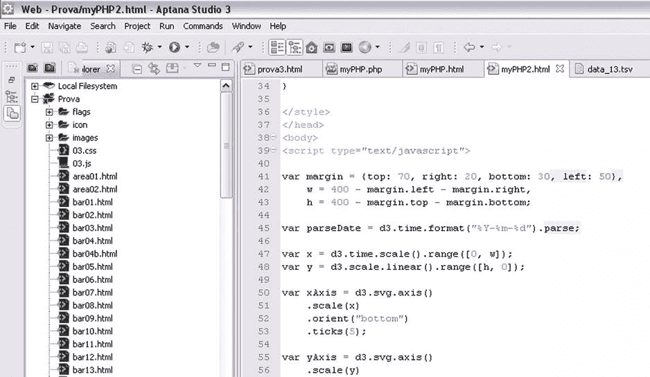

图 1-12。

The Aptana Studio 3 IDE

对于那些不喜欢在计算机上安装太多应用的人，有在线 JavaScript IDEs。这些允许用户在作为 IDE 工作的网页中编辑 JavaScript 代码，并直接从同一个网页中检查结果。不幸的是，许多 ide 都要收费。然而，jsFiddle ( [`http://jsfiddle.net`](http://jsfiddle.net/) )是一个不需要付费的在线 IDE，除了编辑之外，它还提供代码共享和添加库的选项，比如 jQuery 和 D3。(参见图 1-13 )。

图 1-13。

The online IDE jsFiddle

jsFiddle 可以证明非常有用。除了让用户包含许多 JavaScript 库(见图 1-14 )之外，它还提供各自不同的发布版本，从而允许用户实时测试任何不兼容性。

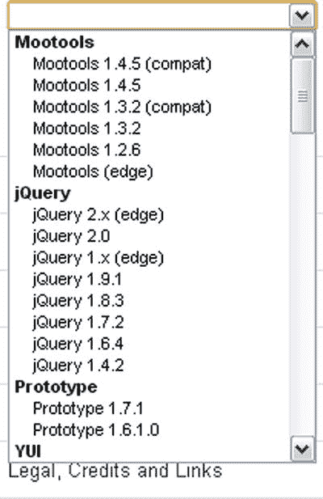

图 1-14。

jsFiddle offers a set of the most popular JavaScript libraries

### 运行和调试 JavaScript

如果我们想在客户机-服务器框架中定义 JavaScript，它是一种完全的客户端编程语言。它不需要编译，除了 HTML 文档之外，部分代码可以在其他语言特有的许多其他类型的文件中找到，例如。JSP 或. PHP。

这些代码片段不受影响地通过应用服务器，从未被处理过。只有浏览器负责运行 JavaScript 代码。因此，JavaScript 代码仅在下载网页时或之后运行，以响应事件。如果 JavaScript 代码相当大或者以后可能有用，可以在. JS 文件中外部定义它；在这里，您可以找到本文中提到的所有 JavaScript 库和框架。然而，不管其形式如何，JavaScript 都是直接从浏览器运行的。

因此，即使您没有使用真正的 IDE 来开发和调试 JavaScript 代码，您也可以简单地将代码插入到一个空的 HTML 文件中，然后直接在浏览器中加载该文件(Chrome、Internet Explorer 和 Firefox 是最常见的)。为了将它与页面上的其他文本区分开来，您必须将代码放在

``

如果 JavaScript 代码驻留在一个外部文件中，那么有必要将它包含在 HTML 页面中，编写

``

因此，只要 JavaScript 的执行不是出于安装某个东西的目的，您就拥有了所需的一切。谁的操作系统上没有 web 浏览器？

### JavaScript 中的数据类型

如前所述，本书既不会解释优秀 JavaScript 代码编程的规则和语法，也不会在编程细节上停留太久。然而，我们将要开发的代码是以图表为中心的，或者说是数据的处理以及如何显示它们。让我们从最简单的例子开始。所有数据结构的最小构造块是变量(当它包含单个值时)。在处理数据类型方面，JavaScript 与其他编程语言有很大不同。，当您希望将 JavaScript 存储在变量中时，您不必指定值的类型(int、string、float、boolean 等)；你只需要用关键字`var`来定义它。

在 Java 或 C 中，包含整数值的变量与包含文本的变量的声明不同:

`int value = 3;`

`String text = "This is a string value";`

在 JavaScript 中，存储值的类型无关紧要。所有东西都用`var`声明，所以相同的声明是

`var value = 3;`

`var text = "This is a string value";`

因此，在 JavaScript 中，我们可以将变量视为存储任何类型值的容器。

为了简单起见，这里的变量被视为单个值的容器，因此代表了最简单的数据结构。然而，实际上，变量也可能包含更复杂的数据类型:数组和对象。

Note

JavaScript 中变量的使用实际上要复杂一些。你也可以不用关键字`var`来声明变量。`var`关键字将在当前范围内声明变量。如果缺少`var`, JavaScript 将搜索在更高级别的作用域中声明的同名变量。如果 JavaScript 没有找到这个变量，则声明一个新变量；否则，JavaScript 将使用值`in the variable found. As a result, an incorrect use of variables can sometimes lead to errors that are difficult to detect.`

#### 数组

数组是由逗号分隔并括在方括号[ ]中的一系列值:

`var array = [ 1, 6, 3, 8, 2, 4 ];`

数组是 JavaScript 中最简单也是最广泛使用的数据结构，所以您应该对它们非常熟悉。通过在括号中指定它的索引(在数组中的位置),可以访问数组中的任何值，紧跟着数组的名称。在 JavaScript 中，索引从 0:

`array[3]  //returns 8`

数组可以包含任何类型的数据，而不仅仅是整数:

`var fruits = [ "banana", "apple", "peach" ];`

有许多函数可以帮助我们处理这类对象。由于它的有用性，我将在整本书中频繁使用这个对象，因此快速浏览一下它似乎是合适的。

通过书写可以知道数组中值的数量

`fruits.length  //returns 3`

或者，如果您知道这些值，您可以使用

`fruits.indexOf("apple") //returns 1`

此外，有一组函数允许我们在数组中添加和删除项目。push()和 pop()函数添加和移除数组中的最后一个元素，而 shift()和 unshift()函数添加和移除数组中的第一个元素:

`fruits.push("strawberry");`

`// Now the array is [ "banana", "apple", "peach", "strawberry" ];`

`fruits.pop(); //returns "strawberry"`

`// Now the array is [ "banana", "apple", "peach"];`

`fruits.unshift("orange", "pear");`

`// Now the array is ["orange", "pear", "banana", "apple", "peach"];`

`fruits.shift();   //returns "orange"`

`// Now the array is ["pear", "banana", "apple", "peach"];`

有时，有必要对数组中的每个值进行循环，以便对其执行某些操作。在其他编程语言中广泛使用的一种方法是使用函数`for()`。例如，要计算数组中值的总和，您应该编写

`var sum = 0;`

`for (var i = 0; i < array.length; i++) {`

`sum += array[i];`

`}`

但是，在 JavaScript 中更常见的是使用`forEach()`函数，其中 d 按照以下顺序一个接一个地假定数组中的值:

`var sum = 0;`

`array.forEach(function(d) {`

`sum += d;`

`});`

#### 目标

数组对于简单的值列表很有用，但是如果你想要结构化的数据，你需要定义一个对象。对象是一种自定义数据结构，其属性和值由您定义。您可以通过将对象的属性括在两个大括号{ }中来定义对象；每个属性都由一个名称定义，后跟一个冒号(:)和分配的值，每个属性/值对之间用逗号分隔:

`var animal = {`

`species: "lion",`

`class: "mammalia",`

`order: "carnivora",`

`extinct: false,`

`number: 123456`

`};`

在 JavaScript 代码中，点符号表示每个值，指定属性的名称:

`animal.species      //Returns "lion"`

现在，您已经了解了对象和数组，您可以看到如何将它们结合起来，以便在 JavaScript 中获得更复杂的数据结构。您可以创建对象的数组或数组的对象，甚至对象的对象。方括号用来表示一个数组，花括号，一个对象。例如，让我们以这种方式定义一个对象数组:

`var animals = [`

`{`

`species: "lion",`

`class: "mammalia",`

`order: "carnivora",`

`extinct: false,`

`number: 123456`

`},`

`{`

`species: "gorilla",`

`class: "mammalia",`

`order: "primates",`

`extinct: false,`

`number: 555234`

`},`

`{`

`species: "octopus",`

`class: "cephalopoda",`

`order: "octopoda",`

`extinct: false,`

`number: 333421`

`}`

`];`

要获得这些数据结构的值，您需要将方括号与属性的索引和名称一起使用:

`animals[0].extinct  //return false`

`animals[2].species //return "octopus"`

## Firebug 和 DevTools

为了进行调试，如果您使用的是 IDE，可以很容易地利用它附带的各种调试工具。但是，如果您无法访问 IDE，您仍然可以利用外部工具。可以把浏览器想象成一个开发环境，在这里调试工具可以通过可从互联网下载的插件来集成。目前互联网上有很多可用的工具，但我想推荐的是 Firebug，这是一款针对那些喜欢使用浏览器 Mozilla Firefox 的 web 开发工具。Firebug 是一个无缝集成到 Firefox 浏览器中的插件，如图 1-15 所示。

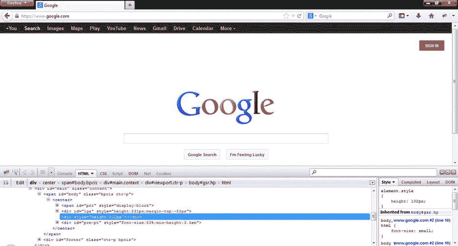

图 1-15。

Firebug is an extention of Mozilla Firefox and is fully integrated into the browser

Firebug 将被证明是一个非常有用的工具，尤其是在使用 jQuery 和 D3 库时，这些库要求 DOM 的结构始终处于控制之下。这个工具将允许你直接监控 DOM 的结构。

然而，对于那些更喜欢使用谷歌 Chrome 的人来说，还有已经集成到浏览器中的 DevTools(见图 1-16 )。要访问该工具，只需单击浏览器右上角的按钮。

接下来，选择工具➤开发人员工具，或者只需右键单击任何页面元素，然后在上下文菜单中选择检查元素。

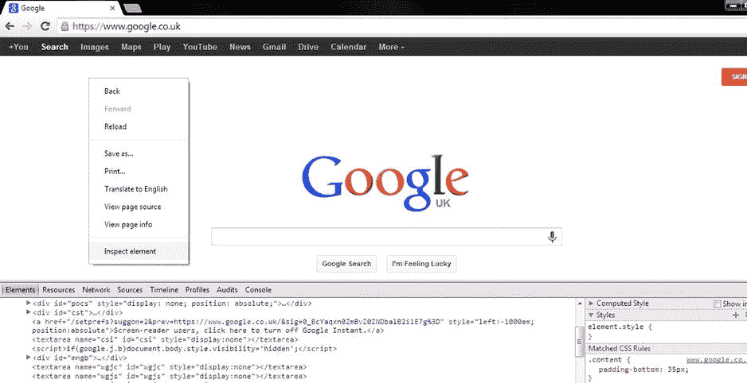

图 1-16。

With DevTools it is possible to monitor a lot of information about your web page

有了这两个工具，您不仅可以轻松地检查 DOM 的每个元素——它的属性和值——还可以检查应用于它们的 CSS 样式。您还可以输入对这些值的更改来实时观察效果，而不必每次都修改文件中的代码并保存它。Firebug 和 DevTools 还包括各种工具，用于监控页面的性能，包括渲染和联网。

对于 DevTools，还应该特别注意控制台的使用。通过它，您可以使用诸如`console.log()`之类的方法来访问诊断信息。此方法经常用于通过控制台显示许多变量的值，将变量的名称作为参数传递，并添加文本作为指示:

`var x = 3;`

`console.log("The value of x is " + x); // The value of x is 3`

还可以使用诸如`$()`或`profile()`的方法输入命令并与文档进行交互。有关这些方法的更多信息，请参见关于控制台 API ( [`https://developers.google.com/chrome-developer-tools/docs/console-api`](https://developers.google.com/chrome-developer-tools/docs/console-api) )和命令行 API ( [`https://developers.google.com/chrome-developer-tools/docs/commandline-api`](https://developers.google.com/chrome-developer-tools/docs/commandline-api) )的文档。

## 数据

JSON 是一种将数据组织成 JavaScript 对象的特定语法。这种格式通常用于基于浏览器的代码，尤其是 JavaScript。JSON 代表了组织数据的 XML 的有效替代方案。两者都独立于编程语言，但是 JSON 比 XML 更快，更容易用 JavaScript 解析，XML 是一种全标记语言。而且 jqPlot 和 D3 和 JSON 配合的很好。它的结构完全遵循 JavaScript 中定义的对象和数组的规则:

`var company = {`

`"name": "Elusive Dinamics",`

`"location": "France",`

`"sites": 2,`

`"employees": 234,`

`"updated": true`

`};`

## 摘要

这第一章已经向你介绍了许多基本概念，它们将伴随你阅读整本书。首先，您研究了最常见的图表类型以及组成它们的元素。您还快速浏览了在着手开发 Web 图表时需要了解的许多技术方面。最后，您简要探讨了本书中 JavaScript 示例中使用的数据类型。

我提到过你的大部分工作将由专门的 JavaScript 库来完成。在下一章，你将学习 jQuery 库。这个库将为您提供一整套直接作用于 DOM 级别的工具。在本书的后面，你会发现关于这个库的知识是至关重要的:许多图形库(包括 jqPlot 和 Highcharts)都是基于它构建的。