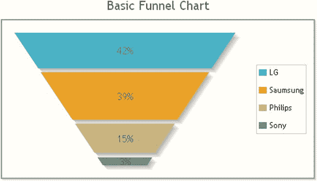
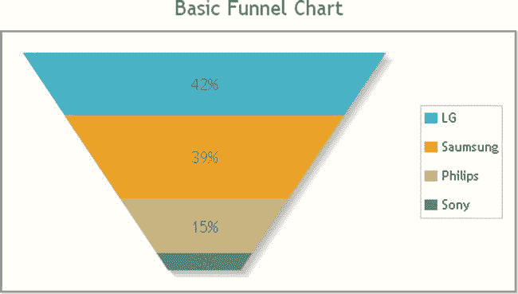

# 十四、jqPlot 漏斗图

Abstract

漏斗图用于显示数据从一个级别到下一个级别的逐渐减少。图表由一个倒金字塔或漏斗组成，分为不同的层次。每个级别都有自己的面积，与给定的百分比值成比例。漏斗图与饼图相似，都是将一个整体分成几个组成部分来表达。但是，漏斗图指定了级别，它们以非常精确的顺序一个接一个。这个序列可以表示层次顺序、过程的步骤等等。饼图不能做到这一点。

漏斗图用于显示数据从一个级别到下一个级别的逐渐减少。图表由一个倒金字塔或漏斗组成，分为不同的层次。每个级别都有自己的面积，与给定的百分比值成比例。漏斗图与饼图相似，都是将一个整体分成几个组成部分来表达。但是，漏斗图指定了级别，它们以非常精确的顺序一个接一个。这个序列可以表示层次顺序、过程的步骤等等。饼图不能做到这一点。

## 创建漏斗图

即使对于这个专门的图表，jqPlot 也提供了一个特定的插件:FunnelRenderer。因此，您需要包含它:

``

或者，如果您更喜欢使用内容交付网络(CDN)服务，您可以按如下方式操作:

`<script type="text/javascript" src="`[`http://cdn.jsdelivr.net/jqplot/1.0.8/plugins/jqplot.funnelRenderer.min.js`](http://cdn.jsdelivr.net/jqplot/1.0.8/plugins/jqplot.funnelRenderer.min.js)

使用 jqPlot，您必须注意特定于该渲染器插件的行为:FunnelRenderer 以降序对数据进行重新排序。最大值显示在漏斗的顶部，较小值显示在下方。每个漏斗部分的面积对应于其数据点的值，相对于所有值的总和(百分比)。使用此渲染器，您需要对输入数据数组使用以下格式:

`['label',value]`

因此，在本例中，您将数据数组定义如下:

`var data = [['Sony', 1], ['Samsung', 13], ['LG', 14], ['Philips', 5]];`

对于`options`，您必须激活`seriesDefaults`对象中的漏斗渲染器插件，并且，可选地，您可以添加一个报告系列标签的图例，如清单 14-1 所示。

清单 14-1。ch14_01a.html

`var options = {`

`seriesDefaults: {`

`renderer: $.jqplot.FunnelRenderer`

`},`

`title: {`

`text: 'Basic Funnel Chart'`

`},`

`legend: {`

`location: 'e',`

`show: true`

`}`

`};`

`$.jqplot('myChart', [data], options);`

图 14-1 是基本的漏斗图。

图 14-1。

A simple funnel chart

如您所见，项目的顺序已经改变，具有最高值的元素在顶部，依此类推，直到具有最低值的项目。这是基本的图表，但是您可以丰富它，例如，通过添加报告百分比的标签。为此，您必须添加`dataLabel`属性，将其设置为“`percent`，然后使用设置为“`true`”的`showDataLabel`启用它(参见清单 14-2)。

清单 14-2。ch14_01b.html

`seriesDefaults: {`

`renderer: $.jqplot.FunnelRenderer,`

`rendererOptions: {`

`dataLabels: 'percent',`

`showDataLabels: true`

`}`

`},`

正如您在图 14-2 中看到的，百分比值现在在漏斗图的相应部分中报告。

图 14-2。

A funnel chart with a legend and percentages

您可以做进一步的更改。例如，假设你想减小漏斗截面之间的间距，如图 14-3 所示。您可以通过传递给`sectionMargin`属性的值来实现这一点。通过将值 0 赋给`sectionMargin`属性，你完全消除了部分之间的空间(见清单 14-3)。

清单 14-3。ch14_01c.html

`rendererOptions: {`

`dataLabels: 'percent',`

`showDataLabels: true` `,`

`sectionMargin: 0`

`}`

图 14-3。

A funnel chart without spaces between sections

或者，你可能想将不同的扇区表示为未填充的，并增加其边界线的宽度，如图 14-4 所示。为此，需要使用两个属性:`fill`和`lineWidth`。首先，您将`fill`属性设置为“`false`”，这将导致 jqPlot 绘制带有空白区域的截面；然后，将`lineWidth`属性设置为 4，从而增加部分边缘的厚度，使它们更加可见(见清单 14-4)。

清单 14-4。ch14_01d.html

`rendererOptions: {`

`dataLabels: 'percent',`

`showDataLabels: true,`

`fill: false,`

`lineWidth: 4`

`}`

图 14-4。

A funnel chart with no filled sections

## 摘要

在这一章中，你学习了如何制作某些类型的漏斗图，以及如何通过`options`改变它们的属性。

在下一章中，我将讨论我在前面章节中提到过的一个主题:控件。我将描述在图表中引入控件的重要性，理解每个控件背后都隐藏着一个属性`options`。这为用户提供了实时选择属性的机会。