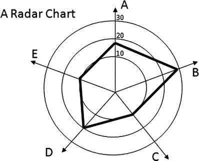
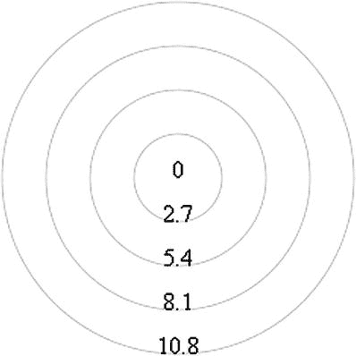
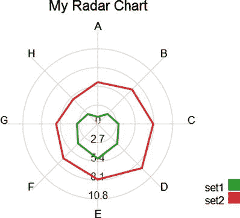
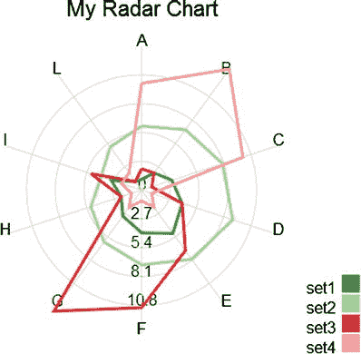

# 二十五、D3 雷达图

Abstract

本章介绍了一种你还没有读过的图表:雷达图。首先，您将了解它是什么，包括它的基本特性，以及如何使用 D3 库提供的 SVG 元素创建一个。

本章介绍了一种你还没有读过的图表:雷达图。首先，您将了解它是什么，包括它的基本特性，以及如何使用 D3 库提供的 SVG 元素创建一个。

首先，从一个 CSV 文件中读取少量有代表性的数据。然后，参考这些数据，您将看到如何一步一步地实现雷达图的所有组件。在本章的第二部分，您将使用相同的代码从更复杂的文件中读取数据，其中要处理的系列数和数据量都更大。当您需要从头开始表示一种新类型的图表时，这种方法是一种相当常见的做法。您从一个简单但完整的例子开始，然后，一旦您实现了基本的例子，您将使用更复杂和真实的数据来扩展它。

## 雷达图

雷达图也称为网状图或蜘蛛图，因为它们呈现典型的网状结构(见图 25-1 )。它们是二维图表，使您能够表示三个或更多的定量变量。它们由一系列角度相同的辐条组成，每个辐条代表一个变量。每个轮辐上都有一个点，该点离中心的距离与给定变量的大小成正比。然后，一条线连接每个辐条上报告的点，从而给绘图一个网状外观。如果没有这条连接线，图表看起来会更像一个扫描雷达。

图 25-1。

A radar chart looks like a spider web

### 构建自动缩放轴

复制下面的数据，并将其保存在一个文件中，名为`data_11.csv`(见清单 25-1)。

清单 25-1。data_11.csv

`section,set1,set2,`

`A,1,6,`

`B,2,7,`

`C,3,8,`

`D,4,9,`

`E,5,8,`

`F,4,7,`

`G,3,6,`

`H,2,5,`

在清单 25-2 中，您定义了绘图区域和边距。然后用`category10()`功能创建一个颜色序列。

清单 25-2。ch25_01.html

`var margin = {top: 70, right: 20, bottom: 40, left: 40},`

`w = 500 - margin.left - margin.right,`

`h = 400 - margin.top - margin.bottom;`

`var color = d3.scale.category20();`

在刚刚定义的绘图区域中，您还必须定义一个可以容纳圆形的特定区域，在本例中是雷达图。一旦定义了这个区域，就像笛卡尔轴一样定义了半径。事实上，雷达图上的每个辐条都被认为是一个轴，在这个轴上放置一个变量。因此，在半径上定义一个线性标度，如清单 25-3 所示。

清单 25-3。ch25_01.html

`var circleConstraint = d3.min([h, w]);`

`var radius = d3.scale.linear()`

`.range([0, (circleConstraint / 2)]);`

您需要找到绘图区域的中心。这是雷达图的中心，也是所有辐条的辐射点(见清单 25-4)。

清单 25-4。ch25_01.html

`var centerXPos = w / 2 + margin.left;`

`var centerYPos = h / 2 + margin.top;`

开始绘制根元素`<svg>`，如清单 25-5 所示。

清单 25-5。ch25_01.html

`var svg = d3.select("body").append("svg")`

`.attr("width", w + margin.left + margin.right)`

`.attr("height", h + margin.top + margin.bottom)`

`.append("g")`

`.attr("transform", "translate(" + centerXPos + ", " + centerYPos + ")");`

现在，如清单 25-6 所示，用`d3.csv()`函数读取文件内容。您需要验证读取值`set1`和`set2`是否被解释为数值。您还想知道所有这些值中的最大值，以便定义一个根据其值扩展的刻度。

清单 25-6。ch25_01.html

`d3.csv("data_11.csv", function(error, data) {`

`var maxValue = 0;`

`data.forEach(function(d) {`

`d.set1 = +d.set1;`

`d.set2 = +d.set2;`

`if(d.set1 > maxValue)`

`maxValue = d.set1;`

`if(d.set2 > maxValue)`

`maxValue = d.set2;`

`});`

`});`

知道输入数据的最大值后，将满量程值设置为该最大值乘以 1.5。在这种情况下，您必须手动定义轴上的记号，而不是使用自动生成的记号。事实上，这些扁虱是球形的，因此具有非常独特的特征。此示例将半径轴的范围分为五个刻度。一旦定义了记号的值，就可以给半径轴分配一个域(见清单 25-7)。

清单 25-7。ch25_01.html

`d3.csv("data_11.csv", function(error, data) {`

`...`

`data.forEach(function(d) {`

`...`

`});`

`var topValue = 1.5 * maxValue;`

`var ticks = [];`

`for(i = 0; i < 5;i += 1){`

`ticks[i] = topValue * i / 5;`

`}`

`radius.domain([0,topValue]);`

`});`

现在你已经有了所有的数值，我们可以嵌入一些`<svg>`元素来设计一个雷达网格，它的形状和值会根据输入的数据而变化(见清单 25-8)。

清单 25-8。ch25_01.html

`d3.csv("data_11.csv", function(error, data) {`

`...`

`radius.domain([0,topValue]);`

`var circleAxes = svg.selectAll(".circle-ticks")`

`.data(ticks)`

`.enter().append("g")`

`.attr("class", "circle-ticks");`

`circleAxes.append("svg:circle")`

`.attr("r", function(d) {return radius(d);})`

`.attr("class", "circle")`

`.style("stroke", "#CCC")`

`.style("fill", "none");`

`circleAxes.append("svg:text")`

`.attr("text-anchor", "middle")`

`.attr("dy", function(d) {return radius(d)})`

`.text(String);`

`});`

您已经创建了一个名为`circle-ticks`的五个`<g>`标签的结构，如图 25-2 所示，每个标签包含一个`<circle>`元素(绘制网格)和一个`<text>`元素(显示相应的数值)。

图 25-2。

FireBug shows how the `circle-ticks` are structured

所有这些代码生成了如图 25-3 所示的圆形网格。

图 25-3。

The circular grid of a radar chart

如您所见，分笔成交点上报告的值将根据数据中包含的最大值而变化。

现在是画轮辐的时候了，和`data_11.csv`文件中的线条一样多的射线。这些行中的每一行都对应一个变量，变量的名字被输入到文件的第一列中(见清单 25-9)。

清单 25-9。ch25_01.html

`d3.csv("data_11.csv", function(error, data) {`

`...`

`circleAxes.append("svg:text")`

`.attr("text-anchor", "middle")`

`.attr("dy", function(d) {return radius(d)})`

`.text(String);`

`lineAxes = svg.selectAll('.line-ticks')`

`.data(data)`

`.enter().append('svg:g')`

`.attr("transform", function (d, i) {`

`return "rotate(" + ((i / data.length * 360) - 90) +`

`")translate(" + radius(topValue) + ")";`

`})`

`.attr("class", "line-ticks");`

`lineAxes.append('svg:line')`

`.` `attr("x2", -1 * radius(topValue))`

`.style("stroke", "#CCC")`

`.style("fill", "none");`

`lineAxes.append('svg:text')`

`.` `text(function(d) { return d.section; })`

`.attr("text-anchor", "middle")`

`.attr("transform", function (d, i) {`

`return "rotate("+(90 - (i * 360 / data.length)) + ")";`

`});`

`});`

现在图表中显示了辐条，如图 25-4 所示。

图 25-4。

The radial axes of a radar chart

### 向雷达图添加数据

现在是时候考虑文件中的数字列了。每一列都可以被视为一个系列，每个系列都必须分配一种颜色。您可以通过从文件中取出标题并删除第一列来定义系列。然后你可以根据系列的顺序创建颜色域，然后定义绘制它们的线条(见清单 25-10)。

清单 25-10。ch25_01.html

`d3.csv("data_11.csv", function(error, data) {`

`...`

`lineAxes.append('svg:text')`

`.text(function(d) { return d.section; })`

`.attr("text-anchor", "middle")`

`.attr("transform", function (d, i) {`

`return "rotate("+(90-(i*360/data.length))+")";`

`});`

`var series = d3.keys(data[0])`

`.filter(function(key) { return key !== "section"; })`

`.filter(function(key) { return key !== ""; });`

`color.domain(series);`

`var lines = color.domain().map(function(name){`

`return (data.concat(data[0])).map(function(d){`

`return +d[name];`

`});`

`});`

`});`

这是`series`数组的内容:

`[ "set1", "set2" ]`

这是`lines`数组的内容:

`[[1,2,3,...],[6,7,8,...]]`

这些线将帮助您创建相应的路径元素，并使您能够在雷达图上绘制系列的趋势。每个序列都将通过不同轮辐中的假设值(见清单 25-11)。

清单 25-11。ch25_01.html

`d3.csv("data_11.csv", function(error, data) {`

`...`

`var lines = color.domain().map(function(name){`

`return (data.concat(data[0])).map(function(d){`

`return +d[name];`

`});`

`});`

`var sets = svg.selectAll(".series")`

`.data(series)`

`.enter().append("g")`

`.attr("class", "series");`

`sets.append('svg:path')`

`.data(lines)`

`.attr("class", "line")`

`.attr("d", d3.svg.line.radial()`

`.radius(function (d) {`

`return radius(d);`

`})`

`.angle(function (d, i) {`

`if (i == data.length) {`

`i = 0;`

`} //close the line`

`return (i / data.length) * 2 * Math.PI;`

`}))`

`.data(series)`

`.style("stroke-width", 3)`

`.style("fill","none")`

`.style("stroke", function(d,i){`

`return color(i);`

`});`

`});`

您还可以添加一个显示系列名称的图例(实际上是列的标题)和一个标题放在绘图区域的顶部，如清单 25-12 所示。

清单 25-12。ch25_01.html

`d3.csv("data_11.csv", function(error, data) {`

`...`

`.data(series)`

`.style("stroke-width", 3)`

`.style("fill","none")`

`.style("stroke", function(d,i){`

`return color(i);`

`});`

`var legend = svg.selectAll(".legend")`

`.data(series)`

`.enter().append("g")`

`.attr("class", "legend")`

`.attr("transform", function(d, i) {`

`return "translate(0," + i * 20 + ")";`

`});`

`legend.append("rect")`

`.attr("x", w/2 -18)`

`.attr("y", h/2 - 60)`

`.attr("width", 18)`

`.attr("height", 18)`

`.style("fill", function(d,i){ return color(i);});`

`legend.append("text")`

`.attr("x", w/2 -24)`

`.attr("y", h/2 - 60)`

`.attr("dy","1.2em")`

`.style("text-anchor", "end")`

`.text(function(d) { return d; });`

`});`

`var title = d3.select("svg").append("g")`

`.attr("transform", "translate(" +margin.left+ "," +margin.top+ ")")`

`.attr("class","title");`

`title.append("text")`

`.attr("x", (w / 2))`

`.attr("y", -30 )`

`.attr("text-anchor", "middle")`

`.style("font-size", "22px")`

`.text("My Radar Chart");`

最后但同样重要的是，您可以添加一个 CSS 样式类来控制文本样式，如清单 25-13 所示。

清单 25-13。ch25_01.html

``

图 25-5 显示了生成的雷达图。

图 25-5。

A radar chart with two series

## 改善你的雷达图

如果您按照前面的示例进行操作，那么向雷达图添加更多的列和行应该不会有任何问题。打开最后一个输入数据文件，名为`data_11.csv`，再添加两列和两行。将文件另存为`data_12.csv`，如清单 25-14 所示。

清单 25-14。data_12.csv

`section,set1,set2,set3,set4,`

`A,1,6,2,10,`

`B,2,7,2,14,`

`C,3,8,1,10,`

`D,4,9,4,1,`

`E,5,8,7,2,`

`F,4,7,11,1,`

`G,3,6,14,2,`

`H,2,5,2,1,`

`I,3,4,5,2,`

`L,1,5,1,2,`

现在您必须在`d3.csv()`函数中用`data12.csv`文件替换对`data11.csv`文件的调用，如清单 25-15 所示。

清单 25-15。ch25_02.html

`d3.csv("``data_12.csv`

`...});`

图 25-6 显示了结果。

图 25-6。

A radar chart with four series

哇，成功了！准备好添加另一个特性了吗？到目前为止，您已经描绘了一条穿过各种辐条的线，循环返回到起点；趋势现在描述了一个特定的领域。您通常会对雷达图中由不同线条分隔的区域比对线条本身更感兴趣。如果你想对你的雷达图做这个小小的转换以显示区域，你只需要再增加一条路径，如清单 25-16 所示。这个路径实际上与已经存在的路径相同，只是这个新路径没有绘制代表系列的线条，而是对内部封闭的区域进行了着色。在本例中，您将使用相应线条的颜色，但增加一点透明度，以免覆盖底层系列。

清单 25-16。ch25_02.html

`d3.csv("``data_12.csv`

`...`

`var sets = svg.selectAll(".series")`

`.data(series)`

`.enter().append("g")`

`.attr("class", "series");`

`sets.append('svg:path')`

`.data(lines)`

`.attr("class", "line")`

`.attr("d", d3.svg.line.radial()`

`.radius(function (d) {`

`return radius(d);`

`})`

`.angle(function (d, i) {`

`if (i == data.length) {`

`i = 0;`

`}`

`return (i / data.length) * 2 * Math.PI;`

`}))`

`.data(series)`

`.style("stroke-width", 3)`

`.style("opacity", 0.4)`

`.style("fill",function(d,i){`

`return color(i);`

`})`

`.style("stroke", function(d,i){`

`return color(i);`

`})` `;`

`sets.append('svg:path')`

`.data(lines)`

`.attr("class", "line")`

`.attr("d", d3.svg.line.radial()`

`...`

`});`

正如你在图 25-7 中看到的，你现在有了一个半透明区域的雷达图。

图 25-7。

A radar chart with color filled areas

## 摘要

本章解释了如何实现雷达图。这种类型的图表用 jqPlot 是不可行的，所以这一章是有用的，部分是为了突出 D3 库的潜力。它展示了一个示例，帮助您理解如何开发不同于最常见类型的其他图表。

下一章也是最后一章通过考虑两个不同的案例来结束这本书。这些案例旨在以简化的方式提出开发人员在处理真实数据时必须面对的典型情况。在第一个例子中，您将看到如何使用 D3 来表示实时生成或获取的数据。您将创建一个不断更新的图表，始终显示当前情况。在第二个例子中，您将使用 D3 库来读取数据库中包含的数据。