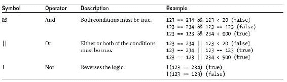

# 二、数据和决策

数据和决策是每个*智能*程序的基础。我们将从 JavaScript 如何理解或表示数据开始这一章。这一点很重要，因为 JavaScript 支持多种数据类型*和*，并根据数据类型操作数据。不同类型的数据不匹配可能会产生意外的结果。我们将研究一些更常见的数据类型问题，您将看到如何将一种数据类型转换为另一种数据类型。

我们还将使用*条件语句*和*循环*:两种最有价值的决策工具。用计算机语言做决策，你需要让程序知道在响应某些条件时应该发生什么，这就是条件语句的用武之地。另一方面，循环只是允许你重复一个动作，直到满足一个特定的条件。例如，您可能希望遍历表单中的每个输入框，并检查其中包含的信息是否有效。

在本章中，我将涉及 JavaScript 的许多不同方面:

*   JavaScript 中的信息分类和操作:数据类型和数据操作符
*   变量
*   转换数据类型
*   数据对象简介:字符串、日期和数学对象
*   数组:存储有序的数据集，比如购物篮中的商品
*   使用条件语句、循环和数据评估进行决策

 **注意**本章中的例子尽可能保持简单，因此使用 document.write()作为反馈机制，以便您查看结果。在后面的章节中，您将了解到其他更现代、更通用的方法。

数据、数据类型和数据运算符

数据是用来存储信息的，为了更有效地存储信息，JavaScript 需要为每条数据分配一个*类型*。这种类型规定了可以或不可以对数据做什么。例如，JavaScript 数据类型之一是*数字*，您可以使用它对它保存的数据执行某些计算。

JavaScript 中存储数据的三种最基本的数据类型是

*   **字符串**:一系列字符，例如“某些字符”
*   **数字**:数字，包括浮点数
*   **布尔型**:可以包含真值或假值

这些有时被称为 ***原语*** *数据类型* ，因为它们只存储单个值。还有两种稍微不同的原始数据类型。它们不存储信息，而是在特定情况下向您发出警告:

*   **Null** :表示即使一个变量已经被创建，它的当前值也是 Null 或者没有。
*   **未定义**:表示某事物未被定义并赋予值。当你处理变量时，这很重要。

在本章中，我们将广泛地使用这些数据类型。

字符串数据类型

JavaScript 解释器希望字符串数据 用单引号或双引号括起来(称为分隔符)。例如，下面的脚本将在页面上写入一些字符:

```js
<html>
<body>
<script type="text/javascript">
      document.write("some characters");
</script>
</body>
</html>
```

引号不会写入页面，因为它们不是字符串的一部分；它们只是告诉 JavaScript 字符串在哪里开始和结束。你可以很容易地使用单引号:

```js
<html>
<body>
<script type='text/javascript'>
      document.write('some characters');
</script>
</body>
</html>
```

这两种方法都可以，只要你以打开字符串的方式关闭字符串，并且不要试图像这样分隔它:

```js
document.write('some characters");
document.write("some characters');
```

当然，您可能希望在字符串本身中使用单引号或双引号，在这种情况下，您需要使用不同的分隔符。如果使用双引号，说明将被解释为您想要的含义:

```js
document.write("Paul' s characters");
```

但是如果你用单引号，它们就不会是:

```js
document.write('Paul' s characters');
```

这会给你一个语法错误，因为 JavaScript 解释器认为字符串在*保罗*中的 *l* 之后结束，并且不理解后面发生了什么。

 **注意** JavaScript 语法和英语语法一样，是一套让语言变得易懂的规则。正如英语中的语法错误会使句子变得毫无意义一样，JavaScript 中的语法错误也会使指令变得毫无意义。

通过使用单引号来分隔任何包含双引号的字符串，可以避免产生如下 JavaScript 语法错误，反之亦然:

```js
document.write("Paul' s numbers are 123");
document.write('some "characters"');
```

另一方面，如果你想在字符串中同时使用单引号和双引号，你需要使用一个叫做*转义序列*的东西。事实上，更好的编码实践是使用转义序列，而不是我们到目前为止一直使用的引号，因为它们使你的代码更容易阅读。

转义序列

转义序列 在您想要使用无法通过键盘输入的字符的情况下也很有用(比如在西方键盘上代表日元的符号)。表 2-1 列出了一些最常用的转义序列。

表 2-1。常见转义序列

| 转义序列 | 代表的字符 |
| --- | --- |
| \b | 退格。 |
| \f | 换页。 |
| \n | 换行。 |
| \r | 回车。 |
| \t | 选项卡。 |
| \' | 单引号。 |
| \" | 双引号。 |
| \\ | 反斜杠。 |
| \xNN | *NN* 是一个十六进制数，标识 Latin-1 字符集中的一个字符。(拉丁语-1 字符是英语国家的标准。) |
| \ uDDDD | *DDDD* 是标识 Unicode 字符的十六进制数。 |

让我们修改以下导致语法错误的字符串

```js
document.write( 'Paul' s characters' );
```

以便它使用转义序列(\ ')并被正确解释:

```js
document.write( 'Paul\' s characters' );
```

转义序列告诉 JavaScript 解释器单引号属于字符串本身，不是分隔符。

ASCII 是一种字符编码方法，使用从 0 到 254 的值。或者，您可以使用十六进制的 ASCII 值和\xNN 转义序列来指定字符。字母 *C* 在十进制中是 67，在十六进制中是 43，因此您可以使用转义序列将其写入页面，如下所示:

```js
document.write( "\x43" );
```

\ uDDDD 转义序列的工作方式非常相似，但是使用 Unicode 字符编码方法，该方法有 65，535 个字符。因为前几百个 ASCII 和 Unicode 字符集是相似的，所以您可以使用如下转义序列来编写字母 *C* :

```js
document.write( '\u0043' );
```

ASCII 和 Unicode 信息可以变得非常详细，所以寻找信息的最好地方是在网上。对于 Unicode，尝试一下[`www.unicode.org`](http://www.unicode.org)。

操作员

JavaScript 有许多操作符，可以用来操作程序中的数据；你可能会从数学课上认出他们。 表 2-2 给出了一些最常用的运算符。

表 2-2。 JavaScript 运算符

| 操作员 | 它的作用 |
| --- | --- |
| + | 将两个数字相加或连接两个字符串。 |
| - | 从第一个数字中减去第二个数字。 |
| * | 将两个数相乘。 |
| / | 将第一个数字除以第二个数字。 |
| % | 寻找模数(除法的余数)，例如 98 % 10 = 8。 |
| - | 将数字减 1；只对变量有用，稍后你会在工作中看到。 |
| ++ | 将数字增加 1；只对变量有用，稍后你会在工作中看到。 |

以下是它们的使用情况:

```js
<html>
<body>
<script type="text/javascript">
      document.write( 1 - 1 );
      document.write("<br>" );
      document.write( 1 + 1 );
      document.write("<br>" );
      document.write( 2 * 2 );
      document.write( "<br>" );
      document.write( 12 / 2 );
      document.write("<br>" );
      document.write( 1 + 2 * 3 );
      document.write("<br>" );
      document.write( 98 % 10 );
</script>
</body>
</html>
```

您应该得到以下输出:

```js
0
2
4
6
7
8
```

JavaScript 就像数学一样，赋予一些运算符优先级。乘法的优先级高于加法，所以计算 1 + 2 * 3 是这样进行的:

*   2 * 3 = 6
*   6 + 1 = 7

所有运算符都有优先顺序。乘法、除法和模数具有相同的优先级，因此当它们都出现在一个等式中时，求和是从左到右计算的。尝试以下计算:

*   2 * 10 / 5%3

结果是 1，因为计算只是从左向右读取:

*   2 * 10 = 20
*   20 / 5 = 4
*   4%3 = 1

加法和减法也有同样的优先权。

您可以使用括号赋予部分计算更高的优先级。例如，您可以将 1 加 1，然后乘以 5，如下所示:

*   (1 + 1) * 5

结果将是 10，但如果没有括号，结果将是 6。事实上，即使括号不是必需的，也应该使用括号，因为它们有助于使执行顺序清晰。

如果使用多组括号，JavaScript 简单地从左到右工作，或者，如果有内括号，从内向外工作:

```js
document.write( ( 1 + 1 ) * 5 * ( 2 + 3 ) );
```

前面公式的计算是这样进行的:

*   (1 + 1) = 2
*   (2 + 3) = 5
*   2 * 5 = 10
*   10 * 5 = 50

如您所见，JavaScript 的加法运算符将值相加。它对这两个值的实际处理取决于您使用的数据类型。例如，如果您正在处理两个存储为数字数据类型的数字，则+运算符会将它们相加。但是，如果您正在处理的数据类型之一是字符串(如分隔符所示)，这两个值将被连接起来。试试这个:

```js
<html>
<body>
<script type="text/javascript">
      document.write( 'Java' + 'Script' );
      document.write( 1 + 1 );
      document.write( 1 + '1' );
</script>
</body>
</html>
```

能够对字符串使用加法运算符可能会很方便(在本例中称为*串联*运算符)，但是如果您正在处理的某个值恰好与您期望的数据类型不同，也会产生意外的结果。稍后，我们会看到一些类似的例子，并解决它们。

如果您像目前为止所做的那样处理*文字*值，问题就小多了。然而，您将在程序中使用的大部分数据将由用户输入或由脚本生成，因此您无法提前确切知道您将使用哪些值。这就是*变量*发挥作用的地方。变量是脚本中数据的占位符，是 JavaScript 的核心。

JavaScript 变量

谈到变量，JavaScript 可能是最宽容的语言。在使用变量之前，你不需要定义变量是什么，你可以在脚本中随时改变变量的类型。然而，如果你的代码运行在*严格模式*下，隐式创建变量(没有先定义)是行不通的。有关这方面的更多信息，Mozilla 开发者网络有关于严格模式有何不同的完整描述，位于:[`Developer . Mozilla . org/en-US/docs/JavaScript/Reference/Functions _ and _ function _ scope/Strict _ Mode`](https://developer.mozilla.org/en-US/docs/JavaScript/Reference/Functions_and_function_scope/Strict_mode)。

通过给变量一个唯一的名称并使用 var 关键字来声明变量。变量名必须以字母表中的一个字母或下划线开头，而名称的其余部分只能由数字、字母、美元符号($)和下划线字符组成。不要使用任何其他字符。

 **注意**像 JavaScript 中的大多数东西一样，变量名是区分大小写的——例如，thisVariable 和 ThisVariable 是不同的变量。命名变量时要非常小心；如果你不能始终如一地说出他们的名字，你会遇到各种各样的麻烦。为此，大多数程序员使用*骆驼符号*，其中变量名以小写字母开头，而后面的单词是大写的，并且没有空格。因此，这个变量的名字。

总是给你的变量取一个有意义的名字。在下一个例子中，我们将构建，我们将编写一个汇率转换程序，所以我们将使用像 euroToDollarRate 和 dollarToPound 这样的变量名。描述性地命名变量有两个好处:如果你以后再来看，更容易记住代码在做什么，对于新接触代码的人来说，更容易看到发生了什么。代码可读性和布局对网页的开发非常重要。它可以更快更容易地发现错误并调试它们，并根据需要修改代码。

 **注意**虽然技术上没有必要，但是变量声明应该以关键字 var 开头。不使用它可能会有影响，你会看到你的进步。

说了这么多，让我们开始声明变量。您可以声明一个变量而不初始化它(给它一个值):

```js
var myVariable;
```

然后它就准备好了，等着你有值的时候。这对于保存用户输入的变量很有用。

您也可以同时声明和初始化变量:

```js
var myVariable = "A String";
var anotherVariable = 123;
```

或者，您可以通过将 prompt()函数的返回值或计算的和赋给变量来声明和初始化变量:

```js
var eurosToConvert = prompt("How many Euros do you wish toconvert", "");
var dollars = eurosToConvert * euroToDollarRate;
```

prompt()函数是一个 JavaScript 函数，它要求用户输入一个值，然后将其返回给代码。这里，您将输入的值赋给变量 eurosToConvert。

初始化您的变量是一个非常好的主意，特别是如果您可以给它们一个对应用有用的默认值。甚至将变量初始化为空字符串也是一个好主意，因为您可以检查它，而不会出现错误消息，如果它没有值的话，就会弹出错误消息。

让我们看看变量是如何提高代码的可读性和功能性的。下面是一段没有任何变量的代码:

```js
<html>
<body>
<script type="text/javascript">
      document.write( 0.872 * prompt( "How many Euros do you wish to convert", "" ) );
</script>
</body>
</html>
```

这段代码是否将欧元转换成美元并不明显，因为没有什么可以告诉你 0.872 就是汇率。尽管代码运行良好；如果您用数字 10 进行试验，您应该会得到以下结果:

```js
8.72
```

在这个例子中，我们使用 window 对象的 prompt()方法来获取用户反馈。(在这种情况下，窗口是可选的；为了使代码更短，可以省略它。)这个方法有两个参数:一个显示在输入字段上方的标签和该字段的初始值。你将在第四章中了解更多关于 prompt()以及如何使用它。假设您想让结果更具信息性，如下所示:

```js
10 Euros is 8.72 Dollars
```

如果没有变量，唯一的方法就是让用户输入两次他们想要兑换的欧元金额，这真的对用户不友好。但是，使用变量，您可以临时存储数据，然后根据需要多次调用它:

```js
<html>
<body>
<script type="text/javascript">
      // Declare a variable holding the conversion rate
      var euroToDollarRate = 0.872;
      // Declare a new variable and use it to store the
      // number of euros
      var eurosToConvert = prompt( "How many Euros do you wish to convert", "" );
      // Declare a variable to hold the result of the euros
      // multiplied by the conversion
      var dollars = eurosToConvert * euroToDollarRate;
      // Write the result to the page
      document.write( eurosToConvert + " euros is " + dollars + " dollars" );
</script>
</body>
</html>
```

您已经使用了三个变量:一个存储从欧元到美元的汇率，另一个存储将要转换的欧元数，最后一个保存转换成美元的结果。然后你需要做的就是用两个变量写出结果。这个脚本不仅功能更强大，而且更容易阅读。

转换不同类型的数据

在很大程度上，JavaScript 解释器可以计算出您希望使用什么数据类型。例如，在下面的代码中，解释器将数字 1 和 2 理解为数字数据类型，并相应地处理它们:

```js
<html>
<body>
<script type="text/javascript">
      var myCalc = 1 + 2;
      document.write( "The calculated number is " + myCalc );
</script>
</body>
</html>
```

这将被写入您的页面:

```js
The calculated number is 3
```

但是，如果您重写代码，允许用户使用 prompt()函数输入自己的数字，您将得到完全不同的计算结果:

```js
<html>
<body>
<script type="text/javascript">
      var userEnteredNumber = prompt( "Please enter a number","" );
      var myCalc = 1 + userEnteredNumber;
      var myResponse = "The number you entered + 1 = " + myCalc;
      document.write( myResponse );
</script>
</body>
</html>
```

如果你在提示符下输入 2，你会被告知

```js
The number you entered + 1 = 12
```

JavaScript 解释器没有将两个数相加，而是将它们连接起来。这是因为 prompt()函数实际上将用户输入的值作为字符串数据类型返回，即使该字符串包含数字字符。这一行发生串联:

```js
var myCalc = 1 + userEnteredNumber;
```

实际上，这和你写的一样

```js
var myCalc = 1 + "2";
```

但是，如果使用减法运算符，如下所示:

```js
var myCalc = 1 - userEnteredNumber;
```

从 1 中减去 userEnteredNumber。减法运算符不适用于字符串数据，因此 JavaScript 得出结论，您希望将数据视为数字，将字符串转换为数字，然后进行计算。这同样适用于*和/运算符。typeof()运算符返回传递给它的数据类型，因此您可以使用它来查看 JavaScript 解释器正在处理哪些数据类型:

```js
<html>
<body>
<script type="text/javascript">
      var userEnteredNumber = prompt( "Please enter a number","" );
      document.write( typeof( userEnteredNumber ) );
</script>
</body>
</html>
```

这将把字符串写入页面。确保解释器使用期望的数字数据类型的方法是 ***显式地*** 声明该数据是一个数字。您可以使用三个函数来完成此操作:

*   Number(): 尝试将括号内的变量值转换成数字。
*   parseFloat(): 尝试将值转换为浮点。它从左到右逐个字符地解析字符串，直到遇到不能在数字中使用的字符。然后，它在该点停止，并将该字符串计算为一个数字。如果第一个字符不能用在数字中，结果就是 NaN(它代表*而不是数字*)。
*   parseInt(): 通过删除任何小数部分而不向上或向下舍入数字，将值转换为整数。传递给该函数的任何非数值内容都将被丢弃。如果第一个字符不是+、–或数字，则结果为 NaN。

让我们看看这些函数在实践中是如何工作的:

```js
<html>
<body>
<script type="text/javascript">
      var userEnteredNumber = prompt( "Please enter a number", "" );
      document.write( typeof( userEnteredNumber ) );
      document.write( "<br>" );
      document.write( parseFloat( userEnteredNumber ) );
      document.write( "<br>" );
      document.write( parseInt( userEnteredNumber ) );
      userEnteredNumber = Number( userEnteredNumber )
      document.write( "<br>" );
      document.write( userEnteredNumber );
      document.write( "<br>" );
      document.write( typeof( userEnteredNumber ) );
</script>
</body>
</html>
```

尝试输入值 23.50。您应该得到以下输出:

```js
string
23.5
23
23.5
number
```

输入的数据在第一行作为字符串读取。然后 parseFloat()将 23.50 从字符串转换为浮点数，在下一行中，parseInt()去掉小数部分(不向上或向下舍入)。然后，使用 number()函数将变量转换为数字，并存储在 userEnteredNumber 变量本身中(覆盖保存在那里的字符串)。在最后一行，您会看到 userEnteredNumber 的数据类型确实是 Number。

尝试在用户提示符下输入 23.50abc:

```js
string
23.5
23
NaN
number
```

结果差不多，但是这次 Number()返回了 NaN。parseFloat()和 parseInt()函数仍然返回一个数字，因为它们从左向右工作，尽可能将字符串转换为数字，然后在遇到非数字值时停止。Number()函数拒绝任何包含非数字字符的字符串。(允许使用数字、有效的小数位以及+和–符号，但不允许使用其他符号。)

如果你尝试输入 abc，你只会得到

```js
string
NaN
NaN
NaN
number
```

没有一个函数能找到有效的数字，所以它们都返回 NaN，您可以看到它是一个数字数据类型，但不是一个有效的数字。这是检查用户输入有效性的好方法，稍后您将使用它来完成这一任务。

所以让我们回到我们开始的问题:使用 prompt()检索一个数字。您只需要告诉解释器，用户输入的数据应该转换为数字数据类型，使用 prompt()函数讨论的函数之一:

```js
<html>
<body>
<script type="text/javascript">
      var userEnteredNumber = Number( prompt( "Please entera number", "" ) );
      var myCalc = 1 + userEnteredNumber;
      var myResponse = "The number you entered + 1 = " + myCalc;
      document.write( myResponse );
</script>
</body>
</html>
```

这不会抛出任何错误，但对访问者没有太大帮助，因为 *NaN* 的意思不是常识。稍后，您将处理各种条件，并且您将看到如何防止对不熟悉 JavaScript 的用户来说没有多大意义的输出。

这就是你现在需要知道的关于原始数据类型和变量的全部内容。如您所见，原始数据类型只是保存一个值。然而，JavaScript 也可以处理复杂数据，它使用*复合*数据类型来处理。

复合数据类型:数组和对象

复合数据类型不同于简单数据类型，因为它们可以保存多个值。有两种复合数据类型:

*   **对象**:包含对任何对象的引用，包括浏览器提供的对象
*   **数组**:包含一个或多个其他数据类型

我们将首先看一下对象数据类型。您可能还记得第一章的讨论，对象模拟现实世界的实体。这些对象可以保存数据，并为您提供属性和方法。

JavaScript 为您提供的对象:字符串、日期和数学

这不是一个完整的内置对象列表，但是你可以通过下面的例子来感受一下对象是如何工作的

*   String 对象:存储字符串，并提供处理字符串的属性和方法
*   Date 对象:存储一个日期，并提供处理它的方法
*   Math 对象:不存储数据，但是提供了操作数学数据的属性和方法

让我们从字符串对象开始。

字符串对象

在前面，您通过给它们一些字符来创建字符串原语，如下所示:

```js
var myPrimitiveString = "ABC123";
```

String ***object*** 做的事情略有不同，不仅允许您存储字符，还提供了一种操作和更改这些字符的方法。您可以显式或隐式创建 String 对象。

创建字符串对象

让我们首先使用隐式方法:我们首先声明一个新变量，并为它分配一个新的 string 原语来初始化它。现在尝试使用 typeof()确保变量 myStringPrimitive 中的数据是一个字符串原语:

```js
<html>
<body>
<script type="text/javascript">
      var myStringPrimitive= "abc";
      document.write( typeof( myStringPrimitive ) );
</script>
</body>
</html>
```

但是，您仍然可以对它使用 String 对象的方法。JavaScript 将简单地将 string 原语转换为临时 string 对象，对其使用方法，然后将数据类型改回 String。您可以使用字符串对象的长度属性*来尝试一下:*

```js
<html>
<body>
<script type="text/javascript">
      var myStringPrimitive= "abc";
      document.write( typeof( myStringPrimitive ) );
      document.write( "<br>" );
      document.write( myStringPrimitive.length );
      document.write( "<br>" );
      document.write( typeof( myStringPrimitive ) );
</script>
</body>
</html>
```

这是您应该在浏览器窗口中看到的内容:

```js
string
3
String
```

所以在临时转换之后，myStringPrimitive 仍然保存着一个 string 原语。还可以使用 new 关键字和 String() ***构造函数*** 显式创建 String 对象:

```js
<html>
<body>
<script type="text/javascript">
      var myStringObject = new String( "abc" );
      document.write( typeof( myStringObject ) );
      document.write( "<br>" );
      document.write( myStringObject.length );
      document.write( "<br>" );
      document.write( typeof( myStringObject ) );
</script>
</body>
</html>
```

加载此页面会显示以下内容:

```js
object
3
object
```

这个脚本与前一个脚本的唯一区别在于第一行，在这里您创建了一个新的对象，并为 String 对象提供了一些要存储的字符:

```js
var myStringObject = new String( "abc" );
```

无论是隐式还是显式创建 String 对象，检查 length 属性的结果都是一样的。显式或隐式创建 String 对象之间唯一的真正区别是，如果您要一次又一次地使用同一个 String 对象，那么显式创建它们会稍微高效一些。显式创建 String 对象也有助于防止 JavaScript 解释器混淆数字和字符串，因为它可能会混淆数字和字符串。

使用字符串对象的方法

String 对象有很多方法，所以这里我只讨论其中的两个，indexOf()和 substring()方法。

如您所见，JavaScript 字符串是由字符组成的。每个字符都有一个索引。索引从零开始，因此第一个字符的位置的索引为 0，第二个字符的索引为 1，依此类推。indexOf()方法在索引中查找并返回子字符串开始的位置(lastIndexOf()方法返回子字符串最后一次出现的位置)。例如，如果您希望您的用户输入一个电子邮件地址，您可以检查她是否在条目中包含了@符号。(虽然这不能确保地址有效，但至少会朝着那个方向前进。在本书的后面，我们将处理更复杂的数据检查。)

接下来让我们这样做，使用 prompt()方法获取用户的电子邮件地址，然后检查@符号的输入，使用 index of()返回符号的索引:

```js
<html>
<body>
<script type="text/javascript">
      var userEmail= prompt("Please enter your emailaddress ", "" );
      document.write( userEmail.indexOf( "@" ) );
</script>
</body>
</html>
```

如果找不到@符号，则将–1 写入页面。只要字符在字符串中的某个位置，它在索引中的位置——换句话说，大于-1*，*的值将被返回。

substring()方法从另一个字符串中抽取一个字符串，将子字符串的起始和结束位置的索引作为参数。通过省略第二个参数，可以返回从第一个索引到字符串末尾的所有内容。

因此，要提取从第三个字符(索引 2)到第六个字符(索引 5)的所有字符，您应该编写

```js
<html>
<body>
<script type="text/javascript">
      var myOldString = "Hello World";
      var myNewString = myOldString.substring( 2, 5 );
      document.write( myNewString );
</script>
</body>
</html>
```

您应该看到 llo 被写到浏览器中。注意，substring()方法复制它返回的子字符串，并且不改变原始字符串。

当您处理未知值时，substring()方法真正发挥了作用。下面是另一个同时使用 indexOf()和 substring()方法的示例:

```js
<html>
<body>
<script type="text/javascript">
      var characterName = "my name is Simpson,  Homer";
      var firstNameIndex = characterName.indexOf( "Simpson," ) + 9;
      var firstName = characterName.substring( firstNameIndex );
      document.write( firstName );
</script>
</body>
</html>
```

您将从变量 characterName 的字符串中提取 Homer，使用 indexOf()查找姓氏的开头，并向其中添加 9 以获得名字的开头的索引(因为“Simpson”有 9 个字符长)，并将它存储在 firstNameIndex 中。substring()方法使用它来提取从名字开始的所有内容—您还没有指定最后的索引，所以将返回字符串中的其余字符。

现在让我们看看日期对象。这允许您存储日期，并提供一些有用的日期/时间相关功能。

**日期**对象

JavaScript 没有原始的日期数据类型，所以只能显式地创建日期对象。创建新的 Date 对象的方法与创建 String 对象的方法相同，使用 new 关键字和 Date()构造函数。这一行创建一个包含当前日期和时间的 Date 对象:

```js
var todaysDate = new Date();
```

要创建存储特定日期或时间的 Date 对象，只需将日期或日期和时间放在括号内:

```js
var newMillennium = new Date( "1 Jan 2000 10:24:00" );
```

不同的国家以不同的顺序描述日期。例如，在美国，日期用 *MM/DD/YY* 表示，而在欧洲，日期是 *DD/MM/YY* ，在中国是 *YY/MM/DD* 。如果使用缩写名称指定月份，则可以使用任何顺序:

```js
var someDate = new Date( "10 Jan 2013" );
var someDate = new Date( "Jan 10 2013" );
var someDate = new Date( "2013 10 Jan" );
```

事实上，日期对象可以接受许多参数:

```js
var someDate = new Date( aYear,  aMonth,  aDate,
```

```js
anHour,  aMinute,  aSecond, aMillisecond )
```

要使用这些参数，您首先需要指定年份和月份，然后使用您想要的参数——尽管您必须按顺序运行它们，并且不能从中进行选择。例如，您可以指定年、月、日和小时:

```js
var someDate = new Date( 2013,  9,  22,  17 );
```

但是，您不能指定年、月和小时:

```js
var someDate = new Date( 2013,  9,  ,  17 );
```

 **注意**虽然你通常认为 9 月是 9 月，但是 JavaScript 从 0(1 月)开始计算月份，所以 9 月被表示为 8 月。

使用日期对象

Date 对象有很多方法可以用来获取或设置日期或时间。您可以使用本地时间(您所在时区的电脑时间)或 UTC(协调世界时，曾被称为格林威治标准时间)。虽然这可能非常有用，但您需要注意的是，当您使用 Date 时，许多人没有正确设置他们的时区。

让我们看一个演示一些方法的例子:

```js
<html>
<body>
<script type="text/javascript">
      // Create a new date object
      var someDate = new Date( "31 Jan 2013 11:59" );
      // Retrieve the first four values using the
      // appropriate get methods
      document.write( "Minutes = " + someDate.getMinutes() + "<br>" );
      document.write( "Year = " + someDate.getFullYear() + "<br>" );
      document.write( "Month = " + someDate.getMonth() + "<br>" );
      document.write( "Date = " + someDate.getDate() + "<br>" );
      // Set the minutes to 34
      someDate.setMinutes( 34 );
      document.write( "Minutes = " + someDate.getMinutes() + "<br>" );
      // Reset the date
      someDate.setDate( 32 );
      document.write( "Date = " + someDate.getDate() + "<br>" );
      document.write( "Month = " + someDate.getMonth() + "<br>" );
</script>
</body>
</html>
```

以下是您应该获得的内容:

```js
Minutes = 59
Year = 2013
Month = 0
Date = 31
Minutes = 34
Date = 1
Month = 1
```

这行代码乍一看可能有点违反直觉:

```js
someDate.setDate( 32 );
```

JavaScript 知道一月没有 32 天，所以解释器没有试图将日期设置为 1 月 32 日，而是从 1 月 1 日开始计算 32 天，这样我们就得到了 2 月 1 日。

如果您需要在日期上添加天数，这可能是一个方便的功能。通常，如果您想给日期加上天数，您必须考虑不同月份的天数，以及是否是闰年，但是使用 JavaScript 对日期的理解要容易得多:

```js
<html>
<body>
<script type="text/javascript">
      // Ask the user to enter a date string
      var originalDate = prompt("Enter a date (Day, Name of the Month, Year"), "31 Dec 2013" );
      // Overwrite the originalDate variable with a new Date
      // object
      var originalDate = new Date( originalDate );
      // Ask the user to enter the number of days to be
      // added, and convert to number
      var addDays = Number( prompt( "Enter number of daysto be added", "1" ) )
      // Set a new value for originalDate of originalDate
      // plus the days to be added
      originalDate.setDate( originalDate.getDate( ) + addDays )
      // Write out the date held by the originalDate
      // object using the toString( ) method
      document.write( originalDate.toString( ) )
</script>
</body>
</html>
```

如果系统提示您输入 2013 年 12 月 31 日，并输入 1 表示要添加的天数，您将得到的答案是 2014 年 1 月 1 日星期四 00:00:00 UTC。

 **注意**注意你在脚本的第三行使用了数学对象的 Number()方法。如果你不这样做，程序仍然会运行，但结果不会一样。如果您不想使用该方法，有一个技巧可以转换不同的数据类型:如果您从一个可以使用 parseInt()、parseFloat()或 number()转换为数字的字符串中减去 0，则将其转换为数字，如果您将一个空字符串“”添加到一个数字中，则将其转换为字符串，这是您通常使用 toString()所做的事情。

在第四行，您将日期设置为当月的当天，这是 originalDate.getDate()返回的值加上要添加的天数；接下来是计算，最后一行使用 toString()方法将 date 对象中包含的日期输出为字符串。此外，toDateString()仅使用日期生成一个格式良好的字符串。如果使用 UTC 时间，您可以使用相同的 get 和 set 方法——您需要做的只是在方法名中添加 *UTC* 。所以 getHours()变成了 getUTCHours()，setMonth()变成了 setUTCMonth()，以此类推。还可以使用 getTimezoneOffset()方法返回计算机的本地时间和 UTC 时间之间的差值(以小时为单位)。(你必须依赖用户正确设置他们的时区，并了解不同国家之间夏令时的差异。)

 **注意**对于关键的日期操作，JavaScript 可能不是正确的技术，因为你不能相信客户端计算机被正确设置。但是，您可以通过服务器端语言填充 JavaScript 的初始日期，并从那里开始。

**数学**对象

Math 对象为您提供了许多数学功能，如求一个数的平方或产生一个随机数。Math 对象在两个方面不同于 Date 和 String 对象:

*   你不能显式地创建一个数学对象，你只能直接使用它。
*   与 String 和 Date 对象不同，Math 对象不存储数据。

使用以下格式调用 Math 对象的方法:

```js
Math.methodOfMathObject( aNumber ):
alert( "The value of pi is " + Math.PI );
```

接下来我们将看看一些常用的方法。(你可以在[`developer.mozilla.org/en-US/docs/Web_Development`](https://developer.mozilla.org/en-US/docs/Web_Development)搜索找到完整的参考资料。)我们将在这里看一下舍入数字和生成随机数的方法。

舍入数字

您在前面已经看到 parseInt()函数将通过删除小数点后的所有内容来使一个分数变成整数(因此 24.999 变成了 24)。通常，您会想要更精确的数学计算—例如，如果您正在进行财务计算—对于这些计算，您可以使用 Math 对象的三个舍入函数之一:round()、ceil()和 floor()。他们是这样工作的:

*   round():当小数为时，将数字向上舍入。5 或更高
*   ceil()(如 *ceiling* ):总是向上取整，所以 23.75 变成 24，23.25 也一样
*   floor():总是向下舍入，因此 23.75 变成 23，23.25 也是如此

下面是一个简单的例子:

```js
<html>
<body>
<script type="text/javascript">
      var numberToRound = prompt( "Please enter a number", "" )
      document.write( "round( ) = " + Math.round( numberToRound ) );
      document.write( "<br>" );
      document.write( "floor( ) = " + Math.floor( numberToRound ) );
```

```js
document.write( "<br>" );
      document.write( "ceil( ) = " + Math.ceil( numberToRound ) );
</script>
</body>
</html>
```

即使您使用 prompt()从用户那里获得一个值，正如您在前面看到的，它返回一个字符串，返回的数字仍然被视为一个数字。这是因为只要字符串包含可以转换为数字的内容，舍入方法就会为您进行转换。

如果输入 23.75，将得到以下结果:

```js
round() = 24
floor() = 23
ceil() = 24
```

如果你输入–23.75，你会得到

```js
round() = -24
floor() = -24
ceil() = -23
```

生成一个随机数

您可以使用 Math 对象的 random()方法生成大于等于 0 但小于 1 的分数随机数。通常，您需要将数字相乘，然后使用一种舍入方法使其变得有用。

例如，要模拟掷骰子，您需要生成一个介于 1 和 6 之间的随机数。您可以通过将随机分数乘以 6，得到一个介于 0 和 6 之间的分数，然后使用 floor()方法将该数字向下舍入为一个整数。代码如下:

```js
<html>
<body>
<script type="text/javascript">
      var diceThrow = Math.floor( Math.random( ) * 6 ) + 1;
      document.write( "You threw a " + diceThrow );
</script>
</body>
</html>
```

数组

JavaScript 允许您使用一个*数组*来存储和访问相关数据。数组有点像一排盒子( ***元素*** )，每个盒子包含一项数据。数组可以处理 JavaScript 支持的任何数据类型。例如，您可以使用数组来处理用户将从中选择的项目列表，或者一组图形坐标，或者引用一组图像。

数组对象，如字符串和日期对象，是使用 new 关键字和构造函数创建的。您可以在创建数组对象时对其进行初始化:

```js
var preInitArray = new Array( "First item", "Second item", "Third Item" );
```

或者您可以将其设置为保存一定数量的项目:

```js
var preDeterminedSizeArray = new Array( 3 );
```

或者您可以创建一个空数组:

```js
var anArray = new Array();
```

通过给元素赋值，可以向数组中添加新项:

```js
anArray[0] = "anItem";
anArray[1] = "anotherItem"
anArray[2] = "andAnother"
```

 **注意**你不必使用 array()构造函数；相反，使用快捷符号是完全有效的。

```js
var myArray = [1, 2, 3];
var yourArray = ["red", "blue", "green"];
```

一旦填充了数组，就可以使用方括号通过元素的索引或位置(同样是从零开始的)来访问它的元素:

```js
<html>
<body>
<script type="text/javascript">
      var preInitArray = new Array( "First Item" "Second Item", "Third Item" );
      document.write( preInitArray[0] + "<br>" );
      document.write( preInitArray[1] + "<br>" );
      document.write( preInitArray[2] + "<br>" );
</script>
</body>
</html>
```

如果你想在数组中循环，使用索引号来存储条目是很有用的——我们接下来将讨论循环。

您可以通过使用关键字并给它们赋值来创建关联的数组(在其他语言中称为*散列*，如下所示:

```js
<html>
<body>
<script type="text/javascript">
      // Creating an array object and setting index
      // position 0 to equal the string Fruit
      var anArray = new Array( );
      anArray[0] = "Fruit";
      // Setting the index using the keyword
      // 'CostOfApple' as the index.
      anArray["CostOfApple"] = 0.75;
      document.write( anArray[0] + "<br>" );
      document.write( anArray["CostOfApple"] );
</script>
</body>
</html>
```

关键字适用于为数据提供有用标签的情况，或者存储仅在上下文中有意义的条目的情况，如图表坐标列表。但是，如果条目是使用关键字设置的，就不能使用索引号来访问它们(在其他一些语言中可以，比如 PHP)。您也可以为索引使用变量。您可以使用变量(一个保存字符串，另一个保存数字)代替文字值来重写前面的示例:

```js
<html>
<body>
<script type="text/javascript">
      var anArray = new Array( );
      var itemIndex = 0;
      var itemKeyword = "CostOfApple";
      anArray[itemIndex] = "Fruit";
      anArray[itemKeyword] = 0.75;
      document.write( anArray[itemIndex] + "<br>" );
      document.write( anArray[itemKeyword] );
</script>
</body>
</html>
```

让我们把我们讨论过的数组和数学对象放入一个例子中。我们将编写一个脚本，随机选择一个横幅显示在页面顶部。

我们将使用一个数组对象来保存一些图像源名称，如下所示:

```js
var bannerImages = new Array();
bannerImages[0] = "Banner1.jpg";
bannerImages[1] = "Banner2.jpg";
bannerImages[2] = "Banner3.jpg";
bannerImages[3] = "Banner4.jpg";
bannerImages[4] = "Banner5.jpg";
bannerImages[5] = "Banner6.jpg";
bannerImages[6] = "Banner7.jpg";
```

然后，您需要七个具有相应名称的图像，与 HTML 页面放在同一个文件夹中。你可以用你自己的或者从 http://www.beginningjavascript.com 下载我的。

接下来，您将初始化一个新变量 randomImageIndex，并使用它来生成一个随机数。您将使用与前面生成随机掷骰子相同的方法，但不在结果上加 1，因为您需要一个从 0 到 6 的随机数:

```js
var randomImageIndex = Math.round( Math.random( ) * 6 );
```

然后，您将使用 document.write()将随机选择的图像写入页面。以下是完整的脚本:

```js
<html>
<body>
<script type="text/javascript">
      var bannerImages = new Array( );
      bannerImages[0] = "Banner1.jpg";
      bannerImages[1] = "Banner2.jpg";
      bannerImages[2] = "Banner3.jpg";
      bannerImages[3] = "Banner4.jpg";
      bannerImages[4] = "Banner5.jpg";
      bannerImages[5] = "Banner6.jpg";
      bannerImages[6] = "Banner7.jpg";
      var randomImageIndex = Math.round( Math.random( ) * 6 );
      document.write( "" );
</script>
</body>
</html>
```

这就是全部了。与每次用户访问页面时都显示相同的横幅相比，更改横幅会让访问者更容易注意到它，当然，这会给人一种站点经常更新的印象。

数组对象的方法和属性

Array 对象最常用的属性之一是 length 属性，,它返回比数组中最后一个数组项的索引高一个计数的索引。例如，如果您正在处理一个包含索引为 0、1、2、3 的元素的数组，那么长度将为 4，这对于了解您是否想要添加另一个元素非常有用。

Array 对象提供了许多操作数组的方法，包括从数组中剪切许多项或将两个数组连接在一起的方法。接下来，我们将看看连接、切片和排序的方法。

切割数组的一部分

slice()方法对于数组对象就像 substring()方法对于字符串对象一样。您只需告诉该方法您想要对哪些元素进行切片。这很有用，例如，如果您想要分割使用 URL 传递的信息。

slice()方法接受两个参数:切片的第一个元素的索引(将包含在切片中)和最后一个元素的索引(不会包含在切片中)。要从总共包含五个值的数组中访问第二、第三和第四个值，可以使用索引 1 和 4:

```js
<html>
<body>
<script type="text/javascript">
      // Create and initialize the array
      var fullArray = new Array( "One", "Two", "Three","Four", "Five" );
      // Slice from element 1 to element 4 and store
      // in new variable sliceOfArray
      var sliceOfArray = fullArray.slice( 1, 4 );
      // Write out new ( zero-based ) array of 3 elements
      document.write( sliceOfArray[0] + "<br>" );
      document.write( sliceOfArray[1] + "<br>" );
      document.write( sliceOfArray[2] + "<br>" );
</script>
</body>
</html>
```

新数组将数字存储在一个新的从零开始的数组中，因此对索引 0、1 和 2 进行切片得到如下结果:

```js
Two
Three
Four
```

原始数组不受影响，但是如果需要，可以通过将变量中的 array 对象设置为 slice()方法的结果来覆盖它:

```js
fullArray = fullArray.slice( 1, 4 );
```

连接两个数组

数组对象的 concat()方法允许你连接数组。您可以使用此方法添加两个或更多数组，每个新数组都从上一个数组结束的位置开始。这里你加入了三个数组:arrayOne、arrayTwo 和 arrayThree:

```js
<html>
<body>
<script type="text/javascript">
      var arrayOne = new Array( "One", "Two", "Three","Four", "Five" );
      var arrayTwo = new Array( "ABC", "DEF", "GHI" );
      var arrayThree = new Array( "John", "Paul", "George","Ringo" );
      var joinedArray = arrayOne.concat( arrayTwo, arrayThree );
      document.write( "joinedArray has " + joinedArray.length + " elements<br>" );
      document.write( joinedArray[0] + "<br>" )
      document.write( joinedArray[11] + "<br>" )
</script>
</body>
</html>
```

新数组 joinedArray 有 12 项。此数组中的项目与它们在以前每个数组中的项目相同；它们只是简单地连接在一起。原始数组保持不变。

将数组转换为字符串，然后再转换回来

当您想遍历数组或选择某些元素时，将数据放在数组中会很方便。但是，当您需要将数据发送到其他地方时，您可能应该将该数据转换为字符串。可以通过遍历数组并将每个元素值添加到一个字符串中来实现。然而，并不需要这样做，因为数组对象有一个名为 join()的方法可以为您完成这项工作。该方法将字符串作为参数。该字符串将被添加到每个元素之间。

```js
<script type="text/javascript">
  var arrayThree = new Array( "John", "Paul", "George","Ringo" );
  var lineUp=arrayThree.join( ',  ' );
  alert( lineUp );
</script>
```

结果字符串，阵容，具有值“约翰，保罗，乔治，林戈”。join()的反义词是 split()，这是一种将字符串转换为数组的方法。

```js
<script type="text/javascript">
  var lineUp="John,  Paul,  George,  Ringo";
  var members=lineUp.split( ',  ' );
  alert( members.length );
</script>
```

对数组排序

sort()方法允许你将数组中的条目按字母或数字顺序排序:

```js
<html>
<body>
<script type="text/javascript">
      var arrayToSort = new Array( "Cabbage", "Lemon","Apple", "Pear", "Banana" );
      arrayToSort.sort( );
      document.write(arrayToSort[0] + "<br>" );
      document.write(arrayToSort[1] + "<br>" );
      document.write(arrayToSort[2] + "<br>" );
      document.write(arrayToSort[3] + "<br>" );
      document.write(arrayToSort[4] + "<br>" );
</script>
</body>
</html>
```

项目排列如下:

```js
Apple
Banana
Cabbage
Lemon
Pear
```

然而，如果你降低其中一个字母的大小写，例如,*苹果*的 *A* ,那么你会得到一个非常不同的结果。排序是严格数学化的——根据 ASCII 集中字符的数量，而不是像人类那样对单词进行排序。

如果要更改排序元素的显示顺序，可以使用 reverse()方法将字母表中的最后一个元素显示为第一个元素:

```js
<script type="text/javascript">
  var arrayToSort = new Array( "Cabbage", "Lemon", "Apple", "Pear", "Banana" );
   arrayToSort.sort( );
sortedArray.reverse( );
  document.write(sortedArray[0] + "<br>" );
  document.write(sortedArray[1] + "<br>" );
  document.write(sortedArray[2] + "<br>" );
  document.write(sortedArray[3] + "<br>" );
  document.write(sortedArray[4] + "<br>" );
</script>
```

现在，结果列表的顺序相反:

```js
Pear
Lemon
Cabbage
Banana
Apple
```

用 JavaScript 做决策

决策赋予程序明显的智能。没有它你就写不出一个好的程序，无论你是在创建一个游戏，检查一个密码，给用户一组基于他之前所做决定的选择，还是其他什么。

决策是基于条件语句的，条件语句就是评估为真或假的简单语句。这就是原始布尔数据类型有用的地方。循环是决策制定的另一个重要工具，例如，它使您能够遍历用户输入或数组，并相应地做出决策。

逻辑和比较运算符

我们将了解两组主要的运算符:

*   **数据比较运算符:**比较操作数并返回布尔值
*   **逻辑运算符:**测试多个条件

我们将从比较运算符开始。

比较数据

表 2-3 列出了一些更常用的比较运算符。

表 2-3。JavaScript 中的比较

| 操作员 | 描述 | 例子 |
| --- | --- | --- |
| == | 检查左右操作数是否相等 | 123 == 234 返回 false.123 = = 123 返回 true。 |
| === | 检查左右操作数是否相等，以及数据类型是否相等 | 123 ==="234 "返回 false.123 === 123 返回 true。 |
| ！= | 检查左操作数是否不等于右操作数 | 123 != 123 返回 false.123！= 234 返回 true。 |
| > | 检查左操作数是否大于右操作数 | 123 > 234 返回 false.234 > 123 返回 true。 |
| >= | 检查左操作数是否大于或等于右操作数 | 123 >= 234 返回 false.123 > = 123 返回 true。 |
| < | 检查左操作数是否小于右操作数 | 234 < 123 返回 false.123 < 234 返回 true。 |
| <= | 检查左操作数是否小于或等于右操作数 | 234 <= 123 返回 false.234 < = 234 返回 true。 |

 **注意**当心==等号运算符:在脚本中错误地使用赋值运算符=，很容易产生错误。

这些运算符都处理字符串类型数据和数值数据，并且区分大小写:

```js
<html>
<body>
<script type="text/javascript">
document.write("Apple" == "Apple" )
      document.write("<br>" );
      document.write("Apple"<"Banana" )
      document.write("<br>" );
      document.write("apple"<"Banana" )
</script>
</body>
</html>
```

这是你应该得到的回报:

```js
true
true
false
```

当对比较字符串的表达式求值时，JavaScript 解释器依次比较两个字符串中每个字符的 ASCII 码——每个字符串的第一个字符，然后是第二个字符，依此类推。大写的 *A* 在 ASCII 中用数字 65 表示， *B* 用 66 表示， *C* 用 67 表示，以此类推。为了评估表达式“Apple”<“Banana”，JavaScript 解释器通过用 ASCII 代码替换每个字符串中的第一个字符来测试比较:65 < 66，所以 *A* 先排序，比较为真。在测试表达式“apple”<“Banana”时，JavaScript 解释器也是这么做的；但小写字母 *a* 的 ASCII 码为 97，所以表达式“a”<“B”就简化为 97 < 66，为假。可以使用<、< =、>、> =运算符进行字母比较。如果需要确保所有字母大小写一致，可以使用 String 对象的 toUpperCase()和 toLowerCase()方法。比较运算符就像数值运算符一样，可以用于变量。如果你想按字母顺序比较苹果和香蕉，你可以这样做:

```js
<html>
<body>
<script type="text/javascript">
      var string1 = "apple";
      var string2 = "Banana";
      string1 = string1.toLowerCase( );
      string2 = string2.toLowerCase( );
      document.write( string1 < string2 )
</script>
</body>
</html>
```

不过，在使用等式运算符比较字符串对象时，还需要注意其他一些事情。试试这个:

```js
<html>
<body>
<script type="text/javascript">
      var string1 = new String( "Apple" );
      var string2 = new String( "Apple" );
      document.write( string1 == string2 )
</script>
</body>
</html>
```

你会得到错误的回报。事实上，我们在这里所做的是比较两个字符串对象而不是两个字符串原语的*字符*，正如返回的 false 所表明的，两个字符串对象不可能是同一个对象，即使它们持有相同的字符。

如果确实需要比较两个对象持有的字符串，可以使用 valueOf()方法来执行数据值的比较:

```js
<html>
<body>
<script type="text/javascript">
      var string1 = new String( "Apple" );
      var string2 = new String( "Apple" );
      document.write( string1.valueOf() == string2.valueOf() );
</script>
</body>
</html>
```

逻辑运算符

有时您需要将比较组合到一个条件组中。您可能希望检查用户提供的信息是否有意义，或者根据他们之前的回答限制他们可以做出的选择。你可以使用表 2-4 中所示的逻辑运算符来实现。

表 2-4 。JavaScript 中的逻辑运算符



一旦你评估了数据，你需要能够根据结果做出决定。这就是条件语句和循环有用的地方。你会发现我们在这一章中看到的操作符最常用于条件语句或循环的上下文中。

条件语句

如果...else 结构用于测试条件，如下所示:

```js
if ( condition ) {
// Execute code in here if condition is true
} else {
// Execute code in here if condition is false
}
// After if/else code execution resumes here
```

如果被测试的条件为真，If 后面的花括号中的代码将被执行，否则不会执行。如果满足 if *not* 中设定的条件，您还可以使用最终的 else 语句创建一个要执行的代码块。

让我们改进您在本章前面构建的货币兑换转换器，并创建一个循环来处理来自用户的非数字输入:

```js
<html>
<body>
<script type="text/javascript">
      var euroToDollarRate = 0.872;
      // Try to convert the input into a number
      var eurosToConvert = Number( prompt( "How many Euros do you wish to convert", "" ) );
      // If the user hasn't entered a number,  then NaN
      // will be returned
      if ( isNaN( eurosToConvert ) ) {
        // Ask the user to enter a value in numerals
        document.write( "Please enter the number in numerals" );
        // If NaN is not returned,  then we can use the input
      } else {
        // and do the conversion as before
        var dollars = eurosToConvert * euroToDollarRate;
        document.write( eurosToConvert + " euros is " + dollars + " dollars" );
      }
</script>
</body>
</html>
```

if 语句使用的是 isNaN()函数，如果变量 eurosToConvert 中的值不是数字，该函数将返回 true。

 **注意**记得尽可能礼貌和有帮助地保存错误消息。好的错误消息清楚地告诉用户对他们的期望，使得使用应用更加容易。

通过使用逻辑运算符和嵌套 if 语句，可以创建更复杂的条件:

```js
<html>
<body>
<script type="text/javascript">
      // Ask the user for a number and try to convert the
      // input into a number
      var userNumber = Number( prompt( "Enter a number between 1 and 10", "" ) );
        // If the value of userNumber is NaN,  ask the user
        // to try again
      if ( isNaN( userNumber ) ) {
        document.write( "Please ensure a valid number is entered" );
        // If the value is a number but over 10, ask the
        //user to try again
      } else {
        if ( userNumber > 10 || userNumber < 1 ) {
          document.write( "The number you entered is notbetween 1 and 10" );
        // Otherwise the number is between 1 and 10, so
        // write to the page
        } else {
          document.write( "The number you entered was " + userNumber );
        }
      }
</script>
</body>
</html>
```

你知道这个数字是可以的，只要它是一个数值并且小于 10。

 **注意**观察代码的布局。您缩进了 if 和 else 语句和代码块，以便于阅读和查看代码块的开始和结束位置。让你的代码尽可能清晰是很重要的。

试着在没有缩进或空格的情况下阅读这段代码:

```js
<html>
<body>
<script type="text/javascript">
// Ask for a number using the prompt() function and try to make it a number
var userNumber = Number(prompt("Enter a number between 1 and 10",""));
// If the value of userNumber is NaN, ask the user to try again
if (isNaN(userNumber)){
document.write("Please ensure a valid number is entered");
}
// If the value is a number but over 10, ask the user to try again
else {
if (userNumber > 10 || userNumber < 1) {
document.write("The number you entered is not between 1 and 10");
}
// Otherwise the number is between 1 and 10, so write to the screen
else{
document.write("The number you entered was " + userNumber);
}
}
</script>
</body>
</html>
```

不是不能读，但是即使在这个简短的脚本中，也很难破译哪些代码块属于 if 和 else 语句。在较长的代码中，不一致的缩进或不合逻辑的缩进会使代码非常难以阅读，这反过来会让您有更多的 bug 需要修复，并使您的工作变得不必要的困难。

您也可以使用 else if 语句，其中 else 语句以另一个 if 语句开始，如下所示:

```js
<html>
<body>
<script type="text/javascript">
      var userNumber = Number( prompt( "Enter a number between1 and 10", "" ) );
      if ( isNaN( userNumber ) ){
        document.write( "Please ensure a valid number isentered" );
      } else if ( userNumber > 10 || userNumber < 1 ) {
        document.write( "The number you entered is notbetween 1 and 10" );
      } else {
        document.write( "The number you entered was " +userNumber );
      }
</script>
</body>
</html>
```

该代码与前面的代码做了同样的事情，但是它使用了一个 else if 语句，而不是嵌套的 if 语句，并且比前面的代码短了两行。

分支或环的断裂

在我们继续之前，还有一件事:您可以使用 break 语句来中断条件语句或循环。这只是终止代码块的运行，并将处理过程转到下一条语句。我们将在下一个例子中使用它。

你可以有尽可能多的 if、else 和 else ifs，尽管如果你使用太多，它们会使你的代码变得非常复杂。如果在一段代码中有许多可能的条件来检查一个值，那么接下来您将看到的 switch 语句会很有帮助。

测试多个值:switch 语句

switch 语句允许您根据变量或表达式的值在代码段之间切换。这是 switch 语句的概要:

```js
switch( expression ) {
  case someValue:
  // Code to execute if expression == someValue;
  break; // End execution
  case someOtherValue:
  // Code to execute if expression == someOtherValue;
  break; // End execution
  case yesAnotherValue:
  // Code to execute if expression == yetAnotherValue;
  break; // End execution
  default:
  // Code to execute if no values matched
}
```

JavaScript 对 switch(表达式)求值，然后与每种情况进行比较。一旦找到匹配，代码就从该点开始执行，并继续执行所有 case 语句，直到找到断点。包含一个默认的 case 通常很有用，如果没有 case 语句匹配，这个 case 就会执行。这是发现错误的有用工具，例如，您希望出现匹配，但是一个 bug 阻止了它的出现。

例如，事例的值可以是任何数据类型、数字或字符串。您可以有一个箱子，也可以根据需要有多个箱子。让我们看一个简单的例子:

```js
<html>
<body>
<script type="text/javascript">
      // Store user entered number between 1 and 4 in userNumber
      var userNumber = Number( prompt( "Enter a number between 1 and 4", "" ) );
      switch( userNumber ) {
        // If userNumber is 1, write out and carry on
        // executing after case statement
        case 1:
          document.write( "Number 1" );
        break;
        case 2:
          document.write( "Number 2" );
        break;
        case 3:
          document.write( "Number 3" );
        break;
        case 4:
          document.write( "Number 4" );
        break;
        default:
          document.write( "Please enter a numeric value between 1 and 4." );
        break;
      }
      // Code continues executing here
</script>
</body>
</html>
```

试试看。你只需要把你输入的数字写出来，或者句子“请输入一个 1 到 4 之间的数值。”

这个例子也说明了 break 语句的重要性。如果在每个 case 后不包含 break，则执行将在块内继续，直到切换结束。尝试删除分隔符，然后输入 2。匹配之后的所有内容都将执行，并给出以下输出:

```js
Number 2Number 3Number 4Please enter a numeric value between 1 and 4
```

您可以在 switch 语句中使用任何有效的表达式，例如计算:

```js
switch( userNumber * 100 + someOtherVariable )
```

在 case 语句之间还可以有一个或多个语句。

重复的事情:循环

在这一节中，我们来看看如何在设定的条件为真的情况下重复一段代码。例如，您可能希望遍历 HTML 表单上的每个 input 元素或数组中的每个项。

重复设定的次数:循环的

 **for 循环旨在多次循环通过一个代码块，如下所示:

```js
for( initial-condition; loop-condition; alter-condition ) {
  //
  // Code to be repeatedly executed
  //
}
// After loop completes,  execution of code continues here
```

与条件语句一样，for 关键字后面跟有括号。这一次，括号包含由分号分隔的三个部分。

第一部分初始化一个变量，该变量将作为计数器来记录循环次数。第二部分测试条件。只要这个条件为真，循环就会一直运行。在每次循环之后，最后一部分或者递增或者递减在第一部分中创建的计数器。(正如您将看到的，它是 after 的事实是编程中的一个重要因素。)

例如，看看一个循环，只要 loopCounter 小于 10，它就会一直运行:

```js
for( loopCounter = 1; loopCounter <= 10; loopCounter++ )
```

只要循环条件的计算结果为真，循环就会一直执行，只要 loopCounter 小于或等于 10。一旦达到 11，循环就会停止，代码会在循环的右括号后的下一条语句处继续执行。

让我们看一个使用 for 循环遍历数组的例子。您将使用 for 循环来遍历名为 theBeatles 的数组，使用名为 loopCounter 的变量来保持循环运行，同时 loopCounter 的值小于数组的长度:

```js
<html>
<body>
<script type="text/javascript">
      var theBeatles = new Array( "John", "Paul", "George","Ringo" );
      for ( var loopCounter = 0; loopCounter < theBeatles.length; loopCounter++ ) {
        document.write( theBeatles[loopCounter] + "<br>" );
      }
</script>
</body>
</html>
```

此示例之所以有效，是因为您使用了一个从零开始的数组，其中的项已按顺序添加到索引中。如果您使用关键字在如下数组中存储项目，则循环不会运行:

```js
theBeatles["Drummer"] = "Ringo";
```

早些时候，当我讨论数组时，我说过数组对象有一个知道长度(有多少个元素)的属性。在遍历数组时，比如在前面的例子中，您使用数组名称后跟一个点和长度作为条件。这可以防止循环计数超过数组长度，否则会导致“越界”错误。

JavaScript 也支持 for..in loop(从 Netscape Navigator 2 开始就有了，尽管 Internet Explorer 从 IE5 开始才支持它)。的不使用计数器...in 循环使用变量访问数组，遍历数组中的每一项。让我们以这种方式创建一个数组，看看它是如何工作的:

```js
<html>
<body>
<script type="text/javascript">
      // Initialize theBeatles object and store in a variable
      var theBeatles = new Object( );
      // Set the values using keys rather than numbers
      theBeatles["Drummer"] = "Ringo";
      theBeatles["SingerRhythmGuitar"] = "John";
      theBeatles["SingerBassGuitar"] = "Paul";
      theBeatles["SingerLeadGuitar"] = "George";
      var indexKey;
      // Write out each indexKey and the value for that
      // indexKey from the array
      for ( indexKey in theBeatles ) {
        document.write( "indexKey is " + indexKey + "<br>" );
        document.write( "item value is " + theBeatles[indexKey] + "<br><br>" );
      }
</script>
</body>
</html>
```

在循环的每次迭代中，indexKey 中的项键的结果与使用该键从数组中提取的值一起写出，其顺序与该键在数组中出现的顺序相同:

```js
indexKey is Drummer
item value is Ringo

indexKey is SingerRhythmGuitar
item value is John

indexKey is SingerBassGuitar
item value is Paul

indexKey is SingerLeadGuitar
item value is George
```

根据决策重复动作:while 循环

到目前为止，您一直在处理的循环从脚本本身内部接受停止循环的指令。有时你可能会希望用户决定何时停止循环，或者当满足某个用户主导的条件时，你希望何时停止循环。一会儿做...而循环就是为这种情况设计的。

最简单的 while 循环如下所示:

```js
while ( some condition true ) {
  // Loop code
}
```

花括号中的条件可以是 if 语句中使用的任何条件。您可以使用类似这样的代码来允许用户输入数字，并通过键入数字 **99** 来停止输入过程。

```js
<html>
<body>
<script type="text/javascript">
      var userNumbers = new Array( );
      var userInput = 0;
      var arrayIndex = 0;
      var message = ""
      var total = 0;
      // Loop for as long as the user doesn't input 99
      while ( userInput != 99 ) {
        userInput = prompt( "Enter a number,  or 99 to exit", "99" );
        userNumbers[arrayIndex] = userInput;
        arrayIndex++;
      }
      message += 'You entered the following:\n';
      for ( var i = 0; i < arrayIndex-1; i++ ) {
        message += userNumbers[i] + '\n';
        total += Number( userNumbers[i] );
}
      message += 'Total: ' + total + '\n';
      alert( message );
</script>
</body>
</html>
```

这里 while 循环的条件是 userInput 不等于 99，所以只要条件为真，循环就会继续。当用户输入 99 并且条件被测试时，它将评估为假并且循环将结束。注意，当用户输入 99 时，循环不会立即结束，而是在循环的另一次迭代开始时再次测试条件。

while 循环和 do 循环之间有一个很小但很重要的区别...while:while 循环在执行代码之前测试条件，只有当条件为真时才执行代码块，而 do...while 循环在测试条件之前执行代码块，仅当条件为真时才进行另一次迭代。简而言之，do...当您知道希望循环代码在测试条件之前至少执行一次时，while loop 非常有用。你可以用 do 写前面的例子...while 像这样循环:

```js
<html>
<body>
<script type="text/javascript">
      var userNumbers = new Array( );
      var message = '';
      var total = 0;
      // Declare the userInput but don't initialize it
      var userInput;
      var arrayIndex = 0;
      do {
        userInput = prompt( "Enter a number,  or 99 to exit", "99" );
        userNumbers[arrayIndex] = userInput;
        arrayIndex++;
      } while ( userInput != 99 )
      message +='You entered the following:\n';
      for ( var i = 0; i < arrayIndex-1; i++ ) {
        message += userNumbers[i] + '\n';
        total += Number( userNumbers[i] );
}
      message += 'Total: ' + total + '\n';
      alert( message );
</script>
</body>
</html>
```

您不需要初始化 userInput，因为循环内部的代码在第一次测试它之前为它设置了一个值。

继续循环

正如您已经看到的，一旦某个事件发生，break 语句对于跳出任何类型的循环都非常有用。continue 关键字的作用类似于 break，因为它停止循环的执行。然而，continue 并没有退出循环，而是在下一次迭代中继续执行。

让我们首先修改前面的例子，这样如果用户输入的不是数字，就不会记录值，循环结束，使用 break:

```js
<html>
<body>
<script type="text/javascript">
      var userNumbers = new Array( );
      var userInput;
      var arrayIndex = 0;
      do {
        userInput = Number( prompt( "Enter a number, or 99 to exit", "99" ) );
        // Check that user input is a valid number,
        // and if not,  break with error msg
        if ( isNaN( userInput ) ) {
          document.write( "Invalid data entered: please enter a number between 0 and 99 in numerals" );
          break;
        }
        // If break has been activated,  code will continue from here
        userNumbers[arrayIndex] = userInput;
        arrayIndex++;
      } while ( userInput != 99 )
      // Next statement after loop
</script>
</body>
</html>
```

现在让我们再次修改它，这样您就不会中断循环，而是忽略用户的输入并继续循环，使用 continue 语句:

```js
<html>
<body>
<script type="text/javascript">
      var userNumbers = new Array( );
      var userInput;
      var arrayIndex = 0;
      do {
        userInput = prompt( "Enter a number, or 99 to exit", "99" );
        if ( isNaN( userInput ) ) {
          document.write( "Invalid data entered: please enter a number between 0 and 99 in numerals " );
          continue;
        }
        userNumbers[arrayIndex] = userInput;
        arrayIndex++;
      } while ( userInput != 99 )
      // Next statement after loop
</script>
</body>
</html>
```

break 语句已被 continue 替换，因此循环中将不再执行任何代码，并将再次计算 while 语句中的条件。如果条件为真，将发生循环的另一次迭代；否则，循环结束。

使用以下经验法则来决定使用哪种循环结构:

*   如果要将一个动作重复设定的次数，请使用 for 循环。
*   当您想要重复某个动作直到满足某个条件时，请使用 while 循环。
*   使用 do...如果希望保证操作至少执行一次，请使用 while 循环。

摘要

我们在这一章中涉及了很多内容:事实上，我们讨论了 JavaScript 语言的大部分基本要素。

您了解了 JavaScript 如何处理数据，并且看到了有许多数据类型:string、number、Boolean 和 object，以及一些特殊类型的数据，如 NaN、null 和 undefined。您已经看到 JavaScript 提供了许多对数据执行操作的操作符，比如数字计算或连接字符串。

然后我们看了 JavaScript 如何允许您使用变量存储值。变量在页面的生存期内有效，如果变量在用户创建的函数中并通过 var 关键字在本地声明，则在函数的生存期内有效。您还了解了如何将一种数据类型转换成另一种数据类型。

接下来，您使用了三个 JavaScript 内置对象:字符串、日期和数学对象。您看到了这些为操作字符串、日期和数字提供了有用的功能。我还向您展示了 Array 对象，它允许在单个变量中存储多项数据。

我们通过查看决策来结束这一章，决策提供了编程语言的逻辑或智能。您使用 if 和 switch 语句进行决策，使用条件测试数据的有效性，并根据结果采取行动。循环还使用条件，并允许您重复一定次数的代码块，或者当条件为真时。***