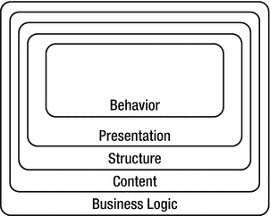

# 三、从 DHTML 到 DOM 脚本

在这一章中，你将学习什么是 DHTML，为什么它现在被认为是一种不好的方式，以及应该用什么样的现代技术和思想来代替。您将了解什么是功能以及如何使用它们。您还将了解变量和函数作用域，以及一些最新的最佳实践，这些实践将教会您的脚本如何很好地与他人合作。

如果你对 JavaScript 感兴趣，并且已经在网上搜索过脚本，你肯定会遇到术语*。DHTML 是 20 世纪 90 年代末和 21 世纪初 IT 和 web 开发行业的热门词汇之一。*

 * **注意** DHTML，或称动态 HTML，从来都不是一项真正的技术或万维网联盟(W3C)标准——它仅仅是营销和广告公司发明的一个术语。

DHTML 是与层叠样式表(CSS)和 web 文档(用 HTML 编写)交互的 JavaScript，用于创建看似动态的页面。这样，开发人员就能够在浏览器中创建以前很难或不可能在浏览器中创建的效果。

当时，微软 Internet Explorer 5 和 Netscape Navigator 4 是主流浏览器。开发人员必须处理的一个问题是微软 DOM 和网景 DOM 是不同的。

这些浏览器也有不同层次的 CSS 支持。例如，做同样事情的属性有不同的名称。访问文档中的元素需要编写两次代码，每个浏览器一次，这已经是一个很大的问题了。因此，编写复杂的浏览器嗅探脚本来确保正确的代码在正确的浏览器中运行。

常见的 DHTML 脚本有几个问题:

*   ***JavaScript 依赖和缺乏优雅退化*** : 关闭了 JavaScript 的访问者(无论是出于选择还是因为他们公司的安全设置)将无法获得该功能；相反，他们会得到激活时什么也不做的元素，甚至是根本无法导航的页面。
*   ***浏览器和版本依赖*** :测试脚本是否可以执行的一个常用方法是读出 navigator 对象中的浏览器名称。因为许多这些脚本是在网景 4 和 Internet Explorer 5 最先进的时候创建的，它们无法支持较新的浏览器——原因是浏览器检测没有考虑较新的版本，只是针对版本 4 或 5 进行了测试。
*   ***代码分叉*** :因为不同的浏览器支持不同的 DOM，大量的代码需要复制，一些浏览器的怪癖需要避免。这也使得编写模块化代码变得困难。
*   ***高维护*** :因为网站或应用的大部分外观和感觉都保留在脚本中，任何改变都意味着你至少需要知道基本的 JavaScript。因为 JavaScript 是为几种不同的浏览器开发的，你需要在针对每种浏览器的所有不同脚本中应用这种变化。
*   ***标记依赖*** :不是通过 DOM 生成或访问 HTML，很多脚本通过 document.write 指令写出内容并添加到每个文档体中，而不是将所有内容保存在单独的—缓存的—文档中。

所有这些问题与我们目前必须满足的需求形成了鲜明的对比:

*   代码应该易于维护，并且可以在多个项目中重用。
*   像英国的数字歧视法案(DDA)和美国的 Section 508 这样的法律要求强烈反对，或者在某些情况下，甚至禁止 web 产品依赖于脚本。
*   越来越多的浏览器、手机等设备上的用户代理(UAs ),或者帮助残疾用户参与网络的辅助技术，使得我们的脚本不可能依赖于浏览器识别。
*   新的营销策略要求快速、低成本地改变网站或 web 应用的外观，甚至可以通过内容管理系统来改变。

如果我们还想使用 JavaScript 并将其销售给客户，并跟上不断变化的市场的挑战，显然需要重新思考我们将 JavaScript 作为一种 web 技术的方式。

第一步是通过使 JavaScript 成为一个“最好拥有”的项目而不是一个需求来减少它的阻碍——不再有当 JavaScript 不可用时什么都不做的空白页面或链接。术语*不引人注目的 JavaScript* 是由斯图尔特·朗里奇在[`www.kryogenix.org`](http://www.kryogenix.org)为命名的。

不引人注目的 JavaScript 指的是一种不会把自己强加给用户或妨碍用户的脚本。它测试它是否可以被应用，如果可能的话就这样做。不引人注目的 JavaScript 就像一个舞台工作人员——为了整个作品的利益，在后台做她擅长的事情，而不是成为一个独霸整个舞台的女主角，每当出现问题或不合她的心意时，就对管弦乐队和她的同事大喊大叫。

后来，术语 *DOM scripting* 被引入，在 2004 年伦敦@media 会议之后，WaSP DOM Scripting Task Force 成立了。该任务组由许多希望看到 JavaScript 以更成熟和以用户为中心的方式使用的程序员、博客作者和设计师组成——你可以在 http://domscripting.webstandards.org 看看它有什么要说的。

因为 JavaScript 在常见的 web 开发方法中没有固定的位置——相反，它被认为是“可以从 web 上下载并更改的东西”或“如果需要的话，将由编辑工具生成的东西”——术语*行为层*出现在各种 web 出版物中。

JavaScript 作为行为层

Web 开发可以被认为是由几个不同的*层*组成，如图图 3-1 :

*   ***行为层*** : 在客户端执行，定义不同元素在用户与之交互时的行为方式(Flash 站点的 JavaScript 或 ActionScript)。
*   ***表示层*** : 显示在客户端，指定网页的外观(CSS，imagery)。
*   ***结构层*** : 由用户代理转换或显示。这是定义某个文本或媒体是什么的标记(HTML)。
*   ***内容层*** : 存储在服务器上，由站点上使用的所有文本、图像和多媒体内容(XML、数据库、媒体资产)组成。
*   ***The business logic layer (or back end)*** : Runs on the server and determines what is done with incoming data and what gets returned to the user.

    

    图 3-1 。web 开发的不同层次

请注意，这只是定义了哪些层是可用的，而不是它们如何交互。比如有些东西需要把内容转换成结构(比如 XSLT)，有些东西需要把上面四层和业务逻辑连接起来。

如果你设法保持所有这些层是独立的，但又能相互交流，你就成功地开发了一个易于访问和维护的网站。在真实的发展和商业世界中，这几乎是不可能的。然而，你越是将此作为你的目标，你在以后的阶段中不得不面对的恼人的变化就越少。级联样式表非常强大，因为它们允许您在一个文件中定义大量 web 文档的外观，该文件将由用户代理缓存。通过使用脚本标记的 src 属性和一个单独的。js 文件。

在本书的前几章中，我们将 JavaScript 直接嵌入到 HTML 文档中。从现在开始，我们不会这样做；相反，我们将创建单独的 JavaScript 文件，并在文档头中链接到它们:

```js
<!doctype html>
<html>
<head>
<meta charset="UTF-8">
<title>Demo</title>
<link rel="stylesheet" type="text/css" href="styles.css">
<script type="text/javascript" src="scripts.js"></script>
<script type="text/javascript" src="morescripts.js"></script>
</head>
<body>
</body>
</html>
```

我们还应该尽量不要在文档中使用任何脚本块，主要是因为这样会混淆结构层和行为层，如果发生 JavaScript 错误，会导致用户代理停止显示页面。这也是一个维护的噩梦——将所有 JavaScript 添加到单独的。js 文件意味着我们可以在一个地方维护整个网站的脚本，而不是搜索所有的文档。安全性也是保持 JavaScript 独立的一个原因。内容安全策略(CSP) 将确保只有从独立文件加载的代码才会运行。

 **注意**当火狐、Chrome、Safari、Opera 显示时。js 文件作为文本，Microsoft Internet Explorer 试图执行它们。如果文件被分配给一个程序(你可以通过图标来判断)，当你双击它时，它将启动那个程序。如果你把它拖进浏览器，它会在试图执行代码之前警告你。如果当你这样做的时候你的文件与一个程序相关联，它将会启动这个程序。


图 3-2。当您尝试在本地执行 JavaScript 时，Windows 7 上的 Microsoft Internet Explorer 会显示一条警告消息

这种将 JavaScript 分离到自己的文件中的做法使得开发一个在脚本不可用时仍能工作的网站变得更加简单；如果需要改变站点的行为，很容易只改变脚本文件。

对象检测与浏览器依赖性

确定正在使用哪个浏览器的一种方法是测试 navigator 对象，它在其 appName 和 appVersion 属性中显示浏览器的名称和版本。

例如，以下脚本获取浏览器名称和版本，并将其写入文档:

```js
<script type="text/javascript">
  document.write("You are running " + navigator.appName);
  document.write(" and its version is " + navigator.appVersion);
</script>
```

在我的电脑上，在 Adobe Dreamweaver 的“设计”视图中，此脚本报告了以下内容(因为 Dreamweaver 使用 WebKit 引擎预览 HTML):

```js
You are running Netscape and its version is 5.0 (Macintosh; U; Intel Mac OS X; en_US)  AppleWebKit/533.19.4 (KHTML, like Gecko) Dreamweaver/12.1.0.5949 Version/5.0.3 Safari/533.19.4
```

如果我在同一台电脑上运行 Firefox 17.0.2 中的相同脚本，我会得到以下结果:

```js
You are running Netscape and its version is 5.0 (Macintosh)
```

 **注意**在装有 IE 10 的 Windows 7 机器上运行同样的代码。+ navigator.appVersion 显示为版本 5.0

许多较旧的脚本使用此信息来确定浏览器是否能够支持它们的功能:

```js
<script type="text/javascript">
 if(navigator.appName.indexOf('Internet Explorer')!=-1  && browserVersion.indexOf('6')!=-1)
  {
    document.write('<p>This is MSIE! 6</p>');
  }
  else
  {
    document.write('<p>This isn\'t MSIE</p>');
  }
</script>
```

乍一看，这似乎很聪明，但这并不是一个确定哪个浏览器正在使用的可靠方法。例如，假设您像这样显示 navigator.appName 的结果:

```js
<script type="text/javascript">
 if(navigator.appName.indexOf('Internet Explorer')!=-1  && browserVersion.indexOf('6')!=-1)
  {
    document.write('<p>This is MSIE! 6</p>');
    document.write('<p>navigator.appName</p>');
  }
  else
  {
    document.write('<p>This isn\'t MSIE</p>');
    document.write('<p>'+navigator.appName+'</p>');
  }
</script>
```

结果将显示，在 Chrome、Safari 和 Firefox 中，appName 显示为“Netscape”，这是一种自 2007 年以来就没有开发过的浏览器。从这里开始只会变得更糟。找 navigator.userAgent 会给你更多的混合结果。例如，IE 在 Windows 7 上的 IE 10 显示为“Mozilla/4.0(兼容，MSIE 7.0)”。

读出浏览器名称和版本—通常称为 ***浏览器嗅探***—是不可取的，不仅因为我刚才指出的不一致，还因为它使您的脚本依赖于某个浏览器，而不是支持任何实际上有能力支持脚本的用户代理。

这个问题的解决方案被称为 ***对象检测*** ，它基本上意味着我们确定一个用户代理是否支持某个对象，并使之成为我们的关键区别点。在非常旧的脚本中，比如第一个图像翻转，您可能会看到类似这样的内容:

```js
<script type="text/javascript">
  // preloading images
  if(document.images)
  {
    // Images are supported
    var home=new Image();
    home.src='home.jpg';
    var aboutus=new Image();
    aboutus.src='home.jpg';
   }
</script>
```

if 条件检查浏览器是否允许您访问 images 属性，只有在这种情况下，它才运行条件中的代码。很长一段时间，像这样的脚本是处理图像的标准方式。在较新的浏览器中，许多 JavaScript 图像效果可以通过 CSS 实现，有效地使这类脚本过时。然而，JavaScript 可以用 CSS 不能的方式操作图像，我们将在第六章中回到这一点。

每个浏览器都通过一种叫做 ***文档对象模型*** ，或者简称为 ***DOM*** 的东西，向我们提供它所显示的文档以供操作。较老的浏览器支持它们自己的 DOM，现在称为*遗留 DOM* 或 *DOM Level 0* 。所有现代浏览器都支持 W3C DOM，这是 W3C 定义的标准 DOM。在撰写本文时，最新版本是 DOM Level 3。您过去可能遇到过类似这样的测试脚本:

```js
<script type="text/javascript">
  if(document.all)
  {
    // MSIE
  }
  else if (document.getElementById)
  {
    // W3C DOM (MOZ, Chrome, Safari, Opera and IE)
  }
</script>
```

document.all DOM 是微软发明的，只受 IE 支持。如果您希望用户使用非常旧的浏览器，您可以通过 document.getElementById 测试 W3C 推荐的 DOM。

可能有这样一种情况，你想尝试一些实验性的东西，但不知道用户的浏览器是否支持它。例如，访问麦克风和摄像头，目前并非所有浏览器都支持。

```js
<script type="text/javascript">
  if (navigator.getUserMedia || navigator.webkitGetUserMedia || navigator.mozGetUserMedia || navigator.msGetUserMedia)
  {
document.write('<p>getUserMedia() is supported in your browser</p>');
  }else{
document.write('<p>getUserMedia() is not supported in your browser</p>');
}
</script>
```

从例子中可以看出，Opera、webkit(本例中为 Chrome)、Mozilla (Firefox)和 Microsoft (Internet Explorer)的实现方式都略有不同。因为您检查的是对象而不是特定的浏览器版本，所以您不必担心有人没有您所针对的确切浏览器版本。而且如果需要的话，以后也很容易更新。

不是迎合特定的用户代理，而是在应用你的功能之前测试 UA 的能力——这个过程是一个更大的现代 web 设计思想的一部分，叫做*渐进增强* 。

渐进增强

渐进式改进是这样一种实践，即通过从最小公分母开始，然后测试是否支持连续的改进，只向那些可以看到和使用它的人提供功能。那些没有能力支持这些更高功能的用户仍然可以很好地使用网站。一个类似的现实生活过程是早上穿衣服:

*   你从一个赤裸的身体开始，希望它处于完全工作状态——或者至少和昨天一样的状态，这样你就不会感到震惊。(为了让这个例子简单，我们不考虑睡衣和/或内衣。)
*   你可能有一个美妙的裸体身体，但在寒冷的天气里这是不够的，可能对你周围的人没有吸引力——你需要一些东西来覆盖它。
*   如果有衣服可用，你可以检查哪些衣服适合天气、你的心情、你这一天要见的一群人，以及不同的衣服是否整齐、干净、尺寸合适。
*   你穿上它们，就能面对一天。如果你愿意，你可以开始搭配配饰，但你应该确保在这样做的时候考虑到其他人。(在拥挤的火车车厢里，喷太多香水可能不是个好主意。)

在 web 开发术语中，这意味着:

*   您从一个有效的、语义正确的 HTML 文档开始，该文档包含所有的内容——包括相关的图像和作为 alt 属性的文本选项——以及一个有意义的结构。
*   您可以添加一个样式表来改善这个结构的外观、易读性和清晰性——甚至可以添加一些简单的翻转效果来使它更生动一些。
*   您添加 JavaScript:

*   通过使用窗口对象的 onload 事件处理程序，JavaScript 在加载文档时启动。
*   JavaScript 测试当前用户代理是否支持 W3C DOM。
*   然后，它测试所有必需的元素是否可用，并对它们应用所需的功能。

在 JavaScript 中应用渐进增强的概念之前，您需要学习如何从脚本中访问 HTML 和 CSS 并与之交互。我用这本书的两章来完成这个任务——第四章和第五章。然而，目前，意识到您之前练习的对象检测有助于您实现渐进式增强就足够了——您确保只有那些理解正确对象的浏览器才会尝试访问它们。

JavaScript 和可访问性

*网页可访问性* 是让每个人都能使用网站的做法，不管他们可能有什么残疾。例如，有视觉障碍的用户可能会使用名为 ***屏幕阅读器*** 的特殊软件来为他们读出网页内容，而有运动障碍的用户可能会使用某种工具来操纵键盘，以便在网络上导航，因为他们无法使用鼠标。残疾人是网络用户的重要组成部分，所以选择不允许他们使用网站的公司可能会错过很多业务。在一些国家，法律(如美国的第 508 条)规定，任何提供公共服务的网站都必须是可访问的。

那么 JavaScript 在这里起什么作用呢？过时的 JavaScript 技术对可访问性非常不利，因为它们会弄乱文档流。例如，屏幕阅读器不能正确地将 JavaScript 元素读回给用户。(当基本内容由 JavaScript 生成时，这种情况尤其糟糕——屏幕阅读器可能根本看不到它！).因此，用户被迫使用鼠标来导航他们的站点(例如，在复杂的 DHTML whiz-bang 导航菜单的情况下)。整个问题比这更深入，但这只是让你对这一领域的问题有一个感觉。

 **提示**如果你想了解更多关于网页可访问性的信息，拿一本吉姆·撒切尔等人写的*网页可访问性:网页标准和法规遵从性*(编辑之友，2006)。

JavaScript 和可访问性是圣战的素材。心怀不满的开发人员和易访问性专家之间的许多战斗都是在邮件列表、论坛和聊天中进行的，双方都有自己的——非常好的——论点。

不得不忍受糟糕的浏览器和营销经理不合逻辑的假设的开发人员(“我在我表哥的网站上看到的。当然，您也可以将其用于我们的跨国门户。”)不想看到多年的研究和试错付诸东流，不再使用 JavaScript。

可访问性专家指出，JavaScript 可以被关闭，W3C 的可访问性指南似乎根本不允许这样做(指南中对此有很多混淆)，并且许多脚本只是假设访问者拥有并能够像神经外科医生那样精确地使用鼠标。

两者都是对的，两者都可以得到他们的蛋糕: ***没有必要从一个可访问的网站*** 中完全删除 JavaScript。

必须淘汰的是假设太多的 JavaScript。可访问的 JavaScript 必须确保以下几点:

*   无论有没有 JavaScript，web 文档都必须有相同的内容——不应该阻止或强迫访问者打开 JavaScript(因为访问者不一定能决定他是否能打开 JavaScript)。
*   如果内容或 HTML 元素只有在 JavaScript 可用时才有意义，那么这些内容和元素必须由 JavaScript 创建。没有什么比一个什么都不做的链接或者解释一些你无法使用的功能的文字更令人沮丧的了。
*   所有的 JavaScript 功能都必须独立于输入设备——例如，用户可以使用拖放界面，但她也应该能够通过单击或按键来激活元素。
*   页面中不是交互元素的元素(实际上除了链接和表单元素之外的任何元素)都不应该成为交互元素——除非你提供了一个后退选项。迷惑？想象标题折叠并展开后面的文字。你可以很容易地在 JavaScript 中使它们可点击，但这意味着依赖键盘的访问者将永远无法访问它们。如果你在标题中创建一个链接，并使其可点击，那么即使是访问者也可以通过点击链接并回车来激活效果。
*   脚本不应该在没有任何用户交互的情况下自动将用户重定向到其他页面或提交表单。这是为了避免过早提交表单——因为一些辅助技术在 onchange 事件处理程序上会有问题。此外，病毒和间谍软件通过 JavaScript 将用户发送到其他页面，因此目前一些软件会阻止这种行为。

这就是用 JavaScript 创建一个可访问的网站的全部内容。当然，这也是可访问 HTML 文档的所有优点，例如允许元素以更大的字体设置调整大小，并为色盲和视力正常的人提供足够的对比度和颜色。

良好的编码实践

既然我已经让你进入了实践向前兼容和可访问脚本的心态，让我们来看看 JavaScript 的一些通用最佳实践。

命名规格

JavaScript 是大小写相关的，这意味着名为 moveOption 的变量或函数不同于 moveoption 或 Moveoption。任何名称，无论是函数、对象、变量还是数组，都只能包含字母、数字、美元符号或下划线字符，并且不能以数字开头。

```js
<script type="text/javascript">
  // Valid examples
  var dynamicFunctionalityId = 'dynamic';
  var parent_element2='mainnav';
  var _base=10;
  var error_Message='You forgot to enter some fields: ';

  // Invalid examples
  var dynamic ID='dynamic';  // Space not allowed!
  var 10base=10; // Starts with a number
  var while=10; // while is a JavaScript statement
</script>
```

最后一个例子显示了另一个问题:JavaScript 有很多保留字——基本上，所有的 JavaScript 语句都使用保留字，如 while、if、continue、var 或 for。如果您不确定可以使用什么作为变量名，那么获取 JavaScript 参考可能是个好主意。好的编辑还会在你输入保留字时突出显示，以避免这个问题。

JavaScript 中的名字没有长度限制；然而，为了避免庞大的难以阅读和调试的脚本，尽可能保持它们的简单性和描述性是一个好主意。尽量避免使用通用名称，例如:

*   功能 1
*   变量 2
*   doSomething()

这些对试图调试或理解代码的其他人(甚至对你接下来的两个月)来说没有多大意义。最好使用描述性名称，确切说明函数的作用或变量是什么:

*   createTOC()
*   计算差异()
*   getcoordonates_)
*   setcoordonates_)
*   最大宽度
*   地址数据文件

如前几章所述，可以使用下划线或 *camelCase* (即 camel 符号——首字小写，之后每个字首字母大写)来连接单词；然而，camelCase 更常见(DOM 本身就使用它)，习惯了它会让您在以后的阶段更容易转向更复杂的编程语言。camelCase 的另一个好处是，您可以在几乎任何编辑器中双击突出显示一个变量，而您需要用鼠标突出显示一个下划线分隔的名称。

 **小心**当心小写字母 *1* 和数字 *1* ！大多数编辑器会使用像 Courier 这样的字体，在这种情况下，它们看起来是一样的，这可能会造成很多混乱，并使寻找 bug 变得很有趣。

代码布局

首先也是最重要的，代码是要被解释器转换来让计算机做一些事情的——或者至少这是一个很常见的神话。当代码有效时，解释器会毫不迟疑地吞下代码——然而，产生真正好的代码的真正挑战是，人类将能够编辑、调试、修改或扩展代码，而无需花费数小时试图弄清楚您想要实现什么。逻辑的、简洁的变量和函数名是使维护者更容易理解的第一步——下一步是正确的代码布局。

 **注意**如果你真的很无聊，去任何一个程序员论坛，说出一句绝对的话，比如“空格比制表符好”或者“每个花括号都应该换一行”你很可能会收到成百上千的帖子，指出你所声称的利弊。代码布局是一个热门话题。下面的例子对我来说很好，似乎是一种很常见的布局代码的方式。在加入一个项目的多开发者团队并使用这里提到的标准之前，检查是否有任何矛盾的标准可以遵循，这可能是一个好主意。

只需检查以下代码示例；你现在可能不明白他们在做什么。(它们提供了一个小函数，可以在一个新窗口中打开每一个有 CSS 类小弹出窗口的链接，并添加一条消息，说明这是将要发生的事情)。然而，只要考虑哪一个更容易调试和更改。

它们没有缩进:

```js
function addPopUpLink(){
var popupClass='smallpopup';
var popupMessage= '(opens in new window)';
var pop,t;
var as=document.getElementsByTagName('a');
for(var i=0;i<as.length;i++){
t=as[i].className;
if(t&&t.toString().indexOf(popupClass)!=-1){
as[i].appendChild(document.createTextNode(popupMessage));
as[i].onclick=function(){
pop=window.open(this.href,'popup','width=400,height=400');
returnfalse;
}}}}
window.onload=addPopUpLink;
```

这是它们的缩进:

```js
function addPopUpLink(){
  var popupClass='smallpopup';
  var popupMessage= '(opens in new window)';
  var pop,t;
  var as=document.getElementsByTagName('a');
for(var i=0;i<as.length;i++){
    t=as[i].className;
    if(t && t.toString().indexOf(popupClass)!=-1){
      as[i].appendChild(popupMessage);
      as[i].onclick=function(){
        pop=window.open(this.href,'popup','width=400,height=400');
        return false;
      }
    }
  }
}
window.onload=addPopUpLink;
```

下面是新行上的缩进和花括号:

```js
  function addPopUpLink()
  {
    var popupClass='smallpopup';
    var popupMessage= ' (opens in new window)';
var pop,t;
    var as=document.getElementsByTagName('a');
for(var i=0;i<as.length;i++)
    {
      t=as[i].className;
      if(t && t.toString().indexOf(popupClass)!=-1)
      {
        as[i].appendChild(document.createTextNode(popupMessage));
        as[i].onclick=function()
        {
          pop=window.open(this.href,'popup','width=400,height=400');
          return false;
        }
      }
    }
  }
  window.onload=addPopUpLink;
```

我认为很明显缩进是一个好主意；然而，有一个很大的争论，是否应该通过制表符或空格缩进。我喜欢标签页，主要是因为它们容易删除，而且打字工作量少。大量使用非常基础(或者非常惊人，如果你知道所有神秘的键盘快捷键)编辑器的开发人员，比如 vi 或 emacs，不赞成这样做，因为选项卡可能会显示为非常大的水平间隙。如果是这样的话，用一个简单的正则表达式将所有制表符替换为双空格不是什么大问题。

左花括号是否应该换一行是另一个你需要自己决定的问题。不使用新行的好处是更容易删除错误块，因为它们少了一行。新行的好处是代码看起来不那么拥挤。在 JavaScript 中，我将开始的一行放在同一行，在 PHP 中放在新的一行——因为这似乎是这两个开发人员社区的标准。

另一个问题是线路长度。如今大多数编辑器都有一个换行选项，确保当你想看代码时不必水平滚动。然而，并不是所有的编辑器都能正确地打印出代码，也许以后维护代码的人不会有像您正在使用的那种花哨的编辑器。因此，您应该保持行的简短，最多大约 80 个字符。

评论

注释是只有人类才能受益的东西——尽管在一些高级编程语言中，注释被索引以生成文档。(一个例子是 PHP 手册，正因为如此，对于非程序员来说，它有时有点晦涩难懂。)虽然注释并不是代码工作的必要条件——如果你使用清晰的名称并缩进代码，它应该是不言自明的——但它可以极大地加快调试速度。前一个示例可能对您更有意义，因为它带有解释性注释:

```js
/*
  addPopUpLink
  opens the linked document of all links with a certain
  class in a pop-up window and adds a message to the
  link text that there will be a new window
*/
function addPopUpLink(){
    // Check for DOM and leave if it is not supported
   // Assets of the link - the class to find out which link should
  // get the functionality and the message to add to the link text
  var popupClass='smallpopup';
  var popupMessage= ' (opens in new window)';
  // Temporary variables to use in a loop
  var pop,t;
  // Get all links in the document
  var as=document.getElementsByTagName('a');
  // Loop over all links
  for(var i=0;i<as.length;i++)
  {
    t=as[i].className;
    // Check if the link has a class and that the class is the right one
    if(t && t.toString().indexOf(popupClass)!=-1)
    {
      // Add the message
      as[i].appendChild(document.createTextNode(popupMessage));
      // Assign a function when the user clicks the link
      as[i].onclick=function()
      {
        // Open a new window with
        pop=window.open(this.href,'popup','width=400,height=400');
        // Don't follow the link (otherwise, the linked document
        // would be opened in the pop-up and the document).
        return false;
      }
    }
  }
}
window.onload=addPopUpLink;
```

那就容易掌握多了，不是吗？也是矫枉过正。像这样的例子可以在培训文档或自学课程中使用，但在最终产品中有点多。评论的时候，适度永远是关键。在大多数情况下，解释一件事做什么，能改变什么就够了。

```js
/*
  addPopUpLink
  opens the linked document of all links with a certain
  class in a pop-up window and adds a message to the
  link text that there will be a new window
*/
function addPopUpLink()
{

  // Assets of the link - the class to find out which link should
  // get the functionality and the message to add to the link text
  var popupClass='smallpopup';
  var popupMessage=document.createTextNode(' (opens in new window)');
  var pop;
  var as=document.getElementsByTagName('a');
  for(var i=0;i<as.length;i++)
  {
    t=as[i].className;
    if(t && t.toString().indexOf(popupClass)!=-1)
    {
      as[i].appendChild(popupMessage);
      as[i].onclick=function()
      {
        pop=window.open(this.href,'popup','width=400,height=400');
        return false;
      }
    }
  }
}
window.onload=addPopUpLink;
```

这些注释使我们很容易理解整个函数的作用，并找到可以更改某些设置的地方。这使得快速更改变得更加容易——无论如何，功能的更改需要维护人员更仔细地分析您的代码。

功能

***函数*** 是可重用的代码块，是当今大多数程序不可或缺的一部分，包括用 JavaScript 编写的程序。想象你要做一个计算或者需要反复执行某个条件检查。您可以在需要的地方复制并粘贴相同的代码行；然而，使用函数要高效得多。

函数可以以参数的形式获取值(有时称为*参数*)，并且它们可以在完成测试和更改赋予它们的内容后返回值。

使用 function 关键字创建函数，后跟函数名和参数，参数用逗号分隔在括号内:

```js
function createLink(linkTarget, LinkName)
{
  // Code
}
```

一个函数可以有多少个参数是没有限制的，但是你不应该使用太多，因为这会变得相当混乱。如果您检查一些 DHTML 代码，您可以找到具有 20 个或更多参数的函数，并且在其他函数中调用这些函数时记住它们的顺序会使您几乎想简单地从头开始编写整个内容。当你这样做的时候，记住使用太多的参数意味着更多的维护工作，并且使调试变得更加困难。

与 PHP 不同，如果参数不可用，JavaScript 没有预设参数的选项。您可以使用一些 if 条件来解决这个问题，这些条件首先检查是否有任何要使用的参数。使用 arguments.length，可以看到传递给函数的参数数量。完成后，您可以检查参数的值:

```js
function createLink(linkTarget, LinkName)
{
   if(arguments.length == 0 ) {return false}
  if (linkTarget === undefined)
  {
    linkTarget = '#';
  }
  if (linkName == null)
  {
    linkName = 'dummy';
  }
}
```

函数通过 return 关键字报告它们所做的事情。如果由事件处理程序调用的函数返回布尔值 false，通常由该事件触发的事件序列就会停止。当您想要将函数应用到链接并阻止浏览器导航到链接的 href 时，这非常方便。在本章前面的“对象检测与浏览器依赖”一节中，您已经看到了这一点。

return 语句后面的任何其他值都将被发送回调用代码。让我们将 createLink 函数改为创建一个链接，并在函数完成创建后返回它:

```js
function createLink(linkTarget,linkName)
{
  if (linkTarget == null) { linkTarget = '#'; }
  if (linkName == null) { linkName = 'dummy'; }

  var tempLink=document.createElement('a');
  tempLink.setAttribute('href',linkTarget);
  tempLink.appendChild(document.createTextNode(linkName));

  return tempLink;
}
```

另一个函数可以将这些生成的链接附加到一个元素上。如果没有定义元素 ID，它应该将链接附加到文档主体:

```js
function appendLink(sourceLink,elementId)
{
  var element=false;
  if (elementId==null || !document.getElementById(elementId))
  {
    element=document.body;
  }
  if(!element) {
    element=document.getElementById(elementId);
  }
  element.appendChild(sourceLink);
}
```

现在，要使用这两个函数，您可以让另一个函数用适当的参数调用它们:

```js
function linksInit()
{
  var openLink=createLink('#','open');
  appendLink(openLink);
  var closeLink=createLink('closed.html','close');
  appendLink(closeLink,'main');
}
```

函数 linksInit()检查 DOM 是否可用。(因为它是唯一调用其他函数的函数，所以您不需要再次在它们内部检查它。)然后它创建一个目标为#的链接，并作为链接文本打开。

然后，它调用 appendLink()函数，并将新生成的链接作为参数发送。注意，它没有发送目标元素，这意味着 elementId 为 null，appendLink()将链接添加到文档的主体。

initLinks()第二次调用 createLink()时，它发送目标 closed.html 和 close 作为链接文本，并通过 appendLink()函数将链接应用于 ID 为 main 的 HTML 元素。如果有一个 ID 为 main 的元素，appendLink()将链接添加到这个元素中；如果没有，它使用文档正文作为后备选项。

如果现在还不清楚，不要担心——稍后您会看到更多的例子。现在，重要的是记住什么是功能以及它们应该做什么:

*   函数是用来一遍又一遍地完成一项任务的。将每个任务保持在它自己的功能范围内；不要创建同时做几件事的怪物函数。
*   函数可以有任意多的参数，每个参数可以是任意类型——字符串、对象、数字、变量或数组。
*   您不能在函数定义本身中为参数提供默认值，但是您可以检查它们是否被定义，并使用 if 条件设置默认值。你可以通过三元运算符简洁地做到这一点，你将在本章的下一节了解它。
*   函数应该有一个描述它们做什么的逻辑名称。尽量使名称靠近任务主题，例如，一个通用的 init()可能在任何其他包含的 JavaScript 文件中，并覆盖它们的函数。正如你将在本章后面看到的，对象文字可以提供一种避免这个问题的方法。

通过三元运算符的短代码

查看前面展示的 appendLink()函数，您可能会有一种预感，大量的 if 条件或 switch 语句可能会导致代码变得又长又复杂。避免这种膨胀的一个技巧是使用一种叫做*三元运算符* 的东西。三元运算符的语法如下:

```js
var variable = condition ? trueValue:falseValue;
```

这对于布尔条件或非常短的值非常方便。例如，您可以用一行代码替换这个长 if 条件:

```js
// Normal syntax
var direction;
if(x<200)
{
  direction=1;
}
else
{
  direction=-1
}
// Ternary operator
var direction = x < 200 ? 1 : -1;
```

以下是其他几个例子:

```js
t.className = t.className == 'hide' ? '' : 'hide';
var el = document.getElementById('nav')
       ? document.getElementById('nav')
       : document.body;
```

您也可以嵌套三元选择器，但是这很难理解:

```js
y = x <20 ? (x > 10 ? 1 : 2) : 3;
// equals
if(x<20)
{
  if(x>10)
{
    y=1;
  }
  else
  {
    y=2;
  }
}
else
{
 y=3
}
```

函数的排序和重用

如果您有大量的 JavaScript 函数，将它们分开可能是个好主意。js 文件，并且只在需要的地方应用它们。说出。js 文件，具体取决于其中包含的函数的功能，例如 formvalidation.js 或 dynamicmenu.js.

这在一定程度上已经为您做到了，因为有许多预打包的 JavaScript 库(函数和方法的集合)有助于创建特殊的功能。我们将在第十一章中看到其中一些，并在接下来的几章中创建我们自己的。

变量和函数范围

在带有新变量的函数中定义的变量只在函数内部有效，在函数外部无效。这看起来像是一个缺点，但它实际上意味着你的脚本不会干扰他人——当你使用 JavaScript 库或你自己的集合时，这可能是致命的。

函数外定义的变量称为*全局变量* ，是危险的。你应该尽量把所有的变量都包含在函数中。这确保了您的脚本可以很好地与可能应用于页面的其他脚本配合使用。许多脚本使用通用变量名，如 navigation 或 currentSection。如果这些被定义为全局变量，脚本将覆盖彼此的设置。尝试运行以下函数，看看省略 var 关键字会导致什么问题:

```js
<script type="text/javascript">
  var demoVar=1 // Global variable
  alert('Before withVar demoVar is' +demoVar);
  function withVar()
  {
    var demoVar=3;
  }
  withVar();
  alert('After withVar demoVar is' +demoVar);
  function withoutVar()
  {
    demoVar=3;
  }
  withoutVar();
  alert('After withoutVar demoVar is' +demoVar);
</script>
```

withVar 保持变量不变，而 with var 改变它:

```js
Before withVar demoVar is 1
After withVar demoVar is 1
After withoutVar demoVar is 3
```

用对象文字保持脚本安全

前面，我谈到了通过 var 关键字在本地定义变量来保证变量的安全。原因是为了避免其他函数依赖同名变量，以及两个函数覆盖彼此的值。这同样适用于函数。因为您可以在单独的脚本元素中为同一个 HTML 文档包含几个 JavaScripts，所以您的功能可能会因为另一个包含的文档具有相同名称的函数而中断。您可以通过使用命名约定来避免这个问题，比如为您的函数使用 myscript_init()和 myscript_validate()。然而，这有点麻烦，JavaScript 以对象的形式提供了一种更好的处理方式。

您可以定义一个新对象，并将您的函数用作该对象的方法——这就是 JavaScript 对象(如 Date 和 Math)的工作方式。例如:

```js
<script type="text/javascript">
  myscript=new Object();
  myscript.init=function()
  {
    // Some code
  };
  myscript.validate=function()
  {
   // Some code
  };
</script>
```

注意，如果您试图调用函数 init()和 validate()，您会得到一个错误，因为它们不再存在了。相反，您需要使用 myscript.init()和 myscript.validate()。

将所有函数作为方法包装在一个对象中，类似于 C++或 Java 等其他语言使用的编程类。在这种语言中，您将应用于同一任务的函数放在同一个类中，这样就可以更容易地创建大量代码，而不会被数百个函数所混淆。

我们使用的语法仍然有点麻烦，因为你必须一遍又一遍地重复对象名。有一种叫做*对象字面量* 的快捷表示法，这让事情变得简单多了。

object literal 已经存在很长时间了，但是没有得到充分利用。如今，它变得越来越流行，你几乎可以认为你在网上找到的使用它的脚本是好的、现代的 JavaScript。

object literal 所做的是使用快捷符号创建对象，并将每个函数作为对象方法而不是独立的函数来应用。让我们看看动态链接示例中的三个函数，作为一个使用对象文字的大对象:

```js
var dynamicLinks={
  linksInit:function()
  {
    var openLink=dynamicLinks.createLink('#','open');
    dynamicLinks.appendLink(openLink);
    var closeLink=dynamicLinks.createLink('closed.html','close');
    dynamicLinks.appendLink(closeLink,'main');
  },
  createLink:function(linkTarget,linkName)
  {
    if (linkTarget == null) { linkTarget = '#'; }
    if (linkName == null) { linkName = 'dummy'; }
    var tempLink=document.createElement('a');
    tempLink.setAttribute('href',linkTarget);
    tempLink.appendChild(document.createTextNode(linkName));
    return tempLink;
  },
  appendLink:function(sourceLink,elementId)
  {
    var element=false;
    if (elementId==null || !document.getElementById(elementId))
    {
      element=document.body;
    }
    if(!element){element=document.getElementById(elementId)}
    element.appendChild(sourceLink);
  }
}
window.onload=dynamicLinks.linksInit;
```

正如您所看到的，所有的函数都作为方法包含在 dynamicLinks 对象中，这意味着如果您想要调用它们，您需要在函数名之前添加对象名。处理函数的另一种方法是嵌套函数。外部函数会有一个名字，而内部函数(称为一个*匿名函数* )会直接运行。

语法有点不同；不是将 function 关键字放在函数名之前，而是将它添加到前面有冒号的名称之后。此外，除了最后一个花括号外，每个花括号后面都需要跟一个逗号。

如果您想使用对象内所有方法都可以访问的变量，可以使用非常类似的语法:

```js
var myObject=
{
  objMainVar:'preset',
  objSecondaryVar:0,
  objArray:['one','two','three'],
  init:function(){},
  createLinks:function(){},
  appendLinks:function(){}
}
```

现在可能有很多信息需要消化，但是不要担心。这一章旨在作为你回来时的参考，并提醒你许多好的实践。我们将在下一章继续讨论更具体的例子，并打开一个 HTML 文档来处理不同的部分。

摘要

你做到了:你完成了这一章。当你在网上看到新的和旧的脚本时，你应该能够区分它们。旧的脚本很可能

*   使用大量的 document.write()。
*   检查浏览器和版本，而不是对象。
*   写出大量的 HTML，而不是访问文档中已经存在的内容。
*   使用专有的 DOM 对象，如用于 Microsoft IE 的 document.all 和用于包括 Microsoft IE 在内的现代浏览器的 document.getElementById。
*   出现在文档中的任何地方(而不是在中或通过

您已经了解了如何将 JavaScript 独立运行。js 文档，而不是将其嵌入到 HTML 中，从而将行为与结构分开。

然后，您听说了使用对象检测而不是依赖浏览器名称。我解释了*渐进增强*的含义以及它如何应用于 web 开发。测试用户代理的功能而不是名称和版本，将确保您的脚本也适用于您可能没有亲自测试的用户代理。这也意味着你不必每次发布新版本的浏览器时都担心——如果它支持标准，你就没事了。

我谈到了可访问性以及它对 JavaScript 的意义，您已经看到了许多编码实践。需要记住的一般事项是

*   测试您想要在脚本中使用的对象。
*   在没有客户端脚本的情况下，对已经运行良好的现有站点进行改进，而不是先添加脚本，然后再添加非脚本回退选项。
*   保持代码的自包含性，不要使用任何可能干扰其他脚本的全局变量。
*   编码时要记住，你必须将这些代码交给其他人来维护。这个人可能是三个月后的你，你应该能立即明白是怎么回事。
*   对代码的功能进行注释，并使用可读的格式，以便于查找错误或更改功能。

除了一个叫做*事件处理程序*的东西之外，其他的都在这里了，我谈到过它，但并没有真正定义它。我会在第五章中这么做。但是现在，坐下来，喝杯咖啡或茶，放松一下，直到你准备好继续学习 JavaScript 如何与 HTML 和 CSS 交互。*