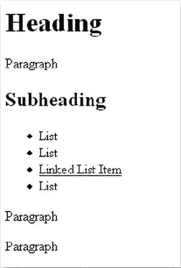
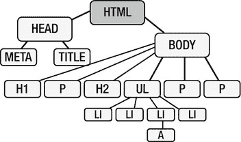
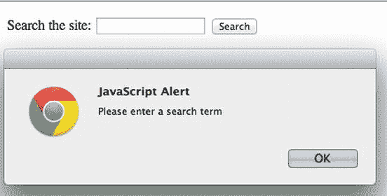
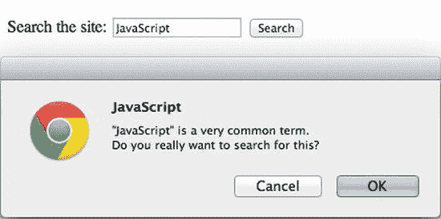
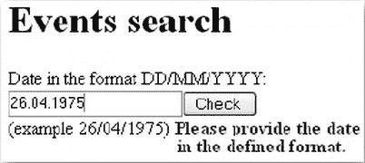
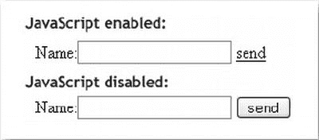

# 四、HTML 和 JavaScript

在这一章中，你最终会接触到真正的 JavaScript 代码。您将了解 JavaScript 如何与 HTML 中定义的页面结构交互，以及如何接收数据并向访问者反馈信息。我首先解释什么是 HTML 文档以及它是如何构造的，然后解释几种通过 JavaScript 创建页面内容的方法。然后，您将了解 JavaScript 开发人员的瑞士军刀——文档对象模型(DOM)——以及如何分离 JavaScript 和 HTML 来创建现在无缝的效果，这是开发人员过去用 d HTML 以一种强迫的方式创建的。

HTML 文档的剖析

用户代理中显示的文档通常是 HTML 文档。即使你使用像 ASP.NET、PHP、ColdFusion 或 Perl 这样的服务器端语言，如果你想充分发挥浏览器的潜力，结果也是 HTML。像 Firefox 或 Safari 这样的现代浏览器也支持 XML、SVG 和其他格式，但是对于 99%的日常 web 工作，您会选择 HTML 路线。

HTML 文档是一个以 DOCTYPE 开始的文本文档，它告诉用户代理文档是什么以及应该如何处理它。HTML 随着时间的推移而发展，当前的 DOCTYPE 告诉浏览器，正在交付的页面应该以标准模式呈现为 HTML5。文档中的下一个元素是 HTML 标签。该元素包含构成文档的所有其他内容。文档中的所有元素都可以有一个可选的 lang 属性。lang 属性定义了页面使用的语言(想想人类可读的语言，而不是计算机语言)——在下面的例子中，“en”代表*英语*。HTML 元素内部是 HEAD 和 TITLE 元素。与 HEAD 和 TITLE 处于同一级别的可选元素是 META 元素。META 中的 charset 属性描述了*字符编码*、或者文本在屏幕上显示的方式。这可以在服务器上设置，但是因为大多数人没有访问 web 服务器的权限，所以可以在这里定义。在 HEAD 元素的同一层，但是在结束的< head >标签之后，是 BODY——包含所有页面内容的元素。

```js
<!doctype html>
<html lang="en">
<head>
<meta charset="UTF-8">
<title>Our HTML Page</title>
</head>
<body>
</body>
</html>
```

像这样的标记文档由*标签* (标签括号中的单词或字母，如< p >)和文本内容组成。文档应该是格式良好的(这意味着每一个像< p >这样的开始标记必须与一个像< /p >这样的结束标记相匹配)。

HTML 元素就是方括号中的所有东西，<>，开始标签如

# ，后面是内容和相同名称的结束标签—如

。每个元素在开始和结束标记之间都可以有内容。每个元素可能有几个*属性*。下面的例子是一个 P 元素，它有一个名为 class 的属性。该属性的值为 intro。P 包含文本 *Lorem Ipsum* 。

```js
<p class="intro">Lorem Ipsum</p>
```

浏览器检查它遇到的元素，知道 P 是一个段落，并且 class 属性对这个元素有效。它还意识到 class 属性应该检查链接的级联样式表(CSS)样式表，用该类获取 P 的定义，并相应地呈现它。

有几个原因可以说明为什么您应该努力实现标准遵从性——即使是在通过 JavaScript 生成的 HTML 中:

*   当您知道 HTML 是有效的时，就更容易跟踪错误。
*   维护遵循规则的文档更容易——因为您可以使用验证器来衡量其质量。
*   当你按照约定的标准开发时，用户代理更有可能正确地呈现或转换你的页面。
*   如果它们是有效的 HTML，最终的文档可以很容易地转换成其他格式。

现在，如果你在示例 HTML 中添加更多的元素，并在浏览器中打开它，你会得到如图 4-1 所示的渲染输出:

```js
<!doctype html>
<html lang="en">
<head>
<meta charset="utf-8">
<title>DOM Example</title>
</head>
<body>
<h1>Heading</h1>
<p>Paragraph</p>
<h2>Subheading</h2>
<ul id="eventsList">
<li>List 1</li>
<li>List 2</li>
<li><a href="http://www.google.com">Linked List Item</a></li>
<li>List 4</li>
</ul>
<p>Paragraph</p>
<p>Paragraph</p>
</body>
</html>
```



图 4-1 。由浏览器呈现的 HTML 文档

关于 XHTML 的一句话

浏览器使用 DOCTYPE 来决定如何呈现文档。以前版本的 HTML (XHTML 4.01)有一个更长的 DOCTYPE。它描述的事情之一是它是否应该以*怪癖模式*或*标准模式*呈现事物。顾名思义，quirks 模式是为了适应早期浏览器中呈现 HTML 的方式而创建的，以保持向后兼容性，本质上保留所有的 Quirks 以便页面能够正确显示。标准模式严格遵循万维网联盟(W3C)制定的标准。

用户代理“看到”的文档略有不同。DOM 将文档建模为一组节点，包括元素节点、文本节点和属性节点。两个元素及其文本内容都是独立的*节点*。属性节点是元素的*属性*。DOM 包括用于标记文档其他部分的其他类型的节点，但是如果您继续使用 JavaScript 和 HTML，这三种节点——元素节点、文本节点和属性节点——是非常重要的。如果要通过浏览器查看文档，请右键单击(在 Mac 上按住 control 键单击)并选择“检查元素”。这将打开浏览器的下半部分，以树形结构显示文档，并允许您访问内置调试工具，如图图 4-2 所示。


图 4-2 。Mozilla DOM Inspector 中展示的文档的 DOM 表示

 **提示**你可以在 Chrome、Safari、Opera 和 Internet Explorer 中使用类似的工具。您不仅可以看到文档是如何表示的，还可以编辑代码并直接在浏览器中看到结果。在附录中，我将介绍验证和调试。

 **注意**注意到元素之间的所有#text 节点了吗？这不是我添加到文档中的文本，而是我在每行末尾添加的换行符。一些浏览器将它们视为文本节点，而另一些则不是——当您稍后试图通过 JavaScript 访问文档中的元素时，这可能会非常烦人。

图 4-3 显示了另一种可视化文档树的方式。



图 4-3 。HTML 文档的结构

认清 HTML 的本质是非常重要的:HTML 是结构化的内容，而不是像图像那样的视觉结构，图像中的元素放置在不同的坐标上。当你有一个合适的、有效的 HTML 文档时，你可以通过 JavaScript 访问和修改它。不管你做了多少测试，一个无效的 HTML 文档可能会使你的脚本出错。一个典型的错误是在一个文档中两次使用同一个 id 属性值，这违背了拥有惟一标识符(ID)的目的。

通过 JavaScript 在网页中提供反馈:老办法

您已经看到了一种方法——document . write()—通过写出内容在 HTML 文档中向用户提供反馈。我们还讨论了这种方法存在的问题——也就是说，混合了结构和表示层，失去了将所有 JavaScript 代码保存在单独文件中的维护优势。

使用窗口方法:prompt()、alert()和 confirm()

给出反馈和检索用户输入数据的另一种方式是使用浏览器通过窗口对象提供的方法——即 prompt()、alert()和 confirm()。

最常用的窗口方法是 alert()，图 4-4 给出了一个例子。它的作用是在对话框中显示一个值(如果用户的硬件支持的话，可能还会播放声音)。用户必须单击确定或按回车键来删除该消息。


图 4-4 。JavaScript 警告(在 Mac OS 的 Firefox 上)

不同浏览器和不同操作系统的警报看起来不同。

作为一种用户反馈机制，alert()具有被大多数用户代理支持的优点，但它也阻止你与页面上的任何其他东西进行交互——你称这样的窗口为*模态*。一个*警报*是一个通常带来坏消息或者警告某人前方有危险的消息——这不一定是你的意图。

假设您想告诉访问者在提交表单之前在搜索字段中输入一些内容。你可以用一个警告:

```js
<!doctype html>
<html lang="en">
<head>
<meta charset="utf-8">
<title>Search example</title>
<script type="text/javascript">
      function checkSearch()
      {

if(!document.getElementById("search")){return;}
var searchValue=document.getElementById("search").value;
        if(searchValue=='')
        {
          alert("Please enter a search term");
          return false;
        }
        else
        {
          return true;

        }
      }
</script>
</head>
<body>
<form action="sitesearch.php" method="post"
 onsubmit="return checkSearch();">
<p>
<label for="search">Search the site:</label>
<input type="text" id="search" name="search" />
<input type="submit" value="Search" />
</p>
</form>
</body>
</html>
```

如果访问者试图通过 submit 按钮提交表单，他会收到警告，并且在他激活 OK 按钮后，浏览器不会将表单发送到服务器。Mac OS 上的 Chrome 看起来就像你在图 4-5 中看到的一样。



图 4-5 。通过警告对表单错误给出反馈

警报不会向脚本返回任何信息，它们只是向用户提供一条消息，并停止任何进一步的代码执行，直到 OK 按钮被激活。

这对于提示()和确认()是不同的。前者允许访问者输入一些东西，后者要求用户确认一个动作。

 **提示**作为一种调试手段，alert()简直太得心应手了，不能不使用。您所做的只是在代码中添加一个警告(variableName ),在那里您想知道当时的变量值是什么。您将获得信息并停止执行其余的代码，直到 OK 按钮被激活——这对于追溯脚本失败的位置和原因非常有用。不过，要小心在循环中使用它——没有办法停止循环，而且你可能要按下 Enter 键一百次才能回到编辑状态。还有其他调试工具，如 Opera 和 Safari 的 JavaScript 控制台，以及 Mozilla。这些我会在附录里多说。

您可以扩展前面的示例，如下面的代码示例所示，要求访问者确认对常用术语 *JavaScript* 的搜索(结果如图图 4-6 所示):

```js
function checkSearch()
{

  if(!document.getElementById("search'"){return;}
  var searchValue=document.getElementById("search").value;
  if(searchValue=='')
  {
   alert("Please enter a search term before sending the form");
   return false;
  }
  else if(searchValue=="JavaScript")
  {
    var really=confirm('"JavaScript" is a very common term.\n' +'Do you really want to search for this?');
    return really;
  }
  else
  {
    return true;
  }
}
```



图 4-6 。通过 confirm()请求用户确认的示例

注意 confirm() 是一个根据访问者激活 OK 还是 Cancel 返回布尔值(true 或 false)的方法。确认对话框是阻止访问者在 web 应用中采取非常糟糕的步骤的简单方法。虽然它们不是让用户确认选择的最好方式，但是它们非常稳定，并且提供了一些你自己的确认功能可能没有的功能，例如，播放提醒声音。

alert()和 confirm()都向用户发送信息，但是检索信息呢？检索用户输入的一种简单方法是通过 prompt()方法。这个方法有两个参数:第一个是作为标签显示在输入字段上方的字符串，第二个是输入字段的预设值。标签为 OK 和 Cancel(或类似的东西)的按钮将显示在字段和标签旁边，如图 4-7 中的所示。

```js
var user=prompt('Please choose a name','User12');
```


图 4-7 。允许用户在提示中输入数据

当访问者激活 OK 按钮时，变量 user 的值将是 User12(当她没有改变预置时)或她输入的任何值。当她激活取消按钮时，该值将为空。

您可以使用此功能允许访问者在向服务器发送表单之前更改值:

```js
<!doctype html>
<html lang="en">
<head>
<meta charset="utf-8">
<title>Date example</title>
<script type="text/javascript">
      function checkDate()
      {
        if(!document.getElementById("date")){return;}
        // Define a regular expression to check the date format
        var checkPattern=newRegExp("\\d{2}/\\d{2}/\\d{4}");
        // Get the value of the date entry field
        var dateValue=document.getElementById("date").value;
        // If there is no date entered, don't send the form
        if(dateValue=='')
        {
          alert("Please enter a date");
          return false
        }
        else
        {
          // Tell the user to change the date syntax either until
          // she presses Cancel or enters the right syntax
          while(!checkPattern.test(dateValue) && dateValue!=null)
          {
            dateValue=prompt("Your date was not in the right format." + "Please enter it as DD/MM/YYYY.", dateValue);
          }
          return dateValue!=null;
        }
      }
</script>
</head>
<body>
<h1>Events search</h1>
<form action="eventssearch.php" method="post" onsubmit="return checkDate();">
<p>
<label for="date">Date in the format DD/MM/YYYY:</label><br>
<input type="text" id="date" name="date">
<input type="submit" value="Check">
<br>(example 26/04/1975)
</p>
</form>
</body>
</html>
```

如果正则表达式和 test()方法此刻让您感到困惑，也不用担心；这些将在第九章中介绍。现在重要的是使用一个 while 循环，其中包含一个 prompt()。while 循环反复显示相同的提示，直到访问者按下 Cancel(这意味着 dateValue 变为 null)或者以正确的格式输入日期(这满足正则表达式 checkPattern 的测试条件)。

快速回顾

您可以使用 prompt()、alert()和 confirm()方法创建非常漂亮的 JavaScripts，它们有一些优点:

*   它们很容易掌握，因为它们使用了浏览器的功能、外观和感觉，并提供了比 HTML 更丰富的界面。(具体来说，当出现提示音时，可以帮助很多用户。)
*   它们出现在当前文档之外和之上，这赋予了它们最大的重要性。

但是，有些观点反对使用这些方法来检索数据和提供反馈:

*   你不能设计消息的样式，它们会阻碍网页。这确实给了它们更多的重要性，但是从设计的角度来看，这也让它们显得笨拙。因为它们是用户操作系统或浏览器 UI 的一部分，所以用户很容易识别它们，但是它们打破了产品可能必须遵守的设计惯例和准则。
*   反馈机制不像网站那样具有相同的外观和感觉——这使得网站设计变得不那么重要，并且阻止了用户通过你的可用性增强设计元素的旅程。
*   它们依赖于 JavaScript——当 JavaScript 关闭时，反馈也应该可用。

通过 DOM 访问文档

除了您现在知道的窗口方法，您还可以通过 DOM 访问 web 文档。从某种意义上来说，你已经用 document.write()例子做到了。文档对象是您想要更改和添加的对象，使用 write()是一种方法。然而，document.write()向文档中添加一个字符串，而不是一组节点和属性，并且您不能将 JavaScript 分离到一个单独的文件中——document . write()仅在您将其放入 HTML 中的位置起作用。您需要的是一种到达您想要更改或添加内容的地方的方法，这正是 DOM 及其方法为您提供的。前面，您发现用户代理将文档作为一组节点和属性来读取，DOM 为您提供了获取这些节点和属性的工具。您可以通过三种方法访问文档的元素:

*   document . get element sbytag name(' p ')。
*   document.getElementById('id ')文件
*   document . get element sbyclasse name(' cssclass ')。

getElementsByTagName('p') 方法返回名为 p 的所有元素的列表作为对象(其中 p 可以是任何 HTML 元素)，getElementById('id ')返回 Id 为的元素作为对象。第三个方法 getElementsByClassName(' CSS class ')返回使用该类名的所有元素。

 **注意**关于 getElementsByClassName()的一个有趣的事情是，你可以检索使用多个类的元素。例如，getElementsByClassName("one two ")只检索一起使用这些类的元素。请记住，从版本 9 开始，这种方法在 IE 中可用。

如果回到我们之前使用的 HTML 示例，您可以编写一个小的 JavaScript 示例来展示如何使用这两种方法:

```js
<!doctype html>
<html>
<head>
<meta charset="UTF-8">
<title>DOM Example</title>
<script src="exampleFindElements.js"></script>
</head>
<body>
<h1>Heading</h1>
<p>Paragraph</p>
<h2>Subheading</h2>
<ul id="eventsList">
<li>List 1</li>
<li>List 2</li>
<li><a href="http://www.google.com">Linked List Item</a></li>
<li>List 4</li>
</ul>
<p class='paraStyle'>Paragraph</p>
<p class='paraStyle'>Paragraph</p>
</body>
</html>
```

我们的脚本现在可以通过调用 getElementsByTagName()方法读取文档中列表项和段落的数量，并将返回值赋给变量——一次用标记名 li，另一次用标记名 p。

```js
var listElements=document.getElementsByTagName('li');
var paragraphs=document.getElementsByTagName('p');
var msg='This document contains '+listElements.length+' list items\n';
msg+='and '+paragraphs.length+' paragraphs.';
alert(msg);
```

如图图 4-8 所示，如果在浏览器中打开 HTML 文档，会发现两个值都为零！


图 4-8 。在呈现页面之前尝试访问元素时出现不需要的结果

没有任何列表元素，因为当您尝试读取文档内容时，浏览器尚未呈现该文档。您需要延迟读取，直到文档被完全加载和呈现。

当文档完成加载时，您可以通过调用一个函数来实现这一点。当 document 对象的 DOMContentLoaded 事件被触发时，文档已完成加载。这个事件告诉 JavaScript 页面的结构(DOM)已经准备好让代码使用了，当它准备好了，就调用这个函数。与 getElementsByClassName 类似，DOMContentLoaded 从版本 9 开始在 IE 中工作。

```js
functionfindElements()
{
  var listElements = document.getElementsByTagName('li');
  var paragraphs = document.getElementsByTagName('p');
  var msg = 'This document contains ' + listElements.length +
' list items\n';
  msg += 'and ' + paragraphs.length + ' paragraphs.';
  alert(msg);
}

document.addEventListener("DOMContentLoaded", findElements, false);
```

如果你现在在浏览器中打开 HTML 文档，你会看到一个类似于图 4-9 中的警告，带有正确数量的列表元素和段落。


图 4-9 。指示找到的元素数量的输出警报

您可以像访问数组一样访问某个名称的每个元素—再次记住数组的计数器从 0 开始计数，而不是从 1 开始计数:

```js
// Get the first paragraph
var firstpara = document.getElementsByTagName('p')[0];
// Get the second list item
var secondListItem = document.getElementsByTagName('p')[1];
```

您可以组合几个 getElementsByTagName()方法调用来直接读取子元素。例如，要到达第三个列表项中的第一个链接项，可以使用

```js
var targetLink=document.getElementsByTagName('li')[2].getElementsByTagName('a')[0];
```

不过，这可能会变得相当混乱，还有更聪明的方法来访问子元素——我们马上就要谈到这些。如果要到达最后一个元素，可以使用数组的 length 属性:

```js
var lastListElement = listElements[listElements.length - 1];
```

length 属性还允许您循环遍历元素并逐个更改所有元素:

```js
var linkItems = document.getElementsByTagName('li');
for(var i = 0; i < linkItems.length; i++)
{
  // Do something...
}
```

元素 id 需要对文档是唯一的；因此，getElementById()的返回值是单个对象，而不是对象数组:

```js
var events = document.getElementById('eventsList');
```

您可以混合使用这两种方法来减少要循环的元素数量。虽然前面的 for 循环访问文档中的所有 LI 元素，但是这个循环将只遍历 ID 为 eventsList 的元素中的元素(ID 为的对象的名称将替换 document 对象):

```js
var events = document.getElementById('eventsList');
var eventlinkItems = events.getElementsByTagName('li');
for(var i = 0; i < eventLinkItems.length; i++)
{
  // Do something...
}
```

可以使用 getElementsByTagName()来访问基于文档中使用的 CSS 类的元素。就像前面的方法一样，您可以像访问数组一样访问结果:

```js
var firstClass = document.getElementsByClassName('paraStyle')[0];

var classNum = document.getElementsByClassName('paraStyle').length;
```

在 getElementsByTagName()、getElementById()和 getElementsByClassName()的帮助下，您可以访问文档的每个元素，或者专门针对一个元素。方法 getElementById()和 getElementsByClassName()是 document 的方法，getElementsByTagName()是 any 元素的方法。现在是时候看看到达元素后如何在文档中导航了。

孩子、父母、兄弟姐妹和价值观

您已经知道，可以通过连接 getElementsByTagName 方法来访问其他元素内部的元素。然而，这是相当麻烦的，这意味着你需要知道你正在改变的 HTML。有时这是不可能的，您必须找到一种更通用的方法来浏览 HTML 文档。DOM 已经通过*孩子*、*父母*和*兄弟姐妹*为此做好了计划。

这些关系描述了当前元素在树中的位置以及它是否包含其他元素。让我们再看一次简单的 HTML 例子，集中在文档的主体上:

```js
<body>
<h1>Heading</h1>
<p>Paragraph</p>
<h2>Subheading</h2>
<ul id="eventsList">
<li>List 1</li>
<li>List 2</li>
<li><a href="http://www.google.com">Linked List Item</a></li>
<li>List 4</li>
</ul>
<p class="paraStyle">Paragraph</p>
<p class="paraStyle">Paragraph</p>
</body>
```

所有缩进的元素都是主体的子元素。H1、、和 P 是兄弟姐妹，而 LI 元素是元素的子元素——彼此也是兄弟姐妹。链接是第三个 LI 元素的子元素。总而言之，他们是一个快乐的大家庭。

但是，孩子就更多了。段落、标题、列表元素和链接中的文本也由节点组成，你可能还记得前面的图 4-2 中的内容，虽然它们不是元素，但是它们仍然遵循相同的关系规则。

文档中的每个节点都有几个有价值的属性:

*   最重要的属性是 nodeType，它描述了节点是什么——一个元素、一个属性、一个注释、文本或者其他几种类型中的一种(总共 12 种)。对于我们的 HTML 示例，只有 nodeType 值 1 和 3 是重要的，其中 1 是元素节点，3 是文本节点。
*   另一个重要的属性是 nodeName，，它是元素的名称，如果是文本节点，则是#text。根据文档类型和用户代理，nodeName 可以是大写或小写，这就是为什么在测试某个名称之前将其转换为小写是个好主意。您可以使用 string 对象的 toLowerCase()方法来实现:if(obj . nodename . toLowerCase()= = ' Li '){ }；。对于元素节点，您可以使用 tagName 属性。
*   nodeValue 是节点的值:如果是元素则为 null，如果是文本节点则为文本内容。

对于文本节点，可以读取和设置 nodeValue，这允许您改变元素的文本内容。例如，如果您想要更改第一段的文本，您可能认为设置它的 nodeValue 就足够了:

```js
document.getElementsByTagName('p')[0].nodeValue='Hello World';
```

然而，这是行不通的(尽管——奇怪的是——它不会导致错误)，因为第一段是一个元素节点。如果您想要更改段落内的文本，您需要访问段落内的文本节点，换句话说，就是段落的第一个子节点:

```js
document.getElementsByTagName('p')[0].firstChild.nodeValue='Hello World';
```

从父母到孩子

firstChild 属性是一个快捷方式。每个元素可以有任意数量的子元素，列在一个名为 childNodes 的属性中。关于子节点，需要记住以下几点:

*   childNodes 是元素的所有第一级子节点的列表，它不会向下级联到更深的级别。
*   可以通过数组计数器或 item()方法访问当前元素的子元素。
*   快捷方式属性 yourElement.firstChild 和 yourElement.lastChild 是 yourElement.childNodes[0]和 your element . child nodes[your element . child nodes . length-1]的简化版本，可以更快地访问它们。
*   您可以通过调用 hasChildNodes()方法来检查元素是否有任何子元素，该方法返回一个布尔值。

回到前面的例子，您可以访问 UL 元素并获取有关其子元素的信息，如下所示:

*HTML*

```js
<ul id="eventsList">
<li>List 1</li>
<li>List 2</li>
<li><a href="http://www.google.com">Linked List Item</a></li>
<li>List 4</li>
</ul>
```

*JavaScript*

```js
function myDOMinspector()
{
  var DOMstring='';
var demoList=document.getElementById('eventsList');
if (!demoList){return;}
  if(demoList.hasChildNodes())
  {
    var ch=demoList.childNodes;
    for(var i=0;i<ch.length;i++)
    {
      DOMstring+=ch[i].nodeName+'\n';
    }
    alert(DOMstring);
  }
}
```

创建一个名为 DOMstring 的空字符串,并检查 DOM 支持以及是否定义了具有正确 id 属性的 UL 元素。然后测试该元素是否有子节点，如果有，将它们存储在一个名为 ch 的变量中。您循环遍历变量(该变量自动成为一个数组)，并将每个子节点的 nodeName 添加到 DOMString，后跟一个换行符(\n)。然后使用 alert()方法查看结果。

如果你在浏览器中运行这个脚本，你会看到四个 LI 元素，元素之间的换行符作为文本节点，如图 4-10 中的所示。


图 4-10 。我们的脚本找到的节点，包括实际上是换行符的文本节点

从孩子到父母

您还可以通过 parentNode 属性从子元素导航回其父元素。首先，让我们为您添加一个 ID:，让您更容易地找到链接

```js
<ul id="eventsList">
<li>List</li>
<li>List</li>
<li>
<aid="linkedItem"href="http://www.google.com">
Linked List Item
</a>
</li>
<li>List</li>
</ul>
```

现在给 link 对象分配一个变量，并读取父节点的名称:

```js
var myLinkItem=document.getElementById("linkedItem");
alert(myLinkItem.parentNode.nodeName);
```

结果是 LI，如果将另一个 parentNode 添加到对象引用中，将得到，这是链接的祖父元素:

```js
alert(myLinkItem.parentNode.parentNode.nodeName);
```

您可以根据需要添加任意数量的父元素，也就是说，如果文档树中还有父元素，而您还没有到达顶层。如果在循环中使用 parentNode，那么测试 nodeName 并在循环到达主体时结束循环是很重要的。比方说，你想检查一个对象是否在一个动态类的元素中。您可以使用 while 循环来实现这一点:

```js
var myLinkItem = document.getElementById("linkedItem");
var parentElm = myLinkItem.parentNode;
while(parentElm.className != "dynamic")
{
  parentElm = parentElm.parentNode;
}
```

但是，当没有具有正确类的元素时，此循环将导致“TypeError:无法读取 null 的属性' className'”错误。如果让循环在主体处停止，就可以避免这个错误:

```js
var myLinkItem = document.getElementById('linkedItem');
var parentElm = myLinkItem.parentNode;
while(!parentElm.className != 'dynamic'&& parentElm != document.body')
{
  parentElm=parentElm.parentNode;
}
alert(parentElm);
```

在兄弟姐妹中

家族类比继续使用兄弟姐妹，是同一级别上的元素。(不过，它们不会像兄弟姐妹一样有不同的性别。)您可以通过节点的 previousSibling 和 nextSibling 属性到达同一级别的不同子节点。让我们回到我们的列表示例:

```js
<ul id="eventsList">
<li>List Item 1</li>
<li>List Item 2</li>
<li>
<a id="linkedItem" href="http://www.google.com/">
      Linked List Item
</a>
</li>
<li>List Item 4</li>
</ul>
```

您可以通过 getElementById()获得链接，并通过 parentNode 获得包含链接的 LI。属性 previousSibling 和 nextSibling 允许您分别获取列表项 2 和列表项 3:

```js
var myLinkItem = document.getElementById("linkedItem");
var listItem = myLinkItem.parentNode;
var nextListItem = myLinkItem.nextSibling;
var prevListItem = myLinkItem.previousSibling;
```

如果当前对象是父元素的最后一个子元素，则 nextSibling 将是未定义的，如果没有正确测试它，将会导致错误。与 childNodes 不同，第一个和最后一个兄弟节点没有快捷方式属性，但是您可以编写实用程序方法来查找它们。例如，假设您想在我们的演示 HTML 中找到第一个和最后一个 LI:

```js
document.addEventListener("DOMContentLoaded",init,false);

function init()
{
  var myLinkItem=document.getElementById("linkedItem");
  var first=firstSibling(myLinkItem.parentNode);
  var last=lastSibling(myLinkItem.parentNode);
  alert(getTextContent(first));
  alert(getTextContent(last));
}
function lastSibling(node){
  var tempObj=node.parentNode.lastChild;
  while(tempObj.nodeType!=1 && tempObj.previousSibling!=null)
  {
    tempObj=tempObj.previousSibling;
  }
  return (tempObj.nodeType==1)?tempObj:false;
}
function firstSibling(node)
{
  var tempObj=node.parentNode.firstChild;
  while(tempObj.nodeType!=1 && tempObj.nextSibling!=null)
  {
    tempObj=tempObj.nextSibling;
  }
  return (tempObj.nodeType==1)?tempObj:false;
}
function getTextContent(node)
{
  return node.firstChild.nodeValue;
}
```

请注意，您需要检查 nodeType，因为 parentNode 的最后一个或第一个子节点可能是文本节点，而不是元素。

让我们通过使用 DOM 方法来提供文本反馈，而不是向用户发送警告，从而使我们的日期检查脚本不那么显眼。首先，您需要一个容器来显示您的错误消息:

```js
<!doctype html>
<html>
<head>
<meta charset="UTF-8">
<title>Date example</title>
<style type="text/css">
      .error{color:#c00;font-weight:bold;}
</style>
<script type="text/javascript" src="checkdate.js"></script>
</head>
<body>
<h1>Events search</h1>
<form action="eventssearch.php" method="post"onsubmit="return checkDate();">
<p>
<label for="date">Date in the format DD/MM/YYYY:</label><br />
<input type="text" id="date" name="date" />
<input type="submit" value="Check " />
<br />(example 26/04/1975)
<span class="error"></span>
</p>
</form>
</body>
</html>
```

检查脚本或多或少与以前保持相同——区别在于您使用 SPAN 作为显示错误的手段:

```js
function checkDate(){
  var dateField=document.getElementById('date');
  if(!dateField){return;}
  var errorContainer=dateField.parentNode.getElementsByTagName("span")[0];
  if(!errorContainer){return;}
  var checkPattern=new RegExp("\\d{2}/\\d{2}/\\d{4}");
  var errorMessage='';
  errorContainer.firstChild.nodeValue='"";
  var dateValue=dateField.value;
  if(dateValue=='')
  {
    errorMessage="Please provide a date.";
  }
  else if(!checkPattern.test(dateValue))
  {
    errorMessage="Please provide the date in the defined format.";
  }
  if(errorMessage!='')
  {
    errorContainer.firstChild.nodeValue=errorMessage;
    dateField.focus();
    return false;
  }
  else
  {
    return true;
  }
}
```

首先，测试是否所有需要的元素都存在:

```js
var dateField=document.getElementById("date");
  if(!dateField){return;}
  var errorContainer=dateField.parentNode.getElementsByTagName("span")[0];
  if(!errorContainer){return;}
```

然后定义测试模式和空错误信息。将误差范围的文本值设置为一个空格。这对于避免访问者在没有纠正错误的情况下第二次发送表单时显示多个错误消息是必要的:

```js
  var checkPattern=new RegExp("\\d{2}/\\d{2}/\\d{4}");
  var errorMessage='';
  errorContainer.firstChild.nodeValue=" ";
```

接下来是字段的验证。读取日期字段的值，并检查是否有条目。如果没有条目，错误消息将是访问者应该输入一个日期。如果有一个日期，但是格式错误，消息将会指出。

```js
var dateValue=dateField.value;
  if(dateValue=='')
  {
    errorMessage="Please provide a date.";
  }
  else if(!checkPattern.test(dateValue))
  {
    errorMessage="Please provide the date in the defined format.";
  }
```

那么剩下的就是检查最初的空错误消息是否被修改了。如果没有改变，脚本应该返回 true，形式为 on submit = " return checkDate()；"—从而提交表单并允许后端接管工作。如果更改了错误消息，脚本会将错误消息添加到错误范围的文本内容(第一个子节点的 nodeValue)中，并将文档的焦点设置回日期输入字段，而不提交表单:

```js
if(errorMessage!='')
{
  errorContainer.firstChild.nodeValue+=errorMessage;
  dateField.focus();
  return false;
}
else
{
  return true;
}
```

如图 4-11 所示，结果比警告信息更具视觉吸引力，你可以随心所欲地设计它。



图 4-11 。显示动态错误消息

现在您知道了如何访问和更改现有元素的文本值。但是如果你想改变其他属性或者你需要不一定为你提供的 HTML 呢？

更改元素的属性

一旦您找到了想要更改的元素，您可以通过两种方式读取和更改它的属性:一种较老的方式，让您直接与元素对话；另一方面，使用 DOM 方法。

旧版本和新版本的用户代理允许您将元素属性作为对象属性进行获取和设置:

```js
var firstLink=document.getElementsByTagName("a")[0];
if(firstLink.href=="search.html")
{
  firstLink.href="http://www.google.com";
}
var mainImage=document.getElementById('nav').getElementsByTagName('img')[0];
mainImage.src="dynamiclogo.jpg";
mainImage.alt="Generico Corporation - We do generic stuff";
mainImage.title="Go back to Home";
```

HTML 规范中定义的所有属性都是可用的，并且可以被访问。出于安全原因，有些是只读的，但大多数是可以设置和读取的。您也可以提出自己的属性——JavaScript 并不介意。有时候，在元素的属性中存储一个值可以省去很多测试和循环。

 **注意**当心与 JavaScript 命令同名的属性——例如，for。如果尝试设置 element.for='something '，将会导致错误。浏览器供应商想出了解决办法。对于 for——它是 label 元素的一个有效属性——属性名是 htmlFor。更奇怪的是 class 属性——在下一章中你会用到很多。这是一个保留字；您需要改用类名。

DOM 规范提供了两种读取和设置属性的方法——get attribute()和 setAttribute()。getAttribute()方法有一个参数——属性名。setAttribute()方法有两个参数:属性名和新值。

使用较新方法的早期示例如下所示:

```js
var firstLink=document.getElementsByTagName("a")[0];
if(firstLink.getAttribute('href')=='search.html')
{
  firstLink.setAttribute('href')="http://www.google.com";
}
var mainImage=document.getElementById("nav").getElementsByTagName("img")[0];
mainImage.setAttribute("src")="dynamiclogo.jpg";
mainImage.getAttribute("alt") ="Generico Corporation - We do generic stuff";
mainImage.getAttribute("title"
)="Go back to Home";
```

这可能看起来有点多余和臃肿，但好处是它与其他更高级的编程语言更加一致。与将属性分配给元素的属性方式相比，它更有可能被未来的用户代理支持，并且它们可以轻松地处理任意的属性名称。

创建、删除和替换元素

DOM 还提供了在 HTML/JavaScript 环境中改变文档结构的方法。(如果通过 JavaScript 做 XML 转换的话还有更多。)您不仅可以更改现有的元素，还可以创建新元素以及替换或删除旧元素。这些方法如下:

*   document . createElement(' element '):创建一个标记名为 element 的新元素节点。
*   document . create text node(' string '):创建一个节点值为 string 的新文本节点。
*   Node.appendChild(newNode):将 newNode 作为新的子节点添加到 node，跟在 node 的任何现有子节点后面。
*   newNode=Node.cloneNode(bool):创建 newNode 作为 node 的副本(克隆)。如果 bool 为 true，则克隆包括原始节点的所有子节点和属性的克隆。
*   node.insertBefore(newNode，oldNode):在 oldNode 之前插入 newNode 作为 node 的新的子节点。
*   node.removeChild(oldNode):从节点中删除子 oldNode。
*   node.replaceChild(newNode，oldNode):用 newNode 替换 node 的子节点 oldNode。
*   node.nodeValue:返回当前节点的值。

 **注意【createElement()和 createTextNode()都是 document 的方法；其他的都是任意节点的方法。**

当您想要创建由 JavaScript 增强但不完全依赖它的 web 产品时，所有这些都是不可或缺的。除非您通过警告、确认和提示弹出窗口向所有用户提供反馈，否则您将不得不依赖提供给您的 HTML 元素——就像前面示例中的错误消息 SPAN。然而，因为您的 JavaScript 需要的 HTML 只有在启用 JavaScript 时才有意义，所以当没有脚本支持时它不应该可用。额外的跨度不会伤害任何人——但是，为用户提供强大功能的表单控件(如日期选择器工具)却不能工作，这是一个问题。

让我们在下一个例子中使用这些方法。我们将用一个链接替换一个提交按钮。

链接更好，因为你可以用 CSS 样式化它们。它们可以调整大小，并且可以很容易地从本地化的数据集中填充。然而，链接的问题是，你需要 JavaScript 来提交表单。这就是为什么懒惰或太忙的开发人员对这种困境的答案是一个链接，它使用 javascript:协议简单地提交表单(许多代码生成器或框架都会提供相同的功能):

```js
<a href="javascript:document.forms[0].submit()">Submit</a>
```

在本书的前面，我已经确定这不是一个选项——因为如果没有 JavaScript，这将是一个死链接，并且没有任何提交表单的方法。如果您想两全其美——为非 JavaScript 用户提供一个简单的提交按钮，为启用脚本的用户提供一个链接——您需要做以下事情:

1.  遍历文档的所有输入元素。
2.  测试类型是否为提交。
3.  如果不是这样，继续循环，跳过其余部分。
4.  如果是这种情况，创建一个带有文本节点的新链接。
5.  将文本节点的节点值设置为输入元素的值。
6.  将链接的 href 设置为 javascript:document.forms[0]。submit()，它允许您在单击链接时提交表单。
7.  用链接替换输入元素。

 **注意**将 href 属性设置为 javascript:构造并不是最干净的方式。在下一章中，您将了解事件处理程序——实现这一解决方案的更好的方法。

在代码中，这可能是

```js
<!doctype html>
<html>
<head>
<meta charset="UTF-8">
<title>Example: Submit buttons to links</title>
<style type="text/css"></style>
<script type="text/javascript" src="submitToLinks.js"></script>
</head>
<body>
<form action="nogo.php" method="post">
<label for="Name">Name:</label>
<input type="text" id="Name" name="Name" />
<input type="submit" value="send" />
</form>
</body>
</html>
function submitToLinks()
{
var inputs,i,newLink,newText;
  inputs=document.getElementsByTagName('input');
  for (i=0;i<inputs.length;i++)
  {
    if(inputs[i].getAttribute('type').toLowerCase()!='submit')
 {continue;i++}
    newLink=document.createElement('a');
    newText=document.createTextNode(inputs[i].getAttribute('value'));
    newLink.appendChild(newText);
    newLink.setAttribute('href','javascript:document.forms[0]
 .submit()');
    inputs[i].parentNode.replaceChild(newLink,inputs[i]);
  }
}
document.addEventListener("DOMContentLoaded", submitToLinks,false);
```

当 JavaScript 可用时，访问者获得一个提交表单的链接；否则，他会得到一个提交按钮，如图图 4-12 所示。



图 4-12 。根据 JavaScript 的可用性，用户可以获得一个链接或按钮来发送表单

然而，该函数有一个主要缺陷:当 Submit 按钮后面有更多的输入元素时，它将失败。将 HTML 更改为在提交按钮后有另一个输入:

```js
<form action="nogo.php" method="post">
<p>
<label for="Name">Name:</label>
<input type="text" id="Name" name="Name" />
<input type="submit" value="check" />
<input type="submit" value="send" />
</p>
<p>
<label for="Email">email:</label>
<input type="text" id="Email" name="Email" />
</p>
</form>
```

您将看到“发送”提交按钮没有被替换为链接。发生这种情况是因为您删除了一个 input 元素，这改变了数组的大小，并且循环与它应该到达的元素不同步。解决这个问题的方法是每次删除一个项目时减少循环计数器。但是，您需要通过比较循环计数器和数组的长度来检查循环是否已经在最后一次迭代中(简单地减少计数器会导致脚本失败，因为它试图访问一个不存在的元素):

```js
function submitToLinks()
{

  var inputs,i,newLink,newText;
  inputs=document.getElementsByTagName('input');
  for (i=0;i<inputs.length;i++)
  {
    if(inputs[i].getAttribute('type').toLowerCase()!='submit')
 {continue;i++}
    newLink=document.createElement('a');
    newText=document.createTextNode(inputs[i].getAttribute('value'));
    newLink.appendChild(newText);
    newLink.setAttribute('href','javascript:document.forms[0]
 .submit()');
    inputs[i].parentNode.replaceChild(newLink,inputs[i]);
    if(i<inputs.length){i--};
  }
}
document.addEventListener("DOMContentLoaded", submitToLinks,false);
```

这个版本的脚本不会失败，它用链接替换了两个按钮。

 **注意**这个脚本会破坏表单的一个可用性方面:当表单中有提交按钮时，您可以通过按 Enter 按钮来提交表单。当您删除所有提交按钮时，这将不再可能。解决方法是添加一个空白图像按钮或隐藏提交按钮，而不是删除它们。我将在下一章回到这个选项。另一个可用性问题是您是否应该改变表单的外观——因为您失去了表单元素的即时可识别性。访问者已经习惯了表单在他们的浏览器和操作系统上的外观——如果你改变这一点，他们将不得不寻找交互元素，并可能期望其他功能。人们信任包含个人数据和货币交易的表单——任何可能使他们困惑的事情都很容易被认为是安全问题。

避免 NOSCRIPT

SCRIPT 元素在 NOSCRIPT 中有对应的元素。这个元素的初衷是在 JavaScript 不可用时为访问者提供替代内容。语义 HTML 不鼓励在文档中使用脚本块。(正文应该只包含有助于文档结构的元素，而脚本不会这样做。)NOSCRIPT 已被弃用。但是，您会在 Web 上找到许多辅助功能教程，它们提倡使用 NOSCRIPT 作为一种安全措施。简单地在页面的< noscript >标签中添加一条消息，解释你将需要 JavaScript 来最大限度地使用网站，这似乎是解决问题的一个非常简单的方法。这就是为什么许多开发人员不赞成 W3C 反对 NOSCRIPT，或者干脆牺牲 HTML 的有效性。但是，通过使用 DOM 方法，您可以解决这个问题。

在一个完美的世界里，不会有任何网站需要 JavaScript 来工作——只有在脚本可用的情况下工作更快、有时更容易使用的网站。然而，在现实世界中，有时您将不得不使用现成的产品或框架，它们只是生成依赖于脚本的代码。当重新设计或替换那些不太显眼的系统不可行时，你可能想告诉访问者，他们需要脚本来使站点工作。

使用 NOSCRIPT，这可以非常简单地完成:

```js
<script type="text/javascript">myGreatApplication();</script>
<noscript>
  Sorry but you need to have scripting enabled to use this site.
</noscript>
```

这样的消息没有太大的帮助，至少您应该允许不能启用脚本的访问者(例如，银行和金融公司的工作人员，他们因为脚本会带来安全威胁而关闭脚本)与您联系。

现代脚本从另一方面解决了这个问题:我们给出一些信息，并在脚本可用时替换它。对于依赖脚本的应用，这可能是

```js
<p id="noscripting">
  We are sorry, but this application needs JavaScript
  to be enabled to work. Please <a href="contact.html">contact us</a>
  If you cannot enable scripting and we will try to help you in other
  ways.
</p>
```

然后编写一个脚本，简单地删除它，甚至利用这个机会同时测试 DOM 支持:

```js
<!doctype html>
<html>
<head>
<meta charset="UTF-8">
<title>Example: Replacing noscript</title>
<script type="text/javascript">
      function noscript()
      {
        if(!document.getElementById || !document.createTextNode){return;}
        // Add more tests as needed (cookies, objects...)
        var noJSmsg=document.getElementById('noscripting');
        if(!noJSmsg){return;}
        var headline='Browser test succeeded';
        replaceMessage='We tested if your browser is capable of ';
        replaceMessage+='supporting the application, and all checkedout fine. ';
        replaceMessage+='Please proceed by activating the following link.';
        var linkMessage='Proceed to application.';
        var head=document.createElement('h1');
        head.appendChild(document.createTextNode(headline));
        noJSmsg.parentNode.insertBefore(head,noJSmsg);
```

```js
var infoPara=document.createElement('p');
        infoPara.appendChild(document.createTextNode(replaceMessage));
        noJSmsg.parentNode.insertBefore(infoPara,noJSmsg);
        var linkPara=document.createElement('p');
        var appLink=document.createElement('a');
        appLink.setAttribute('href','application.aspx');
        appLink.appendChild(document.createTextNode(linkMessage));
        linkPara.appendChild(appLink);
        noJSmsg.parentNode.replaceChild(linkPara,noJSmsg);
}
      document.addEventListener("DOMContentLoaded", noscript,false);
</script>
</head>
<body>
<p id="noscripting">
      We are sorry, but this application needs JavaScript to be
      enabled to work. Please <a href="contact.html">contact us</a>
      if you cannot enable scripting and we will try to help you in
      other ways
</p>
</body>
</html>
```

您可以看到，通过 DOM 生成大量内容相当麻烦，这就是为什么在这种情况下——您真的不需要将生成的每个节点都作为变量——许多开发人员使用 innerHTML。

通过 InnerHTML 缩短你的脚本

微软在开发 Internet Explorer 的早期就实现了非标准属性 innerHTML。现在大部分浏览器都支持；甚至有人谈到将它加入 DOM 标准。它允许你做的是定义一个包含 HTML 的字符串并将它赋给一个对象。然后，用户代理会为您完成剩下的工作—所有的节点生成和子节点的添加。使用 innerHTML 的 NOSCRIPT 示例要短得多:

```js
<!doctype html>
<html>
<head>
<meta charset="UTF-8">
<title>Example: Replacing noscript</title>
<script type="text/javascript">
      function noscript()
      {
        if(!document.getElementById || !document.createTextNode){return;}
        // Add more tests as needed (cookies, objects...)
        var noJSmsg=document.getElementById('noscripting');
        if(!noJSmsg){return;}
        var replaceMessage='<h1>Browser test succeeded</h1>';
        replaceMessage='<p>We tested if your browser is capable of ';
        replaceMessage+='supporting the application, and all checkedout fine. ';
        replaceMessage+='Please proceed by activating the following
 link.</p>';
        replaceMessage+='<p><a href="application.aspx">Proceed to application</a></p>';
        noJSmsg.innerHTML=replaceMessage;
      }
document.addEventListener("DOMContentLoaded", noscript,false);

</script>
</head>
<body>
<p id="noscripting">
      We are sorry, but this application needs JavaScript to be
      enabled to work. Please <a href="contact.html">contact us</a>
      if you cannot enable scripting and we will try to help you in
      other ways.
</p>
</body>
</html>
```

您还可以读出元素的 innerHTML 属性，这在调试代码时非常方便，因为并非所有浏览器都有“视图生成源”特性。用其他 HTML 替换整个 HTML 也很容易，当我们显示通过 Ajax 从后端检索的内容时，我们经常这样做。

DOM 摘要:您的备忘单

那是很难接受的。将您需要的所有 DOM 特性都放在一个地方进行复制并放在手边可能会比较好，所以您可以这样做:

*   到达文档中的元素

*   document.getElementById('Id '):以对象形式检索具有给定 id 的元素
*   document . getelementsbyTagName(' tagname '):检索标记名为 tagname 的所有元素，并将它们存储在一个类似数组的列表中
*   document . getelementsbyclassname(' cssClass '):检索类名为 CSS class 的所有元素，并将它们存储在类似数组的列表中

*   读取元素属性、节点值和其他节点数据

*   node.getAttribute('attribute '):检索具有名称属性的属性的值
*   node.setAttribute('Attribute '，' value '):将名称为 attribute 的属性的值设置为 value
*   node.nodeType:读取节点的类型(1 =元素，3 =文本节点)
*   node.nodeName:读取节点的名称(元素名或#textNode)
*   node.nodeValue:读取或设置节点的值(文本节点的文本内容)

*   在节点间导航

*   检索前一个同级节点，并将其存储为一个对象。
*   检索下一个同级节点，并将其存储为一个对象。
*   检索对象的所有子节点，并将它们存储在一个列表中。第一个和最后一个子节点有快捷方式，名为 node.firstChild 和 node.lastChild。
*   检索包含节点的节点。

*   创建新节点

*   document.createElement(Element):创建一个名为 element 的新元素节点。您以字符串形式提供元素名称。
*   document.createTextNode(string):创建一个新的文本节点，节点值为 string。
*   newNode = Node.cloneNode(bool):创建 newNode 作为 node 的副本(克隆)。如果 bool 为 true，则克隆包括原始节点的所有子节点的克隆。
*   node.appendChild(newNode):将 newNode 作为新的(最后一个)子节点添加到 node。
*   node.insertBefore(newNode，oldNode):在 oldNode 之前插入 newNode 作为 node 的新的子节点。
*   node.removeChild(oldNode):从节点中删除子 oldNode。
*   node.replaceChild(newNode，oldNode):用 newNode 替换 node 的子节点 oldNode。
*   element.innerHTML:以字符串形式读取或写入给定元素的 HTML 内容，包括所有子节点及其属性和文本内容。

DOMhelp:您自己的助手库

使用 DOM 时最令人讨厌的事情是浏览器的不一致性——特别是当这意味着您每次想要访问下一个兄弟节点时都必须测试 nodeType 时，因为非常旧的浏览器的用户代理可能会也可能不会将换行符作为它自己的文本节点来读取。因此，您应该准备好一组工具函数来解决这些问题，并允许您专注于主脚本的逻辑。

让我们现在就开始我们自己的助手方法库，来说明如果没有它你将不得不面对的问题。

 **注意**你会在代码演示中找到 DOMhelp.js 文件和一个测试 HTML 文件。本书附带的 zip 文件。中的版本。zip 文件的方法比较多，下一章会讨论，不要搞混了。

这个库将由一个名为 DOMhelp 的对象和几个实用方法组成。下面是我们将在本章和下一章中充实的实用程序的框架:

```js
DOMhelp=
{
  // Find the last sibling of the current node
  lastSibling:function(node){},

  // Find the first sibling of the current node
  firstSibling:function(node){},

  // Retrieve the content of the first text node sibling of the current node
  getText:function(node){},

  // Set the content of the first text node sibling of the current node
  setText:function(node,txt){},

  // Find the next or previous sibling that is an element
  //  and not a text node or line break
  closestSibling:function(node,direction){},

  // Create a new link containing the given text
  createLink:function(to,txt){},

  // Create a new element containing the given text
  createTextElm:function(elm,txt){},  // Simulate a debugging console to avoid the need for alerts
  initDebug:function(){},
  setDebug:function(bug){},
  stopDebug:function(){}
}
```

在本章前面，您已经遇到了最后一个和第一个同级函数；这些例子中唯一缺少的是一个测试，即在试图将它分配给临时对象之前，是否真的有一个上一个或下一个兄弟要检查。这两种方法中的每一种都检查有问题的兄弟是否存在，如果不存在，则返回 false:

```js
lastSibling:function(node)
{
  var tempObj=node.parentNode.lastChild;
  while(tempObj.nodeType!=1 && tempObj.previousSibling!=null)
  {
    tempObj=tempObj.previousSibling;
  }
  return (tempObj.nodeType==1)?tempObj:false;
},
firstSibling:function(node)
{
  var tempObj=node.parentNode.firstChild;
  while(tempObj.nodeType!=1 && tempObj.nextSibling!=null)
  {
    tempObj=tempObj.nextSibling;
  }
  return (tempObj.nodeType==1)?tempObj:false;
},
```

接下来是 getText 方法，它读取元素的第一个文本节点的文本值:

```js
getText:function(node)
{
  if(!node.hasChildNodes()){return false;}
  var reg=/^\s+$/;
  var tempObj=node.firstChild;
  while(tempObj.nodeType!=3 && tempObj.nextSibling!=null ||reg.test(tempObj.nodeValue))
  {
    tempObj=tempObj.nextSibling;
  }
  return tempObj.nodeType==3?tempObj.nodeValue:false;
},
```

您可能遇到的第一个问题是该节点没有任何子节点；因此，您需要检查 hasChildNodes。其他问题是节点中的嵌入元素和空白，比如换行符和制表符被当作节点读取。因此，您测试第一个子节点并跳转到下一个兄弟节点，直到 nodeType 是 text (3)并且节点不仅仅由空白字符组成。(这是正则表达式检查的内容。)在尝试将下一个兄弟节点赋给 tempObj 之前，还要测试是否有下一个兄弟节点。如果一切正常，该方法返回第一个文本节点的 nodeValue 否则，它返回 false。

相同的测试模式适用于 setText，它用新文本替换节点的第一个真实文本子节点，并避免任何换行符或制表符:

```js
setText:function(node,txt)
{
  if(!node.hasChildNodes()){return false;}
  var reg=/^\s+$/;
  var tempObj=node.firstChild;
  while(tempObj.nodeType!=3 && tempObj.nextSibling!=null ||reg.test(tempObj.nodeValue))
  {
    tempObj=tempObj.nextSibling;
  }
  if(tempObj.nodeType==3){tempObj.nodeValue=txt}else{return false;}
},
```

接下来的两个 helper 方法帮助您完成创建包含目标和文本的链接以及创建包含文本的元素的常见任务:

```js
createLink:function(to,txt)
{
  var tempObj=document.createElement('a');
  tempObj.appendChild(document.createTextNode(txt));
  tempObj.setAttribute('href',to);
  return tempObj;
},
createTextElm:function(elm,txt)
{
  var tempObj=document.createElement(elm);
  tempObj.appendChild(document.createTextNode(txt));
  return tempObj;
},
```

它们不包含您之前在这里没有见过的内容，但是放在一个地方非常方便。

事实上，一些浏览器将换行符作为文本节点读取，而另一些不这样做，这意味着您不能信任 nextSibling 或 previousSibling 返回下一个元素——例如，在一个无序列表中。实用方法 closestSibling()解决了这个问题。它需要节点和方向(1 表示下一个兄弟节点，1 表示上一个兄弟节点)作为参数:

```js
closestSibling:function(node,direction)
{
  var tempObj;
  if(direction==-1 && node.previousSibling!=null)
  {
    tempObj=node.previousSibling;
    while(tempObj.nodeType!=1 && tempObj.previousSibling!=null)
    {
       tempObj=tempObj.previousSibling;
    }
  }
  else if(direction==1 && node.nextSibling!=null)
  {
    tempObj=node.nextSibling;
    while(tempObj.nodeType!=1 && tempObj.nextSibling!=null)
    {
      tempObj=tempObj.nextSibling;
    }
  }
  return tempObj.nodeType==1?tempObj:false;
},
```

最后一组方法是用来模拟可编程 JavaScript 调试控制台的。使用 alert()作为显示值的手段是很方便的，但是当您想要观察一个大循环内部的变化时，它会变得很麻烦——谁愿意按 200 次 Enter 键呢？不使用 alert()，而是向文档中添加一个新的 DIV，并输出任何想要检查的数据作为该 DIV 的新的子节点。使用合适的样式表，您可以将 DIV 浮动在内容之上。从一个初始化方法开始，该方法检查控制台是否已经存在，如果存在，就删除它。这对于避免几个控制台同时存在是必要的。然后创建一个新的 DIV 元素，给它一个 ID 进行样式化，并将其添加到文档中:

```js
initDebug:function()
{
  if(DOMhelp.debug){DOMhelp.stopDebug();}
  DOMhelp.debug=document.createElement('div');
  DOMhelp.debug.setAttribute('id',DOMhelp.debugWindowId);
  document.body.insertBefore(DOMhelp.debug,document.body.firstChild);
},
```

setDebug 方法将名为 bug 的字符串作为参数。它测试控制台是否已经存在，并在必要时调用初始化方法来创建控制台。然后，它将后跟换行符的 bug 字符串添加到控制台的 HTML 内容中:

```js
setDebug:function(bug)
{
  if(!DOMhelp.debug){DOMhelp.initDebug();}
  DOMhelp.debug.innerHTML+=bug+'\n';
},
```

最后一个方法是从文档中删除控制台(如果存在的话)。请注意，您需要移除元素并将 object 属性设置为 null 否则，即使没有可写入的控制台，对 DOMhelp.debug 的测试也将为真。

```js
stopDebug:function()
{
  if(DOMhelp.debug)
  {
    DOMhelp.debug.parentNode.removeChild(DOMhelp.debug);
    DOMhelp.debug=null;
  }
}
```

我们将在接下来的章节中扩展这个助手库。

摘要

读完这一章后，你应该完全有能力处理任何 HTML 文档，得到你需要的部分，并通过 DOM 改变甚至创建标记。

您了解了 HTML 文档的结构，以及 DOM 如何提供您所看到的元素、属性和文本节点的集合。您还看到了窗口方法 alert()、confirm()和 prompt()。这些都是快速和广泛支持的——尽管不安全和笨拙——检索数据和给出反馈的方法。

然后，您学习了 DOM、如何访问元素、在元素之间导航以及如何创建新内容。

在下一章中，您将学习如何处理表示问题，跟踪访问者如何在浏览器中与文档交互，并通过事件处理做出相应的反应。