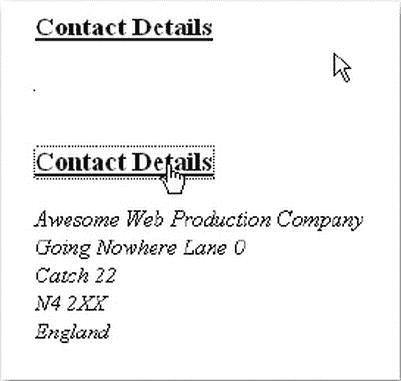
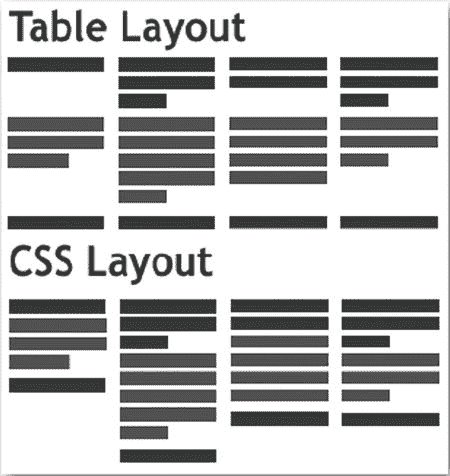
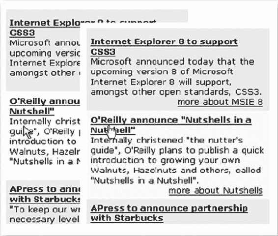
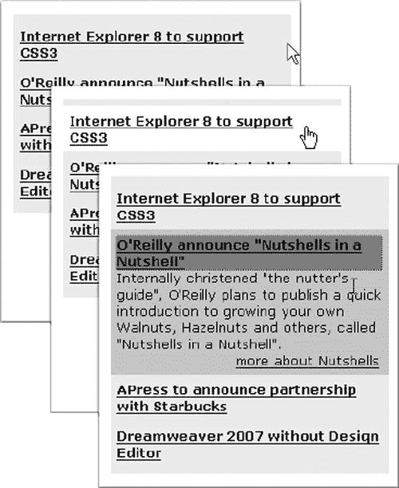
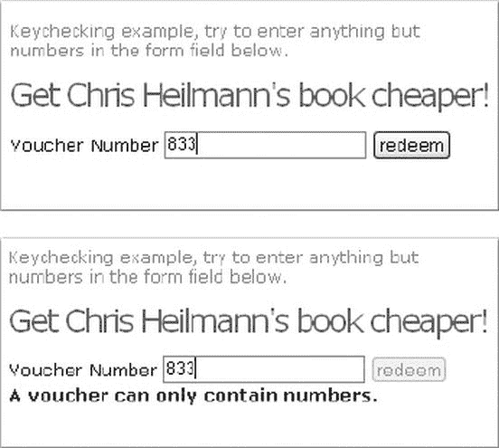

# 五、表现和行为（CSS 和事件处理）

在上一章中，你拆开了一个 HTML 文档，看看里面是什么。你拨弄了一些电缆，更换了一些零件，使发动机处于原始状态。现在是时候看看如何用层叠样式表(CSS)给文档添加新的色彩，并通过事件启动它了。如果你追求的是美，那么你很幸运，因为我们从表示层 开始。

通过 JavaScript 改变表示层

HTML 文档中的每个元素都有一个 style 属性作为其属性之一，该属性是其所有可视属性的集合。您可以读取或写入属性的值，如果您将值写入属性，您将立即改变元素的外观。

 **注**我们在整章中都使用了我们在前一章中创建的 DOMhelp 库(实际上，在本书的其余部分也是如此)。

对于初学者，请尝试以下脚本:

*exampleStyleChange.html*

```js
<!doctype html>
<html>
<head>
<meta charset="UTF-8">
<title>Example: Accessing the style collection</title>
<style type="text/css">
</style>
<script type="text/javascript" src="DOMhelp.js"></script>
<script type="text/javascript" src="styleChange.js"></script>
</head>
<body>
<h3>Contact Details</h3>
<address>
  Awesome Web Production Company<br>
  Going Nowhere Lane 0<br>
  Catch 22<br>
N4 2XX<br>
  England<br>
</address>
</body>
</html>
```

*styleChange.js*

```js
var sc = {
  init:function(){
    sc.head = document.getElementsByTagName('h3')[0];
    if(!sc.head){return;}
    sc.ad = DOMhelp.closestSibling(sc.head,1);
    sc.ad.style.display='none';
    var t = DOMhelp.getText(sc.head);
    var collapseLink = DOMhelp.createLink('#',t);
    sc.head.replaceChild(collapseLink,sc.head.firstChild);
    DOMhelp.addEvent(collapseLink,'click',sc.peekaboo,false)
    collapseLink.onclick = function(){return;} // Safari fix
  },
  peekaboo:function(e){
    sc.ad.style.display=sc.ad.style.display=='none'? '':'none';
    DOMhelp.cancelClick(e);
}
}
DOMhelp.addEvent(window,'load',sc.init,false);
```

 **注**耐心是关键。addEvent()和 cancelClick()部分将在本章的第二部分解释。

该脚本获取文档中的第一个 H3 元素，并通过 DOMhelp 库的 closestSibling helper 方法获取 ADDRESS 元素。(该方法确保检索下一个元素，而不是被视为文本节点的换行符。)然后，它修改其样式集合的 display 属性来隐藏地址。它用一个指向函数 peekaboo 的链接替换标题中的文本。该链接对于允许键盘用户展开和折叠地址是必要的。虽然鼠标用户可以很容易地点击标题，但不能通过在文档中跳 tab 键来访问它。peekaboo()函数读取地址样式集合的显示值，如果 display 设置为 none，则替换为空字符串，如果 display 设置为空字符串以外的值，则替换为 none——有效地隐藏和显示地址，如图[图 5-1](#Fig1) 所示。



[图 5-1](#_Fig1) 。地址的两种状态(折叠和展开)

 **注意**你可能在过去遇到过使用 element.style.display='block '作为 none 反义词的脚本。这适用于大多数元素，但是简单地将显示值设置为 nothing 会将其重置为初始显示值——不一定是 block 它可以是内联的或表格行的。如果添加一个空字符串，就让浏览器来设置适当的值；否则，你必须为不同的元素添加一个开关块或 if 条件。

样式集合包含当前元素的所有样式设置，您可以使用不同 CSS 选择器的属性表示法来修改这些设置。属性符号的经验法则是，在 CSS 选择器中删除破折号，并对整个选择器使用 camelCase。例如，行高变成行高，右边变成右边。有一个很长的可用属性列表，但是它们可以分为以下几类:

*   背景
*   边框/轮廓
*   生成的内容
*   目录
*   混杂的
*   边距/填充
*   定位/布局
*   印刷
*   桌子
*   文本

 **注意**在 https://developer.mozilla.org/en-US/docs/CSS/CSS_Reference 的 Mozilla 开发者网络上有一个包含厂商前缀 CSS 的参考指南。

可以使用 getAttribute()和 setAttribute()读写样式属性；但是，如果您编写它们，使用 JavaScript 对象属性语法将样式属性设置为字符串值可能会更快。对于浏览器来说，下面的两个例子是一样的，但是后者可能渲染得更快一些，并且可以让你的 JavaScript 更短:

```js
var warning=document.createElement('div');

warning.style.borderColor='#c00';
warning.style.borderWidth='1px';
warning.style.borderStyle='solid';
warning.style.backgroundColor='#fcc';
warning.style.padding='5px';
warning.style.color='#c00';
warning.style.fontFamily='Arial';

// is the same as
warning.setAttribute( 'style' ,  'font-family:arial;color:#c00;
padding:5px;border:1px solid #c00;background:#fcc');
```

尽管在现代 web 设计中直接设置样式属性是不可取的(因为你有效地混合了行为层和表示层，使得维护变得更加困难)，但是有些情况下你必须通过 JavaScript 直接设置样式属性——例如:

*   修复浏览器在 CSS 支持方面的缺点
*   动态改变元素的尺寸以修复布局故障
*   制作文档各部分的动画
*   使用拖放功能创建丰富的用户界面

 **注**在本章的后面你会听到列表中的前两项。然而，您在这里找不到动画或拖放示例，因为这些是高级 JavaScript 主题，需要大量解释，超出了本书的范围。你会在第 11 章中找到现成的例子。

对于简单的样式任务，为了简化脚本的维护，应该避免在 JavaScript 中定义外观。在第三章中，我谈到了现代 web 开发的主要特征:开发层的分离。

如果在 JavaScript 中使用了大量的样式定义，就会混淆表示层和行为层。如果几个月后你的应用的外观和感觉必须改变，你或者一些第三方开发者将不得不重新访问你的脚本代码并改变其中的所有设置。这既不必要也不可取，因为您可以通过将它放在 CSS 文档中来分离外观和感觉。

您可以通过动态更改元素的 class 属性来实现这种分离。这样，您可以应用或移除站点样式表中定义的样式设置。CSS 设计者不必担心你的脚本代码，你也不必知道浏览器在支持 CSS 方面的所有问题。你需要交流的只是这些类的名字。

例如，要将名为 dynamic 的类应用于 ID 为 nav 的元素，可以更改其 className 属性:

```js
var n=document.getElementById('nav');
n.className='dynamic';
```

 **注意**从逻辑上讲，你也应该能够通过 setAttribute()方法改变类，但是浏览器对此的支持是不可靠的(例如，Internet Explorer 不允许 class 或 style 作为属性)，这就是为什么目前坚持使用 className 是一个好计划。属性的名称是 className，而不是 class，因为 class 是 JavaScript 中的保留字，当用作属性时会导致错误。

您可以通过将其值设置为空字符串来移除该类。同样，removeAttribute()不能跨不同的浏览器可靠地工作。

正如你可能知道的，HTML 元素可以有多个 CSS 类分配给它们。以下类型的构造是有效的 HTML——有时是个好主意:

```js
<p class="intro special kids">Lorem Ipsum</p>
```

在 JavaScript 中，只需在 className 值后面附加一个空格就可以实现。但是，存在浏览器不能正确显示您的类设置的危险，特别是当添加或删除导致 className 值中的前导或尾随空格时。下面两个例子可以在当前的浏览器中正常显示(在 IE 7 中也可以正常显示):

```js
<p class="intro special kids ">Lorem Ipsum</p>
<p class=" intro special kids">Lorem Ipsum</p>
```

您可以使用助手方法来解决这个问题。编写这个 helper 方法来动态地添加和删除类应该很容易:如果 className 属性不为空，则在类值前面附加一个空格，如果为空，则不附加空格。从原始值中删除类名就像从字符串中删除单词一样。然而，因为你需要用孤儿空间来解决浏览器的问题，所以事情要比这复杂一些。下面的工具方法包含在 DOMhelp 中，您可以使用它在元素中动态添加和移除类。您还可以使用此方法来测试某个类是否已经添加到元素中:

```js
function cssjs(a,o,c1,c2){
  switch (a){
    case 'swap':
      if(!DOMhelp.cssjs('check',o,c1)){
       o.className.replace(c2,c1);
      }else{
        o.className.replace(c1,c2);
      }
    break;
    case 'add':
      if(!domtab.cssjs('check',o,c1)){
       o.className+=o.className?''+c1:c1;
      }
    break;
    case 'remove':
      var rep=o.className.match(''+c1)?''+c1:c1;
      o.className=o.className.replace(rep,'');
    break;
    case 'check':
      var found=false;
      var temparray=o.className.split('');
      for(var i=0;i<temparray.length;i++){
        if(temparray[i]==c1){found=true;}
      }
      return found;
    break;
  }
}
```

不要太担心这个方法的内部工作方式——一旦你掌握了 match()和 replace()方法，你就会明白了，这将在第 8 章中讲述。现在，你所需要知道的就是如何使用它，为此你需要使用这个方法的四个参数:

*   a 是必须采取的行动，有以下选项:

*   swap 用一个类替换另一个类。
*   添加一个新类。
*   删除删除一个类。
*   检查测试该类是否已经应用。

*   o 是要添加类或从中删除类的对象。
*   c1 和 c2 是类名，只有当动作是 swap 时才需要 c2。

让我们使用方法重新编码前面的例子——这一次通过动态地应用和移除一个类来隐藏和显示地址。

*exampleClassChange.html*

```js
<!doctype html>
<html>
<head>
<meta charset="UTF-8">
<title>Example: Dynamically changing classes</title>
<link rel="stylesheet" href="classChange.css">
<script type="text/javascript" src="DOMhelp.js"></script>
<script type="text/javascript" src="classChange.js"></script>
</head>
<body>
<h3>Contact Details</h3>
<address>
  Awesome Web Production Company<br>
  Going Nowhere Lane 0<br>
  Catch 22<br>
N4 2XX<br>
  England<br>
</address>
</body>
</html>
```

样式表中包含一个名为 hide 的类，它将隐藏应用到它的任何元素。这是通过使用 CSS 剪辑来完成的。剪辑定义了这个绝对定位元素的可见区域。为了让屏幕阅读器能够阅读内容，它的大小为 1 像素。那个！重要规则告诉浏览器覆盖 CSS 中的任何其他声明。通过改变可见性或显示属性来隐藏元素的问题是，帮助盲人用户的屏幕阅读器可能不会向他们提供内容，尽管它在浏览器中是可见的。

*classChange.css (excerpt)*

```js
.hide{
position: absolute !important;
clip: rect(1px 1px 1px 1px); /* IE6, IE7 */
clip: rect(1px, 1px, 1px, 1px);
padding: 0 !important;
border: 0 !important;
height: 1px !important;
width: 1px !important;
overflow: hidden;
}
```

您在脚本开始时将类名指定为参数，这意味着如果有人需要在稍后阶段更改名称，他不必检查整个脚本。

如果你开发了一个非常复杂的站点，需要添加和删除许多不同的类，你可以把它们转移到它们自己的 JavaScript include 文件中，并包含它们自己的对象。对于这个例子来说，这样的移动有点过了——但是我稍后会回到这个选项。

 **注意** DOMhelp 已经包含了 cssjs()方法；因此，您不需要将其包含在此示例中。

*classChange.js*

```js
var sc={

   // CSS classes
   hidingClass:'hide', // Hide elements

  init:function(){
    sc.head=document.getElementsByTagName('h3')[0];
    if(!sc.head){return;}
    sc.ad=DOMhelp.closestSibling(sc.head,1);

    DOMhelp.cssjs('add',sc.ad,sc.hidingClass);

    var t=DOMhelp.getText(sc.head);
    var collapseLink=DOMhelp.createLink('#',t);
    sc.head.replaceChild(collapseLink,sc.head.firstChild);
    DOMhelp.addEvent(collapseLink,'click',sc.peekaboo,false)
    collapseLink.onclick=function(){return;} // Safari fix
  },
  peekaboo:function(e){

    if(DOMhelp.cssjs('check',sc.ad,sc.hidingClass)){
       DOMhelp.cssjs('remove',sc.ad,sc.hidingClass)
    } else {
       DOMhelp.cssjs('add',sc.ad,sc.hidingClass)
    }

    DOMhelp.cancelClick(e);
  }
}
DOMhelp.addEvent(window,'load',sc.init,false);
```

帮助 CSS 设计者

DOM 脚本化和将 CSS 分成可以动态应用和移除的类，可以让 web 设计人员的工作变得更加轻松。使用 DOM 和 JavaScript，你可以比使用 CSS 选择器更深入地了解文档。例如，一个常见的请求是寻找一种方法来到达 CSS 中的父元素以获得悬停效果。在 CSS 中，这是不可能的；在 JavaScript 中，通过 parentNode 很容易实现。使用 JavaScript 和 DOM，您可以通过修改 HTML 内容来应用类和 id，生成内容，甚至通过添加或删除样式和链接元素来添加和删除整个样式表，从而为设计者提供样式表的动态挂钩。

轻松设计动态页面

让设计者尽可能容易地为网站的脚本增强版本和非脚本版本创建不同的样式是非常重要的。非脚本版本可以更简单，所需的样式也更少。(例如，在 HTML 地址示例中，只有在启用了 JavaScript 时，才需要为 H3 内部定义链接样式，因为链接是通过 JavaScript 生成的。)当启用脚本时，为设计者提供唯一标识符的一个非常简单的方法是将一个类应用于主体或布局的主要元素。

*dynamic styling . js—在 exampleDynamicStyling.html 使用*

```js
var sc={

  // CSS classes
  hidingClass:'hide', // Hide elements
  DOMClass:'dynamic', // Indicate DOM support

  init:function(){

    // Check for DOM and apply a class to the body if it is supported
    if(!document.getElementById || !document.createElement){return;}
    DOMhelp.cssjs('add',document.body,sc.DOMClass);

    sc.head=document.getElementsByTagName('h3')[0];
    if(!sc.head){return;}
    sc.ad=DOMhelp.closestSibling(sc.head,1);
    DOMhelp.cssjs('add',sc.ad,sc.hidingClass);
    var t=DOMhelp.getText(sc.head);
    var collapseLink=DOMhelp.createLink('#',t);
    sc.head.replaceChild(collapseLink,sc.head.firstChild);
    DOMhelp.addEvent(collapseLink,'click',sc.peekaboo,false)
    collapseLink.onclick=function(){return;} // Safari fix
  },
  peekaboo:function(e){
    if(DOMhelp.cssjs('check',sc.ad,sc.hidingClass)){
       DOMhelp.cssjs('remove',sc.ad,sc.hidingClass)
    } else {
       DOMhelp.cssjs('add',sc.ad,sc.hidingClass)
    }
    DOMhelp.cancelClick(e);
  }
}
DOMhelp.addEvent(window,'load',sc.init,false);
```

这样，CSS 设计者可以在样式表中定义禁用 JavaScript 时要应用的设置，并在启用 JavaScript 时用其他设置覆盖它们，方法是在后代选择器中使用带有类名的主体:

*dynamic drive . CSS*

```js
*{
  margin:0;
  padding:0;
}
body{
  font-family:Arial,Sans-Serif;
  font-size:small;
  padding:2em;
}

/* JS disabled */
address{
  background:#ddd;
  border:1px solid #999;
  border-top:none;
  font-style:normal;
  padding:.5em;
  width:15em;
}
h3{
  border:1px solid #000;
  color:#fff;
  background:#369;
  padding:.2em .5em;
  width:15em;
  font-size:1em;
}

/* JS enabled */
body.dynamic address{
  background:#fff;
  border:none;
  font-style:normal;
  padding:.5em;
  border-top:1px solid #ccc;
}
body.dynamic h3{
  padding-bottom:.5em;
  background:#fff;
  border:none;
}
body.dynamic h3 a{
  color:#369;
}

/* dynamic classes */
.hide{
position: absolute !important;
clip: rect(1px 1px 1px 1px); /* IE6, IE7 */
clip: rect(1px, 1px, 1px, 1px);
padding: 0 !important;
border: 0 !important;
height: 1px !important;
 width: 1px !important;
overflow: hidden;
}
```

现在的地址示例——取决于 JavaScript 和 DOM 是否可用——可以有两种完全不同的外观(其中一种有两种状态),如图 5-2 所示。


[图 5-2](#_Fig2) 。地址的三种状态(非动态版本、折叠和扩展)

如果你的网站不太复杂，没有很多动态元素，这种方式会很好。对于更复杂的站点，您可以对非 JavaScript 版本和 JavaScript 版本使用不同的样式表，并通过 JavaScript 添加后者。这还有一个额外的好处:低级用户不必加载对他没有任何用处的样式表。您可以通过在文档头创建一个新的 LINK 元素来添加动态样式表。在本例中，首先包含一个低级样式表:

*exampleStyleSheetChange.html*

```js
<!doctype html>
<html>
<head>
<meta charset="UTF-8">
<title>Example: Dynamically applying new Style Sheets </title>
<link href="lowlevel.css" rel="stylesheet">
<script type="text/javascript" src="DOMhelp.js"></script>
<script type="text/javascript" src="styleSheetChange.js"></script>
</head>
<body>
<h3>Contact Details</h3>
<address>
  Awesome Web Production Company<br>
  Going Nowhere Lane 0<br>
  Catch 22<br>
N4 2XX<br>
  England<br>
</adress>
</body>
</html>
```

该脚本检查 DOM 支持，并添加一个指向高级样式表的新 link 元素:

*styleSheetChange.js*

```js
sc={
  // CSS classes

  hidingClass:'hide', // Hide elements
  highLevelStyleSheet:'highlevel.css', // Style sheet for dynamic site

  init:function(){

    // Check for DOM and apply a class to the body if it is supported
    if(!document.getElementById || !document.createElement){return;}

    var newStyle=document.createElement('link');
    newStyle.setAttribute('type','text/css');
    newStyle.setAttribute('rel','stylesheet');
    newStyle.setAttribute('href',sc.highLevelStyleSheet);
    document.getElementsByTagName('head')[0].appendChild(newStyle);

    sc.head=document.getElementsByTagName('h3')[0];
    if(!sc.head){return;}
    sc.ad=DOMhelp.closestSibling(sc.head,1);
    DOMhelp.cssjs('add',sc.ad,sc.hidingClass);
    var t=DOMhelp.getText(sc.head);
    var collapseLink=DOMhelp.createLink('#',t);
    sc.head.replaceChild(collapseLink,sc.head.firstChild);
    DOMhelp.addEvent(collapseLink,'click',sc.peekaboo,false)
    collapseLink.onclick=function(){return;} // Safari fix
  },
  peekaboo:function(e){
    if(DOMhelp.cssjs('check',sc.ad,sc.hidingClass)){
       DOMhelp.cssjs('remove',sc.ad,sc.hidingClass)
    } else {
       DOMhelp.cssjs('add',sc.ad,sc.hidingClass)
    }
    DOMhelp.cancelClick(e);
  }
}
DOMhelp.addEvent(window,'load',sc.init,false);
```

脚本执行后，HTML 示例的头部如下所示。(您可以在 Firefox 中测试这一点，方法是通过 Ctrl+A 或 Cmd+A 选择整个文档，然后右键单击任意位置并选择“查看所选源代码”。)

*剧本执行后的 exampleStyleSheetChange.html(节选)*

```js
<head>
<meta charset=utf-8">
<title>Example: Using dynamic classes</title>
<link href="lowlevel.css" rel="stylesheet">
<script type="text/javascript" src="DOMhelp.js"></script>
<script type="text/javascript" src="styleSheetChange.js"></script>
<link href="highlevel.css" rel="StyleSheet" type="text/css">
</head>
```

你可能早就遇到过风格的动态变化。早在 2001 年，所谓的*风格转换者* 开始流行。这些是小的页面部件，允许用户通过从给定的列表中选择样式来选择页面的外观。一些现代浏览器内置了这个选项——例如，在 Firefox 中，你可以选择视图、页面样式，并获得所有可用的样式供选择。

演示 exampleStyleSwitcher.html 展示了这是如何做到的。在 HTML 中，为大字体和高对比度定义主样式表和备用样式表:

*exampleStyleSwitcher.html(节选)*

```js
<link href="demoStyles.css" title="Normal"
      rel="stylesheet" type="text/css">
<link href="largePrint.css" title="Large Print"
      rel="alternate stylesheet" type="text/css">
<link href="highContrast.css" title="High Contrast"
      rel="alternate stylesheet" type="text/css">
```

剧本并不复杂。遍历文档中的所有链接元素，并确定每个元素的属性是样式表还是备用样式表。您创建一个新列表，其中的链接指向一个函数，该函数禁用除当前选择的样式表之外的所有样式表，并将该列表添加到文档中。

您从两个属性开始:一个存储*样式菜单*的 ID 以允许 CSS 样式化，另一个存储一个标签以显示为所有可用样式之前的第一个列表项。

*style switch . js*

```js
switcher={
  menuID:'styleswitcher',
  chooseLabel:'Choose Style:',
```

名为 init()的初始化方法创建一个新的 HTML 列表，并添加一个带有标签的列表项作为文本内容。您将列表的 ID 设置为属性中定义的 ID。

*styleSwitcher.js(续)*

```js
init:function(){
  var tempLI,tempA,styleTitle;
  var stylemenu=document.createElement('ul');
  tempLI=document.createElement('li');
  tempLI.appendChild(document.createTextNode(switcher.chooseLabel));
  stylemenu.appendChild(tempLI);
  stylemenu.id=switcher.menuID;
```

遍历文档中的所有链接元素。对于每个元素，测试其 rel 属性的值。如果该值既不是样式表也不是替代样式表，则跳过此链接元素。这对于避免通过链接标签提供的其他替代内容(如 RSS 提要)被禁用是必要的。

*styleSwitcher.js(续)*

```js
var links=document.getElementsByTagName('link');
for(var i=0;i<links.length;i++){
  if(links[i].getAttribute('rel')!='stylesheet'&& links[i].getAttribute('rel')!='alternate stylesheet'){
    continue;
  }
```

为每种样式创建一个带有链接的新列表项，并将链接的文本值设置为 link 元素的 title 属性的值。设置一个伪 href 属性，使链接显示为链接；否则，用户可能不会将新链接识别为交互元素。

*styleSwitcher.js(续)*

```js
tempLI=document.createElement('li');
tempA=document.createElement('a');
styleTitle=links[i].getAttribute('title');
tempA.appendChild(document.createTextNode(styleTitle));
tempA.setAttribute('href','#');
```

对链接应用一个事件处理程序，该处理程序触发 setSwitch()方法，并通过 this 关键字将链接本身作为参数发送。然后，您可以继续向菜单列表添加新的列表项，并在循环完成时将列表追加到文档正文。

*styleSwitcher.js(续)*

```js
    tempA.onclick=function(){
    switcher.setSwitch(this);
    }
    tempLI.appendChild(tempA);
    stylemenu.appendChild(tempLI);
  }
  document.body.appendChild(stylemenu);
},
```

在 setSwitch()方法中，您将检索作为参数 o 激活的链接。遍历所有链接元素，并测试每个元素以查看标题属性是否与链接的文本内容相同。(您可以通过 firstChild.nodeValue 安全地读取文本，而无需测试节点类型，因为您生成了链接。)如果标题不同，则将链接的 disabled 属性设置为 true 如果相同，则将 disable 设置为 false，并将 rel 属性设置为 stylesheet 而不是 alternate stylesheet。然后通过返回 false 来阻止链接被跟踪。

*styleSwitcher.js(续)*

```js
  setSwitch:function(o){
    var links=document.getElementsByTagName('link');
    for(var i=0;i<links.length;i++){
      if(links[i].getAttribute('rel')!='stylesheet'&&
      links[i].getAttribute('rel')!='alternate stylesheet'){
        continue;
      }
      var title=o.firstChild.nodeValue;
      if(links[i].getAttribute('title')!=title){
        links[i].disabled=true;
      } else {
        links[i].setAttribute('rel','stylesheet');
        links[i].disabled=false;
      }
    }
    return false;
  }
}
```

您可以通过在启用了 JavaScript 和 CSS 的浏览器中打开 exampleStyleSwitcher.html 来测试功能。

样式转换器可能是一个有用的功能，特别是当您提供的样式可能有助于用户克服视力不好等问题时，例如更大的字体或前景和背景之间的更高对比度。另一方面，如果你只是为了提供不同的风格而使用它们，它们可能是毫无意义的视觉享受。

多年来，转换者经历了许多变化。2005 年，Dustin Diaz 接受了这个想法，将 PHP 切换器的稳定性与 JavaScript 增强界面的光滑性结合起来，使用 Ajax 来弥合这一差距。你可以在他题为“不引人注目的可降解 Ajax 样式表切换器”([http://24ways.org/advent/introducing-udasss](http://24ways.org/advent/introducing-udasss))的博客文章中了解更多信息。

风格转换器思想的演变表明 JavaScript 解决方案从来都不是一成不变的。它们需要在现实世界中进行测试，并从用户和其他开发人员那里获得反馈，以便真正适用于生产环境或现场。如果你最近在网上冲浪，你会看到许多试验性的脚本承诺了很多，但是仔细观察，它们被证明是缓慢的，不稳定的，或者只是一个巧妙的技巧，可以用另一种技术做得更好。在 JavaScript 中你可以做任何事情并不意味着你应该这样做。

简化脚本的维护

将整体的外观和感觉保留在脚本之外和样式表之内(因此这是 CSS 设计者的责任)只是成功的一半。在项目维护期间，CSS 类名可能需要更改——例如，为了支持某个后端或内容管理系统(CMS) 。因此，让设计者容易地更改动态应用的类的名称是很重要的。最基本的技巧是将类名保存在它们自己的变量或参数中。您已经在前面的示例中完成了。您可以直接应用类名:

```js
sc={
  init:function(){
    // Check for DOM and apply a class to the body if it is supported
    if(!document.getElementById || !document.createElement){return;}
    DOMhelp.cssjs('add',document.body, 'dynamic');
    sc.head=document.getElementsByTagName('h3')[0];
    if(!sc.head){return;}
    sc.ad=DOMhelp.closestSibling(sc.head,1);
    DOMhelp.cssjs('add',sc.ad, 'hide');
    var t=DOMhelp.getText(sc.head);
    var collapseLink=DOMhelp.createLink('#',t);
    sc.head.replaceChild(collapseLink,sc.head.firstChild);
    DOMhelp.addEvent(collapseLink,'click',sc.peekaboo,false)
    collapseLink.onclick=function(){return;} // Safari fix
  },
  peekaboo:function(e){
    if(DOMhelp.cssjs('check',sc.ad,sc.hidingClass)){
       DOMhelp.cssjs('remove',sc.ad,sc.hidingClass)
    } else {
       DOMhelp.cssjs('add',sc.ad,sc.hidingClass)
    }
    DOMhelp.cancelClick(e);
  }
}
DOMhelp.addEvent(window,'load',sc.init,false);
```

相反，您将它们作为主对象的属性移出了方法，并对它们进行了注释，以允许不懂 JavaScript 的人在不危及方法的质量或功能的情况下更改类名:

```js
sc={

  // CSS classes
  hidingClass:'hide',        // Hide elements
  DOMClass:'dynamic',        // Indicate DOM support

  init:function(){
    if(!document.getElementById || !document.createElement){return;}
    DOMhelp.cssjs('add',document.body,sc.DOMClass);
    sc.head=document.getElementsByTagName('h3')[0];
    if(!sc.head){return;}
    sc.ad=DOMhelp.closestSibling(sc.head,1);
    DOMhelp.cssjs('add',sc.ad,sc.hidingClass);
    var t=DOMhelp.getText(sc.head);
    var collapseLink=DOMhelp.createLink('#',t);
    sc.head.replaceChild(collapseLink,sc.head.firstChild);
    DOMhelp.addEvent(collapseLink,'click',sc.peekaboo,false);
    collapseLink.onclick=function(){return;} // Safari fix
  },
  peekaboo:function(e){
    // More code snipped
  }
}
DOMhelp.addEvent(window,'load',sc.init,false);
```

对于没有很多不同 JavaScript includes 的较小脚本和项目来说，这就足够了——如果附带一些相关文档的话。如果您有许多分散在几个文档中的动态类，或者您非常担心非编码者会更改您的代码，那么您可以使用一个单独的 JavaScript include 文件，其中包含一个名为 CSS 的对象，所有的类都作为参数。给它一个明显的文件名，如 cssClassNames.js，并在项目文档中记录它的存在。

cssclassnames . js-CSS 类别名称

```js
css={
  // Hide elements
  hide:'hide',

  // Indicator for support of dynamic scripting
  // will be added to the body element
  supported:'dynamic'
}
```

您可以将它应用到文档中，就像正在使用的任何其他脚本一样:

*exampleDynamicStylingCSSObject.html*

```js
<head>
<meta charset="utf-8">
<title>Example: Importing class names from a CSS names object</title>
<link href="demoStyles.css" title="Normal" rel="stylesheet" type="text/css">
<script type="text/javascript" src="DOMhelp.js"></script>
<script type="text/javascript" src="cssClassNames.js"></script>
<script type="text/javascript" src="dynamicStylingCSSObject.js"></script>
</head>
```

这种方法的实际结果是，您不必为不同的 CSS 类名(通常包含“class ”,因此会让程序员感到困惑)想出参数名。相反，请使用以下内容:

*dynamic cstylingcssobject . js*

```js
sc={
  init:function(){
    if(!document.getElementById || !document.createElement){return;}

   DOMhelp.cssjs('add',document.body,
css.supported);

    sc.head=document.getElementsByTagName('h3')[0];
    if(!sc.head){return;}
    sc.ad=DOMhelp.closestSibling(sc.head,1);

    DOMhelp.cssjs('add',sc.ad,
css.hide);

    var t=DOMhelp.getText(sc.head);
    var collapseLink=DOMhelp.createLink('#',t);
    sc.head.replaceChild(collapseLink,sc.head.firstChild);
    DOMhelp.addEvent(collapseLink,'click',sc.peekaboo,false);
    collapseLink.onclick=function(){return;} // Safari fix
  },
  peekaboo:function(e){
    // More code snipped
  }
}
DOMhelp.addEvent(window,'load',sc.init,false);
```

在此示例中，cssClassNames.js 文件使用对象文字表示法。如果您使用 JSON([http://www.json.org/](http://www.json.org/))，这是一种将数据从一个程序或系统传输到另一个程序或系统的格式，您甚至可以更进一步，去掉注释。你将在[第 7 章](07.html)中听到更多关于 JSON 及其优点的内容。现在，注意到 JSON 允许您使带有类名的文件更易于阅读就足够了:

cssclassnamejson . js

```js
css={
"hide elements" : "hide",
"dynamic scripting enabled" : "dynamic"
}
```

现在，您必须像读取关联数组一样读取数据，而不是之前使用的属性符号:

*dynamic cstylingjson . js*

```js
sc={
  init:function(){
    if(!document.getElementById || !document.createElement){return;}

   DOMhelp.cssjs('add',document.body, css['dynamic scripting enabled']);

    sc.head=document.getElementsByTagName('h3')[0];
    if(!sc.head){return;}
    sc.ad=DOMhelp.closestSibling(sc.head,1);

    DOMhelp.cssjs('add',sc.ad,
css['hide elements']);

    var t=DOMhelp.getText(sc.head);
    var collapseLink=DOMhelp.createLink('#',t);
    sc.head.replaceChild(collapseLink,sc.head.firstChild);
    DOMhelp.addEvent(collapseLink,'click',sc.peekaboo,false);
    collapseLink.onclick=function(){return;} // Safari fix
  },
  peekaboo:function(e){
    // More code snipped
  }
}
DOMhelp.addEvent(window,'load',sc.init,false);
```

你是否想把表现和行为分开，这完全取决于你。根据项目的复杂性和维护人员的知识，它可能只是防止许多可避免的错误。

克服 CSS 支持问题

近年来，CSS 对于 web 开发变得越来越重要。所有的页面布局现在都由 CSS 处理，将页面内容从设计中分离出来。这种分离的好处之一是，您可以根据站点的显示位置，为站点设置不同的布局。例如，由于桌面、平板电脑和手机的屏幕大小不同，您可以使用不同的 CSS 文件来相应地布局网站。

浏览器对 CSS 的支持有所改进，但是随着新功能的增加，您可能会遇到供应商前缀之类的问题:

```js
background-color:#444444;
background-image: -webkit-gradient(linear, left top, left bottom, from(#444444), to(#999999));
/*Safari 4+,Chrome*/

background-image:-webkit-linear-gradient(top,#444444,#999999);
/*Chrome 10+,Safari5.1+,iOS5+*/

background-image:-moz-linear-gradient(top,#444444,#999999);
/*Firefox 3.6-15*/

background-image:-o-linear-gradient(top,#444444,#999999);
/*Opera 11.10-12.0*/

background-image:linear-gradient(top,bottom,#444444,#999999);
/* Firefox 16+, IE10, Opera 12.50+ */
```

下面是供应商前缀的一个例子。根据浏览器的版本或类型(移动或桌面)，其中一些功能可能需要有前缀。虽然您将获得相同的效果，但浏览器使用 CSS 添加该效果的能力可能取决于您是否使用供应商前缀。

高度相同的多列

对于以前只处理过表格布局的设计师来说，CSS 布局最令人讨厌的一点是，如果你对列使用 CSS 浮动技术，它们就没有相同的高度，如图[图 5-3](#Fig3) 所示。



[图 5-3](#_Fig3) 。多列高度问题

让我们从新闻条目列表开始，每个条目包含一个标题、一个“预告”段落和一个“更多”链接。

*exampleColumnHeightIssue.html(带有虚拟内容)*

```js
<ul id="news">
<li>
<h3><a href="news.php?item=1">News Title 1</a></h3>
<p>Description 1</p>
<p class="more"><a href="news.php?item=1">more link 1</a></p>
</li>
<li>
<h3><a href="news.php?item=2">News Title 2</a></h3>
<p>Description 2</p>
<p class="more"><a href="news.php?item=2">more link 2</a></p>
</li>
<li>
<h3><a href="news.php?item=3">News Title 3</a></h3>
<p>Description 3</p>
<p class="more"><a href="news.php?item=1">more link 3</a></p>
</li>
<li>
<h3><a href="news.php?item=1">News Title 1</a></h3>
<p>Description 4</p>
<p class="more"><a href="news.php?item=4">more link 4</a></p>
</li>
</ul>
```

如果现在应用一个将列表项和主列表浮动到左侧的样式表，然后设置更多的文本和布局样式，就会得到一个多列布局。实现这一点的 CSS 非常简单:

*蹈腔郪眽. css*

```js
#news{
  width:800px;
  float:left;
}
#news li{
  width:190px;
  margin:0 4px;
  float:left;
  background:#eee;
}
#news h3{
  background:#fff;
  padding-bottom:5px;
  border-bottom:2px solid #369;
}
#news li p{
  padding:5px;
}
```

正如您在示例中看到的，每一列都有不同的高度，段落和“更多”链接都不在同一位置。这使得设计看起来不均匀，会使读者困惑。可能有一种 CSS 方法可以解决这个问题(我总是对人们找到的黑客和变通方法印象深刻)，但是让我们使用 JavaScript 来解决这个问题。

以下脚本(在文档头中调用)将修复该问题:

*fixcolumnheight . js—在 exampleFixedColumnHeightIssue.html 使用*

```js
fixcolumns={

  highest:0,
  moreClass:'more',

  init:function(){
    if(!document.getElementById || !document.createTextNode){return;}
    fixcolumns.n=document.getElementById('news');
    if(!fixcolumns.n){return;}
    fixcolumns.fix('h3');
    fixcolumns.fix('p');
    fixcolumns.fix('li');
  },
  fix:function(elm){
    fixcolumns.getHighest(elm);
    fixcolumns.fixElements(elm);
  },
  getHighest:function(elm){
    fixcolumns.highest=0;
    var temp=fixcolumns.n.getElementsByTagName(elm);
    for(var i=0;i<temp.length;i++){
      if(!temp[i].offsetHeight){continue;}
      if(temp[i].offsetHeight>fixcolumns.highest){
        fixcolumns.highest=temp[i].offsetHeight;
      }
    }
  },
  fixElements:function(elm){
    var temp=fixcolumns.n.getElementsByTagName(elm);
    for(var i=0;i<temp.length;i++){
      if(!DOMhelp.cssjs('check',temp[i],fixcolumns.moreClass)){
        temp[i].style.height=parseInt(fixcolumns.highest)+'px';
      }
    }
  }
}
DOMhelp.addEvent(window, 'load', fixcolumns.init, false);
```

首先，定义一个参数来存储最高元素的高度和用于“更多”链接的类。(后者很重要，我很快会解释。)在 init()方法中，测试 DOM 支持，并检查 ID 为 news 的必要元素是否可用。将元素存储在属性 n 中，以便在其他方法中重用。然后为列表中包含的每个元素调用 fix()方法——标题、段落，最后是列表项。最后更改列表项很重要，因为当其他元素的最大高度固定时，它们的最大高度可能会改变。

*fixColumnHeight.js(节选)*

```js
fixcolumns={

  highest:0,
  moreClass:'more',

  init:function(){
    if(!document.getElementById || !document.createTextNode){return;}
    fixcolumns.n=document.getElementById('news');
    if(!fixcolumns.n){return;}
    fixcolumns.fix('h3');
    fixcolumns.fix('p');
    fixcolumns.fix('li');
  },
```

fix()方法调用两个额外的方法:一个找出应用于每个项目的最大高度，另一个应用这个高度。

*fixColumnHeight.js(节选)*

```js
fix:function(elm){
  fixcolumns.getHighest(elm);
  fixcolumns.fixElements(elm);
},
```

getHighest()方法首先将参数 Highest 设置为 0，然后遍历列表中与作为 elm 参数发送的元素名称相匹配的所有元素。然后，它通过读取 offsetHeight 属性来检索元素的高度。该属性存储元素被浏览器呈现后的高度。然后，该方法检查元素的高度是否大于属性 highest，如果是，则将属性设置为新值。这样，你就能找出哪个元素是最高的。

*fixColumnHeight.js(节选)*

```js
getHighest:function(elm){
  fixcolumns.highest=0;
  var temp=fixcolumns.n.getElementsByTagName(elm);
  for(var i=0;i<temp.length;i++){
    if(!temp[i].offsetHeight){continue;}
    if(temp[i].offsetHeight>fixcolumns.highest){
      fixcolumns.highest=temp[i].offsetHeight;
    }
  }
},
```

 **注意**您需要在这里将最高参数重置为 0，因为 getHighest()需要查找作为参数发送的元素中的最高值，而不是您修复的所有元素中的最高值。如果出于某种反常的意外，H3 高于最高的段落，你会在段落和“更多”链接之间产生间隙。

然后, fixElements()方法将最大高度应用于具有给定名称的所有元素。请注意，您需要测试确定“更多”链接的类；否则，链接的高度将与内容最高的段落相同。

```js
fixElements:function(elm){
  var temp=fixcolumns.n.getElementsByTagName(elm);
  for(var i=0;i<temp.length;i++){
    if(!DOMhelp.cssjs('check',temp[i],fixcolumns.moreClass)){
      temp[i].style.height = fixcolumns.highest +'px';
    }
  }
}
```

 **注意**你需要把最高的参数变成一个数字，加上一个 *px* 后缀，然后再应用到元素的高度。情况总是如此；当涉及到元素的 CSS 尺寸时，你不能简单地分配一个没有单位的数字。

缺少支持:盘旋

CSS 规范允许您在文档的任何元素上使用:hover 伪类，许多浏览器都支持这一点。这允许设计者突出显示文档的大部分，甚至模拟动态的折叠导航菜单，这在以前只有 JavaScript 才能实现。虽然没有 CSS 或 JavaScript 就不能交互的东西在鼠标悬停时是否应该获得不同的状态值得讨论，但这是设计者可以大量使用的功能——毕竟高亮显示文档的当前部分可能会使其更容易阅读。

要查看示例，再次获取新闻条目列表并应用不同的样式表。如果你想在 CSS-2 兼容的浏览器中突出显示一个完整的列表项，你需要做的就是在列表项上定义一个悬停状态:

*与 exampleListItemRollover.html 一起使用的 listItemRolloverCSS.css(节选)*

```js
#news{
  font-size:.8em;
  background:#eee;
  width:21em;
  padding:.5em 0;
}
#news li{
  width:20em;
  padding:.5em;
  margin:0;
}
#news li:hover{
  background:#fff;
}
```

在 Firefox 19.0.2 上，效果出现如图[图 5-4](#Fig4) 所示。


[图 5-4](#_Fig4) 。CSS 中使用:hover 伪选择器的翻转效果

在 IE 6 中，你不会得到这种效果，因为它不支持:列表项悬停。但是，它支持 JavaScript，这意味着当用户将指针悬停在列表项上时，您可以使用 cssjs 方法动态添加一个类:

*listItemRollover.css(节选)*

```js
#news{
  font-size:.8em;
  background:#eee;
  width:21em;
  padding:.5em 0;
}
#news li{
  width:20em;
  padding:.5em;
  margin:0;
}
#news li:hover{
  background:#fff;
}
#news li.over{
  background:#fff;

}
```

您可以通过 onmouseover 和 onmouseout 事件处理程序并使用 this 关键字来添加该类——我们将在本章后面更详细地讨论这一点。

*listItemRollover.js(节选)*

```js
newshl={
  overClass:'over',
  init:function(){
if(!document.getElementById || !document.createTextNode){return;}
    var newsList=document.getElementById('news');
    if(!newsList){return;}
    var newsItems=newsList.getElementsByTagName('li');
    for(var i=0;i<newsItems.length;i++){
      newsItems[i].onmouseover=function(){
        DOMhelp.cssjs('add',this,newshl.overClass);
      }
      newsItems[i].onmouseout=function(){
        DOMhelp.cssjs('remove',this,newshl.overClass);
      }
    }
  }
}
DOMhelp.addEvent(window,'load',newshl.init,false);
```

如果你在 IE 6 中检查这个例子，你会得到和在更现代的浏览器中一样的效果。

您可以将 CSS 的伪类选择器用于动态效果(:hover，:active 和:focus)，但是它们只将它们的设置应用于当前元素中包含的元素。

有了 JavaScript，整个 DOM 家族(包括 parentNode、nextSibling、firstChild 等等)都由您支配。

例如，如果您希望当用户将指针悬停在链接上时有不同的翻转状态，您可以轻松地扩展脚本来实现这一点。首先，您需要一个活动状态的新类:

*listdouble 扷梓幂彻. CSS as used in examples double 扷梓幂彻. html*

```js
#news{
  font-size:.8em;
  background:#eee;
  width:21em;
  padding:.5em 0;
}
#news li{
  width:20em;
  padding:.5em;
  margin:0;
}
#news li:hover{
  background:#fff;
}
#news li.over{
  background:#fff;
}
#news li.active{
  background:#ffc;

}
```

然后，您需要将事件应用到列表项中的链接，并更改其父节点的父节点的类(因为本例中的链接要么在标题中，要么在段落中):

*上市 double 扷梓幂彻. js*

```js
newshl={
  // CSS classes
  overClass:'over',     // Hover state of list item
  activeClass:'active', // Hover state on a link

  init:function(){
    if(!document.getElementById || !document.createTextNode){return;}
    var newsList=document.getElementById('news');
    if(!newsList){return;}
    var newsItems=newsList.getElementsByTagName('li');
    for(var i=0;i<newsItems.length;i++){
      newsItems[i].onmouseover=function(){
        DOMhelp.cssjs('add',this,newshl.overClass);
      }
      newsItems[i].onmouseout=function(){
        DOMhelp.cssjs('remove',this,newshl.overClass);
      }
    }
    var newsItemLinks=newsList.getElementsByTagName('a');
    for(i=0;i<newsItemLinks.length;i++){
      newsItemLinks[i].onmouseover=function(){
        var p=this.parentNode.parentNode;
        DOMhelp.cssjs('add',p,newshl.activeClass);
      }
      newsItemLinks[i].onmouseout=function(){
        var p=this.parentNode.parentNode;
        DOMhelp.cssjs('remove',p,newshl.activeClass);
      }
    }
  }
}
DOMhelp.addEvent(window, 'load', newshl.init, false);
```

结果是新闻条目有两种不同的状态，如[图 5-5](#Fig5) 所示，这取决于用户的指针是悬停在文本上还是链接上。



[图 5-5](#_Fig5) 。单个元素的不同翻转状态

使用 JavaScript，您还可以使整个新闻项目可点击，这就是更多事件发挥作用的地方。

如果你有一把锤子，所有的东西看起来都像钉子

这几个例子应该让你明白，JavaScript 和 DOM 是非常强大的，可以让浏览器表现出你想要的效果。

然而，问题是这是否值得努力，界限在哪里。一个想法是与您的客户或团队讨论您需要支持多少版本。像 Firefox 和 Chrome 这样的浏览器有六周的发布周期。这对开发人员来说更好，他们希望在针对 DOM 或 CSS3 时有更大的一致性。一些开发公司有一个支持当前浏览器加三个版本的政策。

JavaScript 比 CSS 有一个很大的优势:与文档的交流是双向的。虽然 CSS 只处理已经给定的内容，但是 JavaScript 可以读取值、测试支持、检查元素是否可用以及它们是什么，如果需要的话，甚至可以动态地创建元素。CSS 只能阅读文档，就像你只能阅读报纸一样，但是 JavaScript 也可以改变它。

JavaScript 的这种能力在很多 CSS 技巧中都有使用。许多效果只有在外部标记的情况下才有可能实现——嵌套元素、清除元素等等。因此，开发人员开始通过 JavaScript 生成这些内容，而不是期望它们出现在 HTML 中。这使得源文档看起来更加整洁；然而，对于最终用户来说，最终的 DOM 树——包括所有生成的内容——是他必须处理的事情。膨胀的 HTML 不会因为通过 JavaScript 产生膨胀而变得更好。也许有时候从一开始就简化一个界面或者让它更灵活比试图通过大量 CSS 和 JavaScript 魔法让它表现得像表格更好。

通过事件处理改变文档的行为

事件处理可能是 JavaScript 为关注用户界面的开发者提供的最好的东西。这也是最令人困惑的 JavaScript 主题之一——不是因为它复杂，而是因为有不同的方法来实现它们。我现在将向你解释什么是事件；展示一种古老的、屡试不爽的处理事件的方法；然后解释 W3C 推荐的方法。最后，您将了解如何调整 W3C 兼容方法，以允许不支持它的浏览器理解您的脚本。

事件可以是许多事情，例如:

*   文档的初始加载和呈现
*   图像的加载
*   用户点击按钮
*   用户按下一个键
*   用户将鼠标移动到某个元素上

 **注意**想象一个事件处理程序，比如一个运动探测器或者门铃的触点——如果有人靠近门，灯就会打开；如果有人按下门铃的按钮，电路闭合，触发响铃机构发出声音。同样，您可以检测用户何时将鼠标悬停在链接上以触发一个功能，以及当用户单击该链接时触发另一个功能。

您可以应用事件处理程序，以几种方式让您的脚本知道正在发生什么。当内容安全策略(CSP)被强制执行时，最引人注目且不起作用的方法是在 HTML:

```js
<a href="moreinfo.html" onclick="return infoWindow(this.href)">more information</a>
```

在前面的章节中已经描述了一种更简洁的方法:通过类或 ID 来标识元素，然后在脚本中设置事件处理程序。同样重要的是要记住，当 CSP 启用时，此代码将不起作用。最简单且最受支持的方法是将事件处理程序作为属性直接应用于对象:

超文本标记语言

```js
<a href="moreinfo.html" id="info">more information</a>

```

Java Script 语言

```js
var triggerLink=document.getElementById('info');
triggerlink.onclick=infoWindow;
```

 **注意**你不需要测试 ID 为 info 的元素，因为函数只能被它调用。

以这种方式触发事件引发了几个问题:

*   你没有把元素发送给函数；相反，您需要再次找到该元素。
*   一次只能分配一个功能。
*   您独占地劫持了脚本中该元素的事件——试图将该元素用于其他事件的其他脚本的方法将不再工作。

除非您将 triggerLink 定义为全局变量或对象属性，否则函数 infoWindow()需要找到 trigger 元素才能使用。

```js
function infoWindow(){
  var url=document.getElementById('info').getAttribute('href');
  // Other code
}
```

这个问题以及多个函数连接到一个事件的问题可以通过应用一个匿名函数来解决，该匿名函数调用您的一个或多个真实函数，这也允许您通过 This 关键字发送当前对象:

```js
var triggerLink=document.getElementById('info');
triggerlink.onclick=function(){
  showInfoWindow(this.href);
  highLight(this);
  setCurrent(this);
}
function showInfoWindow(url){
  // Other code
}
```

第三个问题依然存在。只要您的脚本是文档中包含的最后一个脚本，它就会覆盖其他脚本的事件触发器，这意味着它不容易与其他脚本一起工作。因此，您需要一种方法来分配事件处理程序，而不覆盖其他脚本。当您希望在加载文档时调用不同的函数时，这一点尤其重要。

符合 W3C 的世界中的事件

W3C DOM-2 规范处理事件的方式略有不同，用 DOM-3 扩展了它们。首先，它们定义了事件发生的不同部分，直到详细使用检索到的数据:

*   *事件*就是发生的事情——例如，点击。
*   *事件处理程序*——例如 onclick——在 DOM-1 中，这是记录事件的位置。
*   *事件目标*是事件发生的地方——在大多数情况下，是一个 HTML 元素。
*   *事件监听器*是一个处理该事件的函数。
*   DOM-3 还引入了*事件捕获*的概念，这是控制事件如何通过 DOM 传播的能力。

应用事件

您可以通过 addEventListener()方法应用事件。这个函数有三个参数:字符串形式的事件，没有前缀上的*，事件监听器函数的名称(没有括号)，以及一个名为 useCapture 的布尔值，，它定义了是否应该使用事件捕捉。现在，将 useCapture 设置为 false 是安全的。通过使用 false，您的代码将在所有支持 addEventListener 的浏览器上工作(例如 9 版之前的 IE)。*

如果希望通过 addEventListener()将函数 infoWindow()应用于链接，可以使用以下代码:

```js
var triggerLink=document.getElementById('info');

triggerLink.addEventListener( 'click', infoWindow, false);
```

如果您希望通过在鼠标位于链接上方时调用 highlight()函数和在鼠标离开链接时调用 unhighlight()函数来添加悬停效果，您可以再添加几行:

```js
var triggerLink=document.getElementById('info');
triggerLink.addEventListener( 'click', infoWindow, false);
triggerLink.addEventListener( 'mouseout', highlight, false);

triggerLink.addEventListener( 'mouseover', unhighlight, false);
```

检查哪个事件在哪里以及如何被触发

就开发的容易程度而言，您似乎又回到了起点:您必须再次从 infoWindow()中找到读取 href 的元素。这是真的；然而，通过使用 addEventListener，您可以提示符合标准的浏览器提供给您*事件对象，*，您可以通过一个参数读出该对象。这个参数可以叫任何你喜欢的名字；你可能会发现大多数开发人员只调用 item。

你可能以前见过这个 e，想知道它是什么，在不知道它来自哪里的情况下，你是否应该相信它。当您应用事件时，最初简单地使用参数而不发送它是非常令人困惑的，但是一旦您了解了事件对象，您将永远不会回到使用 onevent 属性。事件对象有许多可以在事件监听器函数中使用的属性:

*   目标:触发事件的元素。
*   类型:触发的事件(例如，click)。
*   按钮:按下的鼠标按钮:0 表示向左，1 表示中间，2 表示向右。
*   keyCode:被按下的键的字符代码。W3C 规范也有密钥。在 IE 9 和更高版本中，key 将显示被按下的键。此外，webkit 浏览器不显示带有按键事件的箭头键的键码结果；请改用 keydown 或 keyup。
*   shiftKey、ctrlKey 和 Alt key:Boolean-如果分别按下 Shift、Ctrl 或 Alt 键，则为 true。

可用内容的完整列表取决于您正在收听的活动。你可以在 http://www.w3.org/TR/DOM-Level-3-Events/找到 DOM-3 规范中的所有属性。

使用 Event 对象，您可以轻松地使用一个函数来处理几个事件:

```js
var triggerLink=document.getElementById('info');
triggerLink.addEventListener( 'click', infoWindow, false);
triggerLink.addEventListener( 'mouseout', infoWindow, false);
triggerLink.addEventListener( 'mouseover', infoWindow, false);
```

您可以对所有三个事件使用相同的函数，并检查事件类型:

```js
function infoWindow(e){
  switch(e.type){
    case 'click':
       // Code to deal with the user clicking the link
    break;
    case 'mouseover':
       // Code to deal with the user hovering over the link
    break;
    case 'mouseout':
       // Code to deal with the user leaving the link
    break;
}
```

您还可以通过检查节点名来检查事件发生的元素。请注意，您必须再次使用 toLowerCase()来避免跨浏览器问题:

```js
function infoWindow(e){
  targetElement=e.target.nodeName.toLowerCase();
  switch(targetElement){
    case 'input':
       // Code to deal with input elements
    break;
    case 'a':
       // Code to deal with links
    break;
    case 'h1':
       // Code to deal with the main heading
    break;
  }
}
```

停止事件传播

分配事件并使用事件侦听器拦截它们也意味着您需要注意两个问题:一个是许多事件都有默认操作——例如，click 可能会使浏览器跟踪一个链接或提交一个表单，而 keyup 可能会向表单字段添加一个字符。

另一个问题被称为*事件冒泡*。这个术语基本上意味着当一个事件发生在一个元素上时，它也发生在初始元素的所有父元素上。

事件冒泡

让我们回到新闻列表的 HTML 标记:

*exampleEventBubble.html*

```js
<ul id="news">
<li>
<h3><a href="news.php?item=1">News Title 1</a></h3>
<p>Description 1</p>
<p class="more"><a href="news.php?item=1">more link 1</a></p>
</li>
<!-- and so on -->
</ul>
```

如果您现在将 mouseover 事件分配给列表中的链接，将鼠标悬停在它们上面也会触发任何事件侦听器，这些事件侦听器可能位于段落、列表项、列表以及节点树中所有其他元素之上，一直到文档正文。例如，您将看到如何将事件侦听器附加到每个元素，然后指向适当的函数:

event bubble . js

```js
bubbleTest={
  init:function(){
    if(!document.getElementById || !document.createTextNode){return;}
    bubbleTest.n=document.getElementById('news');
    if(!bubbleTest.n){return;}

    bubbleTest.addMyListeners('click',bubbleTest.liTest,'li');
    bubbleTest.addMyListeners('click',bubbleTest.aTest,'a');
    bubbleTest.addMyListeners('click',bubbleTest.pTest,'p');

  },
  addMyListeners:function(eventName,functionName,elements){
    var temp=bubbleTest.n.getElementsByTagName(elements);
    for(var i=0;i<temp.length;i++){
      temp[i].addEventListener(eventName,functionName,false);
    }
  },
  liTest:function(e){
    alert('li was clicked');
  },
  pTest:function(e){
    alert('p was clicked');
  },
  aTest:function (e){
    alert('a was clicked');
  }
}
window.addEventListener('load',bubbleTest.init,false);
```

现在所有的列表项在被点击时都会触发 liTest()方法，所有的段落都会触发 pTest()方法，所有的链接都会触发 aTest()方法。

但是，如果您单击该段落，您将收到两个警告:

```js
p was clicked
li was clicked
```

您可以通过使用 e.stopPropagation()方法来防止这种情况，该方法确保只有应用于链接的事件侦听器才会获取事件。此方法在 IE 9 及以上版本中有效；对于其他版本，使用 cancelBubble 属性并将其设置为 true。如果将 pTest()方法更改为以下内容:

*stop propagation . js—在 exampleStopPropagation.html 使用*

```js
pTest:function(e){
  alert('p was clicked');
  e.stopPropagation();
},
```

输出将是

p 被点击

事件冒泡实际上没有那么多问题，因为您不太可能将不同的侦听器分配给嵌入式元素，而不是它们的父元素。然而，如果你想了解更多关于事件冒泡和事件发生时的顺序，彼得-保罗·科赫写了一篇精彩的解释，可在[http://www.quirksmode.org/js/events_order.html](http://www.quirksmode.org/js/events_order.html)获得。

防止默认操作

您可能遇到的另一个问题是，某些元素上的事件有默认操作。例如，表单向服务器提交数据。您可能还不希望这种情况发生，所以您可以停止默认操作，然后在数据发送到服务器之前执行您想要的任何工作。

在 DOM-1 事件处理程序模型中，通过在被调用的函数中返回一个 false 值来实现这一点:

```js
element.onclick=function(){
  // Do other code
  return false;
}
```

如果您单击前面示例中的任何链接，它们将加载链接的文档。您可以通过使用 DOM-2 preventDefault()方法来覆盖它。这种方法在大多数浏览器中也得到广泛支持，包括 IE 版及以上版本。让我们通过将它添加到测试方法中来测试它:

*prevent default . js—在 examplePreventDefault.html 使用*

```js
aTest:function (e){
  alert('a was clicked');
  e.stopPropagation();
  e.preventDefault();
}
```

现在单击链接只会显示警告:

```js
a was clicked
```

另一方面，链接没有被关注，您将停留在同一页面上，对链接数据做一些不同的事情。例如，您可以最初只显示标题，并在单击标题时展开内容。首先，样式表中需要更多的类来支持这些更改:

*listItemCollapse.css(节选)*

```js
.hide{
position: absolute !important;
clip: rect(1px 1px 1px 1px); /* IE6, IE7 */
clip: rect(1px, 1px, 1px, 1px);
padding: 0 !important;
border: 0 !important;
height: 1px !important;
 width: 1px !important;
overflow: hidden;

}
li.current{
    background:#ccf;
}
li.current h3{
    background:#69c;
}
```

折叠元素的脚本并不复杂，但是它使用了我提到的所有事件处理元素:

*newsItemCollapse.js*

```js
newshl={
  // CSS classes
  overClass:'over', // Rollover effect
  hideClass:'hide', // Hide things
  currentClass:'current', // Open item

  init:function(){
  var ps,i,hl;
  if(!document.getElementById || !document.createTextNode){return;}
    var newsList=document.getElementById('news');
    if(!newsList){return;}
    var newsItems=newsList.getElementsByTagName('li');
    for(i=0;i<newsItems.length;i++){
      hl=newsItems[i].getElementsByTagName('a')[0];
      hl.addEventListener('click',newshl.toggleNews,false);
      hl.addEventListener('mouseover',newshl.hover,false);
      hl.addEventListener('mouseout',newshl.hover,false);
    }
    var ps=newsList.getElementsByTagName('p');
    for(i=0;i<ps.length;i++){
      DOMhelp.cssjs('add',ps[i],newshl.hideClass);
    }
  },
  toggleNews:function(e){
    var section=e.target.parentNode.parentNode;
    var first=section.getElementsByTagName('p')[0];
    var action=DOMhelp.cssjs('check',first,newshl.hideClass)?'remove':'add';
    var sectionAction=action=='remove'?'add':'remove';
    var ps=section.getElementsByTagName('p');
    for(var i=0;i<ps.length;i++){
      DOMhelp.cssjs(action,ps[i],newshl.hideClass);
    }
    DOMhelp.cssjs(sectionAction,section,newshl.currentClass);
    e.preventDefault();
    e.stopPropagation();
  },
  hover:function(e){
    var hl=e.target.parentNode.parentNode;
    var action=e.type=='mouseout'?'remove':'add';
    DOMhelp.cssjs(action,hl,newshl.overClass);
  }
}
window.addEventListener ('load',newshl.init,false);
```

结果是可点击的新闻标题，当你点击它们时会显示相关的新闻摘要。“更多”链接不受影响，点击后会将访问者发送到完整的新闻文章。(参见[图 5-6](#Fig6) 。)



[图 5-6](#_Fig6) 。通过单击标题展开新项目

让我们一步一步地浏览整个脚本。在定义了 CSS 类属性并检查了必要的元素之后，您遍历列表项，获取第一个链接(标题内的链接)，并为 click、mouseover 和 mouseout 分配事件侦听器。click 事件应该触发 newshl.toggleNews()方法，而 mouseout 和 mouseover 都应该触发 newshl.hover()。

*newsItemCollapse.js(节选)*

```js
for(i=0;i<newsItems.length;i++){
  hl=newsItems[i].getElementsByTagName('a')[0];
  hl.addEventListener('click',newshl.toggleNews,false);
  hl.addEventListener('mouseover',newshl.hover,false);
  hl.addEventListener('mouseout',newshl.hover,false);
}
```

通过对列表项中的所有段落应用 hiding 类，可以隐藏它们:

*newsItemCollapse.js(节选)*

```js
var ps=newsList.getElementsByTagName('p');
for(i=0;i<ps.length;i++){
  DOMhelp.cssjs('add',ps[i],newshl.hideClass);
}
```

toggleNews()方法通过读取事件对象的目标来获取当前部分。目标是链接，也就是说如果要到达列表项，需要两次上行至下一个父节点:

*newsItemCollapse.js(节选)*

```js
toggleNews:function(e){
  var section=e.target.parentNode.parentNode;
```

您阅读列表项的第一段，并检查它是否已经分配了隐藏类。如果是这种情况，将变量 action 定义为 remove 否则，将其定义为 add。设置另一个名为 sectionAction 的变量，并使用相同的选项将其定义为 Action 的反义词:

*newsItemCollapse.js(节选)*

```js
var first=section.getElementsByTagName('p')[0];
var action=DOMhelp.cssjs('check',first,newshl.hideClass)?'remove':'add';
var sectionAction=action=='remove'?'add':'remove';
```

遍历所有段落，并根据操作移除或添加隐藏类。对 section 和当前类执行相同的操作，但这次使用 sectionAction。这有效地切换了段落的可见性和标题的样式:

*newsItemCollapse.js(节选)*

```js
var ps=section.getElementsByTagName('p');
for(var i=0;i<ps.length;i++){
  DOMhelp.cssjs(action,ps[i],newshl.hideClass);
}
DOMhelp.cssjs(sectionAction,section,newshl.currentClass);
```

通过调用 preventDefault()阻止最初单击的链接被跟踪，并通过调用 stopPropagation()禁止事件冒泡:

*newsItemCollapse.js(节选)*

```js
  e.preventDefault();
  e.stopPropagation();
},
```

hover 方法通过 parentNode 获取列表项，并检查用于调用该方法的事件的类型。如果事件是 mouseout，它将动作定义为 remove 否则，它将操作定义为 add。然后从列表项中应用或移除该类:

*newsItemCollapse.js(节选)*

```js
hover:function(e){
  var hl=e.target.parentNode.parentNode;
  var action=e.type=='mouseout'?'remove':'add';
  DOMhelp.cssjs(action,hl,newshl.overClass);
}
```

最后，向窗口对象添加一个事件监听器，当窗口完成加载时，该监听器触发 newshl.init():

*newsItemCollapse.js(节选)*

```js
}
window.addEventListener ('load',newshl.init,false);
```

现在，您知道了在符合 DOM-3 的浏览器中单击后如何进行更改。是时候考虑一下其他浏览器了，并确保它们也能得到支持。

为不符合 W3C 的世界修复事件

现在您已经了解了事件处理的理论，是时候看看违反约定标准的违规者并学习如何处理他们了。

 **注意**这里的 helper 方法已经包含在 DOMhelp.js 里面了，如果想不用 DOMhelp 也能在那里找到。

IE 从版本 9 开始支持 addEventListener()。对于更低版本，IE 有 attachEvent()，而不是将事件对象传递给每个监听器， IE 在 window.event 中保存一个全局事件对象。

一位名叫 Scott Andrew 的开发人员提出了一个名为 addEvent()的可移植函数，它解决了添加事件时的差异:

```js
function addEvent(elm, evType, fn, useCapture) {
// Cross-browser event handling for IE5+, NS6+ and Mozilla/Gecko
// By Scott Andrew
  if (elm.addEventListener) {
    elm.addEventListener(evType, fn, useCapture);
    return true;
  } else if (elm.attachEvent) {
    var r = elm.attachEvent('on' + evType, fn);
    return r;
  } else {
    elm['on' + evType] = fn;
  }
}
```

该函数比 addEventListener()多使用一个参数，即元素本身。它测试是否支持 addEventListener()，并在能够以符合 W3C 的方式附加事件时简单地返回 true。

否则，它会检查是否支持 attachEvent()，并尝试以这种方式附加事件。注意，attachEvent()确实需要事件的前缀上的*。对于既不支持 addEventListener()也不支持 attachEvent()的浏览器，像极旧的浏览器，该函数将 DOM-1 属性指向该函数。*

 **注意**关于如何改进 addEvent()的讨论正在进行中——例如，支持保留通过它将当前元素作为参数发送的选项——到目前为止已经开发了许多聪明的解决方案。因为每个解决方案都有不同的缺点，我在这里就不赘述了，但是如果你有兴趣，可以查看[http://www . quirksmode . org/blog/archives/2005/10/_ and _ the _ winner _ 1 . html](http://www.quirksmode.org/blog/archives/2005/10/_and_the_winner_1.html)的 addEvent() recoding contest 页面上的评论。

因为 IE 使用一个全局事件，所以你不能依赖发送给你的监听器的事件对象。相反，您需要编写一个不同的函数来获取被激活的元素。事情变得更加混乱，因为 window.event 的属性与 W3C event 对象的属性略有不同:

*   在 Internet Explorer 中，target 被替换为 srcElement。
*   按钮返回不同的值。在 W3C 模型中，0 是左边的按钮，1 是中间的，2 是右边的；但是，IE 对左按钮返回 1，右按钮返回 2，中间按钮返回 4。当左右按钮同时按下时，它也返回 3，当三个按钮同时按下时，它返回 7。

为了适应这些变化，您可以使用此函数:

```js
function getTarget(e){
  var target;
  if(window.event){
    target = window.event.srcElement;
 } else if (e){
    target = e.target;
} else {
   target = null ;
}
  return target;
}
```

或者更简单地说，使用三元运算符:

```js
getTarget:function(e){
  var target = window.event ? window.event.srcElement :
      e ? e.target : null;
  if (!target){return false;}
  return target;
}
```

Safari 有一个讨厌的 bug(或者说特性——一个永远不确定):如果你点击一个链接，它不会把链接作为目标发送；相反，它发送链接中包含的文本节点。一种解决方法是检查元素的节点名是否确实是一个链接:

```js
getTarget:function(e){
  var target = window.event ? window.event.srcElement : e ? e.target : null;
  if (!target){return false;}
  if (target.nodeName.toLowerCase() != 'a'){target = target.parentNode;}
  return target;
}
```

您防止默认操作和事件冒泡的努力还需要适应不同的浏览器实现:

*   stopPropagation()不是 IE 中的方法，而是名为 cancelBubble 的窗口事件的属性。
*   preventDefault()也不是方法，而是一个名为 returnValue 的属性。

这意味着您必须编写自己的 stopBubble()和 stopDefault()方法:

```js
stopBubble:function(e){
   if(window.event && window.event.cancelBubble){
     window.event.cancelBubble = true;
   }
   if (e && e.stopPropagation){
     e.stopPropagation();
  }
}
```

 **注意** Safari 在 5.1 之前的版本中支持 stopPropagation()，但没有任何作用。在 5.1 及更高版本中，此问题已得到修复。

```js
stopDefault:function(e){
  if(window.event && window.event.returnValue){
    window.event.cancelBubble = true;
  }
  if (e && e.preventDefault){
    e.preventDefault();
  }
}
```

因为您通常希望阻止这两种情况的发生，所以将它们收集在一个函数中可能是有意义的:

```js
cancelClick:function(e){
  if (window.event && window.event.cancelBubble && window.event.returnValue){
    window.event.cancelBubble = true;
    window.event.returnValue = false;
    return;
  }
  if (e && e.stopPropagation && e.preventDefault){
    e.stopPropagation();
    e.preventDefault();
  }
}
```

使用这些助手方法应该允许您不引人注目地跨浏览器处理事件。

对于 Safari 之前的版本，解决方法是通过旧的 onevent 语法添加另一个虚拟函数，阻止链接被跟踪。现在，您将看到此修复的运行情况。让我们再次以折叠标题为例，用跨浏览器助手替换 DOM-3 兼容的方法和属性:

*exampleXBrowserListItemCollapse.html 使用的 xBrowserListItemCollapse.js】*

```js
newshl = {
  // CSS classes
  overClass:'over',       // Rollover effect
  hideClass:'hide',       // Hide things
  currentClass:'current', // Open item

  init:function(){
  var ps,i,hl;
  if(!document.getElementById || !document.createTextNode){return;}
    var newsList = document.getElementById('news');
    if(!newsList){return;}
    var newsItems = newsList.getElementsByTagName('li');
    for(i = 0;i<newsItems.length;i++){
       hl = newsItems[i].getElementsByTagName('a')[0];
      DOMhelp.addEvent(hl,'click',newshl.toggleNews,false);
      hl.onclick = DOMhelp.safariClickFix;
      DOMhelp.addEvent(hl,'mouseover',newshl.hover,false);
      DOMhelp.addEvent(hl,'mouseout',newshl.hover,false);
    }
    var ps = newsList.getElementsByTagName('p');
    for(i = 0;i<ps.length;i++){
      DOMhelp.cssjs('add',ps[i],newshl.hideClass);
    }
  },
  toggleNews:function(e){
    var section = DOMhelp.getTarget(e).parentNode.parentNode;
    var first = section.getElementsByTagName('p')[0];
    var action = DOMhelp.cssjs('check',first,newshl.hideClass)?'remove':'add';
    var sectionAction = action == 'remove'?'add':'remove';
    var ps = section.getElementsByTagName('p');
    for(var i = 0;i<ps.length;i++){
      DOMhelp.cssjs(action,ps[i],newshl.hideClass);
    }
    DOMhelp.cssjs(sectionAction,section,newshl.currentClass);
    DOMhelp.cancelClick(e);
  },
  hover:function(e){
    var hl = DOMhelp.getTarget(e).parentNode.parentNode;
    var action = e.type == 'mouseout'?'remove':'add';
    DOMhelp.cssjs(action,hl,newshl.overClass);
  }
}
DOMhelp.addEvent(window,'load',newshl.init,false);
```

 **注**HL . onclick = DOM help . safariclickfix；可能是一个简单的 HL . onclick = function(){ return false；};然而，一旦 Safari 开发团队解决了这个问题，搜索和替换这个修复将变得更加容易。

可点击的标题现在可以在所有现代浏览器上使用；然而，看起来你可以稍微简化一下这个脚本。现在这些例子循环了很多，这并不是真正必要的。简单地向列表项中添加一个类并让 CSS 引擎隐藏所有段落要比单独隐藏列表项中的所有段落容易得多:

*listitemcollapseshort . CSS(节选)——在 exampleListItemCollapseShorter.html 使用*

```js
#news li.hide p{
  display:none;
}
#news li.current p{
  display:block;
}
```

这样，您可以通过 init()方法中的所有段落来消除内部循环，并用一行代码来替换它，该代码将 hide 类应用于列表项本身，如下所示:

*listitemcollapseshort . js(节选)——在 exampleListItemCollapseShorter.html 使用*

```js
newshl={
  // CSS classes
  overClass:'over',       // Rollover effect
  hideClass:'hide',       // Hide things
  currentClass:'current', // Open item

  init:function(){
    var hl;
    if(!document.getElementById || !document.createTextNode){return;}
    var newsList=document.getElementById('news');
    if(!newsList){return;}
    var newsItems=newsList.getElementsByTagName('li');
    for(var i=0;i<newsItems.length;i++){
      hl=newsItems[i].getElementsByTagName('a')[0];
      DOMhelp.addEvent(hl,'click',newshl.toggleNews,false);
      DOMhelp.addEvent(hl,'mouseover',newshl.hover,false);
      DOMhelp.addEvent(hl,'mouseout',newshl.hover,false);
      hl.onclick = DOMhelp.safariClickFix;
      DOMhelp.cssjs('add',newsItems[i],newshl.hideClass);
    }
  },
```

下一个变化是在 toggleNews()方法中。在这里，用一个简单的 if 条件替换循环，该条件检查当前类是否应用于列表项，如果是，用 current 替换 hide，如果不是，用 hide 替换 current。这将显示或隐藏列表项中的所有段落:

*listitemcollapseshort . js(节选)——在 exampleListItemCollapseShorter.html 使用*

```js
toggleNews:function(e){
  var section=DOMhelp.getTarget(e).parentNode.parentNode;
  if(DOMhelp.cssjs('check',section,newshl.currentClass)){
    DOMhelp.cssjs('swap',section,newshl.currentClass, newshl.hideClass);
  }else{
    DOMhelp.cssjs('swap',section,newshl.hideClass, newshl.currentClass);
  }
  DOMhelp.cancelClick(e);
},
```

其余的保持不变:

*listitemcollapseshort . js(节选)——在 exampleListItemCollapseShorter.html 使用*

```js
  hover:function(e){
    var hl = DOMhelp.getTarget(e).parentNode.parentNode;
    var action = e.type == 'mouseout'?'remove':'add';
    DOMhelp.cssjs(action,hl,newshl.overClass);
  }
}
DOMhelp.addEvent(window,'load',newshl.init,false);
```

永不停止优化

你应该永远不要停止以这种方式分析你自己的代码，以确定哪些可以优化，即使在最激动的时刻，愉快地编码并创建一些对自己有益的过于复杂的东西是非常诱人的。退一步，分析你想要解决的问题，重新评估已经存在的问题，有时比继续努力要有益得多。在这种情况下，优化是将元素的隐藏留给 CSS 中的级联，而不是遍历子元素并单独隐藏它们。

当你再次审视自己编写的代码时，下面的想法总是值得牢记在心:

*   任何避免嵌套循环的想法都是好主意。
*   主对象的属性是存储一些方法感兴趣的信息的好地方，例如，在站点导航中哪个元素是活动的。
*   如果你发现自己一遍又一遍地重复代码，创建一个新的方法来完成这个任务——如果你将来不得不改变代码，你只需要在一个地方改变它。
*   不要过多地遍历节点树。如果许多元素需要了解其他元素——只需找到一次，并将其存储在一个属性中。这将大大缩短代码，因为像 contentSection 这样的内容比 elm . parent node . parent node . next sibling 要短得多。
*   将一长串 if 和 else 语句作为 switch/case 块来处理可能容易得多。
*   如果某些东西将来可能会改变，比如 Safari stopPropagation() hack，您应该将它放在自己的方法中。下一次当您看到代码并发现这个看似无用的方法时，您会记得发生了什么。
*   不要太依赖 HTML。它总是第一件要改变的事情(尤其是当涉及到 CMS 的时候)。

丑陋的页面加载问题及其丑陋的解决方案

当开发人员开始广泛使用 CSS 时，他们很快就遇到了一些烦人的浏览器 bug。其中一个是无样式内容的 flash(T1)，也称为 FOUC(T2)T3(你可以在 http://www.bluerobot.com/web/css/fouc.asp 的[了解更多)。](http://www.bluerobot.com/web/css/fouc.asp)这种效果在应用样式表之前短暂显示没有样式表的页面。

现在，JavaScript 增强的页面也面临同样的问题。如果您加载折叠新闻条目的示例，您将看到所有新闻在一小段时间内展开。这个短暂的时刻是文档及其所有依赖项(如图像和第三方内容)完成加载所需的时间。

这种行为已经用一个设计者的眼光让脚本爱好者烦恼很久了；当页面和所有包含的媒体(如图像)被加载时，onload 事件被触发，就是这样——直到许多聪明的 DOM 脚本编写人员集思广益，开始尝试。

对此的一个解决方案是使用 DOMContentLoadedevent，document . addevent listener(" DOMContentLoaded "，init，false)。这个事件允许你在 DOM 的所有元素都被加载后调用你的函数。目前所有浏览器都支持这一点(IE 从 9.0 开始，Opera 从 9.0 开始，Safari 从 3.1 开始)。

在 IE 的早期版本中，您可以查找 onReadyStateChange/readyState 事件和属性:

```js
document.onreadystatechange = checkState
function checkState(){
if(document.readyState == "complete"){
//run code
}
}
```

读取和过滤键盘输入

你可能会用到的最常见的 web 事件是 click，因为它的好处是每个元素都支持它，如果可以通过键盘访问到相关的元素，那么键盘和鼠标都可以触发它。

但是，没有什么可以阻止您使用 keyup 或 keypress 处理程序检查 JavaScript 中的键盘输入。前者是 W3C 标准；后者不在标准中，发生在 keydown 和 keyup 之后，但它在浏览器中得到很好的支持。

作为如何读出和使用键盘输入的一个例子，让我们写一个脚本来检查在一个表单字段中输入的数据是否是纯数字。您已经在第 2 章的[中测试了条目并将其转换成数字，但是这一次您想在条目发生时检查它，而不是在用户提交表单之后。如果用户输入非数字字符，脚本应该禁用提交按钮并显示一条错误消息。](02.html)

从一个只有一个输入字段的简单 HTML 表单开始:

*exampleKeyChecking.html*

```js
<!doctype html>
<html>
<head>
<meta charset="UTF-8">
<title>Example: Checking keyboard entry</title>
<link rel="stylesheet" href="keyChecking.css">
<script type="text/javascript" src="DOMhelp.js"></script>
<script type="text/javascript" src="keyChecking.js"></script>
</head>
<body>
<p class="ex">Keychecking example, try to enter anything but
numbers in the form field below.</p>
<h1>Get Chris Heilmann's book cheaper!</h1>
<form action="nothere.php" method="post">
<p>
<label for="Voucher">Voucher Number</label>
<input type="text" name="Voucher" id="Voucher" />
<input type="submit" value="redeem" />
</p>
</form>
</body>
</html>
```

在应用以下脚本后，浏览器将检查用户输入的内容，当输入的内容不是数字时，会显示一条错误消息并禁用提交按钮，如图 5-7 所示。



[图 5-7](#_Fig7) 。在输入条目时对其进行测试

*keyChecking.js*

```js
voucherCheck={
  errorMessage:'A voucher can contain only numbers.',
  error:false,
  errorClass:'error',
  init:function(){
    if (!document.getElementById || !document.createTextNode) { return; }
    var voucher=document.getElementById('Voucher');
    if(!voucher){return;}
    voucherCheck.v=voucher;
    DOMhelp.addEvent(voucher, 'keyup', voucherCheck.checkKey, false);
  },
  checkKey:function(e){
    if(window.event){
      var key = window.event.keyCode;
    } else if(e){
      var key=e.keyCode;
    }
    var v=document.getElementById('Voucher');
    if(voucherCheck.error){
      v.parentNode.removeChild(v.parentNode.lastChild);
      voucherCheck.error=false;
      DOMhelp.closestSibling(v,1).disabled='';
    }
    if(key<48 || key>57){
      v.value=v.value.substring(0,v.value.length-1);
      voucherCheck.error=document.createElement('span');
      DOMhelp.cssjs('add', voucherCheck.error, voucherCheck.errorClass);
      var message = document.createTextNode(voucherCheck.errorMessage)
      voucherCheck.error.appendChild(msg);
      v.parentNode.appendChild(voucherCheck.error);
      DOMhelp.closestSibling(v,1).disabled='disabled';
   }
  }
}
DOMhelp.addEvent(window, 'load', voucherCheck.init, false);
```

首先，您将从定义一些属性开始，比如一个错误消息、一个指示是否已经显示了错误的布尔值，以及一个应用于错误消息的类。测试必要的元素，并附加一个指向 checkKey()方法的 keyup 事件:

*keyChecking.js(节选)*

```js
voucherCheck={
  errorMessage:'A voucher can only contain numbers.',
  error:false,
  errorClass:'error',
  init:function(){
    if (!document.getElementById || !document.createTextNode) { return; }
    var voucher=document.getElementById('Voucher');
    if(!voucher){return;}
    voucherCheck.v=voucher;
    DOMhelp.addEvent(voucher, 'keyup', voucherCheck.checkKey, false);
  },
```

checkKey 方法确定 window.event 或 event 对象是否正在使用中，并以适当的方式读出键码:

*keyChecking.js(节选)*

```js
checkKey:function(e){
    if(window.event){
      var key = window.event.keyCode;
    } else if(e){
      var key=e.keyCode;
    }
```

然后，它检索元素(在本例中是通过 getElementById()，虽然您可以轻松地使用 DOMhelp.getTarget(e)，但为什么要使它比需要的更复杂呢？)并检查 error 属性是否为真。如果为真，则已经有一个可见的错误消息，并且提交按钮被禁用。在这种情况下，您需要删除错误消息，将 error 属性设置为 false，并启用 Submit 按钮(它是 input 元素的下一个同级，这里使用 closestSibling()以确保它是按钮而不是换行符)。

*keyChecking.js(节选)*

```js
var v=document.getElementById('Voucher');
if(voucherCheck.error){
  v.parentNode.removeChild(v.parentNode.lastChild);
  voucherCheck.error=false;
  DOMhelp.closestSibling(v,1).disabled='';
}
```

您确定按下的键不是 0 到 9 之间的任何数字，也就是说，它的 ASCII 码不在 48 和 57 之间。

Tip You can get the values of each key in any ASCII table, for example, at [http://www.whatasciicode.com/](http://www.whatasciicode.com/).

如果该键不是数字键，则从字段值中删除最后输入的键，并创建新的错误消息。创建一个新的 span 元素，添加类，添加错误消息，将其作为一个新的子元素添加到文本输入框的父元素中，并禁用 form 按钮。最后缺少的是在页面完成加载时启动 voucherCheck.init()。

*keyChecking.js(节选)*

```js
    if(key<48 || key>57){
     v.value=v.value.substring(0,v.value.length-1);
     voucherCheck.error=document.createElement('span');
     DOMhelp.cssjs('add', voucherCheck.error, voucherCheck.errorClass);
     var message = document.createTextNode(voucherCheck.errorMessage)
     voucherCheck.error.appendChild(msg);
     v.parentNode.appendChild(voucherCheck.error);
     DOMhelp.closestSibling(v,1).disabled='disabled';
   }
  }
}
DOMhelp.addEvent(window, 'load', voucherCheck.init, false);
```

 **注意**通常，在每个 keyup 事件中检查字段内容是否是一个数字就足够了，但是这展示了键盘事件的强大功能。

如果要读取带有 Shift、Ctrl 或 Alt 的键盘组合，需要在事件侦听器方法中检查 shiftKey、ctrlKey 或 altKey 事件属性，例如:

```js
if(e.shiftKey && key==48){alert('shift and 0');}
if(e.ctrlKey && key==48){alert('ctrl and 0');}
if(e.altKey && key==48){alert('alt and 0');}
```

事件处理的危险

使用这些功能，您可以监听用户发起的任何事件并对其做出反应。您可以创建对滚动而不是对链接的点击作出反应的导航，您可以添加只对您的页面可用的键盘快捷键，并且您可以使事物对鼠标的移动作出反应。

充分利用事件处理并提出全新的导航、用户旅程流以及表单如何与用户交互的概念是非常诱人的。问题是这是好事还是坏事。

根据你自己对什么是好的和有用的想法，你可能有时会认为拖放界面是最好的，但是对于不能移动鼠标的用户呢？通过附加事件，可以使文档中的任何内容成为交互式元素；然而，并不是所有的用户代理都允许访问者在没有鼠标的情况下访问元素。键盘用户不能点击标题，但嵌入链接的标题是因为用户可以点击链接，但不能点击标题。基本的可访问性指南和法律要求强调，如果您想用 DOM 脚本和 HTML 创建自己的富界面，您必须保持输入设备独立。

拖放式界面没有任何问题，只要你还允许键盘访问它。因为您不应该依赖于可用的 JavaScript，所以无论如何您都需要可拖动元素上的真实链接，这可以通过单击事件甚至键盘访问来增强。

键盘事件处理是另一个棘手的问题。尽管所有的浏览器都支持 keydown，但是你永远不知道你想分配给一个元素的快捷键是否对用户机器上的另一个软件是不必要的。

键盘访问普遍是操作系统的一部分，需要特定组合键才能使用它的访问者不会喜欢你为了你的目的劫持那些组合键而妨碍他们的工作。因此，聪明的 web 应用使它们的键盘快捷键可选，甚至可以由用户定制。

当您使用 accesskey 属性时，HTML 中也会出现同样的问题。该属性告诉浏览器在按下属性值中定义的键时激活元素(在 IE 和 Mozilla 上与 Alt 键一起，通过其他浏览器上的其他组合)。实际上，这是添加一个事件并分配一个事件侦听器，该事件侦听器设置元素的焦点或遵循该元素的默认操作。直到最近，对这些属性使用数字键还是一种常见的做法，并且被认为是安全的——这很有效，直到有一个用户的名字中有特殊字符，并且需要使用 Alt 和字符的 ASCII 码来输入。

摘要

你已经读完了这一章，我希望它不会一下子包含太多的信息。

在前半部分，我谈到了 CSS 和 JavaScript 的交互，包括以下内容:

*   如何通过样式集合改变 JavaScript 中的表示
*   如何通过在 CSS 类中保持脚本的外观来帮助 CSS 设计者
*   如何为 CSS 设计者提供钩子，根据脚本的启用或禁用来设计不同的文档样式
*   介绍不同的第三方风格转换器，以及已发布的 JavaScript 脚本不是一成不变的，而是可以随着时间的推移而改进和完善的思想
*   如何通过引入只包含 CSS 名称信息的对象来简化 CSS 和 JavaScript 协同工作的维护
*   修复 JavaScript 的 CSS 问题—在本章的例子中，多列显示不具有相同的高度
*   通过应用跨浏览器悬停效果来帮助 CSS 设计者
*   使用 JavaScript 创建大量 HTML 元素来支持 CSS 效果而不是从一开始就通过 JavaScript 实现这些效果的危险

然后我们继续讨论是什么让网站点击——确切地说是有时——换句话说，是事件处理。我谈到了

*   如何通过 DOM-1 onevent 属性(如 onclick、onmouseover 等)在旧浏览器中应用事件处理
*   W3C 对 DOM-3 规范中的事件有什么看法，以及如何使用它所推荐的内容
*   如何让不兼容的浏览器也这样做
*   如何避免页面未完全加载时的显示问题
*   如何处理键盘输入
*   事件处理的危险

就是这样——您现在应该拥有了所有需要的工具，可以用稳定、易于维护、流畅的 JavaScript 让大众惊叹不已。在下一章，我将介绍 JavaScript 的一些最常见的用法，并尝试为它们开发最新的解决方案，以取代您可能已经在使用的旧脚本。