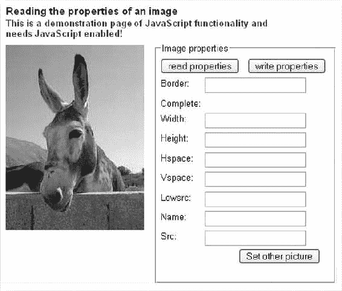
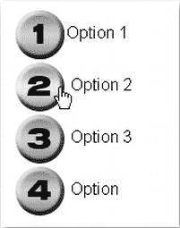
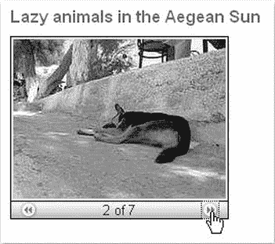
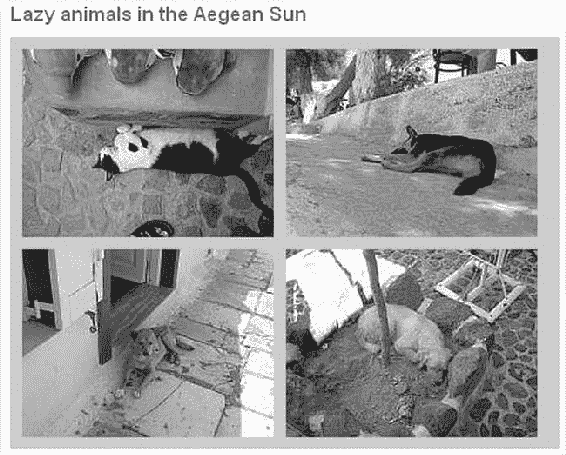
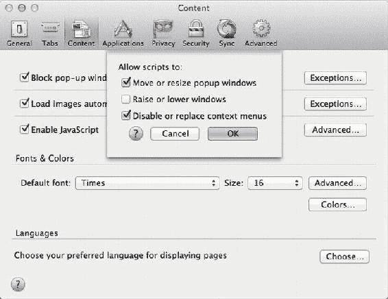
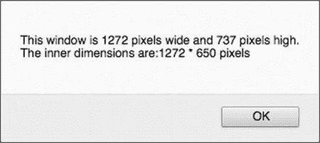
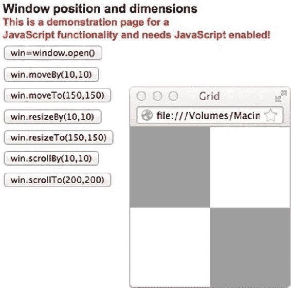
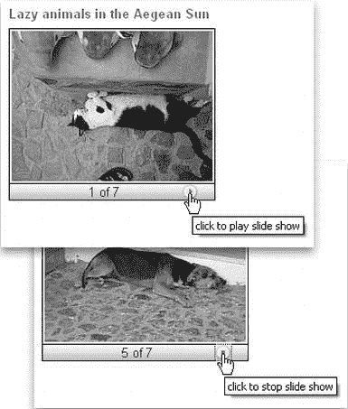
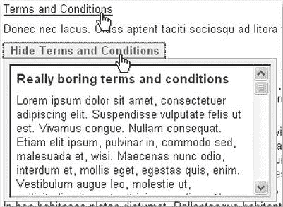

# 六、JavaScript 的常见用法：图像和窗口

如果你阅读了最后 的几章，你现在应该很好地掌握了 JavaScript 知识及其与层叠样式表(CSS)和 HTML 的交互。现在你将了解 JavaScript 在网络上的一些最常见的用法，我们将通过一些例子。在这些例子中，您将看到如何确保 JavaScript 的这些实现独立于页面上的其他脚本工作，我将解释可能会出现什么问题。我还将谈到一些很容易使用但可能不是最安全的选项的功能。

 **注意**这一章有很多代码示例，你会被要求在浏览器中打开其中的一些来自己测试功能。如果你还没有去过[http://www.beginningjavascript.com](http://www.beginningjavascript.com)下载这本书的代码示例，现在可能是个好时机。

这里的大部分完整代码示例使用 DOM-3 事件处理。这使得它们比它们的 DOM-1 对等物更复杂一些，但是这也使得它们能够更好地与其他脚本一起工作，并且它们更有可能在未来的浏览器中工作。请耐心听我说，我保证通过反复使用这些方法，你会很快掌握它们的窍门。

开发这些示例时也考虑到了维护和灵活性。这意味着不熟悉 JavaScript 的人在以后可能会更改的所有内容都存储在属性中，并且您可以很容易地让同一文档的几个部分使用脚本的功能。这也增加了一些脚本的复杂性，但这是大多数客户要求的现实生活中的可交付成果。

图像和 JavaScript

图像的动态变化很可能是 JavaScript 的第一个“惊艳”效果。当浏览器还不支持 CSS 时(公平地说，CSS 仍在定义过程中)，当用户将鼠标移到图像上或单击图像时，JavaScript 是改变图像的唯一方法。近年来，越来越多传统上通过 JavaScript 实现的图像效果已经被纯 CSS 解决方案所取代，这使得维护变得更加容易。我将在后面讨论这些；现在，让我们看看 JavaScript 能对图像做些什么的基础知识。

图像脚本基础知识

在 JavaScript 中，您可以通过两种方式访问和修改图像:通过 getElementsByTagName()和 getElementById()的 DOM-2 方式，或者通过涉及存储在 document 对象的属性中的 images 集合的旧方式。举个例子，我们来看一个包含照片列表的 HTML 文档:

```js
<ul class="slides">
  <li></li>
  <li></li>
  <li></li>
  <li></li>
  <li></li>
  <li></li>
  <li></li>
  <li></li>
</ul>
```

您可以在 JavaScript 中检索所有这些照片，以两种方式对它们进行处理:

```js
// Old DOM
var photosOldDOM=document.images;
// New DOM
var photos=document.getElementsByTagName('img');
```

这两种方法都会产生一个包含所有图像作为对象的数组。与任何对象一样，您可以读取并操作它们的属性。比方说，您想知道第三个图像的可选文本。您需要做的只是读出对象的 alt 属性:

```js
// Old DOM alt property
var photosOldDOM=document.images;
alert(photosOldDOM[2].alt);
// W3C DOM-2 alt attribute
var photos=document.getElementsByTagName('img');
alert(photos[2].getAttribute('alt'));
```

图像有几个属性，其中一些是显而易见的。但是还有一些你可能没听说过的:

*   border:HTML 中 border 属性的值
*   名称:img 标签的名称属性
*   complete:如果图像已完成加载，则该属性为 true(这是只读的，不能更改该属性)
*   height:图像的高度(以像素为单位，以整数形式返回)
*   width:图像的宽度(以像素为单位，以整数形式返回)
*   hspace:图像周围的水平空间
*   vspace:图像周围的垂直空间
*   lowsrc:同名属性中定义的图像预览
*   src:图像的 URL

您可以使用这些属性来动态地访问和更改图像。如果在浏览器中打开示例文档 exampleImageProperties.html，可以读写演示图像的属性，如图[图 6-1](#Fig1) 所示。



[图 6-1](#_Fig1) 。读取和写入图像的属性

 **注意**如果图像的尺寸是通过 HTML 的宽度和高度属性定义的，并且你改变了它的来源，你不会自动改变它的尺寸。例如，激活演示中的“设置其他图片”按钮。这可能会导致另一幅图像难看的扭曲，因为浏览器不会以复杂的方式调整图像的大小。

预加载图像

如果您在页面中动态地使用图像来获得翻转或幻灯片效果，您会希望将图像加载到浏览器的内存缓存中，以给访问者一个流畅的体验。你可以用几种方法做到这一点。一种方法是在初始化页面时为每个要预加载的图像创建一个新的图像对象:

```js
kitten = new Image();
kitten.src = 'pictures/kittenflat.jpg';
```

在“翻转效果”一节中，您将很快看到一个这样的例子:

```js
function simplePreload() {
  var args = simplePreload.arguments;
  document.imageArray = new Array( args.length );
  for(var i = 0; i < args.length; i++ ) {
    document.imageArray[i] = new Image;
    document.imageArray[i].src = args[i];
  }
}
```

如果您使用想要预加载的图像调用此函数，它将创建一个包含所有图像的新数组，一个接一个地加载它们，例如:

```js
simplePreload('pictures/cat2.jpg', 'pictures/dog10.jpg');
```

一种不同的、独立于脚本的预加载图像的方式是将它们作为 1×1 像素的图像放在 HTML 的容器元素中，该元素通过 CSS 隐藏。这混合了结构和行为，与任何图像预加载技术有相同的问题:你强迫访问者下载大量他可能不想立即看到的图像。如果您使用预加载器，您可能希望让它们保持可选，让用户决定是否要预加载所有图像。

我将在这里简短地讨论图像预加载，因为关于图像还有很多东西要学。

翻滚特效

当 JavaScript 首次在最常见的用户代理中得到广泛支持时，翻转或悬停效果是绝对的狂热。编写了许多脚本，出现了许多小工具，允许“无需任何编码的即时翻转生成”

翻转效果的想法很简单:你将鼠标悬停在一个图像上，图像会发生变化，这表明这是一个可点击的图像，而不仅仅是视觉效果。[图 6-2](#Fig2) 显示了翻转效果。


[图 6-2](#_Fig2) 。翻转效果意味着当鼠标悬停在元素上时，元素会改变其外观

使用多个图像的翻转

当鼠标悬停在图像上时，可以通过更改图像的 src 属性来创建翻转效果。老式的翻转效果依赖于标签的 name 属性，并使用了 images 集合。像这样的结构在 20 世纪 90 年代的网页中并不少见:

*exampleSimpleRollover.html(节选)*

*HTML*

```js
<a href="contact.html"
   onmouseover="rollover('contact', 'but_contact_on.jpg')"
   onmouseout="rollover('contact', 'but_contact.jpg')">
   
</a>
```

*JavaScript*

```js
function rollover( img, url ) {
  document.images[img].src=url;
}
```

翻转的问题是(现在仍然是)第二个映像可能还没有加载，这是适得其反的。这是一个交互元素的事实并不是显而易见的——只有在显示第二个图像时才变得明显。因此，在这种情况下，这会使用户感到困惑，而不是有所帮助。这就是为什么传统的翻转功能(如 Adobe Dreamweaver 附带的功能)将前面介绍的图像对象预加载技术与 name 属性结合使用。

丹尼尔·诺兰在 2003 年提出了一个非常聪明的解决方案，正如在 http://www.dnolan.com/code/js/rollover/的描述。他的解决方案使用图像的文件名，并假设翻转状态的后缀为“_o”。您只需将一个名为 imgover 的类添加到您希望具有翻转效果的图像中。

您可以使用 DOM-3 处理程序轻松复制相同的功能。首先，您需要一个 HTML 文档，其中包含分配了正确类别的图像:

*exampleAutomatedRollover.html(节选)*

```js
<ul>
  <li>
    <a href="option1.html">
      Option 1
    </a>
  </li>
  <li>
    <a href="option2.html">
       Option 2
    </a>
  </li>
  [... code snipped ...]
</ul>
```

然后你计划你的剧本。脚本的主要对象将被称为 ro，用于*翻转*。因为您想让未来的维护者尽可能地简单，所以您保留了主对象属性中可能发生变化的所有细节。

在这个脚本中，这个类定义了哪个图像应该获得翻转状态以及鼠标经过图像的后缀。在这种情况下，您将分别使用“roll”和“_on”。您将需要两个方法:一个初始化效果，一个做翻转。此外，您将需要一个数组来存储预加载的图像。所有这些共同构成了翻转脚本的框架:

*自动调速器. js(骨架)*

```js
ro = {
  rollClass : 'roll',
  overSrcAddOn : '_on',
  preLoads : [],
  init : function(){},
  roll : function( e ){}
}
DOMhelp.addEvent( window, 'load', ro.init, false );
```

让我们开始充实骨架吧。首先是属性和 init 方法。在其中，您预定义了一个名为 oversrc 的变量，并将文档的所有图像存储在一个名为 imgs 的数组中。你循环遍历这些图片，跳过那些没有合适的 CSS 类的图片:

*自动调速器. js (excerpt)*

```js
ro = {
  rollClass : 'roll',
  overSrcAddOn : '_on',
  preLoads : [],
  init : function() {
    var oversrc;
    var imgs = document.images;
    for( var i = 0; i < imgs.length; i++ ) {
      if( !DOMhelp.cssjs('check', imgs[i], ro.rollClass ) ) {
        continue;
      }
```

如果图像附加了正确的 CSS 类，则读取其 source 属性，用 overSrcAddOn 属性中定义的后缀替换其中的句号，后跟一个句号，并将结果存储在 oversrc 变量中:

*automatedRollover.js(续)*

```js
oversrc = imgs[i].src.toString().replace('. ',ro.overSrcAddOn + '. ');
```

 **注意**例如，文档中的第一个图像具有 src but_1.jpg。此处定义了后缀属性的 oversrc 的值将是 but_1_on.jpg

然后创建一个新的 image 对象，并将其存储为 preLoads 数组的一个新项。将新图像的 src 属性设置为 oversrc。使用 DOMhelp 库中的 addEvent()为 mouseover 和 mouseout 添加一个指向 roll 方法的事件处理程序。

*automatedRollover.js(续)*

```js
   ro.preLoads[i] = new Image();
   ro.preLoads[i].src = oversrc;
   DOMhelp.addEvent( imgs[i], 'mouseover', ro.roll, false );
   DOMhelp.addEvent( imgs[i], 'mouseout', ro.roll, false );
  }
},
```

roll 方法通过 getTarget(e)检索发生事件的图像，并将其 src 属性存储在一个名为 s 的变量中，然后通过读取事件类型来测试发生了哪个事件。如果事件类型是 mouseover，您可以将文件名中的句号替换为 add-on 后跟一个句号，如果事件是 mouseout，则反之亦然。向窗口添加一个事件处理程序，当窗口完成加载时，它调用 ro.init():

*automatedRollover.js(续)*

```js
  roll : function( e ) {
    var t = DOMhelp.getTarget( e );
    var s = t.src;
    if( e.type == 'mouseover' ) {
      t.src = s.replace('.', ro.overSrcAddOn + '. ' );
    }
    if( e.type == 'mouseout' ) {
      t.src = s.replace( ro.overSrcAddOn + '. ', '. ' );
    }
  }
}
DOMhelp.addEvent( window, 'load', ro.init, false );
```

演示页面的结果，如[图 6-3](#Fig3) 所示，突出显示了当用户悬停在原始图像上时已经加载到浏览器缓存中的图像。



[图 6-3](#_Fig3) 。预载和自动翻转

尽管您可以尝试使用巧妙的脚本来预加载图像，但它可能并不总是有效。用户的浏览器缓存设置或其连接中的特殊设置可能会使其无法在不真正将图像添加到文档的情况下偷偷预加载某些内容。因此，您可能会发现更安全的选择是为翻转效果使用单个图像。

使用单一图像的翻转效果

当 CSS 设计者开始探索:hover 伪选择器，不仅仅是改变链接的下划线时，CSS 专用翻转就诞生了。这基本上意味着你给链接和链接的悬停状态分配不同的背景图像。

同样的问题也发生了——图像必须在显示之前加载，这使得翻转效果闪烁或者根本不发生。解决方案是为两种状态拍摄一张单独的图像，并使用背景位置属性来改变图像的位置，如图 6-4 所示。


[图 6-4](#_Fig4) 。背景位置和 CSS 的翻转效果

您可以通过在浏览器中打开 exampleCSSonlyRollover.html 来查看效果。所讨论的 CSS 将链接限制在某个大小，并通过将处于悬停状态的背景图像向左移动(通过图像宽度一半的负背景位置值)来实现翻转效果:

*exampleCSSonlyRollover.html(节选)*

```js
#nav a{
  width:103px;
  padding-top:6px;
  height:22px;
  background:url(doublebutton.jpg) top left no-repeat #ccc;
}
#nav a:hover{
  background-position:-103px 0;
}
```

在 JavaScript 中也可以这样做；然而，让我们更有创造性，做一些 CSS 不能做的事情。

父元素上的翻转效果

让我们用一个 HTML 列表，通过添加一个漂亮的背景图片，把它变成一个时髦的导航栏，然后当鼠标悬停在链接上时，让链接改变背景图片。你首先需要的是一张背景图片，上面有背景的所有状态，如图[图 6-5](#Fig5) 所示。


[图 6-5](#_Fig5) 。导航背景与所有状态(调整大小)

导航栏的 HTML 是一个链接列表。因为基本的网站可用性指南强烈建议永远不要链接当前页面，所以当前链接被替换为一个**标签:**

*exampleParentRollover.html(节选)*

```js
<ul id="nav">
  <li><a href="index.html">Home</a></li>
  <li><a href="documentation.html">Documentation</a></li>
  <li><strong>Products</strong></li>
  <li><a href="contact.html">Contact Us</a></li>
</ul>
```

然而，因为这个导航可能是多级导航菜单中的第一级，高亮可能不是一个强元素，而是列表项上的一个类:

```js
<ul id="nav">
  <li><a href="index.html">Home</a></li>
  <li><a href="documentation.html">Documentation</a></li>
  <li class="current"><a href="products.html">Products</a></li>
  <li><a href="contact.html">Contact Us</a></li>
</ul>
```

两种情况都必须考虑。解释演示页面中的 CSS 不是本书的目的；可以说，您用 ID nav 固定了列表的维度，将其向左浮动，并浮动其中的所有列表元素。

相反，让我们直接开始计划剧本。您需要为主对象定义几个属性(称为 pr 代表*父翻转*)、导航列表的 ID、导航的高度(也是每个图像的高度，并且是背景位置所必需的)，以及可能用来突出显示当前部分而不是一个<强>标签的可选类:

*parentRollover.js(节选)*

```js
pr = {
  navId : 'nav',
  navHeight : 50,
  currentLink : 'current',
```

您从一个初始化方法开始，该方法检查 DOM 支持，以及具有正确 ID 的必要列表是否可用:

*parentRollover.js(续)*

```js
init : function() {
  if( !document.getElementById || !document.createTextNode ) {
    return;
  }
  pr.nav = document.getElementById( pr.navId );
  if( !pr.nav ){ return; }
```

下一个任务是遍历这个列表中包含的所有列表项，并检查该项中是否有强元素或者该项是否有“当前”类。如果任一情况为真，脚本应该将循环的计数器存储在主对象的当前属性中。该属性将在 rollover 方法中使用，以将背景重置为原始状态:

*parentRollover.js(续)*

```js
var lis = document.getElementsByTagName('li');

for(var i = 0; i < lis.length; i++)
{
  if( lis[i].getElementsByTagName('strong').length > 0 || DOMhelp.cssjs('check', lis[i], pr.currentLink) ) {
    pr.current = i;
  }
```

每个列表项都获得一个名为 index 的新属性，该属性在整个列表数组中包含它的计数器值。使用此属性是一种技巧，可以避免您必须循环遍历所有列表项，并将它们与事件侦听器方法中的目标进行比较。

您分配了两个指向 roll()方法的事件处理程序:一个是当鼠标在列表项上时，另一个是当鼠标离开列表项时。

*parentRollover.js(续)*

```js
   lis[i].index = i;
   DOMhelp.addEvent( lis[i], 'mouseover', pr.roll, false );
   DOMhelp.addEvent( lis[i], 'mouseout', pr.roll, false );
  }
},
```

翻转方法始于预定义一个名为 pos 的变量，该变量后来成为显示正确图像所需的偏移值。然后，它调用 getTarget()来确定哪个元素被滚动，并将目标的节点名与 LI 进行比较。这是一种安全措施:尽管您将事件处理程序分配给了 LI，但浏览器实际上可能会将链接作为事件目标发送。对此的一种解释可能是，链接是一种交互式页面元素，而 LI 不是，浏览器的呈现引擎认为链接更重要。您不会知道，但是您应该知道这样一个事实，一些用户代理将链接而不是列表元素视为事件目标。

*parentRollover.js(续)*

```js
roll : function( e ) {
  var pos;
  var t = DOMhelp.getTarget(e);
  while(t.nodeName.toLowerCase() != 'li' && t.nodeName.toLowerCase() != 'body') {
    t = t.parentNode;
  }
```

然后定义显示正确背景图像所需的位置。这个位置或者是列表项的索引值，或者是存储的当前属性乘以每个图像的高度。

这两者中的哪一个被应用取决于用户是否将鼠标悬停在列表项上——这可以通过将事件类型与 mouse over 进行比较来找到。相应地设置导航背景位置的样式，然后在页面完成加载后调用 init()方法:

*parentRollover.js(节选)*

```js
    pos = e.type == 'mouseover' ? t.index : pr.current;
    pos = pos * pr.navHeight;
    pr.nav.style.backgroundPosition = '0 -' + pos + 'px';
  }
}
DOMhelp.addEvent( window, 'load', pr.init, false );
```

当你在浏览器中打开 exampleParentRollover.html 时，你可以看到滚动导航的不同链接会显示不同的背景图像，如图 6-6 所示。


[图 6-6](#_Fig6) 。不同翻转状态下的导航

这是对影响父元素的翻转问题的编程解决方案。但是，它有一个问题:如果菜单项的顺序改变，代码的维护者也必须相应地改变图像。这不是一个非常灵活的解决方案，这就是为什么您最好动态地将类分配给导航列表来定位背景图像。

对脚本的必要更改会影响属性和 roll()方法；初始化保持不变。除了 currentLink 和 navId 属性之外，还需要一个类名来添加到导航列表中。这个新的性质可以称为 dynamicLink。

在 roll()方法中，再次检查触发该方法的事件是否是鼠标悬停，并相应地添加或移除新的动态类。这个动态分配和命名的类由 dynamicLink 属性值和当前索引加一组成(因为对于人类来说，拥有一个名为 item1 class 而不是 item0 的第一个类更容易):

*parentCSSrollover.html 使用的 parentCSSrollover.js(略)*

```js
pr = {
  navId : 'nav',
  currentLink : 'current',
  dynamicLink : 'item',
  init : function() {
   // [... same as in parentRollover.js ...]
  },
  Roll : function( e ) {
    // [... same as in parentRollover.js ...]
    var action = e.type == 'mouseover' ? 'add' : 'remove';
    DOMhelp.cssjs( action, pr.nav, pr.dynamicLink + ( t.index + 1 ) );
  }
}
DOMhelp.addEvent( window, 'load', pr.init, false );
```

这样，你就允许 CSS 设计者在 CSS: 中为翻转导航定义不同的状态

*parentCSSrollover.html 使用的 parentCSSrollover.css(节选)*

```js
#nav.item1{
  background-position:0 0;
}
#nav.item2{
  background-position:0 -50px;
}
#nav.item3{
  background-position:0 -100px;
}
#nav.item4{
  background-position:0 -150px;
}
```

这也为 CSS 设计者提供了另一个设计导航的钩子:dynamic 类可以用来定义当前的翻转，或者突出显示链接本身的状态，这与不同的项目是不同的。

幻灯片放映

幻灯片是嵌入在页面中的小图像，带有上一页和下一页按钮，有时它们甚至会在一定时间后自动改变图像。它们用于说明文字或提供产品的不同视图。

我们可以区分两种类型的幻灯片放映:在同一文档中包含所有图像的嵌入式幻灯片放映，以及在需要时加载图像的动态幻灯片放映。

嵌入式幻灯片放映

将幻灯片添加到页面的最简单的方法可能是将所有图像作为一个列表添加。然后，您可以使用 JavaScript 通过隐藏和显示带有嵌入图像的不同列表项，将该列表转换成幻灯片。演示文档 examplePhotoListInlineSlideShow.html 正是这样做的，如图 6-7 所示。



[图 6-7](#_Fig7) 。带有 JavaScript 的嵌入式幻灯片

底层 HTML 是一个无序列表，所有图像都是列表项。请注意，这也允许您为每个图像设置适当的替代文本:

*examplePhotoListInlineSlideShow.html(节选)*

```js
<ul class="slides">
  <li>
     
  </li>
  <li>
    
  </li>
  <li>
    
  </li>
  <li>
    
  </li>
  <li>
    
  </li>
  <li>
    
  </li>
  <li>
    
  </li>
</ul>
```

所有未来的维护者所要做的就是改变图片的顺序或添加或删除图片来改变 HTML。根本不需要修改 JavaScript。只要你提供一个合适的样式表，没有 JavaScript 的访问者将得到如图[图 6-8](#Fig8) 所示的所有图像。没有样式表的用户将得到一个带有图像缩略图的列表。



[图 6-8](#_Fig8) 。没有 JavaScript 的嵌入式幻灯片放映

在文档中嵌入所有图像的一个效果是，当访问者加载页面时，它们都将被加载。这可能是一件好事，也可能是一件坏事，取决于访问者的连接速度。稍后，我将向您展示一个仅当用户单击较小的图像时才加载较大图像的示例。

让我们看看将这个列表转换成幻灯片的脚本。您将使用在前几章中开发的 DOMhelp 库来解决浏览器问题，并稍微缩短代码。

和往常一样，首先要做的是计划你的剧本。在这种情况下，你应该给 CSS 设计者和 HTML 开发者几个类作为钩子来触发功能或者定义外观和感觉:

*   一个类，指示列表应该转换为幻灯片放映
*   定义动态幻灯片列表外观的类
*   显示先前隐藏的元素的类
*   定义图像计数器外观的类(例如，图像 1/3)
*   一个隐藏在特定播放状态下不应该出现的元素的类

您还应该允许维护人员更改前后链接的外观和内容以及图像计数器的文本内容。

至于方法，您所需要的(除了 DOMhelp 中包含的 helper 方法之外)就是一个全局初始化方法、一个初始化每个幻灯片放映的方法和一个放映幻灯片的方法。所有这些共同构成了脚本的框架:

*photolistinlineslides . js(skeleton)*T2】

```js
inlineSlides = {

  // CSS classes
  slideClass : 'slides',
  dynamicSlideClass : 'dynslides',
  showClass : 'show',
  slideCounterClass : 'slidecounter',
  hideLinkClass : 'hide',

  // Labels
  // Forward and backward links, you can use any HTML here
  forwardsLabel : '',
  backwardsLabel : '',
  // Counter text, # will be replaced by the current image count
  // and % by the number of all pictures
  counterLabel : '# of %',

  init : function() {},
  initSlideShow : function( o ) {},
  showSlide : function( e ) {}
}
DOMhelp.addEvent( window, 'load', inlineSlides.init, false );
```

 **注意**在前面的代码中，您在向前和向后链接的标签中提供了一个基于 HTML 的选项。这使得幻灯片的样式更加灵活，因为维护者可以添加自己的 HTML(比如图像)。此外，如果您想让维护人员像更改计数器一样更改动态文本，那么使用#和%这样的占位符并解释它们将被替换是有益的。

让我们一步一步地检查脚本中的方法。首先是全局初始化方法 init():

1.  测试 DOM 支持。
2.  如果测试成功，遍历文档的所有 ul 元素。
3.  对于每个 UL，检查它是否具有将其定义为幻灯片放映的类(存储在 slideClass 属性中)，如果没有该类，则跳过该函数执行的其余步骤。(使用“继续”来完成此操作。)
4.  如果当前的 UL 要变成幻灯片，你用定义动态幻灯片的类替换定义它为幻灯片的类；向列表中添加一个名为 currentSlide 的新属性，并使用列表作为参数调用 initSlideShow 方法。

*photoListInlineSlides.js(节选)*

```js
init : function() {
  if( !document.getElementById  || !document.createTextNode ) {
    return;
  }
  var uls = document.getElementsByTagName('ul');
  for( var i = 0; i < uls.length; i++ ) {
    if( !DOMhelp.cssjs('check', uls[i], nlineSlides.slideClass ) ) {
     continue;
    }
    DOMhelp.cssjs('swap', uls[i],inlineSlides.slideClass, nlineSlides.dynamicSlideClass );
    uls[i].currentSlide = 0;
    inlineSlides.initSlideShow( uls[i] );
  }
},
```

使用这些技巧，您可以省去大量的循环和检查工作。首先，仅在 JavaScript 可用时用另一个类替换该类，这允许您隐藏 CSS 中的所有列表项，而不是在 initSlideShow()方法中遍历它们:

*photoListInlineSlides.css(节选)*

```js
.dynslides li{
  display:none;
  margin:0;
  padding:5px;
}
```

其他动态分配的 CSS 类是 hide 类(显示第一个图像时删除向后链接，显示最后一个图像时删除向前链接)和 show 类(覆盖使用。动态幻灯片选择器。演示中所有其他的 CSS 选择器和属性都是纯粹装饰性的。

*photoListInlineSlides.css(节选)*

```js
.dynslides .hide{
  visibility:hidden;
}
.dynslides li.show{
  display:block;
}
```

通过将当前可见图像存储在列表的属性中，您不需要遍历所有图像并在显示当前图像之前隐藏它们。相反，您需要做的只是确定必须显示哪一个，读取父列表元素的属性，并隐藏存储在该属性中的前一个图像。

然后将属性重置为新图像，下次显示图像时，循环重新开始。您可以将当前图像存储在主 inlineSlides 对象的属性中，但是将它存储在 list 的属性中意味着您允许在同一页面上播放多个幻灯片。

initSlideShow()方法获取每个幻灯片列表作为一个名为 lst 的参数。首先，定义将与 var 关键字一起使用的变量，以确保它们不会覆盖同名的全局变量。然后创建一个新的段落元素来存放前向和后向链接以及图像计数器，并将其直接插入到列表之后(使用 lst.nextSibling):

*photoListInlineSlides.js(续)*

```js
initSlideShow : function(lst ) {
  var p, temp, count;
  p = document.createElement('p');
  DOMhelp.cssjs('add', p, inlineSlides.slideCounterClass );
  lst.parentNode.insertBefore( p, lst.nextSibling );
```

接下来，通过 DOMhelp 的 createLink 方法创建向后链接，并使用 innerHTML 添加适当的标签。添加一个事件处理程序来调用 showSlide 方法，通过应用适当的 CSS 类隐藏链接，并将链接添加到新创建的段落中。您将把链接存储在名为 rew 的列表属性中，以便以后更容易找到它:

*photoListInlineSlides.js(续)*

```js
lst.rew = DOMhelp.createLink('#', ' ' );
lst.rew.innerHTML = inlineSlides.backwardsLabel;
DOMhelp.addEvent(lst.rew, 'click', inlineSlides.showSlide, false );
DOMhelp.cssjs('add', lst.rew,inlineSlides.hideLinkClass );
p.appendChild(lst.rew );
```

接下来是一个充当图像计数器的新 SPAN 元素。获取主对象的 counterLabel 属性，用当前列表的 currentSlide 属性值替换#字符并加 1(因为人类从 1 开始计数，而不是像计算机那样从 0 开始计数)。将%字符替换为列表中 LI 元素的数量，并将结果字符串作为新的文本节点添加到 SPAN，然后将其作为新的子节点添加到段落:

*photoListInlineSlides.js(续)*

```js
lst.count = document.createElement('span');
temp = inlineSlides.counterLabel.replace( /#/, lst.currentSlide + 1 );
temp = temp.replace( /%/, lst.getElementsByTagName('li').length );
lst.count.appendChild( document.createTextNode( temp ) );
p.appendChild(lst.count );
```

 **注意**你把计数器的跨度存储在链表的一个属性中，叫做 count。这是纯粹的懒惰，因为它使您不必在以后通过 getElementsByTagName(' span ')[0]来访问它。这也使得脚本不太可能被维护者破坏，维护者可能会在稍后阶段在列表项中添加其他跨度。

添加前向链接与添加后向链接类似，只是 forwardsLabel 属性用作内容，一个名为 fwd 的新属性用作快捷方式。

*photoListInlineSlides.js(续)*

```js
lst.fwd = DOMhelp.createLink('#', ' ' );
lst.fwd.innerHTML = inlineSlides.forwardsLabel;
DOMhelp.addEvent(lst.fwd, 'click', inlineSlides.showSlide, false );
p.appendChild(lst.fwd );
```

该方法以获取对应于 currentSlide 属性的列表项并向其中添加 show 类结束。您可以使用 o.firstChild 来代替，但是将来的维护者可能希望最初显示与第一张照片不同的照片:

*photoListInlineSlides.js(续)*

```js
  temp = lst.getElementsByTagName('li')[lst.currentSlide];
  DOMhelp.cssjs('add', temp, inlineSlides.showClass );
},
```

showSlide()方法定义了一个名为 action 的变量，并通过 getTarget(e)获取事件目标。因为您不知道维护者是否在链接标签中使用了图像，所以您需要通过测试目标 parentNode 的 nodeName 是否为 a 来找到链接。这也抵消了 Safari 旧版本中的错误，即发送链接中包含的文本作为目标，而不是链接本身。然后，该方法通过读取目标 parentNode 的 closestSibling()来获取触发事件的列表。

*photoListInlineSlides.js(续)*

```js
showSlide : function( e ) {
  var action;
  var t = DOMhelp.getTarget( e );
  while( t.nodeName.toLowerCase() != 'a' && t.nodeName.toLowerCase() != 'body' ) {
    t=t.parentNode;
  }
  var parentList = DOMhelp.closestSibling( t.parentNode, -1 );
```

 **注意**访问者点击链接的内容可以前进或后退一个图像。事件目标可以是图像(如本例所示)或文本——或者该脚本的维护者放入 forwardsLabel 和 backwardsLabel 属性中的任何东西。因此——因为 Safari 将链接中包含的文本作为目标而不是链接本身发送——您需要检查节点的名称，并将其与 A 进行比较。然后，您获取此 A 的父节点——即新创建的段落——并获取它的前一个兄弟节点，即包含图像的 UL。

接下来，您需要从有问题的列表中找到 currentSlide 属性，并通过检查列表项数组的 length 属性找到图像的总数。通过删除 show 类隐藏以前显示的图像:

*photoListInlineSlides.js(续)*

```js
var count = parentList.currentSlide;
var photoCount = parentList.getElementsByTagName('li').length - 1;
var photo = parentList.getElementsByTagName('li')[count];
DOMhelp.cssjs('remove', photo, inlineSlides.showClass );
```

通过比较目标和列表的 fwd 属性来确定被激活的链路是否是前向链路，然后相应地增加或减少计数器。

如果计数器大于 0，则从反向链接中删除隐藏类；否则，添加这个类，有效地隐藏或显示链接。同样的逻辑也适用于前向链接，尽管这次的比较标准是计数器小于列表项的总数。这可以防止在第一张幻灯片上显示向后链接，在最后一张幻灯片上显示向前链接。

*photoListInlineSlides.js(续)*

```js
count = ( t == parentList.fwd ) ? count+1 : count-1;
action = ( count > 0 ) ? 'remove' : 'add' ;
DOMhelp.cssjs( action, parentList.rew,inlineSlides.hideLinkClass );
action = ( count < photoCount ) ? 'remove' : 'add';
DOMhelp.cssjs( action, parentList.fwd, nlineSlides.hideLinkClass);
```

它负责链接；现在你需要增加计数器显示。因为计数器存储为列表的一个属性，所以很容易读取该属性的第一个子节点——即 SPAN 中的文本。然后，您可以使用 String 对象的 replace()方法用新的图像编号替换第一个数字条目(这里通过正则表达式),新的图像编号是 count+1——同样，因为人类从 1 开始计数，而不是从 0 开始计数。接下来，重置 currentSlide 属性，获取新照片(记得您更改了 count)，并通过添加 show 类显示当前照片。剩下要做的就是在窗口加载后启动 init()方法:

*photoListInlineSlides.js(节选)*

```js
    photo = parentList.getElementsByTagName('li')[count];
    var counterText = parentList.count.firstChild
    counterText.nodeValue = counterText.nodeValue.replace( /\d/, count + 1 );
    parentList.currentSlide = count;
    photo = parentList.getElementsByTagName('li')[count];
    DOMhelp.cssjs('add', photo, inlineSlides.showClass );
    DOMhelp.cancelClick( e );
  }
}
DOMhelp.addEvent( window, 'load', inlineSlides.init, false );
```

然而，你还没有完全完成。如果你在旧版本的 Safari 中尝试幻灯片放映，你会意识到向前和向后链接确实被隐藏了，但它们仍然是可点击的，并且当你试图到达不在那里的图像时会导致错误。

 **注意**这是动态 web 开发中的一个常见错误——明显隐藏东西并不一定会让它们对所有用户都消失。想想盲人或文本浏览器(如 Lynx)的用户。此外，还要考虑浏览器的漏洞和奇怪之处。

防止这个问题是相当容易的:你需要修改的只是 showSlide()方法，这样当被点击的目标被分配了 hide CSS 类时什么也不做。在解决这个问题时，您还可以添加 Safari 修复来取消新生成的链接的默认操作。演示 examplePhotoListInlineSlideShowSafariFix.html 包含了这些变化:

*照片列表中的 slide farifix . js*

```js
inlineSlides = {

  // CSS classes
  slideClass : 'slides',
  dynamicSlideClass : 'dynslides',
  showClass : 'show',
  slideCounterClass : 'slidecounter',
  hideLinkClass : 'hide',
  // Labels
  // Forward and backward links, you can use any HTML here
  forwardsLabel : ' ',
  backwardsLabel : '',
  // Counter text, # will be replaced by the current image count
  // and % by the number of all pictures
  counterLabel : '# of %',

  init : function() {
    if( !document.getElementById || !document.createTextNode ) {
      return;
    }
    var uls = document.getElementsByTagName('ul');
    for( var i = 0; i < uls.length; i++ ) {
      if( !DOMhelp.cssjs('check', uls[i],inlineSlides.slideClass ) ) {
       continue;
      }
      DOMhelp.cssjs('swap', uls[i], inlineSlides.slideClass, inlineSlides.dynamicSlideClass );
      uls[i].currentSlide = 0;
      inlineSlides.initSlideShow( uls[i] );
    }
  },
  initSlideShow : function(lst ) {
    var p, temp, count;
    p = document.createElement('p');
    DOMhelp.cssjs('add', p, inlineSlides.slideCounterClass );
    lst.parentNode.insertBefore( p, lst.nextSibling );
    lst.rew = DOMhelp.createLink('#', ' ' );
    lst.rew.innerHTML = inlineSlides.backwardsLabel;
    DOMhelp.addEvent(lst.rew, 'click', inlineSlides.showSlide, false );
    DOMhelp.cssjs('add', lst.rew, inlineSlides.hideLinkClass );
    p.appendChild(lst.rew );
    lst.count = document.createElement('span');
    temp = inlineSlides.counterLabel._
    replace( /#/, lst.currentSlide + 1 );
    temp = temp.replace( /%/, o.getElementsByTagName('li').length );
    lst.count.appendChild( document.createTextNode( temp ) );
    p.appendChild(lst.count );
    lst.fwd=DOMhelp.createLink('#', ' ' );
    lst.fwd.innerHTML = inlineSlides.forwardsLabel;
    DOMhelp.addEvent(lst.fwd, 'click', inlineSlides.showSlide, false );
    p.appendChild(lst.fwd );
    temp = lst.getElementsByTagName('li')[ lst.currentSlide];
    DOMhelp.cssjs('add', temp,inlineSlides.showClass );
    lst.fwd.onclick = DOMhelp.safariClickFix;
    lst.rew.onclick = DOMhelp.safariClickFix;
  },
  showSlide : function( e ) {
    var action;
    var t = DOMhelp.getTarget( e );
    while( t.nodeName.toLowerCase() != 'a && t.nodeName.toLowerCase() != 'body' ) {
      t = t.parentNode;
    }
    if( DOMhelp.cssjs('check', t,_inlineSlides.hideLinkClass ) ){
     return;
    }
    var parentList = DOMhelp.closestSibling( t.parentNode, -1 );
    var count = parentList.currentSlide;
    var photoCount = parentList.getElementsByTagName('li').length-1;
    var photo = parentList.getElementsByTagName('li' )[count];
    DOMhelp.cssjs('remove', photo, inlineSlides.showClass );
    count = ( t == parentList.fwd ) ? count + 1 : count - 1;
    action = ( count > 0 ) ? 'remove' : 'add' ;
    DOMhelp.cssjs( action, parentList.rew, inlineSlides.hideLinkClass );
    action = ( count < photoCount ) ? 'remove' : 'add';
    DOMhelp.cssjs( action, parentList.fwd,inlineSlides.hideLinkClass );
    photo = parentList.getElementsByTagName('li')[count];
    var counterText = parentList.count.firstChild
    counterText.nodeValue = counterText.nodeValue.replace( /\d/, count + 1 );
    parentList.currentSlide = count;
    DOMhelp.cssjs('add', photo, inlineSlides.showClass );
    DOMhelp.cancelClick( e );
  }
}
DOMhelp.addEvent( window, 'load', inlineSlides.init, false );
```

将嵌入的图像列表转换成幻灯片是一种效果，在非 JavaScript 用户代理上效果很好，尽管它不是真正的图像操作，甚至不是动态的。JavaScript 的真正强大之处在于避免页面重载，并在同一文档中显示更大的图像，而不仅仅是在浏览器中显示。让我们来看一些例子。

动态幻灯片放映

让我们再看一个 HTML 列表，把它变成一个动态幻灯片的例子。从 HTML 开始—这次是包含链接到大图的缩略图的列表:

*exampleMiniSlides.html*

```js
<ul class="minislides">
<li>
  <a href="pictures/thumbs/cat2.jpg">
     
  </a>
</li>
<li>
  <a href="pictures/thumbs/dog63.jpg">
     </a>
  </li>
  <li>
    <a href="pictures/thumbs/dog7.jpg">
      
    </a>
  </li>
  <li>
    <a href="pictures/thumbs/kittenflat.jpg">
      
    </a>
  </li>
</ul>
```

如果您在启用了 JavaScript 的浏览器中打开示例，您会得到一个小缩略图列表和一个大图像。点击缩略图会用缩略图指向的图像替换大图，如图[图 6-9](#Fig9) 所示。


[图 6-9](#_Fig9) 。带有小预览图像(缩略图)的幻灯片放映

没有 JavaScript 的访问者只会得到一行链接到更大图片的图片，如图 6-10 所示。


[图 6-10](#_Fig10) 。没有 JavaScript 的小预览图片幻灯片

同样，让我们来规划脚本的框架:定义一个类来识别哪些列表将变成幻灯片，定义一个类来赋予包含大照片的列表项，定义替换文本来添加到大照片中。

方法和上次一样:一个全局初始化方法，一个初始化每个幻灯片放映的方法，一个显示当前照片的方法。

*miniSlides.js (skeleton)*

```js
minislides = {
  // CSS classes
  triggerClass : 'minislides',
  largeImgClass : 'photo',
  // Text added to the title attribute of the big picture
  alternativeText : 'large view',

  init : function(){  },
  initShow : function( o ){ },
  showPic : function( e ){  }
}
DOMhelp.addEvent( window, 'load', minislides.init, false );
```

幻灯片的 CSS 非常简单:

*miniSlides.css(节选)*

```js
.minislides, .minislides * {
  margin:0;
  padding:0;
  list-style:none;
  border:none;
}
.minislides{
  clear:both;
  margin:10px 0;
  background:#333;
}
.minislides,.minislides li{
  float:left;
}
.minislides li img{
  display:block;
}
.minislides li{
  padding:1px;
}
.minislides li.photo{
  clear:both;
  padding-top:0;
}
```

首先，使用正确的类和列表本身对列表中的任何内容进行全局重置。全局重置意味着将所有边距和填充设置为 0，并将边框和列表样式设置为无。这避免了必须处理跨浏览器差异，也使 CSS 文档更短，因为您不需要为每个元素重置这些值。

然后将列表和所有列表项浮动到左侧，使它们显示为内联，而不是一个在另一个下面。您需要浮动主列表以确保它包含其他列表。

将图像设置为显示为块元素，以避免它们周围的间隙，并在每个列表项上添加一个像素的填充，以显示背景色。

“照片”列表项需要一个浮动清除来显示在其他项的下面。将其顶部填充设置为 0，以避免较小图像和较大图像之间出现双线。

init()方法的功能类似于上一张幻灯片中的方法。测试 DOM 支持，遍历文档中的所有列表，跳过那些没有正确类的列表。拥有正确类的类作为参数发送给 initShow()方法:

*miniSlides.js(节选)*

```js
init : function() {
  if( !document.getElementById || !document.createTextNode ) {
    return;
  }
  var lists = document.getElementsByTagName('ul');
  for( var i = 0; i < lists.length; i++ ) {
    if( !DOMhelp.cssjs('check', lists[i],minislides.triggerClass ) ) {
     continue;
    }
    minislides.initShow( lists[i] );
  }
},
```

initShow()方法通过创建一个新的列表项、创建一个新的图像并将大图像类分配给新的列表项来启动。它将图像作为列表项的子项添加，并将新列表项作为主列表的子项添加。与前面定义的 CSS 一起，它在其他图像下面显示新图像:

*miniSlides.js(节选)*

```js
initShow : function( o ) {
  var newli = document.createElement('li');
  var newimg = document.createElement('img');
  newli.appendChild( newimg );
  DOMhelp.cssjs('add', newli, minislides.largeImgClass );
  o.appendChild( newli );
```

然后获取列表中的第一个图像，并读取存储在 alt 属性中的替代文本。将此文本作为替换文本添加到新图像中，将存储在 alternative text 属性中的文本添加到新图像中，并将结果字符串存储为新图像的 title 属性:

*miniSlides.js(节选)*

```js
var firstPic = o.getElementsByTagName('img')[0];
var alt = firstPic.getAttribute('alt');
newimg.setAttribute('alt', alt );
newimg.setAttribute('title', alt + minislides.alternativeText );
```

接下来，检索列表中的所有链接，并在用户单击每个链接时应用一个指向 showPic 的事件。将新图像作为名为 photo 的属性存储在 list 对象中，并将新创建的图像的 src 属性设置为第一个链接的目标位置:

*miniSlides.js(节选)*

```js
  var links = o.getElementsByTagName('a');
  for(i = 0; i < links.length; i++){
   DOMhelp.addEvent( links[i], 'click', minislides.showPic,false );

  }
  o.photo = newimg;
  newimg.setAttribute('src', o.getElementsByTagName('a')[0].href );
},
```

当链接被点击时，显示链接指向的图片是小菜一碟。在 showPic()方法中，通过 getTarget()检索事件目标，并通过读取列表的 photo 属性获取旧图片。

这一次，您知道访问者将点击的元素是一个图像，这就是为什么您不需要循环和测试元素的名称。相反，您可以转到三个父节点(A、LI 和)并读取先前存储的图像。然后设置可选文本、标题和图像 src，并通过 cancelClick()停止链接的默认行为。添加一个处理程序，在窗口完成加载时触发 init()方法，以完成迷你幻灯片放映。

*miniSlides.js(节选)*

```js
  showPic : function( e ) {
    var t = DOMhelp.getTarget( e );
    var oldimg = t.parentNode.parentNode.parentNode.photo;
    oldimg.setAttribute('alt', t.getAttribute('alt') );
    oldimg.setAttribute('title', t.getAttribute('alt') +minislides.alternativeText );
    oldimg.setAttribute('src', t.parentNode.getAttribute('href') );
    DOMhelp.cancelClick( e );
  }
}
DOMhelp.addEvent( window, 'load', minislides.init, false );
```

图像和 JavaScript 概述

对图像和 JavaScript 的介绍到此结束。我希望你不要被可能发生的事情和以这种方式写剧本所需要的东西弄得不知所措。我还希望我已经激发了您使用这些示例的兴趣，看看还有什么是可能的。请记住这些幻灯片以及它们是如何工作的——在本章的最后，我们将回到文档嵌入幻灯片，并让它自动播放。在第 10 章中，你将看到如何开发一个更大的支持 JavaScript 的图库。

现在，有一些关于图像和 JavaScript 的事情需要记住:

*   您可以对图像对象进行大量预加载，但这并不是一种万无一失的方法。浏览器缓存设置、损坏的图像链接和代理服务器可能会干扰您的预加载脚本。有一些库可以帮助预加载过程。例如，PreloadJS 可以帮助您预加载图像、声音和其他 JavaScript 文件。如果这些脚本失败，用户可能会卡住或面对不断变化的进度条，这是令人沮丧的。
*   虽然您可以直接访问每个图像的属性，但这可能不是最好的方法。把视觉效果留给 CSS，你的脚本不会被其他不知道发生了什么的人修改。
*   自 DHTML 时代以来，CSS 已经走过了漫长的道路，现在，通过提供挂钩来帮助 CSS 设计者可能是一种更好的方法，而不是纯粹通过脚本来实现视觉效果——前面看到的父翻转就是一个例子。

Windows 和 JavaScript

JavaScript 的常见用法是生成新的浏览器窗口和改变当前窗口。这些也是令人讨厌和不安全的做法，因为你永远无法确定你的网页的访问者是否能够处理调整大小的窗口，或者当有新窗口时，她的用户代理是否会通知你。想象一下屏幕阅读器用户在收听你的站点或者文本浏览器用户。

过去，窗口曾被用于未经请求的广告(弹出窗口)和在隐藏窗口中执行代码以进行数据检索(网络钓鱼)，这就是为什么浏览器供应商和第三方软件提供商想出了许多软件和浏览器设置来阻止这种滥用。例如，Mozilla Firefox 用户可以选择他们是否想要弹出窗口，以及 JavaScript 可以改变窗口的哪些属性，如图[图 6-11](#Fig11) 所示。



[图 6-11](#_Fig11) 。Mozilla Firefox 中的高级 JavaScript 设置

其他浏览器如 Microsoft Internet Explorer 7 或 Opera 8 不允许在新窗口中隐藏地址栏，并且可以对新窗口施加大小和位置限制。

 **注意**这是不同浏览器厂商想要阻止安全漏洞的一个契合点。打开一个没有可见地址栏的新窗口可以让恶意攻击者通过*跨站点脚本* (XSS)在第三方站点上打开一个弹出窗口，让它看起来像是属于该站点的，并要求用户输入信息。更多关于 XSS 的信息可以在维基百科上找到:[http://en.wikipedia.org/wiki/Cross-site_scripting](http://en.wikipedia.org/wiki/Cross-site_scripting)。

这对于网络冲浪者来说都是好消息，因为他们可以阻止不想要的广告，并且不太可能被愚弄而将他们的数据交给错误的人。这对你来说不是什么好消息，因为这意味着当你想在 JavaScript 中广泛使用 windows 时，你必须测试很多不同的场景。

抛开这些考虑，你仍然可以用 windows 和 JavaScript 做很多事情。每一个支持 JavaScript 的浏览器都为您提供了一个名为 window 的对象，其属性将在下一节中列出，还有一些关于如何使用它们的示例。

窗口属性

以下是窗口对象的属性列表:

 **注意**这个部分列表没有显示所有可用的窗口属性。如果某个浏览器不支持某个给定的属性，我会在讨论该属性的地方注明。

*   closed: Boolean，表示窗口是否关闭(只读)
*   defaultStatus:状态栏中的默认状态消息(Safari 不支持)
*   innerHeight:窗口文档部分的高度
*   innerWidth:窗口文档部分的宽度
*   outerHeight:整个窗口的高度
*   外部宽度:整个窗口的宽度
*   pageXOffset:文档在窗口内的当前水平起始位置(只读)
*   pageYOffset:文档在窗口内的当前垂直起始位置(只读)
*   status:状态栏的文本内容
*   名称:窗口的名称
*   toolbar:当窗口有工具栏时，返回 visible 属性为 true 的对象的属性(只读)

例如，如果您想要获取窗口的内部大小，您可以使用以下一些属性:

*exampleWindowProperties.html(节选)*

```js
function winProps() {
  var winWidth = window.outerWidth;
  var winHeight = window.outerHeight;
  var docWidth = window.innerWidth;
  var docHeight = window.innerHeight;
  var message = 'This window is ';
  message += winWidth + ' pixels wide and ';
  message += winHeight + ' pixels high.\n';
  message += 'The inner dimensions are: ';
  message += docWidth + ' * ' + docHeight + ' pixels';
  alert( message );
}
```

该功能的一些可能输出如图 6-12 中的[所示。](#Fig12)



[图 6-12](#_Fig12) 。读取窗口属性

Internet Explorer 不支持其他属性。这些是滚动条、定位栏、状态栏、菜单栏和个人栏。它们中的每一个都存储了一个具有值为 true 或 false 的只读可见属性的对象。若要测试用户是否打开了菜单栏，请检查对象和属性:

```js
if ( window.menubar && window.menubar.visible == true )
{
 // Code
}
```

窗口方法

窗口对象也有许多方法，其中一些在前面的章节中已经讨论过了。除了那些提供用户反馈的功能，最常见的功能是打开新窗口和定时执行功能。

用户反馈方式

此处列出的用户反馈方法在第 4 章中有详细介绍:

*   alert('message '):显示警报
*   确认('消息'):显示对话框以确认操作
*   提示('消息'，'预设'):显示对话框以输入值

打开新窗口

窗户的开关在技术上相当容易。然而，随着浏览器抑制不同的属性和方法，或者编写糟糕的弹出窗口阻止软件甚至阻止“好的”弹出窗口，打开和关闭窗口可能成为一场噩梦，需要适当的测试。打开新窗口的细节非常简单。您有四种方法可供选择:

*   open('url '，' name '，' properties '):打开一个名为“name”的新窗口，在其中加载 url，并设置窗口属性
*   close():关闭窗口(如果窗口不是弹出窗口，这将导致安全警告。)
*   blur():将浏览器的焦点从窗口移开
*   focus():将浏览器的焦点移到窗口

open 方法的属性字符串有一个非常独特的语法:它将窗口的所有属性以字符串的形式列出，每个字符串由一个名称和一个用等号连接的值组成，用逗号分隔:

```js
myWindow = window.open('demo.html', 'my', 'p1=v1,p2=v2,p3=v3' );
```

并非所有浏览器都支持此处列出的所有属性。例如，移动浏览器可能不具备桌面浏览器的所有功能。但是这个列表会让你知道什么是可用的:

*   height:以像素为单位定义窗口的高度。
*   width:以像素为单位定义窗口的宽度。
*   left:以像素为单位定义窗口在屏幕上的水平位置。
*   top:以像素为单位定义窗口在屏幕上的垂直位置。
*   位置:定义窗口是否有地址栏(是或否)。出于安全考虑。该选项始终为“是”，并且不可编辑。
*   menubar:定义窗口是否有菜单栏(是或否)。这不适用于 MacOS 上的浏览器，因为菜单总是在屏幕的顶部。
*   resizable:定义当窗口太小或太大时，是否允许用户调整窗口的大小。浏览器已经覆盖了此设置。用户必须更改他们的设置才能使用它。
*   scrollbars:定义窗口是否有滚动条(是或否)。Opera 不允许滚动条被抑制。
*   status:定义窗口是否有状态栏(是或否)。Opera 不允许关闭状态栏。
*   工具栏:定义窗口是否有工具栏(是或否)。Opera 不支持关闭工具栏。

要打开一个宽 200 像素、高 200 像素、距屏幕左上角 100 像素的窗口，然后将文档 grid.html 加载到其中，您必须设置适当的属性，如下所示:

```js
var windowprops = "width=200,height=200,top=100,left=100";
```

您可以尝试在页面加载时打开窗口:

*examplewindowpopup . html(excerpt)*

```js
function popup() {
  var windowprops = "width=200,height=200,top=100,left=100";
  var myWin =  window.open("grid.html", "mynewwin" ,windowprops );
}
window.onload = popup;
```

请注意，不同浏览器的结果略有不同。Internet Explorer 9 显示没有任何工具栏的窗口；Firefox、Opera 和 Chrome 警告你该页面正试图打开一个新窗口，并询问你是否允许它这样做。Safari 不做任何事情。

当窗口通过链接打开时，处理方式略有不同:

*示例链接 WindowPopUp.html*

```js
<a href="#" onclick="popup();return false">
  Open grid
</a>
```

Opera，Firefox，Chrome，Safari 现在都不抱怨弹出窗口了。但是，如果 JavaScript 被禁用，就不会有新窗口，链接也不会做任何事情。因此，您可能希望链接到 href 中的文档，并将 URL 作为参数发送:

*exampleParameterLinkWindowPopUp.html(节选)*

```js
function popup( url ) {
  var windowprops = "width=200,height=200,top=100,left=100";
  var myWin =  window.open( url, "mynewwin", windowprops );
}

<a href="grid.html" onclick="popup(this.href);return false">Open grid</a>
```

请注意 window.open()方法的 name 参数。这对于 JavaScript 来说似乎毫无意义，因为它什么也不做。(例如，没有可用于通过 windows.mynewwin 访问窗口的 windows 集合。)但是，它在 HTML target 属性中使用，使链接在弹出窗口而不是主窗口中打开其链接的文档。

在本例中，您将窗口的名称定义为 mynewwin，并将一个链接作为目标，在那里打开[http://www.yahoo.co.uk/](http://www.yahoo.co.uk/):

*exampleParameterLinkWindowPopUp.html(节选)*

```js
function popup( url ) {
  var windowprops = "width=200,height=200,top=100,left=100";
  var myWin = window.open( url, "mynewwin", windowprops );
}
<a href="http://www.yahoo.co.uk/" target="mynewwin">Open Yahoo</a>
```

除非您使用非转换的 XHTML 或 strict HTML(不推荐使用 target ),否则您还可以使用值为 _blank 的 target 属性来打开一个新窗口，而不管 JavaScript 是否可用。因此，告诉访问者链接将在链接内的新窗口中打开，以避免混淆或可访问性问题，这是一个很好的做法:

```js
<a href="grid.html" onclick="popup(this.href);return false" target="blank">
Open grid  (opens in a new window)
</a>
```

然而，因为您可能希望使用 HTML 对使用 JavaScript 的弹出窗口进行更多的控制，所以不依赖于 target 可能是一个更好的解决方案，相反，只有在脚本可用的情况下才把链接变成弹出链接。为此，您需要一些东西来挂钩，并将链接标识为弹出链接。例如，您可以使用名为 popup 的类:

*exampleAutomaticPopupLinks.html(节选)*

```js
<p><a href="grid.html" class="popup">Open grid</a></p>
<p><a href="http://www.yahoo.co.uk/" class="popup">Open Yahoo</a></p>
```

计划剧本并不需要太多。您需要该类来触发弹出窗口、文本加载项和作为属性的窗口参数，您需要一个 init()方法来标识链接并添加更改，您需要一个 openPopup()方法来触发弹出窗口:

*自动弹出链接. js(骨架)*

```js
poplinks = {
  triggerClass : 'popup',
  popupLabel : ' (opens in a new window)',
  windowProps : 'width=200,height=200,top=100,left=100',
  init : function(){ },
  openPopup : function( e ){ },
}
```

这两种方法非常基本。init()方法检查 DOM 支持，并遍历文档中的所有链接。如果当前链接有 CSS 触发器类，它通过从标签创建新的文本节点并将其作为新的子节点添加到链接来将标签添加到链接。当单击指向 openPopup()方法的链接时，它会添加一个事件，并应用旧版本 Safari 的修复程序来阻止该链接在该浏览器中被跟踪:

*automaticPopupLinks.js(节选)*

```js
init : function() {
  if( !document.getElementById || !document.createTextNode ) {
   return;
  }
  var label;
  var allLinks = document.getElementsByTagName('a');
  for( var i = 0; i < allLinks.length; i++ ) {
    if( !DOMhelp.cssjs('check', allLinks[i],poplinks.triggerClass ) ) {
      continue;
    }
    label = document.createTextNode( poplinks.popupLabel );
    allLinks[i].appendChild( label );
    DOMhelp.addEvent( allLinks[i], 'click',poplinks.openPopup, false );
    allLinks[i].onclick = DOMhelp.safariClickFix;
  }
},
```

openPopup()方法检索事件目标，确保它是一个链接，并通过调用 window.open()打开一个新窗口，使用事件目标的 href 属性作为 URL、一个空名称和存储在 windowProps 中的窗口属性。它通过调用 cancelClick()方法停止链接被跟踪来结束:

*automaticPopupLinks.js(节选)*

```js
openPopup : function( e ) {
  var t = DOMhelp.getTarget( e );
  if( t.nodeName.toLowerCase() != 'a' ) {
    t = t.parentNode;
  }
  var win = window.open( t.getAttribute('href'), '', poplinks.windowProps );
  DOMhelp.cancelClick( e );
}
```

这个话题还有更多的内容，特别是当涉及到可用性和可访问性问题时，要确保弹出窗口只有在真正打开时才使用，并且不会被某些软件阻止或无法打开。然而，深入这个问题不在当前讨论的范围之内。可以说，在今天的环境中，依靠任何类型的弹出窗口都不容易。

窗口交互

窗口可以使用它们的许多属性和方法与其他窗口进行交互。首先有 focus()和 blur():前者将弹出窗口带到前面；后者将其推到当前窗口的后面。

可以使用 close()方法摆脱窗口，通过 window.opener 属性可以到达打开弹出窗口的窗口。假设您从一个主文档中打开了两个新窗口:

```js
w1 = window.open('document1.html', 'win1');
w2 = window.open('document2.html', 'win2');
```

通过调用第一个窗口的 blur()方法，可以将第一个窗口隐藏在另一个窗口的后面:

```js
w1.blur();
```

 **注意**你再也看不到它了，但是通过 blur()打开一个不请自来的窗口并立即隐藏它的技巧被称为*弹出窗口*。这一招被广告商认为没有弹窗那么讨厌，因为它们不覆盖当前页面。如果你曾经发现当你关闭浏览器时，你不记得打开了几个窗口，这可能就是发生过的事情。

您可以通过调用其 close()方法来关闭窗口:

```js
w1.close();
```

如果您想从弹出窗口中的任何文档进入初始窗口，您可以通过

```js
var parentWin = window.opener;
```

如果你想从第一个窗口到达第二个窗口，你还需要通过 window.opener，因为第二个窗口是从这个窗口打开的:

```js
var parentWin = window.opener;
var otherWin = parentWin.w2;
```

请注意，您需要使用分配给窗口的变量名，而不是窗口名。

你可以以这种方式使用任何窗口的任何窗口方法。比方说，你想在 document1.html 关闭 w2；您可以通过调用

```js
var parentWin = window.opener;
var otherWin = parentWin.w2.close();
```

您也可以调用主窗口的功能。如果主窗口有一个名为 demo()的 JavaScript 函数，您可以从 document1.html 通过

```js
var parentWin = window.opener;
parentWin.demo();
```

 **警告**如果你试图用 window.opener.close()关闭初始窗口，一些浏览器会发出安全警告，询问用户是否允许这样做。这是另一个安全功能，可以防止怀有恶意的网站所有者欺骗不同的网站。许多设计机构过去常常关闭原来的浏览器，转而使用预定义大小的窗口——如果没有前面提到的安全警告，这就不再可能了。这可能是一个好主意，以避免这种行为，除非你想吓唬或骚扰你的访客。

改变窗口和的位置和尺寸

下面列表中的每个方法都有 x 和 y 参数:x 是水平位置，y 是距屏幕左上角以像素为单位的垂直位置。moveBy()、resizeBy()和 scrollBy()方法允许负值，这将使窗口或内容向左上方移动，或者使窗口变小指定的像素数:

*   moveBy(x，y)-将窗口移动 x 和 y 像素
*   moveTo(x，y)-将窗口移动到坐标 x 和 y 处
*   resizeBy(x，y)-按 x 和 y 调整窗口大小
*   resizeTo(x，y)-将窗口大小调整为 x 和 y
*   scrollBy(x，y)-按 x 和 y 方向滚动窗口内容
*   scrollTo(x，y)-将窗口内容滚动到 x 和 y 方向

如果您检查示例文档 exampleWindowPosition.html，您可以测试不同的方法，如图[图 6-13](#Fig13) 所示。注意，这个例子出现在 Firefox 中。在 Opera 8 或 IE 7 中，小窗口会有一个定位栏。



[图 6-13](#_Fig13) 。更改窗口位置和尺寸

带窗口间隔和超时的动画

您可以使用 setInterval()和 setTimeout()窗口方法来允许定时执行代码。setTimeout 表示在执行代码之前等待一定的时间(仅一次)；setInterval()在每次经过给定的时间段时执行代码。

*   name = setInterval('someCode '，x):每隔 x 毫秒执行作为 someCode 传递给它的 JavaScript 代码
*   clearInterval( name):取消执行名为 name 的间隔(防止代码再次被执行)
*   name=setTimeout('someCode '，x):等待 x 毫秒后执行一次 JavaScript 代码 someCode
*   clearTimeout( name):如果代码尚未运行，则停止名为 name 的超时

 **注意**setInterval()和 setTimeout()中的参数 someCode 是你定义的函数。

使用这些方法的经典例子是新闻收报机、时钟和动画。然而，你也可以用它们来使你的网站不那么突兀，更有益于用户。一个例子是警告消息，它在一定时间后消失。演示 exampleTimeout.html 展示了如何使用 setTimeout()在短时间内显示一个非常明显的警告消息，或者允许用户立即删除它。HTML 有一个段落警告用户文档已经过期:

*exampleTimeout.html(节选)*

```js
<p id="warning">This document is outdated
 and kept only for archive purposes.</p>
```

一个基本的样式表将这个警告涂成红色，并为非 JavaScript 用户以粗体显示。对于启用了 JavaScript 的用户，添加一个动态类使警告更加明显。

超时. css

```js
#warning{
  font-weight:bold;
  color:#c00;
}
.warning{
  width:300px;
  padding:2em;
  background:#fcc;
  border:1px solid #c00;
  font-size:2em;
}
```

两者的区别如图[图 6-14](#Fig14) 所示。


[图 6-14](#_Fig14) 。不含和含 JavaScript 的警告消息

用户可以点击“移除警告”链接来消除警告或等待——它会在 10 秒钟后自动消失。

剧本很简单。您检查 DOM 是否受支持，以及具有正确 ID 的警告消息是否存在。然后将动态警告类添加到消息中，并使用指向 removeWarning()方法的事件处理程序创建一个新链接。您将此链接作为一个新的子节点附加到警告消息中，并定义一个超时，当超过 10 秒时自动触发 removeWarning():

*timeout.js(节选)*

```js
warn = {
  init : function() {
    if( !document.getElementById || !document.createTextNode ) {
      return;
    }
    warn.w = document.getElementById('warning');
    if( !warn.w ){ return; }
    DOMhelp.cssjs('add', warn.w, 'warning');
    var temp = DOMhelp.createLink('#', 'remove warning');
    DOMhelp.addEvent( temp, 'click', warn.removeWarning, false );
    temp.onclick = DOMhelp.safariClickFix;
    warn.w.appendChild( temp );
    warn.timer = window.setTimeout('warn.removeWarning()', 10000 );
  },
```

removeWarning()方法需要做的只是从文档中删除警告消息，清除超时，并停止链接的默认操作。

*timeout.js(续)*

```js
  removeWarning : function( e ){
    warn.w.parentNode.removeChild( warn.w );
    window.clearTimeout( warn.timer );
    DOMhelp.cancelClick( e );
  }
}
DOMhelp.addEvent( window, 'load', warn.init, false )
```

开创这种效果的一个 web 应用是 Basecamp(可在[http://www.basecamp.com/](http://www.basecamp.com/)获得)，它在页面加载时用黄色突出显示最近对文档的更改，并逐渐淡出高亮。你可以在 37 个信号(【http://www.37signals.com/svn/archives/000558.php】T2)上看到效果原理。

在网站上使用超时很有诱惑力，因为它们给人一种非常动态的网站的印象，并允许你从一种状态平稳地过渡到另一种状态。

 **提示**有几个 JavaScript 效果库可以为你提供预制脚本来实现过渡和动画效果。虽然大部分都很过时，但是也有一些例外，像 script . aculo . us([http://script.aculo.us/](http://script.aculo.us/))，tween js([http://www.createjs.com/#](http://www.createjs.com/#)！/TweenJS)和 tween lite([http://www.greensock.com/](http://www.greensock.com/))。

但是，您可能需要重新考虑在您的网站中使用大量动画和过渡。请记住，代码是在用户的计算机上执行的，根据时间的长短或其他任务的繁忙程度，过渡和动画可能看起来非常笨拙，并成为一种麻烦，而不是更丰富的网站体验。

如果网站的功能依赖于动画，动画也可能是一个可访问性问题，因为它们可能会使一些残疾访问者群体(如认知障碍或癫痫患者)无法使用网站。美国第 508 条可访问性法律(你可以在 http://www.section508.gov/的[上读到)非常明确地指出，对于软件开发，你需要提供一个关闭动画的选项:](http://www.section508.gov/)

> *(h)当显示动画时，应根据用户的选择，以至少一种非动画演示模式显示信息。*
> 
> [http://www.section508.gov/index.cfm?fuseAction = stdsdoc #软件](http://www.section508.gov/index.cfm?fuseAction=stdsdoc#Software)

然而，对于网站来说，这一点并不清楚。另一方面，万维网联盟(W3C)可访问性指南在二级优先级中明确指出，您应该避免网页中的任何移动:

> 在用户代理允许用户冻结移动内容之前，避免页面移动。
> 
> [http://www.w3.org/TR/WCAG10-TECHS/#tech-avoid-movement](http://www.w3.org/TR/WCAG10-TECHS/#tech-avoid-movement)

让我们尝试一个允许用户开始和停止动画的例子。以本章前面开发的嵌入式幻灯片放映为例，您将使用 setInterval()添加一个开始和停止自动幻灯片放映的链接，而不是提供向前和向后链接。

HTML 和 CSS 将保持不变，但是 JavaScript 必须有很大的改变。

如果你在浏览器中打开 exampleAutoSlideShow.html，你会看到一个带有播放按钮的幻灯片，当你点击它的时候就开始播放。您可以在页面加载时轻松启动动画，但是最好让用户自己选择。当您需要遵守辅助功能指南时尤其如此，因为未经请求的动画可能会给患有癫痫等残疾的用户带来问题。单击后，该按钮会变成停止按钮，激活时会停止幻灯片放映。你可以在[图 6-15](#Fig15) 中看到它在 Firefox 中的样子。



[图 6-15](#_Fig15) 。将播放按钮改为停止按钮的自动幻灯片放映

从必要的 CSS 类开始，除了 hide 类之外，这些类与第一个幻灯片示例中的相同。因为你这次不会隐藏任何按钮，所以没有必要。

*autolideslowsh . js(except)*的缩写形式

```js
autoSlides = {

  // CSS classes
  slideClass : 'slides',
  dynamicSlideClass : 'dynslides',
  showClass : 'show',
  slideCounterClass : 'slidecounter',
```

其他属性略有变化。你现在需要播放和停止标签，而不是向后和向前标签。指示图片总数和系列中当前正在显示的图片的计数器保持不变。一个新特性是幻灯片放映的延迟，以毫秒为单位:

*autoSlides.js(续)*

```js
// Labels
// Play and stop links, you can use any HTML here
playLabel : '',
stopLabel : '',
// Counter text, # will be replaced by the current image count
// and % by the number of all pictures
counterLabel : '# of %',

// Animation delay in milliseconds
delay : 1000,
```

init()方法检查是否支持 DOM，并添加一个名为 slideLists 的新数组，该数组将存储所有要转换成幻灯片的列表。这对于告诉该函数将更改应用到哪个列表是必要的:

*autoSlides.js(续)*

```js
init : function() {
  if( !document.getElementById || !document.createTextNode ) {
    return;
  }
  var uls = document.getElementsByTagName('ul');
  autoSlides.slideLists = new Array();
```

首先，遍历文档中的所有列表，并检查该类将它们转换为幻灯片。如果列表具有类，则将 currentSlide 属性初始化为 0，并将循环计数器存储在名为 showCounter 的新列表属性中。同样，这将需要告诉时间间隔要更改哪个列表。您使用 list 作为参数调用 initSlideShow()方法，并将列表添加到 slideLists 数组中:

*autoSlides.js(续)*

```js
  for( var i = 0; i < uls.length; i++ ) {
    if( !DOMhelp.cssjs('check', uls[i],autoSlides.slideClass ) ){
      continue;
    }
    DOMhelp.cssjs('swap', uls[i], autoSlides.slideClass,_autoSlides.dynamicSlideClass );
    uls[i].currentSlide = 0;
    uls[i]. showIndex = i;
    autoSlides.initSlideShow( uls[i] );
    autoSlides.slideLists.push( uls[i] );
  }
},
```

initSlideShow()方法与您在 photolistinlineslidessafarifix . js 中使用的同名方法没有太大区别。唯一的区别是您创建了一个链接而不是两个，并将 playLabel 应用为新链接的内容:

*autoSlides.js(续)*

```js
initSlideShow : function( o ){
  var p, temp ;
  p = document.createElement('p');
  DOMhelp.cssjs('add', p, autoSlides.slideCounterClass );
  o.parentNode.insertBefore( p, o.nextSibling );
  o.play = DOMhelp.createLink('#', ' ' );
  o.play.innerHTML = autoSlides.playLabel;
  DOMhelp.addEvent( o.play, 'click', autoSlides.playSlide, false );
  o.count = document.createElement('span');
  temp = autoSlides.counterLabel.replace( /#/, o.currentSlide + 1 );
  temp = temp.replace( /%/, o.getElementsByTagName('li').length );
  o.count.appendChild( document.createTextNode( temp ) );
  p.appendChild( o.count );
  p.appendChild( o.play );
  temp = o.getElementsByTagName('li')[o.currentSlide];
  DOMhelp.cssjs('add', temp,autoSlides.showClass );
  o.play.onclick = DOMhelp.safariClickFix;
},
```

playSlide()方法是新的，但是它的开始非常像旧的 showSlide()方法。您检查目标及其节点名称，并检索父列表:

*autoSlides.js(续)*

```js
playSlide : function( e ) {
  var t = DOMhelp.getTarget( e );
  while( t.nodeName.toLowerCase() != 'a' && t.nodeName.toLowerCase() != 'body' ){
    t = t.parentNode;
  }
  var parentList = DOMhelp.closestSibling( t.parentNode, -1 );
```

测试父列表是否已经有一个名为 loop 的属性。这是存储 setInterval()实例的属性。您使用列表的属性而不是变量来允许在同一文档中进行多个自动幻灯片放映。

将 setInterval()中使用的字符串定义为 showSlide()方法的调用，并将父列表的 showIndex 属性作为参数。这是必要的，因为 setInterval()是 window 对象的一个方法，不在主 autoSlides 对象的范围内。

使用 setInterval()和 autoSlides.delay 属性中定义的延迟，并将它存储在 loop 属性中，然后将激活的链接内容更改为 Stop 按钮:

*autoSlides.js(续)*

```js
if( !parentList.loop ) {
  var loopCall = "autoSlides.showSlide('" + parentList.showIndex + " ' )";
  parentList.loop = window.setInterval( loopCall, utoSlides.delay );
  t.innerHTML = autoSlides.stopLabel;
```

如果列表已经有一个名为 loop 的属性，则幻灯片放映当前正在运行；因此，您清除它，将 loop 属性设置为 null，并将按钮改回 Play 按钮。然后通过调用 cancelClick()来停止默认链接行为。

*autoSlides.js(续)*

```js
  } else {
    window.clearInterval( parentList.loop );
    parentList.loop = null;
    t.innerHTML = autoSlides.playLabel;
  }
  DOMhelp.cancelClick( e );
},
```

showSlide()方法发生了很大的变化，但是您将会看到其他方法中一些最初容易混淆的部分(比如 slideLists 数组的优点)使得该方法变得相当简单。

请记住，您在 playSlide()中定义了 interval 应该使用列表的 showIndex 属性作为参数来调用 showSlide()方法。现在，您可以使用这个索引来检索需要循环的列表，只需从 slideLists 数组中检索该列表即可。

*autoSlides.js(续)*

```js
showSlide : function( showIndex ) {
  var currentShow = autoSlides.slideLists[showIndex];
```

一旦你有了列表，你就可以读出当前的幻灯片和幻灯片的数量。从当前幻灯片中删除 showClass 以隐藏它:

*autoSlides.js(续)*

```js
var count = currentShow.currentSlide;
var photoCount = currentShow.getElementsByTagName('li').length;
var photo = currentShow.getElementsByTagName('li')[count];
DOMhelp.cssjs('remove', photo, autoSlides.showClass );
```

增加计数器显示下一张幻灯片。将计数器与所有幻灯片的数量进行比较，如果已经播放了最后一张幻灯片，则将计数器设置为 0，从而从第一张幻灯片开始重新播放幻灯片。

通过检索列表元素并添加 Show 类来显示幻灯片。更新计数器，并将列表的 currentSlide 属性重置为新的列表元素:

*autoSlides.js(续)*

```js
    count++;
    if( count == photoCount ){ count = 0 };
    photo = currentShow.getElementsByTagName('li')[count];
    DOMhelp.cssjs('add', photo, autoSlides.showClass );
    var counterText = currentShow.count.firstChild;
    counterText.nodeValue = counterText.nodeValue.replace( /\d/, count + 1 );
    currentShow.currentSlide = count;
  }
}
DOMhelp.addEvent( window, 'load', autoSlides.init, false );
```

当涉及到动画和代码的定时执行时，这种复杂性只是等待 JavaScript 开发人员的一种体验。创建一个流畅、稳定、跨浏览器的动画现在可以用 JavaScript，以及 CSS3 动画、变换和过渡来完成。幸运的是，有现成的动画库可以帮助您完成这项任务，并且已经由许多使用不同操作系统和浏览器的开发人员进行了稳定性测试。你将通过[第 11 章](11.html)中的例子来了解其中一个。

浏览器窗口的导航方法

以下是浏览浏览器窗口的方法列表:

*   back():在浏览器历史记录中后退一页
*   forward():在浏览器历史记录中前进一页
*   home():表现为用户点击了 home 按钮(仅适用于 Firefox 和 Opera 在 IE 中，它的 document.location 是“about:home”)
*   stop():停止在窗口中加载文档(IE 不支持)
*   print():启动浏览器的打印对话框

使用这些方法在页面上提供导航是相当诱人的，这些页面应该通过类似下面的内容简单地链接回上一页:

```js
<a href="javascript:window.back()">Back to previous page</a>
```

考虑到可访问性和现代脚本，这意味着没有 JavaScript 的用户将得到一些不存在的东西。更好的解决方案是通过服务器端 includes (SSIs) 生成一个真正的“返回上一页”链接，或者提供一个指向正确文档的实际 HTML 超链接。如果两者都不可行，请使用占位符，并在 JavaScript 可用时用生成的链接替换它，如下例所示:

*exampleBackLink.html(途经 exampleForBackLink.html)*

```js
HTML:
<p id="back">Please use your browser's back button or
keyboard shortcut to go to the previous page</p>
JavaScript:
function backlink() {
  var p = document.getElementById('back');
  if( p ) {
    var newa = document.createElement('a');
    newa.setAttribute('href', '#');
    newa.appendChild( document.createTextNode('back to previous page') );
    newa.onclick = function() { window.back();return false; }
    p.replaceChild( newa, p.firstChild );
  }
}
window.onload = backlink;
```

 **警告**这些方法的危险在于，你提供了浏览器已经提供给用户的功能。不同的是浏览器做得更好，因为它支持更多的输入设备。例如，在 PC 上的 Firefox 中，您可以通过按 Ctrl+P 来打印文档，通过按 Ctrl+W 来关闭窗口或标签，并通过 Alt 和向左或向右箭头键在浏览器历史中向前或向后移动。

更糟糕的是，这些方法提供的功能依赖于脚本支持。由您决定前面的方法——创建调用这些方法的链接，这可能是处理这个问题的最干净的方法——是否值得努力，或者您是否应该让用户决定如何触发浏览器功能。生成链接还具有改变浏览器历史的效果。在这种情况下，您不是导航到浏览器历史记录中的页面，而是向历史记录中添加新页面。

打开新窗口的替代方法:分层广告

有时没有办法避免弹出窗口，因为网站设计或功能需要它们，而由于前面解释的浏览器问题和选项，您不能让它们工作。一个解决方法是*层广告*，它基本上是放在主要内容之上的绝对定位的页面元素。

让我们试一个例子。假设您的公司希望在页面加载时非常明显地宣传其最新产品。最简单的方法是在文档末尾添加信息，并使用脚本将其转换为层广告。当您使用这种方法时，没有 JavaScript 的访问者仍然可以获得信息，但是如果不给他们机会删除这些信息，他们将无法获得任何覆盖内容的信息。HTML 可以是一个带有 ID 的简单 DIV(为了简洁起见，实际的链接已被替换为“#”):

*example layer . html(excerpt)*

```js
<div id="layerad">
  <h2>We've got some special offers!</h2>
  <ul>
    <li><a href="#">TDK DVD-R 8x 50 pack $12</a></li>
    <li><a href="#">Datawrite DVD-R 16x 100 pack $50</a></li>
    <li><a href="#">NEC 3500A DVD-RW 16x $30</a></li>
  </ul>
</div>
```

CSS 设计者可以为非 JavaScript 版本设计广告样式，脚本将添加一个类，允许广告显示在主要内容之上。如果您调用类 dyn，CSS 可能如下所示:

*分层. CSS(except)*

```js
#layerad{
  margin:.5em;
  padding:.5em;
}
#layerad.dyn{
  position:absolute;
  top:1em;
  left:1em;
  background:#eef;
  border:1px solid #999;
}
#layerad.dyn a.adclose{
  display:block;
  text-align:right;
}
```

最后一个选择器是动态链接的样式，脚本会将它添加到广告中，允许用户删除它。

剧本本身并不包含任何惊喜。首先，将广告的 ID、动态类以及“关闭”链接的类和文本内容定义为属性:

【T0 分层。js】t1

```js
ad = {
  adID : 'layerad',
  adDynamicClass : 'dyn',
  closeLinkClass : 'adclose',
  closeLinkLabel : 'close',
```

init()方法检查 DOM 和 ad，并向其中添加动态类。它创建一个新的链接，并向它添加文本和“关闭”链接的类。它向此链接添加一个指向 killAd()方法的事件处理程序，并在 Ad 的第一个子节点之前插入新链接:

*layerAd.js(续)*

```js
init : function() {
  if( !document.getElementById || !document.createTextNode ) {
    return;
  }
  ad.offer = document.getElementById( ad.adID );
  if( !ad.offer ) { return; }
  DOMhelp.cssjs('add', ad.offer, ad.adDynamicClass );
  var closeLink = DOMhelp.createLink('#', ad.closeLinkLabel );
  DOMhelp.cssjs('add', closeLink, ad.closeLinkClass );
  DOMhelp.addEvent( closeLink, 'click', ad.killAd,false );
  closeLink.onclick = DOMhelp.safariClickFix;
  ad.offer.insertBefore( closeLink, ad.offer.firstChild );
},
```

killAd()方法从文档中删除广告并取消链接的默认行为:

*layerAd.js(续)*

```js
  killAd : function( e ) {
    ad.offer.parentNode.removeChild( ad.offer );
    DOMhelp.cancelClick( e );
  }
}
DOMhelp.addEvent( window, 'load', ad.init, false );
```

您可以通过在浏览器中打开 exampleLayerAd.html 来测试效果。如果您启用了 JavaScript，您将会看到覆盖内容的广告，如[图 6-16](#Fig16) 所示。你可以通过使用“关闭”链接来摆脱它。


[图 6-16](#_Fig16) 。一个分层广告的例子

弹出窗口的另一个常见用途是在不离开当前页面的情况下显示另一个文档或文件。经典的例子包括一长串无聊的条款和条件或者一张照片。特别是在照片的情况下，弹出窗口是一个次优的解决方案，因为您可以打开一个与图片尺寸相同的窗口，但图像周围会有间隙，因为浏览器的内部样式在正文上有填充设置。您可以通过使用一个带有样式表的空白 HTML 文档来解决这个问题，该样式表将正文边距和填充设置为 0，并通过 JavaScript 将图像添加到窗口中的文档。另一种选择是在覆盖主文档的新生成和定位的元素中显示照片。演示 examplePicturePopup.html 就是这样做的；该脚本需要的只是一个在指向照片的链接上有特定名称的类:

*examplePicturePopup.html(节选)*

```js
<a class="picturepop" href="pictures/thumbs/dog7.jpg">Sleeping Dog</a>
```

这个脚本需要做一些之前没有解释过的事情——即读取元素的位置。通过绝对定位元素，用元素覆盖主文档。因为不知道指向照片的链接在文档中的什么位置，所以需要读取它的位置，并在那里显示照片。

但那是以后的事了。首先，您需要预定义属性。您需要一个触发脚本的类，在显示照片时向链接应用一个 link 类，并向包含照片的元素应用另一个类。您还需要定义一个在显示照片时添加到链接的前缀，以及一个充当新创建元素的快捷方式引用的属性:

*picturePopup.js (excerpt)*

```js
pop={
  triggerClass:'picturepop',
  openPopupLinkClass:'popuplink',
  popupClass:'popup',
  displayPrefix:'Hide',
  popContainer:null,
```

init()方法检查对 DOM 的支持，并遍历文档的所有链接，测试它们是否有正确的 CSS 类来触发弹出窗口。对于这样做的，该方法添加一个指向 openPopup()方法的事件处理程序，然后将链接的 innerHTML 内容存储在一个预设属性中。

*picturePopup.js(续)*

```js
init : function() {
  if( !document.getElementById || !document.createTextNode ) {
    return;
  }
  var allLinks = document.getElementsByTagName('a');
  for( var i = 0; i < allLinks.length; i++ ) {
    if( !DOMhelp.cssjs('check', allLinks[i],pop.triggerClass ) ) {
      continue;
    }
    DOMhelp.addEvent( allLinks[i], 'click', pop.openPopup, false );
    allLinks[i].onclick = DOMhelp.safariClickFix;
    allLinks[i].preset = allLinks[i].innerHTML;
  }
},
```

openPopup()方法检索事件目标并确保它是一个链接。然后它测试是否已经有一个 popContainer，这意味着照片被显示。如果不是这样，该方法将前缀添加到链接的内容中，并添加动态类以使链接看起来不同:

*picturePopup.js(续)*

```js
openPopup : function( e ) {
  var t = DOMhelp.getTarget( e );
  if( t.nodeName.toLowerCase() != 'a') {
    t = t.parentNode;
  }
  if( !pop.popContainer ) {
    t.innerHTML = pop.displayPrefix + t.preset;
    DOMhelp.cssjs('add', pop.popContainer, pop.popupClass );
```

然后方法创建一个新的 DIV 作为照片容器，添加适当的类，并添加一个新的图像作为容器 DIV 的子节点。它通过将新图像的 src 属性设置为原始链接的 href 属性的值来显示图像。然后，新创建的照片容器被添加到文档中(作为 body 元素的子元素)。最后，openPopup()调用 positionPopup()方法，将 link 对象作为参数。

*picturePopup.js(续)*

```js
pop.popContainer = document.createElement('div');
DOMhelp.cssjs('add', t,pop.openPopupLinkClass );
var newimg = document.createElement('img');
pop.popContainer.appendChild( newimg );
newimg.setAttribute('src', t.getAttribute('href') );
document.body.appendChild( pop.popContainer );
pop.positionPopup( t );
```

如果 popContainer 已经存在，该方法所做的就是调用 killPopup()方法，将链接重置为其原始内容，并删除指示照片已显示的类。调用 cancelClick()可防止链接仅在浏览器中显示照片。

*picturePopup.js(续)*

```js
  } else {
    pop.killPopup();
    t.innerHTML = t.preset;
    DOMhelp.cssjs('remove', t,pop.openPopupLinkClass );
  }
  DOMhelp.cancelClick( e );
},
```

positionPopup()方法定义了两个变量(x 和 y)，将它们都初始化为 0，然后从元素的 offsetHeight 属性中读取元素的高度。接下来，它读取元素及其所有父元素的垂直和水平位置，并将其与 x 和 y 相加。结果是元素相对于文档的位置。然后，该方法通过将链接的高度与垂直变量 y 相加并改变 popContainer 样式属性，将照片容器定位在原始链接的下方:

*picturePopup.js(续)*

```js
positionPopup : function( o ) {
  var x = 0;
  var y = 0;
  var h = o.offsetHeight;
  while ( o != null ) {
    x += o.offsetLeft;
    y += o.offsetTop;
    o = o.offsetParent;
  }
  pop.popContainer.style.left = x + 'px';
  pop.popContainer.style.top = y + h + 'px';
},
```

killPopup()方法从文档中移除 popContainer(通过将该属性的值设置为 null 来清除该属性)，并通过调用 cancelClick()来阻止默认链接操作的发生。

 **注意**你可以通过调用它的父节点的 removeChild()方法从文档中删除一个节点，把节点本身作为要删除的子节点。但是，因为您使用指向节点的属性，而不是检查节点本身，所以您还需要将此属性设置为 null。

*picturePopup.js(续)*

```js
  killPopup : function( e ) {
    pop.popContainer.parentNode.removeChild( pop.popContainer );
    pop.popContainer = null;
    DOMhelp.cancelClick( e );
  }
}
DOMhelp.addEvent( window, 'load', pop.init, false );
```

结果是，你可以点击任何指向正确类别的照片的图像，它会显示下面的图像。[图 6-17](#Fig17) 显示了一个例子。


[图 6-17](#_Fig17) 。一个动态显示照片的例子

这种方法的美妙之处在于，它不仅仅局限于照片。只需简单的修改，您就可以在当前文档中显示其他文档。技巧是向 photoContainer 动态添加一个 IFRAME 元素，并将其 src 属性设置为要嵌入的文档。演示 exampleIframeForPopup.html 正是这样做的，在主文档中显示一个冗长的条款和条件文档。

唯一的区别(除了不同的属性名，因为该方法不显示照片)在于 openPopup 方法，在该方法中添加了新的 IFRAME:

*ifrimforpopup . js(excerpt)*

```js
var ifr = document.createElement('iframe');
pop.ifrContainer.appendChild( ifr );
ifr.setAttribute('src', t.getAttribute('href') );
```

图 6-18 显示了这可能是什么样子。



[图 6-18](#_Fig18) 。一个动态包含和显示文档的例子

通过 IFRAME 元素包含其他文档是一种简单且受支持的方法，但这不是最容易实现的方法。相反，您可以使用 PHP 之类的服务器端语言来检索文档的内容并将其包含在当前文档中，并使用前面的 layer ad 示例使用的相同技巧。对于更现代的浏览器，你也可以使用 Ajax“动态地”做这件事，但是这将在它自己的章节中解释，第 8 章。

摘要:Windows 和 JavaScript

传统上，控制当前窗口和打开新窗口是 JavaScript 开发的一大部分，尤其是在 web 应用开发中。然而，近年来，由于对浏览器安全的担忧以及网上冲浪者被大量弹出窗口和安装阻止软件所困扰，使用新窗口变得越来越难——即使你想出于正当理由使用它们。这些和可访问性问题使得使用多个浏览器窗口成为越来越不可靠的 web 通信方法。多亏了这里讨论的一些替换技术(还有 Ajax，我将在第 8 章讨论)和 Twitter Bootstrap 这样的好框架，现在已经没有必要再使用它们了。以下是关于 Windows 和 JavaScript 需要记住的一些关键事项:

*   在你尝试做任何事情之前，测试，测试，再测试你打开的窗口是否真的存在。
*   永远记住，虽然窗口在同一个屏幕上，但它们是浏览器的完全独立的实例。如果您想从一个弹出窗口访问另一个弹出窗口，或者从您打开的任何弹出窗口访问主脚本中的一个功能，您需要通过 window.opener。
*   不要试图通过拿走工具栏，在屏幕上移动它们，或者通过模糊()和聚焦()来显示和隐藏它们来控制窗口。这些功能大部分现在仍然可用，但很有可能在未来的浏览器中被屏蔽。
*   您可以使用 window 对象方法模拟许多浏览器行为或交互式元素，如关闭和打印窗口或在浏览器历史记录中向后移动。然而，让用户来选择可能更好。如果您想为用户提供自己的控件，也可以用 JavaScript 创建这些控件。否则，当 JavaScript 不可用时，用户会得到一个你无法遵守的承诺。
*   如果使用弹出窗口，在打开窗口的链接中告诉访问者，将会有一个新窗口。这就通知了不一定支持多窗口的用户代理的访问者，他们可能需要处理一个变化；它还可以防止访问者意外关闭网站所需的窗口。多年来不请自来的广告和弹出窗口已经让网上冲浪者习惯于立即关闭新窗口，甚至看都不看它们一眼。
*   通过窗口方法 setTimeout()和 setInterval()使用代码的定时执行有点像化妆:作为一个女孩，你学会如何化妆；作为一个女人，你知道什么时候脱下来。你可以使用这两种方法——它们很容易创造出各种时髦的效果——但是你应该想想你的用户，问问你自己，“当一个静态界面可能更快地导致同样的结果时，真的需要动画吗？”

摘要

干得好！您已经阅读完了这一章，现在应该可以用图像和窗口，或者更好的窗口替换技术来创建自己的 JavaScript 解决方案了。

如果有些例子很难理解，不要沮丧，因为作为 JavaScript 开发人员，你会经常有这种感觉。这并不意味着你不明白。有许多方法可以解决 JavaScript 中的任何问题。虽然有比这里介绍的更简单的方法，但是习惯这种脚本应该会让您为更高级的脚本任务做好准备，比如使用第三方 API 或 web 应用开发。

在下一章，当我们讨论导航和表单时，你有机会更好地熟悉事件和属性处理。