# 一、了解跨平台移动应用开发

这本书是关于移动应用开发的；更确切地说，是关于减轻移动应用开发的痛苦。市场上有许多智能手机平台:安卓、iPhone、黑莓、诺基亚、Windows 7 手机和 WebOS。更新的平台也在增加，比如三星的 Bada 和 Meego。

移动应用开发平台的数量之多似乎令人应接不暇。在处理移动应用开发时，这是你必须记住的第一点。

在 2000 年，我们在台式机领域看到了类似的情况。我们有微软的 Windows，苹果的 Mac，以及各种版本的 Linux 和 UNIX。那时，很难构建能在所有这些平台上运行的产品。由此产生的碎片通常通过内部解决方案来解决，方法是用 C++构建框架，抽象出特定于操作系统(OS)的模块。幸运的是，Sun 的 Java 拯救了我们，为我们提供了一个通用的构建平台。有了 Java 的“一次构建，随处运行”策略，构建桌面产品变得轻而易举。

在 2004 年到 2008 年之间，开发者社区看到了一种不同的分裂；这一次，它发生在浏览器世界。这是一场涉及非常流行的 Internet Explorer 6 与 Firefox 和 Safari 的分裂——然后，Chrome 和其他浏览器突然出现，导致了进一步的分裂。

然而，这种碎片化的本质是不同的，更温和一些:这主要是由于浏览器没有遵循万维网联盟(W3C)概述的规范。通常，这种分裂是通过写“如果浏览器是 IE，那么做这个做那个”或者“如果特性存在，那么做这个做那个”来解决的。

许多 JavaScript 库来帮忙编写跨浏览器的 web 应用。事情已经改善到这样的程度，所有的浏览器都在努力工作，越来越符合 W3C 规范。浏览器作为一个平台，现在是一个强有力的竞争者。

这本书是关于移动世界的碎片化。移动操作系统碎片化非常严重，因为在这个开发领域没有规范或标准。

2007 年，苹果和谷歌推出了他们的移动平台。2008 年，两家公司都推出了移动应用商店，允许智能手机用户下载移动应用。移动应用的时代已经开始；从此，再也没有回头。智能手机用户数量呈指数级增长。

公司开始专注于在新的智能手机平台上提供服务和内容。企业意识到他们需要将注意力转移到智能手机用户身上。不仅用户数量增加，智能手机的使用频率也增加了。

想象一下，您的开发人员日以继夜地在 iPhone、Android、BlackBerry、WebOS 和 Symbia 上发布相同的产品——现在，让我们将 Samsung Bada 添加到这个列表中！你可以看到这里的挑战。操作系统平台，从它们的开发环境开始，是如此的分散。对于 iPhone，你将需要 Mac 机，对于黑莓，你将需要 Windows。本章将更详细地讨论这些事情。

现在，对于那些刚接触移动应用开发的人来说，我们将从关注创建一个移动应用是什么样子开始。我们将回答诸如“移动应用与传统的基于网络或基于桌面的应用有何不同？”我们将研究为各种平台开发移动应用的挑战。

### 移动应用的类型

了解不同类型的移动应用非常重要。我将根据他们的工作把他们分为两类。

1.  独立移动应用
2.  移动应用(基于 web 服务)

独立移动应用是诸如闹钟、电话拨号器和离线游戏之类的应用。支持 Web 服务的移动应用包括电子邮件、日历、Twitter 客户端、在线游戏以及与 web 服务交互的应用。

这种移动应用之间的区别是本书上下文中所独有的。虽然 PhoneGap 可以用来实现独立的移动应用，但是基于 PhoneGap 的移动应用的本质通常属于“服务支持的移动应用”的范畴

### 了解 Web 服务

作为一名开发人员，当你看互联网上的 web 应用时，你需要考虑两种 web 开发。

1.  可通过浏览器访问的 Web 应用(用于人机交互)
2.  可以通过 RESTful Web 服务之类的协议访问的 web 服务(用于编程接口)

所有流行的网络应用，如谷歌、脸书、Twitter、LinkedIn、MySpace、Flickr 和 Picasa，都为它们的服务提供了 RESTful 界面。这类网站有很多在线词典。如果你访问`[www.programmableweb.com](http://www.programmableweb.com)`，你会看到一个相当大的列表，列出了所有为编程接口提供此类服务的网络应用(见[图 1–1](#fig_1_1))。

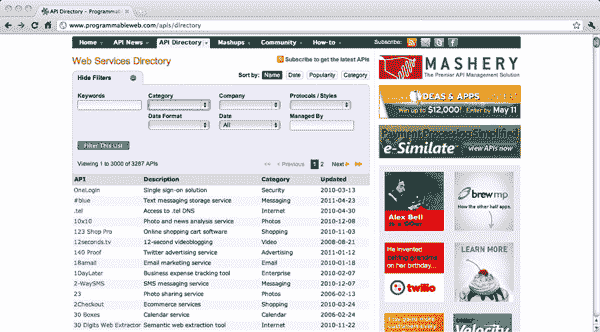

**图 1–1。** *可编程 Web API 目录*

许多想要为多个平台开发移动应用的公司要么拥有自己的 web 服务，要么依赖于其他 web 服务。虽然 PhoneGap 可以用于独立的移动应用，但它非常适合使用 web 服务的移动应用。原因是 PhoneGap 应用主要是增加了设备功能的 web 应用。想象一下，一个 Flickr web 应用可以访问设备的摄像头或 Google Maps 应用，而后者又可以访问 GPS。另一个例子是 Foursquare，它可以访问你的 GPS，以及你手机的通讯录。

这或多或少意味着大多数基于 PhoneGap 的应用将使用 JavaScript 访问 web 服务。这使得使用 PhoneGap 的开发人员掌握使用 web 服务变得非常重要。

对于读过这本书后想要编写 PhoneGap 应用的开发人员，我建议在 ProgrammableWeb.com 上找到一些 web 服务，并为这些服务编写一个 PhoneGap 客户端作为练习。

这本书将提供一个这样的服务的例子；也就是 AlternativeTo.Net。

### 移动应用概述

虽然你们中的许多人至少有一些使用移动应用的经验，但你们中的许多人更熟悉非移动平台(例如，web 平台)。因此，这本书明确论述了移动应用的本质以及与之相关的挑战。如果您来自非移动背景，这将有助于您理解开发移动应用意味着什么。

#### 移动应用功能

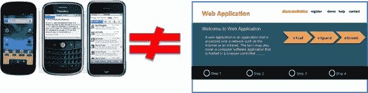

**图 1–2。** *移动应用不是 web 应用。*

首先要注意的是，移动应用不是 web 应用。区别在于特性的性质和所提供的特性数量(参见[图 1–3](#fig_1_3))。

*   移动应用的功能可能会更少。
*   您可以期待您的移动应用看起来与您的 web 应用非常不同。首先，智能手机的屏幕大小与桌面不同。在 web 应用中，屏幕越大，你就有越多的空间来放置菜单、工具栏和小部件。
    *   考虑到智能手机的屏幕尺寸限制，你会看到更多仪表板类型的主屏幕。
    *   智能手机用户需要通过不同级别的导航来找到他或她想要使用的功能。
*   智能手机用户和网络用户有不同的意图。智能手机用户希望在旅途中使用应用，以最少的努力获得最大的生产力，而网络用户可能会花更多的时间使用网络应用。

由于上述差异，您将看到智能手机上最具生产力(或最常用)的功能被突出显示。无论移动应用提供所有的功能，还是其中的一个子集，这些小的生产(和最频繁使用的)功能集将在移动应用上以最容易访问的方式进行组织。

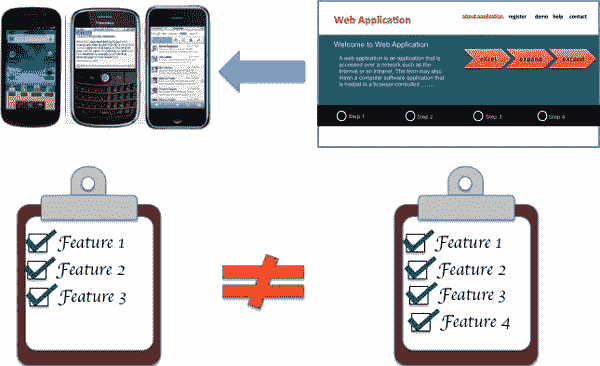

**图 1–3。** *移动功能与网络应用功能不同。*

#### 用户互动

相对于传统的 web 应用，用户与移动应用交互的方式非常不同(参见[Figure 1–4](#fig_1_4))。

随着智能手机的触摸屏功能和更加生动的用户交互，基于加速度计和指南针，移动应用必须以不同的方式构建。

想象一个汽车游戏应用，通过向左或向右倾斜手机来操纵汽车。这是基于加速度计。想象一个地图应用，当用户改变他或她的方向时，它总是指向北方。这是基于一个指南针。

虽然与应用交互的新方式增强了用户体验，但新的移动平台上缺少物理键盘给 power keyboard 用户增加了一些额外的限制。在详细阐述移动应用需求时，需要考虑到这一点。

除此之外，智能手机有两种显示模式:布局和纵向；这些在早期的浏览器中是闻所未闻的。记录需求规格的一个重要部分是定义当设备处于纵向或横向模式时应用的外观、感觉和行为。

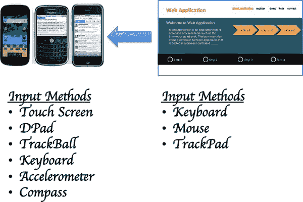

**图 1–4。** *智能手机和网络应用有不同的用户输入界面。*

#### 位置感知

位置感知是智能手机与生俱来的功能。谷歌地图、本地搜索、Foursquare 和许多其他移动应用都利用了智能手机的精密 GPS。Web 应用也使用位置感知；然而，这些应用使用相对更粗粒度的 GPS 系统(例如，国家级)(见[图 1–5](#fig_1_5))。

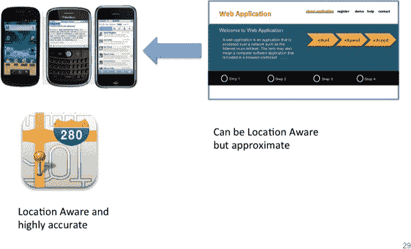

**图 1–5。** *与网络应用相比，智能手机应用的位置感知能力*

#### 推送通知

应用用户喜欢收到有用事件的通知，比如收到的电子邮件和消息。智能手机是最好的通知平台，因为它几乎无时无刻不在用户身边。

除了收到电子邮件或信息等通知，任何服务都可以向智能手机用户发送通知(见[图 1–6](#fig_1_6))。考虑一个组织的工作流程。用户不必总是登录 web 应用来完成涉及他或她的工作流，应用通知用户他或她需要执行某个操作来完成工作流会更有效率。这样，无论用户是否靠近笔记本电脑或台式机，他/她都可以始终高效地工作。

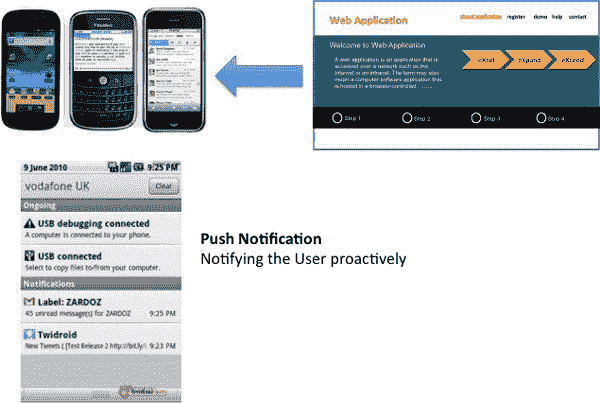

**图 1–6。** *智能手机的推送通知功能(移动通知)*

### 跨平台移动应用开发的挑战

虽然移动应用的开发令人兴奋，但考虑到移动操作系统(OS)数量的不断增长，开发移动应用会面临许多挑战。

让我们来看看这些挑战。

#### OS 碎片化

碎片化增加的趋势与移动平台数量的增长相一致(参见[图 1–7](#fig_1_7))。首先是黑莓和塞班智能手机，然后是强大的 iPhone 和 Android 平台。可以肯定的是，移动平台并没有就此止步。惠普随 WebOS 而来；微软推出了 Windows 7 手机；而现在，三星要出 Bada 了。

这意味着公司必须不断推出新产品，让所有移动平台都能感受到它们的存在。

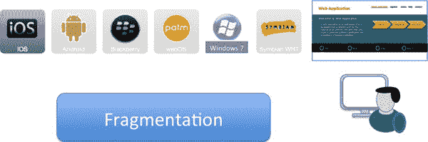

**图 1–7。** *由于移动操作系统数量的增长而导致的碎片化*

假设你想开发一个移动应用，目标是 iPhone，Android，BlackBerry 等。由于每个移动平台的操作系统不同，请考虑以下因素:

*   首先，你必须为每个平台设置不同的环境。
*   第二，你需要对每个操作系统有一点专业知识。对于移动开发者来说，学习曲线可能会很长。
*   不同的移动平台需要不同的编程语言。
*   你需要熟悉每个移动平台支持的特性；参见[图 1–10](#fig_1_10)。

表 1-1 描述了移动应用开发所需的设置(针对各种移动平台)。

过去，我们已经看到过类似的操作系统碎片化，从 Windows、Linux 和 Mac 的跨桌面碎片化开始，随着 Sun 推出 Java，这一问题得到了解决。在更近的过去，我们面临浏览器碎片，这是通过跨浏览器 JavaScript 框架如 jquery、YUI 和 Google Web Toolkit 解决的。

移动操作系统碎片是所有碎片中最糟糕和最多样化的。这为在所有移动平台上启动移动应用增加了相当大的技术挑战。

#### 多个团队/产品

如果我们选择使用多个团队为每个平台构建一个移动应用，我们会面临许多问题；增加团队会增加项目交付的风险；增加产品意味着产品管理团队承担更多责任(参见[图 1–8](#fig_1_8))。由于所有移动平台上的功能也是分散的，产品管理人员必须对每个平台上的产品提出具体要求。

最终，增加更多的团队，增加多个团队之间的协调，以及增加多个产品将导致管理和开发团队的额外开销。

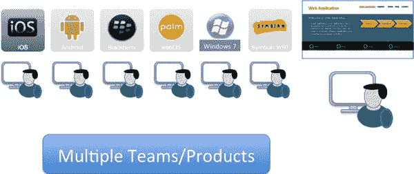

**图 1–8**。*为不同的移动操作系统增加多个团队带来了新的问题。*

#### 一致的用户体验

鉴于您希望您的应用在多个移动平台上保持一致，您的应用需要在所有平台上提供相似且一致的用户体验(参见[Figure 1–9](#fig_1_9))。这也与您的最终用户可能从一个平台迁移到另一个平台有关，或者他们可能存在于多个平台上。考虑一个拥有 Android 智能手机和 iPhone iPad 的用户。用户可以在家或在办公室使用 iPad，也可以在外出时使用 Android 智能手机。

这是你的应用必须提供跨移动平台的相似用户体验的众多原因之一；当然，由于设备特性和功能的分散，用户体验会因移动平台而有所不同。

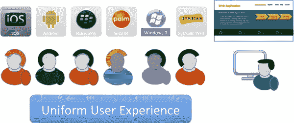

**图 1–9。** *为跨平台的应用最终用户提供统一的用户体验*

#### 特征碎片化

设备特性和功能因平台而异(参见[图 1–10](#fig_1_10))。这意味着，虽然一些机器人和 iPhones 有嵌入式指南针来显示方向，但其他智能手机没有。这可能意味着其他智能手机上的导航应用可能无法像 Android 或 iPhone 应用那样旋转地图。

总的来说，同一个应用在一些移动平台上会关闭一些功能，这是事实；应用的逻辑需要以这种方式编写。

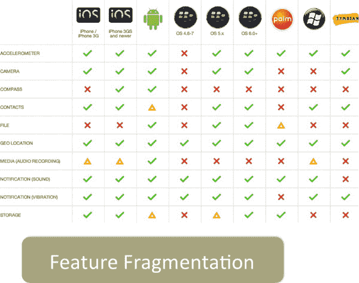

**图 1–10。** *针对不同移动操作系统的特性碎片化*

#### 开发环境碎片化

开发环境是一个特别重要的片段。如果您想开发一个面向以下平台的移动应用，您至少需要两个操作系统:Windows(最好是 Windows 7)和 Mac(最好是 Leopard ):

1.  ios
2.  机器人
3.  黑莓
4.  WebOS
5.  智能移动终端操作系统
6.  Windows 7

此外，您将不得不使用各种 ide 和编程语言，如 Java、C++和 Objective C。此外，您将使用许多 ide，如 Xcode 和 Eclipse。

[表 1-1](#tab_1_1) 显示了开发环境的要求(针对各种移动平台)。

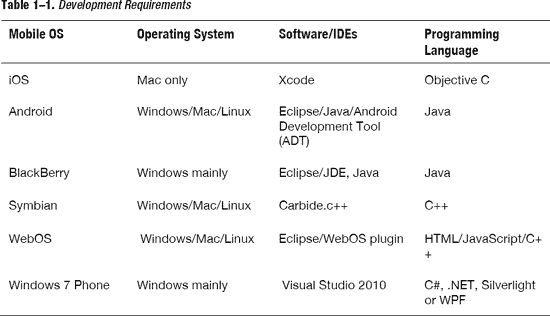

### PhoneGap 的跨平台移动应用战略

PhoneGap 之所以成为可能，是因为所有移动平台之间的共性。如果没有这个通用组件，PhoneGap 就不可能存在。

#### 浏览器组件作为通用平台

直到几年前，浏览器世界还很分散。当时，不同的浏览器在不同程度上遵循 W3C 标准。Firefox 和 Safari 浏览器在遵守标准方面走在了前列，而其他浏览器则落在了后面。

从那以后，很多事情都变了。现在，浏览器在遵守标准方面看起来更好了(在移动平台上更是如此)。这也是事实，因为大多数现代移动平台都有相同的基于 webkit 的浏览器。

此外，桌面和智能手机上的新浏览器已经开始遵循 HTML5/CSS3 等新标准。这为浏览器世界增加了更多功能，减少了移动平台之间的碎片化(参见[图 1–11](#fig_1_11))。

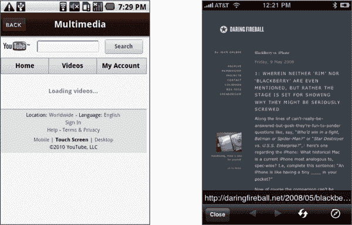

**图 1–11。** *手机浏览器*

我们来看[表 1-2](#tab_1_2) ，表中列出了移动平台及其对应的浏览器平台。如你所见，除了 Windows 7 手机，所有的移动平台都使用基于 webkit 的浏览器。虽然 Windows 7 手机有自己的浏览器，但好消息是，这里列出的所有浏览器都已经遵守 HTML5/CSS3 标准，随着时间的推移，它们的遵守程度将继续提高。

T2】

PhoneGap 使用这些现代浏览器作为构建基于 HTML5/CSS3 的应用的平台。把所有 PhoneGap 应用想象成具有嵌入式浏览器并运行这些基于 HTML5/CSS3 的应用。

#### 移动应用网页浏览量

所有这些移动平台都支持在应用中嵌入浏览器。这意味着移动应用的一个屏幕实际上可以是一个显示 HTML 页面的浏览器。

这些嵌入式浏览器通常被称为*网络视图*。这意味着您可以将应用的一个屏幕定义为 webview。

假设您的应用有一个名为“关于我们”的屏幕“关于我们”屏幕显示贵公司的信息。现在，让我们假设，例如，关于贵公司的“关于我们”的信息经常改变。您的移动应用的要求之一是显示最新的“关于我们”的信息。因此，您可以显示一个指向贵公司“关于我们”页面的 webview，而不是显示一个硬编码的“关于我们”屏幕(最好是网页的移动版本)。它将从网上加载“关于我们”页面。此外，webview 可用于加载和显示本地存储在移动设备上的 HTML 页面。我们可以进一步发展这个概念:我们可以显示与 web 服务交互的基于 Ajax 的 web 页面，而不是静态 web 页面。

#### 本机挂钩暴露设备能力

既然我们知道浏览器可以嵌入到 web 应用中，让我们把注意力转移到通过这些嵌入式浏览器来公开设备功能上。

假设您正在开发一个基于 Flickr API 的 Flickr 应用。在这些 API 的帮助下，你可以登录 Flickr，列出图库，下载和展示你的图片。

虽然这对于 web 应用来说是一个好主意，但是当我们在手机上显示相同的应用时，请记住手机通常有一个摄像头。允许 Flickr 应用从相机中拍摄一张照片并上传到 Flickr 是非常合理的。

为了做到这一点，我们可以让嵌入式浏览器(或 webview)公开 JavaScript API，当调用该 API 时，它会让相机拍摄一张照片，并将该照片的二进制数据返回给我们(参见[图 1–12](#fig_1_12))。

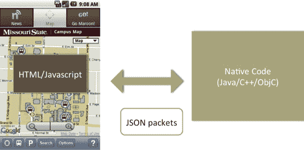

**图 1–12。** *JavaScript 到本地通信，反之亦然*

从技术上讲，所有这些平台都支持在 webview 中将本机模块暴露给 JavaScript。这意味着，从程序上讲，所有这些平台都允许 JavaScript 代码调用本地 Java/C++/Objective C 代码，反之亦然。

让我们看一个例子。我们的 webview 有一个 HTML 页面，显示的是谷歌地图。我们希望根据手机的 GPS 位置将地图居中。为了做到这一点，我们需要编写一个本地组件，向设备查询 GPS 位置。

然后，我们编写代码，从 webview 中公开这个本机模块。webview 中的 JavaScript 代码调用此代码来访问 GPS 坐标。一旦代码获得了 GPS 坐标，它就相应地将地图居中。这是 PhoneGap 框架背后的主要原则。

#### HTML5 和 CSS3:编写应用的标准

HTML5 和 CSS3 是新兴的 web 技术。他们使网络应用更具交互性，功能更丰富。

HTML5 不仅为更强大的多媒体支持增加了新的标记；它还增加了一些特性，比如用于后台处理的 web worker、离线支持、数据库支持等等。

CSS3 是无缝、丰富的用户界面(UI)的新标准。设计师被要求在按钮或边框上制作简单的圆角或渐变的日子已经一去不复返了。有了 CSS3，事情变得更容易、更快、更好。

有了对动画的支持，CSS3 站点现在可以与基于 flash 的站点竞争了。不仅如此，只需更改 CSS 文件，门户网站就可以轻松地转换为移动网站。此外，打印预览现在可以实现不同的 CSS 文件。

众所周知，移动浏览器是 W3C 标准的早期采用者。这意味着手机是 HTML5/CSS3 应用的合适平台。

#### 单一原产地政策不适用

对于那些使用过基于 Ajax 的应用的人来说，你知道托管在“abc.com”上的 web 应用不能对托管在“xyz.com”上的 web 服务进行 Ajax 调用。这意味着如果有人正在开发一个基于 Ajax 的应用，比如托管在 myphotobook.com 上，他或她将不能对 flickr.com 进行 Ajax 调用。

这被称为*单一原产地政策*——你可以在`[http://en.wikipedia.org/wiki/Same_origin_policy](http://en.wikipedia.org/wiki/Same_origin_policy)`进一步了解单一原产地政策。

对于 PhoneGap 应用来说，情况并非如此。PhoneGap 应用捆绑了所需的 HTML、JavaScript 和 CSS 文件，PhoneGap 应用没有像“abc.com”这样的域。这使得 PhoneGap 成为一个易于开发混搭的平台，可以自由地对各种其他站点进行 Ajax 调用。

想象一下，您的 PhoneGap 应用将脸书、Twitter 和 Flickr 集成到一个 mashup 中，只需要几行 JavaScript 代码。

这使得 PhoneGap 成为为在 programmableweb.com 上市的网络服务创建移动应用的理想平台。

这些限制在[图 1–13](#fig_1_13)中说明:

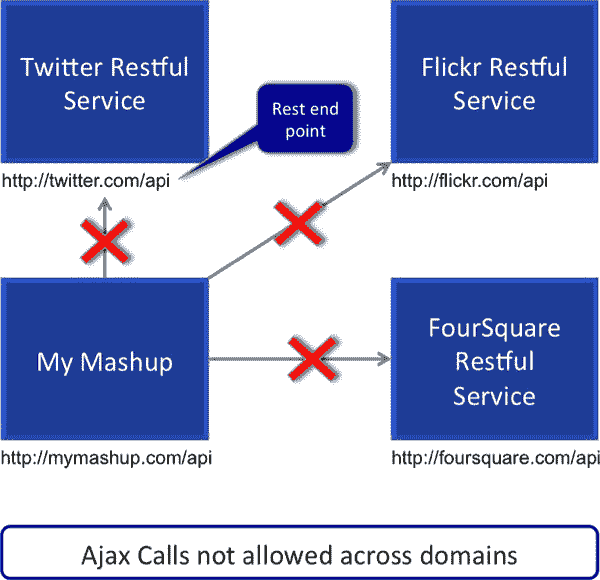

**图 1–13。** *单一原产地政策*

#### 结论

PhoneGap 使用 HTML5、JavaScript 和 CSS3 来开发移动应用。这些是网络世界的标准技术。通过使用 PhoneGap，很少或没有母语背景的开发人员可以开始为所有流行的移动平台开发移动应用。

尽管 PhoneGap 提供了对移动应用标准原生功能的访问，但它的插件框架足够灵活，可以根据需要扩展和添加新功能。

PhoneGap 是一项正在发展的技术，用于开发跨移动平台应用。